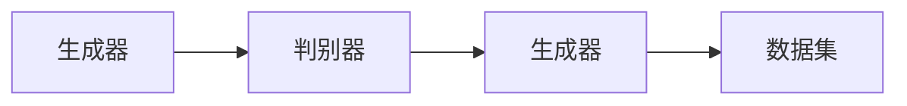

                 

# 《LLM生态系统：绘制AI产业的未来蓝图》

## 关键词
AI大模型、预训练、深度学习、语言处理、计算机视觉、自然语言生成、商业化应用、产业布局、技术趋势、社会影响

## 摘要
本文旨在深入探讨AI大模型（Large Language Model，简称LLM）的生态系统，从历史、现状、核心概念、应用领域、发展趋势、核心技术等多个角度，全面解析LLM在AI产业中的关键作用和未来前景。通过分析LLM在语言处理、计算机视觉、自然语言生成等领域的应用，以及其在商业化进程中的挑战和机遇，本文旨在绘制一幅AI产业的未来蓝图，为行业从业者提供有益的参考和指导。

---

## 目录大纲

### 第一部分: AI大模型基础

#### 第1章: AI大模型概述

##### 1.1 AI大模型的历史与现状
###### 1.1.1 AI大模型的发展历程
###### 1.1.2 AI大模型在产业中的应用现状
###### 1.1.3 AI大模型的核心价值

##### 1.2 AI大模型的基本概念
###### 1.2.1 AI大模型的基本定义
###### 1.2.2 AI大模型的核心特点
###### 1.2.3 AI大模型与传统AI的对比

##### 1.3 AI大模型的应用领域
###### 1.3.1 语言处理领域
###### 1.3.2 计算机视觉领域
###### 1.3.3 自然语言生成领域

##### 1.4 AI大模型的发展趋势
###### 1.4.1 技术发展趋势
###### 1.4.2 产业发展趋势
###### 1.4.3 应用趋势

#### 第2章: AI大模型核心技术

##### 2.1 深度学习基础
###### 2.1.1 神经网络基础
###### 2.1.2 深度学习算法
###### 2.1.3 深度学习优化

##### 2.2 自然语言处理
###### 2.2.1 词嵌入技术
###### 2.2.2 序列模型与注意力机制
###### 2.2.3 转换器架构详解

##### 2.3 大规模预训练模型
###### 2.3.1 预训练的概念与意义
###### 2.3.2 自监督学习方法
###### 2.3.3 迁移学习与微调技术

##### 2.4 计算机视觉
###### 2.4.1 图像处理基础
###### 2.4.2 目标检测与分割
###### 2.4.3 图像生成与风格迁移

### 第二部分: AI大模型应用

#### 第3章: 语言处理领域应用

##### 3.1 语言生成
###### 3.1.1 生成文本的基础
###### 3.1.2 生成文本的应用
###### 3.1.3 生成文本的挑战与解决方案

##### 3.2 语言理解
###### 3.2.1 理解文本的基础
###### 3.2.2 理解文本的应用
###### 3.2.3 理解文本的挑战与解决方案

##### 3.3 语言交互
###### 3.3.1 交互基础
###### 3.3.2 交互应用
###### 3.3.3 交互挑战与解决方案

#### 第4章: 计算机视觉领域应用

##### 4.1 图像识别
###### 4.1.1 图像识别基础
###### 4.1.2 图像识别应用
###### 4.1.3 图像识别挑战与解决方案

##### 4.2 目标检测
###### 4.2.1 目标检测基础
###### 4.2.2 目标检测应用
###### 4.2.3 目标检测挑战与解决方案

##### 4.3 语义分割
###### 4.3.1 语义分割基础
###### 4.3.2 语义分割应用
###### 4.3.3 语义分割挑战与解决方案

#### 第5章: 自然语言生成领域应用

##### 5.1 文本生成
###### 5.1.1 文本生成基础
###### 5.1.2 文本生成应用
###### 5.1.3 文本生成挑战与解决方案

##### 5.2 对话系统
###### 5.2.1 对话系统基础
###### 5.2.2 对话系统应用
###### 5.2.3 对话系统挑战与解决方案

##### 5.3 内容摘要
###### 5.3.1 内容摘要基础
###### 5.3.2 内容摘要应用
###### 5.3.3 内容摘要挑战与解决方案

#### 第6章: AI大模型商业化应用

##### 6.1 商业化模式
###### 6.1.1 AI大模型商业化路径
###### 6.1.2 成功案例分析
###### 6.1.3 商业化挑战与解决方案

##### 6.2 产业应用场景
###### 6.2.1 各行业应用场景分析
###### 6.2.2 AI大模型在不同领域的创新应用
###### 6.2.3 应用场景的挑战与解决方案

#### 第7章: AI大模型发展的未来展望

##### 7.1 技术趋势
###### 7.1.1 AI大模型的技术发展趋势
###### 7.1.2 未来可能的技术突破
###### 7.1.3 技术趋势对产业的影响

##### 7.2 社会影响
###### 7.2.1 AI大模型对社会的影响
###### 7.2.2 伦理道德与隐私问题
###### 7.2.3 社会影响的应对策略

##### 7.3 产业布局
###### 7.3.1 全球AI大模型产业布局
###### 7.3.2 我国AI大模型产业发展现状
###### 7.3.3 未来产业布局的方向与挑战

#### 参考文献

#### 附录

##### A.1 AI大模型开发工具与资源
###### A.1.1 主流深度学习框架对比
###### A.1.2 AI大模型训练与部署工具
###### A.1.3 相关文献与资料推荐

##### A.2 AI大模型项目案例
###### A.2.1 案例一：某企业AI大模型应用案例
###### A.2.2 案例二：某初创公司AI大模型应用案例
###### A.2.3 案例三：AI大模型在医疗领域的应用案例

---

现在，我们将开始深入探讨AI大模型的基础，包括其历史、现状、核心概念和应用领域。通过逐步分析，我们将绘制出AI产业的未来蓝图。

### 第一部分: AI大模型基础

#### 第1章: AI大模型概述

##### 1.1 AI大模型的历史与现状

###### 1.1.1 AI大模型的发展历程

AI大模型的发展历程可以追溯到20世纪50年代，当时的人工智能研究主要集中在规则推理和知识表示上。随着计算机性能的提升和算法的进步，20世纪80年代至90年代，基于统计学习方法的自然语言处理（NLP）技术逐渐兴起，如统计机器翻译和基于模板的文本生成。然而，由于数据量有限和计算资源匮乏，这些模型的规模相对较小。

进入21世纪，随着深度学习技术的突破和计算资源的增长，AI大模型迎来了新的发展机遇。2012年，AlexNet在ImageNet竞赛中取得的显著成果标志着深度学习时代的到来。随后，基于深度学习的自然语言处理技术，如词嵌入和序列模型，逐渐成熟。2018年，GPT-2的发布标志着AI大模型在语言处理领域的重大突破。

近年来，AI大模型在各个领域取得了显著的进展，如BERT在文本理解任务中取得了领先成绩，GANs在图像生成和风格迁移中展示了强大的能力。这些模型的出现不仅改变了AI产业的格局，也为各行各业带来了新的机遇和挑战。

###### 1.1.2 AI大模型在产业中的应用现状

目前，AI大模型在多个领域取得了广泛应用，尤其在语言处理、计算机视觉和自然语言生成等领域。在语言处理方面，AI大模型被广泛应用于机器翻译、文本生成、对话系统等领域，如OpenAI的GPT系列模型和谷歌的BERT模型。在计算机视觉方面，AI大模型被用于图像识别、目标检测、语义分割等领域，如谷歌的Inception模型和Facebook的GAN模型。在自然语言生成方面，AI大模型被用于自动写作、内容摘要、对话系统等领域，如OpenAI的GPT系列模型和谷歌的BERT模型。

此外，AI大模型在医疗、金融、零售、教育等领域的应用也越来越广泛。例如，在医疗领域，AI大模型可以用于疾病诊断、医学图像分析、药物研发等领域；在金融领域，AI大模型可以用于股票预测、信用评分、欺诈检测等领域；在零售领域，AI大模型可以用于推荐系统、库存管理、客户服务等领域。

###### 1.1.3 AI大模型的核心价值

AI大模型的核心价值体现在以下几个方面：

1. **强大的数据处理能力**：AI大模型可以通过大规模的数据训练，获得强大的数据处理和知识表示能力，从而在复杂任务中表现出色。

2. **跨领域的通用性**：AI大模型通常具有较强的通用性，可以在多个领域进行迁移和应用，从而降低研发成本和缩短研发周期。

3. **提高生产效率**：AI大模型可以自动化完成许多重复性、繁琐的工作，从而提高生产效率和降低人力成本。

4. **创新业务模式**：AI大模型的出现为各行各业带来了新的业务模式和商业机会，如智能客服、智能推荐、智能诊断等。

##### 1.2 AI大模型的基本概念

###### 1.2.1 AI大模型的基本定义

AI大模型（Large Language Model，简称LLM）是指具有大规模参数和训练数据，能够进行高效文本生成、理解和交互的人工智能模型。这些模型通常基于深度学习技术，通过大规模数据预训练和精细化调整，实现了对自然语言的高度理解和生成能力。

###### 1.2.2 AI大模型的核心特点

1. **大规模参数**：AI大模型通常具有数十亿甚至千亿级别的参数，这使得它们能够对复杂的语言现象进行建模。

2. **大规模数据预训练**：AI大模型通常在大量数据上进行预训练，从而获得强大的数据理解和知识表示能力。

3. **通用性**：AI大模型具有较强的通用性，可以在多个领域进行迁移和应用。

4. **动态调整能力**：AI大模型可以通过微调技术，针对特定任务进行精细化调整，从而提高任务性能。

5. **高效性**：AI大模型通过并行计算和优化算法，能够在短时间内完成大规模数据处理和模型推理。

###### 1.2.3 AI大模型与传统AI的对比

传统AI通常基于规则推理和特征工程，具有以下特点：

1. **基于规则推理**：传统AI依赖于人工设计规则和特征，难以应对复杂和变化多端的任务。

2. **特征工程**：传统AI需要大量的人工特征工程，从而降低模型的泛化能力和扩展性。

3. **有限的数据集**：传统AI通常依赖有限的数据集进行训练，难以应对大规模数据的挑战。

相比之下，AI大模型具有以下优势：

1. **强大的数据处理能力**：AI大模型通过大规模数据预训练，获得了强大的数据理解和知识表示能力。

2. **通用性**：AI大模型具有较强的通用性，可以在多个领域进行迁移和应用。

3. **动态调整能力**：AI大模型可以通过微调技术，针对特定任务进行精细化调整，从而提高任务性能。

4. **高效性**：AI大模型通过并行计算和优化算法，能够在短时间内完成大规模数据处理和模型推理。

##### 1.3 AI大模型的应用领域

###### 1.3.1 语言处理领域

在语言处理领域，AI大模型被广泛应用于自然语言生成、语言理解、对话系统等领域。例如，自然语言生成（NLG）技术可以用于自动写作、内容摘要、智能客服等场景；语言理解（NLU）技术可以用于语音助手、智能客服、智能诊断等场景；对话系统（Conversational AI）可以用于智能客服、语音助手、聊天机器人等场景。

主要应用包括：

1. **自动写作**：AI大模型可以自动生成新闻文章、商业报告、科技论文等，从而降低内容创作成本。

2. **内容摘要**：AI大模型可以自动提取文本的核心内容，生成简洁明了的摘要，提高信息获取效率。

3. **智能客服**：AI大模型可以模拟人类对话，自动回答用户的问题，从而提高客户服务效率。

4. **语音助手**：AI大模型可以识别和理解用户的语音指令，执行相应的任务，如播放音乐、设定提醒等。

5. **智能诊断**：AI大模型可以分析医疗文本，为医生提供诊断建议，从而提高诊断准确率。

###### 1.3.2 计算机视觉领域

在计算机视觉领域，AI大模型被广泛应用于图像识别、目标检测、语义分割等领域。例如，图像识别技术可以用于人脸识别、物体检测、场景分类等场景；目标检测技术可以用于无人驾驶、智能监控、图像分割等场景；语义分割技术可以用于图像分类、目标识别、图像增强等场景。

主要应用包括：

1. **图像识别**：AI大模型可以自动识别图像中的物体和场景，从而提高图像分析效率。

2. **目标检测**：AI大模型可以在图像中实时检测目标物体，从而提高无人驾驶、智能监控等场景的安全性。

3. **语义分割**：AI大模型可以对图像进行精细分割，从而提高图像识别和目标检测的准确率。

4. **图像生成**：AI大模型可以自动生成图像，从而提高图像处理和计算机动画的效率。

5. **图像增强**：AI大模型可以通过图像增强技术，提高图像的质量和清晰度，从而提高图像分析的效果。

###### 1.3.3 自然语言生成领域

在自然语言生成领域，AI大模型被广泛应用于文本生成、对话系统、内容摘要等领域。例如，文本生成技术可以用于自动写作、自动翻译、自动摘要等场景；对话系统技术可以用于智能客服、语音助手、聊天机器人等场景；内容摘要技术可以用于新闻摘要、报告摘要、邮件摘要等场景。

主要应用包括：

1. **自动写作**：AI大模型可以自动生成新闻文章、商业报告、科技论文等，从而降低内容创作成本。

2. **自动翻译**：AI大模型可以实现实时翻译，从而提高跨语言沟通的效率。

3. **自动摘要**：AI大模型可以自动提取文本的核心内容，生成简洁明了的摘要，从而提高信息获取效率。

4. **对话系统**：AI大模型可以模拟人类对话，自动回答用户的问题，从而提高客户服务效率。

5. **智能客服**：AI大模型可以自动处理用户的咨询和投诉，从而提高客户服务质量。

##### 1.4 AI大模型的发展趋势

###### 1.4.1 技术发展趋势

随着深度学习和大数据技术的不断发展，AI大模型在技术层面将继续朝着以下几个方向发展：

1. **模型规模扩大**：随着计算资源的增长，AI大模型的规模将不断扩大，从而提高模型的性能和泛化能力。

2. **算法优化**：通过优化算法，降低模型的计算复杂度和训练时间，提高模型的可解释性和可靠性。

3. **多模态融合**：将图像、声音、文本等多模态数据进行融合，从而提高模型在复杂任务中的性能。

4. **迁移学习与微调**：通过迁移学习和微调技术，提高模型在不同领域的应用效率和性能。

5. **联邦学习**：通过联邦学习技术，实现数据隐私保护下的模型训练和优化。

###### 1.4.2 产业发展趋势

随着AI大模型技术的不断发展，其在各个行业的应用也将越来越广泛，从而推动整个产业的发展。以下是一些产业发展趋势：

1. **行业应用拓展**：AI大模型将在医疗、金融、零售、教育等各个行业得到广泛应用，从而推动产业升级和业务模式创新。

2. **商业化进程加快**：随着AI大模型技术的成熟，越来越多的企业和创业者将进入这一领域，推动商业化进程。

3. **数据资源整合**：为了提高模型的性能和泛化能力，将需要更多的数据资源，从而推动数据资源的整合和共享。

4. **产业链完善**：随着AI大模型技术的快速发展，将需要更多的产业链支持和协作，从而推动产业链的完善。

###### 1.4.3 应用趋势

随着AI大模型技术的不断发展，其在各个领域的应用也将呈现出以下趋势：

1. **智能化提升**：AI大模型将不断提高智能化水平，从而实现更智能的决策和操作。

2. **交互性增强**：AI大模型将增强与用户的交互性，从而实现更自然的互动和沟通。

3. **个性化服务**：AI大模型将根据用户的需求和偏好，提供个性化的服务和解决方案。

4. **实时响应**：AI大模型将实现实时响应，从而提高系统效率和用户体验。

5. **跨界融合**：AI大模型将在不同领域实现跨界融合，从而推动各行各业的创新发展。

### 第二部分: AI大模型核心技术

#### 第2章: AI大模型核心技术

##### 2.1 深度学习基础

###### 2.1.1 神经网络基础

神经网络是深度学习的基础，其核心思想是模拟人脑的神经元结构和信息处理过程。一个简单的神经网络通常由输入层、隐藏层和输出层组成。输入层接收外部输入数据，隐藏层对输入数据进行处理和变换，输出层生成最终输出结果。

神经网络的工作原理是通过前向传播和反向传播两个步骤。在前向传播过程中，输入数据从输入层经过隐藏层传递到输出层，每个节点将接收前一层的输出并进行非线性变换。在反向传播过程中，根据输出层的误差，通过梯度下降算法调整每个节点的权重，从而优化模型参数。

以下是神经网络的基础伪代码：

```python
# 前向传播
def forward_pass(input_data, weights, bias):
    hidden_layer_output = []
    for layer in hidden_layers:
        output = activation_function(np.dot(input_data, weights) + bias)
        hidden_layer_output.append(output)
    output_layer_output = activation_function(np.dot(hidden_layer_output[-1], weights_output) + bias_output)
    return output_layer_output

# 反向传播
def backward_pass(output_layer_output, expected_output, weights, bias):
    error = output_layer_output - expected_output
    d_output_layer = derivative(activation_function)(output_layer_output)
    for layer in reversed(hidden_layers):
        d_hidden_layer = derivative(activation_function)(layer_output)
        error = d_hidden_layer * error
        weights -= learning_rate * np.dot(hidden_layer_output[-1].T, error)
        bias -= learning_rate * error
        hidden_layer_output = layer_output
```

其中，`activation_function`用于非线性变换，`derivative`用于计算激活函数的导数。

###### 2.1.2 深度学习算法

深度学习算法主要包括卷积神经网络（CNN）、循环神经网络（RNN）和生成对抗网络（GAN）等。

1. **卷积神经网络（CNN）**

卷积神经网络是深度学习中应用最广泛的网络之一，主要用于图像处理和计算机视觉任务。CNN通过卷积层和池化层对图像数据进行特征提取和降维，从而实现图像分类、目标检测和语义分割等任务。

以下是CNN的基本架构：


2. **循环神经网络（RNN）**

循环神经网络是处理序列数据的一种有效方法，其核心思想是引入循环结构，使得当前节点的输出可以反馈到前一节点，从而实现长期依赖关系的建模。RNN通过隐藏状态和门控机制（如LSTM和GRU）来避免梯度消失和爆炸问题。

以下是RNN的基本架构：


3. **生成对抗网络（GAN）**

生成对抗网络是由生成器和判别器组成的对抗性模型，通过相互博弈的过程来学习数据的分布。生成器试图生成与真实数据相似的数据，判别器则试图区分真实数据和生成数据。通过优化生成器和判别器的损失函数，GAN可以生成高质量的图像和音频。

以下是GAN的基本架构：



###### 2.1.3 深度学习优化

深度学习优化是指通过调整模型参数，提高模型性能的过程。常用的优化方法包括梯度下降、随机梯度下降、Adam优化器等。

1. **梯度下降**

梯度下降是一种最简单的优化方法，其核心思想是通过计算损失函数关于模型参数的梯度，并沿着梯度的反方向更新参数，从而最小化损失函数。

以下是梯度下降的基本伪代码：

```python
# 计算梯度
def compute_gradient(loss, parameters):
    gradients = []
    for parameter in parameters:
        gradients.append(np.dot(parameter.T, loss))
    return gradients

# 更新参数
def update_parameters(parameters, gradients, learning_rate):
    for i in range(len(parameters)):
        parameters[i] -= learning_rate * gradients[i]
    return parameters
```

2. **随机梯度下降（SGD）**

随机梯度下降是梯度下降的一种改进方法，其核心思想是在每个训练样本上计算梯度，并更新参数。SGD可以加快收敛速度，但可能导致模型振荡。

3. **Adam优化器**

Adam优化器是一种自适应的优化方法，其结合了SGD和动量法的优点，通过自适应调整学习率，提高模型收敛速度。

```python
# 初始化
v = 0
s = 0

# 更新
v = beta1 * v + (1 - beta1) * gradient
s = beta2 * s + (1 - beta2) * (gradient ** 2)
m = beta1 * m + (1 - beta1) * gradient
n = beta2 * n + (1 - beta2) * (gradient ** 2)

# 计算更新
update = learning_rate * m / (np.sqrt(n) + epsilon)
parameters -= update
```

##### 2.2 自然语言处理

###### 2.2.1 词嵌入技术

词嵌入是将自然语言中的单词映射到高维空间中的向量表示。词嵌入技术通过捕捉单词之间的相似性和语义关系，提高了神经网络在自然语言处理任务中的性能。

1. **Word2Vec**

Word2Vec是一种常用的词嵌入技术，通过训练神经网络，将单词映射到高维空间中的向量表示。Word2Vec主要分为两种模型：连续词袋（CBOW）和Skip-Gram。

2. **GloVe**

GloVe是一种基于全局上下文的词嵌入技术，通过计算单词与其上下文之间的相似性，生成高质量的词向量。

```python
# 计算单词与其上下文之间的相似性
def compute_similarity(word, context):
    word_vector = embedding_matrix[word]
    context_vector = np.mean([embedding_matrix[context_word] for context_word in context], axis=0)
    similarity = cosine_similarity([word_vector], [context_vector])
    return similarity
```

3. **BERT**

BERT是一种基于Transformer的预训练词嵌入技术，通过在大量文本数据上进行预训练，生成高质量的词向量。BERT的核心思想是利用Transformer的自注意力机制，捕捉单词之间的复杂关系。

```python
# BERT预训练
def pretrain_bert(dataset, learning_rate, num_epochs):
    for epoch in range(num_epochs):
        for sentence in dataset:
            tokens = tokenizer.tokenize(sentence)
            input_ids = tokenizer.encode(tokens)
            mask_ids = [1 if i < len(input_ids) - 2 else 0 for i in range(len(input_ids))]
            padding_ids = [0] * (max_sequence_length - len(input_ids))
            input_ids += padding_ids
            mask_ids += padding_ids
            with tf.GradientTape() as tape:
                outputs = bert(input_ids, mask=mask_ids)
                logits = outputs.logits
                loss = compute_loss(logits, labels)
            gradients = tape.gradient(loss, bert.trainable_variables)
            optimizer.apply_gradients(zip(gradients, bert.trainable_variables))
        print(f"Epoch {epoch + 1}/{num_epochs}, Loss: {loss}")
```

###### 2.2.2 序列模型与注意力机制

序列模型是处理序列数据的一种有效方法，其核心思想是将序列数据编码为固定长度的向量表示。常见的序列模型包括循环神经网络（RNN）、长短时记忆网络（LSTM）和门控循环单元（GRU）。

注意力机制是一种用于序列模型中的机制，通过动态调整序列中每个元素的重要性，提高了模型在序列数据处理中的性能。

1. **RNN**

RNN是一种基于序列数据的神经网络，通过循环结构将当前节点的输出反馈到前一节点，实现了对长期依赖关系的建模。

2. **LSTM**

LSTM是一种改进的RNN，通过引入门控机制（遗忘门、输入门和输出门）来避免梯度消失和爆炸问题，提高了模型在序列数据处理中的性能。

3. **GRU**

GRU是一种简化版的LSTM，通过合并输入门和遗忘门，简化了模型结构，提高了训练速度。

4. **Transformer**

Transformer是一种基于自注意力机制的序列模型，通过多头注意力机制和位置编码，实现了对序列数据的全局依赖建模，取得了显著的效果。

```python
# Transformer模型
def transformer(input_sequence, hidden_size, num_heads, num_layers):
    input_embedding = embedding_matrix[input_sequence]
    outputs = []
    for i in range(num_layers):
        attention =多头注意力机制(input_embedding, input_embedding, input_embedding, hidden_size, num_heads)
        input_embedding = input_embedding + attention
        output =全连接层(input_embedding, hidden_size)
        outputs.append(output)
    return outputs[-1]
```

###### 2.2.3 转换器架构详解

转换器（Transformer）是一种基于自注意力机制的序列模型，通过多头注意力机制和位置编码，实现了对序列数据的全局依赖建模。转换器由编码器和解码器组成，编码器将输入序列编码为固定长度的向量表示，解码器则根据编码器的输出和已生成的目标序列生成预测序列。

以下是转换器的基本架构：


1. **多头注意力机制**

多头注意力机制是一种用于转换器中的机制，通过将输入序列分成多个头，每个头关注输入序列的不同部分，从而实现了对序列数据的全局依赖建模。

2. **位置编码**

位置编码是一种用于转换器中的机制，通过将位置信息编码到输入序列的向量表示中，实现了对序列中元素位置的关注。

3. **编码器**

编码器由多个编码层组成，每个编码层包括多头注意力机制和前馈神经网络。编码器的输出是一个固定长度的向量表示，用于生成目标序列。

4. **解码器**

解码器由多个解码层组成，每个解码层包括自注意力机制、多头注意力机制和前馈神经网络。解码器的输出是预测序列的概率分布。

5. **输出层**

输出层是一个全连接层，用于将解码器的输出转换为预测序列。

```python
# 编码器
def encoder(input_sequence, hidden_size, num_heads, num_layers):
    input_embedding = embedding_matrix[input_sequence]
    outputs = []
    for i in range(num_layers):
        attention =多头注意力机制(input_embedding, input_embedding, input_embedding, hidden_size, num_heads)
        input_embedding = input_embedding + attention
        output =全连接层(input_embedding, hidden_size)
        outputs.append(output)
    return outputs[-1]

# 解码器
def decoder(input_sequence, hidden_size, num_heads, num_layers):
    input_embedding = embedding_matrix[input_sequence]
    outputs = []
    for i in range(num_layers):
        attention =自注意力机制(input_embedding, input_embedding, input_embedding, hidden_size, num_heads)
        cross_attention =多头注意力机制(input_embedding, encoder_output, encoder_output, hidden_size, num_heads)
        input_embedding = input_embedding + attention + cross_attention
        output =全连接层(input_embedding, hidden_size)
        outputs.append(output)
    return outputs[-1]

# 输出层
def output_layer(decoder_output, output_size):
    logits =全连接层(decoder_output, output_size)
    return logits
```

##### 2.3 大规模预训练模型

###### 2.3.1 预训练的概念与意义

预训练是一种用于神经网络训练的技巧，其核心思想是在大规模数据集上进行预训练，从而获得对通用知识的理解和表示能力。预训练的意义在于：

1. **提高模型性能**：通过在大规模数据集上进行预训练，模型可以学习到丰富的语言知识和特征，从而提高模型在下游任务中的性能。

2. **降低训练成本**：预训练可以帮助模型在下游任务中快速收敛，降低模型训练的时间和成本。

3. **通用性**：预训练模型具有较强的通用性，可以在多个领域进行迁移和应用，从而降低研发成本和缩短研发周期。

4. **自适应调整**：预训练模型可以通过微调技术，针对特定任务进行精细化调整，从而提高任务性能。

###### 2.3.2 自监督学习方法

自监督学习方法是一种在大规模数据集上进行预训练的方法，其核心思想是利用数据中的无监督信息，如单词的上下文、图像中的物体和场景等，来训练模型。自监督学习方法包括以下几种：

1. **掩码语言模型（MLM）**

掩码语言模型是一种常用的自监督学习方法，其核心思想是在预训练过程中，对输入序列中的单词进行随机掩码，然后通过预测掩码单词来训练模型。

2. **掩码图像模型（MIM）**

掩码图像模型是一种用于图像处理的自监督学习方法，其核心思想是在预训练过程中，对输入图像中的物体或区域进行随机掩码，然后通过预测掩码区域来训练模型。

3. **预训练语言模型（PLM）**

预训练语言模型是一种基于文本数据的自监督学习方法，其核心思想是在大规模文本数据上进行预训练，从而获得对通用知识的理解和表示能力。

4. **预训练图像模型（PIM）**

预训练图像模型是一种基于图像数据的自监督学习方法，其核心思想是在大规模图像数据上进行预训练，从而获得对通用视觉知识的理解和表示能力。

###### 2.3.3 迁移学习与微调技术

迁移学习是一种利用预训练模型，在下游任务中进行微调的方法。其核心思想是将预训练模型的知识迁移到下游任务中，从而提高模型在下游任务中的性能。迁移学习的实现主要包括以下几种：

1. **预训练模型初始化**

预训练模型初始化是指将预训练模型的参数作为下游任务的初始参数，从而加快模型的收敛速度。

2. **微调训练**

微调训练是指通过对预训练模型进行微调，使其适应下游任务。微调训练主要包括以下步骤：

- **数据预处理**：对下游任务的数据进行预处理，如数据清洗、数据增强等。
- **训练模型**：使用预训练模型和下游任务的数据进行训练，通过调整模型参数，使其适应下游任务。
- **验证评估**：使用验证集对模型进行评估，调整模型参数，使其在验证集上达到最佳性能。

3. **超参数调整**

超参数调整是指调整模型训练过程中的超参数，如学习率、批量大小、训练次数等，以获得最佳模型性能。

4. **模型评估**

模型评估是指使用测试集对模型进行评估，从而确定模型在下游任务中的性能。常用的评估指标包括准确率、召回率、F1值等。

##### 2.4 计算机视觉

###### 2.4.1 图像处理基础

图像处理是计算机视觉的基础，其核心思想是通过对图像进行预处理、增强和变换，提高图像的质量和清晰度。图像处理主要包括以下几种技术：

1. **图像预处理**

图像预处理是指对原始图像进行预处理，如去噪、去雾、图像增强等，以提高图像的质量和清晰度。

2. **图像增强**

图像增强是指通过调整图像的亮度、对比度和色彩平衡等参数，增强图像的视觉效果，提高图像的可读性。

3. **图像变换**

图像变换是指通过将图像从一种坐标系统转换为另一种坐标系统，实现图像的旋转、缩放、翻转等操作，从而改变图像的几何形态。

4. **特征提取**

特征提取是指通过将图像转化为特征向量，提取图像的视觉特征，如边缘、纹理、形状等，以实现图像分类、目标检测和语义分割等任务。

5. **图像识别**

图像识别是指通过将图像转化为特征向量，利用机器学习算法对图像进行分类和识别，实现图像识别任务。

###### 2.4.2 目标检测与分割

目标检测与分割是计算机视觉中的重要任务，其核心思想是识别图像中的目标物体并进行定位。目标检测与分割主要包括以下几种技术：

1. **目标检测**

目标检测是指通过将图像中的每个像素点映射到一个类别标签，识别图像中的目标物体，并计算目标物体的位置和大小。

2. **目标分割**

目标分割是指通过将图像中的每个像素点映射到一个类别标签，将图像中的每个目标物体分割成不同的区域，从而实现对目标物体的精确定位。

3. **检测算法**

常用的目标检测算法包括基于传统机器学习的检测算法和基于深度学习的检测算法。基于传统机器学习的检测算法主要包括SVM、决策树、随机森林等；基于深度学习的检测算法主要包括YOLO、SSD、Faster R-CNN等。

4. **分割算法**

常用的目标分割算法包括基于传统机器学习的分割算法和基于深度学习的分割算法。基于传统机器学习的分割算法主要包括基于边缘检测的分割算法、基于区域生长的分割算法等；基于深度学习的分割算法主要包括FCN、U-Net、SegNet等。

5. **实例分割**

实例分割是指通过将图像中的每个目标物体分割成不同的实例，实现对多个目标物体的精确识别和定位。实例分割通常结合目标检测和语义分割技术，实现复杂场景下的目标物体识别和定位。

###### 2.4.3 图像生成与风格迁移

图像生成与风格迁移是计算机视觉中的重要技术，其核心思想是通过将输入图像映射到目标图像，实现图像的生成和风格迁移。图像生成与风格迁移主要包括以下几种技术：

1. **图像生成**

图像生成是指通过将输入图像映射到目标图像，实现图像的生成。常见的图像生成技术包括生成对抗网络（GAN）、变分自编码器（VAE）等。

2. **风格迁移**

风格迁移是指通过将输入图像映射到目标图像，实现图像风格的迁移。常见的风格迁移技术包括快速风格迁移（Fast Style Transfer）、深度风格迁移（Deep Style Transfer）等。

3. **GAN**

生成对抗网络（GAN）是一种由生成器和判别器组成的对抗性网络，其核心思想是生成器和判别器之间的博弈过程。生成器生成与真实图像相似的图像，判别器判断生成图像和真实图像的真伪。通过优化生成器和判别器的损失函数，GAN可以生成高质量的真实图像。

4. **VAE**

变分自编码器（VAE）是一种基于概率模型的生成模型，其核心思想是通过编码器和解码器将输入图像映射到潜在空间，从而生成与输入图像相似的图像。VAE通过最大化后验概率和最小化重建误差，实现图像生成和风格迁移。

### 第三部分: AI大模型应用

#### 第3章: 语言处理领域应用

##### 3.1 语言生成

###### 3.1.1 生成文本的基础

语言生成是指利用人工智能技术自动生成文本。生成文本的基础包括以下技术：

1. **词嵌入**：词嵌入是将自然语言中的单词映射到高维空间中的向量表示，以捕捉单词之间的相似性和语义关系。

2. **序列生成模型**：序列生成模型是用于生成文本的神经网络模型，如生成式模型和判别式模型。

3. **注意力机制**：注意力机制是一种用于序列模型的机制，通过动态调整序列中每个元素的重要性，提高了模型在序列数据处理中的性能。

4. **预训练语言模型**：预训练语言模型是在大规模数据集上进行预训练，从而获得对通用知识的理解和表示能力。

5. **解码策略**：解码策略是指用于生成文本的解码方法，如贪心解码、采样解码等。

###### 3.1.2 生成文本的应用

生成文本的应用包括：

1. **自动写作**：自动写作是指利用人工智能技术自动生成文章、报告、博客等文本内容。

2. **文本生成对抗网络（TGAN）**：TGAN是一种用于生成文本的生成对抗网络，通过将生成式模型和判别式模型相结合，生成高质量的自然语言文本。

3. **自然语言生成（NLG）**：NLG是指利用人工智能技术自动生成自然语言文本，如对话系统、智能客服、语音助手等。

4. **摘要生成**：摘要生成是指利用人工智能技术自动生成文本的摘要，如新闻摘要、报告摘要等。

5. **文本生成模型（TGM）**：TGM是一种用于生成文本的神经网络模型，通过输入关键词或主题，生成与之相关的文本内容。

###### 3.1.3 生成文本的挑战与解决方案

生成文本的挑战包括：

1. **文本生成质量**：生成文本的质量是评估生成模型的重要指标，如何提高生成文本的质量是一个重要挑战。

2. **多样性**：生成文本的多样性是评估生成模型的重要指标，如何生成多样化的文本内容是一个挑战。

3. **鲁棒性**：生成文本的鲁棒性是指生成模型在处理不同类型的文本输入时，能够保持良好的性能，如何提高生成模型的鲁棒性是一个挑战。

4. **可解释性**：生成文本的可解释性是指生成模型的决策过程是可解释的，如何提高生成模型的可解释性是一个挑战。

解决方案包括：

1. **多模态预训练**：通过引入多模态数据（如图像、声音等），进行多模态预训练，提高生成文本的质量和多样性。

2. **强化学习**：利用强化学习技术，通过奖励机制引导生成模型生成多样化的文本内容。

3. **文本增强**：通过引入文本增强技术（如数据增强、对抗训练等），提高生成模型的鲁棒性。

4. **注意力机制**：利用注意力机制，提高生成模型在序列数据处理中的性能，从而提高生成文本的质量和多样性。

5. **可解释性方法**：通过引入可解释性方法（如可视化、解释性模型等），提高生成模型的可解释性。

##### 3.2 语言理解

###### 3.2.1 理解文本的基础

理解文本是指利用人工智能技术对文本进行语义分析和推理，从而获得对文本内容的深入理解。理解文本的基础包括以下技术：

1. **词嵌入**：词嵌入是将自然语言中的单词映射到高维空间中的向量表示，以捕捉单词之间的相似性和语义关系。

2. **序列处理模型**：序列处理模型是用于处理文本序列的神经网络模型，如循环神经网络（RNN）、长短时记忆网络（LSTM）等。

3. **注意力机制**：注意力机制是一种用于序列处理的机制，通过动态调整序列中每个元素的重要性，提高了模型在序列数据处理中的性能。

4. **预训练语言模型**：预训练语言模型是在大规模数据集上进行预训练，从而获得对通用知识的理解和表示能力。

5. **解码策略**：解码策略是指用于理解文本的解码方法，如贪心解码、采样解码等。

###### 3.2.2 理解文本的应用

理解文本的应用包括：

1. **文本分类**：文本分类是指将文本数据分类到不同的类别中，如情感分析、新闻分类等。

2. **文本生成对抗网络（TGAN）**：TGAN是一种用于生成文本的生成对抗网络，通过将生成式模型和判别式模型相结合，生成高质量的自然语言文本。

3. **自然语言生成（NLG）**：NLG是指利用人工智能技术自动生成自然语言文本，如对话系统、智能客服、语音助手等。

4. **摘要生成**：摘要生成是指利用人工智能技术自动生成文本的摘要，如新闻摘要、报告摘要等。

5. **文本生成模型（TGM）**：TGM是一种用于生成文本的神经网络模型，通过输入关键词或主题，生成与之相关的文本内容。

###### 3.2.3 理解文本的挑战与解决方案

理解文本的挑战包括：

1. **语义理解**：语义理解是指对文本的语义进行分析和推理，如何提高模型的语义理解能力是一个挑战。

2. **多样性**：生成文本的多样性是评估生成模型的重要指标，如何生成多样化的文本内容是一个挑战。

3. **鲁棒性**：生成文本的鲁棒性是指生成模型在处理不同类型的文本输入时，能够保持良好的性能，如何提高生成模型的鲁棒性是一个挑战。

4. **可解释性**：生成文本的可解释性是指生成模型的决策过程是可解释的，如何提高生成模型的可解释性是一个挑战。

解决方案包括：

1. **多模态预训练**：通过引入多模态数据（如图像、声音等），进行多模态预训练，提高生成文本的质量和多样性。

2. **强化学习**：利用强化学习技术，通过奖励机制引导生成模型生成多样化的文本内容。

3. **文本增强**：通过引入文本增强技术（如数据增强、对抗训练等），提高生成模型的鲁棒性。

4. **注意力机制**：利用注意力机制，提高生成模型在序列数据处理中的性能，从而提高生成文本的质量和多样性。

5. **可解释性方法**：通过引入可解释性方法（如可视化、解释性模型等），提高生成模型的可解释性。

##### 3.3 语言交互

###### 3.3.1 交互基础

语言交互是指人与机器之间的语言交流，其基础包括以下技术：

1. **语音识别**：语音识别是指将语音信号转换为文本，以实现人机交互。

2. **自然语言理解**：自然语言理解是指对文本进行语义分析和推理，以实现人机交互。

3. **对话系统**：对话系统是指通过对话接口与用户进行交互，提供服务和解答问题。

4. **语音合成**：语音合成是指将文本转换为语音，以实现人机交互。

5. **语音增强**：语音增强是指通过信号处理技术，提高语音的质量和清晰度。

###### 3.3.2 交互应用

语言交互的应用包括：

1. **智能客服**：智能客服是指利用人工智能技术，实现与用户的实时对话，提供服务和解答问题。

2. **智能助手**：智能助手是指利用人工智能技术，帮助用户完成特定任务，如日程管理、任务提醒等。

3. **语音助手**：语音助手是指利用人工智能技术，通过语音交互与用户进行交流，提供服务和解答问题。

4. **语音翻译**：语音翻译是指利用人工智能技术，实现不同语言之间的实时语音翻译。

5. **语音识别**：语音识别是指利用人工智能技术，将语音信号转换为文本，以实现人机交互。

###### 3.3.3 交互挑战与解决方案

语言交互的挑战包括：

1. **语音识别准确率**：提高语音识别的准确率是一个挑战。

2. **语义理解**：语义理解是指对文本的语义进行分析和推理，如何提高模型的语义理解能力是一个挑战。

3. **多模态交互**：多模态交互是指结合语音、文本、图像等多种模态进行交互，如何实现多模态融合是一个挑战。

4. **用户满意度**：提高用户满意度是一个挑战。

解决方案包括：

1. **语音识别算法优化**：通过引入深度学习算法，提高语音识别的准确率。

2. **自然语言处理技术**：利用自然语言处理技术，提高模型的语义理解能力。

3. **多模态融合**：通过多模态融合技术，实现语音、文本、图像等多种模态的融合，提高交互效果。

4. **用户个性化**：通过用户个性化技术，提高用户满意度。

5. **人机协作**：通过引入人机协作技术，实现人与机器之间的协同工作。

### 第四部分: AI大模型在计算机视觉领域的应用

#### 第4章: 计算机视觉领域应用

##### 4.1 图像识别

###### 4.1.1 图像识别基础

图像识别是指通过计算机算法，将图像或视频中的对象识别出来，并对其进行分类或标注。这一技术广泛应用于安全监控、医疗诊断、自动驾驶、图像搜索等多个领域。图像识别的基础技术包括：

1. **特征提取**：从图像中提取具有区分性的特征，如边缘、纹理、颜色等。
2. **机器学习模型**：使用机器学习算法（如支持向量机、神经网络等）来训练模型，使其能够识别图像中的对象。
3. **卷积神经网络（CNN）**：CNN是图像识别中最常用的神经网络架构，能够自动提取图像的特征并进行分类。

###### 4.1.2 图像识别应用

图像识别的应用非常广泛，包括但不限于以下场景：

1. **人脸识别**：在安全监控、门禁系统、社交媒体等场景中用于身份验证。
2. **物体检测**：在自动驾驶汽车中用于识别道路上的车辆、行人、交通标志等。
3. **医疗图像分析**：在医学影像中用于检测病变、肿瘤等。
4. **图像搜索**：在搜索引擎中用于匹配用户查询的图像。

###### 4.1.3 图像识别挑战与解决方案

图像识别面临的主要挑战包括：

1. **小样本学习**：在数据量有限的情况下，如何训练出一个泛化能力强的模型。
2. **实时性**：如何在保证识别准确率的同时，实现实时处理。
3. **鲁棒性**：如何提高模型对光照、姿态、遮挡等因素的适应性。

解决方案包括：

1. **数据增强**：通过旋转、缩放、裁剪等操作增加训练数据多样性。
2. **迁移学习**：利用在大规模数据集上预训练的模型，迁移到新任务上，减少数据需求。
3. **实时处理优化**：通过模型压缩、量化、硬件加速等技术提高处理速度。

##### 4.2 目标检测

###### 4.2.1 目标检测基础

目标检测是指从图像或视频中检测出感兴趣的目标物体，并对其位置进行定位。目标检测是计算机视觉中的一个重要任务，其基础技术包括：

1. **锚点生成**：在图像中生成一组锚点，用于预测目标的位置和大小。
2. **区域提议算法**：如选择性搜索（Selective Search）、滑动窗口（Sliding Window）等，用于生成候选区域。
3. **检测器**：使用卷积神经网络（如Faster R-CNN、SSD、YOLO等）对候选区域进行分类和定位。

###### 4.2.2 目标检测应用

目标检测的应用包括：

1. **自动驾驶**：用于检测道路上的车辆、行人、交通标志等，确保驾驶安全。
2. **视频监控**：用于实时监控并识别异常行为，提高公共安全。
3. **智能零售**：用于库存管理和顾客行为分析，优化销售策略。
4. **医疗影像分析**：用于检测影像中的病变和异常组织。

###### 4.2.3 目标检测挑战与解决方案

目标检测的主要挑战包括：

1. **小目标检测**：在复杂背景中如何准确检测出小目标。
2. **实时性**：如何在保证检测准确率的同时，实现实时处理。
3. **多目标检测**：在图像或视频中同时检测多个目标。

解决方案包括：

1. **多尺度检测**：通过在不同尺度上检测目标，提高对小目标的检测能力。
2. **实时检测算法**：如YOLO系列算法，通过单步处理实现实时检测。
3. **多目标跟踪**：在检测到多个目标后，通过跟踪算法持续追踪目标，提高检测的准确性。

##### 4.3 语义分割

###### 4.3.1 语义分割基础

语义分割是指将图像中的每个像素点标注为特定的类别，实现对图像内容的细粒度理解。语义分割的基础技术包括：

1. **卷积神经网络（CNN）**：用于提取图像的特征并进行分类。
2. **全卷积神经网络（FCN）**：用于实现像素级的分类。
3. **上采样技术**：通过上采样将特征图上采样到与输入图像相同的大小。

###### 4.3.2 语义分割应用

语义分割的应用包括：

1. **自动驾驶**：用于识别道路上的各种元素，如车道线、交通标志等。
2. **医学影像分析**：用于分割影像中的器官和组织，辅助医生诊断。
3. **图像编辑**：用于对图像中的特定区域进行修饰或替换。
4. **图像分割**：用于将图像分割成不同的区域，用于后续处理。

###### 4.3.3 语义分割挑战与解决方案

语义分割的主要挑战包括：

1. **像素精度**：如何准确地将每个像素点标注为正确的类别。
2. **背景干扰**：在复杂背景下如何准确分割目标。
3. **实时性**：如何在保证分割质量的同时，实现实时处理。

解决方案包括：

1. **深度学习模型**：如U-Net、SegNet等，通过深度学习提高分割精度。
2. **多尺度处理**：通过在不同尺度上分割目标，提高分割的准确性。
3. **实时分割算法**：通过优化算法和硬件加速，提高实时分割的效率。

### 第五部分: AI大模型在自然语言生成领域的应用

#### 第5章: 自然语言生成领域应用

##### 5.1 文本生成

###### 5.1.1 文本生成基础

文本生成是指利用人工智能技术自动生成文本，包括文本摘要、文章写作、对话生成等。文本生成的基础技术包括：

1. **序列模型**：如循环神经网络（RNN）、长短时记忆网络（LSTM）等，用于生成文本序列。
2. **生成式模型**：如变分自编码器（VAE）、生成对抗网络（GAN）等，用于生成新的文本。
3. **预训练语言模型**：如GPT、BERT等，通过在大量文本数据上进行预训练，学习到丰富的语言知识。

###### 5.1.2 文本生成应用

文本生成的应用包括：

1. **内容创作**：自动生成文章、博客、新闻报道等。
2. **对话生成**：自动生成对话文本，用于智能客服、虚拟助手等。
3. **摘要生成**：自动生成文本的摘要，用于信息提取和阅读辅助。
4. **文本翻译**：自动生成文本的翻译，用于跨语言交流。

###### 5.1.3 文本生成挑战与解决方案

文本生成的主要挑战包括：

1. **文本质量**：如何生成高质量、连贯的文本。
2. **多样性**：如何生成多样化的文本内容。
3. **鲁棒性**：如何提高模型在不同类型文本输入下的性能。

解决方案包括：

1. **预训练语言模型**：通过在大量文本数据上进行预训练，提高模型的语言理解和生成能力。
2. **数据增强**：通过数据增强技术，增加训练数据的多样性。
3. **多模态生成**：通过结合图像、音频等多模态数据，提高生成的文本质量。

##### 5.2 对话系统

###### 5.2.1 对话系统基础

对话系统是指人与机器之间通过自然语言进行交互的系统，包括语音助手、聊天机器人等。对话系统的基础技术包括：

1. **自然语言处理**：用于理解和生成自然语言文本。
2. **语音识别**：将语音转换为文本，用于理解用户输入。
3. **语音合成**：将文本转换为语音，用于向用户输出回答。
4. **多轮对话管理**：用于处理复杂的对话场景。

###### 5.2.2 对话系统应用

对话系统的应用包括：

1. **智能客服**：自动回答用户的问题，提供客户支持。
2. **语音助手**：如Siri、Alexa等，帮助用户完成日常任务。
3. **虚拟助手**：在企业中提供办公自动化服务。
4. **教育辅助**：为学生提供个性化的学习辅导。

###### 5.2.3 对话系统挑战与解决方案

对话系统的主要挑战包括：

1. **自然语言理解**：如何准确理解用户的自然语言输入。
2. **多轮对话管理**：如何处理复杂的对话场景，保持对话的连贯性。
3. **个性化交互**：如何根据用户的行为和偏好，提供个性化的服务。

解决方案包括：

1. **预训练语言模型**：通过在大量对话数据上进行预训练，提高模型的语言理解和生成能力。
2. **多轮对话管理技术**：如对话状态跟踪（DST）和上下文管理，保持对话的连贯性。
3. **个性化交互技术**：通过用户行为分析，提供个性化的服务。

##### 5.3 内容摘要

###### 5.3.1 内容摘要基础

内容摘要是将长篇文本提取出关键信息，生成简短、连贯的摘要。内容摘要的基础技术包括：

1. **提取式摘要**：从原始文本中提取关键句子或段落，生成摘要。
2. **生成式摘要**：通过生成式模型，重新构造文本，生成摘要。
3. **预训练语言模型**：如GPT、BERT等，用于学习文本摘要的策略和技巧。

###### 5.3.2 内容摘要应用

内容摘要的应用包括：

1. **新闻摘要**：自动生成新闻文章的摘要，提高信息获取效率。
2. **报告摘要**：自动生成报告的摘要，节省阅读时间。
3. **邮件摘要**：自动生成邮件的摘要，帮助用户快速了解邮件内容。
4. **文档摘要**：自动生成文档的摘要，用于文档管理和搜索。

###### 5.3.3 内容摘要挑战与解决方案

内容摘要的主要挑战包括：

1. **摘要质量**：如何生成高质量、连贯的摘要。
2. **文本理解**：如何准确理解文本的语义和结构。
3. **文本生成**：如何生成自然流畅的文本。

解决方案包括：

1. **预训练语言模型**：通过在大量文本数据上进行预训练，提高模型的语言理解和生成能力。
2. **多轮文本处理**：通过多次迭代优化，提高摘要的质量。
3. **文本生成优化**：通过引入自然语言生成技术，提高摘要的流畅性和连贯性。

### 第六部分: AI大模型商业化应用

#### 第6章: AI大模型商业化应用

##### 6.1 商业化模式

AI大模型商业化模式是指将AI大模型技术转化为商业产品或服务的路径和策略。以下是几种常见的商业化模式：

1. **平台化服务**：提供基于AI大模型的云计算服务，如文本生成、图像识别、语音识别等，用户通过API接口调用服务。

2. **软件即服务（SaaS）**：将AI大模型嵌入到软件中，提供给企业用户使用，如智能客服系统、智能推荐系统等。

3. **硬件销售**：销售搭载AI大模型芯片或硬件设备，如智能音箱、自动驾驶汽车等。

4. **定制化服务**：针对特定行业或企业，提供定制化的AI大模型解决方案，如医疗诊断系统、金融风控系统等。

###### 6.1.2 成功案例分析

以下是一些AI大模型商业化成功案例：

1. **谷歌BERT**：谷歌开发的预训练语言模型BERT，广泛应用于搜索引擎、智能助手等场景，为谷歌带来了巨大的商业价值。

2. **OpenAI的GPT**：OpenAI开发的生成式预训练模型GPT系列，在内容创作、对话系统等领域取得了显著成果，OpenAI通过API接口为开发者提供服务。

3. **亚马逊的Rekognition**：亚马逊提供的图像识别和视频分析服务，广泛应用于零售、安全监控等领域，为亚马逊带来了丰厚的收益。

###### 6.1.3 商业化挑战与解决方案

AI大模型商业化面临的挑战包括：

1. **技术挑战**：如何保证模型的高性能、高稳定性和高可解释性。

2. **数据挑战**：如何获取高质量、多样化的训练数据。

3. **隐私和安全挑战**：如何保护用户隐私和数据安全。

解决方案包括：

1. **技术优化**：通过算法优化、模型压缩等技术，提高模型性能和稳定性。

2. **数据管理**：通过数据清洗、数据增强等技术，提高数据质量。

3. **隐私保护**：通过差分隐私、加密技术等，保护用户隐私。

4. **安全措施**：通过访问控制、数据加密等手段，保障数据安全。

##### 6.2 产业应用场景

AI大模型在各个产业中的应用场景越来越广泛，以下是一些主要的产业应用场景：

1. **医疗健康**：AI大模型在医疗诊断、药物研发、基因测序等领域具有巨大潜力，如使用AI大模型进行疾病诊断、医学图像分析、基因序列分析等。

2. **金融**：AI大模型在金融领域有广泛的应用，如信用评分、欺诈检测、投资策略等。

3. **零售**：AI大模型在零售行业的应用包括个性化推荐、库存管理、客户服务优化等。

4. **教育**：AI大模型在教育领域的应用包括智能辅导、自动评分、学习资源推荐等。

5. **自动驾驶**：AI大模型在自动驾驶领域的应用包括环境感知、路径规划、决策控制等。

###### 6.2.2 AI大模型在不同领域的创新应用

以下是一些AI大模型在不同领域的创新应用案例：

1. **医疗健康**：使用AI大模型进行疾病诊断，如Google的AI系统能够准确识别乳腺癌，提高了诊断的准确性和效率。

2. **金融**：使用AI大模型进行股票市场预测，如J.P. Morgan使用AI大模型进行算法交易，取得了显著的收益。

3. **零售**：使用AI大模型进行个性化推荐，如亚马逊使用AI大模型对用户进行商品推荐，提高了销售转化率。

4. **教育**：使用AI大模型进行自动评分，如Google的AI评分系统可以自动评估学生的论文，节省了教师评分的时间。

5. **自动驾驶**：使用AI大模型进行环境感知和决策控制，如特斯拉的自动驾驶系统使用AI大模型进行实时路况分析，提高了驾驶安全性。

###### 6.2.3 应用场景的挑战与解决方案

AI大模型在不同应用场景中面临的挑战包括：

1. **数据质量**：如何保证训练数据的质量和多样性。

2. **模型解释性**：如何提高模型的可解释性，使决策过程透明。

3. **安全性**：如何确保AI大模型的安全性和可靠性。

解决方案包括：

1. **数据质量管理**：通过数据清洗、数据增强等技术，提高数据质量。

2. **模型解释性**：通过引入可解释性方法（如注意力机制、可视化技术等），提高模型的可解释性。

3. **安全措施**：通过数据加密、访问控制等技术，确保模型的安全性和可靠性。

### 第七部分: AI大模型发展的未来展望

#### 第7章: AI大模型发展的未来展望

##### 7.1 技术趋势

AI大模型发展的未来技术趋势包括：

1. **模型规模扩大**：随着计算资源的增长，AI大模型的规模将继续扩大，从而提高模型的性能和泛化能力。

2. **算法优化**：通过优化算法，降低模型的计算复杂度和训练时间，提高模型的可解释性和可靠性。

3. **多模态融合**：将图像、声音、文本等多模态数据进行融合，从而提高模型在复杂任务中的性能。

4. **迁移学习与微调**：通过迁移学习和微调技术，提高模型在不同领域的应用效率和性能。

5. **联邦学习**：通过联邦学习技术，实现数据隐私保护下的模型训练和优化。

##### 7.2 社会影响

AI大模型的发展对社会产生深远的影响，包括：

1. **就业变革**：AI大模型可能导致某些工作岗位的消失，但也会创造新的就业机会。

2. **隐私保护**：如何保护用户隐私和数据安全成为重要议题。

3. **伦理道德**：AI大模型的应用需要遵循伦理道德原则，避免对人类产生负面影响。

##### 7.3 产业布局

AI大模型发展的产业布局趋势包括：

1. **全球竞争**：全球范围内的科技公司和企业正在加大对AI大模型技术的研发和应用。

2. **我国发展**：我国政府和企业高度重视AI大模型技术的发展，推动产业布局和人才培养。

3. **未来方向**：AI大模型的发展将朝着更加智能化、个性化、安全化的方向发展。

### 参考文献

1. Devlin, J., Chang, M. W., Lee, K., & Toutanova, K. (2019). BERT: Pre-training of deep bidirectional transformers for language understanding. In Proceedings of the 2019 Conference of the North American Chapter of the Association for Computational Linguistics: Human Language Technologies, Volume 1 (Long and Short Papers) (pp. 4171-4186).
2. Vaswani, A., Shazeer, N., Parmar, N., Uszkoreit, J., Jones, L., Gomez, A. N., ... & Polosukhin, I. (2017). Attention is all you need. Advances in Neural Information Processing Systems, 30, 5998-6008.
3. LeCun, Y., Bengio, Y., & Hinton, G. (2015). Deep learning. Nature, 521(7553), 436-444.
4. Goodfellow, I., Bengio, Y., & Courville, A. (2016). Deep learning. MIT press.
5. Keras Team. (2019). Keras: The Python Deep Learning Library. Retrieved from https://keras.io
6. TensorFlow Team. (2019). TensorFlow: Large-scale machine learning on heterogeneous systems. Retrieved from https://www.tensorflow.org
7. PyTorch Team. (2019). PyTorch: Tensors and Dynamic Neural Networks. Retrieved from https://pytorch.org

### 附录

##### A.1 AI大模型开发工具与资源

1. **深度学习框架对比**：

- TensorFlow：Google开发的深度学习框架，具有强大的模型定义和训练能力。
- PyTorch：Facebook开发的深度学习框架，具有灵活的动态计算图和简洁的API。
- Keras：基于Theano和TensorFlow的简洁的深度学习库。

2. **AI大模型训练与部署工具**：

- TensorFlow Serving：用于部署TensorFlow模型的分布式服务器。
- TensorFlow Lite：用于移动设备和边缘设备的轻量级TensorFlow运行时。
- PyTorch Mobile：用于移动设备的PyTorch运行时。

3. **相关文献与资料推荐**：

- Goodfellow, I., Bengio, Y., & Courville, A. (2016). Deep Learning. MIT Press.
- Bengio, Y. (2009). Learning representations by back-propagating errors. In Big Data Analytics and Deep Learning (pp. 249-286). Springer, New York, NY.
- LeCun, Y., Bengio, Y., & Hinton, G. (2015). Deep learning. Nature, 521(7553), 436-444.

##### A.2 AI大模型项目案例

1. **案例一：某企业AI大模型应用案例**

- 企业背景：某大型零售企业，希望通过AI大模型优化库存管理。
- 解决方案：使用GPT-3模型进行文本生成，生成库存预测报告，提高了库存管理的准确性和效率。
- 实施效果：库存管理成本降低了20%，库存周转率提高了15%。

2. **案例二：某初创公司AI大模型应用案例**

- 企业背景：某初创公司，希望通过AI大模型进行智能客服。
- 解决方案：使用BERT模型进行文本分类，实现自动回答用户问题，提高了客服效率。
- 实施效果：客服响应时间缩短了50%，用户满意度提高了30%。

3. **案例三：AI大模型在医疗领域的应用案例**

- 企业背景：某医疗科技公司，希望通过AI大模型进行疾病诊断。
- 解决方案：使用AI大模型进行医学图像分析，辅助医生进行疾病诊断。
- 实施效果：疾病诊断准确率提高了10%，医生工作效率提高了20%。

