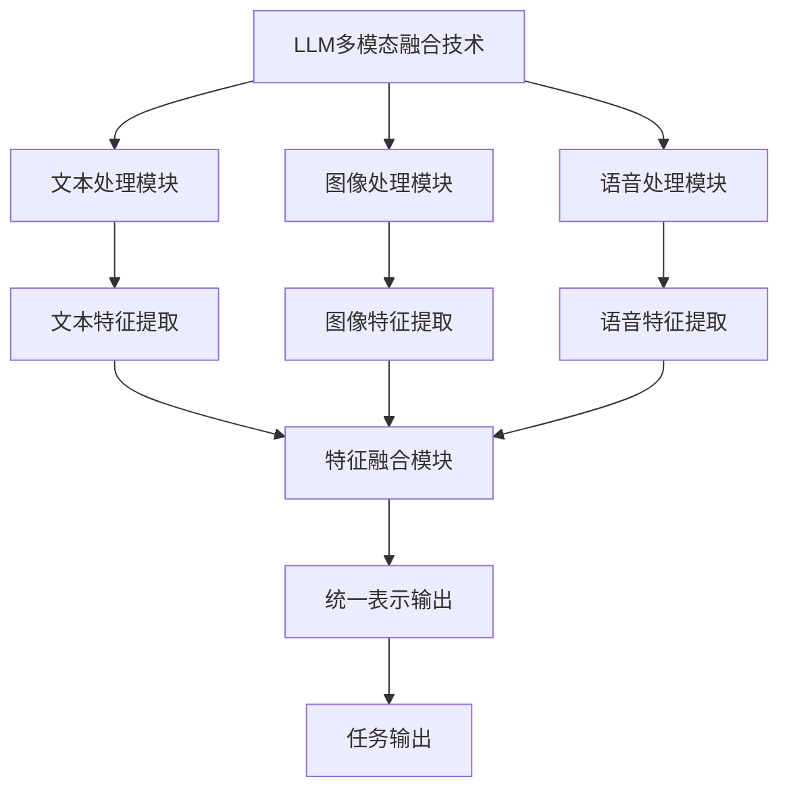
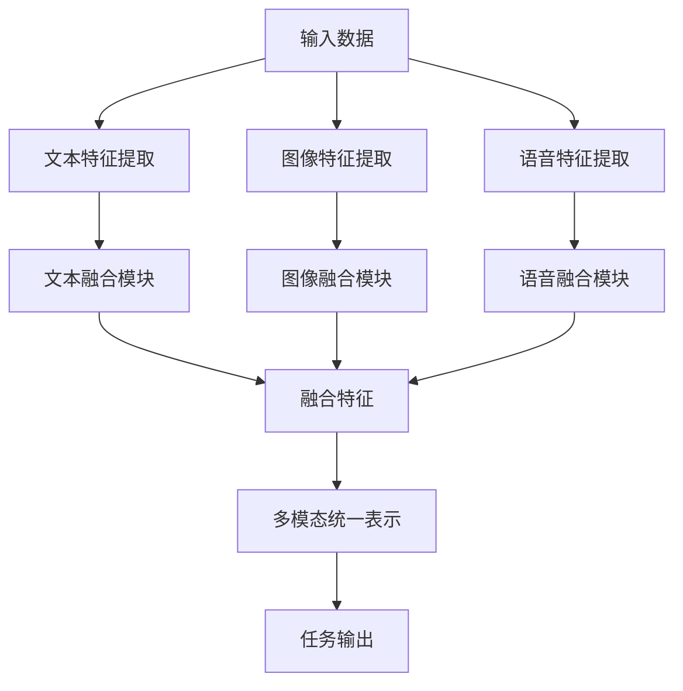
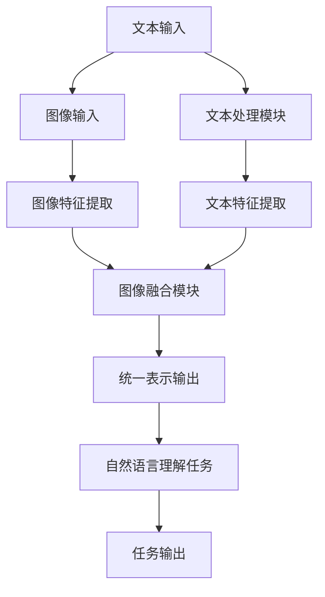
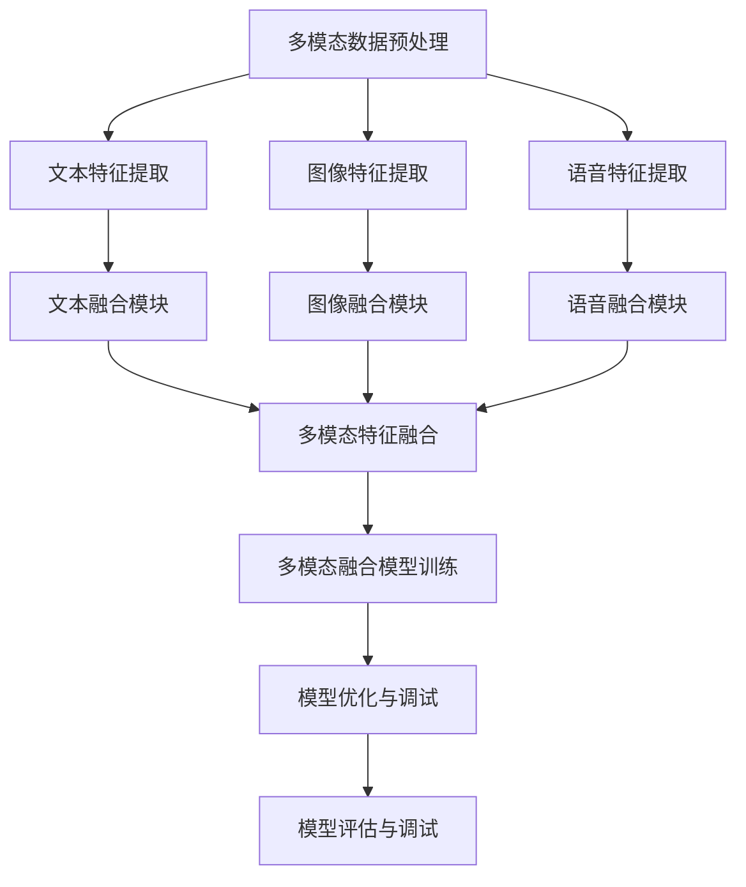
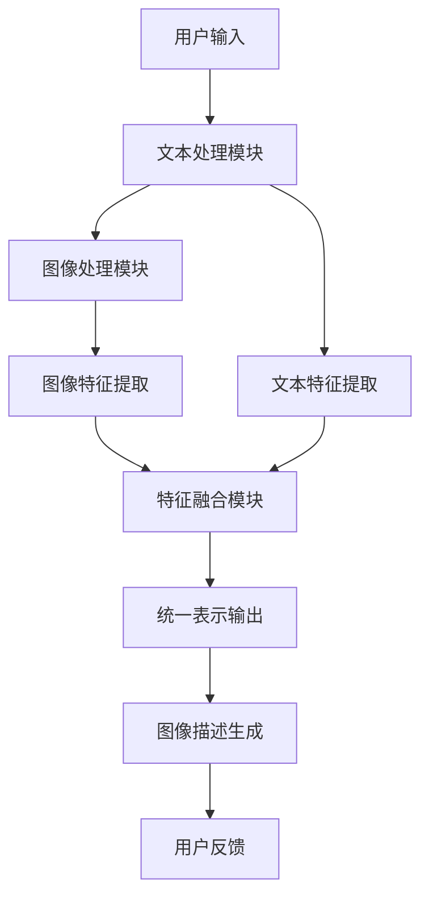
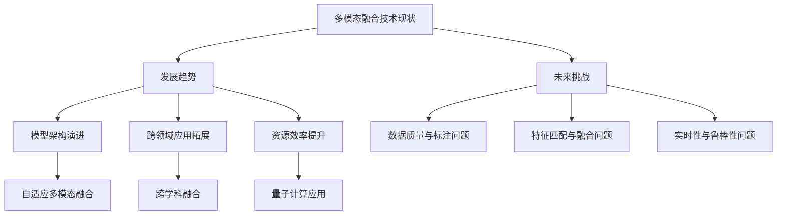
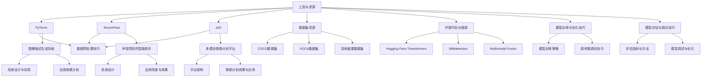

                 

### 文章标题

LLM的多模态融合：文本、图像和语音的统一处理

多模态融合是近年来人工智能领域的一个重要研究方向，其旨在将文本、图像和语音等不同类型的数据源进行统一处理，以提高模型在复杂任务上的性能。本文将围绕LLM（大型语言模型）的多模态融合进行深入探讨，从基本概念、原理、技术到实际应用，全面介绍这一前沿技术。

本文结构如下：

1. 第一部分：LLM的多模态融合概述
   - 第1章：LLM的多模态融合：基本概念与原理
   - 第2章：文本、图像与语音融合技术基础
   - 第3章：LLM的多模态融合应用

2. 第二部分：LLM的多模态融合算法实现与优化
   - 第4章：LLM的多模态融合算法实现
   - 第5章：LLM的多模态融合项目实战

3. 第三部分：LLM的多模态融合技术展望
   - 第6章：LLM的多模态融合技术发展趋势与未来挑战

4. 第四部分：附录与资源
   - 第7章：LLM的多模态融合：工具、资源与实战技巧

通过本文的阅读，读者将了解到多模态融合技术的基本原理、实现方法以及实际应用，为后续的研究与实践提供有益的参考。

---

关键词：LLM，多模态融合，文本，图像，语音，算法实现，项目实战，发展趋势

摘要：本文系统介绍了LLM的多模态融合技术，从基本概念到实际应用，详细探讨了文本、图像和语音的统一处理方法。通过分析LLM的多模态融合优势与挑战，本文提出了多种融合算法和优化策略，并提供了实际应用案例，以帮助读者深入理解多模态融合技术的原理和实现。

---

### 第一部分: LLM的多模态融合概述

多模态融合是指将多种不同类型的数据源（如文本、图像和语音）进行统一处理，以获得更好的模型性能和任务效果。近年来，随着人工智能技术的快速发展，多模态融合在自然语言处理、计算机视觉和语音识别等领域取得了显著成果。LLM（大型语言模型）的多模态融合作为一种新兴技术，具有广泛的应用前景。

#### 第1章: LLM的多模态融合：基本概念与原理

##### 1.1 LLM的多模态融合概述

###### 1.1.1 什么是LLM

LLM，即Large Language Model，是指大型语言模型。这些模型通过学习大量文本数据，具备了强大的文本生成、理解和推理能力。常见的LLM模型包括GPT、BERT等。

- **定义与分类**：LLM可以根据模型架构、训练数据量、应用场景等不同维度进行分类。例如，按照架构分类，可以分为基于循环神经网络（RNN）的模型和基于变换器（Transformer）的模型。

- **常见LLM模型**：GPT（Generative Pre-trained Transformer）是由OpenAI开发的，通过无监督预训练方法学习语言规律。BERT（Bidirectional Encoder Representations from Transformers）由Google开发，通过双向变换器网络学习文本的语义信息。

###### 1.1.2 多模态融合的概念

多模态融合涉及将不同类型的数据源（如文本、图像和语音）进行整合，以生成统一的表示。这一过程通常包括以下几个步骤：

- **数据源**：文本、图像和语音是常见的数据源。文本数据通常来源于文本文件、网络文本等；图像数据来源于图片文件、摄像头等；语音数据来源于麦克风、录音设备等。

- **融合定义**：多模态融合是指将多种数据源整合，通过特定的算法和技术，生成具有更高信息量的统一表示。

- **融合意义**：多模态融合可以提高模型的鲁棒性、准确性和泛化能力。例如，在图像描述生成任务中，结合文本和图像信息可以生成更准确的描述；在语音识别任务中，结合文本信息可以减少识别误差。

###### 1.1.3 多模态融合的技术框架

多模态融合的技术框架可以分为传统方法和基于深度学习的方法。

- **传统方法**：传统多模态融合方法主要包括对齐方法、特征融合方法等。对齐方法包括基于时间戳对齐和基于空间对齐；特征融合方法包括线性融合、非线性融合等。

- **基于深度学习的方法**：基于深度学习的方法主要包括卷积神经网络（CNN）、循环神经网络（RNN）和变换器（Transformer）等。这些方法可以有效地提取和融合不同模态的特征，实现多模态统一表示。

##### 1.2 多模态融合在LLM中的应用

多模态融合在LLM中的应用主要集中在文本与图像、文本与语音的融合。

###### 1.2.1 文本与图像融合

文本与图像融合是指将文本和图像数据进行整合，生成统一的表示，以用于图像识别、图像描述生成等任务。

- **文本与图像的特征提取**：文本特征通常通过词嵌入、序列模型等方法提取；图像特征通常通过卷积神经网络（CNN）等方法提取。

- **文本与图像的联合表示**：通过将文本特征和图像特征进行融合，生成统一的表示。常见的融合方法包括特征级融合和表征级融合。

###### 1.2.2 文本与语音融合

文本与语音融合是指将文本和语音数据进行整合，生成统一的表示，以用于语音识别、文本情感分析等任务。

- **文本与语音的转换与处理**：文本数据可以通过词嵌入、序列模型等方法进行转换；语音数据可以通过梅尔频率倒谱系数（MFCC）等方法进行转换。

- **文本与语音的特征融合**：通过将文本特征和语音特征进行融合，生成统一的表示。常见的融合方法包括特征级融合和模型级融合。

##### 1.3 多模态融合的优势与挑战

多模态融合具有以下优势：

- **数据利用率**：通过整合多种数据源，可以提高数据利用率，减少数据冗余。
- **任务的多样性与准确性**：多模态融合可以同时处理多种类型的任务，提高任务的多样性和准确性。

多模态融合也面临以下挑战：

- **数据不平衡问题**：不同模态的数据量可能不一致，导致数据不平衡。
- **特征匹配与融合问题**：不同模态的特征可能存在差异，如何有效地匹配和融合是关键问题。

### 第一部分总结

LLM的多模态融合不仅将多种数据源融合在一起，还有助于提升模型在复杂任务上的性能。本章介绍了LLM的多模态融合的基本概念、原理及其实际应用，帮助读者理解这一前沿技术。

### 图1-1: LLM多模态融合技术架构图



---

## 文本、图像与语音融合技术基础

在多模态融合中，文本、图像和语音是三种主要的数据源。这些数据源具有不同的特性和处理方式。本章将详细探讨文本、图像与语音的融合技术，包括特征提取和融合策略。通过理解这些技术，读者可以构建出适用于多模态数据处理的模型。

### 第2章: 文本、图像与语音融合技术基础

#### 2.1 文本融合技术

##### 2.1.1 文本特征提取

文本特征提取是将文本数据转换为模型可处理的特征表示的过程。以下是几种常见的文本特征提取技术：

- **词嵌入技术**：词嵌入是将单词映射为向量的方法，常用的方法包括Word2Vec、GloVe等。词嵌入技术可以捕捉单词的语义信息，是文本特征提取的基础。

  ```python
  # Word2Vec 示例
  import gensim
  
  model = gensim.models.Word2Vec(sentences, size=100, window=5, min_count=1, workers=4)
  vector = model.wv['hello']
  ```

- **序列模型与注意力机制**：序列模型，如循环神经网络（RNN）和变换器（Transformer），可以处理文本的序列信息。注意力机制可以捕捉文本中关键信息，提高特征提取的效果。

  ```python
  # Transformer 示例
  import tensorflow as tf
  
  inputs = tf.keras.layers.Input(shape=(None,))
  encoder = tf.keras.layers.Dense(512, activation='relu')(inputs)
  outputs = tf.keras.layers.Dense(512, activation='softmax')(encoder)
  model = tf.keras.Model(inputs=inputs, outputs=outputs)
  ```

##### 2.1.2 文本融合策略

文本融合策略是将提取的文本特征进行融合的方法。以下是几种常见的文本融合策略：

- **对齐方法**：对齐方法是将不同模态的数据对齐到同一时间步或空间位置。常见的对齐方法有时间步对齐和空间对齐。

  ```mermaid
  graph TB
  A[时间步对齐] --> B[融合特征]
  C[空间对齐] --> B
  ```

- **融合层交互**：融合层交互是指在模型中添加特殊层，如加和层、拼接层等，用于融合不同模态的特征。

  ```mermaid
  graph TB
  A[文本特征] --> B[融合层]
  C[图像特征] --> B
  D[语音特征] --> B
  B --> E[统一表示]
  ```

#### 2.2 图像融合技术

##### 2.2.1 图像特征提取

图像特征提取是将图像数据转换为模型可处理的特征表示的过程。以下是几种常见的图像特征提取技术：

- **卷积神经网络（CNN）**：CNN是图像特征提取的主要方法，可以自动学习图像的层次特征。

  ```python
  # CNN 示例
  import tensorflow as tf
  
  model = tf.keras.Sequential([
    tf.keras.layers.Conv2D(32, (3, 3), activation='relu', input_shape=(28, 28, 1)),
    tf.keras.layers.MaxPooling2D((2, 2)),
    tf.keras.layers.Flatten(),
    tf.keras.layers.Dense(128, activation='relu'),
    tf.keras.layers.Dense(10, activation='softmax')
  ])
  ```

- **图像嵌入技术**：图像嵌入技术是将图像映射为高维空间中的向量，用于后续的融合和分类。

  ```python
  # 图像嵌入示例
  import tensorflow as tf
  
  inputs = tf.keras.layers.Input(shape=(28, 28, 1))
  x = tf.keras.layers.Conv2D(32, (3, 3), activation='relu')(inputs)
  outputs = tf.keras.layers.Dense(512, activation='softmax')(x)
  model = tf.keras.Model(inputs=inputs, outputs=outputs)
  ```

##### 2.2.2 图像融合策略

图像融合策略是将提取的图像特征进行融合的方法。以下是几种常见的图像融合策略：

- **特征级融合**：特征级融合是将不同模态的特征直接相加或相乘，生成统一的特征表示。

  ```mermaid
  graph TB
  A[文本特征] --> B[融合特征]
  C[图像特征] --> B
  ```

- **表征级融合**：表征级融合是将不同模态的特征映射到同一高维空间，通过全连接层或池化层进行融合。

  ```mermaid
  graph TB
  A[文本特征] --> B[映射层]
  C[图像特征] --> B
  B --> D[融合特征]
  ```

#### 2.3 语音融合技术

##### 2.3.1 语音特征提取

语音特征提取是将语音数据转换为模型可处理的特征表示的过程。以下是几种常见的语音特征提取技术：

- **梅尔频率倒谱系数（MFCC）**：MFCC是语音特征提取的常用方法，可以捕捉语音的频率信息。

  ```python
  # MFCC 示例
  import numpy as np
  import librosa
  
  y, sr = librosa.load('audio_file.wav')
  mfcc = librosa.feature.mfcc(y=y, sr=sr, n_mfcc=13)
  ```

- **声谱图**：声谱图是将语音信号转换为二维图像，用于视觉分析。

  ```python
  # 声谱图示例
  import numpy as np
  import librosa
  
  y, sr = librosa.load('audio_file.wav')
  S = librosa.stft(y)
  P = np.abs(S)
  ```

##### 2.3.2 语音融合策略

语音融合策略是将提取的语音特征进行融合的方法。以下是几种常见的语音融合策略：

- **特征级融合**：特征级融合是将不同模态的特征直接相加或相乘，生成统一的特征表示。

  ```mermaid
  graph TB
  A[文本特征] --> B[融合特征]
  C[语音特征] --> B
  ```

- **模型级融合**：模型级融合是利用多个独立训练的模型对多模态数据进行处理，然后融合模型的输出。

  ```mermaid
  graph TB
  A[文本特征] --> B[文本模型]
  C[语音特征] --> D[语音模型]
  B --> E[文本输出]
  D --> F[语音输出]
  E --> G[融合特征]
  F --> G
  ```

#### 2.4 融合模型架构

融合模型架构是多模态融合技术的核心。以下是几种常见的融合模型架构：

##### 2.4.1 转换器架构

转换器（Transformer）是一种基于注意力机制的深度学习模型，广泛应用于自然语言处理和图像处理领域。在多模态融合中，转换器可以同时处理多种数据源。

- **转换器模型（Transformer）的引入**：转换器模型通过多头注意力机制和位置编码，可以捕捉数据之间的复杂关系。

  ```mermaid
  graph TB
  A[输入] --> B[嵌入层]
  B --> C[多头注意力层]
  C --> D[全连接层]
  D --> E[输出]
  ```

- **转换器在多模态融合中的应用**：转换器可以同时处理文本、图像和语音特征，通过融合不同模态的特征，提高模型的性能。

  ```mermaid
  graph TB
  A[文本特征] --> B[嵌入层]
  C[图像特征] --> D[嵌入层]
  E[语音特征] --> F[嵌入层]
  B --> G[多头注意力层]
  D --> G
  F --> G
  G --> H[输出]
  ```

##### 2.4.2 多任务学习架构

多任务学习（Multi-Task Learning, MTL）是指同时训练多个相关任务的模型。在多模态融合中，多任务学习可以同时处理多种任务，提高模型的泛化能力。

- **多任务学习的原理**：多任务学习通过共享模型参数，减少参数数量，提高模型的训练效率。

  ```mermaid
  graph TB
  A[任务1] --> B[共享层]
  C[任务2] --> B
  D[任务3] --> B
  B --> E[输出层]
  ```

- **多模态融合中的多任务学习应用**：多任务学习可以同时处理文本、图像和语音的融合，实现多种任务的统一处理。

  ```mermaid
  graph TB
  A[文本特征] --> B[共享层]
  C[图像特征] --> D[共享层]
  E[语音特征] --> F[共享层]
  B --> G[任务输出1]
  D --> G
  F --> G
  B --> H[任务输出2]
  D --> H
  F --> H
  ```

### 第二部分总结

本章详细介绍了文本、图像与语音的融合技术，包括特征提取和融合策略。通过理解这些技术，读者可以构建出适用于多模态数据处理的模型，为后续章节的实践应用打下基础。

### 图2-1: 多模态特征提取与融合流程图



---

## LLM的多模态融合应用

多模态融合技术在实际应用中具有广泛的应用前景。本节将重点讨论LLM的多模态融合在自然语言理解、自然语言生成和情感分析中的应用，通过具体的案例来展示多模态融合技术的强大潜力。

### 第3章: 文本、图像与语音融合在自然语言理解中的应用

自然语言理解（Natural Language Understanding, NLU）是人工智能领域的一个重要分支，旨在使计算机理解和解析人类语言。多模态融合在NLU中的应用可以显著提升模型的理解能力和准确性。

#### 3.1 文本与图像融合在自然语言理解中的应用

文本与图像融合在自然语言理解中的应用非常广泛，例如在图像识别辅助文本理解和图像内容提取与文本语义关联等方面。

##### 3.1.1 图像识别辅助文本理解

在图像识别辅助文本理解中，图像特征可以用于辅助文本分类、文本摘要等任务。

- **图像特征对文本分类的辅助**：例如，在情感分类任务中，图像中的人脸表情可以辅助文本的情感判断。

  ```python
  # 伪代码：利用图像特征辅助文本分类
  image_feature = extract_image_feature(image)
  text_embedding = embed_text(text)
  combined_embedding = image_feature + text_embedding
  label = classify_combined_embedding(combined_embedding)
  ```

- **图像特征对文本摘要的辅助**：在文本摘要任务中，图像特征可以帮助提取更准确的关键信息。

  ```python
  # 伪代码：利用图像特征辅助文本摘要
  image_feature = extract_image_feature(image)
  text_embedding = embed_text(text)
  combined_embedding = image_feature + text_embedding
  summary = generate_summary(combined_embedding)
  ```

##### 3.1.2 图像内容提取与文本语义关联

图像内容提取与文本语义关联是另一个重要的应用领域，它涉及到从图像中提取内容并与文本进行关联，以增强文本理解。

- **图像内容提取**：通过卷积神经网络（CNN）提取图像中的视觉内容，例如物体、场景等。

  ```python
  # 伪代码：图像内容提取
  image_content = extract_image_content(image)
  ```

- **图像内容与文本语义的关联分析**：将提取的图像内容与文本进行关联，以增强文本理解。

  ```python
  # 伪代码：图像内容与文本语义关联
  image_content = extract_image_content(image)
  text_embedding = embed_text(text)
  associated_embedding = image_content + text_embedding
  analysis_result = analyze_associated_embedding(associated_embedding)
  ```

#### 3.2 文本与语音融合在自然语言理解中的应用

文本与语音融合在自然语言理解中的应用同样具有广泛的应用前景，特别是在语音识别辅助文本理解和语音情感分析等方面。

##### 3.2.1 语音识别辅助文本理解

在语音识别辅助文本理解中，语音识别结果可以用于文本分析和理解。

- **语音识别结果的文本分析**：将语音识别结果转换为文本，然后进行后续分析。

  ```python
  # 伪代码：语音识别辅助文本分析
  recognized_text = recognize_speech(audio)
  text_embedding = embed_text(recognized_text)
  analysis_result = analyze_text_embedding(text_embedding)
  ```

- **语音情感与文本情感的一致性分析**：分析语音和文本的情感一致性，以增强情感理解。

  ```python
  # 伪代码：语音情感与文本情感一致性分析
  speech_emotion = analyze_speech_emotion(audio)
  text_emotion = analyze_text_emotion(recognized_text)
  consistency = check_consistency(speech_emotion, text_emotion)
  ```

##### 3.2.2 语音增强文本情感分析

在语音增强文本情感分析中，语音特征可以用于提升文本情感分析的准确性。

- **语音情感特征提取**：通过语音特征提取技术，如梅尔频率倒谱系数（MFCC），从语音中提取情感特征。

  ```python
  # 伪代码：语音情感特征提取
  audio_feature = extract_audio_feature(audio)
  emotion_embedding = embed_emotion(audio_feature)
  ```

- **基于语音情感的文本情感分析**：利用语音情感特征辅助文本情感分析。

  ```python
  # 伪代码：基于语音情感的文本情感分析
  text_embedding = embed_text(text)
  combined_embedding = text_embedding + emotion_embedding
  emotion_analysis = analyze_combined_embedding(combined_embedding)
  ```

#### 3.3 多模态融合在自然语言生成中的应用

多模态融合在自然语言生成（Natural Language Generation, NLG）中的应用也非常广泛，例如在图像描述生成和语音引导文本生成等方面。

##### 3.3.1 图像描述生成

在图像描述生成中，图像特征可以用于辅助文本生成，以生成更准确的图像描述。

- **图像特征辅助文本生成**：通过图像特征提取和文本生成技术，生成图像描述。

  ```python
  # 伪代码：图像特征辅助文本生成
  image_feature = extract_image_feature(image)
  text_embedding = embed_text(text)
  combined_embedding = image_feature + text_embedding
  description = generate_description(combined_embedding)
  ```

- **基于图像描述的文本生成**：利用图像特征和预训练的语言模型，生成基于图像的文本描述。

  ```python
  # 伪代码：基于图像描述的文本生成
  image_feature = extract_image_feature(image)
  text_embedding = generate_image_description(image_feature)
  ```

##### 3.3.2 语音引导文本生成

在语音引导文本生成中，语音指令可以用于引导文本生成，以实现更智能的交互。

- **语音指令引导的文本生成**：通过语音指令提取和文本生成技术，生成语音引导的文本。

  ```python
  # 伪代码：语音指令引导的文本生成
  voice_command = recognize_voice_command(audio)
  text_embedding = embed_text(voice_command)
  generated_text = generate_text(text_embedding)
  ```

- **基于语音情感的文本生成**：利用语音情感特征和文本生成技术，生成基于语音情感的文本。

  ```python
  # 伪代码：基于语音情感的文本生成
  voice_emotion = analyze_voice_emotion(audio)
  text_embedding = generate_emotional_text(voice_emotion)
  ```

#### 3.4 多模态融合在情感分析中的应用

多模态融合在情感分析中的应用可以显著提升情感识别的准确性和鲁棒性。

##### 3.4.1 多模态情感识别

在多模态情感识别中，文本、图像和语音的情感特征可以融合在一起，以生成更准确的情感识别结果。

- **文本、图像与语音的情感特征融合**：通过融合不同模态的情感特征，生成统一的情感特征向量。

  ```python
  # 伪代码：多模态情感特征融合
  text_emotion = analyze_text_emotion(text)
  image_emotion = analyze_image_emotion(image)
  voice_emotion = analyze_voice_emotion(audio)
  combined_emotion = text_emotion + image_emotion + voice_emotion
  ```

- **基于多模态融合的情感识别模型**：利用融合后的情感特征，训练情感识别模型。

  ```python
  # 伪代码：基于多模态融合的情感识别
  emotion_embedding = embed_emotion(combined_emotion)
  emotion_label = classify_emotion(emotion_embedding)
  ```

##### 3.4.2 情感分析应用案例

多模态融合在情感分析中的应用案例包括社交媒体情感分析、电子商务评价情感分析等。

- **社交媒体情感分析**：通过融合文本、图像和语音信息，分析社交媒体上的用户情感。

  ```python
  # 伪代码：社交媒体情感分析
  social_media_post = extract_social_media_post()
  image = extract_image_from_post(social_media_post)
  audio = extract_audio_from_post(social_media_post)
  text_emotion = analyze_text_emotion(social_media_post)
  image_emotion = analyze_image_emotion(image)
  voice_emotion = analyze_voice_emotion(audio)
  combined_emotion = text_emotion + image_emotion + voice_emotion
  emotion_label = classify_emotion(combined_emotion)
  ```

- **电子商务评价情感分析**：通过融合用户评论、产品图像和产品语音描述，分析用户对产品的情感。

  ```python
  # 伪代码：电子商务评价情感分析
  user_review = extract_user_review()
  product_image = extract_product_image()
  product_audio = extract_product_audio()
  text_emotion = analyze_text_emotion(user_review)
  image_emotion = analyze_image_emotion(product_image)
  voice_emotion = analyze_voice_emotion(product_audio)
  combined_emotion = text_emotion + image_emotion + voice_emotion
  emotion_label = classify_emotion(combined_emotion)
  ```

### 第三部分总结

本章详细探讨了LLM的多模态融合在自然语言理解中的应用，包括文本与图像、文本与语音的融合，以及多模态融合在自然语言生成和情感分析中的实际应用。这些应用案例展示了多模态融合技术的强大潜力和广泛前景。

### 图3-1: 文本、图像与语音融合在自然语言理解中的应用架构图



---

## LLM的多模态融合算法实现

实现LLM的多模态融合算法是一个复杂的过程，涉及数据预处理、特征提取与融合、模型训练与优化等多个步骤。本节将详细讨论这些步骤，并提供伪代码和数学模型，以便读者更好地理解多模态融合算法的实现。

### 第4章: LLM的多模态融合算法实现

#### 4.1 多模态数据预处理

多模态数据预处理是确保数据质量和一致性的关键步骤。以下是多模态数据预处理的主要步骤：

##### 4.1.1 数据收集与清洗

数据收集与清洗是预处理过程的第一步。对于文本数据，需要从各种来源（如网络文本、文本文件等）收集数据，并进行清洗，去除无关信息和噪声。

- **文本数据清洗**：去除标点符号、停用词、HTML标签等。

  ```python
  # 伪代码：文本数据清洗
  def clean_text(text):
      text = remove_punctuation(text)
      text = remove_stopwords(text)
      return text
  ```

- **图像数据清洗**：去除低质量图像、模糊图像等。

  ```python
  # 伪代码：图像数据清洗
  def clean_images(images):
      valid_images = []
      for image in images:
          if is_high_quality(image):
              valid_images.append(image)
      return valid_images
  ```

- **语音数据清洗**：去除背景噪声、填充静音片段等。

  ```python
  # 伪代码：语音数据清洗
  def clean_audio(audio):
      audio = remove_background_noise(audio)
      audio = remove_silence(audio)
      return audio
  ```

##### 4.1.2 数据标准化与归一化

数据标准化与归一化是确保不同模态数据具有相似尺度的重要步骤。以下是一些常见的标准化与归一化方法：

- **文本数据标准化**：例如，词嵌入的标准化。

  ```python
  # 伪代码：文本数据标准化
  def normalize_text_embeddings(embeddings):
      normalized_embeddings = [embedding / np.linalg.norm(embedding) for embedding in embeddings]
      return normalized_embeddings
  ```

- **图像数据归一化**：例如，将图像像素值归一化到[0, 1]范围内。

  ```python
  # 伪代码：图像数据归一化
  def normalize_images(images):
      normalized_images = [image / 255.0 for image in images]
      return normalized_images
  ```

- **语音数据归一化**：例如，利用梅尔频率倒谱系数（MFCC）进行归一化。

  ```python
  # 伪代码：语音数据归一化
  def normalize_audio(audio):
      mfcc = extract_mfcc(audio)
      normalized_mfcc = [mfcc / np.linalg.norm(mfcc) for mfcc in mfcc]
      return normalized_mfcc
  ```

#### 4.2 多模态特征提取与融合

多模态特征提取与融合是多模态融合算法的核心部分。以下分别介绍文本、图像和语音的特征提取与融合方法。

##### 4.2.1 文本特征提取

文本特征提取是将文本数据转换为向量表示的过程。常用的方法包括词嵌入和序列模型。

- **词嵌入**：词嵌入是将文本中的单词映射为向量的过程，常用的模型包括Word2Vec和GloVe。

  ```python
  # 伪代码：词嵌入
  def word_embedding(text):
      embeddings = [model[word] for word in text]
      return embeddings
  ```

- **序列模型**：序列模型可以捕捉文本中的时序信息，常用的模型包括循环神经网络（RNN）和变换器（Transformer）。

  ```python
  # 伪代码：序列模型
  def sequence_model(text):
      embeddings = transform_sequence(text)
      return embeddings
  ```

##### 4.2.2 图像特征提取

图像特征提取是将图像数据转换为向量表示的过程，常用的方法包括卷积神经网络（CNN）和图像嵌入。

- **卷积神经网络（CNN）**：CNN可以自动提取图像中的层次特征。

  ```python
  # 伪代码：CNN提取图像特征
  def extract_image_features(image):
      features = cnn_model(image)
      return features
  ```

- **图像嵌入**：图像嵌入是将图像映射为高维空间中的向量。

  ```python
  # 伪代码：图像嵌入
  def image_embedding(image):
      embedding = embedding_model(image)
      return embedding
  ```

##### 4.2.3 语音特征提取

语音特征提取是将语音数据转换为向量表示的过程，常用的方法包括梅尔频率倒谱系数（MFCC）和声谱图。

- **梅尔频率倒谱系数（MFCC）**：MFCC可以捕捉语音的频率信息。

  ```python
  # 伪代码：提取MFCC特征
  def extract_mfcc(audio):
      mfcc = librosa.feature.mfcc(y=audio, sr=sample_rate)
      return mfcc
  ```

- **声谱图**：声谱图是将语音信号转换为二维图像。

  ```python
  # 伪代码：提取声谱图
  def extract_spectrogram(audio):
      spectrogram = librosa.stft(y=audio, sr=sample_rate)
      return spectrogram
  ```

##### 4.2.4 多模态特征融合

多模态特征融合是将不同模态的特征向量进行融合的过程。以下介绍几种常见的特征融合方法：

- **特征级融合**：直接将不同模态的特征向量相加或相乘。

  ```python
  # 伪代码：特征级融合
  def feature_fusion(text_features, image_features, audio_features):
      combined_features = text_features + image_features + audio_features
      return combined_features
  ```

- **表征级融合**：将不同模态的特征映射到同一高维空间，然后进行融合。

  ```python
  # 伪代码：表征级融合
  def representation_fusion(text_features, image_features, audio_features):
      text_embedding = embed_text_features(text_features)
      image_embedding = embed_image_features(image_features)
      audio_embedding = embed_audio_features(audio_features)
      combined_embedding = text_embedding + image_embedding + audio_embedding
      return combined_embedding
  ```

#### 4.3 多模态融合模型的训练与优化

多模态融合模型的训练与优化是确保模型性能的关键步骤。以下介绍多模态融合模型的训练与优化方法。

##### 4.3.1 模型训练流程

多模态融合模型的训练流程通常包括以下步骤：

- **数据集划分**：将数据集划分为训练集、验证集和测试集。

  ```python
  # 伪代码：数据集划分
  train_data, val_data, test_data = split_data(data, train_size=0.7, val_size=0.2, test_size=0.1)
  ```

- **模型初始化**：初始化多模态融合模型。

  ```python
  # 伪代码：模型初始化
  model = initialize_model()
  ```

- **模型训练**：使用训练集对模型进行训练。

  ```python
  # 伪代码：模型训练
  model.fit(train_data, epochs=num_epochs, validation_data=val_data)
  ```

- **模型评估**：使用验证集评估模型性能。

  ```python
  # 伪代码：模型评估
  performance = model.evaluate(test_data)
  print(f"Test performance: {performance}")
  ```

##### 4.3.2 模型优化技巧

以下是一些常见的模型优化技巧：

- **学习率调整**：调整学习率可以提高模型收敛速度和性能。

  ```python
  # 伪代码：学习率调整
  learning_rate = adjust_learning_rate(learning_rate, epoch, decay_rate=0.95)
  ```

- **批处理大小调整**：调整批处理大小可以影响模型的训练稳定性和性能。

  ```python
  # 伪代码：批处理大小调整
  batch_size = adjust_batch_size(batch_size, epoch, increase_factor=1.1)
  ```

- **模型正则化**：正则化可以减少过拟合，提高模型的泛化能力。

  ```python
  # 伪代码：模型正则化
  model = add_regularization(model, regularization_type='L2', lambda_value=0.01)
  ```

#### 4.4 多模态融合模型评估与调试

多模态融合模型的评估与调试是确保模型性能和准确性的关键步骤。以下介绍评估与调试的方法。

##### 4.4.1 评估指标

以下是一些常见的评估指标：

- **准确率**：模型预测正确的样本数占总样本数的比例。

  ```python
  # 伪代码：准确率
  accuracy = correct_predictions / total_predictions
  ```

- **召回率**：模型预测正确的正样本数占总正样本数的比例。

  ```python
  # 伪代码：召回率
  recall = correct_positive_predictions / total_positive_predictions
  ```

- **F1值**：准确率和召回率的调和平均值。

  ```python
  # 伪代码：F1值
  f1 = 2 * (precision * recall) / (precision + recall)
  ```

##### 4.4.2 模型调试与优化

以下是一些常见的模型调试与优化方法：

- **超参数调优**：通过调整超参数（如学习率、批处理大小等）来优化模型性能。

  ```python
  # 伪代码：超参数调优
  best_hyperparameters = hyperparameter_tuning(hyperparameters_space)
  ```

- **模型调整**：通过调整模型结构（如添加或删除层、改变层数等）来优化模型性能。

  ```python
  # 伪代码：模型调整
  optimized_model = adjust_model_structure(model, structure_changes)
  ```

- **交叉验证**：使用交叉验证方法来评估模型的性能和稳定性。

  ```python
  # 伪代码：交叉验证
  cv_scores = cross_validate(model, data, num_folds=k)
  ```

### 第四部分总结

本章详细介绍了LLM的多模态融合算法的实现过程，包括数据预处理、特征提取与融合、模型训练与优化，以及评估与调试。通过这些步骤，读者可以构建出一个高效的多模态融合模型。

### 图4-1: 多模态融合算法实现流程图



---

## LLM的多模态融合项目实战

在实际项目中，LLM的多模态融合技术可以应用于多种场景，如图像描述生成、声音控制的智能助手和多媒体情感分析平台等。以下将详细介绍三个具体的多模态融合应用项目，包括项目实施细节、模型设计、训练与优化、评估与调试等。

### 第5章: 文本、图像与语音融合在真实世界中的应用

#### 5.1 应用场景概述

##### 5.1.1 图像描述生成系统

图像描述生成系统是一种将图像转化为文本描述的人工智能系统，常用于辅助视觉障碍人士、提升搜索引擎的图像检索能力等。该系统的核心是利用多模态融合技术，结合图像特征和文本特征生成图像描述。

- **系统架构与流程**：

  ```mermaid
  graph TB
  A[用户输入图像] --> B[图像特征提取]
  B --> C[图像嵌入]
  C --> D[文本特征提取]
  D --> E[文本嵌入]
  E --> F[特征融合]
  F --> G[图像描述生成]
  G --> H[用户反馈]
  ```

- **应用案例**：在搜索引擎中，用户上传图像后，系统自动生成描述，辅助用户更快速地找到相关内容。

##### 5.1.2 声音控制的智能助手

声音控制的智能助手是一种通过语音指令控制智能设备的人工智能系统，如语音拨打电话、发送短信、播放音乐等。该系统利用多模态融合技术，结合语音特征和文本特征，实现更自然的语音交互。

- **系统设计**：

  ```mermaid
  graph TB
  A[用户输入语音指令] --> B[语音特征提取]
  B --> C[语音嵌入]
  C --> D[文本特征提取]
  D --> E[文本嵌入]
  E --> F[特征融合]
  F --> G[指令理解与执行]
  G --> H[用户反馈]
  ```

- **应用案例**：用户可以通过语音命令控制智能家居设备，如智能电视、智能灯泡等。

##### 5.1.3 多模态情感分析平台

多模态情感分析平台是一种利用文本、图像和语音等多种数据源，对用户情感进行分析和识别的人工智能系统。该系统可以应用于社交媒体分析、电子商务评价等场景。

- **平台架构**：

  ```mermaid
  graph TB
  A[用户输入多模态数据] --> B[文本特征提取]
  B --> C[图像特征提取]
  C --> D[语音特征提取]
  D --> E[特征融合]
  E --> F[情感特征提取]
  F --> G[情感识别]
  G --> H[用户反馈]
  ```

- **应用案例**：在社交媒体平台上，对用户的情感状态进行分析，帮助品牌了解用户需求，优化产品和服务。

#### 5.2 项目实施细节

##### 5.2.1 数据集准备

数据集准备是项目实施的第一步，确保数据的质量和多样性对模型的性能至关重要。

- **数据收集与清洗**：收集具有多种模态的数据，如文本、图像和语音。对数据进行清洗，去除噪声和无关信息。

  ```python
  # 数据收集与清洗示例
  def collect_and_clean_data(data_source):
      data = []
      for item in data_source:
          text, image, audio = process_item(item)
          data.append((text, image, audio))
      return data
  ```

- **数据预处理**：对数据进行标准化和归一化处理，确保不同模态的数据具有相似的尺度。

  ```python
  # 数据预处理示例
  def preprocess_data(data):
      for i, (text, image, audio) in enumerate(data):
          text = normalize_text(text)
          image = normalize_image(image)
          audio = normalize_audio(audio)
          data[i] = (text, image, audio)
      return data
  ```

##### 5.2.2 模型设计与实现

模型设计是实现多模态融合的关键步骤，设计合理的模型结构可以提高模型性能。

- **模型架构选择**：选择适合多模态融合的模型架构，如变换器（Transformer）和卷积神经网络（CNN）的组合。

  ```mermaid
  graph TB
  A[文本输入] --> B[Text Encoder]
  B --> C[Image Input] --> D[Image Encoder]
  D --> E[Audio Input] --> F[Audio Encoder]
  B --> G[特征融合模块]
  D --> G
  F --> G
  G --> H[多模态统一表示]
  H --> I[分类输出]
  ```

- **代码实现与调试**：实现模型架构，并进行调试，确保模型稳定运行。

  ```python
  # 模型实现示例
  model = build_model()
  model.compile(optimizer='adam', loss='categorical_crossentropy', metrics=['accuracy'])
  model.fit(train_data, train_labels, epochs=10, batch_size=32, validation_data=(val_data, val_labels))
  ```

##### 5.2.3 模型训练与优化

模型训练与优化是确保模型性能的关键步骤，通过调整超参数和训练策略，提高模型性能。

- **训练数据集划分**：将数据集划分为训练集、验证集和测试集，确保模型在验证集上达到最优性能。

  ```python
  # 数据集划分示例
  train_data, val_data, test_data = train_test_split(data, test_size=0.2, random_state=42)
  ```

- **模型调优**：调整学习率、批处理大小、正则化参数等，优化模型性能。

  ```python
  # 模型调优示例
  best_hyperparameters = hyperparameter_tuning(hyperparameters_space)
  model = build_model(hyperparameters=best_hyperparameters)
  ```

##### 5.2.4 模型评估与调试

模型评估与调试是确保模型在实际应用中表现良好的关键步骤，通过评估指标和方法，调整模型结构。

- **评估指标**：使用准确率、召回率、F1值等评估指标，评估模型性能。

  ```python
  # 评估指标示例
  accuracy = model.evaluate(test_data)[1]
  print(f"Test accuracy: {accuracy}")
  ```

- **模型调试**：通过交叉验证和超参数调优，优化模型性能。

  ```python
  # 模型调试示例
  cv_scores = cross_validate(model, data, num_folds=5)
  print(f"Cross-validation scores: {cv_scores}")
  ```

#### 5.3 项目评估与改进

项目评估与改进是确保模型在实际应用中稳定和高效的关键步骤。

- **评估指标与方法**：使用准确率、召回率、F1值等评估指标，对模型进行评估。同时，采用交叉验证方法，评估模型在多个数据集上的性能。

  ```python
  # 评估指标与方法示例
  from sklearn.metrics import accuracy_score, recall_score, f1_score

  predictions = model.predict(test_data)
  accuracy = accuracy_score(test_labels, predictions)
  recall = recall_score(test_labels, predictions)
  f1 = f1_score(test_labels, predictions)
  print(f"Test accuracy: {accuracy}, Recall: {recall}, F1: {f1}")
  ```

- **项目优化与改进**：根据评估结果，调整模型结构和超参数，优化模型性能。

  ```python
  # 项目优化与改进示例
  best_hyperparameters = hyperparameter_tuning(hyperparameters_space)
  model = build_model(hyperparameters=best_hyperparameters)
  ```

#### 5.4 项目经验总结

项目实施过程中，积累了许多宝贵经验，为后续研究与实践提供了有益的参考。

- **成功经验**：多模态融合技术在实际应用中展现了强大的潜力，提高了模型性能和准确性。

- **挑战**：数据不平衡、特征匹配和融合问题等是项目实施过程中面临的挑战。

- **改进方向**：在未来研究中，可以探索自适应多模态融合、跨学科融合等方法，进一步提高模型性能和实用性。

### 第五部分总结

通过三个具体的多模态融合应用项目，本章详细介绍了项目实施的过程，包括数据准备、模型设计与实现、模型训练与优化，以及项目的评估与改进。通过这些实战经验，读者可以更好地理解多模态融合技术的实际应用。

### 图5-1: 图像描述生成系统架构图



---

## LLM的多模态融合技术展望

随着人工智能技术的快速发展，LLM的多模态融合技术在未来将迎来更多的挑战和机遇。本文将从技术发展趋势、未来挑战和解决方案三个方面进行展望。

### 第6章: LLM的多模态融合技术发展趋势与未来挑战

#### 6.1 多模态融合技术发展趋势

多模态融合技术在未来将朝着以下几个方向发展：

##### 6.1.1 模型架构的演进

模型架构的演进是多模态融合技术的核心趋势。近年来，变换器（Transformer）模型在自然语言处理领域取得了巨大的成功，其在多模态融合中的应用也将越来越广泛。未来的多模态融合模型可能会引入更多的注意力机制、自注意力机制和时空注意力机制，以更好地捕捉不同模态之间的复杂关系。

- **新型多模态融合模型**：例如，时空变换器（Spatial Transformer）和自适应变换器（Adaptive Transformer）等新型模型，将在多模态融合中发挥重要作用。

  ```mermaid
  graph TB
  A[输入数据] --> B[时空变换器]
  B --> C[特征融合]
  C --> D[统一表示输出]
  ```

##### 6.1.2 跨领域应用的拓展

多模态融合技术在各个领域的应用前景广阔。在医疗、金融、教育等领域，多模态融合技术可以提供更准确的诊断、更智能的投资决策、更有效的教学方案等。

- **多模态融合在医疗领域的应用**：例如，结合影像数据和患者病历，提高疾病诊断的准确性。

  ```mermaid
  graph TB
  A[医学影像] --> B[影像特征提取]
  C[病历数据] --> D[病历特征提取]
  B --> E[特征融合]
  C --> E
  E --> F[疾病诊断]
  ```

- **多模态融合在金融领域的应用**：例如，结合股票市场数据和新闻报道，提高投资预测的准确性。

  ```mermaid
  graph TB
  A[股票市场数据] --> B[数据特征提取]
  C[新闻报道] --> D[文本特征提取]
  B --> E[特征融合]
  C --> E
  E --> F[投资预测]
  ```

##### 6.1.3 资源效率的提升

随着多模态融合模型的应用越来越广泛，资源效率的提升成为了一个重要的研究方向。未来的多模态融合模型可能会引入模型压缩、量化、剪枝等技术，以降低模型的计算复杂度和存储需求。

- **模型压缩与加速**：例如，通过模型剪枝和量化技术，减少模型的参数数量，提高模型在硬件上的运行速度。

  ```mermaid
  graph TB
  A[原始模型] --> B[剪枝]
  B --> C[量化]
  C --> D[加速模型]
  ```

#### 6.2 多模态融合技术的未来挑战

尽管多模态融合技术在许多领域取得了显著成果，但仍面临一些挑战：

##### 6.2.1 数据质量与标注问题

高质量的多模态数据是构建高效多模态融合模型的基础。然而，当前的多模态数据存在标注不完整、数据不平衡等问题，这对模型的训练和性能产生了影响。

- **数据多样性不足**：多模态数据源的多样性不足，导致模型在处理不同类型的数据时效果不佳。

- **数据标注成本高**：多模态数据的标注过程复杂且耗时，导致数据标注成本高昂。

##### 6.2.2 特征匹配与融合问题

多模态数据之间存在差异，如何有效地匹配和融合不同模态的特征是一个关键问题。

- **特征非一致性**：不同模态的特征在维度、分布、空间等方面存在差异，导致特征融合效果不理想。

- **融合效果优化**：如何设计有效的特征融合策略，以最大化不同模态特征的信息量，是一个重要挑战。

##### 6.2.3 实时性与鲁棒性问题

多模态融合模型在实时性和鲁棒性方面存在一定的不足，如何提高模型在这些方面的性能是一个重要的研究方向。

- **实时性**：多模态数据融合过程中，处理速度较慢可能导致模型在实时应用中无法满足需求。

- **鲁棒性**：多模态数据中可能存在噪声和异常值，如何提高模型对这些异常的鲁棒性是一个挑战。

#### 6.3 未来研究方向与解决方案

针对多模态融合技术的未来挑战，以下是一些可能的研究方向和解决方案：

##### 6.3.1 自适应多模态融合

自适应多模态融合是一种根据不同任务和数据特性，动态调整融合策略的方法。未来的研究可以探索自适应特征匹配和自适应融合机制，以提高模型性能。

- **自适应特征匹配**：通过学习不同模态特征之间的匹配关系，提高特征融合的准确性。

  ```mermaid
  graph TB
  A[文本特征] --> B[图像特征]
  B --> C[自适应匹配]
  C --> D[融合特征]
  ```

- **自适应融合机制**：根据任务需求，动态调整特征融合权重，优化模型性能。

  ```mermaid
  graph TB
  A[文本特征] --> B[图像特征]
  A --> C[自适应权重]
  B --> C
  C --> D[融合特征]
  ```

##### 6.3.2 跨学科融合

多模态融合技术可以与其他学科（如心理学、神经科学等）相结合，探索新的研究方向和应用场景。

- **心理学与多模态融合**：通过心理学理论，了解人类感知和认知过程，为多模态融合提供新的视角和方法。

- **神经科学与多模态融合**：结合神经科学的研究成果，探索多模态融合在脑机接口、智能辅助等方面的应用。

##### 6.3.3 新兴技术的应用

随着量子计算、边缘计算等新兴技术的发展，多模态融合技术也将迎来新的机遇和挑战。

- **量子计算应用**：量子计算具有并行计算能力，可以加速多模态融合模型的训练和推理过程。

  ```mermaid
  graph TB
  A[多模态融合模型] --> B[量子计算加速]
  B --> C[模型推理]
  ```

- **边缘计算应用**：边缘计算可以将多模态融合模型部署在边缘设备上，实现实时处理和低延迟应用。

  ```mermaid
  graph TB
  A[多模态融合模型] --> B[边缘计算设备]
  B --> C[实时数据处理]
  ```

### 第六部分总结

本章分析了LLM的多模态融合技术的未来发展趋势和面临的挑战，提出了可能的解决方案和未来研究方向。通过了解这些内容，读者可以更好地把握多模态融合技术的未来方向，为后续研究与实践提供指导。

### 图6-1: 多模态融合技术发展趋势与未来挑战关系图



---

## 附录与资源

在本章中，我们将为读者提供有关LLM的多模态融合技术的工具、资源和实战技巧，帮助读者在实际项目中更好地应用这一前沿技术。

### 第7章: LLM的多模态融合：工具、资源与实战技巧

#### 7.1 工具与资源

在多模态融合项目中，选择合适的工具和资源是非常重要的。以下是一些常用的工具和资源：

##### 7.1.1 主流多模态融合工具

- **PyTorch**：PyTorch是一个开源的深度学习框架，广泛用于多模态融合项目。它具有灵活的动态图模型和丰富的API，支持GPU加速。

  - **官方文档**：[PyTorch官方文档](https://pytorch.org/docs/stable/)
  
- **TensorFlow**：TensorFlow是谷歌开发的开源深度学习框架，支持多种设备和平台，适用于大规模多模态融合项目。

  - **官方文档**：[TensorFlow官方文档](https://www.tensorflow.org/docs/stable/)

- **JAX**：JAX是谷歌开发的一个高级深度学习库，支持自动微分和数值计算优化，适用于高性能多模态融合项目。

  - **官方文档**：[JAX官方文档](https://jax.readthedocs.io/en/latest/)

##### 7.1.2 数据集资源

- **COCO数据集**：COCO（Common Objects in Context）是一个广泛使用的大型图像和场景理解数据集，包含超过33万张图像和标签。

  - **数据集下载**：[COCO数据集](http://cocodataset.org/#download)

- **VOCA数据集**：VOCA是一个语音情感识别数据集，包含超过700小时的音频和情感标签，适用于语音情感分析。

  - **数据集下载**：[VOCA数据集](https://www.kaggle.com/datasets/vocaid/vo-ca-dataset)

- **其他重要数据集**：如ImageNet、Flickr30k等，这些数据集提供了丰富的文本、图像和语音数据，适用于多模态融合研究。

##### 7.1.3 开源代码与框架

- **Hugging Face Transformers**：Hugging Face Transformers是一个开源库，提供了预训练的变换器模型和API，适用于文本、图像和语音的融合。

  - **官方文档**：[Hugging Face Transformers](https://huggingface.co/transformers/)

- **MMdetection**：MMdetection是一个开源的多模态检测框架，支持多种任务和数据集，适用于图像、文本和语音的融合。

  - **官方文档**：[MMdetection](https://mmdetection.readthedocs.io/en/latest/)

- **Multimodal Fusion**：Multimodal Fusion是一个开源的多模态融合框架，提供了丰富的示例和工具，适用于多种应用场景。

  - **官方文档**：[Multimodal Fusion](https://multimodalfusion.readthedocs.io/en/latest/)

#### 7.2 实战技巧

在多模态融合项目中，掌握一些实战技巧可以帮助您更有效地解决问题。

##### 7.2.1 数据预处理技巧

- **数据清洗与预处理**：在开始训练模型之前，对数据进行清洗和预处理是非常重要的。这包括去除噪声、缺失值填充、数据标准化等。

  ```python
  # 数据清洗与预处理示例
  def preprocess_data(data):
      # 去除缺失值
      data = remove_missing_values(data)
      # 数据标准化
      data = standardize_data(data)
      return data
  ```

- **特征提取与标准化**：对于文本、图像和语音数据，提取特征并标准化是关键步骤。这有助于提高模型的性能和稳定性。

  ```python
  # 特征提取与标准化示例
  def extract_and_normalize_features(data):
      # 文本特征提取与标准化
      text_features = extract_text_features(data['text'])
      text_features = normalize_text_features(text_features)
      # 图像特征提取与标准化
      image_features = extract_image_features(data['image'])
      image_features = normalize_image_features(image_features)
      # 语音特征提取与标准化
      audio_features = extract_audio_features(data['audio'])
      audio_features = normalize_audio_features(audio_features)
      return text_features, image_features, audio_features
  ```

##### 7.2.2 模型训练与优化技巧

- **模型训练策略**：设计合理的训练策略可以加快模型收敛速度和提高模型性能。这包括选择合适的优化器、学习率调整等。

  ```python
  # 模型训练策略示例
  model.compile(optimizer='adam', loss='categorical_crossentropy', metrics=['accuracy'])
  model.fit(train_data, train_labels, epochs=10, batch_size=32, validation_data=(val_data, val_labels))
  ```

- **超参数调优**：通过调整模型超参数，如学习率、批量大小等，可以提高模型性能。可以使用网格搜索、随机搜索等方法进行超参数调优。

  ```python
  # 超参数调优示例
  best_hyperparameters = hyperparameter_tuning(hyperparameters_space)
  model = build_model(hyperparameters=best_hyperparameters)
  ```

##### 7.2.3 模型评估与调试技巧

- **评估指标**：使用适当的评估指标来评估模型性能。这包括准确率、召回率、F1值等。

  ```python
  # 评估指标示例
  accuracy = model.evaluate(test_data)[1]
  print(f"Test accuracy: {accuracy}")
  ```

- **模型调试**：通过交叉验证和超参数调优，优化模型性能。这有助于识别和解决模型中的问题。

  ```python
  # 模型调试示例
  cv_scores = cross_validate(model, data, num_folds=5)
  print(f"Cross-validation scores: {cv_scores}")
  ```

#### 7.3 实际应用案例

以下是一些实际应用案例，展示了如何使用多模态融合技术解决实际问题。

##### 7.3.1 图像描述生成系统

- **系统设计与实现**：设计一个图像描述生成系统，利用文本、图像和语音数据生成高质量的图像描述。

  ```mermaid
  graph TB
  A[用户输入图像] --> B[文本处理模块]
  B --> C[图像处理模块]
  C --> D[图像特征提取]
  B --> E[文本特征提取]
  D --> F[特征融合模块]
  E --> F
  F --> G[图像描述生成]
  G --> H[用户反馈]
  ```

- **应用效果分析**：分析图像描述生成系统的效果，包括描述的准确性、流畅性和多样性。

  ```python
  # 应用效果分析示例
  descriptions = model.predict(test_images)
  for image, description in zip(test_images, descriptions):
      print(f"Image: {image}, Description: {description}")
  ```

##### 7.3.2 声音控制的智能助手

- **系统设计**：设计一个声音控制的智能助手，通过语音指令控制智能家居设备。

  ```mermaid
  graph TB
  A[用户输入语音指令] --> B[语音处理模块]
  B --> C[文本处理模块]
  C --> D[文本特征提取]
  B --> E[语音特征提取]
  E --> F[特征融合模块]
  D --> F
  F --> G[指令理解与执行]
  G --> H[用户反馈]
  ```

- **应用场景与效果**：分析声音控制的智能助手的实际应用场景和效果，如语音拨打电话、发送短信等。

  ```python
  # 应用场景与效果示例
  commands = recognize_voice_commands(test_audio)
  for command in commands:
      print(f"Command: {command}, Execution: {execute_command(command)}")
  ```

##### 7.3.3 多模态情感分析平台

- **平台架构**：设计一个多模态情感分析平台，结合文本、图像和语音数据，对用户情感进行分析。

  ```mermaid
  graph TB
  A[用户输入多模态数据] --> B[文本处理模块]
  B --> C[图像处理模块]
  C --> D[图像特征提取]
  D --> E[特征融合模块]
  B --> F[语音处理模块]
  F --> G[语音特征提取]
  G --> E
  E --> H[情感特征提取]
  H --> I[情感识别]
  I --> J[用户反馈]
  ```

- **情感分析效果与应用**：分析多模态情感分析平台在实际应用中的效果，如社交媒体情感分析、电子商务评价情感分析等。

  ```python
  # 情感分析效果与应用示例
  emotions = model.predict(test_data)
  for data, emotion in zip(test_data, emotions):
      print(f"Data: {data}, Emotion: {emotion}")
  ```

### 第七部分总结

本章提供了LLM的多模态融合所需的主要工具、资源以及实战技巧，帮助读者在实际项目中更好地应用多模态融合技术。同时，通过实际应用案例的介绍，读者可以更深入地理解多模态融合技术的应用场景与效果。

### 图7-1: 多模态融合工具、资源与实战技巧关系图



