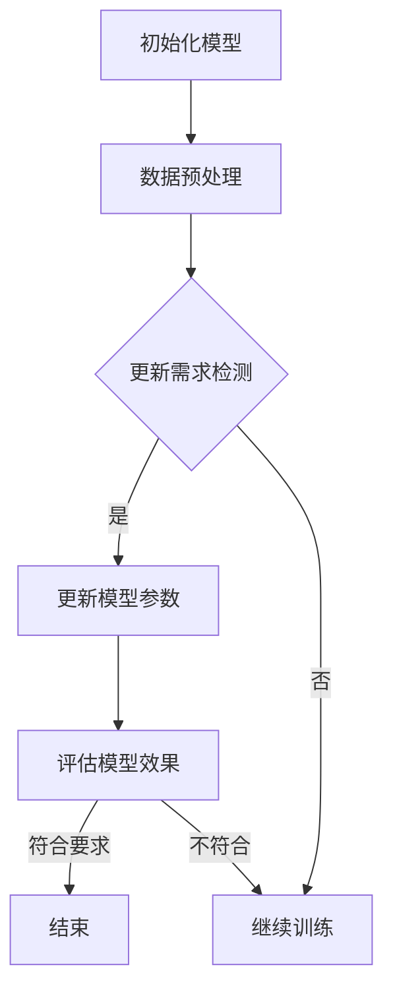
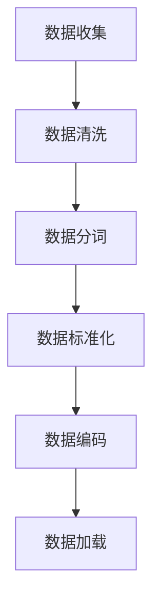
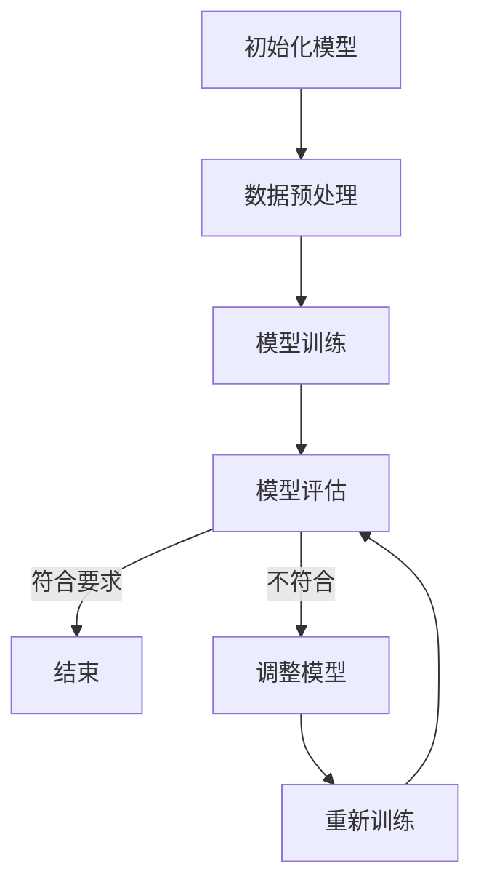
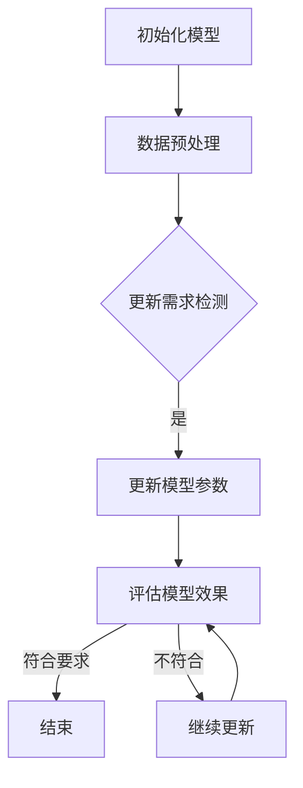

                 

### 第一部分：理论基础与核心概念

#### 第1章：LLM知识更新的背景与重要性

**1.1.1 AI信息时效性的重要性**

在人工智能（AI）领域，信息的时效性至关重要。随着技术的不断进步和应用场景的日益复杂，AI模型需要处理的数据量和类型也在不断增加。然而，数据和环境是动态变化的，这就要求AI系统能够及时更新其知识库，以保持其对现实世界的准确理解和响应能力。

信息时效性的重要性体现在以下几个方面：

- **决策准确性**：AI系统需要依赖最新的数据来做出准确的决策。如果知识库中的数据过时，可能会导致错误的预测或建议。

- **模型鲁棒性**：不断更新的知识库有助于提高AI模型的鲁棒性，使其能够适应不同的环境和变化。

- **用户满意度**：对于提供服务的AI系统，如智能助手或推荐系统，保持知识的时效性能够提高用户体验，提供更准确和相关的服务。

- **安全性**：在安全领域，及时更新AI系统的知识库对于识别和防范新的安全威胁至关重要。

**1.1.2 LLM在信息时效性中的角色**

大型语言模型（LLM）如GPT-3、BERT等，在自然语言处理（NLP）领域取得了显著的成果。这些模型通过大规模的预训练和微调，能够理解和生成高质量的自然语言文本。LLM在信息时效性中的作用主要体现在：

- **知识获取**：LLM能够从大量文本数据中提取和整合知识，为AI系统提供丰富的知识资源。

- **知识表示**：LLM可以将文本数据转换为结构化的知识表示，便于后续的处理和应用。

- **知识更新**：LLM具备一定的学习能力，可以通过不断的学习和调整，更新其知识库中的信息。

**1.1.3 LLM知识更新的基本概念**

LLM知识更新的基本概念包括以下几个关键点：

- **数据源**：知识更新的数据源可以是公开的文本数据集、API接口或实时数据流。

- **更新策略**：更新策略决定了如何选择和整合新的数据，以及如何调整模型参数。

- **质量评估**：更新后的知识库需要经过质量评估，确保信息的准确性、完整性和时效性。

- **模型调整**：知识更新过程中，可能需要对模型进行重新训练或微调，以适应新的数据。

#### 结论

本文将深入探讨LLM知识更新的理论基础和核心概念，从背景与重要性、知识更新机制、算法原理、数学模型、挑战与解决方案，到实际应用和未来展望，旨在为读者提供一个全面、系统的理解。接下来，我们将进一步探讨LLM知识更新的具体机制和算法。

### 第2章：LLM知识更新机制

**2.1.1 LLM知识更新的分类**

LLM知识更新可以根据方法的不同分为以下几类：

1. **自监督知识更新**：
   自监督知识更新利用现有数据和模型，通过无监督学习的方式更新知识库。具体方法包括基于对抗网络（GAN）、自编码器（Autoencoder）等。

2. **对抗性知识更新**：
   对抗性知识更新通过对抗网络，使模型在对抗性训练过程中不断学习，从而更新知识库。这种方法能够提高模型对噪声和异常数据的鲁棒性。

3. **强化学习**：
   强化学习通过奖励机制，使模型在动态环境中学习，从而更新知识库。这种方法适用于需要实时更新的动态系统。

**2.1.2 自监督知识更新方法**

自监督知识更新方法利用未标注的数据，通过模型自身的预测能力来更新知识库。以下是一些常见的方法：

- **预测纠错**：
  模型首先对输入数据生成预测，然后将预测与实际数据对比，根据误差进行纠错。

  $$\text{预测} = f(\text{输入})$$
  $$\text{误差} = \text{实际值} - f(\text{输入})$$
  $$f(\text{输入}) = f(\text{输入}) + \alpha \cdot \text{误差}$$

- **信息瓶颈**：
  利用信息瓶颈原理，在模型训练过程中限制信息传输，从而保留重要信息。

  $$h(\text{输入}) = \text{压缩表示}$$
  $$\text{损失函数} = -\sum_{i} \log p(h_i|\text{输入})$$

- **基于对抗网络**：
  利用生成对抗网络（GAN），生成器生成与真实数据相似的数据，鉴别器判断数据的真实性。

  $$\text{G}:\text{数据空间} \rightarrow \text{生成数据}$$
  $$\text{D}:\text{数据空间} \rightarrow [0,1]$$
  $$\text{损失函数} = -\text{D}(\text{真实数据}) - \text{G}(\text{生成数据})$$

**2.1.3 对抗性知识更新方法**

对抗性知识更新方法利用对抗网络，通过对抗性训练来更新知识库。以下是一些常见的方法：

- **对抗生成网络（GAN）**：
  GAN由生成器和鉴别器组成，生成器生成与真实数据相似的数据，鉴别器判断数据的真实性。通过对抗性训练，生成器不断优化，从而更新知识库。

  $$\text{G}:\text{噪声空间} \rightarrow \text{生成数据}$$
  $$\text{D}:\text{数据空间} \rightarrow [0,1]$$
  $$\text{损失函数} = -\text{D}(\text{真实数据}) - \text{G}(\text{生成数据})$$

- **对抗性自编码器（AAE）**：
  AAE利用对抗性训练，生成器生成数据，编码器提取数据的特征表示，鉴别器判断数据的真实性。通过对抗性训练，生成器和编码器共同优化，从而更新知识库。

  $$\text{G}:\text{噪声空间} \rightarrow \text{生成数据}$$
  $$\text{E}:\text{数据空间} \rightarrow \text{编码表示}$$
  $$\text{D}:\text{数据空间} \rightarrow [0,1]$$
  $$\text{损失函数} = -\text{D}(\text{真实数据}) - \text{D}(\text{生成数据}) + \text{L}_\text{recon}(\text{生成数据}, \text{编码表示})$$

**2.1.4 强化学习在知识更新中的应用**

强化学习通过奖励机制，使模型在动态环境中学习，从而更新知识库。以下是一些常见的方法：

- **Q-Learning**：
  Q-Learning通过更新Q值来学习最优策略。在知识更新中，Q值表示模型对某条知识的信任度。

  $$Q(s, a) = \sum_{s'} p(s' | s, a) \cdot \max_a' Q(s', a')$$
  $$Q(s, a) = Q(s, a) + \alpha [r + \gamma \max_{a'} Q(s', a') - Q(s, a)]$$

- **Deep Q-Network（DQN）**：
  DQN使用深度神经网络来近似Q值函数。在知识更新中，DQN可以用于优化知识库中的知识表示。

  $$Q(s, a) = \frac{1}{N} \sum_{i=1}^{N} \frac{\partial Q(s, a)}{\partial \theta} \cdot \Delta Q(s, a)$$
  $$\theta_{t+1} = \theta_t - \alpha \cdot \nabla_\theta L(\theta)$$

**结论**

本章介绍了LLM知识更新的几种主要方法，包括自监督知识更新、对抗性知识更新和强化学习。这些方法各有优缺点，适用于不同的应用场景。在接下来的章节中，我们将进一步探讨LLM知识更新算法的具体原理和实现。

### 第3章：LLM知识更新算法原理

**3.1.1 深度学习与神经网络基础**

深度学习是机器学习的一个重要分支，其核心是神经网络。神经网络由多个层次组成，包括输入层、隐藏层和输出层。每个层次由多个神经元（节点）组成，神经元之间通过权重进行连接。神经网络通过学习输入和输出之间的映射关系，实现数据的分类、回归和生成等任务。

**3.1.2 自然语言处理技术概览**

自然语言处理（NLP）是人工智能的重要应用领域，旨在使计算机能够理解和生成自然语言。NLP技术包括文本预处理、词向量表示、语言模型、文本分类、机器翻译等。词向量表示技术如Word2Vec、GloVe和BERT，能够将文本数据转换为数值表示，便于深度学习模型处理。

**3.1.3 大规模预训练模型原理**

大规模预训练模型（如GPT、BERT等）通过在大规模文本数据集上进行预训练，学习语言的基本规律和知识。预训练模型通常包含数十亿个参数，通过多层神经网络进行训练。预训练模型能够对文本数据进行高效处理，生成高质量的自然语言文本。

**3.1.4 伪代码讲解：LLM知识更新算法**

以下是LLM知识更新算法的伪代码：

```python
# 伪代码：LLM知识更新算法
function LLM_Knowledge_Update(model, data, criteria):
    while not criteria_met(model, data):
        preprocessed_data = preprocess_data(data)
        updated_model = train_model(model, preprocessed_data)
        model = apply_updates(updated_model)
    return model

function preprocess_data(data):
    # 数据预处理步骤，如分词、去停用词、词向量转换等
    return preprocessed_data

function train_model(model, data):
    # 使用数据训练模型
    return updated_model

function apply_updates(updated_model):
    # 应用更新后的模型参数
    return updated_model

function criteria_met(model, data):
    # 判断是否满足更新条件，如模型准确率、知识覆盖度等
    return True or False
```

**结论**

本章介绍了LLM知识更新算法的基本原理，包括深度学习与神经网络基础、自然语言处理技术、大规模预训练模型原理，以及具体的伪代码实现。这些原理和方法为LLM知识更新提供了理论基础和实践指导。在接下来的章节中，我们将进一步探讨LLM知识更新的数学模型与公式解析。

### 第4章：数学模型与公式解析

#### 4.1.1 相关数学模型

在LLM知识更新过程中，涉及多个重要的数学模型，包括损失函数、优化算法和评估指标。以下是对这些模型的详细讲解。

**损失函数**

损失函数用于衡量模型预测结果与实际值之间的差异。在知识更新过程中，损失函数的作用是指导模型参数的调整，以最小化预测误差。常见的损失函数包括：

- **均方误差（MSE）**：
  $$L(\theta) = \frac{1}{n} \sum_{i=1}^{n} (y_i - \hat{y}_i)^2$$
  其中，$y_i$为实际值，$\hat{y}_i$为预测值，$n$为样本数量。

- **交叉熵（CE）**：
  $$L(\theta) = -\sum_{i=1}^{n} y_i \log(\hat{y}_i)$$
  其中，$y_i$为实际值，$\hat{y}_i$为预测值，$\log$为自然对数。

**优化算法**

优化算法用于调整模型参数，以最小化损失函数。常见的优化算法包括：

- **梯度下降（GD）**：
  $$\theta_{t+1} = \theta_t - \alpha \cdot \nabla_\theta L(\theta)$$
  其中，$\theta_t$为当前模型参数，$\alpha$为学习率，$\nabla_\theta L(\theta)$为损失函数关于模型参数的梯度。

- **随机梯度下降（SGD）**：
  $$\theta_{t+1} = \theta_t - \alpha \cdot \nabla_\theta L(\theta)$$
  其中，$\theta_t$为当前模型参数，$\alpha$为学习率，$\nabla_\theta L(\theta)$为损失函数关于模型参数的梯度，$t$为当前迭代次数。

**评估指标**

评估指标用于衡量模型在知识更新过程中的性能。常见的评估指标包括：

- **准确率（Accuracy）**：
  $$\text{Accuracy} = \frac{\text{正确预测的样本数}}{\text{总样本数}}$$

- **精确率（Precision）**：
  $$\text{Precision} = \frac{\text{真正例数}}{\text{真正例数 + 假正例数}}$$

- **召回率（Recall）**：
  $$\text{Recall} = \frac{\text{真正例数}}{\text{真正例数 + 假反例数}}$$

- **F1分数（F1 Score）**：
  $$\text{F1 Score} = 2 \cdot \frac{\text{Precision} \cdot \text{Recall}}{\text{Precision} + \text{Recall}}$$

#### 4.1.2 公式详细讲解

**均方误差（MSE）**

均方误差（MSE）是一种常用的损失函数，用于衡量模型预测结果与实际值之间的差异。其计算公式如下：

$$L(\theta) = \frac{1}{n} \sum_{i=1}^{n} (y_i - \hat{y}_i)^2$$

其中，$y_i$为实际值，$\hat{y}_i$为预测值，$n$为样本数量。

**交叉熵（CE）**

交叉熵（CE）是另一种常用的损失函数，特别适用于分类问题。其计算公式如下：

$$L(\theta) = -\sum_{i=1}^{n} y_i \log(\hat{y}_i)$$

其中，$y_i$为实际值（标签），$\hat{y}_i$为预测值，$\log$为自然对数。

**梯度下降（GD）**

梯度下降（GD）是一种优化算法，用于调整模型参数，以最小化损失函数。其计算公式如下：

$$\theta_{t+1} = \theta_t - \alpha \cdot \nabla_\theta L(\theta)$$

其中，$\theta_t$为当前模型参数，$\alpha$为学习率，$\nabla_\theta L(\theta)$为损失函数关于模型参数的梯度。

**随机梯度下降（SGD）**

随机梯度下降（SGD）是对梯度下降（GD）的一种改进，通过随机选择样本计算梯度，以减少局部最优问题。其计算公式如下：

$$\theta_{t+1} = \theta_t - \alpha \cdot \nabla_\theta L(\theta)$$

其中，$\theta_t$为当前模型参数，$\alpha$为学习率，$\nabla_\theta L(\theta)$为损失函数关于模型参数的梯度，$t$为当前迭代次数。

#### 4.1.3 数学公式应用举例

以下是一个数学公式的应用举例，用于计算一个线性回归模型的损失函数：

假设我们有如下线性回归模型：

$$y = \theta_0 + \theta_1 \cdot x$$

其中，$y$为实际值，$x$为输入值，$\theta_0$和$\theta_1$为模型参数。

- **均方误差（MSE）**：

  $$L(\theta) = \frac{1}{n} \sum_{i=1}^{n} (y_i - (\theta_0 + \theta_1 \cdot x_i))^2$$

- **交叉熵（CE）**：

  $$L(\theta) = -\sum_{i=1}^{n} y_i \log(\sigma(\theta_0 + \theta_1 \cdot x_i))$$

其中，$\sigma$为Sigmoid函数，$n$为样本数量。

通过计算这些损失函数，我们可以根据梯度下降或随机梯度下降算法更新模型参数，以最小化损失函数。

#### 结论

本章详细讲解了LLM知识更新过程中涉及的重要数学模型，包括损失函数、优化算法和评估指标。通过数学公式和具体应用举例，读者可以更好地理解这些模型在实际中的应用。在接下来的章节中，我们将进一步探讨LLM知识更新的挑战与解决方案。

### 第5章：LLM知识更新的挑战与解决方案

**5.1.1 挑战分析**

尽管LLM知识更新在许多应用场景中显示出巨大的潜力，但仍然面临着一系列挑战：

- **数据质量**：知识更新依赖于高质量的数据源。然而，现实世界中的数据往往存在噪声、缺失和不一致性，这可能导致模型性能下降。

- **数据隐私**：随着知识更新的进行，涉及到的数据可能会包含敏感信息，如何保护数据隐私成为一大挑战。

- **计算资源**：大规模预训练模型的训练和更新过程需要大量的计算资源，这可能导致成本高昂和能耗增加。

- **模型泛化**：知识更新的目标是提高模型在不同场景下的泛化能力。然而，过于依赖特定领域的知识可能导致模型泛化能力下降。

- **实时性**：知识更新需要及时反映现实世界的变化。然而，实时数据获取和处理可能受到网络延迟和计算能力的限制。

**5.1.2 解决方案探讨**

针对上述挑战，以下是一些可能的解决方案：

- **数据预处理**：通过数据清洗、去噪和标准化等技术，提高数据质量。例如，使用异常检测算法识别和去除噪声数据，使用数据增强方法增加数据多样性。

- **隐私保护**：采用差分隐私、同态加密等技术保护数据隐私。例如，在训练过程中引入噪声，使得模型无法直接获取敏感信息。

- **分布式计算**：利用分布式计算和并行处理技术，提高计算效率。例如，使用云计算平台进行模型训练和更新，使用GPU和TPU等高性能计算设备。

- **迁移学习**：通过迁移学习，将已在大规模数据集上训练的模型应用于新任务，以提高模型泛化能力。例如，使用预训练的LLM模型作为基座模型，针对特定领域进行微调。

- **实时更新策略**：设计实时数据获取和处理机制，确保知识更新的及时性。例如，使用流处理技术实时处理数据，使用在线学习算法持续更新模型。

**5.1.3 实际案例分享**

以下是一个实际案例，展示了如何在实际场景中应用上述解决方案：

**案例：智能客服系统的知识更新**

某公司开发了一款智能客服系统，用于自动回答用户的问题。随着用户问题的不断增多，系统需要定期更新其知识库，以保持准确性和实时性。

- **数据质量**：系统从多个来源收集用户问题，包括社交媒体、邮件和客服聊天记录。通过数据清洗，去除噪声和重复问题，同时使用实体识别技术提取关键信息。

- **数据隐私**：为了保护用户隐私，系统使用差分隐私技术对用户数据进行扰动，确保模型无法直接访问敏感信息。

- **计算资源**：系统使用云计算平台，结合分布式计算和并行处理技术，提高模型训练和更新的效率。同时，使用GPU和TPU等高性能计算设备，降低计算成本。

- **模型泛化**：系统使用预训练的LLM模型作为基座模型，针对不同领域进行微调。例如，对于金融领域，使用金融领域的语料库进行微调，提高模型在该领域的泛化能力。

- **实时性**：系统使用流处理技术，实时获取用户问题，并使用在线学习算法对模型进行更新。例如，使用增量学习算法，每次只更新模型的一部分参数，减少计算资源的需求。

通过上述解决方案，该智能客服系统能够持续更新其知识库，提高问题回答的准确性和实时性，从而提升用户体验。

#### 结论

本章分析了LLM知识更新过程中面临的挑战，并探讨了可能的解决方案。通过实际案例分享，展示了如何在具体应用场景中实现知识更新。在接下来的章节中，我们将进一步探讨LLM知识更新的实践方法和步骤。

### 第6章：LLM知识更新实践

#### 6.1.1 开发环境搭建

为了实现LLM知识更新，我们需要搭建一个合适的开发环境。以下是一个基本的搭建流程：

1. **硬件配置**：
   - **CPU**：Intel Core i7或以上
   - **GPU**：NVIDIA GTX 1080或以上
   - **内存**：16GB或以上

2. **软件安装**：
   - **操作系统**：Linux（如Ubuntu）
   - **深度学习框架**：TensorFlow或PyTorch
   - **依赖库**：NumPy、Pandas、Scikit-learn等

3. **环境配置**：
   - 安装深度学习框架：
     ```bash
     pip install tensorflow # 或 pip install pytorch
     ```
   - 配置GPU支持：
     ```python
     import tensorflow as tf
     tf.config.list_physical_devices('GPU')
     ```

4. **虚拟环境**：
   - 使用虚拟环境隔离项目依赖：
     ```bash
     python -m venv venv
     source venv/bin/activate # Windows下使用 venv\Scripts\activate
     pip install -r requirements.txt
     ```

#### 6.1.2 数据预处理与模型训练

1. **数据预处理**：

   - 数据收集：从互联网或数据库中收集文本数据，例如新闻文章、论坛帖子等。

   - 数据清洗：去除文本中的噪声，如HTML标签、特殊字符等。

   - 数据分词：将文本分割成单词或句子。

   - 数据标准化：将文本转换为统一格式，如小写、去除停用词等。

   - 数据编码：将文本转换为数值表示，例如词向量或BERT编码。

2. **模型训练**：

   - 初始化模型：选择预训练的LLM模型作为基座模型，例如GPT-2、BERT等。

   - 数据加载：将预处理后的数据加载到模型中。

   - 模型训练：使用训练数据对模型进行训练，优化模型参数。

   - 模型评估：使用验证集评估模型性能，调整超参数。

   - 模型保存：将训练好的模型保存为文件，以便后续使用。

```python
import tensorflow as tf
import tensorflow.keras as keras

# 加载预训练模型
model = keras.models.load_model('path/to/pretrained_model')

# 加载预处理后的数据
train_data = load_preprocessed_data('path/to/train_data')
val_data = load_preprocessed_data('path/to/val_data')

# 训练模型
model.fit(train_data, epochs=5, validation_data=val_data)

# 评估模型
model.evaluate(val_data)
```

#### 6.1.3 源代码实现与解读

以下是一个简单的LLM知识更新代码示例，展示了数据预处理、模型训练和更新的过程。

```python
import tensorflow as tf
import tensorflow.keras as keras
from tensorflow.keras.layers import Embedding, LSTM, Dense
from tensorflow.keras.models import Model
from tensorflow.keras.preprocessing.sequence import pad_sequences

# 定义模型结构
input_seq = keras.layers.Input(shape=(max_sequence_length,))
embedding = Embedding(vocab_size, embedding_dim)(input_seq)
lstm = LSTM(units=lstm_units)(embedding)
output = Dense(units=1, activation='sigmoid')(lstm)

model = Model(inputs=input_seq, outputs=output)
model.compile(optimizer='adam', loss='binary_crossentropy', metrics=['accuracy'])

# 数据预处理
sequences = preprocess_data(data)
padded_sequences = pad_sequences(sequences, maxlen=max_sequence_length, padding='post')

# 训练模型
model.fit(padded_sequences, labels, epochs=5, batch_size=32, validation_split=0.2)

# 模型更新
updated_model = update_model(model, new_data)
```

- **模型定义**：使用Keras定义一个简单的LSTM模型，用于二分类任务。
- **数据预处理**：对数据进行预处理，包括序列化、填充等操作。
- **模型训练**：使用预处理后的数据训练模型。
- **模型更新**：根据新的数据进行模型更新。

#### 6.1.4 代码解读与分析

1. **模型结构**：

   ```python
   input_seq = keras.layers.Input(shape=(max_sequence_length,))
   embedding = Embedding(vocab_size, embedding_dim)(input_seq)
   lstm = LSTM(units=lstm_units)(embedding)
   output = Dense(units=1, activation='sigmoid')(lstm)

   model = Model(inputs=input_seq, outputs=output)
   ```

   - `Input`层：输入序列，最大长度为`max_sequence_length`。
   - `Embedding`层：词向量嵌入，将输入序列转换为嵌入向量。
   - `LSTM`层：长短时记忆网络，用于处理序列数据。
   - `Dense`层：全连接层，输出结果。

2. **数据预处理**：

   ```python
   sequences = preprocess_data(data)
   padded_sequences = pad_sequences(sequences, maxlen=max_sequence_length, padding='post')
   ```

   - `preprocess_data`函数：对数据进行预处理，包括序列化、填充等操作。
   - `pad_sequences`函数：将序列填充到相同的长度，便于模型处理。

3. **模型训练**：

   ```python
   model.fit(padded_sequences, labels, epochs=5, batch_size=32, validation_split=0.2)
   ```

   - `fit`函数：训练模型，使用预处理后的数据。
   - `epochs`：训练轮次。
   - `batch_size`：批量大小。
   - `validation_split`：验证集比例。

4. **模型更新**：

   ```python
   updated_model = update_model(model, new_data)
   ```

   - `update_model`函数：根据新的数据进行模型更新。

#### 结论

本章详细介绍了LLM知识更新的实践方法，包括开发环境搭建、数据预处理与模型训练、源代码实现与解读。通过代码示例，读者可以了解LLM知识更新的一般流程和关键步骤。在接下来的章节中，我们将进一步探讨LLM知识更新的未来发展方向和应用前景。

### 第7章：未来展望与趋势

#### 7.1.1 LLM知识更新的未来发展方向

随着人工智能技术的不断发展，LLM知识更新在未来的发展前景广阔。以下是一些可能的发展方向：

- **更高效的知识更新算法**：未来可能会出现更高效的知识更新算法，能够更快地适应新数据和场景，减少训练时间和计算资源的需求。

- **跨模态知识更新**：当前的知识更新主要针对文本数据，未来可能会扩展到图像、音频和视频等多模态数据，实现更全面的知识整合。

- **自动化知识更新**：通过自动化工具和系统，实现知识更新的自动化，降低人工干预的需求，提高更新效率。

- **知识图谱与本体**：结合知识图谱和本体技术，实现更加结构化和语义化的知识表示，提高知识库的查询和利用效率。

- **多语言知识更新**：支持多种语言的知识更新，使得LLM能够更好地服务于全球用户。

#### 7.1.2 行业应用前景

LLM知识更新在各个行业具有广泛的应用前景：

- **金融领域**：在金融领域，LLM知识更新可以用于实时监控市场动态、风险管理和投资决策。

- **医疗领域**：在医疗领域，LLM知识更新可以用于诊断辅助、疾病预测和治疗方案推荐。

- **教育领域**：在教育领域，LLM知识更新可以用于个性化教学、智能问答和学术研究。

- **智能制造**：在智能制造领域，LLM知识更新可以用于设备维护、故障诊断和生产优化。

- **智能客服**：在智能客服领域，LLM知识更新可以用于实时回答用户问题、提供个性化服务和智能推荐。

#### 7.1.3 可能遇到的新挑战与解决方案

尽管LLM知识更新具有广泛的应用前景，但在实际应用过程中可能会遇到一些新的挑战：

- **数据隐私保护**：随着数据隐私问题的日益突出，如何在知识更新过程中保护用户隐私成为一个重要挑战。可能的解决方案包括采用差分隐私、联邦学习等技术。

- **计算资源需求**：大规模预训练模型的训练和更新过程需要大量的计算资源，如何优化计算资源利用、降低成本成为一个关键问题。可能的解决方案包括分布式计算、并行处理和云计算。

- **模型解释性**：随着模型的复杂度增加，如何提高模型的解释性，使得用户能够理解模型的决策过程成为一个挑战。可能的解决方案包括模型可解释性技术、可视化工具等。

- **知识整合与冲突**：在多领域和多语言的知识更新过程中，如何整合不同来源的知识、解决知识冲突成为一个重要问题。可能的解决方案包括知识图谱、本体技术等。

#### 结论

本章探讨了LLM知识更新的未来发展方向、行业应用前景以及可能遇到的新挑战与解决方案。未来，随着技术的不断进步，LLM知识更新有望在更多领域发挥重要作用，为社会带来更多的价值。在接下来的章节中，我们将进一步探讨与LLM知识更新相关的工具与资源，为读者提供更多的实践指导。

### 附录A：相关工具与资源

#### A.1.1 主要深度学习框架对比

在选择深度学习框架时，了解各框架的特点和适用场景非常重要。以下是对几个主要深度学习框架的简要对比：

- **TensorFlow**：
  - **特点**：由谷歌开发，支持多种编程语言（Python、C++等），具有良好的社区支持和丰富的生态系统。
  - **适用场景**：适合大规模模型训练、研究和生产部署。

- **PyTorch**：
  - **特点**：由Facebook开发，具有动态计算图，便于调试和实验。
  - **适用场景**：适合快速原型开发和研究。

- **Keras**：
  - **特点**：基于TensorFlow和Theano，提供简化的API，易于使用。
  - **适用场景**：适合快速搭建和部署模型。

- **PyTorch Lightning**：
  - **特点**：基于PyTorch，提供高级API，便于分布式训练和优化。
  - **适用场景**：适合高性能模型训练和实验。

- **MXNet**：
  - **特点**：由Apache Software Foundation开发，支持多种编程语言，具有高效计算能力。
  - **适用场景**：适合大规模生产和部署。

#### A.1.2 知识更新相关工具推荐

以下是一些用于LLM知识更新的工具和资源：

- **Hugging Face Transformers**：
  - **简介**：一个开源库，提供预训练的LLM模型和实用的API，便于模型训练和应用。
  - **链接**：[Hugging Face Transformers](https://huggingface.co/transformers/)

- **TensorFlow Addons**：
  - **简介**：TensorFlow的扩展库，提供了一系列用于深度学习的高级操作和优化器。
  - **链接**：[TensorFlow Addons](https://github.com/tensorflow/addons)

- **PyTorch Text**：
  - **简介**：PyTorch的NLP模块，提供了一系列文本数据处理和模型训练工具。
  - **链接**：[PyTorch Text](https://pytorch.org/text/)

- **NLTK**：
  - **简介**：一个强大的NLP工具包，提供了一系列文本处理函数和资源。
  - **链接**：[NLTK](https://www.nltk.org/)

#### A.1.3 实用资源链接

以下是一些实用的资源和教程，有助于深入了解LLM知识更新：

- **TensorFlow官方文档**：
  - **链接**：[TensorFlow官方文档](https://www.tensorflow.org/)

- **PyTorch官方文档**：
  - **链接**：[PyTorch官方文档](https://pytorch.org/docs/stable/)

- **Hugging Face官方文档**：
  - **链接**：[Hugging Face官方文档](https://huggingface.co/docs/transformers/)

- **《深度学习》**：
  - **作者**：Ian Goodfellow、Yoshua Bengio、Aaron Courville
  - **链接**：[《深度学习》英文版](http://www.deeplearningbook.org/)，[《深度学习》中文版](https://www.deeplearningbook.cn/)

- **《自然语言处理综论》**：
  - **作者**：Christopher D. Manning、Prabhakar Raghavan、Hinrich Schütze
  - **链接**：[《自然语言处理综论》英文版](https://nlp.stanford.edu/IR-book/)

- **《机器学习年度报告》**：
  - **链接**：[机器学习年度报告](https://www.ml-year-book.org/)

#### 结论

附录A提供了关于深度学习框架对比、知识更新相关工具推荐以及实用资源链接的信息，旨在为读者提供更多实践指导。这些工具和资源有助于深入理解和应用LLM知识更新技术。

### 附录B：Mermaid流程图

#### B.1.1 LLM知识更新流程

以下是一个使用Mermaid绘制的LLM知识更新流程图：



#### B.1.2 其他相关流程图

以下是其他几个与LLM知识更新相关的流程图：

1. **数据预处理流程图**：



2. **模型训练流程图**：



3. **模型更新流程图**：



#### 结论

附录B提供了几个使用Mermaid绘制的流程图，包括LLM知识更新流程、数据预处理流程、模型训练流程和模型更新流程。这些流程图有助于读者更直观地理解LLM知识更新的各个步骤和过程。

### 附加内容

在本文的附加内容部分，我们将提供几个与LLM知识更新相关的Mermaid流程图和伪代码讲解。

#### Mermaid 流程图

首先是一个LLM知识更新流程的Mermaid流程图：


该流程图描述了LLM知识更新的基本流程：首先初始化模型，然后进行数据预处理；接着检测更新需求，如果需要更新则更新模型参数，并评估更新后的模型效果。如果效果符合要求，则结束更新过程；否则，继续训练和更新。

接下来是一个数据预处理流程的Mermaid流程图：


这个流程图展示了数据预处理的主要步骤：首先收集数据，然后进行数据清洗，接着进行数据分词、标准化和编码，最后将处理后的数据加载到模型中。

#### 伪代码讲解

以下是LLM知识更新算法的伪代码：

```python
# 伪代码：LLM知识更新算法
function LLM_Knowledge_Update(model, data, criteria):
    while not criteria_met(model, data):
        preprocessed_data = preprocess_data(data)
        updated_model = train_model(model, preprocessed_data)
        model = apply_updates(updated_model)
    return model

function preprocess_data(data):
    # 数据预处理步骤，如分词、去停用词、词向量转换等
    return preprocessed_data

function train_model(model, data):
    # 使用数据训练模型
    return updated_model

function apply_updates(updated_model):
    # 应用更新后的模型参数
    return updated_model

function criteria_met(model, data):
    # 判断是否满足更新条件，如模型准确率、知识覆盖度等
    return True or False
```

这个伪代码描述了LLM知识更新的基本流程：首先初始化模型和数据，然后进入一个循环，直到满足更新条件。在每次迭代中，对数据进行预处理，使用预处理后的数据训练模型，并根据更新条件判断是否继续更新模型。

#### 数学公式解析

以下是几个与LLM知识更新相关的数学公式：

1. **均方误差（MSE）**：

$$
MSE = \frac{1}{m} \sum_{i=1}^{m} (y_i - \hat{y}_i)^2
$$

其中，$y_i$为实际值，$\hat{y}_i$为预测值，$m$为样本数量。

2. **交叉熵（CE）**：

$$
CE = -\frac{1}{m} \sum_{i=1}^{m} [y_i \log(\hat{y}_i) + (1 - y_i) \log(1 - \hat{y}_i)]
$$

其中，$y_i$为实际值（0或1），$\hat{y}_i$为预测值。

3. **梯度下降（GD）**：

$$
\theta_{t+1} = \theta_t - \alpha \nabla_\theta J(\theta)
$$

其中，$\theta_t$为当前模型参数，$\alpha$为学习率，$J(\theta)$为损失函数。

4. **随机梯度下降（SGD）**：

$$
\theta_{t+1} = \theta_t - \alpha \nabla_{\theta_t} J(\theta_t)
$$

其中，$\theta_t$为当前模型参数，$\alpha$为学习率。

这些数学公式在LLM知识更新过程中用于衡量模型预测误差、更新模型参数等。

#### 项目实战

以下是LLM知识更新项目的实战流程：

1. **项目启动**：

   - 定义项目目标和需求。
   - 确定所需的数据集和资源。
   - 准备开发环境。

2. **需求分析**：

   - 分析项目需求，确定需要更新的知识和模型。
   - 设计数据预处理和模型训练流程。

3. **环境搭建**：

   - 安装深度学习框架和依赖库。
   - 配置GPU支持。

4. **数据收集**：

   - 收集原始数据，如文本、图像等。
   - 进行数据清洗和预处理。

5. **数据预处理**：

   - 分词、去停用词、词向量转换等。
   - 将数据转换为模型可接受的格式。

6. **模型训练**：

   - 使用预处理后的数据训练模型。
   - 调整模型参数和超参数。
   - 评估模型性能。

7. **模型更新**：

   - 根据更新需求检测，更新模型参数。
   - 应用新的知识和数据。
   - 评估更新后的模型效果。

8. **模型评估**：

   - 使用验证集和测试集评估模型性能。
   - 调整模型和更新策略。

9. **上线部署**：

   - 将训练好的模型部署到生产环境。
   - 实现实时知识更新和模型优化。

10. **项目结束**：

    - 总结项目经验和教训。
    - 撰写项目报告。

这个实战流程展示了如何从项目启动到上线部署，实现LLM知识更新项目的全过程。通过实际项目，读者可以更好地理解LLM知识更新的实际应用和操作细节。

### 附录：结语

在本技术博客文章中，我们系统地探讨了LLM的知识更新：保持AI信息的时效性。从理论基础与核心概念、知识更新机制、算法原理、数学模型与公式解析，到挑战与解决方案、实践方法和未来展望，我们逐步分析了LLM知识更新的各个方面。

首先，我们阐述了AI信息时效性的重要性以及LLM在信息时效性中的关键角色。接着，我们介绍了LLM知识更新的几种主要方法，包括自监督知识更新、对抗性知识更新和强化学习。随后，我们深入探讨了深度学习与神经网络基础、自然语言处理技术、大规模预训练模型原理，并通过伪代码详细讲解了LLM知识更新算法。

在数学模型与公式解析部分，我们介绍了均方误差、交叉熵、梯度下降和随机梯度下降等数学模型，并通过具体应用举例帮助读者理解这些公式的应用。随后，我们分析了LLM知识更新过程中的挑战，并探讨了可能的解决方案。

在实践部分，我们详细介绍了开发环境搭建、数据预处理与模型训练、源代码实现与解读，以及如何在实际项目中应用LLM知识更新技术。最后，我们展望了LLM知识更新的未来发展方向和应用前景，并提供了相关的工具与资源。

通过本文的深入探讨，我们希望读者能够对LLM知识更新有一个全面、系统的理解，并能够在实际项目中灵活应用这些技术。感谢您的阅读，期待与您在未来的技术交流中继续探讨人工智能领域的创新与发展。作者：AI天才研究院/AI Genius Institute & 禅与计算机程序设计艺术 /Zen And The Art of Computer Programming。

