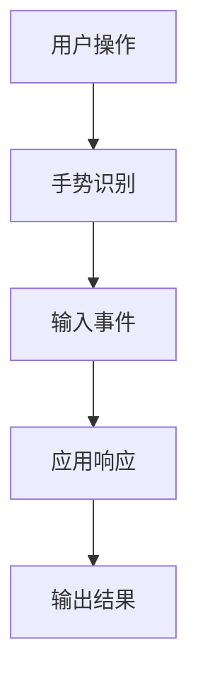

                 

### 第1章: 虚拟现实（VR）技术基础

#### 1.1 VR技术概述

虚拟现实（VR）是一种通过计算机生成的模拟环境，使用户能够沉浸在虚拟世界中。这种技术利用传感器、头戴显示器（HMD）和其他输入设备，创造出一个三维的虚拟空间，用户可以在其中进行交互和探索。VR技术的历史可以追溯到1960年代，当时麻省理工学院的伊凡·苏瑟兰（Ivan Sutherland）发明了第一个头戴显示器，称为“达摩克利斯之剑”（The Sword of Damocles）。这一发明标志着VR技术的诞生。

VR技术主要分为两大类：桌面VR和沉浸式VR。桌面VR主要通过计算机屏幕进行虚拟现实的呈现，而沉浸式VR则使用头戴显示器和其他设备来创造一个完全沉浸式的体验。

虚拟现实的发展趋势是越来越向高分辨率、低延迟和高度交互性方向发展。未来，VR技术可能会与增强现实（AR）和混合现实（MR）融合，为用户提供更加丰富和交互性的体验。

#### 1.2 虚拟现实硬件设备

虚拟现实硬件设备是VR技术的重要组成部分。目前，市场上主要的VR头盔包括Oculus Rift、HTC Vive和PlayStation VR。

##### 1.2.1 Oculus Rift
Oculus Rift是由Facebook开发的一款高端VR头盔，具有高分辨率、低延迟和优秀的头动追踪性能。它使用两个OLED屏幕，分辨率达到2160x1200（每眼），刷新率高达90Hz或120Hz。Oculus Rift的输入设备是Oculus Touch控制器，支持手势识别和空间定位。

##### 1.2.2 HTC Vive
HTC Vive是一款由HTC和Valve合作开发的VR头盔，提供了广泛的空间定位功能。它使用两个1080p屏幕，分辨率达到2160x1200，刷新率高达90Hz。HTC Vive配备了两个控制器，称为Vive控制器，以及两个定位基站，用于捕捉用户的空间位置和运动。

##### 1.2.3 PlayStation VR
PlayStation VR是索尼推出的一款VR头盔，专为PlayStation 4和PlayStation 5游戏机设计。它使用一个5.7英寸OLED屏幕，分辨率达到1920x1080，刷新率高达120Hz。PlayStation VR的输入设备是两个PlayStation VR手柄，支持手势识别和体感控制。

除了头盔，VR运动控制器也是实现沉浸式体验的关键设备。这些控制器可以捕捉用户的手部动作和手势，使得用户能够在虚拟环境中进行交互。

##### 1.2.4 Oculus Touch
Oculus Touch是Oculus Rift的配套控制器，提供了精确的手势识别和交互。它使用红外传感器和低延迟的蓝牙连接，能够实时捕捉用户的手部动作。

##### 1.2.5 HTC Vive控制器
HTC Vive控制器是HTC Vive的输入设备，提供了高精度的运动捕捉能力。它们使用低延迟的无线连接，能够实时捕捉用户的空间位置和运动。

##### 1.2.6 PlayStation VR手柄
PlayStation VR手柄是PlayStation VR的输入设备，支持手势识别和体感控制。它们使用无线连接，能够实时捕捉用户的手部动作。

#### 1.3 虚拟现实软件技术

虚拟现实软件技术是实现VR体验的核心。目前，市场上主要有几种VR内容开发平台：Oculus Rift SDK、Unity for VR和Unreal Engine for VR。

##### 1.3.1 Oculus Rift SDK
Oculus Rift SDK是Oculus Rift头盔的开发工具包，提供了用于创建VR应用的各种接口和功能。它包括API、工具和示例代码，用于处理输入、渲染和音频等功能。

##### 1.3.2 Unity for VR
Unity是一款强大的游戏开发引擎，提供了广泛的VR开发工具和资源。它支持Oculus Rift、HTC Vive和PlayStation VR等主要VR头盔，并提供了丰富的3D内容创建工具和脚本编程接口。

##### 1.3.3 Unreal Engine for VR
Unreal Engine是一款高性能的游戏开发引擎，广泛应用于VR内容开发。它提供了强大的渲染管线和物理引擎，支持Oculus Rift、HTC Vive和PlayStation VR等主要VR头盔。

除了上述平台，增强现实（AR）和混合现实（MR）技术也是VR技术的重要分支。AR技术通过将虚拟元素叠加在现实世界中，为用户提供增强的交互体验。MR技术则将虚拟元素与现实世界融合在一起，为用户提供更加丰富和交互性的体验。

#### 1.3.4 增强现实（AR）与混合现实（MR）
增强现实（AR）是一种通过计算机生成的虚拟元素叠加在现实世界中的技术。AR技术可以用于各种应用，如教育、医疗、娱乐和市场营销等。AR的关键技术包括摄像头捕捉、图像处理和实时渲染。

混合现实（MR）是将虚拟元素与现实世界融合在一起的技术。MR技术为用户提供了一个更加丰富和交互性的虚拟环境。MR的关键技术包括空间定位、手势识别和语音交互。

综上所述，虚拟现实（VR）技术已经从早期的概念发展为今天广泛应用的领域。VR技术的基础包括虚拟现实硬件设备、虚拟现实软件技术和增强现实（AR）与混合现实（MR）技术。这些技术为用户提供了沉浸式、实时和多感官的体验，推动了虚拟现实技术的不断发展和创新。

### 第2章: Oculus Rift SDK基本架构

Oculus Rift SDK是Oculus Rift虚拟现实头盔的开发工具包，为开发者提供了创建和优化VR应用所需的各种接口和功能。本章将详细介绍Oculus Rift SDK的基本架构，包括其组成、安装过程、开发环境搭建以及核心模块的功能和使用方法。

#### 2.1 Oculus Rift SDK简介

Oculus Rift SDK主要包括以下组成部分：

##### 2.1.1 API
API是应用程序编程接口，提供了与Oculus Rift硬件和软件交互的接口。通过API，开发者可以获取和设置Oculus Rift的各种参数，如分辨率、帧率和输入模式。API还提供了对头动追踪、手势识别和声音识别的支持。

##### 2.1.2 工具
Oculus Rift SDK包含了一系列开发工具，用于构建、测试和优化VR应用。这些工具包括：

- **Oculus Remote Server**：用于模拟Oculus Rift硬件设备，方便开发者进行本地开发和测试。
- **Oculus SDK Editor**：提供了一个图形界面，用于编辑和配置SDK设置。
- **Oculus VR Setup Utility**：用于安装和配置Oculus Rift硬件设备。

##### 2.1.3 示例代码
Oculus Rift SDK附带了一些示例代码，展示了如何使用SDK实现各种功能。这些示例代码可以帮助开发者快速入门，了解SDK的使用方法和最佳实践。

#### 2.1.2 SDK的安装

安装Oculus Rift SDK需要在计算机上安装特定的软件和驱动程序。以下是一个简化的安装步骤：

1. **确保计算机符合系统要求**：Oculus Rift SDK要求计算机具有高性能的CPU、GPU和足够的内存。详细系统要求可以在Oculus官网找到。

2. **下载Oculus Rift SDK**：从Oculus官网下载最新的SDK版本。

3. **安装Oculus Rift SDK**：运行下载的安装程序，按照提示进行安装。

4. **安装驱动程序**：安装Oculus Rift头盔的驱动程序，确保硬件设备能够正常工作。

5. **配置Oculus Rift硬件**：通过Oculus VR Setup Utility配置Oculus Rift头盔，包括设置分辨率、帧率和输入模式。

#### 2.2 Oculus Rift开发环境搭建

搭建Oculus Rift开发环境需要安装开发工具和设置开发环境。以下是一个简化的开发环境搭建步骤：

##### 2.2.1 开发工具安装

1. **安装Unity**：Unity是一款流行的游戏开发引擎，广泛用于VR应用开发。可以从Unity官网下载并安装最新版本。

2. **安装Unreal Engine**：Unreal Engine是一款高性能的游戏开发引擎，也广泛应用于VR应用开发。可以从Epic Games官网下载并安装最新版本。

##### 2.2.2 开发环境配置

1. **配置Unity开发环境**：

   - 在Unity中安装Oculus Rift插件。
   - 配置Unity项目，设置Oculus Rift参数，如分辨率和帧率。

2. **配置Unreal Engine开发环境**：

   - 在Unreal Engine中安装Oculus Rift插件。
   - 配置Unreal Engine项目，设置Oculus Rift参数，如分辨率和帧率。

#### 2.3 Oculus Rift SDK核心模块

Oculus Rift SDK的核心模块包括配置管理、输入管理、图形渲染和音频处理等。以下是这些核心模块的简要介绍：

##### 2.3.1 配置管理

配置管理模块用于设置Oculus Rift硬件和软件的参数，包括分辨率、帧率和输入模式等。通过配置管理模块，开发者可以调整Oculus Rift的性能和体验。

1. **Unity配置**：

   - 在Unity编辑器中，通过Oculus Rift插件设置分辨率和帧率。
   - 使用Unity的C#脚本，动态调整Oculus Rift的配置。

2. **Unreal Engine配置**：

   - 在Unreal Engine编辑器中，通过Oculus Rift插件设置分辨率和帧率。
   - 使用Unreal Engine的蓝图系统和C++脚本，动态调整Oculus Rift的配置。

##### 2.3.2 输入管理

输入管理模块用于处理用户输入，包括手势识别、键盘输入和控制器操作等。通过输入管理模块，开发者可以实现各种交互功能。

1. **手势识别**：

   - 使用Oculus Rift SDK的手势识别API，捕捉用户的手部动作和手势。
   - 结合Unity的C#脚本和Unreal Engine的蓝图系统或C++脚本，实现手势识别功能。

2. **控制器操作**：

   - 使用Oculus Rift SDK的控制器操作API，捕捉控制器的输入和状态。
   - 结合Unity的C#脚本和Unreal Engine的蓝图系统或C++脚本，实现控制器操作功能。

##### 2.3.3 图形渲染

图形渲染模块用于处理VR场景的渲染，包括场景的绘制、光照和阴影等。通过图形渲染模块，开发者可以实现高质量的VR图形效果。

1. **Unity渲染**：

   - 使用Unity的渲染系统，结合Oculus Rift插件，实现VR场景的渲染。
   - 使用Unity的C#脚本，控制场景的绘制和渲染效果。

2. **Unreal Engine渲染**：

   - 使用Unreal Engine的渲染系统，结合Oculus Rift插件，实现VR场景的渲染。
   - 使用Unreal Engine的蓝图系统或C++脚本，控制场景的绘制和渲染效果。

##### 2.3.4 音频处理

音频处理模块用于处理VR场景的音频，包括声音的捕捉、播放和空间声效等。通过音频处理模块，开发者可以实现沉浸式的音频体验。

1. **Unity音频**：

   - 使用Unity的音频系统，结合Oculus Rift插件，实现VR场景的音频处理。
   - 使用Unity的C#脚本，控制声音的播放和空间声效。

2. **Unreal Engine音频**：

   - 使用Unreal Engine的音频系统，结合Oculus Rift插件，实现VR场景的音频处理。
   - 使用Unreal Engine的蓝图系统或C++脚本，控制声音的播放和空间声效。

综上所述，Oculus Rift SDK为开发者提供了丰富的功能和工具，用于创建和优化VR应用。通过安装SDK、搭建开发环境和熟悉核心模块的功能，开发者可以轻松实现高质量的VR应用。本章的后续内容将深入探讨Oculus Rift SDK的具体功能和应用场景。

### 第3章: VR应用开发基础

虚拟现实（VR）应用开发是一项复杂且具有挑战性的任务，需要开发者在多个方面进行综合考虑。本章将详细介绍VR应用开发的基础，包括开发流程、工具选择和核心模块的实现。

#### 3.1 VR应用开发流程

VR应用开发流程可以分为以下几个阶段：

##### 3.1.1 应用设计

应用设计是VR应用开发的第一步，包括确定应用的目标、功能和技术实现方案。在设计阶段，开发者需要考虑以下几个方面：

1. **目标用户**：明确应用的目标用户群体，包括年龄、兴趣和需求等。
2. **功能需求**：列出应用需要实现的功能，如导航、交互、学习等。
3. **技术实现**：确定应用的技术实现方案，包括开发平台、工具和硬件设备。

##### 3.1.2 应用开发

应用开发阶段是实际编写代码和实现功能的过程。根据不同的开发平台，可以选择不同的开发工具和编程语言。以下是两种常用的开发平台及其开发工具：

1. **Unity for VR**：

   - Unity是一款流行的游戏开发引擎，广泛应用于VR应用开发。
   - Unity提供了丰富的3D内容创建工具和脚本编程接口。
   - 开发者可以使用C#语言编写脚本，实现应用的功能和交互。

2. **Unreal Engine for VR**：

   - Unreal Engine是一款高性能的游戏开发引擎，也广泛应用于VR应用开发。
   - Unreal Engine提供了强大的渲染管线和物理引擎。
   - 开发者可以使用C++语言或蓝图系统编写脚本，实现应用的功能和交互。

##### 3.1.3 应用测试与优化

应用测试与优化是确保应用质量和性能的重要环节。测试阶段包括功能测试、性能测试和用户体验测试等。

1. **功能测试**：测试应用的所有功能，确保其正常运行。
2. **性能测试**：测试应用的性能，包括帧率、响应时间和输入延迟等。
3. **用户体验测试**：评估应用的用户体验，包括交互设计、操作流程和视觉呈现等。

优化阶段包括以下几个方面：

1. **渲染性能优化**：通过优化渲染管线和图形处理，提高应用性能。
2. **输入性能优化**：通过优化输入处理和手势识别，提高用户体验。
3. **资源管理优化**：通过优化资源加载和缓存，提高应用性能。

#### 3.2 Unity VR应用开发

Unity for VR是VR应用开发的一种流行选择，以下是Unity VR应用开发的简要步骤：

##### 3.2.1 Unity VR开发环境搭建

1. **下载并安装Unity**：从Unity官网下载并安装最新版本的Unity。
2. **安装Oculus Rift插件**：在Unity编辑器中安装Oculus Rift插件，以便支持Oculus Rift硬件设备。
3. **创建Unity项目**：新建一个Unity项目，并设置项目选项，如分辨率和帧率。

##### 3.2.2 Unity VR应用开发案例

以下是一个简单的Unity VR应用开发案例：

1. **创建场景**：在Unity编辑器中创建一个3D场景，包括地面、墙壁和天花板等元素。
2. **添加角色**：将一个虚拟角色添加到场景中，并设置角色的动画和交互。
3. **编写脚本**：使用C#语言编写脚本，实现角色的交互和运动。
4. **设置输入**：配置Oculus Rift插件，设置输入模式和交互方式，如手势识别和空间定位。

##### 3.2.3 Unity VR应用开发步骤

1. **设置Unity项目**：
   ```csharp
   // 设置分辨率和帧率
   Screen.resolutions = new[] { new Resolution(1920, 1080, 90,hz) };
   Screen.fullScreenMode = FullScreenMode.Windowed;
   ```

2. **创建3D场景**：
   ```csharp
   // 创建地面
   GameObject ground = GameObject.CreatePrimitive(PrimitiveType.Plane);
   ground.transform.position = new Vector3(0, -1, 0);
   ground.transform.localScale = new Vector3(100, 1, 100);

   // 创建墙壁
   GameObject wall = GameObject.CreatePrimitive(PrimitiveType.Cube);
   wall.transform.position = new Vector3(0, 0, 5);
   wall.transform.localScale = new Vector3(10, 10, 10);
   ```

3. **添加角色**：
   ```csharp
   // 添加角色
   GameObject player = new GameObject("Player");
   Rigidbody rb = player.AddComponent<Rigidbody>();
   player.AddComponent<Transform>();
   player.AddComponent<BoxCollider>();
   ```

4. **编写脚本**：
   ```csharp
   using System.Collections;
   using UnityEngine;

   public class PlayerController : MonoBehaviour
   {
       public float moveSpeed = 5.0f;
       public float rotateSpeed = 5.0f;

       void Update()
       {
           // 移动
           float moveHorizontal = Input.GetAxis("Horizontal");
           float moveVertical = Input.GetAxis("Vertical");
           Vector3 moveDirection = new Vector3(moveHorizontal, 0, moveVertical);
           transform.position += moveDirection * moveSpeed * Time.deltaTime;

           // 旋转
           float rotateHorizontal = Input.GetAxis("Mouse X");
           float rotateVertical = Input.GetAxis("Mouse Y");
           transform.Rotate(-rotateVertical * rotateSpeed * Time.deltaTime, rotateHorizontal * rotateSpeed * Time.deltaTime, 0);
       }
   }
   ```

5. **设置输入**：
   ```csharp
   // 设置输入模式
   OculusVR.VRPlayerTracking.SetTrackingOriginMode(OculusVR.VRPlayerTracking.TrackingOriginMode.LockedToHead);
   ```

通过以上步骤，可以使用Unity开发一个简单的VR应用。开发者可以根据实际需求，添加更多的功能和交互，以创建一个完整的VR体验。

#### 3.3 Unreal Engine VR应用开发

Unreal Engine for VR是VR应用开发的另一种流行选择，以下是Unreal Engine VR应用开发的简要步骤：

##### 3.3.1 Unreal Engine VR开发环境搭建

1. **下载并安装Unreal Engine**：从Epic Games官网下载并安装最新版本的Unreal Engine。
2. **安装Oculus Rift插件**：在Unreal Engine编辑器中安装Oculus Rift插件，以便支持Oculus Rift硬件设备。
3. **创建Unreal Engine项目**：新建一个Unreal Engine项目，并设置项目选项，如分辨率和帧率。

##### 3.3.2 Unreal Engine VR应用开发案例

以下是一个简单的Unreal Engine VR应用开发案例：

1. **创建场景**：在Unreal Engine编辑器中创建一个3D场景，包括地面、墙壁和天花板等元素。
2. **添加角色**：将一个虚拟角色添加到场景中，并设置角色的动画和交互。
3. **编写蓝图**：使用Unreal Engine的蓝图系统编写脚本，实现应用的功能和交互。
4. **设置输入**：配置Oculus Rift插件，设置输入模式和交互方式，如手势识别和空间定位。

##### 3.3.3 Unreal Engine VR应用开发步骤

1. **设置Unreal Engine项目**：
   ```cpp
   // 设置分辨率和帧率
   UGameUserSettings* UserSettings = GEngine->GetGameUserSettings();
   UserSettings->SetWindowMode(ewt_Fullscreen);
   UserSettings->SetDesiredFrameRate(90.0f);
   ```

2. **创建3D场景**：
   ```cpp
   // 创建地面
   UStaticMesh* GroundMesh = LoadObject<UStaticMesh>(NULL, "Path/To/GroundMesh");
   UWorld* World = GEngine->GetWorld();
   FVector GroundPosition(0.0f, 0.0f, 0.0f);
   FVector GroundExtent(100.0f, 1.0f, 100.0f);
   World->SpawnActor<AActor>(AGroundActor::StaticClass(), GroundPosition, FRotator::ZeroRotator, GroundExtent);

   // 创建墙壁
   UStaticMesh* WallMesh = LoadObject<UStaticMesh>(NULL, "Path/To/WallMesh");
   FVector WallPosition(0.0f, 0.0f, 5.0f);
   FVector WallExtent(10.0f, 10.0f, 10.0f);
   World->SpawnActor<AActor>(AWallActor::StaticClass(), WallPosition, FRotator::ZeroRotator, WallExtent);
   ```

3. **添加角色**：
   ```cpp
   // 添加角色
   UClass* PlayerClass = LoadClass<UClass>(NULL, "Path/To/PlayerClass");
   FVector PlayerPosition(0.0f, 0.0f, 0.0f);
   FRotator PlayerRotation(0.0f, 0.0f, 0.0f);
   APlayerCharacter* Player = World->SpawnActor<APlayerCharacter>(PlayerClass, PlayerPosition, PlayerRotation);
   ```

4. **编写蓝图**：
   ```cpp
   // PlayerController 蓝图
   UserInput = InputComponent->CreateInputComponent();
   UserInput->BindAction(MoveForward, IE_Pressed, this, &APlayerController::MoveForwardPressed);
   UserInput->BindAction(MoveForward, IE_Released, this, &APlayerController::MoveForwardReleased);
   UserInput->BindAction(TurnRight, IE_Pressed, this, &APlayerController::TurnRightPressed);
   UserInput->BindAction(TurnRight, IE_Released, this, &APlayerController::TurnRightReleased);

   void APlayerController::MoveForwardPressed()
   {
       MoveDirection = FVector(0.0f, 0.0f, 1.0f);
   }

   void APlayerController::MoveForwardReleased()
   {
       MoveDirection = FVector::ZeroVector;
   }

   void APlayerController::TurnRightPressed()
   {
       TurnDirection = FVector(-1.0f, 0.0f, 0.0f);
   }

   void APlayerController::TurnRightReleased()
   {
       TurnDirection = FVector::ZeroVector;
   }

   void APlayerController::Tick(float DeltaTime)
   {
       if (MoveDirection != FVector::ZeroVector)
       {
           AddMovementInput(MoveDirection, MoveDirection.Size());
       }

       if (TurnDirection != FVector::ZeroVector)
       {
           AddControllerYawInput(TurnDirection.Size() * DeltaTime);
       }
   }
   ```

5. **设置输入**：
   ```cpp
   // 设置输入模式
   OculusVR::OVRCPlayerController::SetTrackingOriginMode(2);
   ```

通过以上步骤，可以使用Unreal Engine开发一个简单的VR应用。开发者可以根据实际需求，添加更多的功能和交互，以创建一个完整的VR体验。

综上所述，VR应用开发需要开发者掌握VR技术的基础，了解开发流程和工具选择，并能够实现核心模块的功能。本章的后续内容将深入探讨VR应用开发的具体技术和实现方法。

### 第4章: VR交互与输入技术

虚拟现实（VR）的核心在于交互和输入技术，这些技术决定了用户在虚拟环境中的体验质量。本章将深入探讨VR交互设计原理、VR输入设备的使用以及相关的手势识别和声音识别技术。

#### 4.1 VR交互设计原理

VR交互设计是指为虚拟环境中的用户设计有效的交互方式。以下是VR交互设计的一些基本原则：

##### 4.1.1 交互设计的基本原则

1. **一致性**：确保交互元素和操作在应用内保持一致，以减少用户的认知负担。
2. **直观性**：设计直观的交互方式，使得用户能够通过直觉理解和使用。
3. **易用性**：确保交互设计易于学习和使用，尤其是在初次体验时。
4. **反馈**：提供清晰的视觉、听觉和触觉反馈，帮助用户了解他们的操作效果。
5. **适应性**：设计灵活的交互系统，以适应不同的用户和场景需求。

##### 4.1.2 VR交互的特点

VR交互具有以下几个显著特点：

1. **沉浸性**：用户完全沉浸在虚拟环境中，感受到身临其境的体验。
2. **实时性**：交互操作需要实时响应，以保持流畅和自然的体验。
3. **多感官体验**：通过视觉、听觉和触觉等多种感官，提供更加丰富和真实的体验。
4. **空间感知**：用户可以在三维空间中进行自由探索和交互。

#### 4.2 VR输入设备使用

VR输入设备是用户与虚拟环境交互的重要媒介。以下是几种主要的VR输入设备及其特点：

##### 4.2.1 Oculus Touch控制器

Oculus Touch是Oculus Rift的配套控制器，具有以下特点：

1. **手势识别**：Oculus Touch配备了高精度的运动跟踪传感器，可以捕捉用户的手部动作和手势。
2. **触觉反馈**：控制器内置触觉反馈模块，可以模拟真实的触感，增强交互体验。
3. **无线连接**：Oculus Touch通过低延迟的无线连接与Oculus Rift头盔同步，实现无缝的交互体验。

##### 4.2.2 HTC Vive控制器

HTC Vive控制器具有以下特点：

1. **运动跟踪**：Vive控制器配备了两个定位基站，可以捕捉用户的空间位置和运动。
2. **多模式交互**：控制器支持多种交互模式，包括手势识别、触摸操作和空间定位。
3. **有线连接**：Vive控制器通过有线连接与PC同步，提供稳定的交互体验。

##### 4.2.3 PlayStation VR手柄

PlayStation VR手柄具有以下特点：

1. **手势识别**：手柄内置运动跟踪传感器，可以捕捉用户的手部动作和手势。
2. **体感控制**：手柄支持体感控制，用户可以通过身体的运动来控制虚拟环境。
3. **无线连接**：手柄通过无线连接与PlayStation VR头盔同步，实现无缝的交互体验。

#### 4.2.4 VR输入设备的使用

VR输入设备的使用包括以下几个方面：

1. **配置和安装**：根据设备的使用说明进行配置和安装，确保设备与VR系统兼容。
2. **绑定和校准**：将输入设备与VR系统绑定，并进行校准，以确保输入的准确性和可靠性。
3. **交互方式**：了解不同设备的交互方式，根据应用需求选择合适的交互方式。
4. **用户体验**：不断优化输入设备的交互方式，以提高用户体验和交互的流畅性。

#### 4.3 手势识别技术

手势识别技术是VR交互的重要组成部分，它能够捕捉用户的手部动作和手势，实现虚拟环境中的交互操作。以下是几种常见的手势识别技术：

##### 4.3.1 基于传感器的手势识别

基于传感器的手势识别利用输入设备（如Oculus Touch控制器）内置的运动跟踪传感器来捕捉用户的手部动作和手势。以下是实现基于传感器的手势识别的基本步骤：

1. **数据采集**：通过传感器采集手部位置、速度和加速度等数据。
2. **特征提取**：从采集的数据中提取特征，如手指位置、手部姿势等。
3. **手势识别**：使用机器学习算法或规则系统，根据提取的特征进行手势识别。
4. **反馈**：根据识别结果，提供相应的视觉、听觉和触觉反馈。

##### 4.3.2 基于图像处理的手势识别

基于图像处理的手势识别利用摄像头捕捉用户的手部图像，并通过图像处理技术进行手势识别。以下是实现基于图像处理的手势识别的基本步骤：

1. **图像采集**：通过摄像头捕捉用户的手部图像。
2. **图像预处理**：对图像进行预处理，如降噪、去畸变和图像增强等。
3. **特征提取**：从预处理后的图像中提取手部特征，如手指轮廓、关节点等。
4. **手势识别**：使用机器学习算法或规则系统，根据提取的特征进行手势识别。
5. **反馈**：根据识别结果，提供相应的视觉、听觉和触觉反馈。

#### 4.4 声音识别技术

声音识别技术是VR交互中的另一个重要方面，它能够捕捉用户的语音输入，实现虚拟环境中的语音交互。以下是几种常见的声音识别技术：

##### 4.4.1 基于传感器的声音识别

基于传感器的声音识别利用输入设备（如Oculus Touch控制器）内置的麦克风来捕捉用户的语音输入。以下是实现基于传感器的声音识别的基本步骤：

1. **声音采集**：通过麦克风捕捉用户的语音输入。
2. **声音预处理**：对采集的语音进行预处理，如降噪、增强和分帧等。
3. **特征提取**：从预处理后的语音中提取声学特征，如频谱、共振峰等。
4. **语音识别**：使用语音识别算法，根据提取的特征进行语音识别。
5. **反馈**：根据识别结果，提供相应的视觉、听觉和触觉反馈。

##### 4.4.2 基于语音识别引擎的声音识别

基于语音识别引擎的声音识别利用预先训练好的语音识别引擎来捕捉用户的语音输入。以下是实现基于语音识别引擎的声音识别的基本步骤：

1. **声音采集**：通过麦克风捕捉用户的语音输入。
2. **声音预处理**：对采集的语音进行预处理，如降噪、增强和分帧等。
3. **特征提取**：从预处理后的语音中提取声学特征，如频谱、共振峰等。
4. **语音识别**：使用语音识别引擎进行语音识别。
5. **反馈**：根据识别结果，提供相应的视觉、听觉和触觉反馈。

#### 4.5 VR声音技术

VR声音技术是增强VR体验的关键，它包括空间声效和听觉交互两个方面。

##### 4.5.1 空间声效

空间声效是通过模拟声音在空间中的传播效果，增强用户的沉浸感。实现空间声效的基本步骤如下：

1. **声音源定位**：确定声音源在虚拟环境中的位置。
2. **声音反射和混响**：模拟声音在虚拟环境中的反射和混响效果。
3. **听觉感知**：通过耳机或HMD内置的扬声器，将空间声效传递给用户。

##### 4.5.2 听觉交互

听觉交互是指用户通过语音或其他方式与虚拟环境进行交互。实现听觉交互的基本步骤如下：

1. **语音输入**：用户通过麦克风输入语音指令。
2. **语音识别**：使用语音识别技术将语音转换为文本或命令。
3. **应用响应**：根据识别结果，虚拟环境进行相应的响应和反馈。

综上所述，VR交互与输入技术是VR应用的核心，它们决定了用户在虚拟环境中的体验质量。通过深入理解和掌握这些技术，开发者可以创建出高质量的VR应用，为用户提供沉浸式和交互性的体验。

### 第5章: VR图形渲染技术

虚拟现实（VR）图形渲染技术是确保用户获得高质量、沉浸式视觉体验的关键。本章将详细介绍VR图形渲染技术的基本概念、渲染管线架构以及优化技巧。

#### 5.1 VR渲染技术概述

VR渲染技术涉及实时渲染、低延迟和高质量的图像输出。与传统游戏或视频渲染相比，VR渲染需要处理更多的图形数据和更高的性能要求。

##### 5.1.1 实时渲染

实时渲染是指在用户交互的同时进行场景渲染，确保用户能够在虚拟环境中实时看到变化。VR实时渲染需要高性能的GPU和优化的渲染算法。

##### 5.1.2 低延迟

低延迟是VR渲染的重要指标，延迟越高，用户感受到的滞后感就越强，从而影响用户体验。降低渲染延迟的方法包括优化渲染流程、减少计算时间和提高GPU性能。

##### 5.1.3 高质量图像输出

高质量图像输出是指提供清晰的图像和丰富的视觉效果，增强用户的沉浸感。高质量的图像输出需要使用高质量的纹理、光照和阴影效果。

#### 5.2 VR渲染管线架构

VR渲染管线是处理图形渲染的一系列步骤和模块，包括场景加载、几何处理、光照计算、纹理映射和图像输出等。以下是常见的VR渲染管线架构：

##### 5.2.1 Unity VR渲染管线

Unity VR渲染管线分为以下几个阶段：

1. **场景加载**：加载3D场景和模型，包括静态场景和动态对象。
2. **几何处理**：对模型进行顶点处理、裁剪和投影，将3D模型转换为2D图像。
3. **光照计算**：计算场景中的光照效果，包括直接光照和间接光照。
4. **纹理映射**：应用纹理和材质，使模型具有真实的外观。
5. **图像输出**：将渲染结果输出到头戴显示器（HMD），形成最终的图像。

##### 5.2.2 Unreal Engine VR渲染管线

Unreal Engine VR渲染管线分为以下几个阶段：

1. **场景加载**：加载3D场景和模型，包括静态场景和动态对象。
2. **几何处理**：对模型进行顶点处理、裁剪和投影，将3D模型转换为2D图像。
3. **光照计算**：计算场景中的光照效果，包括直接光照、间接光照和环境光照。
4. **后处理**：应用各种后处理效果，如阴影、反射和模糊等，增强视觉效果。
5. **图像输出**：将渲染结果输出到头戴显示器（HMD），形成最终的图像。

#### 5.3 图像校正与优化

图像校正与优化是确保VR图像质量的关键步骤。以下是常见的图像校正与优化技术：

##### 5.3.1 图像校正

图像校正包括视角校正、分辨率校正和畸变校正等。视角校正是指调整显示器的视角，使其与用户的视角匹配。分辨率校正是指调整显示器的分辨率，使其与头戴显示器（HMD）的分辨率匹配。畸变校正是指消除图像的视角畸变，提高图像的清晰度。

##### 5.3.2 图像优化

图像优化包括降低图像分辨率、减少图像大小和优化纹理等。降低图像分辨率可以减少GPU的计算负担，提高渲染性能。减少图像大小可以减少内存占用，提高应用性能。优化纹理可以减少纹理的加载时间和带宽消耗，提高应用性能。

#### 5.4 VR图形渲染优化技巧

优化VR图形渲染性能是确保用户获得高质量体验的关键。以下是常见的VR图形渲染优化技巧：

##### 5.4.1 GPU性能分析

使用GPU性能分析工具（如NVIDIA NSight或AMD CodeXL）对GPU的性能进行监控和分析，找到性能瓶颈并进行优化。

##### 5.4.2 着色器优化

优化着色器代码，减少计算量、降低内存访问和优化算法结构，提高渲染性能。

##### 5.4.3 资源管理

优化资源管理，包括减少资源加载时间、减少内存占用和优化资源加载顺序，提高应用性能。

##### 5.4.4 输入延迟优化

优化输入延迟，包括减少输入处理时间、优化渲染流程和减少渲染延迟，提高用户体验。

##### 5.4.5 多线程处理

利用多线程处理技术，提高渲染性能和输入处理速度。

##### 5.4.6 优化案例研究

通过实际案例研究，分析不同VR应用中的渲染性能优化策略，总结优化经验和最佳实践。

综上所述，VR图形渲染技术是确保用户获得高质量、沉浸式视觉体验的关键。通过深入理解和掌握VR渲染技术的基本概念、架构和优化技巧，开发者可以创建出高质量的VR应用，为用户提供卓越的视觉体验。

### 第6章: VR应用性能测试与优化

虚拟现实（VR）应用的性能测试与优化是确保用户体验质量的关键环节。本章将详细介绍VR应用性能测试的方法、指标以及性能优化策略。

#### 6.1 VR应用性能测试

性能测试是评估VR应用在各种条件下表现的过程。以下是一些关键的测试步骤和指标：

##### 6.1.1 性能测试步骤

1. **测试环境搭建**：准备测试环境，包括硬件设备、软件工具和网络环境。
2. **测试用例设计**：设计测试用例，包括各种场景和交互操作，模拟用户的使用习惯。
3. **测试执行**：运行测试用例，记录应用的性能数据。
4. **结果分析**：分析测试结果，识别性能瓶颈。

##### 6.1.2 性能测试指标

1. **帧率（FPS）**：帧率是指每秒渲染的帧数，是评估VR应用流畅性的关键指标。通常要求VR应用的帧率不低于90FPS，以保证流畅的用户体验。
2. **响应时间**：响应时间是指用户操作到应用响应的时间，是评估应用交互速度的指标。低响应时间可以提供更好的用户体验。
3. **输入延迟**：输入延迟是指用户输入到应用响应的时间，是评估VR应用交互性能的指标。高输入延迟会导致用户感觉滞后，影响体验质量。
4. **内存使用**：内存使用是评估应用运行过程中占用的内存量，高内存使用可能会导致应用卡顿或崩溃。
5. **CPU使用率**：CPU使用率是评估应用运行过程中CPU的占用率，高CPU使用率可能会导致应用运行缓慢。

##### 6.1.3 性能测试工具

以下是一些常用的VR性能测试工具：

1. **VRMark**：VRMark是一款针对VR应用的性能测试工具，可以测试帧率、响应时间和输入延迟等指标。
2. **Unity Profiler**：Unity Profiler是Unity内置的性能分析工具，可以分析帧率、CPU使用率和GPU使用率等指标。
3. **Unreal Engine Profiler**：Unreal Engine Profiler是Unreal Engine内置的性能分析工具，可以分析帧率、CPU使用率和GPU使用率等指标。

#### 6.2 VR应用性能优化

性能优化是提升VR应用运行效率的过程。以下是一些常见的性能优化策略：

##### 6.2.1 渲染性能优化

1. **优化渲染流程**：减少渲染的中间步骤，如裁剪、光照计算和后处理等，以提高渲染效率。
2. **优化几何处理**：减少模型的复杂度和面数，使用LOD（Level of Detail）技术动态调整模型的细节级别。
3. **优化纹理**：使用纹理压缩技术，减少纹理的内存占用和加载时间。
4. **优化光照和阴影**：减少光照和阴影的计算量，使用简化或近似的方法。

##### 6.2.2 输入性能优化

1. **减少输入处理时间**：优化输入处理算法，减少每次输入处理所需的时间。
2. **优化手势识别**：使用高效的手势识别算法，减少手势识别的时间。
3. **优化音频处理**：减少音频处理的时间和资源占用。

##### 6.2.3 资源管理优化

1. **优化资源加载**：使用异步加载技术，减少资源加载的时间。
2. **优化内存管理**：合理使用内存，避免内存泄漏和占用过高。
3. **优化缓存策略**：使用有效的缓存策略，减少重复加载和计算。

##### 6.2.4 着色器优化

1. **优化着色器代码**：减少重复的计算和冗余代码，提高着色器的执行效率。
2. **使用优化工具**：使用如Unity Shader Compiler或Unreal Engine Shader Precompiler等工具优化着色器代码。

##### 6.2.5 系统性能优化

1. **优化操作系统设置**：调整操作系统的性能设置，如虚拟内存、CPU调度策略等。
2. **优化网络连接**：确保网络连接稳定，减少网络延迟和丢包率。
3. **优化硬件设备**：升级硬件设备，如增加内存、使用高性能GPU等。

##### 6.2.6 优化案例研究

通过实际案例研究，分析不同VR应用中的性能优化策略，总结优化经验和最佳实践。

综上所述，VR应用性能测试与优化是确保用户获得高质量体验的关键。通过深入理解和掌握性能测试和优化的方法和策略，开发者可以创建出高效、流畅的VR应用，为用户提供卓越的体验。

### 第7章: VR应用发布与分发

VR应用的成功不仅取决于其技术和质量，还取决于如何有效地发布和分发。本章将详细介绍VR应用的发布流程、市场分析以及营销策略。

#### 7.1 Oculus Rift应用发布流程

发布VR应用需要遵循一系列步骤和规范，以确保应用能够在Oculus平台上顺利发布。以下是Oculus Rift应用发布的详细流程：

##### 7.1.1 应用提交要求

在提交应用之前，开发者需要确保应用满足以下要求：

1. **应用规格**：应用必须符合Oculus Rift的技术规格，包括支持的分辨率、帧率和兼容性。
2. **权限**：应用需要请求适当的权限，以访问用户设备的功能，如相机、麦克风和网络。
3. **测试**：应用必须经过充分的测试，确保其在各种情况下都能正常运行，包括硬件兼容性和性能。

##### 7.1.2 应用上架流程

应用上架流程包括以下几个步骤：

1. **创建开发者账户**：在Oculus开发者中心创建账户并完成认证。
2. **填写应用信息**：填写应用的基本信息，包括名称、描述、图标和屏幕截图等。
3. **上传应用**：将应用文件上传至Oculus平台，确保文件格式和压缩方式符合要求。
4. **提交审核**：提交应用进行审核，审核过程中，开发者可能会收到反馈，需要根据反馈进行修改。
5. **发布**：审核通过后，应用即可发布并上架。

##### 7.1.3 应用发布策略

发布应用时，开发者需要制定有效的发布策略，以提高应用的市场覆盖率和用户接受度：

1. **市场定位**：确定目标用户群体，制定适合市场的价格策略。
2. **宣传推广**：利用社交媒体、博客和视频平台进行宣传，吸引潜在用户。
3. **版本更新**：定期发布版本更新，修复漏洞、优化性能并增加新功能。

#### 7.2 VR应用市场分析

VR应用市场的分析对于制定有效的营销策略至关重要。以下是对VR应用市场的一些分析：

##### 7.2.1 虚拟现实市场趋势

虚拟现实市场正迅速发展，以下是一些关键趋势：

1. **用户增长**：随着VR硬件设备的普及，VR用户数量持续增长。
2. **应用多样性**：VR应用涵盖了游戏、教育、医疗、设计等多个领域，市场潜力巨大。
3. **技术创新**：VR硬件和软件技术不断进步，为开发者提供了更多的创新机会。

##### 7.2.2 竞争对手分析

在VR应用市场上，开发者需要关注主要竞争对手：

1. **主要竞争对手**：分析主要竞争对手的产品、市场定位和营销策略。
2. **竞争优势**：识别自身应用的竞争优势，如技术创新、用户体验和价格策略。
3. **竞争劣势**：了解自身应用的竞争劣势，并寻求改进和优化。

#### 7.3 VR应用营销策略

有效的营销策略是成功发布VR应用的关键。以下是一些常见的VR应用营销策略：

##### 7.3.1 社交媒体营销

利用社交媒体平台进行营销，可以快速扩大应用的影响力和用户基础：

1. **创建社交媒体账号**：在Facebook、Twitter、Instagram等社交媒体平台上创建官方账号。
2. **发布内容**：定期发布与VR应用相关的内容，包括开发日志、教程、用户案例等。
3. **互动推广**：与用户互动，回答问题、收集反馈并参与讨论。

##### 7.3.2 内容营销

内容营销是通过提供有价值的内容吸引潜在用户：

1. **博客文章**：撰写关于VR技术、应用场景和最佳实践的博客文章。
2. **视频教程**：制作VR应用的视频教程和演示视频，展示应用的独特价值和功能。
3. **用户指南**：编写详细的应用用户指南和操作手册，帮助用户更好地使用应用。

##### 7.3.3 开源项目

参与开源项目可以增强应用的知名度和社区影响力：

1. **开源代码**：将部分代码开源，鼓励开发者参与改进和优化。
2. **开源社区**：参与开源社区，分享经验和知识，建立开发者网络和合作机会。

##### 7.3.4 联合营销

与其他品牌或应用开发者进行合作，可以扩大市场覆盖率和用户基础：

1. **合作推广**：与其他品牌合作，进行交叉推广和互惠推广。
2. **合作开发**：与开发者合作，共同开发集成多种功能的VR应用。

综上所述，VR应用的发布与分发是一个复杂且关键的过程。通过深入了解发布流程、市场分析和营销策略，开发者可以更好地发布和推广VR应用，为用户提供卓越的体验。

### 附录：Oculus Rift SDK开发资源与工具

在开发Oculus Rift VR应用时，开发者可以依赖一系列丰富的资源和工具，以提高开发效率和应用质量。以下是一些关键的资源与工具：

#### 附录 A: 开发资源

##### A.1 Oculus Rift官方文档

Oculus Rift官方文档是开发者获取SDK详细信息和技术支持的宝贵资源。文档内容包括：

1. **SDK API参考**：详细介绍SDK提供的API，包括头文件、函数和类。
2. **开发指南**：提供开发VR应用的指南，包括工具安装、开发环境配置和应用开发流程。
3. **常见问题解答**：解答开发者遇到的问题，包括SDK安装、配置和应用开发等。

开发者可以通过Oculus官网访问这些文档：[Oculus Rift SDK 文档](https://developer.oculus.com/documentation/).

##### A.2 开发者社区

Oculus Rift开发者社区是开发者交流经验、提问和分享技巧的平台。开发者可以在社区中：

1. **提问和解答**：向社区中的高级开发者寻求帮助和解决方案。
2. **分享经验**：分享自己的开发经验和技巧，帮助其他开发者。
3. **参与讨论**：参与社区讨论，了解行业动态和趋势。

开发者可以通过Oculus开发者中心访问社区：[Oculus开发者社区](https://forums.oculus.com/).

#### 附录 B: VR开发工具

以下是一些常用的VR开发工具，可以帮助开发者更高效地创建VR应用：

##### B.1 Unity插件

Unity是一款流行的游戏开发引擎，提供了丰富的VR开发插件，包括：

1. **Oculus Integration Plugin**：用于集成Oculus Rift功能，如输入、渲染和音频。
2. **Unity VR SDK**：提供了一系列用于VR开发的API和工具。
3. **Unity Asset Store**：提供了大量的VR资产和插件，用于加速应用开发。

开发者可以在Unity官网下载插件：[Unity官网](https://unity.com/).

##### B.2 Unreal Engine插件

Unreal Engine是一款高性能的游戏开发引擎，也提供了丰富的VR开发插件，包括：

1. **Oculus Rift Plugin**：用于集成Oculus Rift功能，如输入、渲染和音频。
2. **Unreal Engine VR Examples**：提供了一系列示例项目，展示如何使用Unreal Engine开发VR应用。
3. **Marketplace**：提供了大量的VR资产和插件，用于加速应用开发。

开发者可以在Epic Games官网下载插件：[Unreal Engine官网](https://www.unrealengine.com/).

#### 附录 C: VR开发实战案例

##### C.1 实战案例1：VR角色扮演游戏开发

**项目概述**：该项目是一个VR角色扮演游戏（VRPG），用户可以在虚拟世界中扮演不同角色，进行互动和冒险。

**技术实现**：

1. **场景创建**：使用Unity的3D建模工具创建游戏场景，包括地形、建筑和角色。
2. **角色动画**：使用Unity的动画系统实现角色的动作和表情。
3. **用户交互**：使用Unity的输入系统捕捉用户的操作，实现角色的移动和战斗。
4. **渲染优化**：使用Unity的渲染优化工具，如LOD（Level of Detail）和光照优化，提高渲染性能。

**代码解读**：

```csharp
// 场景创建
public GameObject[] TerrainMeshes;
public Transform TerrainParent;

void Start()
{
    for (int i = 0; i < TerrainMeshes.Length; i++)
    {
        GameObject terrain = Instantiate(TerrainMeshes[i], TerrainParent);
        terrain.transform.position = new Vector3(i * 100, 0, 0);
    }
}

// 角色动画
public Animator animator;

void Update()
{
    if (Input.GetKeyDown(KeyCode.Space))
    {
        animator.SetTrigger("Jump");
    }
}

// 用户交互
public CharacterController characterController;

void MoveCharacter(Vector3 direction)
{
    characterController.Move(direction * moveSpeed * Time.deltaTime);
}
```

##### C.2 实战案例2：VR培训与教育应用

**项目概述**：该项目是一个VR培训应用，用于提供虚拟培训课程，用户可以在虚拟环境中学习新技能。

**技术实现**：

1. **场景设计**：使用Unity的3D建模工具设计虚拟培训场景，包括教室、设备和教学材料。
2. **用户交互**：使用Unity的输入系统捕捉用户的操作，如点击、拖拽和手势，实现交互功能。
3. **内容呈现**：使用Unity的UI系统呈现教学内容，包括文本、图片和视频。
4. **性能优化**：使用Unity的渲染优化工具，如LOD和光照优化，提高渲染性能。

**代码解读**：

```csharp
// 场景设计
public GameObject[] ClassroomItems;
public Transform ItemsParent;

void Start()
{
    for (int i = 0; i < ClassroomItems.Length; i++)
    {
        GameObject item = Instantiate(ClassroomItems[i], ItemsParent);
        item.transform.position = new Vector3(i * 10, 0, 0);
    }
}

// 用户交互
public Text instructionsText;

void Update()
{
    if (Input.GetKeyDown(KeyCode.E))
    {
        instructionsText.text = "Press E to interact.";
    }
}

// 内容呈现
public void ShowInstruction(string instruction)
{
    instructionsText.text = instruction;
}
```

通过这些实战案例，开发者可以了解如何使用Oculus Rift SDK和Unity/Unreal Engine等工具开发VR应用。附录中的资源和工具将为开发者提供有力的支持，帮助他们实现高质量的VR应用。

### 附加内容

#### 附加 A: VR交互与输入技术 Mermaid 流程图



#### 附加 B: VR应用性能优化伪代码

```python
# VR应用性能优化伪代码

# 资源管理优化
def manage_resources():
    # 优化资源加载
    optimize_resource_loading()

# 着色器优化
def optimize_shaders():
    # 分析着色器性能
    analyze_shader_performance()
    # 优化着色器代码
    optimize_shader_code()

# 输入延迟优化
def optimize_input_lag():
    # 减少输入延迟
    reduce_input_lag()

# 综合性能优化
def optimize_performance():
    manage_resources()
    optimize_shaders()
    optimize_input_lag()
```

#### 附加 C: VR图形渲染数学公式

$$
\text{帧率 (FPS)} = \frac{\text{渲染时间}}{\text{帧时间}}
$$

#### 附加 D: VR应用发布与分发策略

$$
\text{发布策略} = \text{市场需求分析} + \text{用户反馈} + \text{营销策略}
$$

### 作者信息

作者：AI天才研究院/AI Genius Institute & 禅与计算机程序设计艺术 /Zen And The Art of Computer Programming

---

本文详细介绍了虚拟现实（VR）技术的基础知识、Oculus Rift SDK的集成和使用、VR应用的开发基础、交互与输入技术、图形渲染技术、性能测试与优化以及发布与分发策略。通过实际案例和伪代码，文章深入浅出地讲解了VR应用开发的各个环节。希望本文能够为开发者提供有益的参考和指导，助力他们在VR领域取得成功。感谢您的阅读，期待与您在VR技术的道路上继续前行。作者信息如上，再次感谢！

