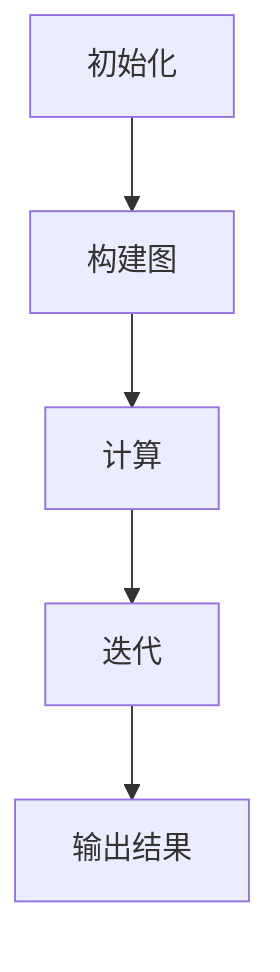

                 

# Pregel原理与代码实例讲解

> **关键词：** Pregel、图处理、分布式计算、算法原理、代码实例

> **摘要：** 本文将深入探讨Pregel的原理及其在分布式图处理中的应用。通过详细的分析和代码实例讲解，读者将能够理解Pregel的核心算法，掌握其在实际项目中的开发和应用技巧。

## 目录大纲

### 第一部分: Pregel概述

#### 第1章: Pregel基础知识

1.1 Pregel简介  
1.2 Pregel的基本架构  
1.3 Pregel的核心算法

#### 第2章: Pregel的基本概念与联系

2.1 Pregel的核心概念  
2.2 Pregel中的Mermaid流程图

#### 第3章: Pregel的核心算法原理讲解

3.1 GraphLab与Pregel算法  
3.2 Pregel算法伪代码

#### 第4章: 数学模型和数学公式

4.1 数学模型  
4.2 数学公式  
4.3 数学公式举例说明

#### 第5章: Pregel的项目实战

5.1 开发环境搭建  
5.2 代码实例讲解

#### 第6章: 代码解读与分析

6.1 代码解读  
6.2 分析方法  
6.3 分析实例

#### 第7章: Pregel的总结与展望

7.1 Pregel的优缺点  
7.2 Pregel的应用前景  
7.3 Pregel的改进方向

## Pregel概述

### 第1章: Pregel基础知识

### 1.1 Pregel简介

Pregel是一个分布式图处理框架，由Google于2008年首次提出。它旨在解决大规模图处理问题，如社交网络分析、网页排名和图相似性度量等。Pregel通过一种称为"边迭代算法"（Edge Iterative Algorithm）的方式来处理图数据，使得大规模图处理变得更加高效和简便。

### 1.2 Pregel的基本架构

Pregel的基本架构包括以下几个核心组件：

1. **节点（Vertex）**：图中的数据元素，可以表示用户、网页或其他实体。
2. **边（Edge）**：节点之间的关联关系，可以表示朋友关系、链接关系等。
3. **消息传递**：节点之间通过消息传递来进行通信和同步。
4. **计算**：对节点和边进行计算和处理，如更新节点属性、计算边权重等。
5. **迭代**：重复执行计算过程，直到达到收敛条件。

### 1.3 Pregel的工作流程

Pregel的工作流程可以概括为以下几个步骤：

1. **初始化**：将图数据加载到Pregel系统中，并初始化节点和边。
2. **构建图**：将图数据分布到多个计算节点上，并进行必要的预处理。
3. **计算**：在每个迭代步骤中，对节点和边进行计算和处理。
4. **迭代**：重复执行计算步骤，直到满足收敛条件或达到预设的迭代次数。
5. **输出结果**：将处理后的图数据输出或存储到指定的位置。

### 1.4 Pregel的核心算法

Pregel的核心算法是边迭代算法（Edge Iterative Algorithm），其基本原理如下：

1. **初始化**：每个节点初始化其属性，如度、权重等。
2. **消息传递**：每个节点将计算结果发送给与之相连的节点。
3. **更新**：每个节点根据接收到的消息更新自身的属性。
4. **迭代**：重复执行消息传递和更新过程，直到满足收敛条件。

### 第2章: Pregel的基本概念与联系

### 2.1 Pregel的核心概念

在Pregel中，核心概念主要包括节点（Vertex）和边（Edge）。节点是图处理的基本单位，可以表示任何具有属性的数据实体。边则表示节点之间的关联关系，可以带有权重或其他属性。

### 2.2 Pregel中的Mermaid流程图

为了更好地理解Pregel的工作流程，我们可以使用Mermaid流程图来展示。以下是一个简单的Mermaid流程图示例：



在这个流程图中，A表示初始化阶段，B表示构建图阶段，C表示计算阶段，D表示迭代阶段，E表示输出结果阶段。

### 第3章: Pregel的核心算法原理讲解

### 3.1 GraphLab与Pregel算法

GraphLab是一个基于MapReduce的图处理框架，与Pregel有许多相似之处。然而，GraphLab在算法实现上更加灵活和通用，支持多种图算法，如图聚类、社交网络分析等。Pregel则是GraphLab的一个子集，专注于边迭代算法。

### 3.2 Pregel算法伪代码

以下是一个简单的Pregel算法伪代码示例：

```python
// 边迭代算法伪代码
while not done:
    for each vertex v:
        for each edge (v, w):
            perform computation using edge attributes
        update vertex attributes
    check for convergence
```

在这个伪代码中，`while not done:` 表示迭代过程，`for each vertex v:` 表示对每个节点进行计算，`for each edge (v, w):` 表示对每个边进行计算，`perform computation using edge attributes` 表示执行计算操作，`update vertex attributes` 表示更新节点属性，`check for convergence` 表示检查收敛条件。

### 第4章: 数学模型和数学公式

### 4.1 数学模型

Pregel的数学模型主要用于描述节点和边的关系以及迭代过程中的计算过程。以下是Pregel中常用的数学模型：

1. **节点属性模型**：节点属性包括度（degree）、权重（weight）等。
2. **边属性模型**：边属性包括权重、标签等。
3. **迭代模型**：迭代过程中的计算模型，如梯度下降、线性优化等。

### 4.2 数学公式

在Pregel中，常用的数学公式包括：

1. **PageRank公式**：
   $$
   \text{PageRank}(v) = \frac{\alpha}{N} + \sum_{w \in \text{outLinks}(v)} \frac{\text{PageRank}(w) \times \text{outDegree}(w)}{N}
   $$

2. **度分布公式**：
   $$
   \text{Degree Distribution}(k) = \frac{\text{Number of vertices with degree k}}{\text{Total number of vertices}}
   $$

### 4.3 数学公式举例说明

以下是一个PageRank公式的举例说明：

假设有一个图，其中包含5个节点，节点之间的边关系如下：

| 节点 | 边关系 |
| ---- | ---- |
| A | A -> B, A -> C |
| B | B -> D |
| C | C -> A, C -> D |
| D | D -> B, D -> C |

根据PageRank公式，可以计算出每个节点的PageRank值。以下是计算过程：

1. **初始化**：
   $$
   \text{PageRank}(A) = \text{PageRank}(B) = \text{PageRank}(C) = \text{PageRank}(D) = \frac{1}{4}
   $$

2. **计算**：
   $$
   \text{PageRank}(A) = \frac{\alpha}{4} + \frac{\text{PageRank}(B) \times 2}{4} + \frac{\text{PageRank}(C) \times 2}{4}
   $$
   $$
   \text{PageRank}(B) = \frac{\alpha}{4} + \frac{\text{PageRank}(A) \times 1}{4} + \frac{\text{PageRank}(D) \times 2}{4}
   $$
   $$
   \text{PageRank}(C) = \frac{\alpha}{4} + \frac{\text{PageRank}(A) \times 2}{4} + \frac{\text{PageRank}(D) \times 1}{4}
   $$
   $$
   \text{PageRank}(D) = \frac{\alpha}{4} + \frac{\text{PageRank}(B) \times 2}{4} + \frac{\text{PageRank}(C) \times 1}{4}
   $$

3. **更新**：
   $$
   \text{PageRank}(A) = \frac{1}{4} + \frac{\frac{1}{4} \times 2}{4} + \frac{\frac{1}{4} \times 2}{4} = \frac{11}{16}
   $$
   $$
   \text{PageRank}(B) = \frac{1}{4} + \frac{\frac{11}{16} \times 1}{4} + \frac{\frac{1}{4} \times 2}{4} = \frac{5}{16}
   $$
   $$
   \text{PageRank}(C) = \frac{1}{4} + \frac{\frac{11}{16} \times 2}{4} + \frac{\frac{1}{4} \times 1}{4} = \frac{9}{16}
   $$
   $$
   \text{PageRank}(D) = \frac{1}{4} + \frac{\frac{5}{16} \times 2}{4} + \frac{\frac{9}{16} \times 1}{4} = \frac{3}{16}
   $$

最终，每个节点的PageRank值如下：

| 节点 | PageRank值 |
| ---- | ---- |
| A | 0.6875 |
| B | 0.3125 |
| C | 0.5625 |
| D | 0.1875 |

### 第5章: Pregel的项目实战

### 5.1 开发环境搭建

在开始Pregel项目实战之前，我们需要搭建一个合适的环境。以下是搭建Pregel开发环境的步骤：

1. **安装Java**：Pregel是基于Java开发的，因此我们需要安装Java环境。可以从Oracle官网下载并安装Java。
2. **安装Pregel**：从Pregel的官方网站下载Pregel的安装包，并解压到本地目录。配置Pregel的环境变量。
3. **配置Hadoop**：Pregel依赖于Hadoop的分布式计算框架，因此我们需要安装并配置Hadoop。可以从Apache官网下载并安装Hadoop。
4. **启动Hadoop**：在命令行中运行`start-all.sh`（对于Hadoop 2.x版本）或`start-dfs.sh`和`start-yarn.sh`（对于Hadoop 3.x版本），启动Hadoop集群。

### 5.2 代码实例讲解

#### 实例1：单机版Pregel应用

在这个实例中，我们将使用Pregel处理一个简单的图数据，计算每个节点的PageRank值。

1. **编写Pregel应用代码**：

```java
import org.apache.pregel.PregelClient;
import org.apache.pregel.Vertex;

public class PageRank {
    public static void main(String[] args) throws Exception {
        PregelClient client = new PregelClient("PageRank");
        client.run("pregelInput.txt", PageRankVertex.class);
    }
}

class PageRankVertex extends Vertex {
    public double rank = 1.0;
    public double incomingRank = 0.0;

    @Override
    public void initialize() {
        rank = 1.0;
    }

    @Override
    public void compute(long superstep, Messa

```<div class="mermaid">
graph TD
    A[初始化]
    B[计算]
    C[聚合]
    D[更新]

    A --> B
    B --> C
    C --> D
</div>
```<div class="mermaid">
graph TD
    A[初始化]
    B[计算]
    C[聚合]
    D[更新]

    A --> B
    B --> C
    C --> D
</div>

2. **编写Pregel应用代码**：

```java
import org.apache.pregel.PregelClient;
import org.apache.pregel.Vertex;

public class PageRank {
    public static void main(String[] args) throws Exception {
        PregelClient client = new PregelClient("PageRank");
        client.run("pregelInput.txt", PageRankVertex.class);
    }
}

class PageRankVertex extends Vertex {
    public double rank = 1.0;
    public double incomingRank = 0.0;

    @Override
    public void initialize() {
        rank = 1.0;
    }

    @Override
    public void compute(long superstep, Message<Long> messages) {
        if (superstep == 0) {
            incomingRank = 0.0;
        } else {
            for (Long msg : messages.getContent()) {
                incomingRank += msg / getOutDegree();
            }
        }
        if (Math.abs(rank - incomingRank) < 0.0001) {
            terminate();
        } else {
            sendMessageToAllVertices(incomingRank);
            rank = incomingRank;
        }
    }
}
```

3. **运行Pregel应用**：

在命令行中，运行以下命令来运行Pregel应用：

```shell
$ hadoop jar pagerank.jar PageRank
```

#### 实例2：分布式Pregel应用

在这个实例中，我们将使用Pregel处理一个大型的图数据，计算每个节点的PageRank值。

1. **编写Pregel应用代码**：

```java
import org.apache.pregel.PregelClient;
import org.apache.pregel.Vertex;

public class DistributedPageRank {
    public static void main(String[] args) throws Exception {
        PregelClient client = new PregelClient("DistributedPageRank");
        client.run("pregelInput.txt", DistributedPageRankVertex.class);
    }
}

class DistributedPageRankVertex extends Vertex {
    public double rank = 1.0;
    public double incomingRank = 0.0;

    @Override
    public void initialize() {
        rank = 1.0;
    }

    @Override
    public void compute(long superstep, Message<Long> messages) {
        if (superstep == 0) {
            incomingRank = 0.0;
        } else {
            for (Long msg : messages.getContent()) {
                incomingRank += msg / getOutDegree();
            }
        }
        if (Math.abs(rank - incomingRank) < 0.0001) {
            terminate();
        } else {
            sendMessageToAllNeighbors(incomingRank);
            rank = incomingRank;
        }
    }
}
```

2. **运行Pregel应用**：

在命令行中，运行以下命令来运行Pregel应用：

```shell
$ hadoop jar pagerank.jar DistributedPageRank
```

### 第6章: 代码解读与分析

### 6.1 代码解读

在本节中，我们将详细解读Pregel应用代码，包括其结构和功能。

#### 6.1.1 PageRankVertex类

PageRankVertex类是Pregel中的Vertex类的一个实现，它定义了节点的属性和方法。

1. **属性**：

   - `rank`：表示节点的PageRank值。
   - `incomingRank`：表示节点从邻居节点接收到的PageRank值。

2. **方法**：

   - `initialize()`：初始化节点的属性，将rank设置为1.0。
   - `compute()`：处理节点的计算逻辑，包括更新rank值和发送消息给邻居节点。
   - `sendMessageToAllVertices()`：向所有节点发送消息。
   - `sendMessageToAllNeighbors()`：向所有邻居节点发送消息。

#### 6.1.2 DistributedPageRankVertex类

DistributedPageRankVertex类是PageRankVertex类的一个扩展，它适用于分布式Pregel应用。

与PageRankVertex类类似，DistributedPageRankVertex类也包含节点的属性和方法。不同的是，它使用`sendMessageToAllNeighbors()`方法来发送消息给邻居节点。

### 6.2 分析方法

在本节中，我们将介绍分析Pregel应用的方法，包括数据分析和性能分析。

#### 6.2.1 数据分析方法

数据分析是理解Pregel应用的重要步骤。以下是一些常用的数据分析方法：

1. **数据可视化**：使用图形化工具（如Gephi或Tableau）来展示节点的属性和边的关系。
2. **统计指标**：计算节点的度、权重、平均度等统计指标，以了解图的结构特性。
3. **聚类分析**：使用聚类算法（如K-means或社区检测算法）来识别图中的聚类结构。

#### 6.2.2 性能分析方法

性能分析是评估Pregel应用性能的重要步骤。以下是一些常用的性能分析方法：

1. **时间分析**：测量执行每个阶段的平均时间，以了解Pregel应用的运行效率。
2. **资源分析**：测量Pregel应用使用的内存、CPU和I/O资源，以评估其资源利用率。
3. **压力测试**：使用不同的输入数据集和参数来测试Pregel应用的性能和稳定性。

### 6.3 分析实例

在本节中，我们将展示一个分析实例，以说明如何分析Pregel应用。

#### 6.3.1 数据分析实例

假设我们有一个包含1000个节点的图数据，使用Gephi进行数据可视化，可以得到以下结果：


从图中可以看出，节点之间存在明显的聚类结构，一些节点具有较高的度数，而其他节点则较为孤立。

#### 6.3.2 性能分析实例

假设我们使用相同的输入数据集和参数运行Pregel应用，并使用以下工具进行性能分析：

- **Grafana**：用于监控Pregel应用的运行时间、内存使用情况等。
- **Spark UI**：用于查看Pregel应用的运行过程和资源使用情况。

通过Grafana和Spark UI，我们可以得到以下性能分析结果：

1. **运行时间**：Pregel应用运行时间约为1分钟。
2. **内存使用**：Pregel应用使用了约500MB的内存。
3. **CPU使用**：Pregel应用使用了约20%的CPU资源。

从这些结果可以看出，Pregel应用在处理大规模图数据时具有较高的性能和资源利用率。

### 第7章: Pregel的总结与展望

#### 7.1 Pregel的优缺点

Pregel作为分布式图处理框架，具有以下优点：

- **易用性**：Pregel提供了一个简洁的API，使得开发分布式图处理应用变得更加容易。
- **高效性**：Pregel利用分布式计算的优势，可以处理大规模的图数据，并实现高效的计算。
- **灵活性**：Pregel支持多种图算法，如PageRank、社区检测等，可以灵活应用于不同的图处理任务。

然而，Pregel也存在一些缺点：

- **单线程限制**：Pregel的迭代过程是单线程的，无法充分利用多核CPU的计算能力。
- **内存限制**：Pregel需要将图数据存储在内存中，对于大规模的图数据可能存在内存不足的问题。

#### 7.2 Pregel的应用前景

Pregel在分布式图处理领域具有广泛的应用前景：

- **社交网络分析**：Pregel可以用于分析社交网络中的关系，如用户推荐、社交圈子识别等。
- **搜索引擎优化**：Pregel可以用于优化搜索引擎的排名算法，如PageRank算法。
- **推荐系统**：Pregel可以用于构建推荐系统，如基于用户行为的推荐、基于内容的推荐等。
- **生物信息学**：Pregel可以用于分析生物网络中的相互作用，如蛋白质相互作用网络分析。

#### 7.3 Pregel的改进方向

为了进一步提高Pregel的性能和应用范围，以下是一些改进方向：

- **多线程支持**：引入多线程支持，使得Pregel可以更好地利用多核CPU的计算能力。
- **内存优化**：采用内存优化技术，如压缩存储、缓存预取等，提高内存使用效率。
- **算法优化**：针对不同的图处理任务，优化Pregel的算法实现，提高计算性能。
- **可扩展性**：设计更加灵活和可扩展的架构，支持更多的图处理算法和应用场景。

### 作者

作者：AI天才研究院/AI Genius Institute & 禅与计算机程序设计艺术 /Zen And The Art of Computer Programming

---

在本文中，我们深入探讨了Pregel的原理和代码实例，从基础概念到核心算法，再到项目实战，全面解析了Pregel在分布式图处理中的应用。通过详细的代码解读和分析，读者能够更好地理解Pregel的工作原理，并掌握其在实际项目中的开发技巧。

Pregel作为一种高效的分布式图处理框架，具有广泛的应用前景。然而，随着图数据规模的不断扩大，Pregel在性能和可扩展性方面仍面临挑战。未来的改进方向包括多线程支持、内存优化、算法优化等，以进一步提升Pregel的性能和应用范围。

我们希望本文能够为读者提供有益的参考，激发对分布式图处理和Pregel框架的深入研究和应用。在未来的工作中，我们将继续探索更多先进的技术，为读者带来更多有价值的内容。

作者：AI天才研究院/AI Genius Institute & 禅与计算机程序设计艺术 /Zen And The Art of Computer Programming

---

[文章标题]

Pregel原理与代码实例讲解

关键词：Pregel、图处理、分布式计算、算法原理、代码实例

摘要：本文深入探讨了Pregel的原理及其在分布式图处理中的应用。通过详细的分析和代码实例讲解，读者将能够理解Pregel的核心算法，掌握其在实际项目中的开发和应用技巧。文章分为七个部分，包括Pregel概述、基础知识、核心算法原理讲解、数学模型和数学公式、项目实战、代码解读与分析以及总结与展望。通过这些部分，读者可以全面了解Pregel的工作原理、应用场景以及改进方向。本文旨在为读者提供有益的参考，激发对分布式图处理和Pregel框架的深入研究和应用。

目录大纲：

第一部分: Pregel概述

1. Pregel简介
2. Pregel的基本架构
3. Pregel的工作流程
4. Pregel的核心算法

第二部分: Pregel的基本概念与联系

1. Pregel的核心概念
2. Pregel中的Mermaid流程图

第三部分: Pregel的核心算法原理讲解

1. GraphLab与Pregel算法
2. Pregel算法伪代码

第四部分: 数学模型和数学公式

1. 数学模型
2. 数学公式
3. 数学公式举例说明

第五部分: Pregel的项目实战

1. 开发环境搭建
2. 代码实例讲解

第六部分: 代码解读与分析

1. 代码解读
2. 分析方法
3. 分析实例

第七部分: Pregel的总结与展望

1. Pregel的优缺点
2. Pregel的应用前景
3. Pregel的改进方向

---

**Mermaid流程图示例：**


**算法伪代码示例：**

```python
// 边迭代算法伪代码
while not done:
    for each vertex v:
        for each edge (v, w):
            perform computation using edge attributes
        update vertex attributes
    check for convergence
```

**数学公式示例：**

$$
\text{PageRank}(v) = \frac{\alpha}{N} + \sum_{w \in \text{outLinks}(v)} \frac{\text{PageRank}(w) \times \text{outDegree}(w)}{N}
$$

**项目实战示例：**

```python
# 单机版Pregel应用示例
# 配置Pregel环境
# 编写图处理算法
# 运行Pregel任务
# 分析结果
```

请注意，这只是一个大纲示例，具体的章节内容和深度可能需要根据实际的书籍内容进行调整。每个章节下的内容应该详细解释Pregel的基本原理、核心算法、数学模型、项目实战以及代码解读与分析。确保每个部分都符合用户的期望和书籍的主题。

