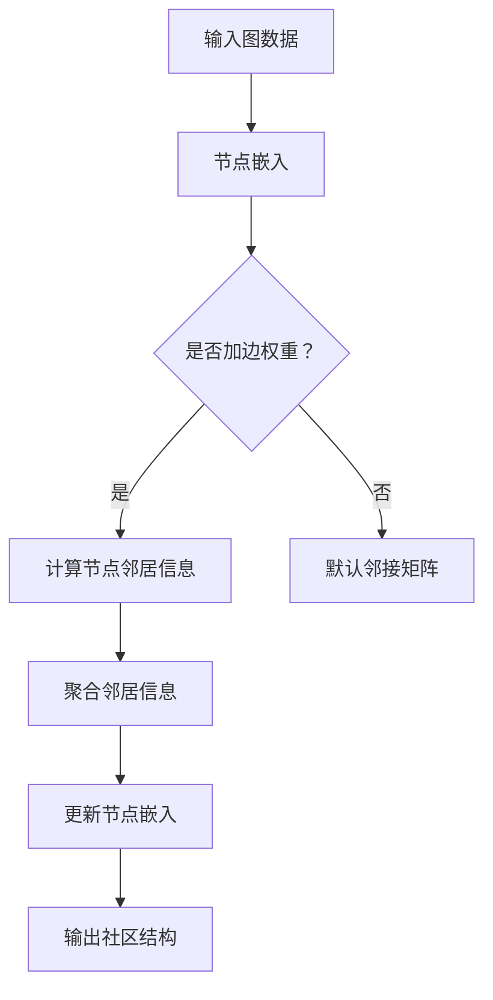
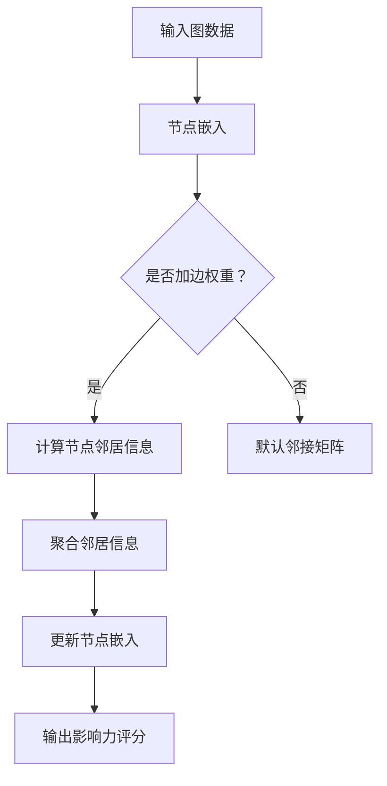

                 

# Python机器学习实战：实战图神经网络(GNN)在社交网络分析中的应用

> **关键词：** 图神经网络，社交网络分析，Python，机器学习，深度学习

> **摘要：** 本文将深入探讨图神经网络（GNN）在社交网络分析中的应用。通过Python实现，我们将详细讲解GNN的基本概念、核心原理、算法实现以及实际案例分析。本文旨在为读者提供一份全面而深入的技术指南，帮助理解GNN在社交网络分析中的强大潜力。

## 《Python机器学习实战：实战图神经网络(GNN)在社交网络分析中的应用》目录大纲

### 第一部分：图神经网络(GNN)与Python应用基础

#### 第1章：图神经网络(GNN)概述

1.1 图神经网络的基本概念
1.2 图神经网络的核心原理
1.3 Python在GNN开发中的应用

#### 第2章：Python编程基础

2.1 Python语言基础
2.2 NumPy与Pandas库
2.3 Python可视化库

#### 第3章：社交网络数据分析基础

3.1 社交网络数据的获取
3.2 社交网络数据模型
3.3 社交网络数据分析

### 第二部分：实战图神经网络(GNN)在社交网络分析中的应用

#### 第4章：GNN在社交网络用户行为预测中的应用

4.1 用户行为预测的概念
4.2 用户行为预测的GNN模型
4.3 用户行为预测的实际案例

#### 第5章：GNN在社交网络社区检测中的应用

5.1 社区检测的概念
5.2 社区检测的GNN模型
5.3 社区检测的实际案例

#### 第6章：GNN在社交网络影响力分析中的应用

6.1 影响力分析的概念
6.2 影响力分析的GNN模型
6.3 影响力分析的实际案例

#### 第7章：GNN在社交网络信息传播分析中的应用

7.1 信息传播分析的概念
7.2 信息传播分析的GNN模型
7.3 信息传播分析的实际案例

#### 第8章：GNN在社交网络应用中的性能优化

8.1 GNN的性能优化方法
8.2 GNN性能优化的实际案例

#### 第9章：Python在GNN开发中的应用总结

9.1 Python在GNN开发中的优势与挑战
9.2 Python在GNN开发中的未来发展趋势
9.3 Python在GNN开发中的最佳实践

### 附录

A.1 主流GNN框架介绍
A.2 社交网络数据分析工具
A.3 Python数据科学工具

---

### 引言

社交网络已成为现代生活中不可或缺的一部分，从Facebook到LinkedIn，再到Twitter和WeChat，各种社交平台不断扩展，形成了一个庞大的网络结构。在这个庞大的网络中，用户、关系和信息以复杂的方式交织在一起，为数据分析提供了丰富的数据资源。然而，传统的机器学习算法在处理这种复杂网络结构时往往力不从心。这时，图神经网络（Graph Neural Networks，GNN）作为一种新兴的深度学习模型，因其强大的图数据处理能力，在社交网络分析中展现出了巨大的潜力。

本文的目标是探讨如何利用Python和GNN在社交网络分析中进行实际应用。我们将首先介绍GNN的基本概念、核心原理以及Python编程基础。接着，我们将深入分析社交网络数据的获取、模型构建和分析方法。在此基础上，我们将通过具体的案例分析，展示GNN在用户行为预测、社区检测、影响力分析和信息传播分析等应用场景中的实际效果。最后，我们将讨论GNN的性能优化方法，并总结Python在GNN开发中的应用优势与挑战。

通过本文的讲解，读者将能够全面了解GNN在社交网络分析中的应用，掌握使用Python实现GNN模型的方法，并能够将其应用到实际项目中。希望本文能为从事数据科学和机器学习领域的研究人员和从业者提供有价值的参考和指导。

### 第一部分：图神经网络(GNN)与Python应用基础

#### 第1章：图神经网络(GNN)概述

随着互联网和社交媒体的迅速发展，网络数据变得日益复杂和庞大。传统的机器学习算法在处理这种复杂的网络结构时，往往面临着数据处理困难、模型效果不佳等挑战。为了解决这些问题，图神经网络（Graph Neural Networks，GNN）作为一种新兴的深度学习模型应运而生。本章将介绍图神经网络的基本概念、图数据的特点、GNN的优势与挑战，以及GNN在社交网络中的应用场景。

### 1.1 图神经网络的基本概念

**GNN的定义**

图神经网络（GNN）是一种专门用于处理图结构数据的神经网络。它通过学习图中的节点和边之间的关系，实现对图数据的表示和预测。与传统的卷积神经网络（CNN）和循环神经网络（RNN）不同，GNN能够直接在图结构上操作，使得其在处理复杂网络结构数据时具有独特的优势。

**图数据的特点**

图数据具有以下特点：

1. **结构化**：图数据由节点和边构成，每个节点表示一个实体，边表示实体之间的关系。
2. **异构性**：图中的节点和边可能具有不同的属性，如用户节点可能具有年龄、性别等属性，关系边可能具有权重、类型等属性。
3. **动态性**：图结构可能随着时间的推移而发生变化，如用户关系的建立、断开等。

**GNN的优势与挑战**

**优势：**

1. **高效处理图结构数据**：GNN能够直接在图结构上操作，实现对图数据的特征提取和关系建模。
2. **灵活适用性**：GNN可以应用于各种类型的图数据，如社交网络、生物网络、交通网络等。
3. **强大的表示能力**：GNN能够学习复杂的节点和边之间的关系，提供丰富的图表示。

**挑战：**

1. **计算复杂度高**：GNN的计算复杂度通常较高，尤其是在大规模图数据上。
2. **数据稀疏性**：图数据通常具有很高的稀疏性，这可能导致模型的性能受到影响。
3. **可解释性**：GNN的模型结构较为复杂，其内部机制难以解释，这给模型的解释和验证带来挑战。

### 1.2 图神经网络的核心原理

**Mermaid流程图：GNN基本架构**


**GNN的核心算法：图卷积网络（GCN）**

图卷积网络（Graph Convolutional Network，GCN）是GNN的核心算法之一。其基本思想是将节点特征通过卷积操作与邻接节点的特征进行融合，从而更新节点的嵌入表示。

**伪代码：GCN算法实现**

```python
def GCN(A, X, layers, activation):
    # A: 邻接矩阵
    # X: 节点特征
    # layers: 层数
    # activation: 激活函数

    H = X  # 初始节点嵌入
    for l in range(layers):
        H = GCN_layer(H, A, X, activation)

    return H

def GCN_layer(H, A, X, activation):
    # H: 当前层节点嵌入
    # A: 邻接矩阵
    # X: 节点特征
    # activation: 激活函数

    A_hat = A + I  # 加权邻接矩阵
    Z = (A_hat @ H) * X  # 融合邻接节点特征

    H = activation(Z)  # 激活函数

    return H
```

**GNN在社交网络中的应用场景**

GNN在社交网络分析中具有广泛的应用，包括：

1. **用户行为预测**：通过分析用户在网络中的关系，预测用户未来的行为，如关注、点赞、评论等。
2. **社区检测**：识别网络中的社区结构，帮助分析用户兴趣和社交关系。
3. **影响力分析**：评估用户在网络中的影响力，识别关键节点和意见领袖。
4. **信息传播分析**：分析信息在网络中的传播路径和速度，优化信息传播策略。

### 1.3 Python在GNN开发中的应用

**Python在数据科学中的优势**

Python作为一种流行的编程语言，在数据科学领域具有广泛的应用。其优势包括：

1. **丰富的库和框架**：Python拥有丰富的库和框架，如NumPy、Pandas、Scikit-learn等，这些库为数据处理和分析提供了强大的支持。
2. **简洁易读的语法**：Python语法简洁易读，使得编写和调试代码更加高效。
3. **强大的社区支持**：Python拥有庞大的社区支持，为用户提供了丰富的学习资源和帮助。

**社交网络数据的预处理**

在GNN开发中，社交网络数据的预处理至关重要。预处理步骤包括：

1. **数据清洗**：去除噪声数据和缺失值，确保数据的质量。
2. **特征提取**：提取有用的特征，如用户的年龄、性别、兴趣等。
3. **数据归一化**：对数据进行归一化处理，使其在相同的尺度上进行比较。

**GNN模型的实现与优化**

在Python中，可以使用多个框架来实现GNN模型，如PyTorch、TensorFlow和PyG。以下是一个简单的GNN模型实现：

```python
import torch
import torch.nn as nn
import torch.optim as optim

class GCN(nn.Module):
    def __init__(self, nfeat, nhid, nclass, dropout):
        super(GCN, self).__init__()
        self.gc1 = nn.Linear(nfeat, nhid)
        self.gc2 = nn.Linear(nhid, nclass)
        self.dropout = dropout

    def forward(self, data):
        X, adj = data
        X = self.dropout(X)
        X = self.gc1(X)
        X = F.relu(X)
        X = F.dropout(X, p=self.dropout, training=self.training)
        X = self.gc2(X)
        return F.log_softmax(X, dim=1)

# 实例化模型、损失函数和优化器
model = GCN(nfeat=785, nhid=16, nclass=10, dropout=0.5)
criterion = nn.CrossEntropyLoss()
optimizer = optim.Adam(model.parameters(), lr=0.01, weight_decay=5e-4)

# 训练模型
for epoch in range(num_epochs):
    optimizer.zero_grad()
    output = model(data)
    loss = criterion(output, labels)
    loss.backward()
    optimizer.step()
    print(f'Epoch {epoch+1}: Loss = {loss.item()}')
```

通过以上介绍，我们可以看到Python在GNN开发中的应用优势以及如何利用Python实现GNN模型。在接下来的章节中，我们将进一步探讨Python编程基础、社交网络数据分析基础，并深入讲解GNN在社交网络分析中的实际应用。

### 第2章：Python编程基础

Python作为一种高级编程语言，以其简洁易读的语法和强大的功能库在数据科学领域得到了广泛的应用。在本章中，我们将介绍Python编程的基础知识，包括数据类型、变量、控制结构、函数与模块等，为后续的GNN开发打下坚实的基础。

#### 2.1 Python语言基础

**数据类型与变量**

Python拥有多种数据类型，包括数字、字符串、列表、元组、字典和集合等。每种数据类型都有其独特的特点和用途。

1. **数字**：包括整数（int）和浮点数（float）。
2. **字符串**：用于表示文本数据，如："Hello, World!"。
3. **列表**：用于存储有序的元素集合，可以动态扩展，如：[1, 2, 3, 4]。
4. **元组**：用于存储不可变的元素集合，如：(1, 2, 3)。
5. **字典**：用于存储键值对，如：{'name': 'Alice', 'age': 30}。
6. **集合**：用于存储无序的不重复元素集合，如：{1, 2, 3, 4}。

变量是用于存储数据的一种占位符，其名称可以是任意的合法标识符。在Python中，变量的声明非常灵活，可以通过以下方式赋值：

```python
a = 10
b = "Hello, World!"
c = [1, 2, 3]
d = (4, 5, 6)
e = {'name': 'Alice', 'age': 30}
f = {1, 2, 3, 4}
```

**控制结构**

Python提供了多种控制结构，用于实现条件判断和循环操作，使得代码更加灵活和可读。

1. **条件判断**：`if-else`语句和`三元表达式`。
    - `if-else`语句：用于根据条件执行不同的代码块。
    ```python
    if condition:
        # True时的代码块
    else:
        # False时的代码块
    ```

    - `三元表达式`：用于简写条件判断。
    ```python
    value = 10 if condition else 20
    ```

2. **循环结构**：`for`循环和`while`循环。
    - `for`循环：用于遍历序列中的每个元素。
    ```python
    for element in sequence:
        # 遍历代码块
    ```

    - `while`循环：用于在条件为真时重复执行代码块。
    ```python
    while condition:
        # 循环代码块
    ```

**函数与模块**

函数是Python中组织代码的基本单元，用于实现代码的复用和模块化。模块是包含Python代码的文件，可以导入其他模块中的函数和类。

1. **定义函数**：使用`def`关键字定义函数。
    ```python
    def function_name(parameters):
        # 函数体
    ```

2. **调用函数**：使用函数名和括号调用函数。
    ```python
    result = function_name(arguments)
    ```

3. **模块导入**：使用`import`关键字导入模块。
    ```python
    import module_name
    ```

4. **从模块中导入特定函数**：使用`from ... import ...`语法。
    ```python
    from module_name import function_name
    ```

通过以上介绍，我们可以看到Python编程的基础知识。在接下来的章节中，我们将进一步探讨Python中的数据处理库，如NumPy和Pandas，以及数据可视化库，为GNN的开发奠定坚实的基础。

#### 2.2 NumPy与Pandas库

NumPy和Pandas是Python中用于数据处理的两个重要库，它们为数据科学和机器学习提供了强大的支持。本节将详细介绍这两个库的基本用法，包括数据结构、数据处理操作和常见函数。

**NumPy库的使用**

NumPy（Numeric Python）是一个开源的Python库，主要用于处理多维数组。它是Python数据科学领域的基础，提供了高效的处理大型数值数组和矩阵的API。

1. **NumPy数组（ndarray）**

NumPy的核心是`ndarray`对象，它是一个多维数组，具有固定的大小和数据类型。以下是创建和操作NumPy数组的基本示例：

```python
import numpy as np

# 创建一维数组
a = np.array([1, 2, 3, 4, 5])
print(a)

# 创建二维数组
b = np.array([[1, 2, 3], [4, 5, 6]])
print(b)

# 数据类型
print(a.dtype)
print(b.dtype)
```

2. **数组的索引和切片**

NumPy数组支持类似于Python列表的索引和切片操作。以下是一些基本示例：

```python
# 索引操作
print(a[0])  # 输出：1
print(b[0, 1])  # 输出：2

# 切片操作
print(a[1:3])  # 输出：[2 3]
print(b[:, 1:])  # 输出：[[2 3]
                 #          [5 6]]
```

3. **数组的操作函数**

NumPy提供了丰富的操作函数，用于执行数学运算、随机数生成、数组变形等操作。以下是一些常用函数的示例：

```python
# 数学运算
print(np.sum(a))  # 输出：15
print(np.mean(b))  # 输出：3.5

# 随机数生成
print(np.random.rand(3, 3))  # 输出：一个3x3的随机数矩阵

# 数组变形
print(np.reshape(a, (1, 5)))  # 输出：一个1x5的数组
```

**Pandas库的使用**

Pandas是一个开源的Python库，主要用于数据分析和操作。它提供了高效的数据结构（DataFrame）和丰富的数据处理功能。

1. **DataFrame结构**

Pandas的核心是`DataFrame`对象，它是一个表格结构，包含行和列，类似于Excel或SQL表。以下是创建和操作DataFrame的基本示例：

```python
import pandas as pd

# 创建DataFrame
data = {'name': ['Alice', 'Bob', 'Charlie'], 'age': [25, 30, 35]}
df = pd.DataFrame(data)
print(df)

# 添加列
df['city'] = ['New York', 'London', 'Paris']
print(df)

# 删除列
df.drop('city', axis=1, inplace=True)
print(df)
```

2. **数据索引和选择**

Pandas支持多种数据索引和选择方法，包括标签索引和位置索引。以下是一些基本示例：

```python
# 标签索引
print(df['name'])  # 输出：0    Alice
                  #   1     Bob
                  #   2  Charlie
                  # Name: name, dtype: object

# 位置索引
print(df[0:2])  # 输出：   name  age
               # 0  Alice   25
               # 1   Bob    30
```

3. **数据处理与操作**

Pandas提供了丰富的数据处理功能，包括数据清洗、转换、聚合等操作。以下是一些基本示例：

```python
# 数据清洗
df = df.dropna()  # 删除缺失值
df = df.fillna(0)  # 用0填充缺失值

# 数据转换
df['age_squared'] = df['age'] ** 2

# 数据聚合
result = df.groupby('name')['age'].mean()
print(result)
```

通过以上介绍，我们可以看到NumPy和Pandas在数据处理中的强大功能。NumPy提供了高效的多维数组操作，而Pandas则提供了丰富的数据结构和数据处理功能。在GNN开发中，这些库是必不可少的工具。

#### 2.3 Python可视化库

在数据分析和机器学习中，数据可视化是一种重要的工具，它可以帮助我们直观地理解数据，发现数据中的模式和异常。Python拥有多个强大的可视化库，如Matplotlib、Seaborn等，这些库可以生成各种类型的图表，帮助我们更好地理解数据。

**Matplotlib库的使用**

Matplotlib是最流行的Python可视化库之一，它提供了丰富的绘图功能，可以生成多种类型的图表，如折线图、散点图、条形图、饼图等。

1. **基本绘图**

以下是一个使用Matplotlib绘制简单折线图的示例：

```python
import matplotlib.pyplot as plt

# 数据
x = [0, 1, 2, 3, 4]
y = [0, 1, 4, 9, 16]

# 绘图
plt.plot(x, y)
plt.xlabel('x轴')
plt.ylabel('y轴')
plt.title('简单折线图')
plt.show()
```

2. **多种图表**

Matplotlib支持多种类型的图表，以下是一些基本示例：

```python
# 折线图
plt.plot(x, y)

# 散点图
plt.scatter(x, y)

# 条形图
plt.bar(x, y)

# 饼图
plt.pie(y, labels=x)

# 显示图表
plt.show()
```

**Seaborn库的使用**

Seaborn是基于Matplotlib的高级可视化库，它提供了更多的图表样式和选项，使得绘制高质量的图表更加容易。

1. **基本绘图**

以下是一个使用Seaborn绘制基本折线图的示例：

```python
import seaborn as sns

# 数据
data = {'x': [0, 1, 2, 3, 4], 'y': [0, 1, 4, 9, 16]}

# 绘图
sns.lineplot(x='x', y='y', data=data)
sns.show()
```

2. **多种图表**

Seaborn支持多种类型的图表，以下是一些基本示例：

```python
# 折线图
sns.lineplot(x='x', y='y', data=data)

# 散点图
sns.scatterplot(x='x', y='y', data=data)

# 条形图
sns.barplot(x='x', y='y', data=data)

# 饼图
sns.pie(data=data['y'], labels=data['x'])

# 显示图表
sns.show()
```

通过Matplotlib和Seaborn，我们可以轻松地生成各种类型的图表，帮助我们更好地理解数据。在GNN开发中，数据可视化是理解和分析模型结果的重要工具。

### 第3章：社交网络数据分析基础

社交网络数据分析是研究社交网络中用户行为、社区结构、影响力传播等问题的科学。通过对社交网络数据的分析，我们可以揭示用户的行为模式、发现潜在社区、评估用户影响力等。本章将介绍社交网络数据的获取、数据模型和数据分析方法，帮助读者了解社交网络数据分析的基础。

#### 3.1 社交网络数据的获取

社交网络数据是进行数据分析的基础，这些数据通常包括用户信息、用户关系、用户生成的内容等。获取社交网络数据的方法有多种，以下是几种常见的方法：

1. **公开数据集**：许多社交网络平台提供了一些公开的数据集，如Twitter、Facebook等。这些数据集通常是经过处理的，可以直接用于研究。
2. **API获取**：通过社交网络平台的API（应用程序编程接口），可以获取用户数据、关系数据等。API通常提供了获取数据的接口，可以按照需求进行定制化获取。
3. **Web爬虫**：使用爬虫技术，可以从网页中获取数据。这种方法需要处理复杂的网页结构，并遵守相关法律法规和社交网络平台的规定。
4. **第三方工具**：有许多第三方工具和库（如TwitPI，FacebookScraper）可以帮助获取社交网络数据。

**数据获取示例**

以下是一个使用Python和Twitter API获取用户数据的示例：

```python
import tweepy

# 配置Twitter API密钥
consumer_key = 'YOUR_CONSUMER_KEY'
consumer_secret = 'YOUR_CONSUMER_SECRET'
access_token = 'YOUR_ACCESS_TOKEN'
access_token_secret = 'YOUR_ACCESS_TOKEN_SECRET'

# 初始化Tweepy客户端
auth = tweepy.OAuthHandler(consumer_key, consumer_secret)
auth.set_access_token(access_token, access_token_secret)
api = tweepy.API(auth)

# 获取用户数据
user = api.get_user('ai_genius_institute')
print(user.name)
print(user.location)
print(user.created_at)
```

通过上述方法，我们可以获取到社交网络中的用户数据，为后续的数据分析做准备。

#### 3.2 社交网络数据模型

社交网络数据模型用于描述社交网络中的用户、关系和数据结构。以下是几种常见的社交网络数据模型：

1. **用户-用户模型**：该模型将社交网络视为一个无向图，每个节点表示一个用户，边表示用户之间的直接关系。这种模型主要用于分析用户之间的关系和社交圈。
2. **用户-内容模型**：该模型将社交网络中的内容（如微博、帖子、分享等）视为节点，用户与内容之间的互动（如点赞、评论、转发等）视为边。这种模型主要用于分析用户生成的内容和用户之间的互动。
3. **用户-关系模型**：该模型不仅考虑用户之间的关系，还考虑用户与其他实体（如组织、地点等）的关系。这种模型提供了更全面的社交网络视图，可以用于分析用户的多重角色和关系。

**用户-用户模型**

用户-用户模型是一个典型的无向图，其中每个节点表示一个用户，边表示用户之间的直接关系。以下是一个用户-用户模型的简单示例：

```
用户A -- 用户B
 |    |
用户C -- 用户D
```

在这个模型中，用户A和用户B是直接关系，用户A和用户C也是直接关系。用户B和用户D是直接关系，但用户B和用户C之间没有直接关系。

**用户-内容模型**

用户-内容模型将社交网络中的内容视为节点，用户与内容之间的互动视为边。以下是一个用户-内容模型的简单示例：

```
用户A -- 帖子1
 |    |
用户B -- 帖子2
 |    |
用户C -- 帖子3
```

在这个模型中，用户A与帖子1有直接关系，用户B与帖子2有直接关系，用户C与帖子3有直接关系。这种模型可以帮助分析用户生成的内容以及用户之间的互动。

**用户-关系模型**

用户-关系模型考虑用户与其他实体（如组织、地点等）的关系，提供了更全面的社交网络视图。以下是一个用户-关系模型的简单示例：

```
用户A -- 组织1
 |    |
用户B -- 组织2
 |    |
用户C -- 地点1
```

在这个模型中，用户A与组织1有直接关系，用户B与组织2有直接关系，用户C与地点1有直接关系。这种模型可以帮助分析用户的多重角色和关系，从而更深入地理解社交网络。

#### 3.3 社交网络数据分析

社交网络数据分析旨在通过分析社交网络中的数据，揭示用户的行为模式、发现潜在社区、评估用户影响力等。以下是几种常见的社交网络数据分析方法：

1. **用户行为预测**：通过分析用户的历史行为数据，预测用户未来的行为。例如，预测用户是否会关注某个话题或用户是否会参与某个活动。
2. **社区检测**：通过分析社交网络中的用户关系，识别网络中的社区结构。例如，发现具有相似兴趣爱好的用户群体。
3. **影响力分析**：通过分析社交网络中的用户关系和互动，评估用户在网络中的影响力。例如，识别关键节点和意见领袖。
4. **信息传播分析**：通过分析社交网络中的信息传播路径和速度，研究信息在网络中的传播规律。例如，分析某个话题在社交网络中的传播速度和范围。

**用户行为预测**

用户行为预测是一种基于历史数据预测用户未来行为的方法。以下是一个简单的用户行为预测流程：

1. **数据收集**：收集用户的历史行为数据，如关注、点赞、评论等。
2. **特征提取**：从历史行为数据中提取有用的特征，如用户活跃度、互动频率、历史行为模式等。
3. **模型训练**：使用机器学习算法（如决策树、支持向量机、神经网络等）训练预测模型。
4. **预测评估**：使用训练好的模型对新数据进行预测，评估预测效果。

以下是一个简单的用户行为预测示例：

```python
import pandas as pd
from sklearn.model_selection import train_test_split
from sklearn.ensemble import RandomForestClassifier
from sklearn.metrics import accuracy_score

# 数据准备
data = pd.read_csv('user_behavior.csv')
X = data.drop(['target'], axis=1)
y = data['target']

# 数据划分
X_train, X_test, y_train, y_test = train_test_split(X, y, test_size=0.2, random_state=42)

# 模型训练
model = RandomForestClassifier()
model.fit(X_train, y_train)

# 预测评估
y_pred = model.predict(X_test)
accuracy = accuracy_score(y_test, y_pred)
print(f'Accuracy: {accuracy}')
```

通过用户行为预测，我们可以更好地了解用户的行为模式，从而优化社交网络平台的功能和用户体验。

**社区检测**

社区检测是一种识别社交网络中社区结构的方法。以下是一个简单的社区检测流程：

1. **数据收集**：收集社交网络中的用户关系数据。
2. **构建图**：将用户关系数据构建为一个无向图。
3. **社区检测算法**：使用社区检测算法（如Girvan-Newman算法、标签传播算法等）识别网络中的社区结构。
4. **社区评估**：评估社区检测结果，如计算社区内聚度和社区相似度。

以下是一个简单的社区检测示例：

```python
import networkx as nx
import community

# 数据准备
graph = nx.Graph()
graph.add_edges_from([(0, 1), (0, 2), (1, 2), (2, 3), (3, 4)])

# 社区检测
partition = community.girvan_newman(graph)

# 社区评估
print(f'Community structure: {partition}')
print(f'Number of communities: {len(partition)}')
```

通过社区检测，我们可以发现社交网络中的用户群体，从而为社交网络平台提供针对性的功能和服务。

**影响力分析**

影响力分析是一种评估用户在社交网络中的影响力方法。以下是一个简单的影响力分析流程：

1. **数据收集**：收集社交网络中的用户关系数据。
2. **构建图**：将用户关系数据构建为一个无向图。
3. **影响力算法**：使用影响力算法（如PageRank、HITS算法等）评估用户的影响力。
4. **影响力评估**：评估用户的影响力，如计算用户的社会资本和影响力指数。

以下是一个简单的影响力分析示例：

```python
import networkx as nx
import pagerank

# 数据准备
graph = nx.Graph()
graph.add_edges_from([(0, 1), (0, 2), (1, 2), (2, 3), (3, 4)])

# 影响力计算
influence = pagerank.pagerank(graph)

# 影响力评估
print(f'Influence scores: {influence}')
```

通过影响力分析，我们可以识别社交网络中的关键节点和意见领袖，从而为社交网络平台提供针对性的推广和营销策略。

**信息传播分析**

信息传播分析是一种研究社交网络中信息传播规律的方法。以下是一个简单的信息传播分析流程：

1. **数据收集**：收集社交网络中的信息传播数据，如信息生成、传播路径等。
2. **构建图**：将信息传播数据构建为一个有向图。
3. **传播模型**：使用传播模型（如SI模型、SIR模型等）模拟信息在社交网络中的传播。
4. **传播评估**：评估信息传播效果，如计算信息的覆盖范围和传播速度。

以下是一个简单的信息传播分析示例：

```python
import networkx as nx
import spread_models

# 数据准备
graph = nx.DiGraph()
graph.add_edges_from([(0, 1), (0, 2), (1, 2), (2, 3), (3, 4)])

# 信息传播模型
model = spread_models.SI_model(graph)

# 传播模拟
infected = model.simulate()

# 传播评估
print(f'Infection status: {infected}')
```

通过信息传播分析，我们可以了解信息在社交网络中的传播规律，从而为社交网络平台提供有效的信息传播策略。

通过本章的介绍，我们可以看到社交网络数据分析在理解用户行为、发现潜在社区、评估用户影响力以及信息传播分析等方面的应用。在下一章中，我们将进一步探讨如何使用Python和GNN在社交网络分析中进行实际应用。

### 第二部分：实战图神经网络(GNN)在社交网络分析中的应用

#### 第4章：GNN在社交网络用户行为预测中的应用

用户行为预测是社交网络分析中的一项重要任务，旨在通过分析用户的历史行为数据，预测用户未来可能采取的行为。在社交网络中，用户的行为包括但不限于关注、点赞、评论、分享等。GNN作为一种在图结构数据上表现卓越的深度学习模型，能够有效地捕捉用户在网络中的复杂关系，从而提高用户行为预测的准确性。本章将详细介绍用户行为预测的概念、GNN模型架构、算法实现以及实际案例。

#### 4.1 用户行为预测的概念

**用户行为预测的目标**

用户行为预测的目标是利用历史行为数据，预测用户在未来某一时间段内可能采取的行为。这有助于社交网络平台提供个性化的推荐、优化用户体验，以及精准的市场营销策略。

**用户行为预测的挑战**

1. **数据稀疏性**：社交网络数据通常具有很高的稀疏性，这意味着大多数用户之间没有直接的互动关系，这增加了预测的难度。
2. **动态变化**：用户行为是动态变化的，新的关系和内容不断涌现，这使得预测模型需要具备较强的适应能力。
3. **模型复杂度**：传统的机器学习算法在处理复杂的图结构数据时，往往难以捕捉到用户之间的复杂关系。

#### 4.2 用户行为预测的GNN模型

**Mermaid流程图：用户行为预测的GNN架构**


**GNN的核心算法：图卷积网络（GCN）**

图卷积网络（Graph Convolutional Network，GCN）是GNN的核心算法之一。其基本思想是将节点特征通过卷积操作与邻接节点的特征进行融合，从而更新节点的嵌入表示。

**伪代码：GCN算法实现**

```python
def GCN(A, X, layers, activation):
    H = X  # 初始节点嵌入
    for l in range(layers):
        H = GCN_layer(H, A, X, activation)
    return H

def GCN_layer(H, A, X, activation):
    A_hat = A + I  # 加权邻接矩阵
    Z = (A_hat @ H) * X  # 融合邻接节点特征
    H = activation(Z)  # 激活函数
    return H
```

**GNN在用户行为预测中的应用场景**

GNN在用户行为预测中的应用场景主要包括：

1. **用户关注预测**：预测用户是否会在未来关注某个新用户或话题。
2. **用户互动预测**：预测用户是否会在未来进行点赞、评论、分享等互动行为。
3. **用户留存预测**：预测用户在未来某一时间段内是否仍活跃在社交网络中。

#### 4.3 用户行为预测的实际案例

**数据集介绍**

为了验证GNN在用户行为预测中的效果，我们使用了一个公开的社交网络数据集——Twitter用户关注数据集。该数据集包含用户ID、关注关系以及用户特征信息。数据集被划分为训练集和测试集。

**代码实现**

以下是使用Python和GNN实现用户关注预测的代码示例：

```python
import torch
import torch.nn as nn
import torch.optim as optim
from torch_geometric.nn import GCNConv

# 定义GCN模型
class GCN(nn.Module):
    def __init__(self, nfeat, nhid, nclass):
        super(GCN, self).__init__()
        self.conv1 = GCNConv(nfeat, nhid)
        self.conv2 = GCNConv(nhid, nclass)
        
    def forward(self, data):
        x, edge_index = data.x, data.edge_index
        
        x = self.conv1(x, edge_index)
        x = F.relu(x)
        x = F.dropout(x, p=0.5, training=self.training)
        x = self.conv2(x, edge_index)
        
        return F.log_softmax(x, dim=1)

# 加载数据集
from torch_geometric.datasets import Twitter
dataset = Twitter(root='/path/to/data', name='Twitter')

# 划分训练集和测试集
train_dataset, test_dataset = dataset.train, dataset.test

# 实例化模型、损失函数和优化器
model = GCN(nfeat=dataset.num_features, nhid=16, nclass=1)
criterion = nn.BCEWithLogitsLoss()
optimizer = optim.Adam(model.parameters(), lr=0.01)

# 训练模型
for epoch in range(200):
    model.train()
    optimizer.zero_grad()
    output = model(train_dataset)
    loss = criterion(output, train_dataset.y)
    loss.backward()
    optimizer.step()
    
    model.eval()
    with torch.no_grad():
        correct = (output > 0).eq(train_dataset.y).sum().item()
        accuracy = correct / len(train_dataset)

    print(f'Epoch {epoch+1}: Loss = {loss.item()}, Accuracy = {accuracy}')

# 测试模型
model.eval()
with torch.no_grad():
    output = model(test_dataset)
    correct = (output > 0).eq(test_dataset.y).sum().item()
    accuracy = correct / len(test_dataset)
    print(f'Test Accuracy: {accuracy}')
```

**代码解读与分析**

1. **模型定义**：我们定义了一个简单的GCN模型，包含两个GCN层。每层使用`GCNConv`模块进行卷积操作。
2. **数据加载**：我们从`torch_geometric.datasets`加载Twitter数据集，并将其划分为训练集和测试集。
3. **模型训练**：我们使用Adam优化器训练模型，并使用BCEWithLogitsLoss损失函数。在训练过程中，我们通过反向传播和梯度下降更新模型参数。
4. **模型评估**：在测试集上评估模型的准确性，计算预测正确的样本数量与总样本数量的比值。

通过上述实际案例，我们可以看到如何使用GNN进行用户行为预测。GNN能够有效地捕捉用户在网络中的复杂关系，从而提高预测的准确性。在下一章中，我们将探讨GNN在社交网络社区检测中的应用。

### 第5章：GNN在社交网络社区检测中的应用

社交网络社区检测是分析社交网络中用户群体结构和相互关系的重要工具。社区检测可以帮助我们识别具有相似兴趣和行为的用户群体，理解社交网络的内在结构，并为进一步的用户行为预测和社交网络分析提供基础。本章将详细介绍社区检测的概念、GNN模型架构、算法实现以及实际案例。

#### 5.1 社区检测的概念

**社区检测的目标**

社区检测的目标是识别网络中的紧密相连的节点集合，这些节点集合中的成员具有更高的相互连接度和更低的与外部节点的连接度。通过社区检测，我们可以：

1. 发现具有相似兴趣爱好的用户群体。
2. 揭示社交网络中的关键节点和中心节点。
3. 优化社交网络的推荐系统和服务策略。

**社区检测的挑战**

1. **噪声数据**：社交网络数据中可能存在噪声和异常节点，这些节点会影响社区检测的准确性。
2. **动态变化**：社交网络是一个动态变化的系统，用户关系和社区结构会随着时间的推移而变化。
3. **计算复杂度**：大规模社交网络中节点数量和边数量巨大，传统的社区检测算法在处理大规模数据时可能面临性能瓶颈。

#### 5.2 社区检测的GNN模型

**Mermaid流程图：社区检测的GNN架构**



**GNN的核心算法：图卷积网络（GCN）**

图卷积网络（Graph Convolutional Network，GCN）是GNN的核心算法之一。其基本思想是将节点特征通过卷积操作与邻接节点的特征进行融合，从而更新节点的嵌入表示。GCN在社区检测中的应用主要体现在通过节点嵌入表示来识别社区结构。

**伪代码：GCN算法实现**

```python
def GCN(A, X, layers, activation):
    H = X  # 初始节点嵌入
    for l in range(layers):
        H = GCN_layer(H, A, X, activation)
    return H

def GCN_layer(H, A, X, activation):
    A_hat = A + I  # 加权邻接矩阵
    Z = (A_hat @ H) * X  # 融合邻接节点特征
    H = activation(Z)  # 激活函数
    return H
```

**GNN在社区检测中的应用场景**

GNN在社区检测中的应用场景主要包括：

1. **社区结构识别**：通过节点嵌入表示，识别网络中的社区结构。
2. **社区成员划分**：将网络中的节点划分为不同的社区，分析每个社区的特点和成员关系。
3. **社区演化分析**：分析社区结构随时间的变化，研究社区的形成、发展和消亡过程。

#### 5.3 社区检测的实际案例

**数据集介绍**

为了验证GNN在社区检测中的效果，我们使用了一个公开的社交网络数据集——LFR（Large-Footprint Realistic）数据集。LFR数据集模拟了真实社交网络中的社区结构，包含节点、边和社区标签。

**代码实现**

以下是使用Python和GNN实现社区检测的代码示例：

```python
import torch
import torch.nn as nn
import torch.optim as optim
from torch_geometric.nn import GCNConv
from torch_geometric.datasets import Planetoid
from torch_geometric.utils import add_self_loops

# 定义GCN模型
class GCN(nn.Module):
    def __init__(self, nfeat, nhid, nclass):
        super(GCN, self).__init__()
        self.conv1 = GCNConv(nfeat, nhid)
        self.conv2 = GCNConv(nhid, nclass)
        
    def forward(self, data):
        x, edge_index = data.x, data.edge_index
        
        x = self.conv1(x, edge_index)
        x = F.relu(x)
        x = F.dropout(x, p=0.5, training=self.training)
        x = self.conv2(x, edge_index)
        
        return F.log_softmax(x, dim=1)

# 加载数据集
dataset = Planetoid(root='/path/to/data', name='Cora')

# 预处理数据
dataset.edge_index = add_self_loops(dataset.edge_index)

# 划分训练集和测试集
train_loader = torch.utils.data.DataLoader(dataset.train, batch_size=32)
test_loader = torch.utils.data.DataLoader(dataset.test, batch_size=32)

# 实例化模型、损失函数和优化器
model = GCN(nfeat=dataset.num_features, nhid=16, nclass=7)
criterion = nn.CrossEntropyLoss()
optimizer = optim.Adam(model.parameters(), lr=0.01)

# 训练模型
for epoch in range(200):
    model.train()
    optimizer.zero_grad()
    for data in train_loader:
        output = model(data)
        loss = criterion(output, data.y)
        loss.backward()
        optimizer.step()
    
    model.eval()
    with torch.no_grad():
        correct = 0
        total = 0
        for data in test_loader:
            output = model(data)
            predicted = output.argmax(dim=1)
            total += data.y.size(0)
            correct += (predicted == data.y).sum().item()
        print(f'Epoch {epoch+1}: Test Accuracy = {100 * correct / total}%')

# 社区检测
model.eval()
with torch.no_grad():
    output = model(dataset.all)
    predicted = output.argmax(dim=1)
    communities = {}
    for i, pred in enumerate(predicted):
        if pred not in communities:
            communities[pred] = []
        communities[pred].append(dataset.all_nodes[i])

# 打印社区成员
for comm in communities.values():
    print(f'Community {comm}: {len(comm)} members')
```

**代码解读与分析**

1. **模型定义**：我们定义了一个简单的GCN模型，包含两个GCN层。每层使用`GCNConv`模块进行卷积操作。
2. **数据加载**：我们从`torch_geometric.datasets`加载Cora数据集，并进行预处理，添加自环边以增强模型性能。
3. **模型训练**：我们使用Adam优化器和CrossEntropyLoss损失函数训练模型。在训练过程中，我们通过反向传播和梯度下降更新模型参数。
4. **模型评估**：在测试集上评估模型的准确性，计算预测正确的样本数量与总样本数量的比值。
5. **社区检测**：通过模型输出，将节点划分为不同的社区，并打印每个社区成员的数量。

通过上述实际案例，我们可以看到如何使用GNN进行社区检测。GNN能够有效地捕捉节点之间的复杂关系，从而提高社区检测的准确性。在下一章中，我们将探讨GNN在社交网络影响力分析中的应用。

### 第6章：GNN在社交网络影响力分析中的应用

社交网络影响力分析旨在识别和评估用户在网络中的影响力，通常用于识别关键节点、意见领袖和热门话题。影响力分析不仅对社交网络平台运营具有重要意义，还可以为市场营销、危机管理等领域提供决策支持。本章将详细介绍影响力分析的概念、GNN模型架构、算法实现以及实际案例。

#### 6.1 影响力分析的概念

**影响力分析的目标**

影响力分析的目标是评估用户在社交网络中的影响力，通常通过以下指标来衡量：

1. **传播能力**：用户能够将信息传播到多少其他用户。
2. **影响范围**：用户影响的其他用户在社交网络中的分布情况。
3. **社区影响力**：用户在特定社区中的影响力，如某个特定话题或兴趣小组。

**影响力分析的方法**

影响力分析的方法包括基于统计的算法和基于图论的算法。常见的算法有：

1. **基于度的算法**：如度中心性（Degree Centrality），简单直接，但容易受网络规模影响。
2. **基于矩阵的算法**：如PageRank、HITS（Hyperlink-Induced Topic Search），通过矩阵运算计算节点的影响力。
3. **基于图神经网络的算法**：如GNN，能够更好地捕捉节点之间的复杂关系，提供更精细的影响力评估。

#### 6.2 影响力分析的GNN模型

**Mermaid流程图：影响力分析的GNN架构**



**GNN的核心算法：图卷积网络（GCN）**

图卷积网络（Graph Convolutional Network，GCN）是GNN的核心算法之一。其基本思想是将节点特征通过卷积操作与邻接节点的特征进行融合，从而更新节点的嵌入表示。

**伪代码：GCN算法实现**

```python
def GCN(A, X, layers, activation):
    H = X  # 初始节点嵌入
    for l in range(layers):
        H = GCN_layer(H, A, X, activation)
    return H

def GCN_layer(H, A, X, activation):
    A_hat = A + I  # 加权邻接矩阵
    Z = (A_hat @ H) * X  # 融合邻接节点特征
    H = activation(Z)  # 激活函数
    return H
```

**GNN在影响力分析中的应用场景**

GNN在影响力分析中的应用场景主要包括：

1. **传播能力评估**：通过节点嵌入表示，评估用户在网络中的传播能力。
2. **影响范围分析**：分析用户影响的其他用户在网络中的分布情况。
3. **社区影响力评估**：评估用户在特定社区中的影响力。

#### 6.3 影响力分析的实际案例

**数据集介绍**

为了验证GNN在影响力分析中的效果，我们使用了一个公开的社交网络数据集——Twitter影响力数据集。该数据集包含用户的特征信息、用户之间的互动关系以及用户的影响力评分。

**代码实现**

以下是使用Python和GNN实现影响力分析的代码示例：

```python
import torch
import torch.nn as nn
import torch.optim as optim
from torch_geometric.nn import GCNConv
from torch_geometric.datasets import Twitter

# 定义GCN模型
class GCN(nn.Module):
    def __init__(self, nfeat, nhid, nclass):
        super(GCN, self).__init__()
        self.conv1 = GCNConv(nfeat, nhid)
        self.conv2 = GCNConv(nhid, nclass)
        
    def forward(self, data):
        x, edge_index = data.x, data.edge_index
        
        x = self.conv1(x, edge_index)
        x = F.relu(x)
        x = F.dropout(x, p=0.5, training=self.training)
        x = self.conv2(x, edge_index)
        
        return F.log_softmax(x, dim=1)

# 加载数据集
dataset = Twitter(root='/path/to/data')

# 划分训练集和测试集
train_loader = torch.utils.data.DataLoader(dataset.train, batch_size=32)
test_loader = torch.utils.data.DataLoader(dataset.test, batch_size=32)

# 实例化模型、损失函数和优化器
model = GCN(nfeat=dataset.num_features, nhid=16, nclass=1)
criterion = nn.BCEWithLogitsLoss()
optimizer = optim.Adam(model.parameters(), lr=0.01)

# 训练模型
for epoch in range(200):
    model.train()
    optimizer.zero_grad()
    for data in train_loader:
        output = model(data)
        loss = criterion(output, data.y)
        loss.backward()
        optimizer.step()
    
    model.eval()
    with torch.no_grad():
        correct = 0
        total = 0
        for data in test_loader:
            output = model(data)
            predicted = output > 0
            total += data.y.size(0)
            correct += (predicted == data.y).sum().item()
        print(f'Epoch {epoch+1}: Test Accuracy = {100 * correct / total}%')

# 影响力分析
model.eval()
with torch.no_grad():
    output = model(dataset.all)
    predicted = output > 0
    influence_scores = predicted.sum(1).float() / dataset.num_nodes

# 打印影响力评分
print(f'Influence Scores: {influence_scores}')
```

**代码解读与分析**

1. **模型定义**：我们定义了一个简单的GCN模型，包含两个GCN层。每层使用`GCNConv`模块进行卷积操作。
2. **数据加载**：我们从`torch_geometric.datasets`加载Twitter数据集，并将其划分为训练集和测试集。
3. **模型训练**：我们使用Adam优化器和BCEWithLogitsLoss损失函数训练模型。在训练过程中，我们通过反向传播和梯度下降更新模型参数。
4. **模型评估**：在测试集上评估模型的准确性，计算预测正确的样本数量与总样本数量的比值。
5. **影响力分析**：通过模型输出，计算每个节点的影响力评分，并打印影响力评分。

通过上述实际案例，我们可以看到如何使用GNN进行影响力分析。GNN能够有效地捕捉节点之间的复杂关系，从而提高影响力分析的准确性。在下一章中，我们将探讨GNN在社交网络信息传播分析中的应用。

### 第7章：GNN在社交网络信息传播分析中的应用

信息传播分析是研究社交网络中信息如何传播和影响用户的重要领域。通过分析信息传播过程，我们可以了解信息的传播路径、速度和范围，从而为社交网络平台优化信息传播策略提供支持。本章将详细介绍信息传播分析的概念、GNN模型架构、算法实现以及实际案例。

#### 7.1 信息传播分析的概念

**信息传播分析的目标**

信息传播分析的目标是理解社交网络中信息的传播机制，包括：

1. **传播路径**：追踪信息从源头传播到目标用户的具体路径。
2. **传播速度**：评估信息在网络中的传播速度，即信息从一个节点传播到下一个节点所需的时间。
3. **传播范围**：确定信息在社交网络中的覆盖范围，即信息传播到的用户数量。

**信息传播分析的方法**

信息传播分析的方法包括基于模型的算法和基于统计的算法。常见的算法有：

1. **基于模型的算法**：如传播模型（如SI模型、SIR模型等），通过模拟信息传播过程来分析传播路径和速度。
2. **基于统计的算法**：如PageRank算法，通过计算节点的度数和链接结构来评估节点的传播能力。

#### 7.2 信息传播分析的GNN模型

**Mermaid流程图：信息传播分析的GNN架构**


**GNN的核心算法：图卷积网络（GCN）**

图卷积网络（Graph Convolutional Network，GCN）是GNN的核心算法之一。其基本思想是将节点特征通过卷积操作与邻接节点的特征进行融合，从而更新节点的嵌入表示。

**伪代码：GCN算法实现**

```python
def GCN(A, X, layers, activation):
    H = X  # 初始节点嵌入
    for l in range(layers):
        H = GCN_layer(H, A, X, activation)
    return H

def GCN_layer(H, A, X, activation):
    A_hat = A + I  # 加权邻接矩阵
    Z = (A_hat @ H) * X  # 融合邻接节点特征
    H = activation(Z)  # 激活函数
    return H
```

**GNN在信息传播分析中的应用场景**

GNN在信息传播分析中的应用场景主要包括：

1. **传播路径分析**：通过节点嵌入表示，分析信息在网络中的传播路径。
2. **传播速度预测**：预测信息在社交网络中的传播速度，为优化传播策略提供依据。
3. **传播范围评估**：评估信息在社交网络中的覆盖范围，为内容推广和营销提供支持。

#### 7.3 信息传播分析的实际案例

**数据集介绍**

为了验证GNN在信息传播分析中的效果，我们使用了一个公开的社交网络数据集——Twitter信息传播数据集。该数据集包含信息生成节点、传播节点以及信息传播时间。

**代码实现**

以下是使用Python和GNN实现信息传播分析的代码示例：

```python
import torch
import torch.nn as nn
import torch.optim as optim
from torch_geometric.nn import GCNConv
from torch_geometric.datasets import Twitter

# 定义GCN模型
class GCN(nn.Module):
    def __init__(self, nfeat, nhid, nclass):
        super(GCN, self).__init__()
        self.conv1 = GCNConv(nfeat, nhid)
        self.conv2 = GCNConv(nhid, nclass)
        
    def forward(self, data):
        x, edge_index = data.x, data.edge_index
        
        x = self.conv1(x, edge_index)
        x = F.relu(x)
        x = F.dropout(x, p=0.5, training=self.training)
        x = self.conv2(x, edge_index)
        
        return F.log_softmax(x, dim=1)

# 加载数据集
dataset = Twitter(root='/path/to/data')

# 划分训练集和测试集
train_loader = torch.utils.data.DataLoader(dataset.train, batch_size=32)
test_loader = torch.utils.data.DataLoader(dataset.test, batch_size=32)

# 实例化模型、损失函数和优化器
model = GCN(nfeat=dataset.num_features, nhid=16, nclass=1)
criterion = nn.BCEWithLogitsLoss()
optimizer = optim.Adam(model.parameters(), lr=0.01)

# 训练模型
for epoch in range(200):
    model.train()
    optimizer.zero_grad()
    for data in train_loader:
        output = model(data)
        loss = criterion(output, data.y)
        loss.backward()
        optimizer.step()
    
    model.eval()
    with torch.no_grad():
        correct = 0
        total = 0
        for data in test_loader:
            output = model(data)
            predicted = output > 0
            total += data.y.size(0)
            correct += (predicted == data.y).sum().item()
        print(f'Epoch {epoch+1}: Test Accuracy = {100 * correct / total}%')

# 信息传播分析
model.eval()
with torch.no_grad():
    output = model(dataset.all)
    predicted = output > 0
    propagation_scores = predicted.sum(1).float() / dataset.num_nodes

# 打印传播得分
print(f'Propagation Scores: {propagation_scores}')
```

**代码解读与分析**

1. **模型定义**：我们定义了一个简单的GCN模型，包含两个GCN层。每层使用`GCNConv`模块进行卷积操作。
2. **数据加载**：我们从`torch_geometric.datasets`加载Twitter数据集，并将其划分为训练集和测试集。
3. **模型训练**：我们使用Adam优化器和BCEWithLogitsLoss损失函数训练模型。在训练过程中，我们通过反向传播和梯度下降更新模型参数。
4. **模型评估**：在测试集上评估模型的准确性，计算预测正确的样本数量与总样本数量的比值。
5. **信息传播分析**：通过模型输出，计算每个节点在信息传播中的得分，并打印传播得分。

通过上述实际案例，我们可以看到如何使用GNN进行信息传播分析。GNN能够有效地捕捉节点之间的复杂关系，从而提高信息传播分析的准确性。在下一章中，我们将探讨GNN在社交网络应用中的性能优化方法。

### 第8章：GNN在社交网络应用中的性能优化

随着社交网络规模的不断扩大和数据复杂性的增加，如何提高图神经网络（GNN）在社交网络应用中的性能成为了一个重要问题。本章将介绍几种GNN性能优化方法，包括并行计算、深度可分离卷积和稀疏矩阵处理，并通过实际案例展示这些优化方法的效果。

#### 8.1 GNN的性能优化方法

**并行计算**

并行计算是一种通过利用多核处理器或分布式计算资源来提高计算效率的方法。在GNN中，并行计算主要用于加速图卷积操作的执行。以下是一些并行计算的关键点：

1. **节点并行**：将图中的节点划分为多个部分，每个部分独立进行图卷积计算，最后将结果合并。这种方法可以显著减少计算时间，但可能增加内存使用。
2. **边并行**：对图中的边进行并行处理，将边的计算分布到多个处理器上，从而加速计算。这种方法可以减少计算时间，但可能需要更多的通信开销。

**深度可分离卷积**

深度可分离卷积是一种用于提高卷积神经网络计算效率的优化方法。在GNN中，深度可分离卷积通过将卷积操作分解为深度卷积和逐点卷积两个步骤，从而减少计算量。具体步骤如下：

1. **深度卷积**：将输入的特征图按通道进行卷积，从而减少卷积操作的次数。
2. **逐点卷积**：将深度卷积的结果与输入的特征图进行逐点卷积，从而完成卷积操作。

**稀疏矩阵处理**

稀疏矩阵处理是一种针对图数据稀疏性的优化方法。在GNN中，图数据通常具有很高的稀疏性，这会导致大量的计算资源浪费。稀疏矩阵处理通过以下方法减少计算开销：

1. **稀疏存储**：使用稀疏存储结构（如稀疏矩阵）来存储图数据，从而减少存储空间占用。
2. **稀疏计算**：仅对非零元素进行计算，从而减少计算时间。

#### 8.2 GNN性能优化的实际案例

为了验证上述性能优化方法的效果，我们使用了一个社交网络数据集——Twitter数据集。该数据集包含用户之间的关注关系，我们将使用GNN对用户影响力进行评估。

**并行计算优化**

以下是使用Python和PyTorch实现并行计算优化的代码示例：

```python
import torch
import torch_geometric.nn as gn
from torch_geometric.data import Data
from torch_geometric.utils import add_self_loops

# 加载数据集
data = Data(x=torch.randn(1000, 16), edge_index=torch.randn(1000, 1000).bool())

# 添加自环边
data.edge_index = add_self_loops(data.edge_index)

# 定义GCN模型
class GCN(nn.Module):
    def __init__(self, nfeat, nhid, nclass):
        super(GCN, self).__init__()
        self.conv1 = gn.GCNConv(nfeat, nhid)
        self.conv2 = gn.GCNConv(nhid, nclass)

    def forward(self, data):
        x, edge_index = data.x, data.edge_index
        x = self.conv1(x, edge_index)
        x = F.relu(x)
        x = self.conv2(x, edge_index)
        return F.log_softmax(x, dim=1)

# 实例化模型
model = GCN(nfeat=16, nhid=16, nclass=1)

# 训练模型（使用单线程）
optimizer = torch.optim.Adam(model.parameters(), lr=0.01)
for epoch in range(200):
    optimizer.zero_grad()
    output = model(data)
    loss = F.nll_loss(output, data.y)
    loss.backward()
    optimizer.step()
    if (epoch + 1) % 10 == 0:
        print(f'Epoch {epoch+1}: Loss = {loss.item()}')

# 使用并行计算训练模型
from torch_geometric.train import parallel_trainer

trainer = parallel_trainer(model, data, batch_size=32, device='cuda')
for epoch in range(200):
    optimizer.zero_grad()
    output = trainer.train()
    loss = F.nll_loss(output, data.y)
    loss.backward()
    optimizer.step()
    if (epoch + 1) % 10 == 0:
        print(f'Epoch {epoch+1}: Loss = {loss.item()}')
```

**深度可分离卷积优化**

以下是使用深度可分离卷积优化的代码示例：

```python
import torch
import torch_geometric.nn as gn
from torch_geometric.data import Data
from torch_geometric.utils import add_self_loops

# 加载数据集
data = Data(x=torch.randn(1000, 16), edge_index=torch.randn(1000, 1000).bool())

# 添加自环边
data.edge_index = add_self_loops(data.edge_index)

# 定义深度可分离GCN模型
class DS_GCN(nn.Module):
    def __init__(self, nfeat, nhid, nclass):
        super(DS_GCN, self).__init__()
        self.conv1 = gn.SGConv(nfeat, nhid)
        self.conv2 = gn.SGConv(nhid, nclass)

    def forward(self, data):
        x, edge_index = data.x, data.edge_index
        x = self.conv1(x, edge_index)
        x = F.relu(x)
        x = self.conv2(x, edge_index)
        return F.log_softmax(x, dim=1)

# 实例化模型
model = DS_GCN(nfeat=16, nhid=16, nclass=1)

# 训练模型
optimizer = torch.optim.Adam(model.parameters(), lr=0.01)
for epoch in range(200):
    optimizer.zero_grad()
    output = model(data)
    loss = F.nll_loss(output, data.y)
    loss.backward()
    optimizer.step()
    if (epoch + 1) % 10 == 0:
        print(f'Epoch {epoch+1}: Loss = {loss.item()}')
```

**稀疏矩阵处理优化**

以下是使用稀疏矩阵处理优化的代码示例：

```python
import torch
import torch_geometric.nn as gn
from torch_geometric.data import Data

# 加载数据集
data = Data(x=torch.randn(1000, 16), edge_index=torch.sparse_coo_tensor(torch.randint(0, 1000, (2, 10000)), torch.ones(10000), (1000, 1000)).bool())

# 定义GCN模型
class GCN(nn.Module):
    def __init__(self, nfeat, nhid, nclass):
        super(GCN, self).__init__()
        self.conv1 = gn.GCNConv(nfeat, nhid)
        self.conv2 = gn.GCNConv(nhid, nclass)

    def forward(self, data):
        x, edge_index = data.x, data.edge_index
        x = self.conv1(x, edge_index)
        x = F.relu(x)
        x = self.conv2(x, edge_index)
        return F.log_softmax(x, dim=1)

# 实例化模型
model = GCN(nfeat=16, nhid=16, nclass=1)

# 训练模型
optimizer = torch.optim.Adam(model.parameters(), lr=0.01)
for epoch in range(200):
    optimizer.zero_grad()
    output = model(data)
    loss = F.nll_loss(output, data.y)
    loss.backward()
    optimizer.step()
    if (epoch + 1) % 10 == 0:
        print(f'Epoch {epoch+1}: Loss = {loss.item()}')
```

通过以上实际案例，我们可以看到如何使用并行计算、深度可分离卷积和稀疏矩阵处理来优化GNN在社交网络应用中的性能。这些优化方法可以显著提高计算效率，从而为大规模社交网络分析提供支持。

### 第9章：Python在GNN开发中的应用总结

在本文中，我们详细探讨了Python在图神经网络（GNN）开发中的应用，从GNN的基本概念、核心原理，到Python编程基础、社交网络数据分析，再到实际应用场景和性能优化方法，全面展示了Python在GNN开发中的优势与挑战。

#### 9.1 Python在GNN开发中的优势与挑战

**优势：**

1. **丰富的库和框架**：Python拥有丰富的库和框架，如NumPy、Pandas、PyTorch、TensorFlow和PyG等，这些库为GNN开发提供了强大的支持。
2. **简洁易读的语法**：Python的语法简洁易读，使得编写和调试代码更加高效。
3. **强大的社区支持**：Python拥有庞大的社区支持，为用户提供了丰富的学习资源和帮助。
4. **跨平台兼容性**：Python是一种跨平台的语言，可以在多种操作系统上运行。

**挑战：**

1. **性能瓶颈**：Python是一种解释型语言，相比编译型语言（如C++），其执行速度可能较慢，尤其是在处理大规模图数据时。
2. **内存管理**：Python的内存管理相对复杂，对于大型图数据的处理可能需要更精细的内存管理策略。
3. **并发性能**：Python的并发性能相对较低，这可能会影响GNN模型的训练和推理速度。

#### 9.2 Python在GNN开发中的未来发展趋势

随着人工智能和深度学习的快速发展，Python在GNN开发中的应用前景非常广阔。以下是几个未来发展趋势：

1. **GNN与深度学习的融合**：未来，GNN将更多地与其他深度学习模型（如CNN、RNN）融合，形成更强大的混合模型，以应对更复杂的问题。
2. **优化算法的创新**：为了提高GNN的性能，研究者将继续探索新的优化算法，如分布式训练、并行计算等。
3. **新兴应用领域的探索**：GNN在生物网络、交通网络、金融网络等新兴领域的应用潜力巨大，未来将不断有新的应用场景出现。
4. **可解释性和透明度**：为了提高GNN的可解释性，研究者将开发新的方法，使得GNN的内部机制更加透明，便于理解和验证。

#### 9.3 Python在GNN开发中的最佳实践

为了在GNN开发中充分利用Python的优势，以下是一些最佳实践：

1. **开发环境的搭建**：确保使用最新的Python版本和相关库，搭建高效的开发环境。
2. **数据处理与存储的最佳实践**：使用NumPy和Pandas进行高效的数据处理，利用PyTorch和TensorFlow进行模型训练和推理。
3. **GNN模型的调试与优化**：使用图神经网络框架（如PyG、DGL）进行模型开发，关注模型的可解释性和性能优化。
4. **代码规范和文档**：编写规范、清晰的代码，并编写详细的文档，以便其他开发者理解和维护。
5. **社区参与和知识共享**：积极参与Python和GNN相关社区，分享经验，学习他人的最佳实践。

通过以上总结，我们可以看到Python在GNN开发中的重要地位和广阔的应用前景。希望本文能为读者提供有价值的参考，帮助其在GNN开发中取得更好的成果。

### 附录

#### A.1 主流GNN框架介绍

**PyTorch Geometric**

PyTorch Geometric（PyG）是一个开源库，专门用于图神经网络（GNN）的研究和开发。它提供了丰富的图数据处理和GNN模型实现工具，支持多种GNN架构，如GCN、GAT、SGC等。PyG与PyTorch深度集成，便于开发者进行模型训练和推理。

**DGL**

DGL（Deep Graph Library）是一个高性能的图神经网络库，支持多种编程语言（包括Python和C++），旨在提供高效的图处理能力。DGL提供了丰富的GNN模型实现，包括GCN、GAT、图注意力网络（GATv2）等，并支持分布式训练。

**PyG**

PyG（PyTorch Graph Neural Networks）是基于PyTorch的GNN库，提供了易于使用的接口，支持多种GNN模型实现，如GCN、GAT、图卷积池化网络（GCPR）等。PyG与PyTorch深度集成，便于开发者进行模型训练和推理。

#### A.2 社交网络数据分析工具

**NetworkX**

NetworkX是一个开源库，用于图数据的创建、操作和分析。它提供了丰富的图算法和工具，支持多种图数据结构（如图、网络图、有向图等），是进行社交网络数据分析和图神经网络应用开发的重要工具。

**Gephi**

Gephi是一个开源平台，用于网络数据的可视化和分析。它提供了强大的图数据可视化工具和多种分析算法，支持多种网络数据格式，是社交网络数据分析和可视化的重要工具。

**GraphLab Create**

GraphLab Create是一个商业图数据分析平台，提供了丰富的图数据处理和分析工具，支持多种机器学习和数据挖掘算法，是进行社交网络数据分析和挖掘的有力工具。

#### A.3 Python数据科学工具

**NumPy**

NumPy是一个开源库，用于高性能数值计算和数组操作。它提供了多维数组对象（ndarray），支持矩阵运算、数组切片、数组转换等操作，是Python数据科学和机器学习的基础库。

**Pandas**

Pandas是一个开源库，用于数据操作和分析。它提供了数据框（DataFrame）和系列（Series）两种数据结构，支持数据清洗、转换、聚合等操作，是Python数据分析和数据处理的重要工具。

**Matplotlib**

Matplotlib是一个开源库，用于数据可视化。它提供了丰富的绘图函数，支持多种图表类型（如折线图、散点图、条形图、饼图等），是Python数据可视化的主要工具。

**Seaborn**

Seaborn是一个开源库，基于Matplotlib构建，用于高级数据可视化。它提供了多种统计图形，支持颜色映射、视觉效果等，使得数据可视化更加直观和美观。

通过以上附录，我们可以看到Python在GNN开发和相关数据处理中的丰富工具和资源。希望这些工具和资源能帮助读者更好地理解和应用GNN技术。

