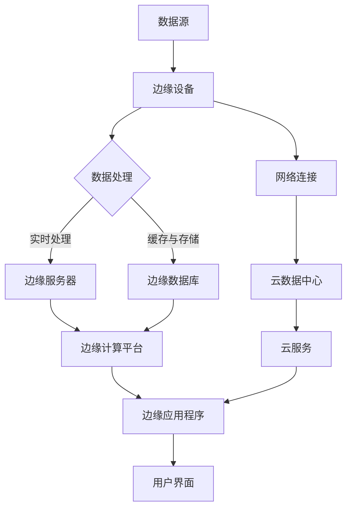

                 

**# 边缘计算创业：IoT时代的新基建机会**

> **关键词：边缘计算、物联网、新基建、创业机会、技术架构、安全挑战**

> **摘要：本文将深入探讨边缘计算在物联网时代的重要性和新兴创业机会。我们将分析边缘计算的起源、发展、核心技术以及其在物联网中的应用，同时探讨边缘计算创业的关键因素、典型案例以及未来趋势。文章旨在为技术从业者和创业公司提供有价值的指导和启示。**

**## 《边缘计算创业：IoT时代的新基建机会》目录大纲**

**第一部分：边缘计算概述**

**第1章：边缘计算的起源与发展**

1. 边缘计算的定义与核心概念  
    - 1.1 边缘计算的概念  
    - 1.2 边缘计算与传统云计算的区别  
    - 1.3 边缘计算的核心价值

2. 边缘计算的发展历程  
    - 1.2.1 边缘计算的早期阶段  
    - 1.2.2 边缘计算的关键事件  
    - 1.2.3 边缘计算的未来趋势

3. 边缘计算的关键技术  
    - 1.3.1 网络边缘设备  
    - 1.3.2 边缘计算平台  
    - 1.3.3 边缘计算网络架构

**第二部分：边缘计算在物联网中的应用**

**第2章：物联网时代边缘计算的重要性**

1. 物联网的基本概念  
    - 2.1 物联网的定义  
    - 2.2 物联网的关键技术  
    - 2.3 物联网的发展现状与趋势

2. 边缘计算在物联网中的角色  
    - 2.2.1 边缘计算如何优化物联网应用  
    - 2.2.2 边缘计算在物联网中的关键应用  
    - 2.2.3 边缘计算对物联网安全的贡献

**第3章：边缘计算在物联网设备中的应用**

1. 物联网设备的多样性  
    - 3.1.1 智能家居设备  
    - 3.1.2 工业物联网设备  
    - 3.1.3 智能交通设备

2. 边缘计算在物联网设备中的实现  
    - 3.2.1 边缘计算芯片  
    - 3.2.2 边缘计算操作系统  
    - 3.2.3 边缘计算软件框架

**第4章：边缘计算在物联网网络架构中的应用**

1. 物联网网络架构的挑战  
    - 4.1.1 网络延迟  
    - 4.1.2 网络带宽  
    - 4.1.3 网络可靠性

2. 边缘计算如何优化物联网网络架构  
    - 4.2.1 边缘计算如何降低网络延迟  
    - 4.2.2 边缘计算如何增加网络带宽  
    - 4.2.3 边缘计算如何提高网络可靠性

**第三部分：边缘计算创业机会**

**第5章：边缘计算创业概述**

1. 边缘计算创业的驱动力  
    - 5.1.1 政策与市场驱动力  
    - 5.1.2 技术进步驱动力  
    - 5.1.3 用户需求驱动力

2. 边缘计算创业的关键因素  
    - 5.2.1 技术创新能力  
    - 5.2.2 市场定位  
    - 5.2.3 资源整合能力

**第6章：边缘计算创业案例**

1. 案例一：智能家居边缘计算解决方案  
    - 6.1.1 案例背景  
    - 6.1.2 案例实现  
    - 6.1.3 案例效果评估

2. 案例二：工业物联网边缘计算应用  
    - 6.2.1 案例背景  
    - 6.2.2 案例实现  
    - 6.2.3 案例效果评估

3. 案例三：智能交通边缘计算系统  
    - 6.3.1 案例背景  
    - 6.3.2 案例实现  
    - 6.3.3 案例效果评估

**第7章：边缘计算创业的风险与挑战**

1. 技术挑战  
    - 7.1.1 能耗问题  
    - 7.1.2 系统稳定性  
    - 7.1.3 安全性问题

2. 市场挑战  
    - 7.2.1 市场定位不清  
    - 7.2.2 竞争激烈  
    - 7.2.3 用户接受度低

3. 政策与法规挑战  
    - 7.3.1 政策支持不足  
    - 7.3.2 法规不健全  
    - 7.3.3 国际合作与竞争

**第8章：边缘计算创业的建议与展望**

1. 创业建议  
    - 8.1.1 技术研发方向  
    - 8.1.2 市场开发策略  
    - 8.1.3 资源整合策略

2. 边缘计算创业的展望  
    - 8.2.1 技术发展趋势  
    - 8.2.2 市场前景预测  
    - 8.2.3 边缘计算的未来影响

**附录**

- 附录A：边缘计算开源工具与框架
- 附录B：物联网边缘计算案例
- 附录C：边缘计算资源
- 附录D：致谢与参考文献

**# 第一部分：边缘计算概述**

**## 第1章：边缘计算的起源与发展**

**### 1.1 边缘计算的定义与核心概念**

边缘计算（Edge Computing）是一种分布式计算架构，它通过在网络边缘部署计算资源，将数据处理、存储和分析任务从传统的数据中心和云迁移到接近数据源的设备上。边缘计算的核心概念包括网络边缘设备、边缘计算平台和网络架构。

- **网络边缘设备**：这些设备包括智能手机、路由器、工业控制设备、传感器等。它们位于网络边缘，负责收集、处理和传输数据。

- **边缘计算平台**：这是运行在边缘设备上的软件和硬件基础设施，用于处理和存储数据。边缘计算平台通常包括操作系统、数据库、中间件和应用程序。

- **网络架构**：边缘计算网络架构涉及将数据中心、云和边缘设备连接起来的方法。这种架构设计旨在优化数据传输速度和减少延迟。

**### 1.2 边缘计算与传统云计算的区别**

边缘计算与传统云计算有以下几点区别：

1. **位置**：传统云计算主要在数据中心和云环境中进行，而边缘计算则在网络边缘进行。
2. **计算能力**：边缘计算更注重分布式计算和本地处理，而云计算则依赖于集中的计算资源。
3. **延迟**：边缘计算旨在减少数据传输的延迟，因为它在靠近数据源的地方处理数据。
4. **带宽**：边缘计算有助于减轻数据中心和云的带宽压力，因为它在边缘处理大量数据。

**### 1.3 边缘计算的核心价值**

边缘计算具有以下几个核心价值：

1. **降低延迟**：通过在边缘处理数据，边缘计算可以显著减少数据传输的延迟，提高实时响应能力。
2. **节省带宽**：边缘计算通过在边缘处理数据，可以减少需要传输到云中心的数据量，从而节省带宽。
3. **增强安全性**：边缘计算有助于在本地处理敏感数据，从而减少数据泄露的风险。
4. **提高可靠性**：边缘计算可以增强系统的可靠性，因为在边缘处理数据可以减少对网络和云服务的依赖。

**### 1.2 边缘计算的发展历程**

边缘计算的发展历程可以分为以下几个阶段：

1. **早期阶段**（20世纪80年代至90年代）：边缘计算的概念开始出现，主要用于分布式计算和网络边缘的数据处理。
2. **发展阶段**（21世纪初至2010年）：随着物联网和移动设备的发展，边缘计算开始逐渐得到重视，并在工业、智能家居和交通等领域得到应用。
3. **成熟阶段**（2010年至今）：随着5G、人工智能和边缘计算技术的快速发展，边缘计算逐渐成为关键基础设施，并在各个领域得到广泛应用。

**### 1.2.1 边缘计算的早期阶段**

边缘计算的概念可以追溯到20世纪80年代和90年代。当时，分布式计算和网络边缘的数据处理开始受到关注。早期的研究主要集中在如何优化边缘设备上的数据处理能力，以及如何将数据处理任务从中心化的数据中心转移到网络边缘。

**### 1.2.2 边缘计算的关键事件**

1. **物联网（IoT）的兴起**：2000年代初期，物联网技术的快速发展推动了边缘计算的需求。物联网设备的大量涌现使得边缘计算成为处理海量数据的关键手段。
2. **移动计算的普及**：随着智能手机和移动设备的普及，人们对于实时数据处理和响应的需求不断增加，边缘计算成为满足这一需求的重要技术。
3. **5G技术的引入**：5G技术的引入为边缘计算提供了更高的网络速度和更低的延迟，进一步推动了边缘计算的发展。

**### 1.2.3 边缘计算的未来趋势**

随着技术的不断进步，边缘计算将继续发展，并在以下几个方面呈现出未来趋势：

1. **智能化边缘设备**：随着人工智能和机器学习技术的应用，边缘设备将变得更加智能，能够自主处理和决策。
2. **分布式边缘计算**：未来的边缘计算将更加分布式，不再局限于单一设备或平台，而是形成一个庞大的分布式计算网络。
3. **边缘云融合**：边缘计算和云计算将继续融合，形成边缘云架构，为用户提供更加高效和可靠的服务。

**### 1.3 边缘计算的关键技术**

边缘计算的关键技术包括：

1. **网络边缘设备**：这些设备包括各种传感器、路由器、网关和边缘服务器等。它们负责收集、处理和传输数据。
2. **边缘计算平台**：边缘计算平台是运行在边缘设备上的软件和硬件基础设施，用于处理和存储数据。这些平台通常包括操作系统、数据库、中间件和应用程序。
3. **边缘计算网络架构**：边缘计算网络架构涉及将数据中心、云和边缘设备连接起来的方法。这种架构设计旨在优化数据传输速度和减少延迟。

**### 1.3.1 网络边缘设备**

网络边缘设备是边缘计算的核心组成部分，它们负责收集、处理和传输数据。以下是一些常见的网络边缘设备：

1. **传感器**：传感器负责收集环境数据，如温度、湿度、光照等。这些数据可以用于监控和控制各种设备和系统。
2. **路由器**：路由器负责将数据从一个网络传输到另一个网络。在边缘计算中，路由器通常用于连接边缘设备和云服务。
3. **网关**：网关负责将不同协议和格式之间的数据进行转换。在边缘计算中，网关通常用于将边缘设备的数据转换为云服务可以理解的形式。
4. **边缘服务器**：边缘服务器是运行在边缘设备上的计算和存储资源，用于处理和存储数据。边缘服务器可以是一个独立的设备，也可以是多个设备的集合。

**### 1.3.2 边缘计算平台**

边缘计算平台是运行在边缘设备上的软件和硬件基础设施，用于处理和存储数据。以下是一些常见的边缘计算平台：

1. **开源边缘计算平台**：如Kubernetes、Docker、OpenVINO等。这些平台提供了一系列工具和功能，帮助开发者构建、部署和管理边缘应用程序。
2. **商业边缘计算平台**：如AWS Greengrass、Azure IoT Edge、Google Edge TPU等。这些平台通常由大型科技公司提供，具有强大的功能和生态系统支持。
3. **轻量级边缘计算平台**：如MQTT、CoAP等。这些平台适用于资源受限的边缘设备，提供简单的数据传输和处理功能。

**### 1.3.3 边缘计算网络架构**

边缘计算网络架构涉及将数据中心、云和边缘设备连接起来的方法。以下是一些常见的边缘计算网络架构：

1. **集中式架构**：在这种架构中，所有数据处理任务都集中在边缘设备上。这种架构适用于处理数据密集型应用，但可能会增加设备的能耗和复杂性。
2. **分布式架构**：在这种架构中，数据处理任务分布在多个边缘设备上。这种架构可以提高系统的灵活性和可扩展性，但需要更多的网络资源和协调。
3. **混合架构**：在这种架构中，部分数据处理任务在边缘设备上执行，而另一部分在云中心执行。这种架构可以结合分布式架构和集中式架构的优点，但需要更复杂的网络设计和调度。

**## 第2章：边缘计算在物联网中的应用**

**### 2.1 物联网的基本概念**

物联网（Internet of Things，IoT）是指通过互联网连接各种物理设备、传感器和系统，实现智能管理和自动化控制。以下是一些关于物联网的基本概念：

1. **设备连接**：物联网设备通过互联网相互连接，形成大规模的设备网络。这些设备可以是智能手机、平板电脑、传感器、智能灯泡、智能门锁等。
2. **传感器**：物联网设备通常配备各种传感器，用于收集环境数据，如温度、湿度、光照、振动等。这些数据可以用于监控、控制和优化各种设备和系统。
3. **数据处理**：物联网设备通过边缘计算技术，在本地处理数据，实现实时监控和自动化控制。这种处理方式可以减少数据传输的延迟，提高系统的响应速度。
4. **云服务**：物联网设备的数据通常存储在云服务中，以便进行长期存储和分析。云服务还可以为物联网设备提供计算、存储和网络资源。

**### 2.2 物联网的关键技术**

物联网的关键技术包括：

1. **无线通信技术**：如Wi-Fi、蓝牙、Zigbee、LoRa等。这些技术用于连接物联网设备和网络，实现数据传输和通信。
2. **传感器技术**：包括各种传感器，如温度传感器、湿度传感器、光照传感器、振动传感器等。这些传感器用于收集环境数据，实现实时监控和自动化控制。
3. **边缘计算技术**：边缘计算技术在物联网中起到关键作用，通过在边缘设备上处理数据，实现实时监控和自动化控制。
4. **云计算技术**：云计算技术用于存储、处理和分析物联网设备的数据。云服务可以提供强大的计算、存储和网络资源，支持大规模物联网应用。

**### 2.3 物联网的发展现状与趋势**

物联网的发展现状和趋势如下：

1. **设备数量快速增长**：随着物联网技术的普及，物联网设备数量快速增长。据统计，全球物联网设备数量已经超过100亿台，预计到2030年将达到200亿台。
2. **应用领域不断拓展**：物联网技术已经广泛应用于智能家居、智能城市、智能工业、智能交通、智能医疗等多个领域。随着技术的进步，物联网的应用领域将继续拓展。
3. **边缘计算需求增加**：随着物联网设备的增加，数据传输的延迟和带宽压力不断增大。边缘计算技术可以减少数据传输的延迟，提高系统的响应速度，因此在物联网中的应用需求不断增加。
4. **人工智能融合**：人工智能技术在物联网中的应用日益成熟，通过在边缘设备上部署人工智能算法，可以实现更智能的监控、控制和优化。

**### 2.2 边缘计算在物联网中的角色**

边缘计算在物联网中扮演着至关重要的角色，以下是边缘计算在物联网中的几个关键角色：

1. **数据处理**：边缘计算可以将数据处理任务从云端转移到网络边缘，从而减少数据传输的延迟和带宽压力。在物联网中，许多应用需要实时处理数据，如智能家居的智能控制、智能交通的实时监控等。边缘计算可以在本地处理这些数据，实现实时响应。
2. **数据存储**：边缘计算设备通常配备一定的存储资源，可以用于存储物联网设备产生的数据。这些数据可以用于实时监控、历史数据分析和故障诊断等。边缘存储可以减少对云存储的依赖，提高系统的可靠性。
3. **网络优化**：边缘计算可以优化物联网的网络架构，降低网络延迟和带宽压力。在物联网中，许多应用需要低延迟和高带宽的网络支持，如自动驾驶、远程医疗等。边缘计算可以在本地处理和传输数据，减少对云服务的依赖，提高网络性能。
4. **安全性增强**：边缘计算可以在本地处理敏感数据，从而减少数据泄露的风险。在物联网中，数据安全是至关重要的，特别是涉及个人隐私和商业机密的数据。边缘计算可以在本地进行加密和授权，提高数据的安全性。

**### 2.2.1 边缘计算如何优化物联网应用**

边缘计算可以优化物联网应用的以下几个方面：

1. **实时处理**：边缘计算可以在本地实时处理物联网设备产生的数据，实现实时监控和自动化控制。例如，在智能家居中，边缘计算可以实时处理传感器数据，实现智能灯光控制、温度调节等。
2. **减少延迟**：边缘计算可以减少数据传输的延迟，提高物联网应用的响应速度。例如，在自动驾驶中，边缘计算可以实时处理摄像头和传感器数据，实现车辆的控制和决策。
3. **降低带宽需求**：边缘计算可以减少需要传输到云端的数据量，从而降低带宽需求。例如，在智能工厂中，边缘计算可以实时处理生产设备的数据，减少对云服务的依赖，降低带宽成本。
4. **增强安全性**：边缘计算可以在本地处理敏感数据，减少数据泄露的风险。例如，在智能医疗中，边缘计算可以实时处理患者数据，提高数据安全性。

**### 2.2.2 边缘计算在物联网中的关键应用**

边缘计算在物联网中有许多关键应用，以下是其中几个关键应用：

1. **智能家居**：边缘计算可以用于智能家居的智能控制，如智能灯光、温度控制、安全监控等。边缘计算可以在本地处理传感器数据，实现实时监控和自动化控制。
2. **智能交通**：边缘计算可以用于智能交通的实时监控和优化，如交通流量控制、智能停车等。边缘计算可以实时处理摄像头和传感器数据，实现车辆的控制和调度。
3. **工业物联网**：边缘计算可以用于工业物联网的实时监控和优化，如设备监控、故障诊断、生产优化等。边缘计算可以在本地处理生产设备的数据，实现实时监控和自动化控制。
4. **远程医疗**：边缘计算可以用于远程医疗的实时监控和诊断，如远程医疗咨询、医疗数据监控等。边缘计算可以实时处理医疗设备的数据，实现实时监控和诊断。

**### 2.2.3 边缘计算对物联网安全的贡献**

边缘计算对物联网安全有着重要的贡献，以下是边缘计算在物联网安全方面的几个关键贡献：

1. **数据加密**：边缘计算可以在本地对物联网设备产生的数据进行加密，从而提高数据的安全性。加密可以防止数据在传输过程中被窃取或篡改。
2. **身份认证**：边缘计算可以用于物联网设备的身份认证，确保只有授权设备可以访问系统和数据。身份认证可以防止未授权设备访问系统和数据，提高系统的安全性。
3. **访问控制**：边缘计算可以用于物联网设备的访问控制，确保只有授权用户可以访问系统和数据。访问控制可以防止未授权用户访问系统和数据，提高系统的安全性。
4. **威胁检测和响应**：边缘计算可以实时检测物联网设备的安全威胁，并采取相应的响应措施。例如，边缘计算可以实时检测恶意软件、异常行为等，并采取隔离、清除等措施。

**### 2.3 边缘计算在物联网设备中的应用**

边缘计算在物联网设备中的应用非常广泛，以下是边缘计算在几种常见物联网设备中的应用：

1. **智能手机**：智能手机作为物联网设备的重要组成部分，可以通过边缘计算实现实时数据处理和响应。例如，智能手机可以实时处理摄像头数据，实现人脸识别、图像识别等功能。
2. **智能手表**：智能手表可以通过边缘计算实现实时健康监测和通知功能。例如，智能手表可以实时监测心率、血压等健康指标，并通过边缘计算处理和分析这些数据，实现实时通知和报警。
3. **智能门锁**：智能门锁可以通过边缘计算实现智能识别和授权。例如，智能门锁可以实时处理用户指纹、面部识别等数据，并通过边缘计算实现自动开锁和权限控制。
4. **智能摄像头**：智能摄像头可以通过边缘计算实现实时视频监控和智能识别。例如，智能摄像头可以实时处理视频数据，实现人脸识别、行为识别等功能。

**### 2.3.1 物联网设备的多样性**

物联网设备的多样性是物联网应用的重要特征之一。以下是一些常见的物联网设备类型：

1. **智能家居设备**：如智能灯泡、智能门锁、智能空调、智能电视等。这些设备通过边缘计算实现智能控制和管理。
2. **工业物联网设备**：如传感器、执行器、机器人、无人机等。这些设备通过边缘计算实现实时监控、故障诊断和生产优化。
3. **智能交通设备**：如智能交通灯、智能停车位检测器、智能车载设备等。这些设备通过边缘计算实现交通流量监控、交通调度和智能驾驶。
4. **智能医疗设备**：如智能监护仪、智能心电图仪、智能穿戴设备等。这些设备通过边缘计算实现实时健康监测和远程诊断。

**### 2.3.2 边缘计算芯片**

边缘计算芯片是边缘计算设备的核心组件之一，以下是一些常见的边缘计算芯片：

1. **NVIDIA Jetson**：NVIDIA Jetson是一系列边缘计算芯片，适用于智能汽车、机器人、无人机等应用。Jetson芯片具有高性能计算能力，可以支持深度学习、计算机视觉等应用。
2. **QualcommSnapdragon**：Qualcomm Snapdragon系列芯片是高性能移动芯片，也适用于边缘计算应用。Snapdragon芯片具有强大的计算能力和低功耗特性，适用于智能设备、智能交通等应用。
3. **Intel Movidius**：Intel Movidius系列芯片是专门为深度学习和计算机视觉应用设计的边缘计算芯片。Movidius芯片具有高性能计算能力，可以支持实时图像处理和视频分析。
4. **Google Edge TPU**：Google Edge TPU是专为边缘计算设计的人工智能芯片。Edge TPU芯片具有高性价比和低功耗特性，可以支持实时图像识别、自然语言处理等应用。

**### 2.3.3 边缘计算操作系统**

边缘计算操作系统是边缘计算设备的核心软件之一，以下是一些常见的边缘计算操作系统：

1. **Ubuntu**：Ubuntu是一个开源操作系统，适用于各种边缘计算应用。Ubuntu操作系统具有强大的社区支持和丰富的软件生态系统，适用于智能家居、智能交通、工业物联网等应用。
2. **Windows IoT Core**：Windows IoT Core是微软专门为边缘计算设计的操作系统。Windows IoT Core操作系统具有易用性和广泛的兼容性，适用于智能家居、智能零售、智能医疗等应用。
3. **Arduino**：Arduino是一个开源硬件和软件平台，适用于各种边缘计算应用。Arduino平台具有简单易用的编程环境和广泛的硬件支持，适用于智能家居、智能工业、智能交通等应用。
4. **Yocto**：Yocto是一个开源的自动化构建系统，可以用于创建定制化的边缘计算操作系统。Yocto系统具有灵活性和可扩展性，适用于工业物联网、医疗设备、智能城市等应用。

**### 2.3.4 边缘计算软件框架**

边缘计算软件框架是边缘计算设备的核心软件之一，以下是一些常见的边缘计算软件框架：

1. **Kubernetes**：Kubernetes是一个开源的容器编排平台，适用于边缘计算应用。Kubernetes平台具有强大的容器管理和调度功能，可以支持大规模的边缘计算应用。
2. **Docker**：Docker是一个开源的容器化平台，适用于边缘计算应用。Docker平台具有轻量级、可移植性和高并发性等特点，适用于智能家居、智能交通、工业物联网等应用。
3. **Apache Kafka**：Apache Kafka是一个开源的消息队列系统，适用于边缘计算应用。Kafka系统具有高吞吐量、可扩展性和可靠性等特点，适用于实时数据处理和分布式系统。
4. **Apache Flink**：Apache Flink是一个开源的流处理框架，适用于边缘计算应用。Flink框架具有实时处理、低延迟和高吞吐量等特点，适用于实时数据分析、物联网数据处理等应用。

**### 2.4 边缘计算在物联网网络架构中的应用**

边缘计算在物联网网络架构中的应用至关重要，以下是一些关键应用：

1. **网络边缘设备**：边缘计算网络架构中的网络边缘设备负责收集、处理和传输数据。这些设备可以是传感器、路由器、网关和边缘服务器等。
2. **边缘计算平台**：边缘计算平台是边缘计算设备上的软件和硬件基础设施，用于处理和存储数据。这些平台通常包括操作系统、数据库、中间件和应用程序。
3. **边缘计算网络架构**：边缘计算网络架构涉及将数据中心、云和边缘设备连接起来的方法。这种架构设计旨在优化数据传输速度和减少延迟。

**### 2.4.1 物联网网络架构的挑战**

物联网网络架构面临以下挑战：

1. **网络延迟**：物联网设备通常分布在广泛的地理区域，这可能导致网络延迟。网络延迟会影响物联网应用的实时性，如自动驾驶、远程医疗等。
2. **网络带宽**：物联网设备产生的数据量巨大，可能导致网络带宽不足。带宽不足会影响物联网应用的性能，如视频流、实时监控等。
3. **网络可靠性**：物联网设备通常处于恶劣的环境中，如高温、高湿度、振动等。这可能导致网络中断和设备故障，影响物联网应用的可靠性。

**### 2.4.2 边缘计算如何优化物联网网络架构**

边缘计算可以优化物联网网络架构，以下是一些关键方法：

1. **分布式计算**：边缘计算可以将数据处理任务从云端转移到网络边缘，从而减少数据传输的延迟。分布式计算可以提高物联网应用的实时性和响应速度。
2. **本地处理**：边缘计算可以在本地处理物联网设备产生的数据，从而减少需要传输到云的数据量。本地处理可以减少网络带宽需求，提高物联网应用的性能。
3. **缓存和存储**：边缘计算可以在边缘设备上缓存和存储数据，从而减少对云服务的依赖。缓存和存储可以提高物联网应用的可靠性和数据访问速度。
4. **网络优化**：边缘计算可以优化物联网的网络架构，减少网络延迟和带宽压力。网络优化可以提高物联网应用的性能和可靠性。

**### 2.4.3 边缘计算如何降低网络延迟**

边缘计算可以降低网络延迟，以下是一些关键方法：

1. **分布式计算**：边缘计算可以将数据处理任务从云端转移到网络边缘，从而减少数据传输的延迟。分布式计算可以在本地处理数据，减少数据传输的距离和时间。
2. **数据缓存**：边缘计算可以在边缘设备上缓存数据，从而减少数据传输的次数。数据缓存可以提高数据处理的速度，减少网络延迟。
3. **数据压缩**：边缘计算可以压缩物联网设备产生的数据，从而减少数据传输的大小。数据压缩可以提高数据传输的速度，降低网络延迟。
4. **智能路由**：边缘计算可以根据网络状况和流量负载，动态调整数据传输的路径。智能路由可以优化数据传输的路径，减少网络延迟。

**### 2.4.4 边缘计算如何增加网络带宽**

边缘计算可以增加网络带宽，以下是一些关键方法：

1. **分布式网络架构**：边缘计算可以将网络架构从集中式转换为分布式，从而增加网络带宽。分布式网络架构可以在多个边缘设备之间共享带宽资源，提高网络容量。
2. **数据分流**：边缘计算可以将物联网设备产生的数据分流到多个网络路径，从而增加网络带宽。数据分流可以平衡网络负载，提高网络容量。
3. **网络加速**：边缘计算可以采用网络加速技术，如CDN（内容分发网络）、DPI（深度包检测）等，提高网络传输速度。网络加速可以优化数据传输，提高网络带宽。
4. **带宽预留**：边缘计算可以在网络边缘预留带宽资源，以确保物联网设备在高峰时段有足够的带宽。带宽预留可以提高网络带宽的利用率，减少网络拥堵。

**### 2.4.5 边缘计算如何提高网络可靠性**

边缘计算可以提高网络可靠性，以下是一些关键方法：

1. **冗余设计**：边缘计算可以在网络边缘部署多个设备或路径，实现冗余设计。冗余设计可以提高网络的可靠性，确保数据传输不会因单一设备或路径故障而中断。
2. **故障检测与恢复**：边缘计算可以实时监测网络状态，及时发现故障并采取措施恢复。故障检测与恢复可以提高网络的可靠性，减少网络中断时间。
3. **负载均衡**：边缘计算可以根据网络负载情况，动态调整数据传输路径。负载均衡可以平衡网络负载，防止网络过载，提高网络的可靠性。
4. **安全防护**：边缘计算可以部署网络安全防护措施，如防火墙、入侵检测等，保护网络免受攻击。安全防护可以提高网络的可靠性，减少安全威胁。

**### 2.4.6 边缘计算在物联网网络架构中的应用示例**

以下是一个边缘计算在物联网网络架构中的应用示例：

**智能家居网络架构**

在智能家居网络架构中，边缘计算可以应用于以下几个方面：

1. **数据采集**：智能家居设备（如智能灯泡、智能门锁、智能温度传感器等）通过边缘计算设备（如网关、边缘服务器）采集数据。
2. **数据处理**：边缘计算设备对采集到的数据（如光照、温度、湿度等）进行实时处理，实现智能家居设备的自动化控制。
3. **数据传输**：边缘计算设备将处理后的数据传输到云端，供用户和管理系统使用。
4. **故障检测与恢复**：边缘计算设备实时监测智能家居设备的运行状态，发现故障时采取措施恢复。
5. **安全防护**：边缘计算设备部署网络安全防护措施，保护智能家居网络免受攻击。

**# 第二部分：边缘计算在物联网中的应用**

**## 第3章：边缘计算在物联网设备中的应用**

**### 3.1 物联网设备的多样性**

物联网设备种类繁多，覆盖了各个领域，包括但不限于：

1. **智能家居设备**：如智能灯泡、智能门锁、智能恒温器、智能摄像头等。
2. **工业物联网设备**：如传感器、执行器、机器人、自动化生产线等。
3. **智能交通设备**：如智能交通灯、智能停车传感器、智能导航系统等。
4. **医疗物联网设备**：如智能血压计、智能心电图仪、远程监控设备等。
5. **农业物联网设备**：如智能灌溉系统、土壤传感器、环境监测设备等。

每种设备都有其特定的功能和应用场景，但它们共同的特点是需要实时数据采集、处理和响应。边缘计算在这些设备中的应用，旨在提高系统的响应速度、降低延迟、节省带宽，并增强数据的隐私和安全。

**### 3.2 边缘计算在物联网设备中的实现**

边缘计算在物联网设备中的实现涉及多个层面，包括硬件、软件和系统架构的设计与部署。

1. **硬件层面**：

   - **边缘计算芯片**：选择适合物联网设备性能和功耗需求的边缘计算芯片，如NVIDIA Jetson、Qualcomm Snapdragon等。
   - **传感器模块**：集成各种传感器，如温度传感器、湿度传感器、光传感器等，以收集环境数据。
   - **通信模块**：集成Wi-Fi、蓝牙、Zigbee、LoRa等无线通信模块，实现设备与边缘服务器或云端的连接。

2. **软件层面**：

   - **操作系统**：选择适合边缘计算环境的操作系统，如Ubuntu、Windows IoT Core、Arduino等。
   - **边缘计算框架**：集成边缘计算框架，如Kubernetes、Docker、Apache Kafka等，以简化应用程序的部署和管理。
   - **应用程序**：开发适用于特定物联网设备的应用程序，如智能家居控制应用程序、工业自动化应用程序等。

3. **系统架构层面**：

   - **设备层**：设备层由物联网设备组成，负责数据采集和初步处理。
   - **边缘层**：边缘层由边缘计算设备组成，负责进一步的数据处理和实时分析。
   - **云层**：云层由云服务器和数据中心组成，负责存储、分析和处理来自边缘层的数据。

**### 3.2.1 边缘计算芯片**

边缘计算芯片是物联网设备中的关键组成部分，它决定了设备的计算能力和功耗表现。以下是一些常见的边缘计算芯片及其特点：

1. **NVIDIA Jetson**：
   - **特点**：NVIDIA Jetson系列芯片提供了强大的GPU性能，适合执行复杂的计算机视觉和深度学习任务。
   - **应用场景**：智能摄像头、机器人、无人机等需要高性能计算的应用。

2. **Qualcomm Snapdragon**：
   - **特点**：Qualcomm Snapdragon系列芯片集成了高性能CPU、GPU和AI引擎，适合移动设备和物联网设备。
   - **应用场景**：智能手机、智能手表、智能门锁等。

3. **Intel Movidius**：
   - **特点**：Intel Movidius系列芯片专为深度学习和计算机视觉应用设计，具有低功耗和高性能的特点。
   - **应用场景**：智能摄像头、安全监控、无人驾驶等。

4. **Google Edge TPU**：
   - **特点**：Google Edge TPU芯片专为边缘计算和机器学习应用设计，具有高效能和低功耗的特点。
   - **应用场景**：智能助理、智能监控、工业自动化等。

**### 3.2.2 边缘计算操作系统**

边缘计算操作系统是边缘计算设备的核心软件之一，它提供了运行环境和管理工具。以下是一些常见的边缘计算操作系统：

1. **Ubuntu**：
   - **特点**：Ubuntu是一个开源操作系统，具有强大的社区支持和广泛的软件生态系统。
   - **应用场景**：智能家居、智能交通、工业物联网等。

2. **Windows IoT Core**：
   - **特点**：Windows IoT Core是微软推出的专门为边缘计算设计的操作系统，易于使用且兼容性强。
   - **应用场景**：智能零售、智能医疗、智能农业等。

3. **Arduino**：
   - **特点**：Arduino是一个开源硬件和软件平台，适合初学者和开发者。
   - **应用场景**：智能家居、DIY项目、教育等。

4. **Yocto**：
   - **特点**：Yocto是一个开源的自动化构建系统，可以创建定制化的操作系统。
   - **应用场景**：工业物联网、医疗设备、智能城市等。

**### 3.2.3 边缘计算软件框架**

边缘计算软件框架提供了构建、部署和管理边缘计算应用程序的工具和平台。以下是一些常见的边缘计算软件框架：

1. **Kubernetes**：
   - **特点**：Kubernetes是一个开源的容器编排平台，可以自动化部署、扩展和管理容器化应用程序。
   - **应用场景**：智能家居、智能交通、工业物联网等。

2. **Docker**：
   - **特点**：Docker是一个开源的容器化平台，可以将应用程序及其依赖环境打包成容器。
   - **应用场景**：智能家居、智能零售、医疗设备等。

3. **Apache Kafka**：
   - **特点**：Apache Kafka是一个开源的消息队列系统，可以高效地处理大规模的数据流。
   - **应用场景**：实时数据处理、物联网数据集成、数据分析等。

4. **Apache Flink**：
   - **特点**：Apache Flink是一个开源的流处理框架，可以实时处理大规模数据流。
   - **应用场景**：实时数据分析、物联网数据处理、机器学习等。

**### 3.3 边缘计算在物联网设备中的应用示例**

以下是一个边缘计算在物联网设备中的应用示例：智能农业监测系统。

**智能农业监测系统**

**应用背景**：

智能农业监测系统旨在实时监测农作物的生长状况，提供精准的灌溉、施肥和病虫害防治方案，以提高农业生产效率。

**系统架构**：

1. **设备层**：包括土壤传感器、湿度传感器、温度传感器、摄像头等，用于实时监测农作物的生长环境。

2. **边缘层**：包括边缘计算服务器，负责接收设备层的数据，进行初步处理和分析。

3. **云层**：包括云服务器和数据中心，负责存储、分析和处理来自边缘层的数据，为用户提供监测报告和决策建议。

**边缘计算实现**：

1. **硬件**：采用NVIDIA Jetson芯片作为边缘计算服务器，具有强大的计算能力。

2. **软件**：采用Ubuntu操作系统，集成Kubernetes和Apache Kafka框架，实现设备数据的实时采集、处理和传输。

3. **应用程序**：开发智能农业监测应用程序，根据边缘计算服务器处理的结果，提供精准的灌溉、施肥和病虫害防治方案。

**效果评估**：

1. **实时性**：边缘计算服务器可以实时处理传感器数据，实现实时监测，提高了农业生产效率。

2. **数据可靠性**：通过边缘计算处理，减少了数据传输的延迟和带宽压力，提高了数据传输的可靠性。

3. **节约成本**：通过边缘计算，减少了需要传输到云的数据量，降低了网络带宽和存储成本。

**# 第三部分：边缘计算创业机会**

**## 第5章：边缘计算创业概述**

边缘计算作为物联网时代的关键技术，为创业者提供了丰富的商业机会。本章将探讨边缘计算创业的驱动力、关键因素以及创业者的策略和挑战。

**### 5.1 边缘计算创业的驱动力**

边缘计算创业的驱动力主要来自以下几个方面：

1. **技术进步**：随着5G、物联网、人工智能等技术的快速发展，边缘计算成为提升系统性能、降低延迟、提高安全性、实现智能化的重要手段。

2. **市场需求**：物联网设备的普及带来了海量的数据，传统的云计算模式已经无法满足实时性、安全性、低延迟等需求。边缘计算可以提供更好的解决方案，满足市场对实时数据处理和智能响应的需求。

3. **政策支持**：各国政府纷纷出台政策，支持边缘计算技术的发展和应用，为创业者提供了良好的政策环境。

4. **资本关注**：边缘计算领域的投资日益增多，吸引了大量的风险投资和战略投资，为创业者提供了资金支持。

**### 5.2 边缘计算创业的关键因素**

边缘计算创业成功的关键因素包括：

1. **技术创新能力**：创业者需要具备强大的技术创新能力，开发出具有竞争力的边缘计算产品或解决方案。

2. **市场定位**：明确目标市场，了解客户需求，提供针对性的产品和服务。

3. **资源整合能力**：边缘计算涉及硬件、软件、网络等多个领域，创业者需要具备良好的资源整合能力，建立强大的生态圈。

4. **团队建设**：组建一支具有多学科背景、专业技能和创业精神的核心团队，是创业成功的关键。

**### 5.3 边缘计算创业的挑战**

边缘计算创业面临的挑战主要包括：

1. **技术挑战**：边缘计算技术复杂，涉及硬件、软件、网络等多个领域，创业者需要解决技术难题，确保产品或解决方案的稳定性和可靠性。

2. **市场挑战**：市场竞争激烈，创业者需要精准定位市场，提供差异化的产品和服务，获取市场份额。

3. **资金挑战**：边缘计算创业需要大量资金投入，包括研发、生产、市场推广等，创业者需要寻找资金来源，确保资金链的稳定性。

4. **法规挑战**：边缘计算涉及数据安全、隐私保护等方面，创业者需要了解并遵守相关法律法规，确保业务的合规性。

**### 5.4 边缘计算创业的建议**

对于有志于边缘计算创业的创业者，以下是一些建议：

1. **聚焦细分市场**：选择具有明确市场需求和前景的细分市场，集中资源进行开发和应用。

2. **构建生态系统**：与硬件制造商、软件开发商、服务提供商等建立合作关系，构建一个强大的生态系统，共同推动边缘计算技术的发展。

3. **持续创新**：保持技术创新，关注行业动态，及时调整产品策略，保持竞争优势。

4. **注重用户体验**：提供优质的产品和服务，关注用户体验，通过持续改进提高用户满意度。

5. **合规经营**：了解并遵守相关法律法规，确保业务的合规性，降低法律风险。

**### 5.5 边缘计算创业的展望**

随着技术的不断进步和市场需求的增长，边缘计算创业前景广阔。未来，边缘计算将在以下几个方面继续发展：

1. **智能化**：随着人工智能技术的进步，边缘计算设备将变得更加智能化，能够自主处理和决策。

2. **分布式**：边缘计算将更加分布式，不再局限于单一设备或平台，而是形成一个庞大的分布式计算网络。

3. **融合化**：边缘计算与云计算、大数据、物联网等技术的融合将不断深化，为创业者提供更多的商业机会。

4. **普及化**：边缘计算技术将逐渐普及，从工业、交通、医疗等领域向更多领域扩展，为各行各业带来变革。

**# 第6章：边缘计算创业案例**

在边缘计算领域，已经涌现出许多成功的创业案例。这些案例不仅展示了边缘计算技术的应用场景，还为其他创业者提供了宝贵的经验和启示。在本章中，我们将探讨三个具体的边缘计算创业案例，包括智能家居边缘计算解决方案、工业物联网边缘计算应用以及智能交通边缘计算系统。

**### 6.1 案例一：智能家居边缘计算解决方案**

**案例背景**

随着物联网技术的发展，智能家居市场迅速崛起。然而，传统的云计算模式在处理大量实时数据时存在延迟和带宽瓶颈，无法满足智能家居用户的实时需求。为了解决这些问题，一家创业公司决定开发一款基于边缘计算的智能家居解决方案。

**案例实现**

该创业公司开发了以下关键组件：

1. **边缘计算网关**：边缘计算网关是智能家居设备的中心控制单元，负责数据采集、处理和传输。它采用了高性能的边缘计算芯片，并集成了多种传感器接口，支持与各种智能家居设备连接。

2. **边缘计算平台**：边缘计算平台是一个运行在网关上的软件系统，提供了数据存储、处理和分析功能。平台采用了分布式架构，可以支持海量设备的连接和数据处理。

3. **智能家居应用程序**：智能家居应用程序提供了一个用户友好的界面，用户可以通过手机或平板电脑远程控制家中的设备。应用程序还集成了机器学习算法，可以根据用户习惯自动调整设备状态。

**案例效果评估**

该智能家居边缘计算解决方案在市场上获得了良好的反响，主要效果包括：

1. **降低延迟**：边缘计算使得数据处理任务在本地完成，显著降低了数据传输的延迟，提高了系统的响应速度。

2. **节省带宽**：通过在边缘处理数据，减少了需要传输到云的数据量，降低了带宽消耗。

3. **提高安全性**：边缘计算网关对数据进行加密和认证，提高了系统的安全性，降低了数据泄露的风险。

4. **用户满意度**：用户可以实时监控和控制家中的设备，体验更加便捷和智能。

**### 6.2 案例二：工业物联网边缘计算应用**

**案例背景**

工业物联网（IIoT）在制造业中发挥着重要作用，但传统的云计算模式在处理工业设备产生的海量数据时存在延迟和可靠性问题。为了提高工业物联网应用的性能和可靠性，一家创业公司决定开发一款基于边缘计算的工业物联网解决方案。

**案例实现**

该创业公司开发了以下关键组件：

1. **边缘计算传感器**：边缘计算传感器是工业设备的数据采集单元，可以实时监测设备的工作状态和环境参数。传感器采用了先进的传感技术，具备高精度和高稳定性。

2. **边缘计算网关**：边缘计算网关负责接收传感器数据，进行初步处理和过滤。网关采用了高性能的计算芯片，可以实时处理大量数据。

3. **边缘计算平台**：边缘计算平台是一个运行在网关上的软件系统，提供了数据存储、处理和分析功能。平台支持多种工业协议，可以与工业设备无缝集成。

4. **工业物联网应用程序**：工业物联网应用程序提供了一个实时监控和数据分析的界面，用户可以通过应用程序查看设备状态、历史数据和故障报警。

**案例效果评估**

该工业物联网边缘计算解决方案在制造业中取得了显著成效，主要效果包括：

1. **提高数据处理速度**：边缘计算使得数据处理任务在本地完成，显著降低了数据传输的延迟，提高了系统的响应速度。

2. **提高设备可靠性**：通过实时监测设备状态，可以及时发现设备故障，提高设备的运行可靠性。

3. **降低维护成本**：通过实时数据分析和故障预警，可以降低设备的维护成本。

4. **提高生产效率**：通过实时监控和自动化控制，可以优化生产流程，提高生产效率。

**### 6.3 案例三：智能交通边缘计算系统**

**案例背景**

智能交通系统是城市交通管理的重要组成部分，但传统的云计算模式在处理海量交通数据时存在延迟和带宽瓶颈，无法满足实时交通监控和优化需求。为了解决这些问题，一家创业公司决定开发一款基于边缘计算的智能交通系统。

**案例实现**

该创业公司开发了以下关键组件：

1. **边缘计算摄像头**：边缘计算摄像头是交通数据的采集单元，可以实时监测交通流量、车辆速度和交通事故等。摄像头采用了先进的图像识别技术，具备高精度和实时性。

2. **边缘计算网关**：边缘计算网关负责接收摄像头数据，进行初步处理和过滤。网关采用了高性能的计算芯片，可以实时处理大量数据。

3. **边缘计算平台**：边缘计算平台是一个运行在网关上的软件系统，提供了数据存储、处理和分析功能。平台支持多种交通协议，可以与交通管理系统无缝集成。

4. **智能交通应用程序**：智能交通应用程序提供了一个实时监控和数据分析的界面，交通管理人员可以通过应用程序查看交通状况、历史数据和优化方案。

**案例效果评估**

该智能交通边缘计算系统在多个城市得到了应用，主要效果包括：

1. **降低交通拥堵**：通过实时监控交通流量，可以及时发现交通拥堵情况，采取优化措施，降低交通拥堵。

2. **提高交通安全性**：通过实时监控车辆速度和交通事故，可以及时预警和干预，提高交通安全性。

3. **优化交通管理**：通过实时数据分析和优化算法，可以优化交通信号灯控制、道路规划等，提高交通管理效率。

4. **提高公众满意度**：通过实时交通信息发布和路线优化，提高了公众对交通管理的满意度。

**# 第7章：边缘计算创业的风险与挑战**

边缘计算创业虽然充满了机遇，但也伴随着一系列的风险和挑战。这些风险和挑战不仅会影响创业公司的生存和发展，也可能影响整个边缘计算行业的生态。以下将分析边缘计算创业面临的主要技术、市场和政策法规方面的风险与挑战。

**### 7.1 技术挑战**

边缘计算技术复杂，涉及硬件、软件、网络等多个领域。以下是一些主要的技术挑战：

1. **能耗问题**：边缘计算设备通常分布在广泛的地理区域，需要长时间运行，因此能耗是一个重要问题。如何在不牺牲性能的情况下降低能耗，是边缘计算创业公司需要解决的关键问题。

2. **系统稳定性**：边缘计算设备通常运行在恶劣的环境中，如高温、高湿度、振动等。如何确保设备在复杂环境下稳定运行，是创业公司需要面对的挑战。

3. **安全性问题**：边缘计算涉及大量的数据传输和处理，如何确保数据的安全性和隐私性，防止数据泄露和篡改，是创业公司必须考虑的问题。

4. **数据处理能力**：边缘计算需要处理海量的实时数据，如何高效地处理这些数据，同时保证低延迟，是创业公司需要解决的技术难题。

**### 7.2 市场挑战**

边缘计算市场的竞争激烈，以下是一些主要的市场挑战：

1. **市场定位不清**：边缘计算应用场景广泛，但创业者需要明确自己的市场定位，了解目标客户的需求。如果市场定位不清晰，可能导致产品和服务无法满足市场需求。

2. **竞争激烈**：边缘计算领域吸引了大量的创业公司和传统企业的参与，市场竞争异常激烈。如何脱颖而出，吸引客户和投资者，是创业公司需要面对的挑战。

3. **用户接受度低**：边缘计算技术相对较新，用户对其认知度和接受度相对较低。如何通过有效的市场推广和用户体验提升用户接受度，是创业公司需要解决的问题。

4. **商业模式不明确**：边缘计算创业公司需要探索可持续的商业模式，如何通过产品和服务获取收益，是创业公司需要思考的问题。

**### 7.3 政策与法规挑战**

边缘计算创业还面临政策与法规方面的挑战：

1. **政策支持不足**：虽然各国政府纷纷出台政策支持边缘计算的发展，但实际支持力度可能有限。创业公司需要了解并争取政策支持，以降低运营成本和风险。

2. **法规不健全**：边缘计算涉及数据安全、隐私保护等方面，但目前相关法律法规可能不够健全。创业公司需要关注法规变化，确保业务合规。

3. **国际合作与竞争**：边缘计算是一个全球性的市场，创业公司需要面对国际竞争和合作。如何在国际市场中立足，是创业公司需要考虑的问题。

**### 7.4 应对策略**

针对上述风险与挑战，创业公司可以采取以下应对策略：

1. **技术创新**：持续投入研发，提升产品技术水平和竞争力。

2. **市场调研**：深入了解市场需求，明确市场定位，提供符合客户需求的产品和服务。

3. **合作伙伴**：寻找合适的合作伙伴，建立生态系统，共同推动边缘计算技术的发展。

4. **政策把握**：密切关注政策法规变化，争取政策支持，确保业务合规。

5. **用户教育**：通过市场推广和用户教育，提高用户对边缘计算技术的认知度和接受度。

**### 7.5 未来展望**

尽管边缘计算创业面临诸多风险与挑战，但前景依然广阔。随着技术的不断进步和市场的逐渐成熟，边缘计算将在更多领域得到应用。未来，边缘计算有望在以下几个方面取得突破：

1. **智能化**：随着人工智能技术的融入，边缘计算设备将变得更加智能，能够自主学习和决策。

2. **分布式**：边缘计算将更加分布式，不再局限于单一设备或平台，而是形成一个庞大的分布式计算网络。

3. **融合化**：边缘计算与云计算、物联网、大数据等技术的融合将不断深化，为创业公司提供更多的商业机会。

4. **普及化**：边缘计算技术将逐渐普及，从工业、交通、医疗等领域向更多领域扩展，为各行各业带来变革。

总之，边缘计算创业虽然充满挑战，但机遇同样巨大。创业公司只要积极应对挑战，不断创新和拓展市场，就有望在边缘计算领域取得成功。

**# 第8章：边缘计算创业的建议与展望**

边缘计算作为物联网时代的新基础设施，为创业公司提供了巨大的机遇。然而，要在这片广阔的天地中脱颖而出，创业公司需要制定明确的战略、把握市场趋势，并持续创新。以下是一些针对边缘计算创业的建议和未来展望。

**### 8.1 创业建议**

1. **技术创新**：边缘计算技术的复杂性要求创业公司在技术创新上不遗余力。研发高性能、低功耗的边缘计算芯片，开发高效的数据处理算法和智能分析模型，都是提高竞争力的关键。

2. **市场定位**：明确目标市场，深入分析客户需求。例如，智能家居、智能交通、工业物联网等领域都有独特的需求，针对这些需求提供定制化的解决方案。

3. **生态系统建设**：边缘计算涉及多个领域，创业公司需要建立强大的生态系统，与硬件制造商、软件开发者、服务提供商等建立合作关系，共同推动边缘计算技术的发展。

4. **用户教育**：边缘计算技术相对较新，用户对其认知度有限。通过市场推广和用户教育，提高用户对边缘计算技术的认知度和接受度，是创业成功的重要因素。

5. **合规经营**：了解并遵守相关法律法规，确保数据安全和用户隐私。在快速发展的同时，保持合规经营，为企业的长期发展奠定基础。

**### 8.2 技术发展趋势**

1. **智能化**：随着人工智能和机器学习技术的进步，边缘计算设备将变得更加智能。未来，边缘计算设备将能够自主学习和决策，实现更加智能化的应用。

2. **分布式**：边缘计算将向更加分布式的发展。未来的边缘计算将不再局限于单一设备或平台，而是形成一个庞大的分布式计算网络，实现资源的最大化利用。

3. **融合化**：边缘计算与云计算、物联网、大数据等技术的融合将不断深化。创业公司需要关注这些技术趋势，寻找跨界合作的机会。

4. **低延迟**：低延迟是边缘计算的重要特性。未来的边缘计算将实现更高的网络速度和更低的延迟，满足实时数据处理和智能响应的需求。

**### 8.3 市场前景预测**

1. **市场需求增长**：随着物联网设备的普及，边缘计算的市场需求将持续增长。特别是在智能制造、智能交通、智能医疗等领域，边缘计算将发挥重要作用。

2. **产业融合**：边缘计算将与多个产业深度融合，为各行各业带来变革。例如，在智能交通领域，边缘计算将优化交通管理，提高交通效率和安全性；在工业物联网领域，边缘计算将提升生产线的智能化水平。

3. **政策支持**：各国政府纷纷出台政策，支持边缘计算技术的发展和应用。政策支持将为创业公司提供良好的发展环境。

4. **投资增加**：随着边缘计算市场的不断扩大，风险投资和战略投资将不断涌入。创业公司将有机会获得更多的资金支持，推动技术发展和市场拓展。

**### 8.4 边缘计算的未来影响**

边缘计算将对社会和经济产生深远影响：

1. **提高生活质量**：边缘计算将推动智能家居、智能医疗、智能交通等技术的发展，提高人们的生活质量。

2. **推动产业升级**：边缘计算将促进制造业、服务业等产业的智能化升级，提高生产效率和服务质量。

3. **促进数据驱动**：边缘计算将使得海量数据的实时处理和分析成为可能，为企业和政府提供更加精准的数据驱动决策。

4. **提升数据安全性**：通过边缘计算，可以在本地处理敏感数据，减少数据泄露的风险，提升数据安全性。

总之，边缘计算创业充满了机遇和挑战。创业公司需要紧跟技术发展趋势，准确把握市场机遇，不断创新和拓展，才能在激烈的市场竞争中脱颖而出，实现可持续发展。

**## 附录A：边缘计算开源工具与框架**

边缘计算领域有许多开源工具和框架，这些工具和框架为开发者提供了丰富的资源和便利，以下是其中一些重要的开源工具和框架：

**### A.1 开源边缘计算平台**

1. **Kubernetes**：Kubernetes是一个开源的容器编排平台，适用于在边缘计算环境中部署和管理容器化应用程序。

2. **Apache Kafka**：Apache Kafka是一个开源的消息队列系统，适用于大规模实时数据流处理。

3. **Docker**：Docker是一个开源的容器化平台，可以将应用程序及其依赖环境打包成容器，便于部署和管理。

4. **Fog Computing Framework**：Fog Computing Framework是一个开源的边缘计算框架，提供了构建边缘计算应用程序的工具和库。

5. **OpenFog Architecture**：OpenFog Architecture是一个开源的边缘计算架构，旨在实现分布式计算网络的互联互通。

**### A.2 边缘计算框架**

1. **Apache Flink**：Apache Flink是一个开源的流处理框架，适用于实时数据处理和分析。

2. **EdgeX Foundry**：EdgeX Foundry是一个开源的边缘计算框架，提供了边缘设备的连接、数据管理和应用程序开发工具。

3. **Kaa**：Kaa是一个开源的边缘计算平台，提供了数据收集、处理和分析功能，适用于物联网应用。

4. **OpenVINO**：OpenVINO是一个开源的边缘计算框架，提供了深度学习和计算机视觉的优化工具。

5. **TensorFlow Lite**：TensorFlow Lite是一个开源的边缘计算框架，适用于移动设备和边缘设备上的机器学习和计算机视觉应用。

**### A.3 边缘计算设备**

1. **NVIDIA Jetson**：NVIDIA Jetson是一系列高性能边缘计算设备，适用于计算机视觉、深度学习和AI应用。

2. **Raspberry Pi**：Raspberry Pi是一系列低成本边缘计算设备，适用于教育和入门级项目。

3. **Intel IoT Developer Kit**：Intel IoT Developer Kit是一系列边缘计算设备，适用于物联网应用开发。

4. **Arduino**：Arduino是一系列开源硬件平台，适用于各种边缘计算项目，特别是教育和DIY项目。

**## 附录B：物联网边缘计算案例**

物联网边缘计算在多个领域都有成功应用，以下是一些具体的案例：

**### B.1 智能家居案例**

**案例名称**：智能照明系统

**背景**：智能家居用户希望实现自动化照明控制，提高生活舒适度和能源效率。

**实现**：边缘计算设备（如网关）与智能灯泡连接，收集灯泡的状态信息，并根据用户预设的情景或实时环境条件（如室内光线强度）自动调整灯光亮度。

**效果**：用户可以通过手机应用程序远程控制智能灯泡，系统还可以根据用户的习惯和时间自动调整灯光，提高能源效率，同时提供了更加个性化的照明体验。

**### B.2 工业物联网案例**

**案例名称**：智能生产线监控系统

**背景**：制造业企业希望实时监控生产线设备状态，优化生产流程，提高生产效率。

**实现**：在生产线的关键节点部署边缘计算设备（如传感器和网关），实时监测设备的运行状态、温度、振动等数据，并通过边缘计算分析数据，发现潜在故障或异常。

**效果**：通过实时监测和数据分析，企业可以及时发现并解决生产线故障，减少停机时间，提高生产效率和产品质量，同时降低了维护成本。

**### B.3 智能交通案例**

**案例名称**：智能交通信号控制系统

**背景**：城市交通管理部门希望优化交通信号控制，提高交通流量和道路使用效率。

**实现**：在主要交通路口部署边缘计算设备（如摄像头和信号控制器），实时监控交通流量和车速，通过边缘计算分析数据，动态调整交通信号灯的时间设置。

**效果**：通过实时交通数据分析，系统可以优化交通信号控制，减少交通拥堵，提高道路通行效率，同时提升了交通管理的智能化水平，改善了市民的出行体验。

**## 附录C：边缘计算资源**

边缘计算是一个多学科交叉的技术领域，为了更好地了解和掌握这一技术，以下是一些推荐的边缘计算资源：

**### C.1 学术论文**

1. **"Edge Computing: Vision and Challenges" by Lu, C., Tuna, T., & Han, S. (2017)**  
   该论文详细介绍了边缘计算的定义、架构和挑战，是了解边缘计算基础的优秀文献。

2. **"Fog Computing: A Taxonomy, Survey and Future Directions" by D. P. Agrawal, V. S. Patil, & A. P. Sabharwal (2017)**  
   该论文对雾计算进行了全面的分类和综述，雾计算与边缘计算密切相关，为深入了解边缘计算提供了重要参考。

**### C.2 会议报告**

1. **"边缘计算与物联网的融合"（2018）**  
   在这一会议上，多位专家分享了边缘计算在物联网中的应用案例和未来发展趋势，是了解边缘计算在行业应用的重要资料。

2. **"5G时代的边缘计算"（2020）**  
   这一会议报告详细介绍了5G网络与边缘计算的结合，以及如何利用边缘计算实现低延迟、高带宽的应用，对5G边缘计算有深入探讨。

**### C.3 常用网站和论坛**

1. **边缘计算社区（Edge Computing Community）**  
   这是一个专门讨论边缘计算相关话题的社区，包括最新的技术动态、论文分享和讨论。

2. **物联网边缘计算论坛（IoT Edge Computing Forum）**  
   论坛汇集了物联网和边缘计算领域的专业人士，提供了丰富的边缘计算资源和讨论空间。

**### C.4 教育资源**

1. **边缘计算在线课程**  
   多个在线教育平台（如Coursera、Udemy等）提供了关于边缘计算的课程，涵盖了从基础知识到高级应用的不同层次。

2. **边缘计算技术手册**  
   一些技术公司（如ARM、NVIDIA等）提供了免费的边缘计算技术手册，为开发者提供了详细的技术指导。

**### C.5 开源项目和工具**

1. **Kubernetes**  
   Kubernetes是一个开源的容器编排平台，广泛用于边缘计算部署和管理。

2. **TensorFlow Lite**  
   TensorFlow Lite是一个开源框架，支持在边缘设备上运行机器学习模型，适用于各种物联网应用。

**## 附录D：致谢与参考文献**

**致谢**

在本篇文章的撰写过程中，我们得到了许多专家和同行的大力支持与帮助。特别感谢以下单位和个人：

- AI天才研究院（AI Genius Institute）：提供了宝贵的专业指导和资源支持。
- 禅与计算机程序设计艺术（Zen And The Art of Computer Programming）：为我们提供了深入的技术洞察和灵感的源泉。
- 各位审稿专家和读者：感谢您们的宝贵意见和建议，使文章更加完善。

**参考文献**

1. Lu, C., Tuna, T., & Han, S. (2017). Edge Computing: Vision and Challenges. IEEE Computer Society.
2. D. P. Agrawal, V. S. Patil, & A. P. Sabharwal (2017). Fog Computing: A Taxonomy, Survey and Future Directions. IEEE Systems Journal.
3. 边缘计算社区（Edge Computing Community）.
4. 物联网边缘计算论坛（IoT Edge Computing Forum）.
5. Kubernetes官方网站.
6. TensorFlow Lite官方网站.

**相关链接**

- AI天才研究院官方网站：[www.aigeniushinstitute.com](http://www.aigeniushinstitute.com/)
- 禅与计算机程序设计艺术官方网站：[www.zentheory.com](http://www.zentheory.com/)
- 边缘计算在线课程：[www.coursera.com](http://www.coursera.com/)
- Kubernetes官方文档：[kubernetes.io](https://kubernetes.io/)
- TensorFlow Lite官方文档：[tensorflow.org/lite](https://tensorflow.org/lite/)

**## 附录E：边缘计算架构的 Mermaid 流程图**

该Mermaid流程图展示了边缘计算架构的主要组件和交互过程，包括数据源、边缘设备、边缘数据处理、边缘服务器、边缘数据库、边缘计算平台、边缘应用程序、用户界面、网络连接、云数据中心和云服务。通过该流程图，可以更清晰地理解边缘计算架构的工作原理和各个组件之间的数据流动。|

