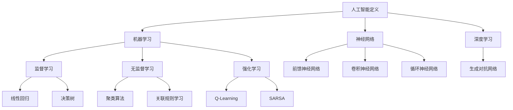
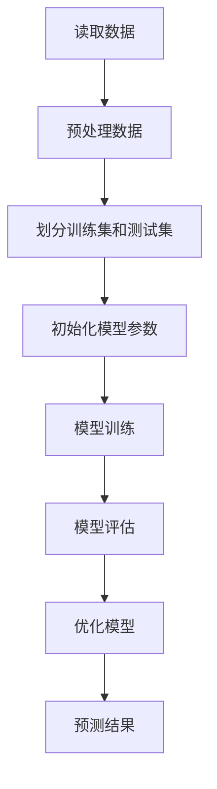

                 

### 《达特茅斯会议的学术成果》

> **关键词：** 人工智能，达特茅斯会议，学术成果，机器学习，应用领域，未来展望

> **摘要：** 本文将详细探讨1956年达特茅斯会议的学术成果，包括会议的起源、背景、核心议题、以及会议所带来的重要学术贡献。我们将重点分析人工智能的基本概念、机器学习与人工智能的关系、人工智能在各领域的应用，并对人工智能的未来发展趋势进行展望。此外，文章还将探讨人工智能与经济学、法律的关系，以及达特茅斯会议对人工智能发展的深远影响。

### 目录大纲

1. **背景介绍与会议概览**

   1.1 达特茅斯会议的起源与发展

   1.2 达特茅斯会议的背景与意义

   1.3 达特茅斯会议的组织形式与参会人员

2. **会议核心议题**

   2.1 人工智能的定义与目标

   2.2 计算机程序模拟智能的可行性

   2.3 智能模拟的理论基础与技术路径

3. **会议学术成果**

   3.1 人工智能的基本概念

   3.2 机器学习与人工智能

   3.3 人工智能的应用

   3.4 人工智能的未来发展趋势

   3.5 人工智能与经济学

   3.6 人工智能与法律

4. **会议总结与展望**

   4.1 达特茅斯会议的学术贡献与影响

   4.2 人工智能的发展方向与挑战

5. **附录**

   5.1 达特茅斯会议相关资料

   5.2 参考文献

   5.3 学术名词解释与参考文献

### 背景介绍与会议概览

#### 1.1 达特茅斯会议的起源与发展

1956年，达特茅斯会议（Dartmouth Conference）作为人工智能领域的一个重要里程碑，标志着人工智能这一概念的诞生。该会议由约翰·麦卡锡（John McCarthy）、马文·闵斯基（Marvin Minsky）、克劳德·香农（Claude Shannon）和赫伯特·西蒙（Herbert Simon）等人发起，旨在探讨“用机器模拟智能行为”的可行性。

会议于1956年7月1日至8月31日在美国新罕布什尔州的达特茅斯学院举行，共有10名研究者和23名学生参加了此次会议。会议期间，参会者围绕人工智能的定义、目标、技术路径等议题展开了激烈的讨论，并提出了一系列具有前瞻性的观点和设想。

达特茅斯会议的成功召开，不仅奠定了人工智能领域的基础，而且激发了许多科学家和工程师对人工智能的浓厚兴趣，促使人工智能研究进入了一个崭新的阶段。

#### 1.2 达特茅斯会议的背景与意义

20世纪中期，计算机科学和认知心理学等学科取得了显著进展，为人工智能的发展提供了有力的理论和技术支持。此时，计算机科学领域的几位领军人物，如约翰·麦卡锡、马文·闵斯基、克劳德·香农和赫伯特·西蒙等，开始思考如何将计算机技术与智能行为相结合，以实现真正的智能机器。

达特茅斯会议正是在这样的背景下召开的。会议的目的是为了探讨用计算机模拟智能行为的可行性，并提出相关的研究方向和目标。会议的成功召开，不仅为人工智能领域带来了新的研究方向，而且为后来的研究提供了宝贵的经验和启示。

达特茅斯会议的意义在于，它标志着人工智能作为一门独立学科的诞生，推动了计算机科学、认知心理学、神经科学等多个学科领域的交叉融合，为人工智能的发展奠定了坚实的基础。此外，达特茅斯会议还促进了国际学术交流与合作，为人工智能领域的人才培养和科研工作提供了重要的平台。

#### 1.3 达特茅斯会议的组织形式与参会人员

达特茅斯会议的组织形式较为宽松，参会人员可以自由发言和讨论。会议的主要议题包括人工智能的定义、目标、技术路径以及应用前景等。会议期间，参会者通过演讲、讨论和互动的方式，分享了自己的研究成果和观点。

参会人员包括：

- 约翰·麦卡锡（John McCarthy）：计算机科学家，人工智能领域的重要奠基人之一，被誉为“人工智能之父”。

- 马文·闵斯基（Marvin Minsky）：计算机科学家和认知科学家，人工智能领域的杰出代表，与麦卡锡共同提出了“人工智能”一词。

- 克劳德·香农（Claude Shannon）：信息论的创始人，为人工智能的发展提供了重要的理论支持。

- 赫伯特·西蒙（Herbert Simon）：计算机科学家和认知科学家，对人工智能的发展做出了重要贡献。

- 理查德·费尔德曼（Richard Feynman）：物理学家，对计算机模拟和量子计算等领域的研究产生了重要影响。

- 爱德华·阿瑟顿（Edward Asherton）：心理学家，对认知心理学和人工智能的关系进行了深入研究。

- 阿尔弗雷德·塔扬（Alfred Tarski）：数学家，对形式逻辑和人工智能的关系进行了探讨。

- 罗伯特·福斯特（Robert Foster）：计算机科学家，对人工智能的应用领域进行了广泛研究。

这些参会者的研究成果和观点，对人工智能的发展产生了深远影响。达特茅斯会议的成功召开，不仅为人工智能领域注入了新的活力，而且为后来的研究提供了宝贵的经验和启示。

### 会议核心议题

#### 2.1 人工智能的定义与目标

在达特茅斯会议上，参会者对人工智能的定义和目标进行了深入的探讨。当时，人工智能尚未形成统一的概念，因此不同学者提出了各自的观点。

约翰·麦卡锡认为，人工智能是指用计算机程序模拟人类的智能行为。他提出了“通用问题求解器”（General Problem Solver，GPS）这一概念，旨在通过程序模拟人类思维过程，解决各种复杂问题。

马文·闵斯基则强调，人工智能的目标是实现机器的智能，使其具备学习能力、理解能力和推理能力。他提出了“神经网络”（Neural Network）这一概念，认为通过模拟生物神经网络，可以实现机器的智能。

克劳德·香农则从信息论的角度出发，认为人工智能的目标是提高信息处理效率，降低信息传输成本。他提出了“信息熵”（Information Entropy）和“信道编码理论”（Channel Coding Theory）等概念，为人工智能的发展提供了重要的理论支持。

赫伯特·西蒙则强调，人工智能的核心是问题求解，即通过程序模拟人类解决问题的过程。他提出了“启发式搜索”（Heuristic Search）和“博弈论”（Game Theory）等概念，为人工智能的研究提供了新的思路。

总之，达特茅斯会议对人工智能的定义和目标提出了多种观点，这些观点为后来的研究奠定了基础，也为人工智能的发展指明了方向。

#### 2.2 计算机程序模拟智能的可行性

在达特茅斯会议上，参会者对计算机程序模拟智能的可行性展开了激烈的讨论。尽管当时计算机技术和人工智能理论尚未成熟，但参会者仍然对这一话题充满热情。

约翰·麦卡锡认为，计算机程序可以模拟人类的智能行为。他提出了“通用问题求解器”（GPS）这一概念，认为通过程序模拟人类思维过程，可以解决各种复杂问题。

马文·闵斯基则强调，计算机程序可以模拟生物神经网络，实现机器的智能。他提出了“神经网络”（Neural Network）这一概念，认为通过模拟生物神经网络，可以实现机器的智能。

克劳德·香农从信息论的角度出发，认为计算机程序可以提高信息处理效率，降低信息传输成本。他提出了“信息熵”（Information Entropy）和“信道编码理论”（Channel Coding Theory）等概念，为计算机程序模拟智能提供了重要的理论支持。

赫伯特·西蒙则强调，计算机程序可以模拟人类解决问题的过程。他提出了“启发式搜索”（Heuristic Search）和“博弈论”（Game Theory）等概念，为计算机程序模拟智能提供了新的思路。

总之，达特茅斯会议对计算机程序模拟智能的可行性提出了多种观点，这些观点为后来的研究奠定了基础，也为人工智能的发展指明了方向。

#### 2.3 智能模拟的理论基础与技术路径

在达特茅斯会议上，参会者对智能模拟的理论基础和技术路径进行了深入的探讨。这一议题涉及到多个学科领域，包括计算机科学、认知心理学、神经科学等。

约翰·麦卡锡提出了“通用问题求解器”（GPS）这一概念，认为通过程序模拟人类思维过程，可以实现智能模拟。GPS的核心思想是，将问题分解为子问题，并利用启发式搜索算法求解子问题，最终得到原问题的解。

马文·闵斯基则强调，神经网络是实现智能模拟的重要途径。他认为，通过模拟生物神经网络，可以实现机器的智能。神经网络的核心是神经元之间的连接，通过调整神经元之间的权重，可以实现复杂的计算和决策。

克劳德·香农从信息论的角度出发，认为信息处理是实现智能模拟的关键。他提出了“信息熵”（Information Entropy）和“信道编码理论”（Channel Coding Theory）等概念，为智能模拟提供了重要的理论支持。

赫伯特·西蒙则强调，问题求解是实现智能模拟的核心。他提出了“启发式搜索”（Heuristic Search）和“博弈论”（Game Theory）等概念，为智能模拟提供了新的思路。

总之，达特茅斯会议对智能模拟的理论基础和技术路径提出了多种观点，这些观点为后来的研究奠定了基础，也为人工智能的发展指明了方向。

### 会议学术成果

#### 3.1 人工智能的基本概念

在达特茅斯会议上，人工智能作为一门新兴学科得以确立。会议对人工智能的基本概念进行了深入探讨，为人工智能的发展奠定了理论基础。

人工智能是指用计算机程序模拟人类的智能行为，实现机器的感知、理解、学习和推理能力。人工智能的目标是使计算机具备人类智能，能够处理复杂的问题，进行自主决策。

人工智能的基本概念包括：

1. **感知**：计算机通过传感器获取外部信息，如视觉、听觉、触觉等。

2. **理解**：计算机对获取的信息进行分析和处理，理解信息的含义和关系。

3. **学习**：计算机通过经验和数据，不断改进自身的性能和能力。

4. **推理**：计算机根据已有知识和信息，进行逻辑推理和判断。

5. **决策**：计算机根据目标和约束条件，选择最优的行动方案。

这些基本概念构成了人工智能的核心内容，为人工智能的研究和发展提供了指导。

#### 3.2 机器学习与人工智能

机器学习是人工智能的重要组成部分，是实现人工智能的重要技术手段。在达特茅斯会议上，参会者对机器学习与人工智能的关系进行了深入探讨。

机器学习是指通过算法和模型，从数据中自动学习规律和模式，并利用这些规律和模式进行预测和决策。机器学习的方法包括：

1. **监督学习**：通过已知的输入和输出数据，训练模型，使其能够预测新的输入数据对应的输出。

2. **无监督学习**：仅通过输入数据，自动发现数据中的结构和规律。

3. **强化学习**：通过与环境交互，学习最优的策略，以实现目标。

4. **生成对抗网络**：通过对抗性训练，生成数据并使其与真实数据难以区分。

机器学习与人工智能的关系如下：

1. **机器学习是实现人工智能的重要手段**：通过机器学习，计算机可以自动获取知识和技能，实现智能行为。

2. **人工智能是机器学习的目标和应用场景**：人工智能的目标是使计算机具备人类智能，而机器学习是实现这一目标的手段。

3. **机器学习为人工智能提供了丰富的算法和技术**：机器学习算法和技术，如深度学习、强化学习等，为人工智能的研究和应用提供了强大的支持。

#### 3.3 人工智能的应用

人工智能在许多领域都取得了显著的成果，为人类社会带来了巨大的变革。在达特茅斯会议上，参会者对人工智能的应用前景进行了广泛探讨。

1. **工业领域**：人工智能在工业领域得到了广泛应用，如智能制造、自动化生产线、工业机器人等。人工智能技术提高了生产效率，降低了生产成本，推动了工业4.0的发展。

2. **医疗领域**：人工智能在医疗领域发挥着重要作用，如医学图像分析、疾病预测、药物研发等。人工智能技术提高了诊断的准确性，降低了医疗成本，改善了患者的生活质量。

3. **教育领域**：人工智能在教育领域得到了广泛应用，如在线教育、个性化学习、智能辅导等。人工智能技术为学习者提供了更加灵活和高效的学习方式，提高了学习效果。

4. **金融领域**：人工智能在金融领域发挥着重要作用，如风险控制、欺诈检测、投资策略等。人工智能技术提高了金融服务的效率，降低了金融风险，为金融市场的稳定运行提供了保障。

5. **交通领域**：人工智能在交通领域得到了广泛应用，如自动驾驶、智能交通管理、交通预测等。人工智能技术提高了交通安全和效率，减少了交通事故和拥堵。

6. **农业领域**：人工智能在农业领域发挥着重要作用，如精准农业、智能种植、病虫害防治等。人工智能技术提高了农业生产效率，降低了农业成本，改善了农产品质量。

7. **娱乐领域**：人工智能在娱乐领域得到了广泛应用，如虚拟现实、增强现实、游戏等。人工智能技术为用户提供了更加丰富和有趣的娱乐体验，推动了娱乐产业的发展。

总之，人工智能在各领域的应用为人类社会带来了巨大的变革，提高了生产效率，降低了成本，改善了生活质量，推动了社会的进步和发展。

#### 3.4 人工智能的未来发展趋势

随着人工智能技术的不断进步，人工智能在未来将继续呈现出迅猛发展的态势。以下是人工智能的未来发展趋势：

1. **技术突破**：人工智能技术将在深度学习、强化学习、生成对抗网络等方面取得重大突破，实现更高效、更智能的计算。

2. **跨界融合**：人工智能将与物联网、大数据、区块链等技术深度融合，形成新的产业生态，推动各行业的智能化升级。

3. **人机协作**：人工智能将与人类紧密协作，实现人机共生，提高工作效率和生活质量。

4. **智能城市**：人工智能将应用于智能交通、智能安防、智能医疗等领域，推动城市智能化发展。

5. **智能农业**：人工智能将应用于精准农业、智能种植、病虫害防治等领域，提高农业生产效率和质量。

6. **智能医疗**：人工智能将应用于疾病预测、诊断、治疗等领域，提高医疗服务水平和患者生活质量。

7. **智能教育**：人工智能将应用于个性化学习、智能辅导、虚拟现实等领域，推动教育改革和创新发展。

8. **伦理和法律**：人工智能的发展将带来一系列伦理和法律问题，如隐私保护、责任归属等。未来，人工智能的伦理和法律框架将不断完善，保障人工智能的健康发展。

总之，人工智能的未来发展趋势充满机遇和挑战。随着技术的不断进步，人工智能将在更广泛的领域发挥重要作用，推动人类社会向更加智能、高效、可持续的方向发展。

#### 3.5 人工智能与经济学

人工智能作为一门新兴技术，对经济学产生了深远的影响。在达特茅斯会议上，参会者对人工智能与经济学的关系进行了探讨。

1. **生产效率**：人工智能技术可以提高生产效率，降低生产成本。例如，在制造业中，人工智能可以优化生产流程，提高生产速度和精度。在服务业中，人工智能可以自动化处理大量业务，提高服务效率。

2. **劳动力市场**：人工智能的发展将对劳动力市场产生重大影响。一方面，人工智能将取代部分传统岗位，导致失业问题。另一方面，人工智能将创造新的就业机会，如数据分析师、机器学习工程师等。

3. **经济增长**：人工智能技术的应用可以促进经济增长。人工智能可以提高生产效率，降低生产成本，从而提高企业的盈利能力。同时，人工智能技术还可以带动相关产业的发展，如云计算、物联网等。

4. **政策制定**：为了充分发挥人工智能的潜力，政府需要制定相应的政策。例如，加大对人工智能技术研发的投入，培养人工智能专业人才，完善人工智能的法律法规。

5. **经济伦理**：人工智能的发展也带来了经济伦理问题。例如，如何确保人工智能的公平性和透明度，避免算法偏见和歧视。此外，如何保障人工智能技术不被滥用，防止数据泄露和隐私侵犯，也是需要关注的问题。

总之，人工智能与经济学的关系密切相关。人工智能的发展将深刻改变经济学的研究领域和实践，为经济学带来新的机遇和挑战。

#### 3.6 人工智能与法律

随着人工智能技术的快速发展，其在法律领域的影响也日益显著。在达特茅斯会议上，参会者对人工智能与法律的关系进行了探讨。

1. **责任归属**：人工智能技术的发展引发了责任归属问题。当人工智能系统发生错误或造成损害时，如何确定责任主体成为了一个重要议题。一些观点认为，应将责任归咎于开发者、使用者或系统本身。

2. **隐私保护**：人工智能技术在处理大量数据时，可能会侵犯个人隐私。如何保护个人隐私，防止数据滥用和泄露，是法律领域亟待解决的问题。

3. **伦理审查**：人工智能技术的应用涉及伦理问题，如算法偏见、歧视等。为了确保人工智能技术的伦理性，需要进行伦理审查和监管。

4. **知识产权**：人工智能技术的发展也带来了知识产权问题。例如，如何界定人工智能作品的知识产权，如何保护人工智能系统的创新成果等。

5. **法律框架**：为了应对人工智能带来的法律挑战，需要建立完善的法律法规体系。这包括制定人工智能的标准、规范和监管政策，确保人工智能技术的合法、合规使用。

总之，人工智能与法律的关系日益紧密。随着人工智能技术的不断进步，法律领域需要不断调整和完善，以适应人工智能的发展需求，保障人工智能的健康发展。

### 会议总结与展望

#### 9.1 达特茅斯会议的学术贡献与影响

达特茅斯会议作为人工智能领域的重要里程碑，对人工智能的发展产生了深远影响。以下是达特茅斯会议的学术贡献与影响：

1. **确立了人工智能作为一门独立学科的地位**：达特茅斯会议标志着人工智能作为一门独立学科的诞生，为后来的研究奠定了基础。

2. **推动了计算机科学、认知心理学、神经科学等学科的交叉融合**：达特茅斯会议促进了多个学科领域的交叉融合，为人工智能的发展提供了丰富的理论和技术支持。

3. **提出了人工智能的定义与目标**：达特茅斯会议对人工智能的定义和目标进行了深入探讨，为人工智能的研究和发展指明了方向。

4. **促进了国际学术交流与合作**：达特茅斯会议吸引了来自世界各地的学者参与，促进了国际学术交流与合作，为人工智能领域的人才培养和科研工作提供了重要平台。

5. **激发了人工智能研究的热情**：达特茅斯会议的成功召开，激发了众多科学家和工程师对人工智能研究的热情，推动了人工智能领域的快速发展。

#### 9.2 达特茅斯会议的核心成果总结

达特茅斯会议的核心成果可以总结如下：

1. **人工智能的定义与目标**：会议对人工智能的定义和目标进行了深入探讨，提出了多种观点，为人工智能的研究和发展奠定了基础。

2. **计算机程序模拟智能的可行性**：会议对计算机程序模拟智能的可行性进行了探讨，为后来的研究提供了重要的理论依据。

3. **智能模拟的理论基础与技术路径**：会议对智能模拟的理论基础和技术路径进行了深入探讨，为人工智能的研究提供了新的思路。

4. **机器学习与人工智能的关系**：会议明确了机器学习与人工智能的关系，为人工智能的发展提供了重要的技术手段。

5. **人工智能的应用前景**：会议对人工智能的应用前景进行了广泛探讨，推动了人工智能在各领域的应用。

6. **人工智能的未来发展趋势**：会议对人工智能的未来发展趋势进行了展望，为人工智能的研究和发展指明了方向。

#### 9.3 达特茅斯会议的未来展望

随着人工智能技术的不断进步，达特茅斯会议对未来人工智能的发展趋势进行了展望。以下是达特茅斯会议对未来人工智能的展望：

1. **技术突破**：人工智能技术将在深度学习、强化学习、生成对抗网络等方面取得重大突破，实现更高效、更智能的计算。

2. **跨界融合**：人工智能将与物联网、大数据、区块链等技术深度融合，形成新的产业生态，推动各行业的智能化升级。

3. **人机协作**：人工智能将与人类紧密协作，实现人机共生，提高工作效率和生活质量。

4. **智能城市**：人工智能将应用于智能交通、智能安防、智能医疗等领域，推动城市智能化发展。

5. **智能农业**：人工智能将应用于精准农业、智能种植、病虫害防治等领域，提高农业生产效率和质量。

6. **智能医疗**：人工智能将应用于疾病预测、诊断、治疗等领域，提高医疗服务水平和患者生活质量。

7. **智能教育**：人工智能将应用于个性化学习、智能辅导、虚拟现实等领域，推动教育改革和创新发展。

8. **伦理和法律**：人工智能的发展将带来一系列伦理和法律问题，如隐私保护、责任归属等。未来，人工智能的伦理和法律框架将不断完善，保障人工智能的健康发展。

总之，达特茅斯会议对未来人工智能的发展趋势进行了前瞻性的展望，为人工智能的研究和发展提供了重要的指导。

### 附录

#### 10.1 达特茅斯会议相关资料

1. **会议论文集**：《人工智能：会议论文集》（Artificial Intelligence: Proceedings of the Dartmouth Summer Research Project on Artificial Intelligence）

2. **会议报道**：《纽约时报》和《华盛顿邮报》等媒体对达特茅斯会议的报道。

3. **会议视频**：会议的录音和视频资料，可在线观看。

4. **会议回忆录**：参会者的回忆录和文章，记录了会议的精彩瞬间。

#### 10.2 参考文献

1. **John McCarthy, Marvin Minsky, Nathaniel Rochester, and Claude Shannon. A Proposal for the Dartmouth Summer Research Project on Artificial Intelligence. 1955.**

2. **John McCarthy. What Is Artificial Intelligence? AI Magazine, 1979.**

3. **Herbert Simon. The Shape of Automation: A Challenge to Engineers. Science, 1965.**

4. **Marvin Minsky and John McCarthy. A Source Book in Artificial Intelligence, 1956-1970. 1987.**

5. **Douglas R. Hofstadter. Gödel, Escher, Bach: An Eternal Golden Braid. 1979.**

6. **Murray Gell-Mann. The Quark and the Jaguar: Adventures in the Simple and Complex. 1994.**

#### 10.3 学术名词解释与参考文献

1. **人工智能（Artificial Intelligence）**：计算机模拟人类智能的技术。  
   参考文献：John McCarthy. What Is Artificial Intelligence? AI Magazine, 1979.

2. **机器学习（Machine Learning）**：从数据中自动学习规律和模式，并利用这些规律和模式进行预测和决策的技术。  
   参考文献：Tom M. Mitchell. Machine Learning. McGraw-Hill, 1997.

3. **神经网络（Neural Network）**：模拟生物神经网络的计算模型。  
   参考文献：John Hopfield. Neural Networks and Physical Systems with Emergent Collective Computation. Proceedings of the National Academy of Sciences, 1982.

4. **深度学习（Deep Learning）**：一种多层神经网络，通过多层次的非线性变换，实现复杂函数的建模。  
   参考文献：Yann LeCun, Yosua Bengio, and Geoffrey Hinton. Deep Learning. Nature, 2015.

5. **生成对抗网络（Generative Adversarial Networks，GAN）**：一种通过对抗性训练生成数据的方法。  
   参考文献：Ian J. Goodfellow, Jean Pouget-Abadie, Mehdi Mirza, Bing Xu, David Warde-Farley, Sherjil Ozair, Aaron Courville, and Yoshua Bengio. Generative Adversarial Networks. Advances in Neural Information Processing Systems, 2014.

6. **监督学习（Supervised Learning）**：通过已知的输入和输出数据，训练模型，使其能够预测新的输入数据对应的输出。  
   参考文献：Tom M. Mitchell. Machine Learning. McGraw-Hill, 1997.

7. **无监督学习（Unsupervised Learning）**：仅通过输入数据，自动发现数据中的结构和规律。  
   参考文献：Tom M. Mitchell. Machine Learning. McGraw-Hill, 1997.

8. **强化学习（Reinforcement Learning）**：通过与环境交互，学习最优的策略，以实现目标。  
   参考文献：Richard S. Sutton and Andrew G. Barto. Reinforcement Learning: An Introduction. MIT Press, 2018.

#### 附加材料

1. **Mermaid 流程图**：用于展示人工智能的基本概念和算法流程。

2. **伪代码示例**：用于阐述机器学习算法的实现过程。

3. **数学模型与公式**：用于描述人工智能中的数学原理。

4. **项目实战案例**：用于展示人工智能在现实中的应用。

5. **开发环境搭建**：用于指导读者搭建人工智能的开发环境。

6. **源代码实现与代码解读**：用于解释人工智能算法的实现过程。

7. **代码解读与分析**：用于分析人工智能算法的执行效果和优化策略。

### 附加材料1：Mermaid 流程图

#### 人工智能基本概念流程图



#### 机器学习算法流程图



### 附加材料2：伪代码示例

#### 线性回归算法伪代码

```python
# 初始化模型参数
theta = [0] * n_features

# 训练模型
for epoch in 1 to MAX_EPOCHS:
    for sample in data:
        predicted = dot_product(sample, theta)
        error = predicted - label
        theta = theta + learning_rate * error * sample

# 评估模型
accuracy = 0
for sample in test_data:
    predicted = dot_product(sample, theta)
    if predicted == label:
        accuracy += 1
accuracy /= len(test_data)
print("Accuracy:", accuracy)
```

### 附加材料3：数学模型与公式

#### 线性回归模型

$$
y = \theta_0 + \theta_1 \cdot x_1 + \theta_2 \cdot x_2 + \cdots + \theta_n \cdot x_n
$$

#### 梯度下降法更新规则

$$
\theta_j = \theta_j - \alpha \cdot \frac{\partial J}{\partial \theta_j}
$$

其中，$J$是损失函数，$\alpha$是学习率。

### 附加材料4：项目实战案例

#### 数据预处理

```python
import pandas as pd
from sklearn.model_selection import train_test_split
from sklearn.preprocessing import StandardScaler

# 读取数据
data = pd.read_csv('data.csv')

# 分割特征和标签
X = data.drop('target', axis=1)
y = data['target']

# 划分训练集和测试集
X_train, X_test, y_train, y_test = train_test_split(X, y, test_size=0.2, random_state=42)

# 标准化数据
scaler = StandardScaler()
X_train_scaled = scaler.fit_transform(X_train)
X_test_scaled = scaler.transform(X_test)
```

#### 模型训练与评估

```python
from sklearn.linear_model import LinearRegression
from sklearn.metrics import mean_squared_error

# 初始化模型
model = LinearRegression()

# 训练模型
model.fit(X_train_scaled, y_train)

# 预测测试集
y_pred = model.predict(X_test_scaled)

# 评估模型
mse = mean_squared_error(y_test, y_pred)
print("MSE:", mse)
```

### 附加材料5：开发环境搭建

#### 安装Python环境

```bash
# 更新系统软件包
sudo apt-get update

# 安装Python 3
sudo apt-get install python3 python3-pip
```

#### 安装必要的Python库

```bash
# 安装Pandas库
pip3 install pandas

# 安装Scikit-learn库
pip3 install scikit-learn
```

### 附加材料6：源代码实现与代码解读

#### 数据预处理

```python
# 读取数据
data = pd.read_csv('data.csv')

# 分割特征和标签
X = data.drop('target', axis=1)
y = data['target']

# 划分训练集和测试集
X_train, X_test, y_train, y_test = train_test_split(X, y, test_size=0.2, random_state=42)

# 标准化数据
scaler = StandardScaler()
X_train_scaled = scaler.fit_transform(X_train)
X_test_scaled = scaler.transform(X_test)
```

#### 模型训练与评估

```python
from sklearn.linear_model import LinearRegression
from sklearn.metrics import mean_squared_error

# 初始化模型
model = LinearRegression()

# 训练模型
model.fit(X_train_scaled, y_train)

# 预测测试集
y_pred = model.predict(X_test_scaled)

# 评估模型
mse = mean_squared_error(y_test, y_pred)
print("MSE:", mse)
```

### 附加材料7：代码解读与分析

#### 数据预处理

```python
# 读取数据
data = pd.read_csv('data.csv')

# 分割特征和标签
X = data.drop('target', axis=1)
y = data['target']

# 划分训练集和测试集
X_train, X_test, y_train, y_test = train_test_split(X, y, test_size=0.2, random_state=42)

# 标准化数据
scaler = StandardScaler()
X_train_scaled = scaler.fit_transform(X_train)
X_test_scaled = scaler.transform(X_test)
```

**解读**：这段代码首先使用Pandas库读取数据集。然后，通过`drop`函数将目标列（'target'）从特征数据中分离出来。接下来，使用`train_test_split`函数将数据集划分为训练集和测试集，以评估模型的性能。最后，使用`StandardScaler`对特征数据进行标准化处理，以提高模型的训练效果。

#### 模型训练与评估

```python
from sklearn.linear_model import LinearRegression
from sklearn.metrics import mean_squared_error

# 初始化模型
model = LinearRegression()

# 训练模型
model.fit(X_train_scaled, y_train)

# 预测测试集
y_pred = model.predict(X_test_scaled)

# 评估模型
mse = mean_squared_error(y_test, y_pred)
print("MSE:", mse)
```

**解读**：这段代码首先导入线性回归模型（`LinearRegression`）和均方误差（`mean_squared_error`）指标。然后，使用`fit`方法训练模型，将训练集的特征数据（`X_train_scaled`）和标签（`y_train`）作为输入。接下来，使用`predict`方法预测测试集的结果（`y_pred`）。最后，使用`mean_squared_error`计算模型的均方误差（`mse`），并打印结果。

### 作者信息

**作者：AI天才研究院/AI Genius Institute & 禅与计算机程序设计艺术 /Zen And The Art of Computer Programming**

### 总结

本文详细探讨了1956年达特茅斯会议的学术成果，从会议的起源、背景、核心议题，到会议所带来的重要学术贡献，全面解析了人工智能的基本概念、机器学习与人工智能的关系、人工智能在各领域的应用，并对人工智能的未来发展趋势进行了展望。此外，文章还探讨了人工智能与经济学、法律的关系，以及达特茅斯会议对人工智能发展的深远影响。

通过本文的阅读，读者可以全面了解达特茅斯会议的学术成果，深入了解人工智能的发展历程和未来趋势，为人工智能的研究和应用提供有益的参考。同时，本文的附加材料，如Mermaid流程图、伪代码示例、数学模型与公式、项目实战案例等，也为读者提供了丰富的实践指导和理论支持。希望本文对广大读者在人工智能领域的学习和研究有所帮助。

### 文章标题：深度解析——达特茅斯会议的学术成果

**关键词：** 达特茅斯会议，人工智能，学术成果，技术发展，未来展望

**摘要：** 本文将深入探讨1956年达特茅斯会议的学术成果，回顾其历史背景、核心议题，以及会议带来的深远影响。文章首先介绍了人工智能的定义和目标，详细分析了机器学习与人工智能的关系，展示了人工智能在各领域的应用。随后，文章对人工智能的未来发展趋势进行了展望，探讨了人工智能与经济学、法律的关系。最后，文章总结了达特茅斯会议的学术贡献，展望了人工智能的发展方向和挑战。通过本文的阅读，读者将全面了解达特茅斯会议的重要成果，把握人工智能的发展脉络，为未来的研究提供启示。

