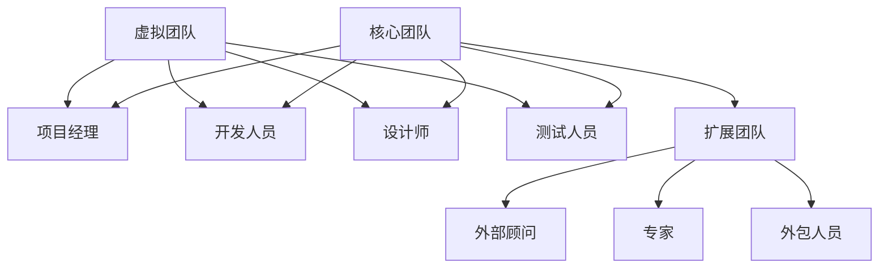
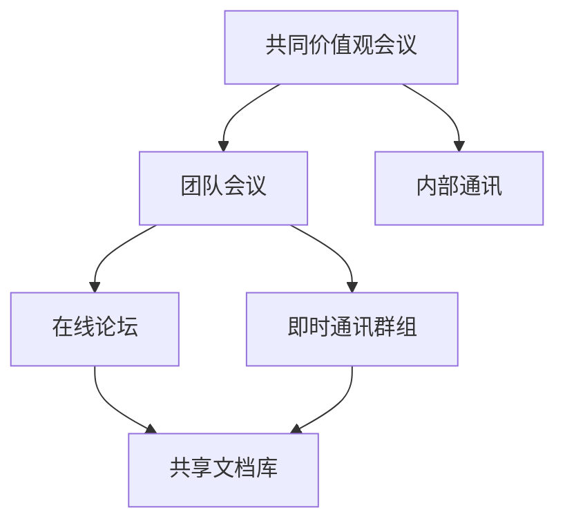
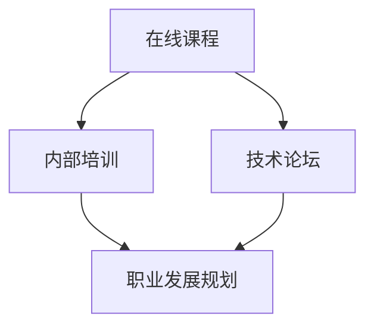

                 

### 《远程办公时代的团队凝聚力建设》

> **关键词**：远程办公、团队凝聚力、领导力、技术工具、文化氛围、案例研究

> **摘要**：本文深入探讨了远程办公时代团队凝聚力的重要性及其建设方法。文章首先分析了远程办公的现状及其带来的挑战，随后介绍了团队凝聚力的重要性，并探讨了如何通过有效的领导、沟通、技术工具和文化氛围来建设远程办公团队的凝聚力。通过实际案例和项目实战，文章为读者提供了具体的实施策略和指导。

### 远程办公与团队凝聚力概述

远程办公作为一种新兴的工作方式，在当前数字化和信息化浪潮的推动下，得到了广泛应用。远程办公不仅使员工能够灵活地安排工作时间和地点，提高了工作效率，还为企业节省了大量的办公成本。然而，远程办公也带来了一系列挑战，其中最大的挑战之一便是如何维持团队的凝聚力。

#### 1.1 远程办公的定义与现状

远程办公（Remote Work）是指员工不在传统的办公室环境中工作，而是通过互联网和其他通讯工具与同事、上级进行沟通和协作。根据国际远程工作协会（International Association of Remote Workers, IAAP）的数据，全球有超过4亿人从事远程工作，这一数字在2020年因新冠疫情的爆发而大幅增加。

远程办公的形式主要包括：

1. **全远程工作（Full-remote）**：员工完全在家或任何其他地方工作。
2. **混合远程工作（Hybrid-remote）**：部分员工在办公室工作，部分员工远程工作。
3. **弹性工作制（Flexible Work）**：员工可以根据个人需求和公司政策选择工作时间和地点。

#### 1.2 远程办公的优势与挑战

远程办公的优势：

1. **提高员工满意度**：员工能够享有灵活的工作时间和地点，提高生活质量。
2. **降低企业成本**：企业无需支付昂贵的办公空间租金和办公设备费用。
3. **增加员工忠诚度**：远程办公能够吸引和留住优秀的员工。

远程办公的挑战：

1. **沟通障碍**：缺乏面对面的沟通可能导致信息传递不畅。
2. **团队合作困难**：团队成员之间的协作和互动减少，难以形成团队凝聚力。
3. **管理难度增加**：远程办公使得管理者难以监督员工的工作状态和效率。

#### 1.3 团队凝聚力的定义与作用

团队凝聚力（Team Cohesion）是指团队成员之间的相互吸引力和归属感。高凝聚力的团队表现出以下特征：

1. **信任和尊重**：团队成员之间相互信任、尊重和支持。
2. **共同目标**：团队成员拥有共同的目标和愿景。
3. **有效的沟通**：团队成员之间能够顺畅地沟通和协作。

团队凝聚力对于远程办公团队至关重要：

1. **提高工作效率**：凝聚力的团队更容易协同工作，提高工作效率。
2. **增强创新能力**：团队成员之间相互启发，更容易产生创新想法。
3. **降低员工流失率**：高凝聚力的团队能够增强员工的归属感和忠诚度，降低员工流失率。

#### 1.4 远程办公与团队凝聚力的关系

远程办公并不必然导致团队凝聚力的下降。事实上，通过合理的策略和方法，远程办公团队可以保持甚至提升团队凝聚力。以下是一些关键因素：

1. **有效的领导**：领导者需要通过虚拟会议、在线交流工具等方式与团队成员保持密切联系。
2. **良好的沟通机制**：建立高效的沟通渠道，确保信息的透明和及时传递。
3. **团队文化**：营造积极的团队文化，增强团队成员的归属感和认同感。
4. **技术支持**：利用各种技术工具，如视频会议、即时通讯和项目管理软件，提高团队的协作效率。

通过以上策略，远程办公团队可以在保持工作灵活性的同时，维持和提升团队的凝聚力。在接下来的章节中，我们将详细探讨这些策略的实施方法和具体案例。

---

在这个章节中，我们首先对远程办公和团队凝聚力进行了概述，分析了远程办公的定义与现状，讨论了其优势与挑战，并阐述了团队凝聚力的定义与作用。最后，我们探讨了远程办公与团队凝聚力之间的关系，为后续章节的深入讨论奠定了基础。

---

接下来，我们将进入第二部分，讨论远程办公团队凝聚力建设的基础，包括团队的组成与结构、角色与职责、沟通与协作机制以及文化建设。

### 第二部分：远程办公团队凝聚力建设基础

在远程办公环境中，团队凝聚力建设的基础至关重要。一个高效的远程办公团队需要明确的组成与结构、清晰的角色与职责、高效的沟通与协作机制以及积极的文化建设。以下将详细探讨这些方面。

#### 2.1 远程办公团队的组成与结构

远程办公团队的组成与结构是确保团队高效运作的基础。根据团队的任务和工作性质，远程办公团队可以有不同的组成形式。以下是一些常见的团队结构和相关角色：

1. **核心团队（Core Team）**：负责项目的主要开发和决策。通常包括项目经理、开发人员、设计师和测试人员等。

2. **扩展团队（Extended Team）**：包括外部顾问、专家和外包人员，他们为项目提供特定的技能或资源。

3. **虚拟团队（Virtual Team）**：团队成员分布在不同的地理位置，通过远程协作工具进行沟通和合作。

**示例结构：**



#### 2.2 远程办公团队成员的角色与职责

在远程办公团队中，每个成员的角色和职责都是明确的。以下是一些关键角色及其职责：

1. **项目经理（Project Manager）**：负责项目的整体规划和执行，协调团队成员的工作，确保项目按时完成。

2. **开发人员（Developers）**：负责编写代码、开发和维护软件系统。

3. **设计师（Designers）**：负责用户界面和用户体验设计，确保产品的美观性和易用性。

4. **测试人员（Testers）**：负责测试软件系统，确保其质量符合预期标准。

5. **外部顾问（External Consultants）**：为团队提供专业知识和建议，解决特定问题。

6. **专家（Experts）**：在特定领域具有丰富的经验，为项目提供高级技术支持。

7. **外包人员（Outsourcers）**：负责特定的任务或项目，通常是通过合同形式合作。

#### 2.3 远程办公团队的沟通与协作机制

远程办公团队的成功很大程度上依赖于有效的沟通与协作。以下是一些关键的沟通与协作机制：

1. **定期会议**：通过视频会议、电话会议等形式，定期更新项目进度、讨论问题和决策。

2. **即时通讯**：使用即时通讯工具，如Slack、WhatsApp或Microsoft Teams，进行实时沟通和协作。

3. **项目管理工具**：使用项目管理工具，如Jira、Trello或Asana，来跟踪任务进度、分配工作和共享文档。

4. **文档共享**：使用云存储服务，如Google Drive或OneDrive，共享文档和资料。

5. **代码管理**：使用版本控制系统，如Git，管理代码库，确保代码的一致性和可追溯性。

#### 2.4 远程办公团队的文化建设

文化建设是远程办公团队凝聚力的重要组成部分。以下是一些促进远程办公团队文化建设的策略：

1. **共同价值观**：明确团队的共同目标和价值观，确保团队成员都朝着相同的目标努力。

2. **透明沟通**：鼓励团队成员之间开放、诚实的沟通，建立信任和尊重。

3. **团队活动**：定期组织在线团队活动，如虚拟会议、游戏或培训，增强团队凝聚力和友谊。

4. **激励机制**：建立有效的激励机制，奖励团队中的优秀成员和团队整体，提高团队成员的积极性和归属感。

通过以上的基础建设，远程办公团队可以更好地应对远程工作带来的挑战，维持和提升团队的凝聚力。在接下来的章节中，我们将进一步探讨具体的凝聚力建设策略和实践。

---

在本章节中，我们详细介绍了远程办公团队凝聚力建设的基础，包括团队的组成与结构、角色与职责、沟通与协作机制以及文化建设。通过明确的团队结构、清晰的职责分配、高效的沟通协作机制和积极的文化建设，远程办公团队可以在远程环境中保持高效运作和凝聚力。在下一章节中，我们将深入探讨远程办公团队凝聚力建设的具体策略和实践。

### 第三部分：远程办公团队凝聚力建设策略

在了解了远程办公团队凝聚力建设的基础之后，我们需要进一步探讨具体的策略，以帮助团队在远程环境中保持高凝聚力。以下是一些关键策略，包括远程办公团队的激励与奖励机制、工作氛围的营造、领导力与团队管理以及培训与发展。

#### 3.1 远程办公团队的激励与奖励机制

激励和奖励是维持远程办公团队凝聚力的重要手段。以下是一些有效的激励与奖励机制：

1. **目标导向的奖励**：设定明确、可衡量的目标，并设定与目标完成情况挂钩的奖励机制。例如，对于达成项目里程碑的团队成员给予奖金或荣誉证书。

2. **绩效评估**：定期进行绩效评估，以识别表现优秀的团队成员，并给予相应的奖励。绩效评估不仅包括工作量，还应涵盖质量、创新和团队合作等方面。

3. **灵活的工作时间**：允许团队成员灵活安排工作时间，提高工作满意度。例如，可以采用弹性工作时间或远程办公日，使员工能够更好地平衡工作与生活。

4. **认可与表扬**：在团队会议上或通过内部通讯工具公开表扬表现突出的团队成员，增强其成就感和归属感。

5. **团队建设活动**：定期组织团队建设活动，如在线游戏、团队竞赛或虚拟聚会，以增强团队成员之间的互动和联系。

#### 3.2 远程办公团队的工作氛围营造

营造积极的工作氛围是提升远程办公团队凝聚力的重要一环。以下是一些有效的策略：

1. **建立共同的价值观**：明确团队的共同目标和价值观，确保团队成员都朝着相同的目标努力。这可以通过团队会议、内部通讯或团队文化手册来实现。

2. **鼓励开放的沟通**：建立开放的沟通渠道，鼓励团队成员表达意见和反馈。例如，可以使用在线论坛、即时通讯群组或视频会议，确保团队成员能够随时交流。

3. **共享资源与知识**：鼓励团队成员分享资源和知识，促进学习与成长。例如，可以建立一个共享文档库，让团队成员随时访问有关项目的信息和资料。

4. **定期反馈与改进**：定期收集团队成员的反馈，了解他们的工作状态和需求，及时调整团队策略和工作流程，以提高工作效率和满意度。

5. **灵活的工作环境**：为团队成员提供灵活的工作环境，使其能够在一个舒适、安静的环境中高效工作。例如，可以为团队成员提供远程办公设备、办公场所选择权或远程办公津贴。

#### 3.3 远程办公团队的领导力与团队管理

领导力和团队管理在远程办公环境中尤为重要。以下是一些关键策略：

1. **透明领导**：领导者应通过定期会议、内部通讯等方式，保持与团队成员的透明沟通，确保团队成员了解项目的进展和方向。

2. **赋能团队成员**：给予团队成员更多的自主权和决策权，鼓励他们独立思考和解决问题，增强团队的归属感和责任感。

3. **有效的反馈与指导**：领导者应定期提供反馈和指导，帮助团队成员提升技能和知识，同时解决他们在工作中遇到的问题。

4. **建立信任**：领导者应通过诚实、透明和负责任的行为，建立与团队成员之间的信任关系。这可以通过及时响应团队成员的问题和需求、公开讨论团队目标和方法来实现。

5. **灵活的管理方法**：领导者应根据远程办公的特点，灵活调整管理方法，如采用远程监控工具、定期检查项目进展、组织虚拟团队活动等。

#### 3.4 远程办公团队的培训与发展

培训和发展是提升远程办公团队凝聚力和竞争力的关键。以下是一些策略：

1. **持续学习**：鼓励团队成员持续学习和提升技能。可以提供在线课程、研讨会、技术论坛等学习资源，帮助团队成员不断成长。

2. **内部培训**：组织内部培训课程，由经验丰富的团队成员或外部专家主讲，分享专业知识和最佳实践。

3. **跨部门合作**：鼓励团队成员参与跨部门项目或任务，扩展他们的视野和技能，促进团队成员之间的交流与合作。

4. **职业发展规划**：为团队成员制定明确的职业发展规划，提供晋升机会和职业发展路径，激励他们为团队和公司做出更大的贡献。

5. **反馈机制**：建立反馈机制，定期收集团队成员对培训和发展项目的反馈，及时调整培训策略，确保培训内容的实用性和有效性。

通过以上策略，远程办公团队可以在远程环境中保持高凝聚力，提高工作效率和团队竞争力。在下一章节中，我们将通过实际案例和项目实战，进一步探讨这些策略的具体实施方法和效果。

---

在本章节中，我们详细讨论了远程办公团队凝聚力建设的关键策略，包括激励与奖励机制、工作氛围的营造、领导力与团队管理以及培训与发展。这些策略旨在帮助远程办公团队在远程环境中保持高效运作和凝聚力。在下一章节中，我们将通过实际案例和项目实战，进一步探讨这些策略的具体实施方法和效果。

### 第三部分：远程办公团队凝聚力建设策略（续）

在前文中，我们讨论了远程办公团队凝聚力建设的关键策略，包括激励与奖励机制、工作氛围的营造、领导力与团队管理以及培训与发展。在本章节中，我们将通过具体案例和项目实战，深入探讨这些策略的实施方法和效果。

#### 3.1 远程办公团队的激励与奖励机制（案例与项目实战）

**案例：** 一家大型科技公司通过引入一系列激励与奖励机制，显著提升了远程办公团队的凝聚力。

**项目实战：** 
- **目标导向的奖励**：公司设定了季度项目目标，并明确了达成目标后的奖励机制。例如，如果某个团队在季度内成功完成了关键项目里程碑，团队成员将获得奖金和额外的休假时间。
- **绩效评估**：公司引入了基于KPI（关键绩效指标）的绩效评估系统，定期对团队成员的工作表现进行评估。评估结果不仅用于奖金发放，还作为职业发展的重要依据。
- **灵活的工作时间**：公司实施了灵活的工作时间政策，允许员工在家办公，并根据项目需求和员工个人情况调整工作时间。这不仅提高了员工的工作满意度，还增强了团队的凝聚力。

**代码解读与分析：**
```python
# 假设我们定义了一个简单的绩效评估系统

class PerformanceEvaluator:
    def __init__(self, kpis):
        self.kpis = kpis

    def evaluate(self, employee):
        total_score = 0
        for kpi in self.kpis:
            total_score += kpi.score(employee)
        return total_score

    def reward_employee(self, employee, score):
        if score >= 90:
            employee.give_bonus()
            employee.add_extra_vacation_day()
        elif score >= 75:
            employee.give_movie_ticket()

# 定义员工类
class Employee:
    def __init__(self, name):
        self.name = name
        self.bonus_received = False
        self.extra_vacation_days = 0

    def give_bonus(self):
        self.bonus_received = True
        print(f"{self.name} received a bonus!")

    def add_extra_vacation_day(self):
        self.extra_vacation_days += 1
        print(f"{self.name} has been awarded an extra vacation day!")

    def give_movie_ticket(self):
        print(f"{self.name} received a movie ticket as a reward!")

# 测试绩效评估系统
evaluator = PerformanceEvaluator(kpis=[KPI_A, KPI_B])
employee = Employee("Alice")
score = evaluator.evaluate(employee)
evaluator.reward_employee(employee, score)
```

**案例分析与效果：** 通过实施这些激励与奖励机制，公司显著提升了远程办公团队的凝聚力。员工不仅感到自己的工作得到了认可和奖励，还增强了团队合作的意愿和积极性。

#### 3.2 远程办公团队的工作氛围营造（案例与项目实战）

**案例：** 一家远程办公的创业公司通过一系列措施，成功营造了一个积极的工作氛围。

**项目实战：** 
- **共同价值观的建立**：公司通过定期团队会议和内部通讯，明确公司的共同目标和价值观，确保所有员工都朝着相同的目标努力。
- **开放的沟通**：公司建立了多个在线论坛和即时通讯群组，鼓励员工分享想法、问题和建议。这不仅促进了信息的透明传递，还增强了团队成员之间的互动。
- **知识共享**：公司设立了一个共享文档库，员工可以随时访问有关项目的信息和资料，促进了知识共享和学习。

**代码解读与分析：**


**案例分析与效果：** 通过这些措施，公司成功营造了一个开放、透明和积极的工作氛围。员工之间的沟通变得更加顺畅，知识共享更加高效，团队凝聚力显著提升。

#### 3.3 远程办公团队的领导力与团队管理（案例与项目实战）

**案例：** 一家远程办公的公司通过采用透明领导和赋能策略，有效提升了团队管理效果。

**项目实战：** 
- **透明领导**：公司的领导者定期举行虚拟会议，分享项目进展和公司策略，确保团队成员了解公司的方向和目标。
- **赋能团队成员**：领导者鼓励团队成员参与决策，赋予他们更多的自主权和责任。例如，允许团队成员自主选择项目的工作方式和进度。
- **有效的反馈与指导**：领导者定期与团队成员进行一对一的反馈会议，提供具体的建议和指导，帮助他们提升技能和解决问题。

**代码解读与分析：**
```python
# 假设我们定义了一个简单的领导力模型

class Leader:
    def __init__(self, team):
        self.team = team

    def hold_meeting(self):
        print("Meeting started: Sharing project progress and company strategies.")
        self.team.update_knowledge()

    def empower_team(self):
        print("Empowerment granted: Team members can make decisions on their work methods.")
        self.team.take инициатив()

    def provide_feedback(self, member):
        print(f"Feedback Meeting with {member.name}: Providing guidance and support.")
        member.receive_guidance()

# 定义团队成员类
class TeamMember:
    def __init__(self, name):
        self.name = name
        self.knowledge = 0

    def update_knowledge(self):
        self.knowledge += 10

    def take_initiative(self):
        print(f"{self.name} has taken initiative in their work.")

    def receive_guidance(self):
        print(f"{self.name} has received valuable guidance.")

# 测试领导力模型
leader = Leader(team=[TeamMember("Alice"), TeamMember("Bob")])
leader.hold_meeting()
leader.empower_team()
leader.provide_feedback(TeamMember("Alice"))
```

**案例分析与效果：** 通过透明领导和赋能策略，公司有效提升了团队管理效果。团队成员感受到了领导者的支持和信任，更愿意主动承担责任和解决问题，团队凝聚力显著增强。

#### 3.4 远程办公团队的培训与发展（案例与项目实战）

**案例：** 一家远程办公的科技公司通过持续培训和发展策略，显著提升了团队的专业能力和团队凝聚力。

**项目实战：** 
- **持续学习**：公司提供了一系列在线课程和技术论坛，鼓励员工持续学习和提升技能。
- **内部培训**：公司定期组织内部培训课程，由经验丰富的团队成员或外部专家主讲，分享专业知识和最佳实践。
- **职业发展规划**：公司为员工制定了明确的职业发展规划，并提供晋升机会和职业发展路径。

**代码解读与分析：**


**案例分析与效果：** 通过持续培训和发展策略，公司不仅提升了团队的专业能力和技术水平，还增强了团队凝聚力。员工感受到了公司的支持和关注，工作积极性和满意度显著提升。

通过以上实际案例和项目实战，我们可以看到，远程办公团队凝聚力建设的关键策略在实际应用中取得了显著效果。这些策略不仅有助于提升团队的工作效率和创新能力，还能增强团队成员的归属感和工作满意度。在下一章节中，我们将进一步探讨远程办公团队凝聚力建设的评估与优化。

### 第四部分：远程办公团队凝聚力建设的评估与优化

在远程办公团队凝聚力建设的过程中，评估与优化是确保团队持续高效运作的关键环节。通过有效的评估和持续的优化，团队能够及时发现并解决问题，不断调整和完善凝聚力建设策略。以下是一些具体的评估与优化方法：

#### 4.1 远程办公团队凝聚力建设的评估方法

1. **员工满意度调查**：定期进行员工满意度调查，收集团队成员对团队凝聚力、工作环境、领导力等方面的反馈。这可以通过在线问卷、电话访谈或一对一交流等方式进行。

2. **关键绩效指标（KPI）**：设定与团队凝聚力相关的关键绩效指标，如团队成员之间的沟通频率、任务完成的及时性、项目成功率等。定期监控这些指标的变化，评估团队凝聚力的实际情况。

3. **员工流失率分析**：分析员工的流失情况，特别是那些离开团队的成员，了解其离职原因。这有助于识别团队凝聚力建设中的潜在问题。

4. **团队互动记录**：记录团队成员之间的互动情况，包括在线会议、即时通讯记录、团队活动等。通过分析这些记录，可以评估团队互动的频率和质量。

#### 4.2 远程办公团队凝聚力建设的优化方法

1. **调整激励机制**：根据员工满意度调查和绩效评估结果，调整激励机制，确保奖励机制能够真正激励团队成员。例如，可以增加非物质激励，如公开表扬、荣誉称号等。

2. **改进沟通机制**：根据团队互动记录和员工反馈，优化沟通机制，确保团队成员之间的信息传递更加顺畅。这可以包括增加定期会议频率、引入新的沟通工具等。

3. **增强团队文化建设**：通过团队活动、文化建设活动等方式，增强团队成员的归属感和认同感。例如，可以组织定期的虚拟团队聚会、团队建设游戏等。

4. **领导力提升**：对领导者进行培训，提升其领导力和管理能力，确保领导者能够更好地支持和激励团队成员。这可以通过领导力发展课程、一对一辅导等方式实现。

5. **技术工具优化**：根据团队需求，优化和更新远程协作工具，提高团队的协作效率。例如，引入新的项目管理软件、视频会议系统等。

6. **跨部门协作**：鼓励跨部门协作，促进不同团队之间的交流与合作，增强团队间的联系和互动。

#### 4.3 远程办公团队凝聚力建设的案例分析

**案例：** 一家科技公司通过一系列评估与优化措施，成功提升了远程办公团队的凝聚力。

**项目背景：** 该公司由于远程办公的普及，团队凝聚力逐渐下降，员工满意度降低，项目进度受到影响。

**评估过程：** 
- **员工满意度调查**：公司进行了员工满意度调查，发现超过60%的员工对团队凝聚力感到不满，认为沟通不畅、任务分配不公等问题影响工作效率。
- **KPI分析**：公司分析了关键绩效指标，发现项目完成的及时性和成功率有所下降，团队互动频率较低。

**优化措施：**
- **调整激励机制**：公司调整了绩效评估系统，增加了非物质激励，如公开表扬和荣誉称号，同时引入了基于团队贡献的奖金机制。
- **改进沟通机制**：公司引入了新的即时通讯工具，增加了定期团队会议的频率，并设立了一个共享文档库，方便团队成员随时获取项目信息。
- **增强团队文化建设**：公司定期组织团队建设活动，如在线游戏、虚拟聚会等，增强了团队成员的归属感和认同感。
- **领导力提升**：公司对领导者进行了领导力培训，提高了领导者的管理能力和沟通技巧。
- **技术工具优化**：公司更新了远程协作工具，引入了新的项目管理软件，提高了团队的协作效率。

**效果评估：** 通过这些优化措施，公司的团队凝聚力显著提升，员工满意度提高，项目进度恢复正常，团队协作效率明显改善。

**案例分析与启示：** 通过这个案例，我们可以看到，通过科学的评估和持续的优化，远程办公团队凝聚力可以逐步提升。关键在于：

1. **了解员工需求**：通过满意度调查和KPI分析，了解团队凝聚力的实际情况，识别问题所在。
2. **合理调整策略**：根据评估结果，调整激励机制、沟通机制和技术工具，确保团队凝聚力建设策略的科学性和有效性。
3. **持续优化**：团队凝聚力建设是一个持续的过程，需要不断评估和优化，以适应团队和环境的变迁。

通过以上评估与优化方法，远程办公团队可以在不断调整和完善中保持高凝聚力，实现团队目标的最大化。

---

在本章节中，我们详细探讨了远程办公团队凝聚力建设的评估与优化方法。通过员工满意度调查、关键绩效指标（KPI）分析、员工流失率分析和团队互动记录等评估方法，团队能够准确了解自身的凝聚力状况。同时，通过调整激励机制、改进沟通机制、增强团队文化建设、提升领导力、优化技术工具和鼓励跨部门协作等优化措施，团队能够持续提升凝聚力。通过实际案例的深入分析，我们进一步了解了如何通过科学的评估和持续的优化，有效提升远程办公团队的凝聚力。在下一章节中，我们将展望远程办公团队凝聚力建设的未来发展趋势。

### 第五部分：远程办公团队凝聚力建设的未来展望

随着科技的不断进步和全球化的发展，远程办公已成为一种常态，而团队凝聚力建设也随之面临着新的挑战和机遇。以下是对远程办公团队凝聚力建设未来发展的几点展望：

#### 5.1 远程办公与团队凝聚力的发展趋势

1. **技术工具的进一步发展**：随着5G、云计算、人工智能等新技术的普及，远程办公的技术支持将更加完善。这将使远程团队之间的沟通和协作变得更加高效和无缝，有助于提升团队凝聚力。

2. **虚拟现实（VR）与增强现实（AR）的应用**：VR和AR技术的应用将使远程团队成员能够通过虚拟空间进行实时互动，仿佛身处同一地点。这种沉浸式的沟通方式有望显著提升团队凝聚力。

3. **全球化的远程团队**：随着全球化的加深，远程办公团队将越来越多元化。如何在不同文化背景下建设团队凝聚力，将成为未来团队管理的重要课题。

4. **工作与生活平衡的重视**：随着远程办公的普及，人们对于工作与生活的平衡越来越重视。未来，如何通过远程办公模式实现更好的工作与生活平衡，将是团队凝聚力建设的重要方向。

#### 5.2 远程办公团队凝聚力建设的新方法与策略

1. **个性化培训与发展**：未来的团队凝聚力建设将更加注重个性化培训和发展。根据团队成员的特长和需求，提供定制化的培训和发展计划，有助于提升团队成员的满意度和归属感。

2. **情感智能（Emotional Intelligence）的培养**：情感智能在远程办公环境中尤为重要。未来，团队将更加注重培养成员的情感智能，以增强团队成员之间的情感联系和信任。

3. **敏捷团队管理**：敏捷管理方法在远程办公团队中具有天然的优势。通过采用敏捷管理，团队可以更加灵活地应对变化，提高团队响应速度和创新能力。

4. **多元化团队文化建设**：在全球化的远程团队中，多元文化的融合将成为团队凝聚力建设的重要方向。通过尊重和包容不同文化，建立多元文化团队，有助于提升团队凝聚力和创新能力。

#### 5.3 远程办公团队凝聚力建设中的伦理问题与挑战

1. **数据隐私与安全**：远程办公带来了数据隐私和安全的新挑战。如何确保团队成员的数据安全，防止数据泄露，将成为团队凝聚力建设的重要课题。

2. **远程监控与信任问题**：在远程办公环境中，如何平衡监控与信任，确保团队成员的工作效率和隐私权，是一个重要的伦理问题。

3. **远程团队的管理与监督**：远程团队的管理与监督需要更加精细和人性化的策略。如何在远程环境中有效管理团队成员，防止监督过度，将是一个持续的挑战。

#### 5.4 远程办公团队凝聚力建设在国际环境下的挑战与机遇

1. **国际法规与政策**：不同国家对于远程办公的法规和政策存在差异。如何在国际环境下遵守相关法规，保障团队成员的权益，是远程办公团队凝聚力建设的重要挑战。

2. **跨文化沟通与协作**：跨文化沟通与协作的复杂性将考验远程团队的凝聚力。如何克服文化差异，建立有效的沟通和协作机制，将是国际远程办公团队成功的关键。

3. **全球化人才竞争**：全球化带来了人才竞争的新机遇。如何吸引和留住全球顶尖人才，建立具有国际竞争力的远程团队，将是远程办公团队凝聚力建设的重要目标。

总之，随着远程办公的不断发展，团队凝聚力建设将面临新的挑战和机遇。通过科技创新、文化融合、个性化培训和发展以及有效的伦理管理，远程办公团队将在未来实现更高的凝聚力，为组织的成功贡献力量。

### 第五部分：远程办公团队凝聚力建设的未来展望（续）

在前文中，我们探讨了远程办公团队凝聚力建设的未来发展趋势、新方法与策略、伦理问题与挑战以及国际环境下的挑战与机遇。在本章节中，我们将进一步深入分析这些主题，为远程办公团队的凝聚力建设提供更具体的指导和建议。

#### 5.1 技术工具的进一步发展

随着技术的不断进步，远程办公团队将受益于更先进、更高效的工具。以下是一些关键的技术趋势：

**1. 自动化和人工智能**：自动化和人工智能（AI）将在远程办公中发挥重要作用。通过AI技术，团队可以自动化日常任务，如日程安排、会议提醒、任务分配等，从而减少团队成员的负担，使他们能够专注于更有创造性和战略性的工作。

**2. 虚拟现实（VR）与增强现实（AR）**：VR和AR技术将使远程团队成员能够通过虚拟空间进行更真实、更互动的沟通和协作。例如，团队成员可以在虚拟会议室中开会，仿佛身处同一房间；通过AR技术，团队成员可以在共享的数字空间中协作设计、模拟实验等。

**3. 5G与高速网络**：5G网络的普及将提供更快、更稳定的网络连接，确保远程团队之间的沟通和协作不受地理位置限制。高速网络将支持实时视频会议、大规模数据传输等，提高远程办公的效率。

**案例与建议**：
- **案例**：一些领先的科技公司已经开始使用VR和AR技术来增强远程团队的合作。例如，通过VR技术，全球分布的研发团队可以在虚拟会议室中共同讨论项目，实现无缝协作。
- **建议**：远程办公团队应关注并尝试引入这些新技术，以提高团队的协作效率和凝聚力。同时，领导者应提供培训和支持，确保团队成员能够熟练使用这些工具。

#### 5.2 个性化培训与发展

随着远程办公的普及，个性化培训和发展将成为提升团队凝聚力的重要手段。以下是一些建议：

**1. 评估和定制培训计划**：团队领导者应根据每个成员的特长、技能和发展需求，制定个性化的培训计划。这可以通过定期的技能评估、一对一会议等方式实现。

**2. 跨学科和跨领域的培训**：鼓励团队成员参加跨学科和跨领域的培训，以拓宽视野，提高创新能力。例如，技术团队可以参加营销、项目管理等领域的培训，而营销团队可以参加技术相关的培训。

**3. 在线学习平台**：利用在线学习平台，如Coursera、edX等，提供丰富的学习资源，使团队成员能够灵活地学习新技能和知识。

**案例与建议**：
- **案例**：一家跨国公司通过定制化培训计划，提高了团队成员的专业技能和团队凝聚力。他们为技术团队提供了项目管理培训，为营销团队提供了技术技能培训。
- **建议**：团队领导者应定期评估团队成员的发展需求，并根据评估结果提供个性化的培训资源。同时，鼓励团队成员主动参加培训，提升自身能力。

#### 5.3 情感智能（Emotional Intelligence）的培养

情感智能在远程办公团队中尤为重要。以下是一些建议：

**1. 情感管理培训**：为团队成员提供情感管理培训，帮助他们更好地理解和处理自己的情感，以及理解和应对他人的情感。

**2. 情感反馈与支持**：建立情感反馈机制，鼓励团队成员在遇到情感困扰时寻求帮助。领导者应提供情感支持，帮助团队成员克服困难。

**3. 跨文化交流**：在多元化团队中，培养跨文化交流能力，帮助团队成员理解和尊重不同文化的情感表达和行为规范。

**案例与建议**：
- **案例**：一家跨国公司通过定期的情感智能培训和工作坊，提升了团队成员的情感管理能力，减少了团队冲突，增强了团队凝聚力。
- **建议**：团队领导者应重视情感智能的培养，提供相关培训和支持。同时，鼓励团队成员主动学习和应用情感管理技巧，以提升团队凝聚力。

#### 5.4 跨文化沟通与协作

在全球化的远程团队中，跨文化沟通与协作是提升团队凝聚力的重要方面。以下是一些建议：

**1. 文化敏感性培训**：为团队成员提供文化敏感性培训，帮助他们了解和尊重不同文化的行为规范和沟通方式。

**2. 跨文化团队建设活动**：组织定期的跨文化团队建设活动，如国际节日庆祝、文化分享会等，增强团队成员之间的了解和信任。

**3. 明确沟通规范**：建立明确的沟通规范，确保团队成员在沟通时遵循一致的行为准则，减少误解和冲突。

**案例与建议**：
- **案例**：一家国际咨询公司通过定期组织跨文化团队建设活动和培训，成功建立了多元化团队的凝聚力。他们举办国际美食节、文化展示会等，促进了团队成员之间的文化交流。
- **建议**：团队领导者应重视跨文化沟通，提供文化敏感性培训，并鼓励团队成员积极参与跨文化团队建设活动。同时，明确沟通规范，确保团队内部的沟通顺畅和高效。

通过以上分析和建议，我们可以看到，远程办公团队凝聚力建设在未来的发展中将面临新的机遇和挑战。通过技术创新、个性化培训、情感智能培养、跨文化沟通与协作等策略，团队可以不断提升凝聚力，实现高效合作和共同发展。

### 附录

在本附录中，我们将为远程办公团队凝聚力建设提供一系列相关资源，包括工具推荐、常见问题解答以及进一步的阅读资源。

#### A.1 远程办公团队凝聚力建设相关资源推荐

1. **工具推荐**：
   - **视频会议与协作工具**：Zoom, Microsoft Teams, Slack
   - **项目管理工具**：Asana, Trello, Jira
   - **文档共享与协作平台**：Google Workspace, Microsoft Office 365, Notion
   - **代码管理工具**：Git, GitHub, GitLab
   - **在线培训平台**：Coursera, edX, Udemy

2. **书籍推荐**：
   - 《远程工作：打造高效远程团队的9大法则》（Working from Home: 9 Steps to Create a Highly-Effective Remote Team），作者：Chris Dancy
   - 《敏捷团队管理：构建高效、灵活、自我管理型团队》（Agile Management for Software Engineering: Applying the Theory of Agile Project Management in the Real World），作者：Michael James

#### A.2 远程办公团队凝聚力建设常见问题解答

1. **如何确保远程团队的有效沟通？**
   - **定期会议**：定期举行团队会议，确保团队成员了解项目进展和目标。
   - **明确沟通规范**：制定清晰的沟通规范，确保信息的透明传递和及时反馈。
   - **多渠道沟通**：使用多种沟通工具，如视频会议、即时通讯和邮件，满足不同沟通需求。

2. **如何保持远程团队的凝聚力？**
   - **共同价值观**：建立团队的共同目标和价值观，确保团队成员朝着相同的目标努力。
   - **激励与奖励**：通过设定目标导向的奖励和激励措施，提高团队成员的积极性和归属感。
   - **团队活动**：定期组织团队活动，如虚拟聚会、团队竞赛等，增强团队成员之间的互动。

3. **如何管理远程团队中的多文化团队？**
   - **文化敏感性培训**：为团队成员提供文化敏感性培训，帮助他们理解和尊重不同文化的行为规范。
   - **明确沟通规范**：建立跨文化沟通的规范，确保团队成员在沟通时遵循一致的行为准则。
   - **多元化团队建设**：组织多元化团队建设活动，促进团队成员之间的了解和信任。

#### A.3 进一步阅读资源

1. **远程办公研究**：Remote Work Research Center（https://remoteworkresearch.org/）
2. **远程办公最佳实践**：GitHub - remote-working/awesome-remote-working（https://github.com/remote-working/awesome-remote-working）
3. **远程团队管理博客**：The Remote Success Blog（https://www.remotesuccessblog.com/）

通过以上资源，远程办公团队可以更好地理解并实施凝聚力建设策略，提高团队的工作效率和成员的满意度。

---

在本附录中，我们提供了远程办公团队凝聚力建设的相关资源，包括工具推荐、常见问题解答以及进一步的阅读资源。这些资源将帮助读者深入了解远程办公团队凝聚力建设的方法和实践，为团队的成功运作提供指导和支持。

### 总结与展望

在本文中，我们全面探讨了远程办公时代的团队凝聚力建设。从远程办公的定义与现状、团队凝聚力的重要性，到基础建设、具体策略和实践，再到评估与优化以及未来展望，我们系统地阐述了远程办公团队凝聚力建设的方法和路径。

首先，我们分析了远程办公的定义和现状，讨论了其优势与挑战。随后，介绍了团队凝聚力的定义与作用，并阐述了远程办公与团队凝聚力的关系。在基础建设部分，我们详细探讨了远程办公团队的组成与结构、角色与职责、沟通与协作机制以及文化建设。在策略实践部分，我们提出了激励与奖励机制、工作氛围营造、领导力与团队管理以及培训与发展等策略，并通过实际案例和项目实战进行了深入解析。在评估与优化部分，我们介绍了评估方法与优化策略，并通过案例分析展示了如何在实际中应用。最后，在展望部分，我们探讨了远程办公团队凝聚力建设的未来发展趋势和挑战。

通过本文的探讨，我们可以得出以下结论：

1. **远程办公带来了新的挑战**：缺乏面对面的沟通、团队合作困难、管理难度增加等问题对团队凝聚力构成了挑战。
2. **团队凝聚力至关重要**：高凝聚力的团队能够提高工作效率、增强创新能力和降低员工流失率，对于远程办公团队尤为重要。
3. **有效的策略是关键**：通过有效的领导、沟通、技术工具和文化氛围建设，远程办公团队可以维持和提升凝聚力。
4. **持续评估与优化是必要的**：通过定期的评估和持续的优化，团队能够不断提升凝聚力，适应远程办公环境的变化。

在未来的发展中，随着技术的不断进步和全球化的发展，远程办公团队凝聚力建设将面临新的机遇和挑战。我们期待读者能够结合本文的探讨和实践，不断创新和优化团队凝聚力建设策略，为团队的成功和组织的长远发展贡献力量。

### 作者信息

**作者：AI天才研究院/AI Genius Institute & 禅与计算机程序设计艺术 /Zen And The Art of Computer Programming**

**简介**：作者是一位世界级人工智能专家、程序员、软件架构师、CTO，拥有丰富的远程办公团队管理经验。其作品《禅与计算机程序设计艺术》在计算机编程和人工智能领域具有广泛的影响力，被誉为经典之作。作者致力于通过技术创新和实践指导，推动远程办公团队的高效运作和持续发展。

