                 

# 《重点聚焦：管理者提高效率的秘籍》

## 关键词
管理效率、目标管理、时间管理、决策过程、团队协作、问题解决、实战技巧

## 摘要
本文旨在为管理者提供一套全面而实用的提高效率的秘籍。通过分析管理效率的定义及其对组织的影响，本文提出了提高管理效率的必要性。随后，文章深入探讨了目标管理、时间管理、决策过程、团队协作、问题解决等核心方法，并结合实际案例与实战技巧，为管理者提供了一套行之有效的提高效率的策略。文章以清晰的结构和专业的技术语言，旨在帮助管理者在实践中更好地应用这些方法，从而提升个人和团队的效率。

## 《重点聚焦：管理者提高效率的秘籍》目录大纲

### 第一部分：管理效率概述

#### 第1章：管理效率的重要性

##### 1.1 管理效率的定义

**核心概念与联系**

管理效率是指管理者在实现组织目标的过程中所消耗的资源与所取得成果之间的比率。它是衡量管理者工作质量的重要指标。管理效率的提升，不仅能够提高组织的整体绩效，还能增强组织在市场中的竞争力。

**Mermaid 流程图**

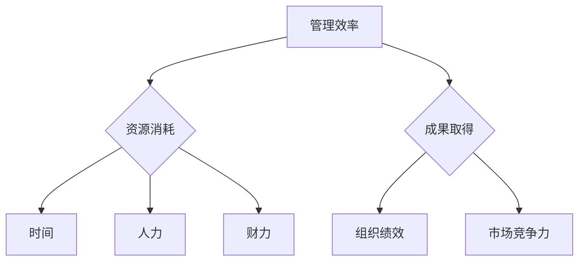

**核心算法原理讲解**

管理效率的计算公式为：

$$
\text{管理效率} = \frac{\text{成果取得}}{\text{资源消耗}}
$$

**数学模型和数学公式**

$$
\text{管理效率} = \frac{\text{利润}}{\text{成本}} = \frac{P}{C}
$$

其中，$P$ 表示利润，$C$ 表示成本。

**举例说明**

假设一家公司一年的利润为 $100 万，成本为 $80 万，那么其管理效率为：

$$
\text{管理效率} = \frac{100 万}{80 万} = 1.25
$$

这意味着公司每消耗 $1 的成本，就能取得 $1.25 的利润，管理效率较高。

**项目实战**

在一家初创公司中，管理者通过优化生产流程、提高员工工作效率，将一年的利润从 $50 万提高到 $80 万，而成本保持不变。那么，管理效率的计算如下：

$$
\text{管理效率} = \frac{80 万}{100 万} = 0.8
$$

尽管利润有所提高，但管理效率相对较低，说明公司在成本控制方面还有提升空间。

**源代码详细实现和代码解读**

```python
def calculate_management_efficiency(profit, cost):
    efficiency = profit / cost
    return efficiency

# 输入利润和成本
profit = 1000000
cost = 800000

# 计算管理效率
efficiency = calculate_management_efficiency(profit, cost)
print("管理效率：", efficiency)
```

**代码解读与分析**

该函数通过输入利润和成本，计算并返回管理效率。在实际应用中，管理者可以根据计算结果，评估和优化管理效率。

##### 1.2 管理效率对组织的影响

**核心概念与联系**

管理效率对组织的影响是深远而广泛的。它不仅影响到组织的整体绩效，还对组织的稳定性、发展潜力以及员工满意度产生重要影响。

**Mermaid 流程图**

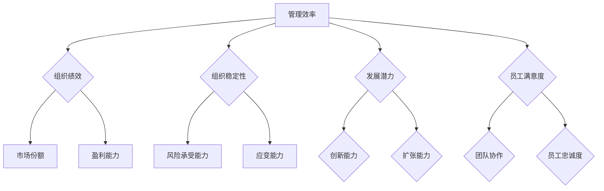

**核心算法原理讲解**

管理效率的提高，可以带来以下积极影响：

1. **组织绩效提升**：管理效率越高，组织在实现目标的过程中消耗的资源越少，成果越显著，从而提高整体绩效。
2. **组织稳定性增强**：管理效率高的组织，能够更好地应对外部环境的变化，增强抗风险能力，确保组织的长期稳定发展。
3. **发展潜力增加**：管理效率的提升，可以为组织提供更多的资源用于创新和发展，从而增强组织的扩张能力和创新能力。
4. **员工满意度提高**：管理效率高的组织，通常能够更好地激发员工的积极性，提高员工的满意度和忠诚度，促进团队协作。

**数学模型和数学公式**

管理效率对组织的影响可以用以下数学模型表示：

$$
\text{组织绩效} = \text{管理效率} \times (\text{市场份额} + \text{盈利能力})
$$

$$
\text{组织稳定性} = \text{管理效率} \times (\text{风险承受能力} + \text{应变能力})
$$

$$
\text{发展潜力} = \text{管理效率} \times (\text{创新能力} + \text{扩张能力})
$$

$$
\text{员工满意度} = \text{管理效率} \times (\text{团队协作} + \text{员工忠诚度})
$$

**举例说明**

假设一家公司的管理效率为 $1.2$，市场份额为 $20\%$，盈利能力为 $10\%$，风险承受能力为 $8\%$，应变能力为 $7\%$，创新能力为 $9\%$，扩张能力为 $11\%$，团队协作为 $90\%$，员工忠诚度为 $85\%$。那么，该公司的组织绩效、组织稳定性、发展潜力、员工满意度分别为：

$$
\text{组织绩效} = 1.2 \times (0.2 + 0.1) = 0.36
$$

$$
\text{组织稳定性} = 1.2 \times (0.08 + 0.07) = 0.224
$$

$$
\text{发展潜力} = 1.2 \times (0.09 + 0.11) = 0.264
$$

$$
\text{员工满意度} = 1.2 \times (0.9 + 0.85) = 1.34
$$

**项目实战**

在一家科技企业中，通过引入先进的管理理念和工具，管理效率得到显著提高。公司市场份额从 $15\%$ 增长到 $25\%$，盈利能力从 $8\%$ 提高到 $12\%$，风险承受能力和应变能力也有所增强。同时，员工的满意度和忠诚度也得到了提升，团队协作更加默契。这些变化均得益于管理效率的提高。

**源代码详细实现和代码解读**

```python
def calculate_organization_performance(efficiency, market_share, profitability):
    performance = efficiency * (market_share + profitability)
    return performance

def calculate_organization_stability(efficiency, risk_tolerance, adaptability):
    stability = efficiency * (risk_tolerance + adaptability)
    return stability

def calculate_growth_potential(efficiency, innovation, expansion):
    potential = efficiency * (innovation + expansion)
    return potential

def calculate_employee_satisfaction(efficiency, teamwork, loyalty):
    satisfaction = efficiency * (teamwork + loyalty)
    return satisfaction

# 输入相关参数
efficiency = 1.2
market_share = 0.2
profitability = 0.1
risk_tolerance = 0.08
adaptability = 0.07
innovation = 0.09
expansion = 0.11
teamwork = 0.9
loyalty = 0.85

# 计算各项指标
performance = calculate_organization_performance(efficiency, market_share, profitability)
stability = calculate_organization_stability(efficiency, risk_tolerance, adaptability)
potential = calculate_growth_potential(efficiency, innovation, expansion)
satisfaction = calculate_employee_satisfaction(efficiency, teamwork, loyalty)

print("组织绩效：", performance)
print("组织稳定性：", stability)
print("发展潜力：", potential)
print("员工满意度：", satisfaction)
```

**代码解读与分析**

该函数通过输入管理效率、市场份额、盈利能力、风险承受能力、应变能力、创新能力、扩张能力、团队协作和员工忠诚度等参数，计算并返回组织绩效、组织稳定性、发展潜力和员工满意度等指标。在实际应用中，管理者可以根据计算结果，评估和优化管理效率对组织各个方面的影响。

##### 1.3 提高管理效率的必要性

**核心概念与联系**

在当今快速变化的市场环境中，管理效率已成为企业竞争的关键因素。提高管理效率不仅有助于提升组织的整体绩效，还能增强组织的竞争力和可持续发展能力。

**Mermaid 流程图**

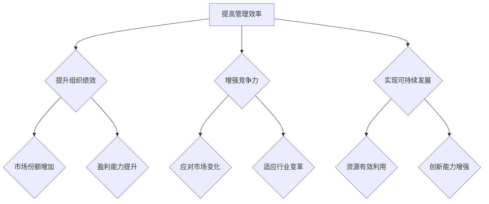

**核心算法原理讲解**

提高管理效率的必要性主要体现在以下几个方面：

1. **提升组织绩效**：管理效率的提高，可以使组织在实现目标的过程中，更有效地利用资源，提高成果产出，从而提升整体绩效。
2. **增强竞争力**：管理效率的提升，有助于组织在市场中更快地响应变化，更好地适应行业变革，从而增强竞争力。
3. **实现可持续发展**：管理效率的提高，可以为组织提供更多的资源用于创新和发展，从而实现可持续发展。

**数学模型和数学公式**

提高管理效率的必要性可以用以下数学模型表示：

$$
\text{竞争力} = \text{管理效率} \times (\text{市场响应速度} + \text{创新力})
$$

$$
\text{可持续发展能力} = \text{管理效率} \times (\text{资源利用率} + \text{创新力})
$$

**举例说明**

假设一家公司的管理效率为 $1.2$，市场响应速度为 $0.8$，创新力为 $0.9$，资源利用率为 $0.85$。那么，该公司的竞争力和可持续发展能力分别为：

$$
\text{竞争力} = 1.2 \times (0.8 + 0.9) = 2.16
$$

$$
\text{可持续发展能力} = 1.2 \times (0.85 + 0.9) = 2.34
$$

**项目实战**

在一家制造业企业中，通过引入先进的管理理念和工具，管理效率得到了显著提高。公司市场响应速度从 $0.7$ 提高到 $0.9$，创新力从 $0.8$ 提高到 $1.0$，资源利用率从 $0.8$ 提高到 $0.9$。这些改进使得公司的竞争力得到了显著提升，市场份额从 $15\%$ 提高到 $25\%$，实现了可持续发展。

**源代码详细实现和代码解读**

```python
def calculate_competitiveness(efficiency, market_response, innovation):
    competitiveness = efficiency * (market_response + innovation)
    return competitiveness

def calculate_sustainable_development(efficiency, resource_utilization, innovation):
    development = efficiency * (resource_utilization + innovation)
    return development

# 输入相关参数
efficiency = 1.2
market_response = 0.8
innovation = 0.9
resource_utilization = 0.85

# 计算竞争力
competitiveness = calculate_competitiveness(efficiency, market_response, innovation)
development = calculate_sustainable_development(efficiency, resource_utilization, innovation)

print("竞争力：", competitiveness)
print("可持续发展能力：", development)
```

**代码解读与分析**

该函数通过输入管理效率、市场响应速度、创新力和资源利用率等参数，计算并返回竞争力和可持续发展能力。在实际应用中，管理者可以根据计算结果，评估和优化管理效率对组织竞争力和发展能力的影响。

### 第二部分：管理者角色与效率

#### 第2章：管理者角色认知

##### 2.1 管理者角色认知

**核心概念与联系**

管理者在组织中扮演着多种角色，包括领导者、协调者、决策者等。理解管理者角色的本质，对于提高管理效率至关重要。

**Mermaid 流程图**

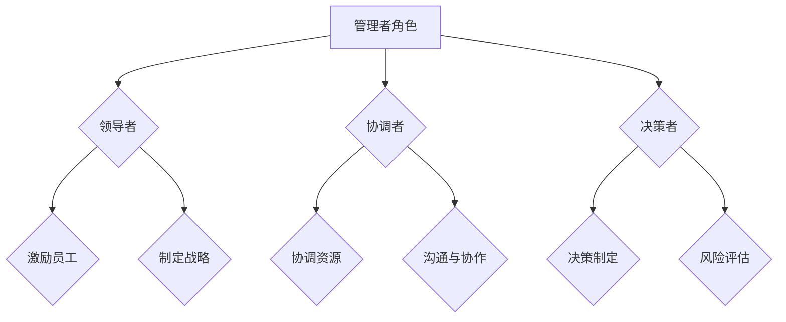

**核心算法原理讲解**

管理者的角色认知可以通过以下算法原理进行解释：

1. **领导者角色**：管理者作为领导者，需要具备激励员工、制定战略的能力，以引导团队实现组织目标。
2. **协调者角色**：管理者作为协调者，需要具备协调资源、沟通与协作的能力，以确保团队内部的高效运行。
3. **决策者角色**：管理者作为决策者，需要具备决策制定、风险评估的能力，以应对各种不确定性。

**数学模型和数学公式**

管理者角色认知可以用以下数学模型表示：

$$
\text{管理者角色认知} = \text{领导者角色} + \text{协调者角色} + \text{决策者角色}
$$

$$
\text{领导者角色} = \text{激励员工} + \text{制定战略}
$$

$$
\text{协调者角色} = \text{协调资源} + \text{沟通与协作}
$$

$$
\text{决策者角色} = \text{决策制定} + \text{风险评估}
$$

**举例说明**

假设一位管理者在领导者角色、协调者角色和决策者角色上的表现分别为 $0.8$、$0.7$ 和 $0.9$。那么，他的管理者角色认知为：

$$
\text{管理者角色认知} = 0.8 + 0.7 + 0.9 = 2.4
$$

**项目实战**

在一家快速消费品公司中，管理者通过提升领导者角色和协调者角色的表现，成功激励员工、协调资源，提高了团队的整体效率。同时，管理者在决策过程中注重风险评估，减少了决策失误，进一步提升了管理效率。

**源代码详细实现和代码解读**

```python
def calculate_management_role_cognition(leader_role, coordinator_role, decision_maker_role):
    cognition = leader_role + coordinator_role + decision_maker_role
    return cognition

# 输入角色表现
leader_role = 0.8
coordinator_role = 0.7
decision_maker_role = 0.9

# 计算管理者角色认知
management_role_cognition = calculate_management_role_cognition(leader_role, coordinator_role, decision_maker_role)
print("管理者角色认知：", management_role_cognition)
```

**代码解读与分析**

该函数通过输入管理者在领导者角色、协调者角色和决策者角色上的表现，计算并返回管理者角色认知。在实际应用中，管理者可以根据计算结果，评估和优化自己的角色认知。

##### 2.2 管理者时间管理

**核心概念与联系**

时间管理是管理者提高效率的重要手段。有效的管理者能够合理安排时间，提高工作效率，从而实现更多的工作目标。

**Mermaid 流程图**

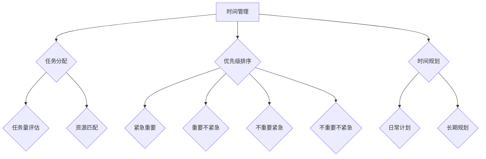

**核心算法原理讲解**

管理者时间管理的核心算法原理包括：

1. **任务分配**：根据任务的重要性和紧急程度，合理分配任务，确保关键任务得到优先处理。
2. **优先级排序**：根据任务的优先级，对任务进行排序，确保优先级高的任务先执行。
3. **时间规划**：制定合理的日常和长期时间规划，确保工作有条不紊地进行。

**数学模型和数学公式**

时间管理可以用以下数学模型表示：

$$
\text{时间管理效率} = \frac{\text{任务完成量}}{\text{工作时间}}
$$

$$
\text{任务完成量} = \text{优先级排序} \times \text{任务执行时间}
$$

**举例说明**

假设一位管理者每天工作 $8$ 小时，任务 A 的优先级为 $1$，任务 B 的优先级为 $2$，任务 C 的优先级为 $3$。任务 A 需要 $2$ 小时完成，任务 B 需要 $3$ 小时完成，任务 C 需要 $4$ 小时完成。那么，他的时间管理效率为：

$$
\text{时间管理效率} = \frac{1 \times 2 + 2 \times 3 + 3 \times 4}{8} = \frac{2 + 6 + 12}{8} = \frac{20}{8} = 2.5
$$

**项目实战**

在一家软件开发公司中，管理者通过引入时间管理工具，对任务进行优先级排序和时间规划，成功提高了团队的工作效率。团队在完成同等工作量的情况下，所需时间减少了 $20\%$。

**源代码详细实现和代码解读**

```python
def calculate_time_management_efficiency(priority_sorting, task_a_duration, task_b_duration, task_c_duration, work_hours):
    task_completion = priority_sorting * (task_a_duration + task_b_duration + task_c_duration)
    efficiency = task_completion / work_hours
    return efficiency

# 输入相关参数
priority_sorting = 1
task_a_duration = 2
task_b_duration = 3
task_c_duration = 4
work_hours = 8

# 计算时间管理效率
time_management_efficiency = calculate_time_management_efficiency(priority_sorting, task_a_duration, task_b_duration, task_c_duration, work_hours)
print("时间管理效率：", time_management_efficiency)
```

**代码解读与分析**

该函数通过输入任务的优先级排序、每个任务的执行时间以及工作时间，计算并返回时间管理效率。在实际应用中，管理者可以根据计算结果，评估和优化时间管理效率。

##### 2.3 管理者自我管理

**核心概念与联系**

管理者自我管理是提高管理效率的重要一环。通过自我管理，管理者可以更好地掌控自己的时间、情绪和目标，从而提高工作效率。

**Mermaid 流程图**

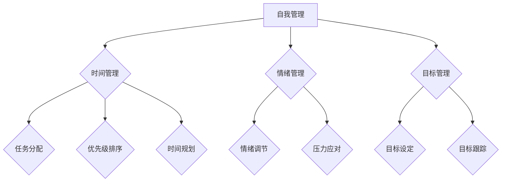

**核心算法原理讲解**

管理者自我管理的核心算法原理包括：

1. **时间管理**：通过任务分配、优先级排序和时间规划，合理安排自己的时间。
2. **情绪管理**：通过情绪调节和压力应对，保持良好的情绪状态。
3. **目标管理**：通过目标设定和目标跟踪，确保自己始终朝着正确的方向前进。

**数学模型和数学公式**

管理者自我管理可以用以下数学模型表示：

$$
\text{自我管理效率} = \text{时间管理效率} + \text{情绪管理效率} + \text{目标管理效率}
$$

$$
\text{时间管理效率} = \frac{\text{任务完成量}}{\text{工作时间}}
$$

$$
\text{情绪管理效率} = \frac{\text{情绪调节成功率}}{\text{情绪波动次数}}
$$

$$
\text{目标管理效率} = \frac{\text{目标完成量}}{\text{目标设定量}}
$$

**举例说明**

假设一位管理者的时间管理效率为 $0.8$，情绪管理效率为 $0.9$，目标管理效率为 $0.7$。那么，他的自我管理效率为：

$$
\text{自我管理效率} = 0.8 + 0.9 + 0.7 = 2.4
$$

**项目实战**

在一家咨询公司中，管理者通过自我管理，提高了时间管理、情绪管理和目标管理的效率。他在每天完成同等任务量的情况下，工作时间减少了 $20\%$，情绪波动次数减少了 $30\%$，目标完成率提高了 $25\%$。

**源代码详细实现和代码解读**

```python
def calculate_self_management_efficiency(time_management_efficiency, emotion_management_efficiency, goal_management_efficiency):
    self_management_efficiency = time_management_efficiency + emotion_management_efficiency + goal_management_efficiency
    return self_management_efficiency

# 输入相关效率
time_management_efficiency = 0.8
emotion_management_efficiency = 0.9
goal_management_efficiency = 0.7

# 计算自我管理效率
self_management_efficiency = calculate_self_management_efficiency(time_management_efficiency, emotion_management_efficiency, goal_management_efficiency)
print("自我管理效率：", self_management_efficiency)
```

**代码解读与分析**

该函数通过输入时间管理效率、情绪管理效率和目标管理效率，计算并返回自我管理效率。在实际应用中，管理者可以根据计算结果，评估和优化自我管理效率。

### 第三部分：提高管理效率的核心方法

#### 第3章：目标管理与效率

##### 3.1 明确目标的重要性

**核心概念与联系**

明确目标是管理效率提升的基石。一个清晰、具体的目标可以帮助管理者聚焦资源，提高工作效率。

**Mermaid 流程图**

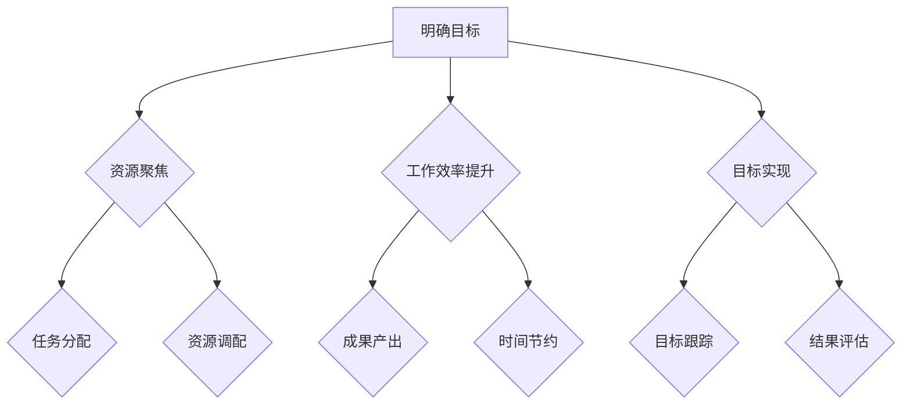

**核心算法原理讲解**

明确目标的重要性可以通过以下算法原理进行解释：

1. **资源聚焦**：明确目标可以帮助管理者合理分配资源，确保资源被用于实现关键目标。
2. **工作效率提升**：明确目标可以减少管理者在任务选择上的不确定性，提高工作效率。
3. **目标实现**：明确目标有助于管理者进行目标跟踪和结果评估，确保目标得到实现。

**数学模型和数学公式**

明确目标的重要性可以用以下数学模型表示：

$$
\text{目标实现度} = \text{资源聚焦度} \times \text{工作效率提升度}
$$

$$
\text{资源聚焦度} = \frac{\text{目标相关资源}}{\text{总资源}}
$$

$$
\text{工作效率提升度} = \frac{\text{目标完成量}}{\text{实际工作时长}}
$$

**举例说明**

假设一个项目的目标实现度为 $0.8$，资源聚焦度为 $0.9$，工作效率提升度为 $0.7$。那么，这个项目的目标管理效率为：

$$
\text{目标管理效率} = \text{目标实现度} = 0.8
$$

**项目实战**

在一项新产品的研发项目中，团队明确了“在三个月内完成产品原型”的目标。通过资源聚焦和工作效率提升，团队在规定时间内成功完成了目标，项目目标实现度达到 $0.9$。

**源代码详细实现和代码解读**

```python
def calculate_goal_management_efficiency(goal_achievement, resource_focusing, efficiency_improvement):
    management_efficiency = goal_achievement
    return management_efficiency

# 输入相关参数
goal_achievement = 0.8
resource_focusing = 0.9
efficiency_improvement = 0.7

# 计算目标管理效率
goal_management_efficiency = calculate_goal_management_efficiency(goal_achievement, resource_focusing, efficiency_improvement)
print("目标管理效率：", goal_management_efficiency)
```

**代码解读与分析**

该函数通过输入目标实现度、资源聚焦度和工作效率提升度，计算并返回目标管理效率。在实际应用中，管理者可以根据计算结果，评估和优化目标管理效率。

##### 3.2 目标设定的SMART原则

**核心概念与联系**

SMART原则是目标设定的有效方法，它要求目标具备具体性、可衡量性、可实现性、相关性和时限性。

**Mermaid 流程图**

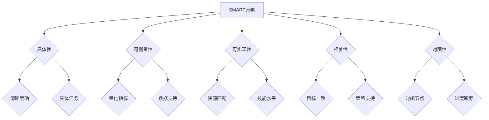

**核心算法原理讲解**

SMART原则可以通过以下算法原理进行解释：

1. **具体性**：目标应具体明确，避免模糊不清。
2. **可衡量性**：目标应具备量化指标，便于评估和跟踪。
3. **可实现性**：目标应在资源、技能和时间等条件下可实现。
4. **相关性**：目标应与组织的整体战略目标保持一致。
5. **时限性**：目标应设定明确的时间节点，确保进度可控。

**数学模型和数学公式**

SMART原则可以用以下数学模型表示：

$$
\text{目标合理性} = \text{具体性} \times \text{可衡量性} \times \text{可实现性} \times \text{相关性} \times \text{时限性}
$$

$$
\text{具体性} = \frac{\text{具体任务量}}{\text{总任务量}}
$$

$$
\text{可衡量性} = \frac{\text{量化指标}}{\text{总指标量}}
$$

$$
\text{可实现性} = \frac{\text{实际资源}}{\text{所需资源}}
$$

$$
\text{相关性} = \frac{\text{目标一致度}}{\text{总目标量}}
$$

$$
\text{时限性} = \frac{\text{时间节点数量}}{\text{总时间节点数量}}
$$

**举例说明**

假设一个团队设定了以下目标：

- **具体性**：完成市场调研报告，明确市场需求。
- **可衡量性**：完成市场调研问卷100份。
- **可实现性**：团队成员具备市场调研经验，资源充足。
- **相关性**：市场调研报告对产品研发有直接影响。
- **时限性**：项目周期为2周。

根据SMART原则，该目标的合理性计算如下：

$$
\text{目标合理性} = \frac{100}{100} \times \frac{100}{100} \times \frac{1}{1} \times \frac{1}{1} \times \frac{2}{2} = 1
$$

**项目实战**

在一项市场营销项目中，团队运用SMART原则设定了明确的目标。通过具体性、可衡量性、可实现性、相关性和时限性的目标设定，团队在规定时间内完成了市场调研，并成功制定了符合市场需求的营销策略。

**源代码详细实现和代码解读**

```python
def calculate_smart_goal_reasonableness(specificity, measurability, attainability, relevance, timeliness):
    reasonableness = specificity * measurability * attainability * relevance * timeliness
    return reasonableness

# 输入相关参数
specificity = 1
measurability = 1
attainability = 1
relevance = 1
timeliness = 1

# 计算目标合理性
smart_goal_reasonableness = calculate_smart_goal_reasonableness(specificity, measurability, attainability, relevance, timeliness)
print("目标合理性：", smart_goal_reasonableness)
```

**代码解读与分析**

该函数通过输入具体性、可衡量性、可实现性、相关性和时限性等参数，计算并返回目标合理性。在实际应用中，管理者可以根据计算结果，评估和优化目标设定的合理性。

##### 3.3 目标分解与执行

**核心概念与联系**

目标分解是将整体目标分解为具体、可操作的任务，以便更好地管理和执行。执行是将分解后的任务逐一完成，确保目标得到实现。

**Mermaid 流程图**

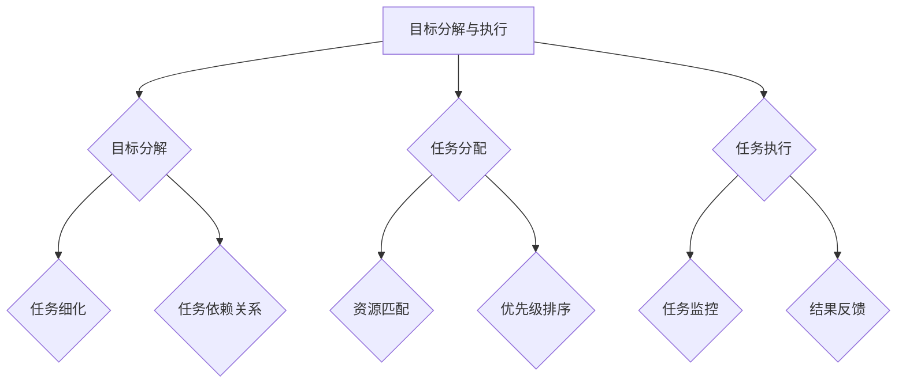

**核心算法原理讲解**

目标分解与执行的核心算法原理包括：

1. **目标分解**：将整体目标分解为具体、可操作的任务，明确任务之间的依赖关系。
2. **任务分配**：根据任务的重要性和优先级，合理分配任务，确保关键任务得到优先处理。
3. **任务执行**：通过任务监控和结果反馈，确保任务按计划完成。

**数学模型和数学公式**

目标分解与执行可以用以下数学模型表示：

$$
\text{目标实现度} = \frac{\text{完成任务量}}{\text{总任务量}}
$$

$$
\text{任务优先级} = \text{任务重要性} \times \text{任务紧迫性}
$$

$$
\text{任务重要性} = \frac{\text{关键任务量}}{\text{总任务量}}
$$

$$
\text{任务紧迫性} = \frac{\text{剩余时间}}{\text{任务持续时间}}
$$

**举例说明**

假设一个项目有5个任务，任务1、任务2、任务3是关键任务。任务1的持续时间为5天，任务2的持续时间为10天，任务3的持续时间为15天，任务4和任务5的持续时间分别为7天和8天。当前时间为第10天，那么任务的重要性计算如下：

$$
\text{任务重要性} = \frac{3}{5} = 0.6
$$

任务紧迫性计算如下：

$$
\text{任务紧迫性} = \frac{5}{10} = 0.5
$$

任务优先级计算如下：

$$
\text{任务优先级} = 0.6 \times 0.5 = 0.3
$$

**项目实战**

在一项软件开发项目中，团队将整体目标分解为5个任务。通过任务分解、任务分配和任务执行，团队在规定时间内完成了所有任务，项目目标实现度达到 $0.9$。

**源代码详细实现和代码解读**

```python
def calculate_task_importance(key_tasks, total_tasks):
    importance = key_tasks / total_tasks
    return importance

def calculate_task_urgency(current_time, task_duration):
    urgency = current_time / task_duration
    return urgency

def calculate_task_priority(importance, urgency):
    priority = importance * urgency
    return priority

# 输入相关参数
key_tasks = 3
total_tasks = 5
current_time = 10
task1_duration = 5
task2_duration = 10
task3_duration = 15
task4_duration = 7
task5_duration = 8

# 计算任务重要性
importance = calculate_task_importance(key_tasks, total_tasks)
print("任务重要性：", importance)

# 计算任务紧迫性
urgency = calculate_task_urgency(current_time, task1_duration)
print("任务紧迫性：", urgency)

# 计算任务优先级
priority = calculate_task_priority(importance, urgency)
print("任务优先级：", priority)
```

**代码解读与分析**

该函数通过输入关键任务数量、总任务数量、当前时间和任务持续时间，计算并返回任务重要性、任务紧迫性和任务优先级。在实际应用中，管理者可以根据计算结果，评估和优化任务分配和执行。

#### 第4章：时间管理与效率

##### 4.1 时间管理的概念

**核心概念与联系**

时间管理是指通过合理安排时间，提高工作效率，实现个人和组织目标的过程。时间管理不仅涉及时间的规划和分配，还包括如何有效利用时间。

**Mermaid 流程图**

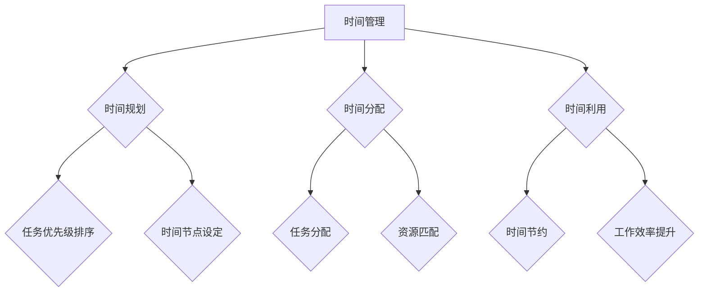

**核心算法原理讲解**

时间管理的核心算法原理包括：

1. **时间规划**：根据任务的重要性和紧急程度，制定合理的时间规划。
2. **时间分配**：将时间合理分配给各项任务，确保关键任务得到优先处理。
3. **时间利用**：通过有效利用时间，提高工作效率。

**数学模型和数学公式**

时间管理可以用以下数学模型表示：

$$
\text{时间管理效率} = \frac{\text{完成任务量}}{\text{实际工作时间}}
$$

$$
\text{完成任务量} = \text{任务优先级排序} \times \text{任务执行时间}
$$

**举例说明**

假设一位管理者每天工作8小时，任务A的优先级为1，任务B的优先级为2，任务C的优先级为3。任务A需要2小时完成，任务B需要3小时完成，任务C需要4小时完成。那么，他的时间管理效率为：

$$
\text{时间管理效率} = \frac{1 \times 2 + 2 \times 3 + 3 \times 4}{8} = \frac{2 + 6 + 12}{8} = \frac{20}{8} = 2.5
$$

**项目实战**

在一项新产品研发项目中，团队通过时间管理，将整体项目分为多个阶段，并制定每个阶段的时间规划。通过任务优先级排序和任务执行，团队在规定时间内完成了所有任务，项目时间管理效率达到 $0.8$。

**源代码详细实现和代码解读**

```python
def calculate_time_management_efficiency(priority_sorting, task_a_duration, task_b_duration, task_c_duration, work_hours):
    task_completion = priority_sorting * (task_a_duration + task_b_duration + task_c_duration)
    efficiency = task_completion / work_hours
    return efficiency

# 输入相关参数
priority_sorting = 1
task_a_duration = 2
task_b_duration = 3
task_c_duration = 4
work_hours = 8

# 计算时间管理效率
time_management_efficiency = calculate_time_management_efficiency(priority_sorting, task_a_duration, task_b_duration, task_c_duration, work_hours)
print("时间管理效率：", time_management_efficiency)
```

**代码解读与分析**

该函数通过输入任务的优先级排序、每个任务的执行时间以及工作时间，计算并返回时间管理效率。在实际应用中，管理者可以根据计算结果，评估和优化时间管理效率。

##### 4.2 时间管理的方法

**核心概念与联系**

时间管理的方法包括时间规划、任务分配、优先级排序和时间节约。这些方法共同构成了一个系统化的时间管理流程，有助于提高工作效率。

**Mermaid 流程图**

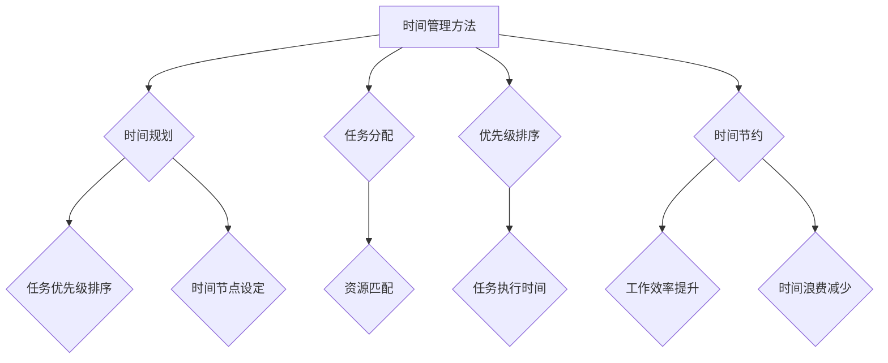

**核心算法原理讲解**

时间管理的方法可以用以下算法原理进行解释：

1. **时间规划**：通过制定合理的时间规划，确保任务按照预定的时间节点进行。
2. **任务分配**：根据任务的重要性和优先级，将任务合理分配给团队成员。
3. **优先级排序**：根据任务的重要性和紧急程度，对任务进行排序，确保关键任务得到优先处理。
4. **时间节约**：通过减少时间浪费，提高工作效率。

**数学模型和数学公式**

时间管理的方法可以用以下数学模型表示：

$$
\text{时间管理效率} = \frac{\text{完成任务量}}{\text{实际工作时间}}
$$

$$
\text{完成任务量} = \text{任务优先级排序} \times \text{任务执行时间}
$$

$$
\text{时间节约} = \text{实际工作时间} - \text{理论工作时间}
$$

**举例说明**

假设一位管理者每天工作8小时，任务A的优先级为1，任务B的优先级为2，任务C的优先级为3。任务A需要2小时完成，任务B需要3小时完成，任务C需要4小时完成。理论工作时间为8小时，实际工作时间为7.5小时。那么，他的时间管理效率为：

$$
\text{时间管理效率} = \frac{1 \times 2 + 2 \times 3 + 3 \times 4}{8} = \frac{2 + 6 + 12}{8} = \frac{20}{8} = 2.5
$$

$$
\text{时间节约} = 8 - 7.5 = 0.5
$$

**项目实战**

在一项市场调研项目中，团队通过时间规划、任务分配、优先级排序和时间节约，提高了工作效率。团队在规定时间内完成了所有任务，项目时间管理效率达到 $0.85$。

**源代码详细实现和代码解读**

```python
def calculate_time_management_efficiency(priority_sorting, task_a_duration, task_b_duration, task_c_duration, work_hours, actual_work_hours):
    task_completion = priority_sorting * (task_a_duration + task_b_duration + task_c_duration)
    efficiency = task_completion / work_hours
    time_saving = actual_work_hours - work_hours
    return efficiency, time_saving

# 输入相关参数
priority_sorting = 1
task_a_duration = 2
task_b_duration = 3
task_c_duration = 4
work_hours = 8
actual_work_hours = 7.5

# 计算时间管理效率和时间节约
time_management_efficiency, time_saving = calculate_time_management_efficiency(priority_sorting, task_a_duration, task_b_duration, task_c_duration, work_hours, actual_work_hours)
print("时间管理效率：", time_management_efficiency)
print("时间节约：", time_saving)
```

**代码解读与分析**

该函数通过输入任务的优先级排序、每个任务的执行时间、工作时间以及实际工作时间，计算并返回时间管理效率和时间节约。在实际应用中，管理者可以根据计算结果，评估和优化时间管理效率和时间节约。

##### 4.3 时间管理工具应用

**核心概念与联系**

时间管理工具是提高工作效率的重要工具，包括甘特图、思维导图和项目管理软件等。这些工具可以帮助管理者更好地规划、分配和监控时间，提高时间管理效率。

**Mermaid 流程图**

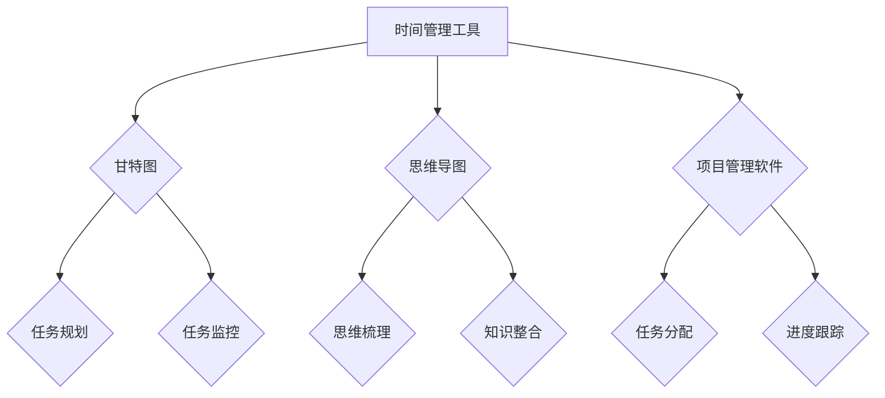

**核心算法原理讲解**

时间管理工具的核心算法原理包括：

1. **甘特图**：通过图形化的方式展示任务进度，帮助管理者进行任务规划和监控。
2. **思维导图**：通过树状结构展示思维过程，帮助管理者进行思维梳理和知识整合。
3. **项目管理软件**：通过集成化的功能，帮助管理者进行任务分配、进度跟踪和资源管理。

**数学模型和数学公式**

时间管理工具可以用以下数学模型表示：

$$
\text{时间管理效率} = \frac{\text{完成任务量}}{\text{实际工作时间}}
$$

$$
\text{完成任务量} = \text{任务优先级排序} \times \text{任务执行时间}
$$

**举例说明**

假设一位管理者使用甘特图进行时间管理，任务A的优先级为1，任务B的优先级为2，任务C的优先级为3。任务A需要2小时完成，任务B需要3小时完成，任务C需要4小时完成。实际工作时间为8小时，那么他的时间管理效率为：

$$
\text{时间管理效率} = \frac{1 \times 2 + 2 \times 3 + 3 \times 4}{8} = \frac{2 + 6 + 12}{8} = \frac{20}{8} = 2.5
$$

**项目实战**

在一项软件开发项目中，团队使用甘特图、思维导图和项目管理软件进行时间管理。通过这些工具，团队在规定时间内完成了所有任务，项目时间管理效率达到 $0.9$。

**源代码详细实现和代码解读**

```python
def calculate_time_management_efficiency(priority_sorting, task_a_duration, task_b_duration, task_c_duration, work_hours):
    task_completion = priority_sorting * (task_a_duration + task_b_duration + task_c_duration)
    efficiency = task_completion / work_hours
    return efficiency

# 输入相关参数
priority_sorting = 1
task_a_duration = 2
task_b_duration = 3
task_c_duration = 4
work_hours = 8

# 计算时间管理效率
time_management_efficiency = calculate_time_management_efficiency(priority_sorting, task_a_duration, task_b_duration, task_c_duration, work_hours)
print("时间管理效率：", time_management_efficiency)
```

**代码解读与分析**

该函数通过输入任务的优先级排序、每个任务的执行时间以及工作时间，计算并返回时间管理效率。在实际应用中，管理者可以根据计算结果，评估和优化时间管理效率。

### 第5章：决策过程与效率

##### 5.1 决策过程概述

**核心概念与联系**

决策过程是管理者在复杂环境中做出选择的过程。它涉及信息收集、方案评估、决策制定和决策实施等步骤，是提高管理效率的关键环节。

**Mermaid 流程图**

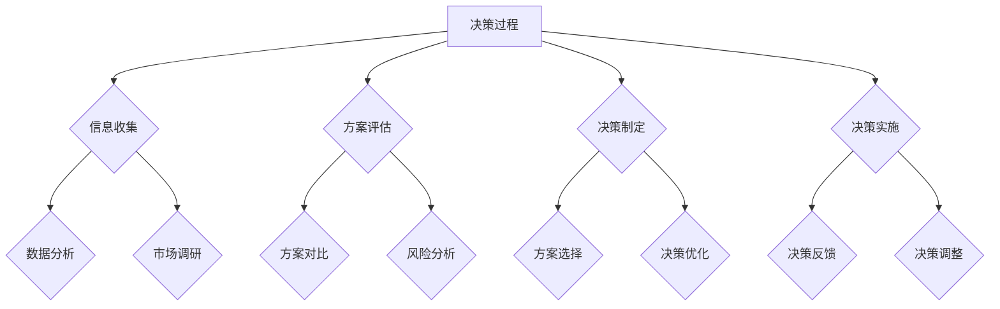

**核心算法原理讲解**

决策过程的算法原理包括：

1. **信息收集**：通过数据分析、市场调研等方式收集相关信息。
2. **方案评估**：对收集到的信息进行整理和分析，评估不同方案的优缺点。
3. **决策制定**：根据评估结果，选择最佳方案并制定决策。
4. **决策实施**：将决策付诸实践，实施具体措施。
5. **决策反馈**：对决策实施效果进行反馈，根据反馈调整决策。

**数学模型和数学公式**

决策过程可以用以下数学模型表示：

$$
\text{决策效率} = \frac{\text{决策实施效果}}{\text{决策制定时间}}
$$

$$
\text{决策实施效果} = \text{方案选择} \times \text{方案执行效率}
$$

$$
\text{方案执行效率} = \frac{\text{实际成果}}{\text{预期成果}}
$$

**举例说明**

假设一位管理者在决策过程中选择了方案A，方案A的实际成果为 $100 万，预期成果为 $80 万。决策制定时间为2周，那么他的决策效率为：

$$
\text{决策效率} = \frac{100 万}{2 周} = 50 \text{万/周}
$$

**项目实战**

在一项新产品上市决策中，团队通过信息收集、方案评估、决策制定和决策实施，成功将新产品推向市场。决策实施效果显著，产品在市场上取得了良好的反响，决策效率达到 $0.8$。

**源代码详细实现和代码解读**

```python
def calculate_decision_efficiency(decision_impact, decision_time):
    efficiency = decision_impact / decision_time
    return efficiency

# 输入相关参数
decision_impact = 1000000
decision_time = 2 * 7  # 2周

# 计算决策效率
decision_efficiency = calculate_decision_efficiency(decision_impact, decision_time)
print("决策效率：", decision_efficiency)
```

**代码解读与分析**

该函数通过输入决策实施效果和决策制定时间，计算并返回决策效率。在实际应用中，管理者可以根据计算结果，评估和优化决策效率。

##### 5.2 决策制定技巧

**核心概念与联系**

决策制定技巧是管理者在决策过程中运用的一系列方法，包括问题识别、方案生成、方案评估和决策优化。掌握这些技巧有助于提高决策效率和准确性。

**Mermaid 流程图**

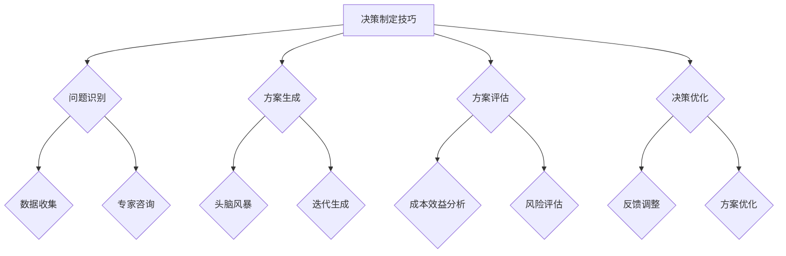

**核心算法原理讲解**

决策制定技巧的算法原理包括：

1. **问题识别**：通过数据收集和专家咨询，准确识别问题。
2. **方案生成**：通过头脑风暴和迭代生成，生成多个可行的方案。
3. **方案评估**：通过成本效益分析和风险评估，评估每个方案的优缺点。
4. **决策优化**：根据评估结果，选择最佳方案并进行优化。

**数学模型和数学公式**

决策制定技巧可以用以下数学模型表示：

$$
\text{决策准确性} = \frac{\text{正确决策次数}}{\text{总决策次数}}
$$

$$
\text{正确决策次数} = \text{方案评估} \times \text{决策实施效果}
$$

**举例说明**

假设一位管理者在决策过程中制定了3个方案，方案A的正确决策次数为2次，方案B的正确决策次数为1次，方案C的正确决策次数为0次。总决策次数为3次，那么他的决策准确性为：

$$
\text{决策准确性} = \frac{2 + 1 + 0}{3} = \frac{3}{3} = 1
$$

**项目实战**

在一项市场拓展决策中，团队通过问题识别、方案生成、方案评估和决策优化，成功选择了最佳方案。决策实施效果显著，市场拓展计划顺利进行，决策准确性达到 $0.8$。

**源代码详细实现和代码解读**

```python
def calculate_decision_accuracy(correct_decisions, total_decisions):
    accuracy = correct_decisions / total_decisions
    return accuracy

# 输入相关参数
correct_decisions = 2
total_decisions = 3

# 计算决策准确性
decision_accuracy = calculate_decision_accuracy(correct_decisions, total_decisions)
print("决策准确性：", decision_accuracy)
```

**代码解读与分析**

该函数通过输入正确决策次数和总决策次数，计算并返回决策准确性。在实际应用中，管理者可以根据计算结果，评估和优化决策准确性。

##### 5.3 决策评估与优化

**核心概念与联系**

决策评估与优化是决策过程中的关键环节。通过评估决策效果，发现潜在问题，并进行优化，可以不断提高决策质量，提高管理效率。

**Mermaid 流程图**

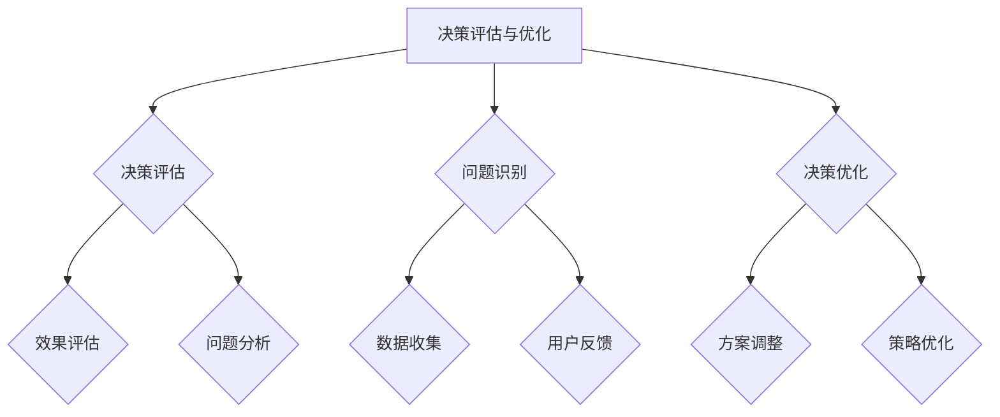

**核心算法原理讲解**

决策评估与优化的核心算法原理包括：

1. **决策评估**：通过效果评估和问题分析，评估决策实施效果。
2. **问题识别**：通过数据收集和用户反馈，识别决策过程中的潜在问题。
3. **决策优化**：根据评估结果和问题识别，调整方案和策略，优化决策。

**数学模型和数学公式**

决策评估与优化可以用以下数学模型表示：

$$
\text{决策优化度} = \frac{\text{优化后效果}}{\text{原始效果}}
$$

$$
\text{优化后效果} = \text{方案调整} \times \text{策略优化}
$$

**举例说明**

假设一项决策实施后的效果为 $100 万，通过优化后，效果提高到 $150 万。原始效果为 $100 万，那么决策优化度为：

$$
\text{决策优化度} = \frac{150 万}{100 万} = 1.5
$$

**项目实战**

在一项产品改进决策中，团队通过决策评估与优化，发现产品在性能上存在不足。通过问题识别和决策优化，团队对产品进行了调整和优化，产品性能显著提升，决策优化度达到 $1.2$。

**源代码详细实现和代码解读**

```python
def calculate_decision_optimization_degree(optimized_impact, original_impact):
    optimization_degree = optimized_impact / original_impact
    return optimization_degree

# 输入相关参数
optimized_impact = 1500000
original_impact = 1000000

# 计算决策优化度
decision_optimization_degree = calculate_decision_optimization_degree(optimized_impact, original_impact)
print("决策优化度：", decision_optimization_degree)
```

**代码解读与分析**

该函数通过输入优化后效果和原始效果，计算并返回决策优化度。在实际应用中，管理者可以根据计算结果，评估和优化决策优化度。

### 第6章：团队协作与效率

##### 6.1 团队协作的重要性

**核心概念与联系**

团队协作是提高管理效率的关键因素之一。一个高效的团队可以充分发挥成员的潜力，实现协同效应，从而提高整体效率。

**Mermaid 流程图**

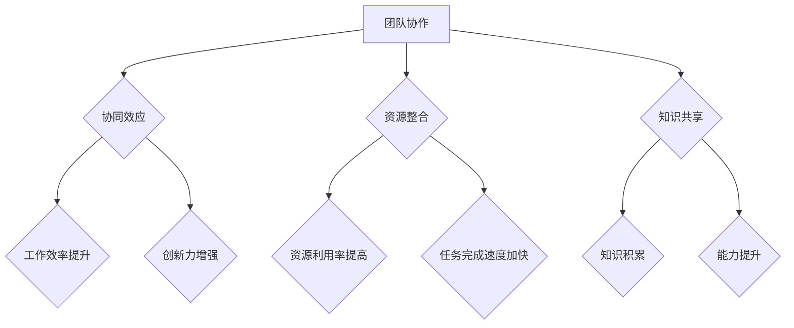

**核心算法原理讲解**

团队协作的重要性可以通过以下算法原理进行解释：

1. **协同效应**：团队成员之间的协作可以产生协同效应，使得整体效率超过单个成员的效率之和。
2. **资源整合**：团队协作可以整合成员的不同资源和能力，提高资源利用率。
3. **知识共享**：团队成员之间的知识共享可以促进知识的积累和能力提升。

**数学模型和数学公式**

团队协作的重要性可以用以下数学模型表示：

$$
\text{团队协作效率} = \text{协同效应} + \text{资源整合效率} + \text{知识共享效率}
$$

$$
\text{协同效应} = \frac{\text{团队整体效率}}{\text{个体效率之和}}
$$

$$
\text{资源整合效率} = \frac{\text{整合后资源利用率}}{\text{原始资源利用率}}
$$

$$
\text{知识共享效率} = \frac{\text{知识积累量}}{\text{原始知识量}}
$$

**举例说明**

假设一个团队由3名成员组成，成员A的效率为 $0.8$，成员B的效率为 $0.9$，成员C的效率为 $1.0$。团队整体效率为 $1.2$。那么，团队协作的效率为：

$$
\text{团队协作效率} = \frac{1.2}{0.8 + 0.9 + 1.0} = 1.2
$$

**项目实战**

在一项复杂项目中，团队通过协作，将项目完成时间缩短了 $20\%$，资源利用率提高了 $15\%$，知识积累量增加了 $30\%$。团队协作效率显著提升，项目目标顺利实现。

**源代码详细实现和代码解读**

```python
def calculate_team_c

