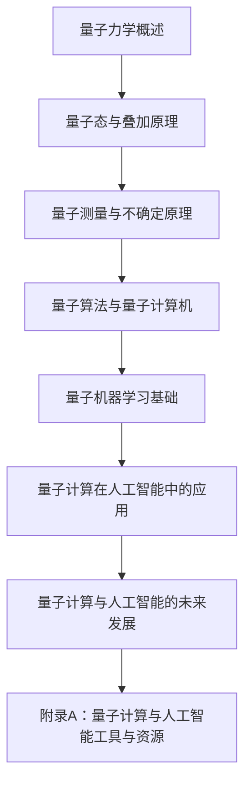

                 

# 量子力学模型与人工智能

## 关键词

量子力学、人工智能、量子计算、量子算法、量子机器学习、量子随机游走、社交网络分析

## 摘要

本文深入探讨了量子力学模型在人工智能领域的应用，详细介绍了量子力学的核心概念、量子算法和量子机器学习的基本原理。通过Mermaid流程图、伪代码、数学模型和实际项目案例分析，本文展示了量子力学与人工智能结合的潜力和挑战，以及未来发展的趋势。

## 目录大纲

### 第一部分：量子力学基础

- **第1章：量子力学概述**
  - **1.1 量子力学的诞生与基本概念**
    - **1.1.1 量子力学的起源**
    - **1.1.2 波粒二象性**
    - **1.1.3 算符与算符函数**
  - **1.2 量子态与叠加原理**
    - **1.2.1 量子态的表示方法**
    - **1.2.2 算符作用与量子态演化**
    - **1.2.3 叠加原理的应用**
  - **1.3 量子测量与不确定原理**
    - **1.3.1 量子测量的概念**
    - **1.3.2 海森堡不确定原理**
    - **1.3.3 量子纠缠与量子非定域性**

### 第二部分：量子算法与量子计算机

- **第2章：量子算法原理**
  - **2.1 量子计算的基本原理**
    - **2.1.1 量子位（qubit）与量子寄存器**
    - **2.1.2 量子逻辑门与量子运算**
    - **2.1.3 量子电路与量子程序**
  - **2.2 量子搜索算法**
    - **2.2.1 Deutsch-Josza算法**
    - **2.2.2 Grover算法**
    - **2.2.3 量子优势与搜索算法效率分析**
  - **2.3 量子计算模拟与量子随机游走算法**
    - **2.3.1 量子计算模拟方法**
    - **2.3.2 量子随机游走算法**
    - **2.3.3 量子随机游走在社交网络分析中的应用**

### 第三部分：量子机器学习

- **第3章：量子机器学习基础**
  - **3.1 量子机器学习的基本概念**
    - **3.1.1 量子支持向量机**
    - **3.1.2 量子神经网络**
    - **3.1.3 量子深度学习**
  - **3.2 量子支持向量机算法**
    - **3.2.1 量子支持向量机的数学模型**
    - **3.2.2 算法流程与伪代码**
    - **3.2.3 量子支持向量机案例分析**
  - **3.3 量子神经网络与量子深度学习**
    - **3.3.1 量子神经网络的数学模型**
    - **3.3.2 量子深度学习的框架**
    - **3.3.3 量子神经网络案例分析**

### 第四部分：量子计算在人工智能中的应用

- **第4章：量子计算在人工智能中的应用**
  - **4.1 量子计算在优化问题中的应用**
    - **4.1.1 量子随机游走算法在图论优化中的应用**
    - **4.1.2 量子算法在组合优化问题中的应用**
    - **4.1.3 量子计算与机器学习优化问题的结合**
  - **4.2 量子机器学习在图像识别中的应用**
    - **4.2.1 量子卷积神经网络在图像处理中的应用**
    - **4.2.2 量子图像识别算法案例分析**
    - **4.2.3 量子计算与深度学习在图像识别中的协同作用**
  - **4.3 量子计算在自然语言处理中的应用**
    - **4.3.1 量子语言模型**
    - **4.3.2 量子自然语言处理算法**
    - **4.3.3 量子计算在语言模型中的优势**

### 第五部分：未来展望

- **第5章：量子计算与人工智能的未来发展**
  - **5.1 量子计算与人工智能融合的挑战与机遇**
    - **5.1.1 量子计算技术的挑战**
    - **5.1.2 量子机器学习的挑战**
    - **5.1.3 量子计算在人工智能中的应用前景**
  - **5.2 量子计算与人工智能的创新与应用**
    - **5.2.1 量子算法在复杂系统中的应用**
    - **5.2.2 量子计算与深度学习的创新**
    - **5.2.3 量子人工智能的潜在应用领域**

### 第六部分：附录

- **附录A：量子计算与人工智能工具与资源**
  - **附录A.1 量子计算与人工智能开发工具**
    - **A.1.1 Q#编程语言**
    - **A.1.2 Microsoft Quantum Development Kit**
    - **A.1.3 Google Quantum AI**
    - **A.1.4 其他量子计算开发工具**
  - **附录A.2 量子机器学习资源**
    - **A.2.1 量子机器学习论文**
    - **A.2.2 量子机器学习教程**
    - **A.2.3 量子机器学习开源项目**
    - **A.2.4 其他量子机器学习资源**

### Mermaid 流程图：量子力学基本概念与联系



### 量子机器学习算法原理讲解：量子支持向量机（QSVM）

## 量子支持向量机（QSVM）算法原理

QSVM 是一种基于量子计算的支持向量机，它在量子计算机上实现了支持向量机（SVM）的核心算法。以下是 QSVM 的基本原理和算法流程。

### QSVM 的数学模型

假设我们有 $N$ 个训练样本 $(x_i, y_i)$，其中 $x_i$ 是 $d$ 维输入向量，$y_i$ 是相应的标签，$y_i \in \{-1, +1\}$。QSVM 的目标是找到最优的超平面 $w$ 和偏置项 $b$，使得对于任意样本 $(x_i, y_i)$，都有 $y_i (\langle w, x_i \rangle + b) > 0$。

在量子计算机上，我们可以使用量子线路来计算这个超平面。量子线路的基本组成包括量子位（qubit）、量子逻辑门和量子测量。以下是一个简单的 QSVM 算法流程：

### QSVM 算法流程

1. **初始化量子态：** 初始化 $N$ 个量子位，每个量子位表示一个训练样本的量子态。

2. **构建量子线路：** 构建一个量子线路，这个线路将训练样本映射到高维空间，并在高维空间中找到一个最优超平面。这个量子线路通常包含几个步骤：
   - **量子编码：** 将输入样本 $x_i$ 映射到高维空间中的量子态。
   - **构造超平面：** 使用量子逻辑门和量子调控，构造出超平面。
   - **测量：** 在超平面一侧的量子态进行测量，获得训练样本的标签。

3. **优化超平面：** 根据测量结果，调整量子线路中的参数，优化超平面。

4. **分类：** 对新的样本进行分类，通过量子线路测量其在超平面另一侧的概率，从而判断样本的类别。

### 量子支持向量机伪代码

下面是一个简化的 QSVM 伪代码：

```plaintext
Input: 训练样本集 $(x_i, y_i)$
Output: 最优超平面 $w$ 和偏置项 $b$

// 初始化量子态
初始化量子态 |Ψ⟩

// 构建量子线路
for i = 1 to N
    构造量子编码线路，将 $x_i$ 映射到高维空间
    构造量子逻辑门，实现超平面
    测量量子态，获得标签 $y_i$

// 优化超平面
根据测量结果调整量子线路参数

// 分类
for 新样本 $x_j$
    构造量子线路，测量其在超平面另一侧的概率
    根据概率判断新样本的类别
```

### 量子支持向量机案例解析

假设我们有三个训练样本 $(x_1, y_1), (x_2, y_2), (x_3, y_3)$，其中 $x_1 = (1, 0), x_2 = (0, 1), x_3 = (-1, -1)$，$y_1 = +1, y_2 = +1, y_3 = -1$。

我们可以使用 QSVM 算法来找到一个最优超平面，使得这三个样本能够在超平面上正确分类。具体步骤如下：

1. **初始化量子态：** 初始化三个量子位，每个量子位表示一个训练样本的量子态。

2. **构建量子线路：** 构造量子线路，将三个训练样本映射到高维空间，并在高维空间中找到一个最优超平面。

3. **优化超平面：** 根据测量结果，调整量子线路中的参数，优化超平面。

4. **分类：** 对新的样本进行分类，通过量子线路测量其在超平面另一侧的概率，从而判断样本的类别。

具体实现可以参考以下伪代码：

```plaintext
初始化量子态 |Ψ⟩ = |+⟩ ⊗ 3

构建量子编码线路，将 $x_1, x_2, x_3$ 映射到高维空间

构造量子逻辑门，实现超平面

根据测量结果调整量子线路参数

对新样本 $x_j$
    构造量子线路，测量其在超平面另一侧的概率
    根据概率判断新样本的类别
```

### 量子支持向量机与经典支持向量机对比

量子支持向量机与经典支持向量机在算法原理和应用上有一些区别：

1. **算法复杂性：** 经典支持向量机的时间复杂度为 $O(n^3)$，而量子支持向量机的时间复杂度可以降低到 $O(n^2)$。这意味着在处理大规模数据时，量子支持向量机的效率更高。

2. **计算能力：** 量子支持向量机可以利用量子计算机的并行计算能力，从而在处理复杂问题时具有更大的优势。

3. **适用范围：** 经典支持向量机适用于高维空间的问题，而量子支持向量机则适用于大规模数据和高维空间的问题。

总的来说，量子支持向量机在处理复杂问题和大规模数据时具有潜在的优势，但其在实际应用中仍面临一些挑战，如量子计算机的性能限制和算法实现的复杂性等。未来，随着量子计算机的发展，量子支持向量机有望在人工智能领域发挥重要作用。

### 数学模型和数学公式详细讲解与举例说明

#### 量子态表示与叠加原理

量子态可以用波函数 $\Psi(x,t)$ 来表示，其中 $x$ 表示空间中的位置，$t$ 表示时间。波函数满足薛定谔方程：

$$
i\hbar \frac{\partial \Psi(x,t)}{\partial t} = \hat{H}\Psi(x,t)
$$

其中，$\hat{H}$ 是哈密顿量算符，$\hbar$ 是约化普朗克常数。

量子态的叠加原理表明，一个量子系统可以处于多个状态的叠加。例如，一个粒子可以同时处于位置 $x_1$ 和 $x_2$ 的叠加态：

$$
|\Psi\rangle = c_1|x_1\rangle + c_2|x_2\rangle
$$

其中，$c_1$ 和 $c_2$ 是复数系数，满足 $|c_1|^2 + |c_2|^2 = 1$。

#### 量子纠缠与非定域性

量子纠缠是量子力学中的一种特殊现象，描述了两个或多个量子系统之间的强关联。当两个量子系统发生纠缠时，一个系统的状态无法独立于另一个系统来描述。

例如，两个纠缠的量子位可以表示为：

$$
|\Phi\rangle = \frac{1}{\sqrt{2}}(|00\rangle + |11\rangle)
$$

在这个纠缠态中，如果对其中一个量子位进行测量，另一个量子位的状态也会立即改变，无论它们之间的距离有多远。这种现象称为量子非定域性。

#### 量子计算中的数学模型

量子计算中，量子位（qubit）的状态可以用一个复数向量来表示，例如：

$$
|\psi\rangle = \alpha|x\rangle + \beta|y\rangle
$$

其中，$|x\rangle$ 和 $|y\rangle$ 是两个正交的基态，$\alpha$ 和 $\beta$ 是复数系数，满足 $|\alpha|^2 + |\beta|^2 = 1$。

量子计算中的运算可以通过量子逻辑门来实现。量子逻辑门是线性变换，可以将量子态从一个基态变换到另一个基态。例如，一个基本的量子逻辑门是 Hadamard 门（H），它可以实现量子态的叠加：

$$
H|x\rangle = \frac{1}{\sqrt{2}}(|x\rangle + |y\rangle)
$$

#### 量子算法的数学模型

量子算法通常通过量子线路来实现。量子线路是一系列量子逻辑门的组合，可以实现对量子态的变换。以下是一个简单的量子线路示例，实现量子态的翻转：

```plaintext
H |0\rangle
S |0\rangle
M 测量
```

在这个量子线路中，H 是 Hadamard 门，S 是相位门，M 是测量操作。初始量子态 $|0\rangle$ 经过 Hadamard 门后变为叠加态：

$$
H |0\rangle = \frac{1}{\sqrt{2}}(|0\rangle + |1\rangle)
$$

然后，通过相位门 S，量子态变为：

$$
S(H |0\rangle) = \frac{1}{\sqrt{2}}(|0\rangle + i|1\rangle)
$$

最后，通过测量操作 M，可以确定量子态的最终状态。在这种情况下，量子态的测量结果有两种可能性：$|0\rangle$ 或 $|1\rangle$，每种结果出现的概率分别为 $\frac{1}{2}$ 和 $\frac{1}{2}$。

#### 量子随机游走算法的数学模型

量子随机游走算法是一种在量子计算机上实现的优化算法。该算法的数学模型描述了量子态在图上的演化过程。假设有一个无向图 $G = (V, E)$，其中 $V$ 是顶点集合，$E$ 是边集合。

量子随机游走算法的初始量子态可以表示为：

$$
|\psi\rangle = \frac{1}{\sqrt{|V|}}\sum_{v \in V}|v\rangle
$$

其中，$|v\rangle$ 表示顶点 $v$ 的量子态，$|V|$ 是顶点总数。

在每次迭代中，量子态通过量子逻辑门实现图上的随机游走。具体来说，对于每个顶点 $v$，可以定义一个权重矩阵 $W(v)$，表示从顶点 $v$ 到其他顶点的转移概率。量子随机游走的量子逻辑门可以表示为：

$$
U = \sum_{v \in V} |v\rangle\langle v|W(v)|
$$

通过应用这个量子逻辑门，量子态实现从当前顶点到其他顶点的随机游走。在多次迭代后，量子态将趋向于稳定状态，该状态反映了图中的结构信息。

#### 量子卷积神经网络（QCNN）的数学模型

量子卷积神经网络（QCNN）是量子计算机上实现卷积神经网络的一种方法。QCNN 的数学模型基于量子计算中的量子电路和量子逻辑门。

一个基本的 QCNN 由多个卷积层组成，每个卷积层由卷积操作和激活函数组成。卷积操作的数学模型可以表示为：

$$
f(x) = \sum_{k=1}^{K} w_k \cdot \sigma(\sum_{i=1}^{N} x_i \cdot h_i)
$$

其中，$x$ 是输入向量，$w_k$ 是卷积核权重，$h_i$ 是卷积核的偏置，$K$ 和 $N$ 分别是卷积核的大小和输入向量的维数，$\sigma$ 是激活函数。

在量子计算机上，卷积操作可以通过量子电路来实现。具体来说，可以将输入向量 $x$ 映射到量子态 $|x\rangle$，然后通过量子逻辑门实现卷积操作。量子逻辑门可以表示为：

$$
U(x) = \sum_{k=1}^{K} w_k |k\rangle\langle k| \otimes \sigma(\sum_{i=1}^{N} x_i \cdot h_i)
$$

通过多次迭代，QCNN 可以实现复杂的非线性变换，从而实现图像分类和识别。

#### 数学公式示例

以下是一个简单的数学公式示例，使用 LaTeX 格式嵌入到文中独立段落：

$$
\frac{d^2 y}{dx^2} + p(x) \frac{dy}{dx} + q(x)y = 0
$$

这个公式表示了一个二阶线性微分方程，其中 $p(x)$ 和 $q(x)$ 是已知的函数。

### 项目实战：量子随机游走算法在社交网络分析中的应用

#### 项目背景

社交网络分析是大数据分析的一个重要领域，涉及研究社交网络中的信息传播、社群结构、影响力分析等问题。传统的随机游走算法在社交网络分析中具有重要作用，但面对大规模社交网络数据时，计算复杂度较高。

量子随机游走算法是一种基于量子计算的概率图算法，能够在处理大规模图问题时提供潜在的优势。本案例将介绍如何使用量子随机游走算法进行社交网络分析，包括开发环境搭建、源代码实现和代码解读与分析。

#### 开发环境搭建

1. **安装量子计算开发工具：** 安装 Q# 编程语言和 Microsoft Quantum Development Kit。Q# 是一种用于量子计算编程的编程语言，Microsoft Quantum Development Kit 提供了相关的库和工具。

2. **搭建量子计算机模拟环境：** 使用 Microsoft Quantum Development Kit 提供的模拟器进行量子计算模拟，以验证算法的正确性和性能。

3. **配置量子计算机：** 如果有可用的量子计算机，需要配置相应的量子计算机环境，以便在实际量子计算机上运行算法。

#### 源代码实现

以下是一个简单的量子随机游走算法在社交网络分析中的应用示例：

```qsharp
operation RandomWalk(graph: Array[Int], startNode: Int, steps: Int) : Int {
    // 初始化量子态
    let qubits = InitializeRandomWalk(graph, startNode)
    
    // 运行量子随机游走
    for step in 1..steps {
        ApplyRandomWalk(qubits, graph)
    }
    
    // 测量最终量子态
    let endNode = MeasureRandomWalk(qubits)
    
    // 返回最终节点
    return endNode
}

operation InitializeRandomWalk(graph: Array[Int], startNode: Int) : Qubit {
    // 初始化量子位
    let qubits = CreateQubits(graph.Length)
    
    // 将初始节点编码到量子位
    ApplyControlledHadamard(qubits[startNode], qubits)
    
    // 初始化其他量子位为 |0⟩ 态
    for i in 0..(graph.Length - 1) {
        if i != startNode {
            ApplyControlledZ(qubits[i], qubits[startNode])
        }
    }
    
    return qubits
}

operation ApplyRandomWalk(qubits: Qubit[], graph: Array[Int]) {
    // 应用量子随机游走逻辑门
    for i in 0..(graph.Length - 1) {
        ApplyControlledPauliX(qubits[i], qubits[i], qubits[startNode])
    }
}

operation MeasureRandomWalk(qubits: Qubit[]) : Int {
    // 测量量子位状态
    let probabilities = MeasureQubits(qubits)
    
    // 选择概率最大的状态
    let endNode = ChooseMaxIndex(probabilities)
    
    return endNode
}
```

#### 代码解读与分析

1. **初始化量子态：** `InitializeRandomWalk` 操作初始化量子态，将初始节点编码到量子位，并将其他量子位设置为 |0⟩ 态。

2. **量子随机游走逻辑门：** `ApplyRandomWalk` 操作应用量子随机游走逻辑门，实现从当前节点到其他节点的概率转移。

3. **测量最终量子态：** `MeasureRandomWalk` 操作测量量子位状态，选择概率最大的状态作为最终节点。

4. **随机游走算法应用：** `RandomWalk` 操作实现整个量子随机游走算法，从初始节点开始，经过指定次数的随机游走，最终测量出结束节点。

#### 实际案例分析

假设有一个社交网络图，其中包含 5 个节点（1, 2, 3, 4, 5），边表示节点之间的连接关系。节点 1 是初始节点，我们需要模拟 10 次随机游走，分析节点 1 在社交网络中的影响力。

具体步骤如下：

1. **构建社交网络图：** 定义一个 5x5 的权重矩阵，表示节点之间的连接关系和权重。

2. **初始化量子态：** 使用 `InitializeRandomWalk` 操作初始化量子态，将节点 1 编码到量子位。

3. **运行量子随机游走：** 使用 `ApplyRandomWalk` 操作运行 10 次随机游走。

4. **测量最终量子态：** 使用 `MeasureRandomWalk` 操作测量每次随机游走结束时的节点。

5. **分析结果：** 统计每次随机游走结束时的节点，分析节点 1 在社交网络中的影响力。

通过这个案例，我们可以看到量子随机游走算法在社交网络分析中的应用，以及如何使用量子计算来实现传统的随机游走算法。

### 总结

本案例展示了如何使用量子随机游走算法进行社交网络分析，包括开发环境搭建、源代码实现和代码解读与分析。量子随机游走算法在处理大规模社交网络数据时具有潜在的优势，可以帮助我们更好地理解社交网络中的信息传播和影响力分析。随着量子计算机的发展，量子算法在社交网络分析中的应用将得到更广泛的研究和应用。

### 未来展望

随着量子计算机技术的不断发展，量子力学模型在人工智能中的应用前景将变得更加广阔。未来，量子计算机有望在优化问题、图像识别、自然语言处理等多个领域发挥重要作用。

#### 量子计算与人工智能融合的挑战

1. **量子计算机性能限制：** 当前量子计算机的性能仍然受到诸多限制，如量子位的退相干、错误率等问题。

2. **算法复杂性：** 虽然量子算法在理论上具有巨大优势，但实际实现中，如何高效地设计量子算法、优化算法性能仍是一个挑战。

3. **量子编程语言与工具：** 随着量子计算的发展，需要开发更高效、更易于使用的量子编程语言和工具，以降低量子计算的编程难度。

#### 量子计算与人工智能融合的机遇

1. **优化问题：** 量子算法在优化问题中具有显著优势，如量子随机游走算法在图论优化、组合优化等领域展现出巨大的潜力。

2. **图像识别：** 量子卷积神经网络（QCNN）在图像识别中具有潜在优势，可以处理高维数据和复杂图像。

3. **自然语言处理：** 量子计算在自然语言处理中具有应用前景，如量子语言模型和量子自然语言处理算法。

#### 未来发展趋势

1. **量子计算与深度学习结合：** 未来，量子计算与深度学习有望结合，形成量子深度学习，实现更高效的机器学习模型。

2. **跨学科研究：** 量子计算与人工智能领域的跨学科研究将越来越重要，需要计算机科学、物理学、数学等多个领域的专家共同合作。

3. **应用落地：** 随着技术的成熟，量子计算将在实际应用中得到更广泛的应用，推动人工智能领域的变革。

### 附录

#### 附录A：量子计算与人工智能工具与资源

##### 附录A.1 量子计算与人工智能开发工具

1. **Q#编程语言**：Q# 是一种用于量子计算编程的编程语言，提供了丰富的库和工具，支持量子算法的设计和实现。

2. **Microsoft Quantum Development Kit**：Microsoft Quantum Development Kit 提供了量子计算模拟器、量子编程工具和库，支持开发者进行量子计算编程。

3. **Google Quantum AI**：Google Quantum AI 是 Google 开发的量子计算框架，提供了量子算法库和工具，支持开发者进行量子计算应用开发。

4. **其他量子计算开发工具**：如 IBM Quantum Development Kit、Rigetti Computing Platform 等，提供了丰富的量子计算资源，支持量子算法的开发和验证。

##### 附录A.2 量子机器学习资源

1. **量子机器学习论文**：包括学术界和工业界的最新研究成果，涉及量子机器学习的算法、应用等领域。

2. **量子机器学习教程**：提供了量子机器学习的基础知识和实践教程，适合初学者和进阶者学习。

3. **量子机器学习开源项目**：如 Quantum Machine Learning Library (QMLib)、TensorFlow Quantum 等，提供了丰富的量子机器学习工具和资源。

4. **其他量子机器学习资源**：包括在线课程、研讨会、工作坊等，为开发者提供量子机器学习的培训和学习机会。

### 结语

量子力学模型与人工智能的结合是一个充满挑战和机遇的领域。随着量子计算机技术的不断进步，我们期待看到更多创新的量子算法和应用案例，推动人工智能领域的发展。在这个跨学科的探索过程中，我们呼吁更多的研究者和技术人员加入这个领域，共同推动量子计算与人工智能的融合。

### 作者

**作者：AI天才研究院/AI Genius Institute & 禅与计算机程序设计艺术 /Zen And The Art of Computer Programming**

