                 

# 《非营利组织创业指南：用创新解决社会问题》

> **关键词**：非营利组织、创新、社会问题、创业、可持续发展

> **摘要**：本文旨在探讨非营利组织创业的概念、流程、策略以及如何通过创新解决社会问题。通过对非营利组织的历史与发展、创业的理念与流程、财务管理、资源获取等方面进行详细分析，结合创新方法与社会问题解决的实际案例，为非营利组织创业提供指导与借鉴。本文还对未来非营利组织创业的发展趋势进行了展望，旨在为非营利组织创业者提供持续发展的路径。

---

## 目录大纲

1. **非营利组织概述**
   - 第1章：非营利组织的定义与类型
   - 第2章：非营利组织的历史与发展

2. **非营利组织创业**
   - 第3章：非营利组织创业的概念与理念
   - 第4章：非营利组织创业的流程与策略
   - 第5章：非营利组织创业的财务管理
   - 第6章：非营利组织创业的资源获取

3. **创新解决社会问题**
   - 第7章：创新理念与社会问题
   - 第8章：创新方法与社会问题解决
   - 第9章：案例研究与启示

4. **非营利组织创业与管理**
   - 第10章：非营利组织创业团队建设
   - 第11章：非营利组织创业风险管理
   - 第12章：非营利组织创业的法律环境

5. **未来展望**
   - 第13章：非营利组织创业的发展趋势
   - 第14章：非营利组织创业的全球视野
   - 第15章：非营利组织创业的可持续发展

---

接下来，我们将逐一展开每个章节的内容。

---

### 第一部分：非营利组织概述

#### 第1章：非营利组织的定义与类型

**1.1 非营利组织的定义**

非营利组织（Non-Profit Organization，NPO）是指不以营利为目的，致力于实现社会公益目标的组织。这些组织通常由个人、团体或机构发起，其活动范围涵盖了教育、医疗、环保、扶贫、慈善等多个领域。

**1.2 非营利组织的主要类型**

非营利组织可以分为以下几种类型：

- **社会服务类组织**：如社会福利机构、残疾人协会、义工组织等。
- **公益慈善类组织**：如红十字会、慈善基金会等。
- **教育科研类组织**：如大学、研究所、图书馆等。
- **环保类组织**：如绿色和平组织、自然之友等。
- **文化体育类组织**：如文艺团体、体育俱乐部等。

**1.3 非营利组织与社会企业的区别**

非营利组织与社会企业在目标上有所不同。社会企业（Social Enterprise）是一种以社会目标为导向，同时追求经济利益的企业形态。其核心在于通过商业手段实现社会价值，而非单纯追求利润。

**图 1-1 非营利组织与社会企业比较**

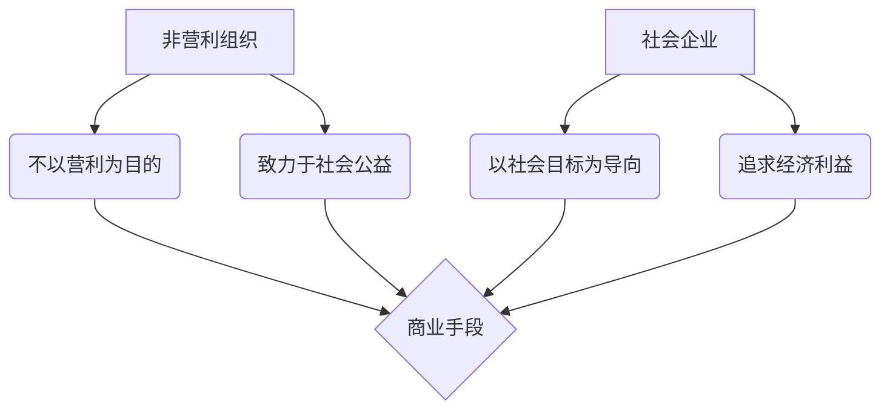

---

#### 第2章：非营利组织的历史与发展

**2.1 非营利组织的起源与发展**

非营利组织起源于古代的慈善活动和宗教组织。在中世纪，教会和慈善机构承担了大量的社会救助工作。近代以来，随着工业革命和社会变革，非营利组织逐渐发展壮大。

**图 2-1 非营利组织的发展历程**

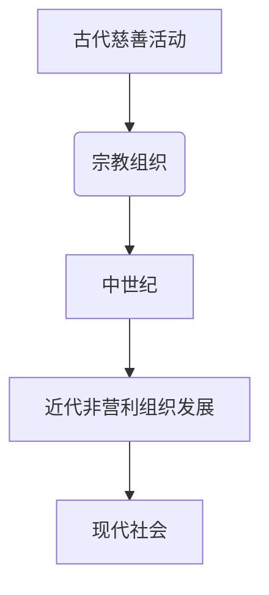

**2.2 国际非营利组织的发展趋势**

国际非营利组织的发展趋势表现为：

- **多元化**：非营利组织在领域和形式上日益多元化，涵盖了环境保护、人权保护、公共卫生等多个方面。
- **全球化**：随着全球化的加深，国际非营利组织之间的合作与交流日益频繁。
- **技术创新**：互联网和大数据等技术的应用，为非营利组织的运营和活动带来了新的机遇。

**2.3 中国非营利组织的发展现状与挑战**

中国非营利组织的发展现状：

- **快速发展**：近年来，中国非营利组织数量迅速增长，涉及领域广泛。
- **政策支持**：政府出台了一系列政策，支持非营利组织的发展。

中国非营利组织面临的挑战：

- **法律环境**：非营利组织在法律地位、注册程序等方面仍存在一定的不确定性。
- **资金问题**：非营利组织在资金来源、财务管理等方面面临较大压力。
- **人才缺乏**：高素质的非营利组织管理人才和专业人员较为缺乏。

---

### 第二部分：非营利组织创业

#### 第3章：非营利组织创业的概念与理念

**3.1 非营利组织创业的定义**

非营利组织创业是指以创新的方式，通过建立新的非营利组织或改进现有组织，以实现特定的社会公益目标的过程。

**3.2 非营利组织创业的核心价值观**

非营利组织创业的核心价值观包括：

- **公益导向**：以解决社会问题、促进社会进步为目标。
- **透明度**：组织运营和管理公开透明，接受社会监督。
- **可持续性**：确保组织长期稳定发展，实现可持续发展目标。
- **创新性**：采用创新的思维和方法，提高组织效率和社会影响力。

**3.3 非营利组织创业的创新性**

非营利组织创业的创新性体现在以下几个方面：

- **理念创新**：打破传统思维，以新的视角和理念面对社会问题。
- **模式创新**：探索新的运营模式，提高组织效率和资源利用率。
- **技术创新**：运用新技术，如互联网、大数据等，提高组织运营效能。

---

#### 第4章：非营利组织创业的流程与策略

**4.1 非营利组织创业的流程**

非营利组织创业的流程主要包括以下步骤：

1. **项目构思**：确定社会问题和目标，构思创业项目。
2. **团队组建**：组建具有专业背景和管理经验的核心团队。
3. **市场调研**：了解市场需求，分析竞争对手，确定市场定位。
4. **项目策划**：制定详细的项目计划，包括目标、任务、预算等。
5. **注册成立**：按照相关法律法规，完成注册成立程序。
6. **运营管理**：确保项目按计划实施，进行日常管理和协调。
7. **评估与调整**：定期对项目进行评估，根据评估结果进行调整。

**图 4-1 非营利组织创业流程**

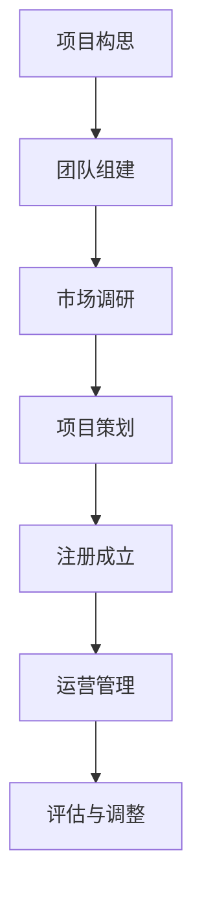

**4.2 非营利组织创业的SWOT分析**

非营利组织创业的SWOT分析包括以下几个方面：

- **优势（Strengths）**：具有公益性质，容易获得社会认同和支持；可以通过创新方式解决社会问题。
- **劣势（Weaknesses）**：资金来源有限，运营成本较高；法律环境尚不完善，存在一定的不确定性。
- **机会（Opportunities）**：随着社会问题的日益凸显，非营利组织的需求不断增长；互联网和大数据等新技术的应用，为非营利组织提供了新的发展机遇。
- **威胁（Threats）**：社会竞争日益激烈，非营利组织面临更大的压力；政策变化可能对非营利组织产生不利影响。

**图 4-2 非营利组织创业的SWOT分析**

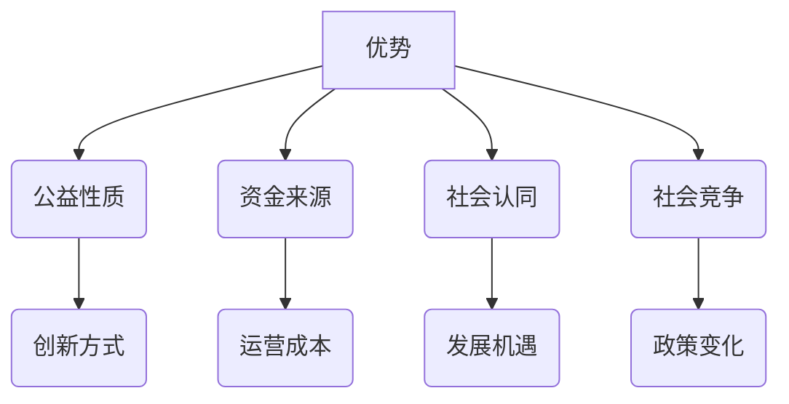

**4.3 非营利组织创业的市场定位**

非营利组织创业的市场定位主要包括以下几个方面：

- **目标受众**：明确项目的目标受众，了解其需求和痛点。
- **市场细分**：根据目标受众的特点，对市场进行细分，制定针对性的营销策略。
- **竞争优势**：分析竞争对手的优势和劣势，确定自身的竞争优势。
- **品牌建设**：建立良好的品牌形象，提高社会认同度和影响力。

---

#### 第5章：非营利组织创业的财务管理

**5.1 非营利组织创业的财务模式**

非营利组织创业的财务模式主要包括以下几个方面：

- **资金来源**：包括政府拨款、企业赞助、社会捐赠、项目收入等。
- **资金使用**：根据项目计划和实际需要，合理使用资金，确保项目顺利实施。
- **成本控制**：通过有效的成本控制，提高资金使用效率。

**图 5-1 非营利组织创业的财务模式**

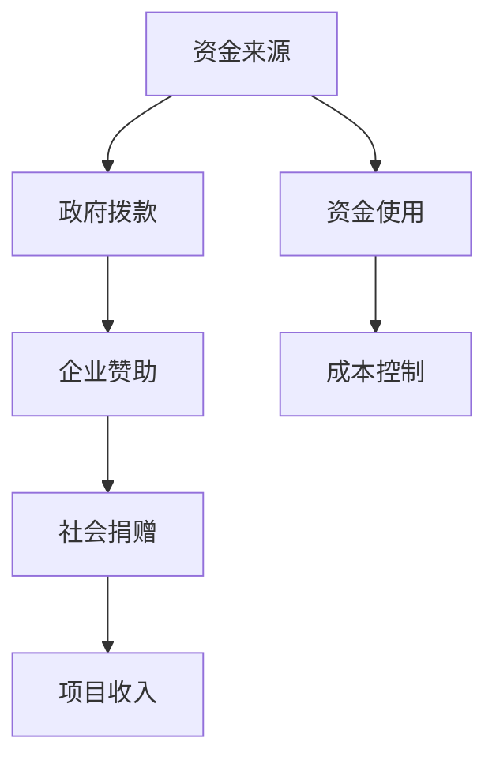

**5.2 非营利组织创业的预算管理**

非营利组织创业的预算管理主要包括以下几个方面：

- **预算编制**：根据项目计划，编制详细的预算方案。
- **预算执行**：严格按照预算执行，确保项目按计划进行。
- **预算调整**：根据项目实际情况，及时调整预算。

**图 5-2 非营利组织创业的预算管理流程**

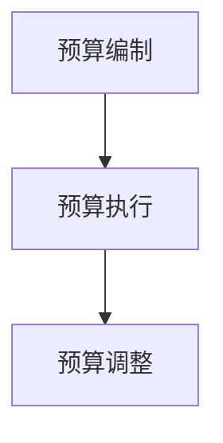

**5.3 非营利组织创业的财务分析**

非营利组织创业的财务分析主要包括以下几个方面：

- **收入分析**：分析项目的收入来源和结构，了解项目盈利能力。
- **成本分析**：分析项目的成本构成和分布，了解项目成本控制情况。
- **盈利能力分析**：通过收入和成本的比较，评估项目的盈利能力。

**图 5-3 非营利组织创业的财务分析**

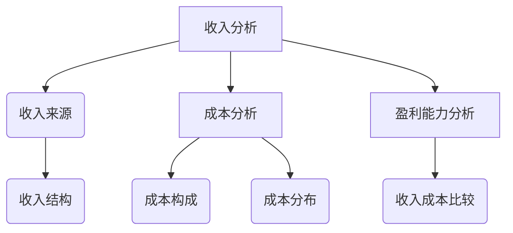

---

#### 第6章：非营利组织创业的资源获取

**6.1 政府资金支持**

非营利组织创业的政府资金支持主要包括以下几个方面：

- **政府拨款**：政府通过拨款的方式，支持非营利组织的项目和发展。
- **政府补贴**：政府通过补贴的方式，降低非营利组织的运营成本。
- **政府采购**：政府通过购买服务的方式，购买非营利组织的公共服务。

**图 6-1 政府资金支持方式**

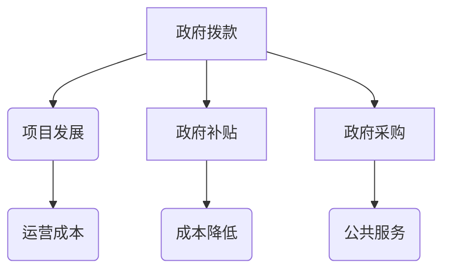

**6.2 企业赞助与合作**

非营利组织创业的企业赞助与合作主要包括以下几个方面：

- **品牌赞助**：企业通过品牌赞助的方式，支持非营利组织的项目。
- **技术支持**：企业提供技术支持，帮助非营利组织提升运营效率。
- **人才合作**：企业与高校、科研机构等合作，共同培养非营利组织所需的人才。

**图 6-2 企业赞助与合作方式**

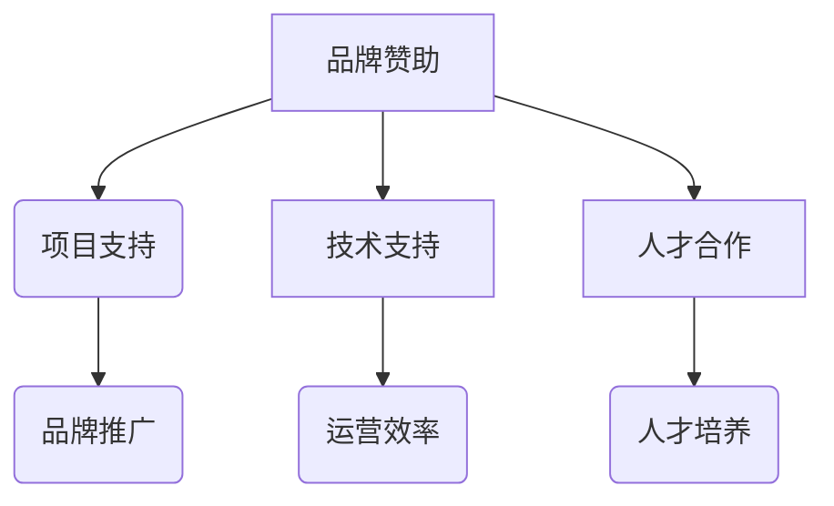

**6.3 社会公众捐赠**

非营利组织创业的社会公众捐赠主要包括以下几个方面：

- **个人捐赠**：社会公众通过捐款、捐赠物品等方式，支持非营利组织的项目。
- **公益众筹**：通过公益众筹平台，向社会公众募集资金，支持非营利组织的项目。
- **公益活动**：通过举办公益活动，提高社会公众对非营利组织的关注度和捐赠意愿。

**图 6-3 社会公众捐赠方式**

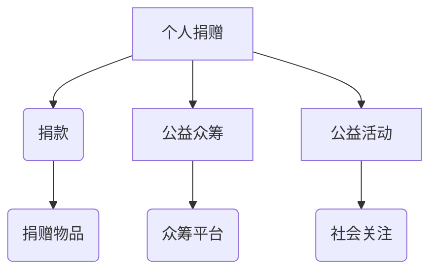

---

### 第三部分：创新解决社会问题

#### 第7章：创新理念与社会问题

**7.1 创新的定义与类型**

创新是指通过引入新的思想、方法、产品或服务，创造新的价值，解决现有问题或满足新的需求的过程。创新可以分为以下几种类型：

- **产品创新**：指通过引入新的产品或改进现有产品，满足市场需求。
- **服务创新**：指通过引入新的服务或改进现有服务，提高服务质量。
- **业务模式创新**：指通过引入新的业务模式，改变企业的运营方式和盈利模式。
- **管理创新**：指通过引入新的管理理念和方法，提高企业的管理效率和竞争力。

**7.2 创新与社会问题的关系**

创新与社会问题的关系体现在以下几个方面：

- **解决现有问题**：创新可以创造新的解决方案，解决社会面临的各种问题，如环境污染、资源短缺等。
- **激发社会活力**：创新可以激发社会的创造力和活力，推动社会进步和变革。
- **提高生活质量**：创新可以提供更好的产品和服务，提高人们的生活质量。

**7.3 创新的社会责任**

创新的社会责任体现在以下几个方面：

- **解决社会问题**：创新应该致力于解决社会面临的各种问题，如贫困、疾病、环境污染等。
- **促进社会公平**：创新应该关注弱势群体，推动社会公平和公正。
- **保护生态环境**：创新应该考虑环境因素，推动可持续发展。

---

#### 第8章：创新方法与社会问题解决

**8.1 设计思维在非营利组织中的应用**

设计思维（Design Thinking）是一种以人为中心，通过迭代创新方法解决复杂问题的过程。在非营利组织中，设计思维可以应用于以下几个方面：

- **问题定义**：通过深入了解目标受众的需求和痛点，明确要解决的问题。
- **创意生成**：通过头脑风暴和创意生成方法，提出各种可能的解决方案。
- **原型设计**：通过快速原型设计，验证解决方案的可行性和有效性。
- **测试与反馈**：通过测试和用户反馈，不断优化解决方案，提高用户体验。

**图 8-1 设计思维在非营利组织中的应用**

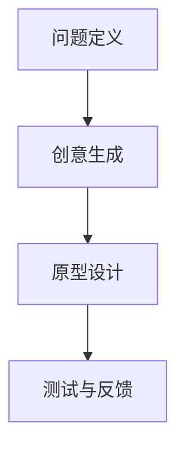

**8.2 用户研究与需求分析**

用户研究与需求分析是创新过程中至关重要的一环。在非营利组织中，进行用户研究与需求分析的方法包括：

- **访谈**：通过与目标用户进行深入访谈，了解其需求和期望。
- **问卷调查**：通过问卷调查，收集大量用户数据，进行分析和归纳。
- **观察**：通过现场观察，了解用户在使用产品或服务时的行为和反应。
- **用户体验测试**：通过用户体验测试，评估产品或服务的可用性和用户满意度。

**图 8-2 用户研究与需求分析的方法**

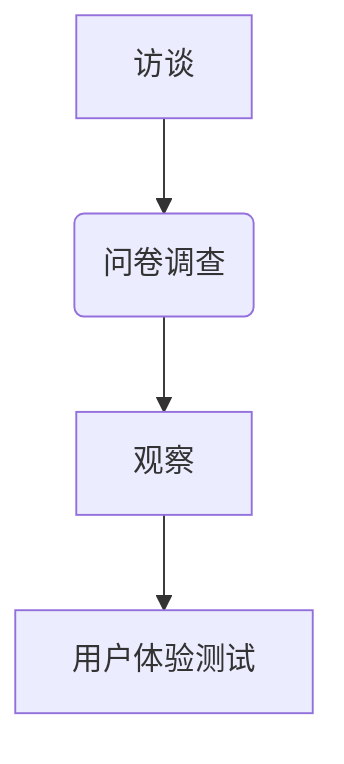

**8.3 创新解决方案的设计与实施**

创新解决方案的设计与实施主要包括以下几个方面：

- **设计原则**：根据用户研究和需求分析的结果，制定设计原则，确保解决方案的可行性和用户体验。
- **设计框架**：构建设计框架，明确项目目标和关键功能模块。
- **原型开发**：快速开发原型，验证设计方案的可行性和用户体验。
- **迭代优化**：根据用户反馈，不断优化原型，直至满足用户需求和期望。

**图 8-3 创新解决方案的设计与实施**


---

#### 第9章：案例研究与启示

**9.1 国内外非营利组织创新案例**

国内外非营利组织创新案例众多，以下是其中几个典型的案例：

- **绿色和平组织**：通过创新的方式，推动全球环境治理。其成功之处在于充分利用互联网和社交媒体，提高社会影响力和公众参与度。
- **国际红十字会**：在灾难救援和医疗援助方面，创新了救助模式和流程，提高了救援效率和受援者的满意度。
- **中国扶贫基金会**：通过互联网公益平台，将社会资源和贫困地区需求有效对接，实现精准扶贫。

**9.2 案例分析：成功与失败的原因**

案例分析发现，非营利组织创新的成功与失败主要受以下因素影响：

- **项目定位**：明确的项目定位是创新成功的前提。成功的案例通常具有清晰的目标和受众，而失败的案例则往往缺乏明确的定位。
- **团队能力**：具有专业背景和管理经验的团队是创新成功的关键。成功的案例通常拥有高素质的团队，而失败的案例则团队能力不足。
- **资源获取**：有效的资源获取是创新成功的重要保障。成功的案例通常能够充分利用政府、企业和社会资源，而失败的案例则资源获取困难。
- **用户反馈**：用户反馈是优化创新方案的重要依据。成功的案例通常重视用户反馈，不断调整和优化方案，而失败的案例则忽视用户反馈。

**9.3 启示与借鉴**

从国内外非营利组织创新案例中，我们可以得到以下启示和借鉴：

- **注重用户需求**：深入了解目标受众的需求和期望，确保创新方案的针对性和实用性。
- **团队协作**：建立专业背景和管理经验丰富的团队，提高项目执行效率。
- **资源整合**：充分利用政府、企业和社会资源，提高创新方案的可行性和影响力。
- **持续优化**：重视用户反馈，不断调整和优化创新方案，确保其长期稳定发展。

---

### 第四部分：非营利组织创业与管理

#### 第10章：非营利组织创业团队建设

**10.1 团队建设的重要性**

非营利组织创业团队建设的重要性体现在以下几个方面：

- **协同合作**：良好的团队建设能够促进团队成员之间的协同合作，提高项目执行效率。
- **创新能力**：团队建设有助于激发团队成员的创新思维，推动项目的持续创新。
- **管理效率**：团队建设能够提高管理效率，降低管理成本。
- **可持续发展**：团队建设有助于确保非营利组织的长期稳定发展。

**10.2 团队成员的角色与职责**

非营利组织创业团队成员的角色与职责主要包括：

- **项目经理**：负责项目整体规划和执行，确保项目按计划进行。
- **技术专家**：负责技术方案的设计和实施，确保项目的技术可行性。
- **市场营销**：负责市场调研、品牌推广和用户招募，提高项目知名度。
- **财务经理**：负责财务预算、资金管理和成本控制，确保项目财务稳定。
- **运营专员**：负责项目日常运营和管理，确保项目顺利进行。

**10.3 团队沟通与协作**

团队沟通与协作是团队建设的关键。良好的沟通与协作包括以下几个方面：

- **明确沟通目标**：确保团队成员了解沟通的目标和意义，提高沟通效率。
- **建立沟通渠道**：建立有效的沟通渠道，如会议、邮件、即时通讯等，确保信息传递畅通。
- **倾听与反馈**：倾听团队成员的意见和反馈，尊重不同观点，促进团队协作。
- **定期回顾**：定期对团队工作进行回顾和总结，及时发现和解决问题。

---

#### 第11章：非营利组织创业风险管理

**11.1 风险管理的重要性**

非营利组织创业风险管理的重要性体现在以下几个方面：

- **保障项目顺利进行**：风险管理能够识别和评估潜在风险，提前采取应对措施，降低项目失败的风险。
- **提高组织韧性**：通过风险管理，非营利组织能够提高应对突发事件和外部环境变化的能力，增强组织韧性。
- **保障资金安全**：风险管理有助于确保项目资金的安全，防止资金浪费和滥用。

**11.2 风险识别与评估**

风险识别与评估是风险管理的第一步。具体方法包括：

- **头脑风暴**：通过团队成员的头脑风暴，收集潜在风险。
- **风险矩阵**：根据风险发生的概率和影响程度，构建风险矩阵，评估风险优先级。
- **SWOT分析**：结合非营利组织的优势、劣势、机会和威胁，识别潜在风险。

**图 11-1 风险识别与评估方法**

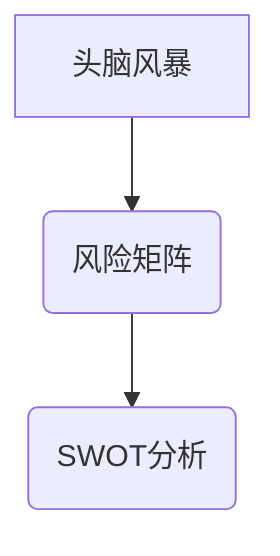

**11.3 风险应对与控制**

风险应对与控制是风险管理的核心。具体措施包括：

- **风险规避**：通过调整项目计划，避免风险的发生。
- **风险转移**：通过购买保险等方式，将风险转移给第三方。
- **风险缓解**：通过制定应急预案，降低风险发生的概率和影响程度。
- **风险接受**：对于无法规避或转移的风险，制定应对策略，确保项目顺利进行。

**图 11-2 风险应对与控制措施**

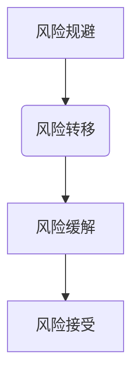

---

#### 第12章：非营利组织创业的法律环境

**12.1 非营利组织创业的法律要求**

非营利组织创业的法律要求主要包括以下几个方面：

- **注册登记**：根据相关法律法规，非营利组织需要向政府有关部门进行注册登记，取得合法身份。
- **财务管理**：非营利组织需要建立健全的财务管理制度，确保资金使用的合法性和透明度。
- **信息公开**：非营利组织需要定期向社会公开财务和项目进展情况，接受社会监督。
- **税收优惠**：非营利组织符合相关条件的，可以享受税收优惠，降低运营成本。

**图 12-1 非营利组织创业的法律要求**

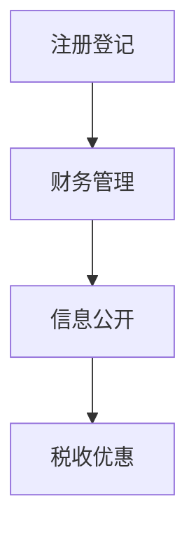

**12.2 社会组织登记与许可**

社会组织登记与许可主要包括以下几个方面：

- **登记机关**：根据相关法律法规，非营利组织需要向县级以上的民政部门进行登记。
- **登记材料**：非营利组织需要提交相关登记材料，如章程、注册资金证明、法定代表人身份证明等。
- **许可要求**：根据项目性质，非营利组织可能需要获得相关部门的许可，如环保许可、消防许可等。

**图 12-2 社会组织登记与许可流程**


**12.3 非营利组织创业的法律风险防范**

非营利组织创业的法律风险防范主要包括以下几个方面：

- **合规审查**：在项目启动前，对项目涉及的法律法规进行合规审查，确保项目合法合规。
- **合同管理**：建立健全的合同管理制度，明确双方权利和义务，降低合同纠纷风险。
- **风险预警**：建立风险预警机制，及时识别和报告潜在的法律风险。
- **法律咨询**：聘请专业律师，提供法律咨询和风险管理建议。

**图 12-3 非营利组织创业的法律风险防范措施**

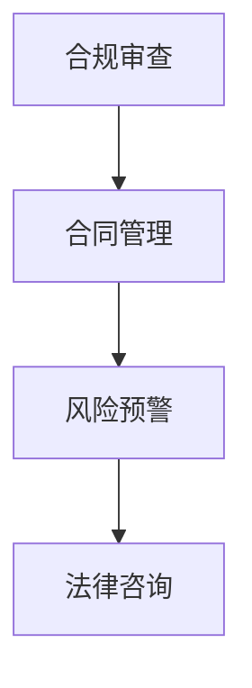

---

### 第五部分：未来展望

#### 第13章：非营利组织创业的发展趋势

**13.1 科技与社会的深度融合**

未来，科技与社会的深度融合将进一步推动非营利组织创业的发展。人工智能、大数据、区块链等新技术将广泛应用于非营利组织，提高其运营效率和社会影响力。

**图 13-1 科技与社会的深度融合**

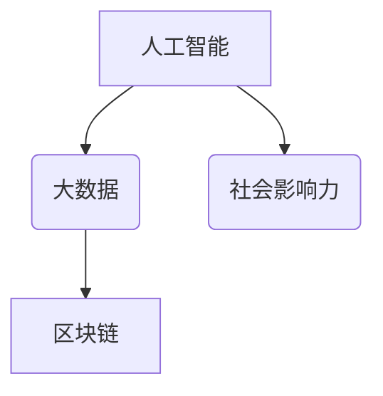

**13.2 社会问题的多样性与复杂性**

随着社会问题的日益多样化和复杂性，非营利组织创业将面临更大的挑战。如何应对气候变化、人口老龄化、社会不平等等问题，将成为非营利组织创业的重要课题。

**图 13-2 社会问题的多样性与复杂性**

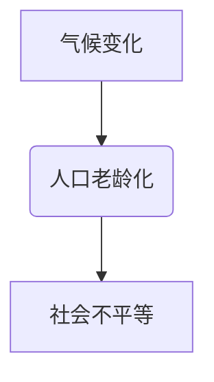

**13.3 非营利组织创业的未来方向**

未来，非营利组织创业将朝着以下方向发展：

- **跨界合作**：非营利组织将加强与政府、企业、学术机构等各方的合作，实现资源整合和优势互补。
- **数字化运营**：非营利组织将广泛应用数字化手段，提高运营效率和服务水平。
- **可持续发展**：非营利组织将更加注重可持续发展，推动绿色环保、节能减排等社会目标的实现。

**图 13-3 非营利组织创业的未来方向**

```mermaid
graph TD
A[跨界合作] --> B(数字化运营)
B --> C[可持续发展]
```

---

#### 第14章：非营利组织创业的全球视野

**14.1 全球非营利组织创业的发展动态**

全球非营利组织创业的发展动态包括以下几个方面：

- **政策支持**：各国政府纷纷出台政策，支持非营利组织创业，如税收优惠、资金支持等。
- **技术创新**：非营利组织广泛应用新技术，如人工智能、区块链等，提高运营效率和社会影响力。
- **国际合作**：非营利组织加强国际合作，共同应对全球性社会问题。

**图 14-1 全球非营利组织创业的发展动态**

```mermaid
graph TD
A[政策支持] --> B(技术创新)
B --> C[国际合作]
```

**14.2 国际合作与交流**

国际合作与交流是非营利组织创业的重要方向。具体包括：

- **项目合作**：非营利组织通过项目合作，共同应对全球性社会问题。
- **人员交流**：通过人员交流，学习借鉴国际先进经验，提高自身能力。
- **资金支持**：通过国际合作，争取更多资金支持，推动项目发展。

**图 14-2 国际合作与交流**

```mermaid
graph TD
A[项目合作] --> B(人员交流)
B --> C[资金支持]
```

**14.3 中国非营利组织创业的国际机遇**

中国非营利组织创业面临以下国际机遇：

- **一带一路**：随着“一带一路”倡议的推进，中国非营利组织可以加强与沿线国家的合作，共同推进社会事业的发展。
- **全球治理**：在全球治理领域，中国非营利组织可以积极参与，为全球治理贡献智慧和力量。
- **国际交流**：通过国际交流和合作，提升中国非营利组织的国际影响力和话语权。

**图 14-3 中国非营利组织创业的国际机遇**

```mermaid
graph TD
A[一带一路] --> B(全球治理)
B --> C[国际交流]
```

---

#### 第15章：非营利组织创业的可持续发展

**15.1 可持续发展的内涵与目标**

可持续发展是指满足当代人的需求，不损害后代人满足其需求的能力的发展模式。非营利组织创业的可持续发展目标包括：

- **社会目标**：解决社会问题，促进社会公平和正义。
- **环境目标**：保护生态环境，推动绿色发展和生态文明建设。
- **经济目标**：实现经济效益，提高组织自身的发展能力和可持续性。

**图 15-1 可持续发展的内涵与目标**

```mermaid
graph TD
A[社会目标] --> B(环境目标)
B --> C(经济目标)
```

**15.2 非营利组织创业的可持续发展策略**

非营利组织创业的可持续发展策略包括：

- **创新驱动**：通过技术创新和管理创新，提高组织运营效率和服务水平。
- **资源整合**：充分利用政府、企业和社会资源，实现资源最大化利用。
- **公众参与**：鼓励公众参与，提高社会认同度和支持度。
- **社会责任**：履行社会责任，推动社会进步和可持续发展。

**图 15-2 非营利组织创业的可持续发展策略**

```mermaid
graph TD
A[创新驱动] --> B(资源整合)
B --> C[公众参与]
C --> D[社会责任]
```

**15.3 社会责任与可持续发展**

社会责任与可持续发展密切相关。非营利组织创业需要关注以下社会责任：

- **环保责任**：关注环保问题，推动绿色发展和生态文明建设。
- **慈善责任**：积极参与公益事业，帮助弱势群体，促进社会公平和正义。
- **道德责任**：遵守法律法规，遵循职业道德，树立良好的社会形象。

**图 15-3 社会责任与可持续发展**

```mermaid
graph TD
A[环保责任] --> B(慈善责任)
B --> C[道德责任]
```

---

## 结论

非营利组织创业是一种重要的社会创新方式，通过创新解决社会问题，推动社会进步。本文从非营利组织的定义、创业理念、流程、财务管理、资源获取、创新方法、团队建设、风险管理、法律环境、未来展望等方面进行了详细探讨。希望本文能够为非营利组织创业者提供有益的指导，共同推动社会事业的可持续发展。

---

### 作者信息

**作者：AI天才研究院/AI Genius Institute & 禅与计算机程序设计艺术 /Zen And The Art of Computer Programming**

---

至此，本文《非营利组织创业指南：用创新解决社会问题》已撰写完成。希望本文能够为非营利组织创业者提供有价值的参考和启示，助力他们在创新解决社会问题的道路上取得更大的成就。

