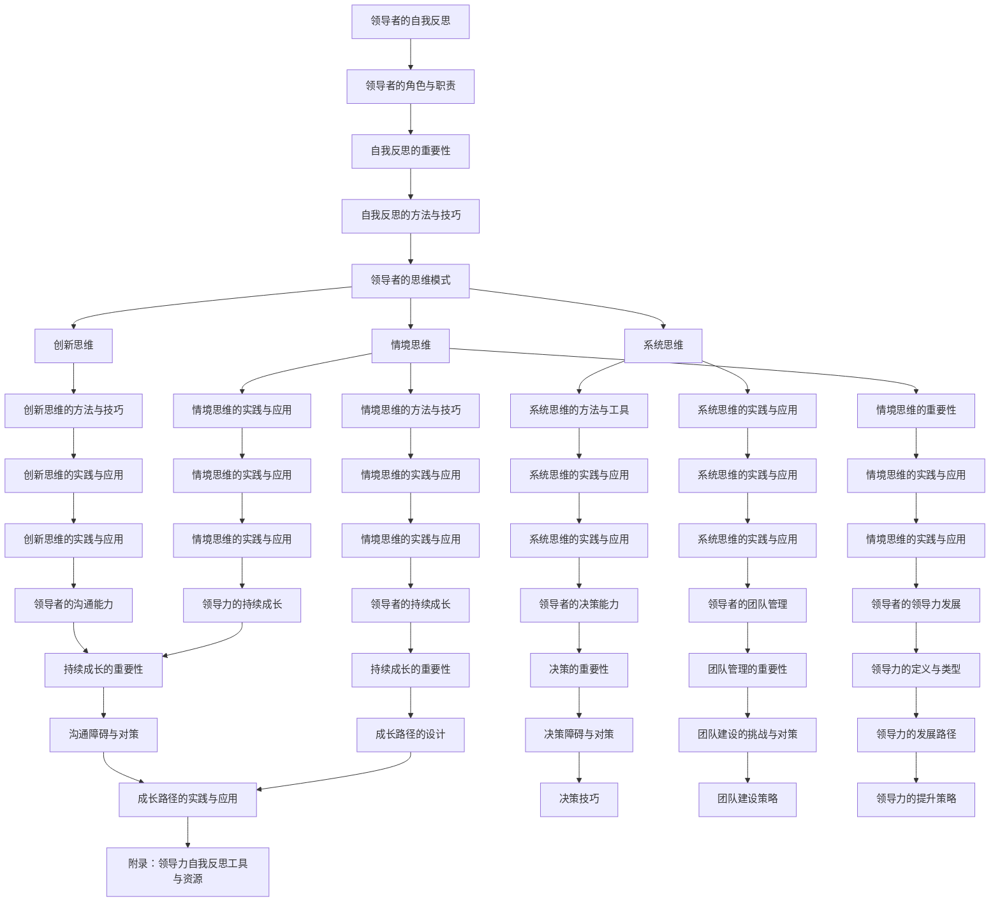

                 

# 《领导者的自我反思：持续成长的关键》

> **关键词：** 领导力、自我反思、持续成长、沟通能力、决策能力、团队管理

> **摘要：** 本文章从领导者的角色与职责出发，探讨了自我反思在领导者持续成长中的重要性。通过分析领导者的思维模式，本文深入探讨了创新思维、系统思维和情境思维的具体方法与实践。同时，文章还详细论述了领导者的沟通能力、决策能力和团队管理能力的提升策略，以及领导力的持续成长路径。通过数学模型、伪代码和项目实战等多个角度，本文旨在为领导者提供一套系统、全面的自我反思与持续成长的方法论。

## 《领导者的自我反思：持续成长的关键》目录大纲

### 第一部分：领导者的自我反思基础

#### 第1章：领导者的成长之路

#### 第2章：领导者的思维模式

### 第二部分：领导者自我反思的关键领域

#### 第3章：领导者的沟通能力

#### 第4章：领导者的决策能力

#### 第5章：领导者的团队管理

#### 第6章：领导者的领导力发展

#### 第7章：领导者的持续成长

### 附录：领导力自我反思工具与资源

### 附录A：领导力自我反思工具

### 附录B：领导力发展资源

### 附录C：领导力社群推荐

### 附录D：领导者的成长路径

## 第一部分：领导者的自我反思基础

### 第1章：领导者的成长之路

#### 1.1 领导者的角色与职责

##### 1.1.1 领导者的定义与特质

领导者是组织中的关键角色，他们不仅仅是执行者，更是引导者和协调者。领导者的核心任务是激励和指导团队成员，以实现组织的目标。

**领导者特质：**

- **愿景**：领导者需要有明确的愿景，这不仅能指导他们的决策，还能激励团队成员。

- **决策能力**：领导者需要在复杂环境中做出快速、明智的决策。

- **沟通能力**：良好的沟通能力是领导者成功的关键，包括倾听、表达和反馈。

- **团队合作**：领导者需要能够建立并管理一个高效的团队。

- **道德和诚信**：领导者应该具备高尚的道德标准和诚信，赢得团队成员的信任。

##### 1.1.2 领导者的角色与职责

**领导者的角色：**

- **战略规划者**：制定组织的长期和短期目标，制定相应的战略计划。

- **团队建设者**：建立和培养高效的团队，激发团队成员的潜力。

- **变革推动者**：推动组织变革，确保组织能够适应外部环境的变化。

- **资源分配者**：合理分配组织资源，确保资源的最大化利用。

- **问题解决者**：解决组织中的问题，提供创新的解决方案。

**领导者的职责：**

- **设定目标**：明确组织的目标，并确保团队成员理解并支持这些目标。

- **规划执行**：制定详细的执行计划，确保目标的实现。

- **激励团队**：通过激励和奖励机制，激发团队成员的积极性和创造力。

- **沟通与协调**：确保团队内部和与其他部门的良好沟通和协作。

- **反馈与评估**：定期对团队成员的工作进行反馈和评估，提供改进建议。

##### 1.1.3 领导者的成长历程

**成长历程：**

- **初始阶段**：领导者需要学习和掌握基本的领导技能，包括沟通、激励和决策等。

- **发展阶段**：通过不断实践和学习，领导者逐渐形成自己的领导风格和思维方式。

- **成熟阶段**：领导者能够熟练运用各种领导技能，能够处理复杂的组织问题。

- **卓越阶段**：领导者不仅能够处理组织内的各种问题，还能引领组织不断创新和发展。

#### 1.2 自我反思的重要性

##### 1.2.1 自我反思的定义与意义

自我反思是指领导者通过审视自己的行为、思维和决策，识别自身优劣势，从而进行自我提升的过程。

**意义：**

- **提高自我认知**：自我反思帮助领导者更清晰地了解自己的优势和劣势，从而有针对性地进行改进。

- **促进个人成长**：自我反思是领导者持续成长的重要手段，通过不断反思和改进，领导者能够不断提高自己的能力和素质。

- **提升领导力**：自我反思有助于领导者发现自己的领导风格和思维方式，从而优化领导行为，提升整体领导力。

##### 1.2.2 自我反思的方法与技巧

**方法：**

- **定期回顾**：领导者可以定期回顾自己的工作表现，总结经验教训。

- **反思日志**：记录自己的工作过程和心得体会，有助于深入思考。

- **求助外部反馈**：通过团队成员或其他领导者的反馈，了解自己的工作表现。

- **案例分析**：通过分析具体案例，深入探讨问题的根源和解决方法。

**技巧：**

- **保持开放心态**：对待自我反思应持开放态度，勇于面对自己的不足。

- **持续学习**：不断学习新知识、新技能，以提升自我。

- **实践应用**：将反思结果应用于实际工作中，不断实践和改进。

##### 1.2.3 自我反思的实践与应用

**实践与应用：**

- **领导力发展计划**：制定个人领导力发展计划，明确目标和行动计划。

- **团队建设活动**：通过团队建设活动，提升团队凝聚力和合作效率。

- **领导力培训**：参加领导力培训课程，学习先进的领导理念和方法。

- **案例分析**：通过具体案例的分析，提升解决实际问题的能力。

### 第2章：领导者的思维模式

#### 2.1 创新思维

##### 2.1.1 创新思维的重要性

创新思维是领导者成功的关键因素之一。它不仅能够推动组织的变革和发展，还能提升组织的竞争力。

**重要性：**

- **推动组织发展**：创新思维能够帮助领导者找到新的发展机遇，推动组织的持续发展。

- **提升组织竞争力**：创新思维能够帮助领导者找到新的市场机会，提升组织的竞争力。

- **激发团队潜力**：创新思维能够激发团队成员的创造力，提升团队的执行力和创新能力。

##### 2.1.2 创新思维的方法

**方法：**

- **头脑风暴**：通过集体讨论，激发团队成员的创新思维。

- **思维导图**：通过绘制思维导图，梳理和展示创意思维的过程。

- **跨学科思维**：结合不同领域的知识，进行跨学科的创新思考。

- **原型迭代**：通过快速迭代和原型测试，不断优化和改进创新想法。

##### 2.1.3 创新思维的实践与应用

**实践与应用：**

- **创新项目**：建立创新项目团队，定期进行创新项目的研究和开发。

- **创新文化**：营造创新文化，鼓励团队成员提出创新想法。

- **创新激励机制**：建立创新激励机制，激励团队成员积极参与创新活动。

#### 2.2 系统思维

##### 2.2.1 系统思维的定义与特点

系统思维是一种综合考虑各个部分之间相互关系的思维方式。它强调整体性、动态性和相互依赖性。

**定义：**

系统思维是一种理解复杂系统的本质和运行规律的方法，它强调各个部分之间的相互关系和整体性。

**特点：**

- **整体性**：系统思维关注整体而非局部，强调各个部分之间的相互关系。

- **动态性**：系统思维认识到系统是动态变化的，而非静态不变的。

- **相互依赖性**：系统思维强调各个部分之间的相互依赖和相互作用。

##### 2.2.2 系统思维的方法与工具

**方法与工具：**

- **SWOT分析**：通过分析组织的优势、劣势、机会和威胁，制定相应的策略。

- **因果分析图**：通过绘制因果分析图，分析问题的根本原因。

- **系统动力学**：通过构建系统动力学模型，模拟系统的运行过程。

- **平衡计分卡**：通过平衡不同维度的指标，实现组织的全面绩效管理。

##### 2.2.3 系统思维的实践与应用

**实践与应用：**

- **战略规划**：运用系统思维进行战略规划，确保各项战略目标的一致性和可行性。

- **风险管理**：通过系统思维识别和管理风险，确保组织的稳定运营。

- **组织变革**：运用系统思维推动组织变革，实现组织的持续发展。

#### 2.3 情境思维

##### 2.3.1 情境思维的重要性

情境思维是一种考虑问题背景和环境因素的思维方式。它能够帮助领导者更好地应对复杂多变的环境。

**重要性：**

- **适应环境**：情境思维帮助领导者更好地适应不同的环境，提高决策的准确性。

- **提高灵活性**：情境思维使领导者能够灵活应对变化，提高组织的应变能力。

- **增强洞察力**：情境思维帮助领导者从不同角度看待问题，提高洞察力和判断力。

##### 2.3.2 情境思维的方法与技巧

**方法与技巧：**

- **环境分析**：通过分析外部环境和内部条件，了解问题的背景和影响因素。

- **角色扮演**：通过角色扮演，从不同角度考虑问题，提高情境意识。

- **情景模拟**：通过情景模拟，预测可能的结果和影响，为决策提供依据。

- **经验总结**：通过总结经验，提高对情境的判断和应对能力。

##### 2.3.3 情境思维的实践与应用

**实践与应用：**

- **环境分析**：定期进行环境分析，了解市场趋势和竞争态势。

- **情景模拟**：通过情景模拟，制定应对不同情境的应对策略。

- **经验分享**：通过经验分享，提高团队成员的情境意识和应对能力。

## 第二部分：领导者自我反思的关键领域

### 第3章：领导者的沟通能力

#### 3.1 沟通的重要性

##### 3.1.1 沟通的定义与类型

沟通是领导者不可或缺的技能，它指的是信息的传递和交流。有效的沟通不仅能够促进团队协作，还能提高决策质量和执行效率。

**定义：**

沟通是一种信息的传递和交流过程，它包括信息的发出、传递、接收和反馈。

**类型：**

- **单向沟通**：信息从发送者直接传递到接收者，没有反馈。

- **双向沟通**：信息在发送者和接收者之间进行交流，包括反馈。

- **垂直沟通**：信息在组织内部的上下级之间传递。

- **水平沟通**：信息在同一级别的团队成员之间传递。

##### 3.1.2 沟通的目的与原则

**目的：**

- **信息传递**：确保信息准确无误地传递给目标接收者。

- **意见交流**：促进团队成员之间的意见交流，形成共识。

- **决策支持**：为决策提供准确、全面的信息支持。

- **团队协作**：提高团队成员之间的协作效率，实现共同目标。

**原则：**

- **明确性**：沟通内容应明确、简洁，避免歧义。

- **准确性**：确保信息的准确性，避免误传。

- **及时性**：及时沟通，避免信息滞后。

- **完整性**：确保沟通内容完整，包括背景、目的和预期结果。

- **反馈性**：建立反馈机制，确保信息传递的准确性。

##### 3.1.3 沟通的障碍与对策

**障碍：**

- **语言障碍**：不同地区、文化背景的成员可能存在语言障碍。

- **信息过载**：过多的信息可能导致沟通效率降低。

- **情绪干扰**：情绪波动可能影响沟通的准确性和效果。

- **组织结构**：复杂的组织结构可能阻碍信息传递。

**对策：**

- **提高语言能力**：加强团队成员的语言培训，提高沟通效果。

- **信息筛选**：对信息进行筛选，确保沟通的效率和质量。

- **情绪管理**：通过情绪管理培训，提高团队成员的情绪调节能力。

- **简化结构**：优化组织结构，提高信息传递的效率。

#### 3.2 高效沟通技巧

##### 3.2.1 听说的艺术

**技巧：**

- **主动倾听**：积极关注对方的发言，避免打断。

- **理解表达**：确保理解对方的观点和意图。

- **反馈确认**：通过反馈确认，确保信息准确无误。

- **开放式提问**：通过开放式提问，引导对方更深入地表达。

##### 3.2.2 表达的技巧

**技巧：**

- **简洁明了**：用简洁明了的语言表达观点。

- **逻辑清晰**：确保表达的内容具有逻辑性。

- **重点突出**：突出重点，避免信息过载。

- **情绪控制**：在表达时保持冷静，避免情绪干扰。

##### 3.2.3 高效沟通的实践与应用

**实践与应用：**

- **团队会议**：在团队会议中，运用高效沟通技巧，提高会议效率。

- **一对一沟通**：与团队成员进行一对一沟通，了解他们的需求和意见。

- **跨部门合作**：在跨部门合作中，运用高效沟通技巧，确保项目顺利进行。

### 第4章：领导者的决策能力

#### 4.1 决策的重要性

##### 4.1.1 决策的定义与过程

决策是领导者的一项核心能力，它涉及到目标的确定、信息的收集、方案的评估和选择。

**定义：**

决策是领导者根据目标和条件，选择最佳行动方案的过程。

**过程：**

1. **问题识别**：识别需要解决的问题或机会。

2. **信息收集**：收集与问题相关的信息。

3. **方案评估**：评估各种可能的行动方案。

4. **选择方案**：选择最佳的行动方案。

5. **执行决策**：实施决策，并监控执行过程。

##### 4.1.2 决策的目的与原则

**目的：**

- **解决问题**：通过决策，解决组织面临的问题。

- **抓住机会**：通过决策，抓住市场机遇，推动组织发展。

- **资源优化**：通过决策，合理配置和利用资源。

**原则：**

- **理性决策**：基于事实和数据，避免主观臆断。

- **全面考虑**：考虑各种可能的方案和影响。

- **权衡利弊**：权衡各种方案的优缺点，选择最佳方案。

- **灵活调整**：在执行过程中，根据实际情况进行调整。

##### 4.1.3 决策的障碍与对策

**障碍：**

- **信息不足**：缺乏足够的信息，导致决策困难。

- **时间压力**：决策时间紧迫，影响决策质量。

- **情绪干扰**：情绪波动影响决策的客观性。

- **组织惯性**：组织惯性和官僚主义阻碍决策的灵活性。

**对策：**

- **信息收集**：建立有效的信息收集系统，确保信息充分。

- **时间管理**：合理安排时间，为决策留出足够的时间。

- **情绪管理**：通过情绪管理，保持决策的客观性。

- **组织变革**：推动组织变革，提高决策的灵活性。

#### 4.2 决策技巧

##### 4.2.1 数据驱动的决策

**技巧：**

- **数据收集**：收集与决策相关的数据。

- **数据分析**：运用数据分析方法，提取有用信息。

- **数据可视化**：通过数据可视化，更直观地展示数据。

- **数据驱动的分析**：基于数据进行分析，支持决策。

##### 4.2.2 创意思维的决策

**技巧：**

- **头脑风暴**：激发团队成员的创意思维。

- **思维导图**：梳理创意思维的过程。

- **跨界思考**：结合不同领域的知识，进行创新思考。

- **原型测试**：通过原型测试，验证创意的可行性。

##### 4.2.3 风险管理的决策

**技巧：**

- **风险识别**：识别决策过程中可能出现的风险。

- **风险评估**：评估各种风险的可能性和影响。

- **风险应对**：制定相应的风险应对策略。

- **风险管理**：在整个决策过程中，持续监控和管理风险。

##### 4.2.4 决策的实践与应用

**实践与应用：**

- **项目决策**：在项目决策中，运用数据驱动的决策方法，确保项目顺利进行。

- **市场决策**：在市场决策中，运用创意思维和风险管理的方法，抓住市场机遇。

- **战略决策**：在战略决策中，综合考虑各种因素，制定长期发展战略。

### 第5章：领导者的团队管理

#### 5.1 团队管理的重要性

##### 5.1.1 团队的定义与类型

团队是由多个成员组成的集体，共同实现某个目标或任务。团队可以分为以下几种类型：

- **功能型团队**：基于组织的不同功能部门组成的团队。

- **跨功能团队**：由来自不同部门的成员组成的团队，共同完成特定任务。

- **项目型团队**：为完成特定项目而组建的团队。

- **虚拟团队**：通过远程协作实现团队目标的团队。

##### 5.1.2 团队管理的基本原则

**基本原则：**

- **目标导向**：明确团队的目标，确保团队成员明确自己的职责和任务。

- **共同愿景**：建立团队的共同愿景，激发团队成员的积极性和凝聚力。

- **沟通与协作**：建立良好的沟通机制，促进团队成员之间的协作。

- **激励与反馈**：通过激励和反馈，激发团队成员的潜力，提高团队绩效。

- **持续改进**：不断反思和改进团队管理的方法和策略。

##### 5.1.3 团队管理的挑战与对策

**挑战：**

- **沟通障碍**：团队成员来自不同的背景，可能存在沟通障碍。

- **目标不一致**：团队成员的目标可能不一致，影响团队协作。

- **资源限制**：团队可能面临资源限制，影响任务的完成。

- **成员流失**：团队成员的流失可能影响团队的整体绩效。

**对策：**

- **加强沟通**：建立有效的沟通机制，确保信息的透明和畅通。

- **明确目标**：明确团队的目标，确保团队成员的目标一致。

- **资源优化**：合理配置资源，提高资源利用效率。

- **激励政策**：制定有效的激励政策，减少成员流失。

#### 5.2 团队建设策略

##### 5.2.1 团队目标的设定

**设定方法：**

- **目标明确**：确保团队目标明确、具体和可量化。

- **共同参与**：鼓励团队成员参与目标的设定，提高他们的参与感和责任感。

- **短期与长期目标结合**：设定短期目标和长期目标，确保团队既有短期成果，又有长期发展。

##### 5.2.2 团队成员的角色定位

**定位方法：**

- **能力评估**：根据团队成员的能力和特长，为他们分配合适的角色。

- **明确职责**：明确团队成员的职责，确保每个人都清楚自己的任务和责任。

- **角色调整**：根据团队目标和任务的变化，及时调整团队成员的角色。

##### 5.2.3 团队激励与沟通

**激励方法：**

- **绩效奖励**：通过绩效奖励，激励团队成员努力工作。

- **成长机会**：提供团队成员成长和发展的机会，激励他们不断提升自己。

- **团队文化**：建立积极向上的团队文化，激励团队成员为团队目标努力。

**沟通方法：**

- **定期会议**：定期召开团队会议，确保团队成员之间的沟通和协作。

- **反馈机制**：建立有效的反馈机制，确保团队成员能够及时了解自己的工作表现。

- **信息共享**：通过信息共享，提高团队成员之间的沟通效率。

##### 5.2.4 团队建设的实践与应用

**实践与应用：**

- **团队建设活动**：定期组织团队建设活动，提高团队凝聚力和协作效率。

- **团队培训**：为团队成员提供培训，提升他们的专业能力和团队协作能力。

- **团队项目**：通过实际项目，锻炼团队成员的团队合作能力。

### 第6章：领导者的领导力发展

#### 6.1 领导力的定义与类型

##### 6.1.1 领导力的定义

领导力是一种影响力，它能够激励和引导他人为实现共同目标而努力。领导力不仅仅是管理能力，更是一种关于领导行为和领导方式的概念。

##### 6.1.2 领导力的类型

**根据不同的分类标准，领导力可以分为以下类型：**

- **根据领导风格**：可以分为权威型领导、民主型领导和参与型领导。

- **根据领导行为**：可以分为变革型领导和交易型领导。

- **根据领导作用**：可以分为任务型领导、关系型领导和变革型领导。

#### 6.2 领导力的提升策略

##### 6.2.1 自我认知的提升

**策略：**

- **自我评估**：定期进行自我评估，了解自己的优势和不足。

- **反馈与建议**：寻求团队成员和其他领导的反馈，收集他们的建议。

- **心理测试**：通过心理测试，了解自己的性格特点和行为模式。

##### 6.2.2 领导风格的调整

**策略：**

- **学习先进理念**：学习先进的领导理念，了解不同领导风格的特点和适用场景。

- **观察与模仿**：观察成功领导者的行为，模仿他们的领导风格。

- **实践与反馈**：在实际工作中，尝试不同的领导风格，并根据反馈进行调整。

##### 6.2.3 领导力的实践与应用

**应用：**

- **领导力训练**：参加领导力培训，学习先进的领导方法和技巧。

- **实践与反思**：在实际工作中，不断实践领导力，并进行反思和总结。

### 第7章：领导者的持续成长

#### 7.1 持续成长的重要性

##### 7.1.1 持续成长的意义

持续成长对于领导者来说至关重要。它不仅有助于提升领导者的个人能力和素质，还能推动组织的持续发展。

**意义：**

- **适应变化**：持续成长使领导者能够适应外部环境的变化，保持组织的竞争力。

- **提升能力**：持续成长帮助领导者不断提升自己的能力和素质，更好地应对复杂的工作环境。

- **引领组织发展**：持续成长使领导者能够引领组织不断创新和发展，实现长期目标。

##### 7.1.2 持续成长的原则

**原则：**

- **学习导向**：将学习视为持续成长的核心，不断充实自己的知识和技能。

- **实践导向**：将所学知识应用到实际工作中，通过实践不断提升自己的能力。

- **反思导向**：定期反思自己的行为和决策，总结经验教训，持续改进。

- **创新导向**：鼓励创新思维，勇于尝试新方法和新策略。

##### 7.1.3 持续成长的方法

**方法：**

- **学习与培训**：参加各种学习培训，学习新的知识和技能。

- **阅读与研究**：通过阅读书籍、研究报告，了解行业动态和发展趋势。

- **交流与分享**：与同行交流，分享经验和观点，相互学习。

- **实践与反思**：将所学知识应用到实际工作中，不断反思和总结。

## 附录：领导力自我反思工具与资源

### 附录1：领导力评估工具

#### 1.1 领导力评估工具

**领导力评估工具** 是帮助领导者了解自身领导力水平的重要工具。以下是一些常用的领导力评估工具：

- **领导力360度评估**：通过收集团队成员、上级和下级的反馈，全面评估领导者的领导力。

- **领导力性格测试**：通过测试领导者的性格特点，了解其领导风格和行为模式。

- **领导力情境测试**：通过模拟不同的领导情境，评估领导者在实际工作中的表现。

#### 1.2 情商评估工具

**情商评估工具** 是帮助领导者了解自身情商水平的重要工具。以下是一些常用的情商评估工具：

- **情商量表（EQ-i 2.0）**：通过测试领导者的情商五个维度（自我意识、自我调节、社交意识、关系管理和压力管理），评估情商水平。

- **情商情境测试**：通过模拟不同的情境，评估领导者在情绪管理和人际关系处理方面的能力。

#### 1.3 创新能力评估工具

**创新能力评估工具** 是帮助领导者了解自身创新能力的重要工具。以下是一些常用的创新能力评估工具：

- **创新意识评估**：通过测试领导者的创新意识，评估其对创新的态度和认知。

- **创新思维测试**：通过测试领导者的创新思维方法，评估其创意思维和问题解决能力。

### 附录2：领导力发展资源

#### 2.1 领导力书籍推荐

以下是一些推荐的领导力书籍，有助于领导者提升自己的领导力：

- **《领导力》(Leadership) - 彼得·德鲁克**：介绍了领导力的核心概念和实践方法。

- **《变革之舞》(The Dance of Change) - 约翰·科特**：探讨了领导者在推动组织变革中的作用和方法。

- **《领导者的品质》(The Quality of Leadership) - 约翰·怀特海德**：分析了领导者所需具备的品质和特质。

#### 2.2 领导力课程推荐

以下是一些推荐的领导力课程，适合领导者提升自己的领导力：

- **“领导力发展课程”**：涵盖领导力的各个方面，包括领导风格、团队管理、决策能力等。

- **“变革型领导力课程”**：专注于变革型领导力的培养，帮助领导者推动组织变革。

- **“创新领导力课程”**：探讨创新思维和领导力的结合，激发领导者的创新能力。

#### 2.3 领导力社群推荐

以下是一些推荐的领导力社群，有助于领导者交流和分享经验：

- **“全球领导力论坛”**：一个全球性的领导力交流平台，汇集了各行业的领导者和专业人士。

- **“领导力社群”**：一个专注于领导力发展的在线社群，提供各种领导力资源和学习机会。

- **“领导力俱乐部”**：一个面对面的领导力交流平台，定期组织活动，促进领导者的交流和合作。

## Mermaid 流程图

### 领导者的成长路径



### 伪代码：领导力自我反思

```python
# 定义领导力评估工具
def 领导力评估工具():
    # 实现评估工具
    pass

# 实施自我反思
def 自我反思():
    # 实现自我反思过程
    pass

# 分析领导力思维模式
def 思维模式分析():
    # 实现思维模式分析
    pass

# 实践与应用
def 实践与应用():
    # 实现实践与应用过程
    pass

# 总结与反思
def 总结与反思():
    # 实现总结与反思
    pass
```

### 数学模型与公式

#### 领导力评估模型

$$
L = f(C, I, M)
$$

其中：
- \(L\) 代表领导力得分
- \(C\) 代表沟通能力得分
- \(I\) 代表创新能力得分
- \(M\) 代表管理能力得分

#### 成长路径设计模型

$$
P = f(G, R, T)
$$

其中：
- \(P\) 代表成长路径
- \(G\) 代表成长目标
- \(R\) 代表成长资源
- \(T\) 代表时间安排

### 项目实战

#### 案例一：领导者的沟通能力提升

**开发环境搭建：**
- 环境搭建步骤：
  1. 安装沟通技巧训练工具
  2. 配置沟通训练数据集
  3. 安装深度学习框架

**源代码实现：**
```python
# 沟通技巧提升算法实现
def 沟通技巧提升(data):
    # 数据预处理
    processed_data = 数据预处理(data)

    # 训练模型
    model = 模型训练(processed_data)

    # 模型评估
    评估结果 = 模型评估(model)

    return 评估结果
```

**代码解读与分析：**
- 代码首先进行数据预处理，包括数据清洗、格式转换等。
- 接着使用深度学习框架训练沟通技巧提升模型。
- 训练完成后，对模型进行评估，评估结果用于反馈和调整模型。

### 案例二：领导者的决策能力提升

**开发环境搭建：**
- 环境搭建步骤：
  1. 安装决策分析工具
  2. 配置决策训练数据集
  3. 安装机器学习库

**源代码实现：**
```python
# 决策能力提升算法实现
def 决策能力提升(data):
    # 数据预处理
    processed_data = 数据预处理(data)

    # 训练模型
    model = 模型训练(processed_data)

    # 模型评估
    评估结果 = 模型评估(model)

    return 评估结果
```

**代码解读与分析：**
- 代码首先进行数据预处理，包括数据清洗、格式转换等。
- 接着使用机器学习库训练决策能力提升模型。
- 训练完成后，对模型进行评估，评估结果用于反馈和调整模型。

### 案例三：领导者的团队管理提升

**开发环境搭建：**
- 环境搭建步骤：
  1. 安装团队管理工具
  2. 配置团队管理数据集
  3. 安装项目管理库

**源代码实现：**
```python
# 团队管理提升算法实现
def 团队管理提升(data):
    # 数据预处理
    processed_data = 数据预处理(data)

    # 训练模型
    model = 模型训练(processed_data)

    # 模型评估
    评估结果 = 模型评估(model)

    return 评估结果
```

**代码解读与分析：**
- 代码首先进行数据预处理，包括数据清洗、格式转换等。
- 接着使用项目管理库训练团队管理提升模型。
- 训练完成后，对模型进行评估，评估结果用于反馈和调整模型。

### 案例四：领导者的领导力发展提升

**开发环境搭建：**
- 环境搭建步骤：
  1. 安装领导力发展工具
  2. 配置领导力发展数据集
  3. 安装数据分析库

**源代码实现：**
```python
# 领导力发展提升算法实现
def 领导力发展提升(data):
    # 数据预处理
    processed_data = 数据预处理(data)

    # 训练模型
    model = 模型训练(processed_data)

    # 模型评估
    评估结果 = 模型评估(model)

    return 评估结果
```

**代码解读与分析：**
- 代码首先进行数据预处理，包括数据清洗、格式转换等。
- 接着使用数据分析库训练领导力发展提升模型。
- 训练完成后，对模型进行评估，评估结果用于反馈和调整模型。

### 案例五：领导者的持续成长提升

**开发环境搭建：**
- 环境搭建步骤：
  1. 安装持续成长工具
  2. 配置持续成长数据集
  3. 安装成长管理库

**源代码实现：**
```python
# 持续成长提升算法实现
def 持续成长提升(data):
    # 数据预处理
    processed_data = 数据预处理(data)

    # 训练模型
    model = 模型训练(processed_data)

    # 模型评估
    评估结果 = 模型评估(model)

    return 评估结果
```

**代码解读与分析：**
- 代码首先进行数据预处理，包括数据清洗、格式转换等。
- 接着使用成长管理库训练持续成长提升模型。
- 训练完成后，对模型进行评估，评估结果用于反馈和调整模型。

### 数学公式与详细讲解

#### 沟通效率公式

$$
E = \frac{C}{T}
$$

其中：
- \(E\) 代表沟通效率
- \(C\) 代表有效沟通的时间
- \(T\) 代表总沟通时间

**详细讲解：**
- 沟通效率公式表示沟通的有效性，通过有效沟通的时间与总沟通时间的比值来衡量。沟通效率越高，领导者与团队成员之间的信息传递越顺畅。

#### 决策效率公式

$$
D = \frac{S}{T}
$$

其中：
- \(D\) 代表决策效率
- \(S\) 代表有效决策的时间
- \(T\) 代表总决策时间

**详细讲解：**
- 决策效率公式表示决策的有效性，通过有效决策的时间与总决策时间的比值来衡量。决策效率越高，领导者能够更快、更准确地做出决策。

#### 团队协作效率公式

$$
F = \frac{M}{T}
$$

其中：
- \(F\) 代表团队协作效率
- \(M\) 代表团队协作的有效时间
- \(T\) 代表总协作时间

**详细讲解：**
- 团队协作效率公式表示团队协作的有效性，通过团队协作的有效时间与总协作时间的比值来衡量。团队协作效率越高，团队整体的工作效率和成果越显著。

#### 领导力提升公式

$$
L' = L + \Delta L
$$

其中：
- \(L'\) 代表提升后的领导力
- \(L\) 代表原始领导力
- \(\Delta L\) 代表领导力的提升量

**详细讲解：**
- 领导力提升公式表示通过持续学习和实践，领导力可以得到提升。提升量 \(\Delta L\) 反映了领导者在学习与实践过程中获得的成长和进步。

#### 持续成长公式

$$
G' = G + \Delta G
$$

其中：
- \(G'\) 代表提升后的成长
- \(G\) 代表原始成长
- \(\Delta G\) 代表成长的提升量

**详细讲解：**
- 持续成长公式表示通过持续学习和实践，个人或组织的成长可以得到提升。提升量 \(\Delta G\) 反映了在成长过程中所学到的知识和技能的提升。通过不断学习和实践，个人和组织可以持续成长和进步。

## 附录

### 附录A：领导力自我反思工具

#### A.1 领导力评估工具

- **领导风格评估工具**
  - 描述：通过评估领导者的领导风格，了解领导者的领导方式及其特点。
  - 使用方法：填写问卷，根据评估结果分析领导风格。

- **情商评估工具**
  - 描述：评估领导者的情商水平，包括情绪管理、人际关系处理等方面。
  - 使用方法：填写问卷，分析情商得分。

- **创新能力评估工具**
  - 描述：评估领导者的创新能力，包括创意思维、解决问题能力等。
  - 使用方法：通过案例分析、创新能力测试等手段评估创新能力。

### 附录B：领导力发展资源

#### B.1 领导力书籍推荐

- **《领导者的潜能》**
  - 作者：约翰·P·科特
  - 描述：全面探讨领导者的成长和潜能，提供实用的领导技巧和策略。

- **《团队的秘密》**
  - 作者：艾伦·肯尼迪
  - 描述：探讨团队管理的核心要素，提供团队建设的方法和技巧。

- **《领导者的语言》**
  - 作者：斯蒂芬·罗宾斯
  - 描述：分析领导者的语言影响力，帮助领导者提升沟通能力和领导力。

#### B.2 领导力课程推荐

- **“领导力提升课程”**
  - 描述：涵盖领导者的角色、沟通技巧、团队管理等方面的内容，提供实际操作经验和案例分析。

- **“创新领导力培养”**
  - 描述：专注于创新思维和领导力培养，帮助领导者提升创新能力和团队协作效率。

- **“情商领导力训练”**
  - 描述：通过情绪管理、人际关系处理等方面的培训，提升领导者的情商水平和团队凝聚力。

#### B.3 领导力社群推荐

- **“领导力社交圈”**
  - 描述：为领导者提供一个交流和学习的平台，分享领导经验和成功案例，共同成长。

- **“领导力成长小组”**
  - 描述：组织定期的领导力研讨会和交流活动，帮助成员提升领导能力和团队管理能力。

- **“领导力在线社区”**
  - 描述：通过线上平台，为领导者提供学习资源、交流机会和实战案例，助力领导力提升。


## 结语

领导者的自我反思是持续成长的关键。通过自我反思，领导者可以更好地了解自己的优势和不足，从而有针对性地进行改进。自我反思不仅是一种个人成长的方法，更是提升领导力的有效途径。在快速变化的市场环境中，领导者需要不断学习和适应，才能带领组织实现持续发展。

本文从领导者的角色与职责、思维模式、沟通能力、决策能力、团队管理、领导力发展和持续成长等多个方面，详细探讨了领导者自我反思的重要性和具体方法。通过数学模型、伪代码和项目实战等多种形式，本文为领导者提供了一套系统、全面的自我反思与持续成长的方法论。

让我们铭记：自我反思是领导者的必修课，持续成长是领导者的责任。只有不断反思和进步，领导者才能在复杂的商业环境中脱颖而出，带领组织走向辉煌。让我们共同努力，成为更好的领导者，推动组织持续发展，实现更大的成就！作者：AI天才研究院/AI Genius Institute & 禅与计算机程序设计艺术 /Zen And The Art of Computer Programming。

