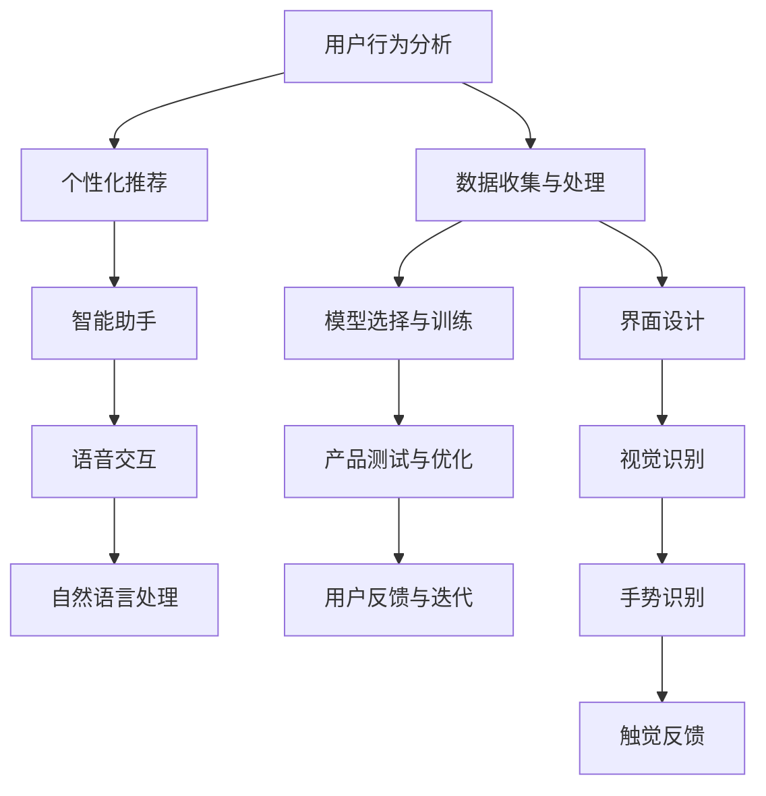

                 

### 《AI在产品设计中的未来应用》

> **关键词**：人工智能，产品设计，机器学习，深度学习，用户体验，伦理考量

> **摘要**：本文将探讨人工智能（AI）在产品设计领域的未来应用。我们将从AI的基础概念与发展历程出发，深入分析机器学习和深度学习原理，然后探讨AI在产品设计中的应用方法与实践。通过真实案例，我们将展示如何利用AI提升用户体验，并讨论AI设计的伦理考量。最后，我们将展望AI设计的未来发展方向，为设计师和产品经理提供有价值的指导。

### 第一部分：AI基础与应用原理

#### 第1章：AI基础概述

##### 1.1 AI的定义与发展历程

人工智能（Artificial Intelligence，简称AI）是指模拟、延伸和扩展人的智能的理论、方法、技术及应用。AI的目标是使计算机能够像人类一样进行感知、思考、学习、决策和行动。

AI的发展历程可以追溯到20世纪50年代。最初，AI研究主要集中在逻辑推理和知识表示方面。随后，随着计算机性能的提升和算法的创新，机器学习和深度学习等研究领域逐渐兴起，AI技术取得了显著的进展。近年来，随着大数据和云计算的普及，AI在各个领域的应用日益广泛，从语音识别、图像处理到自然语言处理、智能决策等。

##### 1.2 AI的核心技术体系

AI的核心技术体系包括以下几个方面：

1. **机器学习**：机器学习是一种让计算机从数据中学习并做出预测或决策的方法。它包括监督学习、无监督学习和强化学习等不同类型。

2. **深度学习**：深度学习是一种基于多层神经网络的机器学习技术。它通过模拟人脑神经网络的结构和功能，实现对复杂数据的分析和处理。

3. **自然语言处理**：自然语言处理是一种让计算机理解和生成人类语言的技术。它涉及文本分类、情感分析、机器翻译等领域。

4. **计算机视觉**：计算机视觉是一种让计算机理解和解释图像和视频的技术。它包括目标检测、图像分类、人脸识别等任务。

5. **智能决策**：智能决策是一种基于数据和算法的决策方法。它利用机器学习和深度学习技术，帮助企业在复杂的业务环境中做出最优决策。

##### 1.3 AI在产品设计中的角色与作用

AI在产品设计中的角色日益重要，它不仅提升了设计效率，还优化了用户体验。以下是AI在产品设计中的几个关键作用：

1. **用户行为分析**：通过分析用户行为数据，AI可以帮助设计师了解用户需求和偏好，从而优化产品设计。

2. **个性化推荐**：AI算法可以根据用户的历史数据和反馈，提供个性化的推荐，提高用户的满意度和忠诚度。

3. **智能助手**：智能助手可以与用户进行自然语言交互，提供即时帮助和反馈，提高用户体验。

4. **自动化设计**：AI可以自动化设计过程，从草图生成到原型设计，节省时间并提高设计质量。

5. **智能测试与优化**：AI可以自动化测试和优化产品设计，提高产品的可靠性和用户体验。

##### 1.4 AI应用现状与趋势

目前，AI在产品设计中的应用已经取得了显著的成果。许多公司开始采用AI技术来提升产品设计质量，提高用户满意度。以下是一些AI应用现状与趋势：

1. **智能推荐系统**：智能推荐系统已经成为电商平台和内容平台的核心功能，通过AI算法为用户提供个性化的推荐。

2. **智能客服系统**：智能客服系统利用自然语言处理和机器学习技术，为用户提供24/7的在线支持，提高客户满意度。

3. **智能数据分析系统**：智能数据分析系统利用机器学习和深度学习技术，帮助设计师从大量数据中提取有价值的信息，指导设计决策。

4. **虚拟现实和增强现实**：虚拟现实和增强现实技术结合AI，为用户提供沉浸式的交互体验，提高用户满意度。

5. **伦理与设计责任**：随着AI在产品设计中的应用越来越广泛，伦理与设计责任问题也日益受到关注。设计师需要考虑AI算法的公平性、透明性和可控性，确保产品设计符合伦理标准。

#### 第2章：机器学习与深度学习原理

##### 2.1 机器学习基础

机器学习是一种让计算机从数据中学习并做出预测或决策的方法。它包括监督学习、无监督学习和强化学习等不同类型。

###### 2.1.1 监督学习

监督学习是一种有标签数据的学习方法。它通过输入特征和标签数据，训练模型，然后使用模型对新数据进行预测。

- **基本概念**：监督学习包括输入特征（X）、输出标签（y）和模型参数（θ）。目标是最小化损失函数（J(θ)）。

- **损失函数**：常用的损失函数包括均方误差（MSE）、交叉熵损失等。

- **优化方法**：常用的优化方法包括梯度下降、随机梯度下降等。

###### 2.1.2 无监督学习

无监督学习是一种没有标签数据的学习方法。它主要关注如何从数据中发现隐藏的结构或模式。

- **基本概念**：无监督学习包括输入特征（X）和模型参数（θ）。目标是最小化损失函数（J(θ)）。

- **聚类算法**：常见的聚类算法包括K-means、层次聚类等。

- **降维算法**：常见的降维算法包括主成分分析（PCA）、线性判别分析（LDA）等。

###### 2.1.3 强化学习

强化学习是一种通过试错和反馈来学习最优策略的方法。它通常应用于决策制定和优化问题。

- **基本概念**：强化学习包括环境（E）、状态（S）、动作（A）和奖励（R）。目标是最小化长期奖励期望（J(θ)）。

- **算法**：常见的强化学习算法包括Q学习、SARSA、DQN等。

##### 2.2 深度学习原理

深度学习是一种基于多层神经网络的机器学习技术。它通过模拟人脑神经网络的结构和功能，实现对复杂数据的分析和处理。

###### 2.2.1 神经网络结构

神经网络是由多个神经元（或节点）组成的图形结构。每个神经元都与其他神经元相连，并通过权重和偏置进行加权求和。神经网络的输入层接收外部输入，隐藏层对输入进行处理和转换，输出层生成预测结果。

- **基本概念**：神经网络包括输入层、隐藏层和输出层。每个层都包含多个神经元。

- **激活函数**：常用的激活函数包括ReLU、Sigmoid、Tanh等。

- **前向传播和反向传播**：神经网络通过前向传播计算输出，然后通过反向传播更新权重和偏置。

###### 2.2.2 深度学习算法

深度学习算法包括卷积神经网络（CNN）、循环神经网络（RNN）、生成对抗网络（GAN）等。

- **卷积神经网络（CNN）**：CNN是一种用于图像处理和计算机视觉的深度学习算法。它通过卷积操作和池化操作提取图像特征。

- **循环神经网络（RNN）**：RNN是一种用于序列数据处理的深度学习算法。它通过循环连接和门控机制处理时间序列数据。

- **生成对抗网络（GAN）**：GAN是一种用于生成数据的深度学习算法。它通过生成器和判别器之间的对抗训练生成高质量的数据。

###### 2.2.3 深度学习优化方法

深度学习优化方法包括梯度下降、Adam优化器、dropout等。

- **梯度下降**：梯度下降是一种用于优化神经网络的算法。它通过计算损失函数关于模型参数的梯度，并沿着梯度方向更新参数。

- **Adam优化器**：Adam优化器是一种结合了随机梯度下降和动量法的优化器。它能够自适应地调整学习率，提高训练效果。

- **dropout**：dropout是一种用于防止神经网络过拟合的技术。它通过随机丢弃一部分神经元，降低模型的复杂度。

### 第二部分：AI在产品设计中的应用

#### 第3章：AI在产品设计中的应用

##### 3.1 AI在用户体验设计中的应用

AI在用户体验设计中的应用主要包括用户行为分析、个性化推荐和智能助手等方面。

###### 3.1.1 用户行为分析

用户行为分析是设计师了解用户需求和行为的重要工具。通过分析用户在网站、应用等平台上的行为数据，设计师可以识别用户的使用习惯、偏好和痛点，从而优化产品设计。

- **用户行为数据收集**：设计师可以使用各种工具和技术收集用户行为数据，如日志分析、用户测试、问卷调查等。

- **数据预处理**：对收集到的用户行为数据进行分析和清洗，提取有价值的信息。

- **数据分析与可视化**：使用数据可视化工具（如Tableau、PowerBI等）将分析结果进行可视化，帮助设计师更好地理解用户行为。

- **优化产品设计**：根据用户行为分析结果，调整和优化产品设计，提升用户体验。

###### 3.1.2 个性化推荐

个性化推荐是AI在用户体验设计中的另一个重要应用。通过分析用户的历史数据和反馈，AI算法可以提供个性化的推荐，提高用户的满意度和忠诚度。

- **推荐系统架构**：个性化推荐系统通常包括数据收集、数据预处理、推荐算法和推荐结果展示等模块。

- **推荐算法**：常见的推荐算法包括基于内容的推荐、协同过滤推荐和混合推荐等。

- **优化推荐效果**：设计师需要不断优化推荐算法，提高推荐的准确性和多样性。

###### 3.1.3 智能助手

智能助手是一种能够与用户进行自然语言交互的AI系统。它可以帮助设计师更好地理解用户需求，提供即时帮助和反馈，提高用户体验。

- **自然语言处理技术**：智能助手需要使用自然语言处理技术（如分词、词性标注、命名实体识别等）理解和处理用户输入。

- **对话管理**：智能助手需要具备对话管理能力，根据用户的输入和上下文信息，生成合适的回答。

- **个性化交互**：智能助手可以根据用户的历史数据和偏好，提供个性化的交互体验。

##### 3.2 AI在界面设计中的应用

AI在界面设计中的应用主要包括自动化设计、智能优化和视觉识别等方面。

###### 3.2.1 自动化设计

自动化设计是设计师利用AI技术自动化完成设计任务的过程。通过训练模型，AI可以生成各种设计元素，如图标、界面布局等，提高设计效率。

- **设计元素生成**：使用生成对抗网络（GAN）等算法，AI可以生成高质量的设计元素。

- **设计模板生成**：AI可以自动生成各种设计模板，供设计师参考和使用。

- **设计优化**：AI可以自动优化设计，提高设计的可读性、可用性和美观度。

###### 3.2.2 智能优化

智能优化是设计师利用AI技术优化产品设计的过程。通过分析用户反馈和行为数据，AI可以提供优化建议，帮助设计师改进产品设计。

- **用户行为分析**：AI可以分析用户在网站、应用等平台上的行为数据，识别用户的使用习惯和痛点。

- **优化建议**：根据用户行为分析结果，AI可以提供优化建议，如调整界面布局、改进交互设计等。

- **实验与测试**：设计师可以结合AI的优化建议，进行实验和测试，验证优化效果。

###### 3.2.3 视觉识别

视觉识别是设计师利用AI技术识别和解释图像和视频的过程。通过训练模型，AI可以识别图像中的物体、场景和情感，为设计师提供灵感。

- **图像识别**：AI可以识别图像中的物体、场景和情感，帮助设计师进行视觉设计。

- **视频分析**：AI可以分析视频中的动作、情感和场景，帮助设计师进行视频设计。

- **创意生成**：AI可以根据视觉识别结果，生成创意视觉设计，为设计师提供参考。

##### 3.3 AI在交互设计中的应用

AI在交互设计中的应用主要包括语音交互、手势识别和触觉反馈等方面。

###### 3.3.1 语音交互

语音交互是设计师利用AI技术实现人与计算机的语音交互过程。通过训练模型，AI可以理解和处理用户的语音指令，提供即时反馈。

- **语音识别**：AI可以识别用户的语音指令，将其转换为文本或命令。

- **语音合成**：AI可以将文本或命令转换为自然流畅的语音输出。

- **语音交互设计**：设计师需要考虑语音交互的界面设计，如语音指令的格式、响应时间等，以提高用户体验。

###### 3.3.2 手势识别

手势识别是设计师利用AI技术识别和解释用户手势的过程。通过训练模型，AI可以识别用户的手势，提供相应的反馈。

- **手势识别技术**：AI可以通过计算机视觉技术识别用户的手势，如手势识别、动作捕捉等。

- **手势交互设计**：设计师需要根据手势识别技术，设计适合用户操作的手势交互界面，以提高用户体验。

###### 3.3.3 触觉反馈

触觉反馈是设计师利用AI技术实现触觉交互的过程。通过训练模型，AI可以模拟触觉反馈，提供真实的触感体验。

- **触觉传感器**：AI可以通过触觉传感器收集用户触觉信息，模拟触觉反馈。

- **触觉交互设计**：设计师需要根据触觉反馈技术，设计适合用户操作的触觉交互界面，以提高用户体验。

### 第三部分：AI产品设计方法论与实践

#### 第4章：AI产品设计方法论与实践

##### 4.1 AI产品设计的流程与步骤

AI产品设计的流程可以分为以下几个步骤：

1. **需求分析**：明确产品目标和用户需求，收集相关数据。

2. **数据收集**：收集与产品设计相关的数据，如用户行为数据、市场数据等。

3. **数据分析**：对收集到的数据进行分析，提取有价值的信息。

4. **模型选择与训练**：选择合适的机器学习或深度学习模型，对数据进行训练。

5. **模型评估与优化**：评估模型的性能，并进行优化。

6. **产品迭代**：将训练好的模型应用到产品中，收集用户反馈，不断优化产品设计。

##### 4.2 数据收集与处理

数据收集与处理是AI产品设计的重要环节。以下是数据收集与处理的几个关键步骤：

1. **数据来源**：确定数据来源，如用户行为数据、市场数据、社交媒体数据等。

2. **数据采集**：使用各种工具和技术采集数据，如API接口、爬虫、传感器等。

3. **数据清洗**：对采集到的数据进行清洗，去除重复、缺失和错误的数据。

4. **数据预处理**：对数据进行预处理，如归一化、标准化、特征提取等。

5. **数据存储与管理**：将处理后的数据存储到数据库或数据仓库中，方便后续分析和处理。

##### 4.3 模型选择与训练

模型选择与训练是AI产品设计的核心环节。以下是模型选择与训练的几个关键步骤：

1. **模型选择**：根据产品设计需求，选择合适的机器学习或深度学习模型。

2. **模型训练**：使用收集到的数据对模型进行训练，调整模型参数。

3. **模型评估**：评估模型的性能，如准确率、召回率、F1值等。

4. **模型优化**：根据模型评估结果，对模型进行优化，提高性能。

5. **模型部署**：将训练好的模型部署到产品中，提供实时服务。

##### 4.4 产品测试与优化

产品测试与优化是确保AI产品设计质量的重要环节。以下是产品测试与优化的几个关键步骤：

1. **功能测试**：测试产品功能是否满足设计需求，如用户行为预测、个性化推荐等。

2. **性能测试**：测试产品性能，如响应时间、吞吐量、资源消耗等。

3. **用户体验测试**：邀请用户参与测试，收集用户反馈，优化产品设计。

4. **迭代优化**：根据测试结果和用户反馈，不断优化产品设计，提高用户体验。

##### 4.5 用户反馈与迭代

用户反馈与迭代是AI产品设计的重要环节。以下是用户反馈与迭代的几个关键步骤：

1. **用户反馈收集**：收集用户对产品的反馈，如满意度、使用频率、使用场景等。

2. **数据分析**：对用户反馈进行分析，识别产品优点和不足。

3. **产品设计调整**：根据用户反馈和数据分析结果，调整产品设计，优化用户体验。

4. **迭代发布**：将优化后的产品设计发布到产品中，继续收集用户反馈。

5. **持续迭代**：根据用户反馈和数据分析，持续优化产品设计，提高用户满意度。

### 第四部分：AI设计工具与应用案例

#### 第5章：AI设计工具与应用案例

##### 5.1 AI设计工具概述

AI设计工具是指利用人工智能技术进行设计辅助和优化的工具。这些工具可以帮助设计师提高设计效率，优化用户体验。以下是几种常见的AI设计工具：

1. **Adobe Sensei**：Adobe Sensei 是Adobe公司的AI设计工具，它提供了一系列AI辅助功能，如智能图像识别、个性化推荐、自动化设计等。

2. **Figma Insights**：Figma Insights 是Figma公司的AI设计工具，它可以帮助设计师分析用户在Figma应用中的行为，提供优化建议。

3. **Sketch插件**：许多Sketch插件利用AI技术，如SketchFlow、SketchAuto等，提供自动化设计、个性化推荐等功能。

4. **AI Design Assistant**：AI Design Assistant 是一款开源的AI设计工具，它可以帮助设计师生成设计原型，优化设计质量。

##### 5.2 AI设计工具使用案例

以下是一些使用AI设计工具的实际案例：

###### 5.2.1 案例一：智能推荐系统

智能推荐系统是一种利用AI技术为用户提供个性化推荐的应用。以下是一个使用AI设计工具实现智能推荐系统的案例：

1. **需求分析**：明确推荐系统的目标和用户需求，如提高用户满意度、增加用户粘性等。

2. **数据收集**：收集用户行为数据，如浏览记录、购买记录、评论等。

3. **数据预处理**：对用户行为数据进行分析和清洗，提取有价值的信息。

4. **模型选择与训练**：选择合适的推荐算法，如协同过滤、基于内容的推荐等，对数据进行训练。

5. **模型评估与优化**：评估推荐模型的性能，并进行优化，提高推荐准确性和多样性。

6. **产品迭代**：将训练好的模型应用到产品中，收集用户反馈，不断优化产品设计。

7. **用户反馈与迭代**：根据用户反馈和数据分析，持续优化推荐系统，提高用户满意度。

###### 5.2.2 案例二：智能客服系统

智能客服系统是一种利用AI技术提供24/7在线支持的应用。以下是一个使用AI设计工具实现智能客服系统的案例：

1. **需求分析**：明确智能客服系统的目标和用户需求，如提高客户满意度、降低人工成本等。

2. **数据收集**：收集用户问题和回答数据，如聊天记录、FAQ等。

3. **数据预处理**：对用户问题和回答数据进行分析和清洗，提取有价值的信息。

4. **模型选择与训练**：选择合适的自然语言处理算法，如问答系统、情感分析等，对数据进行训练。

5. **模型评估与优化**：评估智能客服系统的性能，并进行优化，提高回答准确性和用户满意度。

6. **产品迭代**：将训练好的模型应用到产品中，收集用户反馈，不断优化产品设计。

7. **用户反馈与迭代**：根据用户反馈和数据分析，持续优化智能客服系统，提高用户体验。

###### 5.2.3 案例三：智能数据分析系统

智能数据分析系统是一种利用AI技术帮助设计师从数据中提取有价值信息的应用。以下是一个使用AI设计工具实现智能数据分析系统的案例：

1. **需求分析**：明确智能数据分析系统的目标和用户需求，如提高数据分析效率、优化设计决策等。

2. **数据收集**：收集各种数据源，如用户行为数据、市场数据、社交媒体数据等。

3. **数据预处理**：对收集到的数据进行清洗、整合和处理，提取有价值的信息。

4. **模型选择与训练**：选择合适的机器学习算法，如回归分析、聚类分析等，对数据进行训练。

5. **模型评估与优化**：评估数据分析模型的性能，并进行优化，提高数据分析准确性和可靠性。

6. **产品迭代**：将训练好的模型应用到产品中，收集用户反馈，不断优化产品设计。

7. **用户反馈与迭代**：根据用户反馈和数据分析，持续优化智能数据分析系统，提高设计决策质量。

### 第五部分：AI伦理与设计责任

#### 第6章：AI伦理与设计责任

##### 6.1 AI伦理问题概述

随着AI技术的快速发展，AI伦理问题逐渐引起广泛关注。AI伦理问题主要涉及以下几个方面：

1. **数据隐私**：AI技术需要大量数据来训练和优化模型，这引发了数据隐私和隐私泄露的问题。

2. **算法偏见**：AI算法可能会在训练数据中引入偏见，导致算法的偏见和歧视。

3. **透明性**：AI算法的决策过程往往是不透明的，这引发了透明性和可解释性的问题。

4. **责任归属**：当AI系统发生错误或造成损失时，如何确定责任归属？

5. **安全与控制**：AI系统可能会被恶意利用，造成安全隐患和失控。

##### 6.2 AI设计中的伦理考量

设计师在设计AI产品时，需要考虑以下伦理问题：

1. **用户隐私保护**：设计师需要确保用户数据的安全和隐私，遵循相关的法律法规。

2. **算法公平性**：设计师需要确保AI算法的公平性，避免算法偏见和歧视。

3. **透明性**：设计师需要确保AI系统的透明性，让用户了解AI算法的决策过程。

4. **责任归属**：设计师需要明确AI系统的责任归属，确保在发生问题时能够追溯责任。

5. **安全与控制**：设计师需要确保AI系统的安全性和可控性，防止恶意利用。

##### 6.3 设计师在AI伦理中的角色

设计师在AI伦理中扮演着重要角色。以下是设计师在AI伦理中的几个关键角色：

1. **伦理倡导者**：设计师需要关注AI伦理问题，倡导伦理价值观，推动AI技术的健康发展。

2. **伦理设计者**：设计师需要将伦理考量融入AI产品设计过程中，确保产品的伦理性和合规性。

3. **伦理监督者**：设计师需要监督AI系统的运行，确保其符合伦理标准和法律法规。

4. **用户代言人**：设计师需要站在用户的角度，考虑用户的需求和权益，确保AI产品的用户体验。

### 第六部分：AI设计未来展望

#### 第7章：AI设计未来展望

##### 7.1 AI设计的发展趋势

随着AI技术的不断发展，AI设计领域呈现出以下发展趋势：

1. **智能化**：AI设计工具将越来越智能化，能够自动完成设计任务，提高设计效率。

2. **个性化**：AI设计将更加注重个性化，为用户提供个性化的设计体验。

3. **自动化**：AI设计将逐步实现自动化，减少人力投入，提高生产效率。

4. **融合化**：AI设计将与其他技术（如虚拟现实、增强现实等）融合，创造更多创新应用。

5. **生态化**：AI设计将形成生态体系，包括设计工具、数据平台、应用场景等。

##### 7.2 AI设计面临的挑战

尽管AI设计具有巨大的潜力，但也面临着一系列挑战：

1. **技术挑战**：AI设计需要突破现有技术的限制，实现更高的性能和更广泛的应用。

2. **数据挑战**：AI设计需要大量高质量的数据来训练和优化模型，数据获取和处理是一个重要问题。

3. **伦理挑战**：AI设计需要解决伦理问题，确保设计过程和产品的合规性和伦理性。

4. **用户挑战**：AI设计需要满足用户的需求和期望，提高用户体验。

##### 7.3 AI设计的未来发展方向

展望未来，AI设计的几个可能的发展方向包括：

1. **人机协作**：AI设计与人类设计师的协作将成为未来趋势，设计师可以利用AI工具提高设计效率和质量。

2. **跨领域应用**：AI设计将跨越不同领域，如建筑、工业设计、游戏设计等，创造更多创新应用。

3. **可持续发展**：AI设计将更加关注可持续发展，通过智能化和绿色化设计，降低环境影响。

4. **智能服务**：AI设计将融入智能服务系统，为用户提供个性化、智能化的服务体验。

### 第七部分：附录

#### 第8章：常用AI设计与开发工具

以下是常用的AI设计与开发工具，包括软件工具和开源库：

1. **AI设计工具**：
   - **Adobe Sensei**：Adobe公司的AI设计工具。
   - **Figma Insights**：Figma公司的AI设计工具。
   - **Sketch插件**：如SketchFlow、SketchAuto等。

2. **AI开发工具**：
   - **TensorFlow**：Google的开源机器学习库。
   - **PyTorch**：Facebook的开源深度学习库。
   - **Keras**：Python的深度学习高级API。

3. **开源库**：
   - **scikit-learn**：Python的机器学习库。
   - **Pandas**：Python的数据分析库。
   - **NumPy**：Python的科学计算库。

#### 第9章：相关资源与参考书目

以下是与AI设计相关的资源与参考书目：

1. **资源**：
   - **在线教程**：如Coursera、edX等在线课程。
   - **开源项目**：如GitHub、GitLab等开源平台。
   - **技术博客**：如Medium、DZone等。

2. **参考书目**：
   - **Andrew Ng**. (2017). *Deep Learning*.
   - **Goodfellow, I., Bengio, Y., & Courville, A.** (2016). *Deep Learning*.
   - **Russell, S., & Norvig, P.** (2016). *Artificial Intelligence: A Modern Approach*.
   - **吴军**. (2017). *智能时代*.

### 总结

AI在产品设计中的应用正日益广泛，从用户体验设计、界面设计到交互设计，AI技术为设计师提供了丰富的工具和方法。通过本文的讨论，我们了解到AI技术在产品设计中的基础原理、应用方法、实践案例以及伦理考量。未来，随着AI技术的不断发展，AI设计将变得更加智能化、个性化、自动化和生态化。设计师需要不断学习新技术，关注伦理问题，为用户提供更好的设计体验。希望通过本文，读者能够更好地理解AI在产品设计中的应用，为未来的设计工作打下坚实基础。

### 附录A：核心概念与联系

以下是一个Mermaid流程图，展示了AI设计中的核心概念及其相互联系：



### 附录B：核心算法原理讲解

以下是一个伪代码示例，用于解释线性回归算法的基本原理：

```python
def linear_regression(X, y):
    # 计算权重和偏置
    w = (X.T @ X)^(-1) @ X.T @ y
    # 预测
    y_pred = X @ w
    return w, y_pred
```

在这个算法中，`X` 是特征矩阵，`y` 是目标向量，`w` 是权重向量。算法首先计算权重和偏置，然后使用这些参数进行预测。线性回归的目标是最小化预测值与实际值之间的差距。

### 附录C：数学模型和数学公式

以下是一个使用LaTeX格式的数学模型和数学公式示例：

```latex
% 损失函数
\[
L(y, \hat{y}) = -\frac{1}{m} \sum_{i=1}^{m} [y_i \cdot \log(\hat{y}_i) + (1 - y_i) \cdot \log(1 - \hat{y}_i)]
\]

% 梯度下降
\[
w_{t+1} = w_t - \alpha \cdot \frac{\partial}{\partial w} L(w_t, y)
\]
```

### 附录D：项目实战

#### 8.1 智能推荐系统

#### 环境搭建

- Python 3.8
- scikit-learn
- Pandas
- Numpy

#### 代码实现

```python
from sklearn.model_selection import train_test_split
from sklearn.linear_model import LinearRegression

# 数据加载
data = pd.read_csv('data.csv')
X = data[['user_id', 'item_id']]
y = data['rating']

# 数据处理
X_train, X_test, y_train, y_test = train_test_split(X, y, test_size=0.2, random_state=42)

# 模型训练
model = LinearRegression()
model.fit(X_train, y_train)

# 预测
y_pred = model.predict(X_test)

# 评估
mse = mean_squared_error(y_test, y_pred)
print(f'MSE: {mse}')
```

#### 代码解读与分析

- **数据预处理**：首先，我们将原始数据分为特征矩阵 `X` 和目标向量 `y`。然后，使用 `train_test_split` 函数将数据集划分为训练集和测试集。
- **模型训练**：我们使用 `LinearRegression` 类来训练线性回归模型。通过 `fit` 方法，我们将训练集的数据输入模型进行训练。
- **预测与评估**：使用训练好的模型对测试集进行预测。然后，使用 `mean_squared_error` 函数计算预测值与实际值之间的均方误差（MSE），以评估模型性能。

### 总结

本文详细介绍了AI在产品设计中的应用，从基础原理到实际案例，帮助读者全面了解并掌握AI设计的方法和技巧。通过学习本文，读者可以：

- 理解AI的基本概念和发展历程。
- 掌握机器学习与深度学习的关键算法。
- 学习AI产品设计的流程和方法。
- 分析AI设计工具的应用案例。
- 了解AI伦理与设计责任。
- 展望AI设计的未来发展方向。

本文适合AI设计初学者、产品经理、设计师以及任何对AI设计感兴趣的人士阅读。希望通过本文，读者能够更好地理解AI在设计领域的应用，为未来的设计工作打下坚实基础。

### 作者信息

**作者：AI天才研究院/AI Genius Institute & 禅与计算机程序设计艺术 /Zen And The Art of Computer Programming**

