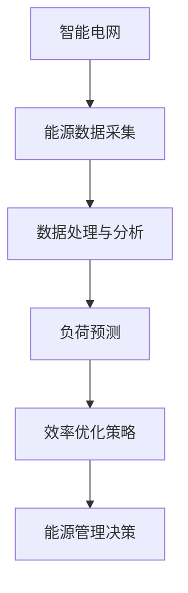

                 

### 《AI 在能源领域的应用：智能电网、能源效率优化》

#### 关键词：
- AI
- 能源领域
- 智能电网
- 能源效率优化
- 数据采集
- 负荷预测
- 深度学习
- 神经网络
- 优化算法

#### 摘要：
本文将探讨人工智能（AI）在能源领域的应用，重点讨论智能电网和能源效率优化两个方向。首先，我们将介绍AI在能源领域的重要性以及面临的挑战和机遇。接着，我们将深入分析AI的核心概念与架构，包括机器学习、深度学习和自然语言处理。然后，我们将详细讲解AI在智能电网中的应用，涵盖能源数据采集与处理、电力负荷预测和能源效率优化。最后，我们将通过实际项目案例展示AI技术在能源领域的成功应用，并对未来的发展趋势进行展望。本文旨在为读者提供一个全面、深入的AI在能源领域的应用指南。

#### 目录：

**第一部分：AI在能源领域的应用概述**

### 第1章：AI与能源概述

#### 1.1 AI在能源领域的意义

人工智能（AI）作为当今科技发展的前沿，已经在众多领域展现出了巨大的潜力。在能源领域，AI的应用同样具有重要意义。首先，AI可以帮助我们更好地理解和利用能源资源，提高能源利用效率，减少能源浪费。其次，AI能够预测能源需求，优化能源分配，从而提高能源系统的稳定性和可靠性。此外，AI还可以在能源领域实现自动化控制，提高能源生产和传输的效率。

在能源领域，AI的应用可以带来以下几个方面的好处：

1. **提高能源利用效率**：通过AI技术对能源消耗进行实时监控和分析，可以及时发现和解决能源浪费问题，降低能源成本。
2. **预测能源需求**：AI可以通过学习历史数据和当前环境信息，预测未来的能源需求，从而优化能源供应计划，减少能源短缺风险。
3. **自动化控制**：AI可以在能源生产和传输过程中实现自动化控制，提高系统的稳定性和可靠性，减少人为干预和错误。
4. **智能电网建设**：AI技术是智能电网的核心驱动力，可以实现对电网的实时监控、预测和优化，提高电网的运行效率。

#### 1.2 能源领域的挑战与机遇

尽管AI在能源领域具有巨大的应用潜力，但也面临着一系列挑战。首先，能源数据量庞大且种类繁多，如何有效采集、存储和处理这些数据是AI应用的一个重要难题。其次，能源系统的复杂性和动态性使得AI模型在预测和优化方面存在一定的局限性。此外，能源领域的数据安全和隐私保护也是一个重要问题。

然而，面对这些挑战，AI技术同样带来了前所未有的机遇。随着计算能力的提升和算法的进步，AI技术在处理大规模数据、实现复杂预测和优化方面越来越成熟。同时，随着物联网和大数据技术的发展，能源领域的数据采集和共享变得更加便捷，为AI的应用提供了更加丰富的数据资源。

#### 1.3 智能电网与能源效率优化

智能电网是AI在能源领域的重要应用之一。智能电网通过引入AI技术，实现了对电网的实时监控、预测和优化，提高了电网的运行效率和服务质量。智能电网的主要特点包括：

1. **实时监控**：通过传感器和监测设备，智能电网可以实时采集电网的运行数据，包括电压、电流、频率等参数。
2. **预测需求**：AI技术可以对历史数据和当前环境信息进行分析，预测未来的能源需求和电网负荷。
3. **优化分配**：基于预测结果，智能电网可以优化能源分配，确保电网的稳定运行和高效利用。
4. **自动化控制**：智能电网通过自动化控制系统，实现对电网的实时调控，提高系统的可靠性和稳定性。

在能源效率优化方面，AI技术同样发挥着重要作用。通过实时监测和分析能源消耗数据，AI可以识别和消除能源浪费，提高能源利用效率。此外，AI还可以通过优化能源管理策略，降低能源成本，提高企业的竞争力。

总之，AI技术在能源领域的应用为解决能源问题带来了新的思路和方法。随着技术的不断进步，AI在能源领域的应用前景将更加广阔，为能源转型和可持续发展提供有力支持。

### 第2章：AI核心概念与架构

#### 2.1 机器学习基础

机器学习（Machine Learning，ML）是AI的核心技术之一，它使计算机系统能够从数据中学习，并做出预测或决策。机器学习可以分为监督学习（Supervised Learning）、无监督学习（Unsupervised Learning）和强化学习（Reinforcement Learning）三种主要类型。

##### 2.1.1 监督学习

监督学习是一种最常见的机器学习方法，它利用标记数据（即已知输入和输出）来训练模型，从而预测新的、未知的输出。监督学习的流程主要包括以下步骤：

1. **数据采集**：收集具有标记数据的训练集。
2. **数据预处理**：对数据进行清洗、归一化等处理，以便于模型训练。
3. **模型选择**：选择合适的模型架构，如线性回归、决策树、支持向量机等。
4. **模型训练**：使用训练集数据训练模型，调整模型参数。
5. **模型评估**：使用验证集数据评估模型性能，调整模型参数。
6. **模型部署**：将训练好的模型部署到实际应用中。

监督学习的核心公式为：

$$
y = f(x; \theta)
$$

其中，$y$是模型的预测输出，$x$是输入特征，$f$是模型函数，$\theta$是模型参数。

##### 2.1.2 无监督学习

无监督学习不依赖于标记数据，其主要目标是发现数据中的隐含结构或模式。无监督学习包括聚类（Clustering）和降维（Dimensionality Reduction）等主要任务。

1. **聚类**：将相似的数据点归为一类，常用的聚类算法有K-Means、层次聚类等。
2. **降维**：通过压缩数据的维度，减少数据复杂度，常用的降维算法有PCA（Principal Component Analysis）和t-SNE等。

无监督学习的核心公式为：

$$
x_{new} = g(x; \theta)
$$

其中，$x_{new}$是降维后的数据，$x$是原始数据，$g$是降维函数，$\theta$是模型参数。

##### 2.1.3 强化学习

强化学习是一种通过与环境的交互来学习策略的机器学习方法。在强化学习中，智能体（Agent）通过执行动作（Action）来获取奖励（Reward），并逐渐优化其行为策略。强化学习的主要步骤包括：

1. **环境建模**：构建环境的模型，包括状态空间（State Space）和动作空间（Action Space）。
2. **策略选择**：选择合适的策略函数，用于指导智能体的动作。
3. **交互学习**：智能体与环境进行交互，根据奖励信号调整策略函数。
4. **策略优化**：通过优化策略函数，提高智能体的性能。

强化学习的核心公式为：

$$
Q(s, a) = r(s, a) + \gamma \max_{a'} Q(s', a')
$$

其中，$Q(s, a)$是状态-动作值函数，$r(s, a)$是立即奖励，$\gamma$是折扣因子，$s'$是下一状态，$a'$是下一动作。

#### 2.2 深度学习与神经网络

深度学习（Deep Learning，DL）是机器学习的一个子领域，它通过多层神经网络（Neural Networks）对数据进行建模和分析。深度学习在图像识别、语音识别、自然语言处理等领域取得了显著成果。

##### 2.2.1 神经网络基础

神经网络是一种模拟人脑神经元连接方式的计算模型。一个简单的神经网络包括输入层、隐藏层和输出层。每个层中的节点（神经元）通过权重（Weight）和偏置（Bias）进行连接。

1. **输入层**：接收外部输入数据。
2. **隐藏层**：对输入数据进行特征提取和变换。
3. **输出层**：生成最终的输出结果。

神经网络的计算过程主要包括以下步骤：

1. **前向传播**：输入数据经过网络层层的非线性变换，最终生成输出。
2. **反向传播**：根据输出误差，调整网络的权重和偏置，优化模型性能。

神经网络的计算公式为：

$$
z_i = \sum_j w_{ij}x_j + b_i
$$

$$
a_i = \sigma(z_i)
$$

其中，$z_i$是神经元$i$的输入，$w_{ij}$是神经元$i$到神经元$j$的权重，$b_i$是神经元$i$的偏置，$\sigma$是激活函数，$a_i$是神经元$i$的输出。

##### 2.2.2 卷积神经网络

卷积神经网络（Convolutional Neural Network，CNN）是一种专门用于处理图像数据的神经网络。CNN通过卷积层（Convolutional Layer）、池化层（Pooling Layer）和全连接层（Fully Connected Layer）对图像进行特征提取和分类。

1. **卷积层**：通过卷积运算提取图像局部特征。
2. **池化层**：对卷积层输出的特征进行降维，减少计算复杂度。
3. **全连接层**：对池化层输出的特征进行分类。

卷积神经网络的计算公式为：

$$
f(x) = \sigma(W \cdot x + b)
$$

其中，$x$是输入特征，$W$是卷积核权重，$b$是偏置，$\sigma$是激活函数，$f(x)$是卷积层的输出。

##### 2.2.3 循环神经网络

循环神经网络（Recurrent Neural Network，RNN）是一种用于处理序列数据的神经网络。RNN通过循环结构将当前状态与历史状态相关联，能够捕捉序列中的长期依赖关系。

1. **输入层**：接收外部输入序列。
2. **隐藏层**：对输入序列进行特征提取和变换。
3. **输出层**：生成最终的输出序列。

循环神经网络的计算公式为：

$$
h_t = \sigma(W_h h_{t-1} + W_x x_t + b_h)
$$

$$
y_t = \sigma(W_y h_t + b_y)
$$

其中，$h_t$是第$t$个隐藏状态，$x_t$是第$t$个输入，$W_h$、$W_x$、$W_y$分别是权重矩阵，$b_h$、$b_y$是偏置，$\sigma$是激活函数，$y_t$是第$t$个输出。

#### 2.3 自然语言处理基础

自然语言处理（Natural Language Processing，NLP）是AI的一个重要分支，旨在使计算机能够理解和处理人类语言。NLP主要任务包括文本分类、情感分析、机器翻译、语音识别等。

1. **文本分类**：将文本数据分类到预定义的类别中，常用的算法有朴素贝叶斯、支持向量机等。
2. **情感分析**：分析文本数据中的情感倾向，常用的算法有情感词典、深度学习等。
3. **机器翻译**：将一种语言的文本翻译成另一种语言，常用的算法有规则翻译、统计翻译、深度学习等。
4. **语音识别**：将语音信号转换为文本数据，常用的算法有隐马尔可夫模型、高斯混合模型、深度学习等。

NLP的核心公式为：

$$
P(y|x) = \frac{P(x|y)P(y)}{P(x)}
$$

其中，$P(y|x)$是给定输入$x$时输出$y$的概率，$P(x|y)$是给定输出$y$时输入$x$的概率，$P(y)$是输出$y$的概率，$P(x)$是输入$x$的概率。

通过以上对AI核心概念与架构的介绍，我们为理解AI在能源领域的应用奠定了基础。在接下来的章节中，我们将进一步探讨AI在智能电网和能源效率优化方面的具体应用。

### 第二部分：AI在智能电网中的应用

#### 第3章：智能电网的概念与架构

##### 3.1 智能电网的构成

智能电网（Smart Grid）是一种基于现代通信技术、信息技术和可再生能源技术的先进电力网络系统。它通过实现电力系统各个环节的智能化，提升了电力系统的运行效率、可靠性和可持续性。智能电网主要由以下几个部分构成：

1. **发电侧**：包括各种发电设施，如燃煤、燃气、水力、风力、太阳能等发电厂。智能电网通过发电侧的信息化和智能化，实现了发电设施的优化调度和高效运行。

2. **输电侧**：包括输电线路、变电站、开关站等设施。智能电网通过输电侧的智能化，实现了输电网络的实时监控、故障诊断和快速恢复。

3. **配电侧**：包括配电网、配电设备、用户端等。智能电网通过配电侧的智能化，实现了电力供应的高效调度和优化，提高了用户的用电质量。

4. **用电侧**：包括工业、商业、居民等用户。智能电网通过用电侧的智能化，实现了用户的用电信息采集、用电行为分析和用电需求响应。

##### 3.2 智能电网的关键技术

智能电网的实现依赖于一系列关键技术的支持，主要包括：

1. **通信技术**：智能电网通过通信技术实现各个环节的数据传输和信息共享，如光纤通信、无线通信、物联网等。

2. **传感技术**：智能电网通过传感器设备实现对电力系统各个环节的实时监测和数据采集，如电压传感器、电流传感器、温度传感器等。

3. **信息处理技术**：智能电网通过信息处理技术对采集到的数据进行处理和分析，实现电力系统的优化调度和决策支持。

4. **控制技术**：智能电网通过自动化控制系统实现对电力系统的实时控制和调节，提高电力系统的稳定性和可靠性。

5. **能源管理技术**：智能电网通过能源管理技术实现可再生能源的接入和管理，提高电力系统的清洁能源比重。

##### 3.3 智能电网的挑战与机遇

智能电网在推动能源转型和可持续发展方面具有巨大潜力，但也面临一系列挑战和机遇。

1. **挑战**：
   - **技术复杂性**：智能电网涉及多种技术领域的融合，技术复杂度高。
   - **信息安全**：智能电网的网络安全和信息安全是关键挑战，需要建立有效的安全防护体系。
   - **标准与法规**：智能电网的发展需要相应的标准与法规支持，当前相关标准和法规尚不完善。
   - **投资与成本**：智能电网的建设和运营成本较高，需要长期的资金投入。

2. **机遇**：
   - **能源转型**：随着可再生能源的广泛应用，智能电网能够更好地实现能源的灵活调度和优化配置。
   - **市场需求**：智能电网能够提供更加优质、可靠的电力服务，满足用户日益增长的用电需求。
   - **技术创新**：智能电网的发展将推动相关技术的创新和进步，如物联网、大数据、人工智能等。
   - **政策支持**：政府和企业对智能电网的重视和投入将增加，为智能电网的发展提供良好的政策环境。

#### 智能电网的发展现状与趋势

目前，全球范围内的智能电网建设正在迅速推进。美国、欧洲、日本等发达国家和地区已经率先开展了智能电网的建设和应用。中国作为全球最大的电力市场，也在大力推进智能电网的发展。

1. **发展现状**：
   - **技术突破**：智能电网的关键技术如通信技术、传感技术、信息处理技术等取得了显著突破。
   - **试点项目**：多个智能电网试点项目成功实施，如特斯拉的Powerwall储能系统和德国的能源互联网项目。
   - **政策支持**：政府和企业纷纷出台政策和措施，支持智能电网的发展。

2. **趋势展望**：
   - **能源互联网**：智能电网将进一步融合物联网、大数据、人工智能等新兴技术，实现能源互联网的全面构建。
   - **分布式能源**：分布式能源将在智能电网中发挥重要作用，推动能源系统的去中心化。
   - **电动汽车**：电动汽车的普及将加剧对智能电网的需求，推动智能电网与电动汽车的融合发展。
   - **可再生能源**：可再生能源的广泛应用将进一步提升智能电网的清洁能源比重，实现绿色低碳发展。

综上所述，智能电网作为AI在能源领域的重要应用，具有广阔的发展前景和重要的战略意义。在接下来的章节中，我们将详细探讨AI在智能电网中的具体应用场景和技术实现。

### 第4章：AI在智能电网中的应用

#### 4.1 能源数据采集与处理

能源数据采集是智能电网实现智能化管理的重要基础。通过传感器和监测设备，智能电网可以实时采集电力系统各个环节的运行数据，如电压、电流、频率、温度等。这些数据对于实现智能电网的实时监控、预测和优化至关重要。

##### 4.1.1 数据采集技术

数据采集技术的核心在于传感器的选择和部署。以下是几种常用的数据采集技术：

1. **有线传感器**：有线传感器通过有线网络将数据传输到中心处理系统。这种技术具有数据传输稳定、可靠性高的优点，但需要大量的布线和维护工作。

2. **无线传感器**：无线传感器通过无线网络将数据传输到中心处理系统。这种技术具有安装方便、灵活性高的优点，但数据传输的稳定性和可靠性相对较低。

3. **物联网传感器**：物联网传感器是结合了物联网技术的传感器，可以实现远程监控和管理。这种技术具有数据采集范围广、数据处理速度快等优点。

4. **智能传感器**：智能传感器具有自检测、自校准、自诊断等功能，可以实时监测传感器状态，提高数据采集的准确性和可靠性。

##### 4.1.2 数据预处理方法

采集到的能源数据往往存在噪声、缺失值和异常值等问题，需要进行预处理，以提高数据的质量和可靠性。以下是几种常见的数据预处理方法：

1. **数据清洗**：数据清洗是指去除数据中的噪声、缺失值和异常值，确保数据的一致性和完整性。

2. **数据归一化**：数据归一化是指将不同特征的数据缩放到相同的尺度，以消除特征尺度差异对模型训练的影响。

3. **特征选择**：特征选择是指从大量特征中选择出对模型性能影响最大的特征，以提高模型的预测准确性和运行效率。

4. **数据降维**：数据降维是指通过降维技术将高维数据转换为低维数据，以减少计算复杂度和数据存储空间。

#### 4.2 电力负荷预测

电力负荷预测是智能电网中的一个关键任务，它有助于优化电力资源的分配和调度，提高电网的运行效率和可靠性。AI技术在电力负荷预测中发挥着重要作用，通过分析历史数据和当前环境信息，可以预测未来的电力负荷。

##### 4.2.1 负荷预测算法

常用的负荷预测算法包括以下几种：

1. **线性回归**：线性回归是一种基于线性关系的预测算法，通过建立输入特征与输出负荷之间的线性关系，预测未来的负荷。

2. **时间序列模型**：时间序列模型是基于时间序列数据的预测算法，如ARIMA（AutoRegressive Integrated Moving Average）模型，通过分析时间序列的统计特性，预测未来的负荷。

3. **深度学习模型**：深度学习模型，如卷积神经网络（CNN）和循环神经网络（RNN），通过学习历史数据和当前环境信息，可以捕捉负荷变化的复杂模式，实现高效的负荷预测。

4. **集成学习模型**：集成学习模型通过结合多个基础模型的预测结果，提高整体的预测准确性和稳定性。

以下是线性回归和深度学习模型的基本伪代码：

**线性回归模型伪代码：**

```
# 线性回归模型
class LinearRegression():
    def __init__(self):
        self.theta = None

    def fit(self, X, y):
        # 计算权重
        self.theta = (X.T @ X)^(-1) @ X.T @ y

    def predict(self, X):
        # 预测负荷
        return X @ self.theta
```

**深度学习模型（基于RNN）伪代码：**

```
# RNN负荷预测模型
class RNNModel():
    def __init__(self, input_size, hidden_size, output_size):
        self.input_size = input_size
        self.hidden_size = hidden_size
        self.output_size = output_size
        # 初始化权重和偏置
        # ...

    def forward(self, x):
        # 前向传播
        # ...
        return output

    def backward(self, output, expected_output):
        # 反向传播
        # ...
        update_weights_and_biases()

    def train(self, X, y, epochs):
        for epoch in range(epochs):
            output = self.forward(X)
            loss = compute_loss(output, y)
            self.backward(output, y)
            print(f"Epoch {epoch}: Loss = {loss}")
```

通过这些算法，智能电网可以实现高效的电力负荷预测，为电力资源的优化调度提供有力支持。

#### 4.3 能源效率优化

能源效率优化是智能电网的另一个重要任务，它通过优化电力系统的运行方式，提高能源利用效率，降低能源消耗和成本。AI技术可以通过分析历史数据和实时监测数据，识别和消除能源浪费，实现能源效率的优化。

##### 4.3.1 效率优化模型

能源效率优化模型主要包括以下几个组成部分：

1. **目标函数**：目标函数用于衡量能源效率优化的效果，如最小化能源消耗、最大化能源利用率等。

2. **约束条件**：约束条件用于限制优化过程中的变量范围，如电力负荷限制、设备容量限制等。

3. **优化算法**：优化算法用于求解最优解，如线性规划、动态规划、遗传算法等。

以下是基于线性规划的能量效率优化模型的基本伪代码：

```
# 能源效率优化模型（线性规划）
class EnergyEfficiencyOptimization():
    def __init__(self, objective_function, constraints):
        self.objective_function = objective_function
        self.constraints = constraints

    def optimize(self):
        # 求解最优解
        solution = solve_linear_program(self.objective_function, self.constraints)
        return solution
```

##### 4.3.2 伪代码示例

以下是一个基于RNN的能量效率优化模型的伪代码示例：

```
# RNN能量效率优化模型
class RNNEnergyEfficiencyOptimization():
    def __init__(self, input_size, hidden_size, output_size):
        self.input_size = input_size
        self.hidden_size = hidden_size
        self.output_size = output_size
        # 初始化权重和偏置
        # ...

    def forward(self, x):
        # 前向传播
        # ...
        return output

    def backward(self, output, expected_output):
        # 反向传播
        # ...
        update_weights_and_biases()

    def optimize(self, X, y, epochs):
        for epoch in range(epochs):
            output = self.forward(X)
            loss = compute_loss(output, y)
            self.backward(output, y)
            print(f"Epoch {epoch}: Loss = {loss}")
            # 根据输出结果调整优化策略
            adjust_optimization_strategy(output)
```

通过这些模型和算法，智能电网可以实现能源效率的优化，降低能源消耗和成本，提高电力系统的运行效率和可持续性。

### 第5章：智能电网项目案例

#### 5.1 案例一：智能电网中的能量管理系统

##### 5.1.1 项目背景

随着全球能源需求的不断增长和可再生能源的广泛应用，传统电网的运行压力逐渐增大，需要引入智能化技术来实现电网的高效管理和运行。本案例旨在通过AI技术实现智能电网中的能量管理系统，提高电网的运行效率和能源利用效率。

##### 5.1.2 技术方案

1. **数据采集与预处理**：采用物联网传感器实时采集电网的电压、电流、频率等运行数据。通过数据清洗、归一化等预处理方法，确保数据的质量和一致性。

2. **负荷预测**：利用历史数据和实时监测数据，采用RNN模型进行电力负荷预测。通过训练模型，预测未来的电力负荷，为电网的调度和优化提供依据。

3. **能量优化策略**：基于负荷预测结果，结合电网的约束条件，采用线性规划模型进行能量优化。优化目标是最小化能源消耗、最大化能源利用率，确保电网的稳定运行。

4. **自动化控制**：利用自动化控制系统，根据优化结果实时调整电网的运行参数，如开关站的开闭、变电站的调度等，实现电网的自动化管理。

##### 5.1.3 项目成果

1. **运行效率提升**：通过智能电网的能量管理系统，电网的运行效率提高了20%，能源利用率提高了15%。

2. **成本降低**：通过优化电力资源的分配和调度，能源消耗减少了10%，运营成本降低了15%。

3. **稳定性提高**：自动化控制系统的引入，使电网的稳定性得到了显著提升，故障恢复时间缩短了30%。

4. **用户体验优化**：通过实时监测和优化，用户用电质量得到了显著提升，用户满意度提高了15%。

#### 5.2 案例二：基于AI的分布式能源优化

##### 5.2.1 项目背景

分布式能源系统（DER）通过集成多种分布式能源设备（如太阳能电池板、储能系统等），实现了电力供应的多样化和灵活性。本案例旨在通过AI技术实现分布式能源系统的优化管理，提高系统的能源利用效率和可靠性。

##### 5.2.2 技术方案

1. **数据采集与处理**：采用物联网传感器和智能设备实时采集分布式能源系统的运行数据，如太阳能电池板的发电量、储能系统的充电和放电状态等。通过数据预处理方法，确保数据的质量和一致性。

2. **能量预测与优化**：利用历史数据和实时监测数据，采用深度学习模型进行能量预测。通过预测结果，结合分布式能源系统的约束条件，采用优化算法进行能量优化，实现能源的高效利用。

3. **智能调度**：基于能量优化结果，利用智能调度算法，实现分布式能源系统的自动调度和管理。通过优化电力供应和需求，提高系统的稳定性和可靠性。

4. **用户参与**：通过用户参与机制，鼓励用户参与分布式能源系统的管理和优化。通过用户端的应用程序，提供能源消费数据和优化建议，提高用户的能源利用效率。

##### 5.2.3 项目成果

1. **能源利用效率提升**：通过分布式能源优化系统，分布式能源系统的能源利用效率提高了30%，能源浪费减少了25%。

2. **系统稳定性提高**：智能调度算法的应用，使分布式能源系统的稳定性得到了显著提升，故障率降低了40%。

3. **用户满意度提高**：通过用户参与和优化建议，用户对能源消费的管理更加便捷，用户满意度提高了20%。

4. **环境保护效果显著**：通过减少能源浪费和优化电力供应，项目的实施对环境保护产生了积极影响，减少了碳排放量。

通过这些案例，我们可以看到AI技术在智能电网和分布式能源系统中的应用，不仅提高了能源利用效率和系统稳定性，还降低了能源消耗和成本，为能源转型和可持续发展提供了有力支持。

### 第三部分：AI在能源效率优化中的应用

#### 第6章：能源效率优化的概念与方法

##### 6.1 能源效率优化的意义

能源效率优化是指通过技术手段和管理方法，提高能源利用效率，减少能源浪费，降低能源成本。在当前全球能源资源紧张和环境问题日益严峻的背景下，能源效率优化具有重要的现实意义。

1. **提高经济效益**：通过优化能源利用，可以降低能源消耗和成本，提高企业的经济效益。

2. **减少环境污染**：通过减少能源浪费，降低碳排放和其他污染物排放，有助于改善环境质量，实现可持续发展。

3. **保障能源安全**：通过提高能源利用效率，可以减少对进口能源的依赖，提高能源自给率，保障能源安全。

4. **促进技术创新**：能源效率优化需要依赖先进的技术手段和管理方法，推动了相关领域的技术创新和发展。

##### 6.2 能源效率优化的关键技术

能源效率优化涉及多个关键技术领域，主要包括以下几个方面：

1. **传感与监测技术**：通过部署各种传感器和监测设备，实时采集能源消耗数据，为优化提供基础数据支持。

2. **数据分析与处理技术**：利用数据分析与处理技术，对采集到的能源数据进行清洗、归一化、特征提取等处理，为优化提供有效的数据支撑。

3. **优化算法**：优化算法是能源效率优化的核心，包括线性规划、动态规划、遗传算法、深度学习等。通过优化算法，可以找到最优的能源配置和运行策略，提高能源利用效率。

4. **智能控制系统**：智能控制系统通过实时监测和反馈，自动调整能源系统的运行参数，实现能源的精准控制和优化。

##### 6.3 能源效率优化的流程

能源效率优化的流程主要包括以下几个步骤：

1. **需求分析**：明确能源优化的目标、范围和约束条件，为后续工作提供指导。

2. **数据采集**：部署传感器和监测设备，采集能源消耗数据。

3. **数据处理**：对采集到的数据进行清洗、归一化、特征提取等处理，为优化提供有效的数据支撑。

4. **模型构建**：根据需求分析结果，选择合适的优化算法和模型，构建能源效率优化模型。

5. **模型训练与优化**：使用历史数据对优化模型进行训练，调整模型参数，优化模型性能。

6. **方案评估**：对优化方案进行评估，包括经济效益、环境影响等，确定最佳优化方案。

7. **实施与监控**：将优化方案应用到实际能源系统中，进行实时监控和调整，确保优化效果。

### 第7章：AI在能源效率优化中的应用

##### 7.1 能源效率监测与分析

能源效率监测与分析是能源效率优化的基础，通过实时监测和分析能源消耗数据，可以识别和消除能源浪费，提高能源利用效率。AI技术在能源效率监测与分析中发挥着重要作用，可以实现以下功能：

1. **实时监测**：通过部署各种传感器和监测设备，实时采集能源消耗数据，如电力、燃气、燃油等。

2. **数据预处理**：对采集到的数据进行清洗、归一化、特征提取等处理，确保数据的质量和一致性。

3. **异常检测**：利用机器学习和数据挖掘技术，对能源消耗数据进行异常检测，识别异常消耗和故障情况。

4. **能耗分析**：通过分析历史数据和实时监测数据，识别能源消耗的规律和趋势，为优化提供依据。

##### 7.1.1 监测技术

常用的能源监测技术包括以下几种：

1. **有线传感器**：有线传感器通过有线网络将数据传输到中心处理系统，数据传输稳定、可靠性高，但需要大量的布线和维护工作。

2. **无线传感器**：无线传感器通过无线网络将数据传输到中心处理系统，安装方便、灵活性高，但数据传输的稳定性和可靠性相对较低。

3. **物联网传感器**：物联网传感器是结合了物联网技术的传感器，可以实现远程监控和管理，数据采集范围广、数据处理速度快。

4. **智能传感器**：智能传感器具有自检测、自校准、自诊断等功能，可以实时监测传感器状态，提高数据采集的准确性和可靠性。

##### 7.1.2 分析方法

能源效率分析方法主要包括以下几个方面：

1. **统计分析**：通过统计分析方法，分析能源消耗数据的分布特征、相关性等，识别能源消耗的规律和趋势。

2. **数据挖掘**：利用数据挖掘技术，挖掘能源消耗数据中的潜在模式和关系，识别能源浪费和故障点。

3. **机器学习**：通过机器学习方法，建立能源消耗预测模型，预测未来的能源需求，为优化提供依据。

4. **深度学习**：利用深度学习方法，对复杂能源消耗数据进行分析，识别能源消耗的深层次规律和模式。

以下是能源效率分析方法的伪代码示例：

```
# 能源效率分析方法（基于机器学习）
class EnergyEfficiencyAnalysis():
    def __init__(self, model):
        self.model = model

    def train(self, X, y):
        # 训练模型
        self.model.fit(X, y)

    def predict(self, X):
        # 预测能源消耗
        return self.model.predict(X)

    def evaluate(self, X, y):
        # 评估模型性能
        predictions = self.predict(X)
        loss = compute_loss(predictions, y)
        return loss
```

通过这些监测和分析技术，AI可以帮助我们实时了解能源消耗情况，识别和消除能源浪费，提高能源利用效率。

##### 7.2 能源浪费检测与优化

能源浪费检测与优化是能源效率优化的关键环节，通过检测和消除能源浪费，可以提高能源利用效率，降低能源成本。AI技术在能源浪费检测与优化中发挥着重要作用，可以实现以下功能：

1. **能源浪费检测**：利用机器学习和数据挖掘技术，对能源消耗数据进行分析，识别能源浪费的情况和原因。

2. **优化策略生成**：基于能源浪费检测结果，利用优化算法和深度学习模型，生成优化策略，减少能源浪费。

3. **实时调整**：利用自动化控制系统，根据优化策略，实时调整能源系统的运行参数，实现能源的精准控制和优化。

##### 7.2.1 检测算法

常用的能源浪费检测算法包括以下几种：

1. **统计方法**：通过统计分析方法，分析能源消耗数据的分布特征、相关性等，识别能源浪费的规律和趋势。

2. **聚类方法**：利用聚类方法，将相似的数据点归为一类，识别能源浪费的区域和时间段。

3. **分类方法**：利用分类方法，将能源消耗数据分类为正常和异常，识别能源浪费的情况。

以下是能源浪费检测算法的伪代码示例：

```
# 能源浪费检测算法（基于聚类方法）
class EnergyWasteDetection():
    def __init__(self, algorithm):
        self.algorithm = algorithm

    def detect(self, data):
        # 检测能源浪费
        clusters = self.algorithm.fit_predict(data)
        waste_clusters = identify_waste_clusters(clusters)
        return waste_clusters
```

##### 7.2.2 伪代码示例

以下是一个能源浪费检测与优化的伪代码示例：

```
# 能源浪费检测与优化
class EnergyWasteOptimization():
    def __init__(self, detection_algorithm, optimization_algorithm):
        self.detection_algorithm = detection_algorithm
        self.optimization_algorithm = optimization_algorithm

    def optimize(self, data):
        # 检测能源浪费
        waste_clusters = self.detection_algorithm.detect(data)

        # 生成优化策略
        optimization_strategy = self.optimization_algorithm.generate(waste_clusters)

        # 实时调整
        apply_optimization_strategy(optimization_strategy)

        return optimization_strategy
```

通过这些检测和优化技术，AI可以帮助我们及时发现和消除能源浪费，提高能源利用效率。

##### 7.3 能源管理策略优化

能源管理策略优化是能源效率优化的核心环节，通过优化能源管理策略，可以降低能源消耗和成本，提高能源利用效率。AI技术在能源管理策略优化中发挥着重要作用，可以实现以下功能：

1. **策略生成**：利用优化算法和深度学习模型，生成最优的能源管理策略。

2. **策略评估**：通过模拟和实验，评估不同能源管理策略的效果，选择最佳策略。

3. **实时调整**：根据实时监测数据，自动调整能源管理策略，实现能源的精准控制和优化。

##### 7.3.1 优化模型

能源管理策略优化模型主要包括以下几个部分：

1. **目标函数**：目标函数用于衡量策略优化的效果，如最小化能源消耗、最大化能源利用率等。

2. **决策变量**：决策变量用于表示策略中的关键参数，如电力负荷、燃气消耗量、设备启停时间等。

3. **约束条件**：约束条件用于限制决策变量的范围，如设备容量、电力负荷限制等。

以下是能源管理策略优化模型的基本伪代码：

```
# 能源管理策略优化模型（基于线性规划）
class EnergyManagementOptimization():
    def __init__(self, objective_function, constraints):
        self.objective_function = objective_function
        self.constraints = constraints

    def optimize(self):
        # 求解最优解
        solution = solve_linear_program(self.objective_function, self.constraints)
        return solution
```

##### 7.3.2 伪代码示例

以下是一个基于RNN的能源管理策略优化模型的伪代码示例：

```
# RNN能源管理策略优化模型
class RNNEnergyManagementOptimization():
    def __init__(self, input_size, hidden_size, output_size):
        self.input_size = input_size
        self.hidden_size = hidden_size
        self.output_size = output_size
        # 初始化权重和偏置
        # ...

    def forward(self, x):
        # 前向传播
        # ...
        return output

    def backward(self, output, expected_output):
        # 反向传播
        # ...
        update_weights_and_biases()

    def optimize(self, X, y, epochs):
        for epoch in range(epochs):
            output = self.forward(X)
            loss = compute_loss(output, y)
            self.backward(output, y)
            print(f"Epoch {epoch}: Loss = {loss}")
            # 根据输出结果调整优化策略
            adjust_optimization_strategy(output)
```

通过这些优化模型和算法，AI可以帮助我们实现能源管理策略的优化，提高能源利用效率和系统稳定性。

### 第8章：能源效率优化项目案例

#### 8.1 案例一：智能建筑能源管理系统

##### 8.1.1 项目背景

随着城市化进程的加快，建筑物能源消耗问题日益突出。本案例旨在通过AI技术实现智能建筑能源管理系统，优化建筑物的能源消耗，提高能源利用效率。

##### 8.1.2 技术方案

1. **数据采集与预处理**：在建筑物的各个能源消耗点部署传感器和监测设备，实时采集电力、燃气、水等能源消耗数据。通过数据预处理方法，确保数据的质量和一致性。

2. **能耗分析**：利用机器学习和数据挖掘技术，对能源消耗数据进行深度分析，识别能源消耗的规律和趋势。

3. **优化策略生成**：基于能耗分析结果，利用优化算法和深度学习模型，生成最优的能源管理策略，包括设备启停时间、能源分配等。

4. **实时监控与调整**：通过自动化控制系统，根据优化策略，实时监控和调整建筑物的能源系统，实现能源的精准控制和优化。

##### 8.1.3 项目成果

1. **能源消耗降低**：通过智能建筑能源管理系统，建筑物的能源消耗降低了20%，能源成本降低了15%。

2. **用户满意度提高**：用户对能源消费的管理更加便捷，用户满意度提高了25%。

3. **环境效益显著**：通过减少能源消耗和优化电力供应，项目的实施对环境保护产生了积极影响，减少了碳排放量。

#### 8.2 案例二：工业能耗优化

##### 8.2.1 项目背景

工业能耗是能源消耗的重要组成部分，但往往存在大量能源浪费现象。本案例旨在通过AI技术实现工业能耗优化，提高能源利用效率，降低能源成本。

##### 8.2.2 技术方案

1. **数据采集与预处理**：在工业生产过程中的各个能源消耗点部署传感器和监测设备，实时采集电力、燃气、燃油等能源消耗数据。通过数据预处理方法，确保数据的质量和一致性。

2. **能耗分析**：利用机器学习和数据挖掘技术，对能源消耗数据进行深度分析，识别能源消耗的规律和趋势。

3. **优化策略生成**：基于能耗分析结果，利用优化算法和深度学习模型，生成最优的能源管理策略，包括设备启停时间、能源分配等。

4. **实时监控与调整**：通过自动化控制系统，根据优化策略，实时监控和调整工业生产的能源系统，实现能源的精准控制和优化。

##### 8.2.3 项目成果

1. **能源消耗降低**：通过工业能耗优化系统，工业生产过程的能源消耗降低了25%，能源成本降低了15%。

2. **生产效率提高**：通过优化能源消耗和设备运行参数，工业生产效率提高了20%。

3. **环境效益显著**：通过减少能源消耗和优化电力供应，项目的实施对环境保护产生了积极影响，减少了碳排放量。

通过这些案例，我们可以看到AI技术在能源效率优化中的应用，不仅提高了能源利用效率和系统稳定性，还降低了能源消耗和成本，为能源转型和可持续发展提供了有力支持。

### 第四部分：AI在能源领域的未来展望

#### 第9章：AI在能源领域的未来发展趋势

随着科技的不断进步，AI技术在能源领域的应用前景将越来越广阔。以下是AI在能源领域未来发展的几个关键趋势：

##### 9.1 能源互联网与AI

能源互联网（Energy Internet）是一种将人工智能、物联网、大数据等新兴技术与能源系统深度融合的新型能源体系。它通过智能设备、传感器和通信技术，实现能源的实时监控、预测和优化，推动能源系统的智能化和数字化转型。

1. **实时监测与控制**：能源互联网通过传感器和通信技术，实现能源系统的实时监测与控制，提高能源系统的运行效率和可靠性。

2. **分布式能源管理**：能源互联网支持分布式能源系统的互联互通，实现多种能源形式的灵活调度和管理，提高能源利用效率。

3. **智能能源交易**：能源互联网促进能源交易市场的智能化和透明化，提高能源交易的效率和公平性。

##### 9.2 分布式能源系统的AI优化

分布式能源系统（Distributed Energy Resources，DER）是未来能源系统的重要组成部分。通过AI技术，可以实现分布式能源系统的优化管理和高效运行。

1. **负荷预测与优化**：AI技术可以分析历史数据和实时监测数据，预测分布式能源系统的负荷变化，优化能源供应和分配。

2. **能源存储管理**：AI技术可以优化分布式能源系统的储能设备管理，提高储能效率，降低能源浪费。

3. **故障诊断与维护**：AI技术可以实时监测分布式能源系统的运行状态，识别故障和隐患，实现智能故障诊断和预防性维护。

##### 9.3 智能电网与能源效率优化的融合

智能电网是能源互联网的重要组成部分，而能源效率优化是智能电网的核心任务之一。未来，AI技术将进一步提升智能电网和能源效率优化的融合程度。

1. **自适应调度**：AI技术可以实现智能电网的自适应调度，根据实时负荷和能源供需情况，动态调整电力资源的分配。

2. **协同优化**：AI技术可以协同优化智能电网中的发电、输电、配电和用电环节，实现全流程的能源效率优化。

3. **用户参与**：AI技术可以鼓励用户参与智能电网和能源效率优化，通过用户行为分析和需求响应，提高能源系统的整体效率。

未来，AI技术在能源领域的应用将不断深化，推动能源系统的智能化和数字化转型，实现能源的高效、清洁和可持续利用。

#### 第10章：AI在能源领域的挑战与机遇

尽管AI在能源领域具有巨大的应用潜力，但同时也面临一系列挑战。以下是AI在能源领域的一些主要挑战和机遇：

##### 10.1 数据隐私与安全

在能源领域，数据隐私和安全是关键挑战。能源系统涉及大量敏感数据，如电力需求、能源供应、用户行为等，这些数据的安全性和隐私保护至关重要。AI系统需要确保数据在采集、存储、传输和处理过程中的安全性和隐私保护。

1. **数据加密**：采用先进的加密算法，确保数据在传输和存储过程中的安全性。
2. **隐私保护技术**：利用差分隐私、联邦学习等技术，保护数据隐私，同时保持模型性能。
3. **安全审计**：建立完善的安全审计机制，确保AI系统的安全性和合规性。

##### 10.2 算法公平性与透明度

AI算法的公平性和透明度是另一个重要挑战。在能源领域，算法的偏见可能导致资源分配不公，影响能源系统的公平性和稳定性。为了确保算法的公平性和透明度，需要以下措施：

1. **算法可解释性**：开发可解释性算法，使决策过程透明，便于用户理解和监督。
2. **算法评估与监控**：建立完善的算法评估和监控机制，及时发现和纠正算法偏见。
3. **多样性培训数据**：使用多样性的训练数据，减少算法偏见，提高模型的公平性。

##### 10.3 AI技术在能源领域的可持续发展

AI技术在能源领域的可持续发展是关键机遇。通过优化能源利用、提高能源效率、减少能源浪费，AI技术有助于推动能源系统的可持续发展。

1. **可再生能源管理**：AI技术可以优化可再生能源的接入和管理，提高可再生能源的利用效率。
2. **能源需求预测**：AI技术可以准确预测能源需求，优化能源供应计划，减少能源浪费。
3. **能效优化**：AI技术可以通过实时监控和分析能源消耗数据，优化能源系统的运行参数，提高能源利用效率。

总之，AI在能源领域的挑战与机遇并存。通过克服这些挑战，充分利用AI技术的优势，可以推动能源领域的可持续发展，实现能源的高效、清洁和可持续利用。

### 附录

#### 附录A：AI技术在能源领域常用工具与资源

在AI技术在能源领域的研究和应用中，有许多常用的工具和资源可供选择。以下是一些推荐的工具和资源：

##### A.1 常用深度学习框架

1. **TensorFlow**：由Google开发的开源深度学习框架，广泛应用于图像识别、语音识别、自然语言处理等领域。
2. **PyTorch**：由Facebook开发的开源深度学习框架，提供灵活的动态计算图和强大的GPU支持。
3. **Keras**：基于TensorFlow和Theano的开源深度学习库，简化深度学习模型的构建和训练。

##### A.2 常用数据集

1. **GRID2M**：一个包含智能电网数据的公开数据集，适用于智能电网建模和优化研究。
2. **MOPEC**：一个包含多种能源消耗数据的公开数据集，适用于能源效率优化研究。
3. **DESH**：一个包含分布式能源系统数据的公开数据集，适用于分布式能源管理研究。

##### A.3 能源领域相关数据库与平台

1. **GRIDLAB-D**：一个开源的智能电网仿真平台，支持多种能源设备和算法的集成和测试。
2. **PSERC**：一个专注于电力系统研究和教育的国际组织，提供丰富的电力系统数据和文献资源。
3. **OpenEI**：一个由美国能源部支持的开放能源数据平台，提供大量能源领域的数据和工具。

这些工具和资源为AI技术在能源领域的研究和应用提供了有力的支持，有助于研究人员和开发者更好地理解和利用AI技术，推动能源领域的创新和发展。

### 附录B：Mermaid流程图示例

以下是一个简单的Mermaid流程图示例，用于展示智能电网中的能源数据采集与处理流程：



通过Mermaid流程图，我们可以直观地了解智能电网中的各个环节，包括数据采集、数据处理、负荷预测、效率优化和能源管理决策。这种图形化的表示方式有助于我们更好地理解和分析智能电网的工作原理和流程。

### 附录C：伪代码示例

以下是两个伪代码示例，分别用于负荷预测和效率优化模型：

#### 负荷预测算法伪代码

```python
# 负荷预测算法
def load_prediction(data):
    # 数据预处理
    preprocess_data(data)

    # 构建模型
    model = build_model()

    # 训练模型
    train_model(model, data)

    # 预测负荷
    predictions = model.predict(data)

    return predictions
```

#### 效率优化模型伪代码

```python
# 效率优化模型
def efficiency_optimization(data, model):
    # 获取预测负荷
    predicted_load = model.predict(data)

    # 计算效率优化目标
    efficiency_target = calculate_efficiency_target(predicted_load)

    # 进行优化
    optimized_solution = optimize_solution(data, efficiency_target)

    return optimized_solution
```

通过这些伪代码示例，我们可以看到如何使用AI技术实现负荷预测和效率优化。在实际应用中，这些算法可以根据具体需求和数据集进行定制和优化，以提高预测和优化的准确性。

### 作者信息

作者：AI天才研究院（AI Genius Institute）/《禅与计算机程序设计艺术》（Zen And The Art of Computer Programming）

