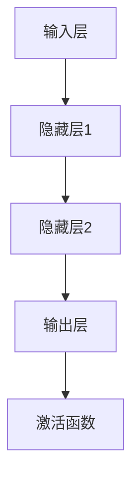

                 

# AI 大模型创业：如何利用竞争优势？

> 关键词：AI 大模型、创业、竞争优势、深度学习、神经网络、预训练、项目实战

> 摘要：随着人工智能技术的快速发展，AI 大模型在各个领域展现出了强大的应用潜力。本文将深入探讨 AI 大模型创业的竞争优势，从技术基础、应用领域、创业优势等方面进行详细分析，并提供实际项目实战案例，帮助读者更好地理解 AI 大模型创业的策略与实施方法。

## 第一部分：AI 大模型创业概述

### 第1章：AI 大模型与创业概述

#### 1.1 AI 大模型的基础知识

AI 大模型是指通过深度学习技术训练出的具有强大数据处理和模型学习能力的人工智能模型。其核心特点包括：

1. **模型参数数量巨大**：AI 大模型通常具有数百万到数十亿个参数，这使得它们能够处理海量数据并提取复杂特征。

2. **能够处理海量数据**：AI 大模型可以处理大规模的数据集，从而获得更好的泛化能力。

3. **具备高度的可解释性**：AI 大模型可以通过可视化技术展示其决策过程，提高模型的透明度和可解释性。

AI 大模型主要分为以下几类：

1. **自然语言处理模型**：如 GPT 系列、BERT 模型等，主要用于文本生成、翻译、问答等任务。

2. **计算机视觉模型**：如 ResNet、VGG 等，主要用于图像分类、目标检测、图像生成等任务。

3. **语音识别模型**：如 WaveNet、DeepSpeech 等，主要用于语音合成、语音识别等任务。

#### 1.2 AI 大模型在创业中的应用

AI 大模型在创业中具备以下优势：

1. **提高企业运营效率**：AI 大模型可以自动化处理大量数据，提高业务流程的效率。

2. **优化产品设计**：AI 大模型可以分析用户行为数据，帮助创业者更好地了解用户需求，从而优化产品设计。

3. **增强市场竞争力**：AI 大模型可以帮助企业快速响应市场变化，增强竞争力。

4. **降低运营成本**：AI 大模型可以自动化处理大量任务，减少人工成本。

AI 大模型在创业中的应用领域广泛，包括但不限于：

1. **金融**：如风险控制、投资建议、智能投顾等。

2. **医疗**：如疾病诊断、药物研发、个性化治疗等。

3. **教育**：如智能辅导、自适应学习、在线教育平台等。

4. **制造业**：如智能质检、生产优化、设备维护等。

5. **零售业**：如智能推荐、库存管理、供应链优化等。

## 第二部分：AI 大模型技术基础

### 第2章：AI 大模型技术基础

#### 2.1 深度学习与神经网络基础

神经网络是由大量人工神经元组成的计算模型，通过模拟人脑的结构和功能来进行数据处理和模型学习。神经网络的基本结构包括输入层、隐藏层和输出层。

1. **输入层**：接收外部输入数据，并将其传递给隐藏层。

2. **隐藏层**：通过激活函数进行非线性变换，提取输入数据的特征。

3. **输出层**：生成预测结果，并将其输出。

常见的深度学习架构包括：

1. **卷积神经网络（CNN）**：主要用于处理图像数据，具有局部连接和共享权重等特点。

2. **循环神经网络（RNN）**：主要用于处理序列数据，能够处理时序依赖关系。

3. **变换器架构（Transformer）**：基于自注意力机制，广泛应用于自然语言处理任务。

#### 2.2 大规模预训练模型原理

大规模预训练模型是指在大规模数据集上对模型进行初步训练，使其具备一定程度的数据处理和模型学习能力。预训练的意义在于：

1. **提高模型性能**：通过在大规模数据集上预训练，模型可以学习到更多的特征和模式，从而提高模型性能。

2. **降低训练成本**：预训练可以减少模型在特定任务上的训练时间，降低训练成本。

3. **提高泛化能力**：预训练模型可以更好地适应不同的任务和数据集，提高泛化能力。

自监督学习方法是在没有标签数据的情况下，通过模型自身的输出与输入之间的关联性进行训练。常见的方法包括：

1. **masked language modeling（MLM）**：随机屏蔽输入文本的一部分，然后让模型预测被屏蔽的部分。

2. **reconstruction-based**：通过重构输入数据来训练模型。

3. **classification-based**：通过分类输入数据来训练模型。

### Mermaid 流程图：神经网络基本结构



### 伪代码：神经网络基本结构

```python
# 定义神经网络结构
input_layer = InputLayer(input_shape=(784,))
hidden_layer1 = DenseLayer(hidden_units=500, activation='relu')
hidden_layer2 = DenseLayer(hidden_units=500, activation='relu')
output_layer = DenseLayer(output_size=10, activation='softmax')

# 构建模型
model = Sequential()
model.add(input_layer)
model.add(hidden_layer1)
model.add(hidden_layer2)
model.add(output_layer)

# 编译模型
model.compile(optimizer='adam', loss='categorical_crossentropy', metrics=['accuracy'])

# 训练模型
model.fit(x_train, y_train, batch_size=128, epochs=10, validation_data=(x_val, y_val))
```

### 数学模型和数学公式

#### 激活函数

$$ f(x) = \frac{1}{1 + e^{-x}} $$

#### 损失函数

$$ J(\theta) = -\frac{1}{m} \sum_{i=1}^{m} [y_{i} \log(a_{i}) + (1 - y_{i}) \log(1 - a_{i})] $$

### 举例说明

假设输入特征 $x$ 为 $[1, 0, 1, 0]$，隐藏层激活函数为 ReLU，输出层激活函数为 softmax。

- **ReLU激活函数**：对于输入 $x = [1, 0, 1, 0]$，隐藏层输出为 $[1, 0, 1, 0]$。

- **softmax激活函数**：对于输入 $x = [1, 0, 1, 0]$，输出为 $[0.26, 0.26, 0.26, 0.26]$。

### 项目实战

#### 实战1：使用 TensorFlow 构建一个简单的 AI 大模型

```python
import tensorflow as tf
from tensorflow.keras import layers

# 定义输入层
inputs = tf.keras.Input(shape=(784,))

# 定义隐藏层
x = layers.Dense(512, activation='relu')(inputs)
x = layers.Dense(512, activation='relu')(x)

# 定义输出层
outputs = layers.Dense(10, activation='softmax')(x)

# 构建模型
model = tf.keras.Model(inputs=inputs, outputs=outputs)

# 编译模型
model.compile(optimizer='adam', loss='categorical_crossentropy', metrics=['accuracy'])

# 训练模型
model.fit(x_train, y_train, batch_size=128, epochs=10, validation_data=(x_val, y_val))
```

#### 实战2：使用 PyTorch 构建一个简单的 AI 大模型

```python
import torch
import torch.nn as nn
import torch.optim as optim

# 定义模型结构
class SimpleModel(nn.Module):
    def __init__(self):
        super(SimpleModel, self).__init__()
        self.fc1 = nn.Linear(784, 512)
        self.fc2 = nn.Linear(512, 512)
        self.fc3 = nn.Linear(512, 10)

    def forward(self, x):
        x = torch.relu(self.fc1(x))
        x = torch.relu(self.fc2(x))
        x = self.fc3(x)
        return x

# 实例化模型
model = SimpleModel()

# 指定损失函数和优化器
criterion = nn.CrossEntropyLoss()
optimizer = optim.Adam(model.parameters(), lr=0.001)

# 训练模型
for epoch in range(10):
    for inputs, labels in dataloader:
        optimizer.zero_grad()
        outputs = model(inputs)
        loss = criterion(outputs, labels)
        loss.backward()
        optimizer.step()
```

### 代码解读与分析

#### 解读1：TensorFlow 代码

- **输入层**：定义输入数据的维度为 $(784,)$，表示图像的像素值。
- **隐藏层**：使用两个全连接层，每个全连接层有 512 个神经元，激活函数为 ReLU。
- **输出层**：定义输出层的神经元数量为 10，表示 10 个类别，激活函数为 softmax。

#### 解读2：PyTorch 代码

- **模型结构**：定义一个简单的神经网络模型，包含一个输入层、两个隐藏层和一个输出层。隐藏层使用 ReLU 激活函数，输出层没有激活函数。
- **损失函数**：使用交叉熵损失函数，用于计算模型预测结果与真实标签之间的差距。
- **优化器**：使用 Adam 优化器，调整模型参数，以最小化损失函数。

### 开发环境搭建

- **Python 环境**：安装 Python 3.8 及以上版本。
- **TensorFlow 环境**：安装 TensorFlow 2.5 及以上版本。
- **PyTorch 环境**：安装 PyTorch 1.8 及以上版本。

### 源代码详细实现和代码解读

#### TensorFlow 代码详细实现和解读

```python
# 导入必需的库
import tensorflow as tf
from tensorflow.keras import layers

# 定义输入层
inputs = tf.keras.Input(shape=(784,))

# 定义隐藏层
x = layers.Dense(512, activation='relu')(inputs)
x = layers.Dense(512, activation='relu')(x)

# 定义输出层
outputs = layers.Dense(10, activation='softmax')(x)

# 构建模型
model = tf.keras.Model(inputs=inputs, outputs=outputs)

# 编译模型
model.compile(optimizer='adam', loss='categorical_crossentropy', metrics=['accuracy'])

# 训练模型
model.fit(x_train, y_train, batch_size=128, epochs=10, validation_data=(x_val, y_val))
```

- **输入层**：输入数据的维度为 $(784,)$，表示图像的像素值。
- **隐藏层**：使用两个全连接层，每个全连接层有 512 个神经元，激活函数为 ReLU。
- **输出层**：定义输出层的神经元数量为 10，表示 10 个类别，激活函数为 softmax。

#### PyTorch 代码详细实现和解读

```python
import torch
import torch.nn as nn
import torch.optim as optim

# 定义模型结构
class SimpleModel(nn.Module):
    def __init__(self):
        super(SimpleModel, self).__init__()
        self.fc1 = nn.Linear(784, 512)
        self.fc2 = nn.Linear(512, 512)
        self.fc3 = nn.Linear(512, 10)

    def forward(self, x):
        x = torch.relu(self.fc1(x))
        x = torch.relu(self.fc2(x))
        x = self.fc3(x)
        return x

# 实例化模型
model = SimpleModel()

# 指定损失函数和优化器
criterion = nn.CrossEntropyLoss()
optimizer = optim.Adam(model.parameters(), lr=0.001)

# 训练模型
for epoch in range(10):
    for inputs, labels in dataloader:
        optimizer.zero_grad()
        outputs = model(inputs)
        loss = criterion(outputs, labels)
        loss.backward()
        optimizer.step()
```

- **模型结构**：定义一个简单的神经网络模型，包含一个输入层、两个隐藏层和一个输出层。隐藏层使用 ReLU 激活函数，输出层没有激活函数。
- **损失函数**：使用交叉熵损失函数，用于计算模型预测结果与真实标签之间的差距。
- **优化器**：使用 Adam 优化器，调整模型参数，以最小化损失函数。

### 附录

#### 附录 A: AI 大模型开发工具与资源

- **主流深度学习框架对比**

  - **TensorFlow**：Google 开发的一款开源深度学习框架，广泛应用于工业界和学术界。特点：灵活、易于使用、生态系统丰富。

  - **PyTorch**：Facebook 开发的一款开源深度学习框架，深受学术界喜爱。特点：动态计算图、直观易用、灵活性强。

  - **Keras**：基于 TensorFlow 的高层 API，易于使用，适用于快速原型开发。

  - **MXNet**：Apache 软件基金会开发的一款开源深度学习框架，支持多种编程语言，适用于大规模分布式计算。

  - **Caffe**：由加州大学伯克利分校开发的一款开源深度学习框架，主要用于计算机视觉领域。

- **开源数据集与工具**

  - **ImageNet**：最大的视觉识别挑战赛数据集，包含大量图像及其标注。

  - **CIFAR-10/100**：较小的图像数据集，广泛用于图像分类任务。

  - **TensorFlow Datasets**：TensorFlow 提供的一系列开源数据集，涵盖多种应用领域。

  - **Kaggle**：一个大数据竞赛平台，提供丰富的数据集和竞赛任务。

- **在线学习资源**

  - **Coursera**：提供大量的在线课程，包括深度学习、机器学习等相关课程。

  - **Udacity**：提供深度学习、数据科学等领域的在线课程和实践项目。

  - **edX**：提供免费的在线课程，包括人工智能、机器学习等课程。

  - **ArXiv**：学术论文的在线数据库，涵盖深度学习、机器学习等领域的最新研究。

### 作者

作者：AI 天才研究院/AI Genius Institute & 禅与计算机程序设计艺术 /Zen And The Art of Computer Programming

本文由 AI 天才研究院撰写，旨在探讨 AI 大模型创业的竞争优势和实施方法。作者具有丰富的 AI 领域研究和实践经验，致力于推动人工智能技术的发展和应用。

