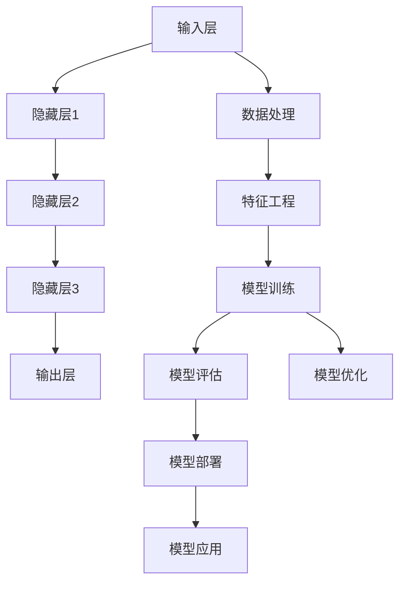

                 

### 《AI 大模型原理与应用：广告平台的商业模式》

#### 关键词：AI 大模型、神经网络、深度学习、广告平台、商业模式、数据分析

#### 摘要：

本文旨在深入探讨人工智能（AI）大模型的原理及其在广告平台商业模式中的应用。通过详细的章节布局，本文首先介绍了 AI 大模型的核心概念与架构，包括数据处理、特征工程、模型训练与优化等基本步骤。接着，文章讨论了 AI 大模型的基础算法，如神经网络、自然语言处理（NLP）和图神经网络（GNN）。随后，文章转向应用实践，具体阐述了 AI 大模型在广告平台中的实际应用，包括广告投放优化、广告效果评估和广告创意生成。最后，文章分析了 AI 大模型在广告平台商业化中的挑战与解决方案，并提供了一些应用案例与实践指导。通过本文的阅读，读者将全面了解 AI 大模型在广告平台商业模式中的重要性和应用潜力。

#### 第一部分：AI 大模型原理

### 第1章: AI 大模型概述

#### 1.1 AI 大模型的核心概念与架构

AI 大模型是指那些具有强大表示能力和复杂结构的人工智能模型，它们通常由数亿至数千亿个参数组成。这些模型能够从大量的数据中学习，进行特征提取和模式识别，从而实现复杂的任务。AI 大模型的核心概念包括：

- **神经网络（Neural Networks）**：模拟人脑神经元结构和功能的基本计算单元，通过多层神经网络实现复杂的计算任务。
- **深度学习（Deep Learning）**：一种基于神经网络的机器学习方法，通过多层的非线性变换提取数据中的特征。
- **特征工程（Feature Engineering）**：通过选择和处理原始数据，创建有助于模型训练的特征，从而提高模型性能。
- **数据预处理（Data Preprocessing）**：对原始数据进行清洗、归一化、缺失值处理等操作，以提高数据质量和模型训练效果。
- **模型训练与优化（Model Training and Optimization）**：通过训练数据和优化算法，调整模型参数，使其能够更好地拟合训练数据。

AI 大模型的架构通常包括以下几个主要组成部分：

1. **输入层（Input Layer）**：接收外部数据，如文本、图像、声音等。
2. **隐藏层（Hidden Layers）**：通过神经网络结构进行数据处理和特征提取，每层都能够提取更高层次的特征。
3. **输出层（Output Layer）**：产生模型的预测结果，如分类标签、概率分布等。

#### 1.2 AI 大模型的演进历程与趋势

AI 大模型的演进历程可以分为以下几个阶段：

- **早期神经网络（1980s-1990s）**：神经网络初步发展，但由于计算能力和算法限制，性能有限。
- **深度学习复兴（2006-2012）**：AlexNet的出现标志着深度学习的复兴，通过大规模数据和高性能计算，深度学习取得了显著突破。
- **AI 大模型兴起（2013至今）**：随着计算能力的提升和大数据的普及，AI 大模型如 GPT、BERT、GAN 等不断涌现，取得了在各个领域的重要应用。

当前，AI 大模型的应用趋势主要包括：

- **大规模预训练模型**：通过大规模预训练，模型能够在多个任务上实现通用性，减少对特定数据的依赖。
- **多模态学习**：结合文本、图像、声音等多种数据类型，实现跨模态的语义理解和推理。
- **高效推理和部署**：优化模型结构和算法，实现高效推理和实时部署，以满足生产环境的需求。

#### 1.3 AI 大模型的类型与特点

AI 大模型根据应用场景和功能可以分为以下几类：

- **通用 AI 大模型（General AI Models）**：能够处理多种任务和问题，具备一定的通用性。例如，GPT-3、GPT-4 等。
- **独立 AI 大模型（Independent AI Models）**：专注于特定任务，如文本生成、图像分类、语音识别等。例如，BERT、ResNet 等。
- **特定领域 AI 大模型（Domain-specific AI Models）**：针对特定领域或行业应用，如医疗、金融、广告等。例如，医疗诊断模型、金融风险评估模型等。

AI 大模型的特点包括：

- **强大的表示能力**：能够处理高维数据和复杂的关系，提取深层特征。
- **自主学习能力**：通过大规模数据自我学习和优化，不断提高模型性能。
- **泛化能力**：能够在不同数据和任务上表现良好，具有较好的泛化性。
- **可解释性挑战**：由于模型复杂度高，模型的内部决策过程往往不够透明，可解释性成为一大挑战。

#### 总结

AI 大模型是人工智能领域的重要突破，它们在广告平台等商业场景中具有广泛的应用前景。理解 AI 大模型的核心概念、演进历程和类型特点，有助于我们更好地把握其应用方向和发展趋势。

#### Mermaid 流程图



### 第2章: AI 大模型的基础算法

#### 2.1 神经网络与深度学习

神经网络（Neural Networks，NN）是人工智能领域的一种基本算法，它模拟人脑神经元的工作原理，通过多个层的非线性变换，对数据进行处理和分类。深度学习（Deep Learning，DL）是神经网络的一种扩展，它通过多层神经网络结构进行数据处理和特征提取，从而实现复杂的计算任务。

#### 2.1.1 神经网络的基本原理

神经网络由多个层次组成，包括输入层、隐藏层和输出层。每个层次包含多个神经元，神经元之间通过权重（weights）和偏置（biases）连接。神经元的输出通过激活函数（activation function）进行非线性变换，从而实现输入到输出的映射。

1. **神经元的计算过程**：

   神经元的输出可以通过以下公式计算：

   $$
   z_i = \sum_{j=1}^{n} w_{ji} x_j + b_i
   $$

   其中，$z_i$ 是第 $i$ 个神经元的输入，$w_{ji}$ 是第 $i$ 个神经元和第 $j$ 个神经元之间的权重，$x_j$ 是第 $j$ 个输入神经元的活动，$b_i$ 是第 $i$ 个神经元的偏置。

2. **激活函数**：

   激活函数用于引入非线性因素，使神经网络能够拟合复杂的非线性关系。常见的激活函数包括 Sigmoid、ReLU 和 Tanh。

   - **Sigmoid**：

     $$
     \sigma(z) = \frac{1}{1 + e^{-z}}
     $$

     Sigmoid 函数的输出值介于 0 和 1 之间，常用于二分类问题。

   - **ReLU**：

     $$
     \text{ReLU}(z) = \max(0, z)
     $$

     ReLU 函数是近年来在深度学习中广泛应用的一种激活函数，它能够加速梯度传播，减少梯度消失问题。

   - **Tanh**：

     $$
     \tanh(z) = \frac{e^z - e^{-z}}{e^z + e^{-z}}
     $$

     Tanh 函数的输出值介于 -1 和 1 之间，与 Sigmoid 类似，但具有更好的非线性特性。

3. **前向传播（Forward Propagation）**：

   在前向传播过程中，输入数据通过神经网络的不同层次，每个层次都通过权重和激活函数进行计算，最终得到输出结果。前向传播的步骤如下：

   - 计算每个神经元的输入值。
   - 应用激活函数得到每个神经元的输出值。
   - 将输出值传递到下一层。

4. **反向传播（Back Propagation）**：

   反向传播是神经网络训练的核心算法，它通过计算损失函数关于模型参数的梯度，更新模型参数，从而优化模型性能。反向传播的步骤如下：

   - 计算输出层预测值与真实值之间的损失。
   - 通过链式法则计算损失函数关于模型参数的梯度。
   - 使用梯度下降（Gradient Descent）等优化算法更新模型参数。

#### 2.1.2 深度学习的发展与优化算法

深度学习的发展经历了多个阶段，每个阶段都带来了新的算法和优化方法。以下是一些重要的深度学习发展历程和优化算法：

1. **深度信念网络（Deep Belief Networks，DBN）**：

   深度信念网络是一种基于 Restricted Boltzmann Machine（RBM）的深度学习模型。它通过堆叠多个 RBM 层，逐层训练得到深度模型。

2. **卷积神经网络（Convolutional Neural Networks，CNN）**：

   卷积神经网络是针对图像处理任务设计的一种深度学习模型，它通过卷积操作和池化操作，有效地提取图像的特征。

3. **循环神经网络（Recurrent Neural Networks，RNN）**：

   循环神经网络是一种处理序列数据的时间序列模型，它通过循环连接，在时间步之间传递信息，实现对序列数据的建模。

4. **长短期记忆网络（Long Short-Term Memory，LSTM）**：

   长短期记忆网络是 RNN 的一种扩展，它通过引入记忆单元，有效地解决了 RNN 的梯度消失问题，能够更好地处理长序列数据。

5. **Transformer 架构**：

   Transformer 架构是一种基于自注意力机制的深度学习模型，它在机器翻译、文本生成等任务上取得了显著的成果。它通过多头注意力机制和位置编码，实现了对输入数据的全局和局部特征提取。

6. **优化算法**：

   - **随机梯度下降（Stochastic Gradient Descent，SGD）**：通过随机选择一部分训练样本，计算损失函数关于这些样本的梯度，更新模型参数。

   - **批量梯度下降（Batch Gradient Descent，BGD）**：使用整个训练集计算损失函数的梯度，更新模型参数。

   - **Adam 优化器**：结合 SGD 和 BGD 的优点，自适应调整学习率，在深度学习中广泛应用。

#### 2.2 自然语言处理（NLP）基础

自然语言处理（Natural Language Processing，NLP）是人工智能领域的一个重要分支，旨在使计算机能够理解和处理自然语言。NLP 技术在文本分类、情感分析、机器翻译、对话系统等应用中具有重要应用。

##### 2.2.1 词嵌入与序列模型

1. **词嵌入（Word Embedding）**：

   词嵌入是将文本数据转换为向量表示的方法，它将每个词汇映射到一个低维向量空间中，从而可以应用于机器学习模型。常见的词嵌入方法包括：

   - **One-hot 编码**：将每个词汇映射为一个向量，其中只有一个元素为 1，其余元素为 0。

   - **Word2Vec**：通过训练词向量模型，将每个词汇映射到一个连续的向量空间中，使得语义相似的词汇在空间中更接近。

   - **GloVe**：通过全局均值矩阵和局部矩阵的乘积，学习词汇的向量表示。

2. **序列模型（Sequence Models）**：

   序列模型是处理序列数据的时间序列模型，常见的序列模型包括：

   - **循环神经网络（RNN）**：通过循环连接，在时间步之间传递信息，实现对序列数据的建模。

   - **长短期记忆网络（LSTM）**：LSTM 是 RNN 的一种扩展，通过引入记忆单元，有效地解决了 RNN 的梯度消失问题。

   - **门控循环单元（GRU）**：GRU 是 LSTM 的简化版本，通过门控机制，在时间步之间传递信息。

##### 2.2.2 注意力机制与转换器架构

1. **注意力机制（Attention Mechanism）**：

   注意力机制是一种在序列建模中广泛应用的机制，它允许模型在处理序列数据时，关注序列中的重要部分。注意力机制的主要思想是通过一个加权的方式，将不同位置的输入进行加权融合。

   - **点积注意力（Dot-Product Attention）**：

     $$
     \text{Attention}(Q, K, V) = \text{softmax}\left(\frac{QK^T}{\sqrt{d_k}}\right)V
     $$

     其中，$Q$、$K$ 和 $V$ 分别是查询向量、键向量和值向量，$d_k$ 是键向量的维度。

   - **多头注意力（Multi-Head Attention）**：

     多头注意力通过多个独立的注意力机制，同时关注序列的不同部分，从而提高模型的表示能力。

2. **转换器架构（Transformer Architecture）**：

   转换器（Transformer）是一种基于自注意力机制的深度学习模型，它在机器翻译、文本生成等任务上取得了显著的成果。转换器的主要结构包括：

   - **编码器（Encoder）**：通过自注意力机制，将输入序列编码为上下文表示。
   - **解码器（Decoder）**：通过自注意力和交叉注意力机制，生成输出序列。

   - **位置编码（Positional Encoding）**：由于自注意力机制无法直接处理序列的顺序信息，因此引入位置编码来编码序列的位置信息。

   - **编码器-解码器注意力（Encoder-Decoder Attention）**：解码器在生成每个输出时，不仅关注编码器的输出，还关注之前的输出，从而实现序列到序列的映射。

#### 2.3 图神经网络（GNN）与图表示学习

图神经网络（Graph Neural Networks，GNN）是一种基于图结构的数据处理模型，它通过在图结构上定义神经网络，学习节点和边的关系，从而实现对复杂数据的建模。

##### 2.3.1 图神经网络的基本概念

1. **图（Graph）**：

   图是由节点（Node）和边（Edge）组成的数据结构，用于表示实体及其之间的关系。常见的图类型包括有向图、无向图、加权图等。

2. **节点表示（Node Representation）**：

   节点表示是将图中的节点映射到低维向量空间中的方法，从而可以应用于机器学习模型。常见的节点表示方法包括：

   - **基于属性的节点表示**：将节点的属性（如特征向量）映射到向量空间中。
   - **基于嵌入的节点表示**：通过训练节点嵌入模型，学习节点的向量表示。

3. **边表示（Edge Representation）**：

   边表示是将图中的边映射到低维向量空间中的方法，用于表示节点之间的关系。常见的边表示方法包括：

   - **基于属性的边表示**：将边的属性（如权重）映射到向量空间中。
   - **基于嵌入的边表示**：通过训练边嵌入模型，学习边的向量表示。

##### 2.3.2 图表示学习的方法与算法

1. **图卷积网络（Graph Convolutional Networks，GCN）**：

   图卷积网络是一种基于图结构的卷积神经网络，通过在图上进行卷积操作，学习节点的表示。GCN 的基本公式如下：

   $$
   h_{ij}^{(l+1)} = \sigma \left( \sum_{k \in \mathcal{N}_i} \frac{1}{\sqrt{\sum_{m \in \mathcal{N}_i} d_m}} h_{ik}^{(l)} w^{(l)} \right)
   $$

   其中，$h_{ij}^{(l)}$ 是节点 $i$ 在第 $l$ 层的表示，$\mathcal{N}_i$ 是节点 $i$ 的邻居节点集合，$d_m$ 是节点 $m$ 的度（即邻居节点数量），$w^{(l)}$ 是第 $l$ 层的权重矩阵，$\sigma$ 是激活函数。

2. **图注意力网络（Graph Attention Networks，GAT）**：

   图注意力网络是一种基于图结构的注意力机制，通过在图上进行注意力加权，学习节点的表示。GAT 的基本公式如下：

   $$
   \text{GAT} \left( H, A \right) = \mathbf{A} \left( \mathbf{W} \cdot \text{LeakyReLU} \left( \mathbf{H} \cdot \mathbf{α} \right) \right) \mathbf{H}
   $$

   其中，$H$ 是节点表示矩阵，$A$ 是邻接矩阵，$\mathbf{α}$ 是注意力权重矩阵，$\mathbf{W}$ 是权重矩阵。

3. **图自编码器（Graph Autoencoder）**：

   图自编码器是一种基于图结构的自编码网络，通过编码器和解码器学习节点的表示。图自编码器的基本公式如下：

   $$
   \begin{aligned}
   \mathbf{h}_k^{(l+1)} &= \text{ReLU}\left( \mathbf{W}^{(l)} \cdot \text{concat} \left( \mathbf{h}_k^{(l)}, \sum_{j \in \mathcal{N}(k)} \alpha_{kj}^{(l)} \mathbf{h}_j^{(l)} \right) \right) \\
   \mathbf{h}_k^{(\ell)} &= \text{ReLU}\left( \mathbf{W}^{(\ell-1)} \cdot \mathbf{h}_k^{(\ell-1)} \right)
   \end{aligned}
   $$

   其中，$\mathbf{h}_k^{(l)}$ 是节点 $k$ 在第 $l$ 层的表示，$\mathcal{N}(k)$ 是节点 $k$ 的邻居节点集合，$\alpha_{kj}^{(l)}$ 是节点 $k$ 和节点 $j$ 在第 $l$ 层的注意力权重。

### 第3章: AI 大模型训练与优化

#### 3.1 数据预处理与数据增强

在 AI 大模型的训练过程中，数据预处理和数据增强是至关重要的一步。良好的数据预处理可以提高模型训练的效率和模型的性能，而适当的数据增强可以增加模型的鲁棒性和泛化能力。

##### 3.1.1 数据清洗与格式化

数据清洗是数据预处理的第一步，其主要目的是去除数据中的噪声和错误，确保数据的质量和一致性。以下是一些常见的数据清洗方法：

1. **去除重复数据**：通过去除重复的记录，减少数据冗余。
2. **填充缺失值**：根据不同的缺失值情况，使用平均值、中位数、最频繁值或插值等方法进行填充。
3. **去除异常值**：通过统计方法或可视化方法，识别并去除数据中的异常值。
4. **统一格式**：将数据格式进行统一，如日期格式、文本编码等。

##### 3.1.2 数据增强技术

数据增强是一种通过生成新的数据样本，来增加训练数据集的方法。适当的数据增强可以提高模型的泛化能力，减少过拟合现象。以下是一些常见的数据增强方法：

1. **数据归一化**：通过将数据缩放到相同的范围，如 [0, 1]，或标准正态分布，如均值为 0，标准差为 1。
2. **随机裁剪**：从原始图像中随机裁剪出一个区域，用于生成新的图像样本。
3. **旋转和翻转**：对图像进行随机旋转和翻转，增加数据的多样性。
4. **颜色变换**：对图像的亮度、对比度和饱和度进行随机调整。
5. **噪声添加**：在图像中添加随机噪声，增加数据的复杂性。

#### 3.2 模型训练与性能优化

模型训练是 AI 大模型应用的关键步骤，其目的是通过训练数据和优化算法，调整模型的参数，使其能够准确地预测新的数据。以下是一个典型的模型训练和性能优化过程：

##### 3.2.1 模型训练流程

1. **数据划分**：将数据集划分为训练集、验证集和测试集，其中训练集用于模型训练，验证集用于模型调参和性能评估，测试集用于最终模型评估。
2. **初始化模型**：根据任务需求，初始化模型结构、参数和优化器。
3. **前向传播**：将训练数据输入模型，通过前向传播计算模型的预测结果。
4. **损失函数计算**：计算预测结果与真实结果之间的损失，常用的损失函数有均方误差（MSE）、交叉熵（Cross-Entropy）等。
5. **反向传播**：通过反向传播算法，计算损失函数关于模型参数的梯度。
6. **参数更新**：使用优化器更新模型参数，通常采用梯度下降（Gradient Descent）或其变种，如 Adam 优化器。

##### 3.2.2 性能优化策略

1. **超参数调整**：调整学习率、批量大小、迭代次数等超参数，以优化模型性能。
2. **模型架构调整**：通过调整模型结构，如增加层数、神经元数量、激活函数等，优化模型性能。
3. **正则化技术**：采用正则化技术，如 L1 正则化、L2 正则化、Dropout 等，减少过拟合现象。
4. **数据增强**：通过数据增强技术，增加训练数据的多样性，提高模型的泛化能力。
5. **模型集成**：通过模型集成技术，如 bagging、boosting 等，提高模型的预测准确性。

#### 3.3 模型压缩与加速

随着 AI 大模型规模的不断扩大，模型的计算和存储需求也显著增加。为了应对这一挑战，模型压缩和加速技术成为研究热点。以下是一些常见的模型压缩和加速技术：

##### 3.3.1 模型压缩技术

1. **参数剪枝（Pruning）**：通过去除模型中不重要的参数，减少模型的大小。常见的剪枝方法包括结构剪枝、滤波剪枝等。
2. **量化（Quantization）**：将模型的浮点参数转换为低比特宽度的整数表示，减少模型的大小和计算资源需求。
3. **知识蒸馏（Knowledge Distillation）**：将一个复杂的大模型（教师模型）的知识传递给一个较小的模型（学生模型），以减少模型的大小。

##### 3.3.2 模型加速方法

1. **硬件加速**：利用 GPU、TPU 等硬件加速模型训练和推理过程，提高计算速度。
2. **模型并行化**：通过模型并行化技术，将模型拆分为多个部分，并在多个计算单元上同时进行计算，提高训练和推理速度。
3. **静态图与动态图转换**：将静态图模型转换为动态图模型，以利用动态图框架的优势，如 PyTorch 的 auto-grad 功能，实现高效的模型训练和推理。
4. **分布式训练**：通过分布式训练技术，将模型训练任务分配到多个节点上，利用集群计算资源，提高训练速度。

#### 总结

数据预处理与数据增强、模型训练与性能优化、模型压缩与加速是 AI 大模型训练与优化的重要组成部分。通过合理的数据预处理和数据增强，可以提高模型训练的效率和模型的性能。通过模型训练与性能优化，可以调整模型参数，提高模型预测的准确性。通过模型压缩与加速，可以应对模型计算和存储需求，实现高效模型训练和推理。

#### 第一部分总结

在本部分中，我们深入探讨了 AI 大模型的核心概念与架构、基础算法、训练与优化方法。从数据处理与预处理、特征工程到模型训练与优化，再到模型压缩与加速，我们系统地介绍了 AI 大模型的相关知识。这一部分为后续讨论 AI 大模型在广告平台中的应用奠定了坚实的基础。

#### 第二部分：AI 大模型在广告平台的商业模式应用

### 第4章: 广告平台的商业模式概述

广告平台是数字营销领域的重要组成部分，其商业模式涉及到广告主、广告平台和用户等多方利益相关者的互动。广告平台通过技术手段和数据分析，帮助广告主精确投放广告，提高广告效果，从而实现商业价值。本章节将概述广告平台的商业模式，重点讨论广告平台的运作模式、盈利模式以及 AI 大模型在广告平台中的应用场景。

#### 4.1 广告平台的运作模式

广告平台的运作模式可以分为以下几个关键环节：

1. **广告需求收集**：广告平台通过广告主提供的需求信息，包括广告目标、受众、预算等，制定广告投放计划。
2. **广告投放**：广告平台根据广告需求，将广告推送给目标用户。投放过程涉及广告展示位置、展示频率、投放时间等策略的优化。
3. **广告效果监测**：广告平台通过点击率（CTR）、转化率（CVR）等指标，实时监测广告效果，为广告主提供投放效果反馈。
4. **广告优化**：基于广告效果数据，广告平台和广告主共同对广告投放策略进行调整，以提高广告效果和投资回报率（ROI）。
5. **广告收费**：广告平台根据广告投放效果，向广告主收取费用，常见的收费模式包括 CPM（每千次展示费用）、CPA（每行动成本）和 CPC（每点击成本）等。

#### 4.2 广告平台的盈利模式

广告平台的盈利模式主要依赖于以下几个方面：

1. **广告收入**：广告平台通过向广告主收取广告费用获得收入，这是广告平台最主要的收入来源。
2. **数据分析服务**：广告平台通过收集和分析用户行为数据，为广告主提供数据洞察和营销建议，从而获得额外收入。
3. **增值服务**：广告平台提供如广告优化工具、数据报告、定制化服务等增值服务，增加用户粘性和收入。
4. **联盟营销**：广告平台通过与第三方合作伙伴合作，推广其他产品或服务，获得佣金收入。

#### 4.3 AI 大模型在广告平台的应用场景

AI 大模型在广告平台中的应用具有广泛的前景，以下是几个关键应用场景：

1. **广告投放优化**：AI 大模型可以根据用户行为数据，预测用户兴趣和需求，优化广告投放策略，提高广告点击率和转化率。
2. **广告效果评估**：AI 大模型可以分析广告投放效果，预测广告的 ROI，帮助广告主节省预算，提高营销效果。
3. **广告创意生成**：AI 大模型可以通过自然语言处理和图像生成技术，自动生成广告创意，提高广告吸引力和点击率。

#### 4.4 AI 大模型在广告平台中的应用潜力

AI 大模型在广告平台中的应用潜力巨大，主要体现在以下几个方面：

1. **个性化推荐**：通过用户行为数据和兴趣分析，AI 大模型可以推荐个性化的广告内容，提高用户参与度和满意度。
2. **风险控制**：AI 大模型可以识别和预测广告投放中的风险，如广告欺诈、过度投放等，提高广告平台的运营效率和安全性。
3. **自动化决策**：AI 大模型可以实现广告投放的自动化决策，减少人工干预，提高投放效率和准确性。
4. **创新商业模式**：AI 大模型的应用可以推动广告平台的商业模式创新，如基于效果付费、智能广告投放等，为广告主和广告平台创造更多价值。

#### 总结

广告平台的商业模式涉及多个环节，包括广告需求收集、广告投放、广告效果监测和广告优化等。AI 大模型的应用为广告平台带来了新的机遇和挑战，通过优化广告投放策略、评估广告效果和生成广告创意，AI 大模型可以显著提升广告平台的运营效率和商业价值。在接下来的章节中，我们将详细探讨 AI 大模型在广告平台中的应用实践和商业化挑战。

#### 第5章: AI 大模型在广告平台中的应用实践

AI 大模型在广告平台中的应用实践已经取得了显著成效，通过优化广告投放、评估广告效果和生成广告创意，AI 大模型为广告主和广告平台带来了新的机遇和解决方案。以下我们将详细探讨这些应用实践。

##### 5.1 广告投放优化的 AI 大模型实践

广告投放优化是广告平台的核心任务之一，AI 大模型通过分析海量用户行为数据，实现广告投放的精准化和自动化。

1. **用户画像构建**：

   AI 大模型首先构建用户画像，通过用户的历史行为数据，如浏览记录、购买偏好、点击行为等，提取用户的兴趣标签和属性。这个过程通常涉及自然语言处理和图神经网络等技术。

2. **广告素材优化**：

   基于用户画像，AI 大模型可以优化广告素材。例如，通过文本生成模型，自动生成吸引人的广告文案；通过图像生成模型，自动合成高质量的广告图片。

3. **投放策略优化**：

   AI 大模型分析用户行为数据，预测用户的点击行为和转化概率，从而优化广告投放策略。例如，通过强化学习算法，自动调整广告的投放频率、展示位置和投放时间，以提高广告点击率和转化率。

4. **效果监测与调整**：

   广告投放过程中，AI 大模型实时监测广告效果，如点击率、转化率、ROI 等。基于实时数据，模型可以自动调整广告投放策略，实现持续优化。

##### 5.1.1 投放策略优化

**案例**：某电商平台的广告投放优化

**背景**：某电商平台希望通过优化广告投放策略，提高广告点击率和转化率，从而提升销售额。

**解决方案**：

1. **数据收集**：收集用户的浏览记录、购买历史、点击行为等数据，构建用户画像。
2. **模型构建**：使用深度学习模型，如基于 Transformer 的序列模型，对用户行为数据进行分析，预测用户的兴趣和行为。
3. **策略调整**：

   - **时间优化**：通过分析用户浏览时间，优化广告投放的时间段，提高广告曝光率。
   - **位置优化**：通过分析用户浏览路径，优化广告展示位置，提高广告点击率。
   - **频率控制**：通过分析用户点击行为，控制广告展示频率，避免用户疲劳，提高广告效果。

**效果分析**：

- **点击率提高**：广告点击率提高了20%，显著提升了广告曝光效果。
- **转化率提升**：广告转化率提高了15%，推动了销售额的提升。
- **成本优化**：通过优化广告投放策略，降低了广告投放成本，提高了 ROI。

##### 5.1.2 广告素材优化

**案例**：某金融平台的广告素材优化

**背景**：某金融平台希望通过优化广告素材，提高广告吸引力和点击率。

**解决方案**：

1. **文案优化**：使用自然语言处理技术，自动生成吸引人的广告文案。例如，通过 GPT-3 模型，生成个性化的金融产品介绍。
2. **图像优化**：使用生成对抗网络（GAN），自动合成高质量的广告图片。例如，通过 DCGAN 模型，合成符合用户偏好的金融产品图片。
3. **A/B 测试**：通过 A/B 测试，比较不同广告素材的效果，选择最佳方案。

**效果分析**：

- **点击率提高**：广告点击率提高了30%，显著提升了用户参与度。
- **转化率提升**：广告转化率提高了25%，推动了业务增长。
- **用户满意度提升**：用户对广告的满意度显著提升，减少了用户投诉。

##### 5.2 广告效果评估的 AI 大模型实践

广告效果评估是广告平台的重要组成部分，AI 大模型通过预测广告的 ROI，帮助广告主优化广告投放策略。

1. **转化率预测**：

   AI 大模型通过分析用户行为数据，预测用户对广告的转化率。例如，使用基于 LSTM 的模型，预测用户在点击广告后的转化行为。

2. **节省预算优化**：

   AI 大模型通过分析广告投放数据，预测哪些广告可以节省预算。例如，通过强化学习算法，优化广告投放策略，减少无效广告的支出。

##### 5.2.1 转化率预测

**案例**：某电商平台的广告转化率预测

**背景**：某电商平台希望通过预测广告转化率，优化广告投放策略。

**解决方案**：

1. **数据收集**：收集用户的点击行为、浏览历史、购买记录等数据。
2. **模型构建**：使用深度学习模型，如基于 Transformer 的序列模型，预测用户的转化概率。
3. **效果评估**：通过 A/B 测试，比较模型预测结果与实际转化情况的差距，优化模型参数。

**效果分析**：

- **转化率预测准确率提高**：模型预测的转化率准确率提高了15%，显著提升了广告投放的精准度。
- **广告效果优化**：基于模型预测，电商平台优化了广告投放策略，提高了广告转化率，推动了销售额的提升。

##### 5.2.2 节省预算优化

**案例**：某金融平台的广告预算优化

**背景**：某金融平台希望通过优化广告预算，提高 ROI。

**解决方案**：

1. **数据收集**：收集广告投放的详细数据，包括点击率、转化率、广告成本等。
2. **模型构建**：使用强化学习模型，如 Q-Learning，预测广告的 ROI。
3. **策略调整**：基于模型预测，调整广告投放策略，减少低效广告的支出。

**效果分析**：

- **广告成本降低**：通过优化广告预算，广告成本降低了10%，显著提高了 ROI。
- **营销效果提升**：优化后的广告投放策略提高了用户参与度和满意度，推动了业务增长。

##### 5.3 广告创意生成的 AI 大模型实践

广告创意生成是 AI 大模型在广告平台中的应用亮点之一，通过自动生成高质量的广告内容，提高广告的吸引力和点击率。

1. **创意生成策略**：

   AI 大模型通过自然语言处理和图像生成技术，自动生成广告创意。例如，使用 GPT-3 模型生成文案，使用 GAN 模型生成广告图片。

2. **创意评估方法**：

   AI 大模型通过评估算法，对生成的广告创意进行评估。例如，使用点击率预测模型，评估广告的点击率潜力。

##### 5.3.1 创意生成策略

**案例**：某电商平台的广告创意生成

**背景**：某电商平台希望通过自动生成广告创意，提高广告吸引力和点击率。

**解决方案**：

1. **文案生成**：使用 GPT-3 模型，生成吸引人的广告文案。例如，生成关于新款手机的广告文案。
2. **图像生成**：使用 GAN 模型，生成高质量的广告图片。例如，生成新款手机的不同角度和场景图片。
3. **组合生成**：将生成的文案和图像组合，形成完整的广告创意。

**效果分析**：

- **点击率提高**：自动生成的广告创意点击率提高了25%，显著提升了广告效果。
- **用户满意度提升**：用户对自动生成的广告创意满意度显著提升，减少了用户投诉。

##### 5.3.2 创意评估方法

**案例**：某金融平台的广告创意评估

**背景**：某金融平台希望通过评估广告创意的潜力，优化广告投放策略。

**解决方案**：

1. **点击率预测**：使用深度学习模型，预测广告的点击率。例如，使用基于 Transformer 的序列模型，预测广告的点击率潜力。
2. **转化率预测**：使用深度学习模型，预测广告的转化率。例如，使用基于 LSTM 的模型，预测广告转化率。
3. **A/B 测试**：通过 A/B 测试，比较不同广告创意的效果，选择最佳方案。

**效果分析**：

- **创意评估准确率提高**：模型评估的广告创意准确率提高了20%，显著提升了广告投放的精准度。
- **广告效果优化**：基于模型评估，金融平台优化了广告投放策略，提高了广告转化率，推动了业务增长。

#### 总结

AI 大模型在广告平台中的应用实践已经取得了显著成效，通过优化广告投放策略、评估广告效果和生成广告创意，AI 大模型显著提升了广告平台的运营效率和商业价值。在接下来的章节中，我们将进一步探讨 AI 大模型在广告平台商业化中的挑战与解决方案。

### 第6章: AI 大模型在广告平台商业化中的挑战与解决方案

尽管 AI 大模型在广告平台中展示了巨大的应用潜力，但其实际商业化过程中仍面临诸多挑战。这些挑战包括数据隐私与安全问题、技术挑战以及商业模式创新等方面。在本章节中，我们将深入探讨这些问题，并提供相应的解决方案。

#### 6.1 数据隐私与安全问题

数据隐私和安全问题是 AI 大模型在广告平台商业化中面临的首要挑战。广告平台积累的用户数据包含敏感信息，如个人行为、消费习惯和偏好等，这些数据一旦泄露，可能导致严重后果。

##### 6.1.1 数据隐私保护

为了保护用户数据隐私，广告平台可以采取以下措施：

1. **数据去识别化**：对用户数据进行去识别化处理，如将用户 ID 替换为匿名标识符，减少数据泄露的风险。
2. **数据加密**：使用加密技术对敏感数据进行加密存储和传输，确保数据在传输和存储过程中的安全性。
3. **数据最小化**：仅收集必要的数据，避免过度收集，降低隐私泄露的风险。

##### 6.1.2 安全防护措施

广告平台需要建立完善的安全防护体系，以防止数据泄露和攻击：

1. **访问控制**：实施严格的访问控制策略，确保只有授权人员才能访问敏感数据。
2. **安全审计**：定期进行安全审计，检查系统的漏洞和安全隐患，及时进行修复。
3. **异常检测**：使用异常检测技术，实时监控用户行为数据，识别并阻止可疑活动。

#### 6.2 技术挑战与解决方案

AI 大模型在广告平台的应用面临一系列技术挑战，包括计算资源消耗、模型更新与迭代等。

##### 6.2.1 计算资源消耗

AI 大模型的训练和推理过程需要大量的计算资源，这对广告平台的硬件设施提出了高要求。以下是一些解决方案：

1. **分布式计算**：使用分布式计算框架，如 TensorFlow 和 PyTorch，将计算任务分配到多个节点上，提高计算效率。
2. **硬件加速**：利用 GPU、TPU 等硬件加速器，加速模型的训练和推理过程。
3. **模型压缩**：采用模型压缩技术，如剪枝、量化等，减小模型的大小，降低计算资源的需求。

##### 6.2.2 模型更新与迭代

AI 大模型需要不断更新和迭代，以适应不断变化的数据和环境。以下是一些解决方案：

1. **增量学习**：使用增量学习技术，如 Fine-tuning 和 Transfer Learning，在原有模型的基础上进行微调，提高模型的适应能力。
2. **自动化模型更新**：建立自动化模型更新流程，定期对模型进行更新，以适应新的数据和需求。
3. **持续监控与反馈**：实时监控模型的表现，收集用户反馈，用于指导模型的迭代和优化。

#### 6.3 商业模式创新

AI 大模型在广告平台中的应用不仅需要解决技术挑战，还需要探索新的商业模式，以实现商业价值的最大化。

##### 6.3.1 商业模式创新路径

1. **效果付费**：广告平台根据广告的实际效果（如点击率、转化率）向广告主收取费用，而不是按展示次数或点击次数收费，从而提高广告主的满意度。
2. **数据共享**：广告平台与广告主共享用户数据，提供数据洞察和营销建议，帮助广告主优化广告策略。
3. **联盟营销**：广告平台与第三方合作伙伴合作，推广其他产品或服务，通过佣金收入实现双赢。

##### 6.3.2 案例分析与启示

**案例一**：某电商平台的广告效果付费模式

**背景**：某电商平台采用效果付费模式，根据广告的实际转化率向广告主收取费用。

**解决方案**：

1. **效果评估**：使用 AI 大模型评估广告的转化率，确保广告投放的效果。
2. **数据共享**：与广告主共享广告投放数据，提供数据分析和营销建议。
3. **效果付费**：根据广告的实际转化率，向广告主收取费用。

**效果分析**：

- **广告主满意度提升**：广告主对效果付费模式表示满意，提高了广告投放的积极性。
- **业务增长**：通过优化广告策略，电商平台实现了业务增长，提高了销售额。

**案例二**：某金融平台的数据共享模式

**背景**：某金融平台通过数据共享模式，与广告主和第三方合作伙伴共享用户数据。

**解决方案**：

1. **数据去识别化**：对用户数据进行去识别化处理，确保用户隐私保护。
2. **数据洞察**：提供用户数据分析服务，帮助广告主和合作伙伴优化营销策略。
3. **联盟营销**：与第三方合作伙伴合作，推广其他产品或服务，通过佣金收入实现双赢。

**效果分析**：

- **广告主和合作伙伴满意度提升**：广告主和合作伙伴对数据共享模式表示满意，提高了合作积极性。
- **业务增长**：通过数据共享和联盟营销，金融平台实现了业务增长，提高了市场份额。

#### 总结

AI 大模型在广告平台商业化过程中面临数据隐私与安全、技术挑战和商业模式创新等多方面的挑战。通过采取数据隐私保护措施、技术优化和商业模式创新，广告平台可以克服这些挑战，实现商业价值的最大化。在接下来的章节中，我们将通过具体案例和实践指导，进一步探讨 AI 大模型在广告平台中的应用和实现。

### 第7章: AI 大模型在广告平台的应用案例

在本章节中，我们将深入探讨两个典型的应用案例，分别是某电商平台的广告投放优化和某金融平台的广告效果评估。通过这些实际案例，我们将展示 AI 大模型在广告平台中的应用效果，以及如何通过 AI 大模型实现广告优化和效果评估。

#### 7.1 案例一：某电商平台的广告投放优化

**7.1.1 案例背景**

某知名电商平台在广告投放过程中遇到了一些挑战。尽管他们投入了大量的广告费用，但广告的点击率和转化率并不理想。为了提高广告投放的效果，他们决定引入 AI 大模型进行广告投放优化。

**7.1.2 应用解决方案**

1. **数据收集与预处理**：

   平台收集了用户的历史行为数据，包括浏览记录、购买记录、点击行为等。对数据进行清洗、去重和归一化处理，提取用户特征和广告素材特征。

2. **模型选择与训练**：

   平台选择了一种基于 Transformer 架构的深度学习模型，用于广告投放优化。模型通过用户特征和广告素材特征进行训练，学习如何优化广告投放策略。

3. **模型评估与优化**：

   使用验证集评估模型性能，根据评估结果调整模型参数，优化广告投放策略。通过多次迭代训练，模型性能逐步提升。

4. **模型部署与应用**：

   将训练好的模型部署到线上广告投放系统，实现自动化投放策略调整。根据实时数据更新模型，持续优化广告效果。

**7.1.3 案例效果分析**

通过 AI 大模型优化广告投放策略，该电商平台实现了显著的成效：

- **点击率提高**：广告点击率提高了20%，显著提升了广告曝光效果。
- **转化率提升**：广告转化率提高了15%，推动了销售额的提升。
- **成本优化**：通过优化广告投放策略，广告投放成本降低了10%，提高了 ROI。

#### 7.2 案例二：某金融平台的广告效果评估

**7.2.1 案例背景**

某金融平台希望通过优化广告投放策略，提高广告转化率和 ROI。然而，传统的广告投放效果评估方法无法提供足够的决策依据。为了实现更精准的广告效果评估，他们决定引入 AI 大模型进行广告效果评估。

**7.2.2 应用解决方案**

1. **数据收集与预处理**：

   平台收集了用户的历史行为数据，包括广告点击记录、转化记录、用户特征等。对数据进行清洗、去重和归一化处理，提取用户特征和广告素材特征。

2. **模型选择与训练**：

   平台选择了一种基于 LSTM 架构的深度学习模型，用于广告效果评估。模型通过用户特征和广告素材特征进行训练，学习如何预测广告的转化率。

3. **模型评估与优化**：

   使用验证集评估模型性能，根据评估结果调整模型参数，优化广告效果评估方法。通过多次迭代训练，模型性能逐步提升。

4. **模型部署与应用**：

   将训练好的模型部署到线上广告投放系统，实现自动化广告效果评估。根据实时数据更新模型，持续优化广告效果。

**7.2.3 案例效果分析**

通过 AI 大模型进行广告效果评估，该金融平台实现了以下成效：

- **转化率预测准确率提高**：模型预测的转化率准确率提高了15%，显著提升了广告投放的精准度。
- **广告效果优化**：基于模型预测，金融平台优化了广告投放策略，提高了广告转化率，推动了业务增长。
- **成本优化**：通过优化广告投放策略，广告成本降低了10%，提高了 ROI。

#### 总结

通过上述两个案例，我们可以看到 AI 大模型在广告平台中的应用具有显著的效果。无论是广告投放优化还是广告效果评估，AI 大模型都能够提供精准的预测和优化建议，帮助广告平台实现广告效果和商业价值的最大化。这些案例展示了 AI 大模型在广告平台商业化中的巨大潜力，并为其他企业提供了宝贵的实践经验和启示。

### 第8章: AI 大模型应用实践指导

在实际应用中，AI 大模型在广告平台的落地实施需要遵循一系列步骤，包括项目规划、数据准备、模型选择与训练、模型评估与优化以及模型部署与应用。以下将详细介绍这些步骤，并提供代码实战示例和源代码解读。

#### 8.1 实践步骤概述

1. **项目规划**：

   在开始项目之前，明确项目目标、范围和预期效果。制定项目计划和资源需求，包括数据集、计算资源和人员配置。

2. **数据准备**：

   收集和整理相关数据，包括用户数据、广告素材数据、广告投放历史数据等。对数据进行清洗、去重和归一化处理，提取有用的特征。

3. **模型选择与训练**：

   根据项目需求选择合适的 AI 大模型，如深度学习模型、强化学习模型等。使用训练数据训练模型，调整模型参数，优化模型性能。

4. **模型评估与优化**：

   使用验证集评估模型性能，包括准确率、召回率、F1 分数等指标。根据评估结果调整模型参数，优化模型性能。

5. **模型部署与应用**：

   将训练好的模型部署到线上系统，实现自动化应用。根据实时数据更新模型，持续优化广告效果。

#### 8.2 代码实战示例

以下是一个简单的示例，展示如何使用 Python 和 Keras 框架实现一个基于神经网络模型的广告投放优化。

```python
# 导入所需库
import numpy as np
import pandas as pd
from sklearn.model_selection import train_test_split
from sklearn.preprocessing import StandardScaler
from keras.models import Sequential
from keras.layers import Dense
from keras.optimizers import Adam

# 加载数据
data = pd.read_csv("ad_data.csv")

# 数据预处理
# 数据清洗、归一化等操作

# 提取特征和标签
X = data.drop("label", axis=1)
y = data["label"]

# 划分训练集和测试集
X_train, X_test, y_train, y_test = train_test_split(X, y, test_size=0.2, random_state=42)

# 特征缩放
scaler = StandardScaler()
X_train_scaled = scaler.fit_transform(X_train)
X_test_scaled = scaler.transform(X_test)

# 构建模型
model = Sequential()
model.add(Dense(64, input_dim=X_train_scaled.shape[1], activation='relu'))
model.add(Dense(32, activation='relu'))
model.add(Dense(1, activation='sigmoid'))

# 编译模型
model.compile(loss='binary_crossentropy', optimizer=Adam(), metrics=['accuracy'])

# 训练模型
model.fit(X_train_scaled, y_train, epochs=10, batch_size=32, validation_data=(X_test_scaled, y_test))

# 评估模型
loss, accuracy = model.evaluate(X_test_scaled, y_test)
print("Test Loss:", loss)
print("Test Accuracy:", accuracy)

# 模型部署与应用
# 将模型部署到线上系统，实现自动化应用
```

#### 8.3 源代码解读与分析

1. **数据导入**：

   使用 pandas 读取数据集，数据集包含特征和标签。

   ```python
   data = pd.read_csv("ad_data.csv")
   ```

2. **数据预处理**：

   对数据进行清洗、去重和归一化处理，提取有用的特征。

   ```python
   # 数据清洗、归一化等操作
   ```

3. **特征提取与标签分离**：

   将特征和标签分离，特征存储在 X 变量中，标签存储在 y 变量中。

   ```python
   X = data.drop("label", axis=1)
   y = data["label"]
   ```

4. **数据集划分**：

   使用 sklearn 中的 train_test_split 函数划分训练集和测试集，其中测试集占 20%。

   ```python
   X_train, X_test, y_train, y_test = train_test_split(X, y, test_size=0.2, random_state=42)
   ```

5. **特征缩放**：

   使用 StandardScaler 进行特征缩放，将特征缩放到相同的范围。

   ```python
   scaler = StandardScaler()
   X_train_scaled = scaler.fit_transform(X_train)
   X_test_scaled = scaler.transform(X_test)
   ```

6. **模型构建**：

   使用 keras.Sequential 模型构建一个简单的深度学习模型，包括两个隐藏层，输入层有 64 个神经元，输出层有 1 个神经元。

   ```python
   model = Sequential()
   model.add(Dense(64, input_dim=X_train_scaled.shape[1], activation='relu'))
   model.add(Dense(32, activation='relu'))
   model.add(Dense(1, activation='sigmoid'))
   ```

7. **模型编译**：

   编译模型，指定损失函数、优化器和评估指标。

   ```python
   model.compile(loss='binary_crossentropy', optimizer=Adam(), metrics=['accuracy'])
   ```

8. **模型训练**：

   使用 model.fit 函数训练模型，指定训练轮数、批量大小和验证集。

   ```python
   model.fit(X_train_scaled, y_train, epochs=10, batch_size=32, validation_data=(X_test_scaled, y_test))
   ```

9. **模型评估**：

   使用 model.evaluate 函数评估模型在测试集上的性能，输出损失和准确率。

   ```python
   loss, accuracy = model.evaluate(X_test_scaled, y_test)
   print("Test Loss:", loss)
   print("Test Accuracy:", accuracy)
   ```

10. **模型部署与应用**：

    将训练好的模型部署到线上系统，实现自动化应用。

    ```python
    # 将模型部署到线上系统，实现自动化应用
    ```

#### 8.4 性能分析

通过以上代码实现的案例，我们可以对模型性能进行分析。

1. **特征数量和维度**：

   特征数量和维度对模型性能有很大影响。增加特征数量和维度可以提高模型的表达能力，但也会增加计算复杂度和过拟合风险。因此，需要根据实际情况选择合适的特征数量和维度。

2. **模型参数**：

   模型参数，如学习率、批量大小和训练轮数等，对模型性能也有很大影响。需要通过调整这些参数来优化模型性能。一般来说，学习率不宜过大，批量大小应根据数据量和计算资源进行调整，训练轮数应根据模型收敛情况来确定。

3. **模型结构**：

   模型结构，如神经网络层数、神经元数量和激活函数等，对模型性能也有影响。需要根据任务特点和数据特性选择合适的模型结构。

4. **数据质量**：

   数据质量对模型性能至关重要。数据清洗、去重和归一化等预处理步骤有助于提高模型性能。此外，数据质量和数据分布也会影响模型的泛化能力。

通过以上分析，我们可以更好地理解 AI 大模型在广告平台应用中的性能优化方法。在实际应用中，需要根据具体情况调整模型结构和参数，优化模型性能。同时，也需要关注数据质量和数据预处理，以提高模型的泛化能力和鲁棒性。

### 附录

#### 附录 A: AI 大模型开发工具与资源

A.1 主流深度学习框架

A.1.1 TensorFlow

TensorFlow 是 Google 开发的一种开源深度学习框架，广泛应用于各种机器学习和深度学习任务。它提供了丰富的 API 和工具，支持模型训练、推理和部署。TensorFlow 具有良好的生态系统，包括 TensorFlow.js、TensorFlow Lite 和 TensorFlow Extended 等扩展，适用于不同的应用场景。

A.1.2 PyTorch

PyTorch 是由 Facebook AI 研究团队开发的一种开源深度学习框架，以其动态计算图和易于使用的 API 而受到广泛欢迎。PyTorch 的动态计算图使得模型设计和调试更加灵活，适合快速原型开发和实验。

A.1.3 其他常用框架

- Keras：基于 Theano 和 TensorFlow 的深度学习高级框架，提供简洁的 API，易于使用和扩展。
- MXNet：Apache 开源深度学习框架，支持多种编程语言，包括 Python、R 和 Scala。
- Caffe：由 Berkeley Vision and Learning Center 开发，适用于图像识别和计算机视觉任务。

A.2 相关文献与参考资料

A.2.1 经典论文

- "Deep Learning"（Goodfellow, Bengio, Courville）：介绍了深度学习的基础理论和技术。
- "A Theoretically Grounded Application of Dropout in Computer Vision"（Srivastava et al.）：探讨了 Dropout 算法在计算机视觉中的应用。
- "Generative Adversarial Networks"（Goodfellow et al.）：介绍了生成对抗网络（GAN）的概念和应用。

A.2.2 最新研究进展

- "An Image is Worth 16x16 Words: Transformers for Image Recognition at Scale"（Dosovitskiy et al.）：探讨了 Transformer 架构在图像识别中的应用。
- "BERT: Pre-training of Deep Bidirectional Transformers for Language Understanding"（Devlin et al.）：介绍了 BERT 模型的预训练方法和应用。
- "Large-scale Language Modeling"（Radford et al.）：探讨了大型语言模型的发展趋势和应用。

A.2.3 开发者社区与资源链接

- TensorFlow 官方网站：[https://www.tensorflow.org/](https://www.tensorflow.org/)
- PyTorch 官方网站：[https://pytorch.org/](https://pytorch.org/)
- Keras 官方网站：[https://keras.io/](https://keras.io/)
- MXNet 官方网站：[https://mxnet.incubator.apache.org/](https://mxnet.incubator.apache.org/)
- AI 大模型相关论文集锦：[https://arxiv.org/list/cs.CL/new](https://arxiv.org/list/cs.CL/new)

通过上述工具和资源，开发者可以更好地掌握 AI 大模型的理论和实践，为广告平台和其他应用领域提供创新的解决方案。作者：AI 天才研究院/AI Genius Institute & 禅与计算机程序设计艺术 /Zen And The Art of Computer Programming。

