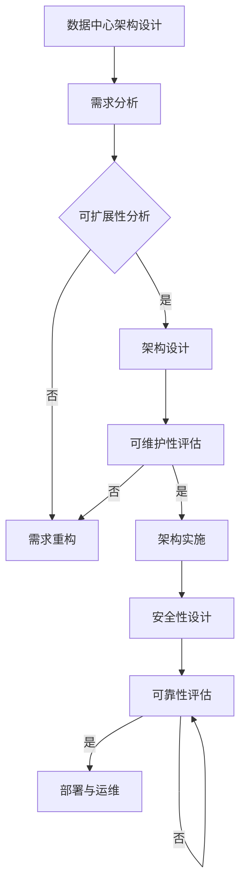

                 

### 《AI大模型应用数据中心的数据架构优化》

> **关键词：** AI大模型，数据中心，数据架构，优化，可扩展性，可靠性，安全性，核心算法，数学模型

> **摘要：** 本文旨在深入探讨AI大模型应用数据中心的数据架构优化问题。文章首先介绍了AI大模型的基本概念及其在数据中心中的角色，随后详细分析了数据中心架构设计的原则，包括可扩展性、可维护性、安全性和可靠性。接着，文章讲解了数据中心核心算法的原理，并通过伪代码和数学公式进行了详细阐述。最后，文章通过实际案例展示了数据中心优化的实践方法，并对未来发展趋势进行了展望。

---

### 第一部分：引言与概述

#### AI大模型应用数据中心概述

AI大模型，即人工智能大型模型，是近年来人工智能领域的重要突破之一。这些模型具有庞大的参数规模和强大的计算能力，能够在多种任务中实现优异的性能，如图像识别、自然语言处理、推荐系统等。随着AI大模型的应用日益广泛，数据中心作为其运行的基础设施，也面临着巨大的挑战和机遇。

**1.1 AI大模型的概念与现状**

AI大模型通常是指具有数亿至数十亿参数的神经网络模型，其规模远超传统机器学习模型。这些模型通过对海量数据的学习，能够自动提取特征并进行预测或分类。目前，AI大模型已在图像识别、语音识别、机器翻译、自动驾驶等领域取得了显著的成果。

**1.2 数据中心在AI大模型应用中的角色**

数据中心作为AI大模型的运行基础，承担着数据存储、计算处理、模型训练和部署等重要任务。它为AI大模型提供了强大的计算资源，确保了模型的高效运行和快速迭代。

**1.3 数据中心优化的重要性**

数据中心优化对于AI大模型的应用具有重要意义。首先，优化可以提高数据中心的资源利用率，降低运行成本。其次，优化可以提高数据中心的可靠性和安全性，确保模型训练和数据处理的连续性和完整性。最后，优化还可以提高数据中心的可扩展性，适应AI大模型未来发展的需求。

### 第二部分：核心技术与架构

#### 数据中心架构设计原则

数据中心架构设计是确保数据中心高效、稳定、安全运行的关键。以下将详细介绍数据中心架构设计的原则。

##### **2.1 数据中心架构设计概述**

数据中心架构设计涉及多个方面，包括硬件设备、网络架构、存储系统、数据处理系统等。设计的目标是构建一个高效、可扩展、可靠和安全的数据中心，以支持AI大模型的应用。

##### **2.2 可扩展性与可维护性**

**可扩展性**：数据中心架构需要能够适应数据量和计算需求的增长，实现资源的动态分配和扩展。

**可维护性**：设计时应考虑未来可能的技术更新和维护需求，确保系统易于维护和管理。

##### **2.3 安全性与可靠性**

**安全性**：数据中心需要具备完善的安全机制，保护数据不被非法访问和篡改。

**可靠性**：系统需要具备高可用性，确保在面临硬件故障或网络问题时不影响整体服务。

#### Mermaid流程图展示



### 第三部分：核心技术与架构

#### 数据中心核心算法原理讲解

数据中心核心算法是实现高效数据处理和模型训练的关键。以下将详细介绍数据中心核心算法的原理。

##### **3.1 数据清洗与预处理算法**

数据清洗与预处理是数据中心数据处理的第一步，主要包括以下步骤：

- 缺失值处理：删除或填补缺失值。
- 异常值处理：检测并处理异常值。
- 数据转换：进行标准化、归一化等处理。

**伪代码：**

```python
def data_cleaning(data):
    for record in data:
        if missing_value(record):
            handle_missing_value(record)
        if abnormal_value(record):
            handle_abnormal_value(record)
    return cleaned_data
```

##### **3.2 特征提取与降维算法**

特征提取与降维是提高模型性能的关键步骤，主要包括以下方法：

- 主成分分析（PCA）：通过线性变换降低数据维度。
- 线性判别分析（LDA）：通过最大化类间方差和最小化类内方差进行降维。
- t-SNE：一种非线性的降维方法。

**伪代码：**

```python
def feature_extraction(data):
    pca = PCA(n_components=k)
    transformed_data = pca.fit_transform(data)
    return transformed_data
```

##### **3.3 模型训练与优化算法**

模型训练与优化是数据中心的核心任务，主要包括以下算法：

- 随机梯度下降（SGD）：通过更新参数来最小化损失函数。
- Adam优化器：一种自适应学习率优化器。
- 批次归一化（Batch Normalization）：通过标准化激活值来加速训练和减小梯度消失问题。

**伪代码：**

```python
def train_model(model, data, epochs):
    for epoch in range(epochs):
        for batch in data:
            model.fit(batch)
        model.update_parameters()
    return model
```

##### **3.4 数学模型与公式讲解**

数据中心核心算法中涉及多个数学模型和公式，以下是简要介绍：

- 损失函数（Loss Function）：用于衡量模型预测值与真实值之间的差距。常用的有均方误差（MSE）、交叉熵损失（Cross-Entropy Loss）等。
- 激活函数（Activation Function）：用于引入非线性特性，常用的有Sigmoid、ReLU等。
- 反向传播算法（Backpropagation）：用于计算梯度，是神经网络训练的核心算法。

**数学公式：**

$$
MSE = \frac{1}{m}\sum_{i=1}^{m}(y_i - \hat{y}_i)^2
$$

$$
\frac{\partial L}{\partial \theta} = \frac{\partial}{\partial \theta} \left( -\frac{1}{m}\sum_{i=1}^{m}y_i \log(\hat{y}_i) + (1 - y_i) \log(1 - \hat{y}_i) \right)
$$

### 第四部分：实践应用与优化

#### 数据中心性能优化方法

数据中心性能优化是提高数据中心运行效率的重要手段。以下将介绍数据中心性能优化的方法。

##### **4.1 硬件优化**

**硬件优化**主要包括以下几个方面：

- **服务器优化**：选择高性能、低功耗的服务器，提高计算能力。
- **存储优化**：使用高速存储设备，提高数据读写速度。
- **网络优化**：优化网络架构，提高数据传输速度和稳定性。

##### **4.2 软件优化**

**软件优化**主要包括以下几个方面：

- **操作系统优化**：选择适合数据中心环境的操作系统，提高系统性能。
- **数据库优化**：优化数据库配置，提高数据存储和查询效率。
- **中间件优化**：优化中间件配置，提高数据处理和传输效率。

##### **4.3 系统性能评估与调优**

**系统性能评估与调优**主要包括以下几个方面：

- **性能监控**：实时监控数据中心性能指标，如CPU使用率、内存使用率、网络流量等。
- **性能分析**：分析性能监控数据，找出系统性能瓶颈。
- **调优策略**：根据性能分析结果，制定相应的优化策略，如调整系统配置、优化算法等。

### 第五部分：未来展望与趋势

#### AI大模型应用数据中心的发展趋势

随着AI大模型的不断发展，数据中心也将面临新的机遇和挑战。以下将介绍AI大模型应用数据中心的发展趋势。

##### **5.1 未来的挑战与机遇**

**未来的挑战**：

- **数据隐私**：随着数据量的增加，如何保护用户隐私成为一个重要问题。
- **计算能力**：AI大模型对计算能力的要求越来越高，如何提高计算效率成为一个挑战。

**未来的机遇**：

- **边缘计算**：边缘计算可以为AI大模型提供更近的数据源，提高数据处理速度。
- **量子计算**：量子计算有望为AI大模型提供强大的计算能力，推动人工智能的发展。

##### **5.2 技术创新的趋势**

**技术创新**将推动数据中心的发展，以下是一些技术创新的趋势：

- **分布式计算**：分布式计算可以提高数据中心的计算能力，降低单点故障风险。
- **智能调度**：智能调度可以根据实时负载情况，自动调整资源分配，提高资源利用率。
- **区块链技术**：区块链技术可以提高数据中心的可信度和安全性。

##### **5.3 数据中心架构的演变**

随着技术的不断发展，数据中心架构也将发生演变，以下是一些演变趋势：

- **云数据中心**：云数据中心可以实现资源的弹性分配，降低运维成本。
- **智能数据中心**：智能数据中心通过引入人工智能技术，可以实现自动化的资源管理和优化。
- **绿色数据中心**：绿色数据中心通过优化能耗管理，降低对环境的影响。

### 第六部分：总结与展望

#### 总结

本文从多个角度深入探讨了AI大模型应用数据中心的数据架构优化问题。通过分析AI大模型的基本概念、数据中心在其中的角色，以及数据中心架构设计的原则，本文为数据中心优化提供了理论指导。同时，本文通过核心算法原理讲解、数学模型与公式阐述、实践应用与优化方法等，为数据中心优化提供了实际操作指南。

#### 展望

随着AI大模型的不断发展，数据中心架构优化仍面临诸多挑战。未来，技术创新将继续推动数据中心的发展，为AI大模型提供更强大的支持。本文期待读者在未来的实践中，结合本文的理论和方法，不断探索和优化数据中心架构，为AI大模型的应用创造更多价值。

### 附录

#### 附录 A: 相关工具与资源

**A.1 数据中心架构相关工具**

- OpenStack：开源的云计算管理平台，用于构建和管理云数据中心。
- Kubernetes：开源的容器编排平台，用于自动化部署、扩展和管理容器化应用。
- Docker：开源的应用容器引擎，用于封装、运输和运行应用。

**A.2 AI大模型开发相关工具**

- TensorFlow：开源的机器学习框架，用于构建和训练AI大模型。
- PyTorch：开源的机器学习框架，具有灵活的动态计算图，适用于研究。
- Keras：基于Theano和TensorFlow的深度学习库，用于快速构建和训练神经网络。

**A.3 资源链接与参考文献**

- [OpenStack官网](https://www.openstack.org/)
- [Kubernetes官网](https://kubernetes.io/)
- [TensorFlow官网](https://www.tensorflow.org/)
- [PyTorch官网](https://pytorch.org/)
- [《深度学习》（Goodfellow, I., Bengio, Y., & Courville, A.）](https://www.deeplearningbook.org/)
- [《人工智能：一种现代方法》（Russell, S. & Norvig, P.）](https://www.aima.org.au/en/purchase.php)

---

**作者：AI天才研究院/AI Genius Institute & 禅与计算机程序设计艺术 /Zen And The Art of Computer Programming**

