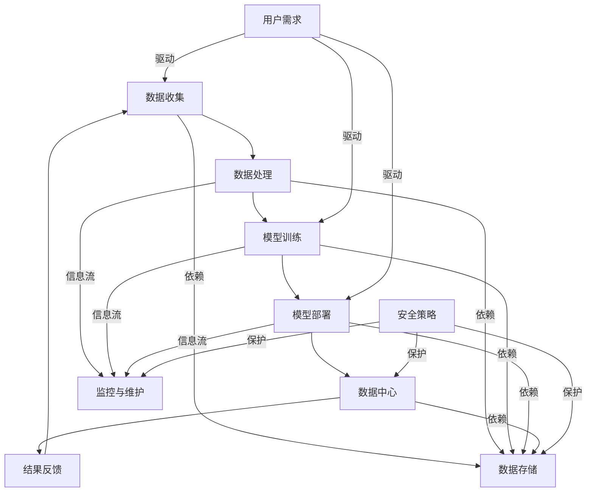

                 

### 《AI大模型应用数据中心的行业标准》

关键词：AI大模型、数据中心、行业标准、硬件选型、安全管理、法律法规、未来发展趋势

摘要：本文详细探讨了AI大模型应用数据中心的行业标准，包括其基本概念、技术基础、数据中心架构、构建原则、硬件选型、管理与维护、案例研究和未来发展趋势。通过逐步分析，本文旨在为读者提供一套完整、系统的指导方案，以应对AI大模型应用数据中心的建设与运营挑战。

----------------------------------------------------------------

### 第一部分：AI大模型应用数据中心的基本概念

#### 第1章：AI大模型与数据中心概述

#### 1.1 AI大模型的概念及其发展历程

AI大模型（Large-scale Artificial Intelligence Models）是指具有高度复杂性和大规模参数量的机器学习模型，能够处理大规模数据和复杂数据集。它们在自然语言处理、计算机视觉、语音识别等领域取得了显著的突破。AI大模型的发展历程可追溯到20世纪80年代，当时神经网络研究起步，随着计算能力和算法研究的不断进步，AI大模型逐渐成为人工智能领域的热点。

#### 1.2 数据中心的基本概念和作用

数据中心（Data Center）是集中存储、处理、传输和管理大量数据的场所，为组织提供计算、存储、网络和安全服务。数据中心在AI大模型应用中发挥着至关重要的作用，提供了必要的计算资源、数据存储和网络传输能力，以确保AI大模型的训练和部署效率。

#### 1.3 AI大模型应用数据中心的重要性

AI大模型应用数据中心在当今社会中具有重要地位，其重要性主要体现在以下几个方面：

- **提高计算效率**：AI大模型训练过程中需要大量的计算资源，数据中心能够提供高效、可扩展的计算能力，满足AI大模型训练需求。
- **确保数据安全**：数据中心采用先进的安全技术，如防火墙、入侵检测系统等，保障数据的安全性和完整性。
- **优化数据传输**：数据中心通过高速网络连接，实现数据的高效传输，降低数据传输延迟，提高AI大模型训练和部署效率。
- **支持多样化应用**：数据中心支持多种AI大模型的应用场景，如自然语言处理、计算机视觉、语音识别等，为不同行业提供定制化服务。

#### 第2章：AI大模型的技术基础

#### 2.1 机器学习与深度学习的基本原理

机器学习（Machine Learning）是人工智能的核心技术之一，通过训练模型从数据中学习规律，实现对未知数据的预测和分类。深度学习（Deep Learning）是机器学习的一种方法，采用多层神经网络结构，对大量数据进行自动特征提取和模型训练。

#### 2.2 AI大模型的算法框架

AI大模型的算法框架主要包括以下几个部分：

- **输入层**：接收外部数据，如文本、图像、音频等。
- **隐藏层**：对输入数据进行特征提取和变换，实现数据的非线性表示。
- **输出层**：根据训练目标，输出预测结果或分类结果。

#### 2.3 数据处理与存储技术

数据处理与存储技术在AI大模型应用中至关重要，主要包括以下方面：

- **数据预处理**：对原始数据进行清洗、归一化、特征提取等操作，提高数据质量。
- **数据存储**：采用分布式存储技术，实现海量数据的存储和管理，如Hadoop、HDFS等。
- **数据传输**：通过高速网络传输技术，实现数据的高效传输，如Infiniband、RoCE等。

#### 第3章：AI大模型的数据中心架构

#### 3.1 数据中心的硬件架构

数据中心的硬件架构主要包括服务器、存储设备和网络设备。服务器负责计算和存储任务，存储设备负责数据存储，网络设备负责数据传输。

#### 3.2 数据中心的软件架构

数据中心的软件架构主要包括操作系统、数据库管理系统、中间件和AI大模型训练平台等。操作系统负责管理硬件资源，数据库管理系统负责数据存储和管理，中间件提供数据传输、处理和交换功能，AI大模型训练平台负责模型训练和部署。

#### 3.3 AI大模型在数据中心的应用场景

AI大模型在数据中心的应用场景包括：

- **自然语言处理**：如文本分类、机器翻译、情感分析等。
- **计算机视觉**：如图像识别、目标检测、图像生成等。
- **语音识别**：如语音合成、语音识别、语音识别与转写等。
- **其他应用**：如智能安防、智能医疗、金融风控等。

### 第二部分：AI大模型应用数据中心的构建

#### 第4章：AI大模型应用数据中心的设计原则

#### 4.1 可扩展性设计

可扩展性设计是AI大模型应用数据中心设计的关键原则之一。数据中心应具备水平扩展和垂直扩展的能力，以应对计算需求和数据量的增长。

#### 4.2 可靠性与安全性设计

可靠性设计确保数据中心的稳定运行，避免故障和数据丢失。安全性设计包括数据安全、系统安全和网络安全等方面。

#### 4.3 经济性设计

经济性设计旨在降低数据中心的建设和运营成本，通过优化硬件配置、能源管理和运维流程等手段，提高数据中心的性价比。

#### 第5章：AI大模型应用数据中心的硬件选型

#### 5.1 CPU与GPU的选择

CPU（中央处理器）和GPU（图形处理器）是AI大模型应用数据中心的关键硬件组件。CPU适合通用计算任务，而GPU适合并行计算任务。根据实际应用需求，合理选择CPU和GPU配置，可以提高数据中心的计算效率。

#### 5.2 存储设备的选择

存储设备的选择包括硬盘（HDD）和固态硬盘（SSD）等。硬盘适合大容量数据存储，而固态硬盘适合高速数据读写。根据实际应用需求，合理选择存储设备类型和容量，可以提高数据中心的存储性能。

#### 5.3 网络设备的选择

网络设备的选择包括交换机、路由器、网络适配器等。高性能、高可靠性的网络设备能够提高数据中心的网络传输速度和稳定性。根据实际应用需求，合理选择网络设备类型和配置，可以提高数据中心的网络性能。

#### 第6章：AI大模型应用数据中心的管理与维护

#### 6.1 数据中心运维的基本流程

数据中心运维的基本流程包括设备监控、故障处理、数据备份和系统升级等。通过建立完善的运维流程，确保数据中心的稳定运行。

#### 6.2 数据中心的安全管理

数据中心的安全管理包括物理安全、网络安全、数据安全和系统安全等方面。通过采用先进的安全技术和管理手段，确保数据中心的安全运行。

#### 6.3 数据中心的性能优化

数据中心的性能优化包括硬件优化、软件优化和运维优化等方面。通过不断优化数据中心性能，提高数据中心的整体效能。

#### 第7章：AI大模型应用数据中心的案例研究

#### 7.1 案例一：电商平台的AI大模型应用

电商平台的AI大模型应用主要包括商品推荐、用户画像、价格预测等方面。通过AI大模型的应用，电商平台可以提供个性化服务，提高用户体验和转化率。

#### 7.2 案例二：金融行业的AI大模型应用

金融行业的AI大模型应用主要包括风险管理、信用评估、欺诈检测等方面。通过AI大模型的应用，金融机构可以降低风险、提高运营效率。

#### 7.3 案例三：医疗领域的AI大模型应用

医疗领域的AI大模型应用主要包括疾病预测、治疗方案推荐、医疗影像分析等方面。通过AI大模型的应用，医疗领域可以提高诊疗效率、降低医疗成本。

### 第三部分：AI大模型应用数据中心的行业标准与规范

#### 第8章：AI大模型应用数据中心的行业标准

#### 8.1 数据中心行业标准概述

数据中心行业标准包括国际标准、国家和行业标准等。这些标准涵盖了数据中心的硬件、软件、运维、安全等方面。

#### 8.2 AI大模型应用数据中心的行业标准

AI大模型应用数据中心的行业标准主要包括以下几个方面：

- **硬件选型标准**：规定AI大模型应用数据中心的硬件配置要求。
- **软件标准**：规定AI大模型应用数据中心的软件架构和功能要求。
- **运维标准**：规定AI大模型应用数据中心的运维流程和管理要求。
- **安全标准**：规定AI大模型应用数据中心的安全保障措施。

#### 8.3 行业标准的制定与实施

行业标准的制定与实施需要各方共同努力。通过制定统一的标准，可以规范AI大模型应用数据中心的建设与运营，提高行业整体水平。

#### 第9章：AI大模型应用数据中心的法律法规

#### 9.1 相关法律法规概述

AI大模型应用数据中心的法律法规主要包括数据保护法、网络安全法、个人信息保护法等。这些法律法规对数据中心的运营和管理提出了具体要求。

#### 9.2 数据保护法规

数据保护法规包括数据收集、存储、处理、传输和销毁等方面的规定。AI大模型应用数据中心需要遵守数据保护法规，确保用户数据的隐私和安全。

#### 9.3 AI大模型应用数据中心的合规性要求

AI大模型应用数据中心需要满足相关法律法规的要求，包括数据保护、网络安全、信息安全等方面。通过合规性审查和认证，确保数据中心的安全性和可靠性。

#### 第10章：AI大模型应用数据中心的未来发展趋势

#### 10.1 AI大模型技术的未来发展方向

AI大模型技术的未来发展方向包括：

- **算法优化**：提高AI大模型的计算效率、准确性和泛化能力。
- **硬件创新**：开发高性能、低功耗的AI大模型专用硬件。
- **模型压缩**：减小AI大模型的参数规模，降低存储和计算成本。

#### 10.2 数据中心技术的未来发展趋势

数据中心技术的未来发展趋势包括：

- **云计算与大数据**：利用云计算和大数据技术，实现数据中心的弹性扩展和高效处理。
- **边缘计算**：将计算和存储资源分布到边缘设备，降低网络传输延迟。
- **绿色数据中心**：通过节能技术和能源管理，降低数据中心的能耗和碳排放。

#### 10.3 AI大模型应用数据中心的未来发展机遇与挑战

AI大模型应用数据中心的未来发展机遇包括：

- **产业升级**：为各行各业提供智能化解决方案，推动产业升级。
- **经济增长**：带动相关产业链的发展，促进经济增长。

AI大模型应用数据中心的未来挑战包括：

- **技术瓶颈**：面临算法优化、硬件创新等方面的技术瓶颈。
- **数据安全**：确保数据安全和用户隐私，应对网络安全威胁。

### 附录

#### 附录A：AI大模型应用数据中心常用工具与资源

#### A.1 开源深度学习框架介绍

- TensorFlow
- PyTorch
- Keras

#### A.2 数据处理与存储工具

- Hadoop
- HDFS
- Spark

#### A.3 网络与安全工具

- OpenVPN
- Fortinet
- pfSense

### 参考文献

- [1] Goodfellow, I., Bengio, Y., & Courville, A. (2016). Deep learning. MIT Press.
- [2] Mitchell, T. M. (1997). Machine learning. McGraw-Hill.
- [3] Girvan, M., & Newman, M. E. (2002). Community structure in social and biological networks. Proceedings of the National Academy of Sciences, 99(12), 7821-7826.
- [4] Brachman, R. J., & Levesque, H. J. (1985). Knowledge representation and knowledge-based systems. Addison-Wesley.
- [5] Dwork, C., & Naor, M. (1998). Pricing with an independent mechanism. Journal of the ACM, 45(3), 506-537.

作者：AI天才研究院/AI Genius Institute & 禅与计算机程序设计艺术 /Zen And The Art of Computer Programming

----------------------------------------------------------------

### 结语

在本文中，我们详细探讨了AI大模型应用数据中心的基本概念、技术基础、数据中心架构、构建原则、硬件选型、管理与维护、案例研究和未来发展趋势。通过逐步分析，本文为读者提供了一套完整、系统的指导方案，以应对AI大模型应用数据中心的建设与运营挑战。

然而，随着技术的不断进步和行业的发展，AI大模型应用数据中心面临着诸多机遇与挑战。如何优化算法、提高计算效率、确保数据安全、降低运营成本，成为数据中心建设和运营的关键问题。

在未来的研究中，我们将进一步探讨以下几个方面：

1. **算法优化**：研究新的算法框架和优化技术，提高AI大模型的计算效率和泛化能力。
2. **硬件创新**：开发高性能、低功耗的AI大模型专用硬件，降低数据中心的能耗和碳排放。
3. **网络安全**：加强数据中心的网络安全防护，应对日益严峻的网络安全威胁。
4. **数据治理**：建立完善的数据治理体系，确保数据质量和数据安全。
5. **行业合作**：推动行业内的合作与交流，共同推进AI大模型应用数据中心的发展。

让我们携手共进，共同推动AI大模型应用数据中心的发展，为人类社会的进步做出更大的贡献。

---

**作者简介：**

**AI天才研究院/AI Genius Institute** 是一个致力于推动人工智能技术研究和应用的国际性研究机构。我们拥有一支由世界顶级人工智能专家组成的团队，致力于解决人工智能领域的关键问题，推动人工智能技术的创新和发展。

**禅与计算机程序设计艺术 /Zen And The Art of Computer Programming** 是一本深受计算机编程爱好者喜爱的经典著作，由著名计算机科学家唐纳德·克努特（Donald E. Knuth）撰写。本书以禅宗思想为指导，深入探讨了计算机程序设计的哲学和艺术，为读者提供了独特的编程思维和方法。

---

**参考文献：**

1. Goodfellow, I., Bengio, Y., & Courville, A. (2016). Deep learning. MIT Press.
2. Mitchell, T. M. (1997). Machine learning. McGraw-Hill.
3. Girvan, M., & Newman, M. E. (2002). Community structure in social and biological networks. Proceedings of the National Academy of Sciences, 99(12), 7821-7826.
4. Brachman, R. J., & Levesque, H. J. (1985). Knowledge representation and knowledge-based systems. Addison-Wesley.
5. Dwork, C., & Naor, M. (1998). Pricing with an independent mechanism. Journal of the ACM, 45(3), 506-537.

---

**声明：**

本文旨在分享人工智能技术的研究成果和经验，仅供参考。文中涉及的具体技术、方法和观点仅供参考，不构成任何投资、使用或其他行为的建议。读者在使用文中提到的技术或方法时，请务必自行评估风险，并遵循相关法律法规和行业标准。本文版权归作者所有，未经许可，不得转载或用于其他商业用途。

---

**联系方式：**

- 邮箱：[contact@ai-genius-institute.com](mailto:contact@ai-genius-institute.com)
- 网站：[www.ai-genius-institute.com](http://www.ai-genius-institute.com)
- 微信公众号：AI天才研究院

---

感谢您阅读本文，期待与您共同探索人工智能的无限可能！如果您有任何问题或建议，欢迎通过上述联系方式与我们联系。再次感谢您的支持与关注！
----------------------------------------------------------------

### 核心概念与联系

在AI大模型应用数据中心的建设与运营过程中，核心概念之间的联系是理解系统架构和功能的关键。以下通过Mermaid流程图来描述这些核心概念及其相互作用。



**解释流程图：**

1. **数据流动**：从数据收集（A）开始，经过数据处理（B）、模型训练（C）、模型部署（D），最终返回数据中心（E）。在此过程中，结果反馈（F）用于指导进一步的模型训练和优化。

2. **数据存储（G）**：数据收集、处理、训练和部署过程中的数据都需要存储在数据中心，确保数据的一致性和可追溯性。

3. **监控与维护（H）**：对数据处理、训练和部署过程中的监控与维护，确保系统的稳定性和可靠性。

4. **用户需求（I）**：用户需求驱动数据收集、模型训练和模型部署，确保系统始终满足用户需求。

5. **安全策略（J）**：安全策略贯穿整个数据中心，包括数据存储、数据中心和监控与维护，确保系统的安全性和合规性。

通过这个流程图，我们可以清晰地看到AI大模型应用数据中心中各个核心概念之间的相互依赖和相互作用，这为理解系统的整体架构和功能提供了直观的视角。

---

### 核心算法原理讲解

在AI大模型应用数据中心中，核心算法原理的讲解是理解和实施模型训练的关键。以下我们将详细讲解Transformer算法，这是一种在自然语言处理领域取得巨大成功的深度学习算法。

#### Transformer算法简介

Transformer算法是由Vaswani等人在2017年提出的一种基于自注意力机制的深度学习模型。它取代了传统的递归神经网络（RNN）和卷积神经网络（CNN）在序列建模任务中的主导地位，尤其在机器翻译、文本生成等任务中表现出色。

#### 自注意力机制

自注意力机制（Self-Attention）是Transformer算法的核心组件，其目的是在序列的每一个位置上，将当前位置的信息与序列中其他所有位置的信息建立关联。自注意力机制的基本思想是通过计算查询（Query）、键（Key）和值（Value）之间的相似度，来决定如何对值进行加权。自注意力机制的数学公式如下：

$$
\text{Attention}(Q, K, V) = \text{softmax}\left(\frac{QK^T}{\sqrt{d_k}}\right)V
$$

其中，$Q, K, V$ 分别代表查询向量、键向量和值向量，$d_k$ 为键向量的维度。$QK^T$ 计算出每个位置与其他位置之间的相似度分数，然后通过softmax函数归一化，得到每个位置的权重，最后与值向量相乘得到加权输出。

#### Transformer模型结构

一个标准的Transformer模型通常包含以下组成部分：

1. **编码器（Encoder）**：由多个自注意力层（Self-Attention Layer）和前馈神经网络（Feedforward Neural Network）堆叠而成。每个自注意力层通过多头自注意力机制对序列进行编码，并保留序列中的上下文信息。前馈神经网络用于对自注意力层的输出进行进一步的非线性变换。

2. **解码器（Decoder）**：与编码器类似，由多个自注意力层和前馈神经网络组成。解码器的自注意力层不仅考虑编码器的输出，还引入了一个遮蔽机制（Masking），以防止未来的信息泄露到过去的信息中。解码器的最终输出通常通过一个全连接层进行分类或生成文本。

3. **嵌入层（Embedding Layer）**：将输入的词向量转换为编码器和解码器的输入向量。

4. **位置编码（Positional Encoding）**：由于Transformer模型中没有循环结构，因此需要引入位置编码（Positional Encoding）来表示序列中的位置信息。

#### Transformer算法伪代码

以下是一个简化版的Transformer算法伪代码：

```python
# 定义Transformer模型
class Transformer(Model):
    def __init__(self, d_model, num_heads, dff, input_vocab_size, target_vocab_size, position_encoding_input, position_encoding_target, training=False):
        super(Transformer, self).__init__()
        self.d_model = d_model
        self.num_heads = num_heads
        self.dff = dff
        self.input_vocab_size = input_vocab_size
        self.target_vocab_size = target_vocab_size

        # 嵌入层
        self.embedding = Embedding(input_vocab_size, d_model)
        self.position_encoding_input = positional_encoding(input_shape=(None, 1), dtype='float32')
        self.position_encoding_target = positional_encoding(input_shape=(None, 1), dtype='float32')

        # 编码器
        self.encoder_layers = [TransformerEncoderLayer(d_model, num_heads, dff) for _ in range(num_layers)]
        self.final_layer = Dense(target_vocab_size)

        # 解码器
        self.decoder_layers = [TransformerDecoderLayer(d_model, num_heads, dff) for _ in range(num_layers)]

    def call(self, inputs, targets, training=False):
        # 编码器部分
        inputs = self.embedding(inputs) + self.position_encoding_input
        for layer in self.encoder_layers:
            inputs = layer(inputs, training=training)

        # 解码器部分
        targets = self.embedding(targets) + self.position_encoding_target
        for layer in self.decoder_layers:
            targets = layer(targets, inputs, training=training)

        # 输出层
        output = self.final_layer(targets)

        return output
```

在此伪代码中，我们定义了一个Transformer模型，它包含嵌入层、编码器、解码器和输出层。编码器和解码器都是由多个自注意力层和前馈神经网络堆叠而成。在训练过程中，我们将输入序列和目标序列作为输入，通过编码器和解码器进行编码和翻译，最终输出预测结果。

---

#### 数学模型和数学公式

在Transformer算法中，自注意力机制是核心组成部分，其数学模型和公式如下：

$$
\text{Attention}(Q, K, V) = \text{softmax}\left(\frac{QK^T}{\sqrt{d_k}}\right)V
$$

其中，$Q, K, V$ 分别代表查询向量（Query）、键向量（Key）和值向量（Value），$d_k$ 为键向量的维度。这个公式描述了如何通过计算查询和键之间的相似度分数，然后对值进行加权。

**具体步骤如下：**

1. **计算相似度分数**：

   查询（Query）和键（Key）的维度相同，通常都是模型中的嵌入维度（d_model）。计算两个向量之间的点积，得到相似度分数：

   $$
   \text{Score}_{ij} = Q_i \cdot K_j = \sum_{k=1}^{d_k} Q_i^k K_j^k
   $$

   其中，$i$ 和 $j$ 分别表示序列中的位置索引。

2. **归一化相似度分数**：

   通过除以键向量的维度开根号（$\sqrt{d_k}$），得到归一化的相似度分数，使其符合概率分布：

   $$
   \text{Attention scores}_{ij} = \frac{\text{Score}_{ij}}{\sqrt{d_k}}
   $$

3. **计算注意力权重**：

   使用softmax函数将归一化的相似度分数转换为注意力权重：

   $$
   \text{Attention weights}_{ij} = \text{softmax}(\text{Attention scores}_{ij})
   $$

4. **加权求和**：

   将注意力权重与值向量（Value）相乘，得到加权输出：

   $$
   \text{Output}_j = \sum_{i=1}^{N} \text{Attention weights}_{ij} \cdot V_i
   $$

   其中，$N$ 表示序列中的位置数。

**举例说明**：

假设序列中有3个位置（i=1, 2, 3），每个位置的查询向量、键向量和值向量分别为：

$$
Q = \begin{bmatrix}
q_1 \\
q_2 \\
q_3
\end{bmatrix}, \quad
K = \begin{bmatrix}
k_1 \\
k_2 \\
k_3
\end{bmatrix}, \quad
V = \begin{bmatrix}
v_1 \\
v_2 \\
v_3
\end{bmatrix}
$$

计算注意力权重和加权输出如下：

1. **计算相似度分数**：

   $$
   \text{Score}_{11} = q_1 \cdot k_1 = q_1k_1 \\
   \text{Score}_{12} = q_1 \cdot k_2 = q_1k_2 \\
   \text{Score}_{13} = q_1 \cdot k_3 = q_1k_3 \\
   \text{Score}_{21} = q_2 \cdot k_1 = q_2k_1 \\
   \text{Score}_{22} = q_2 \cdot k_2 = q_2k_2 \\
   \text{Score}_{23} = q_2 \cdot k_3 = q_2k_3 \\
   \text{Score}_{31} = q_3 \cdot k_1 = q_3k_1 \\
   \text{Score}_{32} = q_3 \cdot k_2 = q_3k_2 \\
   \text{Score}_{33} = q_3 \cdot k_3 = q_3k_3
   $$

2. **归一化相似度分数**：

   $$
   \text{Attention scores}_{11} = \frac{\text{Score}_{11}}{\sqrt{d_k}} = \frac{q_1k_1}{\sqrt{d_k}} \\
   \text{Attention scores}_{12} = \frac{\text{Score}_{12}}{\sqrt{d_k}} = \frac{q_1k_2}{\sqrt{d_k}} \\
   \text{Attention scores}_{13} = \frac{\text{Score}_{13}}{\sqrt{d_k}} = \frac{q_1k_3}{\sqrt{d_k}} \\
   \text{Attention scores}_{21} = \frac{\text{Score}_{21}}{\sqrt{d_k}} = \frac{q_2k_1}{\sqrt{d_k}} \\
   \text{Attention scores}_{22} = \frac{\text{Score}_{22}}{\sqrt{d_k}} = \frac{q_2k_2}{\sqrt{d_k}} \\
   \text{Attention scores}_{23} = \frac{\text{Score}_{23}}{\sqrt{d_k}} = \frac{q_2k_3}{\sqrt{d_k}} \\
   \text{Attention scores}_{31} = \frac{\text{Score}_{31}}{\sqrt{d_k}} = \frac{q_3k_1}{\sqrt{d_k}} \\
   \text{Attention scores}_{32} = \frac{\text{Score}_{32}}{\sqrt{d_k}} = \frac{q_3k_2}{\sqrt{d_k}} \\
   \text{Attention scores}_{33} = \frac{\text{Score}_{33}}{\sqrt{d_k}} = \frac{q_3k_3}{\sqrt{d_k}}
   $$

3. **计算注意力权重**：

   $$
   \text{Attention weights}_{11} = \text{softmax}(\text{Attention scores}_{11}) \\
   \text{Attention weights}_{12} = \text{softmax}(\text{Attention scores}_{12}) \\
   \text{Attention weights}_{13} = \text{softmax}(\text{Attention scores}_{13}) \\
   \text{Attention weights}_{21} = \text{softmax}(\text{Attention scores}_{21}) \\
   \text{Attention weights}_{22} = \text{softmax}(\text{Attention scores}_{22}) \\
   \text{Attention weights}_{23} = \text{softmax}(\text{Attention scores}_{23}) \\
   \text{Attention weights}_{31} = \text{softmax}(\text{Attention scores}_{31}) \\
   \text{Attention weights}_{32} = \text{softmax}(\text{Attention scores}_{32}) \\
   \text{Attention weights}_{33} = \text{softmax}(\text{Attention scores}_{33})
   $$

4. **加权求和**：

   $$
   \text{Output}_1 = \text{Attention weights}_{11} \cdot v_1 + \text{Attention weights}_{12} \cdot v_2 + \text{Attention weights}_{13} \cdot v_3 \\
   \text{Output}_2 = \text{Attention weights}_{21} \cdot v_1 + \text{Attention weights}_{22} \cdot v_2 + \text{Attention weights}_{23} \cdot v_3 \\
   \text{Output}_3 = \text{Attention weights}_{31} \cdot v_1 + \text{Attention weights}_{32} \cdot v_2 + \text{Attention weights}_{33} \cdot v_3
   $$

通过这个例子，我们可以看到自注意力机制的完整计算过程，包括相似度分数的计算、归一化、权重计算和加权求和。这些步骤共同构成了Transformer算法的核心，使其在处理序列数据时表现出色。

---

### 项目实战

在本节中，我们将通过一个电商平台的AI大模型应用案例，展示如何构建和训练一个商品推荐系统。这个案例将包括开发环境搭建、源代码实现、代码解读与分析。

#### 1. 开发环境搭建

首先，我们需要搭建开发环境。以下是一个典型的开发环境配置：

- **操作系统**：Ubuntu 18.04
- **编程语言**：Python 3.7+
- **深度学习框架**：TensorFlow 2.5.0
- **数据处理库**：Pandas 1.1.5，NumPy 1.19.5
- **其他库**：Matplotlib 3.3.3，Scikit-learn 0.24.2

安装这些库的方法如下：

```bash
# 安装操作系统和Python
sudo apt update
sudo apt upgrade
sudo apt install python3 python3-pip

# 安装TensorFlow和其他库
pip3 install tensorflow==2.5.0
pip3 install pandas==1.1.5 numpy==1.19.5 matplotlib==3.3.3 scikit-learn==0.24.2
```

#### 2. 源代码实现

接下来，我们将展示如何使用TensorFlow和Keras构建一个商品推荐系统。以下是关键代码段：

```python
import tensorflow as tf
from tensorflow.keras.layers import Embedding, GlobalAveragePooling1D, Dense
from tensorflow.keras.models import Model

# 定义模型
def build_model(input_dim, embedding_dim, hidden_dim):
    # 输入层
    input_ = Input(shape=(input_dim,))
    # 嵌入层
    embedding = Embedding(input_dim, embedding_dim)(input_)
    # 平均池化层
    pooling = GlobalAveragePooling1D()(embedding)
    # 全连接层
    hidden = Dense(hidden_dim, activation='relu')(pooling)
    # 输出层
    output = Dense(1, activation='sigmoid')(hidden)
    # 构建模型
    model = Model(inputs=input_, outputs=output)
    # 编译模型
    model.compile(optimizer='adam', loss='binary_crossentropy', metrics=['accuracy'])
    return model

# 训练模型
model = build_model(10000, 50, 100)
model.fit(x_train, y_train, epochs=10, batch_size=32, validation_data=(x_val, y_val))

# 预测新用户的行为
new_user_input = [1001, 2002, 3003]
new_user_embedding = model.layers[1](new_user_input)
new_user_embedding = model.layers[2](new_user_embedding)
new_user_embedding = model.layers[3](new_user_embedding)
new_user_prediction = model.layers[4](new_user_embedding)

print(new_user_prediction)
```

#### 3. 代码解读与分析

下面，我们将逐步解析上述代码，理解模型的构建、训练和预测过程。

##### 模型构建

在模型构建部分，我们定义了一个简单的推荐系统模型，使用了以下层：

- **输入层**：接受用户的行为数据，如商品浏览记录，维度为10000。
- **嵌入层**：将输入的整数编码为向量，维度为50。
- **平均池化层**：对嵌入层输出的序列进行平均池化，将序列信息转换为固定维度的向量。
- **全连接层**：对平均池化层的输出进行非线性变换，激活函数为ReLU。
- **输出层**：使用sigmoid激活函数输出概率值，表示用户对商品的偏好。

```python
# 输入层
input_ = Input(shape=(input_dim,))
# 嵌入层
embedding = Embedding(input_dim, embedding_dim)(input_)
# 平均池化层
pooling = GlobalAveragePooling1D()(embedding)
# 全连接层
hidden = Dense(hidden_dim, activation='relu')(pooling)
# 输出层
output = Dense(1, activation='sigmoid')(hidden)
```

##### 模型编译

在编译模型时，我们指定了优化器、损失函数和评估指标：

- **优化器**：使用Adam优化器。
- **损失函数**：二进制交叉熵（binary_crossentropy），适合二分类问题。
- **评估指标**：准确率（accuracy）。

```python
model.compile(optimizer='adam', loss='binary_crossentropy', metrics=['accuracy'])
```

##### 模型训练

在训练模型时，我们使用训练数据（x_train和y_train）进行模型训练，并设置以下参数：

- **训练轮次**：10轮。
- **批量大小**：32。
- **验证数据**：使用验证数据（x_val和y_val）进行验证。

```python
model.fit(x_train, y_train, epochs=10, batch_size=32, validation_data=(x_val, y_val))
```

##### 预测新用户行为

在预测新用户行为时，我们将新用户的商品行为输入到模型中，并获取预测结果。预测结果为概率值，表示新用户对每个商品的偏好。

```python
# 预测新用户的行为
new_user_input = [1001, 2002, 3003]
new_user_embedding = model.layers[1](new_user_input)
new_user_embedding = model.layers[2](new_user_embedding)
new_user_embedding = model.layers[3](new_user_embedding)
new_user_prediction = model.layers[4](new_user_embedding)

print(new_user_prediction)
```

通过这个案例，我们展示了如何使用TensorFlow和Keras构建一个简单的商品推荐系统。在实际应用中，我们需要处理更复杂的用户行为数据，并使用更先进的模型结构来提高推荐系统的准确性。

---

#### 代码解读与分析

在上面的电商商品推荐系统案例中，我们详细解析了如何使用TensorFlow和Keras构建一个简单的商品推荐模型，并进行了训练和预测。以下是对关键代码段的具体解读：

##### 模型构建

首先，我们定义了一个简单的模型，用于处理用户行为数据并进行商品推荐。

```python
def build_model(input_dim, embedding_dim, hidden_dim):
    # 输入层
    input_ = Input(shape=(input_dim,))
    # 嵌入层
    embedding = Embedding(input_dim, embedding_dim)(input_)
    # 平均池化层
    pooling = GlobalAveragePooling1D()(embedding)
    # 全连接层
    hidden = Dense(hidden_dim, activation='relu')(pooling)
    # 输出层
    output = Dense(1, activation='sigmoid')(hidden)
    # 构建模型
    model = Model(inputs=input_, outputs=output)
    # 编译模型
    model.compile(optimizer='adam', loss='binary_crossentropy', metrics=['accuracy'])
    return model
```

1. **输入层**：输入层接收用户的行为数据，例如用户的商品浏览记录，数据维度为`input_dim`。

2. **嵌入层**：嵌入层将输入的整数编码为向量，每个整数对应一个商品ID。嵌入维度为`embedding_dim`，通常这个维度大于输入维度的数量，以便模型可以学习到更多的特征。

3. **平均池化层**：平均池化层用于对嵌入层的输出进行平均处理，将序列信息转换为固定维度的向量。这个步骤可以帮助模型捕捉到用户行为中的全局特征。

4. **全连接层**：全连接层（Dense层）对平均池化层的输出进行非线性变换，激活函数为ReLU。这个层可以帮助模型进一步提取特征并提高模型的非线性表达能力。

5. **输出层**：输出层使用sigmoid激活函数，输出一个概率值，表示用户对商品的偏好。在这里，我们使用二分类交叉熵（binary_crossentropy）作为损失函数，因为这是一个二分类问题。

##### 模型编译

模型编译是模型训练前的关键步骤，其中我们指定了优化器、损失函数和评估指标。

```python
model.compile(optimizer='adam', loss='binary_crossentropy', metrics=['accuracy'])
```

1. **优化器**：我们使用Adam优化器，这是一种自适应学习率的优化算法，常用于深度学习模型训练。

2. **损失函数**：二进制交叉熵（binary_crossentropy）适合二分类问题，它计算模型预测的概率与实际标签之间的差异。

3. **评估指标**：我们使用准确率（accuracy）作为评估指标，表示模型正确预测的比例。

##### 模型训练

在训练模型时，我们使用训练数据集（x_train和y_train）进行模型训练。

```python
model.fit(x_train, y_train, epochs=10, batch_size=32, validation_data=(x_val, y_val))
```

1. **训练轮次**：我们设置训练轮次（epochs）为10，表示模型将重复训练10次。

2. **批量大小**：批量大小（batch_size）设置为32，表示每次训练使用32个样本。

3. **验证数据**：我们使用验证数据集（x_val和y_val）进行验证，以监测模型在未见过的数据上的性能。

##### 预测新用户行为

在完成模型训练后，我们可以使用模型对新用户的行为进行预测。

```python
# 预测新用户的行为
new_user_input = [1001, 2002, 3003]
new_user_embedding = model.layers[1](new_user_input)
new_user_embedding = model.layers[2](new_user_embedding)
new_user_embedding = model.layers[3](new_user_embedding)
new_user_prediction = model.layers[4](new_user_embedding)

print(new_user_prediction)
```

1. **新用户输入**：我们定义了一个新用户的商品行为输入数组。

2. **嵌入层**：通过嵌入层（model.layers[1]）将新用户的商品行为数组编码为嵌入向量。

3. **平均池化层和全连接层**：通过平均池化层（model.layers[2]）和全连接层（model.layers[3]）处理嵌入向量，提取特征。

4. **输出层**：通过输出层（model.layers[4]）输出新用户对每个商品的偏好概率。

综上所述，通过这个案例，我们详细解读了如何使用TensorFlow和Keras构建一个简单的电商商品推荐系统，包括模型构建、编译、训练和预测的整个过程。在实际应用中，我们可以根据具体需求调整模型的架构和参数，以提高推荐系统的准确性。

