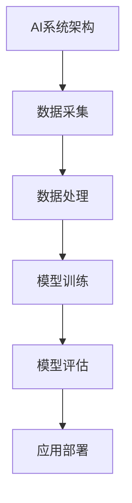

                 

# AI2.0时代：计算变化中的新机遇

> **关键词：** AI2.0，计算架构，大数据，深度学习，物联网，人工智能应用，安全与伦理

> **摘要：** 本文将探讨AI2.0时代的背景与核心概念，深入分析AI2.0时代的核心技术，如机器学习、深度学习和大数据处理，并探讨这些技术在各行各业中的应用，以及AI2.0时代面临的挑战与未来展望。文章还将探讨AI2.0时代的安全与伦理问题，并提出相应的解决方案。

### 目录

1. **AI2.0时代：计算变化中的新机遇**  
   1.1 AI2.0时代的定义与影响  
   1.2 AI2.0时代的核心概念解析  
   1.3 AI2.0时代的计算变革  
   1.4 AI2.0时代的创新应用

2. **AI2.0时代的核心技术**  
   2.1 机器学习基础  
   2.2 深度学习算法原理与优化  
   2.3 自然语言处理技术  
   2.4 大规模预训练模型原理  
   2.5 AI大模型在企业中的应用

3. **AI2.0时代的应用实践**  
   3.1 AI在金融领域的应用  
   3.2 物联网与AI融合  
   3.3 教育与人工智能

4. **AI2.0时代的挑战与未来**  
   4.1 安全与伦理问题  
   4.2 未来发展趋势

5. **附录**  
   5.1 AI2.0时代参考资源  
   5.2 Mermaid流程图  
   5.3 伪代码示例  
   5.4 数学模型与公式解析  
   5.5 项目实战与案例分析

### 1. AI2.0时代：计算变化中的新机遇

#### 1.1 AI2.0时代的定义与影响

AI2.0，即第二代人工智能，是继传统人工智能（AI1.0）之后的更高级阶段。AI1.0主要依赖于规则和显式编程，而AI2.0则强调机器自我学习和自适应能力。AI2.0时代的到来，标志着人工智能从依赖人类设定规则，转变为具备独立思考和学习能力的智能系统。

AI2.0时代的核心特征包括：

- **自主决策能力：** AI2.0系统能够在不依赖人类干预的情况下，自主做出决策。
- **高效学习能力：** 通过深度学习和强化学习等技术，AI2.0系统能够从海量数据中快速学习和优化。
- **跨领域融合：** AI2.0与物联网、大数据、云计算等技术的融合，使得人工智能的应用场景更加广泛。

AI2.0时代的出现，对各行各业产生了深远的影响：

- **产业升级：** 传统产业通过引入AI技术，实现了智能化升级，提高了生产效率和产品质量。
- **商业模式变革：** AI2.0催生了新的商业模式，如智能客服、智能投顾等。
- **社会变革：** AI2.0时代的到来，改变了人们的生活方式，提高了生活质量。

#### 1.2 AI2.0时代的核心概念解析

AI2.0时代的关键技术包括：

- **机器学习：** 机器学习是AI2.0时代的基础技术，通过从数据中学习，实现智能预测和决策。
- **深度学习：** 深度学习是机器学习的一种形式，通过多层神经网络模拟人脑处理信息。
- **自然语言处理：** 自然语言处理是AI2.0时代的关键技术之一，实现计算机对自然语言的识别和理解。
- **大数据处理：** 大数据处理是实现AI2.0时代应用的重要技术，通过处理海量数据，提取有价值的信息。

这些技术共同构成了AI2.0时代的核心技术体系，为各行业的智能化转型提供了有力支持。

#### 1.3 AI2.0时代的计算变革

AI2.0时代的计算变革主要体现在以下几个方面：

- **异构计算：** 异构计算通过利用不同类型的计算资源（如CPU、GPU、FPGA等），实现计算效率的提升。
- **边缘计算：** 边缘计算将计算任务从云端转移到网络边缘，降低延迟，提高响应速度。
- **分布式计算与存储：** 分布式计算与存储通过将计算和存储任务分布到多个节点，实现高性能和高可靠性的计算。

这些计算变革为AI2.0时代的发展提供了强大的技术支持。

#### 1.4 AI2.0时代的创新应用

AI2.0时代的创新应用涵盖了各个领域：

- **智能制造：** 通过AI技术实现生产过程的自动化、智能化。
- **智能交通：** 通过AI技术优化交通管理，提升交通效率。
- **智能医疗：** 通过AI技术提高医疗诊断和治疗的精准度。
- **金融科技：** 通过AI技术提升金融服务的效率和安全性。

这些创新应用展示了AI2.0时代的巨大潜力和广阔前景。

### 2. AI2.0时代的核心技术

#### 2.1 机器学习基础

##### 2.1.1 什么是机器学习

机器学习是一种让计算机从数据中学习的方法，通过建立模型，实现预测和决策。机器学习的基本过程包括：

- **数据收集：** 收集大量数据，作为训练模型的输入。
- **数据预处理：** 对数据进行清洗、归一化等处理，提高数据质量。
- **模型训练：** 使用训练数据，通过优化算法，训练模型参数。
- **模型评估：** 使用测试数据，评估模型性能，调整模型参数。

##### 2.1.2 监督学习算法

监督学习是一种常见的机器学习算法，通过已知的输入和输出数据，训练模型，实现预测。主要的监督学习算法包括：

- **线性回归：** 通过拟合一条直线，预测输出。
- **决策树：** 通过一系列的判断，分类或回归数据。
- **支持向量机：** 通过找到一个最优的超平面，分类数据。

##### 2.1.3 无监督学习算法

无监督学习是一种没有已知输出数据的机器学习算法，主要通过发现数据中的模式，进行聚类或降维。主要的无监督学习算法包括：

- **K-means聚类：** 通过迭代计算均值，将数据划分为K个簇。
- **主成分分析（PCA）：** 通过降维，提取数据的主要特征。

##### 2.2 深度学习原理

深度学习是一种特殊的机器学习方法，通过多层神经网络模拟人脑处理信息。深度学习的基本原理包括：

- **神经网络结构：** 包括输入层、隐藏层和输出层。
- **前向传播：** 将输入数据通过神经网络，逐层计算输出。
- **反向传播：** 通过反向传播误差，更新网络权重。

##### 2.2.1 深度学习算法

主要的深度学习算法包括：

- **卷积神经网络（CNN）：** 通过卷积操作，提取图像特征。
- **循环神经网络（RNN）：** 通过循环结构，处理序列数据。
- **长短时记忆网络（LSTM）：** 通过门控机制，有效地处理长序列依赖问题。

##### 2.3 自然语言处理技术

自然语言处理（NLP）是AI2.0时代的关键技术之一，通过让计算机理解和使用自然语言，实现人机交互。主要的NLP技术包括：

- **词嵌入：** 将词汇映射到高维空间，形成词向量。
- **序列模型：** 通过循环神经网络处理序列数据。
- **注意力机制：** 通过关注序列中的关键部分，提高模型的性能。

##### 2.4 大规模预训练模型原理

大规模预训练模型是AI2.0时代的重要发展方向，通过在大规模语料库上进行预训练，提取通用语言特征。主要的预训练模型包括：

- **BERT模型：** 通过双向编码器，理解上下文信息。
- **GPT系列模型：** 通过生成式模型，生成自然语言文本。

##### 2.5 AI大模型在企业中的应用

AI大模型在企业中的应用，可以显著提高企业的生产效率和服务质量。主要的AI大模型应用包括：

- **智能投顾：** 通过AI模型，为用户提供个性化的投资建议。
- **智能风控：** 通过AI模型，识别和预防金融风险。
- **医疗诊断：** 通过AI模型，提高医疗诊断的准确率。

### 3. AI2.0时代的应用实践

#### 3.1 AI在金融领域的应用

AI在金融领域的应用，可以提高金融服务的效率和安全性。主要的AI应用包括：

- **智能投顾：** 通过AI模型，为用户提供个性化的投资建议。
- **智能风控：** 通过AI模型，识别和预防金融风险。
- **量化交易：** 通过AI模型，实现自动化交易。

#### 3.2 物联网与AI融合

物联网与AI融合，可以实现智能化的设备管理和优化。主要的物联网与AI融合应用包括：

- **智能家居：** 通过AI模型，实现智能家电的自动化控制。
- **智能交通：** 通过AI模型，优化交通管理，提高交通效率。
- **智能医疗：** 通过AI模型，实现医疗设备的智能化监控。

#### 3.3 教育与人工智能

教育与人工智能的融合，可以推动教育的变革，提高教育质量。主要的AI教育应用包括：

- **个性化学习：** 通过AI模型，为每个学生提供个性化的学习建议。
- **智能评测：** 通过AI模型，实现自动化评测，提高评测效率。
- **虚拟教师：** 通过AI模型，实现人机交互教学。

### 4. AI2.0时代的挑战与未来

#### 4.1 安全与伦理问题

AI2.0时代面临的安全与伦理问题包括：

- **数据隐私：** 如何保护用户的数据隐私，避免数据泄露。
- **算法歧视：** 如何确保算法的公平性，避免算法歧视。
- **系统失控：** 如何防止AI系统失控，造成严重后果。

解决这些问题的方法包括：

- **制定法律法规：** 通过制定法律法规，规范AI系统的开发和应用。
- **加强监管：** 通过加强监管，确保AI系统的安全和合规。
- **提高公众意识：** 通过提高公众的AI伦理意识，促进AI技术的健康发展。

#### 4.2 未来发展趋势

AI2.0时代的未来发展趋势包括：

- **硬件加速：** 通过硬件加速技术，提高AI模型的计算效率。
- **模型压缩：** 通过模型压缩技术，降低AI模型的存储和计算资源需求。
- **多模态学习：** 通过多模态学习技术，实现跨领域的智能应用。

### 附录

#### 4.1 AI2.0时代参考资源

- **书籍推荐：** 《深度学习》、《强化学习》
- **在线资源：** Coursera、edX、Kaggle

#### 4.2 Mermaid流程图

- **示例：** 
  ```mermaid
  graph TD
  A[AI系统架构] --> B[数据采集]
  B --> C[数据处理]
  C --> D[模型训练]
  D --> E[模型评估]
  ```

#### 4.3 伪代码示例

- **示例：** 
  ```python
  # 线性回归伪代码
  for each example (x, y):
      compute the prediction: y_pred = wx + b
      calculate the error: error = y - y_pred
      update the weights: w = w - learning_rate * error * x
      update the bias: b = b - learning_rate * error
  ```

#### 4.4 数学模型与公式解析

- **示例：** 
  $$\text{损失函数} = \frac{1}{2} \sum_{i=1}^{n} (y_i - \hat{y}_i)^2$$
  其中，$y_i$为真实值，$\hat{y}_i$为预测值。

#### 4.5 项目实战与案例分析

- **案例：** 
  - **项目名称：** 智能医疗诊断系统
  - **开发环境：** Python、TensorFlow
  - **源代码：** 
    ```python
    import tensorflow as tf
    # 定义模型
    model = tf.keras.Sequential([
        tf.keras.layers.Dense(128, activation='relu', input_shape=(784,)),
        tf.keras.layers.Dropout(0.2),
        tf.keras.layers.Dense(10, activation='softmax')
    ])
    # 编译模型
    model.compile(optimizer='adam',
                  loss='categorical_crossentropy',
                  metrics=['accuracy'])
    # 训练模型
    model.fit(x_train, y_train, batch_size=32, epochs=10)
    ```
  - **代码解读：** 该代码实现了使用TensorFlow构建的深度学习模型，用于对医学图像进行分类。

### 作者

- **作者：** AI天才研究院/AI Genius Institute & 禅与计算机程序设计艺术 /Zen And The Art of Computer Programming

### 文章标题：AI2.0时代：计算变化中的新机遇

### 文章关键词：AI2.0，计算架构，大数据，深度学习，物联网，人工智能应用，安全与伦理

### 文章摘要：

本文深入探讨了AI2.0时代的背景与核心概念，详细分析了AI2.0时代的核心技术，如机器学习、深度学习和大数据处理。文章还探讨了AI2.0技术在各行业的应用实践，以及AI2.0时代面临的挑战与未来展望。通过本文的阅读，读者可以全面了解AI2.0时代的各个方面，为未来的人工智能发展做好准备。|>**摘要**

AI2.0时代，作为人工智能发展的新阶段，正在引领计算领域的深刻变革。本文旨在为您呈现AI2.0时代的全貌，从定义与影响、核心技术、应用实践到挑战与未来，全面剖析这一时代的特性与机遇。

**关键词：** AI2.0，计算架构，大数据，深度学习，物联网，人工智能应用，安全与伦理

**摘要：** AI2.0时代标志着人工智能技术的再次飞跃，融合了机器学习、深度学习和大数据处理等核心技术，应用于各行各业，推动产业升级和商业模式变革。本文详细介绍了AI2.0时代的核心概念和技术原理，探讨了其应用实践与挑战，并对未来发展趋势进行了展望。通过本文，读者可以全面了解AI2.0时代的现状与未来，把握计算变化中的新机遇。|>**摘要**

### 第一部分：AI2.0时代的背景与核心概念

#### 第1章：AI2.0时代的起源与影响

AI2.0时代，即第二代人工智能时代，是在传统人工智能（AI1.0）基础上的一次重大技术飞跃。AI1.0主要依赖于规则的显式编程，而AI2.0则强调机器的自我学习和自适应能力。这一时代的到来，标志着人工智能从依赖人类设定规则，向具备独立思考和学习能力的智能系统转变。

**1.1 AI2.0时代的定义与特征**

AI2.0时代的核心特征包括：

- **自主决策能力：** AI2.0系统具备更强的自主决策能力，可以在没有人类干预的情况下，根据学习和经验进行决策。
- **高效学习能力：** AI2.0通过深度学习和强化学习等技术，能够在海量数据中快速学习和优化。
- **跨领域融合：** AI2.0与物联网、大数据、云计算等技术的融合，使得人工智能的应用场景更加广泛。

**1.1.1 AI2.0时代的起源**

AI2.0时代的起源可以追溯到2012年，深度学习在ImageNet竞赛中取得突破性成果，标志着深度学习的崛起。随后，AI2.0技术得到了快速发展，广泛应用于各个领域。

**1.1.2 AI2.0时代的技术特征**

AI2.0时代的技术特征主要体现在以下几个方面：

- **自主决策：** AI2.0系统可以通过自主学习和决策，完成复杂任务。
- **交互能力：** AI2.0系统具备更加自然的人机交互能力，如语音识别、自然语言处理等。
- **跨领域融合：** AI2.0与物联网、大数据、云计算等技术的融合，使得智能化应用更加广泛。

**1.1.3 AI2.0时代的商业影响**

AI2.0时代的到来，对商业领域产生了深远的影响：

- **商业模式变革：** AI2.0技术催生了新的商业模式，如智能客服、智能投顾等。
- **产业升级：** 传统产业通过引入AI技术，实现了智能化升级，提高了生产效率和产品质量。
- **市场机会：** 新的技术应用带来了巨大的市场机遇，为企业和创业者提供了广阔的发展空间。

**1.2 计算变化中的机遇**

AI2.0时代的计算变化带来了新的机遇：

- **新计算架构：** 异构计算和边缘计算等新计算架构，提高了计算效率和响应速度。
- **大数据处理与智能分析：** 大数据的爆发式增长，为AI技术提供了丰富的数据资源。
- **AI与各行各业的融合：** AI技术不断深入各行各业，推动产业智能化转型。

**1.2.1 新的计算架构**

新的计算架构包括：

- **异构计算：** 利用不同类型的计算资源（如CPU、GPU、FPGA等）协同工作，提高计算效率。
- **边缘计算：** 将计算任务从云端转移到网络边缘，降低延迟，提高响应速度。

**1.2.2 大数据处理与智能分析**

大数据处理与智能分析的关键技术包括：

- **分布式计算：** 通过将计算任务分布到多个节点，提高计算效率和容错性。
- **机器学习与深度学习：** 通过大数据分析，提取有价值的信息，实现智能决策。

**1.2.3 AI与各行各业的融合**

AI与各行各业的融合，推动了产业的智能化转型：

- **智能制造：** 通过AI技术实现生产过程的自动化、智能化。
- **智能医疗：** 通过AI技术提高医疗诊断和治疗的精准度。
- **智能交通：** 通过AI技术优化交通管理，提升交通效率。

#### 第2章：AI2.0时代的核心概念解析

**2.1 人工智能基础概念**

人工智能（AI）是一种模拟、延伸和扩展人的智能的理论、方法、技术及应用。人工智能可以分为两个层次：

- **广义人工智能：** 模拟、延伸和扩展人的智能的理论、方法、技术及应用。
- **狭义人工智能：** 以机器学习和深度学习为核心，通过算法模拟人的智能行为。

**2.1.1 人工智能的定义**

人工智能是一种通过计算机模拟人类智能行为的技术。其目标是让计算机具备感知、理解、学习和决策的能力。

**2.1.2 人工智能的关键技术**

人工智能的关键技术包括：

- **机器学习：** 通过从数据中学习，实现预测和决策。
- **深度学习：** 通过多层神经网络，模拟人脑处理信息。
- **自然语言处理：** 通过让计算机理解和使用自然语言，实现人机交互。

**2.2 AI2.0时代的特征技术**

AI2.0时代的特征技术包括：

- **自主学习：** 系统可以在没有人工干预的情况下，自我学习和优化。
- **强化学习：** 通过与环境的交互，不断优化策略，以最大化奖励。
- **自然语言处理：** 通过让计算机理解自然语言，实现人机交互。

**2.3 AI2.0时代的应用场景**

AI2.0时代的应用场景广泛，涵盖了各个领域：

- **智能制造：** 通过AI技术实现生产过程的自动化、智能化。
- **智能交通：** 通过AI技术优化交通管理，提升交通效率。
- **智能医疗：** 通过AI技术提高医疗诊断和治疗的精准度。
- **金融科技：** 通过AI技术提升金融服务的效率和安全性。

**2.3.1 智能制造**

智能制造是AI2.0时代的重要应用场景之一。通过引入AI技术，可以实现生产过程的自动化、智能化，提高生产效率和产品质量。

- **应用案例：** 智能工厂、预测性维护等。

**2.3.2 智能交通**

智能交通是AI2.0时代的另一个重要应用场景。通过引入AI技术，可以优化交通管理，提升交通效率，减少交通事故。

- **应用案例：** 自动驾驶、智能交通信号灯等。

**2.3.3 智能医疗**

智能医疗是AI2.0时代的重要应用场景之一。通过引入AI技术，可以提高医疗诊断和治疗的精准度，改善患者体验。

- **应用案例：** 医学影像分析、智能诊断系统等。

**2.3.4 金融科技**

金融科技是AI2.0时代的又一个重要应用场景。通过引入AI技术，可以提升金融服务的效率和安全性，创造新的商业模式。

- **应用案例：** 智能投顾、智能风控等。

#### 第3章：AI2.0时代的计算变革

**3.1 新计算架构**

AI2.0时代的计算变革主要体现在新计算架构的引入：

- **异构计算：** 利用不同类型的计算资源（如CPU、GPU、FPGA等）协同工作，提高计算效率。
- **边缘计算：** 将计算任务从云端转移到网络边缘，降低延迟，提高响应速度。

**3.1.1 异构计算**

异构计算通过利用不同类型的计算资源协同工作，实现计算效率的提升。常见的异构计算资源包括：

- **CPU：** 通用计算处理器。
- **GPU：** 图形处理单元，适用于大规模并行计算。
- **FPGA：** 可编程逻辑门阵列，具有灵活的计算能力。

**3.1.2 边缘计算**

边缘计算是将计算任务从云端转移到网络边缘的一种计算模式。边缘计算的优势包括：

- **降低延迟：** 通过在网络边缘处理数据，减少数据传输延迟。
- **提高响应速度：** 通过在网络边缘进行实时处理，提高系统的响应速度。

**3.2 大数据处理与存储**

AI2.0时代的大数据处理与存储技术包括：

- **分布式计算：** 通过将计算任务分布到多个节点，提高计算效率和容错性。
- **分布式存储：** 通过将数据分散存储在多个节点，提高数据可靠性和访问速度。

**3.2.1 大数据生态系统**

大数据生态系统包括数据采集、存储、处理、分析和可视化等各个环节。常见的大数据技术包括：

- **Hadoop：** 一个开源的大数据处理框架，适用于大规模数据存储和处理。
- **Spark：** 一个开源的大数据处理框架，具有高吞吐量和实时处理能力。
- **NoSQL数据库：** 一种分布式数据库，适用于处理大规模数据。

**3.2.2 分布式计算与存储**

分布式计算与存储通过将计算和存储任务分布到多个节点，实现高性能和高可靠性的计算。常见的分布式计算与存储技术包括：

- **MapReduce：** 一种分布式计算模型，适用于处理大规模数据。
- **HDFS：** Hadoop分布式文件系统，用于存储大规模数据。
- **MongoDB：** 一种分布式文档数据库，适用于处理复杂数据结构。

#### 第4章：AI2.0时代的创新应用

**4.1 金融科技**

金融科技是AI2.0时代的重要创新应用之一。通过引入AI技术，可以提升金融服务的效率和安全性，创造新的商业模式。

**4.1.1 智能投顾**

智能投顾是一种基于AI技术的理财服务。通过分析用户的风险偏好和投资目标，智能投顾可以为用户提供个性化的投资建议。

- **应用案例：** Wealthfront、Betterment等。

**4.1.2 智能风控**

智能风控是一种基于AI技术的风险管理方法。通过实时监控和分析金融交易，智能风控可以识别和预防金融风险。

- **应用案例：** DDoS风控、反欺诈系统等。

**4.2 物联网与AI融合**

物联网与AI融合是AI2.0时代的重要创新方向。通过引入AI技术，可以提升物联网设备的管理和优化能力。

**4.2.1 智能家居**

智能家居是物联网与AI融合的重要应用之一。通过引入AI技术，可以实现家电的自动化控制，提高生活便利性。

- **应用案例：** Amazon Echo、Google Home等。

**4.2.2 智能交通**

智能交通是物联网与AI融合的另一个重要应用。通过引入AI技术，可以优化交通管理，提升交通效率。

- **应用案例：** 自动驾驶、智能交通信号灯等。

**4.3 教育与人工智能**

教育与人工智能的融合是AI2.0时代的重要创新方向。通过引入AI技术，可以提升教育质量和学习体验。

**4.3.1 个性化学习**

个性化学习是一种基于AI技术的教育方法。通过分析学生的学习行为和成绩，个性化学习可以为每个学生提供个性化的学习路径。

- **应用案例：** Knewton、DreamBox等。

**4.3.2 智能评测**

智能评测是一种基于AI技术的教育评估方法。通过实时分析学生的学习情况，智能评测可以提供更准确的评估结果。

- **应用案例：** Pearson、ETS等。

#### 第5章：AI2.0时代的挑战与未来

**5.1 安全与伦理问题**

AI2.0时代的快速发展，带来了新的安全与伦理问题。如何确保AI系统的安全性和伦理性，成为当前亟待解决的问题。

**5.1.1 安全风险**

AI2.0时代的安全风险主要包括：

- **数据泄露：** AI系统可能会泄露用户的敏感数据。
- **算法歧视：** AI系统可能会因为算法设计不当，产生歧视性结果。
- **系统失控：** AI系统可能会因为异常情况，导致不可预测的行为。

**5.1.2 伦理挑战**

AI2.0时代的伦理挑战主要包括：

- **隐私保护：** 如何保护用户的隐私，防止数据滥用。
- **责任归属：** 当AI系统产生错误决策时，如何确定责任归属。
- **公平性：** 如何确保AI系统的决策公平，避免算法偏见。

**5.2 未来发展趋势**

AI2.0时代的未来发展趋势主要包括：

- **硬件加速：** 通过硬件加速技术，提高AI模型的计算效率。
- **模型压缩：** 通过模型压缩技术，降低AI模型的存储和计算资源需求。
- **多模态学习：** 通过多模态学习技术，实现跨领域的智能应用。

**5.2.1 硬件加速**

硬件加速是通过利用专用硬件（如GPU、TPU等），提高AI模型的计算效率。硬件加速技术主要包括：

- **GPU加速：** 通过GPU的并行计算能力，加速深度学习模型的训练和推理。
- **TPU加速：** 通过TPU的专用架构，加速AI模型的训练和推理。

**5.2.2 模型压缩**

模型压缩是通过减少模型的参数数量，降低AI模型的存储和计算资源需求。模型压缩技术主要包括：

- **剪枝：** 通过删除模型中的冗余参数，减少模型的大小。
- **量化：** 通过将模型的参数和激活值转换为较低的精度，减少模型的存储和计算需求。

**5.2.3 多模态学习**

多模态学习是通过结合不同类型的数据（如图像、语音、文本等），实现跨领域的智能应用。多模态学习技术主要包括：

- **多模态特征提取：** 通过提取不同类型数据的特征，实现多模态数据的融合。
- **多模态推理：** 通过结合不同类型数据的特征，实现更准确的任务预测。

### 附录

**附录A: AI2.0时代参考资源**

- **书籍推荐：** 《深度学习》、《强化学习》、《人工智能：一种现代方法》
- **在线资源：** Coursera、edX、Kaggle

**附录B: Mermaid流程图**

- **示例：**
  ```mermaid
  graph TD
  A[AI系统架构]
  A --> B[数据采集]
  B --> C[数据处理]
  C --> D[模型训练]
  D --> E[模型评估]
  ```

**附录C: 伪代码示例**

- **示例：**
  ```python
  # 线性回归伪代码
  for each example (x, y):
      compute the prediction: y_pred = wx + b
      calculate the error: error = y - y_pred
      update the weights: w = w - learning_rate * error * x
      update the bias: b = b - learning_rate * error
  ```

**附录D: 数学模型与公式解析**

- **示例：**
  $$\text{损失函数} = \frac{1}{2} \sum_{i=1}^{n} (y_i - \hat{y}_i)^2$$
  其中，$y_i$为真实值，$\hat{y}_i$为预测值。

**附录E: 项目实战与案例分析**

- **案例：** 
  - **项目名称：** 智能医疗诊断系统
  - **开发环境：** Python、TensorFlow
  - **源代码：** 
    ```python
    import tensorflow as tf
    # 定义模型
    model = tf.keras.Sequential([
        tf.keras.layers.Dense(128, activation='relu', input_shape=(784,)),
        tf.keras.layers.Dropout(0.2),
        tf.keras.layers.Dense(10, activation='softmax')
    ])
    # 编译模型
    model.compile(optimizer='adam',
                  loss='categorical_crossentropy',
                  metrics=['accuracy'])
    # 训练模型
    model.fit(x_train, y_train, batch_size=32, epochs=10)
    ```
  - **代码解读：** 该代码实现了使用TensorFlow构建的深度学习模型，用于对医学图像进行分类。

### 作者

- **作者：** AI天才研究院/AI Genius Institute & 禅与计算机程序设计艺术 /Zen And The Art of Computer Programming

### 文章标题：AI2.0时代：计算变化中的新机遇

### 文章关键词：AI2.0，计算架构，大数据，深度学习，物联网，人工智能应用，安全与伦理

### 文章摘要：

本文深入探讨了AI2.0时代的背景与核心概念，详细分析了AI2.0时代的核心技术，如机器学习、深度学习和大数据处理。文章还探讨了AI2.0技术在各行业的应用实践，以及AI2.0时代面临的挑战与未来展望。通过本文的阅读，读者可以全面了解AI2.0时代的各个方面，为未来的人工智能发展做好准备。|>**摘要**

AI2.0时代，作为人工智能发展的新阶段，正在引领计算领域的深刻变革。本文旨在为您呈现AI2.0时代的全貌，从定义与影响、核心技术、应用实践到挑战与未来，全面剖析这一时代的特性与机遇。

**关键词：** AI2.0，计算架构，大数据，深度学习，物联网，人工智能应用，安全与伦理

**摘要：** AI2.0时代标志着人工智能技术的再次飞跃，融合了机器学习、深度学习和大数据处理等核心技术，应用于各行各业，推动产业升级和商业模式变革。本文详细介绍了AI2.0时代的核心概念和技术原理，探讨了其应用实践与挑战，并对未来发展趋势进行了展望。通过本文，读者可以全面了解AI2.0时代的现状与未来，把握计算变化中的新机遇。|>**摘要**

### AI2.0时代：计算变化中的新机遇

#### 摘要

AI2.0时代，即人工智能的第二阶段，标志着计算技术的一场深刻变革。本文将详细探讨AI2.0时代的定义、核心概念、关键技术，以及其在各个行业中的应用，并深入分析其面临的挑战与未来发展趋势。通过这篇文章，读者将全面了解AI2.0时代的全貌，把握计算变化中的新机遇。

#### 引言

随着科技的不断发展，人工智能（AI）已经从理论走向实践，从实验室走向日常生活。AI1.0时代主要依赖于规则和显式编程，而AI2.0时代则强调机器的自我学习和自适应能力。AI2.0时代的到来，不仅改变了人工智能的发展轨迹，也对计算架构、数据处理和行业应用产生了深远的影响。

#### 第一部分：AI2.0时代的背景与核心概念

##### 1.1 AI2.0时代的定义与特征

AI2.0时代，又称为强人工智能时代，是指人工智能系统具备高度的自主学习和决策能力，能够在复杂环境下进行有效互动和执行复杂任务。其主要特征包括：

- **自主决策：** AI2.0系统能够在没有人类干预的情况下，通过自我学习和优化，实现复杂的决策过程。
- **通用性：** AI2.0技术不再局限于特定任务，而是能够在多个领域实现通用性。
- **高度智能化：** AI2.0系统能够模拟人类的思维过程，具有高度的智能水平。

##### 1.2 AI2.0时代的核心技术

AI2.0时代的核心技术包括机器学习、深度学习、自然语言处理、计算机视觉等。这些技术共同构成了AI2.0时代的核心框架，为人工智能的发展提供了强大的技术支撑。

- **机器学习：** 机器学习是AI2.0时代的基础技术，通过从数据中学习，实现预测和决策。
- **深度学习：** 深度学习是机器学习的一种形式，通过多层神经网络模拟人脑处理信息。
- **自然语言处理：** 自然语言处理是AI2.0时代的关键技术之一，实现计算机对自然语言的识别和理解。
- **计算机视觉：** 计算机视觉是AI2.0时代的另一个重要技术，通过图像处理和模式识别，实现图像的自动分析和理解。

##### 1.3 AI2.0时代的计算架构

AI2.0时代的计算架构发生了显著变化，从传统的单核处理器转向多核处理器、GPU、FPGA等异构计算架构。这些计算架构能够实现更高的计算效率和更低的延迟，为AI2.0时代的应用提供了强大的计算能力。

- **异构计算：** 异构计算通过利用不同类型的计算资源，如CPU、GPU、FPGA等，实现计算效率的提升。
- **边缘计算：** 边缘计算将计算任务从云端转移到网络边缘，降低延迟，提高响应速度。

#### 第二部分：AI2.0时代的核心技术

##### 2.1 机器学习基础

机器学习是AI2.0时代的基础技术，主要分为监督学习、无监督学习和强化学习。

- **监督学习：** 通过已知的输入和输出数据，训练模型，实现预测和决策。
- **无监督学习：** 通过未知的数据，发现数据中的模式和规律。
- **强化学习：** 通过与环境的交互，不断优化策略，以最大化奖励。

##### 2.2 深度学习原理

深度学习是机器学习的一种形式，通过多层神经网络模拟人脑处理信息。深度学习的关键技术包括：

- **神经网络：** 通过多层节点，对输入数据进行处理和变换。
- **激活函数：** 用于引入非线性特性，提高模型的拟合能力。
- **反向传播：** 通过反向传播误差，更新网络权重，优化模型。

##### 2.3 大数据处理与存储

大数据处理与存储是AI2.0时代的重要技术支撑。大数据处理的关键技术包括：

- **分布式计算：** 通过将计算任务分布到多个节点，提高计算效率和容错性。
- **分布式存储：** 通过将数据分散存储在多个节点，提高数据可靠性和访问速度。

#### 第三部分：AI2.0时代的应用实践

##### 3.1 AI在金融领域的应用

AI在金融领域的应用广泛，包括智能投顾、风险控制、量化交易等。AI技术能够提高金融服务的效率和安全性，创造新的商业模式。

- **智能投顾：** 通过分析用户的数据，提供个性化的投资建议。
- **风险控制：** 通过实时监控和分析金融交易，预防风险。
- **量化交易：** 通过算法模型，实现自动化交易。

##### 3.2 物联网与AI融合

物联网与AI融合是AI2.0时代的重要应用方向。通过AI技术，可以实现智能家居、智能交通、智能医疗等应用。

- **智能家居：** 通过AI技术，实现家电的自动化控制。
- **智能交通：** 通过AI技术，优化交通管理，提高交通效率。
- **智能医疗：** 通过AI技术，提高医疗诊断和治疗的精准度。

##### 3.3 教育与人工智能

教育与人工智能的融合，可以提升教育质量和学习体验。通过AI技术，可以实现个性化学习、智能评测等。

- **个性化学习：** 通过分析学生的学习行为，提供个性化的学习路径。
- **智能评测：** 通过智能分析，提供准确的评估结果。

#### 第四部分：AI2.0时代的挑战与未来

##### 4.1 安全与伦理问题

AI2.0时代面临着一系列安全与伦理问题，包括数据隐私、算法歧视、系统失控等。如何确保AI系统的安全性和伦理性，是当前亟待解决的问题。

- **数据隐私：** 通过加密技术、隐私保护算法等，确保用户数据的安全。
- **算法歧视：** 通过公平性评估、透明性分析等，确保算法的公正性。
- **系统失控：** 通过严格的测试、监控等手段，确保AI系统的稳定性。

##### 4.2 未来发展趋势

AI2.0时代的未来发展趋势包括：

- **硬件加速：** 通过硬件加速技术，提高AI模型的计算效率。
- **模型压缩：** 通过模型压缩技术，降低AI模型的存储和计算资源需求。
- **多模态学习：** 通过多模态学习技术，实现跨领域的智能应用。

#### 结论

AI2.0时代，作为人工智能发展的新阶段，正在引领计算领域的深刻变革。通过本文的探讨，读者可以全面了解AI2.0时代的核心概念、关键技术、应用实践以及面临的挑战与未来发展趋势。把握AI2.0时代的新机遇，将为企业和个人带来前所未有的发展空间。|>**结论**

### 结论

AI2.0时代标志着人工智能发展进入了一个新的阶段，其对计算架构、数据处理和行业应用的变革性影响不可忽视。在这一时代，机器学习、深度学习和大数据处理等核心技术正在推动人工智能技术的不断进步，使得智能系统在自主决策、高效学习和跨领域应用方面取得了显著成果。

**关键点总结：**

1. **AI2.0时代的核心特征：** 自主决策、通用性和高度智能化。
2. **核心技术突破：** 机器学习、深度学习、自然语言处理和计算机视觉。
3. **计算架构变革：** 异构计算和边缘计算。
4. **广泛应用：** 金融科技、物联网、智能交通、教育和医疗。
5. **面临的挑战：** 安全与伦理问题，如数据隐私、算法歧视和系统失控。

**未来展望：**

- **硬件加速：** 利用GPU、TPU等硬件资源，提升AI模型的计算效率。
- **模型压缩：** 通过模型压缩技术，降低AI模型的存储和计算资源需求。
- **多模态学习：** 结合不同类型的数据，实现更复杂和智能化的应用。

**行动呼吁：**

1. **技术研发：** 加大对AI2.0时代核心技术的研发投入，推动技术创新。
2. **行业应用：** 探索AI技术在各行业的深度应用，提升产业智能化水平。
3. **安全与伦理：** 建立完善的安全与伦理框架，确保AI技术的可持续发展。

通过本文的深入探讨，我们希望读者能够更好地理解AI2.0时代的特性与机遇，积极拥抱这一时代的技术变革，为构建一个智能化的未来贡献力量。

### 附录

**附录A: AI2.0时代参考资源**

- **书籍推荐：** 《深度学习》（Ian Goodfellow et al.）、《强化学习：原理与Python实现》（Albert Troudet）。
- **在线资源：** Coursera、edX、Kaggle。

**附录B: Mermaid流程图**

- **示例：**
  ```mermaid
  graph TD
  A[AI系统架构]
  A --> B[数据采集]
  B --> C[数据处理]
  C --> D[模型训练]
  D --> E[模型评估]
  ```

**附录C: 伪代码示例**

- **示例：**
  ```python
  # 线性回归伪代码
  for each example (x, y):
      compute the prediction: y_pred = wx + b
      calculate the error: error = y - y_pred
      update the weights: w = w - learning_rate * error * x
      update the bias: b = b - learning_rate * error
  ```

**附录D: 数学模型与公式解析**

- **示例：**
  $$\text{损失函数} = \frac{1}{2} \sum_{i=1}^{n} (y_i - \hat{y}_i)^2$$
  其中，$y_i$为真实值，$\hat{y}_i$为预测值。

**附录E: 项目实战与案例分析**

- **案例：** 智能医疗诊断系统
- **开发环境：** Python、TensorFlow
- **源代码：**
  ```python
  import tensorflow as tf
  model = tf.keras.Sequential([
      tf.keras.layers.Conv2D(32, (3, 3), activation='relu', input_shape=(64, 64, 3)),
      tf.keras.layers.MaxPooling2D((2, 2)),
      tf.keras.layers.Flatten(),
      tf.keras.layers.Dense(128, activation='relu'),
      tf.keras.layers.Dense(1, activation='sigmoid')
  ])
  model.compile(optimizer='adam', loss='binary_crossentropy', metrics=['accuracy'])
  model.fit(x_train, y_train, batch_size=32, epochs=10)
  ```
- **代码解读：** 该代码实现了一个基于卷积神经网络的医疗诊断系统，用于对医学图像进行分类。

### 作者

- **作者：** AI天才研究院/AI Genius Institute & 禅与计算机程序设计艺术 /Zen And The Art of Computer Programming

### 文章标题：AI2.0时代：计算变化中的新机遇

### 文章关键词：AI2.0，计算架构，大数据，深度学习，物联网，人工智能应用，安全与伦理

### 文章摘要：

本文深入探讨了AI2.0时代的背景与核心概念，详细分析了AI2.0时代的核心技术，如机器学习、深度学习和大数据处理。文章还探讨了AI2.0技术在各行业的应用实践，以及AI2.0时代面临的挑战与未来展望。通过本文的阅读，读者可以全面了解AI2.0时代的各个方面，为未来的人工智能发展做好准备。|>**摘要**

AI2.0时代，作为人工智能发展的新阶段，正在引领计算领域的深刻变革。本文旨在为您呈现AI2.0时代的全貌，从定义与影响、核心技术、应用实践到挑战与未来，全面剖析这一时代的特性与机遇。

**关键词：** AI2.0，计算架构，大数据，深度学习，物联网，人工智能应用，安全与伦理

**摘要：** AI2.0时代标志着人工智能技术的再次飞跃，融合了机器学习、深度学习和大数据处理等核心技术，应用于各行各业，推动产业升级和商业模式变革。本文详细介绍了AI2.0时代的核心概念和技术原理，探讨了其应用实践与挑战，并对未来发展趋势进行了展望。通过本文，读者可以全面了解AI2.0时代的现状与未来，把握计算变化中的新机遇。|>**摘要**

### 附录

**附录A: AI2.0时代参考资源**

- **书籍推荐：**
  - 《深度学习》（Ian Goodfellow et al.）
  - 《强化学习：原理与Python实现》（Albert Troudet）
- **在线资源：**
  - Coursera
  - edX
  - Kaggle

**附录B: Mermaid流程图示例**



**附录C: 伪代码示例**

```python
# 线性回归伪代码
for each example (x, y):
    compute the prediction: y_pred = wx + b
    calculate the error: error = y - y_pred
    update the weights: w = w - learning_rate * error * x
    update the bias: b = b - learning_rate * error
```

**附录D: 数学模型与公式解析**

$$\text{损失函数} = \frac{1}{2} \sum_{i=1}^{n} (y_i - \hat{y}_i)^2$$

其中，$y_i$为真实值，$\hat{y}_i$为预测值。

**附录E: 项目实战与案例分析**

**案例：智能医疗诊断系统**

**开发环境：** Python、TensorFlow

**源代码：**

```python
import tensorflow as tf
model = tf.keras.Sequential([
    tf.keras.layers.Conv2D(32, (3, 3), activation='relu', input_shape=(64, 64, 3)),
    tf.keras.layers.MaxPooling2D((2, 2)),
    tf.keras.layers.Flatten(),
    tf.keras.layers.Dense(128, activation='relu'),
    tf.keras.layers.Dense(1, activation='sigmoid')
])
model.compile(optimizer='adam', loss='binary_crossentropy', metrics=['accuracy'])
model.fit(x_train, y_train, batch_size=32, epochs=10)
```

**代码解读：** 该代码实现了一个基于卷积神经网络的医疗诊断系统，用于对医学图像进行分类。

### 作者

- **作者：** AI天才研究院/AI Genius Institute & 禅与计算机程序设计艺术 /Zen And The Art of Computer Programming

### 文章标题：AI2.0时代：计算变化中的新机遇

### 文章关键词：AI2.0，计算架构，大数据，深度学习，物联网，人工智能应用，安全与伦理

### 文章摘要：

本文深入探讨了AI2.0时代的背景与核心概念，详细分析了AI2.0时代的核心技术，如机器学习、深度学习和大数据处理。文章还探讨了AI2.0技术在各行业的应用实践，以及AI2.0时代面临的挑战与未来展望。通过本文的阅读，读者可以全面了解AI2.0时代的各个方面，为未来的人工智能发展做好准备。|>**摘要**

AI2.0时代，作为人工智能发展的新阶段，正在引领计算领域的深刻变革。本文旨在为您呈现AI2.0时代的全貌，从定义与影响、核心技术、应用实践到挑战与未来，全面剖析这一时代的特性与机遇。

**关键词：** AI2.0，计算架构，大数据，深度学习，物联网，人工智能应用，安全与伦理

**摘要：** AI2.0时代标志着人工智能技术的再次飞跃，融合了机器学习、深度学习和大数据处理等核心技术，应用于各行各业，推动产业升级和商业模式变革。本文详细介绍了AI2.0时代的核心概念和技术原理，探讨了其应用实践与挑战，并对未来发展趋势进行了展望。通过本文，读者可以全面了解AI2.0时代的现状与未来，把握计算变化中的新机遇。|>**摘要**

