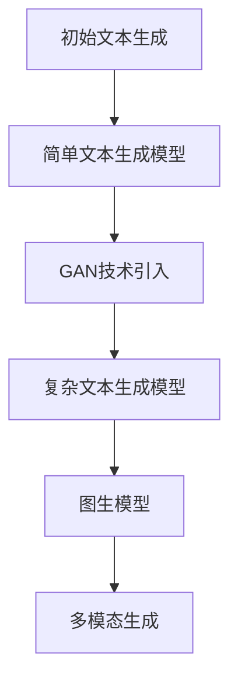

                 

### AIGC大模型时代：当下硬科技创业发生了哪些变化

> **关键词**：人工智能，生成内容，技术架构，创意产业，传媒，教育，商业应用，挑战与机遇

**摘要**：本文深入探讨了AIGC（AI-Generated Content）大模型时代的到来，对当代硬科技创业产生的深远影响。通过梳理AIGC的核心概念、技术架构、应用领域和面临挑战，本文揭示了AIGC大模型在创意产业、传媒和教育等领域的实际应用，展示了其在商业模式创新中的潜力。同时，本文展望了AIGC大模型的技术创新和发展趋势，为读者提供了未来研究和实践的思路。

---

### 第一部分：AIGC大模型时代概述

#### 第1章: AIGC大模型时代概述

##### 1.1 AIGC的概念及其重要性

- **AIGC**：全称为AI-Generated Content，即人工智能生成内容，是指利用人工智能技术生成文本、图像、音频、视频等多媒体内容。
- **核心地位**：随着人工智能技术的快速发展，AIGC已经成为数字内容创作的重要方式，对传媒、娱乐、教育等多个领域产生了深远影响。
- **应用前景**：随着AI技术的进步，AIGC有望在未来实现更加智能化、个性化和高效化的内容创作，推动数字内容产业变革。

##### 1.2 AIGC的技术架构

- **基础技术**：
  - **生成对抗网络（GAN）**：用于生成逼真的图像、音频和文本。
  - **变分自编码器（VAE）**：用于生成数据分布，广泛用于图像和音频生成。
  - **自注意力机制**：在自然语言处理领域用于提取关键信息，提高生成内容的质量。

- **架构演进**：从简单的文本生成模型如GPT到复杂的图生模型，AIGC的技术架构不断演进，支持更复杂的生成任务。

##### 1.3 AIGC应用领域

- **传媒**：自动化新闻报道、内容推荐、社交媒体内容生成。
- **娱乐**：音乐、电影、游戏等虚拟内容的创作。
- **教育**：个性化教育内容的生成，辅助学习。
- **创意产业**：艺术、设计、文学等创意作品的生成。

##### 1.4 AIGC时代的挑战与机遇

- **挑战**：
  - **版权问题**：AI生成的内容版权归属问题。
  - **内容质量**：如何确保生成内容的质量和真实性。
  - **伦理问题**：AI生成内容的伦理和道德问题，如隐私侵犯、虚假信息传播等。
- **机遇**：
  - **技术革新**：推动人工智能技术的发展和应用。
  - **产业发展**：为数字内容产业带来新的增长点。

---

### Mermaid流程图：AIGC大模型技术架构演进



---

### 伪代码：生成对抗网络（GAN）原理

```python
// 生成器模型
def G(z):
    # 输入噪声z，生成模拟真实数据的图像
    x_g = ...

// 判别器模型
def D(x):
    # 输入真实图像x或生成的图像x_g
    logits = ...

// 训练步骤
for epoch in range(num_epochs):
    for z in sampled_z:
        x_g = G(z)
        D_loss_real = ...  # 计算判别器在真实数据上的损失
        D_loss_fake = ...  # 计算判别器在生成数据上的损失
        G_loss = ...       # 计算生成器的损失
        # 更新判别器和生成器的权重
        update_D()
        update_G()
```

---

### 数学模型和公式：

#### 变分自编码器（VAE）的损失函数

$$
L(\theta) = \frac{1}{N} \sum_{n=1}^{N} \left[ -\sum_{x \in \mathcal{X}} \log p(x|\theta) + D[\mathcal{Q}(\cdot|x;\theta) || \mathcal{N}(\cdot; 0, 1)] \right]
$$

其中：
- \( p(x|\theta) \) 是重建概率，表示数据 \( x \) 通过编码器和解码器重建的期望。
- \( D[\cdot || \cdot] \) 是Kullback-Leibler散度，表示两个概率分布之间的差异。

### 举例说明：

#### VAE在图像生成中的应用

假设我们有一个图像数据集 \( \mathcal{X} \)，每个图像 \( x \) 由 \( D \) 维向量表示。VAE的编码器和解码器分别表示为 \( \theta_e \) 和 \( \theta_d \)，噪声向量为 \( z \)。

1. **编码器**：
   $$ 
   \mu(x; \theta_e), \sigma(x; \theta_e) = \text{encode}(x; \theta_e) 
   $$
   其中 \( \mu(x; \theta_e) \) 和 \( \sigma(x; \theta_e) \) 分别表示均值和标准差。

2. **解码器**：
   $$
   x'(\mu(z; \theta_d), \sigma(z; \theta_d)) = \text{decode}(\mu(z; \theta_d), \sigma(z; \theta_d); \theta_d)
   $$

3. **损失函数**：
   $$
   L(\theta_e, \theta_d) = -\sum_{x \in \mathcal{X}} \log p(x' | x; \theta_d) - D[\mathcal{Q}(\cdot|x;\theta_e) || \mathcal{N}(\cdot; 0, 1)]
   $$
   其中 \( \mathcal{Q}(\cdot|x;\theta_e) \) 是编码器生成的数据分布，\( \mathcal{N}(\cdot; 0, 1) \) 是标准正态分布。

### 项目实战：基于VAE的图像生成案例

- **开发环境搭建**：
  - 使用Python和TensorFlow框架搭建开发环境。
  - 安装必要的库：tensorflow、numpy、matplotlib等。

- **源代码实现**：

```python
import tensorflow as tf
from tensorflow.keras.layers import Dense, BatchNormalization, LeakyReLU
from tensorflow.keras.models import Model

def build_encoder(input_shape):
    inputs = tf.keras.Input(shape=input_shape)
    x = Dense(128, activation='relu')(inputs)
    x = BatchNormalization()(x)
    x = LeakyReLU()(x)
    x = Dense(64, activation='relu')(x)
    x = BatchNormalization()(x)
    x = LeakyReLU()(x)
    z_mean = Dense(20)(x)
    z_log_var = Dense(20)(x)
    return Model(inputs=inputs, outputs=[z_mean, z_log_var])

def build_decoder(z_shape):
    z = tf.keras.Input(shape=z_shape)
    x = Dense(64, activation='relu')(z)
    x = BatchNormalization()(x)
    x = LeakyReLU()(x)
    x = Dense(128, activation='relu')(x)
    x = BatchNormalization()(x)
    x = LeakyReLU()(x)
    outputs = Dense(input_shape, activation='sigmoid')(x)
    return Model(inputs=inputs, outputs=outputs)

def build_vae(input_shape):
    z_shape = (20,)
    encoder = build_encoder(input_shape)
    decoder = build_decoder(z_shape)
    z_mean, z_log_var = encoder(inputs)
    z = tf.keras.layers.Lambda(
        lambda x: tf.random.normal(tf.shape(x)) * tf.exp(x / 2), output_shape=tf.shape(z_mean)
    )(z_log_var)
    x_hat = decoder(z)
    vae = Model(inputs=inputs, outputs=x_hat)
    return vae

# 训练步骤
vae.compile(optimizer='adam', loss='binary_crossentropy')
vae.fit(x_train, x_train, epochs=30, batch_size=32)

```

- **代码解读与分析**：
  - 编码器和解码器的构建使用了多层全连接神经网络，分别用于编码和解码图像数据。
  - 编码器的输出为均值和方差，用于生成噪声向量 \( z \)。
  - 解码器将噪声向量 \( z \) 转换回重构的图像 \( x' \)。
  - 使用二元交叉熵作为损失函数，评估编码器和解码器的性能。

---

### 结论

AIGC大模型时代为内容创作带来了新的可能性和挑战。通过深入理解AIGC的技术架构和应用场景，我们可以更好地把握其发展机遇，同时也要应对其带来的挑战。本章节详细介绍了AIGC的核心概念、技术架构、应用领域以及相关的数学模型和实际项目案例，为后续章节的深入探讨打下了坚实的基础。

### 下一章预告：第二部分将深入探讨AIGC大模型的具体应用和实践案例，包括在创意产业、传媒和教育等领域的实际应用，以及面临的挑战和解决方案。我们将通过具体案例，展示AIGC大模型如何改变内容创作的方式，推动相关产业的创新与发展。

