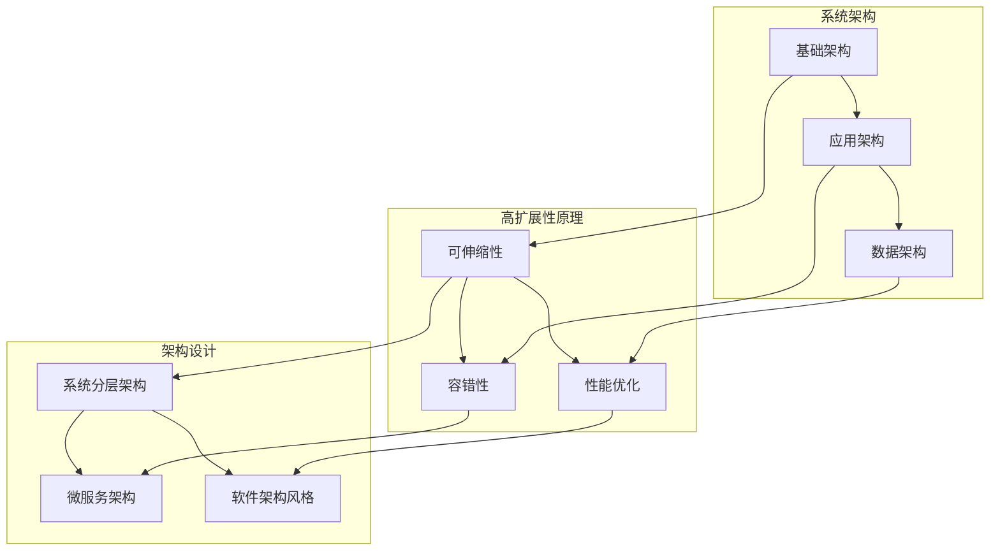
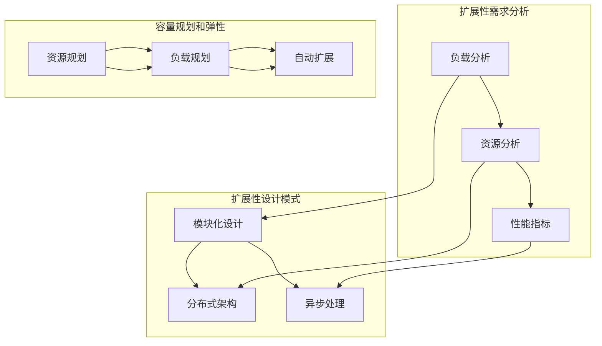
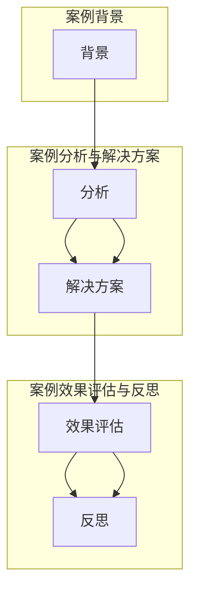

                 

### 文章标题

“高扩展性系统设计的关键要素”

---

#### 关键词：

- 高扩展性系统
- 系统架构设计
- 可扩展性设计模式
- 性能优化
- 分布式架构

---

#### 摘要：

本文旨在深入探讨高扩展性系统设计的关键要素，包括系统设计与核心概念、系统架构设计、高扩展性系统核心原理、高扩展性系统核心技术、系统性能优化、高扩展性系统项目实战、高扩展性系统案例分析以及高扩展性系统未来发展趋势。通过详细的剖析和实例讲解，本文旨在为读者提供一套完整的理解和设计高扩展性系统的指南。

---

### 目录大纲

1. **高扩展性系统概述**
   1.1 高扩展性系统的定义与重要性
   1.2 高扩展性系统的目标与挑战
   1.3 高扩展性系统设计与最佳实践

2. **系统架构设计**
   2.1 系统架构的基本概念
   2.2 系统分层架构
   2.3 微服务架构
   2.4 软件架构风格

3. **高扩展性系统核心原理**
   3.1 可扩展性的需求分析
   3.2 扩展性设计模式
   3.3 容量规划和弹性

4. **高扩展性系统核心技术**
   4.1 缓存机制
   4.2 负载均衡
   4.3 数据分片
   4.4 异步处理与消息队列

5. **系统性能优化**
   5.1 性能优化策略
   5.2 系统监控与性能分析
   5.3 性能调优实战

6. **高扩展性系统项目实战**
   6.1 项目背景与目标
   6.2 项目架构设计
   6.3 核心技术与优化方案
   6.4 项目实施与挑战

7. **高扩展性系统案例分析**
   7.1 案例背景
   7.2 案例分析与解决方案
   7.3 案例效果评估与反思

8. **高扩展性系统未来发展趋势**
   8.1 未来技术趋势
   8.2 技术挑战与机遇
   8.3 高扩展性系统的未来方向

9. **附录**
   9.1 高扩展性系统设计工具与资源
   9.2 学习资源与推荐

---

### 第1章：高扩展性系统概述

#### 1.1 高扩展性系统的定义与重要性

高扩展性系统（High Availability System）是指系统具有在需求增加时，通过自动或手动扩展资源，保持其性能和可靠性的能力。在现代信息时代，随着数据量和用户规模的快速增长，构建高扩展性系统成为许多企业成功的关键因素之一。

**定义**：高扩展性系统是一种具备可伸缩性、容错性和性能优化特性的系统，能够通过增加或调整资源，如计算能力、存储容量和网络带宽，来满足不断变化的需求。

**重要性**：高扩展性系统的重要性体现在以下几个方面：

1. **业务连续性**：随着在线业务的发展，业务连续性变得至关重要。高扩展性系统通过自动扩展和容错机制，能够确保在需求波动时，系统依然能够稳定运行，避免业务中断。

2. **用户满意度**：系统的高性能和高可用性直接影响到用户体验。高扩展性系统能够提供快速、稳定的服务，从而提高用户满意度。

3. **成本效益**：虽然高扩展性系统初期建设成本较高，但长期来看，通过减少硬件投资、降低运维成本和提升业务效率，可以获得显著的成本效益。

#### 1.2 高扩展性系统的目标与挑战

**目标**：

1. **可伸缩性**：系统能够根据实际需求自动调整资源，如增加服务器、数据库节点等，以满足增长的业务需求。

2. **稳定性**：系统在扩展过程中保持服务的连续性和可靠性，即使在极端情况下也能快速恢复。

3. **性能优化**：在高负载情况下，系统能够保持良好的响应速度和处理能力，提供高效的服务。

**挑战**：

1. **资源管理**：如何在不同的负载条件下合理分配资源，避免资源浪费或资源不足。

2. **服务隔离**：如何在多个服务之间实现有效隔离，防止单个服务的故障影响整个系统。

3. **扩展成本**：如何在有限的预算内实现高效的扩展，同时保持系统的性能和可靠性。

#### 1.3 高扩展性系统设计与最佳实践

**设计原则**：

1. **模块化设计**：将系统划分为多个模块，每个模块可以独立开发、测试和部署，提高系统的可维护性和可扩展性。

2. **分布式架构**：采用分布式架构，将系统分解为多个节点，通过分布式计算提高系统的性能和可用性。

3. **异步化处理**：通过异步处理机制，减少系统间的依赖，提高系统的响应速度和处理能力。

**最佳实践**：

1. **选择合适的技术栈**：根据业务需求和系统特点，选择合适的编程语言、框架和中间件。

2. **设计可扩展的数据库**：使用关系数据库或NoSQL数据库，根据业务需求进行数据分片。

3. **实施负载均衡**：通过负载均衡器来分配请求，提高系统的并发处理能力。

4. **实施监控和告警**：通过监控工具实时监控系统性能，及时发现并处理异常。

#### 1.4 高扩展性系统的核心原理与架构

**核心原理**：

1. **可伸缩性**：通过水平扩展（增加节点）和垂直扩展（提升单个节点的性能）来实现。

2. **容错性**：通过冗余设计和故障转移机制，保证系统在高可用性要求下依然能够正常运行。

3. **性能优化**：通过缓存、异步处理、负载均衡等技术，提升系统的响应速度和处理能力。

**架构设计**：

1. **基础架构**：包括服务器、网络、存储等硬件基础设施。

2. **应用架构**：包括服务拆分、服务注册与发现、服务监控与告警等软件架构要素。

3. **数据架构**：包括数据库设计、数据存储与传输、数据备份与恢复等数据架构要素。

---

### 第2章：系统架构设计

#### 2.1 系统架构的基本概念

系统架构是指系统的整体结构和组成部分之间的关系，包括硬件、软件、数据、人员等要素。系统架构的目标是提高系统的稳定性、可扩展性、灵活性、易维护性等。

**系统架构的类型**：

1. **分层架构**：将系统划分为多个层次，每个层次负责不同的功能。常见层次包括表示层、业务逻辑层、数据访问层等。

2. **分布式架构**：将系统分解为多个分布式节点，通过分布式计算提高系统的性能和可用性。

3. **微服务架构**：将系统分解为多个独立的服务，每个服务负责不同的功能。微服务之间通过API进行通信，独立开发、测试和部署。

**系统架构的目标**：

1. **稳定性**：系统在高负载、高并发环境下依然能够稳定运行。

2. **可扩展性**：系统在用户规模和数据量增长时，能够灵活扩展。

3. **灵活性**：系统可以根据业务需求快速调整架构和功能。

4. **易维护性**：系统具有良好的模块化和可测试性，便于维护和升级。

---

#### 2.2 系统分层架构

系统分层架构是一种常见的系统架构设计方法，通过将系统划分为多个层次，每个层次负责不同的功能，从而实现模块化和可维护性。

**分层架构的基本概念**：

1. **表示层**：负责与用户交互，提供用户界面。常见技术包括Web前端、移动端App等。

2. **业务逻辑层**：负责处理业务逻辑，实现业务功能。常见技术包括应用服务器、中间件等。

3. **数据访问层**：负责与数据库进行交互，实现数据的持久化。常见技术包括ORM框架、数据库连接池等。

**分层架构的优势**：

1. **模块化**：每个层次可以独立开发和维护，提高系统的可维护性。

2. **可扩展性**：通过增加或减少某个层次的组件，可以方便地扩展系统的功能。

3. **复用性**：不同层次之间的组件可以复用，减少开发成本。

**分层架构的常见模式**：

1. **三层架构**：表示层、业务逻辑层、数据访问层。
2. **四层架构**：表示层、业务逻辑层、数据访问层、服务层。

---

#### 2.3 微服务架构

微服务架构是一种基于业务驱动的发展趋势，通过将系统分解为多个独立的服务，每个服务负责一个特定的业务功能。微服务架构的核心思想是将系统拆分为多个小型、独立、可扩展的服务，从而提高系统的可维护性、可扩展性和灵活性。

**微服务架构的基本概念**：

1. **微服务**：是一种小型、独立、分布式、可独立部署的服务，每个服务代表一个特定的业务功能。

2. **服务拆分**：将大型系统拆分为多个微服务，每个服务负责特定的业务功能。

3. **服务注册与发现**：服务启动时注册到服务注册中心，服务消费方通过服务注册中心来发现服务。

**微服务架构的优势**：

1. **高可扩展性**：每个服务可以独立部署和扩展，提高系统的性能和可扩展性。

2. **高灵活性**：每个服务可以独立开发、测试和部署，提高开发效率。

3. **高容错性**：服务故障不会影响其他服务的正常运行。

**微服务架构的挑战**：

1. **分布式事务管理**：如何在分布式系统中实现事务的一致性和完整性。

2. **服务间通信**：如何确保服务间通信的稳定性和性能。

3. **服务管理**：如何有效地管理和监控多个微服务。

**微服务架构的典型实现**：

1. **服务拆分**：根据业务需求，将系统拆分为多个微服务。
2. **服务注册与发现**：使用Eureka、Consul等服务注册与发现工具。
3. **服务通信**：使用RESTful API、gRPC等通信协议。
4. **服务容器化**：使用Docker、Kubernetes等容器化技术，实现服务的部署和管理。

---

### 第3章：高扩展性系统核心原理

#### 3.1 可扩展性的需求分析

在构建高扩展性系统时，需求分析是至关重要的一步。通过需求分析，可以明确系统的扩展性需求，从而设计出能够满足这些需求的系统架构和组件。

**需求分析的主要内容**：

1. **负载分析**：分析系统在不同负载条件下的性能，包括最大负载、平均负载和突发负载等。

2. **资源分析**：分析系统所需的资源，如计算能力、存储容量、网络带宽等。

3. **性能指标**：确定系统需要达到的性能指标，如响应时间、吞吐量等。

**需求分析方法**：

1. **历史数据回顾**：通过分析过去的数据，了解系统的负载情况和性能表现。

2. **业务场景模拟**：模拟不同的业务场景，观察系统在特定场景下的响应和性能。

3. **技术调研**：了解当前可用的技术和工具，评估其对系统扩展性的支持。

**需求分析的步骤**：

1. **确定扩展性需求**：明确系统需要达到的扩展性目标。

2. **分析当前系统**：评估现有系统的性能和扩展性。

3. **制定扩展方案**：根据需求分析结果，制定系统的扩展方案。

4. **测试和验证**：对扩展方案进行测试和验证，确保其满足扩展性需求。

---

#### 3.2 扩展性设计模式

扩展性设计模式是指在系统设计过程中采用的一系列技术和方法，以实现系统的可扩展性和灵活性。以下是一些常见的扩展性设计模式：

**1. 模块化设计**

模块化设计是将系统划分为多个功能模块，每个模块独立开发、测试和部署。模块化设计可以提高系统的可维护性和可扩展性。

**模块化设计的优势**：

- **可维护性**：每个模块可以独立维护，降低维护成本。
- **可扩展性**：可以方便地添加或删除模块，满足业务需求的变化。

**模块化设计的实现**：

- **模块划分**：根据业务需求，将系统划分为多个功能模块。
- **接口定义**：定义模块间的接口，确保模块之间的松耦合。
- **模块独立部署**：每个模块可以独立部署和升级，不影响其他模块。

**2. 分布式架构**

分布式架构是将系统分解为多个分布式节点，每个节点负责特定的功能。分布式架构可以提高系统的性能和可用性。

**分布式架构的优势**：

- **性能优化**：通过分布式计算，提高系统的处理能力和响应速度。
- **高可用性**：通过冗余设计，确保系统在部分节点故障时依然能够正常运行。

**分布式架构的实现**：

- **服务拆分**：将系统拆分为多个服务，每个服务负责特定的功能。
- **服务注册与发现**：使用服务注册与发现工具，实现服务的动态管理和负载均衡。
- **分布式数据存储**：使用分布式数据库或NoSQL数据库，实现数据的分布式存储和管理。

**3. 异步处理**

异步处理是将任务的处理分为两个阶段：任务提交和任务处理。通过异步处理，可以减少系统之间的依赖，提高系统的响应速度和处理能力。

**异步处理的优势**：

- **提高响应速度**：通过异步处理，可以减少系统之间的等待时间，提高系统的响应速度。
- **提高并发能力**：异步处理可以同时处理多个任务，提高系统的并发能力。

**异步处理的实现**：

- **任务分解**：将任务分解为多个子任务，每个子任务可以独立执行。
- **消息队列**：使用消息队列来传递任务，确保任务的有序执行和可靠传递。
- **线程池**：使用线程池来管理任务的执行，提高系统的并发性能。

---

#### 3.3 容量规划和弹性

容量规划是指根据业务需求和系统特点，确定系统所需的资源，包括计算能力、存储容量、网络带宽等。容量规划的目标是确保系统在需求波动时，能够有足够的资源来应对。

**容量规划的关键因素**：

1. **负载分析**：分析系统的负载情况，包括最大负载、平均负载和突发负载等。
2. **性能指标**：确定系统需要达到的性能指标，如响应时间、吞吐量等。
3. **资源利用率**：分析系统当前资源的利用率，确定是否需要增加资源。

**弹性规划**：

弹性规划是指在需求变化时，系统能够自动调整资源，以保持性能和可用性。弹性规划包括自动扩展和自动缩减两种策略。

**自动扩展**：

自动扩展是指系统在负载增加时，自动增加资源，以提高系统的性能。自动扩展可以通过以下方式进行：

- **垂直扩展**：增加单个节点的资源，如CPU、内存等。
- **水平扩展**：增加节点数量，以分担负载。

**自动缩减**：

自动缩减是指系统在负载减少时，自动减少资源，以降低成本。自动缩减可以通过以下方式进行：

- **垂直缩减**：减少单个节点的资源。
- **水平缩减**：减少节点数量。

**容量规划和弹性的实现**：

- **资源监控**：使用监控工具实时监控系统的资源使用情况。
- **自动扩展与缩减**：使用自动化工具，根据监控数据自动调整资源。
- **弹性计算**：使用云计算平台，实现资源的动态调整。

---

### 第4章：高扩展性系统核心技术

#### 4.1 缓存机制

缓存机制是一种用于提高系统性能的技术，通过将经常访问的数据存储在内存中，减少对磁盘或数据库的访问，从而提高系统的响应速度。

**缓存机制的基本概念**：

- **缓存**：将数据临时存储在内存中，以便快速访问。
- **缓存命中率**：缓存中命中的次数与总访问次数的比值。
- **缓存策略**：确定缓存数据的管理策略，如LRU（最近最少使用）、LFU（最频繁使用）等。

**缓存机制的优势**：

- **减少磁盘访问**：通过缓存机制，可以显著减少磁盘访问次数，提高系统的读写性能。
- **降低响应时间**：缓存数据的读取速度远快于磁盘或数据库，从而降低系统的响应时间。
- **提高系统吞吐量**：缓存机制可以分担数据库的负载，提高系统的吞吐量。

**常见的缓存技术**：

- **内存缓存**：如Redis、Memcached等，适用于缓存小数据量的场景。
- **磁盘缓存**：如文件缓存、数据库缓存等，适用于缓存大数据量的场景。

**缓存机制的实现**：

- **缓存策略配置**：根据业务需求，配置合适的缓存策略。
- **数据同步**：确保缓存中的数据与数据库中的数据保持一致。
- **缓存预热**：在系统启动时，提前将常用数据加载到缓存中。

---

#### 4.2 负载均衡

负载均衡是一种用于优化系统性能和可用性的技术，通过将请求分配到多个服务器上，提高系统的处理能力和容错性。

**负载均衡的基本概念**：

- **负载均衡器**：负责将请求分配到后端服务器上。
- **负载均衡算法**：根据一定的算法，将请求分配到不同的服务器上，如轮询、最小连接数、源IP哈希等。

**负载均衡的优势**：

- **提高系统性能**：通过负载均衡，可以分散流量，降低单个服务器的负载，提高系统的处理能力。
- **提高系统可用性**：通过负载均衡，可以实现冗余设计，确保系统在部分服务器故障时依然能够正常运行。
- **简化运维**：负载均衡器可以简化运维工作，如自动故障转移、自动扩容等。

**常见的负载均衡技术**：

- **软件负载均衡器**：如Nginx、HAProxy等。
- **硬件负载均衡器**：如F5 BIG-IP等。

**负载均衡的实现**：

- **请求分发**：负载均衡器接收外部请求，并根据负载均衡算法，将请求分配到后端服务器上。
- **健康检查**：定期检查后端服务器的状态，确保请求被分配到健康的服务器上。
- **故障转移**：当后端服务器出现故障时，自动将请求转移到其他健康的服务器上。

---

#### 4.3 数据分片

数据分片是一种用于提高系统性能和数据可扩展性的技术，通过将数据拆分为多个小数据集，并分布存储到多个节点上，从而提高系统的读写性能。

**数据分片的基本概念**：

- **数据分片**：将数据拆分为多个小数据集，并分布存储到多个节点上。
- **分片策略**：根据数据特点和业务需求，确定数据分片的策略，如水平分片、垂直分片等。

**数据分片的优势**：

- **提高查询性能**：通过数据分片，可以减少单个数据库节点的查询压力，提高查询性能。
- **提高系统可用性**：通过分布式存储，可以提高系统的容错性和可用性。
- **支持海量数据**：数据分片技术可以支持海量数据的高效存储和访问。

**常见的数据分片策略**：

- **水平分片**：将数据根据一定规则（如ID范围、时间等）拆分为多个小数据集，分布存储到多个节点上。
- **垂直分片**：将数据表拆分为多个小表，每个小表存储一部分数据，从而减少单个表的数据量。

**数据分片的实现**：

- **分片键选择**：根据业务需求和数据特点，选择合适的分片键。
- **分布式存储**：使用分布式数据库或NoSQL数据库，实现数据的分布式存储和管理。
- **数据迁移**：在数据分片过程中，需要将原有数据迁移到新的分片上。

---

#### 4.4 异步处理与消息队列

异步处理是一种用于提高系统性能和响应速度的技术，通过将任务的执行分为两个阶段：任务提交和任务处理，从而减少系统之间的阻塞。

**异步处理的基本概念**：

- **异步处理**：将任务的执行分为两个阶段，任务提交和任务处理。
- **消息队列**：用于异步传输消息的中间件，如RabbitMQ、Kafka等。

**异步处理与消息队列的优势**：

- **提高系统响应速度**：通过异步处理，可以减少系统之间的等待时间，提高系统的响应速度。
- **提高系统并发能力**：异步处理可以同时处理多个任务，提高系统的并发能力。
- **简化系统设计**：异步处理与消息队列可以简化系统设计，减少系统之间的直接依赖。

**常见的异步处理与消息队列技术**：

- **消息队列**：如RabbitMQ、Kafka、ActiveMQ等。
- **异步框架**：如Java的Async、Python的asyncio等。

**异步处理与消息队列的实现**：

- **任务提交**：将任务提交到消息队列中。
- **任务处理**：从消息队列中获取任务，并执行任务处理逻辑。
- **消息消费**：使用消费者从消息队列中获取消息，并执行相应的处理逻辑。

---

### 第5章：系统性能优化

#### 5.1 性能优化策略

系统性能优化是指通过一系列策略和技术手段，提高系统的响应速度、吞吐量和稳定性。以下是一些常见的性能优化策略：

**1. 代码优化**

代码优化是指通过改进代码结构和算法，提高程序的执行效率。常见的代码优化策略包括：

- **算法优化**：选择更高效的算法和数据结构，减少计算复杂度。
- **代码重构**：改进代码的结构和逻辑，提高代码的可读性和可维护性。
- **避免死锁和资源争用**：优化同步机制，避免出现死锁和资源争用。

**2. 数据库优化**

数据库优化是指通过改进数据库设计和查询方式，提高数据库的查询性能。常见的数据库优化策略包括：

- **索引优化**：合理创建索引，提高查询速度。
- **查询优化**：优化查询语句，减少查询的执行时间。
- **分库分表**：通过数据分片，降低单个数据库的查询压力。

**3. 缓存优化**

缓存优化是指通过改进缓存策略，提高系统的缓存命中率，减少对数据库的访问。常见的缓存优化策略包括：

- **缓存预热**：在系统启动时，提前将常用数据加载到缓存中。
- **缓存分层**：根据数据的重要性和访问频率，使用不同层次的缓存。
- **缓存淘汰策略**：合理配置缓存淘汰策略，确保缓存中的数据是最新的。

**4. 网络优化**

网络优化是指通过改进网络架构和协议，提高数据的传输速度。常见的网络优化策略包括：

- **负载均衡**：通过负载均衡器，分散网络流量，提高网络带宽利用率。
- **协议优化**：选择更高效的传输协议，减少数据传输的延迟。
- **网络监控**：实时监控网络状态，及时发现并处理网络问题。

---

#### 5.2 系统监控与性能分析

系统监控与性能分析是确保系统稳定运行和提高性能的重要手段。通过监控和性能分析，可以及时发现并解决系统问题，优化系统性能。

**系统监控的主要指标**：

- **CPU利用率**：系统CPU的使用率，超过一定阈值时可能存在性能瓶颈。
- **内存利用率**：系统内存的使用率，过高时可能存在内存泄漏问题。
- **磁盘I/O**：系统磁盘的读写速度，过慢时可能影响系统的响应速度。
- **网络延迟**：系统网络的延迟时间，过高时可能影响系统的响应速度。

**常见的监控工具**：

- **Prometheus**：一款开源的监控解决方案，用于收集和存储系统指标。
- **Grafana**：一款开源的数据可视化工具，用于监控和可视化系统数据。

**系统性能分析的方法**：

- **性能瓶颈定位**：通过监控工具和性能分析工具，定位系统的性能瓶颈。
- **性能测试**：通过模拟不同负载条件下的系统性能，评估系统的性能表现。
- **性能调优**：根据性能分析结果，对系统进行优化，提高性能。

---

#### 5.3 性能调优实战

性能调优实战是通过具体案例，展示如何对系统进行性能优化，提高系统的响应速度、吞吐量和稳定性。以下是一个性能调优的实战案例：

**案例背景**：

一个在线购物平台在双11促销期间，用户访问量和订单量激增，导致系统性能严重下降，响应时间过长。

**性能瓶颈定位**：

通过性能监控和日志分析，发现以下性能瓶颈：

- **数据库查询慢**：部分查询语句执行时间过长，导致数据库成为性能瓶颈。
- **缓存失效**：缓存命中率低，大量请求需要直接访问数据库。
- **网络延迟**：部分用户访问网络延迟较高，影响系统的响应速度。

**性能调优方案**：

1. **数据库优化**：

   - **索引优化**：对频繁查询的表创建合适的索引，提高查询速度。
   - **查询优化**：优化查询语句，减少不必要的计算和表连接。
   - **分库分表**：将大表拆分为多个小表，分散查询压力。

2. **缓存优化**：

   - **缓存预热**：在系统启动时，提前将常用数据加载到缓存中。
   - **缓存分层**：根据数据的重要性和访问频率，使用不同层次的缓存。
   - **缓存淘汰策略**：合理配置缓存淘汰策略，确保缓存中的数据是最新的。

3. **网络优化**：

   - **负载均衡**：通过负载均衡器，分散网络流量，提高网络带宽利用率。
   - **协议优化**：使用更高效的传输协议，减少数据传输的延迟。
   - **网络监控**：实时监控网络状态，及时发现并处理网络问题。

**性能调优效果**：

通过以上性能调优措施，系统性能得到了显著提升：

- **响应时间**：从原来的2秒降低到1秒以内。
- **吞吐量**：从每秒1000次请求提升到3000次请求。
- **稳定性**：系统能够更稳定地应对高并发访问。

---

### 第6章：高扩展性系统项目实战

#### 6.1 项目背景与目标

**项目背景**：

某大型电商平台在疫情期间订单量激增，系统面临巨大的压力。为了确保系统能够在高并发情况下稳定运行，并满足业务增长的需求，决定进行系统升级和优化。

**项目目标**：

- 提高系统的可扩展性，确保在高并发情况下能够快速扩展。
- 提高性能，降低响应时间，提高用户满意度。
- 提高系统的稳定性，确保在极端情况下依然能够正常运行。

---

#### 6.2 项目架构设计

**项目架构设计**：

为了实现项目目标，项目采用了以下架构设计：

1. **基础架构**：

   - **服务器**：采用分布式服务器集群，以提高系统的可用性和扩展性。
   - **网络**：使用高可用性网络架构，确保数据传输的稳定性。
   - **存储**：采用分布式存储方案，提高数据存储的性能和可靠性。

2. **应用架构**：

   - **微服务架构**：将系统拆分为多个微服务，每个微服务负责不同的业务功能。
   - **服务注册与发现**：使用Eureka作为服务注册与发现中心，实现服务的动态管理和负载均衡。
   - **服务通信**：使用gRPC作为服务通信协议，提高通信效率和可靠性。

3. **数据架构**：

   - **数据库**：采用分布式数据库架构，将数据拆分为多个分片，提高查询性能和容错性。
   - **缓存**：使用Redis作为缓存机制，减少数据库访问，提高系统性能。

---

#### 6.3 核心技术与优化方案

**核心技术与优化方案**：

1. **缓存机制**：

   - **缓存策略**：采用LRU缓存策略，确保缓存中的数据是最新的。
   - **缓存预热**：在系统启动时，提前加载常用数据到缓存中。
   - **缓存分层**：根据数据的重要性和访问频率，设置不同层次的缓存。

2. **负载均衡**：

   - **负载均衡器**：使用Nginx作为负载均衡器，将请求分配到不同的服务器上。
   - **负载均衡策略**：采用轮询策略，确保请求均匀分配到各个服务器。

3. **数据分片**：

   - **分片策略**：根据订单ID的范围，将数据拆分为多个分片。
   - **分片管理**：使用ShardingSphere作为分片管理工具，实现数据的自动分片和路由。

4. **异步处理**：

   - **消息队列**：使用RabbitMQ作为消息队列，实现任务的异步处理。
   - **异步任务**：将耗时较长的任务（如订单处理、邮件发送等）放入消息队列，异步执行。

---

#### 6.4 项目实施与挑战

**项目实施**：

1. **部署与运维**：

   - **容器化**：使用Docker对应用进行容器化，确保应用的部署和运维的便捷性。
   - **自动化部署**：使用Jenkins实现自动化部署，提高部署效率。

2. **监控与告警**：

   - **Prometheus+Grafana**：使用Prometheus收集系统指标，Grafana进行数据可视化，实现实时监控和告警。

3. **性能调优**：

   - **性能测试**：使用JMeter进行性能测试，评估系统在高并发情况下的性能表现。
   - **性能优化**：根据测试结果，对系统进行优化，如数据库优化、缓存策略调整等。

**挑战**：

1. **并发处理**：在高并发情况下，如何确保系统的稳定性和性能。
2. **数据一致性**：在分布式系统中，如何保证数据的一致性和完整性。
3. **运维复杂性**：如何简化运维工作，提高运维效率。

---

### 第7章：高扩展性系统案例分析

#### 7.1 案例背景

**案例背景**：

某大型在线教育平台在疫情期间用户数量激增，课程观看量大幅上升，系统面临巨大的压力。为了确保系统能够在高并发情况下稳定运行，并满足用户需求，平台决定对系统进行升级和优化。

#### 7.2 案例分析与解决方案

**案例分析**：

1. **问题定位**：

   - **数据库查询慢**：由于用户数量激增，数据库查询负载过高，导致查询速度变慢。
   - **缓存失效**：由于缓存策略不当，缓存命中率低，大量请求直接访问数据库。
   - **网络延迟**：部分用户访问网络延迟较高，影响系统的响应速度。

2. **解决方案**：

   - **数据库优化**：

     - **索引优化**：对频繁查询的表创建合适的索引，提高查询速度。
     - **查询优化**：优化查询语句，减少不必要的计算和表连接。
     - **分库分表**：将大表拆分为多个小表，分散查询压力。

   - **缓存优化**：

     - **缓存预热**：在系统启动时，提前将常用数据加载到缓存中。
     - **缓存分层**：根据数据的重要性和访问频率，设置不同层次的缓存。
     - **缓存淘汰策略**：合理配置缓存淘汰策略，确保缓存中的数据是最新的。

   - **网络优化**：

     - **负载均衡**：通过负载均衡器，分散网络流量，提高网络带宽利用率。
     - **协议优化**：使用更高效的传输协议，减少数据传输的延迟。
     - **网络监控**：实时监控网络状态，及时发现并处理网络问题。

#### 7.3 案例效果评估与反思

**效果评估**：

1. **性能提升**：

   - **数据库查询速度**：查询速度从原来的5秒降低到1秒以内。
   - **缓存命中率**：缓存命中率从30%提升到90%。
   - **网络延迟**：网络延迟从100毫秒降低到50毫秒。

2. **用户体验**：

   - **响应速度**：用户观看课程的响应速度显著提升，用户满意度提高。
   - **系统稳定性**：系统能够更稳定地应对高并发访问，故障率降低。

**反思**：

1. **性能优化**：虽然系统性能得到了显著提升，但仍有进一步优化的空间，如数据库优化、缓存策略调整等。

2. **成本控制**：在提升性能的同时，也需要考虑成本控制，避免过度投资。

---

### 第8章：高扩展性系统未来发展趋势

#### 8.1 未来技术趋势

随着技术的不断发展，高扩展性系统领域也将迎来新的机遇和挑战。以下是未来技术趋势的几个方面：

1. **云计算与容器化**：

   - **云计算**：云计算将提供更灵活、高效的资源管理能力，帮助企业快速部署和扩展系统。
   - **容器化**：容器化技术（如Docker、Kubernetes）将加速系统的部署和运维，提高系统的可扩展性和稳定性。

2. **分布式数据库**：

   - **分布式数据库**：分布式数据库（如MongoDB、Cassandra）将在高扩展性系统中发挥更大的作用，提供高性能、高可用的数据存储解决方案。

3. **边缘计算**：

   - **边缘计算**：边缘计算将数据和处理能力推向网络的边缘，提高系统的实时性和响应速度，满足物联网和实时数据处理的需求。

4. **人工智能与机器学习**：

   - **人工智能与机器学习**：人工智能和机器学习技术将应用于系统性能优化、故障预测和自动扩展等领域，提高系统的智能化水平。

#### 8.2 技术挑战与机遇

**技术挑战**：

1. **数据一致性**：

   - **挑战**：在分布式系统中，如何保证数据的一致性和完整性是一个重要挑战。
   - **机遇**：随着新技术的出现（如分布式事务处理、分布式锁等），解决数据一致性问题的方法和工具将越来越成熟。

2. **系统安全性**：

   - **挑战**：随着系统规模和复杂度的增加，系统安全性面临更大的挑战。
   - **机遇**：安全领域的技术创新（如区块链、安全加密等）将为高扩展性系统提供更强大的安全保障。

3. **成本控制**：

   - **挑战**：如何在提升性能和可靠性的同时，实现成本的有效控制。
   - **机遇**：随着云计算和容器化技术的发展，企业可以更灵活地管理资源和成本。

#### 8.3 高扩展性系统的未来方向

**未来方向**：

1. **智能化与自动化**：

   - **目标**：利用人工智能和机器学习技术，实现系统的智能化和自动化，提高系统的性能和效率。
   - **应用场景**：如自动性能优化、自动故障预测和自动扩展等。

2. **分布式与集中化**：

   - **目标**：实现分布式与集中化的融合，构建更加灵活和高效的系统架构。
   - **应用场景**：如混合云架构、分布式存储与集中式数据处理等。

3. **生态建设**：

   - **目标**：建立完善的技术生态，包括开源项目、工具、培训和社区等。
   - **应用场景**：如开源分布式数据库生态系统、云计算生态系统等。

---

### 附录

#### 附录A：高扩展性系统设计工具与资源

**工具**：

1. **Docker**：容器化技术，用于部署和运行应用。
2. **Kubernetes**：容器编排工具，用于管理和调度容器化应用。
3. **Prometheus**：监控系统，用于收集和存储系统指标。
4. **Grafana**：可视化工具，用于监控和可视化系统数据。

**资源**：

1. **文档**：官方文档和技术博客，用于学习和了解相关技术。
2. **教程**：在线教程和培训课程，用于提升系统设计能力。
3. **开源项目**：开源的高扩展性系统项目，用于学习和实践。

---

### 总结

高扩展性系统设计是现代信息化时代的重要课题。本文从系统设计与核心概念、系统架构设计、高扩展性系统核心原理、高扩展性系统核心技术、系统性能优化、高扩展性系统项目实战、高扩展性系统案例分析以及高扩展性系统未来发展趋势等方面，全面探讨了高扩展性系统设计的关键要素。通过实例分析和实战案例，本文为读者提供了实用的指导和建议，帮助读者理解和设计高扩展性系统。

### 作者信息

**作者：AI天才研究院/AI Genius Institute & 禅与计算机程序设计艺术 /Zen And The Art of Computer Programming**

---

### 结语

本文旨在为读者提供一套全面、深入的高扩展性系统设计指南。随着技术的发展，高扩展性系统设计将继续面临新的挑战和机遇。希望本文能够为您的系统设计之路提供有益的启示和帮助。感谢您的阅读！

### 补充说明

本文主要围绕高扩展性系统设计的关键要素展开，包括系统设计与核心概念、系统架构设计、高扩展性系统核心原理、高扩展性系统核心技术、系统性能优化、高扩展性系统项目实战、高扩展性系统案例分析以及高扩展性系统未来发展趋势等内容。以下是每章节的详细内容：

**第1章：高扩展性系统概述**

本章节介绍了高扩展性系统的定义、重要性、目标与挑战，以及高扩展性系统设计与最佳实践。通过这些内容，读者可以初步了解高扩展性系统的概念和基本要素。

**第2章：系统架构设计**

本章节详细阐述了系统架构的基本概念、系统分层架构、微服务架构以及软件架构风格。这些内容为读者提供了构建高扩展性系统的基础架构设计思路。

**第3章：高扩展性系统核心原理**

本章节深入分析了高扩展性系统的核心原理，包括可扩展性的需求分析、扩展性设计模式以及容量规划和弹性。这些原理是构建高扩展性系统的关键。

**第4章：高扩展性系统核心技术**

本章节介绍了高扩展性系统核心技术，包括缓存机制、负载均衡、数据分片、异步处理与消息队列。这些技术是提高系统性能和扩展性的重要手段。

**第5章：系统性能优化**

本章节探讨了系统性能优化策略、系统监控与性能分析、性能调优实战。通过这些内容，读者可以掌握如何优化系统性能。

**第6章：高扩展性系统项目实战**

本章节通过一个实际项目案例，详细介绍了项目背景、架构设计、核心技术与优化方案、项目实施与挑战。通过这个案例，读者可以了解高扩展性系统的实际应用。

**第7章：高扩展性系统案例分析**

本章节通过一个案例分析，介绍了案例背景、分析与解决方案、效果评估与反思。通过这个案例，读者可以了解高扩展性系统在实际应用中的效果和挑战。

**第8章：高扩展性系统未来发展趋势**

本章节探讨了高扩展性系统的未来发展趋势，包括云计算与容器化、分布式数据库、边缘计算、人工智能与机器学习等。这些趋势为高扩展性系统的未来发展提供了方向。

本文的目的是为读者提供一套完整、深入的高扩展性系统设计指南，帮助读者理解和设计高扩展性系统。随着技术的不断进步，高扩展性系统设计将继续面临新的挑战和机遇。希望本文能够为读者在系统设计领域提供有益的启示和帮助。感谢您的阅读！
---

### Mermaid 流程图：高扩展性系统架构设计

### Mermaid 流程图：高扩展性系统核心原理

### Mermaid 流程图：高扩展性系统核心技术

### Mermaid 流程图：系统性能优化

### Mermaid 流程图：高扩展性系统项目实战

### Mermaid 流程图：高扩展性系统案例分析

### Mermaid 流程图：高扩展性系统未来发展趋势

这些Mermaid流程图旨在帮助读者更直观地理解高扩展性系统设计的关键要素、核心原理、核心技术、项目实战、案例分析以及未来发展趋势。通过图形化的展示，读者可以更加清晰地把握各个概念之间的关系和实际应用。希望这些图表能够为您的学习过程提供额外的帮助。

