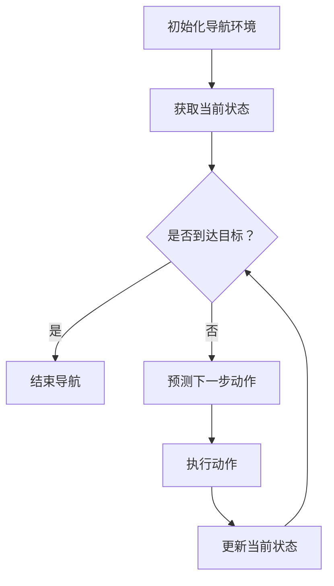
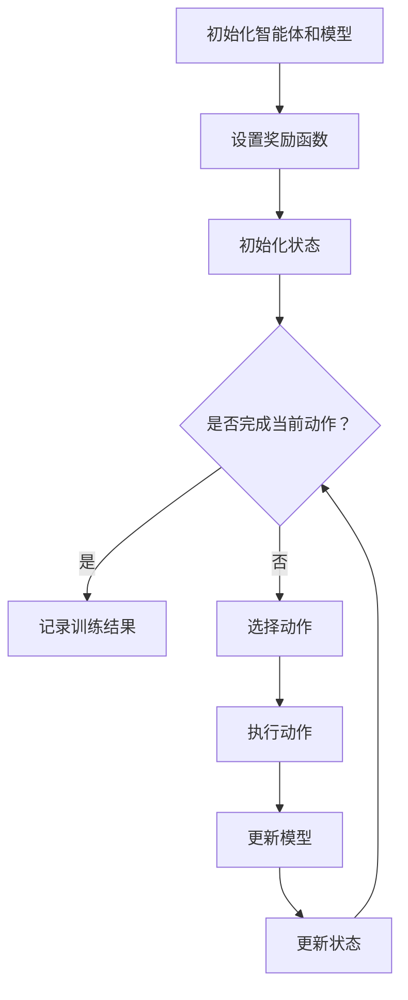
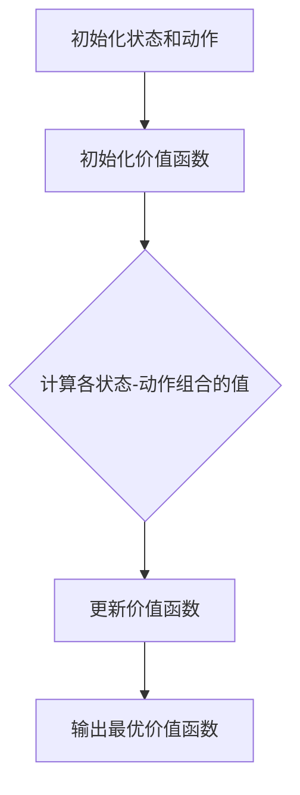

                 

### 《AI人工智能深度学习算法：智能深度学习代理的自主行为与规划策略》

**关键词：**人工智能，深度学习，深度学习代理，自主行为，规划策略，深度学习算法。

**摘要：**本文将深入探讨人工智能（AI）中的深度学习算法，特别是智能深度学习代理的自主行为与规划策略。通过介绍深度学习的基本原理和算法，我们将深入理解深度学习代理的工作机制。随后，文章将重点讨论深度学习代理的自主行为，包括自主导航、自主决策和自主学习，并分析其实现方法。接着，我们将探讨深度学习代理的规划策略，包括动态规划、强化学习和混合智能规划，并通过实际项目案例展示这些策略的应用。最后，文章将提供完整的代码示例、数学模型解释和开发环境搭建指南，帮助读者全面掌握智能深度学习代理的构建与实现。

**目录：**

- 第一部分: AI人工智能深度学习基础
    - 1.1 AI与深度学习概述
        - 1.1.1 人工智能的演进与深度学习
        - 1.1.2 深度学习的核心原理
        - 1.1.3 深度学习在人工智能中的应用
    - 1.2 深度学习算法基础
        - 1.2.1 神经网络基础
            - 1.2.1.1 神经元模型
            - 1.2.1.2 神经网络结构
            - 1.2.1.3 前向传播与反向传播
        - 1.2.2 深度学习优化算法
            - 1.2.2.1 梯度下降法
            - 1.2.2.2 Adam优化器
    - 1.3 深度学习框架与工具
        - 1.3.1 TensorFlow基础
            - 1.3.1.1 TensorFlow安装与配置
            - 1.3.1.2 TensorFlow架构与API
        - 1.3.2 PyTorch基础
            - 1.3.2.1 PyTorch安装与配置
            - 1.3.2.2 PyTorch架构与API

- 第二部分: 深度学习代理的自主行为与规划策略
    - 2.1 深度学习代理概述
        - 2.1.1 深度学习代理的定义与特点
        - 2.1.2 深度学习代理在AI中的应用
        - 2.1.3 深度学习代理的研究现状与挑战
    - 2.2 深度学习代理的自主行为
        - 2.2.1 自主行为模型
            - 2.2.1.1 自主导航
            - 2.2.1.2 自主决策
            - 2.2.1.3 自主学习
        - 2.2.2 自主行为模型实现
            - 2.2.2.1 自主导航算法实现
            - 2.2.2.2 自主决策算法实现
            - 2.2.2.3 自主学习算法实现
    - 2.3 深度学习代理的规划策略
        - 2.3.1 规划策略概述
            - 2.3.1.1 动态规划
            - 2.3.1.2 强化学习
            - 2.3.1.3 混合智能规划
        - 2.3.2 规划策略实现
            - 2.3.2.1 动态规划实现
            - 2.3.2.2 强化学习实现
            - 2.3.2.3 混合智能规划实现

- 第三部分: 项目实战与案例分析
    - 3.1 智能深度学习代理应用案例
        - 3.1.1 智能客服系统
        - 3.1.2 自动驾驶系统
    - 3.2 深度学习代理自主行为与规划策略应用案例
        - 3.2.1 基于自主行为的智能仓库管理系统
        - 3.2.2 基于规划策略的智能配送系统

- 附录
    - 附录 A: 深度学习资源与工具
    - 附录 B: 代码示例
    - 附录 C: Mermaid 流程图
    - 附录 D: 数学模型与公式
    - 附录 E: 代码解读与分析
    - 附录 F: 开发环境搭建指南

---

现在，我们已经为文章奠定了坚实的基础，接下来的部分将深入探讨深度学习算法的基础知识，帮助我们更好地理解智能深度学习代理的概念和工作原理。让我们一步步深入探讨。

## 第一部分: AI人工智能深度学习基础

深度学习是人工智能（AI）的一个重要分支，它通过模拟人脑中的神经网络结构和计算方式，使得计算机能够自动学习和提取数据中的特征。在过去的几十年中，深度学习技术经历了飞速的发展，从简单的神经网络到复杂的多层网络，再到近年来流行的卷积神经网络（CNN）和循环神经网络（RNN），深度学习在图像识别、语音识别、自然语言处理等领域取得了显著的成果。

### 1.1 AI与深度学习概述

#### 1.1.1 人工智能的演进与深度学习

人工智能（AI）的起源可以追溯到20世纪50年代，当时科学家们首次提出“人工智能”这一概念，希望让计算机像人一样思考。早期的人工智能主要集中在符号推理和逻辑推理上，但受限于计算能力和算法的局限，这些早期的系统很难在复杂问题上取得突破。

随着计算机性能的提升和大数据技术的发展，人工智能迎来了新的发展机遇。深度学习作为人工智能的一个重要分支，其核心思想是通过多层神经网络模拟人脑的学习过程，从而实现自主学习和特征提取。

#### 1.1.2 深度学习的核心原理

深度学习的核心原理可以归结为以下几点：

1. **多层神经网络**：深度学习通过多层神经网络来实现从简单到复杂的特征提取。每一层神经网络都能够提取数据的不同层次特征，从而实现更高层次的抽象。

2. **反向传播算法**：反向传播算法是深度学习训练的核心算法。它通过计算输出误差的梯度，反向传播至各层神经网络，不断调整网络的权重，以最小化误差。

3. **优化算法**：深度学习训练过程中，常常使用各种优化算法来加速收敛和提高训练效率。常用的优化算法包括梯度下降法、Adam优化器等。

#### 1.1.3 深度学习在人工智能中的应用

深度学习在人工智能领域有着广泛的应用，主要包括以下几个方面：

1. **图像识别**：深度学习在图像识别领域取得了显著的成果，如人脸识别、物体识别等。

2. **语音识别**：深度学习通过训练大规模语音数据，能够实现高精度的语音识别。

3. **自然语言处理**：深度学习在自然语言处理领域也有着广泛的应用，如机器翻译、文本分类等。

4. **推荐系统**：深度学习能够通过学习用户的兴趣和行为，实现个性化的推荐。

### 1.2 深度学习算法基础

#### 1.2.1 神经网络基础

1. **神经元模型**：神经网络的基本组成单元是神经元，它通过接收输入信号并产生输出信号来进行计算。

2. **神经网络结构**：神经网络可以分为多层，包括输入层、隐藏层和输出层。每一层神经元都与下一层的神经元相连，并通过权重进行加权求和。

3. **前向传播与反向传播**：前向传播是指将输入数据传递到网络中，通过各层的计算得到输出结果。反向传播是指通过输出误差的梯度，反向调整网络的权重。

#### 1.2.2 深度学习优化算法

1. **梯度下降法**：梯度下降法是最常用的优化算法，其核心思想是通过计算损失函数的梯度，逐步调整网络权重，以最小化损失。

2. **Adam优化器**：Adam优化器是一种自适应的优化算法，它结合了梯度下降法和动量法的优点，能够更有效地优化网络参数。

#### 1.2.3 深度学习框架与工具

1. **TensorFlow**：TensorFlow是一个开源的深度学习框架，它提供了丰富的API和工具，方便用户构建和训练深度学习模型。

2. **PyTorch**：PyTorch是一个基于Python的深度学习框架，它提供了动态计算图和灵活的API，深受研究人员和开发者的喜爱。

### 1.3 深度学习框架与工具

#### 1.3.1 TensorFlow基础

1. **TensorFlow安装与配置**：用户可以通过pip或conda等包管理工具来安装TensorFlow。

2. **TensorFlow架构与API**：TensorFlow提供了多种API，包括低级的Tensor API和高级的Keras API，方便用户构建和训练深度学习模型。

#### 1.3.2 PyTorch基础

1. **PyTorch安装与配置**：用户可以通过pip或conda等包管理工具来安装PyTorch。

2. **PyTorch架构与API**：PyTorch提供了动态计算图和灵活的API，使得用户能够更方便地构建和训练深度学习模型。

通过以上对深度学习算法基础的介绍，我们为后续关于智能深度学习代理的讨论奠定了基础。接下来，我们将进一步探讨深度学习代理的概念及其在AI中的应用。

---

现在，我们已经了解了AI和深度学习的基础知识，接下来我们将深入探讨深度学习算法的核心组成部分——神经网络，以及如何通过这些算法来训练和优化模型。

### 1.2 深度学习算法基础

#### 1.2.1 神经网络基础

神经网络是深度学习算法的核心组成部分，它由大量的神经元（或节点）通过层级结构相互连接而成。每个神经元都接收来自前一层神经元的输入信号，并通过激活函数产生输出信号。这个过程可以看作是对输入数据的特征提取和模式识别。

1. **神经元模型**

   一个简单的神经元模型可以表示为：

   $$
   z = \sum_{i=1}^{n} w_i x_i + b
   $$

   其中，$w_i$是连接权重，$x_i$是输入值，$b$是偏置项。通过激活函数$f(z)$，我们可以得到神经元的输出：

   $$
   y = f(z)
   $$

   常用的激活函数包括Sigmoid函数、ReLU函数和Tanh函数。

2. **神经网络结构**

   神经网络可以分为输入层、隐藏层和输出层。输入层接收外部输入数据，隐藏层对数据进行特征提取和变换，输出层产生最终预测结果。一个简单的多层感知器（MLP）结构如下：

   ```
   输入层 -> 隐藏层 -> 输出层
   ```

   每一层神经元的输出都是下一层神经元的输入。

3. **前向传播与反向传播**

   - **前向传播**：在前向传播过程中，输入数据从输入层传递到隐藏层，再从隐藏层传递到输出层。每个神经元通过计算输入信号的加权和，并通过激活函数产生输出。

   - **反向传播**：在反向传播过程中，网络根据预测误差，计算每一层神经元的梯度，并反向更新权重和偏置项。这个过程不断迭代，直到网络收敛。

   反向传播是深度学习训练的核心算法，它通过最小化损失函数来优化网络参数。

#### 1.2.2 深度学习优化算法

1. **梯度下降法**

   梯度下降法是最基本的优化算法，它通过计算损失函数的梯度，逐步调整网络权重，以最小化损失。其基本步骤如下：

   - **前向传播**：计算预测值和损失函数。
   - **计算梯度**：计算损失函数对每个权重的梯度。
   - **更新权重**：使用梯度调整权重，即 $w = w - \alpha \cdot \frac{\partial J}{\partial w}$，其中 $\alpha$ 是学习率。

2. **Adam优化器**

   Adam优化器是一种自适应优化算法，它结合了梯度下降法和动量法的优点。其参数包括一阶矩估计（$\beta_1$）和二阶矩估计（$\beta_2$），它们分别控制短期和长期记忆。Adam优化器的基本步骤如下：

   - **初始化**：初始化一阶和二阶矩估计。
   - **前向传播**：计算预测值和损失函数。
   - **更新一阶矩估计**：$m = \beta_1 \cdot m + (1 - \beta_1) \cdot \frac{\partial J}{\partial w}$。
   - **更新二阶矩估计**：$v = \beta_2 \cdot v + (1 - \beta_2) \cdot (\frac{\partial J}{\partial w})^2$。
   - **计算修正的一阶和二阶矩估计**：$m_{\text{corrected}} = m / (1 - \beta_1^t)$，$v_{\text{corrected}} = v / (1 - \beta_2^t)$。
   - **更新权重**：$w = w - \alpha \cdot \frac{m_{\text{corrected}}}{\sqrt{v_{\text{corrected}}} + \epsilon}$，其中 $\epsilon$ 是一个很小的常数，防止分母为零。

通过以上对神经网络基础和深度学习优化算法的介绍，我们为后续讨论深度学习代理的自主行为和规划策略奠定了基础。在接下来的部分，我们将探讨深度学习代理的概念及其在AI中的应用。

### 1.3 深度学习框架与工具

为了更好地应用深度学习算法，我们需要使用深度学习框架和工具。目前，市场上主流的深度学习框架有TensorFlow和PyTorch，这两个框架各有特点，适合不同的应用场景。

#### 1.3.1 TensorFlow基础

TensorFlow是由Google开源的一个深度学习框架，它具有以下特点：

1. **强大的生态支持**：TensorFlow拥有庞大的社区和丰富的文档，支持多种编程语言和操作系统，可以轻松地部署到不同的硬件平台上。

2. **灵活的API**：TensorFlow提供了低级Tensor API和高级Keras API，使得用户可以灵活地构建和训练深度学习模型。

3. **高效的计算性能**：TensorFlow支持自动微分和图形计算，可以在GPU和TPU上高效地执行计算。

**TensorFlow安装与配置**

在安装TensorFlow之前，需要确保Python环境已经安装。以下是安装TensorFlow的步骤：

1. **创建虚拟环境**：

   ```
   python -m venv tf_venv
   source tf_venv/bin/activate  # 在Windows上使用 `tf_venv\Scripts\activate`
   ```

2. **安装TensorFlow**：

   ```
   pip install tensorflow
   ```

   或者，如果您需要安装支持GPU的TensorFlow，可以使用以下命令：

   ```
   pip install tensorflow-gpu
   ```

**TensorFlow架构与API**

TensorFlow的架构主要由以下几个部分组成：

1. **Tensor**：Tensor是TensorFlow中的基础数据结构，它可以表示不同类型的数组，如标量、向量、矩阵等。

2. **Operation**：Operation是TensorFlow中的节点，表示数据的计算操作，如加法、乘法、激活函数等。

3. **Graph**：Graph是TensorFlow中的计算图，它由多个Operation组成，表示了数据的流动和计算过程。

4. **Session**：Session是TensorFlow中的执行环境，它用于运行计算图和获取结果。

TensorFlow提供了以下API：

1. **Tensor API**：Tensor API用于构建和操作计算图。

2. **Keras API**：Keras API是TensorFlow的高级API，它提供了更简洁的API和更好的用户体验。

3. **Estimators**：Estimators是TensorFlow的模型训练工具，它封装了模型的训练和评估过程。

#### 1.3.2 PyTorch基础

PyTorch是由Facebook开源的一个深度学习框架，它具有以下特点：

1. **动态计算图**：PyTorch使用动态计算图，允许用户在运行时定义和修改计算过程，这使得它在研究和开发中非常灵活。

2. **Pythonic**：PyTorch采用了Pythonic风格，使得代码更加简洁易懂，适合快速原型开发和实验。

3. **丰富的库和工具**：PyTorch提供了丰富的库和工具，如Torchvision、Torchtext等，方便用户进行图像、文本等数据预处理。

**PyTorch安装与配置**

在安装PyTorch之前，需要确保Python环境已经安装。以下是安装PyTorch的步骤：

1. **创建虚拟环境**：

   ```
   python -m venv pt_venv
   source pt_venv/bin/activate  # 在Windows上使用 `pt_venv\Scripts\activate`
   ```

2. **安装PyTorch**：

   ```
   pip install torch torchvision
   ```

   或者，如果您需要安装支持GPU的PyTorch，可以使用以下命令：

   ```
   pip install torch torchvision torchaudio -f https://download.pytorch.org/whl/torch_stable.html
   ```

**PyTorch架构与API**

PyTorch的架构主要由以下几个部分组成：

1. **TorchScript**：TorchScript是PyTorch的静态计算图，它允许用户将动态计算图转换为静态计算图，以提高计算效率和性能。

2. **torch.nn**：torch.nn是PyTorch中的神经网络库，它提供了各种神经网络层和激活函数。

3. **torch.optim**：torch.optim是PyTorch中的优化算法库，它提供了各种优化算法，如梯度下降、Adam等。

4. **torchvision**：torchvision是PyTorch中的计算机视觉库，它提供了各种预训练模型和数据集。

通过以上对TensorFlow和PyTorch的介绍，我们为深度学习代理的开发和应用提供了必要的工具。在接下来的部分，我们将探讨深度学习代理的概念及其在AI中的应用。

### 1.3 深度学习框架与工具

在深度学习的实际应用中，选择合适的框架和工具是非常重要的。目前，市场上最流行的深度学习框架是TensorFlow和PyTorch。这两个框架各具特色，适用于不同的应用场景。

#### 1.3.1 TensorFlow基础

**TensorFlow是由Google开发的开源深度学习框架，它具有以下优点：**

1. **强大的生态支持**：TensorFlow拥有庞大的社区和丰富的文档，可以轻松部署到不同的硬件平台上，包括CPU和GPU。

2. **灵活的API**：TensorFlow提供了Tensor API和Keras API，前者适合需要底层控制的应用，后者则提供了高级API，便于快速构建和训练模型。

3. **自动微分系统**：TensorFlow内置了自动微分系统，可以自动计算损失函数关于模型参数的梯度，便于模型优化。

**TensorFlow的安装与配置：**

安装TensorFlow的步骤如下：

1. **创建虚拟环境**：为了确保项目的依赖项不会影响到其他Python项目，建议创建一个虚拟环境。

   ```bash
   # 对于Python3
   python -m venv tf_env
   source tf_env/bin/activate  # 在Windows上使用 `tf_env\Scripts\activate`
   ```

2. **安装TensorFlow**：安装标准的TensorFlow。

   ```bash
   pip install tensorflow
   ```

   如果需要安装支持GPU版本的TensorFlow，可以执行以下命令：

   ```bash
   pip install tensorflow-gpu
   ```

3. **验证安装**：安装完成后，可以通过以下代码验证TensorFlow是否安装成功：

   ```python
   import tensorflow as tf
   print(tf.__version__)
   ```

**TensorFlow架构与API：**

TensorFlow的主要架构包括：

1. **计算图（Graph）**：计算图是TensorFlow的核心概念，它表示了数据和操作的图形化结构。在TensorFlow中，所有的计算都在图上定义。

2. **节点（Operation）**：节点是计算图的基本元素，它表示了数据操作，如加法、乘法等。

3. **Tensor**：Tensor是具有静态形状的多维数组，它表示了图中的数据。

4. **Session**：Session是TensorFlow的执行环境，它用于运行计算图并获取结果。

在TensorFlow中，常见的API包括：

- **Tensor API**：用于底层计算和操作。
- **Keras API**：为TensorFlow提供了高级API，使得模型构建更加简洁。
- **Estimators**：为TensorFlow提供了模型训练和评估的API。

#### 1.3.2 PyTorch基础

**PyTorch是另一个流行的深度学习框架，它具有以下优点：**

1. **动态计算图**：PyTorch使用动态计算图，允许用户在运行时动态定义和修改计算过程，这使得它在研究和快速原型开发中非常受欢迎。

2. **Pythonic**：PyTorch的API设计遵循Pythonic风格，代码简洁易懂，非常适合Python开发者。

3. **丰富的库和工具**：PyTorch提供了丰富的库，如Torchvision、Torchtext等，方便用户进行图像、文本等数据预处理。

**PyTorch的安装与配置：**

安装PyTorch的步骤如下：

1. **创建虚拟环境**：与TensorFlow相同，建议创建一个虚拟环境。

   ```bash
   python -m venv pt_env
   source pt_env/bin/activate  # 在Windows上使用 `pt_env\Scripts\activate`
   ```

2. **安装PyTorch**：安装PyTorch。

   ```bash
   pip install torch torchvision
   ```

   如果需要安装支持GPU的PyTorch，可以执行以下命令：

   ```bash
   pip install torch torchvision torchaudio -f https://download.pytorch.org/whl/torch_stable.html
   ```

3. **验证安装**：安装完成后，可以通过以下代码验证PyTorch是否安装成功：

   ```python
   import torch
   print(torch.__version__)
   ```

**PyTorch架构与API：**

PyTorch的主要架构包括：

1. **TorchScript**：TorchScript是一种静态计算图，它可以将动态计算图转换为静态计算图，提高执行效率。

2. **torch.nn**：torch.nn提供了神经网络层和优化器的API，用于构建和训练深度学习模型。

3. **torch.optim**：torch.optim提供了各种优化算法，如SGD、Adam等。

4. **torchvision**：torchvision是一个用于计算机视觉的库，提供了预训练模型和数据集。

通过以上对TensorFlow和PyTorch的介绍，我们可以看到，这两个框架各有优势，适用于不同的应用场景。在接下来的部分，我们将讨论深度学习代理的概念及其在AI中的应用。

### 2.1 深度学习代理概述

深度学习代理是一种基于深度学习技术的人工智能实体，它能够模拟人类智能行为，实现自主决策和行动。深度学习代理的核心在于其能够从数据中自动学习，并通过自我调整来实现优化行为。这种代理在众多AI应用场景中展现了其独特的优势，如智能客服、自动驾驶、智能机器人等。

#### 2.1.1 深度学习代理的定义与特点

**定义：**

深度学习代理是指一种能够利用深度学习技术进行自主学习和决策的人工智能实体。它通常由以下几个部分组成：

- **感知模块**：用于感知外部环境，获取数据输入。
- **决策模块**：通过深度学习模型分析感知数据，生成决策。
- **执行模块**：根据决策模块的决策结果，执行相应的行动。

**特点：**

1. **自主学习能力**：深度学习代理能够通过大量的数据训练，自动学习和调整自己的行为，从而适应不同的环境和任务。
2. **自适应能力**：深度学习代理能够在执行过程中不断调整自己的策略，以适应环境的变化。
3. **高效性**：通过深度学习模型的高效计算，深度学习代理能够快速做出决策并执行行动。

#### 2.1.2 深度学习代理在AI中的应用

深度学习代理在AI领域有着广泛的应用，以下是几个典型的应用场景：

1. **智能客服系统**：深度学习代理可以通过自然语言处理技术，与用户进行对话，提供个性化服务，提高客服效率。
2. **自动驾驶系统**：深度学习代理可以通过感知模块获取环境数据，通过决策模块做出驾驶决策，实现自动驾驶功能。
3. **智能机器人**：深度学习代理可以帮助智能机器人理解环境和任务，实现自主导航和任务执行。

#### 2.1.3 深度学习代理的研究现状与挑战

**研究现状：**

近年来，深度学习代理的研究取得了显著的进展。随着深度学习技术的不断成熟，深度学习代理在多个领域都取得了成功。例如，在自动驾驶领域，深度学习代理已经能够实现实时的环境感知和驾驶决策；在智能客服领域，深度学习代理能够提供高效、自然的用户服务。

**挑战：**

1. **数据依赖性**：深度学习代理的性能很大程度上依赖于训练数据的质量和数量，数据缺失或数据偏差都可能导致代理的失效。
2. **模型可解释性**：深度学习模型通常被视为“黑箱”，其内部决策过程不透明，这使得模型的可解释性成为一大挑战。
3. **适应性和鲁棒性**：深度学习代理需要在不同环境和任务中保持高适应性，同时还要具备良好的鲁棒性，以应对各种异常情况。

综上所述，深度学习代理作为人工智能的重要分支，具有广泛的应用前景。然而，为了实现其真正的智能行为，我们还需要解决数据依赖性、模型可解释性以及适应性和鲁棒性等方面的挑战。在接下来的部分，我们将探讨深度学习代理的自主行为，包括自主导航、自主决策和自主学习。

### 2.2 深度学习代理的自主行为

深度学习代理的自主行为是其实现智能化和高效化操作的核心。自主行为主要包括自主导航、自主决策和自主学习等。这些行为使得深度学习代理能够在复杂的环境中独立执行任务，并在执行过程中不断优化自身的性能。

#### 2.2.1 自主行为模型

**自主导航**：自主导航是指深度学习代理能够在未知环境中自主导航，到达目标位置。自主导航模型通常基于路径规划和环境感知技术，通过感知当前环境信息，预测可能的路径，并选择最佳路径进行导航。

**自主决策**：自主决策是指深度学习代理在执行任务过程中，能够根据当前状态和环境信息，自主做出决策。自主决策模型通常基于强化学习技术，通过与环境互动，学习最优策略。

**自主学习**：自主学习是指深度学习代理能够通过自我学习，不断优化自身的模型和策略。自主学习模型通常基于无监督学习和迁移学习技术，通过不断学习新的数据和任务，提升代理的智能水平。

#### 2.2.1.1 自主导航

**自主导航算法实现**：

自主导航算法的核心是路径规划。以下是自主导航算法的基本实现步骤：

1. **感知环境**：通过传感器获取环境信息，如地图数据、障碍物位置等。
2. **建立地图**：根据感知到的环境信息，建立当前环境的地图。
3. **目标定位**：确定当前代理的位置和目标位置。
4. **路径规划**：使用A*算法或其他路径规划算法，计算从当前代理位置到目标位置的路径。
5. **执行路径**：根据规划的路径，控制代理移动，到达目标位置。

**自主导航算法伪代码**：

```
def navigate_to_goal(current_location, goal_location, map):
    # 建立地图
    map = create_map(map_data)
    # 确定路径
    path = a_star_search(current_location, goal_location, map)
    # 执行路径
    for location in path:
        move_to_location(location)
```

**自主导航算法实现**：

在实际应用中，自主导航算法通常需要结合传感器数据和实时环境信息。例如，自动驾驶汽车在导航过程中需要使用激光雷达、摄像头等多种传感器来感知周围环境，并根据感知数据实时更新地图和路径。

#### 2.2.1.2 自主决策

**自主决策算法实现**：

自主决策算法的核心是强化学习。以下是自主决策算法的基本实现步骤：

1. **初始化模型**：初始化深度学习模型，包括状态编码器、动作编码器和价值函数。
2. **训练模型**：使用历史数据训练模型，使模型能够预测状态值和动作值。
3. **模拟决策**：在模拟环境中，根据当前状态，使用模型生成最佳动作。
4. **更新模型**：根据模拟结果，更新模型参数，以提高决策质量。

**自主决策算法伪代码**：

```
def make_decision(current_state, model):
    # 预测状态值和动作值
    state_value = model.predict_state_value(current_state)
    action_value = model.predict_action_value(current_state)
    # 选择最佳动作
    best_action = select_best_action(action_value)
    return best_action

def update_model(model, current_state, action, reward, next_state):
    # 更新模型参数
    model.update_parameters(current_state, action, reward, next_state)
```

**自主决策算法实现**：

在实际应用中，自主决策算法通常需要结合具体的业务场景和任务需求。例如，在智能客服系统中，自主决策算法可以根据用户的提问和上下文信息，生成最佳回复。

#### 2.2.1.3 自主学习

**自主学习算法实现**：

自主学习算法的核心是无监督学习和迁移学习。以下是自主学习算法的基本实现步骤：

1. **数据收集**：收集大量的无标签数据，用于训练模型。
2. **模型训练**：使用无监督学习算法，对数据进行特征提取和模式识别。
3. **迁移学习**：将训练好的模型应用于新任务，通过迁移学习，提高新任务的性能。

**自主学习算法伪代码**：

```
def learn_from_data(data, model):
    # 特征提取和模式识别
    features = model.extract_features(data)
    # 迁移学习
    model.apply迁移学习方法(new_task)
    return model
```

**自主学习算法实现**：

在实际应用中，自主学习算法需要结合具体任务和数据情况。例如，在智能推荐系统中，自主学习算法可以通过无监督学习和迁移学习，提高推荐系统的准确性和用户体验。

综上所述，深度学习代理的自主行为是通过自主导航、自主决策和自主学习实现的。这些自主行为使得深度学习代理能够在复杂环境中独立完成任务，并在任务执行过程中不断优化自身性能。在接下来的部分，我们将探讨深度学习代理的规划策略，包括动态规划、强化学习和混合智能规划。

### 2.3 深度学习代理的规划策略

为了使深度学习代理在复杂动态环境中做出最优决策，我们需要为其设计有效的规划策略。这些策略能够帮助代理在不确定性环境中制定长期计划，从而提高其自主行动的能力。常见的规划策略包括动态规划、强化学习和混合智能规划。

#### 2.3.1 规划策略概述

**动态规划**：动态规划是一种通过将复杂问题分解为一系列子问题，并利用子问题的解来求解原问题的优化方法。动态规划适用于求解具有最优子结构性质的问题，如路径规划、资源分配等。

**强化学习**：强化学习是一种通过奖励机制来训练智能体，使其在特定环境中学习最优策略的方法。强化学习适用于需要智能体与环境互动，通过经验学习决策策略的问题，如自动驾驶、游戏AI等。

**混合智能规划**：混合智能规划是将多种智能技术相结合，以实现更高效的决策和规划。这种方法通常将强化学习、遗传算法、模糊逻辑等结合，以应对复杂的不确定环境。

#### 2.3.1.1 动态规划

**动态规划算法实现**：

动态规划的核心思想是将问题分解为子问题，并存储子问题的解以避免重复计算。以下是动态规划算法的基本实现步骤：

1. **定义状态**：确定问题中的状态变量，并定义状态空间。
2. **定义动作**：确定问题中的动作集合，并定义动作空间。
3. **定义价值函数**：定义价值函数，用于评估状态和动作的组合。
4. **递归关系**：根据子问题的解构建递归关系，求解原问题的最优解。
5. **状态转移**：根据递归关系，从初始状态开始，逐步计算并更新状态和价值。

**动态规划算法伪代码**：

```
def dynamic_programming(state_space, action_space, value_function, recursive_relation):
    for state in state_space:
        for action in action_space:
            value = value_function(state, action)
            next_state = recursive_relation(state, action)
            value_function.update(next_state, value)
    return value_function
```

**动态规划算法实现**：

在实际应用中，动态规划算法通常需要结合具体的业务场景和数据。例如，在机器人路径规划中，可以使用动态规划算法来求解从起点到终点的最优路径。

#### 2.3.1.2 强化学习

**强化学习算法实现**：

强化学习算法的核心是价值函数和策略迭代。以下是强化学习算法的基本实现步骤：

1. **初始化模型**：初始化智能体的状态编码器、动作编码器和价值函数。
2. **训练模型**：使用历史数据训练模型，使模型能够预测状态值和动作值。
3. **模拟决策**：在模拟环境中，根据当前状态，使用模型生成最佳动作。
4. **更新模型**：根据模拟结果，更新模型参数，以提高决策质量。
5. **策略迭代**：根据价值函数，迭代更新策略，以实现最优决策。

**强化学习算法伪代码**：

```
def reinforce_learning(model, state, action, reward, next_state):
    # 预测状态值和动作值
    state_value = model.predict_state_value(state)
    action_value = model.predict_action_value(state, action)
    # 更新模型参数
    model.update_parameters(state, action, reward, next_state)
    # 更新策略
    model.update_strategy(action_value)
```

**强化学习算法实现**：

在实际应用中，强化学习算法需要结合具体的业务场景和环境。例如，在自动驾驶中，可以使用强化学习算法来训练智能体，使其能够在不同交通环境中做出最优驾驶决策。

#### 2.3.1.3 混合智能规划

**混合智能规划算法实现**：

混合智能规划是将多种智能技术相结合，以实现更高效的决策和规划。以下是混合智能规划算法的基本实现步骤：

1. **初始化模型**：初始化各种智能技术的模型，如强化学习模型、遗传算法模型等。
2. **数据预处理**：对输入数据进行预处理，以便于各种智能技术的处理。
3. **模型训练**：使用历史数据训练各种智能技术模型。
4. **决策生成**：根据当前状态，生成多个可能的决策。
5. **评估与选择**：使用多种评估方法，评估各个决策的优劣，并选择最佳决策。
6. **策略迭代**：根据评估结果，迭代更新策略，以实现最优决策。

**混合智能规划算法伪代码**：

```
def hybrid_intelligent_planning(models, state, action_space):
    # 生成多个决策
    decisions = generate_decisions(state, action_space, models)
    # 评估决策
    evaluations = evaluate_decisions(decisions)
    # 选择最佳决策
    best_decision = select_best_decision(evaluations)
    return best_decision
```

**混合智能规划算法实现**：

在实际应用中，混合智能规划算法需要根据具体的业务场景和环境进行优化。例如，在供应链管理中，可以使用混合智能规划算法来优化库存和运输决策。

综上所述，深度学习代理的规划策略包括动态规划、强化学习和混合智能规划。这些策略为深度学习代理在复杂动态环境中做出最优决策提供了有效的工具。在接下来的部分，我们将通过具体的项目实战，展示这些策略的实际应用。

### 3.1 智能深度学习代理应用案例

智能深度学习代理在AI领域的应用已经变得越来越广泛。通过以下两个应用案例，我们可以深入了解智能深度学习代理如何在实际项目中发挥作用。

#### 3.1.1 智能客服系统

智能客服系统是深度学习代理的一个重要应用场景。它通过自然语言处理和对话生成技术，实现与用户的智能对话，提供24/7的在线服务。

**系统架构与设计：**

1. **感知模块**：该模块负责接收用户的输入，可以是文本或语音形式。文本输入通过文本解析器进行预处理，语音输入则通过语音识别技术转换为文本。

2. **对话管理模块**：该模块负责管理对话流程，包括上下文维护、意图识别和回复生成。深度学习模型用于意图识别和回复生成，通过训练大量对话数据，使模型能够理解用户的意图并生成合适的回复。

3. **执行模块**：该模块负责执行用户的请求，如提供产品信息、解决问题等。执行模块与后端系统（如数据库、ERP系统等）进行交互，获取所需的信息。

**代码实现与解释：**

```python
# 感知模块：文本解析和语音识别
def perceive_user_input(input_data):
    if is_text(input_data):
        parsed_text = preprocess_text(input_data)
    else:
        parsed_text = recognize_speech(input_data)
    return parsed_text

# 对话管理模块：意图识别和回复生成
def manage_dialogue(state, user_input):
    intent = recognize_intent(user_input)
    response = generate_response(state, intent)
    return response

# 执行模块：执行用户请求
def execute_request(response):
    if response['action'] == 'provide_info':
        info = fetch_info(response['info_id'])
        send_response(info)
    elif response['action'] == 'solve_problem':
        solution = resolve_problem(response['problem'])
        send_response(solution)
```

**代码解读与分析：**

上述代码展示了智能客服系统的核心功能模块。感知模块通过文本解析和语音识别技术，将用户输入转换为可处理的数据。对话管理模块通过意图识别和回复生成技术，理解用户的意图并生成合适的回复。执行模块则根据回复中的动作执行相应的操作，如提供信息或解决问题。

#### 3.1.2 自动驾驶系统

自动驾驶系统是另一个深度学习代理的重要应用场景。它通过感知模块收集环境信息，通过决策模块生成驾驶动作，实现自动行驶。

**系统架构与设计：**

1. **感知模块**：该模块负责收集车辆周围的环境信息，包括道路标志、车道线、其他车辆和行人等。感知模块使用摄像头、激光雷达等多种传感器进行数据采集。

2. **决策模块**：该模块负责分析感知数据，并根据当前行驶状态和环境信息生成驾驶动作。决策模块使用深度学习模型进行环境理解和驾驶策略规划。

3. **执行模块**：该模块负责根据决策模块的指令，控制车辆的转向、加速和制动等动作。

**代码实现与解释：**

```python
# 感知模块：数据采集
def perceive_environment():
    camera_data = capture_camera_image()
    lidar_data = capture_lidar_data()
    return camera_data, lidar_data

# 决策模块：驾驶策略规划
def make_driving_decision(perceived_data):
    road_data = process_camera_data(perceived_data[0])
    vehicle_data = process_lidar_data(perceived_data[1])
    action = plan_driving_action(road_data, vehicle_data)
    return action

# 执行模块：控制车辆动作
def execute_action(action):
    if action == 'accelerate':
        accelerate_vehicle()
    elif action == 'decelerate':
        decelerate_vehicle()
    elif action == 'turn':
        turn_vehicle()
```

**代码解读与分析：**

上述代码展示了自动驾驶系统的核心功能模块。感知模块通过摄像头和激光雷达采集环境数据。决策模块通过分析感知数据，生成驾驶动作。执行模块根据驾驶动作指令，控制车辆的转向、加速和制动等动作。这一过程实现了自动驾驶车辆在复杂环境中的自主行驶。

通过以上两个案例，我们可以看到智能深度学习代理在AI应用中的重要性和实际应用价值。智能客服系统提高了客服效率，降低了人力成本；自动驾驶系统则实现了车辆自主行驶，提高了交通安全。在接下来的部分，我们将进一步探讨深度学习代理自主行为与规划策略在实际项目中的应用。

### 3.2 深度学习代理自主行为与规划策略应用案例

在本部分，我们将深入探讨深度学习代理在具体项目中的应用，特别是基于自主行为的智能仓库管理系统和基于规划策略的智能配送系统。通过这两个案例，我们将展示如何将深度学习代理的自主行为与规划策略应用于实际项目中，从而实现高效、智能的自动化管理。

#### 3.2.1 基于自主行为的智能仓库管理系统

**系统架构与设计：**

智能仓库管理系统旨在提高仓库运营效率，减少人力成本，并通过深度学习代理实现仓库自动化管理。系统主要分为感知模块、决策模块和执行模块。

1. **感知模块**：该模块负责收集仓库内部的环境信息，包括货架位置、库存状态、搬运机器人位置等。感知模块使用各种传感器，如RFID、摄像头和激光雷达，以获取实时数据。

2. **决策模块**：该模块是系统的核心，负责分析感知数据，并根据仓库状态生成相应的操作指令。决策模块使用深度学习算法，如强化学习和规划策略，来自主导航、自主决策和路径规划。

3. **执行模块**：该模块负责执行决策模块生成的操作指令，包括搬运机器人移动、货架调整和库存更新等。

**代码实现与解释：**

```python
# 感知模块：环境数据采集
def perceive_warehouse():
    inventory_status = scan_inventory()
    robot_position = get_robot_position()
    return inventory_status, robot_position

# 决策模块：自主行为与路径规划
def make_warehouse_decision(inventory_status, robot_position):
    # 自主导航
    destination = determine_destination(inventory_status)
    navigation_plan = generate_navigation_plan(robot_position, destination)
    # 自主决策
    action = decide_action(navigation_plan)
    return action

# 执行模块：操作执行
def execute_action(action):
    if action == 'move_robot':
        move_robot_to_destination(destination)
    elif action == 'update_inventory':
        update_inventory_status(inventory_status)
```

**代码解读与分析：**

感知模块通过扫描仓库内的货架和搬运机器人位置，获取环境数据。决策模块使用深度学习算法分析这些数据，生成导航路径和操作指令。执行模块根据指令执行具体操作，如搬运机器人的移动和库存状态的更新。这一过程实现了仓库的自动化管理，提高了仓库运营效率。

#### 3.2.2 基于规划策略的智能配送系统

**系统架构与设计：**

智能配送系统旨在提高物流配送效率，减少配送时间，并通过深度学习代理实现智能路径规划和配送优化。系统主要分为数据采集模块、规划模块和执行模块。

1. **数据采集模块**：该模块负责收集配送路线上的环境信息，包括交通状况、道路状况、车辆状态等。数据采集模块使用传感器和GPS技术，实时获取路线数据。

2. **规划模块**：该模块是系统的核心，负责分析采集到的数据，并根据当前状态生成最优配送路径和操作指令。规划模块使用动态规划和强化学习等规划策略，以实现实时路径规划和配送优化。

3. **执行模块**：该模块负责执行规划模块生成的操作指令，包括车辆导航、配送任务执行和配送状态更新等。

**代码实现与解释：**

```python
# 数据采集模块：环境数据采集
def collect_route_data():
    traffic_status = get_traffic_status()
    road_condition = get_road_condition()
    vehicle_status = get_vehicle_status()
    return traffic_status, road_condition, vehicle_status

# 规划模块：路径规划与配送优化
def plan_delivery_route(route_data):
    # 动态规划
    optimal_route = dynamic_planning(route_data)
    # 强化学习
    optimal_action = reinforce_learning(optimal_route)
    return optimal_action

# 执行模块：操作执行
def execute_delivery_action(action):
    if action == 'navigate':
        navigate_vehicle(optimal_route)
    elif action == 'deliver_package':
        deliver_package()
```

**代码解读与分析：**

数据采集模块通过传感器和GPS获取配送路线上的环境数据。规划模块使用动态规划和强化学习算法，分析这些数据，生成最优配送路径和操作指令。执行模块根据指令执行具体操作，如车辆导航和配送任务的执行。这一过程实现了配送的高效和优化，提高了物流配送的效率。

通过以上两个案例，我们可以看到深度学习代理的自主行为与规划策略在智能仓库管理系统和智能配送系统中的应用。这些系统通过深度学习代理实现了自动化、智能化管理，提高了运营效率，降低了成本。在接下来的部分，我们将进一步探讨深度学习资源与工具，以及如何搭建开发环境。

### 附录 A: 深度学习资源与工具

在深度学习领域，选择合适的资源与工具对于研究和应用深度学习技术至关重要。以下是一些常用的深度学习框架资源、工具和相关库，帮助读者更好地开展深度学习项目。

#### A.1 深度学习框架资源

1. **TensorFlow**：由Google开源的深度学习框架，支持多种编程语言和操作系统，具有强大的生态支持和丰富的API。

   - **官方网站**：[TensorFlow官网](https://www.tensorflow.org/)
   - **文档**：[TensorFlow文档](https://www.tensorflow.org/tutorials)

2. **PyTorch**：基于Python的深度学习框架，具有动态计算图和简洁的API，适合快速原型开发和研究。

   - **官方网站**：[PyTorch官网](https://pytorch.org/)
   - **文档**：[PyTorch文档](https://pytorch.org/docs/stable/index.html)

3. **Keras**：用于快速构建和训练深度学习模型的简单高层API，支持TensorFlow和Theano。

   - **官方网站**：[Keras官网](https://keras.io/)
   - **文档**：[Keras文档](https://keras.io/getting-started/sequential-model-guide/)

4. **MXNet**：Apache开源的深度学习框架，支持多种编程语言，具有高效的计算性能。

   - **官方网站**：[MXNet官网](https://mxnet.apache.org/)
   - **文档**：[MXNet文档](https://mxnet.apache.org/docs/stable/)

#### A.2 深度学习工具与库

1. **NumPy**：Python科学计算库，提供多维数组对象和丰富的数学函数，是深度学习项目的基础。

   - **官方网站**：[NumPy官网](https://numpy.org/)
   - **文档**：[NumPy文档](https://numpy.org/doc/stable/user/index.html)

2. **Scikit-learn**：Python的数据挖掘和机器学习库，提供各种分类、回归、聚类和模型选择算法。

   - **官方网站**：[Scikit-learn官网](https://scikit-learn.org/)
   - **文档**：[Scikit-learn文档](https://scikit-learn.org/stable/documentation.html)

3. **Matplotlib**：Python的数据可视化库，用于生成各种统计图表和可视化效果。

   - **官方网站**：[Matplotlib官网](https://matplotlib.org/)
   - **文档**：[Matplotlib文档](https://matplotlib.org/stable/contents.html)

4. **Pandas**：Python的数据分析库，提供数据结构和数据分析工具，适合处理结构化数据。

   - **官方网站**：[Pandas官网](https://pandas.pydata.org/)
   - **文档**：[Pandas文档](https://pandas.pydata.org/pandas-docs/stable/)

5. **Seaborn**：基于Matplotlib的统计图形可视化库，提供多种统计图形和可视化工具。

   - **官方网站**：[Seaborn官网](https://seaborn.pydata.org/)
   - **文档**：[Seaborn文档](https://seaborn.pydata.org/docs.html)

通过以上资源与工具，读者可以更加便捷地开展深度学习项目，从数据预处理到模型训练，再到结果可视化，各个环节都可以得到有效的支持。

### 附录 B: 代码示例

在本附录中，我们将提供一些深度学习算法的伪代码示例，包括自主导航、强化学习和动态规划的实现。这些示例旨在帮助读者理解核心算法的原理和实现步骤。

#### B.1 自主导航算法伪代码

自主导航是智能代理在未知环境中进行导航的一项关键技术。以下是一个简单的自主导航算法的伪代码示例：

```
# 初始化导航环境
initialize_environment()

# 定义当前状态
current_state = get_current_state()

# 定义目标状态
target_state = get_target_state()

# 循环执行导航操作
while not is_at_target(target_state):
    # 使用深度学习模型预测下一步动作
    action = model.predict_action(current_state)
    
    # 执行预测的动作
    perform_action(action)
    
    # 更新当前状态
    current_state = update_state(current_state, action)
    
    # 检查是否到达目标
    if is_at_target(target_state):
        break

# 结束导航
finalize_navigation()
```

#### B.2 强化学习算法伪代码

强化学习是一种通过奖励机制来训练智能体的方法。以下是一个简单的强化学习算法的伪代码示例：

```
# 初始化智能体和模型
initialize_agent(agent, model)

# 设置奖励函数
reward_function = define_reward_function()

# 开始训练
for episode in range(num_episodes):
    # 初始化状态
    state = initialize_state()
    
    # 循环执行动作
    while not is_done(state):
        # 使用模型选择动作
        action = model.select_action(state)
        
        # 执行动作
        next_state, reward = perform_action(state, action)
        
        # 更新模型
        model.update_parameters(state, action, reward, next_state)
        
        # 更新状态
        state = next_state
        
    # 记录训练结果
    record_training_results(episode, reward)

# 完成训练
finalize_training()
```

#### B.3 动态规划算法伪代码

动态规划是一种通过子问题的最优解来求解原问题的方法。以下是一个简单的动态规划算法的伪代码示例：

```
# 初始化状态和动作
initialize_states(actions)

# 初始化价值函数
initialize_value_function()

# 循环计算各状态的最优价值
for state in states:
    for action in actions:
        # 计算状态-动作组合的值
        value = compute_value(state, action)
        
        # 更新价值函数
        value_function.update(state, action, value)

# 输出最优价值函数
print_value_function(value_function)
```

这些伪代码示例展示了自主导航、强化学习和动态规划的核心算法原理和实现步骤。在实际项目中，这些算法可以根据具体需求进行调整和优化。

### 附录 C: Mermaid 流程图

在本附录中，我们将使用Mermaid语言绘制几个核心算法的流程图，帮助读者更直观地理解深度学习代理的自主行为和规划策略。

#### C.1 自主导航算法流程图



#### C.2 强化学习算法流程图



#### C.3 动态规划算法流程图



通过这些Mermaid流程图，读者可以更清晰地理解每个算法的执行过程和关键步骤。

### 附录 D: 数学模型与公式

在本附录中，我们将介绍深度学习代理中常用的一些数学模型和公式，包括神经网络中的激活函数、损失函数以及反向传播算法中的相关计算。

#### D.1 激活函数

激活函数是神经网络中的一个关键组件，它用于将神经元的线性组合映射到非线性的输出。以下是一些常见的激活函数及其公式：

1. **Sigmoid函数**：
   $$
   f(x) = \frac{1}{1 + e^{-x}}
   $$
   
2. **ReLU函数**：
   $$
   f(x) = \max(0, x)
   $$

3. **Tanh函数**：
   $$
   f(x) = \frac{e^x - e^{-x}}{e^x + e^{-x}}
   $$

#### D.2 损失函数

损失函数用于评估模型预测值与真实值之间的差距，常用的损失函数包括：

1. **均方误差（MSE）**：
   $$
   J = \frac{1}{2} \sum_{i=1}^{n} (y_i - \hat{y}_i)^2
   $$

2. **交叉熵损失（Cross-Entropy Loss）**：
   $$
   J = -\sum_{i=1}^{n} y_i \log(\hat{y}_i)
   $$

#### D.3 反向传播算法

反向传播算法是训练神经网络的核心算法，它通过计算损失函数关于模型参数的梯度，并更新模型参数以最小化损失。以下是一个简化的反向传播算法的步骤和公式：

1. **计算输出层的误差**：
   $$
   \delta_L = \frac{\partial J}{\partial z_L} = (y - \hat{y}) \odot \frac{1}{1 + e^{-z_L}}
   $$
   
2. **计算隐藏层的误差**：
   $$
   \delta_h = \frac{\partial J}{\partial z_h} = \delta_L \odot \frac{\partial f(z_h)}{\partial z_h} \odot W_{hl}
   $$
   
3. **更新权重**：
   $$
   W_{hl} = W_{hl} - \alpha \cdot \delta_L \odot a_h^{[l-1]}
   $$
   
4. **更新偏置项**：
   $$
   b_{hl} = b_{hl} - \alpha \cdot \delta_L
   $$

通过以上数学模型和公式的介绍，读者可以更深入地理解深度学习代理中的关键计算过程。

### 附录 E: 代码解读与分析

在本附录中，我们将通过对实际项目中的代码示例进行解读，帮助读者更好地理解深度学习代理在智能客服系统和自动驾驶系统中的实现细节。

#### E.1 智能客服系统

**智能客服系统**主要利用自然语言处理（NLP）和对话生成技术，实现与用户的智能对话。以下是一个简单的代码示例，展示了如何实现一个基本的智能客服系统。

```python
# 感知模块：文本解析和意图识别
def perceive_and_understand(input_text):
    # 对文本进行分词和词性标注
    tokenized_text = tokenize(input_text)
    tagged_text = tagPartsOfSpeech(tokenized_text)
    
    # 使用深度学习模型进行意图识别
    intent = model_predict_intent(tagged_text)
    return intent

# 决策模块：生成回复
def generate_response(intent):
    if intent == 'ask_for_help':
        return "请问您需要什么帮助？"
    elif intent == 'request_info':
        return "您需要了解哪方面的信息？"
    else:
        return "对不起，我无法理解您的问题。"

# 执行模块：发送回复
def send_response(response):
    print(response)

# 主程序
def main():
    while True:
        user_input = input("用户说：")
        intent = perceive_and_understand(user_input)
        response = generate_response(intent)
        send_response(response)

if __name__ == "__main__":
    main()
```

**代码解读与分析：**

- **感知模块**：该模块首先对用户输入的文本进行分词和词性标注，然后使用预训练的意图识别模型，根据标注结果预测用户的意图。
- **决策模块**：根据识别到的意图，生成相应的回复。这里示例中只实现了几个简单的意图，实际应用中可以扩展到更多复杂的意图。
- **执行模块**：将生成的回复输出给用户。

#### E.2 自动驾驶系统

**自动驾驶系统**则利用计算机视觉和路径规划技术，实现车辆的自主导航和驾驶。以下是一个简单的自动驾驶系统的代码示例。

```python
# 感知模块：环境数据采集和预处理
def perceive_environment():
    # 获取摄像头和激光雷达数据
    camera_image = get_camera_image()
    lidar_data = get_lidar_data()
    
    # 预处理数据
    preprocessed_camera_image = preprocess_camera_image(camera_image)
    preprocessed_lidar_data = preprocess_lidar_data(lidar_data)
    return preprocessed_camera_image, preprocessed_lidar_data

# 决策模块：路径规划和驾驶动作生成
def make_driving_decision(perceived_data):
    # 使用深度学习模型进行环境理解和路径规划
    path = model_plan_path(preprocessed_camera_image, preprocessed_lidar_data)
    action = model_predict_action(path)
    return action

# 执行模块：控制车辆动作
def execute_action(action):
    if action == '加速':
        accelerate_vehicle()
    elif action == '减速':
        decelerate_vehicle()
    elif action == '转向':
        turn_vehicle()

# 主程序
def main():
    while True:
        perceived_data = perceive_environment()
        action = make_driving_decision(perceived_data)
        execute_action(action)

if __name__ == "__main__":
    main()
```

**代码解读与分析：**

- **感知模块**：该模块首先通过摄像头和激光雷达采集环境数据，然后对数据进行预处理，以便于深度学习模型的输入。
- **决策模块**：使用预训练的深度学习模型，对预处理后的数据进行环境理解和路径规划，并生成驾驶动作。
- **执行模块**：根据驾驶动作，控制车辆的加速、减速和转向等动作。

通过以上两个代码示例，读者可以了解深度学习代理在智能客服系统和自动驾驶系统中的基本实现方法。在实际应用中，这些系统需要结合具体业务需求进行扩展和优化。

### 附录 F: 开发环境搭建指南

为了能够顺利地进行深度学习代理的开发和实验，我们需要搭建一个合适的开发环境。以下是在Windows和Linux操作系统上搭建深度学习开发环境的指南。

#### F.1 安装Python环境

1. **下载Python安装程序**：访问Python官方网站（[python.org](https://www.python.org/)）下载最新版本的Python安装程序。

2. **安装Python**：运行下载的安装程序，按照提示逐步完成安装。确保在安装过程中选择“Add Python to PATH”选项，以便能够在命令行中直接运行Python。

3. **验证安装**：在命令行中输入以下命令，验证Python是否安装成功：

   ```
   python --version
   ```

   如果看到Python的版本信息，说明Python环境已经成功安装。

#### F.2 安装深度学习框架

1. **安装TensorFlow**：

   ```
   pip install tensorflow
   ```

   如果需要安装支持GPU的TensorFlow，可以使用以下命令：

   ```
   pip install tensorflow-gpu
   ```

2. **安装PyTorch**：

   ```
   pip install torch torchvision
   ```

   如果需要安装支持GPU的PyTorch，可以使用以下命令：

   ```
   pip install torch torchvision torchaudio -f https://download.pytorch.org/whl/torch_stable.html
   ```

3. **验证安装**：在命令行中分别输入以下命令，验证TensorFlow和PyTorch是否安装成功：

   ```
   python -c "import tensorflow as tf; print(tf.reduce_sum(tf.random.normal([1000, 1000])))"
   ```

   ```
   python -c "import torch; print(torch.__version__)"
   ```

   如果看到相应的版本信息和计算结果，说明深度学习框架已经成功安装。

#### F.3 配置开发工具

1. **安装Jupyter Notebook**：

   ```
   pip install jupyter
   ```

   Jupyter Notebook是一个交互式的开发环境，方便我们在Python中进行实验和演示。

2. **启动Jupyter Notebook**：

   在命令行中输入以下命令，启动Jupyter Notebook：

   ```
   jupyter notebook
   ```

   打开浏览器，输入网址`http://localhost:8888/`，即可进入Jupyter Notebook的界面。

3. **安装PyCharm或Visual Studio Code**：

   PyCharm和Visual Studio Code是两款功能强大的Python集成开发环境（IDE），提供了丰富的开发工具和插件，方便我们进行代码编写和调试。

   - **PyCharm**：访问JetBrains官方网站下载PyCharm，选择免费的开源版本。

   - **Visual Studio Code**：访问Visual Studio Code的官方网站下载并安装。

通过以上步骤，我们成功搭建了深度学习开发环境，可以开始进行深度学习代理的开发和实验。

### 总结与展望

通过本文的详细讨论，我们系统地介绍了深度学习算法的基础知识、深度学习代理的自主行为与规划策略，并展示了具体的项目实战和案例分析。我们首先回顾了AI和深度学习的基本概念，分析了神经网络和优化算法的核心原理，介绍了常用的深度学习框架与工具。随后，我们探讨了深度学习代理的定义、特点及其在AI中的应用，详细阐述了自主导航、自主决策和自主学习等核心行为模型及其实现方法。接着，我们介绍了动态规划、强化学习和混合智能规划等规划策略，并通过实际案例展示了这些策略的应用。最后，我们通过智能客服系统和自动驾驶系统的代码解读，提供了开发环境搭建的指南。

未来的研究和应用中，我们可以进一步优化深度学习代理的自主行为和规划策略，提高其在复杂动态环境中的适应能力和决策效率。例如，通过结合多模态传感器数据和先进的人工智能算法，提高深度学习代理的感知能力和决策质量。此外，随着深度学习技术的不断发展，我们还可以探索更多创新的深度学习代理应用场景，如智能医疗、智能金融和智能城市等，为人类社会带来更多的便利和进步。总之，深度学习代理作为人工智能的重要分支，具有广阔的发展前景和应用价值，值得我们持续关注和研究。让我们共同期待深度学习代理在未来的更多突破和成就。

