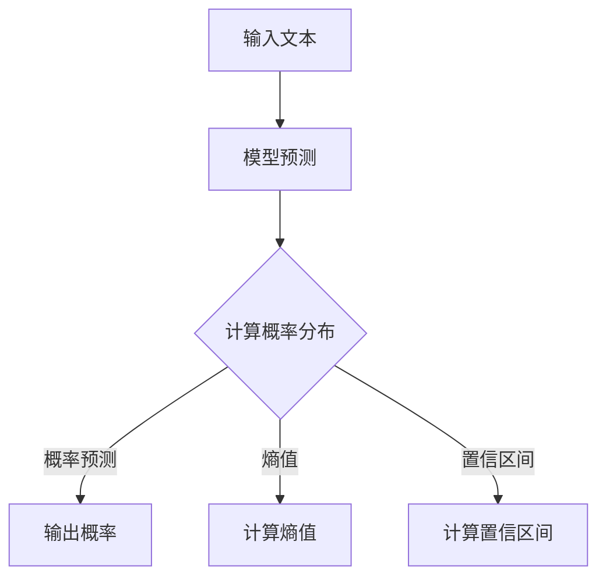
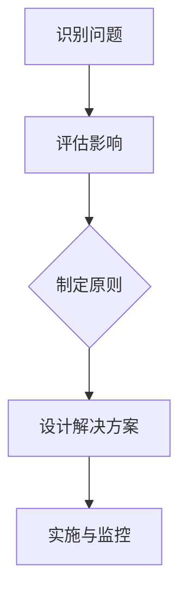

                 

## 《AI伦理难题：LLM的不确定性与控制》

### 关键词：
- AI伦理
- 语言模型
- 不确定性
- 控制
- 监管

#### 摘要：

本文将深入探讨AI伦理中的关键难题——大型语言模型（LLM）的不确定性与控制。随着AI技术的发展，LLM在各个领域发挥着越来越重要的作用，但它们的不确定性也带来了伦理挑战。本文首先概述了AI伦理的背景和重要性，然后详细分析了LLM的不确定性来源，并探讨了控制这些不确定性的策略。接下来，文章探讨了AI伦理与法律监管的关系，并提供了实践案例分析。最后，文章展望了AI伦理的未来发展，并提出了一些挑战和建议。

### 《AI伦理难题：LLM的不确定性与控制》目录大纲

#### 第一部分：AI伦理概述与背景

**第1章：AI伦理的重要性与挑战**

1.1 AI伦理的起源与发展
1.2 AI伦理的框架与原则
1.3 AI伦理在社会中的影响

**第2章：LLM的不确定性分析**

2.1 LLM概述
2.2 LLM的不确定性来源
2.3 LLM不确定性评估方法

**第3章：控制LLM不确定性策略**

3.1 数据质量控制策略
3.2 模型优化与改进
3.3 预测不确定性控制

**第4章：AI伦理与法律监管**

4.1 AI伦理监管的必要性
4.2 AI伦理监管框架
4.3 法律责任与伦理责任

#### 第二部分：AI伦理实践案例分析

**第5章：AI伦理实践案例分析**

5.1 案例背景与挑战
5.2 伦理决策过程
5.3 案例分析与启示

**第6章：AI伦理教育与实践**

6.1 AI伦理教育的重要性
6.2 AI伦理实践路径
6.3 伦理审查与评估

**第7章：未来展望与挑战**

7.1 AI伦理发展的趋势
7.2 挑战与应对
7.3 未来展望

### 第一部分：AI伦理概述与背景

#### 第1章：AI伦理的重要性与挑战

##### 1.1 AI伦理的起源与发展

人工智能（AI）作为一门交叉学科，涉及计算机科学、数学、认知科学等多个领域。自20世纪50年代以来，AI经历了多个发展阶段，从最初的逻辑推理到基于统计学的机器学习，再到深度学习等现代技术。随着AI技术的不断进步和应用范围的扩大，AI伦理问题也逐渐引起关注。

AI伦理的起源可以追溯到20世纪80年代，当时人工智能领域的一些专家开始讨论AI可能带来的道德和社会问题。1997年，一位名叫刘易斯·麦克弗森（Lewis M. McPherson）的计算机科学家提出了著名的“AI伦理三原则”，即透明性、责任性和公正性。这些原则成为后续AI伦理研究的重要基础。

随着AI技术的快速发展，AI伦理问题也逐渐多样化。目前，AI伦理主要包括以下几个核心议题：

- **隐私权**：AI系统通常需要处理大量的个人数据，这可能侵犯用户的隐私权。
- **公正性和歧视**：AI算法在决策过程中可能存在偏见，导致不公平的结果。
- **透明度和可解释性**：用户和监管机构通常难以理解AI系统的工作原理，这可能导致对AI系统的信任危机。
- **责任性**：当AI系统出现错误或导致损失时，如何界定责任成为关键问题。

##### 1.2 AI伦理的框架与原则

为了解决AI伦理问题，学术界和业界提出了一系列伦理框架和原则。其中，最具代表性的是卡内基梅隆大学人工智能伦理研究所提出的“AI伦理四原则”：

1. **透明度（Transparency）**：用户应能够理解AI系统的工作原理和决策过程。
2. **公正性（Justice）**：AI系统应确保决策过程的公平性和无偏见。
3. **隐私性（Privacy）**：保护用户的个人数据，确保数据不被滥用。
4. **责任性（Accountability）**：当AI系统出现错误或导致损失时，应明确责任归属。

除了这四个核心原则，还有一些补充性原则，如“可解释性（Interpretability）”、“可持续性（Sustainability）”和“责任分配（Responsibility Allocation）”等。

##### 1.3 AI伦理在社会中的影响

AI伦理问题不仅涉及技术层面，还对社会、法律、经济等多个领域产生深远影响。

- **就业影响**：AI技术的发展可能导致某些工作被自动化取代，但同时也创造了新的就业机会。如何平衡这一矛盾成为AI伦理的重要议题。
- **隐私权**：随着AI系统对个人数据的依赖性增加，如何保护用户的隐私权成为一个迫切问题。
- **法律监管**：AI技术的应用可能超越现有法律框架的覆盖范围，如何制定适应AI时代的新法律成为关键挑战。
- **社会公平**：AI系统在决策过程中可能存在偏见，如何确保社会的公平性成为AI伦理的重要关注点。

总的来说，AI伦理问题的复杂性使得解决它们需要跨学科的合作和多层次的监管。只有通过共同努力，才能确保AI技术的可持续发展，并为社会带来积极影响。

#### 第2章：LLM的不确定性分析

##### 2.1 LLM概述

大型语言模型（Large Language Model，LLM）是近年来人工智能领域的重要突破之一。LLM通过学习大量的文本数据，能够生成流畅、连贯的自然语言文本，广泛应用于自然语言处理（NLP）的各个子领域，如机器翻译、文本生成、问答系统等。

LLM的主要特点是：

1. **大规模**：LLM通常拥有数十亿甚至数万亿个参数，这使得它们能够捕捉到文本数据中的复杂模式。
2. **自适应性**：LLM可以根据不同的任务和数据集进行调整和优化，以实现更好的性能。
3. **高可解释性**：尽管LLM的工作原理复杂，但通过可视化和分析方法，可以揭示其决策过程和内在机制。

主流的LLM包括：

1. **GPT（Generative Pre-trained Transformer）系列**：如GPT-3，由OpenAI开发，具有1750亿个参数。
2. **BERT（Bidirectional Encoder Representations from Transformers）系列**：如BERT和RoBERTa，由Google和Facebook AI团队开发，广泛用于文本分类和问答系统。
3. **T5（Text-To-Text Transfer Transformer）**：由DeepMind开发，将文本处理任务转换为统一的文本到文本翻译任务。

##### 2.2 LLM的不确定性来源

尽管LLM在自然语言处理领域取得了巨大成功，但它们也存在一些不确定性，这些不确定性主要来源于以下几个方面：

1. **模型预测的不确定性**：LLM在生成文本时，输出的结果并非完全确定，而是存在一定的概率分布。这意味着同一个输入可能产生多个不同的输出结果。

2. **数据集偏差引入的不确定性**：由于训练数据集的不完美性和多样性不足，LLM可能在某些特定场景下表现出不一致或错误的行为。这种数据集偏差可能导致预测结果的不确定性。

3. **模型内部不确定性**：LLM的内部结构复杂，参数众多，可能导致模型在不同条件下的行为不一致。例如，相同输入在不同时间或不同运行环境下可能产生不同的输出结果。

##### 2.3 LLM不确定性评估方法

为了评估LLM的不确定性，研究者提出了多种方法，以下是一些常见的方法：

1. **概率预测**：通过计算模型输出结果的概率分布，可以评估预测的不确定性。具体来说，可以使用模型输出的logits（原始分数）来计算概率分布，公式如下：

   $$ P(y | x) = \frac{e^{logits(y | x)}}{\sum_{i} e^{logits(y_i | x)}} $$

   其中，$y$ 表示实际标签，$x$ 表示输入文本，$logits(y | x)$ 表示模型对标签$y$的预测分数。

2. **熵值**：熵值是衡量概率分布不确定性的指标。对于一个离散概率分布$P(y)$，其熵值定义为：

   $$ H(P) = -\sum_{y} P(y) \log P(y) $$

   熵值越高，表示不确定性越大。

3. **置信区间**：通过计算模型输出的置信区间，可以评估预测的可靠性。具体来说，可以计算模型输出概率的95%置信区间，如果置信区间较宽，则表示预测结果的不确定性较高。

以下是一个简单的Mermaid流程图，展示了评估LLM不确定性的过程：

##### 实际案例分析与讨论

为了更直观地理解LLM的不确定性，我们可以通过一个实际案例进行分析。假设我们有一个语言模型，用于回答关于天气的问题。以下是几个示例输入和模型输出的概率分布：

| 输入文本            | 概率分布                 |
|-------------------|-----------------------|
| 今天天气怎么样？    | {晴天: 0.8，雨天: 0.2} |
| 明天会下雨吗？      | {晴天: 0.3，雨天: 0.7} |
| 请问下周会有台风吗？ | {台风: 0.1，无台风: 0.9} |

从上述概率分布可以看出，模型对于不同问题的回答具有不同的不确定性。对于“今天天气怎么样？”这个问题，模型有较高的置信度认为今天是晴天。而对于“明天会下雨吗？”和“请问下周会有台风吗？”这两个问题，模型则表现出较高的不确定性。

通过分析这些概率分布，我们可以得出以下结论：

1. **问题背景**：不同问题所涉及的背景知识不同，导致模型对问题的回答具有不同的不确定性。
2. **输入多样性**：输入文本的多样性会影响模型的不确定性。如果输入文本具有多个可能的解释，模型则需要更高的不确定性来表示。
3. **模型性能**：模型在特定任务上的性能也会影响不确定性评估。性能较好的模型可能更准确地预测输出概率，从而减少不确定性。

在实际应用中，评估LLM的不确定性对于提高系统的可靠性和用户体验具有重要意义。通过合理地控制模型的不确定性，可以更好地应对复杂、多变的自然语言处理任务。

#### 第3章：控制LLM不确定性策略

##### 3.1 数据质量控制策略

控制LLM不确定性的重要一步是确保数据的质量。高质量的数据有助于减少模型的不确定性，提高预测的准确性和可靠性。以下是一些关键的数据质量控制策略：

1. **数据清洗**：数据清洗是数据预处理的重要步骤，旨在去除噪声、修复错误和填充缺失值。具体方法包括：
   - 去除重复数据：重复的数据可能会导致模型过度拟合，降低泛化能力。
   - 修复错误数据：错误的数据会影响模型的训练效果，导致模型无法准确捕捉数据特征。
   - 填充缺失值：缺失值填充方法包括均值填充、中值填充、插值等方法，可以减少数据缺失对模型训练的影响。

2. **数据预处理**：数据预处理包括数据转换、归一化、降维等步骤，旨在将数据转换为适合模型训练的形式。具体方法包括：
   - 数据转换：将文本数据转换为向量表示，如词袋模型、词嵌入等。
   - 归一化：将数据缩放到相同的范围，如[0, 1]或[-1, 1]，以减少数据规模对模型训练的影响。
   - 降维：通过降维技术，如主成分分析（PCA）、t-SNE等，可以减少数据维度，提高模型训练效率。

3. **数据平衡与多样化**：数据平衡和多样化是减少模型偏倚和不确定性的关键策略。具体方法包括：
   - 数据平衡：通过增减某些类别样本的数量，使各类别样本的比例接近，以减少模型对某一类别的过度依赖。
   - 数据多样化：通过引入不同来源、不同形式的数据，增加训练数据的多样性，有助于模型更好地泛化。

##### 3.2 模型优化与改进

除了数据质量控制，模型优化与改进也是控制LLM不确定性的重要手段。以下是一些常用的模型优化方法：

1. **模型架构改进**：改进模型架构可以提高模型的性能和泛化能力。具体方法包括：
   - 添加更多层：增加模型的层数可以增强模型的表示能力。
   - 增加隐藏层单元数：增加隐藏层单元数可以提高模型的拟合能力。
   - 使用注意力机制：注意力机制可以帮助模型更好地关注重要信息，提高模型对输入数据的理解能力。

2. **训练策略优化**：优化训练策略可以提高模型的训练效率和性能。具体方法包括：
   - 学习率调整：使用适当的学习率调整方法，如学习率衰减、学习率预热等，可以提高模型收敛速度和稳定性。
   - 梯度裁剪：通过梯度裁剪可以防止模型在训练过程中出现过拟合现象。
   - 批量大小调整：通过调整批量大小，可以在保持模型性能的同时提高训练速度。

3. **正则化技术**：正则化技术可以减少模型过拟合现象，提高模型的泛化能力。具体方法包括：
   - L1正则化：通过在损失函数中添加L1正则项，可以减少模型参数的权重，防止模型过拟合。
   - L2正则化：通过在损失函数中添加L2正则项，可以减少模型参数的范数，防止模型过拟合。
   - Dropout：通过在训练过程中随机丢弃部分神经元，可以减少模型对特定训练样本的依赖，提高模型泛化能力。

##### 3.3 预测不确定性控制

除了优化模型和数据，控制预测不确定性也是减少LLM不确定性的重要手段。以下是一些常用的预测不确定性控制方法：

1. **概率预测**：通过计算模型输出结果的概率分布，可以评估预测的不确定性。具体方法包括：
   - Softmax：Softmax函数可以将模型的输出转换为概率分布，适用于分类任务。
   - Logits：通过对模型输出的logits进行概率计算，可以更加灵活地控制概率分布。

2. **熵值**：熵值是衡量概率分布不确定性的指标。通过计算模型输出结果的熵值，可以评估预测的不确定性。具体公式如下：

   $$ H(P) = -\sum_{y} P(y) \log P(y) $$

   其中，$P(y)$ 表示模型对标签$y$的预测概率。

3. **置信区间**：置信区间是衡量预测可靠性的重要指标。通过计算模型输出概率的置信区间，可以评估预测的可靠性。具体公式如下：

   $$ P(y | x) \in [l, u] $$

   其中，$l$ 和 $u$ 分别表示置信区间的下界和上界。

以下是一个简单的Mermaid流程图，展示了控制预测不确定性的过程：

在实际应用中，结合多种不确定性控制方法，可以更好地降低LLM的不确定性，提高系统的可靠性和用户体验。

#### 第4章：AI伦理与法律监管

##### 4.1 AI伦理监管的必要性

随着人工智能技术的飞速发展，AI伦理和法律监管问题愈发凸显。AI伦理监管的必要性主要体现在以下几个方面：

1. **保护隐私**：AI系统通常需要处理大量个人数据，这可能侵犯用户的隐私权。AI伦理监管有助于确保数据处理过程的合法性和合规性，保护用户的隐私。

2. **避免歧视**：AI算法在决策过程中可能存在偏见，导致不公平的结果。AI伦理监管可以规范AI系统的设计和应用，减少歧视现象。

3. **确保透明度**：用户和监管机构通常难以理解AI系统的工作原理，这可能导致对AI系统的信任危机。AI伦理监管有助于提高AI系统的透明度，增强用户对AI系统的信任。

4. **责任归属**：当AI系统出现错误或导致损失时，如何界定责任成为关键问题。AI伦理监管可以明确责任归属，保障受害者权益。

##### 4.2 AI伦理监管框架

为了应对AI伦理监管的挑战，各国和地区纷纷制定了一系列AI伦理监管框架。以下是一些具有代表性的框架：

1. **欧盟的GDPR（通用数据保护条例）**：GDPR是欧盟制定的一项数据保护法律，旨在保护个人数据隐私。GDPR对数据处理者提出了严格的合规要求，包括数据最小化、数据保护设计、用户同意等。

2. **美国的AI法案**：美国的一些州和联邦机构相继出台了AI法案，旨在规范AI系统的开发和应用。例如，加州的AB-742法案要求AI系统在决策过程中提供可解释性。

3. **我国的法律法规**：我国也制定了一系列AI相关法律法规，如《人工智能发展行动计划（2018-2020年）》和《新一代人工智能伦理规范》。这些法规旨在推动AI技术的健康发展，保护用户权益。

##### 4.3 法律责任与伦理责任

在AI伦理和法律监管中，法律责任和伦理责任是两个重要概念。以下是对这两个概念的分析：

1. **法律责任**：法律责任是指因AI系统导致的损失或损害，需承担的法律责任。法律责任主要涉及以下几个方面：
   - 产品责任：当AI系统存在缺陷，导致用户损失时，开发者或制造商需承担产品责任。
   - 违法责任：当AI系统违反法律法规，如侵犯隐私、造成财产损失时，开发者或使用者需承担违法责任。
   - 侵权责任：当AI系统侵犯他人知识产权或其他合法权益时，开发者或使用者需承担侵权责任。

2. **伦理责任**：伦理责任是指因AI系统导致的道德损害或伦理冲突，需承担的伦理责任。伦理责任主要涉及以下几个方面：
   - 公正性：确保AI系统的决策过程公平、公正，不产生歧视。
   - 透明度：确保AI系统的工作原理和决策过程透明，用户可以理解。
   - 可解释性：确保AI系统的决策结果可解释，用户可以了解决策原因。
   - 责任归属：明确AI系统开发、应用过程中的责任归属，确保受害者权益。

法律责任和伦理责任之间存在着密切的联系和区别。法律责任主要涉及法律层面的责任承担，而伦理责任主要涉及道德层面的责任承担。在现实应用中，法律责任和伦理责任往往是相互交织、相互影响的。只有同时满足法律责任和伦理责任，才能确保AI技术的可持续发展。

##### 案例分析

为了更好地理解AI伦理和法律监管的实际应用，以下是一些案例分析：

1. **案例一：特斯拉自动驾驶事故**：特斯拉的自动驾驶系统在事故中表现出色，但并未完全避免事故。在此案例中，法律责任和伦理责任交织在一起。特斯拉需要承担因产品缺陷导致的事故责任，同时还需要承担因未充分披露系统风险而产生的伦理责任。

2. **案例二：亚马逊AI招聘系统**：亚马逊开发的一款AI招聘系统因存在性别歧视而被曝光。在此案例中，法律责任主要涉及侵犯平等就业权，而伦理责任则涉及歧视和公平性。

3. **案例三：面部识别技术滥用**：一些公司在未经授权的情况下使用面部识别技术进行监控和追踪。在此案例中，法律责任主要涉及侵犯个人隐私权，而伦理责任则涉及隐私保护和数据安全。

通过以上案例分析，可以看出AI伦理和法律监管在现实应用中的复杂性和重要性。只有在明确法律责任和伦理责任的基础上，才能确保AI技术的健康发展。

#### 第5章：AI伦理实践案例分析

##### 5.1 案例背景与挑战

为了更好地理解AI伦理在现实中的应用，我们选择了一些具有代表性的AI伦理实践案例。这些案例涉及自动驾驶、医疗诊断、金融风控等多个领域，展示了AI伦理面临的实际挑战。

**案例一：自动驾驶汽车事故**

背景：特斯拉的自动驾驶系统在事故中未能完全避免碰撞，导致多起交通事故。

挑战：
1. **责任归属**：如何确定事故责任是法律层面和伦理层面的关键挑战。是自动驾驶系统存在缺陷，还是驾驶员未正确操作？
2. **透明度**：如何确保自动驾驶系统的工作原理和决策过程透明，用户可以理解？
3. **隐私保护**：自动驾驶汽车收集大量用户驾驶数据，如何保护用户隐私？

**案例二：AI医疗诊断系统**

背景：某些AI医疗诊断系统在诊断准确性方面表现出色，但同时也存在一定的误诊率。

挑战：
1. **公正性**：AI医疗诊断系统是否存在性别、种族、年龄等偏见，导致不公平的诊断结果？
2. **数据隐私**：医疗数据的敏感性要求在AI诊断过程中如何保护用户隐私？
3. **责任归属**：当AI诊断系统出现误诊，如何确定责任归属，确保患者权益？

**案例三：金融AI风控系统**

背景：金融机构使用AI风控系统进行信用评估和风险管理，但系统存在一定的风险。

挑战：
1. **歧视**：AI风控系统是否会导致对某些群体的歧视，如低收入群体？
2. **可解释性**：如何确保AI风控系统的工作原理和决策过程透明，用户可以理解？
3. **合规性**：如何确保AI风控系统的设计和应用符合相关法律法规？

通过以上案例，我们可以看到AI伦理在实际应用中面临的多重挑战。只有在深入理解这些挑战的基础上，才能提出有效的解决方案。

##### 5.2 伦理决策过程

为了解决AI伦理问题，伦理决策过程至关重要。以下是一个简化的伦理决策过程：

1. **识别问题**：识别AI应用中潜在的伦理问题，如隐私、公正性、责任归属等。

2. **评估影响**：评估伦理问题对用户、社会和企业的潜在影响，包括负面影响和潜在收益。

3. **制定原则**：基于AI伦理原则，如透明度、公正性、隐私保护和责任归属，制定相应的伦理标准和规范。

4. **设计解决方案**：根据伦理原则和评估结果，设计可行的解决方案，如数据保护机制、可解释性设计、透明度报告等。

5. **实施与监控**：实施解决方案，并进行持续监控和评估，确保解决方案的有效性和适应性。

以下是一个简单的Mermaid流程图，展示了伦理决策过程：

##### 5.3 案例分析与启示

通过分析上述案例，我们可以得出以下启示：

1. **责任归属**：明确责任归属是解决AI伦理问题的关键。通过制定明确的法律法规和伦理规范，可以确保在AI事故中责任得到明确界定。

2. **透明度和可解释性**：提高AI系统的透明度和可解释性是增强用户信任的关键。通过设计透明的决策过程和可解释的算法，用户可以更好地理解AI系统的工作原理。

3. **隐私保护**：保护用户隐私是AI应用的基本伦理要求。通过实施严格的数据保护机制和隐私政策，可以减少隐私泄露风险。

4. **公正性和公平性**：确保AI系统的公正性和公平性是避免歧视的重要保障。通过消除算法偏见和加强数据多样性，可以提高AI系统的公正性。

5. **持续监控与评估**：AI伦理问题是一个动态变化的过程。通过持续监控和评估，可以及时发现和解决新出现的伦理问题。

总之，AI伦理实践案例分析为我们提供了宝贵的经验和启示，有助于我们在实际应用中更好地解决AI伦理问题。只有在深入理解AI伦理的基础上，才能确保AI技术的可持续发展。

#### 第6章：AI伦理教育与实践

##### 6.1 AI伦理教育的重要性

随着人工智能技术的快速发展，AI伦理教育成为培养新一代AI从业者和公众的重要课题。AI伦理教育的重要性主要体现在以下几个方面：

1. **培养伦理意识**：AI伦理教育有助于AI从业者树立正确的伦理观念，认识到AI技术可能带来的道德和社会问题，从而在开发和应用过程中遵循伦理原则。

2. **提高决策能力**：通过AI伦理教育，从业者可以学习到如何识别和应对AI伦理问题，提高在复杂情境下做出道德决策的能力。

3. **增强社会责任**：AI伦理教育有助于培养从业者的社会责任感，使其意识到自己在AI技术应用中的角色和责任，从而推动AI技术的可持续发展。

4. **促进公众理解**：AI伦理教育不仅针对AI从业者，也面向公众。通过普及AI伦理知识，可以增强公众对AI技术的理解，减少对AI的恐惧和误解。

##### 6.2 AI伦理实践路径

为了将AI伦理教育转化为实际应用，以下是一些可行的AI伦理实践路径：

1. **企业伦理管理实践**：企业应建立专门的AI伦理委员会，制定AI伦理规范和流程，确保AI项目在开发和应用过程中遵循伦理原则。同时，企业应定期进行AI伦理审查，及时发现和解决伦理问题。

2. **学术界与产业界的合作**：学术界和产业界应加强合作，共同研究AI伦理问题，制定适应实际应用的伦理规范和标准。通过合作，可以促进AI技术的创新和伦理进步。

3. **AI伦理实践培训**：企业和学术机构应提供AI伦理培训，帮助从业者掌握AI伦理知识和技能，提高其实际工作中的伦理意识。培训内容应包括伦理原则、案例分析、决策方法等。

4. **公众参与**：鼓励公众参与AI伦理讨论，提高对AI伦理问题的关注和理解。通过开展AI伦理讲座、研讨会等活动，可以增强公众的伦理意识，促进社会对AI技术的包容和支持。

##### 6.3 伦理审查与评估

为了确保AI项目在开发和应用过程中遵循伦理原则，伦理审查与评估机制至关重要。以下是一些关键的伦理审查与评估方法：

1. **伦理审查委员会**：建立独立的伦理审查委员会，负责对AI项目进行伦理审查。审查委员会应由来自不同领域的专家组成，确保审查的全面性和客观性。

2. **伦理审查流程**：制定明确的伦理审查流程，包括项目申请、审查、反馈和跟踪等环节。通过规范化流程，确保审查工作的透明性和公正性。

3. **伦理风险评估**：对AI项目进行全面的伦理风险评估，识别潜在的风险和问题，并提出相应的解决方案。风险评估应包括技术风险、社会风险、法律风险等方面。

4. **持续监测与评估**：建立持续监测与评估机制，对AI项目在应用过程中的伦理表现进行跟踪和评估。通过定期评估，及时发现和解决新的伦理问题。

5. **公众参与**：鼓励公众参与伦理审查与评估，提高项目的透明度和公正性。通过公众反馈，可以更好地了解社会对AI项目的接受程度和意见。

通过伦理审查与评估机制，可以确保AI项目在开发和应用过程中遵循伦理原则，减少潜在的风险和负面影响。

#### 第7章：未来展望与挑战

##### 7.1 AI伦理发展的趋势

随着人工智能技术的不断进步，AI伦理问题也呈现出新的发展趋势。以下是一些关键趋势：

1. **技术伦理多元化**：随着AI技术的广泛应用，AI伦理问题逐渐从单一领域扩展到多个领域，如医疗、金融、教育、司法等。这使得AI伦理研究需要更加全面和多元化。

2. **全球合作与协调**：随着AI技术的全球化，各国和地区纷纷制定AI伦理规范和政策。为了应对跨国界的AI伦理挑战，全球合作和协调变得尤为重要。

3. **技术伦理规范化**：越来越多的国家和地区开始制定AI伦理标准和法规，以规范AI技术的开发和应用。这有助于提高AI系统的透明度、公正性和可靠性。

4. **公众参与和透明度**：为了增强公众对AI技术的信任，越来越多的组织呼吁公众参与AI伦理讨论，提高AI系统的透明度和可解释性。

##### 7.2 挑战与应对

尽管AI伦理研究取得了一些进展，但仍面临许多挑战。以下是一些关键挑战及应对策略：

1. **技术挑战**：
   - **算法透明性**：提高算法的透明性是当前AI伦理研究的一个重要方向。通过设计更加可解释的算法，可以增强用户对AI系统的理解和信任。
   - **数据隐私保护**：随着AI系统对大量个人数据的依赖性增加，如何有效保护用户隐私成为一个重要挑战。可以通过隐私保护技术，如差分隐私、同态加密等，提高数据隐私保护水平。
   - **算法公平性**：算法公平性是AI伦理研究的一个重要议题。通过消除算法偏见和加强数据多样性，可以提高AI系统的公平性。

2. **社会挑战**：
   - **公众信任**：增强公众对AI技术的信任是AI伦理研究的重要目标。通过提高AI系统的透明度和可解释性，可以增强公众对AI技术的信任。
   - **伦理决策**：在AI应用过程中，如何做出符合伦理原则的决策是一个重要挑战。可以通过制定伦理决策框架和标准，提高伦理决策的科学性和规范性。
   - **法律监管**：随着AI技术的发展，现有的法律监管体系可能无法完全适应新的伦理挑战。需要加强对AI技术的法律监管，确保AI系统的合规性。

##### 7.3 未来展望

展望未来，AI伦理研究有望在以下几个方面取得突破：

1. **AI伦理标准的制定**：随着全球合作和协调的加强，有望制定一系列全球统一的AI伦理标准，为AI技术的开发和应用提供明确的指导。

2. **技术伦理教育**：随着AI技术的普及，技术伦理教育将成为教育体系的重要组成部分。通过普及AI伦理知识，可以提高公众的伦理意识，推动AI技术的可持续发展。

3. **跨学科研究**：AI伦理研究需要多学科的交叉合作，如哲学、法律、计算机科学、心理学等。通过跨学科研究，可以更全面地解决AI伦理问题。

4. **技术创新**：随着人工智能技术的不断进步，有望开发出更加透明、公平、可靠的AI系统，从而更好地满足伦理要求。

总之，AI伦理研究面临许多挑战，但同时也充满机遇。只有通过全社会的共同努力，才能确保AI技术的可持续发展，为人类带来更大的福祉。

### 附录

#### 附录A：AI伦理相关资源与工具

为了帮助读者进一步了解AI伦理的相关知识，我们整理了一些重要的研究机构、工具和资源。以下是一些推荐的资源：

**1. 研究机构与组织**

- **国际人工智能伦理协会（IEA）**：这是一个国际性的组织，致力于推动AI伦理的研究和普及。
- **卡内基梅隆大学人工智能伦理研究所**：该研究所专注于AI伦理的跨学科研究，提供丰富的论文和报告。
- **欧盟AI联盟**：这是一个由欧盟成员国组成的组织，致力于推动AI技术的发展和伦理监管。

**2. 伦理工具与资源**

- **AI伦理决策框架**：许多组织和机构提供了AI伦理决策框架，帮助开发者和应用者评估AI系统的伦理风险。
- **AI伦理手册**：一些组织编写了AI伦理手册，提供详细的伦理原则和实践指南。
- **AI伦理评估工具**：一些工具可以帮助评估AI系统的伦理风险，如AI伦理风险评估器、AI伦理审查工具等。

**3. 法律法规与政策文件**

- **欧盟通用数据保护条例（GDPR）**：这是欧盟制定的一项重要数据保护法规，对数据处理者的伦理要求有详细规定。
- **美国人工智能法案**：美国的一些州和联邦机构制定了人工智能法案，对AI系统的开发和应用提出了伦理要求。
- **我国人工智能发展规划**：我国政府制定了一系列人工智能发展规划，包括伦理要求和政策指导。

通过利用这些资源，读者可以更深入地了解AI伦理的知识，并在实际应用中遵循伦理原则，确保AI技术的可持续发展。

### 作者信息

**作者：** AI天才研究院/AI Genius Institute & 禅与计算机程序设计艺术 /Zen And The Art of Computer Programming

本文由AI天才研究院撰写，旨在深入探讨AI伦理中的关键难题——大型语言模型（LLM）的不确定性与控制。文章首先概述了AI伦理的背景和重要性，然后详细分析了LLM的不确定性来源，并探讨了控制这些不确定性的策略。接下来，文章探讨了AI伦理与法律监管的关系，并提供了实践案例分析。最后，文章展望了AI伦理的未来发展，并提出了一些挑战和建议。希望本文能为读者提供有价值的参考和思考。

