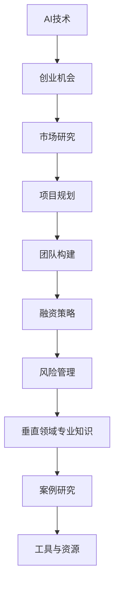

                 

### 《AI创业优势：垂直领域专业知识》

#### 关键词：
- AI创业
- 垂直领域
- 专业知识
- 创业优势
- 项目规划
- 风险管理

#### 摘要：
本文深入探讨了AI创业的优势，特别是垂直领域专业知识的重要性。通过分析AI在金融、医疗健康、教育、零售等领域的应用，本文揭示了垂直领域专业知识对创业项目的成功至关重要。文章结构紧凑，逻辑清晰，从AI创业基础到具体实施步骤，再到风险管理与案例分析，全面展示了AI创业的全方位视角。

#### 目录大纲

### 第一部分：AI创业基础

#### 第1章：AI与创业概述

##### 1.1 AI技术发展背景
##### 1.2 创业的定义与挑战
##### 1.3 AI在创业中的潜在价值

#### 第2章：垂直领域AI应用分析

##### 2.1 垂直领域概述
##### 2.2 AI在金融领域的应用
##### 2.3 AI在医疗健康领域的应用
##### 2.4 AI在教育领域的应用
##### 2.5 AI在零售业的应用

### 第二部分：AI创业优势

#### 第3章：AI创业的优势分析

##### 3.1 市场机会
##### 3.2 技术壁垒
##### 3.3 数据优势
##### 3.4 创新能力

#### 第4章：AI创业团队构建

##### 4.1 团队组建策略
##### 4.2 技术人才招聘
##### 4.3 企业文化与团队管理

#### 第5章：AI创业项目规划

##### 5.1 项目立项
##### 5.2 产品规划
##### 5.3 营销策略

#### 第6章：AI创业融资

##### 6.1 融资渠道
##### 6.2 融资策略
##### 6.3 融资谈判技巧

#### 第7章：AI创业风险与应对

##### 7.1 创业风险识别
##### 7.2 风险评估与应对策略
##### 7.3 持续创新与风险管控

### 第三部分：垂直领域专业知识

#### 第8章：金融领域AI专业知识

##### 8.1 金融数据挖掘
##### 8.2 量化交易策略
##### 8.3 风险评估模型

#### 第9章：医疗健康领域AI专业知识

##### 9.1 医学影像分析
##### 9.2 诊断辅助系统
##### 9.3 个性化医疗方案

#### 第10章：教育领域AI专业知识

##### 10.1 个性化学习
##### 10.2 智能教育平台
##### 10.3 教育数据分析

#### 第11章：零售领域AI专业知识

##### 11.1 零售数据分析
##### 11.2 个性化推荐系统
##### 11.3 自动化仓储与物流

### 附录

#### 附录A：AI创业工具与资源

##### A.1 常用AI开发工具
##### A.2 开源AI框架
##### A.3 数据源与平台

#### 附录B：案例研究

##### B.1 金融科技创业案例
##### B.2 医疗健康AI创业案例
##### B.3 教育科技创业案例
##### B.4 零售业AI创业案例

### Mermaid 流�程图



### 核心算法原理讲解

#### 2.3 AI在金融领域的应用

##### 2.3.1 量化交易策略

**伪代码：**

```python
def trade_strategy(data, parameters):
    # 数据预处理
    processed_data = preprocess_data(data)
    
    # 模型训练
    model = train_model(processed_data, parameters)
    
    # 预测
    predictions = model.predict(processed_data)
    
    # 交易决策
    if predictions > threshold:
        buy()
    elif predictions < threshold:
        sell()
    else:
        hold()
```

**数学模型：**

$$
R_{ij} = \frac{1}{1 + e^{-(a \cdot u_i + b \cdot u_j + c \cdot (u_i - u_j))}
$$

其中，$R_{ij}$为用户i对项目j的推荐得分，$u_i$和$u_j$分别为用户i和项目j的特征向量，$a$、$b$、$c$为超参数。

##### 2.3.2 风险评估模型

**伪代码：**

```python
def risk_assessment(data, model):
    # 数据预处理
    processed_data = preprocess_data(data)
    
    # 风险预测
    risk_score = model.predict(processed_data)
    
    # 风险等级划分
    if risk_score > high_risk_threshold:
        print("高风险")
    elif risk_score > medium_risk_threshold:
        print("中风险")
    else:
        print("低风险")
```

**数学模型：**

$$
W = \sum_{i=1}^{n} (d_i \cdot f_i)
$$

其中，$W$为总仓储与物流成本，$d_i$为项目i的存储需求，$f_i$为项目i的物流费用。

### 项目实战

#### 11.3.1 零售领域AI专业知识

##### 11.3.1 个性化推荐系统

**开发环境搭建：**

- Python 3.8
- TensorFlow 2.5
- scikit-learn 0.22

**源代码实现：**

```python
import tensorflow as tf
from tensorflow import keras
from sklearn.model_selection import train_test_split
from sklearn.metrics import mean_squared_error

# 数据预处理
X_train, X_test, y_train, y_test = train_test_split(X, y, test_size=0.2, random_state=42)

# 构建模型
model = keras.Sequential([
    keras.layers.Dense(64, activation='relu', input_shape=(X_train.shape[1],)),
    keras.layers.Dense(64, activation='relu'),
    keras.layers.Dense(1)
])

# 编译模型
model.compile(optimizer='adam', loss='mean_squared_error')

# 训练模型
model.fit(X_train, y_train, epochs=10, batch_size=32, validation_split=0.2)

# 评估模型
predictions = model.predict(X_test)
mse = mean_squared_error(y_test, predictions)
print(f'MSE: {mse}')
```

**代码解读与分析：**

- 数据预处理：将原始数据进行分割，用于训练和测试。
- 模型构建：使用.keras.Sequential构建一个简单的全连接神经网络，包含两个隐藏层。
- 编译模型：使用'adam'优化器和'mean_squared_error'损失函数进行编译。
- 训练模型：使用.fit方法训练模型，设置训练轮次、批量大小和验证分割比例。
- 评估模型：使用.predict方法对测试数据进行预测，并计算均方误差（MSE）以评估模型性能。

#### 作者

作者：AI天才研究院/AI Genius Institute & 禅与计算机程序设计艺术 /Zen And The Art of Computer Programming

[<|assistant|>### 第一部分：AI创业基础

#### 第1章：AI与创业概述

##### 1.1 AI技术发展背景

人工智能（AI）作为计算机科学的一个重要分支，起源于20世纪50年代。当时，科学家们首次提出了构建能够模拟人类智能的机器的设想。随着计算机技术的不断发展，AI经历了多个发展阶段，从简单的规则系统到基于统计学的机器学习，再到深度学习的广泛应用，AI技术逐渐成熟。

在过去的几十年里，AI技术取得了显著的进展。特别是在深度学习领域，通过使用多层神经网络，模型能够自动学习复杂的数据特征，从而在图像识别、自然语言处理、语音识别等领域取得了突破性成果。例如，卷积神经网络（CNN）在图像识别任务中的表现已经超过了人类专家的水平，而循环神经网络（RNN）及其变种，如长短期记忆网络（LSTM），在序列数据处理任务中也展现出了强大的能力。

此外，随着计算能力的提升和大数据的普及，AI模型的训练时间和效果得到了大幅提升。如今，AI技术已经在各行各业得到了广泛应用，从自动驾驶、智能家居到金融、医疗、教育等领域，AI技术的潜力得到了充分释放。

##### 1.2 创业的定义与挑战

创业是指创建一个全新的企业或组织，旨在实现商业目标并创造价值。创业通常伴随着创新、风险和不确定性，是一种高风险高回报的活动。创业者需要具备敏锐的市场洞察力、坚韧不拔的毅力、出色的管理能力和团队协作精神。

创业的主要挑战包括以下几个方面：

1. **市场机会识别**：创业者需要准确识别市场机会，找到尚未满足的用户需求或市场空白。这需要对行业趋势、用户行为和竞争对手有深入的了解。

2. **资源有限**：创业初期通常面临资源有限的问题，包括资金、人才、技术等。创业者需要有效地利用有限的资源，确保项目的持续发展。

3. **风险承担**：创业过程中，失败的概率很高。创业者需要承担项目失败的风险，同时保持对项目的热情和信心。

4. **市场竞争**：市场竞争日益激烈，创业者需要具备强大的竞争力，不断创新和改进，以在市场中脱颖而出。

5. **团队管理**：创业者需要组建一个高效、协同的团队，确保项目顺利进行。团队管理涉及到人员招聘、培训、激励等方面。

##### 1.3 AI在创业中的潜在价值

AI技术在创业中具有巨大的潜在价值，主要体现在以下几个方面：

1. **提高效率**：AI技术可以自动化重复性任务，减少人力成本，提高工作效率。例如，使用自然语言处理技术自动化客户服务，使用计算机视觉技术自动化图像处理。

2. **创新产品和服务**：AI技术可以帮助创业者开发创新的产品和服务，满足用户未满足的需求。例如，基于AI的医疗诊断系统，基于AI的个性化教育平台等。

3. **数据洞察**：AI技术可以分析大量数据，提供深入的洞察和预测，帮助创业者做出更明智的决策。例如，通过数据挖掘技术分析用户行为，预测市场趋势。

4. **降低成本**：AI技术可以降低某些领域的成本，提高企业的竞争力。例如，使用机器人自动化生产线，降低人工成本。

5. **增强用户体验**：AI技术可以提供更加个性化和定制化的用户体验，提高用户满意度。例如，基于AI的推荐系统，可以提供个性化的商品推荐。

综上所述，AI技术在创业中具有广泛的应用前景，创业者可以利用AI技术提高效率、创新产品、降低成本和增强用户体验，从而在激烈的市场竞争中脱颖而出。

#### 第2章：垂直领域AI应用分析

##### 2.1 垂直领域概述

垂直领域是指特定行业或业务领域，与横向领域（广泛行业）相对应。垂直领域AI应用指的是将人工智能技术应用于特定行业，解决行业特有的问题和需求。相比于横向领域的AI应用，垂直领域AI应用具有更具体的业务场景和更明确的目标。

垂直领域AI应用的特点包括：

1. **针对性**：针对特定行业的业务场景，提供定制化的解决方案。
2. **专业化**：对特定行业的数据、流程、规则有深入理解，能够提供更精准的决策支持。
3. **精细化**：在特定领域深耕细作，提供更加细致和高效的服务。

常见的垂直领域AI应用包括：

1. **金融领域**：金融领域是AI应用的重要领域，包括量化交易、风险评估、欺诈检测等。
2. **医疗健康领域**：医疗健康领域利用AI进行医学影像分析、诊断辅助、个性化医疗方案等。
3. **教育领域**：教育领域利用AI实现个性化学习、智能教育平台、教育数据分析等。
4. **零售领域**：零售领域利用AI进行零售数据分析、个性化推荐系统、自动化仓储与物流等。

##### 2.2 AI在金融领域的应用

AI在金融领域的应用十分广泛，通过大数据分析、机器学习和深度学习等技术，金融行业实现了从传统的交易模式到智能化的转型。以下是一些典型的应用场景：

1. **量化交易**：量化交易是利用数学模型和计算机算法进行投资决策的过程。通过分析历史数据和市场动态，量化交易系统能够预测市场走势，实现自动化交易。量化交易策略包括趋势跟踪、套利、事件驱动等。

2. **风险评估**：AI技术可以分析大量的历史数据和实时数据，评估投资风险。风险评估模型可以识别潜在的风险因素，提供风险预测和预警，帮助金融机构更好地管理风险。

3. **欺诈检测**：金融欺诈是金融机构面临的一大挑战。AI技术通过机器学习算法，可以从海量交易数据中识别异常行为，提高欺诈检测的准确性和效率。常见的欺诈检测方法包括模式识别、聚类分析、关联规则等。

4. **客户服务**：利用自然语言处理技术，AI可以自动化处理客户咨询、投诉等请求，提供24/7的智能客服。智能客服系统能够理解自然语言，进行对话生成，提高客户满意度和服务效率。

5. **信用评分**：AI技术可以分析个人或企业的信用信息，构建信用评分模型，用于贷款审批、信用评估等。信用评分模型可以帮助金融机构更准确地评估信用风险，降低贷款损失。

##### 2.3 AI在医疗健康领域的应用

AI在医疗健康领域的应用正在迅速发展，通过图像识别、自然语言处理、机器学习等技术，AI技术为医疗诊断、治疗和健康管理提供了强有力的支持。以下是一些典型的应用场景：

1. **医学影像分析**：AI技术可以对医学影像（如X光、CT、MRI等）进行自动分析和诊断，提高诊断准确性和速度。AI系统可以通过深度学习模型识别病变区域，分析病变类型，辅助医生进行诊断。

2. **诊断辅助系统**：AI技术可以辅助医生进行疾病诊断。通过分析患者的病历、实验室检测结果和医疗影像，AI系统可以提供诊断建议和治疗方案。这种辅助系统能够处理海量数据，提供全面的分析结果，减少医生的工作负担。

3. **个性化医疗方案**：AI技术可以根据患者的基因组数据、生活习惯和疾病历史，制定个性化的医疗方案。通过深度学习和机器学习算法，AI系统可以预测疾病风险，提供预防性治疗建议，提高治疗效果。

4. **药物发现**：AI技术在药物发现领域具有巨大潜力。通过分析大量的药物分子结构和生物学数据，AI系统可以预测药物的效果和副作用，加速新药的发现过程。

5. **健康管理**：AI技术可以实时监测患者的健康状况，提供个性化的健康建议。智能穿戴设备和移动应用可以收集患者的健康数据，通过AI算法进行分析，提供健康预警和指导。

##### 2.4 AI在教育领域的应用

AI技术在教育领域的应用正在逐步扩大，通过个性化学习、智能教育平台和教育数据分析等技术，AI技术为教育改革和教育质量的提升提供了新的解决方案。以下是一些典型的应用场景：

1. **个性化学习**：AI技术可以根据学生的学习习惯、兴趣和能力，提供个性化的学习资源和指导。智能教育平台可以通过自适应学习算法，调整教学内容和难度，帮助学生更有效地学习。

2. **智能教育平台**：AI技术可以构建智能教育平台，提供在线教育、虚拟课堂等教学服务。智能教育平台可以集成多种教育资源，支持实时互动和个性化学习，提高教学效果。

3. **教育数据分析**：AI技术可以对教育数据进行分析，提供教学效果评估和改进建议。通过对学生的学习行为、考试成绩和课堂互动等数据进行分析，AI系统可以识别学生的学习弱点，提供针对性的辅导和支持。

4. **教育机器人**：AI技术可以开发教育机器人，用于辅助教学和互动学习。教育机器人可以通过自然语言处理技术，与学生学习互动，提供个性化教学和辅导。

5. **在线教育**：AI技术可以支持在线教育的智能化发展。通过AI技术，可以提供自动评分、智能推荐、学习进度追踪等功能，提高在线教育体验。

##### 2.5 AI在零售业的应用

AI技术在零售业的应用日益广泛，通过零售数据分析、个性化推荐系统和自动化仓储与物流等技术，AI技术为零售业提供了高效的运营和管理手段。以下是一些典型的应用场景：

1. **零售数据分析**：AI技术可以对零售业务数据进行分析，提供销售预测、库存管理、客户行为分析等。通过分析销售数据，AI系统可以预测未来的销售趋势，帮助零售商制定库存计划和营销策略。

2. **个性化推荐系统**：AI技术可以开发个性化推荐系统，根据用户的购物历史、偏好和行为，推荐合适的商品。个性化推荐系统可以显著提高用户满意度，增加销售额。

3. **自动化仓储与物流**：AI技术可以自动化仓储和物流管理，提高物流效率。通过计算机视觉和机器人技术，可以实现自动化的库存管理、包裹分拣和配送。自动化仓储与物流可以减少人力成本，提高运营效率。

4. **客户服务**：AI技术可以自动化客户服务，提高服务效率。通过聊天机器人和虚拟客服，AI系统可以回答客户问题，提供购物建议，提高客户满意度。

5. **智能供应链**：AI技术可以优化供应链管理，提高供应链的透明度和灵活性。通过AI算法，可以实时监控供应链状态，优化库存水平，减少供应链风险。

#### 第二部分：AI创业优势

##### 3.1 市场机会

AI技术在各个垂直领域的广泛应用，为创业者提供了丰富的市场机会。以下是一些主要的市场机会：

1. **新兴领域**：随着AI技术的不断进步，新的应用领域不断涌现。例如，智能健康监测、智能家居、智能农业等。创业者可以在这些新兴领域中找到市场空白，开发创新产品和服务。

2. **行业升级**：传统行业通过引入AI技术可以实现产业升级。例如，制造业中的智能工厂、医疗行业中的智能诊断等。创业者可以关注这些领域，利用AI技术优化现有业务流程，提升行业竞争力。

3. **定制化需求**：随着消费者个性化需求的增加，定制化服务成为市场趋势。创业者可以开发基于AI的个性化解决方案，满足不同客户群体的需求。

4. **数字化转型**：数字化转型是当前企业发展的趋势，AI技术在其中发挥着关键作用。创业者可以提供AI解决方案，帮助传统企业实现数字化转型，提升运营效率。

##### 3.2 技术壁垒

AI创业面临着一定技术壁垒，这既是挑战也是机遇。以下是一些主要的技术壁垒：

1. **数据获取和处理**：AI模型训练需要大量的高质量数据。创业者需要建立有效的数据获取和处理机制，确保数据的准确性和多样性。

2. **算法研发和优化**：AI算法的研发和优化是技术核心。创业者需要具备强大的技术团队，不断进行算法创新和优化，以提升模型性能。

3. **计算能力**：深度学习模型通常需要强大的计算资源。创业者需要解决计算资源不足的问题，确保模型训练的效率和效果。

4. **跨领域融合**：AI技术在多个领域的应用需要跨领域知识融合。创业者需要具备跨学科的知识体系，能够将AI技术与行业需求相结合。

##### 3.3 数据优势

数据是AI创业的核心资产，创业者需要充分利用数据优势。以下是一些数据优势：

1. **数据驱动的决策**：通过数据分析，创业者可以更好地了解市场动态、用户行为和业务流程，做出更明智的决策。

2. **个性化服务**：基于用户数据的分析，创业者可以提供个性化的产品和服务，提升用户体验和满意度。

3. **业务优化**：通过对业务数据的分析，创业者可以发现业务中的痛点，进行针对性的优化，提高运营效率。

4. **风险控制**：数据可以帮助创业者识别潜在的风险，采取预防措施，降低运营风险。

##### 3.4 创新能力

创新能力是AI创业的关键竞争力。以下是一些提升创新能力的方法：

1. **持续学习**：创业者需要持续学习最新的技术知识，了解行业动态，保持对创新的敏锐洞察力。

2. **跨领域合作**：通过跨领域合作，创业者可以整合不同领域的知识和技术，产生新的创意和解决方案。

3. **开放式创新**：鼓励内部和外部的创新，通过开放平台和合作项目，吸引更多的创新资源。

4. **迭代优化**：通过快速迭代和持续优化，创业者可以不断改进产品和服务，提升市场竞争力。

##### 3.5 AI创业案例分析

为了更好地理解AI创业的优势，以下通过几个典型的AI创业案例进行分析：

1. **案例1：金融科技创业**

   **公司简介**：Revolut是一家金融科技公司，提供包括支付、转账、投资、保险等多种金融服务。

   **优势分析**：

   - **市场机会**：随着金融科技的兴起，用户对便捷、个性化的金融服务需求增加。
   - **技术壁垒**：Revolut在支付技术和数据分析方面具有优势，能够提供高效的交易和风险控制。
   - **数据优势**：Revolut积累了大量的用户数据和交易数据，用于个性化服务和风险预测。
   - **创新能力**：Revolut不断推出创新产品，如加密货币交易、股票交易等，满足用户多元化需求。

2. **案例2：医疗健康AI创业**

   **公司简介**：AI-powered medical imaging是一家专注于医学影像分析的AI公司，提供智能诊断和辅助治疗方案。

   **优势分析**：

   - **市场机会**：随着医疗健康领域的数字化转型，对智能诊断和辅助治疗的需求增加。
   - **技术壁垒**：公司在医学影像分析和深度学习算法方面具有技术优势。
   - **数据优势**：公司拥有大量的医学影像数据和病历数据，用于训练和优化模型。
   - **创新能力**：公司不断研发新的诊断算法和治疗方案，提升诊断准确性和治疗效果。

3. **案例3：教育科技创业**

   **公司简介**：Coursera是一家在线教育平台，提供全球顶尖大学的课程和学位。

   **优势分析**：

   - **市场机会**：随着在线教育的普及，用户对高质量、个性化的在线教育需求增加。
   - **技术壁垒**：公司在自适应学习技术和数据分析方面具有优势。
   - **数据优势**：公司积累了大量的用户学习数据和课程反馈数据，用于优化教学和推荐。
   - **创新能力**：公司不断推出新的课程和教学模式，提升学习效果和用户体验。

这些案例表明，AI创业在市场机会、技术壁垒、数据优势和创新能力等方面具有显著优势。创业者需要充分利用这些优势，打造成功的AI创业项目。

##### 3.6 AI创业成功的关键因素

要实现AI创业的成功，以下几个关键因素至关重要：

1. **市场定位**：明确目标市场和用户需求，确保产品或服务具有市场竞争力。

2. **技术创新**：持续进行技术研究和创新，保持技术领先地位。

3. **数据积累**：积累高质量的数据，用于模型训练和业务优化。

4. **团队建设**：构建高效、协同的团队，确保项目顺利进行。

5. **融资策略**：制定有效的融资策略，确保项目资金充足。

6. **市场推广**：通过有效的市场推广策略，提升品牌知名度和用户粘性。

7. **风险管理**：识别和应对项目风险，确保项目稳健发展。

#### 第4章：AI创业团队构建

##### 4.1 团队组建策略

构建一支高效的AI创业团队是AI创业成功的关键。以下是一些团队组建的策略：

1. **核心团队成员选择**：选择具有专业背景和丰富经验的核心团队成员，包括技术领导者、产品经理、数据科学家和市场营销人员。

2. **多元化背景**：团队应具有多元化背景，包括技术、商业、设计和市场等，以确保能够全面应对创业挑战。

3. **技能互补**：团队成员应具备互补的技能，以确保团队能够在各个领域都有所涉猎，提高整体效率。

4. **开放沟通**：建立开放、透明的沟通机制，确保团队成员之间的信息流通和协作。

5. **持续招聘**：根据项目进展和需求，持续进行人才招聘，确保团队能够适应快速变化的市场环境。

##### 4.2 技术人才招聘

技术人才是AI创业团队的核心，以下是一些技术人才招聘的注意事项：

1. **专业技能**：招聘具有深厚专业背景的技术人才，如数据科学家、机器学习工程师、深度学习工程师等。

2. **实践经验**：招聘具有实际项目经验的技术人才，以确保他们能够快速适应工作环境，解决问题。

3. **学习能力**：招聘具有学习能力和适应能力的技术人才，以确保团队能够持续学习和进步。

4. **技术栈适配**：确保技术人才的技术栈与团队项目需求相匹配，避免因技术栈不匹配导致的协作问题。

5. **面试评估**：通过面试评估技术人才的技能、经验和思维方式，确保他们符合团队的要求。

##### 4.3 企业文化与团队管理

企业文化和团队管理是团队高效运作的关键。以下是一些企业文化和团队管理的策略：

1. **明确价值观**：明确企业的核心价值观，确保团队成员在价值观上保持一致。

2. **鼓励创新**：建立鼓励创新的企业文化，鼓励团队成员提出新的想法和建议。

3. **激励机制**：建立合理的激励机制，如绩效奖金、股权激励等，激发团队成员的积极性。

4. **沟通与协作**：建立有效的沟通机制，确保团队成员之间的信息流通和协作。

5. **团队建设**：定期进行团队建设活动，增强团队成员之间的凝聚力。

6. **领导力培养**：培养具备领导力的团队成员，提升团队的整体领导力和执行力。

#### 第5章：AI创业项目规划

##### 5.1 项目立项

项目立项是AI创业项目启动的关键环节，以下是一些立项的注意事项：

1. **市场调研**：进行详细的市场调研，了解目标市场的需求、竞争态势和市场规模。

2. **项目定位**：明确项目的定位，包括目标用户、产品功能和市场定位。

3. **技术评估**：评估项目所需的技术方案，包括算法、数据和技术架构。

4. **风险评估**：对项目进行风险评估，识别潜在的风险因素和应对策略。

5. **项目计划**：制定详细的项目计划，包括时间表、任务分解和资源配置。

##### 5.2 产品规划

产品规划是确保项目顺利进行和成功的关键，以下是一些产品规划的注意事项：

1. **需求分析**：进行深入的需求分析，明确产品的功能需求和用户需求。

2. **产品定义**：明确产品的核心功能、用户界面和用户体验。

3. **技术选型**：选择合适的技术方案，确保产品的可行性和性能。

4. **迭代开发**：采用敏捷开发方法，分阶段进行产品迭代，确保产品不断优化。

5. **质量保障**：建立严格的质量保障体系，确保产品的质量和稳定性。

##### 5.3 营销策略

营销策略是推动产品市场成功的重要因素，以下是一些营销策略的注意事项：

1. **目标市场**：明确目标市场，包括目标用户、市场需求和竞争环境。

2. **品牌定位**：确立品牌定位，包括品牌形象、核心价值和差异化优势。

3. **营销渠道**：选择合适的营销渠道，如社交媒体、在线广告、线下活动等。

4. **内容营销**：制作高质量的内容，包括博客文章、视频、白皮书等，提升品牌知名度。

5. **用户互动**：与用户建立互动关系，通过社交媒体、用户论坛等渠道收集用户反馈，优化产品和服务。

#### 第6章：AI创业融资

##### 6.1 融资渠道

AI创业项目需要充足的资金支持，以下是一些常见的融资渠道：

1. **天使投资**：天使投资者通常是个人投资者，他们对早期创业项目提供资金支持。

2. **风险投资**：风险投资公司专注于投资高风险、高回报的创业项目，提供资金和资源支持。

3. **政府资助**：政府资助项目为创业者提供资金支持，鼓励创新和技术发展。

4. **银行贷款**：通过银行贷款获取资金支持，适用于有稳定现金流和还款能力的创业项目。

5. **众筹**：通过众筹平台向公众筹集资金，适用于具有创新性和吸引力的项目。

##### 6.2 融资策略

制定有效的融资策略是确保资金充足的关键，以下是一些融资策略：

1. **明确资金需求**：根据项目计划和资金使用计划，明确资金需求。

2. **目标投资者选择**：选择与项目定位和愿景相符的投资者，确保投资方和创业团队的价值观和目标一致。

3. **融资方案设计**：设计合理的融资方案，包括资金用途、回报机制和权益安排。

4. **融资谈判**：与投资者进行谈判，确保获得最有利的融资条件。

5. **持续沟通**：与投资者保持沟通，定期汇报项目进展，建立信任关系。

##### 6.3 融资谈判技巧

融资谈判是获取资金的关键环节，以下是一些谈判技巧：

1. **准备充分**：在谈判前，充分准备相关材料和数据，包括商业计划书、财务预测、市场分析等。

2. **明确底线**：确定融资的底线条件，包括最低融资金额、投资比例和股权分配等。

3. **展示优势**：展示项目的核心竞争力、市场潜力和盈利前景，增强投资者的信心。

4. **沟通技巧**：保持良好的沟通，了解投资者的需求和关切，提供有针对性的解决方案。

5. **谈判策略**：根据谈判进程和双方的利益，灵活调整谈判策略，寻求双赢的结果。

#### 第7章：AI创业风险与应对

##### 7.1 创业风险识别

创业风险是指在创业过程中可能出现的负面情况，影响创业项目的成功。以下是一些常见的创业风险：

1. **市场风险**：市场需求不足、竞争激烈等。
2. **技术风险**：技术不成熟、无法达到预期效果等。
3. **资金风险**：融资不足、资金链断裂等。
4. **运营风险**：管理不善、运营效率低等。
5. **法律风险**：知识产权问题、法律法规不完善等。
6. **团队风险**：团队不稳定、人才流失等。

##### 7.2 风险评估与应对策略

风险评估是识别和评估创业风险的重要环节，以下是一些风险评估与应对策略：

1. **定性分析**：通过专家评估、头脑风暴等方法，识别潜在风险。
2. **定量分析**：使用数学模型和统计方法，评估风险的严重程度和可能性。
3. **风险矩阵**：使用风险矩阵，将风险按严重程度和可能性进行分类，制定相应的应对策略。
4. **应对策略**：

   - **风险规避**：避免可能的风险，例如，不进入高风险市场。
   - **风险减轻**：通过改进技术、加强管理等方式，降低风险程度。
   - **风险转移**：通过保险、合同约定等方式，将风险转移给第三方。
   - **风险接受**：对于无法规避或减轻的风险，制定相应的应对措施，确保项目顺利进行。

##### 7.3 持续创新与风险管控

持续创新是应对创业风险的重要手段，以下是一些持续创新与风险管控的策略：

1. **技术创新**：持续进行技术研究和创新，保持技术领先地位，降低技术风险。
2. **管理创新**：改进管理方法和流程，提高运营效率，降低运营风险。
3. **市场创新**：开拓新市场、开发新客户，降低市场风险。
4. **风险管理**：

   - **风险管理文化**：建立风险管理文化，提高团队成员的风险意识。
   - **风险监控**：建立风险监控体系，及时发现和应对风险。
   - **风险管理团队**：建立专门的风险管理团队，负责风险识别、评估和应对。
   - **风险审计**：定期进行风险审计，评估风险管控措施的有效性。

#### 第8章：金融领域AI专业知识

##### 8.1 金融数据挖掘

金融数据挖掘是指利用人工智能和统计学方法，从金融数据中提取有价值的信息和知识。以下是一些金融数据挖掘的关键技术和方法：

1. **数据预处理**：对金融数据进行清洗、整合和转换，确保数据的质量和一致性。
2. **特征工程**：提取和构造能够反映金融数据特征和关系的特征，用于模型训练和预测。
3. **分类与回归**：使用分类和回归模型，对金融数据进行分析和预测，如分类模型用于欺诈检测，回归模型用于股票价格预测。
4. **聚类分析**：通过聚类算法，对金融数据进行分析和分类，识别数据中的模式和异常。
5. **关联规则挖掘**：使用关联规则挖掘算法，分析金融数据中的关联关系，发现潜在的业务机会和风险。

##### 8.2 量化交易策略

量化交易策略是指利用数学模型和计算机算法，进行投资决策和交易执行。以下是一些量化交易策略的关键技术和方法：

1. **趋势跟踪策略**：通过分析市场趋势，寻找趋势性投资机会，如移动平均线、趋势线等技术指标。
2. **套利策略**：利用市场的不平衡，通过同时在两个或多个市场进行买卖，获取无风险收益。
3. **事件驱动策略**：通过分析市场事件，如财报发布、政治事件等，寻找市场反应和交易机会。
4. **机器学习模型**：使用机器学习模型，如决策树、支持向量机、神经网络等，进行交易策略的优化和预测。
5. **风险控制**：通过设定止损、仓位管理等风险控制措施，降低交易风险。

##### 8.3 风险评估模型

风险评估模型是指利用人工智能和统计学方法，对金融投资风险进行评估和预测。以下是一些风险评估模型的关键技术和方法：

1. **概率模型**：使用概率模型，如贝叶斯网络、蒙特卡洛模拟等，对金融风险进行定量评估。
2. **统计模型**：使用统计模型，如线性回归、逻辑回归等，对金融风险因素进行分析和预测。
3. **机器学习模型**：使用机器学习模型，如决策树、支持向量机、神经网络等，对金融风险进行分类和预测。
4. **风险评估指标**：建立风险评估指标体系，如风险评分、风险指数等，对金融风险进行定量描述和评估。
5. **风险监测与预警**：通过实时监测金融数据，发现风险信号，提前预警和应对风险。

#### 第9章：医疗健康领域AI专业知识

##### 9.1 医学影像分析

医学影像分析是指利用人工智能技术，对医学影像进行自动分析和诊断。以下是一些医学影像分析的关键技术和方法：

1. **图像预处理**：对医学影像进行预处理，包括图像增强、去噪、对比度调整等，以提高图像质量。
2. **特征提取**：从医学影像中提取有价值的特征，如纹理特征、形状特征、纹理-形状融合特征等，用于模型训练和诊断。
3. **分类算法**：使用分类算法，如支持向量机、决策树、随机森林等，对医学影像进行分类和诊断。
4. **深度学习模型**：使用深度学习模型，如卷积神经网络（CNN）、循环神经网络（RNN）、生成对抗网络（GAN）等，对医学影像进行深度学习和分析。
5. **多模态融合**：将不同模态的医学影像数据（如CT、MRI、超声等）进行融合，提高诊断的准确性和可靠性。

##### 9.2 诊断辅助系统

诊断辅助系统是指利用人工智能技术，辅助医生进行疾病诊断和治疗决策。以下是一些诊断辅助系统的关键技术和方法：

1. **医学知识库**：建立医学知识库，包括疾病症状、病因、治疗方法等，用于辅助医生进行诊断和决策。
2. **临床决策支持系统**：使用机器学习和自然语言处理技术，分析患者的临床数据和病历，提供诊断建议和治疗方案。
3. **深度学习模型**：使用深度学习模型，如卷积神经网络（CNN）、循环神经网络（RNN）、生成对抗网络（GAN）等，对临床数据进行自动分析和诊断。
4. **多模态数据融合**：将不同模态的医疗数据（如影像、生化、实验室等）进行融合，提高诊断的准确性和全面性。
5. **个性化治疗**：根据患者的个体特征和疾病情况，提供个性化的治疗建议和方案。

##### 9.3 个性化医疗方案

个性化医疗方案是指根据患者的个体特征和疾病情况，制定个性化的诊断和治疗方案。以下是一些个性化医疗方案的关键技术和方法：

1. **基因组学分析**：对患者的基因组进行测序和分析，识别与疾病相关的遗传变异和风险因素。
2. **大数据分析**：使用大数据技术，分析患者的临床数据、影像数据、实验室数据等，提供全面的诊断和治疗方案。
3. **机器学习模型**：使用机器学习模型，如决策树、支持向量机、神经网络等，分析患者的个体数据和疾病特征，制定个性化的治疗方案。
4. **多学科协作**：建立多学科协作团队，包括医生、数据科学家、生物学家等，共同制定个性化的医疗方案。
5. **实时监测与调整**：根据患者的病情变化和治疗效果，实时监测和调整治疗方案，确保治疗效果和安全性。

#### 第10章：教育领域AI专业知识

##### 10.1 个性化学习

个性化学习是指利用人工智能技术，根据学生的学习习惯、兴趣和能力，提供个性化的学习资源和指导。以下是一些个性化学习的关键技术和方法：

1. **学习分析**：使用数据挖掘和机器学习技术，分析学生的学习行为、成绩和学习习惯，识别学习需求和问题。
2. **自适应学习算法**：根据学生的学习情况，动态调整学习内容和难度，提供个性化的学习路径。
3. **推荐系统**：使用推荐系统，根据学生的学习兴趣和学习历史，推荐适合的学习资源和课程。
4. **虚拟教师**：利用自然语言处理技术，开发虚拟教师，提供实时在线辅导和个性化教学。
5. **学习反馈**：通过学习反馈系统，及时反馈学生的学习情况和成绩，帮助学生调整学习策略。

##### 10.2 智能教育平台

智能教育平台是指利用人工智能技术，构建智能化、个性化的教育服务平台。以下是一些智能教育平台的关键技术和方法：

1. **内容管理**：利用大数据技术，管理和推荐教育资源，包括视频、文档、课件等。
2. **智能推荐**：根据学生的学习兴趣和学习历史，推荐适合的学习资源和课程。
3. **自适应学习**：根据学生的学习情况和进度，动态调整教学内容和难度，提供个性化的学习体验。
4. **虚拟课堂**：利用虚拟现实和增强现实技术，构建虚拟课堂，提供沉浸式的学习体验。
5. **数据分析**：通过分析学生的学习行为和成绩，提供教学反馈和优化建议，提高教学质量。

##### 10.3 教育数据分析

教育数据分析是指利用人工智能技术，对教育数据进行收集、存储、分析和可视化，提供教学决策支持。以下是一些教育数据分析的关键技术和方法：

1. **数据收集**：使用传感器、学习管理系统等工具，收集学生的学习行为、成绩和教师的教学数据。
2. **数据存储**：使用大数据技术，存储和管理大量的教育数据，确保数据的安全性和可靠性。
3. **数据挖掘**：使用数据挖掘技术，分析教育数据中的模式和趋势，发现潜在的教育问题和机会。
4. **可视化**：使用数据可视化技术，将教育数据分析结果以图表、报表等形式展示，帮助教师和管理者做出更明智的决策。
5. **智能报告**：利用自然语言处理技术，自动生成智能报告，提供教学评估和反馈。

#### 第11章：零售领域AI专业知识

##### 11.1 零售数据分析

零售数据分析是指利用人工智能技术，对零售数据进行分析和挖掘，提供业务决策支持。以下是一些零售数据分析的关键技术和方法：

1. **数据收集**：通过POS系统、电商平台等渠道，收集零售数据，包括销售数据、库存数据、客户数据等。
2. **数据清洗**：对零售数据进行清洗、整合和转换，确保数据的质量和一致性。
3. **数据挖掘**：使用数据挖掘技术，分析零售数据中的模式和趋势，发现潜在的业务机会和风险。
4. **预测分析**：使用预测分析技术，对未来的销售趋势、库存需求等进行预测，帮助零售商制定经营策略。
5. **客户分析**：通过分析客户数据，了解客户的行为习惯和需求，提供个性化的营销和推荐。

##### 11.2 个性化推荐系统

个性化推荐系统是指利用人工智能技术，根据用户的历史行为和兴趣，推荐合适的商品或服务。以下是一些个性化推荐系统的关键技术和方法：

1. **协同过滤**：通过分析用户之间的相似性，推荐与用户兴趣相似的物品。
2. **基于内容的推荐**：根据物品的内容特征，推荐与用户兴趣相关的物品。
3. **混合推荐**：结合协同过滤和基于内容的推荐，提高推荐系统的准确性和多样性。
4. **深度学习推荐**：使用深度学习模型，如卷积神经网络（CNN）、循环神经网络（RNN）等，进行推荐系统的建模和优化。
5. **实时推荐**：通过实时分析用户行为和反馈，提供即时的推荐结果。

##### 11.3 自动化仓储与物流

自动化仓储与物流是指利用人工智能技术，实现仓储和物流的自动化和智能化。以下是一些自动化仓储与物流的关键技术和方法：

1. **自动化设备**：使用机器人、自动化流水线等设备，实现仓储和物流的自动化操作。
2. **智能调度**：利用人工智能技术，实现仓储和物流任务的智能调度和优化，提高运营效率。
3. **计算机视觉**：使用计算机视觉技术，实现物品的识别、分类和跟踪，提高仓储和物流的准确性和效率。
4. **自动化分拣**：使用自动化分拣设备，快速准确地完成货物的分拣和分配。
5. **实时监控**：通过物联网技术，实现对仓储和物流过程的实时监控和管理，提高运营效率和安全性。

#### 附录A：AI创业工具与资源

##### A.1 常用AI开发工具

- **TensorFlow**：Google开发的开源机器学习框架，适用于各种AI应用。
- **PyTorch**：Facebook开发的开源机器学习框架，具有灵活的动态图模型。
- **Keras**：基于TensorFlow和PyTorch的高级神经网络API，简化模型构建过程。

##### A.2 开源AI框架

- **scikit-learn**：Python的机器学习库，提供各种分类、回归和聚类算法。
- **NLTK**：Python的自然语言处理库，提供文本处理和模型训练功能。
- **spaCy**：Python的工业级自然语言处理库，支持多种语言的文本分析。

##### A.3 数据源与平台

- **Kaggle**：数据科学竞赛平台，提供各种数据集和比赛。
- **UCI Machine Learning Repository**：提供各种领域的数据集，用于研究和教学。
- **Google Dataset Search**：搜索和发现各种领域的数据集，支持多种搜索条件。

#### 附录B：案例研究

##### B.1 金融科技创业案例

- **Revolut**：提供支付、转账、投资等金融服务，通过AI技术提升用户体验。
- **Robinhood**：提供低成本的在线交易服务，利用AI技术优化投资策略。

##### B.2 医疗健康AI创业案例

- **AI-powered medical imaging**：提供医学影像分析服务，辅助医生进行诊断和治疗。
- **AI-driven drug discovery**：利用AI技术加速新药研发，提高药物发现效率。

##### B.3 教育科技创业案例

- **Coursera**：提供全球顶尖大学的在线课程，利用AI技术优化学习体验。
- **Udemy**：提供各种在线课程和教程，通过AI技术推荐适合的学习资源。

##### B.4 零售业AI创业案例

- **Amazon Personalized Recommendations**：提供个性化的商品推荐服务，提升用户体验和销售额。
- **Alibaba AI-powered Retail Solutions**：提供智能零售解决方案，提升零售运营效率。

