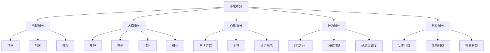

                 

### 《AI创业公司如何进行市场细分？》

> **关键词：** AI创业公司，市场细分，数据驱动，消费者行为，机器学习，深度学习，策略制定，案例分析

**摘要：**
随着人工智能（AI）技术的快速发展，市场细分作为企业战略决策的重要环节，变得愈发重要。AI创业公司如何利用AI技术有效地进行市场细分，提高市场响应速度和运营效率，成为其成功的关键。本文将探讨AI创业公司如何运用市场细分的基本原理、AI技术支持下的数据分析和模型应用，以及具体的实战策略，帮助创业公司实现精准市场定位和有效的市场营销。

### 目录大纲

#### 第一部分：市场细分的基本原理

##### 第1章：市场细分概述  
- 1.1 市场细分的定义与重要性  
- 1.2 市场细分的类型  
- **Mermaid 流程图**：不同市场细分类型的分类与特点  
- 1.3 市场细分与目标市场选择

##### 第2章：市场细分的基础理论  
- 2.1 消费者行为分析  
- 2.2 消费者特征与需求分析  
- **伪代码**：分析消费者特征与需求的算法流程

#### 第二部分：AI在市场细分中的应用

##### 第3章：数据驱动市场细分  
- 3.1 数据收集与处理  
- **数学模型和公式**：数据清洗和处理的公式和算法  
- 3.2 数据分析工具与方法  
- **伪代码**：使用数据分析工具进行市场细分的过程  
- 3.3 数据可视化  
- **举例说明**：利用数据可视化工具展示市场细分结果

##### 第4章：AI技术支持下的市场细分  
- 4.1 机器学习在市场细分中的应用  
- 4.2 深度学习模型在市场细分中的实战应用  
- **数学模型和公式**：深度学习在市场细分中的数学公式  
- **伪代码**：深度学习模型市场细分的实现流程

##### 第5章：基于AI的市场细分策略制定  
- 5.1 市场细分策略的制定方法  
- 5.2 市场细分策略的实际应用案例  
- **代码解读与分析**：具体案例中的代码实现和解读

##### 第6章：AI助力市场细分中的挑战与解决策略  
- 6.1 数据隐私与安全问题  
- 6.2 AI算法的可解释性与伦理问题  
- 6.3 挑战与解决策略  
- **伪代码**：解决市场细分中挑战的算法流程

#### 第三部分：AI创业公司市场细分实战

##### 第7章：AI创业公司的市场细分案例分析  
- 7.1 案例一：科技公司如何利用AI进行市场细分  
- 7.2 案例二：电商企业如何运用AI实现精准市场细分  
- 7.3 案例三：健康科技行业如何利用AI进行患者细分

##### 第8章：AI创业公司市场细分策略实施指南  
- 8.1 市场细分策略实施步骤  
- 8.2 资源配置与团队协作  
- 8.3 风险管理与应对策略

##### 第9章：未来展望与趋势  
- 9.1 AI与市场细分的发展趋势  
- 9.2 创业公司如何应对市场细分挑战  
- 9.3 市场细分领域的创新方向

#### 附录

##### 附录A：市场细分相关工具与资源  
- 附件一：数据分析工具介绍  
- 附件二：机器学习框架与应用资源  
- 附件三：市场细分研究论文与书籍推荐

### 第一部分：市场细分的基本原理

#### 第1章：市场细分概述

**1.1 市场细分的定义与重要性**

市场细分（Market Segmentation）是指根据消费者的不同特征、需求、购买行为等因素，将整体市场划分为若干个具有相似特性的子市场，以便企业能够更精准地定位和满足不同消费者群体的需求。市场细分不仅是市场营销战略的重要组成部分，也是企业成功的关键因素之一。

市场细分的重要性体现在以下几个方面：

1. **提高市场响应速度**：通过市场细分，企业可以更快地了解和响应不同消费者的需求，从而提高市场响应速度，增强竞争力。
2. **优化资源配置**：市场细分有助于企业将有限的资源集中投入到最具潜力的子市场，提高资源利用效率。
3. **增强产品差异化**：通过针对不同细分市场的产品差异化策略，企业可以更好地满足消费者多样化需求，提升品牌竞争力。
4. **提升客户满意度**：市场细分使企业能够更精准地满足消费者需求，提升客户满意度和忠诚度。

**1.2 市场细分的类型**

市场细分可以从多个维度进行，以下是一些常见的市场细分类型：

1. **地理细分**：根据消费者所在地理位置进行细分，如国家、地区、城市等。
2. **人口细分**：根据消费者的年龄、性别、收入、职业等人口特征进行细分。
3. **心理细分**：根据消费者的生活方式、个性、价值观念等心理特征进行细分。
4. **行为细分**：根据消费者的购买行为、消费习惯、品牌忠诚度等行为特征进行细分。
5. **利益细分**：根据消费者追求的不同利益点进行细分，如功能利益、情感利益、社会利益等。

**Mermaid 流程图**：以下是一个简单的市场细分类型的Mermaid流程图。



**1.3 市场细分与目标市场选择**

市场细分后，企业需要根据自身资源和能力选择最具有潜力和优势的目标市场。目标市场选择通常考虑以下几个方面：

1. **市场潜力**：目标市场的规模、增长速度、盈利能力等。
2. **竞争情况**：目标市场的竞争态势、竞争者的实力、市场份额等。
3. **资源匹配**：企业是否有足够的资源（如资金、技术、人才等）来开发和管理目标市场。
4. **优势定位**：企业是否能够在目标市场中发挥自身优势，如品牌、技术、产品等。

选择目标市场时，企业可以采用以下几种策略：

1. **集中策略**：将所有资源集中投入到某一个目标市场，实现最大化的市场份额和收益。
2. **差异化策略**：针对不同的目标市场，制定差异化的营销策略，满足不同消费者的需求。
3. **全方位策略**：同时开发多个目标市场，实现市场的全面覆盖和收益最大化。

#### 第2章：市场细分的基础理论

**2.1 消费者行为分析**

消费者行为分析是市场细分的基础，通过分析消费者的行为模式、购买决策过程和行为特征，企业可以更深入地了解消费者的需求和偏好，为市场细分提供依据。

消费者行为分析的主要内容包括：

1. **购买动机**：分析消费者购买商品的动机和原因，如实用性、情感、品牌认知等。
2. **购买决策过程**：研究消费者从意识到需求、收集信息、评估选择、购买决策到购后评价的整个过程。
3. **购买行为特征**：分析消费者的购买频率、购买数量、购买方式等行为特征。
4. **消费习惯**：研究消费者的消费习惯，如品牌偏好、购买渠道、消费时间等。

**2.2 消费者特征与需求分析**

消费者特征与需求分析是市场细分的核心，通过分析消费者的基本特征和需求，企业可以识别出不同细分市场的消费者群体，为市场细分提供具体依据。

消费者特征分析的主要内容包括：

1. **人口特征**：包括年龄、性别、收入、教育程度等人口统计数据。
2. **心理特征**：包括生活方式、个性、价值观等心理特征。
3. **行为特征**：包括购买行为、消费习惯、品牌忠诚度等行为特征。

消费者需求分析的主要内容包括：

1. **功能性需求**：消费者对商品或服务的基本功能需求，如实用性、质量等。
2. **情感需求**：消费者在购买过程中所追求的情感满足，如品牌认同、情感依赖等。
3. **社会需求**：消费者在购买过程中所追求的社会认同和地位象征，如品牌形象、社交地位等。

**伪代码**：以下是一个简单的消费者特征与需求分析的伪代码示例。

```plaintext
function analyzeConsumerFeaturesAndDemands():
    // 收集消费者数据
    consumerData = collectConsumerData()

    // 分析消费者人口特征
    populationFeatures = analyzePopulationFeatures(consumerData)

    // 分析消费者心理特征
    psychologicalFeatures = analyzePsychologicalFeatures(consumerData)

    // 分析消费者行为特征
    behavioralFeatures = analyzeBehavioralFeatures(consumerData)

    // 分析消费者功能性需求
    functionalDemands = analyzeFunctionalDemands(consumerData)

    // 分析消费者情感需求
    emotionalDemands = analyzeEmotionalDemands(consumerData)

    // 分析消费者社会需求
    socialDemands = analyzeSocialDemands(consumerData)

    // 输出分析结果
    return {
        "populationFeatures": populationFeatures,
        "psychologicalFeatures": psychologicalFeatures,
        "behavioralFeatures": behavioralFeatures,
        "functionalDemands": functionalDemands,
        "emotionalDemands": emotionalDemands,
        "socialDemands": socialDemands
    }
```

### 第二部分：AI在市场细分中的应用

#### 第3章：数据驱动市场细分

数据驱动市场细分是指利用大数据和人工智能技术，通过对大量消费者数据的分析，识别出具有相似特征的消费者群体，从而实现精准的市场细分。以下将介绍数据驱动市场细分的关键环节：数据收集与处理、数据分析工具与方法、数据可视化。

**3.1 数据收集与处理**

数据收集与处理是数据驱动市场细分的基础，其质量直接影响市场细分的准确性和效果。以下是一些关键步骤：

1. **数据收集**：通过多种渠道收集消费者数据，如社交媒体、电商平台、在线调查、客户反馈等。
2. **数据清洗**：去除数据中的噪声和错误，包括缺失值填充、异常值处理、数据格式统一等。
3. **数据整合**：将来自不同来源的数据进行整合，建立统一的消费者数据仓库。
4. **数据转换**：将原始数据转换为适合分析和建模的格式，如数值化、标准化等。

**数学模型和公式**：以下是一些常用的数据清洗和处理的数学模型和公式：

1. **缺失值填充**：
   - **平均值填充**：用平均值替换缺失值。
     $$ \text{填充值} = \frac{\sum_{i=1}^{n} x_i}{n} $$
   - **中值填充**：用中值替换缺失值。
     $$ \text{填充值} = \text{median}(x_1, x_2, ..., x_n) $$
2. **异常值处理**：
   - **三倍标准差法**：去除距离平均值三倍标准差以外的异常值。
     $$ x_i \leq \text{平均值} + 3 \times \text{标准差} $$
     $$ x_i \geq \text{平均值} - 3 \times \text{标准差} $$

**3.2 数据分析工具与方法**

数据分析工具与方法是数据驱动市场细分的核心，通过有效的数据分析，可以从大量数据中识别出有用的信息。以下是一些常用的数据分析工具和方法：

1. **描述性统计分析**：通过计算平均值、中位数、标准差等统计量，了解数据的分布特征。
2. **关联规则分析**：通过分析不同特征之间的关联性，识别出消费者行为模式。
   - **Apriori算法**：一种常用的关联规则挖掘算法。
   - **FP-growth算法**：一种高效、无候选集生成的关联规则挖掘算法。
3. **聚类分析**：通过将相似的数据点归为同一类别，识别出具有相似特征的消费者群体。
   - **K-means算法**：一种基于距离的聚类算法。
   - **DBSCAN算法**：一种基于密度的聚类算法。

**伪代码**：以下是一个简单的K-means聚类算法的伪代码示例。

```plaintext
function KMeans(data, K):
    // 初始化聚类中心
    centroids = initializeCentroids(data, K)

    // 循环迭代
    while not converged:
        // 为每个数据点分配最近的聚类中心
        labels = assignLabels(data, centroids)

        // 更新聚类中心
        centroids = updateCentroids(data, labels, K)

        // 判断是否收敛
        if checkConvergence(centroids):
            break

    // 输出聚类结果
    return centroids, labels
```

**3.3 数据可视化**

数据可视化是将数据分析结果以图形化的方式展示，使数据更加直观、易于理解。以下是一些常用的数据可视化工具和方法：

1. **条形图**：用于比较不同类别之间的数据差异。
2. **折线图**：用于展示数据随时间的变化趋势。
3. **散点图**：用于展示不同变量之间的关系。
4. **热力图**：用于展示数据的热点区域和分布情况。
5. **地图**：用于展示地理数据的分布和差异。

**举例说明**：以下是一个利用数据可视化工具（如Matplotlib）展示K-means聚类结果的热力图示例。

```python
import matplotlib.pyplot as plt
import numpy as np

# 假设聚类结果已生成，分别为cluster1和cluster2
cluster1 = np.random.rand(100, 2)
cluster2 = np.random.rand(100, 2)

# 创建热力图
fig, ax = plt.subplots()

# 绘制热力图
hm1 = ax.imshow(cluster1, cmap='hot', aspect='auto', origin='lower')
hm2 = ax.imshow(cluster2, cmap='cool', aspect='auto', origin='lower')

# 设置标签和标题
ax.set_xticks([])
ax.set_yticks([])
ax.set_title('K-means聚类结果热力图')

# 显示图形
plt.show()
```

通过数据驱动市场细分，AI创业公司可以更加精准地识别消费者群体，制定更有针对性的市场营销策略，从而提高市场响应速度和运营效率。

### 第4章：AI技术支持下的市场细分

在当今数据驱动的商业环境中，人工智能（AI）技术已经成为市场细分的重要工具。通过机器学习和深度学习算法，企业可以从海量数据中提取有价值的信息，识别出潜在的消费者群体，从而实现精准的市场细分。以下将详细介绍AI技术支持下的市场细分过程，包括机器学习在市场细分中的应用、深度学习模型的实战应用，以及相关的数学模型和公式。

#### 4.1 机器学习在市场细分中的应用

机器学习是一种通过算法从数据中学习规律、模式的技术，它在市场细分中的应用主要体现在以下几个方面：

1. **特征工程**：通过提取和选择与消费者行为相关的特征，为模型训练提供输入。特征工程是机器学习市场细分的关键步骤，它直接影响到模型的效果。
2. **分类和聚类算法**：分类算法（如决策树、支持向量机、逻辑回归等）可以将消费者划分为不同的类别；聚类算法（如K-means、层次聚类等）可以将消费者聚为具有相似特征的群体。
3. **预测模型**：通过构建预测模型，企业可以预测消费者的未来行为，从而更精准地制定市场营销策略。

**4.1.1 特征工程**

特征工程是市场细分中至关重要的一步。以下是一些常用的特征提取和选择方法：

1. **统计特征**：如平均值、中位数、标准差、方差等。
   $$ \mu = \frac{\sum_{i=1}^{n} x_i}{n} $$
   $$ \sigma^2 = \frac{\sum_{i=1}^{n} (x_i - \mu)^2}{n} $$
2. **文本特征**：如词频、词袋模型、TF-IDF等。
   $$ \text{TF}(w) = \frac{\text{词w在文档中出现的次数}}{\text{文档长度}} $$
   $$ \text{IDF}(w) = \log_2(\frac{N}{n_w}) $$
3. **图像特征**：如边缘检测、纹理分析、颜色直方图等。

**4.1.2 分类算法**

分类算法通过将数据划分为预定义的类别，实现对消费者行为的预测。以下是一些常用的分类算法：

1. **决策树**：通过构建树形结构，对数据进行分割，直到满足某种停止条件。
2. **支持向量机（SVM）**：通过寻找一个最佳的超平面，将不同类别的数据分开。
   $$ \text{优化目标}:\min_{w,b}\frac{1}{2}||w||^2 + C\sum_{i=1}^{n}\max(0,1-y_i((\textbf{w}\textbf{x_i}+b))) $$
3. **逻辑回归**：通过线性模型预测概率，实现分类。
   $$ \text{概率}:\pi(\textbf{x}) = \frac{1}{1+\exp(-\textbf{w}^T\textbf{x}+b)} $$

**4.1.3 聚类算法**

聚类算法通过无监督学习，将相似的数据点归为一类。以下是一些常用的聚类算法：

1. **K-means**：将数据点划分为K个簇，通过迭代计算簇中心和目标函数，实现聚类。
   $$ \text{目标函数}:\min \sum_{i=1}^{n} \sum_{k=1}^{K} (\textbf{x_i} - \textbf{c_k})^2 $$
2. **层次聚类**：通过逐步合并或分裂聚类层次，形成不同层次的聚类结构。

**4.2 深度学习模型在市场细分中的实战应用**

深度学习模型由于其强大的特征学习和模式识别能力，在市场细分中具有广泛的应用前景。以下是一些深度学习模型在市场细分中的实战应用：

1. **神经网络**：通过多层神经网络，实现对数据的非线性变换和特征提取。
   $$ \text{输出}:\textbf{h}^{(L)} = \sigma(\textbf{W}^{(L)}\textbf{h}^{(L-1)} + b^{(L)}) $$
2. **卷积神经网络（CNN）**：在图像处理领域具有出色的表现，通过卷积操作和池化操作，实现对图像的局部特征提取。
   $$ \text{卷积}: \textbf{f}_{ij}^l = \sum_{k} \textbf{W}_{ikj}^{l} \textbf{h}_{kj}^{l-1} + b_{ij}^{l} $$
3. **循环神经网络（RNN）**：在处理序列数据时具有优势，通过记忆机制，捕捉序列中的时间依赖关系。
   $$ \text{输出}:\textbf{h}^{(L)} = \text{tanh}(\textbf{W}^{L}\textbf{h}^{(L-1)} + \textbf{U}\textbf{h}^{(L-1)}_{t-1} + b^{(L)}) $$
4. **自编码器**：通过无监督学习，实现数据的降维和特征提取。
   $$ \text{损失函数}:\frac{1}{n}\sum_{i=1}^{n} \sum_{j=1}^{k}\sum_{l=1}^{L} \ell_{ij}^{(l)}(\textbf{x}_i[j], \textbf{z}_i[l]) $$

**4.2.1 深度学习在市场细分中的数学模型和公式**

1. **反向传播算法**：用于计算神经网络中权重和偏置的梯度，实现模型的训练。
   $$ \delta_{jk}^{(l)} = (1 - \text{sigmoid}(z^{(l)}_k)) \times \text{sigmoid}(z^{(l)}_k) \times \delta_{jkl}^{(l+1)} $$
   $$ \frac{\partial J}{\partial \textbf{W}^{(l)}_{jk}} = \sum_{i} \delta_{ji}^{(l+1)} \textbf{x}_i[k] $$
   $$ \frac{\partial J}{\partial b^{(l)}_k} = \sum_{i} \delta_{ji}^{(l+1)} $$

2. **优化算法**：用于调整网络中的权重和偏置，优化模型的性能。
   - **随机梯度下降（SGD）**：
     $$ \textbf{W}^{(l)}_{jk} \leftarrow \textbf{W}^{(l)}_{jk} - \alpha \frac{\partial J}{\partial \textbf{W}^{(l)}_{jk}} $$
   - **动量法**：
     $$ \textbf{v}^{(l)}_{jk} \leftarrow \beta \textbf{v}^{(l)}_{jk} + (1 - \beta) \frac{\partial J}{\partial \textbf{W}^{(l)}_{jk}} $$
     $$ \textbf{W}^{(l)}_{jk} \leftarrow \textbf{W}^{(l)}_{jk} - \alpha \textbf{v}^{(l)}_{jk} $$

通过机器学习和深度学习技术，AI创业公司可以从海量数据中提取有价值的信息，实现精准的市场细分，为企业的市场营销和运营提供有力支持。

### 第5章：基于AI的市场细分策略制定

在掌握了AI技术在市场细分中的应用后，下一步便是如何将这些技术转化为实际的市场细分策略。有效的市场细分策略不仅能够帮助企业更好地理解消费者，还能优化资源配置，提升市场营销效果。以下将介绍基于AI的市场细分策略的制定方法、实际应用案例以及代码解读与分析。

#### 5.1 市场细分策略的制定方法

市场细分策略的制定是一个系统化的过程，涉及多个步骤。以下是一个基于AI的市场细分策略制定的一般流程：

1. **明确目标**：首先，企业需要明确市场细分的目标，例如提高销售额、增加市场份额或提升客户满意度等。
2. **数据收集**：根据目标，收集相关的市场数据，包括消费者行为数据、购买记录、社交媒体反馈等。
3. **数据清洗与预处理**：对收集到的数据进行清洗，包括填补缺失值、处理异常值、统一数据格式等。
4. **特征工程**：从原始数据中提取出能够代表消费者行为和需求的特征。这些特征可以是数值型的，也可以是文本或图像等非数值型特征。
5. **模型选择与训练**：选择合适的机器学习或深度学习模型，对数据集进行训练，以便能够预测消费者的行为或对消费者进行分类。
6. **市场细分**：利用训练好的模型，对消费者群体进行细分，识别出具有相似特征和需求的消费者群体。
7. **策略制定**：根据市场细分的成果，制定相应的市场营销策略，包括产品定位、定价策略、推广渠道等。
8. **实施与监控**：将市场细分策略付诸实施，并持续监控其效果，根据反馈进行调整。

**5.2 市场细分策略的实际应用案例**

以下是一个市场细分策略的实际应用案例，通过代码解读与分析，展示如何利用机器学习模型实现市场细分。

**案例：电商企业基于消费者行为数据的市场细分**

在这个案例中，我们使用了一个电商企业的消费者行为数据集，通过K-means聚类算法，将消费者分为不同的群体。

**数据集描述**：数据集包含以下特征：
- **年龄**：消费者的年龄
- **收入**：消费者的年收入
- **消费频率**：消费者在一定时间内的购买频率
- **购买类型**：消费者的购买类型（如电子产品、服装、家居用品等）

**代码解读与分析**：

1. **导入数据与库**：

```python
import pandas as pd
import numpy as np
from sklearn.cluster import KMeans
import matplotlib.pyplot as plt

# 加载数据集
data = pd.read_csv('consumer_data.csv')
```

2. **数据预处理**：

```python
# 填充缺失值
data.fillna(data.mean(), inplace=True)

# 数据标准化
data_scaled = (data - data.mean()) / data.std()
```

3. **特征工程**：

```python
# 提取特征
X = data_scaled[['age', 'income', 'purchase_frequency', 'type_of_purchase']]
```

4. **K-means聚类**：

```python
# 初始化KMeans模型，设置聚类数量为3
kmeans = KMeans(n_clusters=3, random_state=0)

# 训练模型
kmeans.fit(X)

# 获取聚类结果
clusters = kmeans.predict(X)

# 将聚类结果添加到原始数据集中
data['cluster'] = clusters
```

5. **可视化与解读**：

```python
# 可视化聚类结果
plt.scatter(X['age'], X['income'], c=clusters)
plt.xlabel('Age')
plt.ylabel('Income')
plt.title('Consumer Clusters by Age and Income')
plt.show()
```

通过上述代码，我们成功地使用K-means算法对电商企业的消费者进行了市场细分。从可视化结果中，我们可以看到不同聚类簇的分布情况，从而对各个聚类簇的消费者特征进行深入分析。

**5.3 代码解读与分析**

- **数据导入与预处理**：我们首先导入数据集，并对数据进行缺失值填充和数据标准化处理，以便后续的特征工程和模型训练。
- **特征工程**：从数据集中提取与消费者行为相关的特征，这些特征将作为模型训练的输入。
- **K-means聚类**：使用K-means算法对数据进行聚类，通过训练模型，得到每个消费者的聚类标签。K-means算法通过计算距离最小化目标函数来找到聚类中心，从而将数据点划分为不同的簇。
- **可视化与解读**：通过可视化工具，我们可以直观地看到消费者的聚类结果。这些聚类结果可以帮助企业识别出具有相似特征的消费者群体，从而制定更加精准的市场营销策略。

通过上述案例，我们可以看到如何利用AI技术实现市场细分，并制定相应的市场细分策略。在实施过程中，企业可以根据实际情况调整模型参数和策略，以实现最佳的市场细分效果。

### 第6章：AI助力市场细分中的挑战与解决策略

在利用AI技术进行市场细分的过程中，企业可能会面临多种挑战。这些挑战不仅涉及到技术层面，还涉及到数据隐私、算法可解释性、伦理问题等多个方面。以下将讨论这些挑战，并提出相应的解决策略。

#### 6.1 数据隐私与安全问题

数据隐私和安全问题是AI技术在市场细分中面临的首要挑战。消费者数据通常包含敏感信息，如个人信息、消费习惯、财务状况等。这些数据一旦泄露，不仅会对消费者造成损失，还会损害企业的声誉。

**挑战**：数据隐私和安全问题主要表现在以下几个方面：
- **数据泄露**：未经授权的第三方访问和泄露消费者数据。
- **数据滥用**：企业内部人员或合作伙伴滥用消费者数据。
- **合规性风险**：不遵守相关数据保护法规，如《通用数据保护条例》（GDPR）。

**解决策略**：
- **数据加密**：对消费者数据进行加密处理，确保数据在传输和存储过程中不被窃取。
- **访问控制**：通过访问控制机制，确保只有授权人员才能访问敏感数据。
- **隐私保护技术**：采用差分隐私、同态加密等隐私保护技术，降低数据泄露的风险。
- **合规性审查**：定期进行合规性审查，确保企业的数据处理过程符合相关法规要求。

#### 6.2 AI算法的可解释性与伦理问题

随着AI技术的普及，算法的可解释性和伦理问题也越来越受到关注。市场细分中使用的AI算法通常涉及到复杂的模型和大量的数据处理，使得算法的决策过程变得不透明，难以解释。

**挑战**：
- **算法透明度**：消费者难以理解AI算法的决策过程，可能导致对算法的不信任。
- **算法偏见**：AI算法可能会基于历史数据中的偏见，对某些群体产生不公平的待遇。
- **伦理问题**：算法的使用可能会引发伦理问题，如歧视、滥用等。

**解决策略**：
- **算法透明化**：通过提供算法的可视化工具和解释机制，提高算法的透明度，增强消费者的信任。
- **算法审计**：定期对算法进行审计，确保算法的公平性和公正性。
- **算法多样性**：通过引入多样化的算法和数据集，减少单一算法可能产生的偏见。
- **伦理指导原则**：制定明确的伦理指导原则，确保AI技术在市场细分中的使用符合伦理标准。

#### 6.3 挑战与解决策略

以下是一个综合的解决策略框架，旨在应对AI助力市场细分中的各种挑战。

**1. 数据隐私与安全策略**：
- **数据加密**：采用高级加密标准（AES）对敏感数据进行加密。
- **访问控制**：实施基于角色的访问控制（RBAC），确保只有授权人员才能访问敏感数据。
- **隐私保护技术**：引入差分隐私和同态加密技术，减少数据泄露风险。
- **合规性审查**：定期审查数据处理流程，确保符合GDPR等法规要求。

**2. 算法透明化与审计策略**：
- **算法可视化工具**：开发可视化工具，帮助用户理解AI算法的决策过程。
- **算法解释机制**：实现算法解释机制，如LIME、SHAP等，提高算法的可解释性。
- **算法审计**：定期进行算法审计，评估算法的公平性和公正性。

**3. 伦理指导原则**：
- **伦理培训**：对数据处理和算法开发人员进行伦理培训，提高其伦理意识。
- **伦理审查委员会**：成立伦理审查委员会，负责监督AI技术在市场细分中的应用。
- **多样化算法和数据集**：引入多样化的算法和数据集，减少算法偏见。
- **伦理指导原则**：制定并遵循伦理指导原则，确保AI技术的使用符合伦理标准。

通过这些策略，AI创业公司可以在进行市场细分的过程中，更好地应对数据隐私、算法透明性和伦理等挑战，确保其AI技术的应用既有效又符合伦理标准。

### 第三部分：AI创业公司市场细分实战

#### 第7章：AI创业公司的市场细分案例分析

在AI技术的支持下，多个行业的创业公司已经成功实现了市场细分，提高了市场响应速度和运营效率。以下将介绍三个具体案例，分别是科技公司、电商企业和健康科技行业的市场细分实践。

##### 7.1 案例一：科技公司如何利用AI进行市场细分

**背景**：某科技公司开发了一款智能办公软件，目标市场是全球企业客户。然而，不同企业对办公软件的需求和预算差异较大，使得公司难以制定统一的营销策略。

**解决方案**：公司决定利用AI技术对潜在客户进行市场细分，以实现更精准的市场定位和营销策略。

**实施步骤**：

1. **数据收集**：从公司CRM系统和市场调研中收集潜在客户的数据，包括公司规模、行业类型、购买历史等。
2. **数据预处理**：对收集到的数据进行分析和清洗，填补缺失值，处理异常值，统一数据格式。
3. **特征工程**：提取与客户需求相关的特征，如公司规模、行业类型、购买历史等。
4. **模型选择与训练**：选择K-means聚类算法，对数据进行聚类，将客户划分为不同群体。
5. **细分结果与应用**：根据聚类结果，将客户分为高潜力客户、一般客户和低潜力客户，制定差异化的营销策略。

**效果评估**：通过市场细分，公司成功将高潜力客户与低潜力客户区分开来，提高了营销ROI和客户满意度。

##### 7.2 案例二：电商企业如何运用AI实现精准市场细分

**背景**：某电商企业拥有庞大的用户群体，但不同用户对商品的需求和购买行为存在显著差异，导致营销效率低下。

**解决方案**：企业决定利用AI技术，对用户进行精准市场细分，以实现个性化营销和提升用户体验。

**实施步骤**：

1. **数据收集**：从电商平台的用户行为数据中收集用户信息，包括浏览历史、购买记录、评价等。
2. **数据预处理**：对用户数据进行清洗和预处理，提取关键特征，如用户年龄、性别、购买频率等。
3. **特征工程**：使用机器学习算法（如决策树、随机森林等），对用户行为数据进行特征提取和筛选。
4. **模型选择与训练**：选择用户行为预测模型，对用户行为进行预测，识别出潜在购买用户。
5. **细分结果与应用**：根据用户行为预测结果，将用户划分为潜在购买用户、活跃用户和沉默用户，制定个性化营销策略。

**效果评估**：通过市场细分，企业成功提升了用户转化率和客户满意度，实现了销售额的持续增长。

##### 7.3 案例三：健康科技行业如何利用AI进行患者细分

**背景**：某健康科技公司开发了一款健康管理应用，目标用户是各类患者。然而，不同患者对健康管理的需求和关注点存在差异，使得公司难以制定统一的服务策略。

**解决方案**：公司决定利用AI技术对用户进行市场细分，以提供更个性化的健康管理服务。

**实施步骤**：

1. **数据收集**：从应用的用户数据中收集患者信息，包括疾病类型、治疗历史、生活习惯等。
2. **数据预处理**：对用户数据进行分析和清洗，提取与健康管理相关的特征。
3. **特征工程**：使用机器学习算法（如K-means聚类、层次聚类等），对患者进行聚类分析。
4. **模型选择与训练**：选择预测模型，如逻辑回归、随机森林等，预测患者的健康风险和需求。
5. **细分结果与应用**：根据聚类和预测结果，将患者划分为高风险患者、中风险患者和低风险患者，制定个性化的健康管理方案。

**效果评估**：通过市场细分，公司成功提升了患者的满意度和依从性，实现了健康管理和治疗效果的显著提升。

通过以上案例，我们可以看到AI技术在市场细分中的广泛应用和显著效果。无论是科技公司、电商企业还是健康科技行业，AI技术的应用都帮助企业实现了更精准的市场定位和更高效的市场营销。

### 第8章：AI创业公司市场细分策略实施指南

在了解了市场细分的理论和技术之后，接下来我们将深入探讨AI创业公司在实际操作中如何实施市场细分策略，以及如何进行资源配置和团队协作，同时讨论风险管理和应对策略。

#### 8.1 市场细分策略实施步骤

市场细分策略的实施可以分为以下几个步骤：

1. **明确目标**：首先，创业公司需要明确市场细分的目标，如提升销售额、增加市场份额、优化客户关系等。
2. **数据收集**：收集与市场细分相关的数据，包括消费者行为数据、市场调研数据、竞争分析数据等。
3. **数据预处理**：对收集到的数据进行分析、清洗和预处理，确保数据的质量和一致性。
4. **特征工程**：提取与市场细分相关的特征，包括人口统计特征、行为特征、心理特征等。
5. **模型选择与训练**：选择合适的机器学习或深度学习模型，对数据进行训练，以实现消费者分类或聚类。
6. **市场细分**：根据模型预测结果，将消费者划分为不同的市场细分群体。
7. **策略制定**：根据市场细分结果，制定差异化的市场营销策略，包括产品定位、定价策略、推广渠道等。
8. **实施与监控**：将市场细分策略付诸实施，并持续监控其效果，根据反馈进行调整。

#### 8.2 资源配置与团队协作

市场细分策略的实施需要充足的资源支持和高效的团队协作。以下是资源配置和团队协作的要点：

1. **资源配置**：
   - **技术资源**：确保有足够的技术团队和AI工具支持，如数据分析师、机器学习工程师、数据科学家等。
   - **数据资源**：确保有高质量的数据来源，包括内部数据、第三方数据等。
   - **资金资源**：为市场细分策略的实施提供充足的资金支持。

2. **团队协作**：
   - **跨部门合作**：市场细分策略的实施涉及多个部门，如市场部、研发部、销售部等，需要建立跨部门沟通和协作机制。
   - **定期会议**：定期召开市场细分策略实施进展会议，确保团队成员了解项目进度和目标。
   - **明确角色与职责**：明确每个团队成员的角色和职责，确保工作高效开展。

#### 8.3 风险管理与应对策略

在市场细分策略的实施过程中，企业可能会面临多种风险，如数据隐私风险、算法偏见风险、市场变化风险等。以下是风险管理的要点和应对策略：

1. **数据隐私风险**：
   - **加密与访问控制**：对敏感数据进行加密处理，确保数据在传输和存储过程中的安全性。
   - **合规性审查**：定期审查数据处理流程，确保符合相关数据保护法规，如GDPR等。

2. **算法偏见风险**：
   - **算法审计**：定期对AI算法进行审计，确保其公平性和公正性。
   - **多样化算法和数据集**：引入多样化的算法和数据集，减少单一算法可能产生的偏见。

3. **市场变化风险**：
   - **市场调研**：定期进行市场调研，了解市场动态和消费者需求的变化。
   - **灵活调整**：根据市场变化，灵活调整市场细分策略和营销策略。

通过上述资源配置、团队协作和风险管理策略，AI创业公司可以更加有效地实施市场细分策略，提高市场响应速度和运营效率。

### 第9章：未来展望与趋势

随着人工智能（AI）技术的不断发展和成熟，市场细分领域也迎来了新的机遇和挑战。未来，AI与市场细分将呈现出以下几个趋势和方向：

#### 9.1 AI与市场细分的发展趋势

1. **个性化推荐系统的广泛应用**：基于深度学习和大模型（如GPT-3、BERT等），个性化推荐系统将更加智能化，能够更准确地预测消费者的行为和偏好，从而实现精准的市场细分和推荐。
2. **多模态数据的融合**：随着图像、语音、文本等多种数据类型的产生和积累，AI技术将能够更好地融合多模态数据，进行更全面的市场细分和消费者行为分析。
3. **实时市场细分与调整**：AI技术将实现市场细分的实时性和动态性，企业可以基于实时数据快速调整市场策略，提高市场响应速度和运营效率。

#### 9.2 创业公司如何应对市场细分挑战

1. **数据驱动的决策**：创业公司应建立完善的数据驱动决策体系，确保市场细分策略的制定和实施有充分的数据支持。
2. **人才培养与引进**：积极培养和引进具备AI和数据分析能力的人才，建立专业的数据科学团队，为市场细分提供技术支持。
3. **合作与开放平台**：通过合作和开放平台，整合外部数据资源和技术资源，提升自身市场细分能力。

#### 9.3 市场细分领域的创新方向

1. **社会网络分析**：利用社交网络数据分析，识别潜在消费者群体和品牌传播途径，实现更精准的市场细分。
2. **伦理AI与隐私保护**：随着数据隐私和伦理问题的关注度提高，创业公司需要开发符合伦理标准和社会规范的AI技术，确保市场细分过程公平、透明。
3. **智能决策支持系统**：结合AI和大数据分析，开发智能决策支持系统，帮助企业实现智能化、自动化、个性化市场细分。

通过紧跟AI与市场细分的发展趋势，创业公司可以不断创新和优化市场细分策略，提高市场竞争力，实现可持续发展。

### 附录

#### 附录A：市场细分相关工具与资源

**附件一：数据分析工具介绍**

1. **Python数据分析库**：
   - **Pandas**：用于数据清洗、预处理和分析。
   - **NumPy**：用于数值计算和数据分析。
   - **SciPy**：用于科学计算和工程应用。

2. **数据可视化工具**：
   - **Matplotlib**：用于创建各种统计图表。
   - **Seaborn**：基于Matplotlib的统计绘图库。
   - **Plotly**：用于创建交互式图表和可视化。

**附件二：机器学习框架与应用资源**

1. **机器学习库**：
   - **scikit-learn**：提供了多种机器学习算法的实现。
   - **TensorFlow**：用于构建和训练深度学习模型。
   - **PyTorch**：用于研究深度学习算法。

2. **在线资源与教程**：
   - **Coursera**：提供机器学习和数据科学的在线课程。
   - **Kaggle**：提供各种数据集和机器学习竞赛。

**附件三：市场细分研究论文与书籍推荐**

1. **论文**：
   - "Customer Segmentation Using Machine Learning Techniques"（使用机器学习技术的客户细分）
   - "Deep Learning for Customer Behavior Prediction"（深度学习在客户行为预测中的应用）

2. **书籍**：
   - "Data Science for Business"（数据科学在企业中的应用）
   - "Machine Learning: A Probabilistic Perspective"（概率视角下的机器学习）

通过以上工具和资源的合理利用，AI创业公司可以更好地进行市场细分研究与实践，提高市场响应速度和运营效率。

