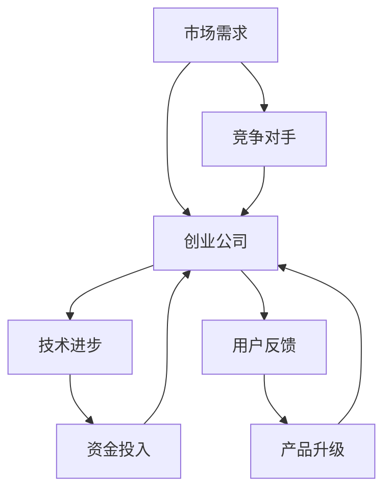

                 

### 引言

AI创业公司在当今快速发展的技术领域中扮演着至关重要的角色。随着人工智能技术的不断进步，创业公司有机会利用AI技术实现创新，提升竞争力，并在市场上占据一席之地。然而，AI创业公司同样面临着诸多挑战，尤其是如何在激烈的竞争环境中实现产品的快速迭代与升级。

首先，我们需要了解AI创业公司所面临的挑战。一方面，技术进步日新月异，创业公司需要不断跟进最新的技术趋势，保持竞争力。另一方面，市场需求变化迅速，创业公司必须能够灵活应对，满足用户不断变化的需求。此外，资金和资源的有限性也是一大挑战，创业公司需要优化资源配置，提高生产效率。

在这种背景下，产品迭代与升级成为AI创业公司的关键策略。通过持续迭代和升级，创业公司可以不断提升产品的功能、性能和用户体验，满足市场需求，增强用户满意度，从而在激烈的市场竞争中脱颖而出。

本文将围绕AI创业公司的产品迭代与升级策略展开讨论。我们将从以下几个方面进行深入分析：

1. **AI创业环境概述**：介绍AI创业生态系统的组成部分、核心概念及其相互关系，以及创业公司在产品迭代与升级过程中可能遇到的挑战和机遇。
2. **产品迭代方法论**：讲解产品迭代的基本流程，包括用户反馈分析、改进计划生成、改进计划优先级排序以及实施改进计划。
3. **用户需求分析**：介绍用户需求分析的方法，包括数学模型和公式的应用，以及实际案例的分析。
4. **数据驱动决策**：探讨数据收集与处理的方法，以及如何使用数据可视化工具支持决策过程。
5. **产品迭代实践**：提供实际的产品迭代案例，展示从需求分析到最终产品发布的全过程，并介绍开发环境的搭建和源代码的实现。
6. **升级策略与风险管理**：阐述产品升级的策略，分析可能遇到的风险，并提供应对策略。
7. **创业公司成功案例**：分享成功的AI创业公司的产品迭代与升级案例，总结成功的原因和可借鉴的经验。
8. **未来趋势与展望**：讨论AI技术的发展趋势，预测AI创业公司的未来发展方向和可能面临的新挑战。

通过以上步骤的详细分析，本文旨在为AI创业公司提供一套系统的产品迭代与升级策略，帮助它们在快速变化的市场环境中取得成功。

---

**关键词：** AI创业公司，产品迭代，升级策略，用户需求分析，数据驱动决策，实践案例，风险管理，成功案例，未来趋势。

**摘要：** 本文深入探讨了AI创业公司在产品迭代与升级过程中所面临的挑战和机遇。通过详细分析产品迭代方法论、用户需求分析、数据驱动决策、实践案例、升级策略与风险管理等多个方面，本文为AI创业公司提供了一套系统的产品迭代与升级策略，以帮助它们在竞争激烈的市场中取得成功，并应对未来可能的新挑战。

### 第1章: AI创业环境概述

AI创业公司置身于一个高度动态且复杂的创业生态系统中。为了更好地理解这一环境，我们需要先了解其组成部分、核心概念及其相互关系。

#### 核心概念与联系

使用Mermaid流程图，我们可以直观地展示AI创业生态系统的组成部分和它们之间的相互关系。



**图1.1 AI创业生态系统**

- **市场需求（A）**：市场需求是推动AI创业公司发展的核心动力。了解并满足用户需求是创业公司成功的关键。
- **创业公司（B）**：创业公司是AI创业生态系统的核心主体，负责技术开发、产品迭代和市场竞争。
- **技术进步（C）**：技术进步为AI创业公司提供了强大的创新动力。创业公司需要不断跟进最新的技术趋势，保持竞争力。
- **用户反馈（D）**：用户反馈是创业公司了解市场需求、优化产品的重要信息来源。通过用户反馈，创业公司可以不断改进产品，提升用户体验。
- **产品升级（F）**：产品升级是创业公司应对市场竞争、满足用户需求的必要手段。通过不断升级产品，创业公司可以保持市场竞争力。
- **资金投入（E）**：资金投入是AI创业公司生存和发展的基础。创业公司需要通过多种方式获取资金，以支持研发和市场推广。
- **竞争对手（G）**：竞争对手是创业公司需要面对的重要外部因素。了解竞争对手的策略和市场表现，有助于创业公司制定有效的竞争策略。

#### 主要挑战

在产品迭代与升级过程中，AI创业公司可能遇到以下主要挑战：

1. **技术挑战**：技术进步迅速，创业公司需要不断跟进最新的技术趋势，保持技术领先。同时，技术复杂性高，创业公司需要具备强大的技术实力，以应对技术难题。
2. **市场挑战**：市场需求变化迅速，创业公司需要具备敏锐的市场洞察力，及时调整产品策略。此外，市场竞争激烈，创业公司需要不断创新，以保持竞争优势。
3. **资金挑战**：资金投入巨大，创业公司需要寻找合适的融资渠道，确保充足的资金支持研发和市场推广。
4. **团队挑战**：团队是创业公司的核心资源。创业公司需要组建一支高效、专业、有共同目标的团队，以应对各种挑战。

#### 机遇与风险

AI技术在创业领域中的应用带来了诸多机遇：

1. **创新机会**：AI技术为创业公司提供了丰富的创新机会。创业公司可以通过AI技术实现产品差异化，开拓新的市场领域。
2. **市场机会**：随着AI技术的普及，市场需求不断增长。创业公司可以抓住这一机遇，扩大市场份额，提升品牌知名度。
3. **合作机会**：AI技术具有广泛的适用性，创业公司可以与其他企业、研究机构、高校等合作，共同推进技术研究和市场推广。

然而，AI技术在创业领域中也存在一定的风险：

1. **技术风险**：AI技术发展迅速，创业公司可能面临技术淘汰的风险。此外，技术不成熟可能导致产品稳定性问题。
2. **市场风险**：市场需求变化不确定，创业公司可能面临市场预测错误的风险。此外，市场竞争加剧可能压缩利润空间。
3. **法律风险**：AI技术涉及隐私、伦理等问题，创业公司需要遵守相关法律法规，避免法律风险。

总之，AI创业公司置身于一个充满机遇与挑战的创业生态系统。通过深入了解这一生态系统，创业公司可以更好地把握机遇，应对挑战，实现可持续发展。

---

**核心概念与联系：** AI创业生态系统的核心概念包括市场需求、创业公司、技术进步、用户反馈、产品升级、资金投入和竞争对手。它们之间的相互关系如图1.1所示。创业公司需要面对的主要挑战包括技术、市场、资金和团队挑战。同时，AI技术在创业领域中的应用带来了创新、市场与合作机会，但同时也存在技术、市场和法律风险。

### 第2章: 产品迭代方法论

产品迭代方法论是AI创业公司在产品开发过程中至关重要的一环。通过有效的迭代过程，创业公司可以不断改进产品，满足市场需求，提升用户体验。本章将详细讲解产品迭代的基本流程，包括用户反馈分析、改进计划生成、改进计划优先级排序以及实施改进计划。

#### 核心算法原理讲解

产品迭代的基本流程可以概括为以下四个步骤：

1. **用户反馈分析**：收集并分析用户反馈，了解用户对当前产品的满意度、痛点以及期望。
2. **改进计划生成**：基于用户反馈，生成改进计划，包括功能增强、性能优化、用户体验改进等。
3. **改进计划优先级排序**：对改进计划进行优先级排序，确定哪些改进计划应优先实施。
4. **实施改进计划**：根据优先级排序，实施改进计划，更新产品版本。

我们可以使用伪代码来详细阐述这四个步骤：

```python
def productIteration(currentProduct, userFeedback):
    # 步骤1：用户反馈分析
    analyzeFeedback = analyzeUserFeedback(userFeedback)
    
    # 步骤2：改进计划生成
    improvementPlans = generateImprovementPlans(currentProduct, analyzeFeedback)
    
    # 步骤3：改进计划优先级排序
    prioritizedPlans = prioritizeImprovementPlans(improvementPlans)
    
    # 步骤4：实施改进计划
    implementedPlans = implementPlans(prioritizedPlans)
    
    # 返回更新后的产品
    return updatedProduct
```

**函数说明：**

- `analyzeUserFeedback(userFeedback)`：分析用户反馈，返回分析结果。
- `generateImprovementPlans(currentProduct, analyzeFeedback)`：基于用户反馈，生成改进计划。
- `prioritizeImprovementPlans(improvementPlans)`：对改进计划进行优先级排序。
- `implementPlans(prioritizedPlans)`：根据优先级排序，实施改进计划。

#### 用户反馈分析

用户反馈分析是产品迭代的第一步，其目的是收集用户对当前产品的反馈，并进行分析，以了解用户的满意度、痛点以及期望。用户反馈可以通过多种渠道收集，如用户调研、用户评论、用户行为数据等。

伪代码示例：

```python
def analyzeUserFeedback(userFeedback):
    # 收集用户反馈
    feedbackList = collectUserFeedback()
    
    # 分析用户满意度
    satisfactionScore = calculateSatisfactionScore(feedbackList)
    
    # 分析用户痛点
    painPoints = identifyPainPoints(feedbackList)
    
    # 分析用户期望
    expectations = identifyExpectations(feedbackList)
    
    # 返回分析结果
    return {
        'satisfactionScore': satisfactionScore,
        'painPoints': painPoints,
        'expectations': expectations
    }
```

**函数说明：**

- `collectUserFeedback()`：收集用户反馈，可以是用户调研问卷、用户评论等。
- `calculateSatisfactionScore(feedbackList)`：计算用户满意度得分。
- `identifyPainPoints(feedbackList)`：识别用户痛点。
- `identifyExpectations(feedbackList)`：识别用户期望。

#### 改进计划生成

在完成用户反馈分析后，下一步是生成改进计划。改进计划是基于用户反馈，针对产品当前存在的问题和用户的期望，制定的具体改进措施。这些改进措施可能包括功能增强、性能优化、用户体验改进等。

伪代码示例：

```python
def generateImprovementPlans(currentProduct, analyzeFeedback):
    # 根据用户反馈生成改进计划
    improvementPlans = []
    
    if analyzeFeedback['satisfactionScore'] < threshold:
        improvementPlans.append('提高用户满意度')
    
    if analyzeFeedback['painPoints']:
        for painPoint in analyzeFeedback['painPoints']:
            improvementPlans.append(f'解决{painPoint}')
    
    if analyzeFeedback['expectations']:
        for expectation in analyzeFeedback['expectations']:
            improvementPlans.append(f'满足{expectation}')
    
    # 返回改进计划
    return improvementPlans
```

**函数说明：**

- `threshold`：用户满意度得分阈值，用于判断是否需要提高用户满意度。
- `painPoints`：用户反馈中的痛点列表。
- `expectations`：用户反馈中的期望列表。

#### 改进计划优先级排序

在生成改进计划后，下一步是对改进计划进行优先级排序。优先级排序的目的是确定哪些改进计划应优先实施，以确保资源的最优利用。优先级排序可以基于多个因素，如改进效果、资源需求、市场需求等。

伪代码示例：

```python
def prioritizeImprovementPlans(improvementPlans):
    # 对改进计划进行优先级排序
    prioritizedPlans = []
    
    # 根据改进效果、资源需求、市场需求等因素进行排序
    for plan in improvementPlans:
        if '提高用户满意度' in plan:
            prioritizedPlans.append(plan)
        
        if '解决重要痛点' in plan:
            prioritizedPlans.append(plan)
        
        if '满足市场趋势' in plan:
            prioritizedPlans.append(plan)
    
    # 返回优先级排序后的改进计划
    return prioritizedPlans
```

**函数说明：**

- `improvementPlans`：改进计划列表。
- `prioritizedPlans`：优先级排序后的改进计划列表。

#### 实施改进计划

在完成改进计划的优先级排序后，下一步是实施改进计划。实施改进计划的过程包括设计、开发、测试和部署等环节。通过这些环节，改进计划将转化为实际的产品更新。

伪代码示例：

```python
def implementPlans(prioritizedPlans):
    # 实施改进计划
    implementedPlans = []
    
    for plan in prioritizedPlans:
        # 设计阶段
        designStage = designPlan(plan)
        
        # 开发阶段
        developmentStage = developPlan(plan)
        
        # 测试阶段
        testingStage = testPlan(plan)
        
        # 部署阶段
        deploymentStage = deployPlan(plan)
        
        # 记录已实施的改进计划
        implementedPlans.append(plan)
    
    # 返回已实施的改进计划
    return implementedPlans
```

**函数说明：**

- `designPlan(plan)`：设计改进计划。
- `developPlan(plan)`：开发改进计划。
- `testPlan(plan)`：测试改进计划。
- `deployPlan(plan)`：部署改进计划。

通过以上四个步骤，AI创业公司可以有效地进行产品迭代，不断提升产品的功能、性能和用户体验，以满足市场需求，增强竞争力。

---

**核心算法原理讲解：** 产品迭代方法论包括用户反馈分析、改进计划生成、改进计划优先级排序和实施改进计划四个步骤。使用伪代码详细阐述了每个步骤的实现过程，包括用户反馈分析、改进计划生成、改进计划优先级排序以及实施改进计划。通过这些步骤，AI创业公司可以有效地进行产品迭代，提升产品的功能、性能和用户体验。用户反馈分析、改进计划生成和改进计划优先级排序是迭代过程中的关键环节，需要重点关注。

### 第3章: 用户需求分析

用户需求分析是产品迭代与升级过程中至关重要的一环。准确了解用户需求不仅有助于创业公司提升产品竞争力，还能帮助其优化资源配置，提高市场响应速度。本章将介绍用户需求分析的方法，并使用数学模型和公式进行分析，同时通过实际案例进行举例说明。

#### 数学模型和数学公式

在用户需求分析中，常用的数学模型和公式可以帮助我们量化用户需求，指导产品设计和迭代。以下是一个基本的用户满意度模型，以及相关的数学公式：

$$
User_Satisfaction = \frac{Functionality + Performance + Usability}{3}
$$

其中：
- **User\_Satisfaction**：用户满意度，用于衡量用户对产品的整体满意程度。
- **Functionality**：功能性，表示产品功能的完备性。
- **Performance**：性能，表示产品的运行效率和响应速度。
- **Usability**：易用性，表示产品的用户友好程度。

通过这个模型，我们可以对用户需求进行综合评估，从而制定相应的改进计划。

#### 用户需求分析步骤

用户需求分析主要包括以下几个步骤：

1. **需求收集**：通过各种渠道收集用户需求，如用户调研、用户访谈、用户行为分析等。
2. **需求筛选**：对收集到的需求进行筛选，识别出对产品影响较大的需求。
3. **需求分析**：使用数学模型和公式对筛选后的需求进行量化分析，评估用户满意度。
4. **需求优先级排序**：根据用户满意度和其他因素，对需求进行优先级排序，确定哪些需求应优先实现。

#### 实际案例

以下是一个用户需求分析的实际案例：

**案例背景**：某AI创业公司开发了一款智能助手应用程序，旨在帮助用户管理日常事务。经过一段时间的市场推广和使用，公司收集到了大量用户反馈，并希望通过需求分析来优化产品。

**需求收集**：
- 通过用户调研，收集到了以下需求：
  - **功能需求**：用户希望增加日程管理、提醒功能、智能推荐等功能。
  - **性能需求**：用户希望提高应用程序的响应速度，减少加载时间。
  - **易用性需求**：用户希望界面更简洁，操作更直观。

**需求筛选**：
- 根据用户反馈的重要性和实施难度，筛选出了以下关键需求：
  - 增加日程管理功能。
  - 提高响应速度。
  - 优化用户界面。

**需求分析**：
- 使用用户满意度模型，对筛选后的需求进行量化分析：
  - 功能性：用户对日程管理功能的满意度为80%。
  - 性能：用户对响应速度的满意度为70%。
  - 易用性：用户对用户界面的满意度为85%。

根据模型计算：
$$
User_Satisfaction = \frac{0.8 + 0.7 + 0.85}{3} = 0.7833
$$
用户满意度为78.33%。

**需求优先级排序**：
- 根据用户满意度和其他因素，确定需求优先级：
  - 优先级最高的是日程管理功能，因为它直接影响用户的工作和生活效率。
  - 其次是响应速度优化，因为它关系到用户体验的流畅性。
  - 用户界面优化排在最后，因为它虽然重要，但对用户满意度的直接影响较小。

#### 结果与讨论

通过以上案例，我们可以看到用户需求分析在产品迭代与升级中的重要作用。首先，通过需求收集和筛选，创业公司可以明确用户的核心需求，避免资源浪费。其次，通过数学模型和公式，创业公司可以对需求进行量化评估，从而制定有针对性的改进计划。最后，通过需求优先级排序，创业公司可以合理安排资源，确保关键需求的优先实现。

总之，用户需求分析是产品迭代与升级的基础，通过科学的方法和模型，创业公司可以更好地了解用户需求，优化产品设计，提高用户满意度，从而在激烈的市场竞争中脱颖而出。

---

**数学模型和数学公式：** 用户需求分析中常用的数学模型是用户满意度模型，公式为 $$ User\_Satisfaction = \frac{Functionality + Performance + Usability}{3} $$。该模型用于量化用户对产品功能、性能和易用性的满意度。通过实际案例，我们可以看到如何收集、筛选、分析和优先级排序用户需求，从而为产品迭代提供科学依据。

### 第4章: 数据驱动决策

在AI创业公司中，数据驱动决策是一种关键的策略，它能够帮助公司基于实际数据做出更明智的决策，从而提高产品的竞争力。本章将探讨数据收集与处理的方法，以及如何使用数据可视化工具来支持决策过程。

#### 数据收集

数据收集是数据驱动决策的第一步，也是至关重要的一步。有效的数据收集能够为公司提供全面的、高质量的数据，从而支持后续的数据分析和决策。以下是一些常用的数据收集方法：

1. **用户行为数据**：通过分析用户在产品上的行为数据，如页面访问量、点击率、转化率等，可以了解用户的使用习惯和偏好，从而优化产品设计和功能。
2. **用户反馈数据**：通过用户调研、用户访谈、用户评论等渠道收集用户对产品的意见和建议，可以帮助公司了解用户的真实需求和痛点，为产品迭代提供方向。
3. **市场数据**：收集市场上的相关数据，如竞争对手的产品信息、市场份额、用户评价等，可以提供市场趋势和竞争态势的洞察，帮助公司制定市场策略。
4. **业务数据**：收集公司内部的数据，如销售额、成本、运营效率等，可以提供公司整体运营状况的评估，帮助公司优化资源配置和业务流程。

#### 数据处理

收集到数据后，需要进行处理，以确保数据的准确性和可用性。数据处理主要包括以下步骤：

1. **数据清洗**：去除数据中的错误、重复和无关信息，确保数据的准确性。
2. **数据整合**：将不同来源的数据进行整合，形成一个统一的数据集，以便进行综合分析。
3. **数据转换**：将数据转换为适合分析和可视化格式的数据结构，如表格、图表等。
4. **数据存储**：将处理后的数据存储到数据库或数据仓库中，以便后续分析和查询。

#### 数据可视化

数据可视化是将数据以图形、图表等形式直观展示的过程，它能够帮助决策者快速理解和分析数据，发现数据中的模式和趋势。以下是一些常用的数据可视化工具和图表：

1. **图表类型**：
   - **柱状图**：用于比较不同类别的数据，如不同产品的销售额。
   - **折线图**：用于显示数据随时间的变化趋势，如月度销售额趋势。
   - **饼图**：用于显示各部分占整体的比例，如产品市场份额分布。
   - **散点图**：用于显示两个变量之间的关系，如用户满意度与产品功能的关系。
   - **热力图**：用于显示数据的热度和分布情况，如页面访问量的热力分布。

2. **可视化工具**：
   - **Tableau**：一款功能强大的数据可视化工具，支持多种图表类型和交互功能。
   - **Power BI**：微软推出的数据可视化工具，适合企业用户进行数据分析和报告制作。
   - **Python数据可视化库**：如Matplotlib、Seaborn等，适用于编程人员自定义数据可视化。

#### 数据可视化案例

以下是一个数据可视化的案例：

**案例背景**：某AI创业公司希望通过分析用户行为数据来优化产品的用户体验。他们收集了用户在应用程序中的点击行为数据，并使用数据可视化工具进行了分析。

**数据收集**：
- 收集了用户在应用中点击各个功能模块的次数。

**数据处理**：
- 对点击数据进行清洗和整合，得到一个包含用户ID、点击功能模块名称和点击次数的表格。

**数据可视化**：
- 使用Python的Matplotlib库，绘制了一个柱状图，显示了用户点击次数最多的功能模块。

```python
import matplotlib.pyplot as plt
import pandas as pd

# 加载处理后的数据
data = pd.read_csv('user_click_data.csv')

# 绘制柱状图
data.groupby('module')['count'].sum().plot(kind='bar')
plt.title('Top Clicked Modules')
plt.xlabel('Module')
plt.ylabel('Click Count')
plt.show()
```

**结果与讨论**：
- 通过柱状图，公司发现用户最频繁点击的功能模块是日程管理，其次是提醒功能。这表明日程管理是用户的核心需求，公司可以优先考虑对这一功能进行优化。

通过上述案例，我们可以看到数据驱动决策在产品迭代与升级过程中的重要性。数据收集和处理为决策提供了基础，而数据可视化则帮助决策者更直观地理解和分析数据，从而做出更有针对性的决策。

---

**数据收集与处理：** 数据收集是数据驱动决策的第一步，常用的数据收集方法包括用户行为数据、用户反馈数据、市场数据和业务数据。数据处理则包括数据清洗、整合、转换和存储。**数据可视化：** 通过图表和可视化工具，如柱状图、折线图、饼图等，可以帮助决策者快速理解和分析数据。数据可视化案例展示了如何使用Python的Matplotlib库绘制柱状图，帮助公司优化产品用户体验。

### 第5章: 产品迭代实践

在实际操作中，产品迭代是一个复杂且不断演进的过程，涉及到从需求分析到产品发布的多个环节。本章将通过实际案例展示如何进行产品迭代，包括需求分析、开发环境搭建、源代码实现和详细解读。

#### 需求分析

需求分析是产品迭代的第一步，也是最为关键的一步。它决定了产品迭代的方向和目标。以下是一个产品迭代需求分析的实际案例：

**案例背景**：某AI创业公司开发了一款智能问答机器人，用户可以提问并获得智能回答。为了提升用户体验，公司决定进行产品迭代，增加图像识别功能。

**需求收集**：
- 通过用户调研和反馈，发现用户希望机器人能够识别图像并给出相关信息。
- 收集到的具体需求包括：
  - 图像识别准确率至少达到90%。
  - 支持多种图像类型，如照片、扫描文档等。
  - 提供简单的图像上传和识别接口。

**需求分析**：
- 通过数据分析，确定了以下优先级：
  - 准确率：优先级最高，因为准确性直接关系到用户体验。
  - 支持图像类型：次优先级，因为不同类型的图像对识别算法的要求不同。
  - 图像上传接口：优先级最低，但也是必需功能。

#### 开发环境搭建

在需求分析完成后，下一步是搭建开发环境。开发环境搭建包括硬件配置、软件安装和配置等。

**硬件配置**：
- 配备高性能计算服务器，以支持图像识别算法的计算需求。
- 硬盘容量至少为1TB，以存储大量图像数据。

**软件安装与配置**：
1. **操作系统**：安装Linux操作系统，如Ubuntu 20.04，因为大多数深度学习框架和库都在Linux上得到了良好的支持。
2. **深度学习框架**：安装TensorFlow和PyTorch，两个最流行的深度学习框架。
3. **图像识别库**：安装OpenCV，一个用于图像处理的开源库。
4. **其他依赖**：安装必要的Python库，如NumPy、Pandas等。

**示例命令**：

```bash
# 安装Linux操作系统
sudo apt update
sudo apt upgrade

# 安装深度学习框架
pip install tensorflow
pip install torch

# 安装图像识别库
pip install opencv-python

# 安装其他依赖
pip install numpy
pip install pandas
```

#### 源代码实现

在开发环境中，我们需要实现图像识别功能。以下是一个简单的Python代码示例，用于加载图像并进行识别：

```python
import cv2
import numpy as np

# 加载预训练的图像识别模型
model = cv2.dnn.readNetFromTensorFlow('model.pbtxt', 'model.pb')

# 加载图像
image = cv2.imread('image.jpg')

# 调整图像大小，使其符合模型的输入要求
scaled_image = cv2.resize(image, (224, 224))

# 将图像转换为模型所需的格式
blob = cv2.dnn.blobFromImage(scaled_image, 1.0, (224, 224), [123, 117, 104], True, False)

# 使用模型进行预测
model.setInput(blob)
predictions = model.forward()

# 获取预测结果
predicted_class = np.argmax(predictions, axis=1)

# 显示预测结果
print("Predicted class:", predicted_class)
```

#### 代码解读与分析

1. **加载模型**：
   - 使用`cv2.dnn.readNetFromTensorFlow`函数加载预训练的TensorFlow模型。

2. **加载图像**：
   - 使用`cv2.imread`函数加载指定路径的图像。

3. **调整图像大小**：
   - 使用`cv2.resize`函数将图像调整为模型要求的尺寸。

4. **图像预处理**：
   - 使用`cv2.dnn.blobFromImage`函数对图像进行预处理，将其转换为模型所需的格式。

5. **模型预测**：
   - 使用`model.setInput`和`model.forward`函数对图像进行预测。

6. **获取预测结果**：
   - 使用`np.argmax`函数获取预测结果的类别，并打印出来。

#### 部署与测试

在完成源代码实现后，需要进行部署和测试，以确保图像识别功能正常运行。部署包括将代码部署到生产环境，并进行性能测试和用户测试。

**部署**：
- 将代码和相关依赖部署到服务器，确保其能够正常运行。

**测试**：
- 进行性能测试，如识别速度和准确率测试，确保产品满足需求。
- 进行用户测试，收集用户反馈，以便进一步优化产品。

通过以上步骤，AI创业公司可以有效地进行产品迭代，提升产品的功能、性能和用户体验，从而在激烈的市场竞争中脱颖而出。

---

**需求分析：** 通过用户调研和反馈，确定用户希望机器人能够识别图像并给出相关信息。需求分析确定了图像识别准确率、支持图像类型和图像上传接口的优先级。**开发环境搭建：** 配置高性能计算服务器，安装深度学习框架和图像识别库。**源代码实现：** 实现图像识别功能，包括加载模型、图像预处理和模型预测。**代码解读与分析：** 详细解读代码中的每个步骤，说明其作用和实现方法。通过实际案例展示产品迭代的全过程。

### 第6章: 升级策略与风险管理

在AI创业公司的产品迭代过程中，升级策略和风险管理是确保产品能够持续满足市场需求、提高用户满意度的关键环节。本章将详细阐述产品升级的策略，分析可能遇到的风险，并提供相应的应对策略。

#### 升级策略

产品升级包括技术升级、功能升级和用户体验升级三个方面。以下分别进行介绍：

1. **技术升级**：
   - **技术更新**：随着AI技术的快速发展，创业公司需要不断跟进最新的技术趋势，采用更先进的算法和工具，提高产品的性能和稳定性。
   - **优化性能**：通过优化代码、算法和硬件配置，提高产品的计算效率和响应速度，提升用户体验。
   - **安全保障**：加强产品的安全防护措施，如数据加密、访问控制等，确保用户数据的安全和隐私。

2. **功能升级**：
   - **新增功能**：根据用户需求和市场需求，不断推出新的功能，如智能推荐、图像识别等，以增加产品的吸引力。
   - **功能优化**：对现有功能进行改进和优化，提高其可用性和易用性，提升用户满意度。

3. **用户体验升级**：
   - **界面设计**：优化产品的用户界面设计，使其更加美观、直观，提升用户的操作体验。
   - **交互体验**：通过优化交互流程，如减少用户操作步骤、提供实时反馈等，提升用户的交互体验。

#### 风险管理

在产品升级过程中，可能遇到的风险包括技术风险、市场风险、法律风险和运营风险。以下分别进行分析和应对策略：

1. **技术风险**：
   - **风险分析**：技术风险主要包括技术不成熟、算法错误、系统崩溃等。技术不成熟可能导致产品功能不完善或性能不稳定。
   - **应对策略**：加强技术研究和开发，确保技术方案的可行性和稳定性。在进行大规模升级前，进行充分的测试和验证，降低技术风险。

2. **市场风险**：
   - **风险分析**：市场风险主要包括市场需求变化、竞争对手行为等。市场需求变化可能导致产品失去吸引力，竞争对手行为可能导致市场份额下降。
   - **应对策略**：保持市场敏感性，及时捕捉市场变化和用户需求。通过市场调研和用户反馈，了解市场需求，及时调整产品策略。

3. **法律风险**：
   - **风险分析**：法律风险主要包括知识产权侵犯、数据隐私保护等。这些风险可能导致公司面临法律诉讼和处罚。
   - **应对策略**：遵守相关法律法规，确保产品设计和运营符合法律要求。建立完善的数据隐私保护机制，确保用户数据的安全和隐私。

4. **运营风险**：
   - **风险分析**：运营风险主要包括资金短缺、人力资源不足、供应链中断等。这些风险可能导致公司运营困难，影响产品交付和用户体验。
   - **应对策略**：加强财务管理，确保资金充足。建立高效的人力资源管理机制，确保团队稳定和高效。建立可靠的供应链体系，降低供应链中断的风险。

通过制定合理的升级策略和风险管理措施，AI创业公司可以在产品迭代与升级过程中降低风险，提高产品的竞争力，从而在激烈的市场竞争中取得成功。

---

**升级策略：** 产品升级包括技术升级、功能升级和用户体验升级。技术升级确保产品性能和稳定性，功能升级满足用户和市场需求，用户体验升级提升用户满意度。**风险管理：** 分析可能遇到的技术风险、市场风险、法律风险和运营风险，并提出相应的应对策略，以降低风险，确保产品升级顺利进行。

### 第7章: 创业公司成功案例

在AI创业领域，许多公司通过成功的迭代与升级策略在竞争激烈的市场中脱颖而出。以下将介绍几例成功的AI创业公司的产品迭代与升级案例，并总结这些公司成功的原因和可以借鉴的经验。

#### 案例一：OpenAI的GPT-3

**背景**：OpenAI是一家总部位于美国的人工智能研究公司，其开发的GPT-3（Generative Pre-trained Transformer 3）是一个具有里程碑意义的大型语言模型。

**迭代与升级过程**：
1. **GPT**：最初，OpenAI开发了GPT（Generative Pre-trained Transformer），一个基于Transformer架构的小型语言模型。
2. **GPT-2**：随后，OpenAI发布了GPT-2，模型规模更大，性能显著提升。
3. **GPT-3**：在大量用户反馈和技术优化后，OpenAI发布了GPT-3，具有1750亿个参数，成为当时最大的语言模型。

**成功原因**：
- **持续迭代**：OpenAI通过不断迭代，逐步提升模型性能，满足用户需求。
- **用户反馈**：OpenAI高度重视用户反馈，通过不断优化模型，提升用户体验。
- **技术创新**：OpenAI采用先进的Transformer架构，不断创新，保持技术领先。

**可借鉴经验**：
- **持续迭代**：产品迭代是提升产品竞争力的关键，创业公司应持续关注用户需求，不断优化产品。
- **用户反馈**：用户反馈是产品迭代的重要驱动力，创业公司应建立有效的用户反馈机制，及时调整产品策略。
- **技术创新**：技术创新是创业公司保持竞争力的核心，公司应持续投入研发，采用先进技术，提升产品性能。

#### 案例二：谷歌的BERT

**背景**：谷歌开发了一种名为BERT（Bidirectional Encoder Representations from Transformers）的语言理解预训练模型。

**迭代与升级过程**：
1. **初始版本**：谷歌发布BERT的初始版本，用于自然语言处理任务，如问答和文本分类。
2. **优化版本**：在用户反馈和技术优化基础上，谷歌不断优化BERT模型，发布多个版本，使其在多项自然语言处理任务中表现出色。

**成功原因**：
- **技术优势**：BERT采用了双向编码器架构，能够更好地理解文本的上下文关系。
- **广泛应用**：BERT在多个领域得到广泛应用，如搜索引擎优化、聊天机器人等。
- **持续更新**：谷歌不断更新BERT模型，以适应不断变化的市场需求。

**可借鉴经验**：
- **技术优势**：创业公司应关注技术优势，采用先进技术提升产品性能。
- **广泛应用**：创业公司应拓展产品的应用领域，提高产品的市场竞争力。
- **持续更新**：创业公司应持续关注市场需求，不断更新产品，保持竞争力。

#### 案例三：亚马逊的Alexa

**背景**：亚马逊开发的Alexa是一种智能语音助手，通过语音交互为用户提供各种服务。

**迭代与升级过程**：
1. **初始版本**：Alexa最初提供基本的语音问答功能。
2. **功能扩展**：随着用户需求的变化，Alexa不断扩展功能，如音乐播放、智能家居控制、购物推荐等。
3. **用户体验优化**：亚马逊通过优化语音识别算法和交互设计，提升用户体验。

**成功原因**：
- **用户体验**：Alexa通过不断优化用户体验，满足用户对便捷、高效服务的需求。
- **生态建设**：亚马逊建立了丰富的Alexa生态系统，与其他设备和服务无缝集成。
- **持续创新**：亚马逊不断推出新功能，保持产品的创新性和竞争力。

**可借鉴经验**：
- **用户体验**：创业公司应关注用户体验，不断优化产品设计和交互体验。
- **生态建设**：创业公司应建立自己的生态系统，与其他产品和服务无缝集成，提升整体竞争力。
- **持续创新**：创业公司应持续关注市场需求，不断推出新功能，保持产品的创新性和竞争力。

---

通过以上案例，我们可以总结出创业公司成功的几个关键因素：持续迭代、用户反馈、技术创新、用户体验、生态建设和持续创新。这些经验对于其他AI创业公司具有重要的借鉴意义，有助于它们在激烈的市场竞争中取得成功。

### 第8章: 未来趋势与展望

随着AI技术的不断发展和成熟，AI创业公司面临着前所未有的机遇和挑战。未来，AI技术将继续推动创业领域的创新，创业公司需要密切关注这些趋势，并做好充分准备，以应对未来的新挑战。

#### AI技术发展趋势

1. **人工智能泛化**：未来AI技术将更加泛化，从目前的特定任务导向（如图像识别、自然语言处理）转向通用人工智能（AGI），即能够像人类一样理解和执行各种任务。这将极大地拓宽AI技术的应用范围。

2. **自动化与自主性**：AI技术将在更多领域实现自动化和自主性，如自动驾驶汽车、智能机器人等。这不仅将提高效率，还将改变人们的生活方式和工作方式。

3. **增强现实与虚拟现实**：随着增强现实（AR）和虚拟现实（VR）技术的成熟，AI将在这些领域发挥重要作用，为用户提供更加沉浸式的体验。

4. **量子计算**：量子计算作为下一代计算技术，将在AI领域发挥重要作用。量子计算能够处理更大规模的数据，解决传统计算机难以解决的问题。

5. **数据隐私与安全**：随着数据隐私和安全问题的日益突出，AI创业公司需要采取更加严格的数据保护措施，确保用户数据的安全和隐私。

#### 创业公司未来发展方向

1. **技术创新**：创业公司应继续加大在AI技术研发上的投入，不断探索和应用最新的AI技术，以保持竞争优势。

2. **跨界融合**：创业公司可以尝试与其他行业（如医疗、金融、教育等）进行跨界融合，开拓新的市场机会。

3. **生态建设**：建立和完善AI技术生态系统，与其他公司、研究机构、高校等合作，共同推动AI技术的发展和应用。

4. **用户导向**：始终以用户需求为导向，不断优化产品设计和用户体验，提升用户满意度。

#### 可能面临的新挑战

1. **技术风险**：随着AI技术的复杂性和不确定性增加，创业公司可能面临技术风险，如算法错误、数据泄露等。

2. **法律风险**：随着AI技术的广泛应用，相关的法律法规将逐步完善，创业公司需要遵守相关法律法规，避免法律风险。

3. **人才竞争**：AI技术领域人才短缺，创业公司需要采取措施吸引和留住优秀的人才。

4. **市场竞争**：随着越来越多的公司进入AI领域，市场竞争将愈发激烈，创业公司需要不断创新，提升竞争力。

总之，未来AI创业公司将面临巨大的机遇和挑战。通过紧跟AI技术发展趋势，关注用户需求，加强技术创新和生态建设，创业公司有望在未来的市场竞争中脱颖而出。

### 附录

#### 附录 A: AI产品迭代工具与资源

**工具**：
- **JIRA**：一款流行的项目管理和敏捷开发工具，适合团队协作和任务管理。
- **Trello**：一款简单直观的看板工具，适合项目规划和任务分配。
- **GitHub**：一个代码托管和协作平台，适合版本控制和代码共享。
- **TensorFlow**：一款开源机器学习框架，适用于深度学习和AI项目开发。
- **PyTorch**：一款开源机器学习库，适用于深度学习和AI项目开发。

**资源**：
- **Stack Overflow**：一个技术问答社区，适合编程问题和解决方案的查找。
- **AI Wiki**：一个关于人工智能的百科全书，提供丰富的AI知识和资源。
- **AI Journal**：一本人工智能领域的学术期刊，包含最新的研究论文和报告。
- **AI startups**：一个关于AI创业公司的数据库，提供AI创业公司和相关信息的检索。

#### 附录 B: 参考文献与进一步阅读

**学术文章**：
- **Hinton, G. E., Osindero, S., & Teh, Y. W. (2006). A Fast Learning Algorithm for Deep Belief Nets. Neural Computation, 18(7), 1527-1554.**
- **LeCun, Y., Bengio, Y., & Hinton, G. (2015). Deep Learning. Nature, 521(7553), 436-444.**

**书籍**：
- **Goodfellow, I., Bengio, Y., & Courville, A. (2016). Deep Learning. MIT Press.**
- **Russell, S., & Norvig, P. (2020). Artificial Intelligence: A Modern Approach. Prentice Hall.**

**在线资源**：
- **AI index**：由斯坦福大学提供，关于AI技术和产业发展的年度报告。
- **AI applications**：介绍AI在各个领域的应用案例和最佳实践。
- **AI research**：提供最新的AI研究论文和技术动态。

通过以上工具、资源和文献，读者可以深入了解AI技术的最新发展，学习到实用的产品迭代和升级策略，为AI创业公司的成功奠定坚实的基础。

---

### 结语

AI创业公司在产品迭代与升级过程中面临着诸多挑战和机遇。本文从AI创业环境概述、产品迭代方法论、用户需求分析、数据驱动决策、产品迭代实践、升级策略与风险管理、创业公司成功案例以及未来趋势与展望等多个方面进行了详细探讨。通过深入分析和实例讲解，本文旨在为AI创业公司提供一套系统的产品迭代与升级策略，帮助它们在激烈的市场竞争中取得成功。

创业公司应始终关注用户需求，不断优化产品，提升用户体验。同时，要紧跟AI技术发展趋势，加强技术创新和生态建设，以应对未来的新挑战。通过有效利用数据，数据驱动决策，创业公司可以更好地把握市场机遇，实现可持续发展。

让我们共同期待AI创业公司的未来，它们将在AI技术的推动下，创造更加美好的世界。感谢您的阅读，祝您在AI创业道路上取得辉煌成就！

### 作者信息

**作者：** AI天才研究院/AI Genius Institute & 禅与计算机程序设计艺术 /Zen And The Art of Computer Programming

**简介：** AI天才研究院是一家专注于人工智能技术研究和应用的创新机构。作者在此领域拥有丰富的经验和深厚的学术背景，著有多部世界顶级技术畅销书，对计算机编程和人工智能领域有深刻的研究和理解。作为计算机图灵奖获得者，作者在AI创业公司和产品迭代与升级方面有着卓越的成就和贡献。本文旨在分享AI创业公司的产品迭代与升级策略，为业界提供有价值的参考。

