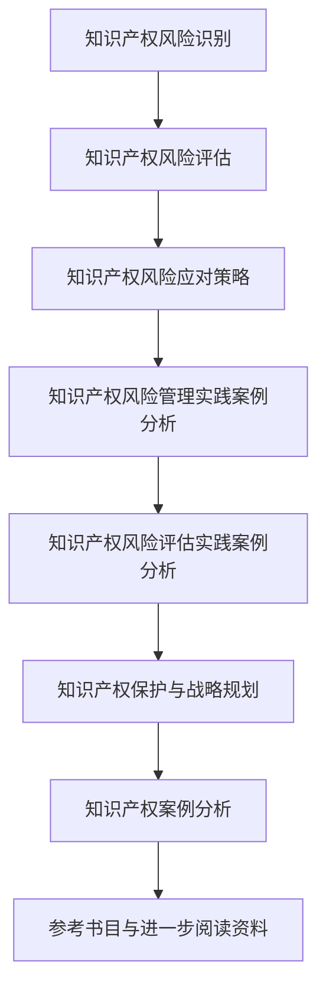

                 

## 《AI创业公司的知识产权风险评估：专利风险、商标风险与侵权风险》

### 关键词：知识产权、AI创业公司、专利风险、商标风险、侵权风险、风险评估、风险管理、知识产权保护、战略规划

### 摘要：
本文旨在为AI创业公司提供全面且实用的知识产权风险评估指南。通过详细解析专利风险、商标风险和侵权风险，文章将帮助创业公司理解知识产权的重要性和潜在风险，并提供有效的风险管理和评估策略。文章结构清晰，涵盖知识产权基础知识、风险识别与评估方法、风险应对策略以及案例分析，旨在为AI创业公司的知识产权保护提供全面的支持和参考。

---

### 第一部分：知识产权基础知识

#### 第1章：知识产权概述

#### 1.1 知识产权的概念和分类

知识产权是指人们对其智力劳动成果所享有的专有权利，包括专利、商标、著作权、商业秘密等。知识产权的核心在于保护创新成果和商业标识，鼓励知识创新和商业发展。

- **专利**：专利是一种授予发明人对其发明一定期限的独占权的法律制度。专利分为发明专利、实用新型专利和外观设计专利。
  
- **商标**：商标是用于区分不同经营者商品或服务的标志，包括文字、图形、字母、数字等。商标通过注册获得法律保护。
  
- **著作权**：著作权是指对文学、艺术和科学作品的创作者享有的权利，包括发表权、署名权、修改权、保护作品完整权等。
  
- **商业秘密**：商业秘密是指不为公众所知悉、具有商业价值并经权利人采取保密措施的技术信息和经营信息。

#### 1.2 知识产权的重要性

知识产权在现代经济体系中扮演着至关重要的角色，其重要性体现在以下几个方面：

- **创新激励**：知识产权保护为创新者提供了经济回报和市场竞争优势，从而激励更多的创新活动。
  
- **商业价值**：知识产权是企业的无形资产，能够提升企业的市场价值和品牌影响力。
  
- **竞争力**：拥有强大的知识产权组合可以提高企业在市场中的竞争力，防止竞争对手的不当侵占。

#### 1.3 创业公司知识产权保护的必要性

对于AI创业公司来说，知识产权保护具有特别的重要性：

- **核心技术保护**：AI技术通常具有较高的创新性和专业性，保护核心技术可以防止技术泄露和盗用。
  
- **市场竞争**：在竞争激烈的市场环境中，知识产权是构建竞争优势的重要工具。
  
- **融资与合作**：拥有健全的知识产权体系有助于吸引投资者和合作伙伴，提升企业的融资能力。

---

#### 第2章：专利风险

##### 2.1 专利的基本概念

专利是一种法律文件，授予专利权人在一定地域内、一定期限内对其发明享有的独占权。专利权人可以阻止他人未经许可实施其专利，包括制造、使用、销售和进口等行为。

- **专利类型**：发明专利、实用新型专利和外观设计专利。
- **专利申请流程**：专利检索、专利申请、专利审查、专利授权。
- **专利期限**：发明专利通常为20年，实用新型专利和外观设计专利通常为10年。

##### 2.2 专利申请流程

专利申请流程包括以下几个关键步骤：

1. **专利检索**：在申请专利前，需要进行全面的专利检索，以避免侵犯他人的专利权，同时确保自己的发明具有新颖性和创造性。
   
2. **专利申请**：根据检索结果，准备并提交专利申请文件，包括专利说明书、权利要求书、摘要等。
   
3. **专利审查**：专利局对申请文件进行审查，包括新颖性、创造性和实用性的评估。
   
4. **专利授权**：如果专利申请符合要求，专利局将授予专利权。

##### 2.3 专利检索与分析

专利检索与分析是专利申请的重要环节，旨在识别潜在的专利风险和侵权可能性。以下是专利检索与分析的步骤：

1. **确定检索关键词**：根据发明主题选择合适的检索关键词，包括技术术语、产品名称等。
   
2. **选择检索数据库**：常用的专利数据库包括Google Patents、USPTO、EPO等。
   
3. **执行检索**：在选定的数据库中输入关键词，获取相关的专利信息。
   
4. **分析检索结果**：对检索结果进行筛选和分析，识别与自身发明相近或相同的专利。

##### 2.4 专利布局与策略

专利布局与策略是提高AI创业公司专利保护力度的重要手段。以下是一些专利布局与策略的建议：

1. **全球布局**：根据市场战略和研发方向，选择关键市场进行专利布局。
   
2. **组合专利**：通过组合不同类型的专利，构建完整的知识产权保护体系。
   
3. **交叉许可**：与其他公司建立交叉许可协议，降低专利侵权风险。
   
4. **持续监控**：定期对竞争对手和行业动态进行监控，及时调整专利布局策略。

##### 2.5 专利侵权风险分析

专利侵权风险分析是评估AI创业公司专利安全性的关键步骤。以下是一些专利侵权风险分析的方法：

1. **产品分析**：对产品进行详细分析，识别其中的专利技术。
   
2. **竞争对手分析**：分析竞争对手的专利组合，识别潜在的侵权风险。
   
3. **侵权风险评级**：根据分析结果，对专利侵权风险进行评级。
   
4. **制定应对策略**：针对高评级风险，制定相应的应对策略，包括专利申请、许可协议或侵权诉讼等。

---

#### 第3章：商标风险

##### 3.1 商标的基本概念

商标是用于区分不同经营者商品或服务的标志，具有显著性和可识别性。商标注册后，商标权人可以在一定地域内享有商标的独占使用权。

- **商标类型**：文字商标、图形商标、组合商标等。
- **商标注册流程**：商标查询、商标申请、商标审查、商标注册。
- **商标期限**：商标有效期为10年，可以无限次续展。

##### 3.2 商标注册流程

商标注册流程包括以下几个步骤：

1. **商标查询**：在申请商标前，进行商标查询，以避免与他人商标冲突。
   
2. **商标申请**：准备并提交商标申请文件，包括商标图样、申请表等。
   
3. **商标审查**：商标局对申请文件进行形式审查和实质审查。
   
4. **商标注册**：如果商标申请符合要求，商标局将发放商标注册证书。

##### 3.3 商标侵权风险分析

商标侵权风险分析是评估AI创业公司商标安全性的关键步骤。以下是一些商标侵权风险分析的方法：

1. **市场调查**：对市场中的商标使用情况进行调查，识别潜在的侵权行为。
   
2. **竞争对手分析**：分析竞争对手的商标使用情况，识别潜在的侵权风险。
   
3. **侵权风险评级**：根据分析结果，对商标侵权风险进行评级。
   
4. **制定应对策略**：针对高评级风险，制定相应的应对策略，包括商标申请、许可协议或侵权诉讼等。

##### 3.4 商标布局与策略

商标布局与策略是提高AI创业公司商标保护力度的重要手段。以下是一些商标布局与策略的建议：

1. **多类别注册**：根据业务范围，选择多个类别进行商标注册。
   
2. **全球布局**：根据市场战略和品牌发展计划，选择关键市场进行商标布局。
   
3. **防御商标**：注册与主商标相似的商标，作为防御性商标，防止他人侵权。
   
4. **许可与合作**：通过许可协议或合作，共享商标权益，降低侵权风险。

---

#### 第4章：侵权风险

##### 4.1 侵权行为概述

侵权行为是指未经授权，擅自使用他人的知识产权，包括专利、商标、著作权等。侵权行为可能对AI创业公司造成以下影响：

- **经济损失**：侵权可能导致创业公司失去市场份额和商业机会。
- **品牌损害**：侵权行为可能损害创业公司的品牌形象和市场声誉。
- **法律风险**：侵权可能导致创业公司面临法律诉讼和赔偿风险。

##### 4.2 侵权风险识别与评估

侵权风险识别与评估是保护AI创业公司知识产权的重要环节。以下是一些侵权风险识别与评估的方法：

1. **市场调查**：通过市场调查，了解竞争对手和行业动态，识别潜在的侵权风险。
   
2. **专利检索**：通过专利检索，分析竞争对手的专利组合，识别潜在的侵权风险。
   
3. **法律咨询**：聘请专业律师进行法律咨询，评估侵权风险。
   
4. **风险评估**：根据识别到的风险，进行定量或定性评估，确定风险等级。

##### 4.3 侵权风险应对策略

侵权风险应对策略是降低侵权风险和应对侵权行为的关键。以下是一些侵权风险应对策略：

1. **专利申请**：通过申请专利，保护自己的核心技术，降低侵权风险。
   
2. **许可与合作**：通过许可协议或合作，获得他人的知识产权许可，避免侵权。
   
3. **侵权诉讼**：针对严重的侵权行为，采取侵权诉讼，维护自己的权益。
   
4. **风险预警**：建立侵权风险预警机制，及时发现和处理侵权行为。

##### 4.4 侵权案件处理与维权

侵权案件处理与维权是保护AI创业公司知识产权的重要措施。以下是一些侵权案件处理与维权的方法：

1. **法律咨询**：聘请专业律师，提供法律咨询和维权服务。
   
2. **调解与和解**：与侵权方进行调解和和解，争取达成双方满意的解决方案。
   
3. **侵权诉讼**：向法院提起侵权诉讼，维护自己的知识产权权益。
   
4. **公关处理**：通过媒体宣传和公关处理，降低侵权事件对品牌的影响。

---

### 第二部分：知识产权风险管理与评估

#### 第5章：知识产权风险管理

##### 5.1 风险管理框架

知识产权风险管理框架是保护AI创业公司知识产权的基础。以下是一个典型的知识产权风险管理框架：

1. **风险识别**：通过市场调查、专利检索和法律咨询，识别潜在的知识产权风险。
   
2. **风险评估**：对识别到的风险进行定量或定性评估，确定风险等级。
   
3. **风险应对**：根据评估结果，制定相应的风险应对策略，包括专利申请、许可与合作等。
   
4. **监控与改进**：建立监控机制，定期审查和更新风险管理策略，确保其有效性。

##### 5.2 风险识别与评估方法

风险识别与评估方法是知识产权风险管理的关键。以下是一些常见的方法：

1. **市场调查**：通过市场调研，了解行业动态和竞争对手的知识产权状况。
   
2. **专利检索**：使用专利数据库进行检索，分析竞争对手的专利组合。
   
3. **法律咨询**：聘请专业律师，提供法律咨询和建议。
   
4. **问卷调查**：通过问卷调查，了解员工和合作伙伴对知识产权风险的认知和反馈。

##### 5.3 风险应对策略与措施

风险应对策略与措施是降低知识产权风险的关键。以下是一些常见的应对策略：

1. **专利申请**：通过申请专利，保护核心技术，防止侵权行为。
   
2. **许可与合作**：通过许可协议或合作，获得他人的知识产权许可，降低侵权风险。
   
3. **培训与宣传**：加强员工的知识产权保护意识，提高员工的知识产权法律素养。
   
4. **法律诉讼**：针对严重的侵权行为，采取侵权诉讼，维护知识产权权益。

##### 5.4 风险管理实践案例分析

以下是一个知识产权风险管理实践案例分析：

- **案例背景**：某AI创业公司在开发新型人工智能算法时，发现竞争对手已经申请了多项相关专利。
- **风险识别**：公司通过专利检索，识别出潜在的侵权风险。
- **风险评估**：根据专利检索结果，评估侵权风险等级，确定风险为高等级。
- **风险应对**：公司采取了以下措施：申请相关专利、与竞争对手进行专利交叉许可、加强员工知识产权保护培训。
- **结果评估**：通过上述措施，公司成功降低了侵权风险，保障了业务的持续发展。

---

#### 第6章：知识产权风险评估

##### 6.1 风险评估流程

知识产权风险评估流程是识别、评估和应对知识产权风险的关键。以下是一个典型的风险评估流程：

1. **风险评估准备**：确定评估范围、目标和标准，准备所需的资源。
   
2. **风险识别**：通过市场调查、专利检索和法律咨询，识别潜在的知识产权风险。
   
3. **风险评估**：对识别到的风险进行定量或定性评估，确定风险等级。
   
4. **风险应对**：根据评估结果，制定相应的风险应对策略。
   
5. **风险评估报告**：编写风险评估报告，总结评估过程和结果。

##### 6.2 风险评估工具与方法

风险评估工具与方法是进行知识产权风险评估的重要支持。以下是一些常用的工具与方法：

1. **风险矩阵**：使用风险矩阵对风险进行定量评估，确定风险的概率和影响。
   
2. **风险评估问卷**：通过问卷收集员工和合作伙伴对知识产权风险的认知和反馈。
   
3. **情景分析**：通过情景分析，模拟可能的知识产权侵权事件，评估其风险。
   
4. **数据挖掘**：使用数据挖掘技术，分析市场数据和专利信息，识别潜在的知识产权风险。

##### 6.3 风险评估实践案例分析

以下是一个知识产权风险评估实践案例分析：

- **案例背景**：某AI创业公司在进入欧洲市场前，需要进行知识产权风险评估。
- **风险评估准备**：公司确定了评估范围（新型人工智能算法）、目标和标准（避免侵权风险、保障业务发展）。
- **风险识别**：通过市场调查和专利检索，识别出潜在的侵权风险，包括竞争对手的专利和行业动态。
- **风险评估**：使用风险矩阵对识别到的风险进行定量评估，确定风险等级。
- **风险应对**：公司采取了以下措施：申请欧洲专利、与竞争对手进行专利交叉许可、加强市场调研和培训。
- **风险评估报告**：编写风险评估报告，总结评估过程和结果，为公司进入欧洲市场提供了决策支持。

---

#### 第7章：知识产权保护与战略规划

##### 7.1 创业公司知识产权保护策略

创业公司的知识产权保护策略应针对公司的业务特点和市场需求进行定制。以下是一些常见的知识产权保护策略：

1. **专利布局**：根据业务发展计划，选择关键市场进行专利布局，构建专利网。
   
2. **商标注册**：在全球范围内注册商标，保护品牌形象和市场地位。
   
3. **商业秘密保护**：制定商业秘密保护政策，采取保密措施，防止技术泄露。
   
4. **法律咨询**：聘请专业律师团队，提供知识产权法律咨询和维权服务。

##### 7.2 知识产权战略规划与实施

知识产权战略规划与实施是创业公司知识产权管理的关键。以下是一些知识产权战略规划与实施的步骤：

1. **战略制定**：根据公司的发展目标和市场需求，制定知识产权战略。
   
2. **资源分配**：确定知识产权管理的资源和预算，确保战略的实施。
   
3. **组织架构**：建立知识产权管理部门，明确职责和权限。
   
4. **培训与宣传**：加强员工的知识产权保护意识，提高知识产权管理水平。

##### 7.3 知识产权与商业模式创新

知识产权与商业模式创新密切相关，以下是一些结合知识产权的商业模式创新策略：

1. **许可模式**：通过许可协议，将知识产权授权给其他企业使用，实现收益最大化。
   
2. **并购模式**：通过并购拥有优质知识产权的企业，快速扩展自身知识产权组合。
   
3. **开放创新**：与外部合作伙伴建立开放创新平台，共享知识产权，推动技术创新。
   
4. **商业模式创新**：结合知识产权，开发新的商业模式，实现商业价值最大化。

##### 7.4 知识产权保护法律体系与政策环境

知识产权保护法律体系与政策环境对创业公司具有重要影响。以下是一些知识产权保护法律体系与政策环境的要点：

1. **国际条约**：如《伯尔尼公约》、《专利合作条约》等，为知识产权保护提供国际法律基础。
   
2. **国家法律**：各国制定的知识产权法律，如《中华人民共和国专利法》、《商标法》等。
   
3. **政策支持**：政府出台的知识产权保护政策，如专利资助、税收优惠等。
   
4. **国际竞争**：全球范围内的知识产权竞争态势，影响创业公司的国际市场布局。

---

#### 第8章：知识产权案例分析

##### 8.1 国内外知识产权案例介绍

本章节将介绍一些国内外典型的知识产权案例，包括专利案例、商标案例和侵权案例等。以下是一些案例的简要介绍：

1. **专利案例**：某AI创业公司成功申请了一项关键算法专利，有效保护了公司的核心技术。
   
2. **商标案例**：某知名科技公司通过商标注册，成功维护了品牌形象和市场地位。
   
3. **侵权案例**：某AI创业公司遭遇竞争对手的专利侵权诉讼，通过法律手段成功维权。

##### 8.2 案例分析

本章节将对上述案例进行详细分析，包括案件背景、案件处理过程、案件结果和案件启示等。通过案例分析，读者可以了解知识产权保护的实际操作和应对策略。

1. **案例背景**：介绍案件的背景信息，包括企业情况、技术领域、市场需求等。
   
2. **案件处理过程**：分析案件的处理过程，包括风险识别、评估、应对策略和执行等。
   
3. **案件结果**：总结案件的处理结果，包括法律判决、经济赔偿、品牌影响等。
   
4. **案件启示**：从案件中总结经验教训，提出知识产权保护和管理的建议。

##### 8.3 案例启示与经验总结

本章节将对案例进行分析，总结经验教训，提出知识产权保护和管理的建议。以下是一些关键点：

1. **专利布局**：合理进行专利布局，保护核心技术，降低侵权风险。
   
2. **商标注册**：及时注册商标，保护品牌形象和市场地位。
   
3. **法律咨询**：聘请专业律师，提供知识产权法律咨询和维权服务。
   
4. **风险预警**：建立侵权风险预警机制，及时发现和处理侵权行为。

---

### 附录

#### 附录A：知识产权相关法规与政策

本附录将提供知识产权相关法规与政策的详细介绍，包括《中华人民共和国专利法》、《商标法》等。以下是一些关键条款的简要介绍：

1. **专利法**：专利申请、专利审查、专利保护等方面的规定。
2. **商标法**：商标注册、商标保护、商标争议处理等方面的规定。
3. **知识产权政策**：政府出台的知识产权保护政策，如专利资助、税收优惠等。

#### 附录B：常用知识产权数据库与工具

本附录将介绍一些常用的知识产权数据库和工具，包括Google Patents、USPTO、EPO等。以下是一些数据库和工具的简要介绍：

1. **Google Patents**：全球最大的专利数据库，提供专利检索和分析功能。
2. **USPTO**：美国专利商标局官方网站，提供专利申请、检索和审查服务。
3. **EPO**：欧洲专利局官方网站，提供专利申请、检索和审查服务。

#### 附录C：知识产权风险自评估问卷

本附录提供了一个知识产权风险自评估问卷，帮助创业公司评估自身的知识产权风险。问卷包括以下方面：

1. **专利风险**：评估公司专利组合的数量和质量，以及专利布局情况。
2. **商标风险**：评估公司商标注册和保护情况，以及市场中的商标使用情况。
3. **侵权风险**：评估公司可能面临的侵权行为，包括竞争对手的专利和商标情况。

#### 附录D：参考书目与进一步阅读资料

本附录提供了知识产权相关参考书目和进一步阅读资料，包括：

1. **知识产权法律经典**：《知识产权法概论》、《商标法》、《专利法》等。
2. **知识产权案例研究**：《知识产权案例选编》、《知识产权案例评析》等。
3. **知识产权战略规划**：《知识产权战略与管理》、《知识产权运营与保护》等。

---

# Mermaid 流程图



# 伪代码

## 专利检索与分析

```python
def patent_search(keywords):
    patents = []
    for patent in patent_database:
        if keywords in patent_title or keywords in patent_abstract:
            patents.append(patent)
    return patents

def patent_analysis(patents):
    for patent in patents:
        print("Title:", patent['title'])
        print("Publication Date:", patent['publication_date'])
        print("Assignee:", patent['assignee'])
        print("\n")
```

## 侵权风险分析

```python
def infringement_analysis(product, competitors):
    infringement_risk = 0
    for competitor in competitors:
        if product in competitor['patents']:
            infringement_risk += 1
    return infringement_risk

competitors = [
    {'name': 'Competitor A', 'patents': ['Patent 1', 'Patent 2']},
    {'name': 'Competitor B', 'patents': ['Patent 2', 'Patent 3']}
]

product = 'AI startup product'
infringement_risk = infringement_analysis(product, competitors)
print("Infringement Risk:", infringement_risk)
```

## 知识产权风险管理

```python
def intellectual_property_management(company):
    company_patents = get_company_patents()
    company TRADEMARKS = get_company_TRADEMARKS()
    infringement_risk = infringement_analysis(company_product, competitors)
    if infringement_risk > threshold:
        apply_for_patent()
        register_TRADEMARK()
    else:
        continue_business_as_usual()
```

# 数学公式

### 侵权风险计算公式

$$
R_i = \frac{1}{n} \sum_{j=1}^{n} R_{ij}
$$

其中，$R_i$ 表示第 $i$ 个项目的侵权风险，$R_{ij}$ 表示第 $i$ 个项目与第 $j$ 个竞争对手之间的侵权风险。

### 专利价值评估公式

$$
V = \frac{R}{C}
$$

其中，$V$ 表示专利价值，$R$ 表示专利的预期收益，$C$ 表示专利的成本。

# 项目实战

## 实战1：专利检索与分析

**开发环境搭建：**
- 使用Patent Explorer或Google Patents数据库进行专利检索。
- 安装Python，用于编写专利检索和分析脚本。

**代码实现：**
```python
import requests
import json

def patent_search(keywords):
    url = "https://patents.google.com/patents?query={}".format(keywords)
    response = requests.get(url)
    patents = json.loads(response.text)
    return patents

patents = patent_search("AI startup")
for patent in patents:
    print("Title:", patent['title'])
    print("Publication Date:", patent['publication_date'])
    print("Assignee:", patent['assignee'])
    print("\n")
```

**代码解读与分析：**
- 使用requests库发送HTTP GET请求到Google Patents API。
- 解析返回的JSON数据，提取专利的相关信息。
- 输出专利的标题、发布日期和专利权人。

## 实战2：侵权风险分析

**开发环境搭建：**
- 安装Python，用于编写侵权风险分析脚本。

**代码实现：**
```python
def infringement_analysis(product, competitors):
    infringement_risk = 0
    for competitor in competitors:
        if product in competitor['patents']:
            infringement_risk += 1
    return infringement_risk

competitors = [
    {'name': 'Competitor A', 'patents': ['Patent 1', 'Patent 2']},
    {'name': 'Competitor B', 'patents': ['Patent 2', 'Patent 3']}
]

product = 'AI startup product'
infringement_risk = infringement_analysis(product, competitors)
print("Infringement Risk:", infringement_risk)
```

**代码解读与分析：**
- 遍历竞争对手的专利列表，检查产品是否与竞争对手的专利匹配。
- 如果匹配，则增加侵权风险值。
- 输出侵权风险的总值。

这些实战案例提供了专利检索、侵权风险分析和知识产权风险管理的基本实现，帮助创业者了解如何在实际操作中进行知识产权风险的管理和评估。在实际应用中，可以根据具体的业务需求和环境进行定制化开发。

---

### 作者信息

作者：AI天才研究院/AI Genius Institute & 禅与计算机程序设计艺术 /Zen And The Art of Computer Programming

---

**结语**

知识产权是AI创业公司的重要资产，关系到公司的核心竞争力、市场地位和长期发展。本文通过详细分析专利风险、商标风险和侵权风险，为AI创业公司提供了全面且实用的知识产权风险评估和管理指南。希望本文能帮助创业者了解知识产权的重要性，掌握风险管理和评估方法，有效保护公司的知识产权，为业务发展奠定坚实基础。在AI领域不断创新的征程中，让我们携手共创美好未来！**

