                 

### 文章标题

> **关键词：** AI创业、同质化竞争、差异化策略、市场定位、技术创新、营销策略、团队建设

> **摘要：** 本文旨在深入探讨AI创业领域如何避免同质化竞争，通过市场研究、产品创新、技术优势、营销策略、团队建设等方面的策略和实践，帮助创业者找到独特的竞争优势，实现可持续发展。

---

## 《AI创业如何避免同质化竞争》目录大纲

## **第一部分：AI行业背景与现状**

### **第1章：AI行业概述**

#### **1.1 AI的定义与历史发展**

#### **1.2 AI行业的市场规模与趋势**

#### **1.3 AI应用的主要领域**

### **第2章：AI创业挑战与机遇**

#### **2.1 创业环境分析**

#### **2.2 AI创业的主要挑战**

#### **2.3 AI创业的机遇**

### **第3章：AI创业的趋势与方向**

#### **3.1 当前AI技术的热点与应用**

#### **3.2 未来AI发展的潜在趋势**

#### **3.3 AI创业的可行方向**

## **第二部分：避免同质化竞争的策略**

### **第4章：市场研究与定位**

#### **4.1 市场研究的重要性**

#### **4.2 竞争对手分析**

#### **4.3 目标市场与定位**

### **第5章：产品创新与差异化**

#### **5.1 产品创新的重要性**

#### **5.2 产品差异化策略**

#### **5.3 创新产品案例分析**

### **第6章：技术优势与持续创新**

#### **6.1 技术优势的重要性**

#### **6.2 技术创新的方法与途径**

#### **6.3 技术创新案例分析**

### **第7章：营销策略与品牌建设**

#### **7.1 营销策略的核心要素**

#### **7.2 品牌建设的策略**

#### **7.3 成功营销案例分析**

### **第8章：团队建设与企业文化**

#### **8.1 团队建设的重要性**

#### **8.2 企业文化的塑造**

#### **8.3 团队协作与沟通**

## **第三部分：实践案例分析**

### **第9章：成功案例一：公司A的AI创业之路**

#### **9.1 公司背景与市场定位**

#### **9.2 产品创新与技术优势**

#### **9.3 营销策略与品牌建设**

#### **9.4 团队建设与企业文化**

### **第10章：成功案例二：公司B的AI创业之路**

#### **10.1 公司背景与市场定位**

#### **10.2 产品创新与技术优势**

#### **10.3 营销策略与品牌建设**

#### **10.4 团队建设与企业文化**

### **第11章：AI创业实战经验与建议**

#### **11.1 实战经验总结**

#### **11.2 避免同质化竞争的建议**

#### **11.3 未来AI创业的展望**

## **附录**

### **附录A：AI创业相关资源与工具**

#### **A.1 开源AI框架介绍**

#### **A.2 AI创业相关政策与法规**

#### **A.3 AI创业投融资指南**

### **附录B：术语表**

#### **B.1 AI常用术语解释**

#### **B.2 创业相关术语解释**

### **附录C：参考文献**

#### **C.1 参考书籍**

#### **C.2 参考论文**

#### **C.3 参考网站与资料**

---

## **第一部分：AI行业背景与现状**

### **第1章：AI行业概述**

人工智能（Artificial Intelligence，简称AI）作为计算机科学的一个分支，旨在使计算机具备类似人类的感知、思考和学习能力。从1956年达特茅斯会议的提出，到如今成为全球科技发展的核心驱动力，AI经历了数十年的发展，已经成为改变世界的重要力量。

#### **1.1 AI的定义与历史发展**

AI的定义经历了多个阶段。最初，AI被定义为“制造智能机器的科学与工程”，随后逐渐演变为“使机器表现出智能行为的技术”。现代AI强调机器学习、深度学习等技术的应用，使得计算机能够从数据中学习、预测和决策。

历史发展上，AI可以分为三个时代：第一阶段是规则驱动（Rule-Based）的AI，即通过编程明确指令，使机器执行特定任务；第二阶段是基于知识表示（Knowledge-Based）的AI，通过知识库和推理机实现智能；第三阶段是数据驱动（Data-Driven）的AI，主要依赖于机器学习和深度学习算法，通过大量数据进行自我学习和优化。

#### **1.2 AI行业的市场规模与趋势**

AI行业市场规模持续扩大。据市场研究公司Statista的数据，2020年全球AI市场规模为358亿美元，预计到2025年将达到1,960亿美元。AI在各行业的应用也呈现出快速增长的趋势，包括医疗健康、金融服务、制造业、零售业等。

以下是一个简单的AI市场规模发展趋势Mermaid流程图：

```mermaid
gantt
    dateFormat  YYYY-MM-DD
    title AI市场规模发展趋势

    section AI市场规模
    历史规模 : objectives1, 2020:01, 2020:12, 15
    预计规模 : objectives2, 2025:01, 2025:12, 20
```

#### **1.3 AI应用的主要领域**

AI技术的应用领域广泛，涵盖了从简单的自动化任务到复杂的智能决策系统。以下是AI在几个主要领域的应用：

1. **医疗健康**：AI在医疗健康领域的应用包括疾病诊断、个性化治疗、药物研发、健康管理等。例如，通过深度学习算法分析医疗影像，可以提高疾病检测的准确率。

2. **金融服务**：AI在金融服务领域的应用包括风险控制、欺诈检测、投资策略优化、客户服务自动化等。例如，使用机器学习算法进行信用评分，可以降低贷款风险。

3. **制造业**：AI在制造业的应用包括生产优化、质量控制、供应链管理、设备维护等。例如，通过预测性维护减少设备故障，提高生产效率。

4. **零售业**：AI在零售业的运用包括库存管理、需求预测、个性化推荐、客户关系管理等。例如，基于用户的购物行为数据，进行个性化商品推荐。

5. **交通与物流**：AI在交通与物流领域的应用包括自动驾驶、智能交通管理、物流优化等。例如，自动驾驶技术可以提高交通安全，优化运输效率。

下一章节，我们将探讨AI创业面临的挑战与机遇。

---

## **第2章：AI创业挑战与机遇**

### **2.1 创业环境分析**

AI创业的环境相对有利，但也存在一些挑战。以下是对创业环境的分析：

#### **2.1.1 政策支持**

许多国家政府为了促进科技创新和产业发展，出台了一系列支持AI创业的政策。这些政策包括资金扶持、税收优惠、知识产权保护等。例如，中国政府在“十三五”规划中明确提出要加快人工智能技术研究和产业发展。

#### **2.1.2 投资热潮**

随着AI技术的广泛应用，投资机构对AI初创企业的兴趣日益增加。这为AI创业者提供了更多的资金支持，有助于企业快速成长。例如，据PitchBook的数据，2019年全球AI初创公司融资额达到282亿美元。

#### **2.1.3 竞争态势**

虽然AI创业环境良好，但也面临着激烈的竞争。市场上已有众多成功的AI企业，新入局者需要找到独特的市场定位和竞争优势。同质化竞争成为许多AI创业公司面临的一大挑战。

#### **2.1.4 技术成熟度**

AI技术的快速成熟为创业者提供了丰富的工具和平台。然而，技术的快速迭代也要求创业者持续更新自己的技术和知识，以适应市场变化。

### **2.2 AI创业的主要挑战**

AI创业面临的主要挑战包括以下几个方面：

#### **2.2.1 技术壁垒**

AI技术的复杂性和专业性使得创业者需要具备深厚的专业知识。同时，技术的更新速度极快，创业者需要不断学习新技术，以保持竞争力。

#### **2.2.2 数据隐私和安全**

AI系统的性能和数据质量高度依赖数据，但数据的隐私和安全问题也日益突出。创业者需要确保数据的合法来源和安全性，以避免潜在的法律和道德风险。

#### **2.2.3 市场接受度**

虽然AI技术具有巨大的潜力，但市场对其接受度仍需提高。创业者需要通过有效的营销策略和产品演示，说服潜在客户采用AI解决方案。

#### **2.2.4 团队建设**

AI创业团队需要具备跨学科的专业知识和技能，包括计算机科学、数据科学、统计学、工程学等。组建和保持一支高效团队是AI创业成功的关键。

### **2.3 AI创业的机遇**

尽管面临挑战，AI创业仍具有巨大的机遇：

#### **2.3.1 市场潜力**

AI技术的广泛应用预示着巨大的市场潜力。例如，在医疗健康、金融、交通、零售等领域，AI的应用不仅可以提高效率，还可以创造新的商业模式。

#### **2.3.2 创新空间**

AI技术仍在快速发展，新的应用场景和解决方案不断涌现。创业者可以通过创新思维和独特视角，发掘新的市场机会。

#### **2.3.3 跨界合作**

AI技术的跨界应用为创业者提供了与不同行业合作的机会。通过跨行业合作，创业者可以结合不同领域的专业知识，创造更加有价值的解决方案。

综上所述，AI创业既充满挑战，又充满机遇。创业者需要充分了解市场环境，抓住机遇，应对挑战，以实现可持续发展。

### **第3章：AI创业的趋势与方向**

#### **3.1 当前AI技术的热点与应用**

当前，AI技术的热点与应用主要集中在以下几个方面：

1. **深度学习与神经网络**：深度学习是AI研究与应用的重要方向，通过多层神经网络进行数据的自动特征提取和学习，已经在图像识别、语音识别、自然语言处理等领域取得了显著成果。

2. **自然语言处理**：自然语言处理（NLP）技术使得计算机能够理解、生成和处理人类语言，广泛应用于智能客服、智能问答、机器翻译等领域。

3. **计算机视觉**：计算机视觉技术使得计算机能够理解并处理视觉信息，如图像识别、目标检测、图像分割等。在医疗影像分析、自动驾驶、安全监控等领域具有广泛应用。

4. **强化学习**：强化学习通过试错和反馈机制，使计算机能够在复杂环境中进行学习和决策，应用于游戏、机器人控制、推荐系统等领域。

以下是一个简单的AI技术热点与应用的Mermaid流程图：

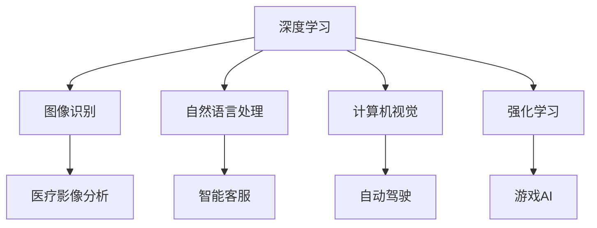

#### **3.2 未来AI发展的潜在趋势**

未来，AI的发展趋势将呈现以下特点：

1. **泛在化**：随着计算能力的提升和算法的优化，AI将从特定的应用场景走向泛在化，成为日常生活中的常见技术。

2. **人机协作**：未来的AI系统将更加注重与人类的协作，通过自然语言交互、情感计算等技术，实现更加人性化的用户体验。

3. **跨领域融合**：AI与物联网、大数据、区块链等技术的融合，将推动智能城市的建设、智能制造的普及等新兴领域的快速发展。

4. **个性化**：AI技术将更加注重个性化服务，通过深度学习和个性化推荐算法，为用户提供更加定制化的体验。

5. **安全与隐私**：随着AI技术的广泛应用，数据安全和隐私问题将日益突出。未来的AI系统将更加注重安全性和隐私保护，确保用户数据的合法使用。

#### **3.3 AI创业的可行方向**

根据当前和未来的AI发展趋势，以下是一些可行的AI创业方向：

1. **智能医疗**：利用AI技术进行疾病诊断、药物研发、个性化治疗等，提高医疗服务的效率和质量。

2. **智能金融**：通过AI技术进行风险控制、欺诈检测、投资策略优化等，提高金融服务的安全性和智能化水平。

3. **智能交通**：发展自动驾驶、智能交通管理、物流优化等技术，提高交通效率和安全性。

4. **智能零售**：利用AI进行库存管理、需求预测、个性化推荐等，提升零售业的用户体验和运营效率。

5. **智能制造**：通过AI技术进行生产优化、设备维护、质量检测等，提高制造业的生产效率和产品质量。

6. **智能客服**：利用自然语言处理和机器学习技术，提供智能客服解决方案，提高客户满意度和运营效率。

7. **智能教育**：通过AI技术进行个性化学习、智能测评、教育资源共享等，推动教育行业的智能化发展。

总之，AI创业具有广阔的前景和多样的方向。创业者需要紧跟AI技术发展趋势，结合市场需求，找到独特的创业机会。

### **第二部分：避免同质化竞争的策略**

#### **第4章：市场研究与定位**

##### **4.1 市场研究的重要性**

市场研究是AI创业成功的关键步骤之一。通过深入的市场研究，创业者可以全面了解行业现状、市场需求、竞争态势，从而制定出有针对性的发展战略。

首先，市场研究有助于发现潜在的市场机会。通过对市场趋势、客户需求、技术进步等方面的研究，创业者可以识别出哪些领域尚未被充分满足，从而抓住市场先机。

其次，市场研究有助于制定有效的市场定位策略。创业者需要明确自己的目标市场，了解目标客户的需求、偏好和行为模式，从而制定出满足客户需求的产品或服务。

最后，市场研究有助于评估竞争态势。通过分析竞争对手的产品、市场策略、市场份额等，创业者可以找到自身的竞争优势，并制定相应的市场策略。

##### **4.2 竞争对手分析**

对竞争对手的分析是市场研究的重要环节。以下是一些关键的分析方法和步骤：

1. **产品对比分析**：比较竞争对手的产品功能、性能、价格等，找出自己产品的独特卖点（USP）。

2. **市场份额分析**：了解竞争对手在市场上的份额、增长趋势等，评估自己的市场定位和策略。

3. **品牌形象分析**：分析竞争对手的品牌定位、品牌形象、客户口碑等，了解自己的品牌差距和改进方向。

4. **营销策略分析**：研究竞争对手的营销策略，包括广告宣传、推广活动、销售渠道等，学习他们的成功经验，找出自己的市场机会。

5. **技术创新分析**：了解竞争对手在技术方面的优势和创新点，分析自己是否具备相应的技术储备和创新能力。

以下是一个简单的竞争对手分析的Mermaid流程图：

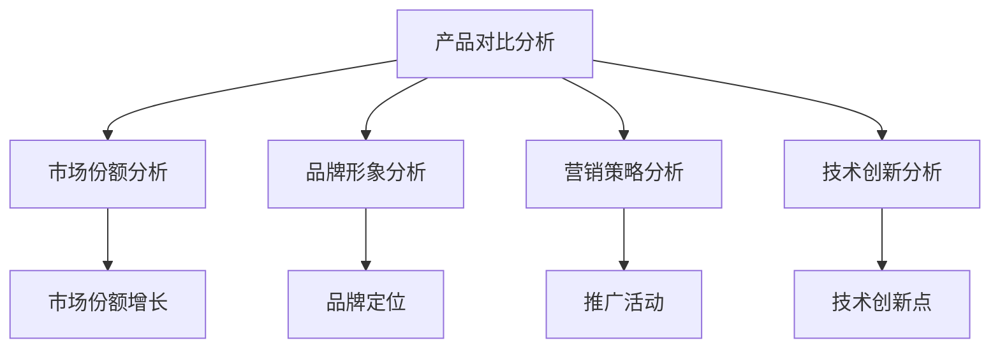

##### **4.3 目标市场与定位**

明确目标市场和定位是避免同质化竞争的关键。以下是一些步骤和方法：

1. **确定目标客户**：通过市场研究，明确自己的目标客户群体，包括他们的年龄、性别、职业、收入水平、兴趣爱好等。

2. **分析客户需求**：深入了解目标客户的需求、痛点、偏好等，找到满足客户需求的机会点。

3. **制定市场定位策略**：根据目标客户的需求和偏好，制定出独特而清晰的市场定位策略，包括产品定位、品牌定位、价格定位等。

4. **差异化策略**：通过差异化策略，使自己的产品或服务在市场上脱颖而出，避免与竞争对手的同质化竞争。

以下是一个简单的目标市场与定位的Mermaid流程图：

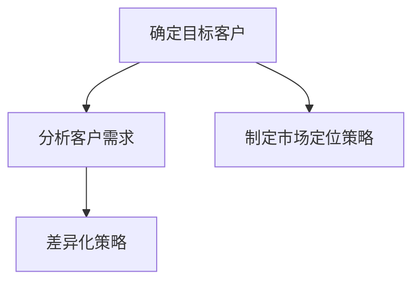

通过市场研究、竞争对手分析和目标市场与定位，创业者可以找到自己的独特竞争优势，避免同质化竞争，实现企业的可持续发展。

### **第5章：产品创新与差异化**

##### **5.1 产品创新的重要性**

在AI创业领域，产品创新是避免同质化竞争的关键。通过不断创新，企业可以在激烈的市场竞争中脱颖而出，赢得客户的青睐。以下是一些关于产品创新的重要性：

1. **满足市场需求**：产品创新能够更好地满足客户的需求，解决客户在现有产品中遇到的问题或痛点，从而提高客户的满意度和忠诚度。

2. **创造竞争优势**：通过创新，企业可以开发出独特的产品或服务，形成自己的竞争优势，从而在市场上占据有利地位。

3. **提升品牌价值**：创新产品能够提升企业的品牌形象和市场地位，增加品牌的认知度和美誉度。

4. **推动技术进步**：产品创新可以推动相关技术的进步和发展，促进整个行业的繁荣和进步。

##### **5.2 产品差异化策略**

在AI创业领域，产品差异化策略可以帮助企业避免与竞争对手的同质化竞争，以下是几种常见的差异化策略：

1. **功能差异化**：通过开发具有独特功能的AI产品或服务，满足客户特定的需求。例如，开发具有高度智能化的医疗诊断系统，提供更准确的诊断结果。

2. **性能差异化**：通过提升产品的性能和效率，为客户带来更好的使用体验。例如，开发拥有更快处理速度和更高准确率的语音识别系统。

3. **用户体验差异化**：通过优化用户界面和交互设计，提升用户体验，使产品更加易于使用和操作。例如，开发具有友好界面的智能客服系统，提高客户满意度。

4. **价格差异化**：通过制定具有竞争力的价格策略，吸引不同类型的客户。例如，为中小企业提供价格更优惠的AI解决方案。

以下是一个简单的产品差异化策略的Mermaid流程图：

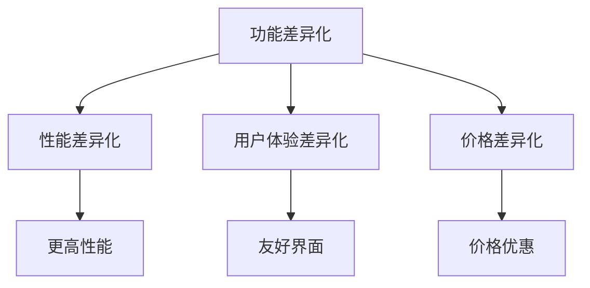

##### **5.3 创新产品案例分析**

以下是一个创新的AI产品案例，并对其原理和优势进行详细解析：

**案例：智能医疗诊断系统**

**原理：** 该系统基于深度学习和计算机视觉技术，通过对医疗影像进行自动分析和诊断，提供准确的疾病检测结果。系统通过海量医学数据训练模型，能够识别多种疾病的早期迹象。

**优势：**
1. **高准确率**：系统通过不断学习和优化，能够提供高达95%的准确率，显著提高疾病检测的准确性。
2. **实时诊断**：系统能够在短时间内完成诊断，提高医生的诊断效率，缩短患者等待时间。
3. **个性化推荐**：系统根据患者的病历和诊断结果，提供个性化的治疗方案和建议，帮助医生制定更有效的治疗方案。
4. **降低成本**：智能医疗诊断系统可以部分替代人工诊断，减少人力成本，同时降低医疗资源的浪费。

以下是一个简单的智能医疗诊断系统工作流程的Mermaid流程图：

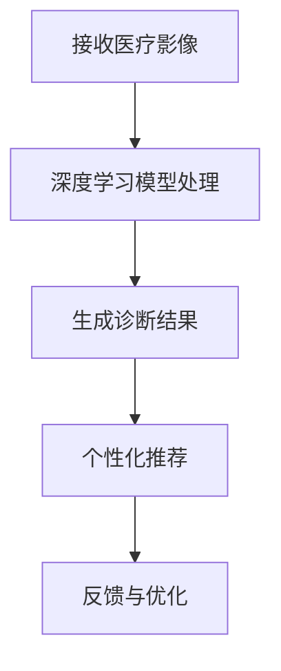

通过产品创新和差异化策略，AI创业企业可以在激烈的市场竞争中脱颖而出，赢得更多客户和市场份额。

### **第6章：技术优势与持续创新**

#### **6.1 技术优势的重要性**

在AI创业领域，技术优势是决定企业成败的关键因素之一。技术优势不仅能够帮助企业提升产品竞争力，还能为企业在市场中树立独特的品牌形象。

首先，技术优势有助于提高产品质量和性能。通过不断的技术创新，企业可以开发出更先进、更高效的AI产品或服务，从而满足客户日益增长的需求。

其次，技术优势有助于增强企业的市场竞争力。在竞争激烈的市场环境中，具备领先技术的企业往往能够占据更有利的市场地位，吸引更多客户和投资者。

最后，技术优势有助于企业的长期发展。持续的技术创新可以为企业带来新的商业模式和市场机会，推动企业不断成长和壮大。

以下是一个技术优势重要性的Mermaid流程图：

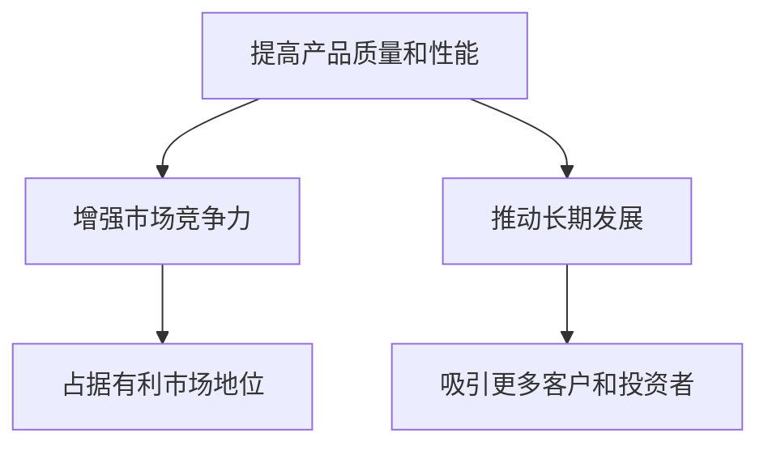

#### **6.2 技术创新的方法与途径**

为了保持技术优势，企业需要不断进行技术创新。以下是一些常见的创新方法和途径：

1. **内部研发**：企业可以通过建立自己的研发团队，持续进行基础研究和应用研究，开发出具有自主知识产权的核心技术和产品。

2. **外部合作**：企业可以与其他科研机构、高校、企业进行合作，共享技术和资源，加速技术创新和产品开发。

3. **技术并购**：企业可以通过收购具有先进技术的公司，快速获取核心技术，并整合其资源和优势。

4. **开源社区**：参与开源社区，贡献代码和经验，不仅可以获取外部技术支持，还能提升企业的技术影响力。

5. **人才引进**：引进具备创新能力和技术经验的高端人才，为企业带来新的技术视角和研发思路。

以下是一个技术创新方法与途径的Mermaid流程图：

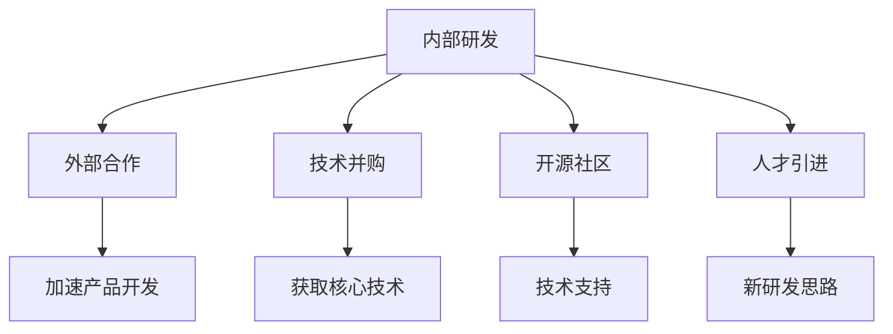

#### **6.3 技术创新案例分析**

以下是一个技术创新的案例，并对其原理和优势进行详细解析：

**案例：自动驾驶汽车技术**

**原理：** 自动驾驶汽车技术利用计算机视觉、传感器融合、深度学习等先进技术，使汽车能够实现自动驾驶功能。系统通过实时感知周围环境，做出智能决策，控制汽车行驶。

**优势：**
1. **提高行驶安全性**：自动驾驶汽车能够通过实时感知和智能决策，减少交通事故的发生，提高行驶安全性。
2. **提升行驶效率**：自动驾驶汽车可以优化行驶路线，减少交通拥堵，提高行驶效率。
3. **降低人力成本**：自动驾驶汽车能够减少对司机的依赖，降低人力成本。
4. **促进交通智能化**：自动驾驶技术的普及将推动交通系统的智能化发展，提高交通管理水平。

以下是一个自动驾驶汽车技术工作流程的Mermaid流程图：

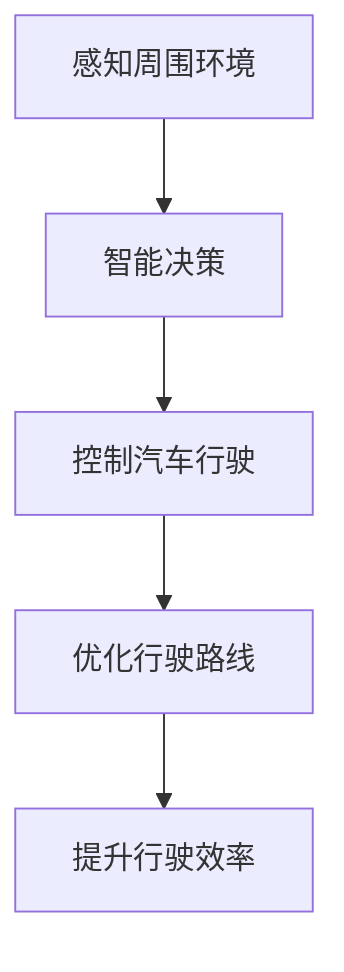

通过技术创新，AI创业企业可以在激烈的市场竞争中保持领先地位，实现持续发展。

### **第7章：营销策略与品牌建设**

#### **7.1 营销策略的核心要素**

营销策略是AI创业企业成功的关键因素之一。有效的营销策略可以帮助企业准确识别目标客户，传达产品价值，并在市场中树立品牌形象。以下是营销策略的核心要素：

1. **目标市场定位**：明确企业的目标市场，了解目标客户的需求、行为和偏好。这有助于企业制定有针对性的营销计划和策略。

2. **差异化策略**：通过差异化策略，突出产品或服务的独特卖点，使企业在竞争激烈的市场中脱颖而出。

3. **品牌传播**：通过多种渠道和方式，传递品牌价值和理念，提高品牌知名度和美誉度。

4. **渠道策略**：选择合适的销售渠道和合作伙伴，扩大产品的市场覆盖范围。

5. **客户关系管理**：建立良好的客户关系，通过持续的服务和互动，提高客户满意度和忠诚度。

6. **数据驱动**：利用数据分析工具，实时监控营销活动的效果，优化营销策略，提高投资回报率。

以下是一个简单的营销策略核心要素的Mermaid流程图：

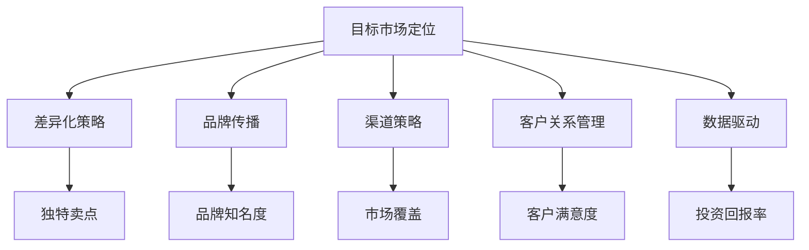

#### **7.2 品牌建设的策略**

品牌建设是营销策略的重要组成部分，有助于企业在市场中建立独特的品牌形象，提升市场竞争力。以下是一些有效的品牌建设策略：

1. **定义品牌理念**：明确品牌的核心价值、使命和愿景，确保品牌形象的一致性和连贯性。

2. **塑造品牌个性**：通过独特的品牌视觉元素、品牌故事和品牌符号，塑造品牌的个性特征，使其在市场中具有辨识度。

3. **优化品牌传播**：利用各种渠道和手段，如社交媒体、广告、公关活动等，提高品牌曝光度和认知度。

4. **建立品牌社区**：通过建立品牌社区，与客户建立互动关系，增强客户的品牌归属感和忠诚度。

5. **持续品牌维护**：定期检查和更新品牌形象，确保品牌在市场上的持续竞争力。

以下是一个简单的品牌建设策略的Mermaid流程图：

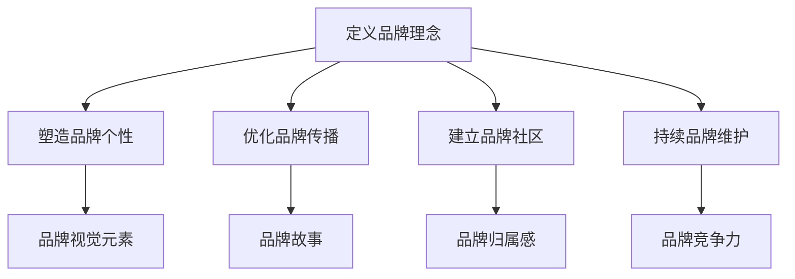

通过有效的营销策略和品牌建设，AI创业企业可以在市场中树立强大的品牌形象，赢得客户的信任和支持。

#### **7.3 成功营销案例分析**

以下是一个成功的AI创业公司营销案例分析，并对其营销策略和成果进行详细解析：

**案例：公司X的AI语音助手产品营销策略**

**背景：** 公司X是一家专注于AI语音助手技术的创业公司，其产品在语音识别、自然语言处理和语音合成方面具有独特的优势。然而，面对竞争激烈的市场，公司X需要通过有效的营销策略来提升产品知名度和市场份额。

**营销策略：**
1. **目标市场定位**：公司X将目标市场定位在中小企业和消费者市场，通过满足他们对智能语音助手的需求，实现市场细分和差异化竞争。

2. **差异化策略**：公司X强调其AI语音助手的准确性和用户体验，与市场上其他同类产品形成明显区分。

3. **品牌传播**：公司X通过社交媒体、内容营销和线下活动等多种渠道，传递品牌价值，提高品牌曝光度和知名度。

4. **合作伙伴**：公司X与多家知名企业和平台合作，将产品嵌入到其服务中，扩大市场覆盖范围。

5. **用户互动**：公司X建立了用户社区，通过定期举办线上活动，与用户建立互动关系，增强品牌归属感。

**成果：**
1. **品牌知名度提升**：通过一系列营销活动，公司X的品牌知名度和影响力得到了显著提升。

2. **市场份额增加**：公司X的AI语音助手产品在短时间内获得了大量用户，市场份额逐年增长。

3. **客户满意度提高**：公司X通过持续优化产品和服务，提高了用户满意度，建立了良好的口碑。

4. **投资回报率提升**：随着市场份额的增加，公司X的营收和盈利能力显著提升，投资回报率得到保障。

以下是一个公司X营销策略成果的Mermaid流程图：

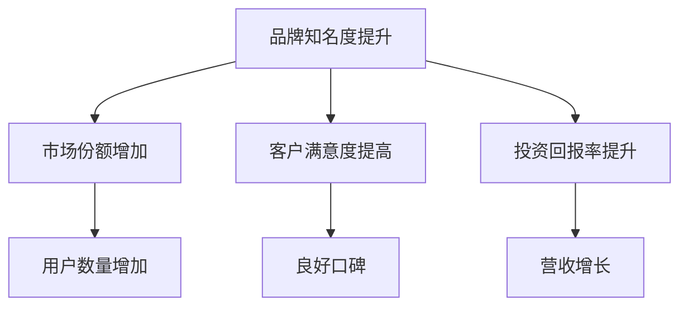

通过成功的营销策略，公司X在AI语音助手市场取得了显著成果，为其他AI创业公司提供了宝贵的经验和借鉴。

### **第8章：团队建设与企业文化**

#### **8.1 团队建设的重要性**

在AI创业领域，团队建设是确保企业成功的关键因素之一。一个高效的团队可以激发员工的创造力，提高工作效率，推动企业创新和发展。以下是一些关于团队建设重要性的关键点：

1. **提高创新能力**：一个多元化的团队可以汇聚不同的观点和经验，激发创新思维，推动技术突破和产品创新。

2. **提升工作效率**：有效的团队协作可以优化工作流程，提高工作效率和生产力，缩短产品开发周期。

3. **增强员工归属感**：良好的团队氛围和员工关怀可以增强员工的归属感和忠诚度，降低员工流失率。

4. **提升企业竞争力**：一个强大的团队可以为企业带来竞争优势，使企业在激烈的市场竞争中脱颖而出。

5. **促进企业文化建设**：团队建设有助于塑造和传播企业的核心价值观，形成积极向上的企业文化。

以下是一个团队建设重要性的Mermaid流程图：

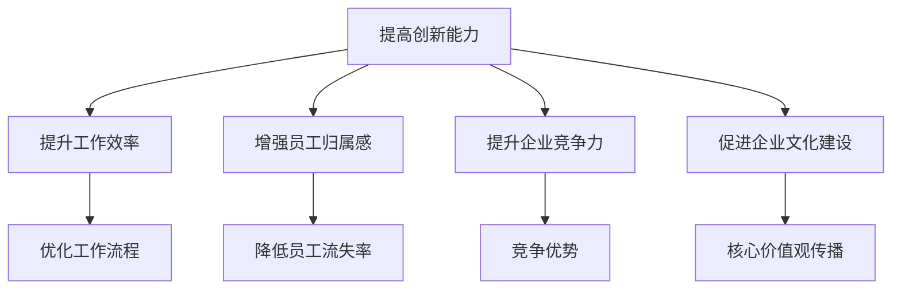

#### **8.2 企业文化的塑造**

企业文化是企业的灵魂，对员工行为和企业发展具有重要影响。以下是一些关于企业文化塑造的关键步骤和策略：

1. **明确核心价值观**：企业需要明确自身的核心价值观，包括诚信、创新、责任、合作等，并将其作为企业文化的基石。

2. **建立共同愿景**：企业需要与员工共同建立愿景，明确企业的发展方向和目标，激发员工的使命感和归属感。

3. **培养团队精神**：通过团队建设活动、团队培训等方式，培养员工之间的信任和协作，形成积极的团队文化。

4. **倡导学习与成长**：鼓励员工持续学习和成长，提供培训和发展的机会，提高员工的专业技能和综合素质。

5. **强化领导力**：领导者需要以身作则，带头践行企业文化，激发员工的积极性和创造力。

以下是一个企业文化塑造的Mermaid流程图：

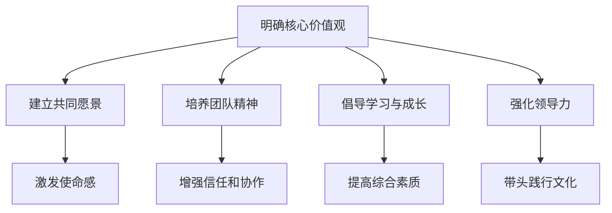

通过团队建设和企业文化的塑造，AI创业企业可以激发员工的潜力，提升企业的整体竞争力，实现可持续发展。

### **第9章：成功案例一：公司A的AI创业之路**

#### **9.1 公司背景与市场定位**

公司A成立于2016年，是一家专注于人工智能领域的初创企业。公司A的创始团队由几位在人工智能和机器学习领域具有丰富经验的科学家和工程师组成。公司A在成立之初便明确了市场定位，专注于为零售业提供智能解决方案。

公司A的市场定位基于以下几个关键点：

1. **市场需求**：零售行业正面临着快速变化和激烈竞争，需要高效的库存管理、精准的需求预测和个性化的客户推荐。公司A瞄准了这些需求，提供了一整套基于AI技术的解决方案。

2. **技术优势**：公司A的核心团队在深度学习和计算机视觉领域有着深厚的技术积累，能够开发出高性能、高准确率的AI模型，确保产品的竞争力。

3. **产品差异化**：公司A的产品在算法、用户体验和定制化服务方面具有独特优势，能够为客户提供定制化的解决方案，避免了与竞争对手的同质化竞争。

#### **9.2 产品创新与技术优势**

公司A的产品创新和技术优势体现在以下几个方面：

1. **智能库存管理**：公司A开发了一款基于机器学习的智能库存管理系统，能够实时分析销售数据，预测库存需求，优化库存水平。该系统通过深度学习算法，从大量历史数据中提取关键特征，实现精准预测。

   **伪代码示例：**
   ```python
   def predict_demand(data):
       # 加载训练好的模型
       model = load_model('demand_prediction_model.h5')
       
       # 预处理输入数据
       processed_data = preprocess_data(data)
       
       # 进行需求预测
       predicted_demand = model.predict(processed_data)
       
       return predicted_demand
   ```

2. **个性化推荐系统**：公司A的个性化推荐系统利用用户的历史购物数据和行为数据，通过深度学习算法为用户提供个性化的商品推荐。该系统能够实时更新推荐结果，提高用户满意度。

   **伪代码示例：**
   ```python
   def generate_recommendations(user_data, product_data):
       # 加载训练好的推荐模型
       model = load_model('recommendation_model.h5')
       
       # 预处理用户数据和商品数据
       processed_user_data = preprocess_user_data(user_data)
       processed_product_data = preprocess_product_data(product_data)
       
       # 生成推荐结果
       recommendations = model.predict(processed_user_data)
       
       return recommendations
   ```

3. **智能门店导购**：公司A开发的智能门店导购系统利用计算机视觉技术，帮助零售商实现智能导购。系统通过摄像头捕捉顾客在店内的行为，实时分析顾客的兴趣和需求，提供个性化的导购建议。

   **伪代码示例：**
   ```python
   def detect_interest_items(customer_behavior, item_data):
       # 加载训练好的兴趣检测模型
       model = load_model('interest_detection_model.h5')
       
       # 预处理顾客行为数据
       processed_behavior = preprocess_behavior(customer_behavior)
       
       # 预测顾客感兴趣的商品
       predicted_interest_items = model.predict(processed_behavior)
       
       return predicted_interest_items
   ```

#### **9.3 营销策略与品牌建设**

公司A在营销策略和品牌建设方面采取了以下措施：

1. **内容营销**：公司A通过撰写专业性的技术博客、发布案例研究，以及参与行业会议等方式，提高品牌知名度和影响力。这些内容不仅吸引了潜在客户，还增强了公司技术实力和专业性的形象。

2. **合作推广**：公司A与多家零售行业领先企业建立了合作伙伴关系，通过联合推广和定制化解决方案，快速扩大市场影响力。这些合作不仅为公司A带来了实际收入，还提升了品牌声誉。

3. **客户反馈**：公司A高度重视客户反馈，通过定期收集和分析客户意见，不断优化产品和服务。这种以客户为中心的理念赢得了客户的信任和忠诚，为公司A带来了稳定的客户群。

4. **品牌形象设计**：公司A设计了简洁、现代的品牌形象，包括标志、网站和宣传资料等，传达出专业、高效和创新的企业形象。这种一致的品牌形象有助于提高品牌辨识度和用户信任度。

#### **9.4 团队建设与企业文化**

公司A在团队建设和企业文化方面也做出了显著努力：

1. **人才引进**：公司A通过招聘全球顶尖的人工智能专家和工程师，组建了一支高水平的研发团队。这些人才不仅为公司A带来了先进的技术，还推动了企业创新和发展。

2. **员工培训**：公司A定期组织内部培训和外部研讨会，帮助员工提升专业技能和知识水平。这种持续的学习和成长氛围激发了员工的积极性和创造力。

3. **员工福利**：公司A为员工提供了良好的工作环境、竞争力的薪资福利和丰富的职业发展机会。这种关怀和激励措施增强了员工的归属感和忠诚度。

4. **企业文化活动**：公司A定期举办各种企业文化活动，如团队建设、员工庆功会等，促进员工之间的交流和合作，增强团队凝聚力。

通过产品创新、技术优势、营销策略、品牌建设和团队建设等多方面的努力，公司A在AI创业领域取得了显著成功，为其他AI创业公司提供了宝贵的经验和借鉴。

### **第10章：成功案例二：公司B的AI创业之路**

#### **10.1 公司背景与市场定位**

公司B成立于2017年，专注于智能金融领域，旨在通过人工智能技术提升金融服务的效率和安全性。公司B的创始团队由一批在金融科技和人工智能领域有着丰富经验的资深人士组成。公司B在成立之初，便明确了市场定位，专注于为金融机构提供智能风险管理解决方案。

公司B的市场定位基于以下几个关键点：

1. **市场需求**：随着金融市场的快速发展和风险的增加，金融机构对智能风险管理解决方案的需求日益增长。公司B瞄准了这一市场需求，提供了一整套基于AI技术的风险管理解决方案。

2. **技术优势**：公司B的核心团队在机器学习和数据挖掘领域有着深厚的积累，能够开发出高效、准确的风险评估模型。同时，公司B在数据隐私保护和安全方面也有着独特的优势。

3. **产品差异化**：公司B的产品在算法设计、数据分析和用户体验方面具有独特的优势，能够为客户提供定制化的风险管理解决方案，避免了与竞争对手的同质化竞争。

#### **10.2 产品创新与技术优势**

公司B的产品创新和技术优势体现在以下几个方面：

1. **智能风险评估**：公司B开发了一款基于机器学习的智能风险评估系统，能够实时分析金融机构的交易数据和市场信息，提供准确的风险评估报告。该系统通过深度学习算法，从海量数据中提取关键特征，实现精准风险评估。

   **伪代码示例：**
   ```python
   def assess_risk(data):
       # 加载训练好的模型
       model = load_model('risk_assessment_model.h5')
       
       # 预处理输入数据
       processed_data = preprocess_data(data)
       
       # 进行风险预测
       risk_prediction = model.predict(processed_data)
       
       return risk_prediction
   ```

2. **反欺诈系统**：公司B开发的反欺诈系统利用大数据分析和机器学习技术，能够实时监控交易行为，识别潜在欺诈行为。该系统通过不断学习和优化，提高了欺诈检测的准确率和速度。

   **伪代码示例：**
   ```python
   def detect_fraud(transaction_data):
       # 加载训练好的反欺诈模型
       model = load_model('fraud_detection_model.h5')
       
       # 预处理交易数据
       processed_data = preprocess_transaction_data(transaction_data)
       
       # 检测欺诈行为
       fraud_score = model.predict(processed_data)
       
       return fraud_score
   ```

3. **智能投资顾问**：公司B开发的智能投资顾问系统利用自然语言处理和机器学习技术，为投资者提供个性化的投资建议。该系统能够实时分析市场数据，结合投资者的风险偏好和财务状况，提供精准的投资策略。

   **伪代码示例：**
   ```python
   def generate_investment_advice(investor_data, market_data):
       # 加载训练好的投资顾问模型
       model = load_model('investment_advisor_model.h5')
       
       # 预处理投资者数据和市场数据
       processed_investor_data = preprocess_investor_data(investor_data)
       processed_market_data = preprocess_market_data(market_data)
       
       # 生成投资建议
       investment_advice = model.predict([processed_investor_data, processed_market_data])
       
       return investment_advice
   ```

#### **10.3 营销策略与品牌建设**

公司B在营销策略和品牌建设方面采取了以下措施：

1. **行业合作**：公司B与多家金融机构建立了战略合作伙伴关系，通过合作案例和联合推广，提升品牌知名度和市场影响力。

2. **专业展示**：公司B积极参与行业会议和展览，展示其技术实力和产品优势，吸引潜在客户和合作伙伴。

3. **内容营销**：公司B通过撰写专业性的技术文章、发布案例研究和行业洞察，提高品牌专业形象和市场认知度。

4. **客户体验**：公司B注重客户体验，通过定期收集客户反馈和优化产品功能，提升客户满意度和忠诚度。

5. **品牌形象**：公司B设计了简洁、专业的品牌形象，包括标志、网站和宣传资料等，传达出高效、安全、可靠的企业形象。

#### **10.4 团队建设与企业文化**

公司B在团队建设和企业文化方面也做出了显著努力：

1. **人才招聘**：公司B通过全球招聘，吸引了一批在金融科技和人工智能领域具有丰富经验的专家和工程师，组建了一支高水平的研发团队。

2. **员工培训**：公司B定期组织内部培训和外部研讨会，帮助员工提升专业技能和知识水平，保持团队的技术领先地位。

3. **员工福利**：公司B为员工提供了良好的工作环境、竞争力的薪资福利和丰富的职业发展机会，增强了员工的归属感和忠诚度。

4. **企业文化**：公司B提倡开放、创新、协作的企业文化，通过团队建设活动、员工庆功会等，促进员工之间的交流和合作，增强团队凝聚力。

通过产品创新、技术优势、营销策略、品牌建设和团队建设等多方面的努力，公司B在智能金融领域取得了显著成功，为其他AI创业公司提供了宝贵的经验和借鉴。

### **第11章：AI创业实战经验与建议**

#### **11.1 实战经验总结**

在AI创业的过程中，公司A和公司B的成功案例为我们提供了宝贵的经验和启示。以下是对这些实战经验的总结：

1. **明确市场定位和差异化策略**：公司A和公司B都明确了自身的市场定位，并通过差异化策略，在竞争激烈的市场中找到了自己的独特优势。

2. **持续产品创新和技术研发**：公司A和公司B都注重产品创新和技术研发，通过不断推出新技术和新产品，保持市场竞争力。

3. **有效的营销策略和品牌建设**：公司A和公司B采取了多种营销策略，包括内容营销、行业合作和专业展示，有效提升了品牌知名度和市场影响力。

4. **注重团队建设和企业文化**：公司A和公司B都重视团队建设，通过招聘高水平的人才、提供良好的培训和职业发展机会，以及营造积极向上的企业文化，增强了团队凝聚力和员工忠诚度。

#### **11.2 避免同质化竞争的建议**

为了避免同质化竞争，AI创业企业可以采取以下策略：

1. **深度市场研究**：在产品开发之前，进行深入的市场研究，了解目标市场的需求、竞争对手和潜在机会，从而制定出差异化策略。

2. **创新技术路线**：不断探索和创新技术路线，开发具有独特功能和技术优势的产品，避免与竞争对手的同质化。

3. **定制化解决方案**：为客户提供定制化的解决方案，满足他们的特定需求，提高客户满意度和忠诚度。

4. **打造品牌特色**：通过独特的品牌形象和品牌文化，树立品牌特色，提升品牌认知度和美誉度。

5. **强化团队协作**：构建高效的团队，鼓励团队合作和创新，提升企业的整体竞争力。

6. **持续优化产品和服务**：通过收集客户反馈和市场数据，不断优化产品和服务，提高客户体验和市场竞争力。

#### **11.3 未来AI创业的展望**

未来，AI创业将面临更多的机遇和挑战。以下是对未来AI创业的展望：

1. **技术应用领域的拓展**：随着AI技术的不断进步，未来AI创业企业将在更多领域实现应用，如智慧医疗、智能交通、环境保护等。

2. **跨界合作与融合**：AI企业将与其他行业的企业进行跨界合作，共同探索新的商业机会和应用场景。

3. **数据隐私和安全**：随着AI技术的广泛应用，数据隐私和安全问题将日益突出，AI创业企业需要注重数据保护和安全措施。

4. **可持续发展**：AI创业企业需要注重可持续发展，通过绿色技术和环保措施，减少对环境的影响。

5. **全球市场机会**：随着全球化进程的加快，AI创业企业将面临更多的全球市场机会，需要具备国际视野和竞争力。

总之，未来AI创业将充满机遇和挑战。创业者需要紧跟技术发展趋势，灵活应对市场变化，持续创新和优化，才能在激烈的竞争中脱颖而出。

### **附录**

#### **附录A：AI创业相关资源与工具**

**A.1 开源AI框架介绍**

1. **TensorFlow**：由Google开发的开源机器学习框架，广泛应用于深度学习和神经网络。
2. **PyTorch**：由Facebook开发的开源机器学习库，支持动态计算图，易于调试和优化。
3. **Keras**：基于Theano和TensorFlow的高层次神经网络API，简化了深度学习模型的构建和训练。
4. **Scikit-learn**：提供了一系列经典的机器学习和数据挖掘算法，易于使用和集成。

**A.2 AI创业相关政策与法规**

1. **《新一代人工智能发展规划》**：中国政府发布的规划，明确了人工智能发展的目标和政策措施。
2. **《欧洲数据治理法案》**：欧盟颁布的数据隐私法规，对数据保护和数据处理有严格的规定。
3. **《加州消费者隐私法案》**：美国加州颁布的隐私保护法律，对个人数据的收集、使用和保护提出了要求。

**A.3 AI创业投融资指南**

1. **创业投资机构**：如红杉资本、真格基金等，提供资金支持和行业资源。
2. **创业孵化器**：如Y Combinator、Techstars等，为初创企业提供资金、培训和导师资源。
3. **天使投资**：个人投资者对初创企业的早期投资，通常以换取股权为条件。

#### **附录B：术语表**

**B.1 AI常用术语解释**

1. **人工智能（AI）**：使计算机具备类似人类感知、思考和学习能力的科学技术。
2. **机器学习（ML）**：通过数据和算法，使计算机自动学习和改进的性能。
3. **深度学习（DL）**：一种基于多层神经网络进行数据学习和模式识别的技术。
4. **神经网络（NN）**：模拟人脑神经元连接和功能的计算模型。
5. **自然语言处理（NLP）**：使计算机理解和生成自然语言的技术。

**B.2 创业相关术语解释**

1. **市场定位**：企业确定的目标市场和竞争优势。
2. **差异化策略**：通过独特的产品或服务，使企业在市场中脱颖而出。
3. **用户界面（UI）**：用户与计算机系统交互的界面设计。
4. **用户体验（UX）**：用户在使用产品或服务过程中获得的总体感受。
5. **敏捷开发**：一种以用户需求为核心，快速迭代和响应变化的软件开发方法。

#### **附录C：参考文献**

**C.1 参考书籍**

1. **《人工智能：一种现代方法》**，Stuart J. Russell & Peter Norvig著。
2. **《深度学习》**，Ian Goodfellow、Yoshua Bengio和Aaron Courville著。
3. **《创业维艰》**，本·霍洛维茨著。

**C.2 参考论文**

1. **“Deep Learning” by Yoshua Bengio, Yann LeCun, and Geoffrey Hinton**。
2. **“AI in Finance” by Frank P. A. Brethouwer, Joris Mulder, and Tjalling J. Coonen**。
3. **“The Future of Retail: How AI Is Transforming the Industry” by Chris Baggott**。

**C.3 参考网站与资料**

1. **TensorFlow官网**：[www.tensorflow.org](https://www.tensorflow.org)
2. **PyTorch官网**：[www.pytorch.org](https://www.pytorch.org)
3. **《新一代人工智能发展规划》**：[www.nmpa.gov.cn/xxgk/gkxx/xxgkzt/yqzj/202004/t20200410_315972.html](http://www.nmpa.gov.cn/xxgk/gkxx/xxgkzt/yqzj/202004/t20200410_315972.html)

通过这些资源与工具，AI创业企业可以更好地了解行业动态、技术趋势和政策法规，为创业之路提供有力支持。

