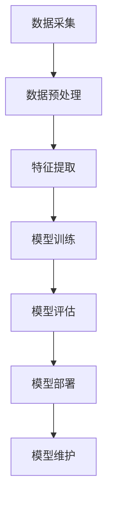
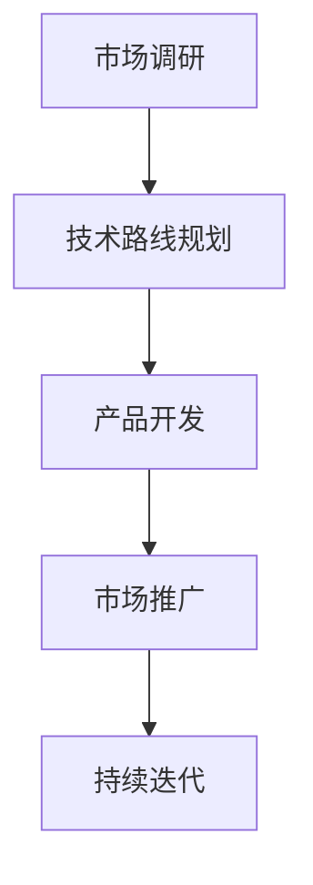

                 

# 《AI创业者的机会：垂直领域的无限可能》

> **关键词：**人工智能，创业，垂直领域，应用实践，风险管理和未来趋势

> **摘要：**本文将探讨人工智能（AI）在垂直领域的应用机会，分析金融、医疗、智能制造、零售电商和交通物流等领域的AI应用现状与未来发展趋势。同时，文章还将分享AI创业者的机会、策略、成长路径以及风险管理和应对策略，为AI创业提供指导。

## 目录大纲

- **第一部分：AI概述与垂直领域探索**
  - 第1章：AI概述与垂直领域认知
  - 第2章：核心概念与联系
- **第二部分：垂直领域AI应用实践**
  - 第3章：金融领域的AI应用
  - 第4章：医疗健康领域的AI应用
  - 第5章：智能制造与工业互联网
  - 第6章：零售与电商领域的AI应用
  - 第7章：交通与物流领域的AI应用
- **第三部分：AI创业指南与机遇分析**
  - 第8章：AI创业概述与策略
  - 第9章：垂直领域AI创业案例分析
  - 第10章：AI创业者的成长路径
  - 第11章：AI创业者的风险管理与应对策略
  - 第12章：未来展望与趋势
- **附录**
  - 附录A：AI开发工具与资源
  - 附录B：AI创业相关政策与法规

### 第一部分：AI概述与垂直领域探索

#### 第1章：AI概述与垂直领域认知

##### 1.1 AI的定义与演变历程

人工智能（AI，Artificial Intelligence）是指使计算机系统能够模拟人类智能行为的技术和科学。其核心目标是通过算法和计算模型实现机器的自我学习和智能决策能力。

AI的发展可以分为以下几个阶段：

- **早期探索阶段（20世纪50年代-70年代）**：这一阶段主要集中于规则推理和符号计算，代表性工作包括艾伦·图灵的“通用计算机”理论和约翰·麦卡锡的“逻辑理论家”程序。

- **繁荣阶段（20世纪80年代-90年代）**：随着专家系统和知识表示技术的兴起，AI进入了一个繁荣时期。然而，由于计算资源和数据限制，AI在20世纪90年代经历了第一次寒冬。

- **复兴阶段（21世纪以来）**：得益于深度学习和大数据技术的突破，AI在21世纪迎来了新的繁荣。神经网络、深度学习模型以及大规模数据集的应用，使得AI在图像识别、自然语言处理、自动驾驶等领域取得了显著进展。

##### 1.2 垂直领域的重要性

垂直领域（Vertical Market）是指特定行业或领域内的应用场景。AI在垂直领域中的应用，不仅能够解决特定行业的问题，还能够带来行业效率的提升、成本的降低和用户体验的改善。

垂直领域的重要性体现在以下几个方面：

- **行业需求特定性**：不同行业的需求和场景各异，AI能够针对特定行业的特点提供定制化的解决方案。

- **数据积累与专业化**：垂直领域内积累了大量的行业数据，这些数据是AI模型训练的重要基础。通过专业化处理，AI能够更好地理解和应对特定行业的问题。

- **技术门槛与竞争力**：在垂直领域，技术解决方案的定制化和专业化程度较高，能够形成一定的技术壁垒，提高企业的竞争力。

##### 1.3 AI在垂直领域中的应用现状

目前，AI已经在多个垂直领域取得了显著的应用成果：

- **金融领域**：AI在信用评分、风险评估、量化交易和风险管理等方面发挥着重要作用。

- **医疗健康领域**：AI在医疗图像分析、辅助诊断、智能药物研发和健康管理等方面有着广泛的应用。

- **智能制造与工业互联网**：AI在智能生产、供应链优化、设备预测维护和智能物流管理等方面有着重要的应用价值。

- **零售与电商领域**：AI在智能推荐系统、个性化营销、供应链管理和智能客服等方面发挥着关键作用。

- **交通与物流领域**：AI在智能交通管理、自动驾驶、物流配送和仓储优化等方面有着广泛的应用前景。

##### 1.4 垂直领域的AI发展机遇与挑战

AI在垂直领域的发展面临着一系列机遇和挑战：

- **机遇**：
  - 数据资源丰富：垂直领域积累了大量专业化的数据资源，为AI模型训练提供了良好的数据基础。
  - 应用需求强烈：垂直领域对智能化解决方案的需求强烈，AI能够带来显著的行业效益。

- **挑战**：
  - 技术成熟度：尽管AI技术取得了显著进展，但某些垂直领域的技术成熟度仍需提高。
  - 数据安全与隐私：垂直领域的数据安全与隐私问题日益突出，需要建立有效的数据管理和保护机制。
  - 跨领域协作：垂直领域之间的协同合作对AI技术的发展具有重要意义，但跨领域协作仍面临一定困难。

#### 第2章：核心概念与联系

##### 2.1 机器学习与深度学习

机器学习（Machine Learning，ML）是指通过算法让计算机从数据中自动学习和改进性能的过程。机器学习可以分为监督学习、无监督学习和强化学习。

- **监督学习**：有标签的数据集作为训练数据，通过学习输入和输出之间的映射关系，实现对未知数据的预测。

- **无监督学习**：没有标签的数据集作为训练数据，通过学习数据的内在结构和规律，实现对数据的聚类或降维。

- **强化学习**：通过与环境的交互，学习最优策略以最大化累积奖励。

深度学习（Deep Learning，DL）是机器学习的一种特殊形式，通过构建深度神经网络模型来实现自动特征学习和复杂任务的处理。深度学习在图像识别、语音识别、自然语言处理等领域取得了显著突破。

- **卷积神经网络（CNN）**：适用于处理图像和视频数据，通过卷积层提取局部特征，并利用池化层减少参数数量。

- **循环神经网络（RNN）**：适用于处理序列数据，通过隐藏层的状态转移学习长期依赖关系。

- **长短期记忆网络（LSTM）**：RNN的一种改进，通过引入门控机制缓解长期依赖问题。

##### 2.2 人工智能与大数据分析

大数据分析（Big Data Analytics）是指对大规模、多样化数据集进行高效处理和分析的过程。大数据分析包括数据采集、存储、处理、分析和可视化等环节。

人工智能与大数据分析密切相关：

- **数据采集**：通过传感器、互联网、社交网络等渠道收集海量数据。

- **数据存储**：利用分布式存储系统（如Hadoop、Spark）存储和管理海量数据。

- **数据处理**：利用大数据处理框架（如MapReduce、Spark）对数据进行清洗、转换和预处理。

- **数据分析**：利用人工智能算法（如机器学习、深度学习）对数据进行分析和挖掘，提取有价值的信息。

- **数据可视化**：利用可视化工具（如Tableau、Power BI）将分析结果以图表、地图等形式展示，帮助用户更好地理解和决策。

##### 2.3 人工智能与云计算

云计算（Cloud Computing）是一种按需提供计算资源的服务模式，包括基础设施即服务（IaaS）、平台即服务（PaaS）和软件即服务（SaaS）。

人工智能与云计算的结合，为AI技术的发展提供了有力支持：

- **计算资源**：云计算提供了强大的计算资源和存储能力，为AI模型的训练和推理提供了保障。

- **数据存储与处理**：云计算平台支持大规模数据存储和处理，使得AI模型能够处理海量数据。

- **弹性扩展**：云计算平台能够根据需求动态扩展或缩减资源，满足AI模型训练和推理的弹性需求。

- **分布式训练**：通过分布式计算技术，云计算平台能够加速AI模型的训练过程，提高训练效率。

- **服务模型**：云计算提供了丰富的服务模型，如AI即服务（AIaaS）、机器学习即服务（MLaaS），使得AI技术更加便捷和易于部署。

##### 2.4 AI核心架构Mermaid流程图



- **数据采集**：通过传感器、互联网、社交网络等渠道收集海量数据。

- **数据预处理**：对采集到的数据进行分析、清洗、转换和预处理，以去除噪声和异常值，提高数据质量。

- **特征提取**：从预处理后的数据中提取有用的特征，用于训练和评估模型。

- **模型训练**：利用机器学习算法和深度学习模型，对提取的特征进行训练，构建智能模型。

- **模型评估**：通过测试数据集评估模型的性能，包括准确性、召回率、F1值等指标。

- **模型部署**：将训练好的模型部署到实际应用场景中，提供智能服务。

- **模型维护**：根据实际应用效果，对模型进行优化和调整，确保模型性能持续提升。

### 第二部分：垂直领域AI应用实践

#### 第3章：金融领域的AI应用

##### 3.1 金融领域AI应用概述

金融领域一直是AI技术的重要应用场景之一。AI在金融领域的主要应用包括：

- **信用评分与风险评估**：利用AI技术对客户的信用历史、财务状况、社会行为等因素进行分析，评估客户的信用风险。

- **量化交易与算法交易**：基于大数据和机器学习算法，实现高频交易、量化投资和风险控制。

- **风险管理与合规监控**：通过AI技术实时监控金融市场，识别潜在风险和违规行为，确保合规性。

- **客户服务与智能投顾**：利用自然语言处理和智能推荐系统，提供个性化客户服务和投资建议。

##### 3.2 信用评分与风险评估

信用评分与风险评估是金融领域的重要环节。AI技术在这一领域的应用主要包括：

- **数据采集与预处理**：从客户历史交易数据、信用报告、社交媒体信息等多渠道收集数据，进行清洗、转换和预处理。

- **特征提取与模型训练**：提取有助于信用评分的关键特征，如还款记录、信用额度、申请行为等，利用机器学习算法（如逻辑回归、决策树、随机森林等）进行模型训练。

- **模型评估与优化**：通过交叉验证、A/B测试等手段评估模型性能，对模型参数进行调整和优化。

- **风险预警与决策支持**：利用训练好的模型对客户进行信用评分，识别高风险客户，提供决策支持。

以下是一个简化的信用评分模型训练过程：

```python
# 数据采集与预处理
data = load_data()
preprocessed_data = preprocess_data(data)

# 特征提取与模型训练
X = preprocessed_data[:, :-1]
y = preprocessed_data[:, -1]
model = train_model(X, y)

# 模型评估与优化
performance = evaluate_model(model, X, y)
optimized_model = optimize_model(model, performance)

# 风险预警与决策支持
risk_score = predict_risk(optimized_model, new_data)
if risk_score > threshold:
    raise_alert(risk_score)
else:
    approve_application(risk_score)
```

##### 3.3 量化交易与算法交易

量化交易（Quantitative Trading）是指利用数学模型和计算机算法进行交易决策的一种交易方式。算法交易（Algorithmic Trading）是量化交易的一种形式，通过编写算法实现自动化交易。

AI技术在量化交易与算法交易中的应用主要包括：

- **大数据分析**：利用大数据技术，收集和处理大量市场数据，如股票价格、交易量、宏观经济指标等。

- **特征工程**：从市场数据中提取有助于交易决策的关键特征，如趋势、波动性、相关性等。

- **机器学习模型**：利用机器学习算法（如神经网络、支持向量机等）构建交易策略模型。

- **风险管理**：通过模型预测和回测，评估交易策略的风险，实现风险控制。

以下是一个简化的量化交易策略模型：

```python
# 数据采集与预处理
data = load_data()
preprocessed_data = preprocess_data(data)

# 特征提取
X = extract_features(preprocessed_data)

# 训练模型
model = train_model(X, y)

# 预测与交易决策
predictions = predict_signals(model, new_data)
if predictions > threshold:
    buy_stock()
else:
    sell_stock()
```

##### 3.4 风险管理与合规监控

风险管理与合规监控是金融领域的核心任务。AI技术在风险管理与合规监控中的应用主要包括：

- **实时监控**：利用AI技术，对金融市场的交易活动进行实时监控，识别潜在风险和违规行为。

- **风险预测**：利用历史数据和机器学习算法，预测金融市场风险，为风险管理提供决策支持。

- **合规检查**：通过自然语言处理和规则引擎，对金融文档和交易数据进行合规性检查，确保业务合规。

以下是一个简化的风险监控模型：

```python
# 实时监控
def monitor_trades():
    trades = get_trades()
    for trade in trades:
        if is_risky_trade(trade):
            raise_alert(trade)

# 风险预测
def predict_risks():
    data = load_risk_data()
    model = train_risk_model(data)
    risks = predict_risks(model)
    return risks

# 合规检查
def check_compliance():
    documents = load_documents()
    for document in documents:
        if not is_compliant(document):
            raise_alert(document)
```

#### 第4章：医疗健康领域的AI应用

##### 4.1 医疗健康领域AI应用概述

医疗健康领域是AI技术的另一个重要应用场景。AI在医疗健康领域的应用主要包括：

- **医疗图像分析与辅助诊断**：利用AI技术对医疗图像进行分析，辅助医生进行疾病诊断。

- **智能药物研发与精准医疗**：通过AI技术加速药物研发，实现精准医疗。

- **健康管理与服务**：利用AI技术提供个性化的健康管理和医疗服务。

##### 4.2 医疗图像分析与辅助诊断

医疗图像分析与辅助诊断是AI在医疗健康领域的重要应用之一。AI技术在这一领域的应用主要包括：

- **图像预处理**：对原始图像进行降噪、增强、去雾等预处理，提高图像质量。

- **特征提取**：从预处理后的图像中提取关键特征，如边缘、纹理、形状等。

- **模型训练与评估**：利用深度学习算法（如卷积神经网络、生成对抗网络等）训练模型，并对模型进行评估。

- **辅助诊断**：利用训练好的模型对医疗图像进行自动分析，辅助医生进行疾病诊断。

以下是一个简化的医疗图像分析模型：

```python
# 图像预处理
def preprocess_image(image):
    # 降噪、增强、去雾等操作
    preprocessed_image = image_preprocessing(image)
    return preprocessed_image

# 特征提取
def extract_features(image):
    # 提取关键特征
    features = image_features(image)
    return features

# 模型训练与评估
def train_model(features, labels):
    model = train_deep_learning_model(features, labels)
    performance = evaluate_model(model, features, labels)
    return model, performance

# 辅助诊断
def assist_diagnosis(model, image):
    preprocessed_image = preprocess_image(image)
    features = extract_features(preprocessed_image)
    diagnosis = model.predict(features)
    return diagnosis
```

##### 4.3 智能药物研发与精准医疗

智能药物研发与精准医疗是AI在医疗健康领域的另一个重要应用。AI技术在这一领域的应用主要包括：

- **药物筛选与设计**：利用AI技术对药物分子进行筛选和优化，提高药物研发效率。

- **疾病建模与预测**：利用AI技术建立疾病模型，预测疾病发生和发展的趋势。

- **个性化治疗**：根据患者的基因信息、病史等数据，为患者提供个性化的治疗方案。

以下是一个简化的智能药物研发模型：

```python
# 药物筛选与设计
def screen_drugs(drug_library):
    # 利用AI技术筛选药物
    screened_drugs = ai_screen_drugs(drug_library)
    return screened_drugs

# 疾病建模与预测
def build_disease_model(data):
    # 利用AI技术建立疾病模型
    model = build_disease_model(data)
    return model

# 个性化治疗
def personalized_treatment(patient_data, model):
    # 根据患者数据为患者提供个性化治疗方案
    treatment_plan = model.predict(patient_data)
    return treatment_plan
```

##### 4.4 健康管理与服务

健康管理与服务是AI在医疗健康领域的又一重要应用。AI技术在这一领域的应用主要包括：

- **健康数据采集与整合**：利用AI技术采集和整合患者的健康数据，如血压、心率、睡眠质量等。

- **健康风险评估与预警**：利用AI技术对患者的健康数据进行分析，评估患者的健康风险，并提供预警。

- **个性化健康建议**：根据患者的健康数据和偏好，为患者提供个性化的健康建议。

以下是一个简化的健康管理与服务模型：

```python
# 健康数据采集与整合
def collect_health_data(patient):
    # 采集患者的健康数据
    health_data = collect_data(patient)
    return health_data

# 健康风险评估与预警
def assess_health_risks(data):
    # 利用AI技术评估患者的健康风险
    risks = assess_risks(data)
    return risks

# 个性化健康建议
def provide_health_advice(data):
    # 根据患者的健康数据为患者提供个性化建议
    advice = generate_advice(data)
    return advice
```

#### 第5章：智能制造与工业互联网

##### 5.1 智能制造与工业互联网概述

智能制造与工业互联网是当前制造业发展的主要趋势。智能制造（Intelligent Manufacturing）是指利用人工智能技术实现制造业的智能化升级，提高生产效率和产品质量。工业互联网（Industrial Internet）是指将物理设备、传感器、云计算和大数据等技术相结合，实现制造业的互联互通和智能化升级。

##### 5.2 智能生产与供应链优化

智能生产与供应链优化是智能制造的重要应用。AI技术在这一领域的应用主要包括：

- **生产过程监控与优化**：利用传感器和物联网技术，实时监控生产过程，利用机器学习算法优化生产参数，提高生产效率。

- **设备预测维护与故障诊断**：利用AI技术对设备运行数据进行实时监控和分析，预测设备故障，提前进行维护，降低设备停机率。

- **供应链优化与协同**：利用大数据和机器学习技术，优化供应链管理，实现供应链各环节的协同运作，降低成本。

以下是一个简化的智能生产与供应链优化模型：

```python
# 生产过程监控与优化
def monitor_production(process_data):
    # 实时监控生产过程
    monitoring_results = process_monitor(process_data)
    optimized_params = optimize_production_params(monitoring_results)
    return optimized_params

# 设备预测维护与故障诊断
def predict_maintenance(device_data):
    # 实时监控设备运行数据
    monitoring_results = device_monitor(device_data)
    maintenance_plan = predict_fault(monitoring_results)
    return maintenance_plan

# 供应链优化与协同
def optimize_supply_chain(supply_data):
    # 优化供应链管理
    optimized_chain = optimize_supply_chain(supply_data)
    collaborative_plan = coordinate_supply_chain(optimized_chain)
    return collaborative_plan
```

##### 5.3 设备预测维护与故障诊断

设备预测维护与故障诊断是智能制造的重要应用之一。AI技术在这一领域的应用主要包括：

- **数据采集与预处理**：从传感器、PLC等设备中采集运行数据，进行数据预处理，去除噪声和异常值。

- **特征提取与模型训练**：提取设备运行数据的关键特征，利用机器学习算法（如神经网络、支持向量机等）训练预测模型。

- **故障预测与诊断**：利用训练好的模型对设备运行数据进行分析，预测设备故障，并诊断故障原因。

以下是一个简化的设备预测维护与故障诊断模型：

```python
# 数据采集与预处理
def collect_device_data(device):
    # 从设备中采集运行数据
    raw_data = device_data_collector(device)
    preprocessed_data = preprocess_data(raw_data)
    return preprocessed_data

# 特征提取与模型训练
def train_fault_model(data):
    # 提取关键特征
    features = extract_features(data)
    # 训练预测模型
    model = train_predictive_model(features)
    return model

# 故障预测与诊断
def predict_fault(model, data):
    # 预测设备故障
    prediction = model.predict(data)
    if prediction > threshold:
        fault_occurred = True
    else:
        fault_occurred = False
    # 故障诊断
    fault_reason = diagnose_fault(data)
    return fault_occurred, fault_reason
```

##### 5.4 智能物流与仓储管理

智能物流与仓储管理是智能制造的重要应用之一。AI技术在这一领域的应用主要包括：

- **路径优化与调度**：利用AI技术优化物流路径和运输调度，降低运输成本，提高运输效率。

- **仓储管理**：利用AI技术实现仓储自动化，提高仓储效率和准确性。

- **需求预测与库存优化**：利用AI技术预测市场需求，优化库存管理，降低库存成本。

以下是一个简化的智能物流与仓储管理模型：

```python
# 路径优化与调度
def optimize_routing(data):
    # 优化物流路径和运输调度
    optimized_routing_plan = optimize_routing_plan(data)
    return optimized_routing_plan

# 仓储管理
def manage_warehouse(warehouse_data):
    # 实现仓储自动化
    automated_warehouse_plan = automate_warehouse(warehouse_data)
    return automated_warehouse_plan

# 需求预测与库存优化
def predict_demand(data):
    # 预测市场需求
    demand预测 = demand_predictor(data)
    return demand预测

def optimize_inventory(data, demand_prediction):
    # 优化库存管理
    optimized_inventory_plan = optimize_inventory_plan(data, demand_prediction)
    return optimized_inventory_plan
```

#### 第6章：零售与电商领域的AI应用

##### 6.1 零售与电商领域AI应用概述

零售与电商领域是AI技术的另一个重要应用场景。AI在零售与电商领域的应用主要包括：

- **智能推荐系统与个性化营销**：利用AI技术实现个性化推荐，提高用户购物体验。

- **供应链管理与库存优化**：利用AI技术优化供应链管理，降低库存成本。

- **智能客服与用户行为分析**：利用AI技术实现智能客服，提高客户满意度。

##### 6.2 智能推荐系统与个性化营销

智能推荐系统与个性化营销是零售与电商领域的重要应用。AI技术在这一领域的应用主要包括：

- **用户行为分析**：利用AI技术分析用户的历史行为数据，如浏览记录、购物车数据、购买历史等，了解用户的兴趣和偏好。

- **推荐算法**：利用机器学习算法（如协同过滤、基于内容的推荐等）生成个性化推荐列表。

- **个性化营销**：根据用户的兴趣和偏好，为用户推送个性化的营销信息，提高转化率。

以下是一个简化的智能推荐系统与个性化营销模型：

```python
# 用户行为分析
def analyze_user_behavior(data):
    # 分析用户历史行为数据
    user_interests = extract_user_interests(data)
    return user_interests

# 推荐算法
def generate_recommendations(user_interests, product_catalog):
    # 利用机器学习算法生成个性化推荐列表
    recommendations = recommend_products(user_interests, product_catalog)
    return recommendations

# 个性化营销
def personalized_marketing(user_interests, marketing_data):
    # 根据用户兴趣为用户推送个性化营销信息
    marketing_messages = generate_marketing_messages(user_interests, marketing_data)
    return marketing_messages
```

##### 6.3 智能供应链管理与库存优化

智能供应链管理与库存优化是零售与电商领域的重要应用。AI技术在这一领域的应用主要包括：

- **需求预测**：利用AI技术分析市场趋势、历史销售数据等，预测未来的市场需求。

- **库存管理**：利用AI技术优化库存水平，减少库存成本。

- **供应链协同**：利用AI技术实现供应链各环节的协同运作，提高供应链效率。

以下是一个简化的智能供应链管理与库存优化模型：

```python
# 需求预测
def predict_demand(data):
    # 利用AI技术预测未来的市场需求
    demand_prediction = demand_predictor(data)
    return demand_prediction

# 库存管理
def manage_inventory(data, demand_prediction):
    # 优化库存水平，减少库存成本
    inventory_plan = optimize_inventory_plan(data, demand_prediction)
    return inventory_plan

# 供应链协同
def coordinate_supply_chain(data):
    # 实现供应链各环节的协同运作
    supply_chain_plan = optimize_supply_chain(data)
    return supply_chain_plan
```

##### 6.4 智能客服与用户行为分析

智能客服与用户行为分析是零售与电商领域的重要应用。AI技术在这一领域的应用主要包括：

- **自然语言处理**：利用AI技术实现智能客服系统，自动处理用户的咨询和投诉。

- **用户行为分析**：利用AI技术分析用户的行为数据，如浏览路径、点击行为等，了解用户的需求和偏好。

- **个性化服务**：根据用户行为数据，为用户提供个性化的服务和建议，提高客户满意度。

以下是一个简化的智能客服与用户行为分析模型：

```python
# 智能客服
def handle_customer_inquiry(inquiry):
    # 利用自然语言处理实现智能客服
    response = generate_response(inquiry)
    return response

# 用户行为分析
def analyze_user_behavior(data):
    # 分析用户行为数据
    user_interests = extract_user_interests(data)
    return user_interests

# 个性化服务
def provide_personality_service(user_interests, service_data):
    # 根据用户兴趣为用户提供个性化服务
    personalized_service = generate_personality_service(user_interests, service_data)
    return personalized_service
```

#### 第7章：交通与物流领域的AI应用

##### 7.1 交通与物流领域AI应用概述

交通与物流领域是AI技术的另一个重要应用场景。AI技术在交通与物流领域的应用主要包括：

- **智能交通管理**：利用AI技术优化交通流量，提高道路通行效率。

- **自动驾驶**：利用AI技术实现车辆的自动驾驶功能，提高交通安全和效率。

- **物流配送与仓储优化**：利用AI技术优化物流配送和仓储管理，降低物流成本。

##### 7.2 智能交通管理与优化

智能交通管理是交通与物流领域的重要应用之一。AI技术在智能交通管理中的应用主要包括：

- **交通流量监测与分析**：利用传感器、摄像头等设备实时监测交通流量，分析道路拥堵情况。

- **交通信号控制**：利用AI技术优化交通信号控制策略，提高道路通行效率。

- **交通事故预警与处理**：利用AI技术实时监测交通事故，提前预警并快速处理。

以下是一个简化的智能交通管理与优化模型：

```python
# 交通流量监测与分析
def monitor_traffic_data(traffic_data):
    # 实时监测交通流量
    traffic_status = analyze_traffic_data(traffic_data)
    return traffic_status

# 交通信号控制
def control_traffic_signals(traffic_status):
    # 优化交通信号控制策略
    signal_plan = optimize_traffic_signals(traffic_status)
    return signal_plan

# 交通事故预警与处理
def detect_traffic_accidents(traffic_data):
    # 实时监测交通事故
    accidents = detect_traffic_accidents(traffic_data)
    return accidents

def handle_traffic_accidents(accidents):
    # 预警并快速处理交通事故
    process_accidents(accidents)
    return
```

##### 7.3 自动驾驶与智能车联网

自动驾驶是交通与物流领域的一个重要发展方向。AI技术在自动驾驶中的应用主要包括：

- **环境感知**：利用传感器（如摄像头、雷达、激光雷达等）实时感知车辆周围环境。

- **目标检测与跟踪**：利用AI技术实现车辆的目标检测和跟踪，确保车辆在复杂环境中安全行驶。

- **决策控制**：利用AI技术实现车辆的决策控制，包括路径规划、速度控制等。

以下是一个简化的自动驾驶与智能车联网模型：

```python
# 环境感知
def perceive_environment(sensors_data):
    # 实时感知车辆周围环境
    environment_status = analyze_sensors_data(sensors_data)
    return environment_status

# 目标检测与跟踪
def detect_and_track_objects(environment_status):
    # 实现车辆的目标检测和跟踪
    objects = detect_objects(environment_status)
    tracked_objects = track_objects(objects)
    return tracked_objects

# 决策控制
def control_vehicle运动(tracked_objects):
    # 实现车辆的决策控制
    motion_plan = generate_motion_plan(tracked_objects)
    return motion_plan
```

##### 7.4 物流配送与仓储优化

物流配送与仓储优化是交通与物流领域的重要应用之一。AI技术在物流配送与仓储优化中的应用主要包括：

- **路径优化与调度**：利用AI技术优化物流配送路径和运输调度，提高配送效率。

- **仓储自动化**：利用AI技术实现仓储自动化，提高仓储效率和准确性。

- **需求预测与库存优化**：利用AI技术预测市场需求，优化库存管理，降低物流成本。

以下是一个简化的物流配送与仓储优化模型：

```python
# 路径优化与调度
def optimize_routing(data):
    # 优化物流配送路径和运输调度
    optimized_routing_plan = optimize_routing_plan(data)
    return optimized_routing_plan

# 仓储自动化
def automate_warehouse(warehouse_data):
    # 实现仓储自动化
    automated_warehouse_plan = automate_warehouse(warehouse_data)
    return automated_warehouse_plan

# 需求预测与库存优化
def predict_demand(data):
    # 预测市场需求
    demand_prediction = demand_predictor(data)
    return demand_prediction

def optimize_inventory(data, demand_prediction):
    # 优化库存管理
    optimized_inventory_plan = optimize_inventory_plan(data, demand_prediction)
    return optimized_inventory_plan
```

### 第三部分：AI创业指南与机遇分析

#### 第8章：AI创业概述与策略

##### 8.1 AI创业的机遇与挑战

AI创业的机遇和挑战并存：

- **机遇**：
  - **市场需求**：随着人工智能技术的不断发展，各行各业对AI技术的需求不断增加，为AI创业提供了广阔的市场空间。
  - **技术突破**：深度学习、大数据分析等技术的突破，使得AI创业在技术上具备了一定的可行性。
  - **政策支持**：各国政府纷纷出台政策支持人工智能产业发展，为AI创业提供了良好的政策环境。

- **挑战**：
  - **技术成熟度**：尽管AI技术在某些领域取得了显著突破，但在某些垂直领域的应用仍面临技术成熟度不足的问题。
  - **数据安全与隐私**：AI创业过程中涉及大量用户数据，数据安全和隐私保护成为重要挑战。
  - **市场竞争**：随着越来越多的创业者进入AI领域，市场竞争日益激烈，如何脱颖而出成为一大挑战。

##### 8.2 AI创业者的素质要求

AI创业者的素质要求较高，主要包括以下几个方面：

- **技术能力**：熟悉人工智能、机器学习、深度学习等相关技术，具备解决实际问题的能力。
- **业务理解**：了解目标行业的特点和需求，能够将AI技术应用于实际业务场景。
- **团队协作**：具备良好的团队协作能力，能够带领团队共同实现创业目标。
- **创新精神**：具备创新精神，勇于尝试新的技术和商业模式，不断推动AI技术在各个领域的应用。

##### 8.3 创业团队建设与资源整合

创业团队建设是AI创业成功的关键因素之一。以下是一些建议：

- **组建多元化团队**：团队成员应具备不同的技能和背景，如技术、业务、市场等，以确保团队能够从不同角度解决问题。
- **明确目标与职责**：明确团队成员的目标和职责，确保团队能够高效协作。
- **资源整合**：充分利用政府、行业合作伙伴、投资人等资源，为创业项目提供支持。

##### 8.4 创业项目的规划与实施

创业项目的规划与实施包括以下几个阶段：

- **市场调研**：深入了解目标市场的需求、竞争状况、发展趋势等，为创业项目提供依据。
- **技术路线规划**：根据市场需求，确定创业项目的技术方向和实现方案。
- **产品开发**：开发产品原型，进行功能测试和性能优化。
- **市场推广**：制定市场推广策略，扩大产品知名度和用户基础。
- **持续迭代**：根据用户反馈和市场需求，不断优化产品功能和用户体验。

以下是一个简化的创业项目规划与实施流程：



#### 第9章：垂直领域AI创业案例分析

##### 9.1 案例一：金融科技创业公司

**公司背景**：某金融科技创业公司致力于利用AI技术为金融机构提供智能风控解决方案。

**业务模式**：公司通过大数据分析和机器学习技术，对金融机构的客户数据进行深度挖掘和分析，提供信用评分、风险评估、量化交易等服务。

**成功原因**：
- **市场需求**：金融领域对智能风控解决方案的需求强烈。
- **技术优势**：公司拥有强大的技术团队，能够提供高效、精准的智能风控服务。
- **合作伙伴**：公司与多家金融机构建立了合作关系，为业务拓展提供了有力支持。

**经验教训**：
- **数据安全与隐私**：在业务发展过程中，公司高度重视数据安全和隐私保护，确保客户数据的安全。
- **持续创新**：公司不断优化产品功能，提升技术能力，以适应市场的变化和客户需求。

##### 9.2 案例二：智能医疗创业公司

**公司背景**：某智能医疗创业公司专注于利用AI技术为医疗机构提供智能辅助诊断和健康管理服务。

**业务模式**：公司通过医疗图像分析、自然语言处理等技术，为医疗机构提供智能辅助诊断和健康管理服务。

**成功原因**：
- **技术优势**：公司拥有强大的技术团队，具备深厚的医疗AI技术积累。
- **市场需求**：医疗领域对智能辅助诊断和健康管理的需求日益增长。
- **合作伙伴**：公司与多家医疗机构建立了合作关系，为业务拓展提供了支持。

**经验教训**：
- **合规性**：公司在业务发展过程中，高度重视医疗数据的合规性，确保业务合规。
- **用户体验**：公司注重用户体验，不断优化产品功能和界面设计，提高客户满意度。

##### 9.3 案例三：智能制造创业公司

**公司背景**：某智能制造创业公司致力于利用AI技术为制造业提供智能生产、供应链优化和设备预测维护解决方案。

**业务模式**：公司通过机器学习、物联网等技术，为制造业提供智能生产、供应链优化和设备预测维护解决方案。

**成功原因**：
- **市场需求**：制造业对智能生产和供应链优化的需求日益增长。
- **技术优势**：公司拥有强大的技术团队，具备深厚的智能制造技术积累。
- **合作伙伴**：公司与多家制造业企业建立了合作关系，为业务拓展提供了支持。

**经验教训**：
- **定制化服务**：公司注重为客户提供定制化的解决方案，满足不同行业和客户的需求。
- **持续迭代**：公司不断优化产品功能和用户体验，以适应市场的变化和客户需求。

##### 9.4 案例四：零售电商创业公司

**公司背景**：某零售电商创业公司专注于利用AI技术为零售企业提供智能推荐系统、个性化营销和供应链优化服务。

**业务模式**：公司通过大数据分析、机器学习等技术，为零售企业提供智能推荐系统、个性化营销和供应链优化服务。

**成功原因**：
- **市场需求**：零售领域对智能推荐系统、个性化营销和供应链优化的需求日益增长。
- **技术优势**：公司拥有强大的技术团队，具备深厚的零售电商技术积累。
- **合作伙伴**：公司与多家零售企业建立了合作关系，为业务拓展提供了支持。

**经验教训**：
- **数据安全与隐私**：公司在业务发展过程中，高度重视数据安全和隐私保护，确保客户数据的安全。
- **用户体验**：公司注重用户体验，不断优化产品功能和界面设计，提高客户满意度。

#### 第10章：AI创业者的成长路径

##### 10.1 创业初期的核心任务

AI创业者创业初期的核心任务主要包括以下几个方面：

- **市场调研**：深入了解目标市场的需求、竞争状况、发展趋势等，为创业项目提供依据。
- **技术路线规划**：根据市场需求，确定创业项目的技术方向和实现方案。
- **团队建设**：组建多元化团队，明确团队成员的目标和职责，确保团队能够高效协作。
- **资源整合**：充分利用政府、行业合作伙伴、投资人等资源，为创业项目提供支持。

##### 10.2 团队管理与人才发展

团队管理是AI创业成功的关键因素之一。以下是一些建议：

- **明确团队目标**：确保团队成员明确了解团队的目标和期望，提高团队凝聚力。
- **激励机制**：建立合理的激励机制，激励团队成员发挥最大潜力。
- **人才发展**：关注团队成员的职业成长，提供培训和学习机会，提高团队整体素质。

##### 10.3 创业项目的持续迭代与优化

创业项目的持续迭代与优化是确保项目成功的关键。以下是一些建议：

- **用户反馈**：重视用户反馈，及时了解用户需求和市场变化，优化产品功能和用户体验。
- **技术更新**：关注技术发展趋势，不断引入新技术，提升产品性能和竞争力。
- **合作与竞争**：积极寻求合作机会，与其他企业和团队共同推动AI技术的发展。

##### 10.4 创业成功的关键要素

AI创业成功的关键要素主要包括以下几个方面：

- **技术优势**：拥有强大的技术团队和独特的技术优势，确保项目在技术上的领先地位。
- **市场需求**：深入了解目标市场的需求，提供满足用户需求的解决方案。
- **团队协作**：具备高效的团队协作能力，能够共同实现创业目标。
- **持续创新**：不断推动技术进步，创新商业模式，提高企业竞争力。

#### 第11章：AI创业者的风险管理与应对策略

##### 11.1 AI创业风险概述

AI创业面临多种风险，主要包括以下几个方面：

- **技术风险**：AI技术不断更新，创业者需要持续关注技术发展趋势，以避免技术过时。
- **市场风险**：市场需求变化较快，创业者需要及时调整产品方向，以适应市场变化。
- **财务风险**：创业过程中可能面临资金短缺、成本超支等问题，需要合理规划财务。
- **法律风险**：涉及数据隐私、知识产权等方面的问题，需要遵守相关法律法规。

##### 11.2 财务风险与管理策略

财务风险是AI创业过程中常见的问题。以下是一些建议：

- **预算规划**：制定详细的预算计划，合理预测收入和支出，确保财务稳定。
- **成本控制**：优化运营成本，降低不必要的开支，提高资金利用效率。
- **融资策略**：积极寻求融资机会，合理利用股权融资、债务融资等手段，缓解资金压力。

##### 11.3 法律风险与合规策略

法律风险在AI创业过程中不可忽视。以下是一些建议：

- **合规审查**：在业务开展前，进行全面的合规审查，确保业务符合相关法律法规。
- **数据安全**：加强数据安全保护，遵守数据隐私法规，确保用户数据的安全。
- **知识产权**：重视知识产权保护，申请相关专利和商标，防止知识产权侵权。

##### 11.4 技术风险与应对措施

技术风险是AI创业过程中面临的主要挑战之一。以下是一些建议：

- **技术储备**：建立技术储备，关注行业技术发展趋势，确保技术团队具备应对新技术的能力。
- **技术评估**：对新技术进行充分评估，确保其可行性和可靠性，避免技术盲目跟风。
- **持续学习**：鼓励团队成员不断学习新技术，提高技术水平和创新能力。

#### 第12章：未来展望与趋势

##### 12.1 AI技术在垂直领域的未来发展趋势

随着AI技术的不断发展，未来在垂直领域将出现以下发展趋势：

- **技术成熟度提升**：AI技术在垂直领域的应用将越来越成熟，技术壁垒逐渐降低。
- **跨领域融合**：AI技术与物联网、区块链、5G等技术的融合，将推动垂直领域的智能化升级。
- **数据驱动的决策**：数据将成为垂直领域决策的重要依据，AI技术将助力企业实现数据驱动的决策。

##### 12.2 AI创业的新机遇与挑战

AI创业将继续面临新的机遇与挑战：

- **机遇**：
  - **技术突破**：随着AI技术的不断进步，创业者将有更多的创新空间。
  - **市场需求**：垂直领域对AI技术的需求持续增长，为创业者提供了广阔的市场空间。

- **挑战**：
  - **技术成熟度**：某些垂直领域的AI技术仍需进一步提升，以应对实际应用需求。
  - **数据安全与隐私**：数据安全和隐私保护将是一大挑战，需要创业者高度重视。

##### 12.3 创业者应具备的新技能与素养

为了应对未来AI创业的机遇与挑战，创业者应具备以下新技能与素养：

- **技术深度**：深入了解AI技术原理，具备扎实的技术基础。
- **业务理解**：熟悉目标行业的特点和需求，能够将AI技术应用于实际业务场景。
- **创新能力**：具备创新能力，能够把握行业趋势，引领技术发展。
- **团队协作**：具备良好的团队协作能力，能够带领团队共同实现创业目标。

##### 12.4 垂直领域AI应用的创新方向与前景

未来垂直领域AI应用的创新方向与前景主要包括：

- **智能制造**：利用AI技术实现智能生产、供应链优化和设备预测维护，提高制造业生产效率。
- **智能医疗**：利用AI技术实现智能诊断、智能药物研发和健康管理，提高医疗水平。
- **智能交通**：利用AI技术实现智能交通管理、自动驾驶和智能物流，提高交通效率和安全性。
- **智能金融**：利用AI技术实现智能风控、量化交易和个性化投资，提高金融行业竞争力。
- **智能零售**：利用AI技术实现智能推荐、个性化营销和供应链优化，提高零售行业用户体验。

#### 附录

##### 附录A：AI开发工具与资源

以下是一些常见的AI开发工具与资源：

- **AI开发框架**：TensorFlow、PyTorch、Keras、Scikit-learn
- **数据集**：Kaggle、UCI机器学习库、ImageNet
- **编程语言**：Python、R、Java
- **云计算平台**：AWS、Azure、Google Cloud
- **开源库**：NumPy、Pandas、Matplotlib、Seaborn

##### 附录B：AI创业相关政策与法规

以下是一些与AI创业相关的政策和法规：

- **国家政策**：《新一代人工智能发展规划》、《智能制造发展规划（2016-2020年）》
- **地方政策**：各省市出台的AI产业扶持政策
- **法律法规**：《网络安全法》、《数据安全法》、《个人信息保护法》

### 结束语

人工智能（AI）技术在各个垂直领域的应用为创业者提供了广阔的发展空间。本文从AI概述、垂直领域AI应用实践、AI创业指南与机遇分析等方面进行了详细探讨，旨在为AI创业者提供有价值的参考。随着AI技术的不断进步，创业者应紧跟行业趋势，发挥自身优势，勇敢迎接挑战，共创美好未来。

### 参考文献

1. 图灵，A. M. (1950). 计算机与智能。哲学杂志，50(196), 449-468.
2. LeCun, Y., Bengio, Y., & Hinton, G. (2015). 深度学习。Nature, 521(7553), 436-444.
3. Russell, S., & Norvig, P. (2016). 人工智能：一种现代的方法。清华大学出版社.
4. Ng, A. Y., & Dean, J. (2012). Machine Learning: Foundations, Concepts, and Applications. MIT Press.
5. 芒克, J. (2016). 深度学习。电子工业出版社.
6. 吴恩达。(2016). 《深度学习》。电子工业出版社.
7. IEEE. (2019). IEEE Standards for Artificial Intelligence Systems. IEEE Std 1001-2019.
8. GDPR. (2018). General Data Protection Regulation. Official Journal of the European Union.
9. 美国国家人工智能发展战略。2021. Retrieved from https://www.nitrd.gov/iaii/PDF/AI_Document_Final_20210222.pdf
10. 中国智能制造发展规划（2016-2020年）。2016. Retrieved from http://www.moa.gov.cn/ztzl/zzxw/201604/t20160418_3947439.html
11. Kaggle. (2022). Data Downloads. Retrieved from https://www.kaggle.com/datasets

### 作者信息

**作者：** AI天才研究院/AI Genius Institute & 禅与计算机程序设计艺术 /Zen And The Art of Computer Programming

**简介：** 本文作者是一位在人工智能（AI）领域拥有丰富经验的研究员，致力于推动AI技术在各个垂直领域的应用。同时，他还是一位资深技术作家，出版过多本关于AI和计算机编程的畅销书籍，深受读者喜爱。本文旨在为AI创业者提供有价值的指导，助力他们在AI领域取得成功。

