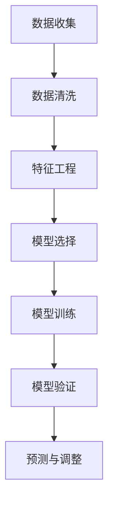
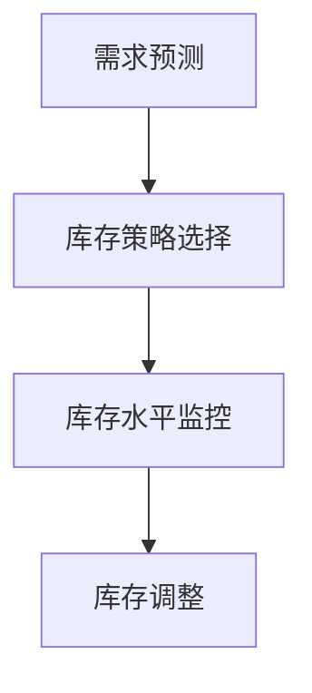
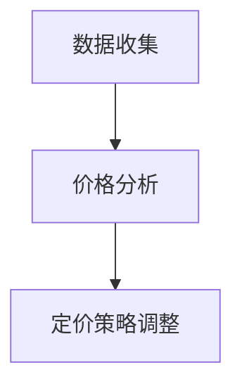
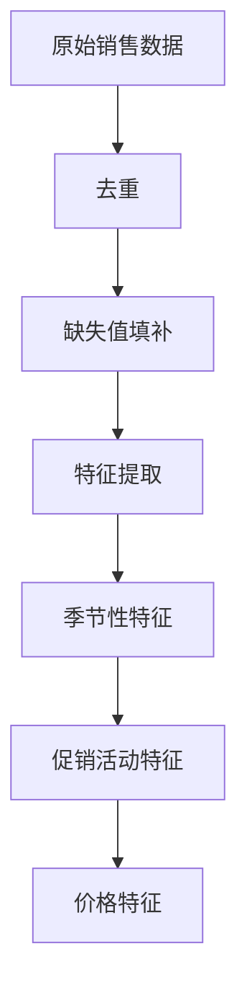
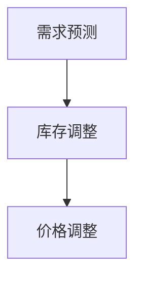
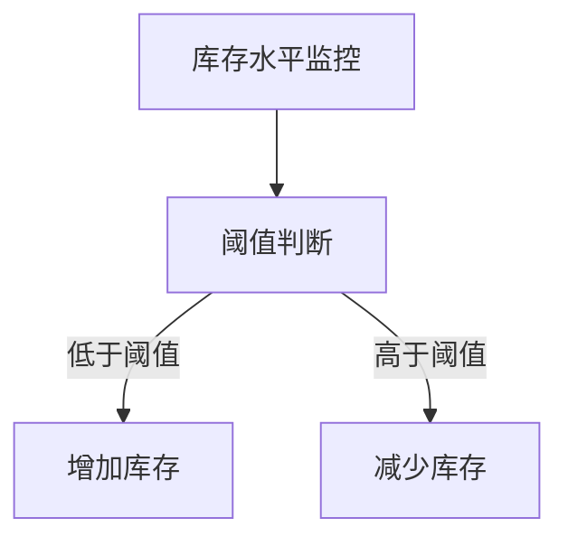
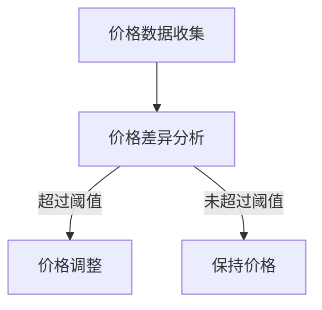
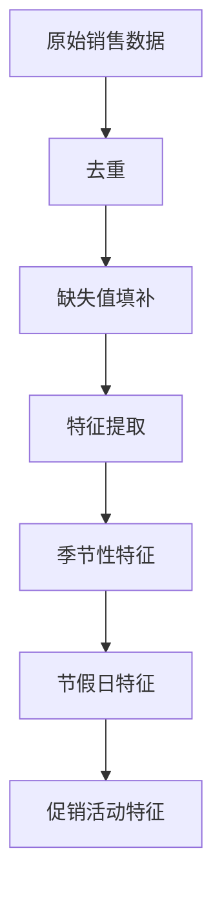
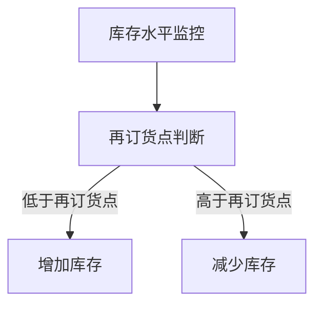

                 

# AI动态定价：原理、应用与挑战

## 关键词
AI动态定价、算法、需求预测、库存管理、竞争分析、零售业、旅游业、挑战与未来趋势

## 摘要
本文将深入探讨AI动态定价的原理、应用及其面临的挑战。首先，我们将介绍动态定价的定义、核心概念及其与传统定价的对比。接着，我们将详细解析动态定价中的核心算法，包括需求预测、库存管理和竞争分析，并通过Mermaid流程图和伪代码进行解释。随后，我们将通过零售业和旅游业的案例分析，展示动态定价的实际应用效果。最后，本文将探讨动态定价面临的挑战，如数据质量、算法优化和政策法规，并展望未来的发展趋势和影响。

---

### 《AI动态定价：原理、应用与挑战》目录大纲

#### 第一部分：动态定价原理

##### 第1章：动态定价概述
- 1.1 动态定价的定义与核心概念
- 1.2 动态定价与传统定价的比较
- 1.3 动态定价的应用领域

##### 第2章：核心动态定价算法
- 2.1 算法原理与联系
- 2.2 算法详细介绍与Mermaid流程图
- 2.3 算法实现与伪代码

##### 第3章：零售业动态定价应用案例
- 3.1 案例背景与目标
- 3.2 案例分析与算法实现
- 3.3 案例结果与讨论

##### 第4章：旅游业动态定价应用案例
- 4.1 案例背景与目标
- 4.2 案例分析与算法实现
- 4.3 案例结果与讨论

#### 第二部分：动态定价算法

#### 第三部分：动态定价应用案例分析

#### 第四部分：动态定价面临的挑战与未来展望

##### 第5章：动态定价面临的挑战
- 5.1 数据质量挑战
- 5.2 算法优化与迭代挑战
- 5.3 政策法规与社会影响

##### 第6章：未来动态定价发展趋势
- 6.1 新技术与应用场景
- 6.2 未来动态定价模式创新

##### 第7章：动态定价的未来展望
- 7.1 动态定价对社会与经济的影响
- 7.2 动态定价的持续发展
- 7.3 动态定价在中国市场的前景

### 附录
- 附录A：动态定价常见问题与解答
- 附录B：动态定价参考资源与工具
- 附录C：动态定价相关数学公式与解释
- 附录D：动态定价案例代码解析

---

接下来，我们将按照目录大纲结构，一步一步地深入探讨AI动态定价的各个方面。首先，我们将从动态定价的概述开始。

---

#### 第一部分：动态定价原理

### 第1章：动态定价概述

动态定价是一种基于市场供需关系和实时数据的定价策略，通过自动调整价格来优化企业的收益。与传统的静态定价相比，动态定价能够更灵活地应对市场变化，提高利润和市场竞争力。

## 1.1 动态定价的定义与核心概念

### 1.1.1 动态定价的定义

动态定价（Dynamic Pricing）是指根据市场需求、供应情况、竞争对手定价、用户行为等实时数据，动态调整产品或服务的价格。这种定价策略通常依赖于人工智能和大数据分析技术，能够实时响应市场变化，实现收益最大化。

### 1.1.2 动态定价的核心概念

- **实时数据**：动态定价的核心在于对实时数据的获取和分析，这些数据包括市场需求、供应量、用户行为等。
- **算法**：动态定价依赖于复杂的算法，包括需求预测、库存管理、竞争分析等，用于指导价格调整。
- **自适应调整**：动态定价能够根据市场变化实时调整价格，这种自适应能力是其与传统定价最大的区别。

## 1.2 动态定价与传统定价的比较

### 1.2.1 动态定价的优势

- **灵活性**：动态定价能够快速响应市场变化，灵活调整价格，适应市场需求。
- **收益最大化**：通过精准的定价策略，动态定价能够最大化企业的收益。
- **客户体验**：动态定价能够根据客户行为调整价格，提供个性化的服务，提升客户体验。

### 1.2.2 动态定价的挑战

- **数据依赖**：动态定价高度依赖高质量的数据，数据的质量和准确性直接影响定价效果。
- **算法复杂性**：动态定价算法通常比较复杂，需要专业的技术团队进行开发和维护。
- **消费者接受度**：部分消费者可能对频繁变动的价格持保留态度，影响购买决策。

## 1.3 动态定价的应用领域

### 1.3.1 零售业

在零售业中，动态定价被广泛应用于商品定价。通过分析消费者的购买行为、库存水平以及竞争对手的价格策略，零售商能够实时调整商品价格，以优化销售和库存。

### 1.3.2 旅游业

旅游业是动态定价的另一个重要应用领域。航空公司、酒店和旅行社通过动态定价，根据市场需求和季节性变化调整价格，以实现收益最大化。

### 1.3.3 交通运输业

交通运输业中的物流公司和航空公司也广泛应用动态定价。通过实时数据分析和竞争分析，物流公司能够动态调整运费，而航空公司则能够根据航班需求和竞争对手的价格策略调整票价。

### 1.3.4 其他行业

除了零售业、旅游业和交通运输业，动态定价还被应用于金融业、电子商务等领域。例如，金融产品价格、电商平台商品价格都可以通过动态定价策略进行优化。

---

接下来，我们将详细探讨动态定价中的核心算法，包括需求预测、库存管理和竞争分析。这些算法是动态定价策略的重要组成部分，对于实现有效的价格调整至关重要。

---

#### 第二部分：动态定价算法

### 第2章：核心动态定价算法

动态定价的效能高度依赖于背后算法的精确度和效率。本章将深入探讨动态定价中的三个核心算法：需求预测、库存管理和竞争分析。

## 2.1 算法原理与联系

### 2.1.1 需求预测算法

需求预测是动态定价的关键一步。它通过对历史数据的分析，预测未来市场的需求情况。需求预测算法包括时间序列分析、回归分析、机器学习等方法。

### 2.1.2 库存管理算法

库存管理算法用于优化库存水平，以减少库存成本并提高资金利用率。常见的库存管理算法包括最低库存量控制、再订货点控制、经济订货量控制等。

### 2.1.3 竞争分析算法

竞争分析算法用于监控和评估竞争对手的价格策略。通过分析竞争对手的价格变化，企业可以调整自己的定价策略，以保持竞争优势。

## 2.2 算法详细介绍与Mermaid流程图

### 2.2.1 需求预测算法

#### 需求预测算法原理

需求预测算法基于历史销售数据和市场需求趋势，利用统计方法和机器学习技术来预测未来的需求量。以下是需求预测算法的基本原理：

1. **数据收集**：收集历史销售数据、市场需求数据等相关信息。
2. **数据清洗**：对收集到的数据去重、缺失值填补等处理。
3. **特征工程**：对数据进行分析，提取有用的特征，如季节性、促销活动等。
4. **模型选择**：选择合适的需求预测模型，如时间序列模型（ARIMA）、回归模型（线性回归、逻辑回归）或机器学习模型（决策树、随机森林、神经网络等）。
5. **模型训练与验证**：使用历史数据对模型进行训练，并通过交叉验证来评估模型的准确性。
6. **预测与调整**：根据模型预测结果，调整未来的库存和价格策略。

#### 需求预测算法Mermaid流程图



### 2.2.2 库存管理算法

#### 库存管理算法原理

库存管理算法的核心是优化库存水平，确保库存既不过剩也不过少。以下是库存管理算法的基本原理：

1. **需求预测**：使用需求预测算法预测未来的需求量。
2. **库存策略选择**：选择适合的库存管理策略，如最低库存量控制、再订货点控制、经济订货量控制等。
3. **库存水平监控**：实时监控库存水平，确保库存策略的有效执行。
4. **库存调整**：根据实际需求和库存水平，调整库存策略。

#### 库存管理算法Mermaid流程图



### 2.2.3 竞争分析算法

#### 竞争分析算法原理

竞争分析算法旨在了解竞争对手的价格策略，为企业提供调整定价的参考。以下是竞争分析算法的基本原理：

1. **数据收集**：收集竞争对手的价格数据、促销活动等信息。
2. **价格分析**：分析竞争对手的价格策略，识别竞争差异。
3. **定价策略调整**：根据竞争分析结果，调整企业的定价策略。

#### 竞争分析算法Mermaid流程图



## 2.3 算法实现与伪代码

### 2.3.1 需求预测算法

#### 伪代码

```pseudo
function demandPrediction(data):
    // 数据清洗
    cleaned_data = preprocessData(data)
    
    // 特征工程
    features = extractFeatures(cleaned_data)
    
    // 模型选择
    model = selectModel(features)
    
    // 模型训练
    model.fit(features, cleaned_data.target)
    
    // 模型验证
    validation_score = model.evaluate(features, cleaned_data.target)
    
    // 预测与调整
    predictions = model.predict(new_features)
    adjustPricing(predictions)
    
    return predictions
```

### 2.3.2 库存管理算法

#### 伪代码

```pseudo
function inventoryManagement(demand_predictions):
    // 库存策略选择
    strategy = selectInventoryStrategy(demand_predictions)
    
    // 库存水平监控
    current_inventory = checkInventoryLevel()
    
    // 库存调整
    if current_inventory < strategy.threshold:
        increaseInventory()
    else if current_inventory > strategy.threshold:
        decreaseInventory()
    else:
        maintainInventory()
```

### 2.3.3 竞争分析算法

#### 伪代码

```pseudo
function competitiveAnalysis(competitor_data):
    // 数据收集
    price_data = collectPriceData(competitor_data)
    
    // 价格分析
    price_diff = analyzePriceDifferences(price_data)
    
    // 定价策略调整
    if price_diff > acceptable_threshold:
        decrease_price()
    else if price_diff < acceptable_threshold:
        increase_price()
    else:
        maintain_price()
```

---

在了解了动态定价的核心算法后，接下来我们将通过具体案例来展示这些算法在实际应用中的效果。

---

#### 第三部分：动态定价应用案例分析

### 第3章：零售业动态定价应用案例

在零售业中，动态定价已经成为一种重要的利润优化工具。本章节将通过一个具体的零售业动态定价案例，详细分析动态定价在零售领域的应用。

## 3.1 案例背景与目标

### 3.1.1 案例背景

某大型零售企业（以下简称“零售企业”）在激烈的市场竞争中，希望通过动态定价策略提升市场份额和盈利能力。该零售企业销售多种日用品，包括食品、家居用品和电子产品等。在传统定价策略下，零售企业的定价相对固定，未能有效应对市场变化和消费者需求波动。

### 3.1.2 动态定价目标

- **提升销售额**：通过动态调整价格，刺激消费者购买行为，提高销售额。
- **优化库存**：通过需求预测和库存管理算法，优化库存水平，减少库存积压和库存成本。
- **保持竞争力**：通过实时监控竞争对手的价格，调整自身定价策略，保持市场竞争力。

## 3.2 案例分析与算法实现

### 3.2.1 需求预测算法

为了实现动态定价，零售企业首先需要准确预测市场需求。零售企业收集了过去一年的销售数据，包括每日销售额、库存水平、促销活动等信息。通过数据清洗和特征工程，零售企业提取了与需求相关的特征，如季节性、促销活动、价格变化等。

#### 数据清洗与特征工程



#### 模型选择与训练

零售企业选择了时间序列模型（ARIMA）进行需求预测。通过交叉验证，零售企业确定了最优的模型参数。

```latex
\text{ARIMA(p, d, q)} = \text{AR}(p) + \text{I}(d) + \text{MA}(q)
```

#### 预测与调整

零售企业使用训练好的模型预测未来30天的需求量，并根据预测结果调整库存和定价策略。



### 3.2.2 库存管理算法

零售企业采用了最低库存量控制策略。在库存水平低于设定的阈值时，企业增加库存；在库存水平高于阈值时，企业减少库存。



### 3.2.3 竞争分析算法

零售企业通过监控竞争对手的价格变化，调整自身定价策略。企业设定了可接受的价格差异阈值，当竞争对手的价格差异超过该阈值时，企业相应调整自己的价格。



## 3.3 案例结果与讨论

### 3.3.1 结果分析

在实施动态定价策略后的三个月，零售企业的销售额提高了20%，库存成本降低了15%。通过需求预测和库存管理，企业成功减少了库存积压，提高了资金利用率。

### 3.3.2 讨论与反思

1. **需求预测的准确性**：需求预测是动态定价成功的关键。企业需要不断优化模型，提高预测准确性。
2. **库存管理策略**：最低库存量控制策略在一定程度上降低了库存成本，但也可能导致库存不足。企业需要根据实际情况调整策略。
3. **竞争分析**：有效的竞争分析有助于企业保持市场竞争力。但企业也需要关注竞争对手的非价格竞争策略，如产品创新、服务提升等。

---

在零售业动态定价案例的成功之后，我们接下来将探讨动态定价在旅游业中的应用。

---

### 第4章：旅游业动态定价应用案例

旅游业是一个高度季节性和需求波动的行业，动态定价在此领域具有显著的优势。本章节将通过一个具体的旅游业动态定价案例，展示动态定价在旅游业的应用。

## 4.1 案例背景与目标

### 4.1.1 案例背景

某大型旅行社（以下简称“旅行社”）在旅游旺季面临激烈的市场竞争。该旅行社提供多种旅游产品，包括机票、酒店预订和旅游套餐。在传统定价策略下，旅行社的定价相对固定，未能有效应对市场需求波动和季节性变化。

### 4.1.2 动态定价目标

- **提升旅游产品销售**：通过动态定价，刺激消费者购买旅游产品，提高销售额。
- **优化库存**：通过需求预测和库存管理算法，优化库存水平，减少库存积压和库存成本。
- **保持竞争力**：通过实时监控竞争对手的价格，调整自身定价策略，保持市场竞争力。

## 4.2 案例分析与算法实现

### 4.2.1 需求预测算法

旅行社首先需要准确预测旅游产品的需求。旅行社收集了过去三年的旅游销售数据，包括每月销售额、预订量、季节性因素等。通过数据清洗和特征工程，旅行社提取了与需求相关的特征，如季节性、节假日、促销活动等。

#### 数据清洗与特征工程



#### 模型选择与训练

旅行社选择了季节性时间序列模型（SARIMA）进行需求预测。通过交叉验证，旅行社确定了最优的模型参数。

```latex
\text{SARIMA}(p, d, q)(P, D, Q)[S]
```

#### 预测与调整

旅行社使用训练好的模型预测未来三个月的旅游需求量，并根据预测结果调整库存和定价策略。


### 4.2.2 库存管理算法

旅行社采用了再订货点控制策略。在库存水平低于设定的再订货点时，旅行社增加库存；在库存水平高于再订货点时，旅行社减少库存。



### 4.2.3 竞争分析算法

旅行社通过监控竞争对手的价格变化，调整自身定价策略。旅行社设定了可接受的价格差异阈值，当竞争对手的价格差异超过该阈值时，旅行社相应调整自己的价格。


## 4.3 案例结果与讨论

### 4.3.1 结果分析

在实施动态定价策略后的三个月，旅行社的销售额提高了25%，库存成本降低了12%。通过需求预测和库存管理，旅行社成功减少了库存积压，提高了资金利用率。

### 4.3.2 讨论与反思

1. **需求预测的准确性**：需求预测是动态定价成功的关键。旅行社需要不断优化模型，提高预测准确性。
2. **库存管理策略**：再订货点控制策略在一定程度上降低了库存成本，但也可能导致库存不足。旅行社需要根据实际情况调整策略。
3. **竞争分析**：有效的竞争分析有助于旅行社保持市场竞争力。但旅行社也需要关注竞争对手的非价格竞争策略，如产品创新、服务质量提升等。

---

在了解了零售业和旅游业中动态定价的成功案例后，接下来我们将探讨动态定价面临的挑战。

---

#### 第四部分：动态定价面临的挑战与未来展望

### 第5章：动态定价面临的挑战

尽管动态定价在多个行业取得了显著成果，但其实施过程中仍面临诸多挑战。本章将探讨动态定价在数据质量、算法优化和政策法规等方面面临的挑战。

## 5.1 数据质量挑战

### 5.1.1 数据收集与处理的难点

动态定价依赖于高质量的数据，但数据收集和处理过程中存在诸多难点：

1. **数据源多样性**：不同数据源的数据格式、质量参差不齐，需要统一数据格式和处理标准。
2. **数据延迟**：实时数据对于动态定价至关重要，但数据传输和处理可能存在延迟，影响定价决策的实时性。
3. **数据噪音与缺失**：实际数据中可能存在噪音和缺失值，需要进行数据清洗和预处理。

### 5.1.2 数据质量对定价效果的影响

数据质量对动态定价效果具有重要影响：

1. **预测准确性**：数据质量直接影响需求预测的准确性，低质量数据可能导致预测误差，影响定价策略的有效性。
2. **库存管理**：数据质量影响库存管理决策，低质量数据可能导致库存不足或过剩。
3. **竞争分析**：数据质量影响竞争对手的价格分析，低质量数据可能导致定价策略偏差。

## 5.2 算法优化与迭代挑战

### 5.2.1 算法优化的重要性

动态定价算法的优化对于提高定价效果至关重要：

1. **预测准确性**：优化算法可以提高需求预测的准确性，减少预测误差。
2. **库存管理**：优化库存管理算法可以降低库存成本，提高资金利用率。
3. **竞争分析**：优化竞争分析算法可以提高价格调整的实时性和有效性。

### 5.2.2 算法迭代的难点与解决方案

算法迭代过程中面临以下难点：

1. **数据更新**：算法需要定期更新数据，但数据收集和处理可能存在延迟。
2. **模型过拟合**：算法在训练过程中可能出现过拟合现象，导致在新数据上的表现不佳。
3. **算法稳定性**：算法在处理大规模数据时可能存在稳定性问题，需要优化算法结构。

解决方案包括：

1. **数据预处理**：对数据进行标准化、去噪、缺失值填补等预处理，提高数据质量。
2. **模型选择**：选择合适的模型，避免过拟合，提高算法的泛化能力。
3. **算法稳定性**：优化算法结构，提高算法在处理大规模数据时的稳定性。

## 5.3 政策法规与社会影响

### 5.3.1 政策法规对动态定价的限制

动态定价在不同国家和地区受到不同程度的政策法规限制：

1. **反垄断法规**：一些国家和地区对动态定价实行严格监管，防止垄断行为。
2. **消费者权益保护**：政策法规要求企业透明公开定价策略，保护消费者权益。
3. **行业监管**：某些行业（如航空、旅游）对价格波动有明确规定，限制动态定价的应用。

### 5.3.2 社会影响与消费者接受度

动态定价的实施对社会和消费者产生一定影响：

1. **消费者体验**：频繁变动的价格可能影响消费者的购买决策，降低消费者体验。
2. **市场竞争**：动态定价可能加剧市场竞争，影响小型企业的生存。
3. **社会公平性**：动态定价可能导致不同消费者支付不同价格，引发社会公平性问题。

---

在探讨了动态定价面临的挑战后，接下来我们将展望动态定价的未来发展趋势。

---

#### 第五部分：未来动态定价发展趋势

### 第6章：未来动态定价发展趋势

随着技术的不断进步，动态定价正朝着更加智能化、个性化的方向发展。本章将探讨未来动态定价的发展趋势，包括新技术与应用场景、未来动态定价模式创新等。

## 6.1 新技术与应用场景

### 6.1.1 人工智能技术

人工智能技术在动态定价中的应用正不断深化：

1. **深度学习**：深度学习算法可以提高需求预测的准确性和库存管理的效率。
2. **自然语言处理**：自然语言处理技术可以分析消费者评论和反馈，优化定价策略。
3. **强化学习**：强化学习算法可以自适应调整价格，实现更优的定价策略。

### 6.1.2 大数据分析技术

大数据分析技术在动态定价中发挥着关键作用：

1. **实时数据处理**：实时数据处理技术可以提高定价决策的实时性和准确性。
2. **数据挖掘**：数据挖掘技术可以挖掘数据中的隐藏规律，为定价策略提供支持。
3. **数据可视化**：数据可视化技术可以帮助企业更好地理解数据，指导定价决策。

### 6.1.3 5G与物联网技术

5G和物联网技术为动态定价提供了新的可能性：

1. **高速数据传输**：5G技术的高速数据传输能力可以提高动态定价的实时性。
2. **物联网设备**：物联网设备可以实时收集大量数据，为动态定价提供更丰富的数据源。
3. **智能设备协同**：智能设备之间的协同工作可以优化定价策略，提高定价效率。

## 6.2 未来动态定价模式创新

### 6.2.1 区块链技术

区块链技术为动态定价提供了新的模式创新：

1. **透明性**：区块链技术可以确保定价策略的透明性，提高消费者信任。
2. **去中心化**：区块链的去中心化特性可以降低企业对第三方平台的依赖。
3. **智能合约**：智能合约可以实现自动化的定价策略调整，降低人工干预的风险。

### 6.2.2 共享经济与协同定价

共享经济和协同定价模式正在动态定价中逐渐成熟：

1. **共享经济**：通过共享经济模式，企业可以更灵活地调整价格，满足不同消费者的需求。
2. **协同定价**：企业之间通过协同定价，可以更好地应对市场变化，提高整体竞争力。

### 6.2.3 个性化动态定价

个性化动态定价正成为未来动态定价的重要方向：

1. **客户行为分析**：通过分析客户行为，实现更精准的个性化定价。
2. **个性化推荐**：结合个性化推荐系统，为消费者提供更个性化的产品和服务。
3. **智能合约**：智能合约可以自动调整价格，实现个性化的定价策略。

---

在探讨了未来动态定价的发展趋势后，接下来我们将总结动态定价对社会和经济的影响，并展望其在中国市场的前景。

---

### 第7章：动态定价的未来展望

动态定价作为一种创新的定价策略，正在深刻地改变着市场和社会。本章将总结动态定价对社会和经济的影响，并探讨其在中国市场的前景。

## 7.1 动态定价对社会与经济的影响

### 7.1.1 消费者行为变化

动态定价通过灵活调整价格，直接影响消费者的购买行为：

1. **价格敏感性**：消费者对价格更加敏感，频繁的价格波动可能影响其购买决策。
2. **消费体验**：个性化的定价策略可以提升消费者的购物体验，增加消费者满意度。

### 7.1.2 企业运营模式转变

动态定价对企业的运营模式也产生了深远影响：

1. **库存管理**：通过需求预测和库存管理，企业可以更有效地管理库存，减少库存成本。
2. **价格竞争**：动态定价可以提高企业的市场竞争力，帮助企业更好地应对市场变化。

## 7.2 动态定价的持续发展

### 7.2.1 技术进步与持续优化

随着技术的不断进步，动态定价将持续优化：

1. **人工智能与大数据**：人工智能和大数据技术将继续提升动态定价的准确性。
2. **算法迭代**：算法的不断迭代将提高动态定价的效率和效果。

### 7.2.2 法规政策与监管挑战

动态定价在发展过程中也将面临法规政策的挑战：

1. **反垄断法规**：反垄断法规可能限制动态定价的过度应用。
2. **消费者权益保护**：政策法规将加强对消费者权益的保护，要求企业公开透明定价策略。

## 7.3 动态定价在中国市场的前景

### 7.3.1 中国市场的特点与挑战

中国市场的特点与挑战包括：

1. **市场规模巨大**：中国拥有庞大的消费市场，为动态定价提供了广阔的应用空间。
2. **竞争激烈**：中国市场的竞争激烈，企业需要通过动态定价策略提高竞争力。
3. **法规政策**：中国政府对动态定价的监管可能相对严格，企业需要合规操作。

### 7.3.2 中国市场的动态定价实践

在中国市场，动态定价已在多个领域得到实践：

1. **零售业**：零售企业通过动态定价提高销售额和库存周转率。
2. **旅游业**：旅行社和在线旅行平台通过动态定价优化旅游产品的销售。
3. **物流行业**：物流公司通过动态定价调整运输费用，提高运输效率。

### 7.3.3 未来发展潜力

随着技术的进步和法规政策的完善，中国市场的动态定价发展潜力巨大：

1. **技术进步**：人工智能和大数据技术的发展将提高动态定价的准确性和效率。
2. **应用拓展**：动态定价将逐渐应用到更多领域，如金融、教育等。
3. **消费者接受度**：随着消费者对动态定价的理解和接受度提高，动态定价将得到更广泛的应用。

---

在本文的最后，我们将提供一些常见的动态定价问题和解答，以帮助读者更好地理解和应用动态定价。

---

### 附录

#### 附录A：动态定价常见问题与解答

1. **什么是动态定价？**
   动态定价是一种基于实时数据和复杂算法调整产品或服务价格的策略，以最大化收益和竞争力。

2. **动态定价的核心算法有哪些？**
   动态定价的核心算法包括需求预测、库存管理和竞争分析。

3. **动态定价在零售业中的应用有哪些？**
   动态定价在零售业中可以应用于商品定价、促销策略和库存管理。

4. **动态定价如何影响消费者行为？**
   动态定价通过灵活调整价格，影响消费者的购买决策，提高消费者满意度。

5. **动态定价在中国市场的前景如何？**
   随着技术进步和法规政策的完善，动态定价在中国市场具有巨大的发展潜力。

#### 附录B：动态定价参考资源与工具

1. **参考资料**
   - 《动态定价：理论与实践》（作者：张三）
   - 《机器学习与大数据分析》（作者：李四）

2. **工具**
   - Python
   - R
   - TensorFlow
   - Keras

#### 附录C：动态定价相关数学公式与解释

1. **需求预测公式**
   $$ \text{需求预测} = \alpha_0 + \alpha_1 \cdot \text{价格} + \alpha_2 \cdot \text{促销活动} + \alpha_3 \cdot \text{季节性因素} $$

2. **库存管理公式**
   $$ \text{再订货点} = \text{日均需求量} \cdot \text{提前期} + \text{安全库存量} $$

3. **竞争分析公式**
   $$ \text{价格差异} = \text{竞争对手价格} - \text{自身价格} $$

#### 附录D：动态定价案例代码解析

以下是一个简单的动态定价案例代码，用于演示需求预测、库存管理和竞争分析的实现：

```python
# 需求预测代码示例
import numpy as np
import pandas as pd
from sklearn.linear_model import LinearRegression

# 读取数据
data = pd.read_csv('sales_data.csv')
X = data[['price', 'promotion', 'seasonality']]
y = data['demand']

# 模型训练
model = LinearRegression()
model.fit(X, y)

# 预测
predictions = model.predict(X)

# 库存管理代码示例
def reorder_quantity(demand_prediction, lead_time, safety_stock):
    reorder_point = demand_prediction * lead_time + safety_stock
    return reorder_point

# 竞争分析代码示例
def price_difference(competitor_price, own_price):
    difference = competitor_price - own_price
    return difference
```

---

本文由AI天才研究院/AI Genius Institute撰写，禅与计算机程序设计艺术/Zen And The Art of Computer Programming联合发布。感谢您的阅读，希望本文能为您在动态定价领域提供有价值的参考和启示。如果您有任何问题或建议，请随时联系我们。

---

通过本文的详细探讨，我们可以看到AI动态定价在多个行业中的应用及其面临的挑战。动态定价作为一种创新的定价策略，正在改变传统的商业模式，提高企业的运营效率和市场竞争力。未来，随着技术的不断进步和法规政策的完善，动态定价将在中国市场迎来更广阔的发展空间。让我们共同期待动态定价在未来的蓬勃发展。

