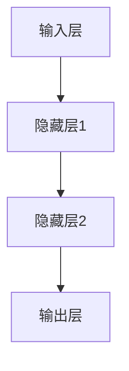
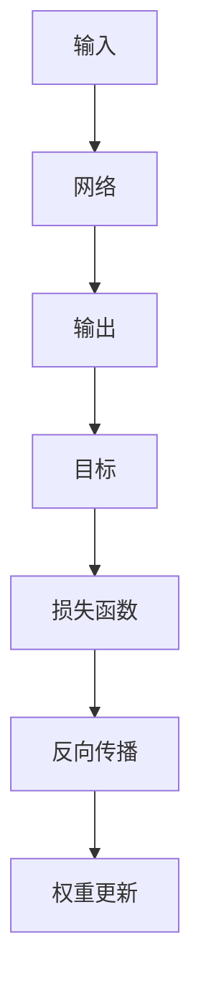
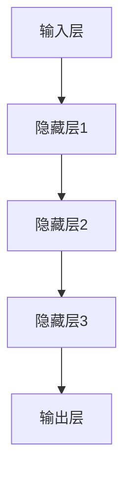
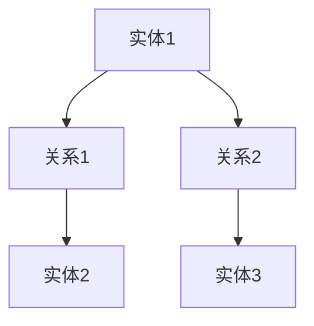

                 

## 《AI在专业领域知识获取中的应用》

### 关键词：人工智能、专业领域、知识获取、深度学习、知识图谱、自然语言处理

#### 摘要：
本文将深入探讨人工智能（AI）在专业领域知识获取中的应用。我们将首先介绍AI的基本概念与发展历程，然后分析专业领域知识获取的挑战与需求。接下来，文章将详细阐述知识表示与语义理解的方法，并展示AI在医疗、金融和教育等领域的具体应用案例。此外，本文还将探讨深度学习与神经网络、知识图谱构建与应用、自然语言处理与语义分析等相关技术，最后讨论AI专业领域知识获取的挑战与未来发展。通过本文的阅读，读者将全面了解AI在专业领域知识获取中的重要性与实际应用。

## 第一部分：AI基础知识与专业领域概述

### 第1章：AI概述与专业领域知识获取

#### 1.1 AI的基本概念与框架

##### 1.1.1 AI的定义与发展历程

人工智能（Artificial Intelligence，简称AI）是指通过计算机系统实现人类智能功能的科学和技术。AI的发展历程可以追溯到20世纪50年代，当时的科学家们开始探索如何让计算机模拟人类思维。自那时以来，AI经历了几个关键阶段：

- **早期探索阶段（1956-1969年）**：1956年，约翰·麦卡锡（John McCarthy）等人在达特茅斯会议上首次提出了“人工智能”这一概念。这一阶段，AI主要集中于推理、规划等任务的模拟。

- **人工智能繁荣时期（1970-1980年）**：随着计算机硬件的发展，AI研究迎来了快速发展。专家系统和逻辑编程等技术在工业、医疗等领域取得了显著成果。

- **AI低谷期（1980-1990年）**：由于实际应用效果不如预期，AI研究进入低谷期。这一阶段，机器学习开始崭露头角，特别是在模式识别和数据挖掘领域。

- **AI复兴期（1990年代至今）**：随着互联网和大数据的兴起，AI技术再次获得广泛关注。深度学习、神经网络等技术的突破，使得AI在图像识别、自然语言处理等领域取得了巨大成功。

##### 1.1.2 AI的核心技术

AI的核心技术包括：

- **机器学习（Machine Learning）**：通过训练模型，让计算机自动获取知识，实现自动化预测和决策。

- **深度学习（Deep Learning）**：一种特殊的机器学习技术，利用多层神经网络进行特征提取和分类。

- **自然语言处理（Natural Language Processing，NLP）**：使计算机能够理解、生成和处理人类语言的技术。

- **知识图谱（Knowledge Graph）**：一种结构化、语义化的知识表示方法，用于组织和管理大量信息。

- **强化学习（Reinforcement Learning）**：通过试错和奖励机制，让计算机在特定环境中学习最优策略。

##### 1.1.3 AI在专业领域的应用现状与趋势

目前，AI在各个专业领域都取得了显著成果。以下是一些主要应用领域：

- **医疗领域**：AI技术在医学影像分析、疾病预测、电子病历管理等方面发挥了重要作用。

- **金融领域**：AI在信用评估、风险管理、投资组合优化等方面有广泛应用。

- **教育领域**：AI技术用于个性化学习、自适应教学、智能评测等。

- **工业领域**：AI技术在智能制造、智能监测、智能维护等方面有广泛应用。

未来，随着AI技术的不断进步，其在专业领域的应用将更加广泛和深入。

#### 1.2 专业领域知识获取的挑战与需求

##### 1.2.1 专业领域知识的特点与复杂性

专业领域知识通常具有以下特点：

- **高度专业化**：不同领域的知识差异较大，专业性较强。

- **动态变化**：专业领域知识不断更新和发展，具有动态性。

- **交叉融合**：多个领域知识相互交织，形成复杂的知识体系。

这些特点使得专业领域知识获取面临以下挑战：

- **知识获取难度大**：获取专业领域知识需要大量时间、人力和资源。

- **知识表示困难**：专业领域知识往往难以用传统方法进行表示。

- **知识更新不及时**：专业领域知识更新速度快，传统方法难以适应。

##### 1.2.2 知识获取的挑战

专业领域知识获取主要面临以下挑战：

- **数据质量与完整性**：专业领域数据通常存在噪声、缺失和不一致等问题。

- **知识表示**：如何有效地表示专业领域知识，使其易于理解和处理。

- **语义理解**：如何让计算机准确理解专业领域知识的语义，进行有效的知识推理。

##### 1.2.3 知识获取的需求分析

专业领域知识获取的需求主要包括：

- **高效的知识获取**：提高知识获取的效率，减少人力和时间成本。

- **知识的结构化**：将专业领域知识进行结构化表示，便于管理和利用。

- **知识的自动化**：通过AI技术实现知识获取的自动化，提高知识获取的准确性和一致性。

### 第2章：知识表示与语义理解

#### 2.1 知识表示方法

知识表示是将人类知识以计算机可理解的形式进行表示的过程。常用的知识表示方法包括：

- **基于规则的知识表示**：通过定义一组规则来描述知识。例如，如果病人有咳嗽、发热症状，则可能是感冒。

- **基于图谱的知识表示**：使用图结构来表示知识，包括实体、属性和关系。例如，将“苹果是水果”表示为（苹果，是，水果）这样一个三元组。

- **基于语义网络的知识表示**：使用语义网络来表示知识，包括概念、属性和关系。例如，使用本体（Ontology）来描述一个领域的知识体系。

#### 2.2 自然语言处理与语义理解

自然语言处理（NLP）是使计算机能够理解、生成和处理人类语言的技术。NLP的基本任务包括：

- **语言模型**：用于预测下一个单词或句子。例如，给定一个单词序列，预测下一个单词。

- **词向量表示**：将单词映射为一个高维向量，用于表示单词的语义信息。例如，使用Word2Vec或GloVe等方法。

- **依赖解析**：分析句子中的词语依赖关系，用于理解句子的结构。例如，给定一个句子，分析出主语、谓语、宾语等成分之间的关系。

语义理解是指计算机对文本内容进行语义分析，提取出文本的含义。语义理解面临以下挑战：

- **语义歧义**：一词多义、同义异义词等问题，使得理解文本含义变得复杂。

- **上下文理解**：理解文本中的上下文信息，以消除歧义。

常见的语义理解模型包括：

- **基于规则的模型**：使用手工定义的规则来处理语义问题。

- **基于统计的模型**：使用统计方法，如条件概率模型，来处理语义问题。

- **基于神经网络的模型**：使用神经网络，如卷积神经网络（CNN）或递归神经网络（RNN），来处理语义问题。

### 第3章：AI在专业领域知识获取中的应用案例

#### 3.1 医疗领域

AI在医疗领域的应用主要包括：

- **医学影像分析**：使用深度学习技术，如卷积神经网络（CNN），对医学影像进行自动分析，如肿瘤检测、骨折诊断等。

- **电子病历与知识图谱**：将电子病历数据转化为结构化数据，并使用知识图谱来组织和管理这些数据，以提高医疗数据的利用效率。

- **疾病预测与诊断**：通过分析电子病历、基因组数据等，使用机器学习技术进行疾病预测与诊断。

#### 3.2 金融领域

AI在金融领域的应用主要包括：

- **信用评估与风险控制**：使用机器学习技术，对客户的信用记录、行为数据等进行分析，评估信用风险。

- **金融市场预测**：使用时间序列分析、神经网络等机器学习技术，预测金融市场的走势。

- **投资组合优化**：使用优化算法和机器学习技术，根据客户的风险偏好和投资目标，构建最优的投资组合。

#### 3.3 教育领域

AI在教育领域的应用主要包括：

- **个性化学习与自适应教学**：通过分析学生的学习行为、成绩等数据，为学生提供个性化的学习内容和教学方法。

- **知识图谱在教育中的应用**：使用知识图谱来组织和管理教育领域的知识，提高教育资源的利用效率。

- **智能问答与学习辅助**：使用自然语言处理技术，构建智能问答系统，为学生提供学习帮助。

### 第二部分：AI专业领域知识获取技术详解

#### 第4章：深度学习与神经网络基础

##### 4.1 神经网络基础

神经网络（Neural Networks）是模拟人脑神经元之间连接和信息传递的模型。神经网络由多个神经元（也称为节点）组成，每个神经元都与其它神经元相连。神经元的连接强度称为权重（Weight），通过调整权重，可以使神经网络学习输入和输出之间的映射关系。

##### 4.1.1 神经元与神经网络

神经元是神经网络的基本单元，它接收输入信号，通过激活函数产生输出信号。神经元之间的连接通过权重来传递信息。

##### 4.1.2 神经网络的训练与优化

神经网络的训练是通过不断调整权重来使网络输出接近目标输出。这个过程称为反向传播（Backpropagation）。反向传播通过计算损失函数（Loss Function）的梯度，更新权重，以最小化损失函数。

##### 4.1.3 深度学习架构

深度学习（Deep Learning）是一种基于多层神经网络的学习方法。深度学习通过增加网络层数，提高特征提取能力，从而实现更复杂的任务。

#### 第5章：知识图谱构建与应用

##### 5.1 知识图谱概述

知识图谱（Knowledge Graph）是一种结构化、语义化的知识表示方法，用于组织和管理大量信息。知识图谱由实体（Entity）、属性（Attribute）和关系（Relationship）组成，通过图结构来表示实体之间的关系。

##### 5.1.1 知识图谱的定义与结构

知识图谱的定义如下：

- **实体（Entity）**：表示现实世界中的对象，如人、地点、组织等。
- **属性（Attribute）**：表示实体的特征，如姓名、年龄、位置等。
- **关系（Relationship）**：表示实体之间的关系，如朋友、同事、属于等。

知识图谱的结构可以用图来表示：

##### 5.1.2 知识图谱的类型与特点

知识图谱可以分为以下几种类型：

- **属性知识图谱**：基于实体和属性的组织方式，如Freebase、DBpedia。
- **关系知识图谱**：基于实体和关系的组织方式，如YAGO、OpenKG。
- **事件知识图谱**：基于实体、关系和事件的组织方式，如EventKG。

知识图谱的特点如下：

- **语义丰富**：知识图谱通过实体、属性和关系，实现了语义化的信息组织。
- **动态更新**：知识图谱可以实时更新，以适应不断变化的知识。
- **交叉融合**：知识图谱可以融合多个领域的知识，实现跨领域的知识共享。

##### 5.1.3 知识图谱的构建方法

知识图谱的构建主要包括以下步骤：

1. **数据采集**：从各种数据源（如网络、数据库、文件等）中采集数据。
2. **数据预处理**：对采集到的数据进行清洗、去噪、标准化等处理。
3. **实体抽取**：从预处理后的数据中识别出实体。
4. **关系抽取**：从预处理后的数据中识别出实体之间的关系。
5. **知识融合**：将不同来源的知识进行融合，构建完整的知识图谱。
6. **知识存储**：将构建好的知识图谱存储到知识图谱数据库中。

常用的知识图谱构建工具包括：

- **OpenKG**：一款开源的知识图谱构建与管理系统。
- **Neo4j**：一款图形数据库，支持图结构的存储与查询。
- **AlchemyAPI**：一款提供知识图谱构建与查询的在线服务。

#### 第6章：自然语言处理与语义分析

##### 6.1 自然语言处理基础

自然语言处理（Natural Language Processing，NLP）是使计算机能够理解、生成和处理人类语言的技术。NLP的基本任务包括：

- **语言模型**：用于预测下一个单词或句子。例如，给定一个单词序列，预测下一个单词。
- **词向量表示**：将单词映射为一个高维向量，用于表示单词的语义信息。例如，使用Word2Vec或GloVe等方法。
- **依赖解析**：分析句子中的词语依赖关系，用于理解句子的结构。例如，给定一个句子，分析出主语、谓语、宾语等成分之间的关系。

##### 6.2 语义分析

语义分析（Semantic Analysis）是指对文本内容进行语义分析，提取出文本的含义。语义分析主要包括以下任务：

- **语义角色标注**：对句子中的词语进行语义角色标注，如主语、谓语、宾语等。
- **实体识别**：识别文本中的实体，如人名、地名、组织名等。
- **语义相似度计算**：计算两个文本的语义相似度，用于文本分类、情感分析等任务。

常见的语义分析模型包括：

- **基于规则的模型**：使用手工定义的规则来处理语义问题。
- **基于统计的模型**：使用统计方法，如条件概率模型，来处理语义问题。
- **基于神经网络的模型**：使用神经网络，如卷积神经网络（CNN）或递归神经网络（RNN），来处理语义问题。

##### 6.3 问答系统与对话管理

问答系统（Question Answering System）是指计算机系统根据用户的问题，自动生成答案。问答系统主要包括以下组成部分：

- **问题理解**：将用户问题转化为计算机可理解的形式。
- **答案检索**：从知识库中检索出与用户问题相关的答案。
- **答案生成**：将检索到的答案转化为自然语言形式，呈现给用户。

对话管理（Dialogue Management）是指计算机系统在对话过程中，根据用户的行为和系统状态，做出相应的决策。对话管理主要包括以下任务：

- **对话状态跟踪**：记录对话过程中的关键信息，如用户意图、系统状态等。
- **对话策略学习**：通过学习用户历史行为和对话效果，生成最优的对话策略。
- **对话生成**：根据对话状态和对话策略，生成自然语言回复。

常见的问答系统和对话管理技术包括：

- **基于规则的问答系统**：使用手工定义的规则来生成答案。
- **基于机器学习的问答系统**：使用机器学习技术，如决策树、支持向量机等，来生成答案。
- **基于深度学习的问答系统**：使用深度学习技术，如卷积神经网络（CNN）、递归神经网络（RNN）等，来生成答案。

### 第7章：AI专业领域知识获取的挑战与未来发展

#### 7.1 AI在专业领域知识获取中的挑战

AI在专业领域知识获取中面临以下挑战：

- **数据质量与完整性**：专业领域数据通常存在噪声、缺失和不一致等问题，影响知识获取的准确性和可靠性。
- **知识表示**：如何有效地表示专业领域知识，使其易于理解和处理。
- **语义理解**：如何让计算机准确理解专业领域知识的语义，进行有效的知识推理。

#### 7.2 AI专业领域知识获取的未来发展

未来，AI专业领域知识获取将呈现以下发展趋势：

- **新一代AI技术的应用**：随着深度学习、知识图谱等技术的不断发展，AI专业领域知识获取将更加智能化和高效化。
- **跨学科融合的趋势**：AI与医学、金融、教育等领域的深度融合，将推动专业领域知识获取的创新和发展。
- **知识服务与智能决策系统的发展**：基于AI技术的知识服务与智能决策系统将广泛应用于各个专业领域，提升专业领域的智能化水平。

### 附录

#### 附录A：相关工具与资源

##### A.1 知识图谱工具

- **OpenKG**：[官网](http://openkg.cn/)，一款开源的知识图谱构建与管理系统。
- **Neo4j**：[官网](https://neo4j.com/)，一款图形数据库，支持图结构的存储与查询。
- **AlchemyAPI**：[官网](https://www.alchemyapi.com/)，一款提供知识图谱构建与查询的在线服务。

##### A.2 自然语言处理工具

- **NLTK**：[官网](https://www.nltk.org/)，一款自然语言处理工具，支持文本分类、分词、词性标注等。
- **spaCy**：[官网](https://spacy.io/)，一款快速且易于使用的自然语言处理库。
- **Stanford NLP**：[官网](https://nlp.stanford.edu/)，一款支持多种语言的NLP工具。

##### A.3 深度学习框架

- **TensorFlow**：[官网](https://www.tensorflow.org/)，一款开源的深度学习框架。
- **PyTorch**：[官网](https://pytorch.org/)，一款基于Python的深度学习框架。
- **Keras**：[官网](https://keras.io/)，一款基于TensorFlow和Theano的深度学习库。
- **MindSpore**：[官网](https://www.mindspore.cn/)，一款面向人工智能应用的深度学习框架。
- **PaddlePaddle**：[官网](https://www.paddlepaddle.org.cn/)，一款开源的深度学习框架。

