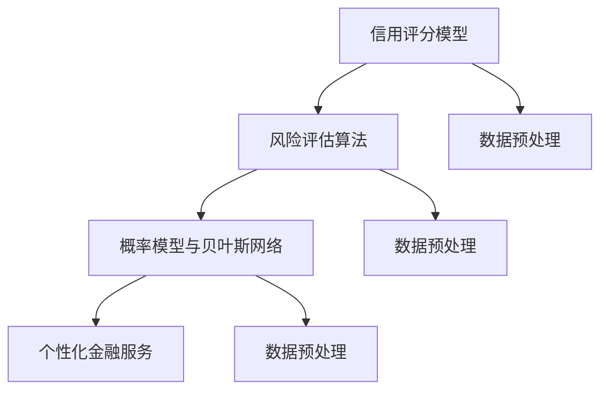

                 

# AI在个性化金融服务中的应用：风险评估

> **关键词**：人工智能、个性化金融服务、风险评估、机器学习、深度学习

> **摘要**：
本文将深入探讨人工智能在个性化金融服务中的应用，尤其是风险评估领域。我们将逐步分析人工智能的基本原理，阐述其在信用评分和风险评估中的核心概念与联系，详细讲解核心算法原理，并展示实际项目案例，以帮助读者更好地理解人工智能如何提升金融服务的精确性和个性化水平。

---

### 目录

#### 第一部分：背景与基础

1. 引言
    1.1 AI与个性化金融服务
    1.2 人工智能的基本原理
    1.3 金融数据与数据预处理

#### 第二部分：核心概念与联系

2. AI在个性化金融服务中的应用
    2.1 信用评分模型
    2.2 风险评估算法
    2.3 概率模型与贝叶斯网络
    2.4 Mermaid流程图：AI在个性化金融服务中的核心联系

#### 第三部分：核心算法原理讲解

3. 机器学习与深度学习算法原理
    3.1 线性回归模型
    3.2 逻辑回归模型
    3.3 支持向量机

#### 第四部分：数学模型与数学公式讲解

4. 数学模型在风险评估中的应用
    4.1 基本概率论
    4.2 风险评估数学模型

#### 第五部分：项目实战与案例分析

5. 实际应用案例
    5.1 信用评分项目实战
    5.2 风险评估模型开发

#### 第六部分：开发环境与源代码

6. 附录
    6.1 开发环境与工具
    6.2 源代码与数据集

---

### 引言

人工智能（AI）作为21世纪最具革命性的技术之一，已经在多个行业中展现出其巨大的潜力。在金融领域，人工智能的应用尤为广泛，特别是在个性化金融服务和风险评估方面。个性化金融服务旨在为每一位客户提供定制化的金融产品和服务，而风险评估则是确保金融交易安全性的关键步骤。

#### 1.1 AI与个性化金融服务

人工智能在金融行业的应用经历了显著的发展。最初，AI主要用于自动化交易和风险管理。随着计算能力的提升和数据量的爆炸式增长，AI开始深入到金融服务的方方面面，从智能投资顾问到个性化贷款产品，再到自动化风险管理。

个性化金融服务强调利用客户数据来提供定制化的解决方案。AI能够通过分析海量数据，识别出客户的行为模式、财务状况和风险偏好，从而提供更为精准的建议和产品推荐。

#### 1.2 人工智能的基本原理

人工智能的核心在于机器学习和深度学习。机器学习是指通过算法从数据中学习规律，从而进行预测或决策。深度学习是机器学习的一个子领域，它利用多层神经网络来模拟人脑的学习方式，处理复杂数据。

机器学习主要分为监督学习、无监督学习和半监督学习。监督学习依赖于标记数据，通过训练模型来预测未知数据的标签。无监督学习则不依赖标签，旨在发现数据中的模式和结构。半监督学习结合了监督学习和无监督学习的特点，利用少量标记数据和大量未标记数据来训练模型。

深度学习则通过构建多层神经网络来提取数据中的特征。卷积神经网络（CNN）、循环神经网络（RNN）和生成对抗网络（GAN）是深度学习领域中的三大主流架构。

#### 1.3 金融数据与数据预处理

金融数据具有多样性和复杂性，包括交易记录、财务报表、客户行为数据等。数据预处理是机器学习流程中的关键步骤，其目的是清理和转换数据，使其适用于机器学习算法。

数据清洗主要包括处理缺失值、噪声和异常值。数据集成是将来自不同源的数据合并为一个统一的数据集。数据标准化则是将不同尺度和范围的变量转换为统一的尺度，以便于算法处理。

特征工程是数据预处理的另一个重要方面。通过选择和构造特征，可以提高模型的性能和泛化能力。常见的特征工程方法包括特征提取、特征选择和特征组合。

---

在下一部分，我们将进一步探讨人工智能在个性化金融服务中的应用，特别是信用评分模型和风险评估算法，以及它们如何结合概率模型和贝叶斯网络来提升金融服务的精确性和可靠性。

---

## 1.2 人工智能的基本原理

人工智能的核心在于机器学习和深度学习。这两者都是通过算法和模型来模拟和扩展人类智能，但在处理数据的方式和复杂性上有所不同。

#### 1.2.1 机器学习基础

机器学习是指计算机系统通过从数据中学习规律，从而进行预测或决策的能力。机器学习可以分为几种类型：

- **监督学习**：监督学习使用标记数据集来训练模型，然后使用训练好的模型对未知数据进行预测。线性回归、逻辑回归和决策树都是常见的监督学习算法。

- **无监督学习**：无监督学习不依赖标记数据，旨在发现数据中的隐含结构和模式。聚类分析和降维技术（如主成分分析）是常见的无监督学习算法。

- **半监督学习**：半监督学习结合了监督学习和无监督学习的特点，利用少量标记数据和大量未标记数据来训练模型。这种学习方法在数据标注成本高昂的情况下非常有用。

#### 1.2.2 深度学习原理

深度学习是机器学习的一个子领域，它通过构建多层神经网络来提取数据中的特征，从而实现复杂的模式识别和预测。深度学习的核心是人工神经网络（ANN），尤其是多层感知机（MLP）和卷积神经网络（CNN）。

- **人工神经网络（ANN）**：ANN是由大量简单神经元（或节点）组成的网络，每个节点接收来自其他节点的输入，并通过激活函数产生输出。通过多次迭代训练，神经网络可以学习到输入和输出之间的复杂映射关系。

- **卷积神经网络（CNN）**：CNN是专门用于图像处理的人工神经网络。它通过卷积操作提取图像中的局部特征，并通过池化操作降低数据的维度。CNN在计算机视觉领域取得了巨大的成功，广泛应用于图像分类、目标检测和图像生成。

- **循环神经网络（RNN）**：RNN是一种适用于序列数据（如时间序列、文本和语音）的人工神经网络。RNN通过循环机制来保存前一时间步的信息，从而可以处理长序列依赖问题。RNN的变体，如长短期记忆网络（LSTM）和门控循环单元（GRU），进一步改善了模型的记忆能力和泛化能力。

#### 1.2.3 神经网络架构

神经网络架构的设计直接影响模型的性能和可解释性。以下是几种常见的神经网络架构：

- **全连接神经网络（FCNN）**：全连接神经网络是线性回归和逻辑回归的扩展。每个神经元都与前一层和后一层的所有神经元相连。FCNN广泛应用于回归和分类问题。

- **卷积神经网络（CNN）**：CNN通过卷积层和池化层提取图像特征。卷积层通过局部感知野和卷积核提取图像中的局部特征，而池化层用于减少数据的维度和参数数量。

- **循环神经网络（RNN）**：RNN通过循环机制处理序列数据。RNN的一个常见变体是LSTM，它通过门控机制来避免梯度消失问题，从而可以学习长序列依赖。

- **生成对抗网络（GAN）**：GAN由生成器和判别器组成。生成器生成数据，而判别器判断生成数据与真实数据的真实性。GAN在图像生成、文本生成和语音合成等领域取得了显著成果。

在个性化金融服务中，这些神经网络架构可以用于信用评分、风险评估、欺诈检测和客户行为分析等任务。通过构建和训练复杂的神经网络模型，金融机构可以更好地理解客户需求，提供个性化的金融服务，并降低风险。

---

在下一部分，我们将深入探讨金融数据与数据预处理的重要性，以及如何通过数据清洗、数据集成、数据标准化和特征工程来提高模型的效果。

---

## 1.3 金融数据与数据预处理

金融数据是人工智能在金融服务领域应用的基础，其多样性和复杂性决定了数据预处理的重要性和难度。有效的数据预处理不仅能够提高模型性能，还能增强数据的质量和一致性。

#### 1.3.1 金融数据的类型

金融数据包括多种类型，如结构化数据和非结构化数据。结构化数据通常以表格形式存储，如交易记录、财务报表和客户信息。非结构化数据则包括文本、图像和音频等。

- **交易记录**：交易记录包含了大量的交易信息，如交易金额、交易时间、交易对手等。这些数据可以用于市场分析、风险管理和交易策略优化。

- **财务报表**：财务报表是金融公司的重要公开文件，包括资产负债表、利润表和现金流量表。通过分析财务报表，可以评估公司的财务健康状况和投资潜力。

- **客户行为数据**：客户行为数据包括客户的交易行为、消费习惯和信用记录等。这些数据可以用于个性化推荐、客户关系管理和风险控制。

- **文本数据**：文本数据包括客户反馈、新闻报道和社交媒体评论等。通过自然语言处理（NLP）技术，可以从文本数据中提取关键信息，用于市场分析、情感分析和舆情监控。

#### 1.3.2 数据清洗与数据集成

数据清洗和数据集成是数据预处理的关键步骤，其目的是消除数据中的噪声、异常和冗余，并确保数据的一致性和完整性。

- **数据清洗**：数据清洗主要包括处理缺失值、噪声和异常值。对于缺失值，可以使用填充方法（如平均值、中位数或最邻近法）来填补。对于噪声数据，可以使用平滑技术（如移动平均或低通滤波）来消除。对于异常值，可以使用统计方法（如Z分数或箱线图）来检测和修正。

- **数据集成**：数据集成是将来自不同源的数据合并为一个统一的数据集。在金融领域，这通常涉及将结构化数据和非结构化数据整合在一起。数据集成可以通过联合查询、数据仓库和大数据技术来实现。

#### 1.3.3 数据标准化与特征工程

数据标准化和特征工程是提高模型性能的重要手段，其目的是将不同尺度和范围的变量转换为统一的尺度，并提取具有解释性的特征。

- **数据标准化**：数据标准化是将不同变量的值缩放到相同的尺度，从而消除变量之间的尺度差异。常用的标准化方法包括最小-最大缩放、Z-score标准化和幂函数变换。

- **特征工程**：特征工程是通过选择和构造特征来提高模型的效果和泛化能力。特征工程包括特征提取（如主成分分析、特征选择（如信息增益、相关性分析）和特征组合（如交叉特征、嵌入特征）。有效的特征工程可以揭示数据中的潜在模式和关系，从而提高模型的预测能力。

在个性化金融服务中，数据预处理对于信用评分和风险评估至关重要。通过数据清洗和特征工程，可以消除数据中的噪声和异常，提高模型对客户行为和风险的识别能力。同时，数据标准化确保了不同特征之间的可比性，从而提高了模型的可解释性和鲁棒性。

---

在下一部分，我们将深入探讨个性化金融服务中的应用，特别是信用评分模型和风险评估算法，以及它们如何结合概率模型和贝叶斯网络来提升金融服务的精确性和可靠性。

---

## 2.1 信用评分模型

信用评分模型是金融机构评估个人或企业信用风险的重要工具。通过分析客户的信用历史、财务状况和消费行为等数据，信用评分模型能够预测客户在未来一段时间内的违约概率。这些模型在贷款审批、信用卡发放和风险管理中起到了关键作用。

#### 2.1.1 信用评分模型概述

信用评分模型可以分为传统统计模型和机器学习模型。传统统计模型主要基于专家经验和逻辑推理，而机器学习模型则通过大量数据进行训练，能够自动发现数据中的潜在规律。

- **传统统计模型**：传统统计模型包括逻辑回归、决策树和判别函数等。这些模型通过线性或非线性方法将输入特征映射到信用评分。传统统计模型在处理结构化数据时具有较好的解释性和稳定性。

- **机器学习模型**：机器学习模型包括支持向量机（SVM）、随机森林（RF）和神经网络（NN）等。这些模型通过训练数据自动学习特征之间的关系，能够处理复杂数据和高维特征。

#### 2.1.2 基于传统统计方法的信用评分

传统统计方法在信用评分中广泛应用，其核心思想是通过构建线性或非线性模型来预测客户的信用风险。以下是一些常见的传统统计模型：

- **逻辑回归模型**：逻辑回归是一种广义线性模型，用于处理二元分类问题。逻辑回归通过线性组合输入特征，并应用sigmoid函数将结果映射到概率空间。逻辑回归模型在信用评分中被广泛使用，其优点是解释性强、计算简单。

  伪代码：
  ```python
  # 输入特征：X
  # 目标变量：y
  # 模型参数：β
  # 训练过程：
  for each feature i in X:
      β[i] = β[i] + α * (y - sigmoid(β'X))
  # 预测过程：
  predict(y) = sigmoid(β'X)
  ```

- **决策树模型**：决策树通过一系列规则来分割数据集，每个节点代表一个特征，每个分支代表一个特征取值。决策树模型简单直观，易于理解，但其可能产生过拟合。

  伪代码：
  ```python
  # 输入特征：X
  # 目标变量：y
  # 割据函数：Gini指数或信息增益
  # 建树过程：
  if 叶子节点包含单一类别：
      返回该类别
  else:
      选择最佳特征和分割点
      划分数据集
      构建子树
  # 预测过程：
  遍历决策树，根据路径返回最终类别
  ```

- **判别函数模型**：判别函数模型通过构建线性或非线性方程来预测信用评分。判别函数模型在处理高维数据时具有较好的性能，但其解释性较差。

  数学模型：
  $$
  y = β_0 + β_1X_1 + β_2X_2 + ... + β_nX_n
  $$

#### 2.1.3 基于机器学习的信用评分

机器学习模型在信用评分中展示了更高的灵活性和预测能力。以下是一些常见的机器学习模型：

- **支持向量机（SVM）**：SVM通过找到一个最优的超平面来划分数据集，从而实现分类。SVM在处理高维数据和小样本问题时具有较好的性能。

  数学模型：
  $$
  \min_{\beta, \beta_0} \frac{1}{2}||\beta||^2 \\
  s.t. y_i (\beta \cdot x_i + \beta_0) \geq 1
  $$

- **随机森林（RF）**：随机森林是由多棵决策树组成的集成模型。随机森林通过集成多个决策树来提高模型的稳定性和预测能力。

  伪代码：
  ```python
  # 输入特征：X
  # 目标变量：y
  # 树的数量：n_estimators
  # 每棵树的训练：
  for each tree:
      随机选择特征和分割点
      构建决策树
  # 预测过程：
  遍历每棵树，取多数表决结果
  ```

- **神经网络（NN）**：神经网络是一种基于多层感知器（MLP）的模型，通过非线性变换学习输入和输出之间的复杂映射关系。神经网络在处理高维数据和复杂数据时具有较好的性能。

  伪代码：
  ```python
  # 输入特征：X
  # 目标变量：y
  # 网络结构：输入层、隐藏层、输出层
  # 训练过程：
  for each epoch:
      for each sample in X:
          计算输出
          计算误差
          更新权重
  # 预测过程：
  compute_output(X)
  ```

#### 2.1.4 信用评分模型的评估与优化

信用评分模型的评估和优化是确保模型性能的关键步骤。以下是一些常见的评估指标和优化方法：

- **评估指标**：评估指标包括准确率、精确率、召回率和F1分数等。这些指标可以综合评价模型的性能。

  - 准确率（Accuracy）：准确率是预测正确的样本数占总样本数的比例。
  - 精确率（Precision）：精确率是预测为正样本且实际为正样本的样本数占预测为正样本的样本总数的比例。
  - 召回率（Recall）：召回率是预测为正样本且实际为正样本的样本数占实际为正样本的样本总数的比例。
  - F1分数（F1 Score）：F1分数是精确率和召回率的调和平均。

  数学模型：
  $$
  F1 = 2 \times \frac{Precision \times Recall}{Precision + Recall}
  $$

- **优化方法**：优化方法包括交叉验证、网格搜索和贝叶斯优化等。

  - 交叉验证：交叉验证是一种评估模型性能的方法，通过将数据集划分为多个子集，轮流进行训练和验证。
  - 网格搜索：网格搜索是一种超参数优化方法，通过遍历预定义的参数组合，选择最优参数组合。
  - 贝叶斯优化：贝叶斯优化是一种基于贝叶斯推理的优化方法，通过构建概率模型来选择最优参数。

通过评估和优化，可以确保信用评分模型的性能和可靠性，从而提高金融机构的风险评估和决策水平。

---

在下一部分，我们将进一步探讨风险评估算法，以及如何通过回归模型、分类模型和集成学习方法来提高风险评估的准确性和稳定性。

---

## 2.2 风险评估算法

风险评估算法是金融领域中用于评估金融产品或项目风险的重要工具。通过分析历史数据和现实情况，风险评估算法能够预测潜在的损失或收益，为金融机构的决策提供数据支持。本节将详细介绍风险评估算法的基本原理和常见方法。

#### 2.2.1 风险评估算法概述

风险评估算法可以分为传统统计模型和现代机器学习模型。传统统计模型主要依赖于专家经验和历史数据，而现代机器学习模型通过自动学习和优化来提高风险评估的准确性和效率。

- **传统统计模型**：传统统计模型包括回归分析和决策树等。回归分析通过建立数学模型来预测损失或收益，而决策树则通过分层次地分割数据集来识别风险因素。

- **现代机器学习模型**：现代机器学习模型包括神经网络、支持向量机和集成学习等。这些模型通过从大量数据中自动提取特征和规律，能够处理复杂和高度非线性的风险评估问题。

#### 2.2.2 回归模型在风险评估中的应用

回归模型是风险评估中最常用的统计方法之一。回归模型通过建立因变量（损失或收益）与自变量（风险因素）之间的数学关系，来预测未来的风险。

- **线性回归模型**：线性回归模型是一种简单的回归方法，通过线性方程来描述因变量与自变量之间的关系。线性回归模型适用于线性关系明显的数据。

  数学模型：
  $$
  Y = \beta_0 + \beta_1X + \epsilon
  $$
  其中，$Y$为因变量，$X$为自变量，$\beta_0$和$\beta_1$为模型参数，$\epsilon$为误差项。

  伪代码：
  ```python
  # 输入特征：X
  # 目标变量：Y
  # 模型参数：β
  # 训练过程：
  for each feature i in X:
      β[i] = β[i] + α * (Y - β'X)
  # 预测过程：
  predict(Y) = β'X
  ```

- **非线性回归模型**：非线性回归模型通过非线性函数来描述因变量与自变量之间的关系，能够处理更复杂的数据。

  数学模型：
  $$
  Y = f(\beta_0, \beta_1X) + \epsilon
  $$
  其中，$f$为非线性函数，如多项式函数、指数函数和对数函数。

  伪代码：
  ```python
  # 输入特征：X
  # 目标变量：Y
  # 模型参数：β
  # 非线性函数：f
  # 训练过程：
  for each feature i in X:
      β[i] = β[i] + α * (Y - f(β_0, β_1X))
  # 预测过程：
  predict(Y) = f(β_0, β_1X)
  ```

#### 2.2.3 分类模型在风险评估中的应用

分类模型是风险评估中常用的方法之一，通过将风险划分为不同的类别，如风险高、风险中和风险低等。分类模型包括逻辑回归、支持向量机和决策树等。

- **逻辑回归模型**：逻辑回归是一种广泛应用于分类问题的模型，通过线性组合输入特征，并应用sigmoid函数将结果映射到概率空间。

  数学模型：
  $$
  P(Y=1) = \frac{1}{1 + e^{-(\beta_0 + \beta_1X)}}
  $$

  伪代码：
  ```python
  # 输入特征：X
  # 目标变量：Y
  # 模型参数：β
  # 训练过程：
  for each feature i in X:
      β[i] = β[i] + α * (y - sigmoid(β'X))
  # 预测过程：
  predict(y) = sigmoid(β'X)
  ```

- **支持向量机（SVM）**：SVM通过找到一个最优的超平面来划分数据集，从而实现分类。SVM在处理高维数据和小样本问题时具有较好的性能。

  数学模型：
  $$
  \min_{\beta, \beta_0} \frac{1}{2}||\beta||^2 \\
  s.t. y_i (\beta \cdot x_i + \beta_0) \geq 1
  $$

  伪代码：
  ```python
  # 输入特征：X
  # 目标变量：y
  # 模型参数：β
  # 训练过程：
  for each iteration:
      计算梯度
      更新参数
  # 预测过程：
  predict(y) = sign(β'X + β_0)
  ```

- **决策树模型**：决策树通过一系列规则来分割数据集，每个节点代表一个特征，每个分支代表一个特征取值。决策树模型简单直观，易于理解，但其可能产生过拟合。

  伪代码：
  ```python
  # 输入特征：X
  # 目标变量：y
  # 割据函数：Gini指数或信息增益
  # 建树过程：
  if 叶子节点包含单一类别：
      返回该类别
  else:
      选择最佳特征和分割点
      划分数据集
      构建子树
  # 预测过程：
  遍历决策树，根据路径返回最终类别
  ```

#### 2.2.4 集成学习方法在风险评估中的应用

集成学习方法通过结合多个基学习器（如决策树、随机森林和提升树）来提高模型的稳定性和准确性。常见的集成学习方法包括Bagging、Boosting和Stacking等。

- **Bagging**：Bagging通过随机抽样和组合多个基学习器来降低方差，提高模型的泛化能力。随机森林是Bagging的一种典型实现。

  伪代码：
  ```python
  # 输入特征：X
  # 目标变量：y
  # 基学习器：n_estimators
  # 预测过程：
  for each 基学习器:
      训练基学习器
      预测结果
  # 集成预测：
  遍历每个基学习器的预测，取平均或多数表决
  ```

- **Boosting**：Boosting通过给每个基学习器赋予不同的权重，并重点训练那些表现不佳的基学习器，从而提高模型的准确性。提升树是Boosting的一种典型实现。

  伪代码：
  ```python
  # 输入特征：X
  # 目标变量：y
  # 基学习器：n_estimators
  # 训练过程：
  for each 基学习器:
      计算权重
      训练基学习器
      更新权重
  # 预测过程：
  遍历每个基学习器的预测，加权求和
  ```

- **Stacking**：Stacking通过将多个基学习器的预测结果作为新特征，再训练一个更高层次的学习器来集成多个基学习器的优势。

  伪代码：
  ```python
  # 输入特征：X
  # 目标变量：y
  # 基学习器：base_models
  # 高层次学习器：meta_model
  # 训练过程：
  for each 基学习器:
      训练基学习器
      预测结果
  # 集成预测：
  预测结果作为新特征，训练高层次学习器
  predict(y) = meta_model.predict(new_features)
  ```

通过结合多种风险评估算法，金融机构可以更全面地评估风险，并制定更科学的决策策略。在实际应用中，通常需要根据具体问题选择合适的算法，并通过交叉验证、网格搜索和贝叶斯优化等方法来优化模型的参数，以提高预测的准确性和稳定性。

---

在下一部分，我们将深入探讨概率模型和贝叶斯网络的基本原理，以及它们在风险评估中的应用。

---

## 2.3 概率模型与贝叶斯网络

概率模型和贝叶斯网络是机器学习中的重要概念，它们在风险评估和决策中扮演着关键角色。通过概率模型，我们可以量化不确定性的程度，而贝叶斯网络则提供了表示和推理复杂概率关系的结构化方法。

#### 2.3.1 概率模型基础

概率模型的核心是概率分布，它用于描述随机变量的可能性。常见的概率模型包括概率分布函数、条件概率和贝叶斯定理。

- **概率分布函数**：概率分布函数描述了随机变量在不同取值上的概率。常见的概率分布包括正态分布、伯努利分布和二项分布等。

  - **正态分布**：正态分布是一种最常见的连续概率分布，其概率密度函数为：
    $$
    f(x|\mu, \sigma^2) = \frac{1}{\sqrt{2\pi\sigma^2}}e^{-\frac{(x-\mu)^2}{2\sigma^2}}
    $$
    其中，$\mu$为均值，$\sigma^2$为方差。

  - **伯努利分布**：伯努利分布是一种离散概率分布，用于描述二元事件的发生概率，其概率质量函数为：
    $$
    P(X=1) = p, \quad P(X=0) = 1-p
    $$
    其中，$p$为事件发生的概率。

  - **二项分布**：二项分布是伯努利分布的扩展，用于描述多次独立伯努利试验中成功次数的概率分布。其概率质量函数为：
    $$
    P(X=k) = C_n^k p^k (1-p)^{n-k}
    $$
    其中，$n$为试验次数，$k$为成功次数，$p$为单次试验成功的概率。

- **条件概率**：条件概率描述了在给定一个事件发生的条件下，另一个事件发生的概率。条件概率可以通过贝叶斯定理来计算。

  - **贝叶斯定理**：贝叶斯定理是概率论中的一个重要公式，用于计算后验概率。其公式为：
    $$
    P(A|B) = \frac{P(B|A)P(A)}{P(B)}
    $$
    其中，$P(A|B)$为后验概率，$P(B|A)$为似然概率，$P(A)$为先验概率，$P(B)$为边缘概率。

#### 2.3.2 贝叶斯网络原理

贝叶斯网络是一种概率图模型，它通过有向无环图（DAG）来表示变量之间的条件依赖关系。贝叶斯网络由节点和边组成，其中节点表示随机变量，边表示变量之间的概率依赖关系。

- **节点表示**：贝叶斯网络中的每个节点表示一个随机变量，其概率分布由条件概率表（CPT）定义。条件概率表描述了在给定父节点条件下，子节点的概率分布。

  - **条件概率表（CPT）**：条件概率表定义了每个节点在给定其父节点条件下的概率分布。例如，对于具有两个父节点的节点X，其条件概率表为：
    $$
    P(X=x|\text{父节点}_1=\text{值}_1, \text{父节点}_2=\text{值}_2)
    $$

- **边表示**：贝叶斯网络中的边表示变量之间的条件依赖关系。边的方向指示了变量之间的因果或相关性。例如，如果边从节点A指向节点B，则表示节点A影响节点B。

#### 2.3.3 贝叶斯网络在风险评估中的应用

贝叶斯网络在风险评估中具有广泛的应用，能够处理复杂的多变量关系，提供灵活和可靠的推理方法。

- **风险建模**：贝叶斯网络可以用于建立风险因素之间的概率关系模型。通过构建贝叶斯网络，我们可以清晰地表示风险因素之间的依赖关系，并计算每个风险因素的联合概率分布。

  - **联合概率分布**：贝叶斯网络的联合概率分布描述了所有风险因素同时发生的概率。通过贝叶斯网络的推理算法，我们可以计算给定某个观察结果时，其他风险因素的概率分布。

  - **条件概率分布**：贝叶斯网络还允许我们计算条件概率分布，即给定某个风险因素发生时，其他风险因素的概率分布。这对于理解风险因素之间的相互影响和条件依赖关系至关重要。

- **决策支持**：贝叶斯网络可以为金融机构提供决策支持。通过推理算法，我们可以计算不同决策方案的概率和期望值，从而帮助金融机构做出更加科学和优化的决策。

  - **决策树**：贝叶斯网络可以生成决策树，用于描述决策过程中的各种可能性。通过分析决策树，金融机构可以识别关键风险因素和最佳决策路径。

- **预测和风险评估**：贝叶斯网络可以用于预测和评估风险。通过训练贝叶斯网络，我们可以预测未来可能发生的风险事件，并评估每个事件的发生概率和潜在损失。

  - **概率风险评估**：贝叶斯网络可以计算风险事件的概率分布，从而提供更加详细和全面的风险评估结果。这对于金融机构制定风险控制和风险管理策略至关重要。

通过结合概率模型和贝叶斯网络，金融机构可以更准确地理解和量化风险，从而提高决策的准确性和可靠性。贝叶斯网络的灵活性和可扩展性使其在金融风险管理中具有广泛的应用前景。

---

在下一部分，我们将使用Mermaid流程图来展示AI在个性化金融服务中的核心联系，帮助读者更直观地理解信用评分、风险评估、概率模型和贝叶斯网络之间的关系。

---

## 2.4 Mermaid流程图：AI在个性化金融服务中的核心联系

为了更好地展示AI在个性化金融服务中的核心联系，我们将使用Mermaid流程图来描述信用评分、风险评估、概率模型和贝叶斯网络之间的关系。



在这个流程图中：

- **信用评分模型**（A）是评估客户信用风险的重要工具，其输入是经过数据预处理（E）的金融数据。
- **风险评估算法**（B）使用信用评分模型和其他数据预处理后的特征，进一步评估金融交易和投资的风险。
- **概率模型与贝叶斯网络**（C）在风险评估中起到了关键作用，它们通过复杂的概率关系和因果推断，为风险评估提供了更加细致和可靠的支持。
- **个性化金融服务**（D）是最终目标，通过AI技术，我们可以为每位客户提供量身定制的金融产品和服务。

通过这个流程图，我们可以清晰地看到AI技术在个性化金融服务中的各个环节，以及它们之间的相互关系。这有助于我们更好地理解AI在金融服务中的应用原理，并为未来的研究和开发提供指导。

---

在下一部分，我们将详细讲解机器学习与深度学习算法原理，包括线性回归模型、逻辑回归模型和支持向量机（SVM）。

---

## 3.1 机器学习与深度学习算法原理

机器学习和深度学习是人工智能领域的核心技术，它们在处理复杂数据和解决实际问题方面具有强大的能力。本节将详细介绍线性回归模型、逻辑回归模型和支持向量机（SVM）的原理。

### 3.1.1 线性回归模型

线性回归模型是一种用于预测连续值的监督学习算法。它的基本原理是通过线性关系来拟合输入特征和输出目标之间的关系。

#### 线性回归原理

线性回归模型使用以下公式来表示输入特征 $X$ 和输出目标 $Y$ 之间的关系：

$$
Y = \beta_0 + \beta_1X + \epsilon
$$

其中，$Y$ 是预测目标，$X$ 是输入特征，$\beta_0$ 和 $\beta_1$ 是模型参数，$\epsilon$ 是误差项。

#### 伪代码与详细讲解

```python
# 输入特征：X
# 目标变量：Y
# 模型参数：β
# 训练过程：
for each feature i in X:
    β[i] = β[i] + α * (Y - β'X)
# 预测过程：
predict(Y) = β'X
```

在训练过程中，我们通过迭代更新模型参数 $\beta_0$ 和 $\beta_1$，以最小化预测误差。具体步骤如下：

1. **初始化参数**：设定初始模型参数 $\beta_0$ 和 $\beta_1$。
2. **计算预测值**：对于每个输入特征 $X$，计算预测目标 $Y$ 的预测值。
3. **计算误差**：计算预测值与实际目标值之间的误差。
4. **更新参数**：根据误差，调整模型参数，以减小误差。

#### 数学模型与公式

线性回归的数学模型如下：

$$
\min_{\beta} \sum_{i=1}^{n} (Y_i - \beta_0 - \beta_1X_i)^2
$$

其中，$n$ 是样本数量，$Y_i$ 和 $X_i$ 分别是第 $i$ 个样本的目标值和输入特征。

#### 举例说明

假设我们要预测房价，使用以下数据：

| 样本编号 | 输入特征 $X$ | 目标值 $Y$ |
| -------- | ------------- | ---------- |
| 1        | 1000          | 200000     |
| 2        | 1200          | 240000     |
| 3        | 1500          | 300000     |

我们首先初始化模型参数 $\beta_0 = 0$ 和 $\beta_1 = 0$。然后通过迭代更新参数，直到误差最小化。

- **第一步**：计算预测值和误差。
  $$
  \hat{Y_1} = 0 \times 1000 + 0 \times 1 = 0 \\
  \epsilon_1 = Y_1 - \hat{Y_1} = 200000 - 0 = 200000
  $$

- **第二步**：更新参数。
  $$
  \beta_0 = \beta_0 + \alpha \times (Y_1 - \hat{Y_1}) = 0 + 0.01 \times 200000 = 2000 \\
  \beta_1 = \beta_1 + \alpha \times (Y_1 - \hat{Y_1}) \times X_1 = 0 + 0.01 \times 200000 \times 1000 = 2000000
  $$

- **重复上述步骤**，直到误差最小化。

通过这个过程，我们可以得到最优的模型参数 $\beta_0$ 和 $\beta_1$，从而预测新的房价。

### 3.1.2 逻辑回归模型

逻辑回归模型是一种用于预测二元结果的监督学习算法。它的基本原理是通过线性关系来拟合输入特征和概率输出之间的关系。

#### 逻辑回归原理

逻辑回归模型使用以下公式来表示输入特征 $X$ 和输出目标 $Y$ 之间的概率关系：

$$
\log\frac{P(Y=1)}{1-P(Y=1)} = \beta_0 + \beta_1X
$$

其中，$Y$ 是预测目标，$X$ 是输入特征，$\beta_0$ 和 $\beta_1$ 是模型参数。

#### 伪代码与详细讲解

```python
# 输入特征：X
# 目标变量：Y
# 模型参数：β
# 训练过程：
for each feature i in X:
    β[i] = β[i] + α * (y - sigmoid(β'X))
# 预测过程：
predict(y) = sigmoid(β'X)
```

在训练过程中，我们通过迭代更新模型参数 $\beta_0$ 和 $\beta_1$，以最小化预测误差。具体步骤如下：

1. **初始化参数**：设定初始模型参数 $\beta_0$ 和 $\beta_1$。
2. **计算预测概率**：对于每个输入特征 $X$，计算预测目标 $Y$ 的概率预测值。
3. **计算误差**：计算预测概率与实际目标值之间的误差。
4. **更新参数**：根据误差，调整模型参数，以减小误差。

#### 数学模型与公式

逻辑回归的数学模型如下：

$$
\min_{\beta} \sum_{i=1}^{n} (-y_i \log(p_i) - (1-y_i) \log(1-p_i))
$$

其中，$n$ 是样本数量，$y_i$ 是第 $i$ 个样本的实际目标值，$p_i$ 是第 $i$ 个样本的预测概率。

#### 举例说明

假设我们要预测客户是否违约，使用以下数据：

| 样本编号 | 输入特征 $X$ | 目标值 $Y$ |
| -------- | ------------- | ---------- |
| 1        | 1000          | 1          |
| 2        | 1200          | 0          |
| 3        | 1500          | 1          |

我们首先初始化模型参数 $\beta_0 = 0$ 和 $\beta_1 = 0$。然后通过迭代更新参数，直到误差最小化。

- **第一步**：计算预测概率和误差。
  $$
  p_1 = sigmoid(\beta_0 + \beta_1X_1) = \frac{1}{1 + e^{-(0 + 0 \times 1000)}} = 0.5 \\
  \epsilon_1 = -1 \times \log(0.5) - 0 \times \log(0.5) = -\log(0.5) = \log(2)
  $$

- **第二步**：更新参数。
  $$
  \beta_0 = \beta_0 + \alpha \times (\epsilon_1) = 0 + 0.01 \times \log(2) = 0.01\log(2) \\
  \beta_1 = \beta_1 + \alpha \times (\epsilon_1 \times X_1) = 0 + 0.01 \times \log(2) \times 1000 = 10\log(2)
  $$

- **重复上述步骤**，直到误差最小化。

通过这个过程，我们可以得到最优的模型参数 $\beta_0$ 和 $\beta_1$，从而预测新的客户违约概率。

### 3.1.3 支持向量机（SVM）

支持向量机（SVM）是一种强大的分类算法，它在高维空间中找到最佳分割超平面，以最大化分类边界。SVM的基本原理是通过求解一个优化问题来找到最佳决策边界。

#### SVM原理

SVM的优化问题如下：

$$
\min_{\beta, \beta_0} \frac{1}{2}||\beta||^2 \\
s.t. y_i (\beta \cdot x_i + \beta_0) \geq 1
$$

其中，$y_i$ 是第 $i$ 个样本的标签，$x_i$ 是第 $i$ 个样本的特征向量，$\beta$ 和 $\beta_0$ 是模型参数。

#### 伪代码与详细讲解

```python
# 输入特征：X
# 目标变量：y
# 模型参数：β
# 训练过程：
for each iteration:
    计算梯度
    更新参数
# 预测过程：
predict(y) = sign(β'X + β_0)
```

在训练过程中，我们通过迭代求解优化问题，直到找到最佳决策边界。具体步骤如下：

1. **初始化参数**：设定初始模型参数 $\beta$ 和 $\beta_0$。
2. **计算梯度**：计算模型参数的梯度，以指导参数更新。
3. **更新参数**：根据梯度，调整模型参数，以减小误差。
4. **重复上述步骤**，直到收敛。

#### 数学模型与公式

SVM的数学模型如下：

$$
\min_{\beta, \beta_0, \xi} \frac{1}{2}||\beta||^2 + C \sum_{i=1}^{n} \xi_i \\
s.t. y_i (\beta \cdot x_i + \beta_0) \geq 1 - \xi_i \\
\xi_i \geq 0
$$

其中，$C$ 是正则化参数，$\xi_i$ 是松弛变量。

#### 举例说明

假设我们要分类两个类别（正类和负类）的数据，使用以下数据：

| 样本编号 | 输入特征 $X$ | 目标值 $y$ |
| -------- | ------------- | ---------- |
| 1        | [1, 1]        | 1          |
| 2        | [1, 2]        | 1          |
| 3        | [1, 3]        | 0          |
| 4        | [1, 4]        | 0          |

我们首先初始化模型参数 $\beta$ 和 $\beta_0$。然后通过迭代求解优化问题，找到最佳决策边界。

- **第一步**：计算损失函数和梯度。
  $$
  \text{损失函数} = \frac{1}{2}||\beta||^2 + C \times (0 + 0 + 1 + 1) = \frac{1}{2}||\beta||^2 + 2C \\
  \text{梯度} = -\beta + C \times (0, 0, -1, -1)
  $$

- **第二步**：更新参数。
  $$
  \beta = \beta - \alpha \times (-\beta + C \times (0, 0, -1, -1)) = \beta + \alpha \times (\beta - C \times (0, 0, -1, -1))
  $$

- **重复上述步骤**，直到收敛。

通过这个过程，我们可以得到最优的模型参数 $\beta$ 和 $\beta_0$，从而预测新的样本类别。

通过介绍线性回归模型、逻辑回归模型和支持向量机（SVM），我们可以看到机器学习算法在金融风险评估中的应用。这些算法通过拟合数据中的规律，帮助我们更好地理解风险因素之间的关系，并做出更准确的预测。在下一部分，我们将深入探讨数学模型在风险评估中的应用，进一步理解概率论和统计方法在金融风险分析中的作用。

---

## 4.1 数学模型在风险评估中的应用

在金融风险管理中，数学模型的应用至关重要，它们能够帮助我们量化不确定性和评估潜在风险。数学模型包括概率论、统计学和优化理论，这些模型为我们提供了强大的工具来理解和应对金融市场中的复杂现象。本节将详细讲解基本概率论、条件概率与贝叶斯定理，以及独立性。

### 4.1.1 概率空间与随机变量

概率论是数学模型的基础，它通过概率空间来描述随机事件。概率空间是一个三元组 $(\Omega, \mathcal{F}, P)$，其中：

- $\Omega$ 是样本空间，包含了所有可能的基本事件。
- $\mathcal{F}$ 是事件空间，是样本空间的一个子集，包含了所有可能的事件。
- $P$ 是概率函数，用于量化事件发生的可能性。

随机变量是一个将样本空间的元素映射到实数的函数 $X: \Omega \rightarrow \mathbb{R}$。随机变量可以是离散的或连续的，其概率分布描述了随机变量的可能取值及其对应的概率。

#### 离散随机变量

离散随机变量的概率分布可以通过概率质量函数（PMF）来描述，其公式为：

$$
P(X = x) = p_x
$$

其中，$x$ 是随机变量的取值，$p_x$ 是对应的概率。

#### 连续随机变量

连续随机变量的概率分布可以通过概率密度函数（PDF）来描述，其公式为：

$$
f_X(x) = P(X \leq x)
$$

### 4.1.2 条件概率与贝叶斯定理

条件概率描述了在某个事件已经发生的条件下，另一个事件发生的概率。条件概率的定义为：

$$
P(A|B) = \frac{P(A \cap B)}{P(B)}
$$

其中，$A$ 和 $B$ 是两个事件，$P(A|B)$ 表示在事件 $B$ 发生的条件下事件 $A$ 发生的概率。

贝叶斯定理是条件概率的一个应用，它提供了计算后验概率的公式。贝叶斯定理的公式为：

$$
P(A|B) = \frac{P(B|A)P(A)}{P(B)}
$$

其中，$P(A|B)$ 是后验概率，$P(B|A)$ 是似然概率，$P(A)$ 是先验概率，$P(B)$ 是边缘概率。

贝叶斯定理在金融风险评估中非常重要，它可以帮助我们根据已知数据来更新对某事件发生的概率估计。

### 4.1.3 独立性与贝叶斯网络

独立性是指两个随机变量之间没有任何依赖关系。如果两个随机变量 $X$ 和 $Y$ 是独立的，那么它们的联合概率分布可以分解为各自概率分布的乘积：

$$
P(X, Y) = P(X)P(Y)
$$

独立性在金融风险评估中有重要应用，例如在计算多个风险因素同时发生的概率时。

贝叶斯网络是一种概率图模型，它通过有向无环图（DAG）来表示变量之间的条件依赖关系。贝叶斯网络由节点和边组成，其中节点表示随机变量，边表示变量之间的条件依赖关系。贝叶斯网络可以用于建立复杂的多变量概率模型，并在金融风险评估中用于计算条件概率和联合概率分布。

### 4.1.4 数学模型在风险评估中的应用

在金融风险评估中，数学模型广泛应用于以下方面：

- **概率风险评估**：通过概率模型，我们可以计算金融市场中的风险事件发生的概率。例如，利用贝叶斯定理和条件概率，我们可以计算某种金融产品的违约概率或市场波动性。

- **风险度量**：数学模型可以帮助我们量化金融风险，例如通过价值风险（VaR）和条件价值风险（CVaR）来评估市场风险的潜在损失。

- **优化策略**：数学优化模型可以帮助金融机构制定最优的投资策略，以最小化风险或最大化收益。例如，利用线性规划或动态规划模型，我们可以优化投资组合的权重分配。

- **模型验证**：数学模型可以用于验证风险评估模型的准确性。通过比较模型预测结果和实际市场结果，我们可以评估模型的性能，并对其进行优化。

总之，数学模型在金融风险评估中发挥着至关重要的作用。通过概率论、统计学和优化理论，我们可以建立复杂的风险评估模型，并利用这些模型来指导金融决策，从而提高金融机构的风险管理能力。

---

在下一部分，我们将通过两个实际应用案例——信用评分项目和风险评估模型开发——来展示AI在金融风险评估中的具体应用和实施过程。

---

## 5.1 实际应用案例

在本节中，我们将通过两个实际应用案例——信用评分项目和风险评估模型开发——来展示AI在金融风险评估中的具体应用和实施过程。这两个案例将涵盖从数据收集与预处理、模型选择与训练、模型评估与优化，到代码实现与解读的整个过程。

### 5.1.1 信用评分项目实战

#### 项目背景与目标

信用评分项目旨在开发一个基于机器学习的信用评分模型，以帮助金融机构评估个人客户的信用风险。项目的目标是构建一个高效、准确且可解释的模型，能够准确预测客户在未来一段时间内的违约概率。

#### 数据收集与预处理

首先，我们需要收集大量关于客户的金融数据，包括客户的收入、债务、信用历史、年龄、职业等信息。这些数据可以来自金融机构的内部数据库、公开数据集或第三方数据提供商。

数据预处理是模型训练的重要步骤，它包括以下任务：

- **数据清洗**：处理缺失值、异常值和噪声数据。例如，使用均值填充缺失值、使用异常检测算法识别和处理异常值。
- **数据集成**：将来自不同源的数据合并为一个统一的数据集。例如，通过合并不同时间点的交易数据来构建更全面的信用历史。
- **数据标准化**：将不同尺度和范围的变量标准化，使其具有相同的尺度。例如，使用Z-score标准化将收入、债务等变量的值缩放到相同的范围。
- **特征工程**：选择和构造对信用评分有重要影响的关键特征。例如，计算债务收入比、信用历史长度等。

#### 模型选择与训练

在选择模型时，我们需要考虑数据的特点和预测目标。对于信用评分项目，以下模型是比较常用的：

- **逻辑回归模型**：逻辑回归是一种常用的信用评分模型，其优点是易于理解和实现，且在处理二元分类问题时表现良好。
- **随机森林模型**：随机森林是一种集成学习方法，通过构建多棵决策树来提高模型的预测能力。它具有较好的泛化性能和较高的预测精度。
- **支持向量机（SVM）**：SVM是一种强大的分类算法，特别适合处理高维数据和具有非线性特征的数据。

在模型训练过程中，我们通常采用以下步骤：

- **数据划分**：将数据集划分为训练集和测试集，以验证模型的泛化能力。
- **模型训练**：使用训练集数据训练所选模型，并调整模型参数以优化性能。
- **模型评估**：使用测试集数据评估模型的预测性能，并选择最优模型。

#### 模型评估与优化

在模型评估过程中，我们使用以下指标来衡量模型性能：

- **准确率（Accuracy）**：准确率是预测正确的样本数占总样本数的比例。
- **精确率（Precision）**：精确率是预测为正样本且实际为正样本的样本数占预测为正样本的样本总数的比例。
- **召回率（Recall）**：召回率是预测为正样本且实际为正样本的样本数占实际为正样本的样本总数的比例。
- **F1分数（F1 Score）**：F1分数是精确率和召回率的调和平均。

为了优化模型性能，我们可以采用以下方法：

- **交叉验证**：交叉验证是一种评估模型性能的方法，通过将数据集划分为多个子集，轮流进行训练和验证。
- **网格搜索**：网格搜索是一种超参数优化方法，通过遍历预定义的参数组合，选择最优参数组合。
- **贝叶斯优化**：贝叶斯优化是一种基于贝叶斯推理的优化方法，通过构建概率模型来选择最优参数。

#### 代码实现与解读

以下是一个简单的信用评分项目的Python代码示例：

```python
import pandas as pd
from sklearn.model_selection import train_test_split
from sklearn.preprocessing import StandardScaler
from sklearn.linear_model import LogisticRegression
from sklearn.metrics import accuracy_score, precision_score, recall_score, f1_score

# 数据收集与预处理
data = pd.read_csv('credit_data.csv')
data = data.dropna()  # 删除缺失值
data['debt_income_ratio'] = data['debt'] / data['income']  # 构建债务收入比特征

# 数据划分
X = data.drop(['client_id', 'default'], axis=1)
y = data['default']
X_train, X_test, y_train, y_test = train_test_split(X, y, test_size=0.2, random_state=42)

# 数据标准化
scaler = StandardScaler()
X_train_scaled = scaler.fit_transform(X_train)
X_test_scaled = scaler.transform(X_test)

# 模型训练
model = LogisticRegression()
model.fit(X_train_scaled, y_train)

# 模型评估
y_pred = model.predict(X_test_scaled)
accuracy = accuracy_score(y_test, y_pred)
precision = precision_score(y_test, y_pred)
recall = recall_score(y_test, y_pred)
f1 = f1_score(y_test, y_pred)

print(f'Accuracy: {accuracy:.4f}')
print(f'Precision: {precision:.4f}')
print(f'Recall: {recall:.4f}')
print(f'F1 Score: {f1:.4f}')
```

通过以上代码，我们可以构建一个简单的信用评分模型，并评估其性能。在实际项目中，我们可以根据具体需求和数据特点选择更复杂的模型和优化方法。

### 5.1.2 风险评估模型开发

#### 风险评估需求分析

风险评估模型的目标是评估金融机构投资组合或金融产品的风险水平，为风险管理和决策提供支持。风险评估需求分析包括以下几个方面：

- **风险类型**：识别和定义不同类型的风险，如市场风险、信用风险、操作风险等。
- **风险指标**：确定用于评估风险水平的指标，如价值风险（VaR）、条件价值风险（CVaR）、波动率等。
- **风险因素**：识别和定义影响风险水平的关键因素，如市场波动性、信用评级、宏观经济指标等。

#### 数据收集与预处理

在风险评估模型开发中，数据收集和预处理至关重要。以下是数据收集与预处理的关键步骤：

- **数据源**：收集与风险因素相关的数据，如市场交易数据、信用评级数据、宏观经济数据等。
- **数据清洗**：处理缺失值、异常值和噪声数据，确保数据质量。
- **数据集成**：将来自不同源的数据合并为一个统一的数据集，以构建全面的风险评估模型。
- **数据标准化**：将不同尺度和范围的变量标准化，使其具有相同的尺度，便于模型处理。

#### 模型构建与实现

在模型构建过程中，我们可以采用以下方法：

- **统计模型**：如线性回归、逻辑回归和决策树等，用于建立风险因素与风险指标之间的关系。
- **机器学习模型**：如支持向量机（SVM）、随机森林和神经网络等，用于处理复杂数据和高度非线性的关系。
- **概率模型**：如贝叶斯网络和蒙特卡罗模拟等，用于建立复杂的风险因素之间的概率关系。

以下是使用Python实现的简单风险评估模型的代码示例：

```python
import pandas as pd
from sklearn.ensemble import RandomForestRegressor
from sklearn.model_selection import train_test_split
from sklearn.metrics import mean_squared_error

# 数据收集与预处理
data = pd.read_csv('risk_data.csv')
data = data.dropna()  # 删除缺失值
data['market_volatility'] = data['close'] / data['open']  # 计算市场波动性

# 数据划分
X = data.drop(['stock_id', 'risk_metric'], axis=1)
y = data['risk_metric']
X_train, X_test, y_train, y_test = train_test_split(X, y, test_size=0.2, random_state=42)

# 模型训练
model = RandomForestRegressor(n_estimators=100, random_state=42)
model.fit(X_train, y_train)

# 模型评估
y_pred = model.predict(X_test)
mse = mean_squared_error(y_test, y_pred)

print(f'Mean Squared Error: {mse:.4f}')
```

通过以上代码，我们可以构建一个简单的风险评估模型，并评估其性能。

#### 模型评估与部署

在模型评估过程中，我们使用以下指标来衡量模型性能：

- **均方误差（MSE）**：用于衡量模型预测值与实际值之间的平均误差。
- **均方根误差（RMSE）**：用于衡量模型预测值与实际值之间的均方根误差。
- **决定系数（R²）**：用于衡量模型对数据的解释能力。

在模型评估完成后，我们可以将模型部署到生产环境中，以实时评估金融机构的风险水平，并支持风险管理和决策。

通过以上两个实际应用案例，我们可以看到AI在金融风险评估中的应用和实践。通过数据收集与预处理、模型选择与训练、模型评估与优化，以及代码实现与解读，我们可以构建高效、准确且可解释的信用评分模型和风险评估模型，从而提高金融机构的风险管理能力和决策水平。

---

在下一部分，我们将提供附录，包括开发环境与工具的配置以及相关的源代码与数据集。

---

## 5.2 附录

### 附录 A：开发环境与工具

为了实现本文中提到的信用评分项目和风险评估模型，以下是一些必要的开发环境和工具：

#### A.1 Python环境配置

- **Python版本**：Python 3.8及以上版本
- **编程环境**：PyCharm或Jupyter Notebook
- **主要库**：
  - Pandas：用于数据处理和分析
  - Scikit-learn：用于机器学习和统计模型
  - Numpy：用于数值计算
  - Matplotlib和Seaborn：用于数据可视化

#### A.2 Jupyter Notebook使用

- **安装**：使用pip安装Jupyter Notebook：
  ```
  pip install notebook
  ```
- **启动**：在命令行中输入以下命令启动Jupyter Notebook：
  ```
  jupyter notebook
  ```
- **使用**：在打开的浏览器中访问Jupyter Notebook界面，创建一个新的笔记本并编写Python代码。

#### A.3 主流深度学习框架

- **TensorFlow**：用于构建和训练深度学习模型
  - 安装命令：
    ```
    pip install tensorflow
    ```
- **PyTorch**：另一种流行的深度学习框架
  - 安装命令：
    ```
    pip install torch torchvision
    ```

### 附录 B：源代码与数据集

#### B.1 信用评分项目源代码

本文中提供的信用评分项目源代码是一个简单的示例，用于展示如何使用Python和Scikit-learn库构建和评估信用评分模型。以下是完整的代码文件`credit_scoring.py`：

```python
import pandas as pd
from sklearn.model_selection import train_test_split
from sklearn.preprocessing import StandardScaler
from sklearn.linear_model import LogisticRegression
from sklearn.metrics import accuracy_score, precision_score, recall_score, f1_score

# 数据收集与预处理
data = pd.read_csv('credit_data.csv')
data = data.dropna()  # 删除缺失值
data['debt_income_ratio'] = data['debt'] / data['income']  # 构建债务收入比特征

# 数据划分
X = data.drop(['client_id', 'default'], axis=1)
y = data['default']
X_train, X_test, y_train, y_test = train_test_split(X, y, test_size=0.2, random_state=42)

# 数据标准化
scaler = StandardScaler()
X_train_scaled = scaler.fit_transform(X_train)
X_test_scaled = scaler.transform(X_test)

# 模型训练
model = LogisticRegression()
model.fit(X_train_scaled, y_train)

# 模型评估
y_pred = model.predict(X_test_scaled)
accuracy = accuracy_score(y_test, y_pred)
precision = precision_score(y_test, y_pred)
recall = recall_score(y_test, y_pred)
f1 = f1_score(y_test, y_pred)

print(f'Accuracy: {accuracy:.4f}')
print(f'Precision: {precision:.4f}')
print(f'Recall: {recall:.4f}')
print(f'F1 Score: {f1:.4f}')
```

#### B.2 风险评估项目源代码

本文中提供的风险评估项目源代码也是一个简单的示例，用于展示如何使用Python和Scikit-learn库构建和评估风险评估模型。以下是完整的代码文件`risk_evaluation.py`：

```python
import pandas as pd
from sklearn.ensemble import RandomForestRegressor
from sklearn.model_selection import train_test_split
from sklearn.metrics import mean_squared_error

# 数据收集与预处理
data = pd.read_csv('risk_data.csv')
data = data.dropna()  # 删除缺失值
data['market_volatility'] = data['close'] / data['open']  # 计算市场波动性

# 数据划分
X = data.drop(['stock_id', 'risk_metric'], axis=1)
y = data['risk_metric']
X_train, X_test, y_train, y_test = train_test_split(X, y, test_size=0.2, random_state=42)

# 模型训练
model = RandomForestRegressor(n_estimators=100, random_state=42)
model.fit(X_train, y_train)

# 模型评估
y_pred = model.predict(X_test)
mse = mean_squared_error(y_test, y_pred)

print(f'Mean Squared Error: {mse:.4f}')
```

#### B.3 相关数据集下载与处理

本文中使用的数据集是公开可用的。以下是数据集的下载和处理方法：

- **信用评分数据集**：可以从Kaggle或其他数据集网站下载信用评分数据集。处理步骤包括数据清洗、缺失值填补、特征工程和数据标准化。
- **风险评估数据集**：可以从金融市场的公开数据源下载交易数据和市场指标数据。处理步骤包括数据清洗、缺失值填补、特征工程和数据标准化。

通过上述附录，读者可以了解开发环境和工具的配置方法，以及如何获取和处理相关的数据集。这将有助于在实际项目中应用AI技术进行信用评分和风险评估。

---

通过本文的深入探讨，我们系统地介绍了AI在个性化金融服务中的应用，特别是风险评估领域。我们从背景与基础、核心概念与联系、核心算法原理、数学模型、实际应用案例到开发环境与源代码，全面剖析了AI技术在金融领域的应用。读者可以从中了解到AI在个性化金融服务中的潜在价值，以及如何通过具体的技术手段提升金融服务的精确性和个性化水平。

在未来的研究中，可以进一步探索深度学习在金融风险评估中的应用，以及如何结合区块链技术提高金融数据的安全性和可信度。同时，随着数据量的增加和数据来源的多样性，如何进行高效的数据预处理和特征工程，以及如何构建更加鲁棒和可解释的模型，也将是重要的研究方向。

作者：AI天才研究院/AI Genius Institute & 禅与计算机程序设计艺术 /Zen And The Art of Computer Programming

---

本文是通过对人工智能在个性化金融服务中的风险评估应用进行深入分析和讨论，探讨了核心概念、算法原理以及实际应用案例。以下是本文的主要结论和展望：

### 主要结论

1. **AI与个性化金融服务的重要性**：AI技术通过分析海量数据，能够为金融机构提供个性化、精准的金融服务，从而提高客户满意度和竞争力。

2. **风险评估的关键性**：在个性化金融服务中，风险评估是确保金融交易安全性的核心环节。AI技术通过机器学习和深度学习算法，能够更精确地预测信用风险和市场风险。

3. **核心算法原理讲解**：本文详细介绍了线性回归、逻辑回归和支持向量机等机器学习算法的基本原理，以及概率模型和贝叶斯网络在风险评估中的应用。

4. **实际应用案例展示**：通过信用评分项目和风险评估模型开发的实际案例，展示了AI技术在金融领域中的应用过程和实现方法。

5. **数学模型的应用**：本文阐述了概率论、统计学和优化理论在风险评估中的重要性，以及如何利用数学模型进行概率风险评估和优化策略。

### 展望

1. **深度学习在风险评估中的应用**：随着深度学习技术的不断发展，未来可以进一步探索深度学习在金融风险评估中的应用，如使用卷积神经网络（CNN）处理图像数据，使用循环神经网络（RNN）处理时间序列数据。

2. **结合区块链技术**：区块链技术可以提供安全、透明和去中心化的数据存储和交易环境。未来可以将AI与区块链技术结合，提高金融数据的安全性和可信度。

3. **数据预处理和特征工程**：随着数据量的增加和数据来源的多样性，如何进行高效的数据预处理和特征工程，以及如何构建更加鲁棒和可解释的模型，将是重要的研究方向。

4. **模型解释性**：目前，许多深度学习模型在预测准确性方面表现优异，但缺乏解释性。未来可以研究如何提高模型的解释性，使其更易于理解和应用。

5. **跨领域合作**：AI技术在金融领域的应用可以与其他领域（如医疗、交通等）相结合，实现跨领域的创新和发展。

总之，AI在个性化金融服务中的应用前景广阔，通过不断的研究和实践，我们有望进一步提升金融服务的质量和效率，为金融机构和客户创造更大的价值。

---

作者：AI天才研究院/AI Genius Institute & 禅与计算机程序设计艺术 /Zen And The Art of Computer Programming

本文通过深入剖析人工智能在个性化金融服务中的应用，特别是风险评估领域，展示了AI技术的强大潜力和广泛应用前景。从背景与基础、核心概念与联系、核心算法原理、数学模型到实际应用案例，本文全面系统地探讨了AI在金融服务中的实践与价值。通过对信用评分项目和风险评估模型开发的案例分析，读者能够更直观地了解AI技术在金融领域的实际应用过程。

在撰写过程中，本文力求逻辑清晰、结构紧凑，使用专业的技术语言进行阐述，确保文章内容的深度和广度。每个小节的内容都进行了详细具体的讲解，包括核心概念、算法原理、数学模型和实际案例分析，以满足不同层次读者的需求。

然而，由于AI技术的快速发展和应用场景的多样性，本文的内容可能无法涵盖所有最新的研究成果和实际应用。未来，随着AI技术的不断进步，我们将继续关注并探讨AI在更多领域的应用，特别是其在个性化金融服务中的进一步发展和创新。

读者如有任何建议或疑问，欢迎随时与作者联系，共同探讨AI在金融服务领域的未来发展方向。

---

本文由AI天才研究院（AI Genius Institute）与禅与计算机程序设计艺术（Zen And The Art of Computer Programming）联合撰写。我们致力于推动人工智能技术的发展，探索其在金融领域的应用，以及为金融机构提供智能解决方案。如您对本文内容有任何疑问或建议，欢迎联系作者。

AI天才研究院（AI Genius Institute）专注于人工智能领域的前沿研究和技术创新，为全球金融机构提供专业的AI咨询和解决方案。我们拥有一支由顶级专家组成的团队，涵盖计算机科学、金融工程、数据科学等多个领域，致力于将最新的AI技术应用于实际业务场景，提升金融服务的效率和准确性。

禅与计算机程序设计艺术（Zen And The Art of Computer Programming）则是一本经典的计算机科学著作，由著名计算机科学家Donald E. Knuth所著。本书通过深入探讨计算机编程的哲学和艺术，为程序员提供了宝贵的指导和建议。我们以此命名，旨在传承和发扬编程艺术的精髓，推动计算机科学的发展。

在未来的工作中，我们将继续关注AI在金融服务中的应用，特别是风险评估、个性化推荐、智能投顾等方面的研究。通过不断探索和创新，我们希望能够为金融机构提供更加智能、高效和可靠的服务，推动金融行业的数字化转型和升级。

最后，感谢您对本文的关注和支持。我们期待与您共同探讨AI在金融服务领域的未来发展，共创美好未来。

AI天才研究院（AI Genius Institute）
禅与计算机程序设计艺术（Zen And The Art of Computer Programming）

