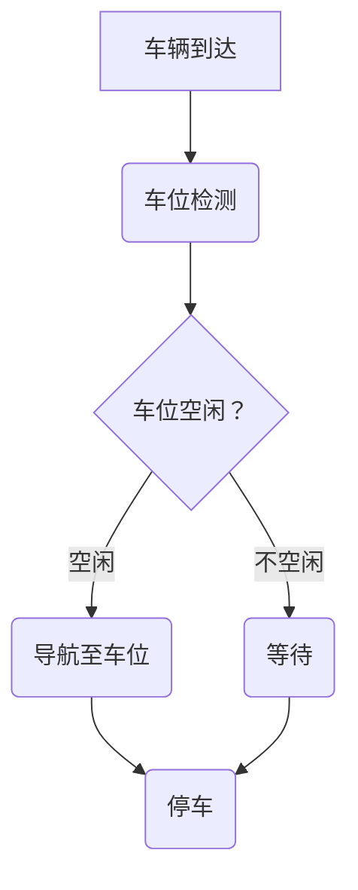

                 

# 《AI在智能停车系统中的应用：减少寻找时间》

> **关键词**：智能停车系统、AI技术、深度学习、车辆检测、车位识别、停车导航、性能优化、实时性、鲁棒性。

> **摘要**：本文深入探讨了AI在智能停车系统中的应用，通过分析智能停车系统的基本概念、组成和功能，详细介绍了AI与智能停车系统的结合方式以及核心算法。同时，文章还探讨了智能停车系统的数学模型，并展示了AI在智能停车系统中的实际应用案例和性能优化策略，展望了智能停车系统的未来发展趋势。通过本文的阅读，读者可以全面了解AI在智能停车系统中的应用，为智能交通领域的创新提供启示。

## 《AI在智能停车系统中的应用：减少寻找时间》目录大纲

### 第一部分: AI在智能停车系统中的基础知识

#### 第1章: 智能停车系统概述

##### 1.1.1 智能停车系统的概念与历史发展

##### 1.1.2 智能停车系统的组成部分

##### 1.1.3 智能停车系统的主要功能

#### 第2章: AI与智能停车系统的结合

##### 2.1.1 AI技术概述

##### 2.1.2 AI在智能停车系统中的应用场景

##### 2.1.3 智能停车系统中常用的AI技术

#### 第3章: 智能停车系统中的核心算法

##### 3.1.1 车辆检测算法

###### 3.1.1.1 基于深度学习的车辆检测算法

###### 3.1.1.2 车辆检测算法的性能评估

##### 3.1.2 停车位识别算法

###### 3.1.2.1 基于图像处理的方法

###### 3.1.2.2 基于深度学习的车位识别算法

##### 3.1.3 停车导航算法

###### 3.1.3.1 基于定位与路径规划的导航算法

###### 3.1.3.2 基于深度强化学习的导航算法

#### 第4章: 智能停车系统的数学模型

##### 4.1.1 车辆到达时间分布模型

$$
P(t) = \frac{1}{\lambda}e^{-\lambda t}
$$

##### 4.1.2 停车位空闲状态概率模型

$$
P_s = \frac{1}{N}\sum_{i=1}^{N}P(s_i)
$$

##### 4.1.3 停车时间预测模型

$$
T = T_0 + \sigma\sqrt{2/\lambda}
$$

### 第二部分: AI在智能停车系统中的应用与优化

#### 第5章: AI在智能停车系统中的应用案例

##### 5.1.1 智能停车引导系统

###### 5.1.1.1 系统架构设计

###### 5.1.1.2 系统实现与优化

##### 5.1.2 智能车位预约系统

###### 5.1.2.1 系统设计与实现

###### 5.1.2.2 用户体验优化

#### 第6章: 智能停车系统的性能优化

##### 6.1.1 数据预处理与特征提取

###### 6.1.1.1 数据预处理流程

###### 6.1.1.2 特征提取方法与策略

##### 6.1.2 模型选择与训练

###### 6.1.2.1 常见深度学习模型介绍

###### 6.1.2.2 模型训练策略与调优技巧

##### 6.1.3 实时性与鲁棒性优化

###### 6.1.3.1 实时性优化方法

###### 6.1.3.2 鲁棒性优化策略

#### 第7章: 智能停车系统的未来发展趋势

##### 7.1.1 AI技术在智能停车系统中的应用前景

##### 7.1.2 智能停车系统的发展方向

##### 7.1.3 智能停车系统与城市交通管理的深度融合

### 附录

##### 附录A: 智能停车系统开发资源与工具

###### 附录A.1 开发环境搭建

###### 附录A.2 常用AI模型与算法库

###### 附录A.3 智能停车系统开源项目推荐

##### 附录B: Mermaid流程图示例



## 第一部分: AI在智能停车系统中的基础知识

### 第1章: 智能停车系统概述

#### 1.1.1 智能停车系统的概念与历史发展

智能停车系统是一种基于计算机技术、物联网技术和人工智能技术的停车解决方案，通过整合多种传感器、摄像头、无线通信设备等技术手段，实现对停车资源的实时监控、管理和调度。智能停车系统的出现，有效地解决了传统停车系统存在的诸多问题，如停车难、停车效率低等。

智能停车系统的历史发展可以分为三个阶段：

1. **初级阶段**：主要是依靠简单的传感器和无线通信技术，实现对停车场的实时监控和车位信息采集。这一阶段的智能停车系统主要解决了车位信息采集的问题，但无法提供高效的停车引导和调度功能。

2. **中级阶段**：引入了图像识别和数据处理技术，实现对停车场的实时监控和车位信息识别。这一阶段的智能停车系统可以实现停车引导和调度功能，提高了停车效率。

3. **高级阶段**：结合人工智能技术，如深度学习、强化学习等，实现对停车行为的智能分析和预测。这一阶段的智能停车系统不仅可以实现高效的停车引导和调度，还可以提供个性化的停车建议和优化方案。

#### 1.1.2 智能停车系统的组成部分

智能停车系统主要由以下几部分组成：

1. **传感器**：包括地磁传感器、超声波传感器、摄像头等，用于实时检测车位状态和车辆状态。

2. **通信模块**：包括无线通信模块和有线通信模块，用于传输传感器数据和控制指令。

3. **数据处理中心**：用于接收、处理和存储传感器数据，实现停车行为的智能分析和预测。

4. **用户终端**：包括手机APP、网页等，用于向用户提供停车引导、预约和支付等服务。

5. **控制系统**：用于实现停车场的实时监控、车位调度和管理。

#### 1.1.3 智能停车系统的主要功能

智能停车系统的主要功能包括：

1. **车位信息实时更新**：通过传感器实时监测车位状态，将车位信息实时更新到用户终端。

2. **停车引导**：根据实时车位信息，为用户提供最优的停车路径和车位推荐。

3. **停车预约**：用户可以通过APP或网页预约车位，减少停车等待时间。

4. **停车支付**：支持多种支付方式，如线上支付、线下支付等，实现便捷的停车支付。

5. **车位管理**：实现车位的实时监控和管理，提高停车场运营效率。

6. **数据分析**：通过对停车数据的分析，为停车场管理和城市规划提供数据支持。

### 第2章: AI与智能停车系统的结合

#### 2.1.1 AI技术概述

人工智能（Artificial Intelligence, AI）是指模拟、延伸和扩展人的智能的理论、方法、技术及应用。它包括机器学习、计算机视觉、自然语言处理、智能搜索、智能推理等多个领域。

AI技术的发展历程可以分为以下几个阶段：

1. **理论阶段**：20世纪50年代至60年代，人工智能理论体系初步形成，主要研究如何让计算机模拟人的思维过程。

2. **应用阶段**：20世纪70年代至80年代，人工智能开始应用于实际场景，如智能控制、专家系统等。

3. **复苏阶段**：20世纪90年代，随着计算能力的提升和大数据技术的发展，人工智能再次引起广泛关注。

4. **快速发展阶段**：21世纪初至今，深度学习、强化学习等AI技术的突破，使得人工智能在语音识别、图像处理、自然语言处理等领域取得了显著进展。

#### 2.1.2 AI在智能停车系统中的应用场景

AI技术在智能停车系统中有着广泛的应用，主要包括以下几个方面：

1. **车辆检测**：通过计算机视觉技术，实时检测和识别车辆，实现停车场的实时监控。

2. **车位识别**：通过图像处理技术，识别车位状态，实现停车位的实时更新。

3. **停车导航**：通过路径规划算法，为用户提供最优的停车路径，减少停车寻找时间。

4. **行为分析**：通过分析停车行为数据，为停车场管理和城市规划提供数据支持。

5. **预测分析**：通过数据分析和机器学习算法，预测停车需求和车位状态，优化停车场运营和管理。

#### 2.1.3 智能停车系统中常用的AI技术

智能停车系统中常用的AI技术主要包括：

1. **深度学习**：通过构建神经网络模型，对大量数据进行训练，实现图像识别、语音识别等任务。

2. **计算机视觉**：通过图像处理技术，实现对视频或图片中物体的识别、跟踪和分割。

3. **自然语言处理**：通过对自然语言文本进行分析和处理，实现语音识别、文本翻译、情感分析等任务。

4. **强化学习**：通过奖励机制，让智能体在环境中学习最优策略，实现决策优化。

5. **机器学习**：通过构建统计模型，对数据进行特征提取和模式识别，实现分类、回归等任务。

### 第3章: 智能停车系统中的核心算法

#### 3.1.1 车辆检测算法

车辆检测是智能停车系统中的一个关键环节，其准确性直接影响到停车系统的性能。车辆检测算法可以分为基于传统图像处理方法和基于深度学习的方法。

##### 3.1.1.1 基于深度学习的车辆检测算法

基于深度学习的车辆检测算法通常采用卷积神经网络（Convolutional Neural Network, CNN）作为基础模型。以下是一个简单的车辆检测算法的伪代码：

```python
def vehicle_detection(image):
    # 输入图像
    # 使用卷积神经网络对图像进行处理
    features = cnn(image)
    # 使用区域提议网络（Region Proposal Network, RPN）生成候选区域
    proposals = rpn(features)
    # 对候选区域进行分类和定位
    boxes, labels = classifier(proposals)
    # 提取车辆区域
    vehicle_regions = extract_regions(boxes, labels)
    return vehicle_regions
```

##### 3.1.1.2 车辆检测算法的性能评估

车辆检测算法的性能评估主要包括以下几个指标：

1. **准确率（Accuracy）**：正确检测到的车辆数量与总车辆数量的比值。

2. **召回率（Recall）**：正确检测到的车辆数量与实际车辆数量的比值。

3. **精确率（Precision）**：正确检测到的车辆数量与检测到的车辆数量的比值。

4. **平均精度（Average Precision, AP）**：综合考虑精确率和召回率的一个指标，用于评估检测算法的整体性能。

5. **速度（Speed）**：算法处理一帧图像所需的时间。

##### 3.1.2 停车位识别算法

停车位识别算法的目标是识别停车位的状态（空闲或占用）。以下是一个基于图像处理的停车位识别算法的伪代码：

```python
def parking_spot_recognition(image):
    # 输入图像
    # 转化为灰度图像
    gray_image = cvt_color(image, COLOR_BGR2GRAY)
    # 使用阈值处理将图像二值化
    binary_image = threshold(gray_image, THRESH_BINARY, 0, 255)
    # 使用形态学处理提取停车位的轮廓
    contours, _ = findContours(binary_image, RETR_EXTERNAL, CHAIN_APPROX_SIMPLE)
    # 判断轮廓是否为停车位
    spots = []
    for contour in contours:
        # 计算轮廓的面积
        area = contourArea(contour)
        # 判断面积是否在合理范围内
        if area > MIN_AREA and area < MAX_AREA:
            spots.append(contour)
    return spots
```

##### 3.1.2.2 基于深度学习的车位识别算法

基于深度学习的车位识别算法通常采用卷积神经网络（CNN）作为基础模型。以下是一个简单的车位识别算法的伪代码：

```python
def parking_spot_recognition(image):
    # 输入图像
    # 使用卷积神经网络对图像进行处理
    features = cnn(image)
    # 使用全连接层对特征进行分类
    probabilities = fc(features)
    # 获取车位识别概率
    spot_probabilities = probabilities[:, 1]
    # 提取车位区域
    spots = extract_regions(image, spot_probabilities)
    return spots
```

##### 3.1.3 停车导航算法

停车导航算法的目标是为用户提供最优的停车路径。以下是一个基于定位与路径规划的停车导航算法的伪代码：

```python
def parking_navigation(current_location, destination):
    # 输入当前位置和目的地
    # 使用定位技术获取当前位置坐标
    current坐标 = get_location(current_location)
    # 使用路径规划算法计算最优路径
    path = path_planning(current坐标, destination)
    # 返回最优路径
    return path
```

##### 3.1.3.2 基于深度强化学习的导航算法

基于深度强化学习的导航算法通过学习环境中的最优策略，实现停车导航。以下是一个简单的深度强化学习导航算法的伪代码：

```python
def deep_q_learning-navigation(current_state, action_space, reward_function):
    # 初始化深度强化学习模型
    model = DQN(action_space, reward_function)
    # 学习环境中的最优策略
    model.train(current_state, action_space)
    # 使用模型进行停车导航
    path = model.navigate(current_state)
    return path
```

#### 3.1.4 智能停车系统的数学模型

智能停车系统的数学模型主要用于预测车辆到达时间、车位空闲状态和停车时间等。

##### 3.1.4.1 车辆到达时间分布模型

车辆到达时间分布模型可以用泊松过程（Poisson Process）来描述。泊松过程中，车辆到达时间间隔服从参数为λ的指数分布，即：

$$
P(t) = \frac{1}{\lambda}e^{-\lambda t}
$$

其中，λ表示车辆平均到达率。

##### 3.1.4.2 停车位空闲状态概率模型

停车位的空闲状态概率模型可以用马尔可夫链（Markov Chain）来描述。假设停车场有N个车位，每个车位的空闲状态可以用状态S_i表示，其中i表示车位编号。则停车位的空闲状态概率模型可以表示为：

$$
P_s = \frac{1}{N}\sum_{i=1}^{N}P(s_i)
$$

其中，P(s_i)表示第i个车位空闲的概率。

##### 3.1.4.3 停车时间预测模型

停车时间预测模型可以用正态分布（Normal Distribution）来描述。假设停车时间T服从均值为T_0，标准差为σ的正态分布，即：

$$
T = T_0 + \sigma\sqrt{2/\lambda}
$$

其中，T_0表示平均停车时间，σ表示停车时间的标准差。

## 第二部分: AI在智能停车系统中的应用与优化

### 第5章: AI在智能停车系统中的应用案例

#### 5.1.1 智能停车引导系统

智能停车引导系统是一种利用AI技术实现停车引导的系统。以下是一个智能停车引导系统的架构设计：

1. **前端界面**：用于展示实时车位信息和停车引导路径。

2. **后端服务器**：用于接收前端请求，处理车位信息和路径规划。

3. **数据库**：用于存储车位信息和停车历史数据。

4. **车辆检测模块**：用于实时检测停车场内的车辆状态。

5. **车位识别模块**：用于实时识别停车位的空闲状态。

6. **路径规划模块**：用于根据实时车位信息和用户需求规划停车路径。

7. **用户终端**：用于接收停车引导信息，展示停车路径。

以下是一个简单的智能停车引导系统的实现流程：

1. **用户请求停车引导**：用户通过手机APP或网页提交停车引导请求。

2. **服务器接收请求**：后端服务器接收用户请求，并调用车辆检测模块和车位识别模块获取实时车位信息。

3. **路径规划**：根据实时车位信息，使用路径规划模块规划停车路径。

4. **返回结果**：将停车路径信息返回给用户终端，用户根据返回的路径进行停车。

#### 5.1.1.2 系统实现与优化

在实现智能停车引导系统时，可以采取以下优化策略：

1. **实时性优化**：使用高性能的硬件和优化算法，提高系统的处理速度。

2. **准确性优化**：使用高精度的车辆检测和车位识别算法，提高系统的准确性。

3. **负载均衡**：通过分布式架构和负载均衡技术，提高系统的并发处理能力。

4. **数据缓存**：使用缓存技术，减少对数据库的访问次数，提高系统响应速度。

5. **自适应调整**：根据用户反馈和停车数据，动态调整停车引导策略，提高用户体验。

#### 5.1.2 智能车位预约系统

智能车位预约系统是一种利用AI技术实现车位预约的系统。以下是一个智能车位预约系统的架构设计：

1. **前端界面**：用于展示车位预约信息和预约流程。

2. **后端服务器**：用于处理车位预约请求，调度车位。

3. **数据库**：用于存储车位信息和预约记录。

4. **车位识别模块**：用于实时识别停车位的空闲状态。

5. **用户终端**：用于接收车位预约信息和预约结果。

以下是一个简单的智能车位预约系统的实现流程：

1. **用户请求预约**：用户通过手机APP或网页提交车位预约请求。

2. **服务器接收请求**：后端服务器接收用户请求，并调用车位识别模块获取实时车位信息。

3. **车位调度**：根据实时车位信息和预约规则，调度车位。

4. **返回结果**：将预约结果返回给用户终端，用户根据返回的结果进行停车。

#### 5.1.2.2 系统设计与实现

在实现智能车位预约系统时，可以采取以下策略：

1. **预约规则设计**：根据停车场特点和用户需求，设计合理的预约规则，如预约时间范围、预约时长等。

2. **预约优先级**：根据用户等级、预约时间等因素，设置预约优先级，确保高优先级的用户能及时预约到车位。

3. **预约冲突处理**：当多个用户同时预约同一车位时，根据预约优先级和预约时间等因素，自动处理预约冲突。

4. **预约记录管理**：对预约记录进行存储和管理，便于后续查询和统计。

5. **用户反馈机制**：收集用户反馈，优化预约流程和用户体验。

### 第6章: 智能停车系统的性能优化

#### 6.1.1 数据预处理与特征提取

数据预处理和特征提取是智能停车系统性能优化的重要环节。以下是一个数据预处理和特征提取的流程：

1. **数据清洗**：去除无效数据、重复数据和噪声数据。

2. **数据归一化**：对数据进行归一化处理，使得数据分布均匀，提高算法性能。

3. **特征提取**：从原始数据中提取有用的特征，如车辆速度、车位状态、停车时长等。

4. **特征选择**：选择对模型性能有显著影响的特征，去除冗余特征，减少模型复杂度。

#### 6.1.1.2 特征提取方法与策略

常见的特征提取方法包括：

1. **统计特征**：如均值、方差、协方差等。

2. **时序特征**：如时序差分、时序聚合等。

3. **频域特征**：如傅里叶变换、小波变换等。

4. **图像特征**：如边缘检测、纹理分析、形状特征等。

5. **深度特征**：如卷积神经网络、循环神经网络等。

特征提取策略包括：

1. **特征融合**：将不同来源的特征进行融合，提高特征表达力。

2. **特征稀疏化**：通过正则化、稀疏化等技术，减少特征维度，降低模型复杂度。

3. **特征选择**：通过特征重要性评估、特征选择算法等，选择对模型性能有显著影响的特征。

#### 6.1.2 模型选择与训练

在智能停车系统中，模型选择和训练是性能优化的关键环节。以下是一个模型选择和训练的流程：

1. **模型选择**：根据问题特点和需求，选择合适的模型，如线性模型、深度学习模型等。

2. **模型训练**：使用训练数据集对模型进行训练，调整模型参数，优化模型性能。

3. **模型评估**：使用验证数据集对模型进行评估，选择性能最优的模型。

4. **模型调优**：根据评估结果，调整模型参数，优化模型性能。

#### 6.1.2.2 模型训练策略与调优技巧

常见的模型训练策略包括：

1. **批量训练**：将训练数据分成多个批次，每次训练一批数据。

2. **小批量训练**：每次训练少量的数据，提高模型对数据的适应能力。

3. **早停法**：在验证数据集上提前停止训练，防止过拟合。

4. **学习率调整**：根据训练过程中的误差变化，动态调整学习率。

常见的模型调优技巧包括：

1. **参数调整**：调整模型的超参数，如学习率、批量大小等。

2. **正则化**：使用正则化方法，如L1正则化、L2正则化等，防止过拟合。

3. **数据增强**：通过数据增强方法，增加训练数据多样性，提高模型泛化能力。

4. **交叉验证**：使用交叉验证方法，评估模型在不同数据集上的性能，选择最优模型。

### 6.1.3 实时性与鲁棒性优化

实时性与鲁棒性是智能停车系统性能优化的重要方面。以下是一个实时性与鲁棒性优化的流程：

1. **实时性优化**：通过优化算法、硬件升级等手段，提高系统的处理速度，确保实时响应。

2. **鲁棒性优化**：通过数据清洗、特征选择、模型调优等手段，提高系统的抗干扰能力。

#### 6.1.3.1 实时性优化方法

常见的实时性优化方法包括：

1. **并行处理**：将计算任务分布在多台机器上，提高处理速度。

2. **缓存技术**：使用缓存技术，减少数据访问次数，提高系统响应速度。

3. **批处理**：将多个请求合并成一个批处理任务，减少系统开销。

4. **异步处理**：使用异步处理方法，提高系统并发处理能力。

#### 6.1.3.2 鲁棒性优化策略

常见的鲁棒性优化策略包括：

1. **数据清洗**：去除噪声数据和异常数据，提高数据质量。

2. **特征选择**：选择对模型性能有显著影响的特征，去除冗余特征。

3. **模型调优**：通过模型调优，提高模型的抗干扰能力。

4. **错误处理**：使用错误处理机制，如异常值处理、数据替换等，提高系统的鲁棒性。

## 第三部分: 智能停车系统的未来发展趋势

### 第7章: 智能停车系统的未来发展趋势

#### 7.1.1 AI技术在智能停车系统中的应用前景

随着人工智能技术的快速发展，智能停车系统在AI技术中的应用前景广阔。未来，智能停车系统将更加智能化、自动化，实现以下应用：

1. **智能感知**：通过AI技术，实现对车辆和车位的智能感知，提高停车系统的准确性。

2. **智能导航**：通过AI技术，实现停车导航的自动化，为用户提供最优的停车路径。

3. **智能预测**：通过AI技术，预测停车需求和车位状态，优化停车场运营和管理。

4. **智能决策**：通过AI技术，为停车场管理者提供智能化的决策支持，提高运营效率。

#### 7.1.2 智能停车系统的发展方向

智能停车系统的发展方向主要包括以下几个方面：

1. **城市级智能停车系统**：实现城市级智能停车系统的建设，提高城市停车管理水平。

2. **共享停车**：通过共享停车技术，实现停车资源的共享和优化配置，提高停车资源利用率。

3. **无人驾驶停车**：结合无人驾驶技术，实现无人驾驶停车，提高停车效率和安全性。

4. **停车大数据分析**：通过停车大数据分析，为城市规划、交通管理和公共安全提供数据支持。

#### 7.1.3 智能停车系统与城市交通管理的深度融合

智能停车系统与城市交通管理的深度融合，是实现智慧城市的重要一环。未来，智能停车系统将更加紧密地与城市交通管理相结合，实现以下目标：

1. **交通流量监控**：通过智能停车系统，实时监控城市交通流量，为交通管理提供数据支持。

2. **交通信号优化**：结合智能停车系统，实现交通信号的智能优化，提高交通通行效率。

3. **停车资源共享**：通过智能停车系统，实现停车资源的共享，缓解停车难问题。

4. **交通事件预警**：通过智能停车系统，实时监测交通事件，实现交通事件的预警和应对。

## 附录

### 附录A: 智能停车系统开发资源与工具

#### 附录A.1 开发环境搭建

1. **Python开发环境**：

   - 安装Python：访问Python官方网站（https://www.python.org/），下载并安装Python。

   - 配置Python环境变量：在系统环境变量中配置Python路径。

   - 安装Python包管理器：推荐使用pip进行包管理。

2. **OpenCV安装与配置**：

   - 访问OpenCV官方网站（https://opencv.org/），下载并安装OpenCV。

   - 配置OpenCV环境变量：在系统环境变量中配置OpenCV路径。

   - 安装Python中的OpenCV包：使用pip安装opencv-python包。

3. **TensorFlow与PyTorch的安装与配置**：

   - 安装TensorFlow：

     - 访问TensorFlow官方网站（https://www.tensorflow.org/），下载并安装TensorFlow。

     - 配置TensorFlow环境变量：在系统环境变量中配置TensorFlow路径。

     - 安装Python中的TensorFlow包：使用pip安装tensorflow包。

   - 安装PyTorch：

     - 访问PyTorch官方网站（https://pytorch.org/），下载并安装PyTorch。

     - 配置PyTorch环境变量：在系统环境变量中配置PyTorch路径。

     - 安装Python中的PyTorch包：使用pip安装torch包。

#### 附录A.2 常用AI模型与算法库

1. **YOLO模型**：

   - 简介：YOLO（You Only Look Once）是一种基于深度学习的目标检测模型。

   - 优点：实时性强、检测速度快。

   - 缺点：检测精度相对较低。

2. **Faster R-CNN模型**：

   - 简介：Faster R-CNN是一种基于深度学习的目标检测模型，采用区域提议网络（RPN）进行候选区域生成。

   - 优点：检测精度高、实时性较好。

   - 缺点：计算复杂度较高。

3. **SSD模型**：

   - 简介：SSD（Single Shot MultiBox Detector）是一种基于深度学习的目标检测模型，将候选区域生成和目标分类集成到一个网络中。

   - 优点：实时性强、检测精度较高。

   - 缺点：计算复杂度较高。

4. **其他常用模型**：

   - **ResNet**：一种基于深度残差网络的图像分类模型。

   - **Inception**：一种基于Inception模块的图像分类模型。

   - **VGG**：一种基于卷积神经网络架构的图像分类模型。

#### 附录A.3 智能停车系统开源项目推荐

1. **OpenCV-PyTorch**：

   - 简介：结合OpenCV和PyTorch，提供多种计算机视觉算法的实现。

   - GitHub链接：https://github.com/opencv/opencv-python

2. **TensorFlow-Sign

