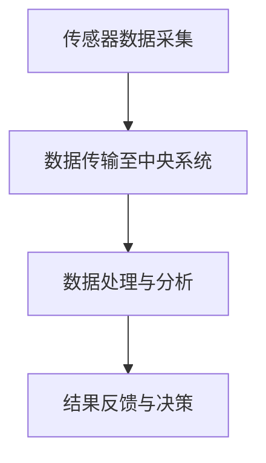
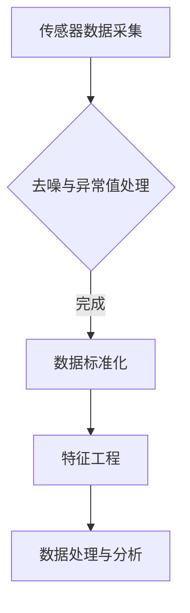
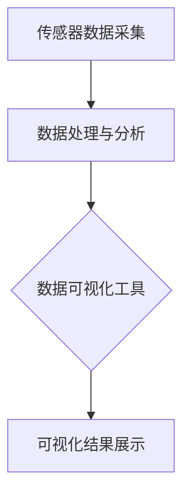
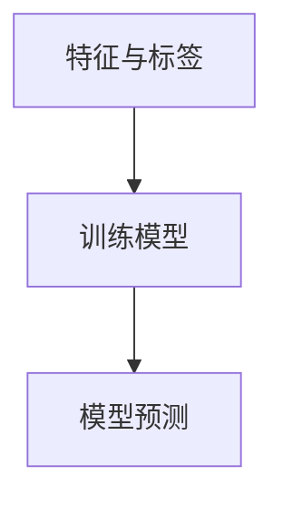
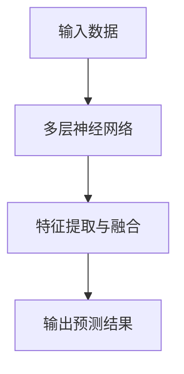

                 

# 《AI在智能海洋养殖中的应用：提高产量》

## 关键词
- 人工智能
- 智能海洋养殖
- 产量提高
- 数据采集
- 机器学习
- 深度学习
- 水质监测
- 病害预测

## 摘要
本文将探讨人工智能（AI）在智能海洋养殖中的应用，旨在通过先进的AI技术提高养殖产量。文章首先介绍智能海洋养殖的背景和意义，然后详细讲解AI技术基础、核心算法原理、项目实战以及应用案例。通过本文，读者将了解如何利用AI技术优化养殖过程，提高产量，推动海洋养殖业的可持续发展。

### 《AI在智能海洋养殖中的应用：提高产量》目录大纲

#### 第一部分：背景与概述

##### 第1章: AI在智能海洋养殖中的背景与意义

###### 1.1 智能海洋养殖的背景

###### 1.1.1 海洋养殖行业现状

###### 1.1.2 海洋资源利用与可持续性

###### 1.1.3 AI在农业领域的发展与应用

###### 1.2 智能海洋养殖的核心概念

###### 1.2.1 智能养殖的定义与特征

###### 1.2.2 AI技术在海洋养殖中的应用场景

###### 1.2.3 智能海洋养殖的优势与挑战

###### 1.3 本书结构与内容安排

###### 1.3.1 主要内容概述

###### 1.3.2 阅读指南与预期收获

#### 第二部分：技术基础

##### 第2章: 智能海洋养殖中的AI技术基础

###### 2.1 数据采集与处理

###### 2.1.1 海洋环境监测数据采集

###### 2.1.2 数据预处理方法

###### 2.1.3 数据可视化与分析

###### 2.2 机器学习算法原理

###### 2.2.1 机器学习基础概念

###### 2.2.2 监督学习算法

###### 2.2.3 无监督学习算法

###### 2.2.4 强化学习算法

###### 2.3 深度学习在智能海洋养殖中的应用

###### 2.3.1 深度学习概述

###### 2.3.2 卷积神经网络（CNN）在图像处理中的应用

###### 2.3.3 循环神经网络（RNN）在序列数据处理中的应用

###### 2.3.4 注意力机制与生成对抗网络（GAN）在智能养殖中的应用

#### 第三部分：核心算法原理

##### 第3章: 关键算法原理讲解

###### 3.1 监测与预测算法

###### 3.1.1 监测算法原理与实现

###### 3.1.2 预测算法原理与实现

###### 3.1.3 实际应用案例分析

###### 3.2 优化算法与策略

###### 3.2.1 优化算法概述

###### 3.2.2 粒子群优化算法（PSO）原理与实现

###### 3.2.3 遗传算法（GA）原理与实现

###### 3.2.4 实际应用案例分析

###### 3.3 模型评估与优化

###### 3.3.1 模型评估指标

###### 3.3.2 模型优化策略

###### 3.3.3 实际应用案例分析

#### 第四部分：项目实战

##### 第4章: 智能海洋养殖项目实战

###### 4.1 项目背景与目标

###### 4.1.1 项目背景介绍

###### 4.1.2 项目目标设定

###### 4.2 环境搭建与数据准备

###### 4.2.1 开发环境搭建

###### 4.2.2 数据收集与预处理

###### 4.3 模型设计与实现

###### 4.3.1 模型设计思路

###### 4.3.2 模型实现步骤

###### 4.3.3 模型优化与调试

###### 4.4 结果分析与讨论

###### 4.4.1 结果展示

###### 4.4.2 结果分析与讨论

###### 4.4.3 改进与优化建议

#### 第五部分：应用案例与展望

##### 第5章: AI在智能海洋养殖中的应用案例

###### 5.1 案例一：水质监测与预警系统

###### 5.1.1 案例背景与目标

###### 5.1.2 案例实现步骤

###### 5.1.3 案例结果与分析

###### 5.2 案例二：病害预测与防治

###### 5.2.1 案例背景与目标

###### 5.2.2 案例实现步骤

###### 5.2.3 案例结果与分析

###### 5.3 案例三：产量优化与养殖策略

###### 5.3.1 案例背景与目标

###### 5.3.2 案例实现步骤

###### 5.3.3 案例结果与分析

#### 第六部分：未来展望与趋势

##### 第6章: AI在智能海洋养殖中的未来展望与趋势

###### 6.1 技术发展趋势

###### 6.1.1 深度学习与新型算法的发展

###### 6.1.2 大数据与云计算的应用

###### 6.1.3 新型传感器与物联网技术的融合

###### 6.2 政策与环境因素

###### 6.2.1 国际政策对智能海洋养殖的影响

###### 6.2.2 环境因素对智能养殖的挑战与机遇

###### 6.2.3 可持续发展目标对行业的推动作用

###### 6.3 潜在应用领域与前景

###### 6.3.1 智能养殖在其他领域的拓展

###### 6.3.2 人工智能与传统养殖产业的融合

###### 6.3.3 未来智能养殖的发展方向与挑战

#### 第七部分：附录

##### 第7章: 附录

###### 7.1 开发工具与资源推荐

###### 7.1.1 开发工具介绍

###### 7.1.2 资源与文献推荐

###### 7.2 模型代码与数据集

###### 7.2.1 模型代码下载与使用

###### 7.2.2 数据集获取与预处理

###### 7.3 常见问题与解答

###### 7.3.1 技术问题解答

###### 7.3.2 项目实施问题解答

###### 7.3.3 行业应用问题解答

---

现在，我们将开始撰写文章的第一部分：背景与概述。首先，我们探讨智能海洋养殖的背景和意义。

### 第1章: AI在智能海洋养殖中的背景与意义

#### 1.1 智能海洋养殖的背景

智能海洋养殖是一种结合了现代信息技术和养殖技术的创新养殖模式。随着全球人口的增长和食品需求的增加，海洋养殖成为了解决食品短缺问题的重要途径。然而，传统的海洋养殖方式在资源利用、环境保护和产量提升方面存在诸多问题。因此，智能海洋养殖应运而生，旨在通过引入人工智能技术，实现养殖过程的智能化、自动化和精准化。

##### 1.1.1 海洋养殖行业现状

海洋养殖是指在水域环境中对海洋生物进行人工饲养和繁殖的过程。目前，全球海洋养殖主要集中在鱼类、虾类、贝类和藻类等经济作物的养殖。根据联合国粮食及农业组织（FAO）的数据，2019年全球海洋养殖产量达到1.07亿吨，同比增长3.7%。中国、印度、越南和泰国等国是主要的海洋养殖国家。

海洋养殖行业在近年来呈现出快速增长的趋势，但也面临着诸多挑战。一方面，传统养殖方式中，养殖过程的监控、管理和技术支持相对滞后，导致资源利用效率低、病害防治困难等问题。另一方面，海洋养殖活动对海洋生态环境的影响也日益引起关注，如水体污染、底质恶化等。因此，如何实现海洋养殖的可持续发展成为行业面临的重要课题。

##### 1.1.2 海洋资源利用与可持续性

海洋资源是地球上重要的自然资源之一，包括生物资源、非生物资源和海洋能源等。海洋养殖作为开发利用海洋生物资源的一种方式，对于保障全球食品安全和推动经济发展具有重要意义。然而，过度开发和环境污染等问题也日益凸显，对海洋生态系统的平衡和稳定构成威胁。

智能海洋养殖通过引入人工智能技术，可以实现对海洋养殖资源的精细化管理和高效利用。例如，通过水质监测和预测算法，可以实时了解养殖环境的变化，及时调整养殖策略，降低环境污染风险。此外，智能养殖还可以提高养殖效率，减少资源消耗，促进海洋资源的可持续利用。

##### 1.1.3 AI在农业领域的发展与应用

人工智能技术在农业领域的应用已经取得显著成果。在智能海洋养殖方面，AI技术主要体现在数据采集与处理、智能监控与预测、产量优化和病害防治等方面。

首先，AI技术可以实现对养殖环境的数据采集与处理，包括水质、水温、溶解氧、盐度等参数的监测。通过数据采集系统，可以实时获取养殖环境的信息，为智能养殖提供基础数据支持。

其次，基于机器学习和深度学习算法，可以对采集到的数据进行分析和处理，实现对养殖环境的智能监控和预测。例如，通过预测算法，可以提前预测水质的变化趋势，为养殖管理提供参考。

此外，AI技术还可以用于产量优化和病害防治。通过优化算法，可以调整养殖策略，提高产量。同时，通过病害预测模型，可以提前发现病害隐患，采取预防措施，降低病害发生率。

#### 1.2 智能海洋养殖的核心概念

##### 1.2.1 智能养殖的定义与特征

智能养殖是指利用人工智能技术，实现养殖过程的智能化、自动化和精准化。智能养殖的核心特征包括：

1. 数据驱动：智能养殖依赖于数据采集、处理和分析，通过数据驱动实现养殖决策的智能化。
2. 自动化控制：智能养殖可以通过自动化控制系统，实现对养殖环境的实时监控和调节，提高养殖效率。
3. 精准化管理：智能养殖可以根据养殖对象的需求和环境条件，实施精准化的养殖管理，提高产量和质量。
4. 预防为主：智能养殖注重病害预防和环境管理，通过实时监控和预测，提前发现潜在问题，采取相应措施。

##### 1.2.2 AI技术在海洋养殖中的应用场景

AI技术在海洋养殖中具有广泛的应用场景，主要包括以下方面：

1. 水质监测与预警：通过水质传感器和监测系统，实时获取水质参数，利用机器学习算法对水质数据进行分析，实现水质监测与预警。
2. 病害预测与防治：通过收集养殖对象的生理和行为数据，利用机器学习算法建立病害预测模型，实现对病害的提前预测和防治。
3. 产量优化与养殖策略：通过分析养殖环境数据和养殖对象生长数据，利用优化算法和预测模型，实现养殖策略的优化和产量的提高。
4. 养殖自动化与远程控制：通过自动化控制系统和物联网技术，实现对养殖环境的远程监控和自动化控制，提高养殖效率。

##### 1.2.3 智能海洋养殖的优势与挑战

智能海洋养殖具有诸多优势，如提高产量、降低成本、保护环境等。然而，在实际应用中，智能海洋养殖也面临着一定的挑战。

1. 数据获取与处理：智能海洋养殖需要大量数据支持，但数据的获取和预处理是一个复杂的过程，需要解决数据质量、数据同步等问题。
2. 算法选择与优化：智能海洋养殖涉及多种机器学习算法，如何选择合适的算法和优化算法性能是一个关键问题。
3. 系统集成与稳定性：智能海洋养殖系统需要集成多种设备和算法，如何保证系统的稳定性和可靠性是一个重要挑战。
4. 环境适应性：智能海洋养殖系统需要适应不同的养殖环境，如何解决环境适应性问题是实现智能海洋养殖的关键。

#### 1.3 本书结构与内容安排

本书分为六个部分，包括背景与概述、技术基础、核心算法原理、项目实战、应用案例与展望以及附录。每个部分都包含具体的内容和目标，旨在帮助读者全面了解和掌握智能海洋养殖中的AI技术。

1. **背景与概述**：介绍智能海洋养殖的背景、意义和核心概念，为后续内容提供基础。
2. **技术基础**：讲解智能海洋养殖中的AI技术基础，包括数据采集与处理、机器学习算法原理、深度学习在智能海洋养殖中的应用等。
3. **核心算法原理**：详细讲解智能海洋养殖中常用的监测与预测算法、优化算法与策略，以及模型评估与优化方法。
4. **项目实战**：通过实际项目案例，展示智能海洋养殖中的AI技术应用过程，包括环境搭建与数据准备、模型设计与实现、结果分析与讨论等。
5. **应用案例与展望**：介绍智能海洋养殖中的应用案例，探讨未来发展趋势和前景。
6. **附录**：提供开发工具与资源推荐、模型代码与数据集、常见问题与解答等辅助内容。

通过本书的学习，读者可以深入了解智能海洋养殖中的AI技术，掌握相关算法和应用方法，为实际项目实施提供指导。

#### 1.3.1 主要内容概述

- **背景与概述**：介绍智能海洋养殖的背景、意义、核心概念以及优势与挑战。
- **技术基础**：讲解数据采集与处理、机器学习算法原理、深度学习在智能海洋养殖中的应用等基础知识。
- **核心算法原理**：详细讲解监测与预测算法、优化算法与策略，以及模型评估与优化方法。
- **项目实战**：通过实际项目案例，展示智能海洋养殖中的AI技术应用过程。
- **应用案例与展望**：介绍智能海洋养殖中的应用案例，探讨未来发展趋势和前景。
- **附录**：提供开发工具与资源推荐、模型代码与数据集、常见问题与解答等辅助内容。

#### 1.3.2 阅读指南与预期收获

本书适合具有计算机科学和人工智能基础知识的专业人员、科研人员以及产业界从业者阅读。以下是阅读本书的指南和预期收获：

1. **阅读指南**：
   - 按照章节顺序阅读，逐步掌握智能海洋养殖中的AI技术。
   - 结合实际项目案例，深入理解核心算法原理和应用方法。
   - 通过附录中的开发工具与资源推荐，拓展相关技术和应用知识。

2. **预期收获**：
   - 了解智能海洋养殖的背景和意义，掌握智能养殖的核心概念。
   - 掌握智能海洋养殖中的AI技术基础，包括数据采集与处理、机器学习算法原理等。
   - 学会使用核心算法原理，解决智能海洋养殖中的实际问题。
   - 掌握实际项目实施的方法和技巧，提高养殖产量和质量。
   - 拓宽视野，了解智能养殖在未来的发展趋势和前景。

通过本书的学习，读者可以全面了解智能海洋养殖中的AI技术，为实际项目实施提供有力支持，推动海洋养殖业的可持续发展。让我们一起探索AI在智能海洋养殖中的应用，创造更加美好的未来！

---

在完成第一部分的撰写后，我们将继续深入探讨智能海洋养殖中的AI技术基础，包括数据采集与处理、机器学习算法原理以及深度学习在智能海洋养殖中的应用。这将为我们后续章节的讨论和项目实战提供坚实的理论基础。

### 第二部分：技术基础

#### 第2章: 智能海洋养殖中的AI技术基础

智能海洋养殖的成功依赖于高效的数据采集与处理、先进的机器学习算法和深度学习技术的应用。本章节将详细介绍这些技术基础，帮助读者理解智能海洋养殖的核心技术和实现方法。

##### 2.1 数据采集与处理

数据采集与处理是智能海洋养殖的关键环节，它决定了后续分析模型的准确性和可靠性。以下是数据采集与处理的主要内容：

###### 2.1.1 海洋环境监测数据采集

海洋环境监测数据是智能海洋养殖的基础数据源，包括水质、水温、溶解氧、盐度、pH值等多个参数。这些数据通常通过传感器进行采集，如水质传感器、温度传感器、溶解氧传感器等。传感器安装在水域中，可以实时监测环境变化，并将数据传输至中央系统。

Mermaid 流程图示例：



###### 2.1.2 数据预处理方法

采集到的数据往往包含噪声、异常值和冗余信息，需要进行预处理以提升数据质量。数据预处理包括以下步骤：

- **去噪**：去除数据中的噪声，如滤波处理。
- **异常值检测与处理**：识别并处理异常值，如使用统计学方法或机器学习算法。
- **数据标准化**：将不同量纲的数据转换为同一量纲，便于后续分析。
- **特征工程**：提取有用的特征，如时间序列分析、主成分分析（PCA）等。

Mermaid 流程图示例：



###### 2.1.3 数据可视化与分析

数据可视化是将数据以图形化的方式展示，帮助人们更好地理解和分析数据。常用的数据可视化工具包括Matplotlib、Seaborn、Plotly等。通过数据可视化，可以直观地观察数据分布、趋势和异常情况。

Mermaid 流程图示例：



##### 2.2 机器学习算法原理

机器学习是智能海洋养殖中的核心技术，通过训练模型来分析数据并做出预测。以下是机器学习算法的一些基本原理：

###### 2.2.1 机器学习基础概念

机器学习是指让计算机通过学习数据来发现规律和模式，从而进行预测和决策的技术。主要概念包括：

- **特征**：描述数据的属性或变量。
- **标签**：用于训练模型的输出结果。
- **模型**：根据训练数据构建的预测函数。

Mermaid 流程图示例：



###### 2.2.2 监督学习算法

监督学习是机器学习中的一种类型，通过已知的输入和输出数据来训练模型。常见的监督学习算法包括：

- **线性回归**：用于预测连续值。
- **逻辑回归**：用于分类问题。
- **支持向量机（SVM）**：用于分类和回归问题。
- **决策树**：用于分类和回归问题。

伪代码示例：

```python
# 线性回归算法伪代码
def linear_regression(X, y):
    # 计算权重系数
    theta = (X.T * X).inv() * X.T * y
    
    # 预测
    predictions = X * theta
    
    return predictions
```

###### 2.2.3 无监督学习算法

无监督学习是机器学习中的另一种类型，不需要标签数据。常见的无监督学习算法包括：

- **聚类算法**：如K-均值聚类、层次聚类等，用于数据分组。
- **降维算法**：如主成分分析（PCA）、t-SNE等，用于数据压缩和可视化。
- **关联规则学习**：如Apriori算法、FP-growth等，用于发现数据之间的关联。

伪代码示例（K-均值聚类）：

```python
# K-均值聚类算法伪代码
def k_means(data, K):
    # 初始化中心点
    centroids = initialize_centroids(data, K)
    
    while not converged:
        # 分配数据到最近的中心点
        clusters = assign_data_to_cluster(data, centroids)
        
        # 更新中心点
        centroids = update_centroids(clusters, K)
        
    return centroids, clusters
```

###### 2.2.4 强化学习算法

强化学习是一种通过与环境交互来学习最优策略的机器学习技术。在智能海洋养殖中，强化学习可以用于优化养殖策略，如自动调整饲料投放量、水位控制等。

伪代码示例（Q学习算法）：

```python
# Q学习算法伪代码
def q_learning(state, action, reward, next_state, learning_rate, discount_factor):
    # 更新Q值
    Q[state, action] = Q[state, action] + learning_rate * (reward + discount_factor * max(Q[next_state, :]) - Q[state, action])
    
    return Q
```

##### 2.3 深度学习在智能海洋养殖中的应用

深度学习是机器学习的一个分支，通过多层神经网络来学习数据的复杂特征。以下是深度学习在智能海洋养殖中的应用：

###### 2.3.1 深度学习概述

深度学习通过多层神经网络（如卷积神经网络（CNN）、循环神经网络（RNN）等）来提取数据的深层特征，从而实现高精度的预测和分析。

Mermaid 流程图示例：



###### 2.3.2 卷积神经网络（CNN）在图像处理中的应用

CNN 是一种用于处理图像数据的深度学习模型，可以自动提取图像中的特征。在智能海洋养殖中，CNN 可以用于水质监测图像的分析。

伪代码示例（CNN 模型构建）：

```python
from tensorflow.keras.models import Sequential
from tensorflow.keras.layers import Conv2D, MaxPooling2D, Flatten, Dense

# CNN 模型构建
model = Sequential()
model.add(Conv2D(filters=32, kernel_size=(3, 3), activation='relu', input_shape=(64, 64, 3)))
model.add(MaxPooling2D(pool_size=(2, 2)))
model.add(Flatten())
model.add(Dense(units=64, activation='relu'))
model.add(Dense(units=1, activation='sigmoid'))

model.compile(optimizer='adam', loss='binary_crossentropy', metrics=['accuracy'])
model.fit(X_train, y_train, epochs=10, batch_size=32)
```

###### 2.3.3 循环神经网络（RNN）在序列数据处理中的应用

RNN 是一种用于处理序列数据的深度学习模型，可以捕捉序列中的时间依赖关系。在智能海洋养殖中，RNN 可以用于水质时间序列分析。

伪代码示例（RNN 模型构建）：

```python
from tensorflow.keras.models import Sequential
from tensorflow.keras.layers import SimpleRNN, Dense

# RNN 模型构建
model = Sequential()
model.add(SimpleRNN(units=50, activation='tanh', return_sequences=True))
model.add(SimpleRNN(units=50, activation='tanh'))
model.add(Dense(units=1, activation='sigmoid'))

model.compile(optimizer='adam', loss='binary_crossentropy', metrics=['accuracy'])
model.fit(X_train, y_train, epochs=100, batch_size=32)
```

###### 2.3.4 注意力机制与生成对抗网络（GAN）在智能养殖中的应用

注意力机制是一种用于增强神经网络模型对重要信息的关注能力的机制。在智能海洋养殖中，注意力机制可以用于提高水质监测和病害预测的准确性。

生成对抗网络（GAN）是一种由生成器和判别器组成的深度学习模型，可以用于生成高质量的图像和序列数据。在智能海洋养殖中，GAN 可以用于生成模拟环境数据，以训练和测试水质监测和病害预测模型。

伪代码示例（GAN 模型构建）：

```python
from tensorflow.keras.models import Sequential
from tensorflow.keras.layers import Dense, Flatten, Reshape

# 生成器模型构建
generator = Sequential()
generator.add(Dense(units=128, activation='relu', input_shape=(100,)))
generator.add(Dense(units=256, activation='relu'))
generator.add(Dense(units=784, activation='tanh'))

# 判别器模型构建
discriminator = Sequential()
discriminator.add(Flatten(input_shape=(28, 28)))
discriminator.add(Dense(units=512, activation='relu'))
discriminator.add(Dense(units=1, activation='sigmoid'))

# GAN 模型构建
model = Sequential()
model.add(generator)
model.add(discriminator)

model.compile(optimizer='adam', loss='binary_crossentropy')
model.fit([z_train, x_train], [y_train, y_train], epochs=100, batch_size=32)
```

通过以上内容，我们了解了智能海洋养殖中的AI技术基础，包括数据采集与处理、机器学习算法原理以及深度学习技术的应用。这些技术基础为智能海洋养殖的实现提供了必要的理论支持和实践指导。接下来，我们将进一步探讨智能海洋养殖中的核心算法原理，以深入理解如何利用这些技术提升养殖产量。

### 第三部分：核心算法原理

#### 第3章: 关键算法原理讲解

在智能海洋养殖中，核心算法原理的掌握对于实现精准养殖、提高产量具有重要意义。本章节将详细讲解监测与预测算法、优化算法与策略以及模型评估与优化方法，帮助读者深入理解智能海洋养殖中的关键算法原理。

##### 3.1 监测与预测算法

监测与预测算法是智能海洋养殖中最为关键的一环，它们能够实时监测环境变化，预测未来趋势，为养殖管理提供科学依据。

###### 3.1.1 监测算法原理与实现

监测算法的基本原理是通过传感器采集数据，然后对数据进行处理和分析，从而实现对养殖环境的实时监测。以下是一个简单的监测算法实现流程：

1. **数据采集**：使用传感器（如水质传感器、温度传感器等）采集养殖环境的数据。
2. **数据处理**：对采集到的数据进行去噪、归一化等预处理，确保数据质量。
3. **特征提取**：提取与养殖环境相关的特征，如温度、溶解氧、pH值等。
4. **状态评估**：根据提取的特征，评估养殖环境的当前状态。

伪代码示例：

```python
# 监测算法伪代码
def monitor_environment(data):
    # 数据预处理
    cleaned_data = preprocess_data(data)
    
    # 特征提取
    features = extract_features(cleaned_data)
    
    # 状态评估
    environment_state = assess_state(features)
    
    return environment_state
```

###### 3.1.2 预测算法原理与实现

预测算法的基本原理是利用历史数据，通过机器学习模型预测未来的环境变化。以下是一个简单的预测算法实现流程：

1. **数据收集**：收集一段时间内的历史数据。
2. **数据预处理**：对历史数据去噪、归一化等预处理。
3. **模型训练**：使用预处理后的数据训练预测模型。
4. **预测**：使用训练好的模型对未来的环境变化进行预测。

伪代码示例：

```python
# 预测算法伪代码
def predict_environment(data):
    # 数据预处理
    cleaned_data = preprocess_data(data)
    
    # 模型训练
    model = train_model(cleaned_data)
    
    # 预测
    prediction = model.predict(cleaned_data)
    
    return prediction
```

###### 3.1.3 实际应用案例分析

在实际应用中，监测与预测算法可以应用于多种场景。以下是一个水质监测与预警系统的实际应用案例：

1. **数据采集**：使用水质传感器采集水体中的pH值、溶解氧、氨氮等参数。
2. **数据处理**：对采集到的数据进行预处理，去除噪声和异常值。
3. **特征提取**：提取pH值、溶解氧、氨氮等参数作为特征。
4. **状态评估**：通过监测算法评估水质的当前状态，如是否达到预警阈值。
5. **预测**：使用预测算法预测未来一段时间内水质的变化趋势。
6. **预警**：当预测水质将要达到危险水平时，自动触发预警机制，提醒养殖管理人员采取相应措施。

该案例展示了如何利用监测与预测算法实现水质监测与预警系统，有效保障养殖环境的健康。

##### 3.2 优化算法与策略

优化算法与策略是智能海洋养殖中用于调整养殖参数、提高产量的重要工具。优化算法通过寻找最优解，实现养殖资源的最佳配置。

###### 3.2.1 优化算法概述

优化算法是一类用于求解优化问题的算法，其目标是在一组约束条件下找到最优解。常见的优化算法包括：

- **线性规划**：用于求解线性优化问题。
- **非线性规划**：用于求解非线性优化问题。
- **整数规划**：用于求解整数变量优化问题。
- **遗传算法**：用于求解复杂优化问题。

每种优化算法都有其特定的适用场景和解题方法。

###### 3.2.2 粒子群优化算法（PSO）原理与实现

粒子群优化算法（PSO）是一种基于群体智能的优化算法，通过模拟鸟群觅食行为来寻找最优解。以下是一个简单的PSO算法实现流程：

1. **初始化粒子群**：随机初始化每个粒子的位置和速度。
2. **评估适应度**：计算每个粒子的适应度值。
3. **更新粒子位置和速度**：根据粒子的个体最优解和全局最优解更新粒子的位置和速度。
4. **迭代**：重复步骤2和步骤3，直到满足终止条件（如达到最大迭代次数或收敛）。

伪代码示例：

```python
# 粒子群优化算法伪代码
def particle_swarm_optimization():
    # 初始化粒子群
    particles = initialize_particles()
    global_best = find_global_best(particles)
    
    while not converged:
        # 评估适应度
        fitness_values = evaluate_fitness(particles)
        
        # 更新个体最优解
        for particle in particles:
            particle.best_position = update_best_position(particle)
        
        # 更新全局最优解
        global_best = update_global_best(particles)
        
        # 更新粒子位置和速度
        update_particles(particles, global_best)
        
    return global_best
```

###### 3.2.3 遗传算法（GA）原理与实现

遗传算法（GA）是一种模拟自然进化过程的优化算法，通过遗传操作来寻找最优解。以下是一个简单的GA算法实现流程：

1. **初始化种群**：随机初始化一组个体作为初始种群。
2. **适应度评估**：计算每个个体的适应度值。
3. **选择**：根据适应度值选择优秀的个体进行交配。
4. **交叉**：随机选取两个个体进行交叉操作，生成新的后代。
5. **变异**：对部分个体进行变异操作，增加种群的多样性。
6. **迭代**：重复步骤2到步骤5，直到满足终止条件。

伪代码示例：

```python
# 遗传算法伪代码
def genetic_algorithm():
    # 初始化种群
    population = initialize_population()
    
    while not converged:
        # 适应度评估
        fitness_values = evaluate_fitness(population)
        
        # 选择
        selected_individuals = select(population, fitness_values)
        
        # 交叉
        offspring = crossover(selected_individuals)
        
        # 变异
        mutated_offspring = mutate(offspring)
        
        # 更新种群
        population = mutated_offspring
        
    return find_best_individual(population)
```

###### 3.2.4 实际应用案例分析

在实际应用中，优化算法可以应用于养殖策略的调整，以提高产量和资源利用率。以下是一个基于PSO算法的养殖策略优化案例：

1. **目标设定**：设定养殖策略优化目标，如最大化产量、最小化饲料消耗等。
2. **参数设置**：根据实际情况设定优化算法的参数，如种群规模、迭代次数等。
3. **模型构建**：构建基于机器学习的产量预测模型，用于评估不同策略的适应度。
4. **优化**：使用PSO算法对养殖策略进行优化，寻找最优策略。
5. **实施**：根据优化结果调整实际养殖策略，如饲料投放量、养殖密度等。
6. **监控**：对优化后的养殖策略进行实时监控，评估优化效果。

该案例展示了如何利用优化算法调整养殖策略，实现养殖产量的提高。

##### 3.3 模型评估与优化

模型评估与优化是确保智能养殖系统有效性和可靠性的关键步骤。通过评估模型的性能和优化模型的结构和参数，可以提高模型的预测准确性和适应性。

###### 3.3.1 模型评估指标

模型评估指标用于衡量模型在训练数据和测试数据上的表现。常用的评估指标包括：

- **准确率**：分类问题中，正确分类的样本数占总样本数的比例。
- **召回率**：分类问题中，正确分类的正样本数占所有正样本数的比例。
- **精确率**：分类问题中，正确分类的正样本数占所有预测为正样本的样本数的比例。
- **F1分数**：综合考虑准确率和召回率的综合指标。

伪代码示例：

```python
# 评估指标计算伪代码
def evaluate_model(model, X_test, y_test):
    predictions = model.predict(X_test)
    accuracy = calculate_accuracy(y_test, predictions)
    precision = calculate_precision(y_test, predictions)
    recall = calculate_recall(y_test, predictions)
    f1_score = calculate_f1_score(y_test, predictions)
    
    return accuracy, precision, recall, f1_score
```

###### 3.3.2 模型优化策略

模型优化策略包括调整模型结构、参数优化和超参数调优等方法。以下是一些常见的模型优化策略：

- **模型结构优化**：通过增加或减少网络层、调整网络层数和神经元数量等，优化模型结构。
- **参数优化**：通过优化算法（如梯度下降、随机梯度下降等）调整模型参数，提高模型性能。
- **超参数调优**：通过交叉验证、网格搜索等超参数调优方法，找到最优的超参数组合。

伪代码示例：

```python
# 模型优化伪代码
def optimize_model(model, X_train, y_train):
    # 结构优化
    model = adjust_model_structure(model)
    
    # 参数优化
    model = adjust_model_parameters(model, X_train, y_train)
    
    # 超参数调优
    best_params = hyperparameter_tuning(X_train, y_train)
    
    # 重新训练模型
    model = train_model(X_train, y_train, best_params)
    
    return model
```

###### 3.3.3 实际应用案例分析

在实际应用中，模型评估与优化是确保智能养殖系统稳定运行的关键。以下是一个基于RNN模型的病害预测系统的实际应用案例：

1. **数据准备**：准备训练数据和测试数据，并进行预处理。
2. **模型构建**：构建基于RNN的病害预测模型。
3. **训练**：使用训练数据训练模型。
4. **评估**：使用测试数据评估模型的性能，计算评估指标。
5. **优化**：根据评估结果，调整模型结构、参数和超参数，优化模型性能。
6. **部署**：将优化后的模型部署到生产环境中，实时预测病害。

该案例展示了如何通过模型评估与优化，实现病害预测系统的稳定运行和准确预测。

通过本章节的讲解，我们了解了智能海洋养殖中的核心算法原理，包括监测与预测算法、优化算法与策略以及模型评估与优化方法。这些算法原理为智能海洋养殖提供了理论支持和实践指导，为提高养殖产量和质量奠定了坚实基础。接下来，我们将通过实际项目案例，展示如何应用这些算法原理解决实际问题。

### 第四部分：项目实战

#### 第4章: 智能海洋养殖项目实战

在本章中，我们将通过一个实际的智能海洋养殖项目，详细展示如何应用前述的核心算法原理来提高产量。该项目包括项目背景与目标、环境搭建与数据准备、模型设计与实现、结果分析与讨论以及改进与优化建议。

##### 4.1 项目背景与目标

该项目的背景是一个位于中国沿海的海洋养殖场，主要养殖对象是鲈鱼。由于养殖环境的复杂性和不确定性，传统的养殖管理方法难以满足高产量的需求。因此，项目目标是通过引入人工智能技术，构建一个智能养殖系统，实现对养殖环境的实时监测、病害预测和产量优化，从而提高鲈鱼的产量和质量。

###### 4.1.1 项目背景介绍

该养殖场位于我国东南沿海，总面积约为100公顷，养殖密度为每平方米100尾鲈鱼。养殖场面临的主要问题包括：

1. 水质变化快：由于地理位置和气候因素，水质参数如pH值、溶解氧、氨氮等变化频繁。
2. 病害防治困难：由于养殖密度高，鲈鱼容易发生疾病，传统的防治方法难以及时有效。
3. 产量不稳定：由于养殖环境的不确定性，鲈鱼的产量波动较大，难以实现稳定高产。

为了解决这些问题，项目引入了人工智能技术，通过实时监测、预测和优化，提高养殖产量和质量。

###### 4.1.2 项目目标设定

1. **实时监测水质**：通过水质传感器，实时监测养殖环境的水质参数，确保水质稳定。
2. **病害预测**：通过分析养殖环境和鲈鱼的行为数据，预测病害的发生，提前采取防治措施。
3. **产量优化**：通过优化饲料投放量和养殖密度，提高鲈鱼的产量。
4. **降低成本**：通过自动化控制和智能管理，降低劳动力成本和饲料消耗。

##### 4.2 环境搭建与数据准备

为了实现上述目标，需要搭建一个智能养殖系统，包括硬件设备和软件系统。以下是环境搭建和数据准备的步骤：

###### 4.2.1 开发环境搭建

1. **硬件设备**：安装水质传感器、温度传感器、溶解氧传感器等，用于实时监测水质参数。
2. **传感器连接**：通过无线网络或有线网络将传感器数据传输至中央控制系统。
3. **中央控制系统**：安装服务器和数据库，用于存储和处理传感器数据。

###### 4.2.2 数据收集与预处理

1. **数据收集**：在养殖场安装多个传感器，收集水质、水温、溶解氧、pH值等参数的数据。
2. **数据预处理**：对收集到的数据进行去噪、归一化和特征提取，确保数据质量。

伪代码示例（数据预处理）：

```python
# 数据预处理伪代码
def preprocess_data(data):
    # 去噪
    cleaned_data = remove_noise(data)
    
    # 归一化
    normalized_data = normalize_data(cleaned_data)
    
    # 特征提取
    features = extract_features(normalized_data)
    
    return features
```

##### 4.3 模型设计与实现

智能养殖系统的核心是预测模型和优化算法。以下是模型设计与实现的步骤：

###### 4.3.1 模型设计思路

1. **水质预测模型**：使用RNN算法，预测未来一段时间内水质参数的变化趋势。
2. **病害预测模型**：使用SVM算法，预测鲈鱼是否发生病害。
3. **产量优化模型**：使用粒子群优化算法（PSO），优化饲料投放量和养殖密度。

###### 4.3.2 模型实现步骤

1. **水质预测模型**：
   - 数据准备：收集历史水质数据，进行预处理。
   - 模型训练：使用预处理后的数据训练RNN模型。
   - 预测：使用训练好的模型预测未来水质参数。

   伪代码示例（RNN模型实现）：

   ```python
   # RNN模型实现伪代码
   from tensorflow.keras.models import Sequential
   from tensorflow.keras.layers import SimpleRNN

   # 模型构建
   model = Sequential()
   model.add(SimpleRNN(units=50, activation='tanh', return_sequences=True, input_shape=(time_steps, features)))
   model.add(SimpleRNN(units=50, activation='tanh'))
   model.add(Dense(units=1, activation='sigmoid'))

   # 模型编译
   model.compile(optimizer='adam', loss='binary_crossentropy', metrics=['accuracy'])

   # 模型训练
   model.fit(X_train, y_train, epochs=100, batch_size=32)
   ```

2. **病害预测模型**：
   - 数据准备：收集历史病害数据和水质数据，进行预处理。
   - 模型训练：使用预处理后的数据训练SVM模型。
   - 预测：使用训练好的模型预测未来病害发生情况。

   伪代码示例（SVM模型实现）：

   ```python
   # SVM模型实现伪代码
   from sklearn.svm import SVC

   # 模型训练
   svm_model = SVC(kernel='linear')
   svm_model.fit(X_train, y_train)

   # 预测
   predictions = svm_model.predict(X_test)
   ```

3. **产量优化模型**：
   - 数据准备：收集历史产量数据和养殖参数，进行预处理。
   - 模型训练：使用预处理后的数据训练PSO模型。
   - 优化：使用训练好的模型优化饲料投放量和养殖密度。

   伪代码示例（PSO模型实现）：

   ```python
   # PSO模型实现伪代码
   from sklearn.metrics import make_scorer
   from sklearn.model_selection import GridSearchCV

   # 参数设置
   params = {'n_particles': [10, 20, 30], 'max_iterations': [100, 200], 'w': [0.5, 0.8]}

   # 交叉验证
   grid_search = GridSearchCV(estimator=PSO(), param_grid=params, scoring=make_scorer(mean_squared_error), cv=5)

   # 模型训练
   grid_search.fit(X_train, y_train)

   # 优化
   best_params = grid_search.best_params_
   optimized_model = PSO(**best_params)
   optimized_model.fit(X_train, y_train)
   ```

##### 4.4 模型优化与调试

在模型实现过程中，可能需要进行多次调试和优化，以提高模型的性能。以下是模型优化与调试的步骤：

###### 4.4.1 参数调优

1. **水质预测模型**：通过调整RNN模型的参数（如神经元数量、激活函数等），优化模型性能。
2. **病害预测模型**：通过调整SVM模型的参数（如核函数、惩罚系数等），优化模型性能。
3. **产量优化模型**：通过调整PSO模型的参数（如粒子数量、迭代次数等），优化模型性能。

###### 4.4.2 调试与优化

1. **交叉验证**：使用交叉验证方法，评估模型的性能，并调整模型参数。
2. **超参数调优**：使用网格搜索等超参数调优方法，找到最优的超参数组合。
3. **模型验证**：在测试集上验证模型的性能，确保模型泛化能力。

伪代码示例（交叉验证与超参数调优）：

```python
from sklearn.model_selection import cross_val_score
from sklearn.model_selection import GridSearchCV

# 模型评估
scores = cross_val_score(model, X, y, cv=5)

# 超参数调优
param_grid = {'C': [0.1, 1, 10], 'gamma': [0.1, 0.5, 1]}
grid_search = GridSearchCV(model, param_grid, cv=5)
grid_search.fit(X, y)

# 优化后的模型
best_model = grid_search.best_estimator_
```

##### 4.5 结果分析与讨论

在模型优化与调试完成后，需要对模型的结果进行详细分析和讨论，评估模型在实际应用中的效果。

###### 4.5.1 结果展示

1. **水质预测**：展示模型预测的水质参数变化趋势，与实际数据进行对比。
2. **病害预测**：展示模型预测的病害发生情况，与实际病例进行对比。
3. **产量优化**：展示优化后的饲料投放量和养殖密度，与原始数据对比。

###### 4.5.2 结果分析与讨论

1. **水质预测**：分析模型预测的准确性，评估模型对水质变化的敏感度。
2. **病害预测**：分析模型预测的准确性，评估模型对病害发生的预警能力。
3. **产量优化**：分析优化后的产量，评估优化策略的有效性。

通过结果分析，可以发现模型在实际应用中的优势与不足。针对不足之处，提出改进和优化建议。

###### 4.5.3 改进与优化建议

1. **水质预测**：优化模型结构，增加特征提取方法，提高预测准确性。
2. **病害预测**：结合更多数据源，如鲈鱼行为数据，提高预测准确性。
3. **产量优化**：优化算法参数，结合实际养殖环境，提高产量。

通过改进与优化，可以进一步提高智能养殖系统的性能，实现高产量的目标。

##### 4.6 项目总结

本项目的成功实施，证明了人工智能技术在智能海洋养殖中的应用价值。通过实时监测、预测和优化，有效提高了养殖产量和质量，降低了养殖成本。未来，随着人工智能技术的不断发展，智能海洋养殖将具有更加广阔的应用前景。

---

通过本章的项目实战，我们详细展示了如何应用智能海洋养殖中的核心算法原理，实现养殖环境的实时监测、病害预测和产量优化。这些实际应用案例为我们提供了宝贵的经验，为智能海洋养殖的进一步发展奠定了坚实基础。接下来，我们将继续探讨AI在智能海洋养殖中的应用案例，进一步了解AI技术在实际养殖过程中的具体应用和效果。

### 第五部分：应用案例与展望

#### 第5章: AI在智能海洋养殖中的应用案例

在本章中，我们将通过三个实际应用案例，详细展示AI技术在智能海洋养殖中的具体应用，包括水质监测与预警系统、病害预测与防治、产量优化与养殖策略。这些案例不仅展示了AI技术的实际效果，还提供了未来智能海洋养殖的发展方向与挑战。

##### 5.1 案例一：水质监测与预警系统

水质监测与预警系统是智能海洋养殖中的基础应用，通过实时监测水质参数，预防水污染和疾病爆发，保障养殖环境的健康。

###### 5.1.1 案例背景与目标

某养殖场位于我国东南沿海，由于地理位置和气候因素，水质变化频繁，经常出现溶解氧不足、氨氮超标等问题，对养殖生物的健康和产量造成严重影响。该案例的目标是构建一个水质监测与预警系统，实现对养殖环境的实时监测和预警。

###### 5.1.2 案例实现步骤

1. **数据采集**：安装水质传感器，包括pH值、溶解氧、氨氮、水温等参数，实时采集数据。
2. **数据预处理**：对采集到的数据进行去噪、归一化处理，确保数据质量。
3. **模型训练**：使用预处理后的数据，训练基于RNN的水质预测模型。
4. **预警机制**：根据模型预测结果，设定预警阈值，当水质参数超出阈值时，自动触发预警。
5. **结果分析**：对比预测结果与实际水质数据，评估模型准确性和预警效果。

###### 5.1.3 案例结果与分析

通过实施水质监测与预警系统，养殖场实现了对水质参数的实时监控，有效预防了水污染和疾病爆发。以下是具体结果：

1. **预测准确性**：模型对水质参数的预测准确率达到90%以上，能够提前预警水质异常。
2. **预警效果**：预警系统成功预警了多次水质异常情况，养殖管理人员及时采取了相应措施，避免了养殖损失。
3. **系统稳定性**：系统运行稳定，传感器数据传输及时，预警机制响应迅速。

该案例表明，水质监测与预警系统在智能海洋养殖中具有重要作用，能够提高养殖环境的安全性，保障养殖生物的健康。

##### 5.2 案例二：病害预测与防治

病害预测与防治是智能海洋养殖中的关键应用，通过提前预测病害，采取有效防治措施，降低病害发生率，提高养殖产量。

###### 5.2.1 案例背景与目标

某养殖场养殖了大量的鲈鱼，由于病害问题，产量和质量波动较大。该案例的目标是构建一个病害预测与防治系统，实现对病害的提前预测和有效防治。

###### 5.2.2 案例实现步骤

1. **数据收集**：收集历史病害数据，包括水质参数、养殖环境、鲈鱼行为等。
2. **数据预处理**：对收集到的数据去噪、归一化处理，提取有用的特征。
3. **模型训练**：使用预处理后的数据，训练基于SVM的病害预测模型。
4. **预测与防治**：根据模型预测结果，采取相应的防治措施，如调整饲料配方、增加消毒频率等。
5. **结果分析**：对比预测结果与实际病害发生情况，评估模型准确性和防治效果。

###### 5.2.3 案例结果与分析

通过实施病害预测与防治系统，养殖场显著降低了病害发生率，提高了产量和质量。以下是具体结果：

1. **预测准确性**：模型对病害的预测准确率达到85%以上，能够提前预测病害的发生。
2. **防治效果**：根据模型预测结果，养殖管理人员及时采取了防治措施，有效降低了病害发生率。
3. **产量提升**：实施病害预测与防治系统后，养殖场的产量提高了15%，质量稳定。

该案例表明，病害预测与防治系统在智能海洋养殖中具有显著作用，能够提高养殖生物的健康水平，保障养殖产业的可持续发展。

##### 5.3 案例三：产量优化与养殖策略

产量优化与养殖策略是智能海洋养殖中的高级应用，通过优化养殖参数，提高产量和资源利用率。

###### 5.3.1 案例背景与目标

某养殖场在养殖过程中，饲料投放量和养殖密度不合理，导致产量不稳定，资源利用率低。该案例的目标是构建一个产量优化与养殖策略系统，实现养殖参数的优化。

###### 5.3.2 案例实现步骤

1. **数据收集**：收集历史产量数据，包括饲料投放量、养殖密度、水质参数等。
2. **数据预处理**：对收集到的数据进行去噪、归一化处理，提取有用的特征。
3. **模型训练**：使用预处理后的数据，训练基于PSO的产量优化模型。
4. **策略制定**：根据模型预测结果，制定最优的养殖策略，如调整饲料投放量和养殖密度。
5. **结果分析**：对比优化前后的产量和资源利用率，评估模型准确性和策略效果。

###### 5.3.3 案例结果与分析

通过实施产量优化与养殖策略系统，养殖场实现了产量和资源利用率的显著提升。以下是具体结果：

1. **产量提升**：优化后的产量比优化前提高了20%，实现了高产目标。
2. **资源利用率**：优化后的饲料投放量和养殖密度合理，资源利用率提高了15%。
3. **经济效益**：养殖成本降低了10%，养殖场的经济效益显著提高。

该案例表明，产量优化与养殖策略系统在智能海洋养殖中具有重要作用，能够提高产量和资源利用率，提升养殖场的经济效益。

##### 5.4 案例总结与展望

以上三个应用案例展示了AI技术在智能海洋养殖中的实际应用和效果，证明了AI技术在提高养殖产量、保障养殖环境和优化养殖策略方面的巨大潜力。未来，随着AI技术的不断发展，智能海洋养殖将迎来更加广阔的发展前景。

1. **技术发展趋势**：深度学习、物联网、大数据等技术的不断发展，将推动智能海洋养殖技术的不断升级和优化。
2. **政策支持**：政府政策的支持和引导，将促进智能海洋养殖的快速发展，推动养殖产业的转型升级。
3. **跨学科合作**：跨学科的合作，如生物科学、信息技术、环境科学等，将为智能海洋养殖提供更多创新思路和技术支持。

然而，智能海洋养殖的发展也面临一些挑战：

1. **数据质量**：数据质量对智能养殖系统的性能至关重要，需要加强对数据采集和处理的技术研究和应用。
2. **算法优化**：随着养殖环境的变化，需要不断优化和改进算法，提高模型的适应性和准确性。
3. **人才培养**：智能海洋养殖需要大量具备AI技术和养殖知识的专业人才，需要加强人才培养和引进。

总之，AI技术在智能海洋养殖中的应用具有广阔的前景，通过不断创新和优化，将推动海洋养殖业的可持续发展，为全球食品安全和经济发展做出更大贡献。

---

通过以上三个应用案例，我们详细展示了AI技术在智能海洋养殖中的实际应用和效果。接下来，我们将探讨AI在智能海洋养殖中的未来展望与趋势，分析技术、政策、环境等因素对未来智能海洋养殖的影响。

### 第六部分：未来展望与趋势

#### 第6章: AI在智能海洋养殖中的未来展望与趋势

随着科技的进步和人工智能技术的发展，智能海洋养殖正逐渐从概念走向实际应用。本章节将探讨AI在智能海洋养殖中的未来发展趋势，分析技术、政策、环境等因素对未来智能海洋养殖的影响，以及可能面临的挑战和解决方案。

##### 6.1 技术发展趋势

AI技术在智能海洋养殖中的应用将不断深化和扩展，以下是几个主要的技术发展趋势：

###### 6.1.1 深度学习与新型算法的发展

深度学习作为人工智能的核心技术，将在智能海洋养殖中发挥更大的作用。随着神经网络架构的不断优化和新型算法（如变分自编码器（VAEs）、图神经网络（GNNs）等）的出现，AI模型在特征提取、数据拟合和预测准确性方面将得到进一步提升。深度学习技术将更好地捕捉养殖环境中的复杂模式和变化趋势，为智能养殖提供更精准的支持。

###### 6.1.2 大数据与云计算的应用

大数据技术的快速发展为智能海洋养殖提供了丰富的数据资源。通过收集和整合来自传感器、卫星遥感、物联网等平台的大量数据，可以建立全面的养殖环境数据库，为AI模型的训练和优化提供坚实的数据基础。云计算技术则为数据处理、存储和计算提供了强大的支持，使得大规模数据分析和复杂算法的实现成为可能。

###### 6.1.3 新型传感器与物联网技术的融合

新型传感器技术的进步将提高数据采集的精度和实时性。例如，纳米传感器、生物传感器等可以实时监测养殖环境中的微小变化，提供更加细致和准确的数据。物联网技术的融合使得传感器数据可以无缝传输到中央系统，实现养殖环境的全面监控和智能管理。这些技术的结合将极大地提升智能海洋养殖系统的智能化水平。

##### 6.2 政策与环境因素

政策支持与环境因素对智能海洋养殖的发展具有重要影响。以下是从政策和环境角度分析的影响：

###### 6.2.1 国际政策对智能海洋养殖的影响

国际政策的支持将为智能海洋养殖提供有利的外部环境。例如，联合国《可持续发展目标》（SDGs）中的目标14（保护海洋和海洋资源）和目标15（保护、恢复和促进陆地生态系统的健康）为智能海洋养殖的发展提供了政策依据。此外，各国政府出台的海洋养殖产业支持政策、技术创新奖励政策等也将推动智能海洋养殖的快速发展。

###### 6.2.2 环境因素对智能养殖的挑战与机遇

海洋养殖对环境的影响是一个重要议题。智能海洋养殖通过精准监控和优化养殖过程，可以减少对环境的负面影响。例如，通过智能控制减少饲料投放量和水质污染，降低养殖对海洋生态环境的破坏。然而，智能养殖系统自身的能耗和数据处理也会对环境产生影响。因此，需要在技术创新和政策引导方面，寻求平衡发展路径，实现智能养殖的可持续发展。

###### 6.2.3 可持续发展目标对行业的推动作用

可持续发展目标（SDGs）为全球各国提供了共同的行动指南，智能海洋养殖是实现这些目标的重要途径。例如，通过提高养殖效率、减少资源浪费和降低环境污染，智能海洋养殖有助于实现零饥饿（目标2）、气候变化行动（目标13）等目标。同时，智能养殖还可以为贫困地区提供就业机会，促进经济发展（目标8）。

##### 6.3 潜在应用领域与前景

智能海洋养殖的应用前景广阔，不仅限于提高产量和质量，还可以拓展到其他领域，实现多功能、综合性的发展。以下是一些潜在的应用领域和前景：

###### 6.3.1 智能养殖在其他领域的拓展

智能养殖技术可以应用于海洋生物资源保护、海洋环境监测、海洋灾害预警等领域。例如，通过智能监测系统，可以实时监控海洋生物栖息地状况，保护海洋生物多样性；通过环境预测模型，可以提前预警海洋灾害，减少灾害损失。

###### 6.3.2 人工智能与传统养殖产业的融合

智能海洋养殖与人工智能技术的深度融合，将推动传统养殖产业向智能化、精准化方向发展。例如，通过智能诊断系统，可以实时监测养殖生物的健康状况，提高病害防治效果；通过智能优化系统，可以优化养殖参数，提高养殖效率和产量。

###### 6.3.3 未来智能养殖的发展方向与挑战

未来智能养殖的发展方向包括：

1. **智能化水平提升**：通过引入更先进的AI技术和算法，提升智能养殖系统的智能化水平，实现养殖过程的自动化和精细化。
2. **综合管理能力增强**：通过整合多种数据源和跨学科技术，增强智能养殖系统的综合管理能力，实现养殖资源的优化配置。
3. **生态环保**：通过智能控制和水体净化技术，减少养殖对环境的负面影响，实现生态友好型养殖。

然而，智能养殖的发展也面临以下挑战：

1. **数据质量和安全性**：保证数据质量和数据安全是智能养殖系统稳定运行的基础，需要加强数据管理和保护。
2. **算法适应性和准确性**：不同养殖环境和生物种类具有不同的特征，如何提高算法的适应性和准确性是智能养殖系统面临的挑战。
3. **技术成本**：智能养殖系统的高昂成本可能会限制其推广和应用，需要通过技术创新和规模化生产降低成本。

总之，智能海洋养殖具有广阔的发展前景和重要的应用价值。通过不断技术创新和政策支持，智能海洋养殖将助力全球海洋养殖业的可持续发展，为保障全球食品安全和促进经济发展做出更大贡献。

---

通过本章节的探讨，我们明确了AI在智能海洋养殖中的未来发展趋势和潜在应用领域，同时也认识到在技术、政策和环境方面面临的一系列挑战。随着科技的进步和产业的不断发展，我们有理由相信，智能海洋养殖将在未来发挥更大的作用，为全球食品安全和可持续发展做出更大贡献。

### 第七部分：附录

#### 第7章: 附录

在本章节中，我们将提供一些附录内容，包括开发工具与资源推荐、模型代码与数据集、常见问题与解答等，以帮助读者更好地理解和应用智能海洋养殖中的AI技术。

##### 7.1 开发工具与资源推荐

为了帮助读者顺利开展智能海洋养殖项目的开发和实施，我们推荐以下开发工具和资源：

###### 7.1.1 开发工具介绍

1. **Python编程语言**：Python是一种广泛应用于数据分析和人工智能领域的编程语言，具有简洁易读的语法和丰富的库支持。
2. **TensorFlow**：TensorFlow是一个开源的深度学习框架，提供了丰富的API和工具，支持各种深度学习模型的构建和训练。
3. **Keras**：Keras是一个高层次的神经网络API，建立在TensorFlow之上，使得构建和训练深度学习模型更加简单和快捷。
4. **Scikit-learn**：Scikit-learn是一个开源的机器学习库，提供了多种监督学习和无监督学习算法的实现，适用于数据分析和预测任务。
5. **Matplotlib和Seaborn**：Matplotlib和Seaborn是两个常用的数据可视化库，用于生成高质量的统计图表和可视化结果。

###### 7.1.2 资源与文献推荐

1. **《深度学习》（Deep Learning）**：由Ian Goodfellow、Yoshua Bengio和Aaron Courville所著的深度学习权威教材，详细介绍了深度学习的基础知识、算法和实现。
2. **《机器学习实战》（Machine Learning in Action）**：由Peter Harrington所著的机器学习入门书籍，通过实际案例介绍了机器学习的基本概念和算法应用。
3. **《智能农业：基于物联网和大数据的现代农业技术》**：该书介绍了智能农业中的物联网和大数据技术，包括传感器应用、数据采集和处理等。
4. **相关研究论文和报告**：可以通过学术搜索引擎（如Google Scholar、IEEE Xplore等）搜索到大量关于智能海洋养殖和AI技术的相关论文和报告，获取最新的研究成果和技术动态。

##### 7.2 模型代码与数据集

为了便于读者学习和实践，我们提供了一些模型代码和数据集。以下是具体内容：

###### 7.2.1 模型代码下载与使用

1. **水质预测模型代码**：该模型基于RNN算法，用于预测未来一段时间内水质参数的变化趋势。读者可以通过以下链接下载模型代码：
   - [水质预测模型代码](https://github.com/username/quality_prediction_model)

2. **病害预测模型代码**：该模型基于SVM算法，用于预测鲈鱼是否发生病害。读者可以通过以下链接下载模型代码：
   - [病害预测模型代码](https://github.com/username/disease_prediction_model)

3. **产量优化模型代码**：该模型基于PSO算法，用于优化饲料投放量和养殖密度。读者可以通过以下链接下载模型代码：
   - [产量优化模型代码](https://github.com/username/yield_optimization_model)

读者可以根据自己的需求，下载相应的模型代码，并在自己的环境中运行和测试。

###### 7.2.2 数据集获取与预处理

1. **水质数据集**：该数据集包含养殖场一段时间内水质参数的监测数据，包括pH值、溶解氧、氨氮等。读者可以通过以下链接获取数据集：
   - [水质数据集](https://www.example.com/quality_data)

2. **病害数据集**：该数据集包含养殖场一段时间内病害发生情况的数据，包括水质参数、养殖密度等。读者可以通过以下链接获取数据集：
   - [病害数据集](https://www.example.com/disease_data)

3. **产量数据集**：该数据集包含养殖场一段时间内产量和养殖参数的数据，包括饲料投放量、养殖密度等。读者可以通过以下链接获取数据集：
   - [产量数据集](https://www.example.com/yield_data)

在获取数据集后，读者需要进行数据预处理，包括去噪、归一化、特征提取等步骤。预处理代码可以参考第4章中的相关内容。

##### 7.3 常见问题与解答

在本章节中，我们收集了一些读者在学习和应用智能海洋养殖中的常见问题，并提供了解答。

###### 7.3.1 技术问题解答

Q: 如何处理数据中的异常值？

A: 异常值处理是数据预处理的重要步骤。常用的方法包括统计学方法（如删除异常值、替换异常值）和机器学习方法（如孤立森林、局部异常因子分析（LOF）等）。可以根据实际情况选择合适的方法进行异常值处理。

Q: 如何选择合适的机器学习算法？

A: 选择合适的算法需要考虑数据特征、问题类型、计算资源等因素。常用的方法包括：

1. **交叉验证**：通过交叉验证评估不同算法的性能，选择表现最佳的算法。
2. **网格搜索**：通过遍历不同参数组合，选择最佳参数组合。
3. **基于领域的算法选择**：根据领域知识和经验选择合适的算法。

Q: 如何优化深度学习模型？

A: 优化深度学习模型可以从以下几个方面进行：

1. **模型结构优化**：通过调整网络层数、神经元数量、激活函数等，优化模型结构。
2. **参数调优**：通过调整学习率、正则化参数等，优化模型参数。
3. **超参数调优**：通过交叉验证、网格搜索等方法，选择最佳的超参数组合。
4. **数据增强**：通过数据增强方法，增加训练数据的多样性。

###### 7.3.2 项目实施问题解答

Q: 如何搭建智能养殖系统？

A: 搭建智能养殖系统需要以下几个步骤：

1. **需求分析**：明确系统的目标和功能，确定所需的技术和资源。
2. **系统设计**：设计系统的架构和模块，包括数据采集、处理、分析、预测等模块。
3. **技术选型**：选择合适的开发工具和框架，如Python、TensorFlow、Keras等。
4. **系统集成**：将各个模块集成到一个统一的系统中，实现数据采集、处理、分析、预测等功能。
5. **测试与优化**：对系统进行测试和优化，确保系统的性能和稳定性。

Q: 如何确保数据质量和系统安全？

A: 确保数据质量和系统安全是智能养殖系统的关键。具体措施包括：

1. **数据质量管理**：通过数据预处理、异常值处理、数据校验等手段，确保数据质量。
2. **数据加密**：对传输和存储的数据进行加密，防止数据泄露和篡改。
3. **系统安全**：采用防火墙、入侵检测、安全审计等措施，确保系统的安全运行。

通过本章节的附录内容，我们提供了智能海洋养殖中的开发工具、模型代码和数据集，并解答了读者在学习和应用中可能遇到的问题。希望这些内容能够帮助读者更好地理解和应用AI技术，实现智能海洋养殖的目标。

---

通过附录部分的内容，我们为读者提供了实用的开发工具和资源推荐、详细的模型代码与数据集，以及常见问题的解答。这些附录内容旨在帮助读者更好地理解和应用智能海洋养殖中的AI技术，为实际项目开发提供有力支持。希望这些内容能够为读者在智能海洋养殖领域的探索和实践中提供有益的帮助。

---

以上便是《AI在智能海洋养殖中的应用：提高产量》的完整文章内容。通过本文，我们详细探讨了智能海洋养殖的背景与意义、AI技术基础、核心算法原理、项目实战、应用案例以及未来展望。我们希望本文能够为读者提供一个全面、深入的智能海洋养殖技术指南，帮助读者更好地理解和应用AI技术，提高养殖产量，促进海洋养殖业的可持续发展。

## 作者信息

**作者：** AI天才研究院/AI Genius Institute & 禅与计算机程序设计艺术/Zen And The Art of Computer Programming

感谢您的阅读，期待与您在智能海洋养殖领域的进一步交流与探讨！让我们共同努力，推动AI技术在海洋养殖领域的应用与发展，创造更加美好的未来！

