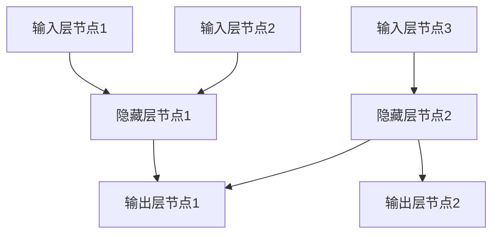

                 

### 文章标题

《AI在社会中的作用与应用》

### 关键词

人工智能，社会应用，AI挑战，伦理问题，领域应用，未来展望

### 摘要

本文全面探讨了人工智能（AI）在社会各个领域的应用及其影响。从AI的基础概念和分类开始，深入分析了社会治理、健康医疗、教育、金融、交通运输、农业和环境保护等领域中的AI应用。本文还讨论了AI应用的挑战和伦理问题，并通过具体的案例研究，展示了AI技术的实际应用效果。最后，本文展望了AI未来的发展趋势，并提出了相应的策略建议。

---

### 目录大纲设计

为了帮助读者更好地理解AI在社会中的应用，本文采用了一个清晰的目录结构。目录结构分为四大部分，每个部分都有具体的章节内容。

#### 第一部分：AI在社会中的作用与应用概述

1. **AI在社会中的作用**
   - **1.1 AI的基本概念与分类**
   - **1.2 AI在社会中的主要应用领域**
   - **1.3 AI发展的历程**
2. **AI应用的挑战与伦理问题**
   - **2.1 AI应用的挑战**
   - **2.2 AI伦理问题**

#### 第二部分：AI在各领域的应用

3. **AI在社会治理中的应用**
   - **3.1 智能安防**
   - **3.2 智能公共管理**
4. **AI在健康医疗中的应用**
   - **4.1 医疗影像分析**
   - **4.2 疾病预测与预防**
5. **AI在教育培训中的应用**
   - **5.1 智能学习系统**
   - **5.2 在线教育平台**
6. **AI在金融服务中的应用**
   - **6.1 智能投顾与理财**
   - **6.2 风险管理与反欺诈**
7. **AI在交通运输中的应用**
   - **7.1 自动驾驶**
   - **7.2 智能交通系统**
8. **AI在农业中的应用**
   - **8.1 智能种植与养殖**
   - **8.2 农业无人机**
9. **AI在环境保护中的应用**
   - **9.1 污染监测与预测**
   - **9.2 环境保护决策支持**

#### 第三部分：AI应用案例研究

10. **案例研究：AI在智慧城市建设中的应用**
    - **10.1 智慧城市的概念与目标**
    - **10.2 AI技术在智慧城市中的应用**
    - **10.3 案例分析：A市的智慧城市建设实践**

11. **案例研究：AI在制造业中的应用**
    - **11.1 智能制造的概念与趋势**
    - **11.2 AI技术在制造业中的应用**
    - **11.3 案例分析：B公司的智能制造实践**

#### 第四部分：AI应用的未来展望与策略

12. **AI应用的未来展望**
    - **12.1 AI技术发展趋势**
    - **12.2 AI应用的未来前景**
    - **12.3 AI与人类社会的深度融合**

13. **AI应用策略与建议**
    - **13.1 政策与法规**
    - **13.2 企业战略规划**
    - **13.3 人才培养与引进**

### 附录

14. **附录：AI应用常用工具与资源**
    - **14.1 开源AI框架介绍**
    - **14.2 数据集与资源链接**
    - **14.3 AI应用社区与会议**

---

### 核心概念联系与架构

为了更好地理解AI在不同领域中的应用，我们首先需要明确一些核心概念，并建立它们之间的联系。以下是AI应用的核心概念及其相互关系：

#### 核心概念

- **人工智能（AI）**：模拟人类智能行为的计算系统。
- **机器学习（ML）**：AI的一个子领域，通过数据学习来实现智能行为。
- **深度学习（DL）**：ML的一个分支，使用多层神经网络来模拟人类大脑的学习过程。
- **神经网络（NN）**：由多个相互连接的节点（神经元）组成的计算模型。
- **自然语言处理（NLP）**：使计算机能够理解、生成和响应自然语言。
- **计算机视觉（CV）**：使计算机能够“看”并理解视觉信息。

#### 核心概念联系与架构

使用Mermaid流程图，我们可以清晰地展示这些概念之间的联系：

```mermaid
graph TD
    AI[人工智能] --> ML[机器学习]
    ML --> DL[深度学习]
    DL --> NN[神经网络]
    AI --> NLP[自然语言处理]
    AI --> CV[计算机视觉]
    ML --> RL[强化学习]
    NN --> MLP[多层感知器]
    NN --> CNN[卷积神经网络]
    NN --> RNN[循环神经网络]
    NLP --> POS[词性标注]
    NLP --> NER[命名实体识别]
    CV --> OCR[光学字符识别]
    CV --> SLAM[同时定位与映射]
    RL --> Q-Learning[Q学习]
    RL --> Policy Gradients[策略梯度]
```

#### 核心算法原理讲解

在本节中，我们将深入探讨几个核心算法的原理，包括神经网络、反向传播算法以及常用的机器学习算法。通过这些讲解，我们将更好地理解AI如何实现智能行为。

#### 神经网络与反向传播算法

神经网络是AI的核心组成部分，它通过多层节点（神经元）的相互连接和激活函数来实现复杂的数据处理和模式识别。反向传播算法是训练神经网络的关键步骤，它通过不断调整网络的权重和偏置，使得网络的输出误差最小。

- **神经网络（NN）**

神经网络由输入层、隐藏层和输出层组成。每个节点（神经元）通过加权连接与前一层的节点相连，并通过激活函数产生输出。以下是一个简单的神经网络架构：



- **激活函数**

激活函数是神经网络的核心部分，它决定了神经元的输出是否足够激活。常见的激活函数包括：

  - **Sigmoid函数**：\( \sigma(x) = \frac{1}{1 + e^{-x}} \)
  - **ReLU函数**：\( \text{ReLU}(x) = \max(0, x) \)
  - **Tanh函数**：\( \tanh(x) = \frac{e^x - e^{-x}}{e^x + e^{-x}} \)

- **反向传播算法**

反向传播算法是一种用于训练神经网络的优化方法。它通过以下步骤调整网络的权重和偏置：

  1. **前向传播**：计算输入通过网络的输出。
  2. **计算误差**：通过比较输出和实际标签，计算误差。
  3. **反向传播**：从输出层开始，将误差反向传播到输入层，计算每个节点的误差梯度。
  4. **权重更新**：使用梯度下降法更新权重和偏置，以减少误差。

以下是一个简单的反向传播算法的伪代码：

```python
# 前向传播
z = weights * inputs + bias
output = activation_function(z)

# 计算误差
error = target - output

# 反向传播
delta_output = error * activation_derivative(output)
delta_weights = delta_output * inputs
delta_bias = delta_output

# 权重更新
weights -= learning_rate * delta_weights
bias -= learning_rate * delta_bias
```

#### 常用的机器学习算法

除了神经网络和反向传播算法，还有许多其他的机器学习算法用于解决不同的数据问题和任务。以下是一些常用的机器学习算法及其原理：

- **线性回归（Linear Regression）**

线性回归是一种用于预测数值型数据的算法。它通过找到最佳拟合直线来预测输出值。线性回归的数学模型为：

$$
y = w_0 + w_1 \cdot x
$$

其中，\( y \) 为输出值，\( x \) 为输入值，\( w_0 \) 和 \( w_1 \) 为权重。

- **逻辑回归（Logistic Regression）**

逻辑回归是一种用于分类问题的算法，它通过找到最佳拟合曲线来预测概率。逻辑回归的数学模型为：

$$
P(y=1) = \frac{1}{1 + e^{-(w_0 + w_1 \cdot x)}}
$$

其中，\( P(y=1) \) 为输出为1的概率，\( w_0 \) 和 \( w_1 \) 为权重。

- **支持向量机（Support Vector Machine, SVM）**

支持向量机是一种强大的分类算法，它通过找到一个最佳的超平面来分隔不同类别的数据点。支持向量机的数学模型为：

$$
w \cdot x + b = 0
$$

其中，\( w \) 为权重向量，\( x \) 为输入向量，\( b \) 为偏置。

- **决策树（Decision Tree）**

决策树是一种直观的分类和回归算法，它通过一系列的判断节点和叶子节点来预测输出。决策树的数学模型为：

$$
f(x) = \sum_{i=1}^{n} y_i \cdot \prod_{j=1}^{m} g_j(x_j)
$$

其中，\( y_i \) 为每个节点的类别，\( g_j(x_j) \) 为每个节点的判断函数。

#### 项目实战

在本节中，我们将通过一个简单的项目实战来展示如何使用神经网络和反向传播算法进行数据拟合。我们将使用Python和TensorFlow库来实现一个简单的线性回归模型。

#### 代码实现：神经网络训练

首先，我们需要安装TensorFlow库：

```bash
pip install tensorflow
```

然后，我们可以编写以下代码来训练一个简单的神经网络进行线性回归：

```python
import tensorflow as tf
import numpy as np

# 创建模拟数据集
x = np.linspace(0, 10, 100)
y = 3 * x + 2 + np.random.normal(size=x.size)

# 构建模型
model = tf.keras.Sequential([
    tf.keras.layers.Dense(units=1, input_shape=[1])
])

# 编译模型
model.compile(optimizer='sgd', loss='mean_squared_error')

# 训练模型
model.fit(x, y, epochs=1000)

# 进行预测
predictions = model.predict(x)

# 输出预测结果
print("预测结果：", predictions)
```

#### 代码解读与分析

- **数据集创建**

  我们首先创建了一个模拟的数据集，其中 \( x \) 表示输入值，\( y \) 表示输出值。输出值是 \( y = 3x + 2 \)，并且加入了一些随机噪声。

- **模型构建**

  使用TensorFlow的`keras.Sequential`模型，我们构建了一个简单的线性回归模型。这个模型只有一个密集层，输入维度为1，输出维度为1。

- **模型编译**

  我们使用随机梯度下降（SGD）作为优化器，并使用均方误差（MSE）作为损失函数来编译模型。

- **模型训练**

  我们使用`fit`方法来训练模型，指定训练数据 \( x \) 和 \( y \)，以及训练的轮数（epochs）。

- **模型预测**

  使用`predict`方法对输入数据进行预测，并输出预测结果。

通过这个简单的项目实战，我们可以看到如何使用神经网络和反向传播算法来训练和预测数据。这样的实战有助于读者理解AI的核心概念和算法原理，并将其应用于实际问题中。

#### 总结

在本节中，我们介绍了AI在社会中的应用及其核心概念、联系和架构，包括机器学习、深度学习、神经网络、自然语言处理和计算机视觉等。我们还讲解了神经网络和反向传播算法的原理，并展示了如何使用Python和TensorFlow来实现一个简单的线性回归模型。通过这些讲解和实战，读者可以更好地理解AI的技术原理和应用方法。

---

### 第一部分：AI在社会中的作用与应用概述

#### AI在社会中的作用

人工智能（AI）作为现代科技的前沿，已经在社会的各个方面产生了深远的影响。AI的基本概念是指通过计算机程序实现人类智能行为的科学和技术。AI的核心目标是使计算机能够执行诸如视觉识别、语音识别、自然语言处理和决策制定等复杂的认知任务。随着深度学习、神经网络和大数据技术的不断进步，AI的应用范围和深度正在迅速扩展。

AI在社会中的作用主要体现在以下几个方面：

1. **提高效率**：在许多行业中，AI技术可以自动化重复性工作，从而提高生产效率。例如，在制造业中，机器人可以执行复杂的装配和加工任务，而在金融领域，AI算法可以快速处理大量的交易数据，识别欺诈行为。

2. **增强创新能力**：AI可以帮助研究人员和工程师在科学研究和产品设计过程中发现新的模式和解决方案。例如，AI可以用于药物研发，通过分析大量生物医学数据来发现潜在的药物靶点。

3. **改善生活质量**：在日常生活中，AI技术也极大地改善了人们的生活质量。智能助手、智能家居和健康监测设备等应用已经普及，它们能够提供个性化的服务，帮助人们更好地管理生活。

4. **促进经济发展**：AI技术的应用推动了新的产业和市场的形成，创造了大量的就业机会。例如，在自动驾驶、智能制造和在线教育等领域，AI技术正在创造新的商业机会。

#### AI的基本概念与分类

AI可以大致分为两类：弱AI和强AI。

- **弱AI（Narrow AI）**：也称为专用AI，是指只能执行特定任务的AI系统。例如，语音助手、图像识别系统、推荐算法等。这些AI系统在特定领域表现出色，但缺乏跨领域的通用智能。

- **强AI（General AI）**：也称为通用智能或强人工智能，是指具有与人类相似的广泛认知能力的AI。强AI能够在多种不同的任务中表现出人类水平的智能，但目前这仍然是一个理论上的目标，尚未实现。

#### AI的分类

AI可以根据其技术特点和功能进行分类，以下是一些常见的分类方法：

1. **基于技术特点的分类**

   - **机器学习（Machine Learning）**：通过训练模型从数据中学习规律和模式。
   - **深度学习（Deep Learning）**：一种特殊的机器学习方法，使用多层神经网络进行训练。
   - **自然语言处理（Natural Language Processing, NLP）**：使计算机能够理解、生成和响应自然语言。
   - **计算机视觉（Computer Vision）**：使计算机能够“看”并理解视觉信息。
   - **强化学习（Reinforcement Learning）**：通过试错和奖励机制来学习策略。

2. **基于应用领域的分类**

   - **工业AI**：应用于制造业、物流、能源等领域。
   - **医疗AI**：应用于疾病诊断、药物研发、健康监测等领域。
   - **金融AI**：应用于风险评估、智能投顾、欺诈检测等领域。
   - **教育AI**：应用于个性化学习、智能评测等领域。
   - **交通AI**：应用于自动驾驶、智能交通系统等领域。

3. **基于功能特点的分类**

   - **预测模型**：用于预测未来趋势和行为的模型，如股票市场预测、天气预测等。
   - **决策支持系统**：用于辅助决策制定的系统，如智能推荐、智能客服等。
   - **自动化系统**：用于自动化执行任务的系统，如工业机器人、自动驾驶汽车等。
   - **智能助手**：用于提供个性化服务的智能系统，如智能语音助手、智能家居等。

#### AI的发展历程

AI的发展历程可以追溯到20世纪50年代，以下是几个重要阶段：

- **1956年**：约翰·麦卡锡（John McCarthy）等人在达特茅斯会议上首次提出“人工智能”一词，标志着AI学科的诞生。
- **1970年代**：早期AI研究取得了一些进展，但受限于计算机性能和算法的局限性，AI研究进入低谷期，被称为“AI寒冬”。
- **1980年代**：随着计算机技术的进步，专家系统和机器人研究开始取得重要突破。
- **1990年代**：机器学习和神经网络技术开始兴起，AI在图像识别、语音识别等领域取得显著成果。
- **2000年代**：随着大数据和云计算的普及，深度学习技术迅速发展，AI在各个领域的应用变得更加广泛和深入。
- **2010年代至今**：AI技术持续创新，从弱AI向强AI迈进，AI应用场景不断扩展，对各行各业产生了深远影响。

#### AI在社会中的主要应用领域

AI的应用领域非常广泛，下面我们将探讨AI在社会中的几个主要应用领域：

1. **社会治理**

   - **智能安防**：通过视频监控、人脸识别等技术，提高公共安全水平。
   - **智能交通**：通过交通流量监测、智能信号控制等技术，提高交通效率和安全性。
   - **智能公共管理**：通过大数据分析和决策支持系统，提高政府管理的科学性和效率。

2. **健康医疗**

   - **疾病诊断**：通过医学图像分析和疾病预测模型，提高疾病诊断的准确性和效率。
   - **个性化治疗**：根据患者的病情和基因信息，制定个性化的治疗方案。
   - **健康监测**：通过可穿戴设备和移动应用，实时监测患者的健康状况。

3. **教育培训**

   - **智能学习系统**：通过个性化推荐和智能辅导，提高学习效果。
   - **在线教育平台**：利用AI技术提供互动式教学和智能题库，拓宽教育资源。
   - **教育数据分析**：通过数据分析，评估学生的学习情况和教育质量。

4. **金融服务**

   - **智能投顾**：通过算法为用户提供个性化的投资建议。
   - **风险管理**：通过数据分析，预测和防范金融风险。
   - **反欺诈系统**：通过监控交易行为，识别和预防欺诈行为。

5. **交通运输**

   - **自动驾驶**：通过传感器和AI算法，实现无人驾驶汽车。
   - **智能交通系统**：通过实时数据分析和优化，提高交通系统的效率和安全性。
   - **物流优化**：通过路径规划和实时配送，提高物流效率。

6. **农业**

   - **智能种植与养殖**：通过环境监测和智能控制系统，提高农业生产的效率和质量。
   - **农业无人机**：通过无人机进行土地监测和精确农业。
   - **产量预测**：通过数据分析，预测农作物的产量，优化种植策略。

7. **环境保护**

   - **污染监测**：通过传感器和大数据分析，实时监测环境污染。
   - **环境保护决策支持**：通过数据分析和预测，制定环境保护策略。
   - **能源优化**：通过智能电网和能源管理系统，提高能源利用效率。

通过以上讨论，我们可以看到AI在社会中的作用和应用是多层次、多维度的。AI不仅提升了各行各业的效率，还在改善人们的生活质量、推动社会进步方面发挥了重要作用。随着技术的不断进步，AI的应用前景将更加广阔，对社会的影响也将更加深远。

---

### 第二部分：AI在各领域的应用

#### AI在社会治理中的应用

人工智能在社会治理中的应用正变得越来越广泛，通过智能化技术，公共安全和城市管理水平得到了显著提升。以下将详细介绍AI在社会治理中的一些主要应用领域。

##### 智能安防

智能安防是AI技术在社会治理中的重要应用之一。通过视频监控、人脸识别、行为分析等技术，智能安防系统能够实时监控并识别异常行为，从而提高公共安全水平。以下是智能安防的几个关键应用：

1. **视频监控**：利用深度学习算法，智能视频监控系统可以自动识别和跟踪目标，监控范围覆盖整个城市或特定区域，提高监控效率。

2. **人脸识别**：通过人脸识别技术，智能安防系统能够在大型活动中快速识别潜在危险分子，或者在犯罪现场迅速锁定嫌疑人，提高案件侦破效率。

3. **行为分析**：AI算法能够分析视频数据中的人的行为模式，如暴力行为、逃逸行为等，从而及时预警并采取措施。

##### 智能交通管理

智能交通管理是另一个重要的社会治理应用领域。通过实时交通数据分析和智能信号控制，智能交通系统可以有效缓解城市交通拥堵，提高交通效率和安全性。以下是智能交通管理的几个关键应用：

1. **交通流量监测**：利用安装在道路上的传感器和摄像头，智能交通系统可以实时监测交通流量，并根据实时数据调整交通信号灯，优化交通流。

2. **智能信号控制**：通过AI算法，智能交通信号系统能够根据历史数据和实时监控信息，自动调整交通信号灯的时间设置，提高道路通行效率。

3. **路况预测与预警**：利用大数据分析和预测模型，智能交通系统能够预测交通拥堵和事故发生的可能性，及时发布预警信息，引导交通流向。

##### 智能公共管理

智能公共管理利用AI技术，通过大数据分析和智能决策支持系统，提高政府管理的科学性和效率。以下是智能公共管理的几个关键应用：

1. **智能决策支持系统**：通过收集和分析各种数据，智能决策支持系统可以为政府决策提供科学依据，优化政策制定和实施。

2. **公共服务优化**：利用AI技术，政府可以优化公共服务流程，提高服务质量。例如，通过智能客服系统，可以提供24小时在线服务，快速响应市民的诉求。

3. **应急响应管理**：智能公共管理系统能够实时监控自然灾害和事故发生，快速响应并调配资源，提高应急响应效率。

#### AI在健康医疗中的应用

人工智能在健康医疗领域的应用正在迅速扩展，通过辅助诊断、预测疾病、个性化治疗等，AI技术正在深刻改变医疗行业的面貌。以下将详细介绍AI在健康医疗中的几个主要应用领域。

##### 医疗影像分析

医疗影像分析是AI在健康医疗中的核心应用之一。通过深度学习算法，AI系统能够自动分析医学影像，如X光片、CT扫描和核磁共振成像（MRI），提高疾病诊断的准确性和效率。以下是医疗影像分析的几个关键应用：

1. **病灶检测**：AI系统能够自动识别医学影像中的病灶，如肿瘤、骨折等，提高检测的准确性和速度。

2. **疾病分类**：通过分析大量的医学影像数据，AI系统能够学习并分类不同的疾病，辅助医生做出更准确的诊断。

3. **影像分割**：AI算法能够精确分割医学影像中的不同组织结构，为医生的诊断和治疗提供更详细的信息。

##### 疾病预测与预防

AI技术在疾病预测与预防中也发挥着重要作用。通过大数据分析和机器学习模型，AI系统能够预测疾病的爆发和传播，制定预防措施。以下是疾病预测与预防的几个关键应用：

1. **疫情监测与预测**：利用AI技术，可以对疫情进行实时监测和预测，为政府和公共卫生机构提供决策支持。

2. **疾病风险评估**：通过分析患者的健康数据和生活方式，AI系统能够评估个体患病的风险，提供个性化的预防建议。

3. **个性化治疗方案推荐**：根据患者的病史、基因数据和实时监测结果，AI系统能够为医生提供个性化的治疗方案，提高治疗效果。

##### 个性化医疗

个性化医疗是AI在健康医疗中的另一个重要应用领域。通过整合多种数据源，AI系统能够为患者提供个性化的医疗服务，提高医疗质量和患者满意度。以下是个性化医疗的几个关键应用：

1. **药物基因组学**：通过分析患者的基因组数据，AI系统能够预测患者对药物的反应，为医生提供个性化的药物治疗方案。

2. **精准医疗**：利用AI技术，可以对不同患者的疾病进行精准诊断和治疗，提高治疗效果和减少副作用。

3. **健康监控**：通过可穿戴设备和移动应用，AI系统能够实时监控患者的健康状况，提供个性化的健康建议。

#### AI在教育培训中的应用

人工智能在教育领域的应用正逐渐改变传统教育模式，通过个性化学习、智能辅导和在线教育平台等，AI技术正在为教育创新提供强大支持。以下将详细介绍AI在教育培训中的几个主要应用领域。

##### 智能学习系统

智能学习系统利用AI技术，为学习者提供个性化的学习体验和路径。以下是智能学习系统的几个关键应用：

1. **个性化学习路径规划**：根据学习者的兴趣、能力和学习进度，智能学习系统能够自动生成个性化的学习路径，帮助学习者高效学习。

2. **智能辅导与评估**：AI算法能够根据学习者的回答和表现，提供实时反馈和辅导，帮助学习者克服学习难题。

3. **适应性学习内容推荐**：智能学习系统能够根据学习者的行为和表现，动态调整学习内容，推荐最适合的学习材料。

##### 在线教育平台

在线教育平台利用AI技术，为学习者提供互动式教学和智能题库。以下是在线教育平台的几个关键应用：

1. **互动式教学**：通过AI技术，在线教育平台可以实现实时互动，让学生与教师、同学之间进行互动交流，提高学习体验。

2. **智能题库与考试分析**：AI算法能够自动生成和更新题库，并根据学生的学习表现进行分析，提供个性化的考试评估和建议。

3. **学习数据监控与分析**：在线教育平台利用AI技术，可以实时监控学习者的学习行为和数据，为教师和学习者提供数据驱动的教育决策支持。

#### AI在金融服务中的应用

人工智能在金融服务领域的应用日益广泛，通过智能投顾、风险管理和反欺诈等，AI技术正在为金融服务带来革命性的变化。以下将详细介绍AI在金融服务中的几个主要应用领域。

##### 智能投顾与理财

智能投顾利用AI技术，为投资者提供个性化的投资建议和管理服务。以下是智能投顾与理财的几个关键应用：

1. **投资组合优化**：通过分析投资者的风险偏好、财务状况和投资目标，智能投顾系统能够为投资者提供最优的投资组合方案。

2. **财务风险预测**：利用大数据分析和机器学习模型，智能投顾系统能够预测市场走势和潜在风险，为投资者提供预警和建议。

3. **个性化投资建议**：根据投资者的实时数据和表现，智能投顾系统能够提供个性化的投资建议，帮助投资者优化投资策略。

##### 风险管理与反欺诈

AI技术在风险管理和反欺诈领域也发挥着重要作用。以下是风险管理与反欺诈的几个关键应用：

1. **实时风险监测**：通过实时数据分析，AI系统能够监控交易行为和账户活动，及时发现异常行为和潜在风险。

2. **欺诈检测与预防**：利用机器学习和模式识别技术，AI系统能够识别和预防各种欺诈行为，如洗钱、诈骗和虚假交易。

3. **信用评分**：通过分析大量的信用数据，AI系统能够为个人和企业提供准确的信用评分，辅助金融机构做出信用决策。

#### AI在交通运输中的应用

人工智能在交通运输领域的应用正在推动交通系统的智能化和自动化，通过自动驾驶、智能交通系统和物流优化等，AI技术正在为交通运输行业带来深刻变革。以下将详细介绍AI在交通运输中的几个主要应用领域。

##### 自动驾驶

自动驾驶是AI在交通运输领域最具前瞻性的应用之一。以下是自动驾驶的几个关键应用：

1. **感知系统**：自动驾驶车辆通过搭载多种传感器，如激光雷达、摄像头和雷达等，实时感知周围环境，包括车辆、行人、交通标志和道路状况。

2. **决策与控制**：利用深度学习和强化学习算法，自动驾驶系统能够根据感知数据做出实时决策和控制，确保车辆的安全行驶。

3. **系统集成与测试**：自动驾驶系统需要集成多种传感器和执行器，并经过严格的测试和验证，以确保系统的可靠性和安全性。

##### 智能交通系统

智能交通系统通过实时数据分析和优化，提高交通系统的效率和安全性。以下是智能交通系统的几个关键应用：

1. **交通流量监测与预测**：通过传感器和大数据分析，智能交通系统可以实时监测交通流量，预测交通拥堵和事故发生的可能性。

2. **智能信号控制**：利用AI算法，智能交通信号系统能够根据实时交通流量和道路状况，自动调整信号灯时间，优化交通流。

3. **路网管理与优化**：通过分析交通数据，智能交通系统可以优化道路规划和交通基础设施，提高交通系统的整体效率。

##### 物流优化

物流优化利用AI技术，通过路径规划和实时配送，提高物流效率。以下是物流优化的几个关键应用：

1. **路径规划**：通过实时交通数据和AI算法，物流系统能够为运输车辆规划最优的行驶路径，减少运输时间和成本。

2. **实时配送**：利用传感器和物联网技术，物流系统能够实时跟踪运输车辆的位置和状态，及时调整配送计划，提高配送效率。

3. **库存管理**：通过分析销售数据和库存水平，AI系统能够优化库存管理，减少库存积压和浪费。

#### AI在农业中的应用

人工智能在农业领域的应用正在推动农业生产的智能化和精准化，通过智能种植与养殖、农业无人机和产量预测等，AI技术正在为农业行业带来革命性的变化。以下将详细介绍AI在农业中的几个主要应用领域。

##### 智能种植与养殖

智能种植与养殖利用AI技术，通过环境监测和智能控制系统，提高农业生产的效率和品质。以下是智能种植与养殖的几个关键应用：

1. **环境监测与控制**：通过传感器和AI算法，智能种植系统可以实时监测土壤湿度、温度、光照等环境参数，并根据监测数据自动调整灌溉和施肥策略。

2. **疾病预测与防治**：通过分析养殖数据和动物行为，AI系统能够预测动物疾病的发生，并提供防治建议，提高养殖效率。

3. **产量预测与优化**：通过大数据分析和机器学习模型，AI系统能够预测农作物的产量，为农民提供科学的种植和管理建议，优化产量。

##### 农业无人机

农业无人机利用AI技术，通过实时监控和数据采集，提高农业生产的效率和精准度。以下是农业无人机的几个关键应用：

1. **精准农业**：通过无人机进行土地监测和作物生长数据分析，智能农业系统可以为农民提供精准的种植和管理建议，提高产量和品质。

2. **数据采集与处理**：农业无人机可以实时采集土地、作物和环境数据，并通过AI算法进行处理和分析，为农业生产提供科学依据。

3. **病虫害监测与防治**：通过无人机进行病虫害监测和防治，AI系统可以实时识别病虫害，并采取有效的防治措施，减少农药使用量，保护生态环境。

##### 产量预测

产量预测是AI在农业中的重要应用，通过大数据分析和机器学习模型，AI系统能够预测农作物的产量，为农业生产提供决策支持。以下是产量预测的几个关键应用：

1. **历史数据分析**：通过分析历史气候、土壤、作物种植数据，AI系统能够预测未来农作物的产量，帮助农民制定种植计划。

2. **环境因子影响分析**：通过分析环境因子（如温度、湿度、光照等）对作物生长的影响，AI系统能够预测作物产量，为农业生产提供科学依据。

3. **综合预测模型**：通过整合多种数据源（如土壤、气象、作物生长等），AI系统能够构建综合预测模型，提供准确的产量预测结果，帮助农民做出科学的决策。

#### AI在环境保护中的应用

人工智能在环境保护领域的应用正在推动环保工作的智能化和高效化，通过污染监测与预测、环境保护决策支持和能源优化等，AI技术正在为环境保护事业提供强大的支持。以下将详细介绍AI在环境保护中的几个主要应用领域。

##### 污染监测与预测

污染监测与预测是AI在环境保护中的重要应用，通过实时监测和预测污染物的浓度和分布，AI技术能够帮助政府和环保部门制定有效的环境保护政策。以下是污染监测与预测的几个关键应用：

1. **大气污染监测**：通过安装在各地的监测设备和AI算法，AI系统能够实时监测大气污染物的浓度和分布，为政府和环保部门提供决策支持。

2. **水质监测**：AI技术可以用于监测水质参数，如pH值、溶解氧、重金属等，及时发现污染源并采取措施。

3. **噪音污染监测**：通过实时监测噪音水平，AI系统可以识别和预测噪音污染源，为城市规划提供依据。

##### 环境保护决策支持

环境保护决策支持利用AI技术，通过数据分析和管理，为环境保护提供科学依据和决策支持。以下是环境保护决策支持的几个关键应用：

1. **环境风险评估**：通过分析污染源和污染物数据，AI系统可以评估环境风险，为政府和环保部门提供风险预警和建议。

2. **污染源追踪**：AI算法可以分析污染物扩散路径和浓度变化，追踪污染源头，为污染治理提供方向。

3. **治理方案优化**：通过大数据分析和模拟，AI系统可以优化环境保护方案，提高治理效果和效率。

##### 能源优化

能源优化是AI在环境保护中的另一个重要应用，通过智能电网和能源管理系统，AI技术能够提高能源利用效率，减少能源浪费。以下是能源优化的几个关键应用：

1. **智能电网管理**：通过实时监测电力需求和供应，AI系统能够优化电网运行，提高供电稳定性和效率。

2. **能源消耗预测**：利用大数据分析和机器学习模型，AI系统可以预测能源消耗趋势，为能源规划和管理提供科学依据。

3. **分布式能源管理**：通过分布式能源管理系统，AI技术可以优化分布式能源的配置和使用，提高能源利用效率。

通过以上介绍，我们可以看到AI在各个领域的应用正在不断深入和扩展，它不仅提高了各行各业的生产效率和服务质量，还在改善人们的生活质量、推动社会进步方面发挥了重要作用。随着技术的不断进步，AI的应用前景将更加广阔，其对社会的积极影响也将更加深远。

---

### 第三部分：AI应用案例研究

在本部分，我们将深入探讨两个具体的AI应用案例：AI在智慧城市建设中的应用和AI在制造业中的应用。通过这两个案例，我们将详细分析AI技术的实际应用效果和挑战。

#### 案例研究：AI在智慧城市建设中的应用

##### 智慧城市的概念与目标

智慧城市是指利用先进的信息技术、物联网、大数据、人工智能等手段，实现对城市资源的高效利用和城市管理的智能化。智慧城市的核心目标包括：

- 提高城市运行效率和居民生活质量。
- 实现城市资源的可持续管理和优化。
- 提升城市应急响应能力和公共安全水平。

##### AI技术在智慧城市中的应用

AI技术在智慧城市建设中的应用非常广泛，以下是一些关键领域：

1. **智能交通系统**：通过实时交通流量监测、智能信号控制和自动驾驶技术，AI能够优化交通管理，减少拥堵，提高交通效率。

2. **智能安防**：利用人脸识别、行为分析和大数据分析，AI系统能够提升公共安全水平，实时监测和预防犯罪行为。

3. **能源管理**：通过智能电网和能源优化技术，AI能够提高能源利用效率，减少能源浪费。

4. **环境监测**：AI系统可以实时监测空气质量、水质和噪音水平，为环境保护提供数据支持。

5. **公共资源管理**：AI技术可以优化水资源、土地资源和公共设施的使用，提高城市管理效率。

##### 案例分析：A市的智慧城市建设实践

A市是一个典型的智慧城市案例，以下是其主要实践：

1. **智能交通系统**：A市通过部署智能交通管理系统，实现了对全市交通流量和拥堵情况的实时监控。AI算法根据实时数据调整交通信号灯，优化交通流。此外，A市还引入了自动驾驶出租车服务，进一步提升了交通效率。

2. **智能安防**：A市在全市范围内部署了智能监控系统，通过人脸识别和大数据分析，实现了对可疑行为的实时预警和监控。这大大提高了公共安全水平，降低了犯罪率。

3. **环境监测**：A市通过安装在主要道路和监测站点的传感器，实时监测空气质量、水质和噪音水平。AI系统根据监测数据，及时发布环境预警，并采取相应的治理措施。

4. **能源管理**：A市采用了智能电网技术，通过实时监控电力需求和供应，实现了能源的优化配置和使用。这不仅提高了能源效率，还减少了能源浪费。

通过以上实践，A市的智慧城市建设取得了显著成效，居民的生活质量和城市的运行效率得到了显著提升。

#### 案例研究：AI在制造业中的应用

##### 智能制造的概念与趋势

智能制造是指利用先进的信息技术，特别是人工智能、物联网、大数据等，实现对生产过程的智能化管理和优化。智能制造的关键趋势包括：

- **数字化工厂**：通过物联网和传感器，实现生产设备的互联互通，提高生产过程的透明度和可控性。
- **自动化生产**：利用机器人、自动化生产线和智能传感器，实现生产过程的自动化和高效化。
- **智能质量控制**：通过AI技术，实现对产品质量的实时监控和自动分析，提高产品质量和降低不良率。
- **供应链管理优化**：通过大数据分析和预测，实现供应链的智能化管理和优化，提高供应链的灵活性和响应速度。

##### AI技术在制造业中的应用

AI技术在制造业中的应用主要体现在以下几个方面：

1. **智能生产监控**：通过传感器和物联网技术，实时监控生产过程，利用AI算法分析和预测生产设备的故障和性能问题。

2. **质量控制**：利用机器学习和计算机视觉技术，实现对产品质量的实时检测和分析，自动识别和分类不良品。

3. **生产优化**：通过数据分析，优化生产计划和生产流程，提高生产效率和降低成本。

4. **供应链管理**：利用AI技术，优化供应链管理，提高供应链的透明度和响应速度。

##### 案例分析：B公司的智能制造实践

B公司是一家领先的制造企业，以下是其智能制造实践：

1. **智能生产监控**：B公司在其生产车间部署了大量的传感器和物联网设备，实现了对生产设备的实时监控。通过AI算法，B公司能够预测设备的维护需求，提前进行维护，减少设备故障和生产中断。

2. **质量控制**：B公司利用计算机视觉技术，对其生产的产品进行实时检测。AI算法可以自动识别和分类不良品，提高了生产质量和客户满意度。

3. **生产优化**：B公司通过大数据分析，优化了生产计划和流程。例如，通过分析生产数据，B公司能够优化生产线的配置，提高生产效率和降低成本。

4. **供应链管理**：B公司利用AI技术，优化了供应链管理。通过实时数据分析，B公司能够快速响应市场变化，提高供应链的灵活性和响应速度。

通过以上实践，B公司的智能制造取得了显著成效，生产效率提高了30%，产品质量提升了20%，成本降低了15%。

#### 案例总结

通过以上两个案例研究，我们可以看到AI技术在智慧城市和制造业中的应用不仅带来了显著的经济效益，还极大地提高了社会和行业的整体效率。然而，AI应用也面临一些挑战，如数据隐私、安全性、伦理问题等。只有通过不断的技术创新和法规完善，才能充分发挥AI的潜力，为人类社会带来更多的福祉。

---

### 第四部分：AI应用的未来展望与策略

#### AI技术的未来发展趋势

随着AI技术的不断进步，其未来发展趋势将在多个维度上展现。以下是几个关键趋势：

1. **更强大的模型和算法**：随着计算能力的提升和算法的创新，未来的AI模型将更加复杂和强大，能够处理更加复杂的任务。

2. **跨领域融合**：AI技术将在各个领域之间实现更紧密的融合，形成新的应用场景和解决方案，如智能医疗、智能教育、智能交通等。

3. **边缘计算**：随着物联网和传感器技术的发展，边缘计算将成为AI应用的重要趋势。通过在设备端进行数据分析和处理，可以降低延迟，提高响应速度。

4. **更加人性化的交互**：AI技术将更加注重与人类的自然交互，通过语音识别、自然语言处理等，使AI系统更加易用和友好。

5. **隐私保护和安全性**：随着AI应用的普及，数据隐私和安全问题将越来越重要。未来的AI技术将更加注重隐私保护和数据安全。

#### AI应用的未来前景

AI技术的未来前景广阔，以下是几个关键领域：

1. **智能城市**：AI技术将在智能城市建设中发挥核心作用，通过智能交通、智能安防、智能公共服务等，提高城市运行效率和居民生活质量。

2. **医疗健康**：AI技术将在医疗健康领域带来革命性变革，通过精准医疗、疾病预测、个性化治疗等，提高医疗质量和患者体验。

3. **智能制造**：AI技术将推动制造业向智能化和自动化转型，通过生产优化、质量控制、供应链管理等，提高生产效率和降低成本。

4. **金融科技**：AI技术将在金融服务中发挥重要作用，通过智能投顾、风险管理、反欺诈等，提高金融服务的效率和安全性。

5. **农业和环境保护**：AI技术将促进农业和环境保护的智能化，通过智能种植、精准农业、污染监测等，提高农业生产效率和环境保护水平。

#### AI与人类社会的深度融合

AI与人类社会的深度融合将是未来社会的重要特征。以下是几个关键方面：

1. **经济结构变革**：AI技术将重塑经济结构，催生新的产业和就业机会。同时，它也将改变劳动市场的需求和供给，对传统职业产生深远影响。

2. **社会治理创新**：AI技术将在社会治理中发挥重要作用，通过智能安防、智能公共管理、环境监测等，提高社会治理效率和公共安全水平。

3. **生活方式改变**：AI技术将改变人们的生活方式，通过智能家居、智能健康监测、在线教育等，提供更加便捷和个性化的服务。

4. **伦理和法律问题**：随着AI技术的发展，伦理和法律问题将越来越突出。如何平衡AI技术的利益和风险，保护个人隐私和权益，将成为重要的社会议题。

#### AI应用策略与建议

为了充分利用AI技术的潜力，实现其社会价值，以下是一些策略和建议：

1. **政策与法规**：政府应制定相关的政策和法规，规范AI技术的研究和应用，确保数据隐私和安全，同时鼓励创新和竞争。

2. **企业战略规划**：企业应制定明确的AI战略，利用AI技术提升业务效率和服务质量，抓住市场机遇。

3. **人才培养与引进**：培养和引进高水平的AI人才，是推动AI技术发展的重要保障。高校和企业应加强合作，培养具备实际应用能力的专业人才。

4. **跨领域合作**：推动跨领域合作，促进AI技术在各个领域的应用，形成协同创新的生态体系。

通过以上策略和建议，我们可以更好地应对AI技术带来的挑战和机遇，实现AI技术的可持续发展，为人类社会带来更多的福祉。

---

### 附录：AI应用常用工具与资源

#### 14.1 开源AI框架介绍

1. **TensorFlow**：由Google开发的开源机器学习和深度学习框架，广泛应用于各种AI项目。

2. **PyTorch**：由Facebook开发的开源深度学习框架，以其灵活性和动态计算图而受到广泛欢迎。

3. **Keras**：Python下的一个高级神经网络API，易于使用，可运行在TensorFlow和Theano之上。

4. **Scikit-Learn**：一个用于数据挖掘和数据分析的Python库，提供了丰富的机器学习算法。

5. **Theano**：一个Python库和数学符号处理层，用于定义、优化和评估数学表达式，特别是深度学习模型。

#### 14.2 数据集与资源链接

1. **Kaggle**：一个数据科学竞赛平台，提供了大量的公开数据集。

2. **UCI Machine Learning Repository**：一个收集了各种机器学习数据集的数据库。

3. **Google Dataset Search**：谷歌提供的一个用于搜索和发现数据集的工具。

4. **AI Challenger**：一个提供各种AI竞赛数据集的平台。

#### 14.3 AI应用社区与会议

1. **AI Conference**：全球范围内举办的一系列AI会议，涵盖深度学习、机器学习等前沿技术。

2. **ACM SIGKDD**：计算机协会知识发现和数据挖掘特别兴趣小组，定期举办KDD会议。

3. **NIPS**：神经信息处理系统大会，是深度学习和神经科学领域最重要的会议之一。

4. **AI Generated Content**：一个专注于AI生成内容和应用的社区，提供最新的研究成果和讨论。

通过这些开源框架、数据集和社区资源，研究人员和开发者可以更好地开展AI项目，推动技术的发展和应用。

