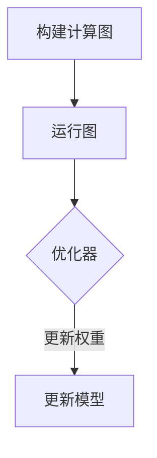
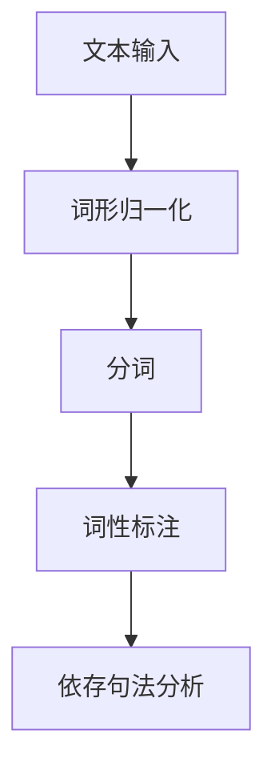

                 

# AI大模型创业的关键成功要素

> 关键词：AI大模型、创业、成功要素、技术原理、实践案例

> 摘要：本文旨在探讨AI大模型创业的关键成功要素，从技术原理、业务场景、团队建设、资金获取和风险管理等多个角度进行深入分析。通过详细阐述AI大模型的核心概念、算法原理以及成功案例，帮助创业者了解并掌握AI大模型创业的核心竞争力。

### 第一部分：AI大模型概述

## 第1章 AI大模型基础

### 1.1 AI大模型的定义与背景

#### 1.1.1 AI大模型的概念

AI大模型，通常指的是那些参数规模巨大、能够处理海量数据的高级神经网络模型。这些模型在机器学习、自然语言处理、计算机视觉等领域有着广泛的应用。典型的AI大模型如GPT（Generative Pre-trained Transformer）和BERT（Bidirectional Encoder Representations from Transformers）等。

#### 1.1.2 AI大模型的演变背景

AI大模型的兴起源于深度学习的飞速发展。随着计算能力和数据资源的不断提升，研究人员开始尝试训练参数数量庞大的模型，以捕捉数据中的更多细节和模式。这种趋势推动了AI大模型的诞生和发展。

#### 1.1.3 AI大模型的应用领域

AI大模型的应用领域非常广泛，包括但不限于以下几个方面：

- 自然语言处理：如文本生成、机器翻译、问答系统等。
- 计算机视觉：如图像分类、目标检测、图像生成等。
- 语音识别：如语音转文字、语音识别等。
- 推荐系统：如个性化推荐、商品推荐等。

### 1.2 AI大模型的核心要素

#### 1.2.1 数据质量

数据质量是AI大模型成功的关键因素之一。高质量的数据可以提供更多有效的信息，有助于模型更好地学习和泛化。数据清洗、数据预处理和数据增强等技术对于保证数据质量至关重要。

#### 1.2.2 计算能力

AI大模型的训练需要大量的计算资源，尤其是在处理大规模数据和复杂的模型结构时。因此，强大的计算能力是支撑AI大模型训练的重要保障。GPU和TPU等加速器的应用，极大地提升了AI大模型的训练效率。

#### 1.2.3 模型架构

模型架构是AI大模型的核心组成部分。不同的模型架构在性能、效率和适用场景上存在差异。例如，Transformer架构在自然语言处理领域表现出色，而CNN（卷积神经网络）在计算机视觉任务中具有优势。

### 1.3 主流AI大模型介绍

#### 1.3.1 GPT模型

GPT（Generative Pre-trained Transformer）是由OpenAI开发的自然语言处理模型。GPT系列模型以其强大的文本生成能力和广泛的应用领域而闻名。GPT-3更是达到了惊人的1750亿参数规模，成为目前最大的自然语言处理模型之一。

#### 1.3.2 BERT模型

BERT（Bidirectional Encoder Representations from Transformers）是由Google开发的自然语言处理模型。BERT通过双向Transformer结构对文本进行编码，从而捕捉到文本中的双向上下文信息，使其在多种自然语言处理任务中表现出色。

#### 1.3.3 其他热门模型

除了GPT和BERT，还有许多其他热门的AI大模型，如T5、RoBERTa、ALBERT等。这些模型在各自的领域内都有着显著的表现，为AI大模型的研发和应用提供了丰富的选择。

## 第2章 AI大模型技术原理

### 2.1 深度学习基础

#### 2.1.1 神经网络原理

神经网络是深度学习的基础。它通过模拟人脑神经网络的结构和功能，实现对数据的自动学习和建模。神经网络由多个神经元（或称为节点）组成，每个神经元都与其他神经元相连，形成复杂的网络结构。

#### 2.1.2 深度学习优化算法

深度学习优化算法是训练神经网络的关键。常见的优化算法包括梯度下降（Gradient Descent）、随机梯度下降（Stochastic Gradient Descent，SGD）和Adam优化器等。这些算法通过不断调整网络权重，使模型在训练数据上达到最优性能。

### 2.2 自然语言处理技术

#### 2.2.1 词嵌入

词嵌入是将文本数据转化为向量表示的重要技术。通过词嵌入，文本中的每个单词都可以表示为一个高维向量，从而方便深度学习模型进行训练和处理。

#### 2.2.2 序列模型

序列模型是自然语言处理中的核心模型之一。它通过处理文本序列中的每个单词或字符，实现对文本的建模和分析。常见的序列模型包括RNN（循环神经网络）、LSTM（长短时记忆网络）和GRU（门控循环单元）等。

#### 2.2.3 注意力机制

注意力机制是深度学习模型在处理序列数据时的一种重要技术。它通过为序列中的每个元素分配不同的权重，使模型能够关注到更重要的信息。注意力机制在机器翻译、文本摘要等任务中具有显著优势。

### 2.3 大规模预训练模型

#### 2.3.1 预训练的概念

预训练是指在大规模语料库上对深度学习模型进行初步训练，使其掌握通用的语言知识和特征。预训练模型在特定任务上再进行微调，能够显著提升模型的性能和泛化能力。

#### 2.3.2 自监督学习

自监督学习是一种在无监督数据上进行训练的方法。它通过利用数据的未标记部分，自动提取特征和知识，为后续的监督学习任务奠定基础。自监督学习在大规模预训练模型中具有重要应用。

#### 2.3.3 迁移学习

迁移学习是指将一个任务在学习到的知识迁移到其他相关任务上的方法。它通过利用已有模型的知识和经验，提高新任务的学习效率和性能。迁移学习在大规模预训练模型的应用中具有重要意义。

### 第二部分：AI大模型创业实践

## 第3章 创业者必备的AI知识

### 3.1 AI业务场景分析

#### 3.1.1 市场需求分析

市场需求分析是创业成功的关键。创业者需要深入了解目标市场的需求、市场规模和增长趋势，以便确定产品的市场定位和商业模型。

#### 3.1.2 竞争对手分析

竞争对手分析有助于创业者了解市场上的竞争格局和竞争策略。通过分析竞争对手的产品、市场份额、优势劣势等，创业者可以制定更具竞争力的策略。

#### 3.1.3 用户需求分析

用户需求分析是产品设计和开发的基础。创业者需要通过市场调研、用户访谈等方式，深入了解目标用户的需求、偏好和使用场景，以便设计出满足用户需求的产品。

### 3.2 数据收集与处理

#### 3.2.1 数据源选择

数据源选择是数据收集的关键。创业者需要根据业务场景和需求，选择合适的数据源，如公开数据集、企业内部数据、社交媒体数据等。

#### 3.2.2 数据清洗与预处理

数据清洗与预处理是保证数据质量的重要环节。创业者需要使用数据清洗工具和技术，对收集到的数据进行去重、去噪、缺失值填补等处理，以提高数据的质量和可用性。

#### 3.2.3 数据存储与索引

数据存储与索引是数据管理和处理的基础。创业者需要选择合适的数据存储方案，如关系型数据库、分布式文件系统等，并建立高效的索引机制，以提高数据检索和处理的速度。

### 3.3 AI模型开发流程

#### 3.3.1 模型选择

模型选择是AI模型开发的关键。创业者需要根据业务场景和数据特点，选择合适的模型架构和算法。例如，对于自然语言处理任务，可以选择Transformer、BERT等模型；对于计算机视觉任务，可以选择CNN、YOLO等模型。

#### 3.3.2 模型训练

模型训练是AI模型开发的核心。创业者需要搭建训练环境，编写训练脚本，并进行模型训练。训练过程中需要关注训练数据质量、模型参数调整、训练时间等关键因素，以提高模型性能。

#### 3.3.3 模型评估与优化

模型评估与优化是确保模型性能的重要环节。创业者需要使用测试数据对模型进行评估，分析模型的准确性、召回率、F1分数等指标，并根据评估结果对模型进行优化和调整。

### 第4章 创业团队建设

#### 4.1 团队成员角色分工

团队成员角色分工是创业团队高效运作的基础。创业者需要明确团队成员的职责和角色，确保每个人都能发挥自己的专长和优势。常见的团队成员角色包括：

- 技术团队成员：负责AI模型开发、算法优化等工作。
- 业务团队成员：负责市场调研、产品规划、客户沟通等工作。
- 运营团队成员：负责产品运营、用户服务、市场营销等工作。

#### 4.2 团队协作与沟通

团队协作与沟通是创业团队成功的关键。创业者需要建立高效的团队协作机制，确保团队成员之间的信息畅通和资源共享。常见的团队协作工具包括：

- 项目管理工具：如Trello、Asana等，用于任务分配、进度跟踪等。
- 沟通工具：如Slack、Zoom等，用于实时沟通、视频会议等。
- 文档管理工具：如Google Docs、Notion等，用于文档共享、版本控制等。

#### 4.3 冲突解决策略

冲突解决策略是确保团队和谐发展的重要措施。创业者需要建立有效的冲突解决机制，确保团队成员之间的分歧和矛盾得到及时解决。常见的冲突解决策略包括：

- 沟通解决：通过开放、坦诚的沟通，了解彼此的观点和需求，寻求共识。
- 调解解决：通过第三方调解，帮助团队成员达成一致意见。
- 协商解决：通过协商、谈判等方式，寻求双方都能接受的解决方案。

### 第5章 创业资金与资源获取

#### 5.1 创业资金规划

创业资金规划是创业成功的关键。创业者需要制定详细的资金规划，明确资金来源、预算分配和使用策略。常见的资金来源包括：

- 自筹资金：创业者个人资金、家庭资金等。
- 天使投资：天使投资者对创业项目的投资。
- 风险投资：风险投资机构对创业项目的投资。
- 政府资助：政府提供的资金支持、补贴等。

#### 5.2 资金管理策略

资金管理策略是确保创业项目顺利进行的重要措施。创业者需要建立有效的资金管理制度，确保资金的安全、合规和高效使用。常见的资金管理策略包括：

- 资金预算管理：制定详细的预算计划，合理安排资金使用。
- 资金监控管理：建立资金监控机制，实时掌握资金使用情况。
- 资金风险管理：制定风险管理策略，降低资金风险。

#### 5.3 资源整合与利用

资源整合与利用是创业成功的关键。创业者需要充分利用各种资源，包括人力资源、技术资源、市场资源等，以提高创业项目的竞争力。常见的资源整合与利用策略包括：

- 人力资源整合：通过招聘、培训、团队建设等方式，提升团队的整体能力。
- 技术资源整合：通过技术合作、共享技术资源等方式，提升技术水平。
- 市场资源整合：通过市场调研、渠道拓展、品牌建设等方式，提升市场竞争力。

### 第6章 创业风险与应对策略

#### 6.1 创业风险分析

创业风险分析是创业成功的关键。创业者需要对可能出现的风险进行识别和分析，以便制定有效的应对策略。常见的创业风险包括：

- 技术风险：AI模型不稳定、算法失效等。
- 市场风险：市场需求变化、竞争对手威胁等。
- 资金风险：资金短缺、融资失败等。
- 法律风险：知识产权侵犯、法律法规变动等。

#### 6.2 应对策略

应对策略是降低创业风险、确保创业项目顺利进行的重要措施。创业者需要根据风险类型和风险程度，制定相应的应对策略。常见的应对策略包括：

- 技术风险应对：加强AI模型测试、优化算法、增加技术储备等。
- 市场风险应对：关注市场动态、调整产品策略、拓展市场渠道等。
- 资金风险应对：多元化融资渠道、加强资金管理、降低成本等。
- 法律风险应对：加强知识产权保护、了解法律法规、合规经营等。

### 第7章 创业成功案例分析

#### 7.1 成功案例介绍

成功案例是创业者的宝贵财富。以下是几个典型的AI大模型创业成功案例：

- 案例一：某公司利用AI技术提升产品质量。该公司通过开发AI模型，对生产过程中的数据进行实时分析和预测，有效提高了产品质量和效率。
- 案例二：某公司利用AI技术优化供应链管理。该公司通过AI模型预测市场需求和库存变化，优化供应链布局，降低了库存成本，提高了供应链效率。
- 案例三：某公司利用AI技术开发智能医疗系统。该公司通过开发AI模型，对医疗数据进行分析和挖掘，提供精准的诊断和治疗方案，为患者提供更好的医疗服务。

#### 7.2 成功经验与启示

成功经验与启示是创业者宝贵的财富。以下是一些从成功案例中得到的经验和启示：

- 创新思维的重要性：成功案例中的公司都具备强烈的创新意识，不断探索新技术、新模式，以满足市场需求。
- 团队合作的力量：成功案例中的公司都拥有高效的团队，团队成员之间密切协作，共同克服各种挑战。
- 风险管理与应对能力：成功案例中的公司都具备良好的风险管理和应对能力，能够及时识别和应对风险，确保创业项目的顺利进行。

### 附录

#### 附录A：AI大模型开发工具与资源

附录A提供了AI大模型开发所需的工具和资源，包括：

- 深度学习框架：如TensorFlow、PyTorch等。
- 自然语言处理工具：如Hugging Face Transformers、Spacy等。
- 开发环境搭建：包括硬件环境、软件安装与配置等。

通过附录A，创业者可以更轻松地搭建AI大模型开发环境，提高开发效率。

### 作者信息

作者：AI天才研究院/AI Genius Institute & 禅与计算机程序设计艺术 /Zen And The Art of Computer Programming

[文章结束] <|im_end|>```markdown
## 附录A：AI大模型开发工具与资源

### A.1 深度学习框架

#### A.1.1 TensorFlow

TensorFlow是由Google开发的开源深度学习框架，它提供了丰富的API和工具，支持从简单的线性模型到复杂的多层神经网络的各种应用。TensorFlow的灵活性使其成为AI大模型开发的常见选择。

**Mermaid流程图：**


#### A.1.2 PyTorch

PyTorch是另一个流行的开源深度学习框架，以其动态计算图和直观的API而闻名。PyTorch提供了对GPU的自动支持，使其在AI大模型训练中非常高效。

**伪代码：**
```python
# PyTorch 模型训练伪代码
model = MyModel()  # 定义模型
optimizer = torch.optim.Adam(model.parameters(), lr=0.001)  # 定义优化器
for epoch in range(num_epochs):
    for inputs, targets in data_loader:
        optimizer.zero_grad()  # 清零梯度
        outputs = model(inputs)  # 前向传播
        loss = loss_function(outputs, targets)  # 计算损失
        loss.backward()  # 反向传播
        optimizer.step()  # 更新权重
```

#### A.1.3 其他深度学习框架

除了TensorFlow和PyTorch，还有其他深度学习框架如Keras、MXNet等，它们各有优势，适用于不同的应用场景。

### A.2 自然语言处理工具

#### A.2.1 Hugging Face Transformers

Hugging Face Transformers是一个开源库，提供了预训练的Transformer模型，如BERT、GPT等，以及用于自然语言处理的广泛工具。

**使用示例：**
```python
from transformers import pipeline
nlp = pipeline("text-generation", model="gpt2")
nlp("Write a story about a mysterious island.")
```

#### A.2.2 Spacy

Spacy是一个强大的自然语言处理库，提供了高效的词向量表示和语言模型，支持多种语言的文本处理任务。

**Mermaid流程图：**


#### A.2.3 NLTK

NLTK是自然语言处理领域的一个经典库，提供了丰富的文本处理函数和模型，适用于文本分类、词频统计等任务。

**使用示例：**
```python
import nltk
nltk.download('punkt')
from nltk.tokenize import word_tokenize
text = "This is a sentence for tokenization."
tokens = word_tokenize(text)
print(tokens)
```

### A.3 开发环境搭建

#### A.3.1 计算机硬件环境

搭建AI大模型开发环境首先需要高性能的计算机硬件，包括：

- GPU：如NVIDIA GeForce RTX 3080、Tesla V100等，用于加速深度学习计算。
- CPU：如Intel Xeon、AMD Ryzen等，用于支持常规计算任务。
- 内存：至少64GB RAM，用于存储大规模模型和数据。

#### A.3.2 软件安装与配置

安装AI大模型开发环境通常包括以下步骤：

1. 安装操作系统：如Ubuntu、Windows等。
2. 安装Python环境：如Python 3.8、3.9等。
3. 安装深度学习框架：如TensorFlow、PyTorch等。
4. 安装自然语言处理工具：如Hugging Face Transformers、Spacy等。
5. 安装其他必需工具：如Jupyter Notebook、Anaconda等。

#### A.3.3 编程语言选择

AI大模型开发主要使用的编程语言是Python，因为其丰富的库和工具支持，以及简洁的语法。此外，了解C++或R等语言也有助于性能优化和高级功能开发。

**总结：**
AI大模型开发需要强大的计算资源、熟练的编程技能和深厚的技术理解。通过合理配置开发环境、选择合适的工具和框架，创业者可以更高效地实现AI大模型的研发和部署。

### 作者信息

作者：AI天才研究院/AI Genius Institute & 禅与计算机程序设计艺术 /Zen And The Art of Computer Programming
```

