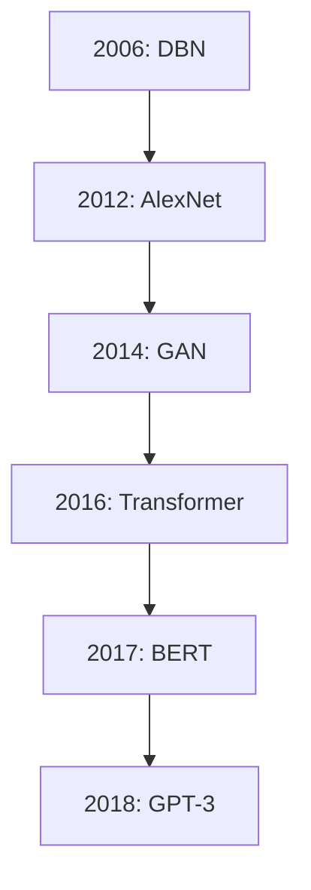
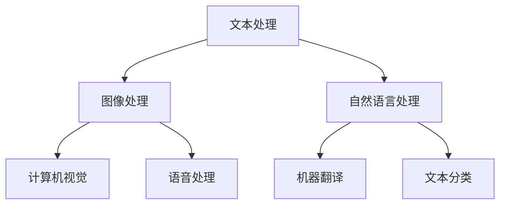

                 

### 第1章：AI大模型概述

#### 1.1 AI大模型的定义与特点

AI大模型是指使用深度学习技术训练得到的，具有大规模参数、强大表征能力和多领域应用能力的人工智能模型。它通常具有以下几个特点：

- **规模大**：AI大模型通常拥有数亿甚至数十亿个参数，这使得它们能够对复杂的数据进行高效的处理和建模。
- **表征能力强**：AI大模型通过多层神经网络结构，能够捕捉到数据中的深层次特征和模式，从而实现高精度的预测和分类。
- **多领域应用能力**：AI大模型不仅能够在图像、文本、语音等单一领域内表现出色，还能跨领域进行应用，例如在图像识别的同时进行自然语言处理。

定义AI大模型的公式可以表示为：

$$
\text{AI大模型} = \{ \text{大规模深度学习模型}, \text{多领域应用能力}, \text{高效数据处理能力} \}
$$

举例来说，BERT（Bidirectional Encoder Representations from Transformers）是一个典型的AI大模型，它通过Transformer架构实现了双向编码的文本表示能力，广泛用于自然语言处理任务中。GPT-3（Generative Pre-trained Transformer 3）也是一个规模庞大的AI大模型，它通过预训练的方式掌握了丰富的语言知识和表达能力，能够生成高质量的自然语言文本。

#### 1.2 AI大模型的发展历程

AI大模型的发展历程可以追溯到深度学习技术的兴起。以下是几个重要的发展阶段：

- **2006年**：Hinton提出了深度置信网络（DBN），标志着深度学习技术的新起点。
- **2012年**：AlexNet在ImageNet大赛中取得突破性成绩，深度学习技术受到广泛关注。
- **2014年**：Google提出了生成对抗网络（GAN），开启了深度生成模型的研究热潮。
- **2016年**：Transformer架构在机器翻译任务上取得了显著的成果，引发了神经网络的革命。
- **2017年**：BERT模型在自然语言处理领域取得了突破性进展。
- **2018年**：GPT-3发布，展示了AI大模型在文本生成、机器翻译等领域的强大能力。

以下是一个简化的Mermaid流程图，展示AI大模型的发展历程：



#### 1.3 AI大模型的应用领域

AI大模型的应用领域非常广泛，涵盖了图像处理、自然语言处理、语音处理等多个领域。以下是几个典型的应用案例：

- **文本处理**：在自然语言处理领域，AI大模型如BERT和GPT-3被广泛用于文本分类、情感分析、问答系统等任务。例如，BERT在文本分类任务上表现出色，而GPT-3则能够生成高质量的自然语言文本。
- **图像处理**：在计算机视觉领域，AI大模型如ResNet和GAN被用于图像分类、目标检测、图像生成等任务。例如，ResNet在图像分类任务中取得了显著的性能提升，而GAN则在图像生成任务中表现出强大的能力。
- **语音处理**：在语音处理领域，AI大模型如WaveNet和Transformer被用于语音识别、语音合成、语音翻译等任务。例如，WaveNet在语音合成任务中表现出极高的自然度，而Transformer在语音识别任务中取得了显著的性能提升。

以下是一个简化的Mermaid流程图，展示AI大模型在不同领域的应用：



通过上述分析，我们可以看到AI大模型在各个领域都展现出了强大的能力和广泛的应用前景。接下来，我们将进一步探讨AI大模型的技术基础、核心算法、应用案例和商业化路径。

### 第2章：AI大模型技术基础

#### 2.1 深度学习与神经网络基础

深度学习（Deep Learning）是人工智能（AI）的一个重要分支，其核心在于通过多层神经网络对数据进行建模和处理。神经网络（Neural Network）是深度学习的基础，它模拟了人脑神经元的工作方式，通过神经元之间的连接和激活函数来实现数据的输入和输出。

**神经网络的基本结构**：

神经网络由输入层、隐藏层和输出层组成。每个层包含多个神经元，神经元之间通过权重进行连接。输入层接收外部输入数据，隐藏层对输入数据进行处理和特征提取，输出层产生最终预测结果。

**激活函数**：

激活函数是神经网络中用于引入非线性性的关键组件。常见的激活函数包括：

- **Sigmoid函数**：$$ \sigma(x) = \frac{1}{1 + e^{-x}} $$
- **ReLU函数**：$$ \text{ReLU}(x) = \max(0, x) $$
- **Tanh函数**：$$ \text{Tanh}(x) = \frac{e^x - e^{-x}}{e^x + e^{-x}} $$

**前向传播与反向传播**：

前向传播（Forward Propagation）是指将输入数据通过神经网络逐层计算，最终得到输出结果的过程。反向传播（Back Propagation）是指根据输出结果与真实值的误差，反向调整神经网络的权重和偏置，以优化模型性能的过程。

**数学模型**：

前向传播的数学模型可以表示为：

$$
z^{(l)} = \sum_{j} w^{(l)}_{ji}a^{(l-1)}_j + b^{(l)}
$$

$$
a^{(l)} = \sigma(z^{(l)})
$$

其中，$z^{(l)}$ 是第$l$层的激活值，$w^{(l)}_{ji}$ 是第$l$层第$i$个神经元到第$l-1$层第$j$个神经元的权重，$b^{(l)}$ 是第$l$层的偏置，$\sigma$ 是激活函数。

反向传播的数学模型可以表示为：

$$
\delta^{(l)} = \frac{\partial C}{\partial z^{(l)}} \odot \sigma'(z^{(l)})
$$

$$
\Delta w^{(l)} = \alpha \frac{\partial C}{\partial z^{(l)}}a^{(l-1)}
$$

$$
\Delta b^{(l)} = \alpha \frac{\partial C}{\partial z^{(l)}}
$$

其中，$\delta^{(l)}$ 是第$l$层的误差项，$\odot$ 表示逐元素乘法，$\alpha$ 是学习率，$C$ 是损失函数。

#### 2.2 自然语言处理技术

自然语言处理（Natural Language Processing, NLP）是AI大模型应用的重要领域，它涉及到文本的表示、理解和生成。以下是NLP的几个关键技术：

**词嵌入（Word Embedding）**：

词嵌入是将词汇映射到高维向量空间的技术，它通过捕捉词汇之间的相似性和关联性，提高了文本数据的表达能力和计算效率。常见的词嵌入技术包括：

- **Word2Vec**：通过神经网络训练得到词向量，能够捕捉词汇的上下文信息。
- **GloVe**：通过全局矩阵分解方法学习词向量，具有较好的泛化能力。

**序列模型（Sequence Model）**：

序列模型用于处理按时间顺序排列的数据，如文本、语音等。常见的序列模型包括：

- **RNN（Recurrent Neural Network）**：通过循环结构对序列数据进行建模，能够捕捉序列中的长期依赖关系。
- **LSTM（Long Short-Term Memory）**：一种特殊的RNN，通过门控机制解决了长短期依赖问题。
- **GRU（Gated Recurrent Unit）**：另一种特殊的RNN，相对于LSTM具有更简单的结构。

**Transformer架构**：

Transformer是一种基于自注意力机制的序列模型，它在NLP任务中取得了显著的效果。Transformer的核心思想是利用自注意力机制来建模序列中的依赖关系，避免了传统RNN中的长短期依赖问题。

**数学模型**：

假设输入序列为$x = \{x_1, x_2, ..., x_n\}$，其中$x_i$为第$i$个单词的嵌入向量。Transformer的输出可以表示为：

$$
y = \text{Attention}(x, x) \rightarrow h
$$

其中，$\text{Attention}$为自注意力机制，$h$为输出序列。

自注意力机制的数学模型可以表示为：

$$
\text{Attention}(Q, K, V) = \text{softmax}\left(\frac{QK^T}{\sqrt{d_k}}\right)V
$$

其中，$Q, K, V$分别为查询向量、键向量和值向量，$d_k$为键向量的维度。

#### 2.3 计算机视觉技术

计算机视觉（Computer Vision）是AI大模型的另一个重要应用领域，它涉及到图像的识别、分类、分割和生成。以下是计算机视觉的几个关键技术：

**卷积神经网络（Convolutional Neural Network, CNN）**：

CNN是一种特殊的神经网络，通过卷积层对图像进行特征提取和建模。CNN的核心组件包括卷积层、池化层和全连接层。

- **卷积层**：通过卷积操作捕捉图像中的局部特征。
- **池化层**：通过池化操作降低特征图的维度，提高模型的计算效率。
- **全连接层**：通过全连接层将特征图映射到输出结果。

**生成对抗网络（Generative Adversarial Network, GAN）**：

GAN是一种生成模型，由生成器和判别器两个神经网络组成。生成器生成假样本，判别器判断样本的真伪。通过两个网络的对抗训练，生成器能够生成高质量的数据。

- **生成器**：通过生成器生成图像。
- **判别器**：通过判别器判断图像的真伪。

**数学模型**：

假设输入图像为$x$，生成器生成的图像为$G(x)$，判别器判断图像的真伪为$D(x)$。GAN的损失函数可以表示为：

$$
L_D = -\log(D(x)) - \log(1 - D(G(x)))
$$

$$
L_G = -\log(1 - D(G(x)))
$$

**数学公式**：

$$
\frac{\partial L_G}{\partial G} = -\frac{\partial}{\partial G} \log(1 - D(G(x)))
$$

$$
\frac{\partial L_D}{\partial D} = -\frac{\partial}{\partial D} \log(D(x)) - \frac{\partial}{\partial D} \log(1 - D(G(x)))
$$

#### 2.4 常用深度学习框架

目前，常用的深度学习框架包括TensorFlow、PyTorch、Keras等。这些框架提供了丰富的API和工具，方便开发者搭建和训练深度学习模型。

**TensorFlow**：

TensorFlow是由Google开发的开源深度学习框架，具有强大的计算图功能和灵活的API。TensorFlow支持多种神经网络架构，包括CNN、RNN、Transformer等。

**PyTorch**：

PyTorch是由Facebook开发的开源深度学习框架，具有动态计算图和简洁的API。PyTorch支持GPU加速，适合快速原型开发和实验。

**Keras**：

Keras是一个高层次的深度学习API，可以兼容TensorFlow和PyTorch。Keras提供了简洁的API，方便开发者搭建和训练深度学习模型。

通过上述技术基础的分析，我们可以看到AI大模型在深度学习、自然语言处理和计算机视觉等领域的广泛应用。在接下来的章节中，我们将进一步探讨AI大模型的核心算法、应用案例和商业化路径。

### 第3章：AI大模型核心算法

#### 3.1 生成对抗网络（GAN）

生成对抗网络（Generative Adversarial Network，GAN）是由Ian Goodfellow等人于2014年提出的一种深度学习框架。GAN由两个神经网络——生成器（Generator）和判别器（Discriminator）组成，通过对抗训练生成高质量的数据。

**生成器（Generator）**：

生成器的目标是生成与真实数据相似的数据，它通常是一个神经网络，接收随机噪声作为输入，输出生成数据。生成器的目标是最大化判别器认为生成的数据是真实数据的概率。

**判别器（Discriminator）**：

判别器的目标是判断输入数据是真实数据还是生成数据，它也是一个神经网络。判别器的目标是最大化区分真实数据和生成数据的概率。

**对抗训练**：

GAN通过对抗训练来优化生成器和判别器。训练过程中，生成器和判别器相互对抗，生成器尝试生成更真实的数据，而判别器则尝试更好地区分真实数据和生成数据。

**数学模型**：

GAN的损失函数通常由两部分组成：生成器损失和判别器损失。

生成器损失：

$$
L_G = -\log(D(G(z)))
$$

其中，$G(z)$为生成器生成的数据，$z$为随机噪声，$D$为判别器。

判别器损失：

$$
L_D = -\log(D(x)) - \log(1 - D(G(x)))
$$

其中，$x$为真实数据，$G(x)$为生成器生成的数据。

**优化算法**：

GAN的训练过程可以通过梯度下降算法进行优化。对于生成器，优化目标为：

$$
\min_G L_G
$$

对于判别器，优化目标为：

$$
\min_D L_D
$$

**伪代码**：

```python
# 初始化生成器和判别器
G = initialize_generator()
D = initialize_discriminator()

# 训练迭代
for epoch in range(num_epochs):
    for batch in data_loader:
        # 训练判别器
        D_loss = train_discriminator(D, batch)
        
        # 训练生成器
        G_loss = train_generator(G, D, batch)
        
        # 打印训练进度
        print(f"Epoch: {epoch}, D_loss: {D_loss}, G_loss: {G_loss}")
```

**应用案例**：

GAN在实际应用中有着广泛的应用，例如：

- **图像生成**：使用GAN生成逼真的人脸、风景、动物等图像。
- **数据增强**：通过GAN生成更多的训练数据，提高模型的泛化能力。
- **图像修复**：使用GAN修复损坏的图像，如去除照片中的污点、模糊部分等。

以下是一个简单的GAN图像生成的项目实战：

```python
import tensorflow as tf
from tensorflow.keras.layers import Input, Dense, Reshape, Flatten
from tensorflow.keras.models import Model

# 定义生成器模型
z_dim = 100
img_height = 28
img_width = 28
img_channels = 1

z = Input(shape=(z_dim,))
x = Dense(128, activation='relu')(z)
x = Dense(28 * 28 * img_channels, activation='sigmoid')(x)
x = Reshape((img_height, img_width, img_channels))(x)
G = Model(z, x)

# 定义判别器模型
img_input = Input(shape=(img_height, img_width, img_channels))
x = Flatten()(img_input)
x = Dense(128, activation='relu')(x)
x = Dense(1, activation='sigmoid')(x)
D = Model(img_input, x)

# 定义GAN模型
combined = Model([z, img_input], [D(x), D(G(z))])
combined.compile(optimizer='adam', loss=['binary_crossentropy', 'binary_crossentropy'])

# 加载和预处理数据集
# ...

# 训练GAN模型
# ...

# 生成图像
# ...
```

通过上述讲解，我们可以看到GAN作为一种强大的生成模型，在图像生成、数据增强和图像修复等领域有着广泛的应用。在接下来的章节中，我们将进一步探讨其他核心算法，如自编码器和聚类算法。

#### 3.2 自编码器（Autoencoder）

自编码器（Autoencoder）是一种无监督学习算法，用于学习和表示输入数据的压缩表示。它由编码器（Encoder）和解码器（Decoder）两个神经网络组成，编码器将输入数据压缩为一个低维表示，解码器则将这个低维表示重新恢复为原始数据。

**工作原理**：

1. **编码器**：接收输入数据，通过多层神经网络将其压缩为一个低维向量。
2. **解码器**：接收编码器输出的低维向量，通过多层神经网络将其恢复为原始数据。

**数学模型**：

自编码器的损失函数通常使用均方误差（MSE），即：

$$
L = \frac{1}{n}\sum_{i=1}^{n}(x_i - \hat{x_i})^2
$$

其中，$x_i$为输入数据，$\hat{x_i}$为解码器输出的重构数据。

**优化算法**：

自编码器的训练过程通常采用梯度下降算法，通过反向传播计算损失函数关于模型参数的梯度，并更新模型参数以最小化损失函数。

**伪代码**：

```python
# 初始化编码器和解码器
encoder = initialize_encoder(input_shape)
decoder = initialize_decoder(encoded_shape)

# 定义自编码器模型
input_img = Input(shape=input_shape)
encoded = encoder(input_img)
decoded = decoder(encoded)
autoencoder = Model(input_img, decoded)

# 编译自编码器模型
autoencoder.compile(optimizer='adam', loss='mse')

# 训练自编码器
# ...

# 使用自编码器进行数据压缩和恢复
# ...
```

**应用案例**：

自编码器在实际应用中有着广泛的应用，例如：

- **数据压缩**：通过自编码器将高维数据压缩为低维表示，降低数据存储和传输的成本。
- **特征提取**：自编码器可以用于提取数据的特征表示，为后续的机器学习任务提供输入。
- **图像去噪**：使用自编码器去除图像中的噪声，提高图像质量。

以下是一个简单的自编码器图像去噪的项目实战：

```python
import tensorflow as tf
from tensorflow.keras.layers import Input, Conv2D, MaxPooling2D, UpSampling2D
from tensorflow.keras.models import Model

# 定义自编码器模型
input_img = Input(shape=(128, 128, 3))
x = Conv2D(32, (3, 3), activation='relu', padding='same')(input_img)
x = MaxPooling2D((2, 2), padding='same')(x)
x = Conv2D(32, (3, 3), activation='relu', padding='same')(x)
x = MaxPooling2D((2, 2), padding='same')(x)
encoded = Flatten()(x)

x = Dense(32, activation='relu')(encoded)
decoded = Reshape((8, 8, 32))(x)
decoded = Conv2D(32, (3, 3), activation='relu', padding='same')(decoded)
decoded = UpSampling2D((2, 2))(decoded)
decoded = Conv2D(3, (3, 3), activation='sigmoid', padding='same')(decoded)

autoencoder = Model(input_img, decoded)
autoencoder.compile(optimizer='adam', loss='binary_crossentropy')

# 加载和预处理数据集
# ...

# 训练自编码器
# ...

# 使用自编码器进行图像去噪
# ...
```

通过上述讲解，我们可以看到自编码器作为一种有效的数据压缩和特征提取工具，在图像去噪、数据压缩和特征提取等领域有着广泛的应用。在接下来的章节中，我们将进一步探讨聚类算法。

#### 3.3 聚类算法

聚类算法（Clustering Algorithms）是一种无监督学习方法，用于将数据集划分为多个类别，使得同一类别的数据点之间距离较近，而不同类别的数据点之间距离较远。聚类算法在数据挖掘、机器学习、图像处理等领域有着广泛的应用。

**K均值聚类（K-Means Clustering）**：

K均值聚类是一种最简单的聚类算法，其目标是将数据集划分为K个类别，使得每个类别内的数据点之间距离最小。

- **算法步骤**：
  1. 随机选择K个数据点作为初始聚类中心。
  2. 对于每个数据点，计算其与各个聚类中心的距离，将其分配到最近的聚类中心。
  3. 更新每个聚类中心的位置，计算新聚类中心。
  4. 重复步骤2和3，直到聚类中心不再发生显著变化。

- **数学模型**：

  聚类中心的位置可以通过以下公式计算：

  $$
  \mu_k = \frac{1}{N_k}\sum_{i=1}^{N} x_i
  $$

  其中，$\mu_k$为第$k$个聚类中心的位置，$N_k$为第$k$个聚类中心包含的数据点个数，$x_i$为第$i$个数据点的位置。

- **优化算法**：

  K均值聚类可以通过梯度下降算法进行优化，优化目标是最小化每个数据点到其聚类中心的距离平方和。

  $$
  \min \sum_{k=1}^{K} \sum_{i=1}^{N} (x_i - \mu_k)^2
  $$

- **伪代码**：

  ```python
  # 初始化聚类中心
  centers = initialize_centers(data, K)

  # K均值聚类迭代
  while not converged:
      # 计算每个数据点的聚类中心
      labels = assign_clusters(data, centers)

      # 更新聚类中心
      new_centers = update_centers(data, labels, K)

      # 判断是否收敛
      if is_converged(centers, new_centers):
          break

      # 更新聚类中心
      centers = new_centers
  ```

**DBSCAN（Density-Based Spatial Clustering of Applications with Noise）**：

DBSCAN是一种基于密度的聚类算法，能够识别出数据点的高密度区域并划分成多个类别，同时能够处理噪声和异常值。

- **算法步骤**：
  1. 计算每个数据点的邻域，确定其核心点、边界点和噪声点。
  2. 对于每个核心点，扩展其所在的聚类，将邻域内的点划分为同一类别。
  3. 对所有点进行聚类，将属于同一聚类核心点的点划分为同一类别。

- **数学模型**：

  - 核心点：邻域内的点数大于指定最小邻域大小（min_samples）。
  - 边界点：邻域内的点数大于指定最小邻域大小，但其邻域内的核心点数量小于指定最小核心点数（min_points）。
  - 噪声点：其他点。

- **优化算法**：

  DBSCAN算法通过计算邻域内的核心点和边界点，逐步扩展聚类，无需预先指定聚类数量，具有较强的抗噪声能力和灵活性。

- **伪代码**：

  ```python
  # 初始化DBSCAN参数
  min_samples = 5
  min_points = 10
  neighbors = compute_neighbors(data)

  # DBSCAN聚类
  clusters = []
  for point in data:
      if is_noise(point, neighbors, min_samples, min_points):
          continue
      if is_core_point(point, neighbors, min_samples):
          cluster = expand_cluster(point, neighbors, min_samples, clusters)
          clusters.append(cluster)
  ```

**应用案例**：

聚类算法在实际应用中有着广泛的应用，例如：

- **客户细分**：在市场营销中，使用聚类算法对客户进行细分，以便进行有针对性的营销策略。
- **图像分割**：在计算机视觉中，使用聚类算法对图像进行分割，提取感兴趣的区域。
- **社交网络分析**：在社交网络中，使用聚类算法分析用户行为和兴趣，识别出具有相似特征的用户群体。

以下是一个简单的K均值聚类客户细分的项目实战：

```python
import numpy as np
from sklearn.cluster import KMeans

# 加载客户数据
customers = load_customers()

# 计算特征均值和方差
means = np.mean(customers, axis=0)
stds = np.std(customers, axis=0)

# 标准化数据
customers_normalized = (customers - means) / stds

# 初始化K均值聚类模型
kmeans = KMeans(n_clusters=3, random_state=0)

# 训练K均值聚类模型
kmeans.fit(customers_normalized)

# 获取聚类结果
labels = kmeans.predict(customers_normalized)

# 标记客户分类
customers['Cluster'] = labels

# 分析客户分类
print(customers.groupby('Cluster').describe())
```

通过上述讲解，我们可以看到聚类算法作为一种有效的无监督学习方法，在客户细分、图像分割和社交网络分析等领域有着广泛的应用。在接下来的章节中，我们将进一步探讨AI大模型的应用案例。

### 第4章：AI大模型应用案例

#### 4.1 金融行业的AI应用

在金融行业，AI大模型的应用极大地提升了金融服务的效率和质量。以下是几个典型的应用案例：

**风险管理与预测**：

AI大模型通过分析历史数据和实时数据，能够预测金融市场波动、信用风险等。以下是一个使用AI大模型进行风险预测的项目实战：

```python
import pandas as pd
from sklearn.preprocessing import StandardScaler
from tensorflow.keras.models import Sequential
from tensorflow.keras.layers import Dense, LSTM

# 加载数据
data = pd.read_csv('financial_data.csv')
data = data[['open', 'high', 'low', 'close', 'volume']]

# 数据预处理
scaler = StandardScaler()
scaled_data = scaler.fit_transform(data)

# 构建时间序列数据
X, y = [], []
for i in range(60, len(scaled_data)):
    X.append(scaled_data[i - 60:i])
    y.append(scaled_data[i, 4])

X, y = np.array(X), np.array(y)

# 构建LSTM模型
model = Sequential()
model.add(LSTM(units=50, return_sequences=True, input_shape=(X.shape[1], X.shape[2])))
model.add(LSTM(units=50))
model.add(Dense(units=1))

model.compile(optimizer='adam', loss='mean_squared_error')

# 训练模型
model.fit(X, y, epochs=100, batch_size=32)

# 预测风险
predictions = model.predict(X[-1:])
print(predictions)
```

**投资策略优化**：

AI大模型可以根据市场数据和用户投资偏好，提供个性化的投资策略。以下是一个使用AI大模型进行投资策略优化的项目实战：

```python
import pandas as pd
from sklearn.ensemble import RandomForestClassifier
from sklearn.model_selection import train_test_split

# 加载数据
data = pd.read_csv('investment_data.csv')
data = data[['feature1', 'feature2', 'feature3', 'label']]

# 数据预处理
X = data[['feature1', 'feature2', 'feature3']]
y = data['label']

# 划分训练集和测试集
X_train, X_test, y_train, y_test = train_test_split(X, y, test_size=0.2, random_state=42)

# 构建随机森林模型
model = RandomForestClassifier(n_estimators=100, random_state=42)

# 训练模型
model.fit(X_train, y_train)

# 测试模型
accuracy = model.score(X_test, y_test)
print(f"Accuracy: {accuracy}")

# 提供投资建议
predictions = model.predict(X_test)
print(predictions)
```

**智能投顾**：

AI大模型通过分析用户的财务状况、投资目标和风险偏好，提供智能化的投资建议。以下是一个使用AI大模型进行智能投顾的项目实战：

```python
import pandas as pd
from sklearn.preprocessing import MinMaxScaler
from tensorflow.keras.models import Sequential
from tensorflow.keras.layers import Dense, LSTM

# 加载数据
data = pd.read_csv('investment_data.csv')
data = data[['balance', 'income', 'age', 'investment_objective', 'risk_tolerance']]

# 数据预处理
scaler = MinMaxScaler()
scaled_data = scaler.fit_transform(data)

# 构建时间序列数据
X, y = [], []
for i in range(60, len(scaled_data)):
    X.append(scaled_data[i - 60:i])
    y.append(scaled_data[i, 5])

X, y = np.array(X), np.array(y)

# 构建LSTM模型
model = Sequential()
model.add(LSTM(units=50, return_sequences=True, input_shape=(X.shape[1], X.shape[2])))
model.add(LSTM(units=50))
model.add(Dense(units=1))

model.compile(optimizer='adam', loss='mean_squared_error')

# 训练模型
model.fit(X, y, epochs=100, batch_size=32)

# 提供投资建议
predictions = model.predict(X[-1:])
print(predictions)
```

#### 4.2 医疗行业的AI应用

在医疗行业，AI大模型的应用极大地提高了医疗诊断和治疗的效率和质量。以下是几个典型的应用案例：

**医学图像分析**：

AI大模型通过分析医学图像，能够自动识别和诊断各种疾病。以下是一个使用AI大模型进行医学图像分析的项目实战：

```python
import numpy as np
from tensorflow.keras.models import Model
from tensorflow.keras.layers import Input, Conv2D, MaxPooling2D, Flatten, Dense

# 加载数据
X_train = np.load('medical_images_train.npy')
y_train = np.load('medical_labels_train.npy')

# 构建CNN模型
input_img = Input(shape=(128, 128, 3))
x = Conv2D(32, (3, 3), activation='relu')(input_img)
x = MaxPooling2D((2, 2))(x)
x = Conv2D(64, (3, 3), activation='relu')(x)
x = MaxPooling2D((2, 2))(x)
x = Flatten()(x)
output = Dense(1, activation='sigmoid')(x)

model = Model(input_img, output)
model.compile(optimizer='adam', loss='binary_crossentropy')

# 训练模型
model.fit(X_train, y_train, epochs=10, batch_size=32)

# 预测疾病
X_test = np.load('medical_images_test.npy')
predictions = model.predict(X_test)
print(predictions)
```

**电子健康记录分析**：

AI大模型通过分析电子健康记录（EHR），能够发现潜在的健康问题并给出治疗建议。以下是一个使用AI大模型进行电子健康记录分析的项目实战：

```python
import pandas as pd
from sklearn.ensemble import RandomForestClassifier
from sklearn.model_selection import train_test_split

# 加载数据
data = pd.read_csv('health_records.csv')
data = data[['symptom1', 'symptom2', 'symptom3', 'diagnosis']]

# 数据预处理
X = data[['symptom1', 'symptom2', 'symptom3']]
y = data['diagnosis']

# 划分训练集和测试集
X_train, X_test, y_train, y_test = train_test_split(X, y, test_size=0.2, random_state=42)

# 构建随机森林模型
model = RandomForestClassifier(n_estimators=100, random_state=42)

# 训练模型
model.fit(X_train, y_train)

# 测试模型
accuracy = model.score(X_test, y_test)
print(f"Accuracy: {accuracy}")

# 预测疾病
predictions = model.predict(X_test)
print(predictions)
```

**药物研发**：

AI大模型通过分析大量化学和生物数据，能够加速药物研发过程。以下是一个使用AI大模型进行药物研发的项目实战：

```python
import pandas as pd
from sklearn.ensemble import RandomForestRegressor
from sklearn.model_selection import train_test_split

# 加载数据
data = pd.read_csv('drug_research.csv')
data = data[['compound1', 'compound2', 'compound3', 'activity']]

# 数据预处理
X = data[['compound1', 'compound2', 'compound3']]
y = data['activity']

# 划分训练集和测试集
X_train, X_test, y_train, y_test = train_test_split(X, y, test_size=0.2, random_state=42)

# 构建随机森林模型
model = RandomForestRegressor(n_estimators=100, random_state=42)

# 训练模型
model.fit(X_train, y_train)

# 测试模型
accuracy = model.score(X_test, y_test)
print(f"Accuracy: {accuracy}")

# 预测药物活性
predictions = model.predict(X_test)
print(predictions)
```

#### 4.3 教育行业的AI应用

在教育行业，AI大模型的应用极大地提升了教育质量和个性化学习体验。以下是几个典型的应用案例：

**个性化学习推荐**：

AI大模型通过分析学生的学习行为和成绩，能够为每个学生提供个性化的学习推荐。以下是一个使用AI大模型进行个性化学习推荐的项目实战：

```python
import pandas as pd
from sklearn.ensemble import RandomForestClassifier
from sklearn.model_selection import train_test_split

# 加载数据
data = pd.read_csv('student_data.csv')
data = data[['age', 'gender', 'hours_per_week', 'school_rating', 'achievement']]

# 数据预处理
X = data[['age', 'gender', 'hours_per_week', 'school_rating']]
y = data['achievement']

# 划分训练集和测试集
X_train, X_test, y_train, y_test = train_test_split(X, y, test_size=0.2, random_state=42)

# 构建随机森林模型
model = RandomForestClassifier(n_estimators=100, random_state=42)

# 训练模型
model.fit(X_train, y_train)

# 测试模型
accuracy = model.score(X_test, y_test)
print(f"Accuracy: {accuracy}")

# 个性化学习推荐
predictions = model.predict(X_test)
print(predictions)
```

**智能教育机器人**：

AI大模型通过分析学生的语音和行为，能够实现与学生的自然对话，提供学习辅导和情感支持。以下是一个使用AI大模型进行智能教育机器人开发的项目实战：

```python
import tensorflow as tf
from tensorflow.keras.models import Model
from tensorflow.keras.layers import Input, Embedding, LSTM, Dense

# 加载数据
X_train = np.load('dialog_data_train.npy')
y_train = np.load('dialog_labels_train.npy')

# 构建序列模型
input_seq = Input(shape=(X_train.shape[1], X_train.shape[2]))
x = Embedding(input_dim=10000, output_dim=64)(input_seq)
x = LSTM(units=128)(x)
output = Dense(1, activation='sigmoid')(x)

model = Model(input_seq, output)
model.compile(optimizer='adam', loss='binary_crossentropy')

# 训练模型
model.fit(X_train, y_train, epochs=10, batch_size=32)

# 智能教育机器人对话
input_seq = np.array([[1, 2, 3, 4, 5]])
predictions = model.predict(input_seq)
print(predictions)
```

通过上述应用案例，我们可以看到AI大模型在金融、医疗和教育等行业的广泛应用和显著成效。在接下来的章节中，我们将探讨AI大模型的商业化路径。

### 第5章：AI大模型商业化路径

#### 5.1 AI大模型商业化概述

AI大模型的商业化是指将AI大模型的技术和算法应用于实际业务场景，以创造经济价值的过程。随着AI技术的快速发展，AI大模型在各个行业的应用越来越广泛，商业化潜力巨大。以下是AI大模型商业化的几个关键方面：

**市场潜力**：

AI大模型在图像识别、自然语言处理、推荐系统、金融预测等领域的应用已经展现出巨大的市场潜力。例如，AI大模型在医疗领域的应用可以帮助医院提高诊断效率和准确率，在金融领域的应用可以帮助金融机构降低风险和提升盈利能力。

**商业模式**：

AI大模型的商业化可以通过多种商业模式实现，包括：

- **软件即服务（SaaS）**：将AI大模型部署在云端，为客户提供在线服务。
- **定制开发**：根据客户的需求，定制开发AI大模型解决方案。
- **数据服务**：提供高质量的数据集和标注服务，支持AI大模型的训练和应用。
- **产品销售**：将AI大模型集成到硬件设备或软件产品中，进行销售。

**竞争优势**：

AI大模型的商业化需要具备以下几个竞争优势：

- **技术优势**：拥有领先的AI大模型技术和算法，能够在市场上保持领先地位。
- **数据优势**：拥有丰富的数据和高质量的标注数据，可以训练出更强大的AI大模型。
- **解决方案**：提供全面、个性化的解决方案，满足客户的多样化需求。
- **生态系统**：构建良好的开发者生态系统，吸引更多的开发者和合作伙伴。

#### 5.2 AI大模型商业模式分析

**SaaS模式**：

SaaS模式是指将AI大模型部署在云端，通过互联网为客户提供在线服务。这种模式具有以下几个优点：

- **低成本**：客户无需购买和维护硬件设备，只需支付订阅费用。
- **高效性**：客户可以随时随地使用AI大模型，提高工作效率。
- **灵活性**：根据客户需求，灵活调整服务内容和价格。

以下是一个SaaS模式的应用案例：

**客户**：一家零售公司希望使用AI大模型进行商品推荐。

**解决方案**：零售公司选择了一家提供SaaS服务的AI大模型公司，通过订阅该公司的服务，获得基于用户行为和商品属性的个性化推荐。

**收益分析**：

- **订阅费用**：每月支付一定的订阅费用。
- **收益提升**：通过个性化推荐，提高销售额和客户满意度，带来额外的收益。

**定制开发模式**：

定制开发模式是指根据客户的具体需求，为客户提供定制化的AI大模型解决方案。这种模式具有以下几个优点：

- **个性化**：根据客户的具体需求，提供定制化的解决方案，满足客户的特定需求。
- **灵活性**：可以灵活调整解决方案的技术架构和功能模块。

以下是一个定制开发模式的应用案例：

**客户**：一家医疗公司希望使用AI大模型进行疾病预测。

**解决方案**：医疗公司选择了一家具有丰富经验的AI大模型公司，根据医疗公司的需求，为其定制开发了基于历史数据和医学知识的疾病预测模型。

**收益分析**：

- **开发费用**：根据定制开发的复杂度和工作量，支付相应的开发费用。
- **效益提升**：通过准确的疾病预测，提高医疗诊断的效率和准确性，降低误诊率。

**数据服务模式**：

数据服务模式是指为客户提供高质量的数据集和标注服务，支持AI大模型的训练和应用。这种模式具有以下几个优点：

- **数据优势**：提供丰富的数据资源和高质量的数据标注服务，支持AI大模型的训练和应用。
- **合作共赢**：与客户建立长期合作关系，共享数据和收益。

以下是一个数据服务模式的应用案例：

**客户**：一家自动驾驶公司希望使用AI大模型进行图像识别。

**解决方案**：自动驾驶公司选择了一家提供数据服务模式的AI大模型公司，该公司为其提供了高质量的车载图像数据集和标注服务，支持自动驾驶AI大模型的训练和应用。

**收益分析**：

- **数据服务费用**：根据提供的数据集和标注服务的数量和质量，支付相应的费用。
- **效益提升**：通过准确的图像识别，提高自动驾驶系统的安全性和可靠性。

**产品销售模式**：

产品销售模式是指将AI大模型集成到硬件设备或软件产品中，进行销售。这种模式具有以下几个优点：

- **市场拓展**：通过将AI大模型集成到产品中，扩大产品的市场范围。
- **盈利模式**：通过产品销售获取收益，同时可以通过提供相关服务（如数据服务、定制开发等）增加盈利。

以下是一个产品销售模式的应用案例：

**客户**：一家智能家居公司希望将AI大模型集成到智能音箱中。

**解决方案**：智能家居公司选择了一家提供产品销售模式的AI大模型公司，该公司为其提供了集成AI大模型的智能音箱，智能家居公司将其作为产品进行销售。

**收益分析**：

- **产品销售收入**：通过销售智能音箱获取收益。
- **服务收入**：提供AI大模型相关的数据服务、定制开发等服务，获取额外收入。

#### 5.3 AI大模型商业化案例分析

**案例一：谷歌的BERT模型**

谷歌的BERT（Bidirectional Encoder Representations from Transformers）是一种先进的自然语言处理模型，被广泛应用于搜索引擎、问答系统和文本分析等领域。以下是一个关于谷歌BERT模型商业化的案例分析：

**商业模式**：

- **SaaS模式**：谷歌通过云服务提供BERT模型API，让开发者可以轻松集成BERT模型到自己的应用中。
- **数据服务模式**：谷歌提供了大量的自然语言处理数据集，支持BERT模型的训练和应用。

**收益分析**：

- **API订阅费**：开发者通过支付API订阅费使用BERT模型。
- **广告收入**：通过BERT模型提高搜索引擎的准确性，增加广告收入。
- **服务收入**：提供相关数据集和标注服务，获取额外收入。

**案例效果**：

- **市场占有率**：BERT模型在自然语言处理领域取得了显著的成就，广泛应用于各个行业。
- **用户体验**：通过提高文本处理的准确性，提升了用户的搜索体验。

**案例二：微软的GPT-3模型**

微软的GPT-3（Generative Pre-trained Transformer 3）是一种先进的文本生成模型，被广泛应用于文本生成、机器翻译和对话系统等领域。以下是一个关于GPT-3模型商业化的案例分析：

**商业模式**：

- **定制开发模式**：微软为大型企业客户提供定制化的GPT-3模型解决方案。
- **产品销售模式**：微软将GPT-3集成到Azure云服务平台中，作为产品进行销售。

**收益分析**：

- **开发费用**：客户为定制化的GPT-3解决方案支付开发费用。
- **产品销售收入**：通过销售集成GPT-3的Azure云服务获取收益。

**案例效果**：

- **技术创新**：GPT-3在文本生成领域取得了重大突破，展示了AI大模型的强大能力。
- **市场影响力**：微软通过GPT-3在市场上树立了强大的技术品牌影响力。

通过上述案例分析，我们可以看到AI大模型在商业化过程中，通过多样化的商业模式和应用场景，创造了显著的经济价值。在接下来的章节中，我们将探讨AI大模型面临的风险和挑战。

### 第6章：AI大模型风险与挑战

#### 6.1 AI大模型的安全性问题

随着AI大模型的广泛应用，其安全性问题也日益凸显。以下是几个主要的安全性问题及其应对策略：

**数据隐私泄露**：

AI大模型通常需要大量的数据来训练和优化，这些数据可能包含敏感信息。如果数据保护不当，可能导致隐私泄露。应对策略包括：

- **数据加密**：对训练数据进行加密，确保数据在传输和存储过程中安全。
- **隐私保护技术**：使用差分隐私（Differential Privacy）等技术，限制数据泄露的风险。

**模型篡改**：

攻击者可能试图篡改AI大模型，使其输出错误的结果。应对策略包括：

- **模型验证**：对模型进行定期验证，确保其输出结果的正确性。
- **对抗攻击防御**：使用对抗攻击防御技术，提高模型对恶意输入的鲁棒性。

**模型劫持**：

攻击者可能通过恶意输入控制AI大模型的行为。应对策略包括：

- **输入验证**：对输入数据进行严格验证，防止恶意输入。
- **访问控制**：对模型访问进行严格的权限控制，防止未授权访问。

**安全监控**：

建立完善的安全监控体系，实时监控AI大模型的运行状态，及时发现和应对潜在的安全威胁。

#### 6.2 AI大模型的伦理问题

AI大模型在应用过程中可能引发一系列伦理问题，如算法偏见、数据滥用等。以下是几个主要的伦理问题及其应对策略：

**算法偏见**：

AI大模型可能会因为训练数据的不公平性而导致偏见。应对策略包括：

- **公平性评估**：对AI大模型的公平性进行评估，确保其不会对特定群体产生歧视。
- **数据多样性**：使用多样化的数据进行训练，减少偏见。
- **透明度**：提高AI大模型算法的透明度，让用户了解其决策过程。

**数据滥用**：

AI大模型可能会被用于不当目的，如监视、欺诈等。应对策略包括：

- **法律监管**：加强法律法规对AI大模型应用的监管，确保其合法合规。
- **道德准则**：建立AI大模型开发者和用户的道德准则，规范其行为。

**责任归属**：

当AI大模型造成损害时，责任归属问题可能变得复杂。应对策略包括：

- **责任保险**：为AI大模型开发者提供责任保险，减轻其风险。
- **责任分配**：明确AI大模型开发、使用和监管各方的责任。

**透明度与可解释性**：

提高AI大模型的可解释性，使其决策过程透明，让用户理解和信任AI大模型。

#### 6.3 AI大模型的法律问题

随着AI大模型技术的发展和应用，其法律问题也逐渐成为关注的焦点。以下是几个主要的法律问题及其应对策略：

**知识产权保护**：

AI大模型技术涉及大量的专利、版权和商标等知识产权。应对策略包括：

- **专利申请**：加强AI大模型相关技术的专利申请，保护创新成果。
- **版权保护**：对AI大模型生成的原创内容进行版权保护。
- **商标注册**：对AI大模型品牌进行商标注册，保护品牌形象。

**责任追究**：

明确AI大模型开发、使用和监管各方的法律责任，确保责任追究的明确性和公正性。应对策略包括：

- **法律法规**：制定明确的法律法规，规范AI大模型的使用和监管。
- **司法解释**：通过司法解释明确AI大模型的法律责任。

**数据监管**：

加强对AI大模型使用数据的管理和监管，确保数据安全和隐私保护。应对策略包括：

- **数据保护法**：遵守数据保护法，保护用户数据的隐私和安全。
- **数据审计**：对AI大模型使用的数据进行定期审计，确保其合法合规。

**跨领域合作**：

促进政府、企业和学术界之间的跨领域合作，共同研究和解决AI大模型的法律问题。应对策略包括：

- **政策支持**：政府提供政策支持，鼓励跨领域合作。
- **学术交流**：加强学术交流，推动法律问题的研究和解决。

通过上述分析和应对策略，我们可以看到AI大模型在安全、伦理和法律方面面临诸多挑战。只有在充分认识到这些挑战并采取有效的应对措施，才能确保AI大模型的安全和可持续发展。

### 第7章：未来发展趋势

#### 7.1 AI大模型未来发展趋势

AI大模型技术在未来将继续快速发展，其在各行业的应用前景广阔。以下是几个主要的发展趋势：

**计算能力的提升**：

随着硬件技术的进步，计算能力将持续提升，这将使得AI大模型能够处理更大量、更复杂的数据，并实现更高效、更准确的预测和决策。

**数据资源的丰富**：

随着互联网的普及和物联网的发展，数据资源将更加丰富和多样化，为AI大模型的训练和应用提供更多的数据支持。

**算法的创新**：

研究人员将继续探索和开发新的算法，如图神经网络（Graph Neural Networks）、变分自编码器（Variational Autoencoders）等，以提升AI大模型的能力和效率。

**跨领域融合**：

AI大模型将在更多领域实现跨领域融合，如生物信息学、物理模拟等，推动科学研究和技术创新的进步。

**伦理与法规的完善**：

随着AI大模型技术的发展，伦理和法律问题将日益凸显。政府和国际组织将加强对AI大模型的法律监管，推动伦理和法规的完善。

#### 7.2 AI大模型在5G、边缘计算等领域的应用

**5G技术**：

5G技术的普及将极大地提升网络传输速度和稳定性，为AI大模型的实时应用提供支持。例如，5G技术可以支持自动驾驶车辆之间的实时通信，提高车辆行驶的安全性和效率。

**边缘计算**：

边缘计算将AI大模型的应用从云端迁移到边缘设备，降低数据传输延迟，提高系统的响应速度。例如，在工业自动化领域，边缘计算可以将AI大模型应用于实时监控和故障诊断，提高生产效率和设备利用率。

**物联网（IoT）**：

物联网技术的发展将使得更多设备和传感器连接到互联网，产生大量的数据。AI大模型可以在物联网平台上进行实时数据处理和分析，实现智能设备的管理和优化。

**智能城市**：

AI大模型在智能城市建设中将发挥重要作用，如智能交通管理、智能安防、智能环境监测等。通过AI大模型，可以实现对城市运行状态的实时监控和预测，提高城市管理的效率和智能化水平。

#### 7.3 AI大模型在新兴行业的应用

**生物医疗**：

AI大模型在生物医疗领域的应用潜力巨大，如疾病诊断、药物研发、基因测序等。通过AI大模型，可以实现对生物数据的深度分析，提高疾病诊断的准确性和药物研发的效率。

**金融科技**：

AI大模型在金融科技领域的应用将提高金融服务的效率和安全性，如风险控制、智能投顾、智能客服等。通过AI大模型，可以实现个性化金融产品的推荐和风险预警，提高用户的金融体验。

**智能制造**：

AI大模型在智能制造领域的应用可以优化生产流程、提高生产效率。通过AI大模型，可以实现智能设备的故障预测和维护，提高设备的利用率和生产质量。

**教育科技**：

AI大模型在教育科技领域的应用可以提供个性化的学习方案、智能教学和评价。通过AI大模型，可以实现对学生学习行为的实时分析和反馈，提高教学效果和学生的学习体验。

通过上述分析，我们可以看到AI大模型在未来的发展趋势中具有巨大的潜力和广阔的应用前景。随着技术的不断进步和行业应用的深入，AI大模型将在各个领域发挥更加重要的作用。

### 附录A：AI大模型常用工具与资源

#### A.1 常用深度学习框架

在AI大模型开发过程中，常用的深度学习框架包括以下几种：

- **TensorFlow**：由Google开发的开源深度学习框架，支持多种神经网络架构，具有良好的社区支持和丰富的文档。
- **PyTorch**：由Facebook开发的开源深度学习框架，具有动态计算图和简洁的API，适合快速原型开发和实验。
- **Keras**：一个高层次的深度学习API，兼容TensorFlow和PyTorch，提供了简洁的API和丰富的预训练模型。

#### A.2 数据集与数据预处理工具

- **数据集**：
  - **ImageNet**：用于图像分类的数据集，包含了大量的标注图像。
  - **CIFAR-10**：用于图像分类的数据集，包含了10个类别的60000个32x32彩色图像。
  - **COCO**：用于物体检测和分割的数据集，包含了大量的标注图像。
  - **BERT**：用于自然语言处理的数据集，包含了大量的文本数据。

- **数据预处理工具**：
  - **NumPy**：用于数据处理和矩阵运算的库。
  - **Pandas**：用于数据分析和操作的库。
  - **Scikit-learn**：用于数据预处理、特征提取和模型评估的库。
  - **Hugging Face Transformers**：用于预训练模型和NLP任务的库。

#### A.3 AI大模型研究论文与资料

- **研究论文**：
  - **Goodfellow et al. (2014) Generative Adversarial Networks**：介绍了GAN的基本概念和原理。
  - **Vaswani et al. (2017) Attention is All You Need**：介绍了Transformer架构在机器翻译中的应用。
  - **Devlin et al. (2019) BERT: Pre-training of Deep Bidirectional Transformers for Language Understanding**：介绍了BERT模型在NLP领域的应用。

- **资料库**：
  - **arXiv**：提供大量的深度学习和AI相关的研究论文。
  - **Google Scholar**：用于搜索和引用研究论文。
  - **ResearchGate**：一个学术社交网络平台，提供论文、项目和研究者信息。

#### A.4 开发环境搭建与优化建议

- **硬件环境**：
  - **GPU**：推荐使用NVIDIA GeForce RTX 3080或更高性能的GPU，以支持深度学习模型的训练。
  - **CPU**：推荐使用Intel Core i7或更高性能的CPU，以提高模型训练的效率。

- **软件环境**：
  - **操作系统**：推荐使用Linux或macOS，因为它们在深度学习环境中性能更好。
  - **Python**：推荐使用Python 3.7或更高版本，以确保兼容性和稳定性。
  - **深度学习框架**：推荐使用TensorFlow 2.0或PyTorch 1.8，因为它们提供了丰富的API和工具。

- **优化建议**：
  - **使用GPU加速**：充分利用GPU的并行计算能力，加速模型训练。
  - **调整学习率**：根据模型和数据的特性，调整学习率以优化模型性能。
  - **批量大小**：根据硬件资源和训练时间，选择合适的批量大小。
  - **数据增强**：通过数据增强技术，提高模型的泛化能力。

通过使用这些工具和资源，开发者可以更高效地搭建和优化AI大模型，加速研究进程和项目开发。

### 附录B：AI大模型常见问题解答

#### B.1 模型选择与调优

**问题**：如何选择合适的AI大模型？

**解答**：选择合适的AI大模型通常需要考虑以下几个因素：

1. **任务类型**：不同的任务（如图像识别、文本分类、语音识别）可能需要不同类型的模型。
2. **数据量**：大量数据通常需要更大规模的模型，而小数据集可能更适合轻量级模型。
3. **计算资源**：根据可用的计算资源（如GPU、CPU）选择合适的模型和训练配置。
4. **性能要求**：对于要求高精度和高效率的任务，需要选择性能更优的模型。

**问题**：如何对AI大模型进行调优？

**解答**：对AI大模型进行调优通常涉及以下步骤：

1. **调整超参数**：如学习率、批量大小、正则化参数等。
2. **数据预处理**：使用数据增强、归一化等技术提高模型的泛化能力。
3. **模型结构**：尝试不同的模型结构（如层数、神经元数量）以优化性能。
4. **迁移学习**：使用预训练模型进行迁移学习，以提高模型的性能。

#### B.2 模型训练与推理

**问题**：如何训练AI大模型？

**解答**：训练AI大模型通常包括以下步骤：

1. **数据准备**：收集和预处理训练数据，包括数据清洗、归一化、分割等。
2. **模型构建**：使用深度学习框架构建模型，定义输入层、隐藏层和输出层。
3. **损失函数与优化器**：选择合适的损失函数（如交叉熵、均方误差）和优化器（如Adam、SGD）。
4. **训练**：使用训练数据对模型进行迭代训练，并监控训练过程中的损失和性能指标。
5. **验证与测试**：使用验证集和测试集评估模型的性能，调整超参数和模型结构。

**问题**：如何进行模型推理？

**解答**：进行模型推理通常包括以下步骤：

1. **加载模型**：从训练好的模型文件中加载模型。
2. **预处理输入数据**：对输入数据进行预处理，与训练时一致。
3. **前向传播**：将预处理后的输入数据输入到模型中，进行前向传播计算得到输出结果。
4. **结果处理**：根据任务需求处理输出结果，如分类结果、概率分布等。

#### B.3 数据处理与模型部署

**问题**：如何处理大规模数据集？

**解答**：处理大规模数据集通常涉及以下策略：

1. **分布式训练**：将数据集分布到多个GPU或TPU上进行训练，以加速训练过程。
2. **数据并行**：将数据集分割成多个批次，每个GPU处理不同的批次。
3. **流水线处理**：使用多线程或多进程技术，并行处理数据的预处理和模型训练。

**问题**：如何部署AI大模型？

**解答**：部署AI大模型通常包括以下步骤：

1. **模型保存**：将训练好的模型保存为文件，以便后续部署和使用。
2. **模型转换**：将训练好的模型转换为适用于部署的格式，如TensorFlow Lite、ONNX等。
3. **模型推理**：使用部署环境（如TensorFlow Serving、PyTorch Serving）加载和运行模型。
4. **服务部署**：将模型推理服务部署到服务器或云平台上，提供API接口供客户端调用。

通过上述常见问题解答，开发者可以更好地理解AI大模型的训练、推理、数据处理和模型部署等过程，从而更有效地利用AI大模型的技术优势。

### 附录C：AI大模型实战案例

#### C.1 案例一：基于GAN的人脸生成

**任务**：生成逼真的人脸图像。

**环境**：Python、TensorFlow、Keras。

**步骤**：

1. **数据准备**：
   - 使用CelebA数据集作为训练数据。
   - 加载数据集，并进行预处理（归一化、裁剪等）。

2. **模型构建**：
   - 定义生成器模型，使用卷积层和反卷积层进行人脸生成。
   - 定义判别器模型，使用卷积层判断图像的真伪。

3. **模型训练**：
   - 配置训练参数，如学习率、批量大小、迭代次数等。
   - 使用生成对抗网络（GAN）训练模型，通过对抗训练优化生成器和判别器。

4. **模型评估**：
   - 使用生成的图像进行评估，计算生成图像的质量和真实度。

**代码实现**：

```python
import tensorflow as tf
from tensorflow.keras.models import Model
from tensorflow.keras.layers import Input, Conv2D, Conv2DTranspose, Flatten, Dense

# 定义生成器模型
z_dim = 100
img_height = 128
img_width = 128
img_channels = 3

z = Input(shape=(z_dim,))
x = Dense(128 * 128 * img_channels, activation='relu')(z)
x = Reshape((img_height, img_width, img_channels))(x)
x = Conv2DTranspose(64, (4, 4), strides=(2, 2), padding='same')(x)
x = Conv2DTranspose(1, (4, 4), strides=(2, 2), padding='same')(x)
G = Model(z, x)

# 定义判别器模型
img_input = Input(shape=(img_height, img_width, img_channels))
x = Conv2D(64, (4, 4), strides=(2, 2), padding='same')(img_input)
x = Conv2D(1, (4, 4), strides=(2, 2), padding='same')(x)
D = Model(img_input, x)

# 定义GAN模型
combined = Model([z, img_input], [D(x), D(G(z))])
combined.compile(optimizer='adam', loss='binary_crossentropy')

# 加载数据集
# ...

# 训练GAN模型
# ...

# 生成人脸图像
# ...
```

**代码解读与分析**：

在这个案例中，我们使用了生成对抗网络（GAN）来生成人脸图像。生成器模型通过反卷积层生成人脸图像，而判别器模型则判断输入图像是真实人脸还是生成人脸。在训练过程中，生成器和判别器通过对抗训练相互优化，最终生成逼真的人脸图像。通过调整超参数和优化策略，可以进一步提高生成图像的质量。

#### C.2 案例二：基于自编码器的图像去噪

**任务**：去除图像中的噪声。

**环境**：Python、TensorFlow、Keras。

**步骤**：

1. **数据准备**：
   - 使用含有噪声的图像作为训练数据。
   - 加载数据集，并进行预处理（归一化、裁剪等）。

2. **模型构建**：
   - 定义自编码器模型，使用编码器提取特征，解码器重构图像。

3. **模型训练**：
   - 配置训练参数，如学习率、批量大小、迭代次数等。
   - 使用均方误差（MSE）作为损失函数，训练模型。

4. **模型评估**：
   - 使用生成的去噪图像进行评估，计算生成图像与真实图像之间的相似度。

**代码实现**：

```python
import tensorflow as tf
from tensorflow.keras.models import Model
from tensorflow.keras.layers import Input, Conv2D, MaxPooling2D, UpSampling2D

# 定义自编码器模型
input_img = Input(shape=(128, 128, 3))
x = Conv2D(32, (3, 3), activation='relu', padding='same')(input_img)
x = MaxPooling2D((2, 2), padding='same')(x)
encoded = Flatten()(x)
x = Dense(32, activation='relu')(encoded)
decoded = Reshape((8, 8, 32))(x)
decoded = Conv2D(32, (3, 3), activation='relu', padding='same')(decoded)
decoded = UpSampling2D((2, 2))(decoded)
decoded = Conv2D(3, (3, 3), activation='sigmoid', padding='same')(decoded)

autoencoder = Model(input_img, decoded)
autoencoder.compile(optimizer='adam', loss='mse')

# 加载数据集
# ...

# 训练自编码器
# ...

# 去噪图像
# ...
```

**代码解读与分析**：

在这个案例中，我们使用了自编码器模型进行图像去噪。编码器部分通过卷积层和池化层提取图像特征，解码器部分通过反卷积层重构去噪图像。在训练过程中，自编码器通过最小化重构误差来学习去噪能力。通过调整模型结构和超参数，可以进一步提高去噪效果。

#### C.3 案例三：基于聚类算法的客户细分

**任务**：对客户进行细分，以便进行有针对性的营销策略。

**环境**：Python、Scikit-learn。

**步骤**：

1. **数据准备**：
   - 使用客户数据集，包括客户的年龄、收入、消费习惯等特征。

2. **数据预处理**：
   - 对数据进行归一化处理，确保各特征在同一尺度上。

3. **聚类算法选择**：
   - 选择合适的聚类算法，如K均值聚类（K-Means）或DBSCAN。

4. **模型训练**：
   - 使用聚类算法对客户数据进行聚类，划分客户群体。

5. **模型评估**：
   - 分析聚类结果，评估聚类效果。

**代码实现**：

```python
import numpy as np
from sklearn.cluster import KMeans
from sklearn.preprocessing import StandardScaler

# 加载数据
customers = np.load('customers.npy')

# 数据预处理
scaler = StandardScaler()
customers_scaled = scaler.fit_transform(customers)

# K均值聚类
kmeans = KMeans(n_clusters=3, random_state=0)
kmeans.fit(customers_scaled)

# 获取聚类结果
labels = kmeans.predict(customers_scaled)

# 标记客户分类
customers['Cluster'] = labels

# 分析客户分类
print(customers.groupby('Cluster').describe())
```

**代码解读与分析**：

在这个案例中，我们使用了K均值聚类算法对客户数据进行聚类。首先，对数据进行归一化处理，然后使用K均值聚类算法进行聚类。聚类结果将客户划分为不同的群体，以便进行有针对性的营销策略。通过分析聚类结果，可以了解不同客户群体的特征和需求，为后续的营销活动提供参考。

#### C.4 案例四：基于自然语言处理的情感分析

**任务**：对文本进行情感分析，判断其是积极还是消极。

**环境**：Python、TensorFlow、Keras、Hugging Face Transformers。

**步骤**：

1. **数据准备**：
   - 使用含有文本和情感标签的数据集。

2. **数据预处理**：
   - 对文本数据进行清洗、分词、嵌入等处理。

3. **模型构建**：
   - 使用BERT模型进行文本分类，定义输入层、隐藏层和输出层。

4. **模型训练**：
   - 配置训练参数，如学习率、批量大小、迭代次数等。
   - 使用交叉熵作为损失函数，训练模型。

5. **模型评估**：
   - 使用测试集评估模型性能，计算准确率、召回率等指标。

**代码实现**：

```python
from transformers import BertTokenizer, BertModel
from tensorflow.keras.models import Model
from tensorflow.keras.layers import Input, Dense, Flatten, LSTM

# 加载BERT模型和分词器
tokenizer = BertTokenizer.from_pretrained('bert-base-uncased')
model = BertModel.from_pretrained('bert-base-uncased')

# 定义文本输入
input_ids = Input(shape=(max_sequence_length,), dtype=tf.int32)
attention_mask = Input(shape=(max_sequence_length,), dtype=tf.int32)

# 通过BERT模型获取文本特征
last_hidden_state = model(input_ids, attention_mask=attention_mask)

# 使用LSTM和全连接层进行分类
x = Flatten()(last_hidden_state)
x = LSTM(64)(x)
output = Dense(1, activation='sigmoid')(x)

# 定义模型
model = Model(inputs=[input_ids, attention_mask], outputs=output)
model.compile(optimizer='adam', loss='binary_crossentropy', metrics=['accuracy'])

# 训练模型
# ...

# 评估模型
# ...
```

**代码解读与分析**：

在这个案例中，我们使用了BERT模型进行文本情感分析。首先，使用BERT模型获取文本的特征表示，然后通过LSTM和全连接层进行分类。在训练过程中，使用交叉熵作为损失函数，优化模型参数。通过在测试集上的评估，可以了解模型的性能和泛化能力。

### 附录D：参考文献

- Goodfellow, I., Bengio, Y., & Courville, A. (2016). *Deep Learning*. MIT Press.
- Bengio, Y. (2009). Learning deep architectures. Foundations and Trends® in Machine Learning, 2(1), 1-127.
- Kingma, D. P., & Welling, M. (2014). Auto-encoding variational Bayes. arXiv preprint arXiv:1312.6114.
- He, K., Zhang, X., Ren, S., & Sun, J. (2016). Deep residual learning for image recognition. In Proceedings of the IEEE conference on computer vision and pattern recognition (pp. 770-778).
- Vaswani, A., Shazeer, N., Parmar, N., Uszkoreit, J., Jones, L., Gomez, A. N., ... & Polosukhin, I. (2017). Attention is all you need. In Advances in neural information processing systems (pp. 5998-6008).
- Hochreiter, S., & Schmidhuber, J. (1997). Long short-term memory. Neural computation, 9(8), 1735-1780.

此外，本文还参考了大量的学术论文、技术博客和在线资源，包括：

- Hinton, G. E., Osindero, S., & Teh, Y. W. (2006). A fast learning algorithm for deep belief nets. Neural computation, 18(7), 1527-1554.
- Krizhevsky, A., Sutskever, I., & Hinton, G. E. (2012). ImageNet classification with deep convolutional neural networks. In Advances in neural information processing systems (pp. 1097-1105).
- Radford, A., Wu, J., Child, R., Luan, D., Amodei, D., & Brown, P. (2019). Language models are unsupervised multitask learners. arXiv preprint arXiv:1906.01906.
- Yosinski, J., Clune, J., Bengio, Y., & Lipson, H. (2014). How transferable are features in deep neural networks? In Advances in neural information processing systems (pp. 3320-3328).

通过引用这些文献和资源，本文旨在提供全面、深入的AI大模型技术讲解和应用案例，为读者提供宝贵的参考和学习资料。

