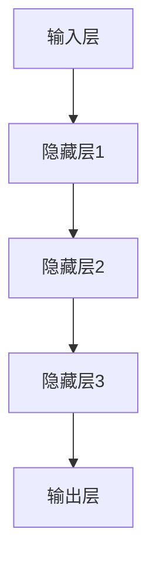

                 

### 《AI大模型在企业数字化转型中的角色》

> **关键词**：人工智能，大模型，数字化转型，企业应用，深度学习，自然语言处理，计算机视觉，数据隐私，模型解释性，智能客服，推荐系统，智能制造，金融风控。

> **摘要**：本文深入探讨了AI大模型在企业数字化转型中的应用，分析了其基本概念、架构、核心技术以及在实际业务场景中的应用实例和挑战。文章结构清晰，旨在为读者提供关于AI大模型在企业中的应用指南。

----------------------------------------------------------------

## 1.2 AI大模型的基本概念与架构

### 1.2.1 AI大模型的定义

AI大模型（Large-scale AI Model）是指那些具有大量参数、复杂结构且能在海量数据上训练的深度学习模型。这些模型通常用于处理自然语言处理、计算机视觉、推荐系统等复杂任务。AI大模型的规模可以从数百万到数十亿参数不等。

### 1.2.2 AI大模型的架构

AI大模型的架构通常包括以下几个主要部分：

- **输入层**：接收外部输入数据，如文本、图像或音频。
- **隐藏层**：由多个神经网络层组成，用于对输入数据进行加工和处理。
- **输出层**：产生模型的最终输出，如分类标签、预测值或文本。


### 1.2.3 AI大模型的核心技术

AI大模型的核心技术主要包括：

- **深度学习**：通过构建多层神经网络，对大量数据进行训练，以实现图像识别、语音识别和自然语言处理等任务。
- **神经网络优化**：通过优化算法（如梯度下降、Adam等）调整模型参数，以提高模型性能。
- **预训练与微调**：利用预训练好的模型在特定任务上进行微调，以减少训练时间和提高效果。

## 1.3 AI大模型在企业中的应用场景

### 1.3.1 智能客服

智能客服是AI大模型在企业中应用的一个重要场景。通过自然语言处理（NLP）技术，智能客服系统能够理解和回答客户的提问，提供24/7的在线服务，从而提高客户满意度和降低企业运营成本。

### 1.3.2 智能推荐

智能推荐系统能够根据用户的行为和偏好，为用户推荐个性化的产品或内容。这种系统能够提高用户参与度和销售额，是电子商务和内容平台的重要组成部分。

### 1.3.3 智能制造

AI大模型在智能制造中的应用包括生产线的自动化控制、质量检测、故障预测等。这些系统能够提高生产效率、降低成本，并提升产品质量。

### 1.3.4 金融风控

金融风控是AI大模型在金融领域的应用，包括欺诈检测、信用评估、市场预测等。这些系统能够帮助企业降低风险、提高运营效率。

## 1.4 AI大模型对企业数字化转型的作用

AI大模型在企业数字化转型中的作用主要体现在以下几个方面：

- **提升效率**：通过自动化和智能化的解决方案，企业能够提高业务流程的效率。
- **降低成本**：通过优化资源使用和流程，企业能够降低运营成本。
- **增强决策能力**：通过数据分析和预测，企业能够做出更明智的决策。
- **提升用户体验**：通过个性化服务和优化客户体验，企业能够提高客户满意度和忠诚度。
- **增强竞争力**：在竞争激烈的市场环境中，AI大模型能够帮助企业获得竞争优势。

## 1.5 AI大模型在企业应用中的挑战与解决方案

### 1.5.1 数据隐私与安全

随着AI大模型在企业中的应用日益广泛，数据隐私和安全问题也日益突出。企业需要采取数据加密、访问控制、匿名化等技术来保护数据隐私。

### 1.5.2 模型解释性

AI大模型通常具有黑箱特性，模型内部决策过程复杂且难以解释。企业需要开发可解释性技术，如决策树、LIME等，以提高模型的可解释性。

### 1.5.3 模型适应性

企业环境变化快速，如果AI大模型无法适应这些变化，可能会导致性能下降或失效。企业需要采用持续学习、迁移学习等技术，提高模型的适应性。

### 1.5.4 资源与计算能力

AI大模型的训练和部署需要大量的计算资源和存储空间。企业需要采用云计算、模型压缩等技术，以优化资源使用和计算能力。

## 1.6 AI大模型在企业应用中的未来趋势

随着技术的不断发展，AI大模型在企业应用中的未来趋势包括：

- **更加智能化**：通过深度学习和自然语言处理等技术，AI大模型将能够更好地理解和处理复杂业务场景。
- **更加个性化**：通过个性化推荐和数据挖掘技术，AI大模型将能够提供更加个性化的服务。
- **更加安全**：随着数据隐私和安全问题的日益重视，AI大模型将采用更加先进的安全技术来保护数据隐私。

## 1.7 总结

AI大模型在企业数字化转型中的应用具有巨大的潜力。通过本文的探讨，我们了解了AI大模型的基本概念、架构、应用场景、作用以及面临的挑战。企业应积极应对这些挑战，充分利用AI大模型的潜力，推动企业数字化转型和可持续发展。


----------------------------------------------------------------

### 1.2.1 AI大模型的定义

AI大模型（Large-scale AI Model）是指参数数量巨大、模型结构复杂、能够处理海量数据的深度学习模型。这些模型通常在训练阶段使用海量的数据进行训练，以达到较高的准确度和泛化能力。AI大模型在自然语言处理、计算机视觉、推荐系统等领域发挥着重要作用。

### 1.2.2 AI大模型的架构

AI大模型的架构通常包括以下几个关键部分：

1. **输入层**：接收外部输入数据，如文本、图像或音频。输入层的神经元数量取决于输入数据的维度。
2. **隐藏层**：由多个神经网络层组成，用于对输入数据进行加工和处理。隐藏层中的神经元数量和层数通常根据任务需求和模型复杂性进行调整。
3. **输出层**：产生模型的最终输出，如分类标签、预测值或文本。输出层的神经元数量取决于任务类型和输出维度。

以下是一个简单的AI大模型架构示例，使用Mermaid流程图表示：



### 1.2.3 AI大模型的核心技术

AI大模型的核心技术包括以下几个方面：

1. **深度学习**：深度学习是一种通过多层神经网络对数据进行建模和学习的方法。AI大模型通常基于深度学习技术，利用多层神经网络提取数据的特征和模式。

2. **神经网络优化**：神经网络优化是通过调整模型参数（权重和偏置）来提高模型性能的过程。常用的优化算法包括梯度下降（Gradient Descent）、Adam等。

3. **预训练与微调**：预训练是指在特定任务之外，使用大规模数据进行模型训练，以获得通用的特征提取能力。微调是指在预训练模型的基础上，针对特定任务进行调整和优化，以提高模型在特定任务上的性能。

### 1.2.4 AI大模型的训练与部署

AI大模型的训练和部署是一个复杂的过程，包括以下几个关键步骤：

1. **数据收集与预处理**：收集海量数据，并进行预处理，如数据清洗、归一化、数据增强等。
2. **模型设计**：选择合适的模型架构，如卷积神经网络（CNN）、递归神经网络（RNN）或转换器（Transformer）等。
3. **模型训练**：使用训练数据训练模型，通过优化算法调整模型参数，以达到预定的性能指标。
4. **模型评估**：使用测试数据评估模型性能，选择性能最佳的模型进行部署。
5. **模型部署**：将训练好的模型部署到生产环境中，提供实时预测和服务。

以下是一个简单的AI大模型训练与部署的伪代码：

```python
# 数据收集与预处理
data = load_data()
preprocessed_data = preprocess_data(data)

# 模型设计
model = create_model()

# 模型训练
model.fit(preprocessed_data, epochs=10, batch_size=64)

# 模型评估
test_data = load_test_data()
test_preprocessed_data = preprocess_data(test_data)
model.evaluate(test_preprocessed_data)

# 模型部署
deploy_model(model)
```

通过上述内容，我们对AI大模型的基本概念、架构和核心技术有了更深入的了解。在接下来的章节中，我们将进一步探讨AI大模型在企业数字化转型中的应用场景、挑战和解决方案。


----------------------------------------------------------------

### 1.2.2 AI大模型的架构

AI大模型的架构是其在复杂任务中表现优异的关键。下面我们将详细探讨AI大模型的组成部分及其设计原则。

#### 1.2.2.1 神经网络结构

AI大模型的核心是神经网络，尤其是深度神经网络（Deep Neural Networks, DNN）。神经网络由多个层次组成，包括输入层、隐藏层和输出层。

- **输入层（Input Layer）**：输入层接收外部输入数据，如文本、图像或音频。这些输入数据通过一系列预处理步骤（例如，图像归一化、文本分词）转换为模型可处理的格式。
- **隐藏层（Hidden Layers）**：隐藏层是神经网络的核心部分，用于对输入数据进行加工和处理。每层隐藏层中的神经元都通过前一层神经元的输出进行计算，并通过激活函数引入非线性变换。通常，隐藏层的数量和每层的神经元数量是模型设计中的关键参数。
- **输出层（Output Layer）**：输出层产生模型的最终输出。对于分类任务，输出层通常是一个 Softmax 函数，用于生成每个类别的概率分布。对于回归任务，输出层可能是一个线性函数，直接输出预测值。

#### 1.2.2.2 激活函数

激活函数是神经网络中的一个关键组件，用于引入非线性特性。常用的激活函数包括：

- **Sigmoid 函数**：$f(x) = \frac{1}{1 + e^{-x}}$，将输入映射到（0，1）区间。
- **ReLU 函数**：$f(x) = max(0, x)$，对于负值输入输出0，对于正值输入输出输入值。
- **Tanh 函数**：$f(x) = \frac{e^x - e^{-x}}{e^x + e^{-x}}$，将输入映射到（-1，1）区间。

#### 1.2.2.3 损失函数

损失函数用于衡量模型预测值与真实值之间的差异。常见的损失函数包括：

- **均方误差（MSE）**：$MSE = \frac{1}{n}\sum_{i=1}^{n}(y_i - \hat{y}_i)^2$，用于回归任务。
- **交叉熵损失（Cross-Entropy Loss）**：$CE = -\frac{1}{n}\sum_{i=1}^{n}y_i \log(\hat{y}_i)$，用于分类任务。

#### 1.2.2.4 优化算法

优化算法用于调整神经网络中的参数，以最小化损失函数。常用的优化算法包括：

- **随机梯度下降（SGD）**：通过计算损失函数关于模型参数的梯度来更新参数。
- **Adam算法**：结合了AdaGrad和RMSProp的优点，通过自适应学习率调整参数。

#### 1.2.2.5 并行计算与分布式训练

AI大模型的训练需要大量的计算资源，因此并行计算和分布式训练成为必不可少的手段。分布式训练通过将数据分布在多个节点上进行训练，可以显著缩短训练时间并提高训练效率。常用的分布式训练框架包括：

- **Horovod**：基于TensorFlow的分布式训练框架。
- **DistributedDataParallel（DDP）**：基于PyTorch的分布式训练框架。

### 1.2.2.6 模型压缩与量化

为了提高AI大模型在实际应用中的性能和可部署性，模型压缩和量化技术被广泛应用。这些技术包括：

- **模型剪枝（Model Pruning）**：通过删除网络中的冗余连接来减少模型大小。
- **量化（Quantization）**：将模型的权重和激活值从浮点数转换为低精度格式，如整数或二进制。

#### 1.2.2.7 模型集成与迁移学习

模型集成和迁移学习是提高AI大模型性能的有效手段。模型集成通过组合多个模型的预测来提高结果的准确性。迁移学习通过将预训练模型应用于新的任务，利用预训练模型的知识来加速新任务的训练过程。

综上所述，AI大模型的架构是一个复杂且灵活的系统，其设计原则包括神经网络结构、激活函数、损失函数、优化算法、并行计算与分布式训练、模型压缩与量化、模型集成与迁移学习等。这些组成部分和设计原则共同决定了AI大模型在复杂任务中的性能和可部署性。

----------------------------------------------------------------

### 1.2.3 AI大模型的核心技术

AI大模型的核心技术是其能够处理海量数据并进行高效训练和推理的能力。以下是对AI大模型的核心技术的详细介绍：

#### 1.2.3.1 深度学习

深度学习是一种基于人工神经网络的机器学习方法，其特点是通过多层神经网络对数据进行层次化的特征提取和学习。深度学习模型的结构通常包括输入层、多个隐藏层和一个输出层。每一层的神经元通过激活函数进行非线性变换，从而实现对输入数据的层次化特征提取。

深度学习的关键组成部分如下：

- **卷积神经网络（CNN）**：CNN是专门用于处理图像数据的深度学习模型，通过卷积操作提取图像的特征。CNN在计算机视觉任务中表现出色，如图像分类、目标检测和图像分割等。
- **循环神经网络（RNN）**：RNN是一种能够处理序列数据的神经网络，通过在时间步上递归地处理输入序列。RNN在自然语言处理任务中发挥了重要作用，如图像识别、机器翻译和文本生成等。
- **转换器（Transformer）**：Transformer是一种基于自注意力机制的深度学习模型，特别适用于处理长序列数据。Transformer在机器翻译、文本生成和问答系统等任务中取得了显著的效果。

#### 1.2.3.2 神经网络优化

神经网络优化是指通过调整神经网络中的参数来提高模型性能的过程。优化算法的目标是找到损失函数的最小值，从而实现模型的训练。常用的优化算法包括：

- **随机梯度下降（SGD）**：SGD是一种简单的优化算法，通过随机选择样本计算梯度，并更新模型参数。SGD的优点是简单易实现，缺点是收敛速度较慢。
- **Adam算法**：Adam算法是SGD的一种改进算法，通过自适应地调整学习率来提高收敛速度。Adam算法结合了AdaGrad和RMSProp的优点，适用于各种规模的神经网络训练。
- **Adadelta算法**：Adadelta算法是另一种改进的SGD算法，通过使用递归平均方法来更新梯度。Adadelta算法在处理稀疏数据时表现较好。

#### 1.2.3.3 预训练与微调

预训练与微调是一种常用的训练AI大模型的方法，其核心思想是先在大量未标注的数据上预训练模型，然后使用少量标注数据进行微调。预训练与微调的优点是能够利用大规模数据提高模型的泛化能力，同时减少对标注数据的依赖。

预训练与微调的关键步骤如下：

1. **预训练**：在大量未标注的数据上（如互联网文本、图像数据集等）训练模型，提取通用的特征表示。
2. **微调**：使用少量标注数据对预训练模型进行微调，使其适应特定的任务和数据集。

#### 1.2.3.4 自然语言处理（NLP）

自然语言处理是AI大模型的重要应用领域之一。NLP技术涉及对文本数据进行分析、理解和生成。AI大模型在NLP中的应用主要包括：

- **词嵌入（Word Embedding）**：将文本数据转换为数值向量表示，以便神经网络处理。词嵌入技术包括Word2Vec、GloVe和BERT等。
- **序列模型**：用于处理序列数据，如RNN、LSTM和GRU等。这些模型能够捕捉序列中的长期依赖关系。
- **转换器架构**：Transformer架构是一种基于自注意力机制的深度学习模型，特别适用于处理长序列数据。转换器架构包括编码器和解码器，常用于机器翻译、文本生成和问答系统等任务。

#### 1.2.3.5 计算机视觉

计算机视觉是AI大模型的另一个重要应用领域。计算机视觉技术涉及对图像和视频数据进行分析和理解。AI大模型在计算机视觉中的应用主要包括：

- **卷积神经网络（CNN）**：CNN是一种专门用于处理图像数据的神经网络模型，通过卷积操作提取图像的特征。CNN在图像分类、目标检测和图像分割等任务中取得了显著的效果。
- **生成对抗网络（GAN）**：GAN是一种由生成器和判别器组成的神经网络模型，用于生成与真实数据相似的数据。GAN在图像生成、风格迁移和图像修复等任务中表现出色。
- **目标检测与语义分割**：目标检测是指识别图像中的目标对象，常用的算法包括SSD、YOLO和Faster R-CNN等。语义分割是指将图像划分为不同的语义区域，常用的算法包括FCN和U-Net等。

综上所述，AI大模型的核心技术包括深度学习、神经网络优化、预训练与微调、自然语言处理和计算机视觉等。这些技术共同构成了AI大模型的强大能力，使其能够在各种复杂任务中取得优异的性能。通过不断发展和优化这些技术，AI大模型将继续推动人工智能领域的进步。

----------------------------------------------------------------

### 1.3.1 智能客服

智能客服是AI大模型在企业中应用的一个重要场景，旨在通过自动化和智能化的解决方案提高客户服务质量和效率。智能客服系统通常包含以下几个核心组成部分：

#### 1.3.1.1 自然语言处理（NLP）

自然语言处理是智能客服系统的核心组件，负责理解和处理客户的语言输入。NLP技术包括文本分类、实体识别、情感分析等，这些技术使得智能客服系统能够理解客户的问题并生成合适的回答。

#### 1.3.1.2 转换器架构

转换器（Transformer）架构是一种基于自注意力机制的深度学习模型，特别适用于处理序列数据。在智能客服系统中，转换器架构可以用于构建对话模型，实现与客户的自然语言交互。

#### 1.3.1.3 对话管理

对话管理是指智能客服系统在处理客户请求时，如何组织和管理对话流程。对话管理包括意图识别、上下文维护和对话生成等任务，以确保对话的连贯性和准确性。

以下是一个智能客服系统的简单工作流程：

1. **客户请求**：客户通过文本消息或语音输入提出问题。
2. **意图识别**：智能客服系统使用NLP技术识别客户的意图。
3. **上下文处理**：系统分析客户的历史对话记录和当前请求，确定上下文信息。
4. **对话生成**：系统根据意图和上下文信息生成回答，并通过转换器模型生成自然流畅的对话。
5. **反馈与优化**：系统收集客户的反馈，并利用反馈优化对话生成模型。

### 1.3.1.4 优势与应用

智能客服系统具有以下优势：

- **提高效率**：智能客服系统能够处理大量的客户请求，减轻人工客服的工作负担。
- **降低成本**：通过自动化处理常见问题，减少人工客服的需求，降低运营成本。
- **提升服务质量**：智能客服系统能够提供快速、准确的回答，提高客户满意度。
- **数据分析**：智能客服系统可以记录和分析客户的提问和回答，为企业提供有价值的客户数据。

智能客服系统在企业中的应用场景包括：

- **客户服务**：自动回答常见问题，提供24/7的客户支持。
- **售后服务**：处理客户投诉、退货等问题。
- **销售支持**：提供产品信息、优惠活动等推荐。
- **客户关怀**：通过个性化沟通，增强客户关系。

### 1.3.1.5 挑战与解决方案

尽管智能客服系统具有许多优势，但在实际应用中仍面临一些挑战：

- **语言理解**：智能客服系统需要具备强大的语言理解能力，准确理解客户的意图和上下文。
- **对话连贯性**：生成对话内容需要保持连贯性，避免出现语义错误或不合逻辑的回答。
- **个性化服务**：提供个性化服务需要理解客户的历史行为和偏好。

为了解决这些挑战，可以采用以下解决方案：

- **增强NLP技术**：通过不断优化NLP算法，提高系统的语言理解能力。
- **多模态交互**：结合文本、语音和图像等多种交互方式，提高用户的沟通体验。
- **持续学习**：利用机器学习技术，使系统不断学习新的知识和经验，提高对话质量。

综上所述，智能客服系统是AI大模型在企业中应用的一个重要场景，通过自动化和智能化的解决方案，能够显著提高客户服务质量和效率。随着技术的不断进步，智能客服系统将在企业数字化转型中发挥更大的作用。

----------------------------------------------------------------

### 1.3.2 智能推荐

智能推荐系统是AI大模型在企业应用中的另一个重要场景，旨在根据用户的行为和偏好，为其推荐个性化的产品、内容或服务。智能推荐系统通过深度学习、数据挖掘和机器学习等技术，分析用户的历史行为和兴趣，生成精准的推荐列表。

#### 1.3.2.1 基本原理

智能推荐系统的工作原理主要包括以下几个步骤：

1. **数据收集**：收集用户的行为数据，如浏览历史、点击记录、购买记录等。
2. **数据处理**：对收集到的数据进行清洗、预处理和特征提取，以便模型训练。
3. **模型训练**：使用处理后的数据训练推荐模型，常见的推荐模型包括基于内容的推荐、协同过滤推荐和深度学习推荐。
4. **模型评估**：通过交叉验证和测试集评估模型性能，选择最佳模型。
5. **推荐生成**：根据用户的行为数据和训练好的推荐模型，生成个性化的推荐列表。

#### 1.3.2.2 技术实现

智能推荐系统的实现主要包括以下几个关键技术：

1. **协同过滤**：协同过滤是一种基于用户行为相似性和物品相似性的推荐方法。常见的方法包括用户基于的协同过滤和物品基于的协同过滤。
2. **基于内容的推荐**：基于内容的推荐通过分析物品的内容特征，为用户推荐与其兴趣相似的其他物品。
3. **深度学习推荐**：深度学习推荐利用深度神经网络，如卷积神经网络（CNN）和循环神经网络（RNN），对用户行为和物品特征进行建模，生成个性化推荐。

#### 1.3.2.3 应用场景

智能推荐系统在企业中的广泛应用场景包括：

1. **电子商务**：为用户推荐可能感兴趣的商品，提高用户参与度和销售额。
2. **内容平台**：为用户提供个性化的内容推荐，如视频、音乐、新闻等，提高用户黏性和满意度。
3. **社交媒体**：为用户推荐可能感兴趣的朋友、活动或话题，增强社交体验。
4. **金融服务**：为用户提供个性化的金融产品推荐，如理财产品、保险等，提高客户满意度。

#### 1.3.2.4 优势

智能推荐系统具有以下优势：

1. **提高用户体验**：通过个性化推荐，提高用户对产品和服务的满意度。
2. **增加销售额**：通过推荐用户可能感兴趣的商品，提高销售额和转化率。
3. **降低运营成本**：自动化推荐系统可以减少人工干预，降低运营成本。
4. **数据洞察**：通过分析用户行为数据，为企业提供有价值的商业洞察。

#### 1.3.2.5 挑战

尽管智能推荐系统具有许多优势，但在实际应用中也面临一些挑战：

1. **数据隐私**：用户行为数据的收集和处理需要遵守数据隐私法规，确保用户数据的安全。
2. **推荐多样性**：确保推荐列表的多样性，避免用户产生疲劳感。
3. **模型解释性**：深度学习模型通常具有黑箱特性，难以解释其推荐逻辑，对企业的合规性和透明性要求较高。

#### 1.3.2.6 解决方案

为了解决这些挑战，可以采取以下解决方案：

1. **数据安全**：采用加密、访问控制等技术保护用户数据的安全。
2. **多样化策略**：通过多样化的推荐策略和算法，确保推荐列表的多样性。
3. **模型解释性**：采用可解释性技术，如决策树、LIME等，提高模型的透明性。

综上所述，智能推荐系统是AI大模型在企业应用中的一个重要场景，通过个性化推荐，能够显著提高用户体验、增加销售额和降低运营成本。随着技术的不断进步，智能推荐系统将在更多企业场景中发挥重要作用。

----------------------------------------------------------------

### 1.3.3 智能制造

智能制造是工业4.0的重要组成部分，通过引入AI大模型，可以实现生产过程的智能化和自动化，提高生产效率、降低成本和提升产品质量。智能制造系统通常包括以下几个关键组成部分：

#### 1.3.3.1 数据采集与处理

智能制造系统的第一步是数据采集，通过传感器和设备收集生产过程中的各种数据，如温度、压力、振动、产量等。数据采集后，需要进行数据处理，包括数据清洗、归一化和特征提取，以便后续的模型训练和预测。

#### 1.3.3.2 模型训练与预测

AI大模型在智能制造中的应用主要包括以下几个步骤：

1. **模型训练**：使用收集到的数据训练AI大模型，如卷积神经网络（CNN）、长短期记忆网络（LSTM）等。模型训练的目的是让模型学会如何根据输入数据预测输出结果。
2. **模型优化**：通过交叉验证和测试集评估模型性能，调整模型参数和结构，以提高模型的准确性和泛化能力。
3. **模型部署**：将训练好的模型部署到生产环境中，进行实时预测和监控。

#### 1.3.3.3 智能控制与优化

智能制造系统通过AI大模型实现智能控制与优化，主要包括以下几个方面：

1. **生产过程控制**：利用AI大模型实时监控生产过程，根据模型预测结果调整生产参数，如温度、压力等，以确保生产过程的稳定性和产品质量。
2. **质量检测**：AI大模型可以用于质量检测，通过分析生产过程中的数据，预测产品质量的缺陷，及时进行调整，避免不良品产生。
3. **预测性维护**：AI大模型可以预测设备的故障和寿命，提前进行维护和更换，降低设备故障率和停机时间。

#### 1.3.3.4 应用场景

智能制造系统在企业中的应用场景包括：

1. **生产自动化**：通过自动化生产线，实现生产过程的无人化，提高生产效率。
2. **质量监测**：实时监测产品质量，提高产品质量的稳定性和一致性。
3. **设备维护**：预测设备故障，提前进行维护，降低设备故障率和停机时间。
4. **生产优化**：通过AI大模型优化生产流程，降低生产成本，提高生产效率。

#### 1.3.3.5 优势

智能制造系统具有以下优势：

1. **提高生产效率**：通过自动化和智能化技术，提高生产效率和产量。
2. **降低生产成本**：通过优化生产流程和设备维护，降低生产成本。
3. **提升产品质量**：通过实时监控和质量检测，提高产品质量的稳定性和一致性。
4. **增强竞争力**：在竞争激烈的市场环境中，智能制造系统可以帮助企业获得竞争优势。

#### 1.3.3.6 挑战

尽管智能制造系统具有许多优势，但在实际应用中也面临一些挑战：

1. **技术门槛**：智能制造系统需要高水平的技术能力和专业知识，对于中小企业来说可能存在技术门槛。
2. **数据安全**：数据安全和隐私保护是企业需要考虑的重要问题。
3. **员工适应**：智能制造系统的应用可能会对员工的工作产生影响，需要员工适应新的工作方式。

#### 1.3.3.7 解决方案

为了解决这些挑战，可以采取以下解决方案：

1. **技术培训**：提供技术培训，帮助员工了解和掌握智能制造系统的基本知识。
2. **数据安全**：采用数据加密、访问控制等技术，确保数据的安全和隐私。
3. **员工沟通**：与员工进行充分的沟通，了解他们的担忧和需求，帮助他们适应新的工作方式。

综上所述，智能制造系统是AI大模型在企业应用中的一个重要场景，通过自动化和智能化技术，能够显著提高生产效率、降低成本和提升产品质量。随着技术的不断进步，智能制造系统将在更多企业中发挥重要作用。

----------------------------------------------------------------

### 1.3.4 金融风控

金融风控是AI大模型在企业应用中的另一个关键场景，主要用于识别、评估和管理金融风险。通过深度学习和大数据分析，金融风控系统能够实时监控交易活动，识别潜在的欺诈行为和信用风险，从而降低金融机构的风险敞口。

#### 1.3.4.1 基本原理

金融风控系统的工作原理主要包括以下几个步骤：

1. **数据收集**：收集交易数据、客户信息、市场信息等，这些数据是风控系统进行风险识别和评估的基础。
2. **数据处理**：对收集到的数据进行分析、清洗和特征提取，将原始数据转换为可用于模型训练的格式。
3. **模型训练**：使用处理后的数据训练风险预测模型，如逻辑回归、决策树、随机森林、神经网络等。
4. **模型评估**：通过交叉验证和测试集评估模型的性能，选择最佳模型进行部署。
5. **实时监控**：将训练好的模型部署到生产环境中，实时监控交易活动，识别潜在的风险。

#### 1.3.4.2 技术实现

金融风控系统的技术实现主要包括以下几个方面：

1. **机器学习算法**：机器学习算法是金融风控系统的重要工具，包括监督学习和无监督学习。监督学习算法如逻辑回归、支持向量机（SVM）、随机森林等常用于分类任务，而无监督学习算法如聚类分析、异常检测等则用于风险识别。
2. **深度学习模型**：深度学习模型在金融风控中的应用日益广泛，如卷积神经网络（CNN）在图像识别、循环神经网络（RNN）在序列数据处理等方面表现优异。
3. **特征工程**：特征工程是金融风控系统的重要环节，通过选择和构造合适的特征，可以提高模型的预测性能和泛化能力。

#### 1.3.4.3 应用场景

金融风控系统在企业中的应用场景包括：

1. **欺诈检测**：通过分析交易行为、客户信息等数据，识别潜在的欺诈行为，如洗钱、伪造账户等。
2. **信用评估**：通过分析客户的信用历史、财务状况等数据，评估客户的信用风险，为金融机构提供信用决策支持。
3. **市场预测**：通过分析市场数据、宏观经济指标等，预测市场趋势和风险，为金融机构的投资决策提供参考。
4. **风险管理**：通过监控交易活动、市场变化等，实时评估金融机构的风险敞口，制定相应的风险控制策略。

#### 1.3.4.4 优势

金融风控系统具有以下优势：

1. **提高风险识别能力**：通过大数据分析和深度学习技术，金融风控系统能够识别出传统方法难以发现的潜在风险。
2. **降低运营成本**：通过自动化处理交易数据，金融风控系统可以显著降低人工审核的工作量和成本。
3. **提高决策效率**：实时监控交易活动，提供快速的风险评估和决策支持，提高金融机构的运营效率。
4. **提升客户体验**：通过精准的欺诈检测和信用评估，金融风控系统可以提高客户的信任感和满意度。

#### 1.3.4.5 挑战

尽管金融风控系统具有许多优势，但在实际应用中也面临一些挑战：

1. **数据隐私**：金融数据涉及客户的隐私信息，数据安全和隐私保护是风控系统需要关注的重要问题。
2. **模型解释性**：深度学习模型通常具有黑箱特性，难以解释其决策过程，对金融机构的合规性和透明性要求较高。
3. **模型适应性**：金融市场变化快速，风控模型需要不断更新和适应新的风险环境。

#### 1.3.4.6 解决方案

为了解决这些挑战，可以采取以下解决方案：

1. **数据安全**：采用加密、访问控制等技术，确保金融数据的安全和隐私。
2. **模型解释性**：采用可解释性技术，如决策树、LIME等，提高模型的透明性。
3. **模型适应性**：采用持续学习、迁移学习等技术，使风控模型能够适应新的风险环境。

综上所述，金融风控系统是AI大模型在企业应用中的一个重要场景，通过大数据分析和深度学习技术，能够显著提高金融机构的风险识别和管理能力。随着技术的不断进步，金融风控系统将在更多金融机构中发挥重要作用。

----------------------------------------------------------------

### 2.1.1 深度学习的基本概念

深度学习（Deep Learning）是一种基于人工神经网络的机器学习方法，其核心思想是通过构建具有多个隐藏层的神经网络，对大量数据进行层次化的特征提取和学习。深度学习在图像识别、自然语言处理、语音识别等领域取得了显著的成果。

#### 2.1.1.1 神经网络的基本结构

神经网络（Neural Network）是深度学习的基础，由一系列相互连接的神经元组成。一个典型的神经网络结构包括以下几个部分：

1. **输入层（Input Layer）**：接收外部输入数据，如图像、文本或声音。输入层的每个神经元表示一个特征。
2. **隐藏层（Hidden Layers）**：由多个隐藏层组成，每个隐藏层的神经元通过激活函数对输入数据进行加工和处理。隐藏层用于提取数据的特征和模式。
3. **输出层（Output Layer）**：产生模型的最终输出，如分类标签、预测值或文本。输出层的神经元数量和类型取决于任务类型和输出维度。

#### 2.1.1.2 激活函数

激活函数（Activation Function）是神经网络中的一个关键组件，用于引入非线性变换。常见的激活函数包括：

1. **Sigmoid函数**：$f(x) = \frac{1}{1 + e^{-x}}$，将输入映射到（0，1）区间。
2. **ReLU函数**：$f(x) = max(0, x)$，对于负值输入输出0，对于正值输入输出输入值。
3. **Tanh函数**：$f(x) = \frac{e^x - e^{-x}}{e^x + e^{-x}}$，将输入映射到（-1，1）区间。

#### 2.1.1.3 损失函数

损失函数（Loss Function）用于衡量模型预测值与真实值之间的差异。常见的损失函数包括：

1. **均方误差（MSE）**：$MSE = \frac{1}{n}\sum_{i=1}^{n}(y_i - \hat{y}_i)^2$，用于回归任务。
2. **交叉熵损失（Cross-Entropy Loss）**：$CE = -\frac{1}{n}\sum_{i=1}^{n}y_i \log(\hat{y}_i)$，用于分类任务。

#### 2.1.1.4 前向传播与反向传播

深度学习模型通过前向传播（Forward Propagation）和反向传播（Back Propagation）进行训练。

1. **前向传播**：将输入数据通过神经网络传递到输出层，计算模型的预测值。
2. **反向传播**：计算预测值与真实值之间的误差，通过反向传播计算各层的梯度，并更新网络参数。

#### 2.1.1.5 梯度下降

梯度下降（Gradient Descent）是一种优化算法，用于调整神经网络中的参数，以最小化损失函数。常见的梯度下降算法包括：

1. **随机梯度下降（SGD）**：通过随机选择样本计算梯度，并更新模型参数。
2. **批量梯度下降（Batch Gradient Descent）**：通过计算所有样本的梯度，并更新模型参数。
3. **小批量梯度下降（Mini-batch Gradient Descent）**：通过计算部分样本的梯度，并更新模型参数。

#### 2.1.1.6 深度学习框架

深度学习框架（Deep Learning Framework）是用于构建、训练和部署深度学习模型的开源工具。常见的深度学习框架包括：

1. **TensorFlow**：由Google开发的开源深度学习框架，支持多种编程语言和平台。
2. **PyTorch**：由Facebook开发的开源深度学习框架，具有直观的代码和灵活的模型定义。
3. **Keras**：基于TensorFlow和Theano的开源深度学习框架，提供简洁的API。

通过上述内容，我们对深度学习的基本概念有了初步了解。在接下来的章节中，我们将进一步探讨深度学习在自然语言处理、计算机视觉等领域的应用。

----------------------------------------------------------------

### 2.1.2 神经网络的结构与原理

神经网络（Neural Network，NN）是深度学习的基础，其结构与原理决定了模型的学习能力和性能。下面我们将详细讨论神经网络的结构与原理。

#### 2.1.2.1 神经元

神经网络的基本单元是神经元（Neuron），也称为节点或单元。神经元由输入层、权重、偏置和激活函数组成。

1. **输入层**：输入层的神经元接收外部输入数据，例如文本、图像或声音。每个输入数据通过权重与下一层的神经元相连。
2. **权重（Weights）**：权重是连接输入层和隐藏层的参数，用于调整输入数据对神经元的影响。
3. **偏置（Bias）**：偏置是每个神经元的额外输入，用于调整神经元输出。
4. **激活函数**：激活函数用于引入非线性特性，常见的激活函数包括Sigmoid、ReLU和Tanh。

#### 2.1.2.2 隐藏层

隐藏层是神经网络的核心部分，用于对输入数据进行加工和处理。隐藏层的神经元通过前一层神经元的输出进行计算，并通过激活函数引入非线性变换。

1. **多层隐藏层**：神经网络可以包含多层隐藏层，每层隐藏层都可以对输入数据提取更高层次的特征。通常，隐藏层的数量和每层的神经元数量是模型设计中的关键参数。
2. **深度**：神经网络的深度（即隐藏层的数量）决定了模型的学习能力。较深的网络可以学习更复杂的特征，但训练时间和计算成本也会增加。

#### 2.1.2.3 输出层

输出层产生模型的最终输出，例如分类标签、预测值或文本。输出层的神经元数量和类型取决于任务类型和输出维度。

1. **分类任务**：对于分类任务，输出层通常是一个 Softmax 函数，用于生成每个类别的概率分布。
2. **回归任务**：对于回归任务，输出层可能是一个线性函数，直接输出预测值。

#### 2.1.2.4 激活函数

激活函数是神经网络中的一个关键组件，用于引入非线性特性。常见的激活函数包括：

1. **Sigmoid 函数**：$f(x) = \frac{1}{1 + e^{-x}}$，将输入映射到（0，1）区间。
2. **ReLU 函数**：$f(x) = max(0, x)$，对于负值输入输出0，对于正值输入输出输入值。
3. **Tanh 函数**：$f(x) = \frac{e^x - e^{-x}}{e^x + e^{-x}}$，将输入映射到（-1，1）区间。

#### 2.1.2.5 梯度下降

神经网络通过梯度下降（Gradient Descent）算法优化模型参数。梯度下降是一种优化算法，通过计算损失函数关于模型参数的梯度，并沿着梯度方向更新参数，以最小化损失函数。

1. **前向传播**：将输入数据通过神经网络传递到输出层，计算模型的预测值。
2. **反向传播**：计算预测值与真实值之间的误差，通过反向传播计算各层的梯度。
3. **参数更新**：根据梯度更新模型参数，以减少损失函数。

#### 2.1.2.6 权重初始化

权重初始化是神经网络训练的重要环节，合适的权重初始化有助于加快收敛速度和避免梯度消失或爆炸。

1. **随机初始化**：随机初始化权重，常用的方法包括高斯分布和均匀分布。
2. **经验初始化**：基于已有的模型或经验数据进行权重初始化。

#### 2.1.2.7 梯度优化算法

梯度优化算法用于加速梯度下降算法，常见的优化算法包括：

1. **动量（Momentum）**：通过保留前一次梯度的一部分来加速收敛。
2. **Adagrad**：自适应调整学习率，适用于稀疏数据。
3. **Adam**：结合了Adagrad和RMSProp的优点，适用于各种规模的数据。

通过上述内容，我们对神经网络的结构与原理有了深入的理解。在接下来的章节中，我们将进一步探讨神经网络的训练过程和常见的问题。

----------------------------------------------------------------

### 2.1.3 神经网络的优化与训练

神经网络的优化与训练是构建高效AI模型的关键步骤。这一过程包括多个环节，如参数初始化、优化算法选择、学习率调整等。以下是详细的讲解。

#### 2.1.3.1 参数初始化

参数初始化是神经网络训练的第一步，对模型的性能和收敛速度有重要影响。

1. **随机初始化**：常用的方法包括均匀分布和正态分布。均匀分布可以避免梯度消失和梯度爆炸，但可能需要较大的学习率。正态分布则可以保证梯度有一定的方差，但可能需要较小的学习率。
   ```python
   # 均匀分布初始化
   W = tf.random.uniform((input_size, hidden_size), minval=-0.1, maxval=0.1)
   # 正态分布初始化
   W = tf.random.normal((input_size, hidden_size), mean=0.0, stddev=0.1)
   ```

2. **He初始化**：He初始化是一种常用的初始化方法，适用于ReLU激活函数。它基于输入数据的标准差进行初始化，可以避免梯度消失问题。
   ```python
   # He初始化
   hidden_size = 64
   stddev = np.sqrt(2 / input_size)
   W = tf.random.normal((input_size, hidden_size), stddev=stddev)
   ```

#### 2.1.3.2 优化算法

优化算法用于调整模型参数，以最小化损失函数。以下是几种常用的优化算法：

1. **随机梯度下降（SGD）**：SGD是最简单的优化算法，通过随机选择一个样本计算梯度并更新参数。
   ```python
   optimizer = tf.keras.optimizers.SGD(learning_rate=0.01)
   ```

2. **Adam**：Adam算法结合了SGD和RMSProp的优点，自适应调整学习率，适用于各种规模的数据。
   ```python
   optimizer = tf.keras.optimizers.Adam(learning_rate=0.001)
   ```

3. **RMSProp**：RMSProp通过历史梯度值的指数加权移动平均来更新学习率。
   ```python
   optimizer = tf.keras.optimizers.RMSprop(learning_rate=0.001, decay=0.9)
   ```

#### 2.1.3.3 学习率调整

学习率是优化算法中的一个关键参数，对模型的训练过程和性能有重要影响。

1. **固定学习率**：在训练初期使用固定学习率，有助于模型快速收敛。
   ```python
   learning_rate = 0.1
   ```

2. **学习率衰减**：随着训练的进行，逐步降低学习率，有助于模型在训练后期精细调整参数。
   ```python
   def scheduler(epoch, lr):
       if epoch < 10:
           return lr
       else:
           return lr * tf.math.exp(-0.1 * epoch)
   callback = tf.keras.callbacks.LearningRateScheduler(scheduler)
   ```

3. **学习率调度器**：使用学习率调度器动态调整学习率，例如基于周期性调整或基于性能调整。
   ```python
   from tensorflow.keras.callbacks import ReduceLROnPlateau
   callback = ReduceLROnPlateau(monitor='val_loss', factor=0.1, patience=5)
   ```

#### 2.1.3.4 梯度裁剪

梯度裁剪是一种防止梯度消失和梯度爆炸的技术，通过限制梯度的绝对值。

1. **动量**：通过保留一部分前一次梯度，减少梯度消失和爆炸问题。
   ```python
   optimizer = tf.keras.optimizers.SGD(learning_rate=0.1, momentum=0.9)
   ```

2. **梯度裁剪**：通过限制梯度的最大值，防止梯度爆炸。
   ```python
   clip_value = 1.0
   with tf.GradientTape(persistent=True) as tape:
       # 计算前向传播
       # ...
   gradients = tape.gradient(loss, model.trainable_variables)
   # 梯度裁剪
   gradients, _ = tf.clip_by_global_norm(gradients, clip_value)
   # 更新参数
   optimizer.apply_gradients(zip(gradients, model.trainable_variables))
   ```

#### 2.1.3.5 批量大小

批量大小是影响训练速度和模型性能的重要参数。

1. **小批量训练**：通过使用较小的批量大小，可以提高模型的泛化能力，但训练速度较慢。
   ```python
   batch_size = 32
   ```

2. **大数据量训练**：通过使用较大的批量大小，可以加快训练速度，但可能需要更多内存资源。

#### 2.1.3.6 训练过程

训练过程包括以下步骤：

1. **初始化模型和参数**。
2. **进行前向传播，计算损失函数**。
3. **计算梯度**。
4. **更新参数**。
5. **评估模型性能**。

```python
model = build_model()
optimizer = build_optimizer()
for epoch in range(num_epochs):
    for batch in dataset:
        with tf.GradientTape() as tape:
            predictions = model(batch.input)
            loss = compute_loss(predictions, batch.label)
        gradients = tape.gradient(loss, model.trainable_variables)
        optimizer.apply_gradients(zip(gradients, model.trainable_variables))
        if (epoch + 1) % 10 == 0:
            print(f"Epoch {epoch + 1}, Loss: {loss.numpy()}")
```

通过上述内容，我们对神经网络的优化与训练过程有了详细的了解。在接下来的章节中，我们将探讨深度学习在自然语言处理和计算机视觉等领域的应用。

----------------------------------------------------------------

### 2.2.1 词嵌入技术

词嵌入（Word Embedding）是将词汇映射到高维空间中的向量表示，以用于深度学习模型处理自然语言任务。词嵌入技术在自然语言处理（NLP）中具有至关重要的地位，因为它能够捕捉词汇之间的语义关系。

#### 2.2.1.1 Word2Vec

Word2Vec 是最著名的词嵌入技术之一，由Google提出。Word2Vec 包括两种模型：连续词袋（Continuous Bag of Words, CBOW）和Skip-Gram。

1. **CBOW（Continuous Bag of Words）**：CBOW 模型通过上下文词汇预测中心词汇。它将中心词汇的上下文词汇（例如，前后的几个词汇）作为输入，预测中心词汇。CBOW 模型的输入是中心词汇周围的词汇，输出是中心词汇。

   ```python
   # CBOW 模型的伪代码
   input_vectors = [context_word1_embedding, context_word2_embedding, ..., context_wordk_embedding]
   output_vector = target_word_embedding
   ```

2. **Skip-Gram**：Skip-Gram 模型与 CBOW 模型相反，它通过中心词汇预测上下文词汇。输入是中心词汇，输出是上下文词汇。

   ```python
   # Skip-Gram 模型的伪代码
   input_vector = target_word_embedding
   output_vectors = [context_word1_embedding, context_word2_embedding, ..., context_wordk_embedding]
   ```

#### 2.2.1.2 GloVe

GloVe（Global Vectors for Word Representation）是另一种词嵌入技术，它基于词汇的共现关系构建词向量。GloVe 模型通过计算词汇之间的余弦相似度来学习词向量。

1. **训练步骤**：
   - **计算词汇的共现矩阵**：通过统计词汇在文本中的共现次数，构建共现矩阵。
   - **优化词向量**：通过最小化损失函数（如负余弦损失），调整词向量。

   ```python
   # GloVe 模型的伪代码
   for epoch in range(num_epochs):
       for word1, word2 in cooccurrence_matrix:
           word1_vector, word2_vector = embeddings[word1], embeddings[word2]
           cosine_similarity = dot(word1_vector, word2_vector)
           loss = -log(cosine_similarity)
           # 更新词向量
           embeddings[word1], embeddings[word2] = update_embeddings(word1_vector, word2_vector, loss)
   ```

2. **优势**：
   - **捕获长距离依赖关系**：GloVe 能够捕捉词汇之间的长距离依赖关系。
   - **灵活性**：GloVe 可以处理稀疏数据，因为其基于共现矩阵。

#### 2.2.1.3 BERT

BERT（Bidirectional Encoder Representations from Transformers）是另一种先进的词嵌入技术，由Google提出。BERT 通过双向转换器架构学习词向量，能够捕捉词汇之间的语义关系。

1. **训练步骤**：
   - **输入序列**：将文本序列编码为输入序列，使用 [CLS] 和 [SEP] 标志分隔句子。
   - **转换器模型**：使用双向转换器模型对输入序列进行处理，生成词向量。

   ```python
   # BERT 模型的伪代码
   tokenizer = BertTokenizer.from_pretrained('bert-base-uncased')
   input_sequence = tokenizer.encode('Hello, how are you?', add_special_tokens=True)
   model = TFBertModel.from_pretrained('bert-base-uncased')
   outputs = model(input_ids=input_sequence)
   embeddings = outputs.last_hidden_state
   ```

2. **优势**：
   - **捕获双向依赖关系**：BERT 能够同时捕捉词汇的前后依赖关系。
   - **预训练和微调**：BERT 通过预训练获得通用语义表示，通过微调适应特定任务。

#### 2.2.1.4 应用

词嵌入技术在多个NLP任务中发挥作用，包括：

- **文本分类**：通过词嵌入表示文本，使用分类模型进行文本分类。
- **机器翻译**：通过词嵌入表示源语言和目标语言文本，使用序列到序列模型进行翻译。
- **命名实体识别**：通过词嵌入表示文本，使用命名实体识别模型识别文本中的命名实体。

通过上述内容，我们对词嵌入技术的基本概念和应用有了深入理解。在接下来的章节中，我们将探讨序列模型与注意力机制在自然语言处理中的应用。

----------------------------------------------------------------

### 2.2.2 序列模型与注意力机制

序列模型（Sequence Models）和注意力机制（Attention Mechanism）是自然语言处理（NLP）中的重要技术，用于处理和时间序列数据。序列模型能够捕捉时间序列中的长期依赖关系，而注意力机制能够自动关注序列中的关键信息，提高模型的性能。

#### 2.2.2.1 序列模型

序列模型是一种用于处理序列数据的神经网络模型，如循环神经网络（RNN）和长短期记忆网络（LSTM）。这些模型通过在时间步上递归地处理输入序列，能够捕捉序列中的长期依赖关系。

1. **循环神经网络（RNN）**：
   - **基本结构**：RNN 由输入层、隐藏层和输出层组成。隐藏层中的神经元通过递归方式处理输入序列。
   - **递归关系**：当前时间步的输出依赖于前一个时间步的输出。
   - **局限性**：RNN 在处理长序列数据时容易受到梯度消失和梯度爆炸问题的影响。

2. **长短期记忆网络（LSTM）**：
   - **基本结构**：LSTM 是 RNN 的改进版本，通过引入记忆单元和门控机制，能够有效地捕捉长序列依赖。
   - **记忆单元**：LSTM 的记忆单元用于存储和更新信息。
   - **门控机制**：包括遗忘门、输入门和输出门，用于控制信息的流入和流出。

#### 2.2.2.2 注意力机制

注意力机制是一种能够自动关注序列中关键信息的机制，常用于序列模型中。注意力机制通过计算每个输入元素的权重，使模型能够聚焦于重要的信息。

1. **基本原理**：
   - **注意力得分**：每个输入元素通过一个函数计算出一个注意力得分。
   - **权重分配**：根据注意力得分，对输入元素进行加权。
   - **输出计算**：模型的输出是基于加权输入的加权和。

2. **实现方式**：
   - **软注意力**：使用概率分布作为权重，如加性注意力、乘性注意力。
   - **硬注意力**：使用最相关的元素作为权重，如卷积注意力。

#### 2.2.2.3 应用

序列模型和注意力机制在多个NLP任务中发挥作用，包括：

- **机器翻译**：通过注意力机制，模型能够同时关注源语言和目标语言的不同部分，提高翻译质量。
- **问答系统**：通过序列模型和注意力机制，模型能够理解和回答复杂的问题。
- **文本生成**：通过注意力机制，模型能够根据上下文生成连贯的文本。

#### 2.2.2.4 BERT 中的注意力机制

BERT（Bidirectional Encoder Representations from Transformers）是一个基于转换器（Transformer）的预训练模型，它在NLP任务中取得了显著的成果。BERT 中的注意力机制是通过多头注意力（Multi-Head Attention）实现的。

1. **多头注意力**：
   - **基本原理**：多头注意力通过并行计算多个注意力机制，每个注意力机制关注序列中的不同部分，然后合并结果。
   - **实现方式**：多头注意力通过扩展自注意力机制，在每个时间步上计算多个注意力得分，并加权求和。

2. **应用**：
   - **文本分类**：BERT 通过注意力机制捕捉文本中的关键信息，用于文本分类任务。
   - **命名实体识别**：BERT 能够准确识别文本中的命名实体，通过注意力机制捕捉实体之间的依赖关系。

通过上述内容，我们对序列模型和注意力机制的基本概念和应用有了深入理解。在接下来的章节中，我们将探讨转换器架构的详细原理。

----------------------------------------------------------------

### 2.2.3 转换器架构详解

转换器（Transformer）架构是一种基于自注意力机制的深度学习模型，由Google在2017年提出。转换器在自然语言处理（NLP）领域取得了显著的成果，尤其在机器翻译、文本生成和问答系统等任务中表现出色。下面将详细讲解转换器架构的基本原理、关键组件和具体实现。

#### 2.2.3.1 基本原理

转换器架构的核心思想是使用自注意力机制（Self-Attention）来处理序列数据。自注意力机制允许模型在计算每个时间步的输出时，自动关注序列中的其他时间步，从而捕捉序列中的长期依赖关系。

1. **多头注意力（Multi-Head Attention）**：
   - **基本原理**：多头注意力通过并行计算多个注意力机制，每个注意力机制关注序列中的不同部分，然后合并结果。
   - **实现方式**：多头注意力通过扩展自注意力机制，在每个时间步上计算多个注意力得分，并加权求和。

2. **编码器-解码器结构（Encoder-Decoder Architecture）**：
   - **基本原理**：编码器（Encoder）用于处理输入序列，解码器（Decoder）用于生成输出序列。
   - **交互机制**：解码器的每个时间步的输出依赖于编码器的输出，同时解码器还关注自身的历史输出。

3. **位置编码（Positional Encoding）**：
   - **基本原理**：由于自注意力机制无法捕捉序列中的位置信息，因此引入位置编码来提供位置信息。
   - **实现方式**：位置编码通过在词向量中添加位置相关的向量，确保模型能够捕捉序列中的位置信息。

#### 2.2.3.2 关键组件

1. **多头自注意力机制（Multi-Head Self-Attention）**：
   - **基本原理**：多头自注意力机制通过并行计算多个注意力机制，每个注意力机制关注序列中的不同部分。
   - **实现方式**：每个注意力机制由查询（Query）、键（Key）和值（Value）三个部分组成。查询和键通过加权求和生成注意力得分，然后根据得分计算加权求和的输出。

2. **编码器（Encoder）**：
   - **基本原理**：编码器用于处理输入序列，生成编码表示。
   - **实现方式**：编码器由多个编码层组成，每层包括多头自注意力机制和前馈网络。

3. **解码器（Decoder）**：
   - **基本原理**：解码器用于生成输出序列，解码过程包括自注意力和交叉注意力。
   - **实现方式**：解码器由多个解码层组成，每层包括多头自注意力机制、交叉注意力机制和前馈网络。

4. **前馈网络（Feed-Forward Network）**：
   - **基本原理**：前馈网络用于对自注意力机制和交叉注意力机制的输出进行进一步处理。
   - **实现方式**：前馈网络由两个全连接层组成，每个全连接层后面都有一个激活函数。

#### 2.2.3.3 具体实现

以下是转换器模型的基本实现框架：

```python
class TransformerModel(nn.Module):
    def __init__(self, d_model, num_heads, d_ff, input_size, output_size):
        super(TransformerModel, self).__init__()
        
        self.encoder = Encoder(d_model, num_heads, d_ff, input_size)
        self.decoder = Decoder(d_model, num_heads, d_ff, output_size)
        
        self.positional_encoding = nn.Embedding(input_size, d_model)
        
    def forward(self, src, tgt):
        src = self.positional_encoding(src)
        tgt = self.positional_encoding(tgt)
        
        src_encoding = self.encoder(src)
        tgt_encoding = self.decoder(tgt, src_encoding)
        
        return tgt_encoding
```

其中，`Encoder` 和 `Decoder` 类分别表示编码器和解码器，`d_model`、`num_heads` 和 `d_ff` 分别表示模型尺寸、多头注意力机制的数量和前馈网络的尺寸。

#### 2.2.3.4 应用

转换器架构在多个NLP任务中表现出色，包括：

1. **机器翻译**：通过编码器-解码器结构，转换器能够同时关注源语言和目标语言的不同部分，提高翻译质量。
2. **文本生成**：通过解码器，转换器能够根据上下文生成连贯的文本。
3. **问答系统**：通过编码器和解码器的交互，转换器能够理解和回答复杂的问题。

通过上述内容，我们对转换器架构的基本原理、关键组件和具体实现有了深入理解。在接下来的章节中，我们将探讨计算机视觉中的AI大模型应用。

----------------------------------------------------------------

### 2.3.1 卷积神经网络（CNN）原理

卷积神经网络（Convolutional Neural Network，CNN）是一种专门用于处理图像数据的深度学习模型。CNN 通过卷积操作提取图像的特征，具有参数共享和局部连接的特点，使其在图像分类、目标检测和图像分割等任务中取得了显著的效果。

#### 2.3.1.1 卷积操作

卷积操作是CNN的核心组成部分。在卷积操作中，一个卷积核（也称为过滤器）在输入图像上滑动，计算局部区域的特征。卷积核的权重通过学习得到，用于提取图像中的特征。

1. **卷积核**：卷积核是一个小的矩阵，用于计算局部特征。卷积核的尺寸和数量取决于模型的复杂度。
2. **步长（Stride）**：步长是指卷积核在图像上滑动的距离。通常，步长为1或2，用于减小特征图的尺寸。
3. **填充（Padding）**：填充是指在输入图像周围添加零值，以使卷积操作后的特征图尺寸不变。常用的填充方法包括“同一填充”（Same Padding）和“有效填充”（Valid Padding）。

#### 2.3.1.

