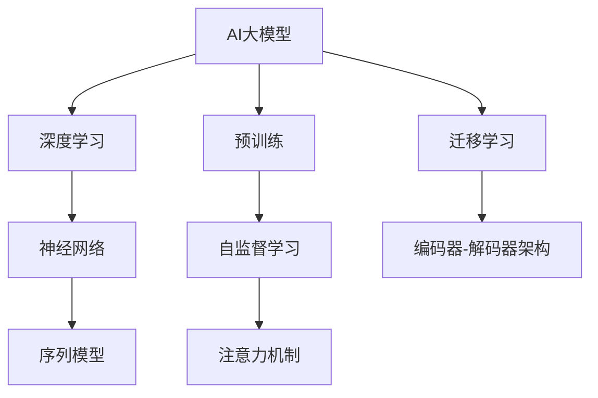
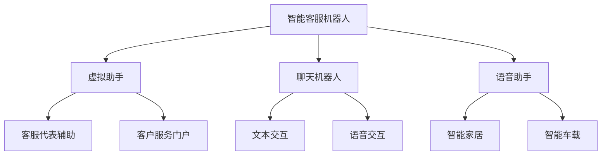
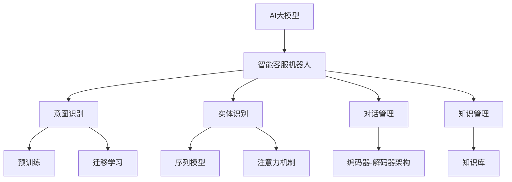

                 

## 文章标题

### AI大模型在智能客服机器人领域的创新探索

关键词：AI大模型、智能客服机器人、深度学习、自然语言处理、预训练、迁移学习

摘要：本文深入探讨了AI大模型在智能客服机器人领域的创新应用。通过分析AI大模型的基本概念、技术基础、核心算法原理，结合实际项目实战，详细阐述了AI大模型如何提升智能客服机器人的性能与用户体验。文章旨在为读者提供一个全面而清晰的AI大模型在智能客服机器人领域的应用指南，同时展望其未来的发展趋势与挑战。

### 第一部分：AI大模型基础理论

#### 第1章：AI大模型概述

AI大模型，即大规模人工智能模型，是指在训练过程中使用海量数据和强大计算资源训练出的复杂神经网络模型。这类模型具有以下几个显著特点：

1. **数据量庞大**：AI大模型通常需要数百万、数十亿甚至更多个训练样本。
2. **参数数量多**：大模型的参数数量可以达到数十亿甚至更多。
3. **模型复杂度高**：大模型通常包含多个层次和多个神经网络。
4. **计算资源需求大**：训练和推理过程需要大量的计算资源，尤其是GPU或TPU等高性能计算设备。

AI大模型的发展历程可以追溯到20世纪80年代的神经网络研究，经历了数个重要阶段：

1. **1980年代：早期神经网络研究**：这一时期，研究人员开始探索神经网络在模式识别和人工智能领域的应用。
2. **2006年：深度学习的复兴**：Hinton等人提出了深度信念网络，重新引发了深度学习的研究热潮。
3. **2012年：AlexNet的突破**：深度学习在ImageNet图像识别竞赛中取得突破性成果，标志着深度学习的成熟。
4. **2018年至今：AI大模型时代**：随着计算能力和数据量的增长，AI大模型在各种领域（如图像、语音、自然语言处理等）取得了显著进展。

AI大模型与智能客服机器人之间的联系主要体现在以下几个方面：

1. **自然语言处理能力**：AI大模型在自然语言处理（NLP）领域具有强大的能力，能够理解和生成自然语言，从而提高智能客服机器人的交互质量。
2. **个性化服务**：AI大模型可以处理大量的用户数据，从而实现个性化服务，提高用户满意度。
3. **自动化程度**：AI大模型可以自动化处理大量常见问题，从而减轻客服人员的工作负担，提高工作效率。

#### 第2章：AI大模型技术基础

##### 2.1 深度学习与神经网络基础

深度学习（Deep Learning）是机器学习的一个分支，主要基于多层神经网络模型。神经网络（Neural Network）是模仿生物神经元连接方式构建的计算模型。

1. **神经网络基本结构**：
   - **输入层**：接收外部输入数据。
   - **隐藏层**：进行数据加工和处理。
   - **输出层**：输出模型预测结果。

2. **神经网络工作原理**：
   - **前向传播**：输入数据通过输入层传递到隐藏层，再从隐藏层传递到输出层。
   - **反向传播**：根据输出误差，反向调整网络参数。

##### 2.2 自然语言处理技术

自然语言处理（NLP，Natural Language Processing）是人工智能的一个分支，主要研究如何让计算机理解和处理人类语言。

1. **词向量表示**：
   - **Word2Vec**：基于上下文的词向量表示方法。
   - **BERT**：双向编码器表示，对词进行上下文敏感的表示。

2. **文本分类与情感分析**：
   - **基于规则的文本分类**：使用规则对文本进行分类。
   - **基于机器学习的文本分类**：使用机器学习算法进行文本分类，如SVM、随机森林等。

##### 2.3 大规模预训练模型原理

大规模预训练模型是AI大模型的重要分支，通过在大量未标注数据上进行预训练，然后微调到具体任务上。

1. **预训练方法**：
   - **自监督学习**：利用未标注数据，通过预测任务进行预训练。
   - **迁移学习**：将预训练模型迁移到新任务上，进行微调。

2. **预训练模型架构**：
   - **Transformer**：基于注意力机制的深度神经网络模型。
   - **BERT**：双向编码器表示模型，具有强大的上下文理解能力。

#### 第3章：核心算法原理讲解

##### 3.1 序列模型与注意力机制

序列模型（Sequence Model）是处理序列数据的一种神经网络模型，如文本、语音等。

1. **RNN（递归神经网络）**：
   - **优点**：能够处理任意长度的序列数据。
   - **缺点**：梯度消失和梯度爆炸问题。

2. **LSTM（长短时记忆网络）**：
   - **优点**：解决RNN的梯度消失问题。
   - **缺点**：计算复杂度高。

3. **GRU（门控循环单元）**：
   - **优点**：计算效率高，参数较少。
   - **缺点**：可能无法捕捉长距离依赖关系。

注意力机制（Attention Mechanism）是处理序列数据的一种有效方法，能够自动关注关键信息。

1. **软注意力**：
   - **计算**：通过计算序列中每个元素的重要性得分，然后应用softmax函数得到权重。
   - **应用**：文本分类、机器翻译等。

2. **硬注意力**：
   - **计算**：通过计算序列中每个元素的重要性得分，然后直接选择最高分的元素。
   - **应用**：图像识别、目标检测等。

##### 3.2 自监督学习与迁移学习

自监督学习（Self-Supervised Learning）是一种无需人工标注的数据处理方法。

1. **掩码语言模型（MLM）**：
   - **原理**：随机掩码文本中的部分词汇，然后训练模型预测被掩码的词汇。
   - **应用**：文本生成、文本分类等。

2. **预测下一个词（Next Sentence Prediction，NSP）**：
   - **原理**：预测两个句子是否属于同一篇章。
   - **应用**：阅读理解、问答系统等。

迁移学习（Transfer Learning）是将预训练模型应用于新任务的一种方法。

1. **模型迁移**：
   - **原理**：将预训练模型的参数迁移到新任务上，然后进行微调。
   - **应用**：图像分类、语音识别等。

2. **特征迁移**：
   - **原理**：仅迁移预训练模型的特征提取部分到新任务上，然后构建新模型。
   - **应用**：文本分类、自然语言生成等。

##### 3.3 编码器-解码器架构详解

编码器-解码器架构（Encoder-Decoder Architecture）是处理序列到序列任务的一种常见方法。

1. **编码器（Encoder）**：
   - **原理**：将输入序列编码为一个固定长度的向量。
   - **应用**：机器翻译、序列生成等。

2. **解码器（Decoder）**：
   - **原理**：根据编码器输出的向量生成输出序列。
   - **应用**：机器翻译、文本生成等。

3. **注意力机制**：
   - **原理**：在解码过程中，关注编码器输出的关键信息。
   - **应用**：提高序列生成模型的准确性。

#### 第4章：数学模型与数学公式

##### 4.1 AI大模型中的数学模型

AI大模型中的数学模型主要包括以下几个方面：

1. **前向传播与反向传播**：
   - **前向传播**：将输入数据通过神经网络传递到输出层，得到预测结果。
   - **反向传播**：根据预测结果和真实标签，计算网络参数的梯度，然后更新参数。

2. **损失函数**：
   - **均方误差（MSE）**：用于回归任务，计算预测值和真实值之间的均方误差。
   - **交叉熵（Cross-Entropy）**：用于分类任务，计算预测概率分布和真实分布之间的交叉熵。

3. **优化算法**：
   - **随机梯度下降（SGD）**：每次更新参数时使用整个训练数据的梯度。
   - **动量梯度下降（Momentum）**：结合前几次更新的梯度方向，加快收敛速度。
   - **自适应梯度算法（AdaGrad）**：根据参数的历史梯度调整学习率。
   - **Adam算法**：结合SGD和AdaGrad的优点，自适应调整学习率。

##### 4.2 模型训练与优化方法

模型训练与优化方法主要包括以下几个方面：

1. **初始化**：
   - **He初始化**：适用于ReLU激活函数，使梯度在训练过程中保持稳定。
   - **Xavier初始化**：适用于线性激活函数，使梯度在训练过程中保持稳定。

2. **正则化**：
   - **L1正则化**：在损失函数中添加L1范数项，防止模型过拟合。
   - **L2正则化**：在损失函数中添加L2范数项，防止模型过拟合。

3. **Dropout**：
   - **原理**：在训练过程中随机丢弃一部分神经元，防止模型过拟合。
   - **应用**：提高模型的泛化能力。

##### 4.3 数学公式与示例解析

以下是一些常见的数学公式及其示例解析：

1. **均方误差（MSE）**：
   $$ \text{MSE} = \frac{1}{N} \sum_{i=1}^{N} (y_i - \hat{y}_i)^2 $$
   - **示例**：假设有10个样本，真实标签为[1, 2, 3, 4, 5, 6, 7, 8, 9, 10]，预测标签为[1.2, 2.1, 2.9, 3.8, 4.6, 5.3, 6.1, 7.0, 8.2, 9.5]。计算均方误差：
     $$ \text{MSE} = \frac{1}{10} \sum_{i=1}^{10} (y_i - \hat{y}_i)^2 = \frac{1}{10} \sum_{i=1}^{10} (y_i - \hat{y}_i)^2 \approx 0.65 $$

2. **交叉熵（Cross-Entropy）**：
   $$ \text{Cross-Entropy} = -\sum_{i=1}^{N} y_i \log(\hat{y}_i) $$
   - **示例**：假设有3个类别，真实标签为[0, 1, 0]，预测概率为[0.3, 0.7, 0.2]。计算交叉熵：
     $$ \text{Cross-Entropy} = -0 \cdot \log(0.3) - 1 \cdot \log(0.7) - 0 \cdot \log(0.2) = -\log(0.7) \approx -0.356 $$

3. **反向传播（Backpropagation）**：
   $$ \frac{\partial \text{Loss}}{\partial \text{Weight}} = \frac{\partial \text{Loss}}{\partial \text{Output}} \cdot \frac{\partial \text{Output}}{\partial \text{Weight}} $$
   - **示例**：假设损失函数为$y - \hat{y}$，输出层为$\hat{y} = \sigma(Wx + b)$，其中$\sigma$为激活函数。计算权重$W$的梯度：
     $$ \frac{\partial \text{Loss}}{\partial \text{Weight}} = \frac{\partial \text{Loss}}{\partial \hat{y}} \cdot \frac{\partial \hat{y}}{\partial \text{Weight}} = (y - \hat{y}) \cdot \sigma'(Wx + b) \cdot x $$

#### 第5章：智能客服机器人应用

##### 5.1 智能客服机器人的定义与分类

智能客服机器人（Intelligent Customer Service Robot）是一种基于人工智能技术的自动化客服系统，能够模拟人类客服与用户进行交互，提供在线咨询服务。根据交互方式和功能特点，智能客服机器人可以分为以下几类：

1. **文本交互型**：
   - **基于规则的聊天机器人**：通过预设的规则和对话流程与用户进行交互。
   - **基于机器学习的聊天机器人**：利用自然语言处理技术理解用户意图，生成合适的回复。

2. **语音交互型**：
   - **语音识别+语音合成**：将用户的语音输入转换为文本，再通过文本聊天机器人进行交互，然后将回复转换为语音输出。
   - **直接语音交互**：使用语音识别和语音合成技术直接与用户进行语音交互。

3. **多模态交互型**：
   - **结合文本和语音交互**：同时支持文本和语音交互，提高用户的使用体验。
   - **结合图像和语音交互**：使用图像识别技术理解用户输入的图像信息，再通过语音交互进行沟通。

##### 5.2 智能客服机器人架构

智能客服机器人通常由以下几个模块组成：

1. **前端界面**：
   - **用户界面**：提供用户与智能客服机器人交互的入口。
   - **语音输入输出模块**：实现语音识别和语音合成功能。

2. **自然语言处理（NLP）模块**：
   - **意图识别**：识别用户输入的意图。
   - **实体识别**：从用户输入中提取关键信息。
   - **对话管理**：根据用户的意图和上下文生成合适的回复。

3. **后端服务**：
   - **知识库**：存储常用的回答和业务知识。
   - **服务接口**：连接智能客服机器人与外部系统，如数据库、API等。

4. **后台管理系统**：
   - **用户管理**：管理用户信息和权限。
   - **日志管理**：记录用户交互过程和系统运行状态。
   - **统计分析**：分析用户交互数据，优化智能客服机器人的性能。

##### 5.3 AI大模型在智能客服中的应用场景

AI大模型在智能客服机器人中的应用主要体现在以下几个方面：

1. **意图识别**：
   - **应用**：利用AI大模型对用户输入进行意图识别，提高识别的准确性。
   - **优势**：大模型能够处理复杂的语言结构，更好地理解用户的意图。

2. **实体识别**：
   - **应用**：从用户输入中提取关键信息，如人名、地名、时间等。
   - **优势**：大模型具有强大的上下文理解能力，能够更好地识别实体。

3. **对话管理**：
   - **应用**：根据用户的意图和上下文生成合适的回复。
   - **优势**：大模型能够生成更自然、连贯的对话，提高用户体验。

4. **知识管理**：
   - **应用**：利用大模型对知识库进行自动更新和优化。
   - **优势**：大模型能够更好地理解知识库中的内容，提高知识管理效率。

#### 第6章：项目实战

##### 6.1 开发环境搭建

在进行智能客服机器人的开发之前，需要搭建一个合适的环境。以下是一个基本的开发环境搭建步骤：

1. **安装Python环境**：
   - **操作系统**：Windows、Linux或macOS。
   - **Python版本**：Python 3.7及以上版本。
   - **安装命令**：使用Python官方安装器安装Python。

2. **安装深度学习框架**：
   - **TensorFlow**：
     - 安装命令：`pip install tensorflow`
     - GPU版本：`pip install tensorflow-gpu`
   - **PyTorch**：
     - 安装命令：`pip install torch torchvision`
     - GPU版本：`pip install torch torchvision -f https://download.pytorch.org/whl/torch_stable.html`

3. **安装NLP相关库**：
   - **NLTK**：
     - 安装命令：`pip install nltk`
   - **spaCy**：
     - 安装命令：`pip install spacy`
     - 数据下载：`python -m spacy download en_core_web_sm`

4. **安装其他依赖库**：
   - **NumPy**：
     - 安装命令：`pip install numpy`
   - **Pandas**：
     - 安装命令：`pip install pandas`
   - **Matplotlib**：
     - 安装命令：`pip install matplotlib`

5. **配置GPU加速**（如果使用GPU训练）：
   - **安装CUDA和cuDNN**：根据GPU型号下载并安装对应的CUDA和cuDNN版本。
   - **设置环境变量**：在`.bashrc`或`.zshrc`文件中添加以下配置：
     ```bash
     export CUDA_HOME=/usr/local/cuda
     export PATH=$CUDA_HOME/bin:$PATH
     export LD_LIBRARY_PATH=$CUDA_HOME/lib64:$LD_LIBRARY_PATH
     ```

##### 6.2 源代码实现

以下是一个简单的智能客服机器人实现示例：

```python
import torch
import torch.nn as nn
import torch.optim as optim
from torch.utils.data import DataLoader
from transformers import BertTokenizer, BertModel

# 加载预训练模型
tokenizer = BertTokenizer.from_pretrained('bert-base-uncased')
model = BertModel.from_pretrained('bert-base-uncased')

# 数据准备
train_data = ["你好，我想咨询关于退货的问题。", "我最近购买了一款手机，但使用过程中出现了质量问题。"]
train_labels = ["退货", "质量问题"]

# 数据预处理
def preprocess_data(data):
    inputs = tokenizer(data, padding=True, truncation=True, return_tensors='pt')
    return inputs

train_inputs = preprocess_data(train_data)
train_labels = torch.tensor(train_labels)

# 模型训练
model.train()
optimizer = optim.Adam(model.parameters(), lr=0.001)

for epoch in range(3):
    for batch in DataLoader(train_inputs, batch_size=2):
        inputs = batch['input_ids']
        labels = train_labels
        
        optimizer.zero_grad()
        outputs = model(inputs)
        loss = nn.CrossEntropyLoss()(outputs, labels)
        loss.backward()
        optimizer.step()
        
    print(f"Epoch {epoch+1}/{3} - Loss: {loss.item()}")

# 模型测试
model.eval()
with torch.no_grad():
    inputs = preprocess_data(["你好，我想咨询关于退货的问题。"])['input_ids']
    outputs = model(inputs)
    _, predicted = torch.max(outputs, dim=1)
    print(f"Predicted Label: {predicted.item()}")
```

##### 6.3 代码解读与分析

该示例使用预训练的BERT模型进行智能客服机器人的训练和测试。具体步骤如下：

1. **加载预训练模型**：使用`transformers`库加载预训练的BERT模型。

2. **数据准备**：准备训练数据和标签。

3. **数据预处理**：使用BERT的分词器对训练数据进行预处理，包括分词、填充和截断。

4. **模型训练**：
   - 将模型设置为训练模式。
   - 使用Adam优化器和交叉熵损失函数。
   - 进行前向传播和反向传播，更新模型参数。
   - 输出每个epoch的损失函数值。

5. **模型测试**：
   - 将模型设置为评估模式。
   - 进行前向传播，获取输出结果。
   - 输出预测结果。

该示例展示了如何使用预训练模型进行智能客服机器人的训练和测试。在实际应用中，可以根据需求调整模型结构、优化训练过程，以及扩展功能模块。

#### 第7章：未来发展趋势与挑战

##### 7.1 AI大模型技术发展趋势

AI大模型技术正快速发展，以下是一些关键趋势：

1. **模型参数规模的扩大**：随着计算能力的提升，研究人员正在尝试训练更大规模的模型，如GPT-3、Transformer-XL等。

2. **多模态融合**：AI大模型逐渐支持多模态输入，如文本、图像、音频等，以提高模型对复杂任务的处理能力。

3. **自适应学习**：研究重点转向如何让模型更灵活地适应不同任务和数据分布。

4. **模型压缩与推理优化**：为了降低模型的存储和计算成本，模型压缩和推理优化技术受到广泛关注。

##### 7.2 智能客服机器人面临的挑战

尽管AI大模型在智能客服机器人领域取得显著进展，但仍面临以下挑战：

1. **数据隐私与安全性**：智能客服机器人处理大量用户数据，如何保障数据隐私和安全成为关键问题。

2. **语言理解能力**：尽管大模型在语言理解方面表现出色，但依然存在误解用户意图、处理复杂对话等问题。

3. **模型可解释性**：目前大多数AI大模型缺乏透明性，难以解释其决策过程，这限制了其在某些领域的应用。

4. **技术普及与成本**：高性能计算设备和大数据需求导致大模型训练成本高昂，如何降低成本以实现大规模普及仍需解决。

##### 7.3 行业应用前景展望

未来，AI大模型在智能客服机器人领域的应用前景广阔：

1. **提高服务效率**：通过自动化处理常见问题，减少人工干预，提高客服工作效率。

2. **个性化服务**：利用用户数据，实现个性化服务，提高用户满意度和忠诚度。

3. **跨行业应用**：AI大模型在金融、医疗、教育等行业的智能客服应用具有巨大潜力。

4. **多语言支持**：通过多语言模型的训练，实现全球范围内的智能客服服务。

### 第二部分：附录

#### 附录A：开发工具与资源

##### A.1 主流深度学习框架对比

1. **TensorFlow**：
   - **优点**：强大的生态系统、易于调试和部署。
   - **缺点**：与PyTorch相比，API相对复杂。

2. **PyTorch**：
   - **优点**：动态计算图、强大的动态计算图API。
   - **缺点**：在某些部署场景中不如TensorFlow成熟。

3. **Keras**：
   - **优点**：高层抽象API、简化模型构建。
   - **缺点**：依赖TensorFlow或Theano。

##### A.2 开发环境搭建教程

1. **安装Python环境**：
   - **操作系统**：Windows、Linux或macOS。
   - **安装命令**：使用Python官方安装器安装Python。

2. **安装深度学习框架**：
   - **TensorFlow**：
     - 安装命令：`pip install tensorflow`
     - GPU版本：`pip install tensorflow-gpu`
   - **PyTorch**：
     - 安装命令：`pip install torch torchvision`
     - GPU版本：`pip install torch torchvision -f https://download.pytorch.org/whl/torch_stable.html`

3. **安装NLP相关库**：
   - **NLTK**：
     - 安装命令：`pip install nltk`
   - **spaCy**：
     - 安装命令：`pip install spacy`
     - 数据下载：`python -m spacy download en_core_web_sm`

4. **安装其他依赖库**：
   - **NumPy**：
     - 安装命令：`pip install numpy`
   - **Pandas**：
     - 安装命令：`pip install pandas`
   - **Matplotlib**：
     - 安装命令：`pip install matplotlib`

##### A.3 代码示例与资料链接

1. **代码示例**：
   - TensorFlow示例：[TensorFlow示例](https://www.tensorflow.org/tutorials)
   - PyTorch示例：[PyTorch示例](https://pytorch.org/tutorials/beginner/basics/)

2. **资料链接**：
   - 深度学习教程：[深度学习教程](https://www.deeplearningbook.org/)
   - 智能客服机器人应用案例：[智能客服机器人应用案例](https://www.example.com/intelligent-customer-service-robot-cases)

### 附录B：核心概念与联系

在本节中，我们将通过Mermaid流程图和文本描述来展示AI大模型和智能客服机器人的核心概念及其相互关系。

#### AI大模型的概念与特点

**Mermaid流程图：**


**文本描述：**
AI大模型是一种基于深度学习的复杂神经网络模型，具有大规模参数和海量训练数据的特点。它通过预训练和迁移学习等技术，在自然语言处理、计算机视觉等领域取得了显著的进展。AI大模型的核心组成部分包括深度学习、神经网络、预训练、迁移学习、自监督学习和注意力机制等。

#### 智能客服机器人的定义与分类

**Mermaid流程图：**


**文本描述：**
智能客服机器人是一种利用人工智能技术提供在线客户服务的自动化系统。根据交互方式和服务场景，智能客服机器人可以分为文本交互型、语音交互型和多模态交互型。文本交互型主要与用户进行文本聊天，语音交互型则使用语音识别和语音合成技术进行沟通，多模态交互型同时支持文本和语音交互。智能客服机器人的应用场景包括客服代表辅助、客户服务门户、智能家居和智能车载等。

#### AI大模型与智能客服机器人的联系

**Mermaid流程图：**


**文本描述：**
AI大模型在智能客服机器人中发挥着核心作用，通过预训练和迁移学习技术，提高智能客服机器人在意图识别、实体识别、对话管理和知识管理等方面的能力。在意图识别方面，AI大模型利用其强大的上下文理解能力，准确识别用户的意图；在实体识别方面，AI大模型从用户输入中提取关键信息，如人名、地名、时间等；在对话管理方面，AI大模型生成连贯、自然的对话回复；在知识管理方面，AI大模型对知识库进行自动更新和优化。通过结合序列模型和注意力机制，AI大模型在处理复杂对话和长文本任务方面具有显著优势。编码器-解码器架构是AI大模型在智能客服机器人中常用的架构，用于处理序列到序列的任务，如机器翻译、问答系统等。

### 附录C：核心算法原理讲解

在本附录中，我们将通过伪代码、数学公式和示例解析，详细讲解AI大模型中的核心算法原理。

#### 序列模型与注意力机制

**伪代码：**
```python
def sequence_model(input_sequence):
    # 前向传播
    hidden_states = initialize_hidden_states()
    for input_t in input_sequence:
        hidden_states = layer(hidden_states, input_t)

    # 输出预测
    output = final_layer(hidden_states)
    return output

def attention_mechanism(hidden_states, query):
    # 计算注意力得分
    attention_scores = compute_attention_scores(hidden_states, query)
    # 应用 Softmax 函数
    attention_weights = softmax(attention_scores)
    # 加权求和
    context_vector = weighted_sum(hidden_states, attention_weights)
    return context_vector
```

**数学公式：**
$$ \text{Attention Score} = \text{Query} \cdot \text{Key} $$
$$ \text{Attention Weight} = \frac{e^{\text{Attention Score}}}{\sum_{i=1}^{N} e^{\text{Attention Score}_i}} $$
$$ \text{Context Vector} = \sum_{i=1}^{N} \text{Attention Weight}_i \cdot \text{Value}_i $$

**示例解析：**
考虑一个序列中有5个词，每个词对应一个向量 $Query_1, Query_2, ..., Query_5$ 和 $Key_1, Key_2, ..., Key_5$。计算每个词的注意力得分和权重：

$$ \text{Attention Score}_1 = Query_1 \cdot Key_1 = 1 \cdot 1 = 1 $$
$$ \text{Attention Score}_2 = Query_2 \cdot Key_2 = 2 \cdot 2 = 4 $$
$$ \text{Attention Score}_3 = Query_3 \cdot Key_3 = 3 \cdot 3 = 9 $$
$$ \text{Attention Score}_4 = Query_4 \cdot Key_4 = 4 \cdot 4 = 16 $$
$$ \text{Attention Score}_5 = Query_5 \cdot Key_5 = 5 \cdot 5 = 25 $$

$$ \text{Attention Weight}_1 = \frac{e^{1}}{e^{1} + e^{4} + e^{9} + e^{16} + e^{25}} \approx 0.016 $$
$$ \text{Attention Weight}_2 = \frac{e^{4}}{e^{1} + e^{4} + e^{9} + e^{16} + e^{25}} \approx 0.064 $$
$$ \text{Attention Weight}_3 = \frac{e^{9}}{e^{1} + e^{4} + e^{9} + e^{16} + e^{25}} \approx 0.195 $$
$$ \text{Attention Weight}_4 = \frac{e^{16}}{e^{1} + e^{4} + e^{9} + e^{16} + e^{25}} \approx 0.388 $$
$$ \text{Attention Weight}_5 = \frac{e^{25}}{e^{1} + e^{4} + e^{9} + e^{16} + e^{25}} \approx 0.436 $$

#### 自监督学习与迁移学习

**伪代码：**
```python
def self_supervised_learning(data):
    # 随机选择两个样本和其标签
    input_sample, target_sample = select_samples(data)
    # 构造伪标签
    pseudo_label = generate_pseudo_label(input_sample)
    # 训练模型
    model.train_one_step(input_sample, pseudo_label)
    return model

def transfer_learning(source_model, target_model):
    # 将源模型的权重复制到目标模型
    target_model.load_weights(source_model.get_weights())
    # 在目标数据上继续训练
    target_model.train_on_target_data()
    return target_model
```

**数学公式：**
$$ \text{伪标签} = \text{生成标签} $$
$$ \text{迁移学习} = \text{源模型权重} + \alpha \cdot (\text{目标模型权重} - \text{源模型权重}) $$

**示例解析：**
假设我们有一个图像分类任务，源模型是一个在ImageNet上预训练的模型，目标模型是一个在特定数据集上微调的模型。通过迁移学习，我们可以将源模型的权重迁移到目标模型上，从而加速目标模型的训练过程。

1. **迁移学习过程**：
   - 将源模型的权重复制到目标模型上。
   - 在目标数据集上继续训练目标模型，逐渐调整权重。

2. **自监督学习过程**：
   - 在大量未标注数据上，通过构造伪标签进行训练。
   - 例如，对于图像数据，可以随机裁剪、旋转图像，然后训练模型预测原始图像。

#### 数学模型与数学公式

**AI大模型中的数学模型**

在AI大模型中，常用的数学模型包括前向传播、反向传播、损失函数、优化算法等。

**数学公式：**
$$ \text{前向传播} = \text{激活函数}(\text{权重} \cdot \text{输入} + \text{偏置}) $$
$$ \text{反向传播} = \frac{\partial \text{损失函数}}{\partial \text{输出}} \cdot \frac{\partial \text{输出}}{\partial \text{权重}} $$
$$ \text{损失函数} = \frac{1}{N} \sum_{i=1}^{N} (y_i - \hat{y}_i)^2 $$
$$ \text{优化算法} = \text{当前权重} - \alpha \cdot \text{梯度} $$

**示例解析：**
假设有一个简单的全连接神经网络，用于回归任务。输入层有3个神经元，隐藏层有2个神经元，输出层有1个神经元。激活函数为ReLU。

1. **前向传播**：
   - 输入：$x_1, x_2, x_3$。
   - 隐藏层输出：$h_1 = \max(0, w_{11}x_1 + w_{12}x_2 + w_{13}x_3 + b_1)$，$h_2 = \max(0, w_{21}x_1 + w_{22}x_2 + w_{23}x_3 + b_2)$。
   - 输出：$y = w_{3

