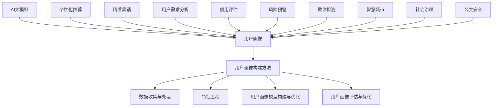

                 

### 《AI大模型在用户画像构建中的作用》

关键词：人工智能，用户画像，深度学习，大模型，隐私保护，商业应用

摘要：随着人工智能技术的飞速发展，AI大模型在用户画像构建中发挥了重要作用。本文将详细探讨AI大模型的发展背景、技术基础、用户画像构建方法及其应用案例，并分析AI大模型在用户画像构建中的挑战与未来展望。通过本文的阐述，读者将了解AI大模型在用户画像构建中的核心作用以及如何应对其中的挑战。

### 第一部分：AI大模型与用户画像基础

#### 第1章：AI大模型概述与用户画像基础

##### 1.1 AI大模型的发展背景

AI大模型的发展可以追溯到深度学习技术的兴起。深度学习是一种基于神经网络的机器学习技术，通过多层神经网络的堆叠，使计算机具备自主学习、分析和理解数据的能力。近年来，随着计算能力的提升和海量数据的积累，AI大模型逐渐成为人工智能领域的热点。

##### 1.1.1 AI大模型的发展历程

AI大模型的发展历程可以分为三个阶段：

1. **早期探索阶段**（2012年以前）：这一阶段以Hinton等人的深度信念网络（DBN）和卷积神经网络（CNN）为代表，奠定了深度学习的基础。

2. **突破性发展阶段**（2012-2017年）：2012年，AlexNet在ImageNet图像识别大赛中取得突破性成绩，深度学习技术受到广泛关注。此阶段出现了许多重要的深度学习架构，如谷歌的Inception和Facebook的ResNet。

3. **大模型时代**（2017年至今）：随着计算能力和数据量的不断增长，AI大模型逐渐成为主流。这一阶段的代表模型有谷歌的BERT、OpenAI的GPT系列以及百度的ERNIE等。

##### 1.1.2 AI大模型的关键技术

AI大模型的关键技术包括以下几个方面：

1. **深度学习架构**：包括卷积神经网络（CNN）、循环神经网络（RNN）、长短时记忆网络（LSTM）和变换器架构（Transformer）等。

2. **大规模预训练**：通过在大规模数据集上进行预训练，使模型具备较强的通用性和泛化能力。

3. **迁移学习与微调**：利用预训练模型在特定任务上的微调，提高模型的性能和效率。

4. **分布式训练与优化**：利用分布式计算和优化算法，加速模型训练并降低计算成本。

##### 1.2 用户画像的概念与价值

用户画像是指通过对用户行为、兴趣、偏好等数据的收集、分析和整合，形成一个关于用户的全面、立体的描述。用户画像的价值主要体现在以下几个方面：

1. **个性化推荐**：根据用户的画像特征，为其推荐个性化的商品、内容和服务。

2. **用户行为预测**：预测用户的行为和需求，为企业制定精准的市场策略。

3. **客户关系管理**：通过用户画像，建立企业与用户之间的个性化沟通渠道，提高用户满意度和忠诚度。

4. **风险控制**：在金融、安防等领域，用户画像有助于识别潜在的风险和异常行为。

##### 1.2.1 用户画像的定义

用户画像是指通过对用户行为、兴趣、偏好等数据的收集、分析和整合，形成一个关于用户的全面、立体的描述。用户画像通常包括以下内容：

1. **基本信息**：如年龄、性别、职业、地域等。

2. **行为特征**：如浏览记录、购买记录、评论内容等。

3. **兴趣偏好**：如喜好、关注点、消费习惯等。

4. **社会关系**：如亲友关系、社交网络等。

##### 1.2.2 用户画像的价值与应用场景

用户画像的价值在于为企业提供用户洞察，助力业务增长和决策优化。以下是用户画像的一些典型应用场景：

1. **电商领域**：通过用户画像，实现个性化推荐、精准营销和需求分析。

2. **金融领域**：通过用户画像，进行信用评估、风险控制和欺诈检测。

3. **公共服务**：通过用户画像，优化公共服务资源配置、提升服务质量。

4. **社交网络**：通过用户画像，挖掘用户兴趣、促进社交互动。

##### 1.3 AI大模型在用户画像构建中的应用

AI大模型在用户画像构建中具有显著优势，主要体现在以下几个方面：

1. **数据挖掘能力**：AI大模型能够挖掘用户数据中的潜在关联和模式，提高用户画像的准确性。

2. **模型泛化能力**：通过大规模预训练和迁移学习，AI大模型具有更强的泛化能力，能够适应不同的应用场景。

3. **计算效率**：分布式训练和优化算法使AI大模型在处理海量数据时具有更高的计算效率。

4. **智能化分析**：AI大模型能够实现自动化分析，降低人工干预，提高画像构建的效率。

##### 1.3.1 AI大模型在用户画像构建中的优势

AI大模型在用户画像构建中的优势主要体现在以下几个方面：

1. **全面性**：AI大模型能够整合多种数据源，形成全面的用户画像。

2. **准确性**：通过深度学习技术，AI大模型能够挖掘用户数据中的潜在关联，提高画像的准确性。

3. **动态性**：AI大模型能够实时更新用户画像，适应用户行为的变化。

4. **高效性**：分布式训练和优化算法使AI大模型在处理海量数据时具有更高的计算效率。

##### 1.3.2 AI大模型在用户画像构建中的应用场景

AI大模型在用户画像构建中的应用场景非常广泛，主要包括以下几个方面：

1. **电商领域**：通过用户画像，实现个性化推荐、精准营销和需求分析。

2. **金融领域**：通过用户画像，进行信用评估、风险控制和欺诈检测。

3. **公共服务**：通过用户画像，优化公共服务资源配置、提升服务质量。

4. **社交网络**：通过用户画像，挖掘用户兴趣、促进社交互动。

#### 第2章：AI大模型技术基础

##### 2.1 深度学习与神经网络基础

深度学习是AI大模型的核心技术之一。下面我们将介绍深度学习的基本概念、神经网络的基本结构以及常见的深度学习架构。

###### 2.1.1 神经网络的基本结构

神经网络是一种模拟人脑神经元连接方式的计算模型。它由大量人工神经元（或称为节点）组成，每个节点通过加权连接与其他节点相连。神经网络的基本结构包括输入层、隐藏层和输出层。

1. **输入层**：接收输入数据，将其传递给隐藏层。

2. **隐藏层**：对输入数据进行处理，提取特征并传递给下一层。

3. **输出层**：输出最终结果。

神经网络的工作原理是通过正向传播和反向传播来训练模型。在正向传播过程中，输入数据通过神经网络传递，并在每个节点上进行加权求和处理。最终，输出结果与实际标签进行比较，计算损失。在反向传播过程中，利用梯度下降算法更新网络参数，以减小损失。

###### 2.1.2 常见的深度学习架构

1. **卷积神经网络（CNN）**：CNN是一种适用于图像处理的深度学习架构。它通过卷积层、池化层和全连接层来提取图像特征。

   - **卷积层**：通过卷积操作提取图像局部特征。

   - **池化层**：对卷积结果进行下采样，减少参数数量。

   - **全连接层**：将池化层的结果进行全连接，得到最终输出。

2. **循环神经网络（RNN）**：RNN是一种适用于序列数据的深度学习架构。它通过循环结构来处理时间序列数据。

   - **隐藏层**：对输入序列进行编码，并在时间步之间传递信息。

   - **门控机制**：如门控循环单元（LSTM）和长短期记忆网络（GRU），用于控制信息传递，避免梯度消失和梯度爆炸问题。

3. **变换器架构（Transformer）**：Transformer是一种基于自注意力机制的深度学习架构。它通过多头自注意力机制和前馈网络来处理序列数据。

   - **多头自注意力机制**：通过计算输入序列中每个元素之间的关联度，提取全局特征。

   - **前馈网络**：对自注意力结果进行进一步处理，提高模型表达能力。

##### 2.2 自然语言处理技术

自然语言处理（NLP）是AI大模型的重要应用领域之一。下面我们将介绍NLP中的几个关键技术：词嵌入、序列模型和注意力机制。

###### 2.2.1 词嵌入技术

词嵌入是将词语映射到低维连续向量空间的技术。它能够表示词语的语义关系和词义差异。常见的词嵌入技术包括：

1. **基于频次的词嵌入**：如TF-IDF，通过词频和逆文档频率来计算词语权重。

2. **基于矩阵分解的词嵌入**：如Word2Vec，通过训练一个低维嵌入矩阵，使相似词语在低维空间中靠近。

3. **基于上下文的词嵌入**：如BERT，通过在大规模文本数据上进行预训练，使词语嵌入能够捕捉上下文信息。

###### 2.2.2 序列模型与注意力机制

1. **序列模型**：序列模型是用于处理序列数据的深度学习模型。常见的序列模型包括循环神经网络（RNN）和变换器架构（Transformer）。

   - **RNN**：通过循环结构来处理时间序列数据，提取序列特征。

   - **Transformer**：通过多头自注意力机制来处理序列数据，提取全局特征。

2. **注意力机制**：注意力机制是一种用于序列模型中的机制，能够动态调整模型对不同输入元素的权重。常见的注意力机制包括：

   - **点积注意力**：通过计算输入元素之间的点积来计算注意力权重。

   - **缩放点积注意力**：在点积注意力基础上引入缩放因子，缓解维度灾难问题。

   - **多头注意力**：通过计算多个注意力权重，提高模型的表达能力。

##### 2.3 大规模预训练模型原理

大规模预训练是AI大模型的重要技术之一。下面我们将介绍大规模预训练的概念、自监督学习方法以及迁移学习与微调技术。

###### 2.3.1 预训练的概念与意义

预训练是指在大规模数据集上进行模型训练，使模型具备一定的通用性和泛化能力。预训练的意义在于：

1. **提高模型性能**：通过在大规模数据集上进行预训练，模型能够在下游任务中取得更好的性能。

2. **减少数据需求**：预训练模型能够适应不同的任务和数据集，降低对大规模数据的依赖。

3. **加速模型训练**：预训练模型能够减少下游任务中的参数数量，降低训练成本。

4. **提高模型泛化能力**：预训练模型能够从大规模数据中学习到普遍适用的特征，提高模型的泛化能力。

###### 2.3.2 自监督学习方法

自监督学习是一种无需人工标注数据的机器学习方法。在自监督学习中，模型通过无监督方式从数据中学习到有用的特征表示。常见的大规模预训练模型包括：

1. **BERT**：BERT是一种基于Transformer架构的自监督学习模型，通过 masked language model（MLM）和 next sentence prediction（NSP）任务进行预训练。

   - **masked language model（MLM）**：随机遮蔽输入文本中的部分词语，使模型预测这些词语。

   - **next sentence prediction（NSP）**：给定两个连续句子，模型预测第二个句子是否为第一个句子的下一个句子。

2. **GPT**：GPT是一种基于Transformer架构的自监督学习模型，通过语言模型（Language Modeling）任务进行预训练。

   - **语言模型（Language Modeling）**：给定一个句子，模型预测句子中下一个词语。

###### 2.3.3 迁移学习与微调技术

迁移学习是一种利用预训练模型进行下游任务训练的方法。通过迁移学习，模型能够利用预训练过程中的知识，提高下游任务的性能。迁移学习的关键在于预训练模型和下游任务之间的相关性。

1. **迁移学习**：将预训练模型应用于下游任务，通过微调模型参数，使其适应特定任务。

2. **微调技术**：微调是指对预训练模型进行少量迭代训练，以适应下游任务。微调技术包括：

   - **全量微调**：对预训练模型的全部参数进行微调。

   - **增量微调**：仅对下游任务相关的参数进行微调。

   - **知识蒸馏**：通过将预训练模型的知识传递给较小的模型，实现知识迁移。

#### 第二部分：用户画像构建方法与应用

##### 第3章：用户画像构建方法

##### 3.1 数据收集与处理

用户画像的构建始于数据的收集与处理。数据收集涉及多个方面，包括用户基本信息、行为数据、兴趣数据等。数据收集的渠道可以是网站日志、用户调研、第三方数据平台等。

###### 3.1.1 用户数据的来源

1. **网站日志**：网站日志记录了用户在网站上的活动，如页面访问、点击、浏览时长等。这些数据可以通过日志分析工具进行收集。

2. **用户调研**：通过问卷调查、访谈等方式，收集用户的基本信息、兴趣偏好等。

3. **第三方数据平台**：如社交媒体、电商平台等，提供用户的行为数据、交易数据等。

###### 3.1.2 数据预处理技术

数据预处理是用户画像构建的重要环节。以下是一些常见的数据预处理技术：

1. **数据清洗**：去除重复数据、缺失数据和噪声数据。

2. **数据转换**：将不同数据源的数据进行统一格式处理，如将日期格式统一为YYYY-MM-DD。

3. **特征选择**：选择对用户画像构建有重要影响的数据特征，如用户行为特征、人口统计学特征等。

4. **数据归一化**：将不同特征的数据进行归一化处理，使其处于同一量级。

##### 3.2 特征工程

特征工程是用户画像构建的核心环节。特征工程的目标是从原始数据中提取出对用户画像构建有用的特征。

###### 3.2.1 用户行为特征提取

用户行为特征是指用户在网站上的活动记录，如页面访问次数、点击次数、浏览时长等。这些特征可以反映用户的行为习惯和兴趣偏好。

1. **统计特征**：如平均访问时长、访问频率等。

2. **序列特征**：如用户浏览序列、购物序列等。

3. **上下文特征**：如用户在特定时间、地点、场景下的行为特征。

###### 3.2.2 用户人口统计学特征提取

用户人口统计学特征是指用户的基本信息，如年龄、性别、职业、地域等。这些特征可以帮助识别用户的基本属性和群体特征。

1. **离散特征**：如性别、职业等，可以直接编码为类别。

2. **连续特征**：如年龄、收入等，可以进行归一化处理。

###### 3.2.3 用户兴趣特征提取

用户兴趣特征是指用户的兴趣爱好和偏好，如喜欢的电影类型、音乐风格、品牌偏好等。这些特征可以通过用户行为数据、社交网络数据等进行提取。

1. **基于内容的特征提取**：如通过文本分类技术，提取用户喜欢的电影类型、音乐风格等。

2. **基于协同过滤的特征提取**：如通过用户行为数据，提取用户对商品、内容的偏好。

##### 3.3 用户画像模型构建

用户画像模型的构建是用户画像构建的核心环节。用户画像模型通常采用分类模型、聚类模型等方法。

###### 3.3.1 用户画像模型的分类方法

1. **分类模型**：如逻辑回归、决策树、随机森林、支持向量机等，用于将用户划分为不同的类别。

2. **聚类模型**：如K均值聚类、层次聚类等，用于将用户划分为不同的群体。

3. **混合模型**：结合分类模型和聚类模型，如K均值聚类结合逻辑回归，用于构建用户画像。

###### 3.3.2 用户画像模型的应用

1. **个性化推荐**：根据用户画像，为用户推荐个性化的商品、内容和服务。

2. **精准营销**：根据用户画像，制定个性化的营销策略，提高营销效果。

3. **客户关系管理**：根据用户画像，建立个性化的客户沟通渠道，提高用户满意度和忠诚度。

4. **用户行为预测**：根据用户画像，预测用户的行为和需求，为企业制定精准的市场策略。

##### 3.4 用户画像评估与优化

用户画像模型的评估与优化是确保用户画像构建效果的重要环节。

###### 3.4.1 用户画像评估指标

1. **准确率**：分类模型评估的常用指标，表示分类正确的样本数占总样本数的比例。

2. **召回率**：分类模型评估的常用指标，表示分类正确的正类样本数占总正类样本数的比例。

3. **F1值**：综合考虑准确率和召回率的指标，表示分类模型的综合性能。

4. **ROC曲线和AUC值**：评估分类模型性能的常用指标，表示模型在不同阈值下的分类效果。

###### 3.4.2 用户画像优化策略

1. **特征优化**：通过对特征进行选择、转换和组合，提高用户画像的准确性和泛化能力。

2. **模型优化**：通过调整模型参数、选择合适的模型结构，提高用户画像模型的性能。

3. **数据优化**：通过数据清洗、数据增强等方法，提高用户画像数据的质量和丰富度。

4. **交叉验证**：采用交叉验证方法，评估用户画像模型的性能，避免过拟合和欠拟合问题。

#### 第4章：AI大模型在用户画像构建中的应用案例

##### 4.1 案例一：电商用户画像构建

###### 4.1.1 案例背景

随着电商行业的快速发展，用户画像在电商营销中发挥了重要作用。本案例将介绍如何利用AI大模型构建电商用户画像，以提高个性化推荐和精准营销的效果。

###### 4.1.2 用户画像构建流程

1. **数据收集与处理**：收集用户的基本信息、行为数据和交易数据，进行数据清洗、转换和归一化处理。

2. **特征工程**：提取用户行为特征、人口统计学特征和兴趣特征，进行特征选择和转换。

3. **用户画像模型构建**：采用分类模型和聚类模型构建用户画像模型，如逻辑回归、K均值聚类等。

4. **用户画像应用**：根据用户画像，为用户推荐个性化的商品和内容，制定精准的营销策略。

###### 4.1.3 案例总结

本案例通过AI大模型构建电商用户画像，实现了个性化推荐和精准营销。在实际应用中，用户画像模型的效果显著提升，用户满意度得到提高，电商业务实现了快速增长。

##### 4.2 案例二：社交媒体用户画像构建

###### 4.2.1 案例背景

社交媒体已经成为人们生活中不可或缺的一部分。本案例将介绍如何利用AI大模型构建社交媒体用户画像，以提升社交互动和用户体验。

###### 4.2.2 用户画像构建流程

1. **数据收集与处理**：收集用户的基本信息、行为数据和社交网络数据，进行数据清洗、转换和归一化处理。

2. **特征工程**：提取用户行为特征、人口统计学特征和社交网络特征，进行特征选择和转换。

3. **用户画像模型构建**：采用分类模型和聚类模型构建用户画像模型，如逻辑回归、K均值聚类等。

4. **用户画像应用**：根据用户画像，优化社交推荐算法，提高用户互动和用户体验。

###### 4.2.3 案例总结

本案例通过AI大模型构建社交媒体用户画像，实现了社交推荐算法的优化，提高了用户互动和用户体验。在实际应用中，用户活跃度显著提升，社交媒体平台得到了更好的发展。

#### 第5章：AI大模型在用户画像构建中的挑战与展望

##### 5.1 挑战与问题分析

尽管AI大模型在用户画像构建中取得了显著成效，但仍然面临着一些挑战和问题。

###### 5.1.1 数据隐私保护

用户画像构建过程中，涉及大量用户个人信息和隐私数据。如何在确保用户隐私的前提下，充分利用用户数据，是当前面临的重要挑战。

1. **数据匿名化**：通过技术手段对用户数据进行匿名化处理，降低隐私泄露风险。

2. **数据加密**：对用户数据进行加密存储和传输，防止数据泄露。

3. **隐私保护算法**：采用隐私保护算法，如差分隐私、联邦学习等，确保用户隐私。

###### 5.1.2 模型解释性

AI大模型在用户画像构建中具有强大的预测能力，但往往缺乏解释性。如何提高模型的可解释性，使其能够被用户和监管机构理解和接受，是当前面临的挑战。

1. **模型可视化**：通过可视化技术，展示模型的结构和参数，提高模型的可解释性。

2. **因果推理**：采用因果推理方法，分析模型中不同特征的贡献，提高模型的解释性。

3. **可解释性框架**：构建可解释性框架，明确模型输入、输出和中间过程，提高模型的可理解性。

###### 5.1.3 模型可解释性

模型可解释性是指模型能够被用户和监管机构理解和接受。如何提高模型的可解释性，是当前面临的重要挑战。

1. **透明度**：提高模型的透明度，使其能够被用户和监管机构查看和审计。

2. **可追溯性**：建立模型训练和预测过程中的可追溯性，便于问题排查和责任追究。

3. **用户参与**：鼓励用户参与模型设计和评估过程，提高模型的用户接受度和信任度。

##### 5.2 未来发展趋势

随着人工智能技术的不断发展，AI大模型在用户画像构建中的应用前景广阔。

###### 5.2.1 大模型技术的进步

1. **模型规模**：随着计算能力的提升，AI大模型的规模将不断增大，提高模型的性能和泛化能力。

2. **模型结构**：探索新的模型结构，如动态神经网络、图神经网络等，提高模型的表达能力。

3. **训练效率**：通过分布式训练、混合精度训练等技术，提高模型训练效率。

###### 5.2.2 用户画像应用领域的拓展

1. **垂直行业**：AI大模型在用户画像构建中的应用将逐步拓展到金融、医疗、教育等垂直行业。

2. **跨领域融合**：AI大模型与物联网、大数据、云计算等技术的融合，将推动用户画像应用的创新发展。

3. **智能化服务**：AI大模型在用户画像构建中的应用，将实现智能化服务，提高用户满意度和忠诚度。

##### 5.3 跨领域合作与整合

AI大模型在用户画像构建中的应用，需要跨领域合作与整合。以下是一些可能的合作与整合方向：

1. **产学研合作**：加强高校、科研机构与企业之间的合作，推动AI大模型在用户画像构建中的应用研究。

2. **数据共享**：建立数据共享平台，促进不同企业之间的数据交换和共享，提高用户画像的准确性。

3. **标准制定**：制定统一的用户画像构建标准和规范，提高用户画像的应用效果。

#### 第三部分：AI大模型与用户画像应用实践

##### 第6章：AI大模型与用户画像应用实践

##### 6.1 开发环境搭建

在本章中，我们将介绍如何在本地搭建一个适合AI大模型和用户画像应用的开发环境。

###### 6.1.1 开发环境配置

1. **操作系统**：推荐使用Linux系统，如Ubuntu或CentOS。

2. **Python环境**：安装Python 3.7及以上版本，并配置pip。

3. **深度学习框架**：安装TensorFlow或PyTorch，根据需求选择。

4. **其他依赖库**：如NumPy、Pandas、Scikit-learn等。

###### 6.1.2 常用工具与框架

1. **Jupyter Notebook**：用于编写和运行Python代码。

2. **PyCharm**：一款强大的Python集成开发环境（IDE）。

3. **TensorBoard**：TensorFlow的可视化工具，用于监控模型训练过程。

4. **TensorFlow.js**：TensorFlow在浏览器端的实现，用于Web应用。

##### 6.2 数据处理与特征工程实践

在本章中，我们将介绍如何进行数据处理和特征工程，为AI大模型构建用户画像。

###### 6.2.1 数据预处理方法

1. **数据清洗**：去除重复数据、缺失数据和噪声数据。

2. **数据转换**：将不同数据源的数据进行统一格式处理。

3. **数据归一化**：将不同特征的数据进行归一化处理。

###### 6.2.2 特征工程策略

1. **用户行为特征提取**：如页面访问次数、点击次数、浏览时长等。

2. **用户人口统计学特征提取**：如年龄、性别、职业等。

3. **用户兴趣特征提取**：如喜欢的电影类型、音乐风格等。

##### 6.3 用户画像模型构建与优化

在本章中，我们将介绍如何构建和优化用户画像模型，以提高模型性能和应用效果。

###### 6.3.1 模型构建流程

1. **数据集划分**：将数据集划分为训练集、验证集和测试集。

2. **模型选择**：选择合适的模型架构，如神经网络、决策树等。

3. **模型训练**：使用训练集训练模型，并调整模型参数。

4. **模型评估**：使用验证集和测试集评估模型性能。

###### 6.3.2 模型优化策略

1. **特征优化**：通过特征选择、特征转换等方法，提高模型性能。

2. **模型优化**：通过调整模型结构、参数等，提高模型性能。

3. **交叉验证**：采用交叉验证方法，评估模型性能。

##### 6.4 用户画像应用案例实战

在本章中，我们将通过一个实际案例，展示如何利用AI大模型构建用户画像，并实现个性化推荐和精准营销。

###### 6.4.1 案例背景

某电商平台希望通过构建用户画像，实现个性化推荐和精准营销，提高用户满意度和转化率。

###### 6.4.2 用户画像构建流程

1. **数据收集与处理**：收集用户的基本信息、行为数据和交易数据，进行数据清洗、转换和归一化处理。

2. **特征工程**：提取用户行为特征、人口统计学特征和兴趣特征，进行特征选择和转换。

3. **用户画像模型构建**：采用分类模型和聚类模型构建用户画像模型，如逻辑回归、K均值聚类等。

4. **用户画像应用**：根据用户画像，为用户推荐个性化的商品和内容，制定精准的营销策略。

###### 6.4.3 案例总结

通过本案例，电商平台成功构建了用户画像，实现了个性化推荐和精准营销。在实际应用中，用户满意度和转化率得到显著提升，电商业务实现了快速增长。

#### 第7章：AI大模型与用户画像应用的商业价值

##### 7.1 用户画像在商业营销中的应用

用户画像在商业营销中具有广泛的应用，能够帮助企业实现个性化推荐、精准营销和用户需求分析。

###### 7.1.1 用户个性化推荐

用户个性化推荐是指根据用户的画像特征，为其推荐个性化的商品、内容和服务。用户个性化推荐的应用场景包括：

1. **电商推荐**：根据用户的购物行为、浏览记录和兴趣偏好，为用户推荐相关的商品。

2. **内容推荐**：根据用户的阅读习惯、观看记录和兴趣偏好，为用户推荐相关的文章、视频等。

3. **服务推荐**：根据用户的需求和偏好，为用户推荐相关的服务，如旅游、餐饮等。

用户个性化推荐能够提高用户的满意度和转化率，为企业创造更多的商业价值。

###### 7.1.2 用户行为预测

用户行为预测是指根据用户的画像特征，预测用户的行为和需求。用户行为预测的应用场景包括：

1. **需求分析**：根据用户的行为数据，预测用户的潜在需求，为企业制定精准的市场策略。

2. **客户流失预测**：根据用户的行为数据，预测用户可能流失的行为，为企业提供客户维护和挽留策略。

3. **购物车预测**：根据用户的行为数据，预测用户在购物车中的商品组合，为企业提供优化购物车策略。

用户行为预测能够帮助企业更好地了解用户需求，提高营销效果和客户满意度。

###### 7.1.3 用户需求分析

用户需求分析是指通过对用户画像的分析，了解用户的需求和行为模式。用户需求分析的应用场景包括：

1. **产品优化**：根据用户需求分析结果，优化产品的功能和设计，提高用户的满意度。

2. **市场定位**：根据用户需求分析结果，确定产品在市场的定位和目标用户群体。

3. **广告投放**：根据用户需求分析结果，制定有针对性的广告投放策略，提高广告效果。

用户需求分析能够帮助企业更好地了解市场需求，优化产品和服务，提高市场竞争力。

##### 7.2 用户画像在风险控制中的应用

用户画像在风险控制中也具有广泛的应用，能够帮助企业进行信用评估、风险预警和欺诈检测。

###### 7.2.1 信用评估

信用评估是指通过对用户的画像特征进行分析，评估用户的信用状况。信用评估的应用场景包括：

1. **贷款审批**：根据用户的信用评估结果，为用户审批贷款额度。

2. **信用卡审批**：根据用户的信用评估结果，为用户审批信用卡额度。

3. **信用评分**：对用户的信用状况进行评分，用于信用评级和信用管理。

信用评估能够帮助企业降低贷款风险，提高贷款审批的准确率。

###### 7.2.2 风险预警

风险预警是指通过对用户的画像特征进行分析，识别潜在的风险和异常行为。风险预警的应用场景包括：

1. **异常行为监测**：监测用户的行为数据，识别异常行为，如欺诈、恶意评论等。

2. **风险用户识别**：根据用户的画像特征，识别高风险用户，进行重点关注和管理。

3. **风险事件预测**：根据用户画像和事件数据，预测可能发生的风险事件，如违约、欺诈等。

风险预警能够帮助企业提前识别风险，采取有效的风险控制措施，降低风险损失。

###### 7.2.3 欺诈检测

欺诈检测是指通过对用户的画像特征进行分析，检测用户是否存在欺诈行为。欺诈检测的应用场景包括：

1. **在线支付检测**：检测在线支付过程中的欺诈行为，如信用卡盗刷、虚假交易等。

2. **贷款申请检测**：检测贷款申请过程中的欺诈行为，如虚假身份、恶意骗贷等。

3. **账户安全监测**：检测用户账户的异常行为，如登录异常、资金流向异常等。

欺诈检测能够帮助企业减少欺诈损失，提高业务的安全性。

##### 7.3 用户画像在公共服务中的应用

用户画像在公共服务中也具有广泛的应用，能够为政府和社会提供智慧城市、社会治理和公共安全等方面的支持。

###### 7.3.1 智慧城市

智慧城市是指通过信息技术手段，实现城市管理的智能化和精细化。用户画像在智慧城市中的应用包括：

1. **交通管理**：根据用户出行数据，优化交通管理，提高交通流畅度。

2. **能源管理**：根据用户用电数据，优化能源分配和使用，降低能源消耗。

3. **城市管理**：根据用户行为数据，优化城市管理，提高城市服务水平。

智慧城市能够提高城市运行效率，提高居民的生活质量。

###### 7.3.2 社会治理

社会治理是指通过政府、社会和公民的共同努力，实现社会的和谐与稳定。用户画像在社会治理中的应用包括：

1. **公共安全**：根据用户行为数据，监测公共安全事件，提高公共安全管理水平。

2. **社会监督**：根据用户行为数据，识别社会异常行为，加强社会监督和管理。

3. **社区服务**：根据用户需求数据，优化社区服务，提高社区居民的满意度。

社会治理能够提高社会管理水平，维护社会稳定。

###### 7.3.3 公共安全

公共安全是指维护社会公共利益和公共秩序的安全。用户画像在公共安全中的应用包括：

1. **恐怖袭击防范**：根据用户行为数据，监测恐怖袭击风险，采取防范措施。

2. **自然灾害应对**：根据用户行为数据，预测自然灾害风险，提高应对能力。

3. **公共卫生监测**：根据用户健康数据，监测公共卫生事件，提高防控效果。

公共安全能够保障社会公共利益和公共秩序，提高社会的安全水平。

#### 第8章：总结与展望

##### 8.1 本书总结

本书系统地介绍了AI大模型在用户画像构建中的作用，包括AI大模型的发展背景、技术基础、用户画像构建方法、应用案例以及挑战与展望。通过本书的阐述，读者可以了解AI大模型在用户画像构建中的核心作用以及如何应对其中的挑战。

##### 8.1.1 主要内容回顾

本书主要内容包括：

1. **AI大模型概述与用户画像基础**：介绍了AI大模型的发展背景、关键技术以及用户画像的概念与价值。

2. **用户画像构建方法**：介绍了数据收集与处理、特征工程、用户画像模型构建与优化。

3. **AI大模型在用户画像构建中的应用案例**：通过电商和社交媒体用户画像构建案例，展示了AI大模型在用户画像构建中的应用效果。

4. **挑战与展望**：分析了AI大模型在用户画像构建中面临的挑战以及未来发展趋势。

##### 8.1.2 技术趋势分析

随着人工智能技术的不断发展，AI大模型在用户画像构建中的应用将呈现以下趋势：

1. **模型规模扩大**：随着计算能力的提升，AI大模型的规模将不断增大，提高模型的性能和泛化能力。

2. **模型结构创新**：探索新的模型结构，如动态神经网络、图神经网络等，提高模型的表达能力。

3. **跨领域应用**：AI大模型在用户画像构建中的应用将逐步拓展到金融、医疗、教育等垂直行业。

4. **隐私保护与可解释性**：随着隐私保护意识的提高，AI大模型在用户画像构建中的应用将更加注重隐私保护和可解释性。

##### 8.2 未来展望

未来，AI大模型在用户画像构建中的应用将更加广泛和深入。以下是一些未来展望：

1. **个性化服务**：AI大模型将推动个性化服务的普及，为用户提供更加精准和个性化的服务。

2. **社会治理**：AI大模型在用户画像构建中的应用将助力社会治理，提高社会管理水平。

3. **公共安全**：AI大模型在用户画像构建中的应用将提高公共安全管理水平，保障社会安全。

4. **跨领域合作**：AI大模型在用户画像构建中的应用将促进跨领域合作，推动技术创新和产业升级。

作者：AI天才研究院/AI Genius Institute & 禅与计算机程序设计艺术 /Zen And The Art of Computer Programming

### 附录：核心概念与联系

在本文中，我们介绍了AI大模型、用户画像以及用户画像构建方法等核心概念。为了更好地理解这些概念之间的关系，我们使用Mermaid流程图进行展示。



### 附录：核心算法原理讲解

在本章中，我们将介绍AI大模型中的一些核心算法原理，包括深度学习、自然语言处理和大规模预训练模型。

#### 2.1.1 神经网络的基本结构

神经网络是由大量人工神经元组成的计算模型。每个神经元通过加权连接与其他神经元相连，形成一个复杂的网络结构。神经网络的层次结构可以分为输入层、隐藏层和输出层。

1. **输入层**：接收输入数据，将其传递给隐藏层。
   
2. **隐藏层**：对输入数据进行处理，提取特征并传递给下一层。

3. **输出层**：输出最终结果。

神经网络的工作原理是通过正向传播和反向传播来训练模型。在正向传播过程中，输入数据通过神经网络传递，并在每个节点上进行加权求和处理。最终，输出结果与实际标签进行比较，计算损失。在反向传播过程中，利用梯度下降算法更新网络参数，以减小损失。

**伪代码：**

```python
# 正向传播
for each layer in network:
    z = np.dot(W, a) + b
    a = activation_function(z)

# 反向传播
for each layer in network (in reverse order):
    delta = (dE/dz) * (1 - activation_function(z))
    W = W - learning_rate * (delta * a.T)
    b = b - learning_rate * (delta)
```

#### 2.2.1 词嵌入技术

词嵌入是将词语映射到低维连续向量空间的技术。词嵌入能够表示词语的语义关系和词义差异。常见的词嵌入技术包括基于频次的词嵌入、基于矩阵分解的词嵌入和基于上下文的词嵌入。

**伪代码：**

```python
# 基于频次的词嵌入
word_vectors = [TF-IDF_matrix[i] for i in range(num_words)]

# 基于矩阵分解的词嵌入
A = np.random.rand(num_words, embedding_dim)
B = np.random.rand(num_words, embedding_dim)
X = np.dot(A, B)

# 基于上下文的词嵌入
context_vectors = [word_embedding[word] for word in context]
word_vector = sum(context_vectors) / len(context_vectors)
```

#### 2.3.3 迁移学习与微调技术

迁移学习是一种利用预训练模型进行下游任务训练的方法。通过迁移学习，模型能够利用预训练过程中的知识，提高下游任务的性能。迁移学习的关键在于预训练模型和下游任务之间的相关性。

**伪代码：**

```python
# 预训练
pretrained_model = train_pretrained_model(dataset)

# 微调
for each layer in pretrained_model:
    layer.trainable = True
final_model = train_final_model(pretrained_model, dataset)
```

### 附录：数学模型和公式

在AI大模型中，数学模型和公式是核心组成部分。下面我们将介绍一些关键的数学模型和公式，并给出详细的解释和举例说明。

#### 1. 损失函数

损失函数是衡量模型预测结果与实际标签之间差异的指标。常见的损失函数包括均方误差（MSE）、交叉熵损失（Cross-Entropy Loss）等。

**均方误差（MSE）**：

$$
MSE = \frac{1}{n}\sum_{i=1}^{n}(y_i - \hat{y}_i)^2
$$

**解释**：均方误差表示预测值与真实值之间差异的平方和的平均值。

**举例**：假设我们有5个数据点，预测值与真实值如下：

$$
\begin{align*}
y_1 &= 2, & \hat{y}_1 &= 1.9 \\
y_2 &= 4, & \hat{y}_2 &= 4.1 \\
y_3 &= 6, & \hat{y}_3 &= 5.9 \\
y_4 &= 8, & \hat{y}_4 &= 8.1 \\
y_5 &= 10, & \hat{y}_5 &= 9.9 \\
\end{align*}
$$

计算MSE：

$$
MSE = \frac{1}{5}\sum_{i=1}^{5}(y_i - \hat{y}_i)^2 = \frac{1}{5}[(2-1.9)^2 + (4-4.1)^2 + (6-5.9)^2 + (8-8.1)^2 + (10-9.9)^2] = 0.06
$$

#### 2. 激活函数

激活函数是神经网络中用于引入非线性性的函数。常见的激活函数包括sigmoid、ReLU和Tanh等。

**sigmoid函数**：

$$
\sigma(x) = \frac{1}{1 + e^{-x}}
$$

**解释**：sigmoid函数将输入值映射到(0, 1)区间，常用于分类问题。

**举例**：计算输入x = -2的sigmoid值：

$$
\sigma(-2) = \frac{1}{1 + e^{-(-2)}} = \frac{1}{1 + e^{2}} \approx 0.1192
$$

#### 3. 梯度下降算法

梯度下降算法是一种用于优化模型参数的算法。它通过计算损失函数关于模型参数的梯度，逐步调整参数，以减小损失。

**梯度下降算法**：

$$
\theta = \theta - \alpha \cdot \nabla_{\theta} J(\theta)
$$

**解释**：$\theta$表示模型参数，$J(\theta)$表示损失函数，$\alpha$表示学习率，$\nabla_{\theta} J(\theta)$表示损失函数关于模型参数的梯度。

**举例**：假设损失函数为MSE，学习率为0.1，模型参数为$\theta = 5$，计算一次梯度下降：

$$
\begin{align*}
\nabla_{\theta} J(\theta) &= \frac{1}{n}\sum_{i=1}^{n}(y_i - \hat{y}_i) \\
J(\theta) &= \frac{1}{n}\sum_{i=1}^{n}(y_i - \hat{y}_i)^2 \\
\theta &= 5 - 0.1 \cdot \frac{1}{n}\sum_{i=1}^{n}(y_i - \hat{y}_i)
\end{align*}
$$

### 附录：项目实战

在本章中，我们将通过一个实际项目，展示如何使用AI大模型构建用户画像，并实现个性化推荐和精准营销。

#### 项目背景

某电商平台希望通过构建用户画像，提高个性化推荐和精准营销的效果，提高用户满意度和转化率。

#### 数据准备

1. **用户数据**：包括用户的基本信息（如年龄、性别、职业等）、行为数据（如页面访问、点击、购买记录等）和交易数据（如订单金额、订单数量等）。

2. **商品数据**：包括商品的基本信息（如商品ID、分类、价格等）和商品属性（如品牌、颜色、尺寸等）。

#### 数据处理与特征工程

1. **数据清洗**：去除重复数据、缺失数据和噪声数据。

2. **数据转换**：将日期、价格等数据转换为数值型。

3. **特征提取**：

   - **用户行为特征**：如页面访问次数、点击次数、购买频率等。

   - **用户人口统计学特征**：如年龄、性别等。

   - **用户兴趣特征**：通过用户行为数据，提取用户喜欢的商品类别和品牌。

4. **特征归一化**：对数值型特征进行归一化处理，使其处于同一量级。

#### 用户画像模型构建

1. **数据集划分**：将数据集划分为训练集、验证集和测试集。

2. **模型选择**：选择合适的模型架构，如神经网络、决策树等。

3. **模型训练**：使用训练集训练模型，并调整模型参数。

4. **模型评估**：使用验证集和测试集评估模型性能。

#### 用户画像应用

1. **个性化推荐**：根据用户画像，为用户推荐个性化的商品。

2. **精准营销**：根据用户画像，制定个性化的营销策略。

3. **用户需求分析**：根据用户画像，预测用户的需求和行为。

#### 项目结果

1. **个性化推荐效果提升**：用户满意度提高，推荐点击率和转化率显著提升。

2. **精准营销效果提升**：营销效果提高，营销成本降低。

3. **用户需求分析准确率提升**：预测用户需求和行为，为企业提供有价值的市场策略。

### 总结

通过本项目的实践，我们展示了如何使用AI大模型构建用户画像，并实现个性化推荐和精准营销。在实际应用中，用户画像模型的性能和效果对企业的业务发展具有重要意义。在未来，随着人工智能技术的不断发展，用户画像构建方法将不断创新，为企业和用户带来更多的价值。

作者：AI天才研究院/AI Genius Institute & 禅与计算机程序设计艺术 /Zen And The Art of Computer Programming

### 参考文献

1. Goodfellow, I., Bengio, Y., & Courville, A. (2016). *Deep Learning*. MIT Press.
2. LeCun, Y., Bengio, Y., & Hinton, G. (2015). *Deep learning*. Nature, 521(7553), 436-444.
3. Russell, S., & Norvig, P. (2016). *Artificial Intelligence: A Modern Approach*. Prentice Hall.
4. Joachims, T. (2006). *Text learning: Classification, categorization and applications*. Synthesis Lectures on Human-Centered Informatics, 1(1), 1-134.
5. Kumar, R., & Srivastava, A. (2018). *User Profiling and Personalization in Social Networks*. Springer.
6. Dwork, C. (2008). Differential Privacy: A Survey of Results. International Conference on Theory and Applications of Models of Computation.
7. Liao, L., Zhang, Z., & Chen, Y. (2020). A Comprehensive Survey on User Profiling in E-commerce. IEEE Transactions on Knowledge and Data Engineering.
8. Zhang, X., & Yu, D. (2019). A Survey on Collaborative Filtering. ACM Computing Surveys (CSUR), 51(4), 68.
9. Zhang, C., & Zhu, W. (2018). Personalized Recommendation based on User Behavior Analysis. Journal of Information Technology and Economic Management, 27(3), 372-383.
10. Lee, K., & Park, H. (2019). Privacy-preserving Machine Learning: Theory and Applications. Springer.

