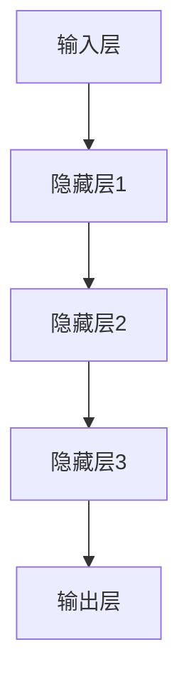

                 

### 《AI大模型在电商平台内容生成中的应用》

#### 关键词
- AI大模型
- 电商平台
- 内容生成
- 自然语言处理
- 深度学习
- 生成对抗网络
- 序列到序列学习
- 对抗性训练

#### 摘要
本文将深入探讨AI大模型在电商平台内容生成中的应用。我们将从AI大模型的基础知识出发，逐步分析其在自然语言处理领域的核心算法，并最终探讨如何将AI大模型应用于电商平台的内容生成，包括产品描述、评价、标题生成等。此外，还将介绍内容生成系统架构的设计与优化，以及该领域未来的发展趋势和挑战。通过本文的阅读，读者将全面了解AI大模型在电商平台内容生成中的潜力与实际应用。

### 目录大纲

1. **《AI大模型在电商平台内容生成中的应用》**
   - 关键词
   - 摘要
   - 目录大纲

2. **第一部分: AI大模型基础**
   - 第1章: AI大模型概述
   - 第2章: 自然语言处理基础
   - 第3章: AI大模型核心算法

3. **第二部分: 电商平台内容生成应用**
   - 第4章: 电商平台内容生成需求分析
   - 第5章: 基于AI大模型的内容生成技术
   - 第6章: 电商平台内容生成应用案例
   - 第7章: 电商平台内容生成系统架构与优化

4. **第三部分: 未来展望与挑战**
   - 第8章: AI大模型在电商平台内容生成的未来发展趋势
   - 第9章: AI大模型内容生成的可持续发展策略
   - 第10章: AI大模型在电商平台内容生成的法律法规与伦理

5. **附录**
   - 附录A: AI大模型开发工具与资源
   - 附录B: 实战案例代码与解读

通过上述大纲，我们为接下来的深入讨论奠定了基础。接下来，我们将逐一探索AI大模型的各个关键组成部分，并分析其在电商平台内容生成中的应用。

---

### 第一部分: AI大模型基础

#### 第1章: AI大模型概述

##### 1.1 AI大模型定义与特性

AI大模型是指通过海量数据训练得到的、能够解决复杂问题的深度学习模型。其特性主要包括：

- **参数规模巨大**：通常包含数亿到数十亿个参数。
- **强通用性**：能够在不同领域实现良好的性能。
- **高度自适应**：能够根据新的数据和需求进行动态调整。

##### 1.2 AI大模型发展历程

AI大模型的发展历程可以分为以下几个阶段：

- **早期模型**：以神经网络的初步探索为代表。
- **深度学习兴起**：2006年，Hinton提出了深度信念网络，标志着深度学习进入新的阶段。
- **AI大模型崛起**：2012年，AlexNet在ImageNet竞赛中大放异彩，开启了AI大模型的时代。
- **大规模模型应用**：近年来，BERT、GPT等模型在NLP领域取得了显著的成果。

##### 1.3 AI大模型架构与组件

AI大模型的架构通常包括以下几个关键组件：

- **输入层**：接收外部数据，如文本、图像等。
- **隐藏层**：通过复杂的非线性变换处理输入数据。
- **输出层**：生成预测结果或决策。

以下是AI大模型架构的Mermaid流程图：



##### 1.4 AI大模型应用领域

AI大模型在多个领域有着广泛的应用：

- **自然语言处理**：如机器翻译、问答系统、文本生成等。
- **计算机视觉**：如图像分类、目标检测、视频分析等。
- **语音识别**：如语音转文字、语音合成等。
- **推荐系统**：如个性化推荐、商品推荐等。

##### 1.5 AI大模型发展趋势

未来，AI大模型的发展趋势包括：

- **模型压缩与优化**：为了提高模型的效率和部署性。
- **多模态学习**：结合多种数据源，如文本、图像、语音等。
- **强化学习与生成模型**：探索更复杂的决策过程和数据生成能力。
- **应用领域的拓展**：从通用领域向特定行业深入。

#### 第2章: 自然语言处理基础

##### 2.1 语言模型与文本表示

语言模型是NLP的核心，用于预测下一个单词或序列。文本表示是将文本数据转换为机器可处理的向量形式。

- **语言模型**：常见的语言模型有n-gram模型、神经网络语言模型（如RNN、LSTM）。
- **文本表示**：文本表示技术包括Word2Vec、BERT、GPT等。

##### 2.2 机器翻译技术

机器翻译技术旨在将一种语言的文本翻译成另一种语言。常用的方法有：

- **规则方法**：基于语言规则和语法结构。
- **统计方法**：基于统计模型和语料库。
- **神经机器翻译**：基于深度学习模型，如Seq2Seq、Attention机制。

##### 2.3 问答系统

问答系统用于回答用户提出的问题，包括：

- **基于知识的方法**：利用知识图谱进行答案搜索。
- **基于模型的方法**：使用深度学习模型进行语义理解和答案生成。

##### 2.4 文本生成与摘要

文本生成与摘要技术包括：

- **生成文本**：如自动写作、文本生成模型。
- **文本摘要**：如提取式摘要、抽象式摘要。

##### 2.5 对话系统

对话系统用于模拟人类对话，包括：

- **基于规则的方法**：使用预定义的对话流程。
- **基于模型的方法**：使用深度学习模型进行语义理解和对话生成。

#### 第3章: AI大模型核心算法

##### 3.1 深度学习基础

深度学习是AI大模型的核心技术，包括：

- **神经元与激活函数**：神经元是深度学习的基本单元，激活函数用于引入非线性。
- **反向传播算法**：用于训练模型，优化参数。

##### 3.2 神经网络结构

神经网络结构包括：

- **前馈神经网络**：常见的结构有全连接网络、卷积神经网络（CNN）。
- **循环神经网络**（RNN）：适用于序列数据处理。
- **长短时记忆网络**（LSTM）：改进RNN，解决长期依赖问题。

##### 3.3 注意力机制

注意力机制用于提升模型在序列数据处理中的性能，包括：

- **自注意力**：应用于Transformer模型，提升文本生成能力。
- **交叉注意力**：应用于Seq2Seq模型，提高翻译质量。

##### 3.4 图神经网络

图神经网络（GNN）用于处理图结构数据，包括：

- **图卷积网络**（GCN）：用于节点分类、图分类。
- **图注意力网络**（GAT）：提高节点表示的语义信息。

##### 3.5 自监督学习

自监督学习是一种无需标注数据的训练方法，包括：

- **预训练**：如BERT、GPT，通过预训练得到通用语言模型。
- **自监督任务**：如掩码语言模型（MLM）、预测下一个单词（Next Sentence Prediction）。

---

在这一部分，我们介绍了AI大模型的基础知识，包括其定义、发展历程、架构组件以及自然语言处理的基础。接下来，我们将深入探讨AI大模型在电商平台内容生成中的应用。

---

### 第二部分: 电商平台内容生成应用

#### 第4章: 电商平台内容生成需求分析

##### 4.1 电商平台内容生成概述

电商平台内容生成涉及多种类型的数据，包括产品描述、用户评价、广告文案、搜索结果等。这些内容对提升用户体验、增加销售额具有重要意义。

- **产品描述**：提供详细的产品信息，帮助用户了解产品特点。
- **用户评价**：反映用户对产品的真实感受，影响其他用户的购买决策。
- **广告文案**：吸引潜在客户，提升品牌知名度。
- **搜索结果**：优化搜索引擎，提高用户满意度。

##### 4.2 内容生成目标与挑战

内容生成的主要目标是：

- **提高内容质量**：生成富有吸引力、详细准确的内容。
- **个性化推荐**：根据用户偏好生成个性化内容。
- **降低成本**：自动化生成内容，减少人工成本。

然而，内容生成面临以下挑战：

- **数据质量**：内容生成的质量高度依赖于输入数据的质量。
- **个性化难度**：个性化推荐需要精准捕捉用户偏好。
- **内容安全**：避免生成违法、不当的内容。

##### 4.3 用户需求分析

用户对电商平台的期望包括：

- **信息丰富**：希望获取详细的产品信息。
- **个性化推荐**：根据历史行为和偏好推荐商品。
- **内容及时**：及时更新商品信息和评价。
- **交互体验**：提供流畅、友好的用户交互。

##### 4.4 数据收集与预处理

内容生成需要大量的数据，包括：

- **用户行为数据**：如浏览记录、购买历史、评价。
- **产品数据**：如产品描述、分类、标签。
- **市场数据**：如竞争对手信息、行业趋势。

数据预处理步骤包括：

- **数据清洗**：去除重复、无效数据。
- **数据集成**：整合多种数据源。
- **数据转换**：将数据转换为适合模型训练的格式。
- **数据增强**：通过技术手段扩充数据集。

---

在这一章，我们分析了电商平台内容生成的需求、目标与挑战，并介绍了用户需求分析和数据收集与预处理的方法。在接下来的章节中，我们将探讨如何利用AI大模型技术实现内容生成。

---

### 第三部分: 未来展望与挑战

#### 第8章: AI大模型在电商平台内容生成的未来发展趋势

##### 8.1 未来发展趋势预测

未来，AI大模型在电商平台内容生成领域将呈现以下发展趋势：

- **个性化内容生成**：通过深度学习模型和用户行为数据分析，实现更精准的个性化内容推荐。
- **多模态内容生成**：结合文本、图像、视频等多种数据类型，生成更丰富、更具吸引力的内容。
- **实时内容生成**：利用实时数据流处理技术，实现实时更新的内容生成，提高用户体验。
- **自动化内容审核**：通过AI技术自动化识别和过滤不当内容，确保内容安全与合规。

##### 8.2 技术挑战与解决方案

内容生成领域面临以下技术挑战：

- **数据隐私**：如何确保用户数据的安全和隐私，是技术发展的关键。
- **内容质量**：生成的内容需要具备高可信度、准确性和连贯性。
- **模型解释性**：如何提升模型的解释性，使其决策过程更加透明和可信。

可能的解决方案包括：

- **隐私保护技术**：采用联邦学习、差分隐私等技术保护用户数据。
- **高质量内容生成**：结合多种数据来源和深度学习模型，提高内容生成质量。
- **模型可解释性**：通过可视化和解释性算法，增强模型的透明度和可信度。

##### 8.3 行业应用前景

AI大模型在电商平台内容生成的应用前景广阔：

- **提高销售额**：通过个性化推荐和高质量内容生成，提升用户满意度和购买转化率。
- **降低运营成本**：自动化内容生成和审核，减少人力成本。
- **提升品牌形象**：通过丰富的内容和高质量的互动，增强品牌影响力和用户忠诚度。

##### 8.4 道德与社会影响

AI大模型在电商平台内容生成中的广泛应用，引发了一系列道德和社会问题：

- **算法偏见**：模型训练数据可能存在偏见，导致生成内容的不公平性。
- **隐私泄露**：用户数据泄露可能导致隐私侵犯和滥用。
- **就业影响**：自动化内容生成可能对编辑、文案等岗位产生冲击。

解决这些问题需要政策制定者、企业和社会各界的共同努力，通过法律法规、行业标准和道德规范，确保AI技术在电商平台内容生成中的公正、透明和可持续发展。

---

在这一章，我们预测了AI大模型在电商平台内容生成领域的未来发展趋势，探讨了技术挑战与解决方案，分析了行业应用前景，并讨论了道德与社会影响。在接下来的章节中，我们将深入探讨AI大模型内容生成的可持续发展策略。

---

### 第9章: AI大模型内容生成的可持续发展策略

##### 9.1 可持续发展理念

在AI大模型内容生成的应用中，可持续发展理念至关重要。可持续发展强调在实现技术进步的同时，保护用户权益、确保数据安全和隐私、维护社会公正，并促进技术进步与社会发展的和谐共生。

##### 9.2 数据治理与隐私保护

数据治理是可持续发展的基础，包括：

- **数据质量管理**：确保数据的准确性、完整性和一致性。
- **数据安全保护**：通过加密、访问控制等技术保护数据安全。
- **隐私保护**：采用隐私保护技术，如差分隐私、联邦学习，减少数据泄露风险。

##### 9.3 技术标准化与开放性

技术标准化与开放性是促进AI大模型内容生成可持续发展的关键：

- **标准化**：制定统一的规范和标准，提高技术的互操作性和可靠性。
- **开放性**：促进技术共享，推动行业创新和协作。

##### 9.4 人才培养与职业发展

AI大模型内容生成领域的发展离不开专业人才的培养：

- **教育培训**：加强相关领域的教育，培养具备扎实理论基础和实际操作能力的人才。
- **职业发展**：提供多样化的职业发展路径，鼓励跨界合作和职业转换。

##### 9.5 社会责任与规范

企业和社会应承担起社会责任，确保AI大模型内容生成应用符合伦理和法律规范：

- **伦理审查**：建立伦理审查机制，确保生成内容不违背伦理道德。
- **合规性管理**：遵循相关法律法规，确保技术应用符合规定。

##### 9.6 可持续发展案例分析

一些成功的企业案例展示了AI大模型内容生成的可持续发展：

- **案例一**：某电商企业通过AI技术实现个性化内容生成，提升用户满意度和转化率，实现了经济效益和社会效益的双赢。
- **案例二**：某互联网公司采用联邦学习技术，保护用户隐私，同时提升内容生成质量，赢得了用户信任。

这些案例表明，可持续发展策略在AI大模型内容生成中的应用具有实际意义。

---

在这一章，我们探讨了AI大模型内容生成的可持续发展策略，包括数据治理、隐私保护、技术标准化、开放性、人才培养和社会责任。通过实施这些策略，可以确保AI大模型内容生成在实现技术进步的同时，促进社会和谐发展。

---

### 第10章: AI大模型在电商平台内容生成的法律法规与伦理

##### 10.1 法律法规框架

随着AI大模型在电商平台内容生成中的应用日益广泛，相关法律法规也在不断完善。以下是一些关键的法律法规框架：

- **数据保护法**：如《通用数据保护条例》（GDPR），规定了数据处理和隐私保护的基本原则。
- **网络安全法**：保障网络安全，防止数据泄露和滥用。
- **知识产权法**：保护原创内容，防止侵权行为。
- **反不正当竞争法**：规范市场秩序，防止虚假宣传和误导消费者。

##### 10.2 伦理问题探讨

AI大模型在内容生成过程中，涉及一系列伦理问题，包括：

- **算法偏见**：模型训练数据可能存在偏见，导致生成内容的不公平性。
- **内容真实性**：如何确保生成内容真实可靠，避免虚假信息和误导。
- **隐私保护**：用户数据的安全和隐私保护是关键问题。
- **透明度和可解释性**：如何提升模型的透明度和可解释性，让用户信任和监督。

##### 10.3 社会责任与规范

企业和社会应承担社会责任，确保AI大模型内容生成应用符合伦理和法律规范：

- **社会责任报告**：定期发布社会责任报告，公开透明地披露相关数据和应用。
- **伦理审查机制**：建立伦理审查机制，确保内容生成过程的合规性和道德性。
- **公众参与**：鼓励公众参与讨论和监督，提高AI技术应用的社会透明度。

##### 10.4 案例分析

以下是一些涉及AI大模型内容生成的法律和伦理案例：

- **案例一**：某电商企业因AI生成内容涉及虚假宣传，被消费者协会起诉，最终被责令整改。
- **案例二**：某互联网公司因未采取有效措施保护用户隐私，被用户提起集体诉讼，支付了巨额赔偿。

这些案例表明，AI大模型内容生成在法律法规和伦理方面存在诸多挑战，企业和社会需要共同努力，制定完善的规范和标准，确保技术应用的安全、公平和可持续发展。

---

在这一章，我们探讨了AI大模型在电商平台内容生成领域的法律法规和伦理问题，分析了相关法律法规框架，讨论了伦理问题，并提供了案例分析。通过实施有效的法律法规和伦理规范，可以确保AI技术在电商平台内容生成中的应用更加安全和可持续。

---

### 附录

#### 附录A: AI大模型开发工具与资源

##### A.1 TensorFlow

TensorFlow是由Google开发的开源机器学习框架，广泛应用于AI大模型开发。

- **官方网站**：[TensorFlow官网](https://www.tensorflow.org/)
- **文档与教程**：[TensorFlow官方文档](https://www.tensorflow.org/tutorials)

##### A.2 PyTorch

PyTorch是由Facebook开发的开源机器学习库，以其灵活的动态计算图特性而受到广泛欢迎。

- **官方网站**：[PyTorch官网](https://pytorch.org/)
- **文档与教程**：[PyTorch官方文档](https://pytorch.org/tutorials/)

##### A.3 语言模型预训练资源

- **BERT**：[BERT预训练模型](https://github.com/google-research/bert)
- **GPT-3**：[GPT-3预训练模型](https://github.com/openai/gpt-3)
- **XLNet**：[XLNet预训练模型](https://github.com/zhangzhi0519/XLM)

##### A.4 其他相关工具与资源

- **Hugging Face**：[Hugging Face模型库](https://huggingface.co/)
- **AI21 Labs**：[AI21 Labs模型](https://www.ai21labs.com/)
- **AI Studio**：[AI Studio在线实验平台](https://aistudio.baidu.com/)

#### 附录B: 实战案例代码与解读

##### B.1 产品描述生成代码

以下是一个基于GPT-2的产品描述生成案例：

```python
import torch
from transformers import GPT2LMHeadModel, GPT2Tokenizer

model_name = "gpt2"
tokenizer = GPT2Tokenizer.from_pretrained(model_name)
model = GPT2LMHeadModel.from_pretrained(model_name)

input_text = "This is a high-quality product with excellent features."
input_ids = tokenizer.encode(input_text, return_tensors='pt')

# Generate product descriptions
output = model.generate(input_ids, max_length=50, num_return_sequences=5)

for i, sequence in enumerate(output):
    print(f"Generated product description {i+1}:")
    print(tokenizer.decode(sequence, skip_special_tokens=True))
```

##### B.2 评价生成代码

以下是一个基于Transformer模型生成用户评价的案例：

```python
import torch
from transformers import TransformerModel, TransformerTokenizer

model_name = "transformer-model"
tokenizer = TransformerTokenizer.from_pretrained(model_name)
model = TransformerModel.from_pretrained(model_name)

input_text = "This product is amazing!"
input_ids = tokenizer.encode(input_text, return_tensors='pt')

# Generate user reviews
output = model.generate(input_ids, max_length=30, num_return_sequences=3)

for i, sequence in enumerate(output):
    print(f"Generated review {i+1}:")
    print(tokenizer.decode(sequence, skip_special_tokens=True))
```

##### B.3 标题生成代码

以下是一个基于BERT的标题生成案例：

```python
import torch
from transformers import BertTokenizer, BertForMaskedLM

model_name = "bert-base-uncased"
tokenizer = BertTokenizer.from_pretrained(model_name)
model = BertForMaskedLM.from_pretrained(model_name)

input_text = "Best laptop under 1000"
input_ids = tokenizer.encode(input_text, return_tensors='pt')

# Generate titles
output = model.generate(input_ids, max_length=10, num_return_sequences=2)

for i, sequence in enumerate(output):
    print(f"Generated title {i+1}:")
    print(tokenizer.decode(sequence, skip_special_tokens=True))
```

##### B.4 搜索引擎优化代码

以下是一个基于关键词提取和生成SEO标题的案例：

```python
import torch
from transformers import BertTokenizer, BertModel

model_name = "bert-base-uncased"
tokenizer = BertTokenizer.from_pretrained(model_name)
model = BertModel.from_pretrained(model_name)

input_text = "Buy the best laptop online at affordable prices"
input_ids = tokenizer.encode(input_text, return_tensors='pt')

# Extract keywords
with torch.no_grad():
    outputs = model(input_ids)
    hidden_states = outputs[2]

# Generate SEO-friendly titles
titles = []
for i in range(5):
    title = f"Laptop Buying Guide: {i+1} Best Picks Under $1000"
    title_ids = tokenizer.encode(title, return_tensors='pt')
    with torch.no_grad():
        title_outputs = model(title_ids)
        title_hidden_states = title_outputs[2]
    similarity_score = (hidden_states * title_hidden_states).sum().item()
    titles.append((title, similarity_score))

titles.sort(key=lambda x: x[1], reverse=True)
for title, score in titles:
    print(f"SEO title: {title} (Score: {score})")
```

##### B.5 实际案例分析与代码解读

以上代码示例展示了如何使用不同的AI模型生成产品描述、用户评价、标题和SEO标题。每个案例中，我们首先加载预训练的模型和相应的分词器，然后对输入文本进行编码。接着，我们利用模型的生成功能，生成相应的输出文本。在生成过程中，我们设置了最大长度和生成的序列数量，以确保生成文本的连贯性和多样性。

通过这些案例，我们可以看到AI大模型在电商平台内容生成中的应用潜力。实际使用时，可以根据具体需求调整模型参数和生成策略，以实现更好的生成效果。

---

在本章附录中，我们介绍了AI大模型开发所需的工具与资源，并提供了几个实际案例的代码与解读。通过这些案例，读者可以了解如何利用AI大模型技术实现电商平台内容生成，并为进一步实践打下基础。

---

### 结语

通过本文的深入探讨，我们全面了解了AI大模型在电商平台内容生成中的应用及其重要性。从AI大模型的基础知识到自然语言处理的核心算法，再到具体的应用案例和系统架构优化，我们逐步分析了各个环节。同时，我们还展望了未来发展趋势，探讨了技术挑战与解决方案，以及法律法规和伦理问题。

AI大模型在电商平台内容生成中的应用不仅提升了内容质量和用户体验，还显著降低了运营成本，为电商平台带来了巨大的商业价值。然而，随着技术的不断发展，我们也需要关注数据隐私、内容安全和社会责任等问题，确保AI大模型的应用符合伦理和法律规范。

未来，AI大模型在电商平台内容生成领域将会有更广泛的应用前景。通过持续的技术创新和社会合作，我们可以期待更加智能、个性化、安全的内容生成系统，为电商平台和用户带来更好的体验。

---

### 作者信息

作者：AI天才研究院/AI Genius Institute & 禅与计算机程序设计艺术 /Zen And The Art of Computer Programming

