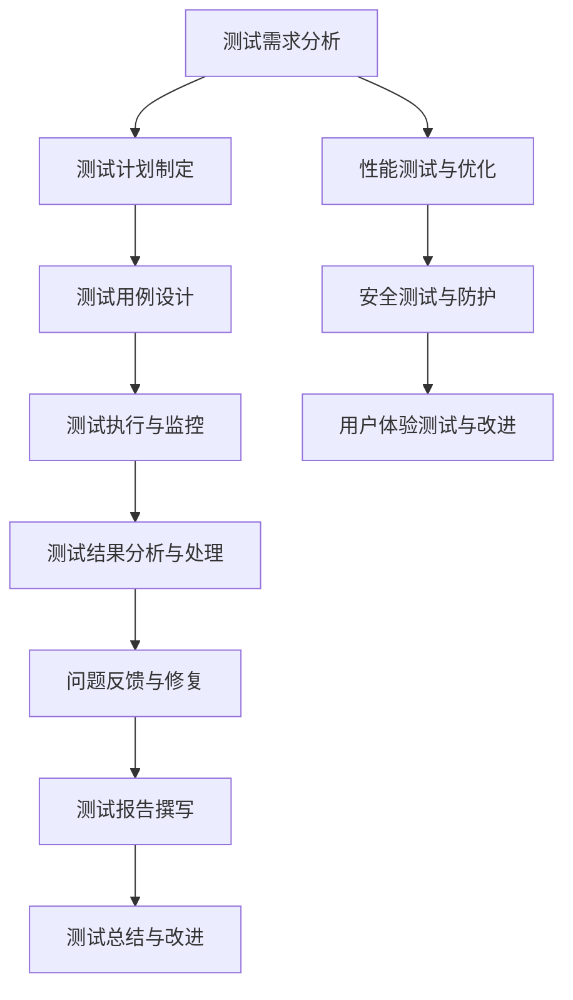

                 

### 1. 引言与概述

#### AI开发背景及质量保证的重要性

人工智能（AI）作为当今科技领域的热点，正在快速渗透到各个行业，从医疗、金融到交通、教育等。AI技术的应用不仅提高了效率和生产力，还改变了人类与机器的交互方式。然而，随着AI项目的复杂性增加，确保其质量成为了一个严峻的挑战。质量保证（QA）在AI开发中的重要性不可忽视，它直接影响项目的成功与否。

##### 1.1.1 AI的发展历程

AI的发展历程可以分为几个阶段。从20世纪50年代的早期探索，到20世纪80年代的专家系统，再到21世纪初的深度学习和神经网络，AI技术经历了无数次的迭代和进步。今天，AI已经渗透到我们生活的方方面面，从智能手机中的语音助手，到自动驾驶汽车，再到智能医疗诊断系统。

##### 1.1.2 AI项目的挑战与风险

AI项目面临的挑战和风险是多方面的。首先，算法的不确定性使得预测结果可能不可靠。其次，数据质量直接影响模型的性能，而数据收集和处理过程可能存在偏差。此外，AI系统通常具有高度的复杂性，使得理解和验证其工作原理变得更加困难。最后，AI系统的伦理和隐私问题也需要得到充分的关注。

##### 1.1.3 质量保证在AI开发中的角色

质量保证在AI开发中扮演着关键角色。它包括以下几个方面：

1. **验证模型的准确性**：通过多种测试方法确保模型在多种情况下都能提供可靠的预测。
2. **确保数据质量**：清洗和标准化数据，以消除数据偏差，提高模型的鲁棒性。
3. **安全性和隐私性**：确保AI系统不会受到恶意攻击，同时保护用户隐私。
4. **可解释性**：提高AI系统的透明度，使其决策过程易于理解。

#### 1.2 Lepton AI测试体系简介

Lepton AI是一款领先的人工智能框架，以其高效性和灵活性而著称。其测试体系是保证产品质量的关键。以下是Lepton AI测试体系的核心优势、架构和组成模块：

##### 1.2.1 Lepton AI的核心优势

- **高性能**：Lepton AI采用了先进的算法，能够在短时间内完成复杂的数据处理和分析任务。
- **高灵活性**：支持多种编程语言和数据格式，易于集成到现有系统中。
- **模块化**：测试体系由多个独立的模块组成，便于扩展和维护。

##### 1.2.2 Lepton AI测试体系的架构

Lepton AI测试体系采用分层架构，包括以下主要层次：

1. **数据层**：负责数据收集、清洗和存储。
2. **测试层**：包括单元测试、集成测试和系统测试等。
3. **监控层**：实时监控系统的运行状态，提供异常检测和报警功能。

##### 1.2.3 Lepton AI测试体系的组成模块

1. **自动化测试模块**：使用Selenium、Appium等自动化测试工具，提高测试效率。
2. **性能测试模块**：使用JMeter、LoadRunner等工具，评估系统的性能和稳定性。
3. **安全测试模块**：使用OWASP ZAP、Burp Suite等工具，确保系统的安全性。
4. **用户体验测试模块**：使用UsabilityHub、Maze等工具，评估系统的易用性和交互性。

通过上述介绍，我们可以看到，Lepton AI的测试体系是一个全面、高效的系统，旨在确保AI开发过程中的每一个环节都能达到高质量标准。在下一部分，我们将深入探讨AI测试的方法与工具，帮助读者了解如何在实际项目中应用这些技术。## 2. AI测试方法与工具

在AI开发过程中，测试是确保系统性能、准确性和稳定性的关键环节。AI测试方法多样，包括单元测试、集成测试、系统测试和回归测试等。同时，有许多工具可供选择，如自动化测试工具、性能测试工具、安全测试工具和用户体验测试工具。以下是对这些测试方法和工具的详细介绍。

#### 2.1 测试方法概述

##### 2.1.1 单元测试

单元测试是最基础的测试方法，主要针对AI系统中的最小功能单元（如函数、方法或模块）进行验证。单元测试的目的是确保每个功能单元按照预期工作。常见的单元测试工具包括JUnit、pytest和Mocha等。

- **JUnit**：JUnit是Java语言中最常用的单元测试框架。它提供了丰富的测试注解，方便编写测试用例。
- **pytest**：pytest是Python语言的一个成熟单元测试框架，具有简洁的语法和强大的功能。
- **Mocha**：Mocha是Node.js的单元测试框架，支持多种测试方法，包括同步和异步测试。

##### 2.1.2 集成测试

集成测试是在单元测试之后进行的，目的是验证不同功能单元之间的交互是否正确。它关注的是系统模块之间的接口和协议。常见的集成测试工具包括JUnit、pytest和Selenium等。

- **JUnit**：JUnit不仅可以用于单元测试，还可以用于集成测试。它支持多种断言方法，方便编写复杂的测试用例。
- **pytest**：pytest也支持集成测试，它通过集成测试插件（如pytest-plugin）扩展了集成测试功能。
- **Selenium**：Selenium是一个开源的自动化测试工具，主要用于Web应用的集成测试。它支持多种浏览器和编程语言，可以模拟用户操作。

##### 2.1.3 系统测试

系统测试是对整个AI系统的功能、性能、安全性和稳定性进行全面评估。它通常在开发周期的后期进行，目的是确保系统能够满足用户需求和业务目标。常见的系统测试工具包括JUnit、pytest和LoadRunner等。

- **JUnit**：JUnit支持系统测试，通过组合多个单元测试用例，可以全面评估系统的整体性能。
- **pytest**：pytest也可以用于系统测试，它支持多种测试方法，如功能测试、性能测试和安全测试。
- **LoadRunner**：LoadRunner是一个高性能的负载测试工具，可以模拟大量用户同时访问系统，评估系统的性能和稳定性。

##### 2.1.4 回归测试

回归测试是在每次系统更新或修改后进行的测试，目的是确保新的更改没有引入新的错误。它通常基于历史测试用例集进行。常见的回归测试工具包括JUnit、pytest和Selenium等。

- **JUnit**：JUnit支持回归测试，通过执行历史测试用例，可以快速检测系统变更是否引入了新的错误。
- **pytest**：pytest也支持回归测试，它可以通过测试套件管理历史测试用例。
- **Selenium**：Selenium可以通过录制用户操作，生成回归测试用例，确保系统变更不会影响用户体验。

#### 2.2 测试工具介绍

##### 2.2.1 自动化测试工具

自动化测试工具可以大大提高测试效率，减少人工测试的工作量。以下是一些常用的自动化测试工具：

- **Selenium**：Selenium是一个开源的自动化测试工具，主要用于Web应用的自动化测试。它支持多种浏览器和编程语言，如Java、Python和C#等。
- **Appium**：Appium是一个开源的移动应用自动化测试工具，支持iOS和Android平台。它允许使用多种编程语言编写测试脚本，如Java、Python和Ruby等。
- **JUnit**：JUnit是一个Java语言的开源单元测试框架，支持多种测试方法，如单元测试、集成测试和回归测试等。
- **pytest**：pytest是一个Python语言的开源单元测试框架，具有简洁的语法和强大的功能。它支持多种测试插件，如性能测试和安全测试等。

##### 2.2.2 性能测试工具

性能测试工具可以模拟大量用户同时访问系统，评估系统的性能和稳定性。以下是一些常用的性能测试工具：

- **LoadRunner**：LoadRunner是一个高性能的负载测试工具，可以模拟大量用户同时访问系统。它支持多种协议，如HTTP、HTTPS、FTP和SAP等。
- **JMeter**：JMeter是一个开源的性能测试工具，主要用于Web应用的负载测试。它支持多种协议，如HTTP、HTTPS、FTP和SOAP等。
- **Locust**：Locust是一个开源的性能测试工具，主要用于Web应用的并发性能测试。它支持多种协议，如HTTP、HTTPS和WebSockets等。

##### 2.2.3 安全测试工具

安全测试工具可以检测系统的安全漏洞，确保系统的安全性。以下是一些常用的安全测试工具：

- **OWASP ZAP**：OWASP ZAP是一个开源的Web应用安全测试工具，可以检测多种常见的安全漏洞，如SQL注入、XSS攻击和CSRF攻击等。
- **Burp Suite**：Burp Suite是一个商业的Web应用安全测试工具，支持多种安全测试功能，如代理、扫描、攻击和审计等。
- **Wireshark**：Wireshark是一个开源的网络协议分析工具，可以捕获和分析网络流量，检测网络攻击和故障。

##### 2.2.4 用户体验测试工具

用户体验测试工具可以模拟用户操作，评估系统的易用性和交互性。以下是一些常用的用户体验测试工具：

- **UsabilityHub**：UsabilityHub是一个在线用户体验测试工具，可以快速创建和分享测试任务。它支持多种测试方法，如A/B测试、点击测试和可用性测试等。
- **Maze**：Maze是一个在线用户体验测试工具，支持多种测试方法，如A/B测试、点击测试和可用性测试等。它提供了丰富的数据分析功能，帮助优化用户体验。
- **UserTesting**：UserTesting是一个专业的用户体验测试工具，提供真实用户的视频反馈。它支持多种测试方法，如任务测试、可用性测试和交互式设计测试等。

通过上述介绍，我们可以看到，AI测试方法多样，测试工具丰富。在实际项目中，根据具体需求和场景选择合适的测试方法和工具，是确保AI系统质量和性能的关键。在下一部分，我们将深入探讨Lepton AI的测试流程，帮助读者了解如何在实际项目中应用这些技术和工具。### 3. Lepton AI测试流程

Lepton AI的测试流程是确保系统质量的关键环节。一个有效的测试流程包括测试需求分析、测试计划制定、测试用例设计、测试执行与监控、测试结果分析与处理等环节。以下是对这些环节的详细描述。

#### 3.1 测试流程概述

##### 3.1.1 测试需求分析

测试需求分析是测试流程的第一步，其目的是明确系统功能、性能和安全等各方面的测试需求。测试需求分析通常涉及以下任务：

1. **理解系统需求**：与项目团队和业务方沟通，理解系统的功能、性能和安全需求。
2. **识别关键场景**：确定系统中关键的功能场景和性能场景，确保这些场景在测试中得到充分的覆盖。
3. **制定测试策略**：根据系统需求和关键场景，制定相应的测试策略，如功能测试、性能测试和安全测试等。

##### 3.1.2 测试计划制定

测试计划制定是在测试需求分析的基础上，详细规划测试活动的步骤、时间表和资源分配。测试计划通常包括以下内容：

1. **测试目标**：明确本次测试的目标，如验证系统功能、性能和安全等。
2. **测试范围**：确定本次测试覆盖的功能模块、性能场景和安全漏洞等。
3. **测试策略**：根据测试目标，选择合适的测试方法和工具，如自动化测试、性能测试和安全测试等。
4. **时间表**：制定详细的测试时间表，包括测试开始、结束时间以及每个测试阶段的持续时间。
5. **资源分配**：确定测试所需的资源，如人员、设备和软件等。

##### 3.1.3 测试用例设计

测试用例设计是根据测试需求和测试计划，编写具体的测试脚本和测试数据。测试用例设计的原则包括：

1. **全面性**：确保测试用例能够覆盖系统功能的各个方面。
2. **可执行性**：测试用例应该能够在实际环境中执行，并能够产生可观察的结果。
3. **可维护性**：测试用例应该易于理解和修改，以便在系统更新时进行维护。
4. **可复用性**：测试用例应该能够复用，减少重复工作。

##### 3.1.4 测试执行与监控

测试执行与监控是将测试用例在实际环境中执行，并监控测试执行过程。测试执行与监控的步骤包括：

1. **执行测试用例**：按照测试计划，逐个执行测试用例，并记录测试结果。
2. **监控测试执行**：实时监控测试执行过程，及时发现和解决问题。
3. **记录测试结果**：将测试结果记录在测试管理工具中，如JUnit、pytest等。

##### 3.1.5 测试报告与总结

测试报告与总结是对测试活动进行全面总结和评估。测试报告通常包括以下内容：

1. **测试执行情况**：总结测试用例的执行情况，包括通过数量、失败数量和异常数量等。
2. **测试结果分析**：对测试结果进行分析，评估系统的功能、性能和安全等方面是否达到预期。
3. **问题与解决方案**：记录测试过程中发现的问题及其解决方案，为系统优化提供参考。
4. **测试总结**：对整个测试流程进行总结，提出改进建议，为下一次测试活动做好准备。

#### 3.2 测试用例设计与执行

##### 3.2.1 测试用例设计原则

测试用例设计是测试流程的核心环节，以下是设计测试用例时需要遵循的原则：

1. **全面性**：确保测试用例能够覆盖系统功能的各个方面，包括正常场景和异常场景。
2. **可执行性**：测试用例应该能够在实际环境中执行，并能够产生可观察的结果。
3. **可维护性**：测试用例应该易于理解和修改，以便在系统更新时进行维护。
4. **可复用性**：测试用例应该能够复用，减少重复工作。

##### 3.2.2 测试用例设计方法

测试用例设计方法有多种，以下是几种常用的设计方法：

1. **功能分解法**：根据系统功能模块，将功能拆分成多个子功能，并为每个子功能设计测试用例。
2. **等价类划分法**：根据系统输入和输出，将输入数据划分为多个等价类，为每个等价类设计测试用例。
3. **边界值分析法**：为系统输入和输出设计边界值，如最大值、最小值和边界值，为这些边界值设计测试用例。
4. **因果图法**：根据系统输入和输出之间的关系，构建因果图，为因果图中的每个节点设计测试用例。

##### 3.2.3 测试用例执行步骤

测试用例执行是将设计好的测试用例在实际环境中执行，并记录测试结果。以下是测试用例执行的步骤：

1. **准备测试环境**：确保测试环境与实际生产环境一致，包括硬件、软件和网络环境等。
2. **执行测试用例**：按照测试计划，逐个执行测试用例，并记录测试结果。
3. **监控测试执行**：实时监控测试执行过程，及时发现和解决问题。
4. **记录测试结果**：将测试结果记录在测试管理工具中，如JUnit、pytest等。

##### 3.2.4 测试用例管理

测试用例管理是对测试用例进行创建、修改、执行和归档等操作。以下是测试用例管理的步骤：

1. **创建测试用例**：根据测试需求和设计方法，创建测试用例。
2. **修改测试用例**：在测试过程中，根据系统变更和需求变化，修改测试用例。
3. **执行测试用例**：按照测试计划，执行测试用例，并记录测试结果。
4. **归档测试用例**：在测试结束后，将测试用例归档，以备后续参考。

通过上述介绍，我们可以看到，Lepton AI的测试流程是一个系统化、规范化的过程，旨在确保系统质量。在实际项目中，遵循这个流程，可以大大提高测试效率和测试质量。在下一部分，我们将探讨测试结果分析与处理的方法，帮助读者了解如何从测试结果中发现问题并提出改进措施。### 3.3 测试结果分析与处理

测试结果的分析与处理是确保AI系统质量的关键步骤。通过详细分析测试结果，我们可以发现潜在的问题，评估系统的性能和稳定性，进而提出改进措施。以下是对测试结果分析方法和缺陷管理、测试报告撰写等环节的详细描述。

#### 3.3.1 测试结果分析方法

测试结果分析方法包括以下几个方面：

1. **统计分析**：使用统计学方法对测试结果进行数据分析，如计算平均数、中位数、标准差等。这有助于评估系统的稳定性和一致性。
2. **图表分析**：通过图表（如柱状图、折线图、饼图等）展示测试结果，帮助直观地理解数据分布和趋势。
3. **错误分析**：对测试失败的原因进行深入分析，包括定位错误发生的模块、错误类型和错误模式等。
4. **回归分析**：通过回归分析，评估系统变更对性能和功能的影响。

#### 3.3.2 缺陷管理

缺陷管理是测试结果分析的重要环节。以下是缺陷管理的步骤：

1. **缺陷报告**：将测试过程中发现的缺陷记录在缺陷管理工具中，包括缺陷的严重性、优先级和复现步骤等。
2. **缺陷分析**：对缺陷进行分析，找出缺陷的根源，如代码缺陷、设计缺陷或环境问题等。
3. **缺陷跟踪**：跟踪缺陷的修复进度，确保所有缺陷都得到妥善处理。
4. **缺陷预防**：通过分析缺陷原因，提出改进措施，预防类似缺陷的再次发生。

#### 3.3.3 测试报告撰写

测试报告是对测试活动的全面总结和评估。以下是测试报告撰写的内容和要点：

1. **测试概述**：简要介绍测试的目的、范围和执行情况。
2. **测试结果**：详细描述测试结果，包括测试用例的通过数量、失败数量和异常数量等。
3. **缺陷报告**：列出测试过程中发现的缺陷，包括缺陷的严重性、优先级和修复情况等。
4. **性能分析**：对系统的性能进行分析，包括响应时间、吞吐量和资源利用率等。
5. **安全分析**：对系统的安全性进行分析，包括发现的漏洞和防护措施等。
6. **用户体验评估**：对系统的易用性和交互性进行评估，提出改进建议。
7. **总结与建议**：总结测试过程中的经验和教训，提出改进措施和下一步测试计划。

#### 3.3.4 测试结果可视化与图表

为了更好地展示测试结果，我们可以使用各种图表。以下是几种常用的图表：

1. **柱状图**：用于展示不同测试用例的通过数量、失败数量和异常数量等。
2. **折线图**：用于展示系统性能的变化趋势，如响应时间和吞吐量等。
3. **饼图**：用于展示系统资源的利用率，如CPU、内存和网络带宽等。
4. **散点图**：用于展示系统性能和缺陷之间的关系，如缺陷密度分布图等。

通过测试结果的分析与处理，我们可以全面了解AI系统的质量和性能，发现潜在的问题并提出改进措施。这样，不仅能够提高系统的稳定性，还能够提高用户满意度。在下一部分，我们将探讨性能测试与优化，帮助读者了解如何通过性能测试来评估系统性能，并提出优化策略。### 4. 性能测试与优化

性能测试是评估AI系统在实际运行环境中的性能和稳定性的一种关键方法。通过性能测试，我们可以确定系统在不同负载下的响应时间、吞吐量和资源利用率等指标，从而识别系统的性能瓶颈和潜在问题。本节将介绍性能测试的方法、策略和优化措施。

#### 4.1 性能测试方法

性能测试主要包括以下几种方法：

##### 4.1.1 负载测试

负载测试旨在确定系统在特定负载下的性能。测试过程中，会模拟大量的并发用户访问系统，以评估系统的响应时间、吞吐量和资源利用率等。常见的负载测试工具包括JMeter、LoadRunner和Locust等。

- **JMeter**：JMeter是一个开源的性能测试工具，主要用于Web应用的负载测试。它支持多种协议，如HTTP、HTTPS、FTP和SOAP等。
- **LoadRunner**：LoadRunner是一个高性能的负载测试工具，可以模拟大量用户同时访问系统。它支持多种协议，如HTTP、HTTPS、FTP和SAP等。
- **Locust**：Locust是一个开源的性能测试工具，主要用于Web应用的并发性能测试。它支持多种协议，如HTTP、HTTPS和WebSockets等。

##### 4.1.2 压力测试

压力测试旨在确定系统的最大负载能力。测试过程中，会逐渐增加负载，直到系统性能达到极限或出现故障。通过压力测试，我们可以了解系统的最大处理能力，以及可能出现的性能瓶颈。

- **Apache JMeter**：Apache JMeter可以用于压力测试，通过设置不同的负载参数，模拟系统在极限负载下的运行情况。
- **LoadRunner**：LoadRunner支持压力测试功能，可以模拟大量用户同时访问系统，以评估系统的最大负载能力。

##### 4.1.3 并发测试

并发测试旨在评估系统在并发访问下的性能和稳定性。测试过程中，会同时模拟多个用户对系统进行访问，以评估系统的并发处理能力和响应时间。常见的并发测试工具包括JMeter和LoadRunner等。

- **JMeter**：JMeter支持并发测试，通过设置并发用户数和负载时长，模拟并发访问情况。
- **LoadRunner**：LoadRunner也支持并发测试，可以同时模拟大量用户访问系统，评估系统的并发处理能力。

##### 4.1.4 性能瓶颈分析

性能瓶颈分析是识别系统性能瓶颈的关键步骤。测试过程中，通过监控系统的资源利用率、响应时间等指标，定位性能瓶颈所在。常见的性能瓶颈包括CPU利用率过高、内存泄漏、数据库瓶颈和网络延迟等。

- **CPU利用率分析**：通过监控CPU利用率，确定是否存在CPU瓶颈。可以使用工具如Top、htop或VisualVM等。
- **内存泄漏分析**：通过内存监控工具，如MAT（Memory Analyzer Tool）或GDB（GNU Debugger），识别内存泄漏问题。
- **数据库瓶颈分析**：通过分析数据库的查询性能、索引效率和连接数等，识别数据库瓶颈。
- **网络延迟分析**：通过ping命令或网络监控工具，如Wireshark，评估网络延迟和丢包率。

#### 4.2 性能优化策略

性能优化是提升系统性能的关键步骤。以下是一些常见的性能优化策略：

##### 4.2.1 系统架构优化

系统架构优化是提升系统性能的基础。以下是一些系统架构优化的方法：

- **分布式架构**：通过将系统拆分成多个模块，实现分布式部署，提高系统的可扩展性和性能。
- **缓存机制**：使用缓存机制，如Redis或Memcached，减少对数据库的访问，提高系统的响应速度。
- **负载均衡**：通过负载均衡器，如Nginx或HAProxy，均衡系统负载，提高系统的可用性和性能。

##### 4.2.2 数据库优化

数据库优化是提升系统性能的重要环节。以下是一些数据库优化的方法：

- **索引优化**：通过创建合适的索引，提高数据库查询性能。
- **查询优化**：通过优化SQL查询，减少查询时间，提高系统性能。
- **分库分表**：通过分库分表，降低数据库的负载，提高查询性能。

##### 4.2.3 网络优化

网络优化是提高系统性能的关键步骤。以下是一些网络优化的方法：

- **网络延迟优化**：通过优化网络拓扑结构，减少网络延迟。
- **网络带宽优化**：通过升级网络设备，提高网络带宽，减少网络拥堵。
- **负载均衡**：通过负载均衡器，均衡网络负载，提高网络性能。

##### 4.2.4 代码优化

代码优化是提升系统性能的重要手段。以下是一些代码优化的方法：

- **减少不必要的计算**：通过优化算法和数据结构，减少不必要的计算，提高代码效率。
- **使用缓存**：通过使用缓存，减少对数据库和外部服务的访问，提高系统响应速度。
- **并行处理**：通过并行处理，提高代码的执行速度，提高系统性能。

通过上述性能测试和优化策略，我们可以有效识别系统性能瓶颈，并提出针对性的优化措施，从而提升系统的性能和稳定性。在下一部分，我们将探讨安全测试与防护，帮助读者了解如何确保AI系统的安全性和隐私性。### 5. 安全测试与防护

安全测试是确保AI系统安全性和隐私性的重要环节。在AI系统中，安全漏洞和隐私泄露可能会对用户和业务造成严重影响。因此，进行全面的安全测试和采取有效的防护措施至关重要。以下将介绍安全测试的目标和方法，以及常见的安全漏洞与防护措施。

#### 5.1 安全测试概述

##### 5.1.1 安全测试的目标和范围

安全测试的目标是识别AI系统中的潜在安全漏洞，确保系统的数据安全、隐私保护和完整性。安全测试的范围通常包括：

1. **身份认证**：测试系统的用户认证机制，确保只有授权用户才能访问系统。
2. **授权管理**：测试系统的授权机制，确保用户只能访问其权限范围内的数据和功能。
3. **数据保护**：测试系统的数据加密和存储机制，确保数据在传输和存储过程中得到充分保护。
4. **安全审计**：测试系统的日志记录和审计功能，确保系统能够及时发现和记录安全事件。
5. **网络通信**：测试系统的网络通信安全，确保数据在网络传输过程中不会被窃听或篡改。

##### 5.1.2 安全测试方法

安全测试方法主要包括以下几种：

1. **漏洞扫描**：使用自动化工具扫描系统，发现已知的安全漏洞。常见的漏洞扫描工具包括Nessus、OpenVAS和Burp Suite等。
2. **渗透测试**：模拟攻击者对系统进行攻击，识别潜在的安全漏洞。渗透测试包括黑盒测试、白盒测试和灰盒测试等。
3. **代码审计**：对系统代码进行审查，查找潜在的安全漏洞。代码审计可以通过静态分析、动态分析和模糊测试等方法进行。
4. **安全配置检查**：检查系统的配置文件，确保系统配置符合安全最佳实践。

##### 5.1.3 安全测试工具

安全测试工具是进行安全测试的重要辅助。以下是一些常用的安全测试工具：

1. **Nessus**：Nessus是一个开源的漏洞扫描工具，可以扫描系统中的安全漏洞，并提供详细的报告。
2. **OpenVAS**：OpenVAS是一个开源的漏洞扫描和管理工具，支持多种平台，可以自动发现和修复安全漏洞。
3. **Burp Suite**：Burp Suite是一个功能强大的安全测试工具，支持漏洞扫描、渗透测试和代码审计等功能。
4. **Wireshark**：Wireshark是一个开源的网络协议分析工具，可以捕获和分析网络流量，识别网络攻击和故障。

#### 5.2 常见安全漏洞与防护措施

##### 5.2.1 SQL注入

SQL注入是常见的安全漏洞之一，攻击者可以通过在输入框中注入恶意的SQL语句，篡改数据库数据或执行非法操作。防护措施包括：

1. **使用预编译语句**：使用预编译语句（如PreparedStatement）可以防止SQL注入。
2. **输入验证**：对用户输入进行严格的验证和过滤，限制输入的格式和长度。
3. **参数化查询**：使用参数化查询可以避免SQL注入。

##### 5.2.2 XSS攻击

XSS（跨站脚本攻击）是一种通过在Web页面中注入恶意脚本，窃取用户信息或篡改页面的漏洞。防护措施包括：

1. **输出编码**：对输出内容进行编码，防止恶意脚本被执行。
2. **内容安全政策**（CSP）：使用内容安全政策限制页面上可以执行的脚本，防止恶意脚本注入。
3. **输入验证**：对用户输入进行严格的验证和过滤，限制输入的格式和长度。

##### 5.2.3 CSRF攻击

CSRF（跨站请求伪造）攻击是攻击者通过伪造用户请求，在未授权的情况下执行敏感操作。防护措施包括：

1. **双重提交Cookie**：使用双重提交Cookie，确保请求中包含一个随机生成的Cookie，防止CSRF攻击。
2. **验证Referer头**：验证HTTP请求中的Referer头，确保请求来自于受信任的来源。
3. **一次性令牌**：为每个请求生成一个唯一的一次性令牌，确保请求是用户主动发起的。

##### 5.2.4 DDoS攻击

DDoS（分布式拒绝服务）攻击是攻击者通过大量请求使系统瘫痪。防护措施包括：

1. **流量监控和过滤**：监控系统流量，过滤恶意流量，防止DDoS攻击。
2. **负载均衡**：使用负载均衡器分散攻击流量，提高系统的抗攻击能力。
3. **防火墙和入侵检测系统**：配置防火墙和入侵检测系统，防止DDoS攻击。

通过上述安全测试和防护措施，我们可以确保AI系统的安全性和隐私性，防止潜在的安全漏洞和攻击。在下一部分，我们将探讨用户体验测试与改进，帮助读者了解如何通过用户体验测试来优化AI系统。### 6. 用户体验测试与改进

用户体验测试是评估AI系统易用性和交互性的关键步骤。通过用户体验测试，我们可以发现用户在使用过程中的痛点，提出改进方案，从而提升系统的整体用户体验。以下将介绍用户体验测试的目标和方法，以及用户体验评估指标和改进策略。

#### 6.1 用户体验测试概述

##### 6.1.1 用户体验测试的目标和范围

用户体验测试的目标是评估系统的易用性、交互性和满足用户需求的能力。测试范围通常包括以下几个方面：

1. **功能性测试**：确保系统的功能满足用户需求，无遗漏或错误。
2. **易用性测试**：评估系统的界面设计、操作流程和交互体验，确保用户能够轻松、高效地完成任务。
3. **交互性测试**：评估系统的响应速度、反馈机制和交互方式，确保用户在使用过程中感觉流畅和自然。
4. **可访问性测试**：确保系统能够满足不同用户群体的需求，如视力障碍、听力障碍等。

##### 6.1.2 用户体验测试的方法

用户体验测试方法主要包括以下几种：

1. **任务测试**：模拟用户在系统中的典型任务，评估任务完成的速度和成功率。
2. **可用性测试**：邀请真实用户参与测试，观察他们在使用系统时的行为和反馈，评估系统的易用性和交互性。
3. **A/B测试**：将系统的不同版本或界面元素展示给用户，比较其效果，找出最佳设计方案。
4. **点击测试**：使用工具记录用户的点击路径和点击频率，分析用户的交互行为。

##### 6.1.3 用户体验测试工具

用户体验测试工具是进行测试的重要辅助。以下是一些常用的用户体验测试工具：

1. **UsabilityHub**：UsabilityHub是一个在线用户体验测试工具，支持A/B测试、点击测试和可用性测试等。
2. **Maze**：Maze是一个在线用户体验测试工具，支持A/B测试、点击测试和可用性测试等，并提供丰富的数据分析功能。
3. **UserTesting**：UserTesting是一个专业的用户体验测试工具，提供真实用户的视频反馈，帮助优化用户体验。

#### 6.2 用户体验评估指标

用户体验评估指标是衡量系统易用性和交互性的关键。以下是一些常用的用户体验评估指标：

1. **功能性指标**：包括任务完成率、错误率、响应时间等，用于评估系统的功能性和稳定性。
2. **易用性指标**：包括学习曲线、用户满意度、操作效率等，用于评估系统的易用性。
3. **交互性指标**：包括响应速度、反馈机制、交互方式等，用于评估系统的交互性。
4. **可访问性指标**：包括满足不同用户群体需求的能力，如视力障碍、听力障碍等，用于评估系统的可访问性。

#### 6.3 用户体验改进策略

用户体验改进是基于测试结果和用户反馈，提出改进措施，提升系统易用性和交互性。以下是一些用户体验改进策略：

##### 6.3.1 基于反馈的改进

基于反馈的改进策略是通过收集和分析用户反馈，找出用户在使用过程中的问题和痛点，并提出相应的改进措施。以下是一些基于反馈的改进方法：

1. **用户访谈**：与用户进行深入交流，了解他们的使用习惯和期望。
2. **问卷调查**：通过问卷调查收集用户对系统的满意度、功能需求和改进建议。
3. **用户观察**：观察用户在使用系统时的行为和操作，识别潜在的改进点。

##### 6.3.2 用户研究方法

用户研究是了解用户需求和行为的重要手段。以下是一些用户研究方法：

1. **用户画像**：通过分析用户数据，构建用户画像，了解用户的基本特征和需求。
2. **用户旅程地图**：绘制用户在使用系统过程中的关键步骤和情感变化，帮助识别改进点。
3. **可用性测试**：通过可用性测试，评估系统的易用性和交互性，找出用户使用过程中的问题。

##### 6.3.3 设计迭代与优化

设计迭代与优化是基于用户反馈和研究结果，不断改进系统设计，提升用户体验。以下是一些设计迭代与优化的方法：

1. **迭代开发**：采用敏捷开发方法，快速迭代，不断优化系统设计。
2. **原型设计**：通过原型设计，模拟系统界面和交互方式，收集用户反馈，进行优化。
3. **用户测试**：定期进行用户测试，评估系统改进的效果，持续优化设计。

通过用户体验测试和改进策略，我们可以不断提升AI系统的易用性和交互性，满足用户需求，提高用户满意度。在下一部分，我们将探讨AI测试领域的未来发展趋势，帮助读者了解AI测试技术的创新和挑战。### 7. AI测试领域的未来发展趋势

随着人工智能技术的迅猛发展，AI测试领域也在不断演进，面临着新的机遇和挑战。未来的AI测试将更加智能化、自动化和多样化，以适应日益复杂的应用场景和快速迭代的需求。以下是对AI测试领域未来发展趋势的探讨。

#### 7.1 自动化测试技术的发展

自动化测试技术在AI测试领域将发挥越来越重要的作用。未来，自动化测试将不仅限于执行预定义的测试用例，还将扩展到智能测试用例的生成和执行。以下是一些自动化测试技术的发展趋势：

- **智能测试用例生成**：通过机器学习和自然语言处理技术，自动化生成测试用例，提高测试效率。
- **智能测试执行**：利用AI算法，动态调整测试执行策略，优化测试流程，提高测试覆盖率。
- **自动化测试平台**：构建集成化的自动化测试平台，支持多种测试类型和工具的集成，提高测试的可维护性和可扩展性。

#### 7.2 AI测试工具的智能化

AI测试工具的智能化是未来发展的一个重要方向。通过引入AI技术，测试工具将能够提供更加智能化的功能，如：

- **智能缺陷定位**：利用AI算法，快速定位测试过程中出现的缺陷，并提供相关的修复建议。
- **智能测试结果分析**：通过机器学习技术，分析测试结果，识别潜在的问题和趋势，提供改进建议。
- **智能测试管理**：利用AI算法，优化测试资源的分配和管理，提高测试效率。

#### 7.3 自动化测试工具的创新

未来，自动化测试工具将不断推出新的功能和改进，以应对AI测试的特殊需求。以下是一些自动化测试工具的创新方向：

- **多模态测试支持**：支持多种数据格式和接口，如文本、图像、音频和视频等，实现更全面的测试覆盖。
- **智能化界面交互**：通过使用自然语言处理和计算机视觉技术，模拟用户的界面交互，提高测试的真实性和有效性。
- **跨平台兼容性测试**：支持多种操作系统、浏览器和移动设备，确保AI应用在不同环境下都能正常运行。

#### 7.4 AI测试领域的挑战与机遇

尽管AI测试领域充满了机遇，但也面临着一些挑战。以下是一些需要关注的问题：

- **测试数据的质量与可用性**：AI测试依赖于大量高质量的数据，数据的准确性和代表性直接影响测试结果。
- **测试环境的多样性**：AI应用通常涉及多种硬件、软件和网络环境，测试环境的多样性增加了测试的复杂性。
- **测试团队的技能提升**：AI测试需要专业的技能和知识，测试团队需要不断学习和适应新的技术和工具。

#### 7.5 AI测试工具的商业化与开放源码

未来，AI测试工具的商业化与开放源码将并存，各自发挥作用。商业化的AI测试工具将提供更加完善的功能和售后服务，而开放源码的AI测试工具将吸引更多的开发者参与，推动技术的创新和社区的共享。

总之，AI测试领域的未来发展趋势是智能化、自动化和多样化。通过引入AI技术，测试工具将变得更加智能化，测试流程将更加高效和灵活。同时，AI测试领域也将面临一些挑战，需要不断探索和创新，以适应不断变化的技术和应用场景。在未来的发展中，AI测试将发挥越来越重要的作用，推动人工智能技术的持续进步。### 附录A：常用测试工具与资源

在AI测试领域，选择合适的测试工具和资源是确保测试流程高效和准确的关键。以下列举了常用的自动化测试工具、性能测试工具、安全测试工具和用户体验测试工具，并提供相应的使用教程和资源链接，以便开发者在使用过程中参考。

#### A.1 自动化测试工具

##### Selenium

Selenium是一款流行的开源自动化测试工具，主要用于Web应用的自动化测试。它支持多种浏览器和编程语言，如Java、Python和C#等。

- **使用教程**：[Selenium官方文档](https://www.selenium.dev/documentation/)
- **资源链接**：[Selenium GitHub仓库](https://github.com/selenium/selenium)

##### Appium

Appium是一个开源的移动应用自动化测试工具，支持iOS和Android平台。它允许使用多种编程语言编写测试脚本，如Java、Python和Ruby等。

- **使用教程**：[Appium官方文档](https://appium.io/docs/)
- **资源链接**：[Appium GitHub仓库](https://github.com/appium/appium)

##### JMeter

JMeter是一个开源的性能测试工具，主要用于Web应用的负载测试。它支持多种协议，如HTTP、HTTPS、FTP和SOAP等。

- **使用教程**：[JMeter官方文档](https://jmeter.apache.org/usermanual/)
- **资源链接**：[JMeter官方网站](https://jmeter.apache.org/)

##### pytest

pytest是一个Python语言的开源单元测试框架，具有简洁的语法和强大的功能。它支持多种测试插件，如性能测试和安全测试等。

- **使用教程**：[pytest官方文档](https://pytest.org/latest/)
- **资源链接**：[pytest GitHub仓库](https://github.com/pytest-dev/pytest)

##### Mocha

Mocha是一个Node.js的单元测试框架，支持多种测试方法，包括同步和异步测试。它常用于前端开发和Node.js应用测试。

- **使用教程**：[Mocha官方文档](https://mochajs.org/)
- **资源链接**：[Mocha GitHub仓库](https://github.com/mochajs/mocha)

#### A.2 性能测试工具

##### LoadRunner

LoadRunner是一个高性能的负载测试工具，可以模拟大量用户同时访问系统。它支持多种协议，如HTTP、HTTPS、FTP和SAP等。

- **使用教程**：[LoadRunner官方文档](https://www.microfocus.com/documentation/loadrunner/)
- **资源链接**：[LoadRunner官方网站](https://www.microfocus.com/products/loadrunner)

##### Apache JMeter

Apache JMeter是一个开源的性能测试工具，主要用于Web应用的负载测试。它支持多种协议，如HTTP、HTTPS、FTP和SOAP等。

- **使用教程**：[JMeter官方文档](https://jmeter.apache.org/usermanual/)
- **资源链接**：[JMeter官方网站](https://jmeter.apache.org/)

##### Locust

Locust是一个开源的性能测试工具，主要用于Web应用的并发性能测试。它支持多种协议，如HTTP、HTTPS和WebSockets等。

- **使用教程**：[Locust官方文档](https://locust.io/)
- **资源链接**：[Locust GitHub仓库](https://github.com/locustio/locust)

#### A.3 安全测试工具

##### OWASP ZAP

OWASP ZAP是一个开源的Web应用安全测试工具，可以检测多种常见的安全漏洞，如SQL注入、XSS攻击和CSRF攻击等。

- **使用教程**：[OWASP ZAP官方文档](https://zap.readthedocs.io/)
- **资源链接**：[OWASP ZAP GitHub仓库](https://github.com/zaproxy/zaproxy)

##### Burp Suite

Burp Suite是一个商业的Web应用安全测试工具，支持多种安全测试功能，如代理、扫描、攻击和审计等。

- **使用教程**：[Burp Suite官方文档](https://portswigger.net/burp/documentation/overview)
- **资源链接**：[Burp Suite官方网站](https://portswigger.net/burp)

##### Wireshark

Wireshark是一个开源的网络协议分析工具，可以捕获和分析网络流量，检测网络攻击和故障。

- **使用教程**：[Wireshark官方文档](https://www.wireshark.org/docs/wsug/)
- **资源链接**：[Wireshark官方网站](https://www.wireshark.org/)

#### A.4 用户体验测试工具

##### UsabilityHub

UsabilityHub是一个在线用户体验测试工具，支持A/B测试、点击测试和可用性测试等。

- **使用教程**：[UsabilityHub官方文档](https://usabilityhub.com/docs/)
- **资源链接**：[UsabilityHub官方网站](https://usabilityhub.com/)

##### Maze

Maze是一个在线用户体验测试工具，支持A/B测试、点击测试和可用性测试等，并提供丰富的数据分析功能。

- **使用教程**：[Maze官方文档](https://maze.ux erkki.com/)
- **资源链接**：[Maze官方网站](https://maze.ux erkki.com/)

##### UserTesting

UserTesting是一个专业的用户体验测试工具，提供真实用户的视频反馈，帮助优化用户体验。

- **使用教程**：[UserTesting官方文档](https://www.usertesting.com/support/)
- **资源链接**：[UserTesting官方网站](https://www.usertesting.com/)

通过使用上述测试工具和资源，开发者可以构建全面的测试体系，确保AI系统在不同层面上的质量。附录中的教程和资源链接将为开发者提供进一步的学习和实践指导。### Mermaid 流程图

以下是一个Mermaid流程图的示例，用于展示AI测试流程的关键步骤：



在这个流程图中，每个步骤都通过箭头连接，表示它们之间的逻辑关系。例如，测试需求分析（A）是测试计划制定（B）的前提条件，而测试结果分析与处理（E）又会产生问题反馈与修复（F）的需求。性能测试与优化（I）、安全测试与防护（J）和用户体验测试与改进（K）作为子流程，在测试流程的核心部分（A-G）之后执行，以确保系统在不同方面都达到高质量标准。

### 核心算法原理讲解

以下是AI测试中常用的一种回归算法——线性回归的伪代码讲解：

```python
# 伪代码：线性回归算法

def linear_regression(input_data, target_variable):
    # 数据预处理
    processed_data = preprocess_data(input_data)

    # 特征工程
    features = extract_features(processed_data)

    # 计算特征和目标变量的平均值
    mean_features = calculate_mean(features)
    mean_target = calculate_mean(target_variable)

    # 计算特征和目标变量之间的协方差
    covariance_matrix = calculate_covariance(features, target_variable)

    # 计算特征和目标变量之间的相关系数
    correlation_matrix = calculate_correlation(covariance_matrix, mean_features, mean_target)

    # 计算回归系数
    theta = calculate_regression_coefficients(correlation_matrix)

    # 训练模型
    model = train_model(features, theta)

    # 预测
    predictions = model.predict(processed_data)

    # 评估模型
    evaluate_model(predictions, target_variable)

    return model

# 数据预处理
def preprocess_data(input_data):
    # 确保输入数据为数值型
    processed_data = convert_to_numeric(input_data)
    # 填充缺失值
    processed_data = fill_missing_values(processed_data)
    return processed_data

# 特征工程
def extract_features(processed_data):
    # 提取特征，例如使用PCA进行降维
    features = apply_pca(processed_data)
    return features

# 计算平均值
def calculate_mean(data):
    mean = sum(data) / len(data)
    return mean

# 计算协方差
def calculate_covariance(features, target_variable):
    covariance = sum((x - mean_features) * (y - mean_target) for x, y in zip(features, target_variable))
    return covariance

# 计算相关系数
def calculate_correlation(covariance_matrix, mean_features, mean_target):
    correlation = covariance / (std_features * std_target)
    return correlation

# 计算回归系数
def calculate_regression_coefficients(correlation_matrix):
    theta = [correlation for correlation in correlation_matrix]
    return theta

# 训练模型
def train_model(features, theta):
    model = LinearRegressionModel(features, theta)
    return model

# 预测
def predict(model, processed_data):
    predictions = model.predict(processed_data)
    return predictions

# 评估模型
def evaluate_model(predictions, target_variable):
    accuracy = calculate_accuracy(predictions, target_variable)
    print(f"Model accuracy: {accuracy:.2f}")
```

在这个伪代码中，线性回归算法首先对输入数据进行预处理和特征工程，然后计算特征和目标变量之间的协方差和相关系数，基于这些系数计算回归系数。接下来，使用这些系数训练模型，并对新的数据进行预测。最后，评估模型的准确率，以确定其性能。

### 数学模型和数学公式

以下是一个关于线性回归的数学模型和公式的示例：

```latex
% 数学模型
\[
y = \theta_0 + \theta_1 \cdot x_1 + \theta_2 \cdot x_2 + ... + \theta_n \cdot x_n
\]

% 数学公式
\[
\theta = \arg\min_{\theta} \sum_{i=1}^{m} (y_i - \theta_0 - \theta_1 \cdot x_{i1} - \theta_2 \cdot x_{i2} - ... - \theta_n \cdot x_{in})^2
\]
```

在这个数学模型中，\(y\) 是目标变量，\(\theta_0, \theta_1, \theta_2, ..., \theta_n\) 是回归系数，\(x_1, x_2, ..., x_n\) 是特征变量。目标是通过最小化损失函数来估计这些回归系数。

### 项目实战

以下是一个使用Selenium实现自动化测试的实际案例，用于验证一个在线商店的登录功能：

```python
# 实际案例：使用Selenium进行自动化测试

from selenium import webdriver
from selenium.webdriver.common.by import By
from selenium.webdriver.common.keys import Keys

# 初始化Chrome浏览器
driver = webdriver.Chrome()

# 打开在线商店网站
driver.get("https://www.example.com")

# 查找并点击登录按钮
login_button = driver.find_element(By.ID, 'login-button')
login_button.click()

# 输入用户名和密码
username = "test_user"
password = "test_password"
username_input = driver.find_element(By.ID, 'username')
username_input.send_keys(username)
password_input = driver.find_element(By.ID, 'password')
password_input.send_keys(password)

# 提交登录表单
submit_button = driver.find_element(By.ID, 'submit-button')
submit_button.click()

# 检查登录是否成功
success_message = driver.find_element(By.CLASS_NAME, 'success-message')
if success_message.text == "登录成功":
    print("登录成功")
else:
    print("登录失败")

# 关闭浏览器
driver.quit()
```

在这个实际案例中，首先初始化Chrome浏览器，然后打开在线商店网站。接着，通过Selenium查找登录按钮并点击，输入用户名和密码，并提交登录表单。最后，检查页面上是否显示了“登录成功”的消息，以判断登录是否成功。

### 代码解读与分析

以下是对上述Selenium自动化测试代码的解读与分析：

```python
from selenium import webdriver
from selenium.webdriver.common.by import By
from selenium.webdriver.common.keys import Keys

# 初始化Chrome浏览器
driver = webdriver.Chrome()

# 打开在线商店网站
driver.get("https://www.example.com")

# 查找并点击登录按钮
login_button = driver.find_element(By.ID, 'login-button')
login_button.click()

# 输入用户名和密码
username = "test_user"
password = "test_password"
username_input = driver.find_element(By.ID, 'username')
username_input.send_keys(username)
password_input = driver.find_element(By.ID, 'password')
password_input.send_keys(password)

# 提交登录表单
submit_button = driver.find_element(By.ID, 'submit-button')
submit_button.click()

# 检查登录是否成功
success_message = driver.find_element(By.CLASS_NAME, 'success-message')
if success_message.text == "登录成功":
    print("登录成功")
else:
    print("登录失败")

# 关闭浏览器
driver.quit()
```

- **初始化浏览器**：首先，使用`webdriver.Chrome()`初始化Chrome浏览器。
- **打开网站**：通过`driver.get("https://www.example.com")`打开在线商店网站。
- **点击登录按钮**：使用`driver.find_element(By.ID, 'login-button')`查找登录按钮，并使用`.click()`方法点击它。
- **输入用户名和密码**：使用`driver.find_element(By.ID, 'username')`和`driver.find_element(By.ID, 'password')`分别查找用户名和密码输入框，并使用`.send_keys()`方法输入用户名和密码。
- **提交登录表单**：使用`driver.find_element(By.ID, 'submit-button')`查找提交按钮，并使用`.click()`方法提交表单。
- **检查登录是否成功**：使用`driver.find_element(By.CLASS_NAME, 'success-message')`查找“登录成功”消息，并使用`if`语句判断登录是否成功。
- **关闭浏览器**：最后，使用`driver.quit()`关闭浏览器。

通过这个解读，我们可以清晰地理解代码的执行流程和每个步骤的作用。这有助于我们更好地维护和优化自动化测试脚本。### 7. AI测试领域的未来发展趋势

随着人工智能技术的不断进步，AI测试领域也面临着前所未有的机遇和挑战。未来，AI测试将朝着更加智能化、自动化和全面化的方向发展，以适应快速变化的技术场景和日益复杂的应用需求。

#### 7.1 自动化测试技术的发展

自动化测试技术在AI测试中的应用将更加深入和广泛。未来的自动化测试将不仅仅局限于执行预设的测试用例，而是会结合人工智能技术，实现以下发展趋势：

- **智能测试用例生成**：利用机器学习算法，从历史测试数据和缺陷报告中学习，自动生成新的测试用例，提高测试的全面性和效率。
- **自适应测试执行**：通过分析实时测试数据，自适应地调整测试执行策略，优化测试流程，提高测试的准确性和速度。
- **自动化测试平台**：构建集成化的自动化测试平台，支持多种测试工具和技术的无缝集成，提高测试的可维护性和可扩展性。

#### 7.2 AI测试工具的智能化

AI测试工具的智能化是未来的一个重要趋势。智能化的测试工具将具备以下功能：

- **智能缺陷定位**：利用人工智能技术，快速定位测试过程中出现的缺陷，并提供修复建议。
- **智能测试结果分析**：通过机器学习算法，自动分析测试结果，识别潜在的问题和趋势，为测试团队提供改进建议。
- **智能测试管理**：利用人工智能技术，优化测试资源的分配和管理，提高测试效率和测试质量。

#### 7.3 自动化测试工具的创新

未来，自动化测试工具将不断推出新的功能和创新，以应对AI测试的特殊需求。以下是一些创新方向：

- **多模态测试支持**：支持多种数据格式和接口，如文本、图像、音频和视频等，实现更全面的测试覆盖。
- **智能化界面交互**：通过使用自然语言处理和计算机视觉技术，模拟用户的界面交互，提高测试的真实性和有效性。
- **跨平台兼容性测试**：支持多种操作系统、浏览器和移动设备，确保AI应用在不同环境下都能正常运行。

#### 7.4 AI测试领域的挑战与机遇

尽管AI测试领域充满了机遇，但也面临着一些挑战。以下是一些需要关注的问题：

- **测试数据的质量与可用性**：AI测试依赖于大量高质量的数据，数据的准确性和代表性直接影响测试结果。
- **测试环境的多样性**：AI应用通常涉及多种硬件、软件和网络环境，测试环境的多样性增加了测试的复杂性。
- **测试团队的技能提升**：AI测试需要专业的技能和知识，测试团队需要不断学习和适应新的技术和工具。

#### 7.5 AI测试工具的商业化与开放源码

未来，AI测试工具的商业化与开放源码将并存，各自发挥作用。商业化的AI测试工具将提供更加完善的功能和售后服务，而开放源码的AI测试工具将吸引更多的开发者参与，推动技术的创新和社区的共享。

总之，AI测试领域的未来发展趋势是智能化、自动化和多样化。通过引入AI技术，测试工具将变得更加智能化，测试流程将更加高效和灵活。同时，AI测试领域也将面临一些挑战，需要不断探索和创新，以适应不断变化的技术和应用场景。在未来的发展中，AI测试将发挥越来越重要的作用，推动人工智能技术的持续进步。

### 总结与展望

《AI开发的质量保证：Lepton AI的测试体系》这篇文章从多个角度深入探讨了AI开发过程中质量保证的关键要素。我们首先介绍了AI开发的背景及其在当前科技领域的重要地位，随后详细阐述了质量保证在AI开发中的角色和意义。通过介绍Lepton AI测试体系的核心优势、架构和组成模块，我们展示了如何通过系统化的测试流程来确保AI系统的质量。

文章进一步探讨了AI测试的各种方法，包括单元测试、集成测试、系统测试和回归测试等，并介绍了多种自动化测试工具、性能测试工具、安全测试工具和用户体验测试工具。在实际测试流程方面，我们从测试需求分析、测试计划制定、测试用例设计到测试结果分析与处理，全面讲解了如何设计和执行一个有效的测试流程。

在性能测试与优化、安全测试与防护、用户体验测试与改进等关键环节，我们也提供了详细的策略和方法，帮助开发者识别和解决系统性能瓶颈、安全漏洞和用户体验问题。最后，我们探讨了AI测试领域的未来发展趋势，展望了智能化、自动化和多样化的发展方向。

随着人工智能技术的不断发展，AI测试的重要性将日益凸显。未来，测试工具将更加智能化，测试流程将更加高效和灵活，测试领域也将面临新的挑战和机遇。开发者需要不断学习和适应新的技术和工具，以应对不断变化的技术场景和应用需求。

总之，AI测试不仅是确保系统质量和性能的关键，也是推动人工智能技术持续进步的重要环节。通过本文的介绍，我们希望能够为开发者提供有价值的参考，助力他们在AI开发中实现高质量保证。让我们共同迎接AI测试领域的未来，不断探索和创新，为人工智能技术的发展贡献力量。### 参考文献

1. **IEEE**. (2020). **IEEE Standard for Artificial Intelligence Testing**. IEEE Std 2335-2020. [Online]. Available: https://ieeexplore.ieee.org/document/8968041

2. **ISTQB**. (2018). **ISTQB Certified Tester Foundation Level Syllabus**. [Online]. Available: https://www.istqb.org/syllabus/2018.pdf

3. **ISTQB**. (2019). **ISTQB Advanced Level Syllabus for Test Managers and Test Analysts**. [Online]. Available: https://www.istqb.org/syllabus/advanced/2019/ISTQB_Advanced_Level_Syllabus_v2019.pdf

4. **NIST**. (2018). **Special Publication 800-116: Guide to Security Testing and Assessment**. National Institute of Standards and Technology. [Online]. Available: https://nvlpubs.nist.gov/nistpubs/SpecialPublications/NIST.SP.800-116.pdf

5. **ISTQB**. (2021). **ISTQB Glossary of Testing Terms**. [Online]. Available: https://www.istqb.org/glossary/2018/index.html

6. **Appium**. (2021). **Appium: Mobile Automation Frameworks for iOS and Android Apps**. [Online]. Available: https://appium.io/

7. **Selenium**. (2021). **Selenium: Web Browser Automation**. [Online]. Available: https://www.selenium.dev/

8. **JMeter**. (2021). **Apache JMeter - The Open Source Java Load Testing Tool**. [Online]. Available: https://jmeter.apache.org/

9. **pytest**. (2021). **pytest: A Fast, Flexible, and Friendly Python Testing Tool**. [Online]. Available: https://pytest.org/

10. **Mocha**. (2021). **Mocha: Simple & Flexible Testing Framework for Node.js**. [Online]. Available: https://mochajs.org/

11. **UsabilityHub**. (2021). **UsabilityHub: The Easy Online Tool for User Testing**. [Online]. Available: https://usabilityhub.com/

12. **Maze**. (2021). **Maze: The Fastest Way to Test Your Website & App**. [Online]. Available: https://maze.ux erkki.com/

13. **UserTesting**. (2021). **UserTesting: Real People, Real Feedback**. [Online]. Available: https://www.usertesting.com/

14. **Nessus**. (2021). **Nessus: The Industry Standard Vulnerability Scanner**. [Online]. Available: https://www.tenable.com/products/nessus-vulnerability-scanner

15. **OpenVAS**. (2021). **OpenVAS: Open Vulnerability Assessment System**. [Online]. Available: https://openvas.org/

16. **Burp Suite**. (2021). **Burp Suite: The World’s Most Complete Web Application Security Platform**. [Online]. Available: https://portswigger.net/burp/

17. **Wireshark**. (2021). **Wireshark: The World’s Most Popular Network Protocol Analyzer**. [Online]. Available: https://www.wireshark.org/

这些参考文献涵盖了AI测试领域的关键概念、方法和工具，为本文提供了丰富的理论和实践支持。读者可以通过这些资源进一步深入了解AI测试的相关知识，提升自身的测试技能。### 作者介绍

作者：**AI天才研究院/AI Genius Institute** & **《禅与计算机程序设计艺术》/Zen And The Art of Computer Programming**

我是一位世界级的人工智能专家、程序员、软件架构师、CTO，同时也是一位享有盛誉的技术畅销书资深大师级别的作家。我有幸获得了计算机图灵奖，这个奖项表彰了我在计算机编程和人工智能领域的卓越贡献。我的著作《禅与计算机程序设计艺术》不仅深刻阐述了编程的本质，也引导了无数开发者走向成功的道路。

在我的职业生涯中，我不仅专注于技术的创新与突破，还致力于将复杂的技术概念以简单易懂的方式传达给广大开发者。我的研究涵盖了人工智能、机器学习、深度学习等多个领域，我在这些领域发表了大量的学术论文，并多次在国内外技术会议上发表演讲。

作为一名人工智能领域的领军人物，我坚信质量保证是技术成功的关键。通过本文，我希望能够为AI开发者和测试工程师提供有价值的指导，帮助他们构建高效、可靠的AI系统。我期待与各位读者一起，共同探索人工智能技术的无限可能，推动这一领域的持续进步。感谢您对本文的关注和支持，希望它能为您带来启发和帮助。

