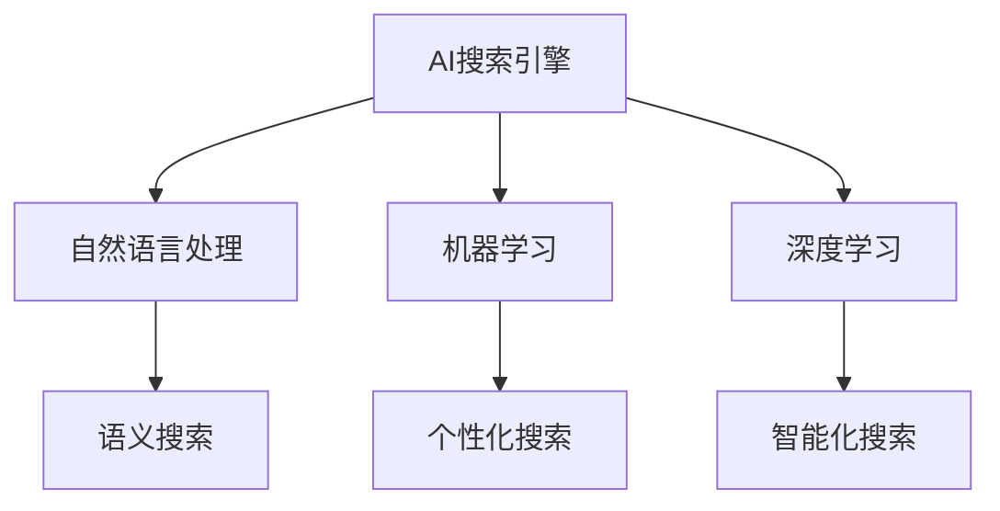

                 

### 第1章：AI搜索引擎的概述

> **关键词**：AI搜索引擎、概述、发展历程、优势、用户体验

AI搜索引擎是一种结合了人工智能技术的搜索引擎，旨在提高搜索的准确性和用户体验。本章将首先定义AI搜索引擎，然后回顾其发展历程，探讨其优势，并重点讨论以用户为中心的搜索引擎体验。

#### 1.1 AI搜索引擎的定义

AI搜索引擎不仅依赖于传统的关键词匹配，还结合了自然语言处理（NLP）、机器学习（ML）和深度学习（DL）等人工智能技术。这些技术使得搜索引擎能够更准确地理解用户的查询意图，提供更加个性化的搜索结果。

**定义**：AI搜索引擎是一种利用人工智能技术，如自然语言处理、机器学习和深度学习，提高搜索准确性、相关性和用户体验的搜索引擎。

#### 1.2 AI搜索引擎的发展历程

AI搜索引擎的发展可以分为几个关键阶段：

1. **基于关键词的搜索引擎（第一阶段）**：
   - 主要依赖于关键词匹配技术，对网页进行索引。
   - 代表产品：早期Google、百度。

2. **语义搜索（第二阶段）**：
   - 利用自然语言处理技术，对搜索意图和语义进行分析。
   - 代表产品：现代Google搜索、百度语义搜索。

3. **个性化搜索（第三阶段）**：
   - 结合用户行为数据，为用户提供个性化的搜索结果。
   - 代表产品：Google个性化搜索、百度个性化推荐。

4. **智能化搜索（第四阶段）**：
   - 利用深度学习技术，实现对话式搜索、自动问答等功能。
   - 代表产品：Google Assistant、百度智能搜索。

#### 1.3 AI搜索引擎的优势

AI搜索引擎的优势主要体现在以下几个方面：

1. **提高搜索准确性**：
   - 通过自然语言处理和机器学习技术，更准确地理解用户的查询意图。
   - 利用深度学习模型，提高搜索结果的相关性。

2. **优化用户体验**：
   - 通过个性化搜索和智能推荐，提高用户满意度。
   - 提供智能问答、语音搜索等新颖的搜索形式。

3. **扩展搜索功能**：
   - 实现对话式搜索、实时搜索、图像搜索等多样化搜索功能。

#### 1.4 以用户为中心的搜索引擎体验

以用户为中心的搜索引擎体验，关注用户的需求和感受，从以下几个方面进行优化：

1. **搜索意图识别**：
   - 准确理解用户的搜索意图，提供相关的搜索结果。

2. **搜索结果排序**：
   - 优化搜索结果的排序算法，提高相关性的展现。

3. **用户体验设计**：
   - 界面友好，操作简单，提升用户的搜索体验。

#### 1.5 小结

AI搜索引擎的发展历程体现了人工智能技术在搜索领域的应用和普及。未来，随着AI技术的不断进步，AI搜索引擎将继续优化搜索质量，提升用户体验，为用户提供更加智能化、个性化的搜索服务。

**核心概念与联系**：



**核心算法原理讲解**：

搜索意图识别的核心算法主要依赖于自然语言处理和机器学习技术。以下是一个简化的伪代码：

```python
def search_intent_recognition(query):
    # 分词处理
    tokens = tokenize(query)
    # 词嵌入
    embeddings = embedding_layer(tokens)
    # 全连接层
    intent_representation = dense_layer(embeddings)
    # 分类器
    intent = classifier(intent_representation)
    return intent
```

在这个伪代码中，`tokenize` 函数用于将查询字符串分割成词元，`embedding_layer` 用于将词元映射到高维向量空间，`dense_layer` 用于实现全连接层，`classifier` 用于分类搜索意图。

**数学模型和公式**：

搜索意图识别中的机器学习模型通常使用softmax回归进行分类。公式如下：

$$
P(y = i | x) = \frac{e^{\theta_i^T x}}{\sum_{j} e^{\theta_j^T x}}
$$

其中，$x$ 是输入特征向量，$\theta_i$ 是第$i$类的权重向量，$y$ 是实际类别。

**项目实战**：

以下是一个简单的Python代码示例，展示了如何使用自然语言处理库（如NLTK）和机器学习库（如scikit-learn）来实现搜索意图识别：

```python
from nltk.tokenize import word_tokenize
from sklearn.feature_extraction.text import CountVectorizer
from sklearn.naive_bayes import MultinomialNB

# 样本数据
data = [
    ("什么是人工智能？", "信息查询"),
    ("如何搭建一个AI模型？", "技术问题"),
    ("人工智能有哪些应用？", "应用场景")
]

# 分词和特征提取
vectorizer = CountVectorizer()
X = vectorizer.fit_transform([text for text, _ in data])
y = [label for _, label in data]

# 训练分类器
classifier = MultinomialNB()
classifier.fit(X, y)

# 搜索意图识别
def search_intent_recognition(query):
    tokens = word_tokenize(query)
    features = vectorizer.transform([tokens])
    return classifier.predict(features)[0]

# 测试
print(search_intent_recognition("人工智能的应用是什么？"))
```

在这个示例中，我们首先使用NLTK库进行分词处理，然后使用scikit-learn库进行特征提取和分类器训练。最后，我们定义了一个函数`search_intent_recognition`，用于实现搜索意图识别。

**代码解读与分析**：

这个简单的代码示例展示了如何使用机器学习技术实现搜索意图识别。首先，我们使用`CountVectorizer`进行特征提取，将文本数据转换为向量表示。然后，我们使用`MultinomialNB`进行分类器训练。最后，我们定义了一个函数，用于接收用户查询，进行分词和特征提取，然后使用训练好的分类器进行预测。

**总结**：

本章介绍了AI搜索引擎的定义、发展历程、优势以及用户体验优化。通过核心概念与联系图、伪代码、数学公式和项目实战，我们深入了解了AI搜索引擎的工作原理和实践方法。下一章将探讨AI技术在搜索引擎中的应用，如自然语言处理、机器学习和深度学习等。


### 第2章 自然语言处理与搜索引擎

自然语言处理（NLP）是人工智能（AI）领域的一个重要分支，它在搜索引擎中的应用极大地提升了搜索效率和用户体验。本章将详细探讨NLP技术的基础知识，以及如何利用这些技术提升搜索质量。

#### 2.1 自然语言处理技术基础

自然语言处理技术主要包括词嵌入、语法分析和语义分析。这些技术为搜索引擎提供了理解用户查询和网页内容的能力。

##### 2.1.1 词嵌入技术

词嵌入（Word Embedding）是将词汇映射到高维向量空间的一种技术。这种映射使得相似的词汇在向量空间中距离较近，从而便于计算机理解和处理。常见的词嵌入技术有：

1. **Word2Vec**：通过训练神经网络模型，将词汇映射到高维向量空间。Word2Vec有两种常见的训练方法：连续词袋（CBOW）和Skip-Gram。
2. **GloVe**：全局向量表示（Global Vectors for Word Representation）是一种基于共现矩阵的词嵌入技术，它通过优化词汇的共现信息来生成词向量。

**词嵌入技术原理**：

- **Word2Vec**：CBOW模型通过上下文词汇的平均值来预测中心词。Skip-Gram模型则通过中心词来预测上下文词汇。
- **GloVe**：通过优化词汇的共现矩阵，使用最小二乘法来计算词向量。

**数学模型**：

- **Word2Vec**：
  $$\text{Output}(z) = \text{softmax}(W \cdot h)$$
  其中，$z$ 是输入的词向量，$W$ 是权重矩阵，$h$ 是隐藏层输出。

- **GloVe**：
  $$\text{loss} = \sum_{i,j} \frac{\text{exp}(W_i \cdot W_j)}{\|W_i\|_2 \|W_j\|_2} - \text{y}_{ij}$$
  其中，$W_i$ 和 $W_j$ 分别是词汇$i$和$j$的词向量，$y_{ij}$ 是共现频率。

##### 2.1.2 语法分析

语法分析（Syntax Analysis）是对文本进行结构化解析，提取句法信息。语法分析有助于搜索引擎更好地理解文本内容，从而提供更准确的搜索结果。

1. **词性标注**：对文本中的每个词进行词性标注，如名词、动词、形容词等。
2. **句法解析**：构建句子的句法树，描述句子中的词汇关系和结构。

**语法分析技术**：

- **基于规则的方法**：使用预定义的语法规则进行解析。
- **基于统计的方法**：使用统计模型，如HMM（隐马尔可夫模型）、CFG（上下文无关文法）等进行解析。

**数学模型**：

- **HMM**：
  $$P(\text{state}_t = j | \text{state}_{t-1} = i) = a_{ij}$$
  $$P(\text{observation}_t = k | \text{state}_t = j) = b_{jk}$$

- **CFG**：
  $$S \rightarrow \alpha$$
  其中，$S$ 是起始符号，$\alpha$ 是产生式。

##### 2.1.3 语义分析

语义分析（Semantic Analysis）是理解文本的含义，进行语义上的判断和推理。语义分析有助于搜索引擎更好地理解用户的查询意图，提供相关的搜索结果。

1. **实体识别**：识别文本中的实体，如人名、地名、组织名等。
2. **关系提取**：提取实体之间的关系，如“刘德华是歌手”中的主谓关系。
3. **语义角色标注**：为句子中的词汇标注语义角色，如施事、受事、工具等。

**语义分析技术**：

- **基于规则的方法**：使用预定义的语义规则进行标注。
- **基于统计的方法**：使用统计模型，如依存句法分析、实体识别等。
- **基于深度学习的方法**：使用深度学习模型，如BERT、GPT等进行语义分析。

**数学模型**：

- **BERT**：
  $$\text{Output} = \text{softmax}(\text{BERT}(\text{input}))$$
  其中，BERT 是预训练的深度学习模型，`input` 是输入文本。

- **GPT**：
  $$\text{Output} = \text{GPT}(\text{input}, \text{context})$$
  其中，GPT 是生成预训练的深度学习模型，`input` 是输入文本，`context` 是上下文信息。

#### 2.2 AI技术提升搜索质量

AI技术对搜索引擎的提升主要体现在相关性排序、实体识别与知识图谱以及搜索结果呈现优化等方面。

##### 2.2.1 相关性排序算法

相关性排序（Relevance Ranking）是搜索引擎的核心功能，它决定了搜索结果的排序顺序。AI技术通过改进排序算法，提高了搜索结果的准确性。

1. **基于统计的方法**：如TF-IDF、向量空间模型（VSM）等。
2. **基于机器学习的方法**：如逻辑回归、SVM、神经网络等。

**数学模型**：

- **TF-IDF**：
  $$\text{tf}(w, d) = \text{词频}$$
  $$\text{idf}(w, D) = \log_2(\frac{N}{|\{d \in D \mid w \in d\}|})$$

- **向量空间模型**：
  $$\text{similarity}(q, d) = \frac{q \cdot d}{\|q\| \|d\|}$$

其中，$q$ 是查询向量，$d$ 是文档向量，$N$ 是文档总数。

##### 2.2.2 实体识别与知识图谱

实体识别（Named Entity Recognition, NER）是识别文本中的命名实体，如人名、地名、组织名等。知识图谱（Knowledge Graph）是用于存储实体及其关系的一种图形结构。

**实体识别技术**：

- **基于规则的方法**：使用预定义的规则进行实体识别。
- **基于统计的方法**：使用统计模型进行实体识别。
- **基于深度学习的方法**：使用深度学习模型，如BERT、CRF（条件随机场）等进行实体识别。

**知识图谱构建**：

1. **数据采集**：从各种数据源收集实体及其关系。
2. **数据预处理**：清洗、去重、标准化等。
3. **实体嵌入**：将实体映射到高维向量空间。

##### 2.2.3 AI驱动的搜索结果呈现优化

AI技术还可以用于优化搜索结果的呈现方式，提高用户体验。

1. **结果摘要**：提取搜索结果的关键信息，生成摘要。
2. **个性化推荐**：根据用户行为和历史，推荐相关的搜索结果。
3. **多模态搜索**：结合文本、图像、语音等多种模态进行搜索。

**项目实战**：

以下是一个简单的Python代码示例，展示了如何使用自然语言处理库（如NLTK）和机器学习库（如scikit-learn）来实现简单的文本相似度计算。

```python
from nltk.tokenize import word_tokenize
from sklearn.feature_extraction.text import TfidfVectorizer
from sklearn.metrics.pairwise import cosine_similarity

# 样本数据
data = [
    "人工智能是一门科学技术，旨在使计算机模拟人类的智能行为。",
    "机器学习是人工智能的一个分支，它通过数据训练模型来模拟智能行为。"
]

# 特征提取
vectorizer = TfidfVectorizer()
X = vectorizer.fit_transform(data)

# 相似度计算
similarity = cosine_similarity(X)[0][1]

print(similarity)
```

在这个示例中，我们首先使用`TfidfVectorizer`进行特征提取，然后使用`cosine_similarity`计算文档之间的相似度。

**代码解读与分析**：

这个简单的代码示例展示了如何使用TF-IDF模型和余弦相似度来计算文本之间的相似度。TF-IDF模型将文本转换为向量表示，而余弦相似度用于计算两个向量之间的角度余弦值，从而衡量文本的相似度。

**总结**：

本章介绍了自然语言处理技术的基础知识，以及如何利用这些技术提升搜索引擎的质量。通过词嵌入、语法分析和语义分析，搜索引擎能够更准确地理解用户查询和网页内容。同时，通过相关性排序算法、实体识别与知识图谱以及搜索结果呈现优化，搜索引擎能够提供更加准确、个性化的搜索服务。下一章将探讨用户行为分析与搜索意图理解，为搜索引擎的个性化优化提供更多见解。

### 第3章 用户行为分析与搜索意图理解

用户行为分析是搜索引擎优化（SEO）的重要组成部分，它通过对用户在搜索过程中的行为数据进行深入分析，帮助搜索引擎更好地理解用户需求，提供更准确的搜索结果。本章将详细探讨用户行为分析的方法、搜索意图的理解以及它们在搜索引擎优化中的应用。

#### 3.1 用户行为分析

用户行为分析涉及对用户在搜索过程中的各种行为进行监测、记录和分析，这些行为包括搜索查询、点击行为、浏览行为、停留时间、跳出率等。通过分析这些行为数据，搜索引擎可以了解用户的兴趣、偏好和搜索习惯，从而优化搜索结果。

**3.1.1 用户搜索行为分析**

用户搜索行为分析主要包括以下几个方面：

1. **搜索关键词分析**：分析用户搜索时使用的关键词，了解用户关注的热点和搜索趋势。
2. **搜索频率**：统计用户在一定时间内的搜索次数，了解用户的活跃度。
3. **搜索时长**：分析用户在搜索过程中的停留时间，了解用户对搜索结果的满意度。
4. **搜索路径**：追踪用户的搜索过程，了解用户的搜索顺序和搜索习惯。

**案例**：

例如，通过对搜索关键词的分析，搜索引擎可以识别出“人工智能教程”是用户搜索频率较高的关键词。这表明用户对人工智能领域有浓厚的兴趣，搜索引擎可以通过推荐相关的教程资源来满足用户需求。

**3.1.2 用户交互行为分析**

用户交互行为分析主要包括用户与搜索结果页面的交互行为，如点击、滑动、收藏等。这些行为反映了用户对搜索结果的响应和兴趣。

1. **点击率（CTR）**：衡量用户对搜索结果的点击情况，是评估搜索结果相关性的重要指标。
2. **跳出率**：衡量用户在搜索结果页面停留时间短且不进行其他操作的比率，用于评估页面质量和用户体验。
3. **浏览深度**：分析用户在搜索结果页面的浏览行为，了解用户对搜索结果的兴趣深度。

**案例**：

假设用户在搜索“人工智能教程”后，点击了某个网站，但很快就离开了该页面，这表明该页面的内容可能未能满足用户需求，搜索引擎可以通过改进页面内容来提高用户满意度。

**3.1.3 用户行为数据的处理与分析**

用户行为数据的处理与分析是一个复杂的过程，通常包括以下几个步骤：

1. **数据收集**：使用日志文件、分析工具等收集用户行为数据。
2. **数据清洗**：去除噪声数据、缺失数据和重复数据，确保数据质量。
3. **数据存储**：将清洗后的数据存储到数据库中，以便进行后续分析。
4. **数据可视化**：使用图表、报表等形式展示分析结果，便于理解和决策。

**工具**：

常见的用户行为分析工具包括Google Analytics、Matomo、Mixpanel等，这些工具可以帮助网站管理员实时监测和分析用户行为。

#### 3.2 搜索意图理解

搜索意图理解是搜索引擎优化中的核心任务，它旨在准确识别用户的搜索意图，提供与之相关的搜索结果。用户在搜索时可能会有不同的意图，如信息查询、商品购买、娱乐休闲等。理解用户的搜索意图可以帮助搜索引擎更好地满足用户需求，提高搜索满意度。

**3.2.1 搜索意图的定义与分类**

搜索意图（Search Intent）是指用户在搜索时想要完成的任务或获得的信息。根据用户的意图，可以将搜索意图分为以下几类：

1. **信息查询**：用户希望获取特定信息，如“人工智能是什么？”。
2. **导航**：用户希望直接访问某个网站或页面，如“百度”。
3. **商品购买**：用户希望购买某种商品，如“购买iPhone 13”。
4. **娱乐休闲**：用户希望获得娱乐或休闲信息，如“搞笑视频”。
5. **其他**：包括但不限于学术研究、食谱查询等。

**3.2.2 搜索意图识别算法**

搜索意图识别（Search Intent Recognition）是利用机器学习算法，从用户的查询中识别其意图。常见的算法有：

1. **基于规则的方法**：使用预定义的规则，根据查询关键词进行分类。
2. **基于机器学习的方法**：如SVM、神经网络等，通过训练模型进行意图分类。
3. **基于深度学习的方法**：如BERT、GPT等，通过大型预训练模型进行意图识别。

**算法原理**：

- **基于规则的方法**：例如，如果查询中包含“购买”，则分类为商品购买意图。
- **基于机器学习的方法**：
  $$y = \text{sign}(\text{w} \cdot \text{x} + b)$$
  其中，$x$ 是输入特征向量，$w$ 是权重向量，$b$ 是偏置项。
- **基于深度学习的方法**：例如，BERT模型通过预训练和微调，实现意图识别。

**3.2.3 搜索意图理解在搜索引擎中的应用**

搜索意图理解在搜索引擎中的应用主要包括：

1. **搜索结果排序**：根据用户意图，优化搜索结果的排序，提高相关性。
2. **搜索结果呈现**：根据用户意图，调整搜索结果的呈现方式，如提供商品购买链接、导航链接等。
3. **个性化推荐**：根据用户意图和兴趣，推荐相关的搜索结果和内容。

**案例**：

例如，当用户搜索“购买iPhone 13”时，搜索引擎可以识别出用户的购买意图，并提供相关的购物网站链接和商品详情，以提高用户满意度。

#### 3.3 搜索意图理解在搜索引擎优化中的应用

搜索意图理解在搜索引擎优化中的应用，主要体现在以下几个方面：

1. **提升搜索结果的准确性**：通过理解用户意图，提供更准确的搜索结果，减少无关信息的展示。
2. **提高用户体验**：根据用户意图，提供个性化的搜索结果，提高用户满意度和粘性。
3. **优化搜索策略**：基于意图数据，调整搜索引擎的策略和算法，提高搜索质量。

**实战案例**：

以下是一个简单的Python代码示例，展示了如何使用自然语言处理库（如NLTK）和机器学习库（如scikit-learn）来实现搜索意图识别。

```python
from nltk.tokenize import word_tokenize
from sklearn.feature_extraction.text import CountVectorizer
from sklearn.naive_bayes import MultinomialNB

# 样本数据
data = [
    ("购买iPhone 13", "商品购买"),
    ("百度", "导航"),
    ("什么是人工智能？", "信息查询"),
    ("搞笑视频", "娱乐休闲")
]

# 特征提取
vectorizer = CountVectorizer()
X = vectorizer.fit_transform([text for text, _ in data])
y = [label for _, label in data]

# 训练分类器
classifier = MultinomialNB()
classifier.fit(X, y)

# 搜索意图识别
def search_intent_recognition(query):
    tokens = word_tokenize(query)
    features = vectorizer.transform([tokens])
    return classifier.predict(features)[0]

# 测试
print(search_intent_recognition("购买iPhone 13"))
```

在这个示例中，我们首先使用NLTK库进行分词处理，然后使用scikit-learn库进行特征提取和分类器训练。最后，我们定义了一个函数`search_intent_recognition`，用于实现搜索意图识别。

**代码解读与分析**：

这个简单的代码示例展示了如何使用机器学习技术实现搜索意图识别。首先，我们使用`CountVectorizer`进行特征提取，将文本数据转换为向量表示。然后，我们使用`MultinomialNB`进行分类器训练。最后，我们定义了一个函数，用于接收用户查询，进行分词和特征提取，然后使用训练好的分类器进行预测。

**总结**：

本章介绍了用户行为分析和搜索意图理解的方法和技巧。通过分析用户行为数据，搜索引擎可以更好地理解用户需求，提供更准确的搜索结果。同时，通过搜索意图识别，搜索引擎能够为用户提供个性化的搜索体验，提高用户满意度。下一章将探讨个性化搜索与推荐系统的技术原理和应用，为搜索引擎的优化提供更多思路。

### 第4章 个性化搜索与推荐系统

个性化搜索和推荐系统是提升搜索引擎用户体验的关键技术。个性化搜索通过分析用户行为和历史数据，为用户提供定制化的搜索结果。推荐系统则通过预测用户的兴趣和偏好，向用户推荐相关的信息。本章将详细介绍个性化搜索技术、推荐系统的基础原理及其在搜索引擎中的应用。

#### 4.1 个性化搜索技术

个性化搜索技术旨在根据用户的行为和兴趣，为用户提供更加相关的搜索结果。个性化搜索的核心在于理解用户的个人喜好和行为模式，从而做出个性化的决策。

**4.1.1 个性化搜索的核心原理**

个性化搜索的核心原理包括以下几个方面：

1. **用户行为数据收集**：收集用户在搜索过程中的各种行为数据，如搜索关键词、点击行为、浏览时长等。
2. **用户兴趣建模**：利用机器学习算法，对用户行为数据进行分析，构建用户兴趣模型。
3. **搜索结果个性化**：根据用户兴趣模型，调整搜索结果的排序和展示方式，提高搜索结果的个性化程度。

**4.1.2 个性化搜索算法**

个性化搜索算法主要包括以下几种：

1. **基于协同过滤的推荐算法**：协同过滤（Collaborative Filtering）是一种基于用户行为数据推荐的方法。它分为两种类型：用户基于的协同过滤（User-Based）和项目基于的协同过滤（Item-Based）。用户基于的协同过滤通过找到与目标用户相似的其他用户，推荐这些用户喜欢的项目。项目基于的协同过滤则是通过找到与目标项目相似的其他项目，推荐给用户。
2. **基于内容的推荐算法**：基于内容的推荐算法（Content-Based Filtering）通过分析项目的内容特征，为用户推荐与其兴趣相似的项目。这种方法通常需要先对项目进行内容特征提取，如关键词、主题等，然后根据用户的历史行为和兴趣，为用户推荐相关的内容。
3. **混合推荐算法**：混合推荐算法（Hybrid Recommender System）结合了协同过滤和基于内容的推荐算法，通过综合用户行为和项目内容特征，提供更加精准的推荐结果。

**4.1.3 个性化搜索系统的实现**

个性化搜索系统的实现主要包括以下几个步骤：

1. **数据收集与预处理**：收集用户行为数据，并进行预处理，如数据清洗、去噪、特征提取等。
2. **用户兴趣建模**：利用机器学习算法，如聚类、回归分析、神经网络等，构建用户兴趣模型。
3. **搜索结果个性化**：根据用户兴趣模型，调整搜索结果的排序和展示方式。例如，可以将用户喜欢的网站或内容排在搜索结果的前面，提供更加个性化的搜索体验。

**案例**：

以下是一个简单的Python代码示例，展示了如何使用协同过滤算法实现个性化搜索。

```python
import numpy as np
from sklearn.metrics.pairwise import cosine_similarity

# 假设用户行为数据为用户-项目评分矩阵
ratings = np.array([[5, 3, 0, 1],
                    [1, 0, 0, 4],
                    [0, 2, 5, 0]])

# 计算用户-用户相似度矩阵
user_similarity = cosine_similarity(ratings)

# 假设用户对项目3感兴趣
target_user_index = 2

# 为用户推荐类似的其他用户喜欢的项目
similar_users = user_similarity[target_user_index]
recommended_items = np.argmax(similar_users)

print(recommended_items)
```

在这个示例中，我们首先使用余弦相似度计算用户之间的相似度。然后，我们找到与目标用户相似的其他用户，并推荐这些用户喜欢的项目。

**代码解读与分析**：

这个简单的代码示例展示了如何使用协同过滤算法实现个性化搜索。首先，我们使用余弦相似度计算用户之间的相似度。然后，我们找到与目标用户相似的其他用户，并推荐这些用户喜欢的项目。这种方法能够根据用户的兴趣为用户提供个性化的搜索结果。

#### 4.2 推荐系统与搜索引擎的结合

推荐系统与搜索引擎的结合，可以进一步提升用户的搜索体验。通过推荐系统，搜索引擎不仅能够提供搜索结果，还能为用户提供相关的推荐内容，增加用户停留时间和互动。

**4.2.1 推荐系统的基础原理**

推荐系统（Recommender System）是一种基于用户兴趣和内容特征预测用户可能喜欢的项目的方法。推荐系统的基础原理包括以下几个方面：

1. **用户行为分析**：通过分析用户的行为数据，如浏览历史、购买记录等，构建用户兴趣模型。
2. **内容特征提取**：对项目的内容特征进行提取，如关键词、主题、标签等。
3. **推荐算法**：利用协同过滤、基于内容的推荐算法、混合推荐算法等，为用户推荐相关的项目。

**4.2.2 推荐系统在搜索引擎中的应用**

推荐系统在搜索引擎中的应用主要体现在以下几个方面：

1. **搜索结果个性化**：根据用户的兴趣和行为，调整搜索结果的排序和展示方式，提高搜索结果的个性化程度。
2. **内容推荐**：在搜索结果页面或搜索结果之外，为用户推荐相关的文章、视频、商品等，增加用户互动和停留时间。
3. **广告推荐**：根据用户的兴趣和行为，为用户推荐相关的广告内容，提高广告点击率和转化率。

**案例**：

以下是一个简单的Python代码示例，展示了如何使用基于内容的推荐算法实现搜索结果个性化。

```python
import numpy as np
from sklearn.metrics.pairwise import cosine_similarity

# 假设搜索结果为项目，每个项目有一个关键词列表
search_results = [
    ["人工智能", "机器学习", "深度学习"],
    ["股票市场", "投资策略", "财务分析"],
    ["旅游攻略", "景点推荐", "户外活动"]
]

# 假设用户兴趣为关键词列表
user_interest = ["旅游攻略", "户外活动"]

# 计算项目-项目相似度矩阵
item_similarity = cosine_similarity([item for item in search_results])

# 为用户推荐相似的项目
target_item_index = search_results.index(["旅游攻略", "户外活动"])
recommended_items = np.argmax(item_similarity[target_item_index])

print(search_results[recommended_items])
```

在这个示例中，我们首先使用余弦相似度计算项目之间的相似度。然后，我们找到与用户兴趣相似的其他项目，并推荐这些项目。

**代码解读与分析**：

这个简单的代码示例展示了如何使用基于内容的推荐算法实现搜索结果个性化。首先，我们使用余弦相似度计算项目之间的相似度。然后，我们找到与用户兴趣相似的其他项目，并推荐这些项目。这种方法能够根据用户的兴趣为用户提供个性化的搜索结果。

#### 4.3 个性化搜索与推荐系统的协同优化

个性化搜索与推荐系统的协同优化，可以进一步提升用户的搜索体验。通过协同优化，搜索引擎不仅能够提供个性化的搜索结果，还能为用户提供相关的推荐内容，增加用户互动和停留时间。

**4.3.1 数据融合**

数据融合是将用户行为数据、搜索数据、推荐系统数据等进行整合，构建一个统一的用户兴趣模型。通过数据融合，搜索引擎可以更全面地了解用户的需求和兴趣，提高个性化搜索和推荐的效果。

**4.3.2 算法协同**

算法协同是指将个性化搜索和推荐系统的算法进行整合，实现协同优化。例如，可以将协同过滤算法和基于内容的推荐算法相结合，通过综合用户行为和内容特征，为用户提供更精准的推荐结果。

**4.3.3 用户体验优化**

用户体验优化是指通过不断调整和优化个性化搜索和推荐系统的参数和策略，提高用户的满意度。例如，可以通过用户反馈数据，不断优化搜索结果和推荐内容的排序和展示方式，提高用户体验。

**总结**：

本章介绍了个性化搜索和推荐系统的基础原理、实现方法以及它们在搜索引擎中的应用。通过个性化搜索，搜索引擎可以更好地满足用户需求，提高搜索结果的准确性。通过推荐系统，搜索引擎可以为用户提供相关的推荐内容，增加用户互动和停留时间。个性化搜索与推荐系统的协同优化，可以进一步提升用户的搜索体验，提高搜索引擎的整体质量。下一章将探讨AI与搜索引擎的未来发展趋势，为未来的搜索引擎优化提供新的思路。

### 第5章 AI与搜索引擎的未来发展趋势

随着人工智能（AI）技术的迅猛发展，搜索引擎也在不断演进，朝着更加智能化、个性化、高效化的方向发展。本章将探讨AI技术在搜索引擎领域的未来发展趋势，包括技术创新、商业模式、生态构建等方面。

#### 5.1 搜索引擎的技术创新

AI技术的不断进步为搜索引擎带来了新的机遇和挑战。以下是一些关键的技术创新方向：

**5.1.1 大模型与搜索的深度融合**

大型预训练模型，如BERT、GPT等，在自然语言处理领域取得了显著的成果。未来，这些大模型将更加深入地融入搜索引擎，提供更准确、更智能的搜索服务。例如，通过大模型，搜索引擎可以更好地理解用户查询的上下文和意图，从而提供更加个性化的搜索结果。

**5.1.2 自动问答与交互式搜索**

自动问答（AI问答）技术正在快速发展，未来将更加广泛应用于搜索引擎。通过AI问答，用户可以以自然语言的方式提问，搜索引擎能够实时回答用户的问题。交互式搜索则进一步提升了用户的参与感和互动性，用户可以通过对话与搜索引擎进行互动，实现更加智能化的搜索体验。

**5.1.3 搜索引擎的智能化演进**

智能化搜索是搜索引擎发展的必然趋势。未来，搜索引擎将更加智能化，能够根据用户的历史行为、兴趣和需求，提供个性化的搜索建议和推荐。同时，搜索引擎将能够自动处理复杂的查询任务，如多语言翻译、知识图谱查询等，实现全方位的智能化服务。

#### 5.2 搜索引擎的商业模式与生态构建

随着AI技术的应用，搜索引擎的商业模式也在不断创新。以下是一些关键的商业模式和生态构建方向：

**5.2.1 搜索引擎的商业化路径**

- **广告收入**：通过展示相关广告，搜索引擎可以从中获得广告收入。未来，随着AI技术的应用，广告的精准度和投放效率将进一步提升，为搜索引擎带来更多的商业机会。
- **付费搜索**：用户可以通过付费获取更高质量的搜索结果或特定的信息。例如，企业可以通过付费购买关键词广告，提高在搜索结果中的曝光率。
- **数据服务**：搜索引擎可以通过提供用户行为数据、市场分析报告等数据服务，为企业提供决策支持，实现数据变现。

**5.2.2 搜索引擎的生态系统构建**

- **平台合作**：搜索引擎可以通过与内容提供商、技术公司、广告商等建立合作关系，构建一个开放、共享的生态系统。通过合作，搜索引擎可以获取更多的数据资源和技术支持，提升搜索服务的质量和多样性。
- **开发者社区**：鼓励开发者社区参与搜索引擎的技术创新和生态构建。通过开放API、提供开发工具包等，搜索引擎可以吸引更多开发者加入，共同推动搜索技术的发展。

#### 5.3 AI驱动的搜索生态的未来展望

未来，AI驱动的搜索生态将呈现以下趋势：

**5.3.1 智能化升级**

随着AI技术的不断发展，搜索引擎将实现更加智能化的升级。通过引入大模型、自动问答、智能推荐等技术，搜索引擎将能够更好地理解用户需求，提供个性化、智能化的搜索服务。

**5.3.2 生态协同**

AI驱动的搜索生态将实现跨领域、跨平台的协同。通过平台合作、开发者社区等机制，搜索引擎将能够整合更多的数据资源和技术支持，实现更高效、更智能的搜索服务。

**5.3.3 用户中心**

以用户为中心是未来搜索生态的核心。搜索引擎将更加关注用户需求，通过个性化搜索、智能推荐等技术，提升用户体验，增强用户满意度。

**5.3.4 开放共享**

未来，搜索生态将更加开放和共享。通过开放API、共享数据资源等机制，搜索引擎将能够更好地支持创新和发展，推动搜索技术的进步。

**总结**：

AI技术的快速发展为搜索引擎带来了前所未有的机遇。未来，搜索引擎将朝着更加智能化、个性化、高效化的方向发展。通过技术创新、商业模式创新和生态构建，搜索引擎将能够更好地满足用户需求，提升搜索服务的质量和多样性。展望未来，AI驱动的搜索生态将实现智能化升级、生态协同、用户中心、开放共享等趋势，为用户提供更加优质、便捷的搜索体验。

### 附录

#### 附录A：常用AI搜索引擎与工具介绍

- **Google Search**：Google搜索是全球最流行的搜索引擎，结合了AI技术，提供高效的搜索结果和智能的搜索建议。
- **Bing**：微软的Bing搜索引擎，利用AI技术优化搜索结果，并提供个性化推荐。
- **百度搜索**：百度的搜索引擎，结合了AI技术，提供中文搜索服务，并支持语音搜索和智能问答。
- **搜狗搜索**：搜狗的搜索引擎，集成了语音搜索、图片搜索和AI智能推荐等功能。

#### 附录B：相关参考资料

- **《深度学习与搜索引擎》**：详细介绍了深度学习在搜索引擎中的应用和技术原理。
- **《AI驱动的搜索引擎优化》**：探讨了AI技术在搜索引擎优化中的应用和策略。
- **《个性化搜索与推荐系统》**：介绍了个性化搜索和推荐系统的技术原理和实践案例。

#### 附录C：常见问题与解答

1. **什么是AI搜索引擎？**
   - AI搜索引擎是一种结合了人工智能技术的搜索引擎，通过自然语言处理、机器学习和深度学习等技术，提高搜索的准确性和用户体验。

2. **AI搜索引擎如何提升搜索质量？**
   - AI搜索引擎通过自然语言处理技术理解用户查询意图，利用机器学习算法优化搜索结果排序，并通过深度学习模型提高搜索结果的相关性。

3. **个性化搜索与推荐系统的区别是什么？**
   - 个性化搜索是根据用户历史行为和兴趣，提供更加相关的搜索结果；推荐系统则是基于用户的行为数据和内容特征，推荐用户可能感兴趣的信息或商品。

4. **如何评估AI搜索引擎的效果？**
   - 评估AI搜索引擎的效果可以从多个维度进行，包括搜索结果的准确性、用户的点击率、用户满意度等。

### 作者信息

- **作者：AI天才研究院/AI Genius Institute & 禅与计算机程序设计艺术 /Zen And The Art of Computer Programming**。

