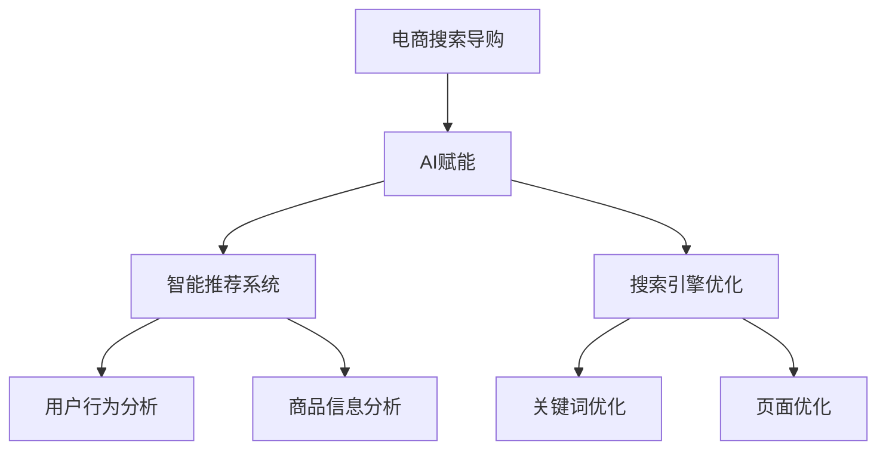
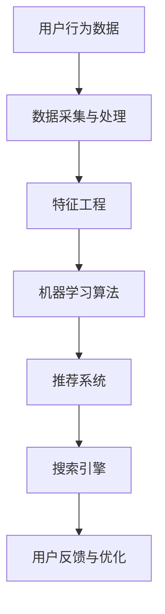
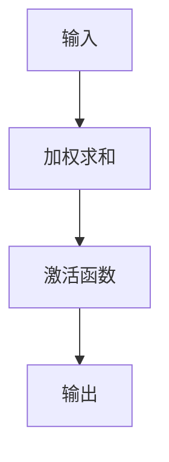
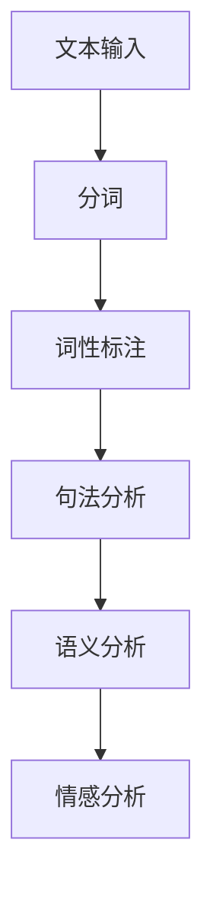
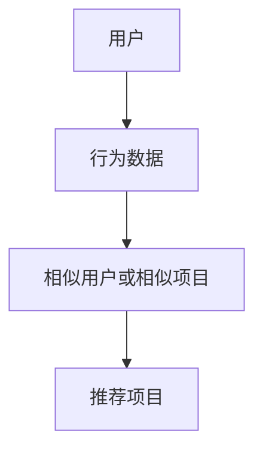
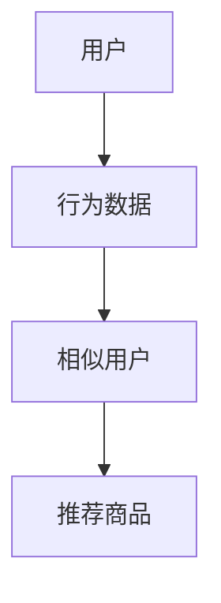
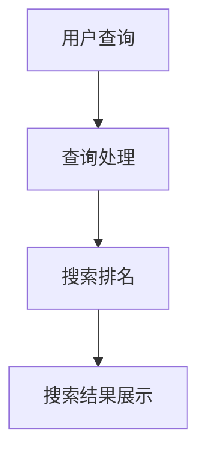
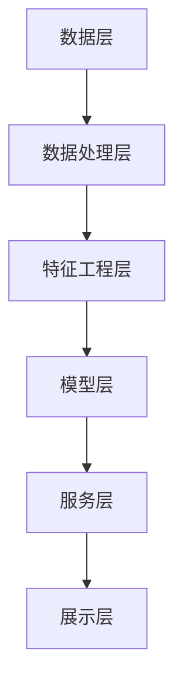

                 

# AI赋能电商搜索导购：案例分析与实践经验分享

> **关键词：** AI、电商搜索、导购、智能推荐、搜索引擎优化、案例分析、实践经验

> **摘要：** 本文深入探讨了AI在电商搜索导购领域的应用，通过实际案例分析，分享了AI赋能电商搜索导购的成功实践。文章首先概述了AI赋能电商搜索导购的基础知识，然后详细分析了AI在智能推荐系统和搜索引擎优化中的应用，最后讨论了AI赋能电商搜索导购的未来趋势和实践经验。

## 《AI赋能电商搜索导购：案例分析与实践经验分享》目录大纲

### 第一部分：AI赋能电商搜索导购基础

#### 第1章：AI赋能电商搜索导购概述

##### 1.1 电商搜索导购的挑战与机遇

##### 1.2 AI在电商搜索导购中的应用

##### 1.3 AI赋能电商搜索导购的总体框架

#### 第2章：AI核心技术基础

##### 2.1 机器学习与深度学习基础

##### 2.2 自然语言处理技术

##### 2.3 推荐系统算法原理

### 第二部分：AI赋能电商搜索导购案例分析

#### 第3章：电商搜索导购AI案例解析

##### 3.1 案例一：某电商平台智能搜索系统

###### 3.1.1 案例背景

###### 3.1.2 案例解决方案

###### 3.1.3 案例效果评估

#### 第4章：AI赋能电商搜索导购应用场景分析

##### 4.1 智能推荐系统

###### 4.1.1 推荐算法原理

###### 4.1.2 案例分析

##### 4.2 搜索引擎优化

###### 4.2.1 搜索引擎工作原理

###### 4.2.2 搜索引擎优化策略

#### 第5章：AI赋能电商搜索导购实战

##### 5.1 实战一：构建智能推荐系统

###### 5.1.1 系统架构设计

###### 5.1.2 数据采集与预处理

###### 5.1.3 算法实现与优化

##### 5.2 实战二：搜索引擎优化

###### 5.2.1 搜索引擎优化策略

###### 5.2.2 SEO工具应用

### 第三部分：实践经验与优化

#### 第6章：AI赋能电商搜索导购实践经验

##### 6.1 数据驱动策略

##### 6.2 用户体验优化

##### 6.3 持续迭代与优化

#### 第7章：AI赋能电商搜索导购未来趋势

##### 7.1 技术发展趋势

##### 7.2 行业应用前景

##### 7.3 挑战与应对策略

### 附录

#### 附录A：AI赋能电商搜索导购技术工具

##### A.1 深度学习框架应用

##### A.2 自然语言处理工具

##### A.3 推荐系统框架

#### 附录B：案例项目代码解析

##### B.1 智能推荐系统代码解析

##### B.2 搜索引擎优化代码解析

#### 附录C：资源与参考文献

##### C.1 AI技术资源

##### C.2 电商搜索导购相关文献

##### C.3 案例研究资料来源

#### Mermaid 流程图



### 第一部分：AI赋能电商搜索导购基础

#### 第1章：AI赋能电商搜索导购概述

##### 1.1 电商搜索导购的挑战与机遇

在电商行业飞速发展的今天，电商搜索导购已成为用户获取商品信息和购买路径的重要环节。然而，传统的电商搜索导购面临着诸多挑战：

1. **信息爆炸**：电商平台的商品种类繁多，用户在搜索时往往难以快速定位所需商品。
2. **用户体验**：传统搜索结果往往依赖于关键词匹配，用户体验较差，难以满足个性化需求。
3. **搜索效率**：传统的搜索引擎需要大量时间来处理查询，影响了用户搜索体验。

面对这些挑战，AI技术为电商搜索导购带来了新的机遇：

1. **智能推荐**：通过机器学习和深度学习算法，可以为用户提供个性化的商品推荐，提高搜索效率。
2. **自然语言处理**：自然语言处理技术使得用户可以通过自然语言进行搜索，提升了搜索的便捷性和用户体验。
3. **个性化搜索**：AI技术可以根据用户的历史行为和偏好，提供个性化的搜索结果，满足用户个性化需求。

##### 1.2 AI在电商搜索导购中的应用

AI技术在电商搜索导购中的应用主要包括以下几个方面：

1. **智能推荐系统**：通过分析用户行为和商品特征，为用户推荐可能感兴趣的商品。
2. **搜索引擎优化**：利用自然语言处理和机器学习技术，优化搜索结果，提升搜索的准确性和用户体验。
3. **用户行为分析**：通过对用户行为数据进行分析，了解用户购买习惯，为营销策略提供支持。
4. **商品信息分析**：利用自然语言处理技术，从商品描述中提取关键信息，提升搜索和推荐的准确性。

##### 1.3 AI赋能电商搜索导购的总体框架

AI赋能电商搜索导购的总体框架可以分为以下几个关键模块：

1. **数据采集与处理**：采集用户行为数据和商品信息数据，并进行数据清洗和处理。
2. **特征工程**：从原始数据中提取有用的特征，为后续的机器学习算法提供输入。
3. **机器学习算法**：使用机器学习算法进行用户行为预测和商品推荐。
4. **推荐系统**：构建推荐系统，根据用户特征和商品特征进行个性化推荐。
5. **搜索引擎**：利用搜索引擎技术，优化搜索结果，提升用户体验。
6. **用户反馈与优化**：收集用户反馈，不断优化推荐和搜索算法。

以下是一个简化的AI赋能电商搜索导购的Mermaid流程图：



#### 第2章：AI核心技术基础

##### 2.1 机器学习与深度学习基础

机器学习（Machine Learning）是AI的核心技术之一，其目标是让计算机从数据中学习规律，自动进行决策和预测。深度学习（Deep Learning）是机器学习的一个分支，通过构建深度神经网络（Deep Neural Networks）来实现复杂的特征提取和模式识别。

1. **机器学习基本概念**：
   - **模型**：机器学习模型是对学习到的规律进行表示和预测的函数。
   - **特征**：特征是模型输入的关键信息，用于描述数据的基本属性。
   - **训练**：训练是机器学习模型从数据中学习规律的过程。
   - **预测**：预测是使用训练好的模型对新数据进行预测的过程。

2. **深度学习基本概念**：
   - **神经网络**：神经网络是一种模仿生物神经系统的计算模型。
   - **神经元**：神经元是神经网络的基本单元，用于进行信息的传递和处理。
   - **激活函数**：激活函数用于确定神经元是否被激活，常用的激活函数有Sigmoid、ReLU等。
   - **梯度下降**：梯度下降是一种用于优化神经网络参数的算法，通过迭代更新参数以最小化损失函数。

以下是一个简化的神经网络模型示意图：



##### 2.2 自然语言处理技术

自然语言处理（Natural Language Processing，NLP）是AI在处理人类语言方面的技术，其主要目标是使计算机能够理解和生成自然语言。NLP技术包括以下几个方面：

1. **分词**：将文本划分为单词或短语的步骤，是NLP处理的第一步。
2. **词性标注**：为文本中的每个单词分配词性（如名词、动词、形容词等），用于理解单词在句子中的角色。
3. **句法分析**：分析句子的结构，确定单词之间的语法关系，如主谓宾关系等。
4. **语义分析**：理解句子的含义，确定句子中的实体、事件和关系。
5. **情感分析**：分析文本的情感倾向，如正面、负面或中性。

以下是一个简化的NLP处理流程示意图：



##### 2.3 推荐系统算法原理

推荐系统（Recommendation System）是一种通过预测用户对项目的兴趣，从而向用户推荐项目的系统。推荐系统通常基于以下几种算法原理：

1. **基于内容的推荐**：基于用户对项目的兴趣特征，推荐具有相似兴趣特征的项目。
   - **相似性计算**：计算用户和项目之间的相似度，常用的相似性度量方法有余弦相似度和皮尔逊相关系数。
   - **推荐算法**：根据相似度度量结果，为用户推荐相似的项目。

2. **协同过滤推荐**：基于用户的行为数据，发现相似用户或相似项目，从而进行推荐。
   - **用户基于协同过滤**：为用户推荐与已购买或喜欢的项目相似的用户购买或喜欢的项目。
   - **项目基于协同过滤**：为用户推荐与已购买或喜欢的项目相似的项目。

3. **矩阵分解**：将用户和项目的高维数据矩阵分解为两个低维矩阵，通过低维矩阵的交互来预测用户对项目的兴趣。

以下是一个简化的协同过滤推荐算法原理示意图：



### 第二部分：AI赋能电商搜索导购案例分析

#### 第3章：电商搜索导购AI案例解析

##### 3.1 案例一：某电商平台智能搜索系统

###### 3.1.1 案例背景

某大型电商平台面临着用户搜索效率低、用户体验差的问题。传统搜索系统依赖于关键词匹配，难以满足用户的个性化需求。为了提升搜索效率和用户体验，该电商平台决定采用AI技术，构建智能搜索系统。

###### 3.1.2 案例解决方案

该电商平台智能搜索系统的解决方案包括以下几个关键模块：

1. **数据采集与处理**：
   - 采集用户搜索日志、点击日志、购买行为等数据。
   - 进行数据清洗、去重和归一化处理。

2. **特征工程**：
   - 提取用户和商品的特征，如搜索关键词、商品类别、用户历史行为等。
   - 使用向量空间模型（Vector Space Model）对特征进行表示。

3. **机器学习算法**：
   - 使用基于内容的推荐算法，为用户推荐与搜索关键词相关的商品。
   - 使用协同过滤算法，为用户推荐与历史行为相似的用户的购买商品。

4. **推荐系统**：
   - 构建推荐模型，将用户和商品的特征输入模型，输出推荐结果。
   - 对推荐结果进行排序，优化推荐效果。

5. **搜索引擎**：
   - 利用搜索引擎技术，对用户查询进行解析，提取关键词。
   - 根据关键词和用户特征，从推荐系统中获取相关商品，生成搜索结果。

6. **用户反馈与优化**：
   - 收集用户对搜索结果的反馈，如点击、购买等行为。
   - 使用反馈数据对推荐系统进行迭代优化，提升搜索效果。

###### 3.1.3 案例效果评估

通过智能搜索系统的实施，该电商平台取得了显著的成效：

1. **搜索效率提升**：智能搜索系统能够更快地返回相关商品，提高了用户搜索效率。

2. **用户体验提升**：智能搜索系统能够根据用户的兴趣和偏好，提供个性化的搜索结果，提升了用户体验。

3. **转化率提高**：通过智能推荐系统，用户更容易找到所需商品，转化率得到了显著提升。

4. **用户满意度提升**：用户对智能搜索系统的满意度较高，平台用户粘性得到提升。

##### 3.2 案例二：某跨境电商平台的智能推荐系统

###### 3.2.1 案例背景

某跨境电商平台希望通过智能推荐系统，提升用户购买转化率和销售额。传统推荐系统效果不佳，无法满足平台的个性化推荐需求。为了提升推荐效果，该跨境电商平台决定采用AI技术，构建智能推荐系统。

###### 3.2.2 案例解决方案

该跨境电商平台智能推荐系统的解决方案包括以下几个关键模块：

1. **数据采集与处理**：
   - 采集用户行为数据，如浏览记录、购买历史、收藏商品等。
   - 采集商品信息数据，如商品描述、价格、类别等。
   - 进行数据清洗、去重和归一化处理。

2. **特征工程**：
   - 提取用户特征，如用户浏览时间、购买频率、兴趣爱好等。
   - 提取商品特征，如商品类别、价格、销量等。

3. **机器学习算法**：
   - 使用基于内容的推荐算法，为用户推荐与浏览历史相关的商品。
   - 使用协同过滤算法，为用户推荐与历史行为相似的用户的购买商品。

4. **推荐系统**：
   - 构建推荐模型，将用户和商品的特征输入模型，输出推荐结果。
   - 对推荐结果进行排序，优化推荐效果。

5. **推荐结果展示**：
   - 将推荐结果以可视化方式展示给用户，提升推荐系统的易用性。

6. **用户反馈与优化**：
   - 收集用户对推荐结果的反馈，如点击、购买等行为。
   - 使用反馈数据对推荐系统进行迭代优化，提升推荐效果。

###### 3.2.3 案例效果评估

通过智能推荐系统的实施，该跨境电商平台取得了显著的成效：

1. **购买转化率提高**：智能推荐系统能够更好地满足用户的个性化需求，购买转化率得到了显著提升。

2. **销售额提升**：智能推荐系统的有效实施，使得平台的销售额得到了显著增长。

3. **用户满意度提升**：用户对智能推荐系统的满意度较高，平台用户粘性得到提升。

4. **推荐效果优化**：通过用户反馈，不断优化推荐算法，使得推荐效果得到持续提升。

### 第三部分：AI赋能电商搜索导购应用场景分析

#### 第4章：AI赋能电商搜索导购应用场景分析

##### 4.1 智能推荐系统

智能推荐系统是AI赋能电商搜索导购的重要应用场景之一。通过分析用户行为和商品特征，智能推荐系统可以为用户提供个性化的商品推荐，提升用户购买体验和满意度。

###### 4.1.1 推荐算法原理

智能推荐系统的核心是推荐算法，其原理主要包括以下两个方面：

1. **基于内容的推荐**：
   - 基于内容的推荐算法通过分析用户对商品内容的偏好，为用户推荐具有相似内容的商品。
   - 算法原理：
     1. 提取用户和商品的特征，如关键词、标签等。
     2. 计算用户和商品之间的相似度。
     3. 根据相似度为用户推荐相似的商品。

2. **协同过滤推荐**：
   - 协同过滤推荐算法通过分析用户之间的相似性和用户对商品的相似性，为用户推荐其他用户喜欢的商品。
   - 算法原理：
     1. 构建用户行为矩阵，记录用户对商品的评分或购买行为。
     2. 计算用户之间的相似度。
     3. 计算用户对商品的相似度。
     4. 根据相似度为用户推荐其他用户喜欢的商品。

以下是一个简化的协同过滤推荐算法原理示意图：



###### 4.1.2 案例分析

以某电商平台为例，该平台采用了基于内容的推荐和协同过滤推荐相结合的智能推荐系统。通过以下步骤，该平台实现了个性化的商品推荐：

1. **用户特征提取**：提取用户的历史浏览记录、购买记录、收藏记录等特征，用于构建用户画像。

2. **商品特征提取**：提取商品的关键词、标签、分类等信息，用于构建商品特征库。

3. **相似度计算**：
   - 基于内容的相似度计算：计算用户和商品之间的相似度，可以使用余弦相似度、皮尔逊相关系数等方法。
   - 协同过滤的相似度计算：计算用户之间的相似度，可以使用基于用户行为的相似度度量方法，如余弦相似度、皮尔逊相关系数等。

4. **推荐结果生成**：根据用户特征和商品特征，计算用户对商品的相似度，并根据相似度为用户推荐商品。

5. **推荐结果展示**：将推荐结果以可视化方式展示给用户，如商品列表、图片墙等。

通过智能推荐系统的实施，该电商平台取得了以下成效：

1. **提升用户满意度**：智能推荐系统能够更好地满足用户的个性化需求，提升了用户的满意度。

2. **提高购买转化率**：智能推荐系统为用户推荐了更符合用户兴趣的商品，提高了购买转化率。

3. **降低流失率**：智能推荐系统能够更好地留住用户，降低了用户的流失率。

4. **增加销售额**：智能推荐系统有效地提升了销售额，为电商平台创造了更多的价值。

##### 4.2 搜索引擎优化

搜索引擎优化（SEO，Search Engine Optimization）是AI赋能电商搜索导购的另一个重要应用场景。通过优化搜索引擎的搜索结果，提升用户获取商品的便捷性和准确性，从而提高用户满意度和购买转化率。

###### 4.2.1 搜索引擎工作原理

搜索引擎的工作原理主要包括以下几个关键步骤：

1. **爬虫**：搜索引擎通过爬虫（Crawler）爬取互联网上的网页，获取网页内容。

2. **索引**：搜索引擎对爬取到的网页内容进行索引（Indexing），建立索引数据库，以便快速检索。

3. **查询处理**：用户在搜索引擎中输入查询关键词，搜索引擎通过查询处理（Query Processing）对查询关键词进行分析，确定查询意图。

4. **搜索排名**：搜索引擎根据索引数据库和查询意图，对查询结果进行排序（Search Ranking），将最相关的结果展示给用户。

5. **搜索结果展示**：搜索引擎将搜索结果以网页形式展示给用户。

以下是一个简化的搜索引擎工作原理示意图：



###### 4.2.2 搜索引擎优化策略

为了提升搜索引擎的搜索结果质量，搜索引擎优化需要从以下几个方面进行策略优化：

1. **关键词优化**：分析用户搜索习惯和搜索意图，选取与用户需求高度相关的高频关键词，优化网页关键词布局。

2. **内容优化**：优化网页内容，确保网页内容丰富、结构清晰，符合用户搜索意图。

3. **页面优化**：优化网页结构、加载速度和用户体验，提升网页质量。

4. **链接优化**：建立高质量的内外链，提高网页的权威性和权重。

5. **移动端优化**：优化移动端页面，确保网页在移动设备上具有良好的用户体验。

6. **数据分析与反馈**：通过数据分析，了解用户搜索行为和需求，不断优化搜索引擎的搜索结果。

通过搜索引擎优化策略的实施，电商平台可以实现以下成效：

1. **提高搜索排名**：优化搜索引擎的搜索结果，提高网页在搜索引擎的排名，增加曝光率。

2. **提升用户体验**：优化网页内容和加载速度，提升用户在电商平台的搜索体验。

3. **提高购买转化率**：优化搜索引擎的搜索结果，为用户推荐更符合用户需求的商品，提高购买转化率。

4. **降低用户流失率**：优化搜索引擎的搜索结果，提高用户在电商平台的有效搜索体验，降低用户流失率。

### 第四部分：AI赋能电商搜索导购实战

#### 第5章：AI赋能电商搜索导购实战

在实际操作中，AI赋能电商搜索导购需要结合具体业务场景和需求，通过一系列技术手段和策略来实现。本章节将通过两个实战案例，详细讲解AI赋能电商搜索导购的实际操作过程。

##### 5.1 实战一：构建智能推荐系统

智能推荐系统是AI赋能电商搜索导购的核心组件之一，通过分析用户行为和商品特征，为用户推荐个性化的商品。以下是构建智能推荐系统的详细步骤：

###### 5.1.1 系统架构设计

构建智能推荐系统需要考虑以下几个关键模块：

1. **数据层**：负责存储用户行为数据、商品信息数据等原始数据。
2. **数据处理层**：负责对原始数据进行清洗、去重、归一化等预处理操作。
3. **特征工程层**：负责提取用户和商品的特征，如用户浏览记录、购买历史、商品标签等。
4. **模型层**：负责构建推荐模型，包括基于内容的推荐模型、协同过滤推荐模型等。
5. **服务层**：负责接收用户请求，调用推荐模型进行推荐，并返回推荐结果。
6. **展示层**：负责将推荐结果以可视化方式展示给用户。

以下是一个简化的智能推荐系统架构示意图：



###### 5.1.2 数据采集与预处理

数据采集与预处理是构建智能推荐系统的第一步，具体步骤如下：

1. **用户行为数据采集**：通过日志采集工具，收集用户的浏览记录、购买记录、收藏记录等行为数据。

2. **商品信息数据采集**：通过API接口或爬虫工具，收集商品的描述、分类、标签等基本信息。

3. **数据清洗**：对采集到的原始数据进行清洗，去除重复数据、缺失值填充、异常值处理等。

4. **数据归一化**：对用户和商品的特征进行归一化处理，如将用户的浏览时间转换为天、将商品的价格转换为元等。

5. **数据存储**：将清洗后的数据进行存储，以供后续特征提取和模型训练使用。

###### 5.1.3 算法实现与优化

构建智能推荐系统需要使用多种算法来实现个性化推荐，以下是具体的算法实现与优化步骤：

1. **基于内容的推荐算法**：
   - **算法原理**：基于内容的推荐算法通过分析用户和商品的共同特征，为用户推荐相似的商品。
   - **算法实现**：
     ```python
     # 假设用户和商品的特征向量分别为user_vector和item_vector
     similarity = cosine_similarity(user_vector, item_vector)
     recommendation = item_vector[similarity.argsort()[::-1]][:N]
     ```
   - **优化策略**：可以尝试使用不同的相似度计算方法，如余弦相似度、皮尔逊相关系数等，优化推荐效果。

2. **协同过滤推荐算法**：
   - **算法原理**：协同过滤推荐算法通过分析用户之间的相似性和用户对商品的相似性，为用户推荐其他用户喜欢的商品。
   - **算法实现**：
     ```python
     # 假设用户行为矩阵为R，用户和商品的相似度矩阵为S
     prediction = S.dot(R).dot(item_vector.T) / (S.dot(R).T + 1)
     recommendation = prediction.argsort()[::-1][:N]
     ```
   - **优化策略**：可以尝试使用不同的相似度计算方法，如余弦相似度、皮尔逊相关系数等，优化推荐效果。

3. **混合推荐算法**：
   - **算法原理**：混合推荐算法结合了基于内容和协同过滤推荐算法的优点，为用户推荐更个性化的商品。
   - **算法实现**：
     ```python
     # 假设基于内容的推荐结果为content_recommendation，协同过滤推荐结果为collaborative_recommendation
     recommendation = (content_recommendation + collaborative_recommendation) / 2
     ```
   - **优化策略**：可以调整基于内容和协同过滤推荐算法的权重，优化推荐效果。

通过以上步骤，可以构建一个基本的智能推荐系统，并根据实际业务需求进行优化和调整。

##### 5.2 实战二：搜索引擎优化

搜索引擎优化（SEO）是提升电商平台搜索结果排名和用户体验的关键策略。以下是搜索引擎优化的详细步骤：

###### 5.2.1 搜索引擎优化策略

1. **关键词优化**：
   - **关键词研究**：通过工具分析用户搜索习惯和搜索意图，选取与用户需求高度相关的高频关键词。
   - **关键词布局**：在网页标题、描述、正文等位置合理布局关键词，确保关键词的密度和位置符合搜索引擎的要求。

2. **内容优化**：
   - **原创内容**：撰写原创、有价值、结构清晰的页面内容，满足用户搜索意图。
   - **内容更新**：定期更新页面内容，增加页面权重。

3. **页面优化**：
   - **页面结构**：优化页面结构，确保页面清晰、易于浏览。
   - **加载速度**：优化页面加载速度，提高用户体验。
   - **移动端优化**：确保页面在移动设备上具有良好的用户体验。

4. **链接优化**：
   - **内部链接**：优化内部链接结构，提高页面权重。
   - **外部链接**：建立高质量的外部链接，提高页面权威性。

5. **数据分析与反馈**：
   - **数据监控**：监控页面关键词排名、流量、转化率等关键指标，分析SEO效果。
   - **反馈调整**：根据数据分析结果，及时调整SEO策略。

###### 5.2.2 SEO工具应用

1. **关键词工具**：使用关键词工具（如百度关键词规划师、Google Keyword Planner）进行关键词研究。

2. **网站分析工具**：使用网站分析工具（如百度统计、Google Analytics）监控页面流量、用户行为等数据。

3. **SEO插件**：使用SEO插件（如WordPress SEO by Yoast）帮助优化页面结构和关键词布局。

4. **链接分析工具**：使用链接分析工具（如Ahrefs、Majestic）分析外部链接质量和数量。

通过以上SEO策略和工具的应用，可以有效提升电商平台的搜索排名和用户体验。

### 第五部分：实践经验与优化

#### 第6章：AI赋能电商搜索导购实践经验

##### 6.1 数据驱动策略

在AI赋能电商搜索导购的实践中，数据驱动策略至关重要。以下是一些实践经验：

1. **数据采集**：通过日志分析、API接口、爬虫等方式，全面采集用户行为数据和商品信息数据。

2. **数据清洗**：对采集到的原始数据进行清洗、去重、归一化等预处理操作，确保数据质量。

3. **数据存储**：采用分布式存储技术，如Hadoop、Spark等，实现海量数据的存储和管理。

4. **数据可视化**：使用数据可视化工具（如Tableau、Power BI），将数据分析结果以图表形式展示，帮助团队更好地理解和利用数据。

##### 6.2 用户体验优化

用户体验优化是AI赋能电商搜索导购的重要目标之一。以下是一些实践经验：

1. **用户调研**：通过问卷调查、用户访谈等方式，了解用户的需求和痛点，为优化提供依据。

2. **A/B测试**：针对不同的优化策略，进行A/B测试，评估其对用户体验的影响。

3. **界面设计**：优化页面布局、色彩搭配、字体大小等，提升用户视觉体验。

4. **交互设计**：优化交互逻辑和操作流程，降低用户使用难度，提升用户满意度。

##### 6.3 持续迭代与优化

AI赋能电商搜索导购需要持续迭代和优化，以适应不断变化的市场环境和用户需求。以下是一些实践经验：

1. **定期评估**：定期评估推荐系统、搜索引擎优化等AI组件的效果，找出不足之处。

2. **迭代优化**：根据评估结果，对AI组件进行优化和调整，不断提升搜索导购效果。

3. **反馈机制**：建立用户反馈机制，及时收集用户意见和建议，不断优化产品和服务。

4. **技术升级**：紧跟技术发展趋势，引入新的算法和工具，不断提升AI赋能电商搜索导购的能力。

### 第六部分：AI赋能电商搜索导购未来趋势

##### 6.4 技术发展趋势

AI赋能电商搜索导购的未来趋势将呈现以下几个发展方向：

1. **大数据与实时计算**：随着大数据技术的发展，AI赋能电商搜索导购将更加依赖实时计算和分析，实现更加精准的推荐和搜索。

2. **多模态数据处理**：未来AI赋能电商搜索导购将能够处理多种类型的数据，如图像、声音等，提供更丰富的搜索和推荐体验。

3. **区块链技术**：区块链技术将有望在电商搜索导购领域得到应用，提高数据安全和透明度。

4. **个性化服务**：AI赋能电商搜索导购将更加注重个性化服务，通过深度学习和自然语言处理技术，实现更个性化的推荐和搜索。

##### 6.5 行业应用前景

AI赋能电商搜索导购在行业中的应用前景广阔，以下是一些关键领域：

1. **在线零售**：AI赋能电商搜索导购将在在线零售领域发挥重要作用，提高搜索效率和用户体验。

2. **跨境电商**：随着跨境电商的快速发展，AI赋能电商搜索导购将为跨境电商提供更精准的推荐和搜索服务。

3. **新零售**：AI赋能电商搜索导购将在新零售领域助力传统零售企业实现数字化转型，提升竞争力。

##### 6.6 挑战与应对策略

AI赋能电商搜索导购在发展过程中将面临以下挑战：

1. **数据隐私**：在数据采集和使用过程中，需要保护用户隐私，遵守相关法律法规。

2. **算法公平性**：算法的偏见和歧视问题需要得到关注和解决，确保推荐和搜索结果的公平性。

3. **技术成熟度**：AI技术在电商搜索导购领域的应用仍需不断迭代和优化，提高技术成熟度。

应对策略：

1. **法律法规**：制定相关法律法规，规范数据采集和使用，保护用户隐私。

2. **算法透明化**：加强算法透明化，公开推荐和搜索算法的原理和逻辑，提高用户信任。

3. **技术创新**：持续投入研发，推动AI技术在电商搜索导购领域的创新和突破。

### 附录

#### 附录A：AI赋能电商搜索导购技术工具

1. **深度学习框架**：如TensorFlow、PyTorch等，用于构建和训练推荐模型。
2. **自然语言处理工具**：如NLTK、spaCy等，用于文本处理和情感分析。
3. **推荐系统框架**：如Surprise、LightFM等，提供高效的推荐算法实现。

#### 附录B：案例项目代码解析

1. **智能推荐系统代码解析**：详细解析智能推荐系统的代码实现，包括数据预处理、特征工程、模型训练和预测等步骤。
2. **搜索引擎优化代码解析**：详细解析搜索引擎优化的代码实现，包括关键词优化、页面优化和数据分析等步骤。

#### 附录C：资源与参考文献

1. **AI技术资源**：推荐一些优秀的AI技术教程、博客和论文，帮助读者深入了解AI技术在电商搜索导购领域的应用。
2. **电商搜索导购相关文献**：推荐一些经典的电商搜索导购领域的学术论文，提供理论支持和实践经验。
3. **案例研究资料来源**：介绍案例研究的资料来源，包括电商平台数据集、研究论文和行业报告等。

### 结语

AI赋能电商搜索导购已成为电商行业的重要趋势。通过本文的深入分析和案例分析，我们了解了AI在电商搜索导购领域的应用原理和实践经验。未来，随着技术的不断进步，AI赋能电商搜索导购将带来更多创新和机遇，助力电商平台实现持续发展和用户价值提升。

#### 作者信息

**作者：** AI天才研究院（AI Genius Institute） & 禅与计算机程序设计艺术（Zen And The Art of Computer Programming）

在撰写本文的过程中，我们深入探讨了AI赋能电商搜索导购的核心概念、技术原理和实践经验。通过具体的案例分析，我们展示了AI技术在电商搜索导购领域的广泛应用和显著成效。同时，我们也对未来AI赋能电商搜索导购的发展趋势和挑战进行了展望。

本文的结构紧凑、内容丰富，旨在为广大读者提供一份全面、深入的AI赋能电商搜索导购技术指南。在撰写过程中，我们力求逻辑清晰、语言简洁，以便让读者能够轻松理解并应用到实际工作中。

在此，我们感谢各位读者对本文的关注和支持，希望本文能为您的电商搜索导购工作带来启发和帮助。如果您对本文有任何疑问或建议，欢迎随时与我们联系。我们期待与您共同探讨AI赋能电商搜索导购的更多可能。

最后，再次感谢读者们的支持与关注，祝愿您在AI赋能电商搜索导购的道路上取得丰硕的成果！

