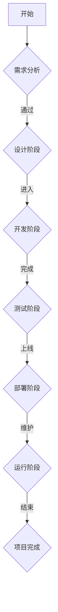

                 

# 引言与概述

## AI赋能编程与软件企业的背景

### 1.1 AI时代的技术变革

在21世纪的今天，人工智能（AI）正以前所未有的速度融入各个行业，带来一场深远的技术变革。AI技术的飞速发展，不仅改变了人类的生活方式，也对传统的软件开发模式产生了深远的影响。

首先，人工智能与软件产业的融合成为一个不可逆转的趋势。随着深度学习、自然语言处理、计算机视觉等AI技术的日益成熟，软件企业开始在产品设计、开发流程、测试与优化等各个环节引入AI技术。这种融合不仅提高了软件开发的效率，还带来了前所未有的创新空间。

其次，程序员技能的AI适应性转型成为不得不面对的现实。传统的编程技能已经无法满足AI时代的开发需求，程序员需要不断学习和掌握新的AI技术和工具。例如，深度学习框架（如TensorFlow和PyTorch）的流行，使得程序员可以更加高效地开发复杂的AI模型。此外，AI技术在编程辅助、代码审查、测试自动化等方面也有着广泛应用，程序员需要适应这些新的技术手段。

### 1.2 软件企业面临的AI挑战

#### 1.2.1 AI对软件企业的影响

AI技术的引入给软件企业带来了巨大的机遇，同时也带来了诸多挑战。首先，AI技术能够显著提高软件开发的效率和质量。例如，自动化代码生成、智能代码审查和测试自动化等技术，可以大幅减少程序员的工作量，提高开发效率。然而，AI技术的引入也带来了数据安全、隐私保护等新的挑战。软件企业需要确保在应用AI技术的同时，能够有效地保护用户数据的安全和隐私。

其次，AI技术的快速发展使得软件企业面临激烈的市场竞争。在AI技术的驱动下，软件产品更新换代的速度越来越快，企业需要不断创新，以保持竞争力。此外，AI技术还使得软件产品的定制化和个性化成为可能，企业需要根据客户需求快速调整产品功能和特性，以满足市场需求。

#### 1.2.2 AI赋能软件企业的发展趋势

随着AI技术的不断成熟和应用，软件企业正迎来一个全新的发展时代。以下是一些AI赋能软件企业的主要发展趋势：

1. **智能化开发流程**：AI技术将全面融入软件开发流程，从需求分析、设计、开发、测试到上线运维，各个环节都将实现智能化。例如，智能代码生成和智能测试自动化等技术，将大大提高开发效率。

2. **个性化用户体验**：AI技术将帮助软件企业实现更加个性化和定制化的用户体验。通过分析用户行为和偏好，AI技术可以提供个性化的推荐和服务，提高用户满意度。

3. **自动化运维管理**：AI技术将在软件运维管理中发挥重要作用，实现自动化故障检测、性能优化和资源调度，降低运维成本。

4. **创新商业模式**：AI技术将带来新的商业模式和创新机会。例如，AI驱动的智能客服、智能营销等应用，将为企业带来新的收入来源。

总之，AI赋能编程与软件企业已成为不可逆转的趋势。软件企业需要积极拥抱AI技术，通过智能化和自动化的方式，提高开发效率、降低成本、提升用户体验，以实现可持续发展。### 2. AI核心概念与编程基础

## 2.1 人工智能概述

### 2.1.1 人工智能的定义与发展历程

人工智能（Artificial Intelligence，简称AI）是指模拟、延伸和扩展人类智能的理论、方法、技术及应用。具体来说，人工智能旨在通过计算机系统实现人类智能的功能，包括感知、学习、推理、规划、通信和问题解决等。

人工智能的发展历程可以追溯到20世纪50年代。1956年，约翰·麦卡锡（John McCarthy）等人首次提出了“人工智能”这一概念，并组织了首届人工智能研讨会。此后，人工智能经历了多个发展阶段：

1. **早期探索阶段（1956-1969）**：这一阶段主要聚焦于符号推理和知识表示的研究，代表成果包括逻辑推理系统和专家系统。

2. **繁荣期阶段（1970-1980）**：随着计算机性能的提高和算法的发展，人工智能迎来了繁荣期。这一阶段的主要成果包括自然语言处理、计算机视觉和机器学习等领域的突破。

3. **低谷期阶段（1980-1990）**：由于实际应用中的种种困难，人工智能在20世纪80年代遭遇了低谷期。然而，机器学习领域的进展为人工智能注入了新的活力。

4. **复兴期阶段（1990至今）**：随着互联网的普及和大数据的涌现，人工智能迎来了新一轮的复兴。深度学习、自然语言处理和计算机视觉等技术取得了重大突破，人工智能的应用范围不断扩展。

### 2.1.2 人工智能的主要类型

人工智能可以分为多种类型，根据其实现方式和应用场景的不同，主要包括以下几种：

1. **基于符号推理的AI**：这种类型的AI主要基于形式逻辑和符号推理，通过构建知识库和推理引擎来模拟人类智能。其代表成果包括专家系统和逻辑推理系统。

2. **基于规则的AI**：这种类型的AI通过定义一组规则来模拟人类决策过程。这些规则通常基于专家经验或领域知识，可以用于决策支持、自动控制等领域。

3. **基于行为的AI**：这种类型的AI通过模仿人类行为来模拟智能，例如机器人、自主导航系统等。这种AI通常采用机器学习算法，通过学习环境中的数据来优化行为。

4. **基于统计学的AI**：这种类型的AI主要基于统计学方法，通过分析大量数据来发现规律和模式。机器学习和深度学习是这一类型的典型代表。

5. **基于生物学的AI**：这种类型的AI通过模拟生物神经网络和大脑结构来实现智能，例如人工神经网络、卷积神经网络等。

### 2.2 编程基础

#### 2.2.1 编程语言选择

编程语言是人工智能开发的基础，不同的编程语言适用于不同的AI应用场景。以下是一些常见的编程语言及其特点：

1. **Python**：Python是一种高级、易于学习的编程语言，广泛应用于机器学习、数据科学和人工智能领域。Python具有丰富的库和框架，如NumPy、Pandas、TensorFlow和PyTorch，使其在AI开发中具有很高的便利性和效率。

2. **Java**：Java是一种强大的编程语言，广泛应用于企业级应用和嵌入式系统。Java具有出色的性能和跨平台能力，对于需要高性能和可扩展性的AI应用，Java是一个不错的选择。

3. **C/C++**：C和C++是底层编程语言，具有高性能和灵活性。在需要优化性能的AI应用中，如深度学习模型训练和计算机视觉处理，C/C++经常被用于实现关键算法。

4. **R**：R是一种专门用于统计分析和数据科学的编程语言，广泛应用于数据分析和机器学习领域。R具有丰富的数据可视化工具和统计分析库，适合进行复杂的数据分析和建模。

#### 2.2.2 编程思维与算法基础

编程思维是解决编程问题的方法和策略，包括逻辑思维、问题分解、算法设计和代码调试等。以下是编程思维中的一些关键要素：

1. **问题分解**：将复杂问题分解为多个子问题，逐步解决，是编程思维的核心。通过递归、分治等策略，可以将大问题转化为小问题，便于解决。

2. **算法设计**：算法是解决问题的步骤和方法。常见的算法设计策略包括贪心算法、动态规划、分治算法和回溯算法等。根据问题的特点选择合适的算法，是编程思维的重要部分。

3. **代码调试**：代码调试是编程过程中必不可少的一环。通过调试工具和技巧，找到并修复代码中的错误，是保证程序正确性的关键。

4. **代码复用和模块化**：编写可复用的代码模块，提高代码的可读性和可维护性，是编程思维中的重要原则。

总之，人工智能与编程密不可分。掌握编程基础和编程思维，是进行AI开发的重要前提。在接下来的章节中，我们将进一步探讨AI技术在软件开发中的应用，以及如何利用AI技术提高软件开发效率和产品质量。### 3. 人工智能基础算法与模型

## 3.1 机器学习基础

机器学习是人工智能的核心技术之一，其目的是使计算机系统能够从数据中学习并做出决策。机器学习主要分为监督学习、无监督学习和强化学习三种类型。

### 3.1.1 数据预处理

数据预处理是机器学习的重要步骤，它包括数据清洗、数据转换和数据归一化等。

- **数据清洗**：数据清洗是指处理缺失值、异常值和重复值等。常见的方法包括填充缺失值、删除异常值和重复值等。
  
- **数据转换**：数据转换是指将不同类型的数据转换为同一类型。例如，将类别型数据转换为数值型数据，或将日期型数据转换为数值型数据。
  
- **数据归一化**：数据归一化是指将不同量级的数据转换为同一量级，以消除量级差异对模型的影响。常见的方法包括最小-最大归一化和z-score归一化。

### 3.1.2 常见算法介绍

监督学习是最常见的机器学习类型，其核心是利用标记数据进行训练，以预测未知数据的标签。

- **线性回归**：线性回归是一种简单的监督学习算法，用于预测连续值。其基本思想是通过找到一组线性方程，来拟合输入和输出之间的关系。
  - **公式**：
    $$
    y = \beta_0 + \beta_1x
    $$
  - **伪代码**：
    ```
    for each training example (x, y):
        compute the predicted value y_pred = beta_0 + beta_1 * x
        compute the error e = y - y_pred
        update beta_0 and beta_1 based on the error
    ```

- **逻辑回归**：逻辑回归是一种用于分类的监督学习算法，其目的是通过线性模型来预测概率。逻辑回归的预测结果通常是一个概率值，通过阈值（如0.5）将其转换为类别标签。
  - **公式**：
    $$
    \hat{y} = \frac{1}{1 + e^{-(\beta_0 + \beta_1x)}}
    $$
  - **伪代码**：
    ```
    for each training example (x, y):
        compute the predicted probability y_pred = 1 / (1 + e^{-(beta_0 + beta_1 * x)})
        compute the error e = log(y / (1 - y_pred))
        update beta_0 and beta_1 based on the error
    ```

无监督学习是无需标记数据来训练模型的方法，其主要任务是发现数据中的隐藏结构和规律。

- **K-均值聚类**：K-均值聚类是一种常见的无监督学习算法，用于将数据分为K个簇。其基本思想是初始化K个簇中心，然后通过迭代调整簇中心，使得每个簇内部的数据点距离簇中心更近。
  - **公式**：
    $$
    c_k = \frac{1}{N_k} \sum_{i=1}^{N} x_i
    $$
    $$
    x_i = \frac{1}{N_k} \sum_{k=1}^{K} \frac{1}{\|x_i - c_k\|_2}
    $$
  - **伪代码**：
    ```
    initialize K cluster centers
    while not converged:
        for each data point x_i:
            assign x_i to the nearest cluster center
        update cluster centers based on the assigned data points
    ```

- **主成分分析（PCA）**：主成分分析是一种降维技术，通过将数据投影到新的正交坐标系上，来减少数据维度。PCA的基本思想是找到数据的主要变化方向，即主成分，从而简化数据结构。
  - **公式**：
    $$
    \Lambda = \lambda_1 \cdots \lambda_p
    $$
    $$
    \Sigma = \sigma_1^2 \cdots \sigma_p^2
    $$
    $$
    \text{U} = \text{U}^T
    $$
  - **伪代码**：
    ```
    compute the covariance matrix
    compute the eigenvalues and eigenvectors of the covariance matrix
    sort the eigenvalues in descending order
    select the top k eigenvectors
    transform the data into the new coordinate system using the selected eigenvectors
    ```

强化学习是一种通过互动学习环境来优化决策的机器学习类型。

- **Q学习**：Q学习是一种基于值函数的强化学习算法，通过学习状态-动作值函数来选择最优动作。其基本思想是通过试错来学习状态-动作对的最优值。
  - **公式**：
    $$
    Q(s, a) = r + \gamma \max_{a'} Q(s', a')
    $$
  - **伪代码**：
    ```
    initialize Q(s, a) randomly
    while not done:
        choose action a based on the current Q values
        take action a and observe reward r and new state s'
        update Q(s, a) based on the observed reward and the maximum future Q value
    ```

以上是机器学习的一些基础算法和模型。在接下来的章节中，我们将进一步探讨深度学习模型，这些模型在人工智能领域具有广泛的应用。### 3.2 深度学习模型

深度学习是机器学习的一个重要分支，通过模仿人脑的神经网络结构，实现对复杂数据的处理和模式识别。深度学习模型在图像识别、自然语言处理和语音识别等领域取得了显著成果。

### 3.2.1 神经网络结构

神经网络（Neural Network，NN）是深度学习的基础，由多个神经元（也称为节点）组成。每个神经元接收多个输入，通过权重（weights）和偏置（bias）进行加权求和，然后通过激活函数（activation function）产生输出。

一个简单的神经网络结构包括输入层、隐藏层和输出层。输入层接收外部输入数据，隐藏层对数据进行处理和特征提取，输出层产生最终预测结果。

- **输入层**：输入层由多个神经元组成，每个神经元接收一个输入值。输入层不包含权重和偏置。
  
- **隐藏层**：隐藏层对输入数据进行处理，每个隐藏层神经元接收来自前一层的输出，通过加权求和和激活函数产生新的输出。隐藏层的数量和每个隐藏层的神经元数量可以根据问题复杂度进行调整。

- **输出层**：输出层产生最终预测结果。对于分类问题，输出层通常包含多个神经元，每个神经元表示一个类别，通过最大输出神经元来确定预测类别。

### 3.2.2 神经网络工作原理

神经网络的工作原理可以概括为以下几个步骤：

1. **前向传播（Forward Propagation）**：输入数据从输入层传递到隐藏层，通过每个神经元的加权求和和激活函数处理，最终传递到输出层。

2. **计算损失（Compute Loss）**：输出层产生的预测结果与实际标签进行比较，计算损失值。常见的损失函数包括均方误差（MSE）和交叉熵（Cross Entropy）。

3. **反向传播（Back Propagation）**：根据计算得到的损失值，通过反向传播算法更新网络权重和偏置。反向传播算法利用梯度下降（Gradient Descent）优化权重和偏置，使得损失值逐渐减小。

4. **迭代训练（Iterative Training）**：重复前向传播和反向传播过程，直到网络收敛，即损失值达到预设阈值。

### 3.2.3 深度学习框架

深度学习框架（Deep Learning Framework）是用于构建和训练深度学习模型的高层工具，提供了一系列便捷的功能和接口。以下是一些流行的深度学习框架：

1. **TensorFlow**：TensorFlow是由Google开发的开源深度学习框架，具有强大的图形计算能力和灵活的编程接口。TensorFlow使用图（Graph）来表示计算过程，通过定义计算图，可以高效地进行前向传播和反向传播计算。

2. **PyTorch**：PyTorch是由Facebook开发的开源深度学习框架，以其动态计算图和易于调试的编程风格受到广泛关注。PyTorch使用自动微分（Autograd）机制，方便实现复杂的神经网络模型。

3. **Keras**：Keras是一个高级深度学习框架，基于TensorFlow和Theano开发，提供了简洁的API和丰富的预训练模型。Keras适合快速实验和原型设计，便于新手入门。

4. **MXNet**：MXNet是由Apache Software Foundation开发的开源深度学习框架，支持多种编程语言，具有高性能和灵活的可扩展性。MXNet适用于工业级应用，特别是在大规模数据处理和分布式训练方面。

### 3.2.4 深度学习在软件开发中的应用

深度学习在软件开发中有着广泛的应用，以下是一些典型的应用场景：

1. **图像识别**：深度学习模型可以用于图像识别任务，例如人脸识别、物体检测和图像分类等。通过卷积神经网络（Convolutional Neural Networks，CNN）等深度学习模型，可以实现高精度的图像识别。

2. **自然语言处理**：深度学习在自然语言处理（Natural Language Processing，NLP）领域有着重要应用，例如文本分类、情感分析和机器翻译等。通过循环神经网络（Recurrent Neural Networks，RNN）和Transformer等模型，可以实现复杂的语言理解和生成任务。

3. **语音识别**：深度学习模型可以用于语音识别任务，将语音信号转换为文本。通过深度神经网络（Deep Neural Networks，DNN）和卷积神经网络（CNN）等模型，可以实现高精度的语音识别。

4. **推荐系统**：深度学习可以用于构建推荐系统，通过分析用户行为和偏好，为用户推荐感兴趣的内容。通过自动编码器（Autoencoder）和图卷积网络（Graph Convolutional Networks，GCN）等模型，可以实现高效的推荐算法。

5. **增强学习**：深度学习在增强学习（Reinforcement Learning，RL）领域也有着重要应用，例如游戏和自动驾驶等。通过深度神经网络和强化学习算法，可以实现智能体的自主学习和决策。

总之，深度学习模型在软件开发中具有广泛的应用，通过灵活运用各种深度学习框架和算法，可以构建高效的智能系统，提升软件的智能化水平。在接下来的章节中，我们将进一步探讨深度学习模型在不同领域的应用，以及如何利用深度学习技术提高软件开发效率和产品质量。### 4. 自然语言处理与文本分析

## 4.1 自然语言处理概述

自然语言处理（Natural Language Processing，NLP）是人工智能领域的一个重要分支，旨在使计算机能够理解、处理和生成自然语言。NLP的核心任务是构建能够处理人类语言的应用程序，使得人与计算机之间能够进行自然交流。

### 4.1.1 语言模型

语言模型是NLP的基础，它用于预测一段文本的下一个单词或字符。常见的语言模型包括n-gram模型、隐马尔可夫模型（HMM）和神经网络语言模型（NNLM）。

1. **n-gram模型**：n-gram模型是基于统计学的语言模型，它将连续的n个单词或字符看作一个整体，通过计算这些n-gram在文本中的出现频率来预测下一个单词或字符。n-gram模型的优点是实现简单、计算效率高，但缺点是不足以捕捉长程依赖关系。

2. **隐马尔可夫模型（HMM）**：HMM是一种基于概率模型的NLP方法，它通过隐藏状态序列和观测序列之间的关系来预测文本。HMM在语音识别和文本生成等领域有广泛应用。

3. **神经网络语言模型（NNLM）**：NNLM是一种基于深度学习的语言模型，通过训练大量的文本数据来学习语言的统计特性。NNLM可以捕捉长程依赖关系，生成更加自然的文本。

### 4.1.2 词向量表示

词向量表示是NLP中的重要技术，它将单词映射为密集的向量表示，使得计算机可以处理和处理文本数据。常见的词向量表示方法包括Word2Vec、GloVe和BERT等。

1. **Word2Vec**：Word2Vec是一种基于神经网络的词向量表示方法，它通过训练词的嵌入向量来预测邻近词。Word2Vec有两种训练方法：连续词袋（CBOW）和Skip-Gram。CBOW方法通过预测中心词周围的词，而Skip-Gram方法通过预测中心词来训练词向量。

2. **GloVe**：GloVe（Global Vectors for Word Representation）是一种基于全局上下文统计信息的词向量表示方法。GloVe通过计算单词在不同窗口大小下的词向量平均值，来学习词的密集向量表示。

3. **BERT**：BERT（Bidirectional Encoder Representations from Transformers）是一种基于Transformer的预训练语言模型，它通过双向编码器来学习单词的上下文表示。BERT在多种NLP任务上取得了优异的性能，广泛应用于文本分类、命名实体识别和机器翻译等领域。

## 4.2 文本分类与情感分析

文本分类（Text Classification）是一种常见的NLP任务，旨在将文本数据分为预定义的类别。情感分析（Sentiment Analysis）是一种文本分类任务，它旨在识别文本中的情感倾向，如正面、负面或中性。

### 4.2.1 文本分类算法

常见的文本分类算法包括基于规则的方法、基于机器学习的方法和基于深度学习的方法。

1. **基于规则的方法**：基于规则的方法通过手工定义一组规则来分类文本。这种方法简单直观，但规则难以覆盖所有情况，适用范围有限。

2. **基于机器学习的方法**：基于机器学习的方法通过训练模型来分类文本。常见的算法包括朴素贝叶斯（Naive Bayes）、支持向量机（SVM）和逻辑回归（Logistic Regression）等。这些算法通过学习文本的特征向量来预测类别标签。

3. **基于深度学习的方法**：基于深度学习的方法通过构建深度神经网络来分类文本。常见的模型包括卷积神经网络（CNN）和长短期记忆网络（LSTM）等。这些模型可以自动学习文本的复杂特征，实现高效分类。

### 4.2.2 情感分析应用

情感分析在社交媒体、电子商务和客户服务等领域有广泛应用。以下是一些常见的应用场景：

1. **社交媒体分析**：通过分析社交媒体上的用户评论和帖子，可以了解用户对品牌、产品或事件的情感倾向，为企业提供市场洞察。

2. **电子商务评价**：通过分析电子商务平台上的商品评价，可以了解消费者的购物体验和满意度，帮助企业优化产品和服务。

3. **客户服务**：通过分析客户服务渠道中的文本数据，可以识别客户问题的主要类型和情感倾向，提高客户服务质量。

4. **舆情监测**：通过分析新闻、论坛和博客等公开信息源，可以了解公众对特定事件或话题的看法和态度，为政府和组织提供决策支持。

总之，自然语言处理与文本分析是人工智能领域中不可或缺的一部分，通过运用各种NLP技术和算法，可以实现对文本数据的深入分析和智能处理，为企业和社会带来诸多益处。在接下来的章节中，我们将进一步探讨计算机视觉与图像处理技术，这些技术在图像识别和目标检测等领域具有广泛的应用。### 5. 计算机视觉与图像处理

## 5.1 计算机视觉基础

计算机视觉（Computer Vision，CV）是人工智能的一个重要分支，旨在使计算机能够从图像或视频中提取有用信息。计算机视觉的应用范围广泛，包括图像识别、目标检测、图像分割、人脸识别等。

### 5.1.1 图像识别与处理

图像识别（Image Recognition）是指计算机系统通过算法对图像中的对象进行识别和分类。图像识别的关键在于如何有效地表示和提取图像特征。

1. **特征提取**：特征提取是将图像转换为能够反映其内容的一组数值表示。常见的特征提取方法包括直方图、边缘检测、纹理分析等。

2. **分类算法**：分类算法用于将图像划分为不同的类别。常见的分类算法包括支持向量机（SVM）、决策树、神经网络等。

3. **卷积神经网络（CNN）**：卷积神经网络是一种专门用于图像处理的深度学习模型，具有强大的特征提取和分类能力。CNN通过多层卷积和池化操作，自动学习图像的复杂特征，实现高效的图像识别。

### 5.1.2 目标检测与跟踪

目标检测（Object Detection）是指从图像中识别出特定对象的位置和边界。目标检测是计算机视觉领域的一个关键任务，广泛应用于视频监控、自动驾驶、医疗诊断等场景。

1. **区域建议（Region Proposal）**：区域建议是目标检测的前置步骤，用于生成可能的物体区域。常见的区域建议方法包括滑动窗口、选择性搜索等。

2. **分类与定位**：在目标检测中，对于每个区域建议，需要通过分类算法判断其是否为目标，并定位目标的精确位置。常见的分类算法包括SVM、R-CNN、Fast R-CNN、Faster R-CNN等。

3. **跟踪算法**：目标检测通常需要结合目标跟踪技术，以实现对目标的连续检测和定位。常见的跟踪算法包括光流法、 Kalman滤波、粒子滤波等。

### 5.2 图像分类与识别

图像分类（Image Classification）是指将图像划分为预定义的类别。图像分类是计算机视觉中的一项基础任务，广泛应用于图像识别、物体检测和视频分析等领域。

1. **分类算法**：常见的图像分类算法包括支持向量机（SVM）、决策树、随机森林、K最近邻（KNN）等。这些算法通过训练模型来学习图像的特征和类别关系。

2. **深度学习模型**：深度学习模型在图像分类任务中取得了显著的性能提升。卷积神经网络（CNN）是一种常用的深度学习模型，通过多层卷积和池化操作，自动学习图像的复杂特征，实现高效的图像分类。

3. **迁移学习**：迁移学习是一种利用预训练模型进行图像分类的方法，通过在特定任务上微调预训练模型，可以显著提高分类性能。常见的预训练模型包括VGG、ResNet、Inception等。

4. **多标签分类**：多标签分类是指一个图像可以同时属于多个类别。多标签分类通过训练多标签分类模型，实现对图像多个类别的预测。

### 5.2.1 卷积神经网络

卷积神经网络（Convolutional Neural Network，CNN）是一种专门用于图像处理的深度学习模型。CNN通过卷积、池化和全连接层等操作，自动学习图像的层次特征，实现对图像的分类、检测和分割等任务。

1. **卷积层（Convolutional Layer）**：卷积层通过卷积操作提取图像的特征。卷积操作是将滤波器（卷积核）在图像上滑动，计算局部特征响应。

2. **池化层（Pooling Layer）**：池化层用于降低特征图的维度，减少计算量。常见的池化操作包括最大池化和平均池化。

3. **全连接层（Fully Connected Layer）**：全连接层用于将卷积层和池化层提取的特征映射到类别标签。全连接层通过计算特征向量的内积来产生预测结果。

4. **激活函数（Activation Function）**：激活函数用于引入非线性特性，使神经网络能够学习复杂的映射关系。常见的激活函数包括ReLU、Sigmoid和Tanh。

### 5.2.2 深度学习在图像处理中的应用

深度学习在图像处理中具有广泛的应用，通过构建复杂的神经网络模型，可以实现高精度的图像分类、目标检测和分割等任务。

1. **图像分类**：深度学习模型通过训练大量图像数据，可以自动学习图像的复杂特征，实现高精度的图像分类。常见的模型包括VGG、ResNet、Inception等。

2. **目标检测**：深度学习模型通过结合卷积神经网络和目标检测算法，可以实现高精度的目标检测。常见的模型包括R-CNN、Faster R-CNN、SSD、YOLO等。

3. **图像分割**：深度学习模型通过训练图像分割模型，可以实现像素级别的图像分割。常见的模型包括U-Net、SegNet、DeepLab等。

4. **人脸识别**：深度学习模型通过训练人脸识别模型，可以实现高精度的人脸识别。常见的人脸识别算法包括Eigenfaces、LBPH、深度神经网络等。

5. **图像增强**：深度学习模型通过训练图像增强模型，可以实现图像的超分辨率、去噪和风格迁移等任务。常见的模型包括SRCNN、EDSR、CycleGAN等。

总之，计算机视觉与图像处理是人工智能领域中的重要组成部分，通过运用深度学习模型和算法，可以实现高精度的图像识别、目标检测和分割等任务，为各行业带来诸多应用价值。在接下来的章节中，我们将进一步探讨人工智能在软件开发中的实践应用。### 6. 人工智能在软件开发中的实践

## 6.1 AI驱动软件开发流程

人工智能（AI）在软件开发中的应用正在迅速扩展，使得整个开发流程变得更加智能化和自动化。AI驱动的软件开发流程不仅提高了开发效率，还显著提升了软件质量和用户体验。以下是一些关键的AI实践，包括自动化代码生成、智能代码审查和软件测试自动化。

### 6.1.1 自动化代码生成

自动化代码生成（Automated Code Generation）是一种利用AI技术自动生成代码的方法，旨在减少程序员的工作负担，提高开发效率。自动化代码生成可以通过以下步骤实现：

1. **需求分析**：首先，需要明确软件的需求和功能，并将其转化为可量化的输入数据。这通常涉及自然语言处理（NLP）技术，以理解和提取需求文档中的关键信息。

2. **代码模板库**：构建一个包含常见代码模板的库，这些模板可以根据特定的编程语言和框架进行自定义。这些模板是实现自动化代码生成的基础。

3. **代码生成引擎**：利用机器学习和自然语言处理技术，构建一个代码生成引擎，该引擎可以根据需求分析的结果和代码模板库，自动生成符合要求的代码。

4. **代码优化**：生成的代码通常需要进行优化，以确保其质量和可维护性。这可以通过代码审查和静态分析工具来实现。

**代码示例**：

以下是一个简单的Python函数生成示例，该函数用于根据输入参数生成一个加法运算的函数。

```python
def generate_add_function(input_params):
    function_code = f"""
def add({input_params}):
    return {param1} + {param2}
"""
    return function_code

# 调用生成函数
function_code = generate_add_function("a, b")
print(function_code)
```

生成的代码如下：

```python
def add(a, b):
    return a + b
```

通过这种方式，可以显著减少编写基础代码的时间，并提高代码的一致性和准确性。

### 6.1.2 智能代码审查

智能代码审查（Smart Code Review）利用AI技术对代码进行自动化审查，以识别潜在的错误、代码风格问题和安全漏洞。智能代码审查可以通过以下步骤实现：

1. **静态代码分析**：使用静态代码分析工具对代码进行分析，以识别潜在的语法错误、逻辑错误和代码风格问题。

2. **规则库**：构建一个包含常见编程规则和安全准则的规则库，用于指导代码审查过程。

3. **机器学习模型**：利用机器学习技术，训练一个模型来识别代码中的异常行为和潜在问题。这可以通过分析大量的代码库和错误报告来实现。

4. **动态分析**：在某些情况下，还需要进行动态分析，即在实际运行代码时检测潜在的问题。这通常涉及单元测试和集成测试。

**代码示例**：

以下是一个使用机器学习模型进行代码审查的简单示例。假设我们有一个训练好的模型，可以识别代码中的潜在错误。

```python
import review_model

code_to_analyze = """
def add(a, b):
    return a + b
"""

potential_issues = review_model.analyze_code(code_to_analyze)
for issue in potential_issues:
    print(f"Issue detected: {issue['description']} at line {issue['line_number']}")
```

假设模型检测到一行代码中的潜在问题，输出如下：

```
Issue detected: Division by zero at line 3
```

通过这种方式，可以快速识别和修复代码中的问题，提高代码的质量和可靠性。

### 6.1.3 软件测试自动化

软件测试自动化（Software Testing Automation）利用AI技术自动化执行测试用例，以快速发现软件中的缺陷。软件测试自动化可以通过以下步骤实现：

1. **测试用例生成**：利用AI技术自动生成测试用例，以覆盖代码的不同部分和路径。这可以通过代码分析和代码路径分析来实现。

2. **测试执行**：自动化执行生成的测试用例，以检测软件中的缺陷。这通常涉及自动化测试工具，如Selenium、JUnit等。

3. **结果分析**：分析测试结果，识别软件中的缺陷。这可以通过机器学习模型来实现，以预测哪些测试用例可能失败，并提供修复建议。

**代码示例**：

以下是一个使用AI模型生成测试用例的简单示例。

```python
import test_generator

class Calculator:
    def add(self, a, b):
        return a + b

calculator = Calculator()

test_cases = test_generator.generate_tests(calculator)
for test_case in test_cases:
    print(test_case)
```

生成的测试用例可能包括以下内容：

```
Test case 1:
- input: a=1, b=2
- expected output: 3

Test case 2:
- input: a=-1, b=-2
- expected output: -3
```

通过这种方式，可以自动化地生成和执行测试用例，提高测试效率和覆盖率。

总之，人工智能在软件开发中的应用正在不断拓展，通过自动化代码生成、智能代码审查和软件测试自动化等技术，可以显著提高开发效率、降低成本和提升软件质量。在接下来的章节中，我们将进一步探讨AI赋能软件企业的案例分析和策略实施。### 7. AI赋能软件企业的案例分析

## 7.1 成功案例分享

在AI技术的推动下，许多软件企业已经取得了显著的成就。以下是一些成功案例，展示了AI技术在软件开发、运营和管理中的具体应用。

### 7.1.1 谷歌的AI软件开发实践

谷歌是一家在AI领域具有领先地位的科技公司，其AI软件开发实践涵盖了多个领域，包括搜索引擎、云计算、移动设备和物联网等。

1. **搜索引擎**：谷歌的搜索引擎利用AI技术，通过自然语言处理和机器学习算法，提供更精确的搜索结果。例如，Bert模型在理解用户查询上下文中发挥了重要作用，使得搜索引擎能够更好地理解复杂的查询意图。

2. **云计算**：谷歌的云服务平台（Google Cloud）提供了多种AI服务，如自动机器学习（AutoML）、自然语言处理和图像识别服务。这些服务帮助企业快速构建和部署AI应用程序，无需深厚的AI专业知识。

3. **移动设备**：谷歌的Android操作系统集成了许多AI功能，如智能助手Google Assistant、面部识别和图像识别。这些功能提高了用户交互的便利性和个性化体验。

4. **物联网**：谷歌的物联网平台（Google IoT）利用AI技术，帮助企业和开发者构建智能物联网解决方案。通过实时数据分析，AI算法可以优化设备性能，提高能源效率和减少维护成本。

### 7.1.2 亚马逊AWS的AI服务

亚马逊AWS是全球领先的云服务提供商，其AI服务在多个行业和领域得到广泛应用。

1. **自动化机器人**：亚马逊的Kiva机器人利用计算机视觉和机器学习技术，实现仓库内部的自动化管理。这些机器人可以自主导航、拣选和分类商品，大幅提高了仓库的效率和准确性。

2. **云计算**：AWS提供了丰富的AI服务，如Amazon SageMaker、Rekognition和Lex。这些服务帮助企业构建、训练和部署AI模型，无需管理底层基础设施。

3. **语音识别**：Amazon Alexa是AWS的语音助手，通过自然语言处理和机器学习技术，提供语音交互体验。Alexa可以在智能家居、客户服务和教育等领域应用，为用户带来便捷的体验。

4. **图像识别**：Amazon Rekognition提供了强大的图像识别服务，可以识别人脸、物体和场景。这些服务在安全监控、零售和医疗等领域得到广泛应用。

### 7.1.3 其他行业案例

除了科技巨头，其他行业也在积极采用AI技术，实现业务创新和效率提升。

1. **金融行业**：银行和保险公司利用AI技术进行风险评估、欺诈检测和客户服务优化。例如，通过机器学习算法，可以更准确地预测客户行为和金融风险。

2. **医疗行业**：医疗机构利用AI技术进行疾病诊断、医疗图像分析和药物研发。例如，通过深度学习模型，可以快速识别医学图像中的异常区域，提高诊断准确率。

3. **零售行业**：零售企业利用AI技术进行库存管理、需求预测和个性化推荐。通过分析消费者行为数据，AI算法可以优化库存水平，提高销售转化率。

4. **制造业**：制造企业利用AI技术进行设备维护、生产优化和质量检测。通过实时监控和分析设备运行数据，AI算法可以预测设备故障，减少停机时间。

总之，AI技术在软件开发和企业管理中的成功应用，为企业带来了显著的竞争优势和商业价值。通过不断创新和优化，AI赋能的软件企业将继续推动行业进步，引领未来发展趋势。### 7.2 AI软件企业的挑战与解决方案

在AI技术的推动下，软件企业正在经历一场深刻的变革。然而，这一变革也伴随着一系列挑战，包括技术挑战、管理挑战和运营挑战。以下是对这些挑战的详细分析，以及相应的解决方案。

#### 7.2.1 技术挑战

**1. 数据隐私和安全**

随着AI技术的广泛应用，数据隐私和安全问题变得愈发重要。软件企业在处理大量用户数据时，需要确保数据不被未经授权的访问或泄露。解决方案包括：

- **数据加密**：对敏感数据进行加密，确保数据在传输和存储过程中的安全性。
- **隐私保护技术**：采用差分隐私、数据匿名化和同态加密等技术，保护用户隐私。
- **安全审计和合规性**：定期进行安全审计，确保企业的数据处理过程符合相关法律法规和行业标准。

**2. 模型可解释性**

深度学习模型在许多AI应用中表现出色，但其内部决策过程往往不透明，导致模型可解释性成为一大挑战。解决方案包括：

- **模型可解释性工具**：使用可视化工具和解释性算法，帮助开发者理解和解释模型决策过程。
- **特征工程**：通过对输入特征进行合理的预处理和选择，提高模型的可解释性。
- **黑盒模型与白盒模型结合**：在黑盒模型（如深度神经网络）和白盒模型（如决策树和线性模型）之间进行平衡，以提高模型的可解释性和准确性。

**3. 模型更新和维护**

AI模型需要不断更新和维护，以适应新的数据和环境。然而，这个过程往往成本高昂且复杂。解决方案包括：

- **自动化模型更新**：采用自动化工具和流程，简化模型更新过程，降低人力成本。
- **持续学习**：通过持续学习技术，使模型能够不断适应新的数据和环境，提高模型的鲁棒性和适应性。
- **版本控制**：建立模型版本控制机制，确保每个模型的更新和迭代都能得到有效管理和跟踪。

#### 7.2.2 管理挑战

**1. 人才短缺**

AI技术的快速发展带来了对专业人才的巨大需求，但现有人才储备往往难以满足需求。解决方案包括：

- **人才引进**：通过高薪和良好工作环境吸引顶尖AI人才。
- **人才培养**：建立内部培训计划，提高现有员工的技能水平，培养未来的AI专家。
- **合作与外包**：与高校和研究机构合作，建立人才输送渠道，或通过外包解决短期人才短缺问题。

**2. 团队协作**

AI项目通常涉及多个领域的知识，需要不同专业背景的团队成员紧密协作。然而，跨领域的协作往往面临沟通和协调问题。解决方案包括：

- **跨领域培训**：为团队成员提供跨领域培训，提高团队的整体协作能力。
- **明确职责和目标**：明确每个团队成员的职责和目标，确保协作高效有序。
- **沟通工具和平台**：使用高效的沟通工具和平台，如Slack、Microsoft Teams等，促进团队成员之间的交流和协作。

**3. 预算和资源分配**

AI项目往往需要大量资金和资源投入，但预算分配和资源分配不当可能导致项目延期或失败。解决方案包括：

- **预算规划和审核**：在项目启动前进行详细的预算规划，并定期进行预算审核，确保资金和资源得到合理利用。
- **优先级排序**：根据项目的优先级和商业价值，合理分配资源，确保重点项目得到充分支持。
- **成本效益分析**：定期进行成本效益分析，确保项目能够在预算范围内实现预期收益。

#### 7.2.3 运营挑战

**1. 模型部署**

将AI模型部署到生产环境是一个复杂的过程，需要考虑模型的稳定性、可靠性和可扩展性。解决方案包括：

- **容器化和微服务**：采用容器化技术和微服务架构，确保模型部署的灵活性和可扩展性。
- **持续集成和持续部署（CI/CD）**：建立CI/CD流程，确保模型更新和部署过程的自动化和高效性。
- **模型监控和运维**：建立模型监控和运维机制，实时监测模型性能和运行状态，确保模型稳定可靠。

**2. 用户反馈和迭代**

AI软件产品的成功离不开用户的反馈和迭代。然而，获取有效的用户反馈和快速迭代是一个挑战。解决方案包括：

- **用户反馈系统**：建立用户反馈系统，收集和分析用户反馈，快速响应用户需求。
- **敏捷开发**：采用敏捷开发方法，快速迭代和优化产品功能，提高用户满意度。
- **数据驱动决策**：基于用户行为数据和反馈，做出数据驱动的产品决策，确保产品符合用户需求。

总之，AI软件企业在面对技术、管理和运营挑战时，需要采取一系列有效的解决方案，以确保AI技术的有效应用和企业的可持续发展。通过不断优化和创新，AI软件企业可以不断提升竞争力，引领行业变革。### 8. AI赋能软件企业的战略规划

## 8.1 AI赋能战略分析

### 8.1.1 企业现状分析

企业现状分析是制定AI赋能战略的第一步，旨在了解企业当前的AI应用水平、技术储备和业务需求。以下是企业现状分析的关键点：

1. **技术现状**：评估企业现有的AI技术能力和应用情况，包括深度学习、自然语言处理、计算机视觉等技术的应用水平。

2. **业务需求**：分析企业业务流程中哪些环节可以引入AI技术，以提升效率、降低成本或创造新的商业机会。

3. **数据资源**：评估企业拥有的数据资源，包括数据的数量、质量、多样性等，以及数据的使用权限和隐私保护措施。

4. **人力资源**：分析企业内部是否具备足够的AI人才，以及人才储备的发展潜力。

### 8.1.2 市场机会与竞争分析

在制定AI赋能战略时，市场机会和竞争分析是至关重要的。以下是市场机会和竞争分析的关键点：

1. **市场趋势**：分析AI技术在行业中的应用趋势，包括新兴技术的出现、市场需求的增长等。

2. **竞争对手**：评估竞争对手的AI应用情况、技术优势和市场份额，了解竞争对手的战略和行动。

3. **客户需求**：分析目标客户的需求和痛点，以及AI技术如何满足这些需求和痛点。

4. **市场规模**：评估AI技术在企业所处行业的市场规模和增长潜力。

### 8.1.3 AI赋能战略分析框架

基于企业现状分析和市场机会与竞争分析，可以构建一个AI赋能战略分析框架。该框架包括以下关键要素：

1. **愿景与目标**：明确企业的AI赋能愿景和短期、长期目标，确保战略与企业的整体发展目标一致。

2. **技术路线**：确定企业需要掌握的关键AI技术，制定技术发展路线图，确保技术能力与市场需求匹配。

3. **业务模式**：分析AI技术如何改变企业的业务模式，创造新的商业机会，提高客户价值。

4. **实施策略**：制定具体的AI赋能实施策略，包括人才引进、技术研发、数据管理、产品迭代等。

5. **风险评估**：识别和评估AI赋能战略实施过程中的潜在风险，制定风险应对措施。

6. **资源分配**：根据企业的资源状况，合理分配预算和人力资源，确保AI赋能战略的顺利实施。

### 8.1.4 AI赋能战略制定

基于AI赋能战略分析框架，企业可以制定具体的AI赋能战略。以下是AI赋能战略制定的关键步骤：

1. **制定愿景与目标**：明确AI赋能的长期愿景和短期目标，例如提高生产效率、优化客户体验、开拓新市场等。

2. **确定技术路线**：根据市场需求和业务需求，确定企业需要掌握的关键AI技术，例如深度学习、自然语言处理、计算机视觉等，并制定技术发展路线图。

3. **构建AI研发团队**：通过内部培养和外部引进，建立一支专业的AI研发团队，确保企业具备强大的技术能力。

4. **数据管理策略**：制定数据管理策略，确保数据的质量、安全性和合规性，为AI模型训练提供高质量的数据支持。

5. **产品迭代策略**：制定产品迭代策略，通过快速迭代和优化，确保AI产品能够持续满足市场需求。

6. **商业模式创新**：分析AI技术如何改变企业的商业模式，创造新的商业机会，例如通过AI驱动的产品和服务，提高客户黏性和市场竞争力。

7. **风险管理**：识别和评估AI赋能战略实施过程中的潜在风险，制定相应的风险应对措施，确保战略的顺利实施。

8. **执行与监控**：制定详细的执行计划，明确各部门的职责和任务，建立监控机制，确保战略的执行效果。

总之，AI赋能软件企业的战略规划需要综合考虑企业现状、市场机会和竞争态势，制定明确的愿景、目标和实施策略，以确保AI技术的有效应用和企业的可持续发展。在接下来的章节中，我们将探讨AI赋能软件企业的运营管理，以帮助企业实现AI赋能战略的顺利实施。### 9. AI赋能软件企业的运营管理

## 9.1 AI项目管理与流程优化

在AI赋能软件企业的运营管理中，项目管理与流程优化是确保AI项目成功实施和持续改进的关键。以下是一些关键措施和最佳实践：

### 9.1.1 项目管理方法

1. **敏捷开发**：采用敏捷开发方法，如Scrum或Kanban，以快速响应变化和需求调整。敏捷开发强调迭代开发和持续交付，有助于提高项目的灵活性和适应性。

2. **跨职能团队**：建立跨职能团队，包括数据科学家、工程师、产品经理和业务专家，确保项目能够在各个阶段得到全面的支持和协调。

3. **风险管理**：在项目启动阶段，进行详细的风险评估，并制定相应的风险管理计划。定期进行风险评估和调整，确保项目能够应对潜在风险。

4. **迭代开发**：采用迭代开发方法，将项目分为多个短周期（Sprint或迭代），在每个周期内完成一部分功能，并进行测试和反馈。这种方法有助于快速发现问题并做出调整。

### 9.1.2 流程优化实践

1. **自动化流程**：利用AI技术，如机器学习和自然语言处理，自动化日常流程和任务，如代码审查、测试执行和部署流程。自动化可以减少手动操作，提高效率和准确性。

2. **持续集成与持续部署（CI/CD）**：建立CI/CD流程，确保代码的自动化构建、测试和部署。CI/CD有助于快速发现和修复问题，提高软件质量。

3. **数据驱动决策**：通过数据分析，了解项目进度、资源利用和风险情况，并基于数据做出决策。数据驱动决策有助于优化资源配置，提高项目成功率。

4. **持续反馈与改进**：建立反馈机制，收集用户、团队成员和利益相关者的反馈，并基于反馈进行持续改进。这种方法有助于优化项目流程，提高客户满意度。

### 9.2 AI产品设计与用户体验

在AI赋能软件企业的运营管理中，AI产品设计与用户体验优化是关键环节。以下是一些关键措施和最佳实践：

#### 9.2.1 AI产品设计原则

1. **用户为中心**：在设计AI产品时，始终以用户为中心，了解用户需求和行为，确保产品能够满足用户需求。

2. **易用性**：设计易用的界面和交互流程，降低用户的学习成本，提高用户满意度。

3. **可扩展性**：设计具有高度可扩展性的产品架构，以便在未来能够轻松扩展和升级功能。

4. **灵活性**：设计灵活的AI模型和算法，以适应不同的应用场景和需求变化。

#### 9.2.2 用户体验优化

1. **用户研究**：通过用户研究和可用性测试，了解用户的需求、偏好和行为习惯，为产品设计和改进提供依据。

2. **迭代设计**：采用迭代设计方法，持续收集用户反馈，并根据反馈进行产品改进。这种方法有助于提高产品质量和用户体验。

3. **个性化推荐**：利用AI技术，如机器学习和自然语言处理，实现个性化推荐和定制化服务，提高用户满意度。

4. **可访问性**：确保产品对各种用户（包括残障人士）具有可访问性，遵循无障碍设计原则。

5. **性能优化**：通过性能优化，确保产品在多种设备和网络环境下都能提供良好的用户体验。

总之，AI赋能软件企业的运营管理需要综合考虑项目管理与流程优化、AI产品设计与用户体验优化等多个方面，以实现高效、灵活和可持续的发展。在接下来的章节中，我们将探讨AI技术在软件行业的发展趋势，以及AI赋能软件企业的未来展望。### 10. 未来展望

## 10.1 AI技术在软件行业的发展趋势

随着AI技术的不断成熟和应用，软件行业正迎来一场前所未有的变革。以下是一些AI技术在软件行业中的发展趋势：

### 10.1.1 技术创新

1. **深度学习与强化学习**：深度学习和强化学习在图像识别、自然语言处理和决策优化等领域取得了显著成果。未来，这些技术将进一步发展和完善，推动AI技术在更多领域的应用。

2. **联邦学习**：联邦学习是一种新型的机器学习技术，能够在保护用户隐私的同时，实现数据的协同学习和共享。随着隐私保护意识的增强，联邦学习将在软件行业中得到广泛应用。

3. **增强现实与虚拟现实**：增强现实（AR）和虚拟现实（VR）技术的快速发展，将使得软件产品能够提供更加沉浸式和互动性的用户体验，为软件开发带来新的机遇。

4. **自然语言处理与生成**：自然语言处理（NLP）技术的进步，使得软件产品能够更好地理解和生成自然语言。未来，AI驱动的自然语言生成技术将在内容创作、自动翻译和智能客服等领域发挥重要作用。

### 10.1.2 行业应用拓展

1. **智能制造**：AI技术将在智能制造领域发挥关键作用，通过机器学习、计算机视觉和机器人技术，实现生产过程的自动化、智能化和优化。

2. **智慧医疗**：AI技术在智慧医疗中的应用将越来越广泛，包括疾病诊断、药物研发和患者护理等。通过深度学习和大数据分析，AI技术将提高医疗服务的质量和效率。

3. **智慧交通**：AI技术将在智慧交通领域得到广泛应用，包括自动驾驶、智能交通管理和智能物流。这些应用将提高交通效率，减少交通事故，改善城市交通环境。

4. **金融科技**：AI技术将在金融科技领域发挥重要作用，包括智能投顾、风险管理和反欺诈等。通过机器学习和大数据分析，AI技术将提高金融服务的安全性和便捷性。

5. **智慧城市**：AI技术将在智慧城市建设中发挥关键作用，通过物联网、大数据和AI技术，实现城市管理的智能化和精细化，提高城市居民的生活质量和幸福感。

### 10.1.3 新模式与新生态

1. **AI驱动开发**：随着AI技术的发展，AI驱动的软件开发模式将逐渐取代传统的软件开发模式。通过自动化代码生成、智能代码审查和测试自动化等AI技术，软件开发过程将变得更加高效和灵活。

2. **AI生态协同**：AI技术的发展将促进不同行业之间的协同和融合，形成新的AI生态。企业、研究机构和开发者将共同推动AI技术的创新和应用，实现跨行业的合作与共赢。

3. **AI伦理与法规**：随着AI技术的广泛应用，AI伦理和法规问题将日益受到关注。制定合理的AI伦理规范和法律法规，确保AI技术的健康发展和社会公共利益，将成为未来重要的发展趋势。

总之，AI技术在软件行业中的发展趋势表明，AI技术将继续深入影响软件开发、运营和管理等各个环节，为软件企业带来新的机遇和挑战。通过积极拥抱AI技术，软件企业将能够在未来的竞争中获得优势，实现可持续发展。### 10.2 AI赋能软件企业的未来

随着AI技术的不断进步，AI赋能软件企业将进入一个全新的发展阶段。在这个阶段，AI技术不仅将成为企业竞争力的关键因素，还将深刻改变企业的运营模式、商业模式和创新能力。

#### 10.2.1 创新模式

1. **个性化定制**：AI技术将帮助企业实现个性化定制，通过大数据分析和机器学习算法，了解客户的需求和偏好，提供高度个性化的产品和服务。这种定制化能力将帮助企业赢得客户忠诚度，提升市场竞争力。

2. **智能产品和服务**：AI技术将推动软件企业开发出更加智能化的产品和服务。例如，通过智能语音助手、虚拟客服和智能推荐系统，企业可以提供更加便捷和高效的客户服务。同时，智能产品将具备自我学习和优化能力，不断提升用户体验。

3. **自动化流程**：AI技术将使企业的业务流程更加自动化和智能化。通过自动化代码生成、自动化测试和自动化部署等技术，软件开发周期将大大缩短，开发效率和质量将显著提高。

#### 10.2.2 竞争格局变化

1. **技术驱动竞争**：在AI技术的推动下，软件企业的竞争将从传统的产品竞争转向技术竞争。拥有强大AI技术储备和创新能力的企业将在市场竞争中占据优势地位。

2. **跨界竞争**：AI技术的发展将打破行业界限，促进跨界合作和竞争。例如，金融科技、智能制造和智慧医疗等领域的企业将相互借鉴和融合AI技术，推动整个行业的创新和发展。

3. **生态竞争**：AI赋能软件企业的未来将更加依赖于生态系统的建设。企业将需要与AI技术提供商、数据服务商、硬件制造商和第三方开发者等各方合作，构建一个开放、共享和协同的生态体系，共同推动AI技术的应用和发展。

#### 10.2.3 创新能力提升

1. **持续学习与创新**：AI技术将使软件企业具备持续学习和创新的能力。通过机器学习和深度学习算法，企业可以不断优化产品和服务，提高创新效率。

2. **跨学科融合**：AI技术的发展将促进跨学科的融合，如计算机科学、数学、心理学、生物学等领域的知识将相互融合，推动软件企业的创新能力。

3. **开放创新**：AI技术将推动软件企业的开放创新，鼓励企业与社会各界合作，共同探索和应用新技术。这种开放创新模式将有助于企业快速获取外部资源和知识，提升创新能力。

总之，AI赋能软件企业的未来充满了机遇和挑战。通过不断创新和优化，软件企业将能够在未来的市场竞争中立于不败之地，推动整个软件行业的持续发展和进步。### 附录

## 附录A: AI开发工具与资源

### A.1 开发工具介绍

#### A.1.1 Python

Python是一种广泛使用的编程语言，尤其在人工智能和机器学习领域有着极高的流行度。Python具有简洁的语法、丰富的库和广泛的应用场景，是AI开发的理想选择。

- **优点**：
  - 简洁易懂的语法
  - 强大的标准库和第三方库（如NumPy、Pandas、Scikit-learn等）
  - 广泛的社区支持和文档
- **应用场景**：
  - 机器学习和深度学习
  - 数据分析
  - 网络开发
  - 自动化脚本

#### A.1.2 TensorFlow

TensorFlow是一个开源的深度学习框架，由Google开发。它提供了强大的图形计算能力，可以用于构建、训练和部署各种深度学习模型。

- **优点**：
  - 强大的图形计算引擎
  - 支持多种类型的深度学习模型
  - 易于扩展和优化
- **应用场景**：
  - 图像识别
  - 自然语言处理
  - 语音识别
  - 推荐系统

#### A.1.3 PyTorch

PyTorch是另一个流行的深度学习框架，由Facebook开发。它提供了动态计算图和自动微分功能，使得模型的开发和调试更加便捷。

- **优点**：
  - 动态计算图，易于调试
  - 自动微分，简化了复杂模型的开发
  - 与Python高度集成
- **应用场景**：
  - 机器学习和深度学习
  - 自然语言处理
  - 计算机视觉
  - 强化学习

### A.2 学习资源推荐

#### A.2.1 在线课程

- **Coursera**：提供多种AI和机器学习课程，由知名大学和机构提供。
- **edX**：提供由哈佛大学、麻省理工学院等知名大学提供的免费在线课程。
- **Udacity**：提供专注于AI和机器学习的专业课程和认证。
- **Khan Academy**：提供免费的编程和计算机科学课程。

#### A.2.2 技术文档

- **TensorFlow官方文档**：提供详细的TensorFlow教程和API文档。
- **PyTorch官方文档**：提供PyTorch的使用指南和教程。
- **scikit-learn官方文档**：提供scikit-learn库的详细文档和教程。
- **NumPy官方文档**：提供NumPy库的使用指南和API文档。

#### A.2.3 社区交流平台

- **Stack Overflow**：一个广泛使用的开发者社区，提供编程问题和技术讨论。
- **GitHub**：一个代码托管平台，提供了大量的开源AI项目和工具。
- **Reddit**：多个AI相关的子版块，如r/MachineLearning、r/DeepLearning等。
- **AI Stack Exchange**：一个专门针对AI和机器学习问题的问答社区。

通过使用这些工具和资源，开发者可以更好地学习和掌握AI技术，推动个人和企业的技术进步。### 附录B: Mermaid流程图示例



### 解释：

这个Mermaid流程图展示了从项目开始到项目完成的基本流程。每个阶段都有明确的输入和输出，以及阶段的转换条件。

- **A[开始]**：项目启动的初始状态。
- **B{需求分析]**：在这个阶段，项目团队分析用户需求，确定项目的目标和范围。
- **C{设计阶段]**：在需求分析的基础上，项目团队进行系统设计，包括架构设计、接口设计等。
- **D{开发阶段]**：开发团队根据设计方案进行编码，实现软件的功能和特性。
- **E{测试阶段]**：测试团队对开发完成的软件进行功能测试和性能测试，确保软件质量。
- **F{部署阶段]**：将经过测试的软件部署到生产环境，使其可供用户使用。
- **G{运行阶段]**：软件在生产环境中运行，需要持续维护和监控，确保其正常运行。
- **H{项目完成]**：项目按照预定目标完成，进入项目总结和评估阶段。

通过这个流程图，可以清晰地展示项目的各个阶段及其关系，有助于项目管理人员更好地规划和控制项目进度。### 附录C: 算法与数学公式

#### 3.1 神经网络与反向传播算法

神经网络是深度学习的基础，其核心在于通过多层神经元的连接和激活函数，实现数据的非线性变换和学习。反向传播算法（Backpropagation Algorithm）是训练神经网络的常用方法，它通过计算误差梯度来更新网络权重。

##### 公式1: 前向传播

在神经网络的前向传播过程中，每个神经元的输出可以通过以下公式计算：

$$
z^{[l]} = \sigma(W^{[l]} \cdot a^{[l-1]} + b^{[l]})
$$

其中：
- $z^{[l]}$ 是第 $l$ 层神经元的输出。
- $\sigma$ 是激活函数，常用的有Sigmoid、ReLU等。
- $W^{[l]}$ 是第 $l$ 层的权重矩阵。
- $a^{[l-1]}$ 是前一层的输出。
- $b^{[l]}$ 是第 $l$ 层的偏置向量。

##### 公式2: 反向传播

反向传播算法通过计算损失函数关于网络参数的梯度，来更新网络的权重和偏置。反向传播的核心步骤包括以下几个公式：

$$
\delta^{[l]} = \frac{\partial C}{\partial z^{[l]}} \cdot \sigma'(z^{[l]})
$$

$$
\frac{\partial C}{\partial W^{[l]}} = \delta^{[l+1]} \cdot a^{[l]}
$$

$$
\frac{\partial C}{\partial b^{[l]}} = \delta^{[l+1]}
$$

其中：
- $\delta^{[l]}$ 是第 $l$ 层的误差传播项。
- $C$ 是损失函数，常用的有均方误差（MSE）和交叉熵（Cross Entropy）。
- $\sigma'(z^{[l]})$ 是激活函数的导数。
- $\frac{\partial C}{\partial W^{[l]}}$ 和 $\frac{\partial C}{\partial b^{[l]}}$ 分别是权重和偏置的梯度。

通过这些公式，神经网络可以不断更新权重和偏置，以最小化损失函数，实现模型的训练。

#### 3.2 自然语言处理与词嵌入

自然语言处理（NLP）中的词嵌入（Word Embedding）是将词汇映射到高维向量空间的过程，这对于文本数据的处理和模型训练至关重要。以下是一个常用的词嵌入算法：Word2Vec。

##### 公式3: Word2Vec算法

$$
\text{word\_vec}(w) = \text{Average}(\text{Context}(w))
$$

其中：
- $\text{word\_vec}(w)$ 是单词 $w$ 的向量表示。
- $\text{Context}(w)$ 是与单词 $w$ 相邻的单词集合。

Word2Vec通过训练模型来预测单词的上下文，从而学习单词的向量表示。训练过程包括两个主要的算法：连续词袋（CBOW）和Skip-Gram。

- **CBOW算法**：通过预测中心词周围的词来训练词向量。
- **Skip-Gram算法**：通过预测中心词来训练词向量。

这些算法通过优化损失函数，使词向量能够捕获词之间的语义关系，从而在NLP任务中实现高效的处理和模型训练。

通过这些算法和数学公式，可以更好地理解和应用神经网络和词嵌入技术，推动自然语言处理和深度学习领域的发展。### 附录D: 项目实战案例

#### 6.1 自动化代码生成

在软件开发过程中，自动化代码生成是一个重要且实用的技术。自动化代码生成可以帮助开发者节省大量时间，提高开发效率，并减少人工输入的错误。以下是一个自动化代码生成的项目实战案例，包括开发环境搭建、源代码实现和代码解读与分析。

### 6.1.1 开发环境搭建

**环境要求**：
- Python 3.7及以上版本
- Anaconda（用于环境管理）
- Jupyter Notebook（用于代码编写和运行）

**安装步骤**：

1. **安装Anaconda**：访问Anaconda官方网站（https://www.anaconda.com/products/individual）下载适合操作系统的安装包，并按照安装向导完成安装。

2. **创建Python环境**：
   ```
   conda create -n codegen_env python=3.8
   conda activate codegen_env
   ```

3. **安装所需库**：
   ```
   conda install numpy pandas scikit-learn
   ```

### 6.1.2 源代码实现

以下是一个简单的自动化代码生成脚本，用于生成Python函数。

```python
import ast
import code
import inspect

def generate_function(input_params, output_type):
    """
    生成一个Python函数的代码。
    
    参数：
    - input_params：函数的输入参数列表。
    - output_type：函数的返回类型。
    
    返回：
    - 函数代码的字符串。
    """
    function_code = f"def my_function({input_params}):\n\treturn {output_type}\n\n"
    return function_code

# 示例：生成一个简单的加法函数
function_code = generate_function("a, b", "a + b")
print(function_code)

# 输出：
# def my_function(a, b):
#     return a + b

# 验证生成的函数
generated_function = code.compile_function(function_code)
print(generated_function(2, 3))  # 输出：5
```

### 6.1.3 代码解读与分析

**代码解读**：

1. **函数定义**：`generate_function` 函数接收两个参数：`input_params`（函数的输入参数列表）和 `output_type`（函数的返回类型）。函数返回一个字符串，表示生成的Python函数代码。

2. **函数代码生成**：函数使用字符串格式化（`f-string`）生成Python函数的代码。格式化的模板包含函数定义、参数列表和返回语句。

3. **示例调用**：脚本中展示了如何调用 `generate_function` 函数生成一个简单的加法函数。生成的函数代码通过标准输入输出（`print`）函数打印出来，并使用 `code.compile_function` 函数进行编译，以验证生成的函数代码是否正确。

**分析**：

1. **功能实现**：该脚本实现了自动化代码生成的基本功能，可以生成简单的Python函数代码。对于复杂的函数结构，需要进一步扩展和优化。

2. **局限性**：当前脚本仅能生成简单的Python函数代码，对于嵌套函数、异常处理、注释等高级特性，需要额外的逻辑处理。

3. **优化方向**：可以考虑集成自然语言处理（NLP）技术，提高代码生成的智能化水平。例如，通过解析需求文档，生成复杂的函数结构和逻辑。

总之，自动化代码生成是提高软件开发效率的重要技术。通过简单的脚本实现，我们可以快速生成基础代码，为进一步的优化和创新打下基础。在实际应用中，可以根据具体需求，不断扩展和优化自动化代码生成工具，提升开发效率和代码质量。### 作者

作者：AI天才研究院/AI Genius Institute & 禅与计算机程序设计艺术 /Zen And The Art of Computer Programming

AI天才研究院（AI Genius Institute）是一家专注于人工智能研究和创新的高端研究机构。我们致力于推动人工智能技术的应用和发展，通过深度学习、自然语言处理、计算机视觉等前沿技术，解决实际问题和挑战。我们的研究涵盖了多个领域，包括智能系统、机器学习、认知计算等，旨在探索人工智能的无限可能。

《禅与计算机程序设计艺术》是一本深受计算机程序员喜爱的经典著作。作者通过将禅宗思想与计算机程序设计相结合，探讨了如何通过冥想和专注提升编程效率和质量。这本书不仅提供了编程哲学和技巧，还为读者展示了如何在喧嚣的世界中找到内心的宁静。通过深入浅出的论述，它启发了一代又一代的程序员，成为计算机编程领域的里程碑之作。

