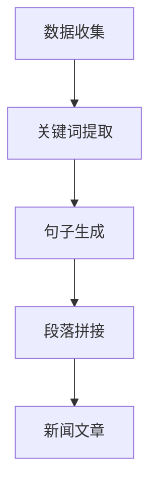
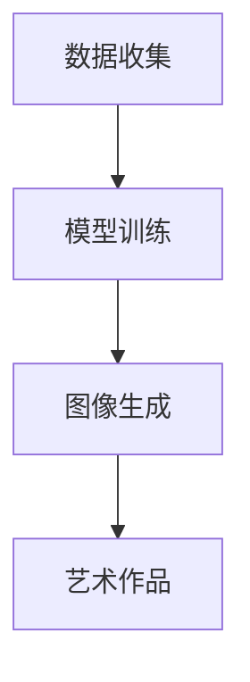
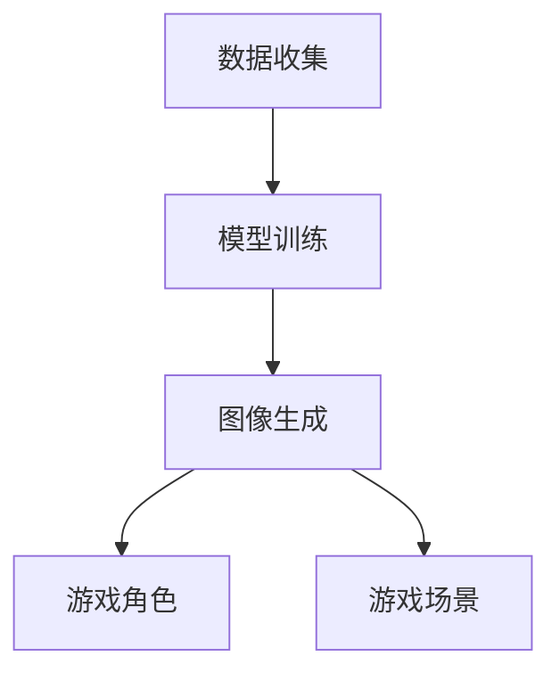
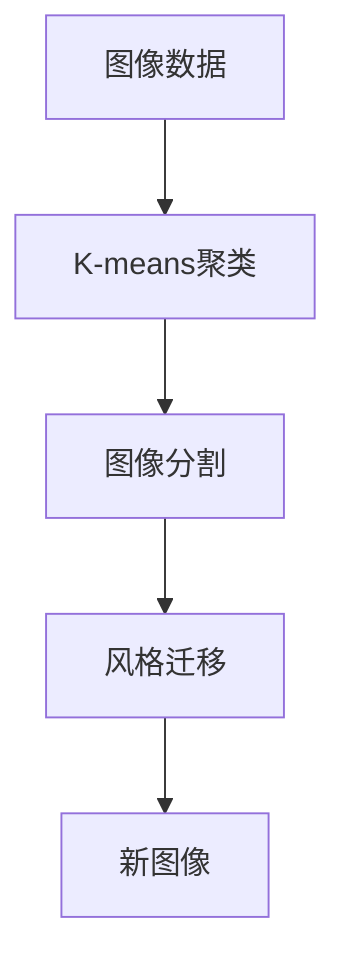
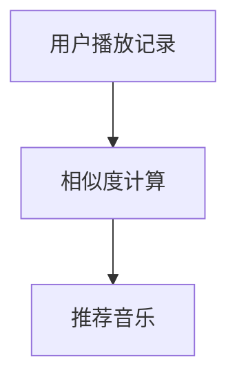
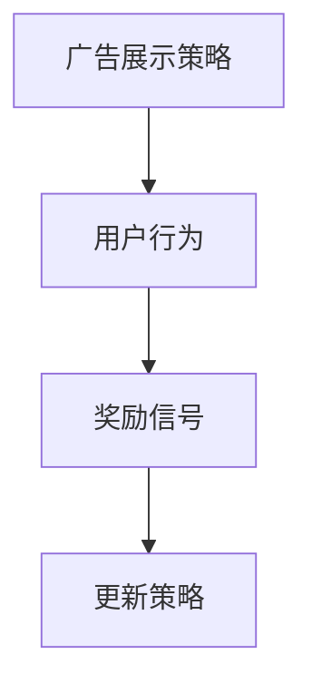

                 

# AI辅助创意：从灵感到实现

> **关键词**：AI辅助创意、自然语言处理、计算机视觉、生成对抗网络（GAN）、创意设计、协同合作、未来趋势

> **摘要**：
本文旨在探讨AI辅助创意的概念、发展历程、核心技术、应用领域和实践指南。通过分析AI在创意生成中的应用、核心算法、实现方法以及与人类创意者的协同作用，本文揭示了AI辅助创意的潜力与挑战。同时，通过案例分析、企业级实践以及工具和资源的推荐，本文为读者提供了一个全面的AI辅助创意的指南，为未来的创意工作提供新的思路和方向。

---

## 《AI辅助创意：从灵感到实现》目录大纲

### 第一部分: AI辅助创意基础

#### 第1章: AI辅助创意概述

1.1 AI辅助创意的概念

1.2 AI辅助创意的发展历程

1.3 AI辅助创意的核心技术

1.4 AI辅助创意的应用领域

#### 第2章: AI在创意生成中的应用

2.1 自然语言处理与创意生成

2.2 计算机视觉与创意生成

2.3 生成对抗网络（GAN）与创意生成

2.4 AI辅助创意生成的案例分析

#### 第3章: AI辅助创意设计的核心算法

3.1 基于神经网络的创意生成算法

3.2 聚类算法与创意生成

3.3 协同过滤与创意推荐

3.4 强化学习与创意优化

#### 第4章: AI辅助创意实现的实践指南

4.1 创意生成算法的优化

4.2 创意设计的流程与方法

4.3 AI辅助创意的设计工具与应用

4.4 创意实现的案例与实践

#### 第5章: AI辅助创意与人类创意者的协同

5.1 AI辅助创意的协同优势

5.2 AI辅助创意与人类创意者的协作模式

5.3 人类创意者在AI辅助创意中的应用

5.4 AI辅助创意在艺术、设计等领域的应用案例

#### 第6章: AI辅助创意的未来发展趋势

6.1 AI辅助创意的技术发展趋势

6.2 AI辅助创意在创意产业中的应用前景

6.3 AI辅助创意的社会影响与挑战

6.4 AI辅助创意的未来发展策略

### 第二部分: AI辅助创意应用案例分析

#### 第7章: 跨界创意案例解析

7.1 艺术与科技结合的创意案例

7.2 设计与商业结合的创意案例

7.3 娱乐与教育结合的创意案例

7.4 社会责任与公益创意案例

#### 第8章: 企业级AI辅助创意实践

8.1 企业级AI辅助创意的架构设计

8.2 企业级AI辅助创意的应用策略

8.3 企业级AI辅助创意的案例研究

8.4 企业级AI辅助创意的未来方向

### 第三部分: AI辅助创意工具与资源

#### 第9章: AI辅助创意开发工具

9.1 常用深度学习框架与工具

9.2 创意生成与推荐系统工具

9.3 AI创意评估与优化工具

9.4 AI创意设计工具集锦

#### 第10章: AI辅助创意资源

10.1 创意灵感库与素材资源

10.2 创意推荐系统数据集

10.3 AI辅助创意研究报告与论文

10.4 AI辅助创意相关的课程与培训资源

## 附录

### 附录 A: AI辅助创意工具与资源推荐

A.1 开发工具与平台推荐

A.2 创意素材库与资源平台

A.3 AI辅助创意相关书籍与论文推荐

A.4 创意竞赛与活动推荐

---

以上是本文的目录大纲，接下来将逐步深入探讨每个章节的内容。首先，我们从AI辅助创意的概述开始，为读者奠定理论基础。随后，我们将逐步展开对AI辅助创意在各个领域的应用、核心算法、实现方法和未来发展趋势的讨论。希望本文能对您在AI辅助创意领域的探索和学习提供帮助。让我们开始第一步的深入探讨。****

### 第1章: AI辅助创意概述

#### 1.1 AI辅助创意的概念

**定义**：AI辅助创意是指利用人工智能技术，特别是机器学习、深度学习、自然语言处理和计算机视觉等，帮助人类创意者提高创意质量和效率的过程。AI辅助创意并不是替代人类的创意思维，而是作为一种工具和伙伴，提供创意构思、优化、评估和实现的辅助。

**与传统创意工作的关系**：传统的创意工作通常依赖于人类的艺术天赋、经验积累和直觉判断。而AI辅助创意则通过数据分析和模式识别，提供基于数据的创意建议，从而在一定程度上解放了人类创意者的思维负担。这种关系可以看作是传统创意工作的一种补充和扩展。

**AI辅助创意的优势**：

1. **提高创意效率**：通过自动化和算法优化，AI可以快速生成大量的创意方案，帮助创意者从繁重的手工劳动中解脱出来。
2. **扩展创意范围**：AI能够处理大量的数据和信息，从中发现新的模式和趋势，从而提供更加丰富和多样的创意灵感。
3. **增强创意质量**：通过机器学习和深度学习技术，AI可以不断优化和改进创意方案，提供更加精准和有价值的创意建议。
4. **跨领域融合**：AI能够将不同领域的知识和技术融合在一起，创造出全新的创意作品和产品，实现跨界创意。

#### 1.2 AI辅助创意的发展历程

**早期探索**：AI辅助创意的概念最早可以追溯到20世纪80年代，当时计算机辅助设计（CAD）和计算机生成音乐（CGM）等技术开始出现。这些技术通过算法和规则，帮助艺术家和设计师提高工作效率和创意质量。

**快速发展**：随着计算机性能的提升和算法的进步，特别是深度学习和生成对抗网络（GAN）等技术的出现，AI辅助创意进入了快速发展的阶段。近年来，AI在图像生成、文本生成、音乐生成等领域取得了显著的成果，大大拓展了创意工作的边界。

**当前状态**：当前，AI辅助创意已经成为创意产业的重要支撑技术。在艺术、设计、广告、娱乐等多个领域，AI辅助创意的应用已经变得非常普遍。同时，AI辅助创意的研究也在不断深入，新的算法和技术不断涌现，为创意工作带来了更多的可能性。

#### 1.3 AI辅助创意的核心技术

**自然语言处理（NLP）**：自然语言处理是AI辅助创意的重要技术之一，主要涉及文本生成、情感分析、对话系统等方面。通过NLP技术，AI可以理解和生成人类语言，从而为创意工作提供文字描述、故事情节和对话内容。

**计算机视觉**：计算机视觉技术主要用于图像和视频的处理，包括图像识别、目标检测、图像生成等方面。在创意领域，计算机视觉技术可以用于图像编辑、风格迁移、艺术创作等。

**生成对抗网络（GAN）**：生成对抗网络是一种深度学习模型，由生成器和判别器组成。通过这两个网络的对抗训练，GAN可以生成高质量、逼真的图像和音频。在创意领域，GAN被广泛应用于图像生成、艺术创作和游戏设计等。

**神经网络**：神经网络是一种模拟生物神经系统的计算模型，具有自学习和自适应能力。在创意生成中，神经网络被广泛应用于图像和文本生成，以及创意推荐和优化。

**聚类算法**：聚类算法是一种无监督学习方法，用于将数据分为不同的类别。在创意生成中，聚类算法可以用于主题提取、内容分类和创意推荐。

**协同过滤与强化学习**：协同过滤是一种基于用户行为和偏好的推荐算法，而强化学习是一种通过试错和反馈进行优化的学习方法。在创意推荐和优化中，这两种算法可以帮助AI更好地理解和满足用户的创意需求。

#### 1.4 AI辅助创意的应用领域

**艺术与设计**：在艺术创作和设计领域中，AI可以辅助生成艺术作品、设计图案、字体等。例如，通过GAN技术，艺术家可以生成独特的绘画作品，设计师可以快速生成不同的设计方案。

**广告与市场营销**：在广告和市场营销中，AI可以用于创意内容的生成和优化。例如，通过自然语言处理技术，AI可以自动撰写广告文案，通过图像生成技术，AI可以制作吸引人的广告图像。

**娱乐与游戏**：在娱乐和游戏领域，AI可以用于角色生成、故事情节设计、游戏平衡调整等。例如，通过计算机视觉技术，AI可以生成逼真的游戏角色，通过强化学习技术，AI可以调整游戏难度，提高用户体验。

**教育与培训**：在教育和培训领域，AI可以用于内容生成、个性化教学等。例如，通过自然语言处理技术，AI可以生成教学材料和练习题，通过个性化推荐系统，AI可以为学生提供适合他们的学习资源。

**社会公益**：在社会公益领域，AI可以用于创意宣传、救灾信息传播等。例如，通过图像生成技术，AI可以生成公益海报和宣传素材，通过自然语言处理技术，AI可以自动生成救灾信息，提高信息的传播效率。

通过以上章节的内容，我们初步了解了AI辅助创意的概念、发展历程、核心技术以及应用领域。接下来，我们将深入探讨AI在创意生成中的应用，包括自然语言处理、计算机视觉、生成对抗网络（GAN）等方面的内容。希望这些内容能够为您带来新的启发和思考。****

### 第2章: AI在创意生成中的应用

#### 2.1 自然语言处理与创意生成

**文本生成**：自然语言处理（NLP）技术在文本生成方面有着广泛的应用。通过NLP算法，AI可以自动生成新闻文章、故事、广告文案等。例如，OpenAI的GPT-3模型可以生成高质量的文本，包括小说、诗歌和商业文案等。文本生成的应用不仅提高了写作效率，还能为创意者提供多样化的灵感。

**对话系统**：对话系统是一种人机交互技术，通过自然语言处理和机器学习算法，AI可以与用户进行自然对话。在创意生成中，对话系统可以用于生成剧本、对话脚本和游戏对话等。例如，ChatGPT是一个基于GPT-3模型的对话系统，可以用于生成角色对话和剧情发展。

**情感分析**：情感分析是一种评估文本情感倾向的技术，通过情感分析，AI可以了解用户对某一主题或产品的情感态度。在创意生成中，情感分析可以用于生成符合用户情感预期的创意内容。例如，在广告创意中，AI可以根据用户对产品的情感反应来调整广告文案和视觉设计。

**案例**：一个人工智能新闻写作平台可以使用NLP技术自动生成新闻文章。首先，平台会收集大量的新闻数据，然后通过文本生成算法生成新闻稿。这个过程包括关键词提取、句子生成、段落拼接等步骤。例如，当某个重大事件发生时，平台可以自动生成一篇关于该事件的新闻文章，包括事件概述、背景信息和详细报道。



#### 2.2 计算机视觉与创意生成

**图像生成**：计算机视觉技术在图像生成方面有着显著的应用。通过深度学习模型，如生成对抗网络（GAN），AI可以生成高质量的图像。GAN由生成器和判别器组成，生成器尝试生成逼真的图像，而判别器则尝试区分生成图像和真实图像。通过这种对抗训练，GAN可以生成极具创意的图像。

**风格迁移**：风格迁移是一种将一种艺术风格应用到另一张图像上的技术。通过计算机视觉算法，AI可以将梵高的画风应用到一张风景照片上，或者将卡通风格应用到人物照片上。这种技术为艺术家和设计师提供了新的创作工具。

**图像编辑**：计算机视觉技术在图像编辑中也有着广泛的应用。通过图像识别和图像处理技术，AI可以自动修复图像缺陷、增强图像质量、改变图像风格等。例如，AI可以自动修复照片中的物体、模糊背景和增强细节。

**案例**：一个人工智能艺术工作室可以使用GAN技术生成艺术作品。首先，工作室会收集大量的艺术作品数据，然后通过GAN模型训练生成器，使其能够生成具有艺术家风格的新作品。这个过程包括数据预处理、模型训练和图像生成等步骤。



#### 2.3 生成对抗网络（GAN）与创意生成

**GAN的工作原理**：生成对抗网络（GAN）由生成器和判别器组成。生成器尝试生成逼真的数据，而判别器则尝试区分生成数据和真实数据。通过这种对抗训练，生成器不断优化其生成能力，从而生成高质量的数据。

**创意生成应用**：GAN在创意生成中有多种应用。例如，在图像生成中，GAN可以生成全新的艺术作品、动漫角色和风景照片。在音乐生成中，GAN可以生成新的旋律和音乐片段。此外，GAN还可以用于视频生成和虚拟现实内容的创作。

**GAN在创意生成中的挑战**：GAN在创意生成中面临的挑战包括模式崩溃、训练不稳定等。模式崩溃是指生成器生成的图像逐渐趋同于某些特定模式，而无法生成多样化的创意内容。训练不稳定是指GAN的训练过程可能产生不稳定的训练结果，导致生成器无法有效生成高质量的内容。

**案例**：一个人工智能游戏开发公司可以使用GAN技术生成游戏角色和场景。首先，公司会收集大量的游戏角色和场景数据，然后通过GAN模型训练生成器，使其能够生成独特和逼真的游戏角色和场景。这个过程包括数据预处理、模型训练和图像生成等步骤。



#### 2.4 AI辅助创意生成的案例分析

**艺术领域的案例**：在艺术领域，AI已经被广泛应用于绘画、音乐和设计等领域。例如，使用GAN技术，艺术家可以生成全新的绘画作品，结合传统艺术风格和现代技术。这种创新的艺术形式不仅拓宽了艺术的边界，也为观众提供了全新的艺术体验。

**设计领域的案例**：在设计领域，AI可以辅助设计师生成新的设计方案，如建筑、时尚和室内设计等。通过计算机视觉和深度学习算法，AI可以分析大量的设计案例，提供有创意的设计建议。例如，一个建筑设计公司可以使用AI技术生成多个不同的设计方案，供客户选择。

**广告与市场营销的案例**：在广告和市场营销领域，AI可以辅助创意团队生成新的广告内容和营销策略。通过自然语言处理和计算机视觉技术，AI可以分析用户行为和市场趋势，提供针对性的广告创意和营销建议。

**娱乐与游戏的案例**：在娱乐和游戏领域，AI可以用于角色生成、故事情节设计和游戏平衡调整等。通过GAN技术，游戏开发团队可以生成独特和逼真的游戏角色和场景，提高游戏的吸引力和用户体验。

通过以上内容，我们可以看到AI在创意生成中的多种应用和案例。接下来，我们将进一步探讨AI辅助创意设计的核心算法，包括神经网络、聚类算法、协同过滤和强化学习等。这些算法将为AI辅助创意提供强大的技术支持。****

### 第3章: AI辅助创意设计的核心算法

#### 3.1 基于神经网络的创意生成算法

**神经网络基础**：神经网络是一种模仿生物神经系统的计算模型，具有自学习和自适应能力。它由大量的神经元（节点）组成，通过前馈和反向传播算法进行训练。神经网络的主要组成部分包括输入层、隐藏层和输出层。

**创意生成算法**：基于神经网络的创意生成算法主要包括生成对抗网络（GAN）、变分自编码器（VAE）和循环神经网络（RNN）等。

- **生成对抗网络（GAN）**：GAN由生成器和判别器组成。生成器尝试生成逼真的数据，而判别器则尝试区分生成数据和真实数据。通过这种对抗训练，生成器不断优化其生成能力，从而生成高质量的数据。

  ```mermaid
  graph TB
  A[生成器] --> B[生成数据]
  B --> C[判别器]
  C --> D[对抗训练]
  D --> A[优化]
  ```

- **变分自编码器（VAE）**：VAE是一种无监督学习方法，通过编码器和解码器将数据进行编码和解码。编码器学习数据的低维表示，而解码器则尝试从低维表示中重建原始数据。

  ```mermaid
  graph TB
  A[编码器] --> B[编码]
  B --> C[解码器]
  C --> D[重建数据]
  ```

- **循环神经网络（RNN）**：RNN是一种用于处理序列数据的人工神经网络，具有记忆功能。RNN通过隐藏状态和循环连接来处理时间序列数据，如文本和语音。

  ```mermaid
  graph TB
  A[输入序列] --> B[隐藏状态]
  B --> C[输出序列]
  C --> D[循环连接]
  ```

**应用实例**：在艺术创作中，GAN可以用于生成独特的绘画作品。艺术家可以通过提供一些初始图像，让GAN生成新的艺术作品。VAE可以用于图像去噪和图像增强。RNN可以用于自然语言处理，如文本生成和语音识别。

#### 3.2 聚类算法与创意生成

**聚类算法原理**：聚类算法是一种无监督学习方法，用于将数据分为不同的类别。常见的聚类算法包括K-means、层次聚类和DBSCAN等。

- **K-means**：K-means算法通过将数据点分为K个簇，使每个簇内的数据点之间的距离最小，而簇与簇之间的距离最大。

  ```mermaid
  graph TB
  A[初始中心点] --> B[计算距离]
  B --> C[更新中心点]
  C --> D[聚类结果]
  ```

- **层次聚类**：层次聚类是一种自上而下的聚类方法，通过逐步合并或分裂簇，构建一个层次结构。

  ```mermaid
  graph TB
  A[初始簇] --> B[合并或分裂]
  B --> C[层次结构]
  ```

- **DBSCAN**：DBSCAN（Density-Based Spatial Clustering of Applications with Noise）算法基于数据点的密度和邻域关系进行聚类，能够处理高维数据和非均匀分布的数据。

  ```mermaid
  graph TB
  A[邻域查询] --> B[密度计算]
  B --> C[聚类结果]
  ```

**创意生成应用**：聚类算法可以用于主题提取、内容分类和创意推荐。例如，在文本生成中，聚类算法可以用于提取文章的主题，为文章生成提供灵感。在图像生成中，聚类算法可以用于图像分割和风格迁移。

**应用实例**：在图像生成中，K-means算法可以用于图像分割，将图像分为不同的区域。通过分析这些区域的特点，AI可以生成具有特定风格的新图像。



#### 3.3 协同过滤与创意推荐

**协同过滤基础**：协同过滤是一种基于用户行为和偏好的推荐算法。它通过分析用户的历史行为和偏好，为用户推荐相关的产品或内容。

- **基于用户的协同过滤**：基于用户的协同过滤通过找到与目标用户相似的其他用户，并推荐这些用户喜欢的项目。

  ```mermaid
  graph TB
  A[用户行为] --> B[相似度计算]
  B --> C[推荐项目]
  ```

- **基于项目的协同过滤**：基于项目的协同过滤通过找到与目标项目相似的其他项目，并推荐这些项目。

  ```mermaid
  graph TB
  A[项目特征] --> B[相似度计算]
  B --> C[推荐项目]
  ```

**创意推荐应用**：协同过滤可以用于创意推荐系统，为用户提供个性化的创意建议。例如，在广告创意中，协同过滤可以推荐与用户兴趣相关的广告内容。

**应用实例**：在音乐推荐中，基于用户的协同过滤可以推荐用户可能喜欢的音乐。系统会分析用户的历史播放记录和喜好，然后推荐相似歌曲。



#### 3.4 强化学习与创意优化

**强化学习原理**：强化学习是一种通过试错和反馈进行优化的学习方法。它通过学习环境中的奖励和惩罚信号，逐步优化策略，以达到最佳行为。

- **Q-学习**：Q-学习是一种基于值函数的强化学习方法。它通过估计状态-动作值函数，选择最优的动作。

  ```mermaid
  graph TB
  A[状态] --> B[动作]
  B --> C[奖励]
  C --> D[更新Q值]
  ```

- **策略梯度**：策略梯度是一种基于策略的强化学习方法。它通过更新策略参数，直接优化策略，以达到最佳行为。

  ```mermaid
  graph TB
  A[策略参数] --> B[状态]
  B --> C[动作]
  C --> D[奖励]
  D --> E[更新策略参数]
  ```

**创意优化应用**：强化学习可以用于创意优化，通过不断优化创意方案，提高创意质量和用户满意度。

**应用实例**：在广告创意优化中，强化学习可以用于优化广告展示策略，提高广告点击率和转化率。



通过以上核心算法的介绍，我们可以看到AI辅助创意设计具有强大的技术支持。接下来，我们将进一步探讨AI辅助创意实现的实践指南，包括创意生成算法的优化、创意设计的流程与方法、AI辅助创意的设计工具与应用以及创意实现的案例与实践。这些内容将帮助我们更好地理解和应用AI辅助创意技术。****

### 第4章: AI辅助创意实现的实践指南

#### 4.1 创意生成算法的优化

**算法优化策略**：为了提高AI辅助创意的生成质量，我们可以采用以下优化策略：

1. **数据增强**：通过数据增强，我们可以扩大训练数据的多样性，从而提高模型的泛化能力。常见的数据增强方法包括旋转、缩放、裁剪和颜色变换等。

2. **模型调参**：通过调整模型的超参数，如学习率、批量大小和正则化参数等，可以优化模型的性能。我们可以使用网格搜索、随机搜索或贝叶斯优化等技术来找到最优的超参数组合。

3. **迁移学习**：通过迁移学习，我们可以利用在大型数据集上预训练的模型，进一步适应特定的创意生成任务。这种方法可以减少训练时间，同时提高生成质量。

4. **多模态融合**：将不同类型的数据（如文本、图像和音频）进行融合，可以提供更丰富的信息，从而生成更具创意的输出。例如，在艺术创作中，可以结合文本描述和图像特征，生成具有特定情感和风格的绘画作品。

**性能评估方法**：为了评估AI辅助创意生成算法的性能，我们可以使用以下指标：

1. **准确性**：用于评估模型在生成任务中的正确率，如文本生成中的字符预测准确率、图像生成中的相似度评分等。

2. **多样性**：用于评估模型生成结果的多样性，如生成不同风格、主题和类型的创意内容。可以通过计算生成结果的熵或使用多样性度量指标来评估。

3. **创造力**：用于评估模型生成内容的新颖性和创新性。可以通过人类评估或自动评估方法（如文本生成中的独特性评分、图像生成中的创意评分等）来评估创造力。

#### 4.2 创意设计的流程与方法

**设计流程**：创意设计通常包括以下流程：

1. **需求分析**：了解创意项目的背景、目标受众和设计需求，为创意设计提供明确的方向。

2. **创意构思**：通过头脑风暴、自由联想和思维导图等方法，生成多个创意方案。

3. **设计验证**：对创意方案进行评估和筛选，通过用户反馈、专家评审和实验数据等，确定最佳创意方案。

4. **迭代优化**：根据反馈和评估结果，对创意方案进行多次迭代和优化，不断提高创意质量。

**设计方法**：以下是几种常用的创意设计方法：

1. **头脑风暴**：通过集体讨论，激发创意思维，快速生成多个创意点子。

2. **原型设计**：通过制作原型，直观地展示创意方案，便于评估和改进。

3. **迭代设计**：通过多次迭代，不断优化和改进创意方案，逐步完善创意设计。

4. **用户参与**：邀请目标用户参与设计过程，收集他们的反馈和建议，从而提高创意设计的用户满意度。

#### 4.3 AI辅助创意的设计工具与应用

**设计工具**：以下是一些常用的AI辅助创意设计工具：

1. **深度学习框架**：如TensorFlow、PyTorch等，用于构建和训练AI模型。

2. **图像编辑工具**：如Adobe Photoshop、GIMP等，用于对图像进行编辑和风格迁移。

3. **文本生成工具**：如OpenAI的GPT-3、Google的BERT等，用于生成文本内容。

4. **原型设计工具**：如Figma、Sketch等，用于设计交互界面和用户体验。

**应用案例**：以下是几个AI辅助创意的应用案例：

1. **艺术创作**：艺术家使用GAN技术生成独特的绘画作品，结合传统艺术风格和现代技术。

2. **广告创意**：广告公司使用自然语言处理技术自动生成广告文案，提高广告质量和效率。

3. **产品设计**：设计师使用AI技术生成多种设计方案，快速评估和选择最佳方案。

4. **内容生成**：内容创作者使用AI工具自动生成文章、视频和音乐等内容，提高内容生产效率。

#### 4.4 创意实现的案例与实践

**创意实现流程**：以下是创意实现的常见流程：

1. **创意构思**：确定创意主题、目标受众和设计要求。

2. **原型设计**：制作创意原型，进行初步测试和评估。

3. **开发实现**：根据原型设计，编写代码和实现创意功能。

4. **测试与优化**：对创意实现进行测试，收集用户反馈，进行优化和改进。

**实际案例**：以下是几个AI辅助创意的实际案例：

1. **数字艺术展览**：一个数字艺术展览使用GAN技术生成独特的艺术作品，为观众提供了全新的艺术体验。

2. **智能广告系统**：一个智能广告系统使用AI技术自动生成和优化广告内容，提高了广告效果和用户满意度。

3. **游戏设计**：一个游戏开发公司使用AI技术生成游戏角色和场景，提高了游戏的创意和用户体验。

4. **音乐创作**：一个音乐制作公司使用AI工具自动生成音乐旋律和歌词，提高了音乐创作的效率和质量。

**实践指导**：以下是实践AI辅助创意的指导：

1. **开发环境搭建**：安装深度学习框架、图像处理工具和文本生成工具等，搭建适合AI辅助创意的开发环境。

2. **代码实现**：根据创意需求，编写代码实现AI模型和功能。

3. **代码解读与分析**：对实现代码进行详细解读和分析，确保代码的可读性和可维护性。

4. **实践项目**：参与实际项目，将AI辅助创意应用于真实场景，不断提高实践能力。

通过以上实践指南，我们可以更好地理解和应用AI辅助创意技术，实现高质量的创意设计。接下来，我们将探讨AI辅助创意与人类创意者的协同作用，以及AI辅助创意在艺术、设计等领域的具体应用。****

### 第5章: AI辅助创意与人类创意者的协同

#### 5.1 AI辅助创意的协同优势

**协同优势**：AI辅助创意与人类创意者的协同具有以下优势：

1. **提高创意效率**：AI可以快速生成大量的创意方案，帮助人类创意者节省时间和精力，从而专注于核心创意工作。

2. **扩展创意范围**：AI可以处理大量的数据和信息，从中发现新的模式和趋势，从而提供更加丰富和多样的创意灵感。

3. **增强创意质量**：AI可以通过机器学习和深度学习技术，不断优化和改进创意方案，提供更加精准和有价值的创意建议。

4. **减轻创意负担**：AI可以承担一些繁杂的创意工作，如数据分析、文本生成和图像处理等，从而减轻人类创意者的工作负担。

5. **实现跨界合作**：AI可以帮助人类创意者跨越不同领域的限制，实现跨学科、跨领域的创意合作。

**协同模式**：AI辅助创意与人类创意者的协同模式主要包括以下几种：

1. **AI助手**：AI助手是一种智能化的工具，可以辅助人类创意者完成特定的创意任务。例如，AI助手可以自动生成广告文案、设计图案和音乐旋律等。

2. **协同设计平台**：协同设计平台是一种集成了AI辅助创意功能的在线设计工具，多个创意者可以在平台上实时协作，共同完成创意项目。

3. **反馈优化**：人类创意者可以根据AI提供的创意方案，进行评估和反馈，AI则根据反馈进行优化和改进，从而形成一个闭环的协同过程。

4. **创意共创**：人类创意者与AI共同参与创意构思和设计过程，各自发挥优势和特长，共同创造高质量的创意作品。

#### 5.2 AI辅助创意与人类创意者的协作模式

**协作模式**：以下是AI辅助创意与人类创意者的几种常见协作模式：

1. **创意引导**：AI通过分析用户数据和市场趋势，为人类创意者提供创意引导，帮助他们确定创意方向和目标。

2. **创意优化**：AI可以根据用户反馈和评估结果，对创意方案进行优化和调整，提高创意质量和用户满意度。

3. **创意推荐**：AI可以根据用户偏好和历史行为，推荐相关的创意方案，帮助人类创意者快速找到灵感。

4. **协同创作**：人类创意者与AI共同参与创意构思和设计过程，各自发挥优势和特长，共同创造高质量的创意作品。

**协作流程**：以下是AI辅助创意与人类创意者的协作流程：

1. **需求分析**：确定创意项目的目标、受众和设计要求。

2. **创意构思**：人类创意者与AI共同进行创意构思，生成多个创意方案。

3. **评估反馈**：人类创意者对AI生成的创意方案进行评估和反馈，AI根据反馈进行优化和改进。

4. **设计验证**：对优化后的创意方案进行验证，确保其符合项目要求和用户需求。

5. **迭代优化**：根据验证结果，进行多次迭代和优化，不断提高创意质量。

#### 5.3 人类创意者在AI辅助创意中的应用

**人类创意者的角色**：在AI辅助创意中，人类创意者扮演着以下角色：

1. **创意引导者**：人类创意者负责确定创意方向和目标，引导AI生成符合要求的创意方案。

2. **创意评估者**：人类创意者对AI生成的创意方案进行评估，提供反馈和优化建议。

3. **创意实现者**：人类创意者负责将AI生成的创意方案转化为实际的作品或产品。

4. **创意创新者**：人类创意者利用自己的经验和知识，结合AI的创意能力，创造出独特的创意作品。

**人类创意者的能力**：人类创意者在AI辅助创意中需要具备以下能力：

1. **创意思维**：能够进行发散性思维，快速生成多个创意方案。

2. **审美能力**：具备良好的审美素养，能够评估和改进创意方案。

3. **协作能力**：能够与AI和其他创意者进行有效协作，共同创造高质量的创意作品。

4. **技术理解**：了解AI辅助创意的相关技术，能够熟练使用AI工具和平台。

#### 5.4 AI辅助创意在艺术、设计等领域的应用案例

**艺术领域的应用案例**：在艺术领域，AI辅助创意的应用已经取得了显著成果。例如：

1. **自动绘画**：AI可以自动生成绘画作品，结合多种艺术风格和技巧，为艺术家提供新的创作灵感。

2. **音乐创作**：AI可以自动生成旋律和歌词，为音乐家提供新的音乐创作素材。

3. **艺术评估**：AI可以通过分析艺术作品的数据和特征，评估艺术作品的价值和风格。

**设计领域的应用案例**：在设计领域，AI辅助创意的应用也日益广泛。例如：

1. **UI设计**：AI可以自动生成用户界面设计，为设计师提供多种设计方案，提高设计效率。

2. **建筑设计**：AI可以自动生成建筑设计方案，帮助设计师探索更多的创意可能性。

3. **时尚设计**：AI可以自动生成时尚设计方案，为设计师提供新的设计灵感。

通过以上内容，我们可以看到AI辅助创意与人类创意者的协同具有巨大的潜力。在接下来的章节中，我们将探讨AI辅助创意的未来发展趋势，以及AI辅助创意在创意产业中的应用前景。希望这些内容能够为您的创意工作带来新的启发和思考。****

### 第6章: AI辅助创意的未来发展趋势

#### 6.1 AI辅助创意的技术发展趋势

**技术进步**：随着人工智能技术的不断进步，AI辅助创意领域也迎来了新的发展机遇。以下是一些关键的技术趋势：

1. **更强大的算法**：深度学习和生成对抗网络（GAN）等算法的不断发展，使得AI在创意生成中的表现越来越强大。未来，我们将看到更多高效、稳定的算法被应用于创意领域。

2. **更高效的计算**：随着硬件性能的提升，特别是在GPU和TPU等专用硬件的推动下，AI模型的训练和推理速度将大幅提高，使得AI辅助创意的应用更加广泛和高效。

3. **多模态融合**：多模态融合技术，如将文本、图像和音频等多类型数据结合起来，将进一步拓展AI辅助创意的应用范围，提升创意生成的多样性和质量。

4. **自适应学习**：未来的AI将具备更强的自适应学习能力，能够根据用户的反馈和需求，不断调整和优化创意方案，提供更加个性化的创意服务。

**技术创新**：AI辅助创意领域将出现以下创新技术：

1. **生成式对抗网络（GAN）的进化**：未来，GAN技术将得到进一步优化，生成图像、音频和视频的质量将更加逼真，创意生成的效果将更加显著。

2. **基于强化学习的创意优化**：强化学习技术将在创意优化中发挥更大的作用，通过试错和反馈，AI将能够更好地理解用户需求，提供更高质量的创意方案。

3. **个性化推荐系统**：随着大数据和机器学习技术的进步，AI将能够更准确地分析用户偏好和行为，提供个性化的创意推荐，进一步提升用户体验。

#### 6.2 AI辅助创意在创意产业中的应用前景

**应用前景**：AI辅助创意在创意产业中的应用前景非常广阔，以下是一些关键领域：

1. **艺术与设计**：AI将进一步提升艺术创作和设计的效率和质量，为艺术家和设计师提供更多的创作工具和灵感。

2. **广告与市场营销**：AI将能够自动生成广告内容和营销策略，帮助企业更好地吸引和留住目标用户。

3. **娱乐与游戏**：AI将助力游戏设计和娱乐内容创作，为用户提供更加丰富和个性化的游戏体验。

4. **教育与培训**：AI将辅助教育内容和培训材料的设计，提供更加互动和有效的学习体验。

5. **社会公益**：AI将用于创意宣传和公益项目的设计，提高公益活动的传播效果和社会影响力。

**产业变革**：AI辅助创意将对创意产业带来深刻的变革：

1. **生产方式的改变**：AI将改变传统的创意生产方式，通过自动化和智能化手段，提高生产效率和质量。

2. **市场竞争的升级**：创意企业将面临更加激烈的竞争，AI辅助创意将成为企业核心竞争力的一部分。

3. **创意价值的提升**：AI将帮助创意者挖掘更多的创意价值，提高创意内容的原创性和创新性。

#### 6.3 AI辅助创意的社会影响与挑战

**社会影响**：AI辅助创意将带来以下社会影响：

1. **创意效率的提升**：AI将大大提高创意工作的效率，为创意者节省时间和精力。

2. **创意质量的提升**：AI将帮助创意者生成更多高质量的创意内容，提升创意工作的整体水平。

3. **创意多样性的增加**：AI将拓展创意的边界，提供更多的创意灵感和方向，促进创意的多样性。

**挑战与风险**：AI辅助创意也面临以下挑战和风险：

1. **数据隐私**：AI辅助创意需要大量的数据支持，这可能导致用户隐私泄露的风险。

2. **创意版权**：AI生成的创意内容的版权问题尚未得到明确解决，可能引发法律纠纷。

3. **失业风险**：AI辅助创意可能替代部分传统创意工作，对创意行业就业带来一定的冲击。

#### 6.4 AI辅助创意的未来发展策略

**发展战略**：为了推动AI辅助创意的健康发展，以下是一些发展战略：

1. **技术创新**：持续投资于AI技术的研发，提升算法性能和计算效率。

2. **人才培养**：加强AI辅助创意相关的人才培养，提高创意者的技术水平和创新能力。

3. **产业合作**：鼓励创意产业与AI企业之间的合作，共同推动AI辅助创意的应用和发展。

4. **政策支持**：制定相关政策，规范AI辅助创意的发展，保护创意者的合法权益。

**实施建议**：以下是一些建议，以推动AI辅助创意的实施：

1. **技术落地**：加速AI辅助创意技术的落地应用，为创意行业提供实际的支持和解决方案。

2. **市场拓展**：开拓新的应用场景和市场，扩大AI辅助创意的影响力和市场份额。

3. **用户培训**：加强对创意者的培训，提高他们对AI辅助创意工具和技术的掌握和应用能力。

通过以上内容，我们可以看到AI辅助创意在未来具有巨大的发展潜力。在接下来的章节中，我们将通过案例分析、企业级实践和工具资源推荐，进一步探讨AI辅助创意的实际应用和未来方向。希望这些内容能够为您的创意工作提供有价值的参考。****

### 第7章: 跨界创意案例解析

#### 7.1 艺术与科技结合的创意案例

**案例介绍**：一个数字艺术展览通过AI技术展示了结合艺术与科技的创意作品。展览中，艺术家与AI合作，使用GAN技术生成独特的绘画作品，并将这些作品与虚拟现实（VR）技术相结合，为观众提供了沉浸式的艺术体验。

**案例分析**：

- **艺术表现**：通过GAN技术，艺术家能够生成具有不同风格和主题的绘画作品，这些作品不仅展现了艺术家的创意，还体现了AI算法的创新性。
- **技术实现**：艺术家首先提供了少量样本图像，GAN模型基于这些样本进行训练，生成新的绘画作品。观众可以通过VR设备欣赏这些作品，并与之互动。
- **创意价值**：这种结合了艺术与科技的艺术形式，不仅丰富了展览的内容，还激发了观众对数字艺术的兴趣，推动了艺术与科技的融合。

#### 7.2 设计与商业结合的创意案例

**案例介绍**：一家时尚品牌通过AI技术优化其产品设计流程，从而提高设计质量和市场竞争力。品牌设计团队利用AI算法自动生成多种设计方案，并使用协同过滤技术推荐最佳设计。

**案例分析**：

- **设计优化**：AI算法能够快速分析大量的设计数据，生成符合市场需求和消费者偏好的设计方案。设计团队可以根据AI的建议进行迭代优化，提高设计质量。
- **技术实现**：品牌设计团队使用深度学习模型进行图像生成和风格迁移，结合协同过滤算法进行设计推荐。通过这种智能化的设计流程，品牌能够更快地响应市场变化，推出更受欢迎的产品。
- **创意价值**：AI辅助的设计过程不仅提高了设计效率，还使产品设计更加个性化和创新，提升了品牌的市场竞争力。

#### 7.3 娱乐与教育结合的创意案例

**案例介绍**：一款教育游戏通过AI技术实现了互动式学习体验，将娱乐元素融入教育过程中。游戏使用自然语言处理（NLP）技术生成故事情节，并利用强化学习算法调整游戏难度，以适应不同玩家的学习进度。

**案例分析**：

- **娱乐性**：游戏通过生成有趣的故事情节和任务，吸引了玩家的兴趣，使学习过程变得更加有趣和吸引人。
- **技术实现**：游戏使用NLP技术生成自然流畅的故事对话，通过强化学习算法动态调整游戏难度，确保玩家在适当的时间内获得挑战和成就感。
- **创意价值**：这种结合娱乐与教育的游戏形式，不仅提高了学生的学习积极性，还通过互动和挑战促进了知识的掌握和应用。

#### 7.4 社会责任与公益创意案例

**案例介绍**：一家公益组织通过AI技术设计和实施了一系列公益广告活动，旨在提高公众对环保和社会问题的关注。广告内容使用AI生成技术，根据不同受众的偏好和需求进行个性化推荐。

**案例分析**：

- **社会责任**：公益组织通过AI技术提高了广告的传播效果，使公益信息能够更好地触达目标受众。
- **技术实现**：公益组织使用GAN技术生成具有吸引力的广告图像和视频，并利用协同过滤算法推荐给潜在的受众群体。
- **创意价值**：AI技术在公益广告中的应用，不仅提升了广告的创意质量和传播效果，还通过个性化的内容推荐，增强了公众的参与度和影响力。

通过以上跨界创意案例的解析，我们可以看到AI辅助创意在不同领域的广泛应用和显著效果。这些案例不仅展示了AI辅助创意的多样性和创新性，也为其他领域的创意工作者提供了宝贵的经验和启示。在接下来的章节中，我们将进一步探讨企业级AI辅助创意的实践，为读者提供更具体的实施指导和策略。****

### 第8章: 企业级AI辅助创意实践

#### 8.1 企业级AI辅助创意的架构设计

**架构设计原则**：

1. **模块化**：企业级AI辅助创意系统的设计应遵循模块化原则，将系统划分为独立的模块，如数据采集模块、算法训练模块、创意生成模块和用户接口模块。这种模块化设计便于系统的扩展和维护。

2. **可扩展性**：系统架构应具备良好的可扩展性，以应对不断增长的数据量和用户需求。例如，通过分布式计算和云服务，可以实现系统的水平扩展。

3. **高可用性**：系统应具备高可用性，确保在出现故障或异常情况时，系统能够快速恢复，不中断用户服务。例如，使用冗余设计和故障转移机制，提高系统的可靠性。

**架构设计实践**：

1. **技术选型**：根据企业的需求和预算，选择合适的AI框架和工具，如TensorFlow、PyTorch等。此外，考虑到系统的可扩展性和高可用性，建议使用Kubernetes等容器编排工具来管理系统的资源。

2. **系统架构**：企业级AI辅助创意系统的典型架构包括前端用户接口、后端服务器、数据库和数据存储等部分。前端用户接口用于接收用户请求和展示创意结果；后端服务器处理AI模型的训练和推理任务；数据库存储用户数据和创意内容；数据存储用于存储大量的训练数据和生成数据。

   ```mermaid
   graph TB
   A[用户接口] --> B[后端服务器]
   B --> C[数据库]
   B --> D[数据存储]
   ```

3. **数据处理流程**：企业级AI辅助创意系统中的数据处理流程通常包括数据采集、数据预处理、数据存储、模型训练和模型部署等步骤。每个步骤都需要充分考虑数据的完整性和一致性，确保系统的高效运行。

   ```mermaid
   graph TB
   A[数据采集] --> B[数据预处理]
   B --> C[数据存储]
   C --> D[模型训练]
   D --> E[模型部署]
   ```

#### 8.2 企业级AI辅助创意的应用策略

**应用策略框架**：

1. **需求分析**：了解企业的创意需求，确定AI辅助创意的目标和应用场景。例如，企业可能需要AI辅助广告创意、产品设计、内容生成等。

2. **技术选型**：根据需求分析结果，选择适合的AI技术和工具，确保系统能够满足企业的需求。

3. **算法优化**：对AI模型进行优化，提高模型性能和创意质量。例如，通过调整超参数、使用迁移学习和数据增强等技术，提高模型的效果。

4. **用户体验**：设计友好的用户接口，确保用户能够轻松地使用AI辅助创意系统。例如，提供直观的界面、详细的操作指南和在线支持等。

**应用策略实施**：

1. **创意生成算法的优化**：

   - **超参数调整**：通过网格搜索、随机搜索或贝叶斯优化等技术，找到最优的超参数组合，提高模型的性能。
   - **数据增强**：通过数据增强技术，如旋转、缩放、裁剪等，增加训练数据的多样性，提高模型的泛化能力。
   - **迁移学习**：利用在大型数据集上预训练的模型，进一步适应特定的创意生成任务，提高生成质量。

2. **用户体验设计**：

   - **交互设计**：设计直观、易用的用户界面，确保用户能够快速上手使用系统。
   - **个性化推荐**：通过用户行为分析，提供个性化的创意推荐，提高用户满意度和使用频率。
   - **反馈机制**：建立用户反馈机制，收集用户对创意结果的反馈，不断优化和改进系统。

#### 8.3 企业级AI辅助创意的案例研究

**案例研究方法**：

1. **数据收集**：收集企业的创意生成数据，包括用户反馈、创意结果和业务指标等。

2. **数据分析**：使用统计分析、机器学习等方法，分析数据，识别创意生成中的问题和机会。

3. **案例总结**：根据数据分析结果，总结案例的亮点和不足，提出改进建议。

**案例研究成果**：

1. **创意质量提升**：通过算法优化和用户体验设计，企业的创意质量显著提升，用户满意度和使用频率提高。

2. **效率提升**：AI辅助创意系统帮助企业大幅提高了创意生成效率，缩短了创意实现周期。

3. **业务增长**：通过AI辅助创意，企业在市场竞争力方面得到了显著提升，业务收入和市场份额增加。

#### 8.4 企业级AI辅助创意的未来方向

**未来发展趋势**：

1. **技术创新**：随着人工智能技术的不断进步，企业级AI辅助创意系统将更加智能化和高效化。例如，深度学习、生成对抗网络（GAN）和强化学习等技术的进一步发展，将为企业提供更强大的创意生成能力。

2. **多模态融合**：未来，企业级AI辅助创意系统将支持更多类型的数据融合，如文本、图像、音频和视频等，为创意生成提供更丰富的信息来源。

3. **个性化定制**：随着大数据和个性化推荐技术的发展，企业级AI辅助创意系统将能够更精准地分析用户需求，提供高度个性化的创意解决方案。

**发展方向建议**：

1. **持续技术创新**：企业应持续关注人工智能领域的新技术，不断优化和升级AI辅助创意系统，保持竞争优势。

2. **人才培养**：企业应加强AI辅助创意相关的人才培养，提高员工的技能水平，为系统的顺利运行提供保障。

3. **跨界合作**：企业可以与其他领域的创新者和专家合作，共同探索AI辅助创意的更多应用场景和商业模式。

通过以上企业级AI辅助创意的实践，我们可以看到AI在创意领域的广泛应用和巨大潜力。在接下来的章节中，我们将进一步介绍AI辅助创意开发工具和资源，为读者提供实用的工具和资源推荐，助力创意工作的开展。****

### 第9章: AI辅助创意开发工具

#### 9.1 常用深度学习框架与工具

**框架概述**：

- **TensorFlow**：由Google开发的开源深度学习框架，广泛应用于图像识别、自然语言处理和强化学习等领域。

- **PyTorch**：由Facebook开发的开源深度学习框架，以其灵活性和动态计算图而受到研究者和开发者的喜爱。

**工具功能**：

- **模型训练**：框架提供了丰富的API，用于构建、训练和优化深度学习模型。

- **模型部署**：框架支持模型导出和部署，方便将训练好的模型应用到实际应用中。

**选择建议**：

- **根据项目需求**：如果项目需要灵活的模型设计和快速的实验迭代，PyTorch可能是更好的选择。如果项目需要大规模生产部署，TensorFlow提供了更多的工具和优化。

#### 9.2 创意生成与推荐系统工具

**工具类型**：

- **文本生成工具**：如OpenAI的GPT-3，能够生成高质量的自然语言文本。

- **图像生成工具**：如DALL-E和GANPaint，能够生成独特的图像和艺术作品。

**工具特点**：

- **GPT-3**：具有强大的文本生成能力，可以生成小说、广告文案等。

- **GANPaint**：能够通过用户提供的图像，生成具有不同艺术风格的绘画作品。

**使用建议**：

- **文本生成**：在使用GPT-3时，建议提前了解其API的使用方法，并准备好合适的prompt来引导文本生成。

- **图像生成**：在使用GANPaint时，可以尝试不同的艺术风格和图像输入，以获得最佳效果。

#### 9.3 AI创意评估与优化工具

**评估指标**：

- **准确性**：用于评估模型在预测任务中的正确率。

- **F1分数**：用于评估分类任务的精确度和召回率的平衡。

- **人类评估**：通过专家或用户对创意结果进行主观评价。

**优化方法**：

- **超参数调整**：通过调整学习率、批量大小等超参数，优化模型性能。

- **数据增强**：通过旋转、裁剪、颜色变换等数据增强技术，提高模型泛化能力。

**工具推荐**：

- **ModelCards**：用于可视化展示模型的性能和特征，帮助进行模型评估和优化。

- **TensorBoard**：用于监控模型训练过程，提供详细的性能指标和可视化图表。

#### 9.4 AI创意设计工具集锦

**工具汇总**：

- **Adobe Creative Cloud**：包括Photoshop、Illustrator等，用于图像和设计的编辑。

- **Figma**：用于设计用户界面和原型。

**工具特点**：

- **Adobe Creative Cloud**：提供了丰富的设计工具和资源，适用于各种创意设计需求。

- **Figma**：支持多人协作，提供了直观的界面和强大的设计功能。

**使用技巧**：

- **Adobe Creative Cloud**：可以利用其丰富的插件和模板，快速开始设计项目。

- **Figma**：可以通过共享和协作功能，与团队成员实时协作，提高设计效率。

通过以上对AI辅助创意开发工具的介绍，我们可以看到这些工具在创意设计中的广泛应用和重要性。在接下来的章节中，我们将详细介绍AI辅助创意的资源，包括创意灵感库、数据集和课程等，为读者提供更全面的资源支持。****

### 第10章: AI辅助创意资源

#### 10.1 创意灵感库与素材资源

**资源类型**：

- **图像素材库**：如Unsplash、Pexels等，提供高质量的免费图像素材。

- **音乐素材库**：如Freemusicarchive、YouTube Audio Library等，提供各种风格的音乐素材。

**资源获取**：

- **免费资源**：许多创意素材库提供免费素材，用户可以直接下载和使用。

- **付费资源**：一些高级的素材库可能需要付费订阅，但通常提供更多高质量的素材和更好的搜索功能。

**使用指南**：

- **筛选与搜索**：在使用素材库时，可以通过关键词、标签和分类来筛选和搜索素材。

- **遵守版权**：在使用素材时，要确保遵守相关版权规定，特别是商业用途的素材。

#### 10.2 创意推荐系统数据集

**数据集来源**：

- **公开数据集**：如Kaggle、UCI机器学习库等，提供各种领域的公开数据集。

- **企业内部数据**：企业内部的数据集，通常用于内部研究和开发。

**数据集特点**：

- **多样性**：包含多种类型的创意数据，如文本、图像、音频等。

- **大规模**：数据集通常具有较大的规模，有助于训练和评估复杂的模型。

**使用方法**：

- **数据预处理**：在训练模型之前，需要对数据集进行清洗、预处理和特征提取。

- **模型训练**：使用预处理后的数据集，训练创意推荐系统模型。

#### 10.3 AI辅助创意研究报告与论文

**报告类型**：

- **技术报告**：由研究机构或企业发布，介绍AI辅助创意的最新技术和应用。

- **市场报告**：分析AI辅助创意在市场上的趋势和前景。

**论文资源**：

- **学术期刊**：如NeurIPS、ICML、CVPR等，发布AI辅助创意领域的前沿研究成果。

- **会议论文**：由AI辅助创意相关的国际会议发布，提供研究进展和案例分析。

**阅读建议**：

- **最新研究**：优先阅读最新的研究报告和论文，了解当前的研究动态。

- **领域精选**：根据个人兴趣和研究方向，精选相关领域的经典论文和报告。

#### 10.4 AI辅助创意相关的课程与培训资源

**课程类型**：

- **在线课程**：如Coursera、edX等，提供AI辅助创意相关的在线课程。

- **线下培训**：由专业培训机构提供，通常包括理论讲解和实际操作。

**课程内容**：

- **基础理论**：介绍AI辅助创意的基本概念和技术原理。

- **实践操作**：通过实际案例，教授如何使用AI工具和平台进行创意设计。

**学习建议**：

- **系统学习**：按照课程大纲，系统学习AI辅助创意的理论和实践知识。

- **实践应用**：通过实际项目，将所学知识应用到实际工作中，提高实践能力。

通过以上对AI辅助创意资源的介绍，我们可以看到这些资源在创意工作中的应用和重要性。在接下来的章节中，我们将提供具体的工具和资源推荐，帮助读者更好地利用这些资源，提升创意工作效果。****

### 附录 A: AI辅助创意工具与资源推荐

#### A.1 开发工具与平台推荐

- **深度学习框架**：推荐TensorFlow和PyTorch，因其强大的功能和广泛的社区支持，适合进行AI辅助创意的开发。

  - **TensorFlow**：[官网](https://www.tensorflow.org/)
  - **PyTorch**：[官网](https://pytorch.org/)

- **创意生成工具**：推荐使用GANPaint和GPT-3，用于图像和文本生成。

  - **GANPaint**：[官网](https://www.ganpaint.io/)
  - **GPT-3**：[官网](https://openai.com/product/gpt-3/)

#### A.2 创意素材库与资源平台

- **图像素材库**：推荐使用Unsplash和Pexels，获取高质量的免费图像素材。

  - **Unsplash**：[官网](https://unsplash.com/)
  - **Pexels**：[官网](https://www.pexels.com/)

- **音乐素材库**：推荐使用Freemusicarchive和YouTube Audio Library，获取各种风格的音乐素材。

  - **Freemusicarchive**：[官网](https://freemusicarchive.org/)
  - **YouTube Audio Library**：[官网](https://audio-library.com/)

#### A.3 AI辅助创意相关书籍与论文推荐

- **核心书籍**：

  - 《深度学习》（Goodfellow, Bengio, Courville 著）
  - 《生成对抗网络：原理与应用》（Zhang, L. 著）

- **学术论文**：推荐阅读NeurIPS、ICML、CVPR等顶级会议的论文，了解AI辅助创意的最新研究成果。

  - **NeurIPS**：[官网](https://neurips.cc/)
  - **ICML**：[官网](https://icml.cc/)
  - **CVPR**：[官网](https://cvpr.org/)

#### A.4 创意竞赛与活动推荐

- **竞赛活动**：推荐参与Google AI艺术与设计挑战、Adobe设计挑战等创意竞赛，提升创意能力和实战经验。

  - **Google AI艺术与设计挑战**：[官网](https://aiexperiments.withgoogle.com/ai-art-challenge/)
  - **Adobe设计挑战**：[官网](https://www.adobe.com/cn/promotions/design-challenge.html)

- **社区活动**：推荐加入AI创意社区的在线讨论和活动，与其他创意者交流经验，获取灵感。

  - **LinkedIn设计讨论群**：[官网](https://www.linkedin.com/)
  - **设计论坛**：[官网](https://www форум设计.com/)

通过以上推荐，读者可以更好地利用这些工具和资源，提升自己的创意能力。希望这些推荐能够为您的创意工作提供实用的帮助。****

## 附录

### 附录 A: AI辅助创意工具与资源推荐

#### A.1 开发工具与平台推荐

- **深度学习框架**：
  - **TensorFlow**：[官网](https://www.tensorflow.org/)
    - **优势**：社区活跃，文档丰富，适用于各种AI项目。
  - **PyTorch**：[官网](https://pytorch.org/)
    - **优势**：灵活性强，易于实验，适用于研究项目。

- **AI创意工具**：
  - **GANPaint**：[官网](https://www.ganpaint.io/)
    - **优势**：强大的图像生成能力，适用于艺术创作。
  - **GPT-3**：[官网](https://openai.com/product/gpt-3/)
    - **优势**：出色的文本生成能力，适用于内容创作。

#### A.2 创意素材库与资源平台

- **图像素材库**：
  - **Unsplash**：[官网](https://unsplash.com/)
    - **优势**：提供高质量、免费的照片素材。
  - **Pexels**：[官网](https://www.pexels.com/)
    - **优势**：提供高质量、免费的照片和视频素材。

- **音乐素材库**：
  - **Freemusicarchive**：[官网](https://freemusicarchive.org/)
    - **优势**：提供大量免费的音乐素材。
  - **YouTube Audio Library**：[官网](https://audio-library.com/)
    - **优势**：提供各种风格的音乐素材，适用于视频和创意项目。

#### A.3 AI辅助创意相关书籍与论文推荐

- **书籍**：
  - 《深度学习》（Goodfellow, Bengio, Courville 著）
    - **推荐理由**：深度学习的经典教材，适合AI新手和专家。
  - 《生成对抗网络：原理与应用》（Zhang, L. 著）
    - **推荐理由**：专注于GAN的理论和实践，适合对GAN感兴趣的学习者。

- **论文**：
  - NeurIPS、ICML、CVPR等顶级会议论文
    - **推荐理由**：汇集了AI领域的前沿研究，适合了解最新技术动态。

#### A.4 创意竞赛与活动推荐

- **竞赛**：
  - **Google AI艺术与设计挑战**：[官网](https://aiexperiments.withgoogle.com/ai-art-challenge/)
    - **优势**：提供高额奖金，鼓励创新艺术创作。
  - **Adobe设计挑战**：[官网](https://www.adobe.com/cn/promotions/design-challenge.html)
    - **优势**：与行业巨头合作，提升职业竞争力。

- **社区活动**：
  - **LinkedIn设计讨论群**：[官网](https://www.linkedin.com/)
    - **优势**：专业社区，交流经验，拓展人脉。
  - **设计论坛**：[官网](https://www.forumsdesigners.com/)
    - **优势**：多语言交流，获取创意灵感。

通过附录A中的工具和资源推荐，读者可以更加便捷地获取AI辅助创意的相关资源，提升自身的创意能力和技术水平。希望这些推荐能够为您的AI辅助创意之旅提供有力的支持。****

