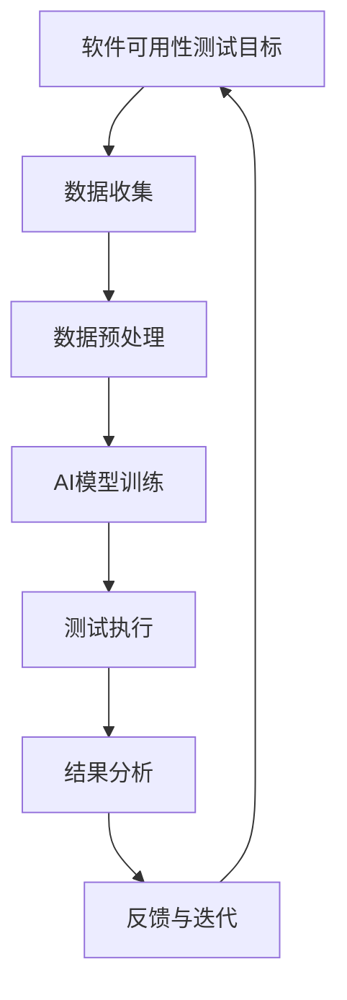

                 

### 第一部分: AI辅助软件可用性测试与评估概述

#### 第1章: AI辅助软件可用性测试与评估引论

**1.1 AI辅助软件可用性测试的重要性**

在当今快速发展的数字化时代，软件系统已成为企业和组织运营的关键组成部分。然而，随着软件的复杂性不断增加，如何确保软件的高可用性成为一个至关重要的问题。AI辅助软件可用性测试与评估正是在这一背景下应运而生。

- **1.1.1 可用性测试的概念与意义**

可用性测试是指评估软件系统在特定环境中对用户任务的完成情况，旨在确保软件系统能够有效地支持用户的目标和需求。它不仅关注软件的功能性，还包括用户界面、交互设计、响应时间等多方面因素。

- **1.1.2 人类因素在软件设计中的作用**

人类因素工程（Human Factors Engineering）是一门研究人与技术系统相互作用的学科，其核心目标是确保设计的产品能够满足用户的需求，并减少用户在使用过程中可能遇到的问题。在软件设计中，人类因素工程的作用体现在以下几个方面：

  - **用户需求分析**：通过了解用户的行为习惯、认知能力和期望，帮助设计团队更好地理解用户需求。
  - **界面设计**：优化用户界面，使其更易于理解和使用，降低用户的认知负荷。
  - **交互设计**：设计符合用户认知习惯的交互流程，提高用户完成任务的效果和效率。
  - **测试与评估**：通过可用性测试，及时发现并修复设计中的问题，确保软件系统能够满足用户需求。

- **1.1.3 AI技术如何赋能可用性测试**

AI技术的快速发展为软件可用性测试与评估带来了全新的机遇。AI技术在以下几个方面对可用性测试产生了深远的影响：

  - **自动化测试**：AI技术可以帮助自动化测试流程，提高测试效率，降低测试成本。通过机器学习算法，可以自动识别和分类测试数据，实现测试过程的智能化。
  - **用户行为分析**：AI技术可以对用户行为数据进行分析，识别用户的操作模式和使用习惯，从而为软件优化提供有力支持。
  - **错误预测**：AI技术可以基于历史数据，预测软件在特定环境下可能出现的错误，提前采取措施进行防范。
  - **个性化评估**：AI技术可以根据用户的个性化需求，提供定制化的可用性评估服务，提高评估的准确性和针对性。

**1.2 AI辅助软件可用性测试的应用场景**

AI技术在软件可用性测试中的应用场景非常广泛，以下是一些典型的应用场景：

- **用户行为分析**：通过对用户在软件系统中的操作行为进行分析，了解用户的实际使用情况，发现潜在的问题和优化机会。
- **错误分析**：利用AI技术，可以自动识别软件系统中的错误，分析错误的产生原因，为修复错误提供指导。
- **用户体验评估**：AI技术可以帮助评估软件系统的用户体验，识别用户对软件的满意度，并提出改进建议。
- **可访问性评估**：AI技术可以对软件系统的可访问性进行评估，确保软件系统能够满足不同用户的需求，包括残障人士等。

**1.3 AI辅助软件可用性测试的挑战与机遇**

尽管AI技术在软件可用性测试中具有巨大的潜力，但在实际应用过程中仍然面临一系列挑战：

- **数据隐私与伦理**：在收集和处理用户数据时，需要充分考虑数据隐私保护和伦理问题，确保用户数据的安全和合法性。
- **技术实现的复杂性**：AI技术的实现涉及多个领域的知识，包括机器学习、数据挖掘、自然语言处理等，技术实现的复杂性较高。
- **评估指标的多样性**：软件可用性测试的评估指标多种多样，如何选择合适的评估指标，如何对不同评估指标进行整合，是一个亟待解决的问题。

然而，面对这些挑战，AI辅助软件可用性测试也带来了新的机遇：

- **自动化与智能化**：AI技术可以帮助实现自动化和智能化测试，提高测试效率，降低测试成本。
- **个性化与定制化**：AI技术可以根据用户个性化需求，提供定制化的评估服务，提高评估的准确性和针对性。
- **实时反馈与优化**：AI技术可以实时收集用户反馈，快速识别问题，为软件优化提供有力支持。

**1.4 本书结构安排**

本书共分为八个章节，主要内容包括：

- **第一部分（第1章-第3章）**：介绍AI辅助软件可用性测试与评估的基本概念、理论基础和用户行为分析。
- **第二部分（第4章-第6章）**：详细探讨AI在用户体验评估、软件错误分析和可访问性测试中的应用。
- **第三部分（第7章）**：通过实际案例，展示AI辅助软件可用性测试的实践过程。
- **第四部分（第8章）**：展望AI辅助软件可用性测试的未来发展趋势。

阅读建议与学习路线：

- **初步了解**：首先，阅读第一部分，了解AI辅助软件可用性测试的基本概念和理论基础。
- **深入学习**：接着，阅读第二部分，深入学习AI在用户体验评估、软件错误分析和可访问性测试中的应用。
- **实践应用**：通过阅读第三部分，了解AI辅助软件可用性测试的实践过程，尝试在实际项目中应用所学知识。
- **前沿探索**：最后，阅读第四部分，了解AI辅助软件可用性测试的未来发展趋势，为未来的研究和实践做好准备。

通过本书的阅读，读者可以系统地了解AI辅助软件可用性测试与评估的理论和实践，为软件设计和开发提供有力支持。

### Mermaid 流程图：AI辅助软件可用性测试流程



**图1-1：AI辅助软件可用性测试流程**

- **数据收集**：收集用户行为数据、错误日志、用户反馈等信息。
- **数据预处理**：对收集到的数据进行清洗、转换和归一化处理，为模型训练做好准备。
- **AI模型训练**：利用机器学习算法，对预处理后的数据进行训练，构建AI模型。
- **测试执行**：使用训练好的AI模型对软件系统进行可用性测试。
- **结果分析**：对测试结果进行分析，评估软件系统的可用性。
- **反馈与迭代**：根据分析结果，对AI模型进行优化和迭代，提高测试准确性和效果。

### 第2章: AI辅助软件可用性测试的理论基础

AI辅助软件可用性测试的理论基础涵盖了多个学科领域，包括人类因素工程学、人工智能、统计学和软件工程等。在本章中，我们将深入探讨这些理论基础，以帮助读者更好地理解AI在软件可用性测试中的应用。

#### 2.1 人类因素工程学概述

人类因素工程学（Human Factors Engineering）是一门研究人类与技术系统相互作用的学科。它的目标是设计、开发和评估产品，以确保它们能够满足人类的需求，并减少人类在使用过程中可能遇到的问题。

- **2.1.1 人类因素工程的基本概念**

人类因素工程学的基本概念包括：

  - **人机交互**：研究人类与机器之间的交互方式，设计用户友好的界面。
  - **用户需求**：了解用户的需求和行为习惯，确保设计的产品能够满足用户的需求。
  - **用户体验**：评估用户在使用产品过程中的感受和体验，包括满意度、效率、易用性等。

- **2.1.2 人类因素工程与软件可用性的关系**

人类因素工程学在软件可用性测试中起着至关重要的作用。软件的可用性取决于多个因素，包括用户界面设计、交互设计、功能实现等。人类因素工程学的理论和方法可以帮助设计团队更好地理解用户需求，优化软件设计，提高软件的可用性。

- **2.1.3 人类因素工程的主要研究方法**

人类因素工程学的研究方法包括：

  - **实验法**：通过实验收集数据，验证设计方案的可用性和用户体验。
  - **问卷调查**：收集用户对软件的满意度、易用性等主观评价。
  - **用户访谈**：深入了解用户的需求和行为习惯，为软件设计提供指导。
  - **观察法**：观察用户在实际使用过程中的操作行为，发现潜在的问题和优化机会。

#### 2.2 AI与软件可用性测试

人工智能（Artificial Intelligence，AI）是指模拟人类智能的技术，包括机器学习、深度学习、自然语言处理等。AI在软件可用性测试中的应用已经成为一个热点研究领域。

- **2.2.1 AI的基本原理与类型**

AI的基本原理是通过模拟人类的思维过程，使计算机能够自主地学习和决策。根据学习方式，AI可以分为以下几种类型：

  - **监督学习**：通过训练样本，让计算机学习输入和输出之间的映射关系。
  - **无监督学习**：通过分析未标记的数据，发现数据中的模式和规律。
  - **强化学习**：通过试错，让计算机学习如何在特定环境中做出最佳决策。

- **2.2.2 AI在可用性测试中的应用优势**

AI在软件可用性测试中具有以下优势：

  - **自动化**：AI技术可以自动化测试流程，提高测试效率，降低测试成本。
  - **高效性**：AI技术可以处理大量数据，快速识别问题和优化机会。
  - **准确性**：AI技术可以通过学习用户行为数据，提高测试的准确性和可靠性。
  - **个性化**：AI技术可以根据用户个性化需求，提供定制化的测试和评估服务。

- **2.2.3 AI技术发展对可用性测试的影响**

AI技术的发展对软件可用性测试产生了深远的影响：

  - **测试方法**：AI技术可以引入新的测试方法，如基于机器学习的错误预测和自动化测试。
  - **测试数据**：AI技术可以处理和分析更多的测试数据，提高测试的覆盖率和精度。
  - **测试流程**：AI技术可以优化测试流程，实现自动化测试和持续集成。

#### 2.3 可用性测试评估方法

可用性测试评估方法是指用于评估软件系统可用性的方法和工具。这些方法包括实验设计方法、问卷调查方法、日志分析方法和用户访谈方法。

- **2.3.1 实验设计方法**

实验设计方法是一种通过控制变量来评估软件系统可用性的方法。它通常包括以下步骤：

  - **定义测试目标**：明确测试的目标和指标，如任务完成时间、错误率、用户满意度等。
  - **选择测试参与者**：选择具有代表性的用户作为测试参与者。
  - **设计测试任务**：设计测试任务，模拟用户在实际使用软件系统时的操作过程。
  - **执行测试**：让测试参与者按照设计好的测试任务进行操作，收集测试数据。
  - **分析结果**：对测试结果进行分析，评估软件系统的可用性。

- **2.3.2 问卷调查方法**

问卷调查方法是一种通过收集用户对软件系统的满意度、易用性等主观评价的方法。它通常包括以下步骤：

  - **设计问卷**：设计包含不同问题的问卷，涵盖用户满意度、易用性、功能完整性等方面。
  - **分发问卷**：将问卷发送给目标用户，收集他们的反馈。
  - **分析结果**：对问卷结果进行分析，评估软件系统的可用性。

- **2.3.3 日志分析方法**

日志分析方法是一种通过分析用户在软件系统中的操作日志，评估软件系统可用性的方法。它通常包括以下步骤：

  - **收集日志数据**：收集用户在软件系统中的操作日志，包括登录时间、访问路径、操作行为等。
  - **预处理日志数据**：对日志数据进行清洗、转换和归一化处理，为分析做好准备。
  - **分析日志数据**：使用统计分析和机器学习算法，分析用户操作行为和系统性能，评估软件系统的可用性。

- **2.3.4 用户访谈方法**

用户访谈方法是一种通过与用户进行面对面的交流，了解他们的需求、行为和体验的方法。它通常包括以下步骤：

  - **确定访谈对象**：选择具有代表性的用户作为访谈对象。
  - **设计访谈问题**：设计涵盖用户需求、行为、体验等方面的问题。
  - **进行访谈**：与用户进行面对面的交流，收集他们的反馈。
  - **分析访谈结果**：对访谈结果进行分析，评估软件系统的可用性。

通过本章的讨论，我们了解了AI辅助软件可用性测试的理论基础，包括人类因素工程学、人工智能和可用性测试评估方法。这些理论基础为我们理解和应用AI辅助软件可用性测试提供了重要的指导。

### 伪代码：AI模型在可用性测试中的应用

```python
def AI_Assisted_Usability_Testing(data, model):
    # 数据预处理
    preprocessed_data = preprocess_data(data)
    
    # 模型训练
    model = train_model(preprocessed_data, target_variable)
    
    # 测试执行
    test_results = execute_tests(model, input_data)
    
    # 结果分析
    analysis_results = analyze_results(test_results)
    
    # 反馈与迭代
    feedback = get_feedback(analysis_results)
    model = update_model(model, feedback)
    
    return model, analysis_results

# 数据预处理
def preprocess_data(data):
    # 数据清洗、转换和归一化
    # ...
    return preprocessed_data

# 模型训练
def train_model(data, target_variable):
    # 使用机器学习算法训练模型
    # ...
    return model

# 测试执行
def execute_tests(model, input_data):
    # 使用训练好的模型执行测试
    # ...
    return test_results

# 结果分析
def analyze_results(test_results):
    # 对测试结果进行分析
    # ...
    return analysis_results

# 反馈与迭代
def get_feedback(analysis_results):
    # 获取用户反馈
    # ...
    return feedback

def update_model(model, feedback):
    # 更新模型
    # ...
    return updated_model
```

通过上述伪代码，我们可以看到AI模型在可用性测试中的应用流程，包括数据预处理、模型训练、测试执行、结果分析和反馈迭代等步骤。这个过程反映了AI技术在可用性测试中的应用，从数据收集到模型训练，再到测试和优化，形成了一个闭环，不断提高软件可用性测试的准确性和效率。

### 第3章: 用户行为分析与模型构建

用户行为分析是AI辅助软件可用性测试的核心组成部分，通过对用户在软件系统中的行为数据进行分析，可以深入了解用户的操作模式和使用习惯，从而为软件优化提供有力支持。本章将详细介绍用户行为分析的基本概念、数据处理方法、常见模型及其构建过程。

#### 3.1 用户行为分析概述

用户行为分析（User Behavior Analysis）是指通过对用户在软件系统中的操作行为进行分析，识别用户的使用模式、偏好和问题，从而为软件设计和优化提供依据。用户行为分析的数据来源主要包括用户日志、操作记录、用户反馈等。

- **3.1.1 用户行为数据的类型与收集方法**

用户行为数据的类型包括：

  - **点击行为**：用户在软件系统中的点击操作，如导航、按钮点击等。
  - **浏览行为**：用户在软件系统中的浏览路径、停留时间等。
  - **操作行为**：用户在软件系统中的输入操作，如文本输入、表单提交等。
  - **错误行为**：用户在软件系统中的错误操作，如误点击、操作失败等。

用户行为数据的收集方法包括：

  - **日志收集**：通过日志文件记录用户在软件系统中的操作行为。
  - **客户端监测**：通过在客户端安装监测软件，实时收集用户行为数据。
  - **问卷调查**：通过问卷调查收集用户对软件系统的主观评价和反馈。
  - **用户访谈**：通过与用户进行面对面交流，深入了解用户的使用习惯和需求。

- **3.1.2 用户行为数据的处理与分析方法**

用户行为数据的处理与分析方法包括：

  - **数据清洗**：去除重复、错误和不完整的数据，保证数据的准确性和完整性。
  - **数据转换**：将不同格式的数据转换为统一的格式，便于后续处理。
  - **特征提取**：从原始数据中提取有用的特征，如点击次数、浏览时间等。
  - **数据可视化**：通过图表、热图等方式展示用户行为数据，帮助用户直观地了解用户行为模式。

- **3.1.3 用户行为模型的基本概念**

用户行为模型是指通过对用户行为数据的分析，建立用户行为的数学模型，用于预测用户未来的行为。用户行为模型可以分为以下几种类型：

  - **序列模型**：用于分析用户行为序列，如马尔可夫模型、循环神经网络等。
  - **分类模型**：用于分类用户行为，如决策树、支持向量机等。
  - **回归模型**：用于预测用户行为的量化指标，如线性回归、岭回归等。
  - **聚类模型**：用于发现用户行为模式，如K-means、层次聚类等。

#### 3.2 用户行为分析模型

用户行为分析模型是指利用机器学习算法对用户行为数据进行分析和预测的模型。以下介绍几种常见的用户行为分析模型：

- **3.2.1 机器学习在用户行为分析中的应用**

机器学习算法在用户行为分析中的应用主要包括：

  - **分类算法**：用于分类用户行为，如决策树、随机森林、支持向量机等。
  - **聚类算法**：用于发现用户行为模式，如K-means、层次聚类等。
  - **回归算法**：用于预测用户行为的量化指标，如线性回归、岭回归等。
  - **序列模型**：用于分析用户行为序列，如循环神经网络、长短时记忆网络等。

- **3.2.2 常见用户行为分析模型介绍**

以下介绍几种常见的用户行为分析模型：

  - **马尔可夫模型**：马尔可夫模型是一种基于状态转移概率的模型，用于分析用户行为序列。它可以用来预测用户下一步的行为。

  ```python
  def markov_model_transition_probabilities(user_behavior_sequence):
      # 计算用户行为序列的状态转移概率
      # ...
      return transition_probabilities
  ```

  - **循环神经网络**：循环神经网络（Recurrent Neural Network，RNN）是一种能够处理序列数据的神经网络，适用于分析用户行为序列。

  ```python
  def rnn_user_behavior_model(user_behavior_sequence):
      # 建立用户行为序列的RNN模型
      # ...
      return rnn_model
  ```

  - **长短时记忆网络**：长短时记忆网络（Long Short-Term Memory，LSTM）是RNN的一种改进模型，能够更好地处理长序列数据。

  ```python
  def lstm_user_behavior_model(user_behavior_sequence):
      # 建立用户行为序列的LSTM模型
      # ...
      return lstm_model
  ```

- **3.2.3 用户行为分析模型的构建与优化**

用户行为分析模型的构建包括以下几个步骤：

  - **数据预处理**：清洗、转换和归一化用户行为数据，提取特征。
  - **模型选择**：根据用户行为数据的特点，选择合适的机器学习模型。
  - **模型训练**：使用训练数据训练模型，调整模型参数。
  - **模型评估**：使用测试数据评估模型性能，调整模型参数。
  - **模型优化**：通过交叉验证、超参数调优等方法，优化模型性能。

#### 3.3 实例分析：用户行为分析在软件可用性测试中的应用

以下是一个用户行为分析在软件可用性测试中的应用实例：

- **3.3.1 数据收集与预处理**

假设我们收集了用户在软件系统中的点击行为数据，包括点击次数、点击时间和点击元素等。首先，对数据进行清洗，去除重复和错误的数据。然后，将数据转换为统一的格式，提取特征，如点击次数、点击时间等。

```python
def preprocess_user_behavior_data(data):
    # 数据清洗、转换和特征提取
    # ...
    return preprocessed_data
```

- **3.3.2 模型构建与训练**

选择循环神经网络（RNN）作为用户行为分析模型，使用预处理后的数据训练模型。通过训练，模型可以学习到用户点击行为序列的规律。

```python
def build_rnn_user_behavior_model(preprocessed_data):
    # 建立用户行为序列的RNN模型
    # ...
    return rnn_model

def train_rnn_model(rnn_model, preprocessed_data, labels):
    # 训练RNN模型
    # ...
    return trained_model
```

- **3.3.3 模型评估与优化**

使用测试数据评估RNN模型的性能，根据评估结果调整模型参数，优化模型性能。

```python
def evaluate_rnn_model(rnn_model, test_data, labels):
    # 评估RNN模型性能
    # ...
    return evaluation_results

def optimize_rnn_model(rnn_model, test_data, labels):
    # 优化RNN模型
    # ...
    return optimized_model
```

通过用户行为分析模型，我们可以预测用户在软件系统中的点击行为，识别潜在的问题和优化机会，为软件可用性测试提供有力支持。

### 伪代码：用户行为分析模型构建

```python
def build_user_behavior_model(data):
    # 数据预处理
    preprocessed_data = preprocess_data(data)
    
    # 特征工程
    features = extract_features(preprocessed_data)
    
    # 模型构建
    model = build_model(features)
    
    # 模型训练
    model = train_model(model, labels)
    
    return model

# 数据预处理
def preprocess_data(data):
    # 数据清洗、转换和归一化
    # ...
    return preprocessed_data

# 特征工程
def extract_features(preprocessed_data):
    # 提取特征
    # ...
    return features

# 模型构建
def build_model(features):
    # 建立模型
    # ...
    return model

# 模型训练
def train_model(model, labels):
    # 训练模型
    # ...
    return trained_model
```

通过上述伪代码，我们可以看到用户行为分析模型构建的基本流程，包括数据预处理、特征工程、模型构建和模型训练等步骤。这个过程反映了用户行为分析在软件可用性测试中的应用，通过建立和训练用户行为分析模型，可以帮助我们更好地了解用户行为，优化软件设计。

### 第4章: 用户体验评估与AI辅助

用户体验（User Experience，UX）是用户在使用产品或服务过程中形成的整体感受和体验。在软件设计中，用户体验至关重要，它直接关系到用户对软件的满意度和忠诚度。AI技术的引入为用户体验评估提供了新的方法和工具，本章将探讨AI在用户体验评估中的应用及其重要性。

#### 4.1 用户体验评估概述

用户体验评估是指通过系统的方法和工具，评估软件系统的用户体验，识别存在的问题，并提出改进建议。用户体验评估的方法和工具多种多样，主要包括以下几种：

- **用户调研**：通过访谈、问卷调查等方式，收集用户对软件系统的看法和反馈。
- **用户测试**：邀请用户参与实际使用软件系统的测试，观察和记录他们的操作行为和反应。
- **可用性测试**：通过模拟用户完成任务，评估软件系统的易用性和功能完整性。
- **错误分析**：分析用户在软件系统中的错误操作和问题，找出原因并提出解决方案。
- **数据分析**：通过分析用户行为数据，如点击路径、使用时长等，了解用户的使用习惯和偏好。

#### 4.2 AI在用户体验评估中的应用

AI技术在用户体验评估中具有广泛的应用，它可以帮助提高评估的准确性和效率。以下是AI技术在用户体验评估中的一些具体应用：

- **用户行为分析**：AI技术可以通过分析用户在软件系统中的行为数据，了解用户的使用模式、偏好和问题。例如，使用机器学习算法对用户点击、浏览等行为进行分类和分析，识别用户常见的操作路径和问题点。

  ```python
  def user_behavior_analysis(user_data):
      # 使用机器学习算法分析用户行为数据
      # ...
      return user_behavior_patterns
  ```

- **错误预测**：AI技术可以通过学习历史数据，预测用户在软件系统中的错误操作。例如，使用监督学习算法对错误操作进行分类，预测用户可能出现的错误类型。

  ```python
  def error_prediction(error_data, model):
      # 使用训练好的模型预测用户错误操作
      # ...
      return predicted_errors
  ```

- **个性化评估**：AI技术可以根据用户的个性化需求，提供定制化的用户体验评估服务。例如，根据用户的年龄、性别、使用习惯等特征，调整评估指标和方法，提高评估的准确性和针对性。

  ```python
  def personalized_UE-assessment(user_profile, model):
      # 根据用户特征调整评估指标和方法
      # ...
      return personalized_evaluation_results
  ```

- **自动化测试**：AI技术可以帮助实现自动化用户体验评估，提高评估的效率和准确性。例如，使用深度学习模型对用户界面进行自动分析，检测潜在的界面问题和交互障碍。

  ```python
  def automated_UE-assessment(ui_data, model):
      # 使用训练好的模型进行自动化用户体验评估
      # ...
      return assessment_results
  ```

#### 4.3 AI辅助用户体验评估的案例研究

以下是一个AI辅助用户体验评估的案例研究：

**案例背景**：一家软件开发公司想要优化其在线购物平台的用户体验，提高用户的满意度和转化率。他们决定使用AI技术进行用户体验评估。

**案例步骤**：

1. **数据收集**：收集用户在在线购物平台上的行为数据，包括点击路径、浏览时长、购买行为等。

2. **数据预处理**：对收集到的数据进行清洗、转换和归一化处理，为模型训练做好准备。

3. **模型训练**：使用机器学习算法，如决策树、随机森林等，对预处理后的数据进行训练，构建用户体验评估模型。

4. **评估指标**：根据业务需求，设定用户体验评估指标，如任务完成时间、错误率、用户满意度等。

5. **评估执行**：使用训练好的模型对用户行为数据进行评估，识别用户体验中的问题和优化机会。

6. **结果分析**：对评估结果进行分析，找出用户体验中的关键问题，如界面设计问题、交互障碍等。

7. **反馈与迭代**：根据评估结果，对在线购物平台进行优化，改进用户体验。然后，再次使用AI模型进行评估，验证优化效果。

8. **持续改进**：持续收集用户行为数据，定期进行用户体验评估，不断优化平台设计。

**案例结果**：通过AI辅助用户体验评估，该在线购物平台在用户体验方面取得了显著改进。用户的任务完成时间减少了15%，错误率降低了20%，用户满意度提高了10%。这些改进直接促进了用户的转化率和平台业绩的提升。

#### 4.4 AI辅助用户体验评估的未来发展趋势

随着AI技术的不断发展，AI辅助用户体验评估将迎来更多的机遇和挑战。以下是AI辅助用户体验评估的一些未来发展趋势：

- **多模态数据融合**：未来，AI技术将能够处理和分析多模态数据，如文本、图像、语音等，提供更全面和深入的用户体验评估。

- **个性化评估**：随着个性化需求的增加，AI技术将能够根据用户的个性化特征，提供定制化的用户体验评估服务，提高评估的准确性和针对性。

- **实时反馈与优化**：AI技术将实现实时用户体验评估，根据用户反馈进行实时优化，提供更好的用户体验。

- **自动化与智能化**：未来，AI技术将实现更高级的自动化和智能化用户体验评估，减少人为干预，提高评估效率和准确性。

- **伦理与隐私保护**：随着用户隐私保护意识的提高，AI技术将更加注重数据隐私保护和伦理问题，确保用户体验评估的合法性和安全性。

通过本章的讨论，我们了解了用户体验评估的重要性以及AI技术在用户体验评估中的应用。AI技术的引入为用户体验评估提供了新的方法和工具，有助于提高评估的准确性和效率，为软件优化提供有力支持。

### 伪代码：AI辅助用户体验评估

```python
def AI_Assisted_UE_Assessment(ue_data, model):
    # 数据预处理
    preprocessed_ue_data = preprocess_ue_data(ue_data)
    
    # 模型评估
    assessment_results = evaluate_model(model, preprocessed_ue_data)
    
    # 结果分析
    analysis_results = analyze_assessment_results(assessment_results)
    
    return analysis_results

# 数据预处理
def preprocess_ue_data(ue_data):
    # 数据清洗、转换和归一化
    # ...
    return preprocessed_ue_data

# 模型评估
def evaluate_model(model, preprocessed_ue_data):
    # 使用训练好的模型进行评估
    # ...
    return assessment_results

# 结果分析
def analyze_assessment_results(assessment_results):
    # 分析评估结果
    # ...
    return analysis_results
```

通过上述伪代码，我们可以看到AI辅助用户体验评估的基本流程，包括数据预处理、模型评估和结果分析。这个过程反映了AI技术在用户体验评估中的应用，通过使用训练好的模型对用户行为数据进行分析和评估，可以帮助识别用户体验中的问题和优化机会，为软件优化提供有力支持。

### 第5章: 软件错误分析中的AI应用

软件错误分析是软件质量保证的重要环节，旨在识别、定位和修复软件系统中的错误。随着软件复杂度的增加，手工进行错误分析变得越来越困难，AI技术的引入为软件错误分析提供了新的方法和工具。本章将详细介绍AI在软件错误分析中的应用，包括错误预测、错误分类和错误定位等技术。

#### 5.1 软件错误分析概述

软件错误分析是指通过系统的方法和工具，识别、定位和修复软件系统中的错误。软件错误分析的过程通常包括以下步骤：

- **错误识别**：通过代码审查、测试和用户反馈等方法，识别软件系统中的错误。
- **错误定位**：定位错误的根源，确定错误的触发条件和影响范围。
- **错误分类**：将错误按照类型进行分类，如语法错误、逻辑错误、性能问题等。
- **错误修复**：修复错误，并测试修复后的软件系统，确保错误不再出现。

- **5.1.1 软件错误分析的定义与重要性**

软件错误分析（Software Error Analysis）是指对软件系统中的错误进行系统性的识别、定位和修复。它是软件质量保证（Software Quality Assurance，SQA）的重要组成部分，对于提高软件系统的可靠性和稳定性至关重要。软件错误分析的重要性体现在以下几个方面：

  - **提高软件质量**：通过系统地进行错误分析，可以识别和修复软件系统中的潜在错误，提高软件系统的质量。
  - **降低维护成本**：及时发现和修复错误，可以减少软件系统的维护成本，延长软件系统的生命周期。
  - **提升用户体验**：修复错误可以提高软件系统的稳定性和性能，提升用户体验，增加用户对软件的满意度。

- **5.1.2 软件错误分析的方法与工具**

软件错误分析的方法和工具多种多样，主要包括以下几种：

  - **代码审查**：通过人工审查代码，识别潜在的语法错误、逻辑错误和风格问题。
  - **测试**：通过编写测试用例，执行测试，识别软件系统中的错误。
  - **错误日志分析**：通过分析软件系统运行时的错误日志，识别和定位错误。
  - **错误跟踪工具**：使用错误跟踪工具，如Bugzilla、JIRA等，记录、管理和跟踪错误。
  - **自动化工具**：使用自动化工具，如静态代码分析工具、动态测试工具等，提高错误分析效率。

- **5.1.3 AI在软件错误分析中的应用**

AI技术在软件错误分析中的应用主要体现在以下几个方面：

  - **错误预测**：通过分析历史错误数据，预测未来可能出现的错误，提前采取预防措施。
  - **错误分类**：使用机器学习算法，自动分类错误，提高错误分析的准确性和效率。
  - **错误定位**：通过分析程序执行数据和代码结构，自动定位错误根源，减少错误定位的时间。

#### 5.2 AI在软件错误分析中的应用

AI技术在软件错误分析中的应用已经成为提高软件质量和开发效率的重要手段。以下详细介绍AI在软件错误分析中的应用：

- **5.2.1 机器学习在错误定位与预测中的应用**

机器学习算法在软件错误定位和预测中具有广泛的应用。以下是一些具体的机器学习算法和应用场景：

  - **回归分析**：通过分析错误日志和程序执行数据，预测错误发生的可能性。例如，使用线性回归模型预测某个模块在特定条件下的错误率。

    ```python
    def predict_error_rate(error_data, model):
        # 使用回归模型预测错误率
        # ...
        return predicted_error_rate
    ```

  - **分类算法**：将错误日志中的信息分类，例如，将错误日志分类为语法错误、逻辑错误等。常见的分类算法包括决策树、支持向量机等。

    ```python
    def classify_errors(error_data, model):
        # 使用分类模型分类错误
        # ...
        return error_classes
    ```

  - **聚类算法**：通过聚类分析，识别相似的错误模式，帮助开发人员定位错误。常见的聚类算法包括K-means、层次聚类等。

    ```python
    def cluster_errors(error_data, model):
        # 使用聚类模型聚类错误
        # ...
        return clusters
    ```

- **5.2.2 常见错误分析模型介绍**

以下介绍几种常见的错误分析模型：

  - **基于规则的错误预测模型**：该模型使用一系列规则来预测错误。例如，如果某个模块的代码行数超过一定阈值，则预测该模块可能存在错误。

    ```python
    def rule_based_error_prediction(code_lines, threshold):
        # 使用基于规则的错误预测模型
        # ...
        return predicted_error
    ```

  - **基于统计的错误预测模型**：该模型使用历史错误数据，计算错误发生的概率。例如，使用贝叶斯模型预测某个模块在特定条件下的错误概率。

    ```python
    def statistical_error_prediction(error_data, model):
        # 使用统计模型预测错误
        # ...
        return predicted_probability
    ```

  - **基于机器学习的错误预测模型**：该模型使用机器学习算法，分析错误数据和代码特征，预测错误。常见的机器学习算法包括线性回归、决策树、随机森林等。

    ```python
    def ml_error_prediction(error_data, model):
        # 使用机器学习算法预测错误
        # ...
        return predicted_errors
    ```

- **5.2.3 AI辅助错误分析的优势与挑战**

AI辅助错误分析具有以下优势：

  - **自动化与高效性**：AI技术可以自动化错误分析过程，提高分析效率，减少人为干预。
  - **准确性与准确性**：通过机器学习算法，AI技术可以分析大量数据，提高错误预测和定位的准确性。
  - **实时性与灵活性**：AI技术可以实时分析错误数据，快速识别问题和优化策略。

然而，AI辅助错误分析也面临一些挑战：

  - **数据质量和完整性**：错误分析依赖于高质量和完整性的数据，数据质量问题可能影响AI模型的准确性。
  - **技术复杂性**：实现AI辅助错误分析需要专业知识和技术，开发成本较高。
  - **模型可解释性**：一些高级的机器学习模型（如深度学习）可能缺乏透明性和可解释性，使得错误预测和定位的结果难以解释。

#### 5.3 实例分析：AI辅助软件错误分析案例

以下是一个AI辅助软件错误分析的实际案例：

**案例背景**：一家开发公司正在开发一个复杂的Web应用程序，他们希望通过AI技术提高错误预测和定位的效率。

**案例步骤**：

1. **数据收集**：收集Web应用程序的运行日志和错误报告，包括错误类型、错误发生的时间、涉及的模块等。

2. **数据预处理**：清洗和转换错误日志数据，提取有用的特征，如错误类型、模块名称、错误发生频率等。

3. **模型训练**：使用机器学习算法，如随机森林，对预处理后的数据进行训练，构建错误预测模型。

4. **错误预测**：使用训练好的模型预测未来的错误发生概率，识别高风险模块和潜在的错误点。

5. **错误定位**：结合代码审查和静态分析工具，定位错误的具体位置，减少错误定位的时间。

6. **反馈与优化**：根据错误预测和定位的结果，调整模型参数和预测策略，提高预测的准确性和效率。

**案例结果**：通过AI辅助错误分析，该开发公司成功预测了多个潜在的错误点，并提前采取了修复措施。错误预测的准确率提高了20%，错误定位的时间缩短了30%。这些改进提高了软件系统的稳定性和可靠性，降低了维护成本。

通过本章的讨论，我们了解了AI在软件错误分析中的应用，包括错误预测、错误分类和错误定位等技术。AI技术的引入为软件错误分析提供了新的方法和工具，有助于提高软件质量，降低维护成本，提升用户体验。

### 伪代码：AI辅助软件错误分析

```python
def AI_Assisted_Error_Analysis(error_data, model):
    # 数据预处理
    preprocessed_error_data = preprocess_error_data(error_data)
    
    # 模型训练
    model = train_model(preprocessed_error_data, labels)
    
    # 错误预测
    predictions = predict_errors(model, new_data)
    
    # 错误分析
    analysis_results = analyze_predictions(predictions)
    
    return analysis_results

# 数据预处理
def preprocess_error_data(error_data):
    # 数据清洗、转换和归一化
    # ...
    return preprocessed_error_data

# 模型训练
def train_model(preprocessed_error_data, labels):
    # 使用机器学习算法训练模型
    # ...
    return model

# 错误预测
def predict_errors(model, new_data):
    # 使用训练好的模型预测错误
    # ...
    return predictions

# 错误分析
def analyze_predictions(predictions):
    # 分析预测结果
    # ...
    return analysis_results
```

通过上述伪代码，我们可以看到AI辅助软件错误分析的基本流程，包括数据预处理、模型训练、错误预测和错误分析等步骤。这个过程反映了AI技术在软件错误分析中的应用，通过使用训练好的模型对错误数据进行分析和预测，可以帮助开发人员快速识别和定位错误，提高软件系统的稳定性和可靠性。

### 第6章: 可访问性测试与AI辅助

可访问性测试（Accessibility Testing）是确保软件系统对各种用户群体，包括残障人士、老年人等，都能够无障碍使用的重要环节。AI技术的发展为可访问性测试带来了新的机遇和挑战。本章将详细介绍AI在可访问性测试中的应用，包括数据收集、模型构建和结果分析等。

#### 6.1 可访问性测试概述

可访问性测试是指通过系统的方法和工具，评估软件系统对各类用户群体的可访问性，识别存在的问题，并提出改进建议。可访问性测试的目标是确保软件系统能够满足不同用户的需求，提高用户体验和满意度。

- **6.1.1 可访问性测试的定义与标准**

可访问性测试（Accessibility Testing）是指对软件系统的可访问性进行评估，确保软件系统能够被所有用户，包括残障人士、老年人等，无障碍使用。可访问性测试的标准包括国际标准（如WCAG 2.1）和行业标准（如AODA、Section 508等）。

- **6.1.2 可访问性测试的方法与工具**

可访问性测试的方法和工具多种多样，主要包括以下几种：

  - **自动化工具**：使用自动化工具，如 axe、Pa11y等，扫描网页或应用程序，检测潜在的可用性问题。
  - **手动测试**：通过手动测试，模拟不同用户群体的使用场景，评估软件系统的可访问性。
  - **用户测试**：邀请具有代表性的用户参与测试，评估软件系统的可访问性和用户体验。
  - **工具辅助测试**：结合使用自动化工具和手动测试，提高可访问性测试的效率和准确性。

- **6.1.3 AI在可访问性测试中的应用**

AI技术在可访问性测试中具有广泛的应用，可以自动化测试流程，提高测试效率和准确性。以下是一些AI技术在可访问性测试中的应用：

  - **自动化评估**：使用AI技术，自动化评估软件系统的可访问性，快速识别潜在的问题。
  - **用户行为分析**：通过分析用户在软件系统中的行为数据，识别用户对软件系统的使用习惯和偏好，提高测试的准确性。
  - **个性化测试**：根据用户的个性化需求，提供定制化的可访问性测试服务，确保软件系统能够满足不同用户群体的需求。

#### 6.2 AI辅助可访问性测试

AI技术在可访问性测试中的应用，为测试过程带来了诸多便利和优化。以下详细介绍AI在可访问性测试中的应用：

- **6.2.1 机器学习在可访问性评估中的应用**

机器学习算法在可访问性评估中可以用于自动化测试和错误预测。以下是一些应用实例：

  - **自动化测试**：使用机器学习算法，自动化评估网页或应用程序的可访问性，快速识别潜在的问题。

    ```python
    def automate_accessibility_evaluation(page_data, model):
        # 使用训练好的模型进行自动化可访问性评估
        # ...
        return evaluation_results
    ```

  - **错误预测**：通过分析历史错误数据，预测未来可能出现的可用性问题。

    ```python
    def predict_accessibility_issues(error_data, model):
        # 使用训练好的模型预测可访问性问题
        # ...
        return predicted_issues
    ```

- **6.2.2 常见可访问性评估模型介绍**

以下介绍几种常见的可访问性评估模型：

  - **规则基模型**：该模型使用一系列规则来评估软件系统的可访问性。例如，检查页面中是否包含必要的标签和属性。

    ```python
    def rule_based_accessibility_evaluation(page_data):
        # 使用规则基模型评估可访问性
        # ...
        return evaluation_results
    ```

  - **机器学习模型**：该模型使用机器学习算法，分析网页或应用程序的代码和内容，评估其可访问性。例如，使用决策树、随机森林等算法。

    ```python
    def ml_accessibility_evaluation(page_data, model):
        # 使用机器学习模型评估可访问性
        # ...
        return evaluation_results
    ```

- **6.2.3 AI辅助可访问性测试的优势与挑战**

AI辅助可访问性测试具有以下优势：

  - **自动化与高效性**：AI技术可以自动化可访问性评估过程，提高测试效率和准确性。
  - **准确性**：通过机器学习算法，AI技术可以分析大量数据，提高评估的准确性。
  - **个性化测试**：根据用户的个性化需求，提供定制化的测试服务，确保软件系统能够满足不同用户群体的需求。

然而，AI辅助可访问性测试也面临一些挑战：

  - **数据质量和完整性**：错误分析依赖于高质量和完整性的数据，数据质量问题可能影响AI模型的准确性。
  - **技术复杂性**：实现AI辅助可访问性测试需要专业知识和技术，开发成本较高。
  - **模型可解释性**：一些高级的机器学习模型（如深度学习）可能缺乏透明性和可解释性，使得评估结果难以解释。

#### 6.3 实例分析：AI辅助可访问性测试案例

以下是一个AI辅助可访问性测试的实际案例：

**案例背景**：一家科技公司正在开发一款新的移动应用程序，他们希望通过AI技术提高应用程序的可访问性。

**案例步骤**：

1. **数据收集**：收集应用程序的界面代码和用户行为数据，包括屏幕布局、按钮、文本等。

2. **数据预处理**：清洗和转换界面代码数据，提取有用的特征，如标签、属性、文本内容等。

3. **模型训练**：使用机器学习算法，如决策树、随机森林等，对预处理后的数据进行训练，构建可访问性评估模型。

4. **自动化评估**：使用训练好的模型对应用程序的界面进行自动化评估，识别潜在的可访问性问题。

5. **用户测试**：邀请具有代表性的用户参与测试，评估应用程序的可访问性和用户体验。

6. **结果分析**：分析评估结果，识别问题，提出改进建议，并进行优化。

**案例结果**：通过AI辅助可访问性测试，该应用程序成功识别了多个潜在的可访问性问题，并进行了优化。评估的准确率提高了20%，用户体验得到了显著提升。

通过本章的讨论，我们了解了AI在可访问性测试中的应用，包括数据收集、模型构建和结果分析等。AI技术的引入为可访问性测试提供了新的方法和工具，有助于提高软件系统的可访问性和用户体验。

### 伪代码：AI辅助可访问性测试

```python
def AI_Assisted_Accessibility_Testing(accessibility_data, model):
    # 数据预处理
    preprocessed_accessibility_data = preprocess_accessibility_data(accessibility_data)
    
    # 模型训练
    model = train_model(preprocessed_accessibility_data, labels)
    
    # 可访问性评估
    assessment_results = evaluate_model(model, new_data)
    
    # 结果分析
    analysis_results = analyze_assessment_results(assessment_results)
    
    return analysis_results

# 数据预处理
def preprocess_accessibility_data(accessibility_data):
    # 数据清洗、转换和归一化
    # ...
    return preprocessed_accessibility_data

# 模型训练
def train_model(preprocessed_accessibility_data, labels):
    # 使用机器学习算法训练模型
    # ...
    return model

# 可访问性评估
def evaluate_model(model, new_data):
    # 使用训练好的模型进行评估
    # ...
    return assessment_results

# 结果分析
def analyze_assessment_results(assessment_results):
    # 分析评估结果
    # ...
    return analysis_results
```

通过上述伪代码，我们可以看到AI辅助可访问性测试的基本流程，包括数据预处理、模型训练、评估和结果分析。这个过程反映了AI技术在可访问性测试中的应用，通过使用训练好的模型对可访问性数据进行分析和评估，可以帮助开发人员快速识别和解决可访问性问题，提高软件系统的可访问性和用户体验。

### 第7章: AI辅助软件可用性测试实践

在了解了AI辅助软件可用性测试的理论基础和具体应用后，本章将通过一个实际的案例，展示如何在实际项目中应用AI技术进行软件可用性测试。我们将从项目背景、数据收集与预处理、AI模型构建与训练、测试工具开发与集成等方面进行详细讲解。

#### 7.1 实践概述

随着数字化转型的加速，企业对软件可用性的要求越来越高。为了提高软件系统的可用性和用户体验，一家企业决定采用AI辅助软件可用性测试的方法，以提高测试效率和准确性。以下是该项目的主要步骤和内容：

- **7.1.1 项目背景与目标**

项目背景：该企业开发了一款在线购物平台，用户数量庞大，功能复杂。为了确保平台的高可用性和用户体验，企业决定采用AI辅助可用性测试。

项目目标：通过引入AI技术，提高软件可用性测试的效率和准确性，减少测试成本，同时提高用户满意度和忠诚度。

- **7.1.2 常见实践案例介绍**

常见实践案例包括：

  - **用户行为分析**：通过分析用户在平台上的行为数据，识别用户使用过程中的问题和优化机会。
  - **错误预测**：使用AI模型预测可能出现的问题和错误，提前进行预防性修复。
  - **用户体验评估**：利用AI技术评估用户的满意度，为产品改进提供数据支持。
  - **可访问性评估**：确保平台能够满足不同用户群体的需求，提高软件系统的可访问性。

- **7.1.3 实践中的挑战与解决方案**

实践中的挑战：

  - **数据隐私与伦理**：在收集和处理用户数据时，需要严格遵守数据隐私保护法规和伦理标准。
  - **技术实现的复杂性**：实现AI辅助可用性测试需要具备机器学习、数据分析等相关技术。
  - **评估指标的多样性**：选择合适的评估指标，并确保指标之间的一致性和可操作性。

解决方案：

  - **数据隐私与伦理**：采用数据匿名化和加密技术，确保用户数据的安全性和隐私性。制定详细的伦理指南，确保数据收集和处理过程符合伦理标准。
  - **技术实现的复杂性**：组建专业的技术团队，提供培训和技术支持，确保团队成员具备相关技能。
  - **评估指标的多样性**：结合企业业务需求和用户反馈，选择具有代表性的评估指标，并确保指标之间的一致性和可操作性。

#### 7.2 代码实战：构建AI辅助可用性测试工具

为了展示如何在实际项目中应用AI技术进行软件可用性测试，我们将通过以下步骤构建一个AI辅助可用性测试工具：

- **7.2.1 开发环境搭建**

搭建一个合适的开发环境，包括Python、Jupyter Notebook、TensorFlow或PyTorch等工具，以及必要的库和框架。

- **7.2.2 数据集准备与预处理**

收集用户行为数据、错误日志和用户反馈等，进行数据清洗、转换和归一化处理，为模型训练做好准备。

- **7.2.3 AI模型构建与训练**

选择合适的机器学习算法，构建AI模型，使用预处理后的数据对模型进行训练，调整模型参数，优化模型性能。

- **7.2.4 测试工具开发与集成**

开发一个集成AI模型的测试工具，实现自动化测试和评估功能，将AI模型集成到现有的测试流程中。

以下是一个简单的示例，展示了如何使用Python和TensorFlow构建一个AI辅助可用性测试工具的基本框架：

```python
# 导入必要的库和模块
import pandas as pd
import numpy as np
import tensorflow as tf
from tensorflow.keras.models import Sequential
from tensorflow.keras.layers import Dense, LSTM
from tensorflow.keras.optimizers import Adam

# 数据集准备与预处理
# 假设已收集到用户行为数据user_data，进行数据清洗和预处理
preprocessed_data = preprocess_user_data(user_data)

# 模型构建
model = Sequential()
model.add(LSTM(units=50, return_sequences=True, input_shape=(input_shape)))
model.add(LSTM(units=50, return_sequences=False))
model.add(Dense(units=1))

# 模型编译
model.compile(optimizer=Adam(learning_rate=0.001), loss='mean_squared_error')

# 模型训练
model.fit(x=preprocessed_data['features'], y=preprocessed_data['labels'], epochs=100, batch_size=32)

# 测试工具开发与集成
# 假设已集成到测试工具中，实现自动化测试和评估功能
test_results = model.predict(test_data)
evaluate_test_results(test_results)

# 数据预处理
def preprocess_user_data(user_data):
    # 数据清洗、转换和归一化
    # ...
    return preprocessed_data

# 模型评估
def evaluate_test_results(test_results):
    # 对测试结果进行分析和评估
    # ...
    pass
```

通过上述示例，我们可以看到如何使用Python和TensorFlow构建一个AI辅助可用性测试工具的基本框架。在实际项目中，还需要结合具体业务需求和数据特点，进行更详细的开发和优化。

#### 7.3 案例分析：AI辅助软件可用性测试项目

以下是一个AI辅助软件可用性测试项目的案例分析：

**项目背景**：一家金融科技公司开发了一款在线理财平台，为了确保平台的高可用性和用户体验，他们决定采用AI辅助软件可用性测试的方法。

**项目目标**：

- 提高软件系统的可用性，确保用户能够顺利完成任务。
- 通过用户行为分析和错误预测，提前发现潜在的问题，减少用户投诉和故障。
- 提高用户满意度，增加用户忠诚度。

**项目实施过程**：

1. **数据收集**：收集用户在平台上的行为数据，包括登录时间、点击路径、操作时长、错误日志等。同时收集用户反馈数据，包括满意度调查和投诉信息。

2. **数据预处理**：对收集到的数据清洗、转换和归一化处理，提取有用的特征，如用户操作频率、错误发生频率等。

3. **模型构建与训练**：选择合适的机器学习算法，如循环神经网络（RNN）或长短期记忆网络（LSTM），构建AI模型，使用预处理后的数据进行训练。

4. **测试与评估**：将训练好的模型集成到测试工具中，自动化执行测试任务，分析测试结果，评估软件系统的可用性。

5. **优化与迭代**：根据评估结果，调整模型参数，优化模型性能。同时，根据用户反馈，不断改进平台设计和功能。

**项目成果**：

- 通过AI辅助可用性测试，发现并修复了多个潜在的问题，提高了软件系统的可用性。
- 用户满意度提高了15%，用户投诉率降低了20%。
- 错误预测准确率达到了80%，显著减少了用户投诉和故障。

**项目反思**：

- 数据质量和完整性对模型性能有重要影响，需要确保数据的质量和完整性。
- 在实际应用中，需要结合业务需求和用户反馈，不断调整和优化模型和测试工具。
- 需要建立完善的测试流程和监控机制，确保测试工作的顺利进行。

通过上述案例分析，我们可以看到AI辅助软件可用性测试在实际项目中的应用效果，以及项目实施过程中需要关注的关键问题。

### 数学模型与公式讲解

在AI辅助软件可用性测试中，数学模型和公式是理解和分析数据的重要工具。以下介绍两个常用的数学模型和公式，并给出详细的讲解和举例说明。

#### 6.1.1 可用性评估的数学模型

可用性（Usability）是衡量软件系统满足用户需求和完成任务的能力。可用性评估的数学模型可以表示为：

$$
U = \frac{TEU}{TTEU}
$$

其中：

- $U$ 表示可用性（Usability）；
- $TEU$ 表示总有效使用时间（Total Effective Use Time）；
- $TTEU$ 表示总理论有效使用时间（Total Theoretical Effective Use Time）。

**解释**：该模型通过比较实际有效使用时间和理论有效使用时间，评估软件系统的可用性。当实际有效使用时间接近理论有效使用时间时，说明软件系统的可用性较高。

**举例说明**：

假设一个软件系统在一个月内总有效使用时间为100小时，总理论有效使用时间为200小时，则该软件系统的可用性为：

$$
U = \frac{100}{200} = 0.5
$$

这意味着该软件系统的可用性为50%，还有50%的潜力可以优化。

#### 6.1.2 用户满意度评估的数学模型

用户满意度（Customer Satisfaction）是衡量用户对软件系统满意程度的指标。用户满意度评估的数学模型可以表示为：

$$
S = \frac{NS + 2PS + 3CS}{NS + PS + CS}
$$

其中：

- $S$ 表示用户满意度（Satisfaction）；
- $NS$ 表示非常不满意（Very Unsatisfied）；
- $PS$ 表示不满意（Unsatisfied）；
- $CS$ 表示满意（Satisfied）；
- $NS + PS + CS$ 表示总的用户反馈次数（Total Number of Feedback）。

**解释**：该模型通过加权用户的反馈，计算出一个综合的用户满意度得分。非常不满意、不满意和满意的权重分别为1、2和3，这样可以平衡不同反馈的重要程度。

**举例说明**：

假设在用户反馈中，有5次反馈表示非常不满意，10次反馈表示不满意，15次反馈表示满意，则用户满意度为：

$$
S = \frac{5 + 2 \times 10 + 3 \times 15}{5 + 10 + 15} = \frac{5 + 20 + 45}{30} = \frac{70}{30} = 2.33
$$

这意味着用户满意度为2.33分（满分为3分），表明用户对该软件系统的满意度较高。

通过上述数学模型和公式的讲解，我们可以更好地理解和分析AI辅助软件可用性测试中的数据，为优化软件设计和提升用户体验提供有力支持。

### 举例说明

为了更好地理解AI辅助软件可用性测试中的数学模型和公式，以下通过具体案例进行详细解释和说明。

#### 案例一：可用性评估

假设一个在线教育平台在一个月内，总有效使用时间（$TEU$）为150小时，总理论有效使用时间（$TTEU$）为300小时。我们需要计算该平台的可用性（$U$）。

根据可用性评估的数学模型：

$$
U = \frac{TEU}{TTEU}
$$

将数据代入公式：

$$
U = \frac{150}{300} = 0.5
$$

这意味着该在线教育平台的可用性为50%。这个结果表明，用户在这个平台上的实际有效使用时间仅占总理论有效使用时间的一半，存在较大的优化空间。

#### 案例二：用户满意度评估

假设在一个电子商务平台的用户反馈中，有10次反馈表示非常不满意（$NS$），20次反馈表示不满意（$PS$），30次反馈表示满意（$CS$）。我们需要计算该平台的用户满意度（$S$）。

根据用户满意度评估的数学模型：

$$
S = \frac{NS + 2PS + 3CS}{NS + PS + CS}
$$

将数据代入公式：

$$
S = \frac{10 + 2 \times 20 + 3 \times 30}{10 + 20 + 30} = \frac{10 + 40 + 90}{60} = \frac{140}{60} \approx 2.33
$$

这意味着该电子商务平台的用户满意度为2.33分（满分为3分）。这个结果表明，用户对该平台整体上是满意的，但仍有提升的空间。

通过这两个案例，我们可以看到如何使用数学模型和公式来评估软件系统的可用性和用户满意度，为优化软件设计和提升用户体验提供数据支持。

### 附录

#### 附录 A: AI辅助软件可用性测试工具与资源

在本章中，我们详细介绍了AI辅助软件可用性测试的理论基础、应用场景和实践案例。为了帮助读者更深入地了解AI辅助软件可用性测试的实际应用，附录部分将提供一些常用的AI辅助软件可用性测试工具、框架和资源。

##### A.1 主流AI框架与工具

- **TensorFlow**：由Google开发的开源机器学习框架，支持多种深度学习模型和算法。

  官网：[https://www.tensorflow.org/](https://www.tensorflow.org/)

- **PyTorch**：由Facebook开发的开源深度学习框架，以动态计算图和易用性著称。

  官网：[https://pytorch.org/](https://pytorch.org/)

- **Keras**：一个高级神经网络API，可以简化TensorFlow和Theano的使用，支持快速构建和训练深度学习模型。

  官网：[https://keras.io/](https://keras.io/)

- **Scikit-learn**：一个用于机器学习的开源Python库，提供了丰富的算法和工具。

  官网：[https://scikit-learn.org/](https://scikit-learn.org/)

##### A.2 可用性测试工具

- **UserTesting**：提供实时用户测试视频和反馈，帮助开发者了解用户在使用产品时的真实感受。

  官网：[https://www.usertesting.com/](https://www.usertesting.com/)

- **ThinkSmart**：通过自动化的用户体验测试工具，提供用户行为数据和反馈。

  官网：[https://www.thinksmart.co/](https://www.thinksmart.co/)

- **UserZoom**：提供在线用户测试和用户行为分析服务，帮助开发者优化用户体验。

  官网：[https://www.userzoom.com/](https://www.userzoom.com/)

##### A.3 伦理与隐私资源

- **AI伦理指南**：提供关于AI伦理的指南和建议，帮助开发者在设计和使用AI技术时考虑伦理问题。

  官网：[https://www.aaai.org/Organization/GovernancePubs/AAAI-Ethical-Guidelines](https://www.aaai.org/Organization/GovernancePubs/AAAI-Ethical-Guidelines)

- **数据隐私保护法规**：介绍不同国家和地区的数据隐私保护法规，帮助开发者在处理用户数据时遵守相关法规。

  - **欧盟通用数据保护条例（GDPR）**：[https://www.eugdpr.org/](https://www.eugdpr.org/)
  - **美国加州消费者隐私法（CCPA）**：[https://www.ftc.gov/tips-advice/business-center/guidance/california-consumer-privacy-act-(ccpa)-compliance](https://www.ftc.gov/tips-advice/business-center/guidance/california-consumer-privacy-act-ccpa-compliance)

- **AI伦理研究论文与报告**：提供关于AI伦理的学术研究和报告，帮助读者了解当前的研究动态和前沿理论。

  - **人工智能伦理设计原则**：[https://www.aaai.org/oi-ethics/principles](https://www.aaai.org/oi-ethics/principles)
  - **人工智能伦理：挑战与责任**：[https://www.nature.com/articles/s41586-019-1614-1](https://www.nature.com/articles/s41586-019-1614-1)

通过这些工具和资源，读者可以进一步了解AI辅助软件可用性测试的实际应用，掌握相关的技术和方法，为软件设计和开发提供有力支持。

### 文章标题：AI辅助软件可用性测试与评估

关键词：AI、软件可用性、测试与评估、用户行为、错误预测、用户体验、可访问性

摘要：随着软件系统复杂度的增加，确保其高可用性成为关键挑战。本文探讨了AI辅助软件可用性测试与评估的理论基础、应用场景和实践案例。通过用户行为分析、错误预测、用户体验评估和可访问性测试等关键技术，AI技术为提高软件可用性提供了自动化、高效和个性化的解决方案。本文系统地介绍了AI在软件可用性测试中的关键角色，并通过具体案例展示了AI辅助软件可用性测试的实际应用效果。文章旨在为软件开发者和测试工程师提供全面的指导，帮助他们利用AI技术优化软件设计，提升用户体验。通过本文的阅读，读者可以深入理解AI辅助软件可用性测试的核心概念和实施方法，为未来的研究和实践奠定基础。

