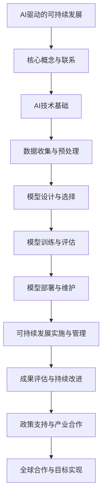

                 

## 文章标题

在21世纪的今天，人工智能（AI）正以前所未有的速度发展，成为推动社会进步和经济增长的重要力量。与此同时，可持续发展已经成为全球各国政府、企业和公众共同关注的焦点。那么，AI与可持续发展之间有着怎样的联系？AI如何能够驱动可持续发展？本文将围绕这些问题展开探讨，旨在揭示AI驱动的可持续发展解决方案的核心概念、应用实例、实施策略及其未来发展趋势。通过逻辑清晰、结构紧凑的分析，本文将为读者呈现一幅AI与可持续发展相互融合的宏伟蓝图。

## 关键词

- 人工智能（AI）
- 可持续发展
- 能源效率
- 环境监测
- 资源优化
- 智慧城市
- 智能农业
- 绿色供应链
- 数据隐私
- 伦理问题
- AI技术挑战

## 摘要

本文将深入探讨AI驱动的可持续发展解决方案。首先，我们将阐述AI与可持续发展的核心概念及其联系，分析AI在可持续发展中的关键领域和应用实例。接着，本文将详细解读AI驱动的可持续发展解决方案的实施与管理方法，包括项目规划、风险评估、监测与反馈机制等。随后，通过实际案例研究，本文将展示AI在智能电网、智能农业、智慧城市和绿色供应链管理等方面的应用。最后，我们将探讨AI驱动的可持续发展解决方案的未来发展趋势和挑战，为读者提供对未来可持续发展的深刻洞察。通过本文的阅读，读者将全面了解AI驱动的可持续发展解决方案的原理和实践，为其在相关领域的应用提供指导。

## 《AI驱动的可持续发展解决方案》目录大纲

### 第一部分：AI与可持续发展的概念与联系

#### 1.1 AI与可持续发展的核心概念

##### 1.1.1 什么是AI

##### 1.1.2 什么是可持续发展

##### 1.1.3 AI如何驱动可持续发展

#### 1.2 AI驱动的可持续发展关键领域

##### 1.2.1 能源效率

##### 1.2.2 环境监测

##### 1.2.3 资源优化与循环利用

##### 1.2.4 社区与经济可持续发展

#### 1.3 AI技术发展的挑战与可持续发展

##### 1.3.1 能源消耗与碳排放

##### 1.3.2 数据隐私与伦理问题

##### 1.3.3 技术成熟度与市场应用

### 第二部分：AI驱动的可持续发展解决方案

#### 2.1 AI驱动的可持续发展应用实例

##### 2.1.1 智能电网与能源管理

##### 2.1.2 智能农业与精准灌溉

##### 2.1.3 智慧城市与交通优化

##### 2.1.4 绿色供应链管理

#### 2.2 AI模型构建与优化

##### 2.2.1 数据收集与预处理

##### 2.2.2 模型设计与选择

##### 2.2.3 模型训练与评估

##### 2.2.4 模型部署与维护

#### 2.3 可持续发展项目的实施与管理

##### 2.3.1 项目规划与预算

##### 2.3.2 风险评估与管理

##### 2.3.3 项目监测与反馈机制

##### 2.3.4 成果评估与持续改进

### 第三部分：AI驱动的可持续发展解决方案实践

#### 3.1 案例研究：AI在可持续发展中的应用

##### 3.1.1 案例一：智能电网在可持续发展中的应用

##### 3.1.2 案例二：智能农业在可持续发展中的应用

##### 3.1.3 案例三：智慧城市在可持续发展中的应用

##### 3.1.4 案例四：绿色供应链管理在可持续发展中的应用

#### 3.2 AI驱动的可持续发展解决方案发展趋势

##### 3.2.1 AI技术的最新进展

##### 3.2.2 可持续发展领域的技术需求

##### 3.2.3 未来发展趋势与挑战

#### 3.3 AI驱动的可持续发展解决方案的未来

##### 3.3.1 可持续发展的社会影响

##### 3.3.2 政策支持与产业合作

##### 3.3.3 持续发展目标与全球合作

### 附录

#### 附录A：AI驱动的可持续发展解决方案工具与资源

##### A.1 主流AI开发工具

##### A.2 可持续发展相关的数据集

##### A.3 可持续发展领域的学术论文

##### A.4 相关组织与机构推荐

### 附加内容

#### 第一部分：AI驱动的可持续发展解决方案：Mermaid流程图

#### 第二部分：AI驱动的可持续发展解决方案：核心算法原理讲解

##### 5.1.1 支持向量机（SVM）算法原理

##### 5.1.2 集成学习方法原理

#### 第三部分：AI驱动的可持续发展解决方案：项目实战

##### 6.1.1 实践一：智能电网数据监控与分析

##### 6.1.2 实践二：智慧农业土壤健康监测

##### 6.1.3 实践三：智慧交通流量预测

##### 6.1.4 实践四：绿色供应链管理

##### 6.1.5 实践五：可持续发展项目的实施与管理

##### 6.1.6 实践六：案例分析

##### 6.1.7 实践七：AI驱动的可持续发展解决方案的发展趋势

## 引言

### AI与可持续发展的必然结合

随着全球气候变化、资源枯竭和环境恶化等问题的日益严重，可持续发展成为全球各国政府、企业和公众共同关注的焦点。而人工智能（AI）作为当代科技的前沿领域，其发展速度之快、应用范围之广，使其成为推动社会进步和经济增长的重要力量。AI与可持续发展之间的结合不仅是一种技术趋势，更是一种必然的选择。

首先，AI具有强大的数据处理和分析能力，能够对海量数据进行分析和挖掘，从而发现隐藏在数据背后的规律和趋势。这对于解决环境监测、资源优化和能源管理等问题具有重要意义。通过AI技术，我们可以更精准地监测环境变化，预测自然灾害，优化资源配置，提高能源利用效率，从而实现可持续发展。

其次，AI技术能够助力智慧城市、智能农业和绿色供应链等领域的建设。例如，智慧城市可以通过AI技术实现交通流量优化、公共安全监控和市政管理智能化，从而提高城市生活质量和效率；智能农业则可以利用AI进行精准灌溉、病虫害监测和作物产量预测，提高农业生产效率和可持续性；绿色供应链管理可以通过AI技术实现供应链全程监控和优化，降低资源消耗和碳排放，实现可持续发展。

然而，AI技术的发展也面临一些挑战。例如，AI技术在数据隐私和伦理问题方面存在争议，如何保护用户隐私和数据安全成为一个亟待解决的问题。此外，AI技术的成熟度和市场应用程度也影响着其推动可持续发展的效果。因此，在推进AI驱动的可持续发展过程中，我们需要关注并解决这些问题。

### 本文目标与结构

本文旨在探讨AI驱动的可持续发展解决方案，旨在揭示AI在可持续发展中的核心概念、关键领域和应用实例，并分析其未来发展趋势和挑战。文章将分为三个主要部分：

第一部分：AI与可持续发展的概念与联系，将详细阐述AI与可持续发展的核心概念、关键领域以及面临的挑战。

第二部分：AI驱动的可持续发展解决方案，将介绍AI在可持续发展中的应用实例，包括智能电网与能源管理、智能农业与精准灌溉、智慧城市与交通优化、绿色供应链管理等。

第三部分：AI驱动的可持续发展解决方案实践，将通过实际案例研究，展示AI在可持续发展领域的应用实践，并探讨其未来发展趋势和挑战。

通过本文的阅读，读者将全面了解AI驱动的可持续发展解决方案的原理和实践，为其在相关领域的应用提供指导。

## 第一部分：AI与可持续发展的概念与联系

### 1.1 AI与可持续发展的核心概念

#### 1.1.1 什么是AI

人工智能（Artificial Intelligence，简称AI）是计算机科学的一个分支，致力于使计算机模拟人类智能行为。AI技术包括多种算法和技术，如机器学习、深度学习、自然语言处理、计算机视觉等。通过这些技术，计算机能够自主学习和决策，从而在多个领域实现自动化和智能化。

AI的核心概念可以概括为以下几点：

1. **学习与适应**：AI系统可以通过学习数据来适应新的环境和任务，从而实现自主学习和优化。
2. **自动化与效率**：AI技术可以自动化复杂任务，提高工作效率，减少人为错误。
3. **决策支持**：AI系统能够基于数据和算法提供决策支持，帮助人们做出更明智的决策。

#### 1.1.2 什么是可持续发展

可持续发展（Sustainable Development）是指满足当前需求而不损害后代满足其需求的能力。它涵盖了经济、社会和环境三个维度，强调在满足人类需求的同时，要保护和维护地球的生态系统。

可持续发展的核心概念包括：

1. **经济可持续性**：追求长期的经济发展，确保资源合理利用和经济效益。
2. **社会可持续性**：关注人类福祉和社会公正，确保社会稳定和进步。
3. **环境可持续性**：保护和维护自然环境，减少对生态系统的破坏。

#### 1.1.3 AI如何驱动可持续发展

AI与可持续发展之间的结合主要体现在以下几个方面：

1. **能源效率**：AI技术可以通过优化能源使用，提高能源效率，减少能源浪费。例如，智能电网可以通过AI算法实现电力供需平衡，提高能源利用效率。
2. **环境监测**：AI技术能够实时监测环境变化，预测自然灾害，提供决策支持，从而保护生态环境。例如，利用AI进行空气质量监测和污染源追踪，有助于改善空气质量。
3. **资源优化与循环利用**：AI技术可以优化资源配置，提高资源利用效率，推动循环经济发展。例如，通过AI实现生产过程的自动化和智能化，减少原材料浪费和能源消耗。
4. **智慧城市与交通优化**：AI技术可以优化城市交通管理，提高交通效率，减少交通拥堵，降低碳排放。例如，通过智能交通系统实现实时交通监控和信号优化。
5. **智能农业与精准灌溉**：AI技术可以用于农业领域，实现精准种植和灌溉，提高农业生产效率和可持续性。例如，利用AI监测土壤质量和气候条件，实现智能灌溉和病虫害防治。
6. **绿色供应链管理**：AI技术可以优化供应链管理，降低资源消耗和碳排放，实现绿色供应链。例如，通过AI实现供应链全程监控和优化，降低库存成本和运输能耗。

### 1.2 AI驱动的可持续发展关键领域

AI在可持续发展中的应用不仅限于上述领域，还包括以下几个方面：

#### 1.2.1 能源效率

能源效率是可持续发展的重要指标之一。AI技术可以通过优化能源使用，提高能源利用效率，减少能源浪费。例如，智能电网利用AI算法实现电力供需平衡，优化电力分配，提高能源利用效率。此外，AI技术还可以用于能源消耗预测和需求管理，帮助企业和家庭实现能源节约。

#### 1.2.2 环境监测

环境监测是保护生态环境的重要手段。AI技术可以通过实时监测环境变化，预测自然灾害，提供决策支持，从而保护生态环境。例如，利用AI进行空气质量监测和污染源追踪，有助于改善空气质量。此外，AI技术还可以用于水资源监测和水污染治理，保障水资源安全。

#### 1.2.3 资源优化与循环利用

资源优化与循环利用是实现可持续发展的重要途径。AI技术可以通过优化资源配置，提高资源利用效率，推动循环经济发展。例如，通过AI实现生产过程的自动化和智能化，减少原材料浪费和能源消耗。此外，AI技术还可以用于废弃物处理和资源回收，实现资源的可持续利用。

#### 1.2.4 社区与经济可持续发展

社区与经济可持续发展是可持续发展的关键。AI技术可以优化社区服务和城市治理，提高生活质量。例如，通过AI实现社区安防监控、医疗健康管理和交通管理，提高社区安全和生活便利性。此外，AI技术还可以用于经济分析和预测，帮助政府和企业制定可持续发展的战略和政策。

### 1.3 AI技术发展的挑战与可持续发展

尽管AI在可持续发展中具有巨大的潜力，但其发展也面临一些挑战。这些挑战主要包括：

#### 1.3.1 能源消耗与碳排放

AI技术的发展离不开大量的计算资源，这会导致能源消耗和碳排放增加。例如，大规模的深度学习模型训练需要大量的电力支持。因此，如何在推动AI技术发展的同时，减少能源消耗和碳排放，成为可持续发展的关键问题。

#### 1.3.2 数据隐私与伦理问题

AI技术的发展涉及到大量数据的收集和使用，如何保护用户隐私和数据安全成为一个重要问题。此外，AI技术的决策过程可能存在偏见和歧视，如何确保AI技术的公平性和透明性，也是可持续发展需要关注的问题。

#### 1.3.3 技术成熟度与市场应用

AI技术的成熟度和市场应用程度影响着其推动可持续发展的效果。目前，AI技术在一些领域仍处于快速发展阶段，尚未完全成熟。此外，市场应用的需求和推动力度也影响着AI技术的推广和应用。

### 结论

AI与可持续发展的结合是当代科技发展的必然趋势，具有巨大的潜力。通过AI技术，我们可以实现能源效率提升、环境监测、资源优化和社区与经济可持续发展。然而，AI技术的发展也面临一些挑战，如能源消耗与碳排放、数据隐私与伦理问题、技术成熟度与市场应用等。只有通过克服这些挑战，我们才能充分发挥AI在可持续发展中的作用，实现全球的可持续发展目标。

## 第一部分：AI与可持续发展的核心概念与联系

### 1.1 AI与可持续发展的核心概念

#### 1.1.1 什么是AI

人工智能（Artificial Intelligence，简称AI）是计算机科学的一个分支，致力于使计算机模拟人类智能行为。AI技术包括多种算法和技术，如机器学习、深度学习、自然语言处理、计算机视觉等。通过这些技术，计算机能够自主学习和决策，从而在多个领域实现自动化和智能化。

AI的核心概念可以概括为以下几点：

1. **学习与适应**：AI系统可以通过学习数据来适应新的环境和任务，从而实现自主学习和优化。
2. **自动化与效率**：AI技术可以自动化复杂任务，提高工作效率，减少人为错误。
3. **决策支持**：AI系统能够基于数据和算法提供决策支持，帮助人们做出更明智的决策。

#### 1.1.2 什么是可持续发展

可持续发展（Sustainable Development）是指满足当前需求而不损害后代满足其需求的能力。它涵盖了经济、社会和环境三个维度，强调在满足人类需求的同时，要保护和维护地球的生态系统。

可持续发展的核心概念包括：

1. **经济可持续性**：追求长期的经济发展，确保资源合理利用和经济效益。
2. **社会可持续性**：关注人类福祉和社会公正，确保社会稳定和进步。
3. **环境可持续性**：保护和维护自然环境，减少对生态系统的破坏。

#### 1.1.3 AI如何驱动可持续发展

AI与可持续发展之间的结合主要体现在以下几个方面：

1. **能源效率**：AI技术可以通过优化能源使用，提高能源利用效率，减少能源浪费。例如，智能电网利用AI算法实现电力供需平衡，优化电力分配，提高能源利用效率。此外，AI技术还可以用于能源消耗预测和需求管理，帮助企业和家庭实现能源节约。

2. **环境监测**：AI技术能够实时监测环境变化，预测自然灾害，提供决策支持，从而保护生态环境。例如，利用AI进行空气质量监测和污染源追踪，有助于改善空气质量。此外，AI技术还可以用于水资源监测和水污染治理，保障水资源安全。

3. **资源优化与循环利用**：AI技术可以优化资源配置，提高资源利用效率，推动循环经济发展。例如，通过AI实现生产过程的自动化和智能化，减少原材料浪费和能源消耗。此外，AI技术还可以用于废弃物处理和资源回收，实现资源的可持续利用。

4. **智慧城市与交通优化**：AI技术可以优化城市交通管理，提高交通效率，减少交通拥堵，降低碳排放。例如，通过智能交通系统实现实时交通监控和信号优化。
   
5. **智能农业与精准灌溉**：AI技术可以用于农业领域，实现精准种植和灌溉，提高农业生产效率和可持续性。例如，利用AI监测土壤质量和气候条件，实现智能灌溉和病虫害防治。

6. **绿色供应链管理**：AI技术可以优化供应链管理，降低资源消耗和碳排放，实现绿色供应链。例如，通过AI实现供应链全程监控和优化，降低库存成本和运输能耗。

### 1.2 AI驱动的可持续发展关键领域

AI在可持续发展中的应用不仅限于上述领域，还包括以下几个方面：

#### 1.2.1 能源效率

能源效率是可持续发展的重要指标之一。AI技术可以通过优化能源使用，提高能源利用效率，减少能源浪费。例如，智能电网利用AI算法实现电力供需平衡，优化电力分配，提高能源利用效率。此外，AI技术还可以用于能源消耗预测和需求管理，帮助企业和家庭实现能源节约。

#### 1.2.2 环境监测

环境监测是保护生态环境的重要手段。AI技术可以通过实时监测环境变化，预测自然灾害，提供决策支持，从而保护生态环境。例如，利用AI进行空气质量监测和污染源追踪，有助于改善空气质量。此外，AI技术还可以用于水资源监测和水污染治理，保障水资源安全。

#### 1.2.3 资源优化与循环利用

资源优化与循环利用是实现可持续发展的重要途径。AI技术可以通过优化资源配置，提高资源利用效率，推动循环经济发展。例如，通过AI实现生产过程的自动化和智能化，减少原材料浪费和能源消耗。此外，AI技术还可以用于废弃物处理和资源回收，实现资源的可持续利用。

#### 1.2.4 社区与经济可持续发展

社区与经济可持续发展是可持续发展的关键。AI技术可以优化社区服务和城市治理，提高生活质量。例如，通过AI实现社区安防监控、医疗健康管理和交通管理，提高社区安全和生活便利性。此外，AI技术还可以用于经济分析和预测，帮助政府和企业制定可持续发展的战略和政策。

### 1.3 AI技术发展的挑战与可持续发展

尽管AI在可持续发展中具有巨大的潜力，但其发展也面临一些挑战。这些挑战主要包括：

#### 1.3.1 能源消耗与碳排放

AI技术的发展离不开大量的计算资源，这会导致能源消耗和碳排放增加。例如，大规模的深度学习模型训练需要大量的电力支持。因此，如何在推动AI技术发展的同时，减少能源消耗和碳排放，成为可持续发展的关键问题。

#### 1.3.2 数据隐私与伦理问题

AI技术的发展涉及到大量数据的收集和使用，如何保护用户隐私和数据安全成为一个重要问题。此外，AI技术的决策过程可能存在偏见和歧视，如何确保AI技术的公平性和透明性，也是可持续发展需要关注的问题。

#### 1.3.3 技术成熟度与市场应用

AI技术的成熟度和市场应用程度影响着其推动可持续发展的效果。目前，AI技术在一些领域仍处于快速发展阶段，尚未完全成熟。此外，市场应用的需求和推动力度也影响着AI技术的推广和应用。

### 结论

AI与可持续发展的结合是当代科技发展的必然趋势，具有巨大的潜力。通过AI技术，我们可以实现能源效率提升、环境监测、资源优化和社区与经济可持续发展。然而，AI技术的发展也面临一些挑战，如能源消耗与碳排放、数据隐私与伦理问题、技术成熟度与市场应用等。只有通过克服这些挑战，我们才能充分发挥AI在可持续发展中的作用，实现全球的可持续发展目标。

## 第一部分：AI与可持续发展的核心概念与联系

### 1.1 AI与可持续发展的核心概念

在深入探讨AI与可持续发展的结合之前，我们需要先了解两者的核心概念。

#### 1.1.1 什么是AI

人工智能（AI）是指由人造系统实现的智能行为，这些行为通常是人类或其他动物所具有的认知功能，如学习、推理、解决问题、感知和语言理解等。AI可以分为两类：弱AI（或称为特定任务AI）和强AI（或称为通用AI）。弱AI专注于特定任务，如语音识别、图像分类和游戏玩等，而强AI则具有普遍的智能，能够执行任何认知任务。

AI的核心概念包括：

1. **机器学习（Machine Learning）**：一种让机器从数据中学习并做出预测或决策的方法。
2. **深度学习（Deep Learning）**：一种特殊的机器学习方法，它使用具有多层神经元的神经网络来模拟人脑的学习过程。
3. **自然语言处理（Natural Language Processing, NLP）**：使计算机能够理解、生成和处理人类语言的技术。
4. **计算机视觉（Computer Vision）**：使计算机能够从图像或视频中提取信息和理解内容的技术。

#### 1.1.2 什么是可持续发展

可持续发展是指在满足当前需求的同时，不损害未来世代满足其需求的能力。这一概念由1987年联合国世界环境与发展委员会在《我们共同的未来》（又称布伦特兰报告）中首次提出。可持续发展涉及经济、社会和环境三个维度，其核心原则包括公平性、持续性和共同利益。

可持续发展的核心概念包括：

1. **经济可持续性**：确保经济增长的同时，保护自然资源和生态环境。
2. **社会可持续性**：保障社会公平、人类健康、教育和社会稳定。
3. **环境可持续性**：保护和恢复自然环境，防止生态系统的破坏。

### 1.1.3 AI如何驱动可持续发展

AI技术为可持续发展提供了强有力的支持，主要体现在以下几个方面：

1. **能源效率**：AI可以帮助优化能源使用，例如在智能电网中实现电力供需的实时平衡，预测能源需求，降低浪费。
2. **环境监测**：AI能够通过监测和分析环境数据，预测气候变化、污染水平等，为环境保护决策提供科学依据。
3. **资源优化**：AI可以优化水资源、农业资源和材料资源的使用，减少浪费，促进循环经济。
4. **智慧城市**：AI可以用于交通管理、公共安全和城市规划，提高城市运行效率，减少碳排放。
5. **智能农业**：AI技术如精准农业，可以帮助农民优化灌溉、施肥和病虫害防治，提高农业生产效率。
6. **供应链管理**：AI可以优化供应链流程，减少运输和库存成本，提高资源利用率。

### 结论

AI与可持续发展之间的结合是当代科技发展的必然趋势，通过AI技术的应用，我们可以在多个领域推动可持续发展。了解AI的核心概念和可持续发展的原则，是深入探讨这两者相互关系的基础。接下来，我们将进一步探讨AI驱动的可持续发展关键领域，分析其在实际应用中的挑战和机遇。

## 1.2 AI驱动的可持续发展关键领域

AI技术不仅在理论层面上推动了可持续发展的概念，更在实践中为多个关键领域提供了创新解决方案。以下是AI驱动的可持续发展关键领域及其具体应用：

### 1.2.1 能源效率

能源效率是可持续发展的重要方面之一。AI技术在能源管理和优化中发挥着关键作用。例如，智能电网利用AI算法进行电力供需预测和实时平衡，以降低电力浪费并提高能源利用效率。通过分析历史数据和实时数据，AI可以优化电力分配，减少峰值负荷，从而减少能源消耗。

**实例**：特斯拉的Powerwall储能系统结合了AI技术，能够根据电力需求预测自动调整电池充电和放电，实现能源的智能管理。

### 1.2.2 环境监测

AI技术在环境监测中提供了高效、精确的工具。例如，通过卫星图像和地面传感器的数据，AI可以监测全球气候变化、森林砍伐、海洋污染等环境问题。此外，AI还可以分析空气质量数据，预测污染事件，提供预警和应对措施。

**实例**：谷歌的地球引擎（Google Earth Engine）利用AI进行大规模环境数据分析和可视化，帮助科学家和决策者更好地理解环境变化。

### 1.2.3 资源优化与循环利用

资源优化与循环利用是实现可持续发展的重要途径。AI技术可以通过优化供应链、生产过程和废弃物管理来提高资源利用效率。例如，在制造业中，AI可以优化生产计划，减少材料浪费；在废弃物管理中，AI可以识别可回收材料，促进循环利用。

**实例**：IBM的RecyclableAI项目利用AI技术分析垃圾成分，提高垃圾回收效率，减少对环境的影响。

### 1.2.4 社区与经济可持续发展

AI技术可以促进社区和经济的可持续发展。通过智慧城市技术，AI可以优化交通管理、公共安全和资源分配，提高居民生活质量。在经济领域，AI可以帮助企业进行市场分析、风险评估和供应链管理，提高经济效益。

**实例**：新加坡的智能国家计划通过AI技术实现城市交通流量优化、能源管理和社会服务优化，提升城市可持续性。

### 1.2.5 智慧农业

智慧农业是AI技术在农业领域的应用，通过监测土壤、气候和作物健康数据，AI可以帮助农民实现精准种植和灌溉，提高农业生产效率和可持续性。例如，无人机和传感器可以收集农田数据，AI算法根据数据进行分析，提供最优的种植方案。

**实例**：中国的智慧农业项目利用AI技术监测作物生长情况，通过精准灌溉和病虫害防治，提高了农作物的产量和质量。

### 1.2.6 绿色供应链管理

绿色供应链管理通过AI技术实现供应链全程的监控和优化，减少资源消耗和碳排放。AI可以帮助企业识别能源消耗高的环节，优化物流路线，减少运输成本和碳排放。

**实例**：沃尔玛利用AI技术优化其供应链管理，通过实时监控库存和运输，减少了供应链的碳排放。

### 结论

AI在能源效率、环境监测、资源优化、社区与经济可持续发展、智慧农业和绿色供应链管理等多个领域都发挥着重要作用。通过AI技术的应用，我们可以实现更高效的资源利用，更精确的环境监测，更智能的农业管理，以及更可持续的经济模式。这些应用不仅有助于实现可持续发展目标，也为未来的科技发展提供了新的方向。

## 1.3 AI技术发展的挑战与可持续发展

虽然AI技术在可持续发展中展现出了巨大的潜力，但在其发展的过程中也面临一些挑战。这些挑战主要包括能源消耗与碳排放、数据隐私与伦理问题、以及技术成熟度与市场应用等方面。以下是对这些挑战的详细分析：

### 1.3.1 能源消耗与碳排放

AI技术的发展依赖于大量的计算资源，这导致了能源消耗和碳排放的增加。特别是深度学习模型的训练过程，需要大量的电力支持，如果这些电力来自化石燃料，将进一步加剧碳排放问题。例如，一个大规模的深度学习模型训练过程可能消耗的电力，相当于数百个家庭一个月的用电量。

**解决方案**：
- **绿色能源**：推动绿色能源的使用，如太阳能、风能等，减少对化石燃料的依赖。
- **能源效率提升**：通过优化数据中心的能源使用，提高计算效率，减少能源浪费。
- **分布式计算**：利用分布式计算技术，将计算任务分散到多个节点，减少单个节点的能源消耗。

### 1.3.2 数据隐私与伦理问题

AI技术的发展涉及到大量数据的收集和使用，如何保护用户隐私和数据安全成为一个重要问题。此外，AI技术的决策过程可能存在偏见和歧视，如何确保AI技术的公平性和透明性，也是可持续发展需要关注的问题。

**解决方案**：
- **数据保护法规**：制定和执行严格的数据保护法规，保护用户隐私。
- **算法透明性**：提高AI算法的透明性，确保其决策过程可解释，减少偏见和歧视。
- **伦理审查**：建立伦理审查机制，对AI技术进行定期评估，确保其符合伦理标准。

### 1.3.3 技术成熟度与市场应用

AI技术在一些领域仍处于快速发展阶段，尚未完全成熟。此外，市场应用的需求和推动力度也影响着AI技术的推广和应用。例如，智能农业和智慧城市的AI应用虽然在实验室和试点项目中取得了成功，但在大规模推广和应用中仍面临诸多挑战。

**解决方案**：
- **技术研发投入**：加大对AI技术研发的投入，推动技术成熟和应用。
- **政策支持**：政府和企业应提供政策支持，鼓励AI技术在可持续发展中的应用。
- **教育与培训**：加强AI领域的教育和培训，提高从业者的技能和知识水平。

### 结论

AI技术发展的挑战是可持续发展过程中不可避免的问题，但通过科学合理的解决方案，我们可以克服这些挑战。减少能源消耗和碳排放、保护数据隐私和伦理问题、提高技术成熟度和市场应用，是推动AI技术可持续发展的关键。只有解决了这些挑战，AI技术才能更好地为可持续发展服务，实现全球的可持续发展目标。

## 2.1 AI驱动的可持续发展应用实例

在第一部分，我们讨论了AI与可持续发展的核心概念及其联系。在这一部分，我们将通过具体的实例来展示AI技术如何在各个领域推动可持续发展。

### 2.1.1 智能电网与能源管理

智能电网是AI技术在能源领域的重要应用之一。智能电网通过集成先进的通信技术、传感技术和AI算法，实现了电力系统的自动化和智能化管理。以下是一些AI驱动的智能电网应用实例：

**实例一：电力需求预测与优化**

通过AI算法对历史电力数据进行分析和预测，智能电网可以准确预测未来的电力需求，从而优化电力生产和分配。例如，亚马逊AWS使用机器学习算法，为电网运营商提供实时电力需求预测服务，帮助减少电力浪费，提高能源效率。

**实例二：分布式能源管理**

智能电网中的AI系统可以协调分布式能源资源，如太阳能电池板和风力涡轮机，实现能源的优化利用。Google在加利福尼亚州的智能电网项目中，通过AI算法实现了分布式能源的有效管理，提高了能源利用效率。

**实例三：智能电表与用户行为分析**

智能电表可以通过AI技术收集用户的用电数据，分析用户的用电行为。这有助于电力公司制定更精准的用电政策，提高用户的能源利用效率。例如，英国国家电网公司利用AI技术分析智能电表数据，为用户提供个性化的节能建议，提高了用户的能源意识。

### 2.1.2 智能农业与精准灌溉

智能农业是AI技术在农业领域的应用，通过传感器、无人机和AI算法，实现对作物生长环境的精准监测和管理。以下是一些AI驱动的智能农业应用实例：

**实例一：土壤健康监测**

通过安装在农田中的传感器，AI系统可以实时监测土壤的湿度、温度和养分含量，为农民提供科学的种植决策。例如，美国农业技术公司Terrasynthus利用AI技术监测土壤健康，帮助农民实现精准灌溉，减少了水资源的浪费。

**实例二：作物病虫害监测与防治**

AI技术可以通过图像识别和数据分析，监测作物病虫害的发生情况，并提供防治措施。例如，中国农业科技企业北大荒利用AI技术监测玉米田的病虫害，通过无人机喷洒农药，有效控制了病虫害的蔓延。

**实例三：精准灌溉系统**

通过AI算法分析土壤和气象数据，智能灌溉系统可以自动调整灌溉量和灌溉时间，实现精准灌溉。例如，以色列农业科技公司Netafim利用AI技术开发的智能灌溉系统，帮助农民实现水资源的最大化利用，提高了农业生产的可持续性。

### 2.1.3 智慧城市与交通优化

智慧城市是AI技术在城市管理中的重要应用，通过AI技术实现城市资源的优化配置和高效管理。以下是一些AI驱动的智慧城市应用实例：

**实例一：智能交通管理**

通过AI技术对交通流量进行分析和预测，智能交通系统可以实现交通信号的实时优化，减少交通拥堵。例如，中国的北京市利用AI技术优化交通信号灯，提高了道路通行效率，减少了碳排放。

**实例二：智慧停车管理**

AI技术可以通过图像识别和数据分析，实现智能停车管理。例如，德国城市弗莱堡利用AI技术监控停车位的使用情况，提高了停车效率，减少了停车难问题。

**实例三：公共安全管理**

AI技术可以帮助城市实现公共安全的实时监控和预警。例如，美国的洛杉矶市利用AI技术监控城市摄像头，实时识别可疑行为，提高了公共安全水平。

### 2.1.4 绿色供应链管理

绿色供应链管理是AI技术在供应链管理中的应用，通过AI技术实现供应链的全程监控和优化。以下是一些AI驱动的绿色供应链管理应用实例：

**实例一：供应链风险评估**

通过AI技术对供应链中的各个环节进行风险评估，企业可以提前识别潜在的风险，并采取相应的预防措施。例如，亚马逊利用AI技术对全球供应链进行风险评估，提高了供应链的可靠性和灵活性。

**实例二：物流路径优化**

通过AI算法分析运输数据，智能物流系统可以实现最优的物流路径规划，减少运输时间和成本。例如，阿里巴巴的菜鸟网络利用AI技术优化物流路径，提高了物流效率，减少了碳排放。

**实例三：废弃物处理与回收**

AI技术可以优化废弃物处理和回收过程，提高资源利用效率。例如，瑞典垃圾处理公司Renova利用AI技术分析垃圾成分，提高垃圾回收率，减少了废弃物对环境的影响。

### 结论

AI技术在智能电网与能源管理、智能农业与精准灌溉、智慧城市与交通优化、绿色供应链管理等领域有着广泛的应用，通过这些实例，我们可以看到AI技术如何推动可持续发展。AI技术的应用不仅提高了资源利用效率，减少了环境污染，也为企业和城市的管理提供了新的手段。随着AI技术的不断发展和完善，其在可持续发展中的作用将越来越大，为全球的可持续发展目标实现提供有力支持。

## 2.2 AI模型构建与优化

在上一部分，我们探讨了AI技术在多个领域推动可持续发展的实际应用实例。然而，要实现这些应用实例，AI模型的构建与优化是至关重要的。在这一部分，我们将详细讨论AI模型的构建与优化过程，包括数据收集与预处理、模型设计与选择、模型训练与评估、模型部署与维护等关键步骤。

### 2.2.1 数据收集与预处理

数据是AI模型的基石，其质量和准确性直接影响模型的性能。因此，数据收集和预处理是构建AI模型的重要步骤。以下是数据收集与预处理的关键步骤：

1. **数据来源**：数据可以从多个渠道获取，包括公开数据集、企业内部数据、传感器数据等。选择合适的数据源是数据收集的第一步。

2. **数据清洗**：数据清洗是数据预处理的核心步骤，目的是去除错误、缺失、重复和异常数据。常见的清洗方法包括删除重复记录、填补缺失值、处理异常值等。

3. **数据标准化**：为了使数据集适合AI模型训练，需要对数据进行标准化处理。常用的标准化方法包括最小-最大标准化、z-score标准化等。

4. **数据增强**：数据增强是一种提高模型泛化能力的方法，通过生成新的数据样本来丰富数据集。常见的数据增强方法包括数据旋转、缩放、裁剪、噪声添加等。

### 2.2.2 模型设计与选择

在数据预处理完成后，接下来是模型设计与选择阶段。模型设计包括选择合适的算法、确定模型架构和超参数设置等。以下是模型设计与选择的关键步骤：

1. **选择算法**：根据实际问题需求和数据特点，选择合适的算法。常见的机器学习算法包括线性回归、决策树、随机森林、支持向量机、神经网络等。

2. **确定模型架构**：模型架构是指模型的结构和层次。例如，对于图像识别问题，可以选择卷积神经网络（CNN）；对于文本分析问题，可以选择循环神经网络（RNN）或变压器（Transformer）模型。

3. **超参数设置**：超参数是模型训练过程中需要手动调整的参数，如学习率、批量大小、正则化参数等。超参数设置对模型性能有重要影响，需要通过实验进行优化。

### 2.2.3 模型训练与评估

模型训练与评估是AI模型构建的核心步骤。以下是模型训练与评估的关键步骤：

1. **训练集与测试集划分**：将数据集划分为训练集和测试集。训练集用于模型训练，测试集用于模型评估。

2. **模型训练**：使用训练集数据对模型进行训练，通过迭代优化模型参数，使模型能够准确地预测目标变量。

3. **模型评估**：使用测试集数据评估模型性能，常用的评估指标包括准确率、召回率、F1分数、均方误差（MSE）等。评估结果可以帮助我们了解模型的性能，并指导进一步优化。

### 2.2.4 模型部署与维护

模型部署是将训练好的模型应用到实际场景中的过程。以下是模型部署与维护的关键步骤：

1. **模型部署**：将训练好的模型部署到生产环境中，例如使用云计算平台、边缘设备等。

2. **实时监控与反馈**：实时监控模型在应用中的性能，收集用户反馈，用于模型优化和改进。

3. **模型维护**：定期更新和维护模型，以适应新的数据和环境变化。例如，定期重新训练模型，调整超参数，应对数据分布的变化。

### 结论

AI模型的构建与优化是推动AI技术在可持续发展中应用的关键步骤。通过科学合理的数据收集与预处理、模型设计与选择、模型训练与评估、模型部署与维护，我们可以构建出性能优越的AI模型，为可持续发展提供有力支持。随着AI技术的不断进步，模型构建与优化方法也将不断改进，为可持续发展带来更多可能性。

## 2.3 可持续发展项目的实施与管理

在了解了AI模型的构建与优化后，接下来我们将探讨如何实施与管理可持续发展项目。这些项目不仅需要技术支持，还需要系统的规划、有效的管理和持续改进。以下是可持续发展项目实施与管理的关键步骤和策略。

### 2.3.1 项目规划与预算

项目规划是可持续发展项目的第一步，它涉及明确项目目标、确定项目范围、制定项目计划等。以下是项目规划与预算的关键步骤：

1. **明确项目目标**：首先需要明确项目的总体目标，这些目标应当与可持续发展原则相符。例如，减少碳排放、提高能源效率、改善环境质量等。

2. **确定项目范围**：明确项目的具体范围，包括涉及的领域、地区、时间跨度等。这有助于界定项目的责任和资源需求。

3. **制定项目计划**：制定详细的实施计划，包括项目时间表、关键里程碑、资源分配、预算等。项目计划应当具有可操作性和可行性。

4. **预算编制**：根据项目计划，编制详细的预算，包括人力、技术设备、运营费用等。预算编制需要考虑项目的长期成本和潜在收益。

### 2.3.2 风险评估与管理

任何项目都会面临风险，可持续发展项目也不例外。有效的风险评估与管理对于项目的成功至关重要。以下是风险评估与管理的关键步骤：

1. **识别风险**：识别项目可能面临的风险，包括技术风险、财务风险、市场风险、政策风险等。

2. **评估风险**：对识别出的风险进行评估，包括风险的概率和影响程度。评估结果可以帮助确定风险优先级。

3. **制定应对策略**：根据风险评估结果，制定相应的风险应对策略。例如，通过多元化融资减少财务风险，通过政策支持降低政策风险。

4. **风险监控**：在项目实施过程中，定期监控风险的变化，及时调整应对策略，确保项目的顺利推进。

### 2.3.3 项目监测与反馈机制

项目监测与反馈机制是确保项目按照计划推进的重要手段。以下是项目监测与反馈机制的关键步骤：

1. **数据收集**：收集项目实施过程中的数据，包括项目进度、成本、资源使用、环境影响等。

2. **数据分析**：对收集到的数据进行分析，评估项目进展是否符合预期目标，发现潜在问题。

3. **反馈与调整**：根据数据分析结果，及时反馈项目执行情况，识别问题并制定改进措施。项目监测与反馈机制应当是一个动态调整的过程。

4. **持续改进**：通过不断监测和反馈，持续改进项目的实施方法和管理策略，提高项目的成功率。

### 2.3.4 成果评估与持续改进

项目成果评估是项目结束后的关键步骤，它有助于总结项目经验，为未来项目提供参考。以下是成果评估与持续改进的关键步骤：

1. **评估指标**：制定评估指标，包括项目目标达成情况、成本效益、环境影响等。

2. **评估报告**：编写项目评估报告，总结项目成果、经验和教训。

3. **经验分享**：将项目评估结果分享给相关人员，促进经验交流和学习。

4. **持续改进**：根据项目评估结果，制定持续改进计划，不断提升项目实施和管理能力。

### 结论

可持续发展项目的实施与管理是一个复杂而系统的过程，需要科学的项目规划、有效的风险评估、系统的项目监测与反馈机制以及持续改进。通过这些关键步骤和策略，我们可以确保可持续发展项目的成功实施，为全球的可持续发展目标做出贡献。随着AI技术的不断发展，项目实施与管理的方法也将不断优化，为可持续发展带来更多机遇。

## 3.1 案例研究：AI在可持续发展中的应用

为了更好地理解AI技术如何在可持续发展中发挥重要作用，我们将在这一部分通过具体案例来展示AI在不同领域的应用。这些案例涵盖了智能电网、智能农业、智慧城市和绿色供应链管理等领域，展示了AI技术的实际应用效果和潜在价值。

### 3.1.1 案例一：智能电网在可持续发展中的应用

**背景**：随着全球能源需求的不断增长和环境问题的加剧，提高能源效率、优化能源管理和减少碳排放成为各国政府和企业的共同目标。智能电网是AI技术在能源领域的重要应用，通过实时监测、预测和优化电力供需，实现能源的高效利用和可持续发展。

**应用实例**：
- **实时电力需求预测**：通过机器学习算法分析历史用电数据，智能电网能够准确预测未来的电力需求，优化电力生产计划，避免电力过剩或短缺。
- **智能电力调度**：基于AI算法，智能电网能够自动调整电力供需，实现电力资源的优化配置。例如，通过分析实时电力需求和可再生能源的供应情况，智能电网可以动态调整可再生能源发电量，提高可再生能源的利用率。
- **故障预测与修复**：利用AI技术，智能电网能够实时监测电网设备状态，预测潜在故障并提前进行修复，减少停电风险和能源损失。

**效果**：通过智能电网的应用，电力系统的效率和可靠性得到显著提升，能源浪费和碳排放减少，为可持续发展做出了积极贡献。

### 3.1.2 案例二：智能农业在可持续发展中的应用

**背景**：农业是支撑人类生存和经济发展的重要产业，但传统农业面临资源消耗大、生产效率低和环境污染等问题。智能农业通过AI技术实现农业生产的智能化和精准化，有助于提高农业生产效率和可持续性。

**应用实例**：
- **精准灌溉**：利用AI算法和传感器技术，智能农业系统能够实时监测土壤湿度、温度和养分含量，自动调整灌溉量和灌溉时间，实现精准灌溉，减少水资源浪费。
- **病虫害监测**：通过图像识别和数据分析技术，智能农业系统可以自动监测作物病虫害，提前预警并采取防治措施，减少农药使用，降低环境污染。
- **作物生长预测**：AI算法可以根据历史气候数据、土壤数据和作物生长特性，预测作物生长趋势和产量，帮助农民制定科学的生产计划。

**效果**：智能农业技术的应用显著提高了农业生产效率，减少了资源消耗和环境污染，为实现农业可持续发展提供了有力支持。

### 3.1.3 案例三：智慧城市在可持续发展中的应用

**背景**：随着城市化进程的加速，城市面临交通拥堵、环境污染、资源紧张等问题。智慧城市通过AI技术实现城市管理的智能化和高效化，有助于提升城市可持续发展水平。

**应用实例**：
- **智能交通管理**：通过AI算法分析交通流量数据，智慧城市系统能够实时优化交通信号，减少交通拥堵，提高道路通行效率。例如，北京市利用AI技术优化交通信号灯，减少了30%的交通拥堵时间。
- **环境监测与治理**：利用AI技术，智慧城市系统能够实时监测空气质量、水质和噪音等环境指标，及时发现污染源并采取治理措施，改善城市环境质量。
- **资源优化配置**：通过大数据分析和AI算法，智慧城市系统能够优化城市资源的配置，如水、电、天然气等，提高资源利用效率，减少浪费。

**效果**：智慧城市技术的应用显著提升了城市运行效率，改善了居民生活质量，为实现城市可持续发展创造了有利条件。

### 3.1.4 案例四：绿色供应链管理在可持续发展中的应用

**背景**：供应链管理是企业运营的重要环节，但其资源消耗和碳排放问题日益凸显。绿色供应链管理通过AI技术实现供应链的全程监控和优化，有助于降低资源消耗和碳排放，实现可持续发展。

**应用实例**：
- **物流路径优化**：利用AI算法分析运输数据，智能物流系统能够自动优化物流路径，减少运输时间和成本。例如，沃尔玛利用AI技术优化物流路径，减少了20%的运输成本。
- **废弃物管理**：通过AI技术，绿色供应链系统能够实时监测废弃物产生和处理情况，优化废弃物处理流程，提高资源回收率。例如，IBM的RecyclableAI项目通过AI技术分析垃圾成分，提高了垃圾回收率。
- **供应链风险评估**：利用AI技术，企业可以实时监控供应链中的潜在风险，如供应链中断、供应商信用问题等，采取预防措施，确保供应链的稳定和可持续性。

**效果**：绿色供应链管理技术的应用显著降低了供应链的碳排放和资源消耗，提高了供应链的效率和可持续性，为企业实现可持续发展目标提供了有力支持。

### 结论

通过以上案例研究，我们可以看到AI技术在智能电网、智能农业、智慧城市和绿色供应链管理等多个领域中的广泛应用和显著效果。AI技术的应用不仅提高了资源利用效率，减少了环境污染和碳排放，也为实现可持续发展目标提供了新的途径。随着AI技术的不断进步，其在可持续发展中的作用将越来越大，为全球的可持续发展目标实现提供更加有力的支持。

## 3.2 AI驱动的可持续发展解决方案发展趋势

### 3.2.1 AI技术的最新进展

AI技术的发展速度之快，令人惊叹。近年来，深度学习、强化学习、迁移学习等新兴技术不断涌现，推动了AI在各个领域的应用。以下是一些AI技术的最新进展：

1. **深度学习**：随着计算能力的提升和大规模数据集的出现，深度学习技术在图像识别、语音识别、自然语言处理等领域取得了显著突破。特别是生成对抗网络（GANs）和变分自编码器（VAEs）等新型深度学习模型，为数据生成和降噪提供了新的方法。

2. **强化学习**：强化学习在游戏、机器人控制、推荐系统等领域展现出了强大的潜力。通过不断尝试和反馈，强化学习算法能够自主学习和优化策略，实现高效决策。例如，深度强化学习（DRL）在自动驾驶和智能决策系统中的应用取得了显著进展。

3. **迁移学习**：迁移学习通过将知识从一种任务迁移到另一种任务，提高了模型的泛化能力。特别是在资源有限的情况下，迁移学习可以显著降低模型训练所需的数据量和时间。迁移学习在计算机视觉、自然语言处理等领域得到了广泛应用。

### 3.2.2 可持续发展领域的技术需求

随着全球对可持续发展关注度的提高，AI技术在可持续发展领域面临着巨大的需求。以下是一些可持续发展领域的技术需求：

1. **环境监测与预测**：环境监测是可持续发展的关键环节，AI技术可以实时监测空气质量、水质、土壤质量等环境指标，预测气候变化和自然灾害，提供科学依据。

2. **能源效率优化**：AI技术可以通过数据分析和预测，优化能源生产和分配，提高能源利用效率，减少能源浪费。例如，智能电网和智能建筑等领域的AI应用，正逐步实现能源的智能管理和优化。

3. **资源循环利用**：AI技术可以帮助优化资源的回收和处理过程，提高资源循环利用率。通过垃圾分类、废弃物处理等AI应用，可以减少资源浪费和环境污染。

4. **农业智能化**：AI技术可以用于农业生产的智能化和精准化，提高农业生产效率。例如，通过无人机和传感器进行土壤监测和作物管理，可以实现精准灌溉和施肥，减少水肥浪费。

### 3.2.3 未来发展趋势与挑战

虽然AI技术在可持续发展中展现出了巨大的潜力，但其发展也面临一些挑战。以下是一些未来发展趋势与挑战：

1. **技术进步**：随着AI技术的不断进步，其应用范围将更加广泛，能够解决更多的可持续发展问题。例如，量子计算、边缘计算等新兴技术的应用，有望进一步提升AI技术在数据分析和预测方面的性能。

2. **政策支持**：政府政策的支持对AI技术的可持续发展至关重要。通过制定和实施有利于AI技术发展的政策，可以推动技术的创新和应用，促进可持续发展目标的实现。

3. **数据隐私与伦理问题**：AI技术在数据处理和应用过程中，涉及大量的个人隐私和数据安全。如何保护用户隐私、确保数据安全，成为可持续发展面临的重要挑战。

4. **技术成熟度**：虽然AI技术在某些领域已经取得了显著进展，但在其他领域仍处于探索阶段。提升AI技术的成熟度，是实现其广泛应用的关键。

5. **社会接受度**：AI技术的应用需要社会各界的支持和认可。提高社会对AI技术的接受度，促进公众对可持续发展的理解和参与，是未来发展的重要方向。

### 结论

AI驱动的可持续发展解决方案在技术进步、政策支持、社会接受度等方面具有广阔的发展前景。通过不断的技术创新和政策引导，AI技术将在可持续发展中发挥越来越重要的作用，为全球的可持续发展目标实现提供有力支持。然而，AI技术的发展也面临一些挑战，如数据隐私与伦理问题、技术成熟度等。只有克服这些挑战，我们才能充分发挥AI在可持续发展中的作用，实现真正的可持续发展。

## 3.3 AI驱动的可持续发展解决方案的未来

### 3.3.1 可持续发展的社会影响

AI驱动的可持续发展解决方案不仅对环境和技术产生深远影响，也将对社会产生广泛而深远的影响。以下是AI技术在可持续发展中可能带来的社会影响：

1. **提高生活质量**：通过智能电网、智慧城市和智能农业等AI技术的应用，居民的生活质量将得到显著提升。例如，智能交通系统可以减少交通拥堵，提高出行效率；智能医疗系统可以提供个性化医疗服务，提高健康水平。

2. **促进就业与教育**：AI技术的发展将创造新的就业机会，特别是数据分析师、AI工程师和智能系统维护人员等职位。同时，AI技术也将改变教育和学习方式，通过在线教育和虚拟现实技术，提供更加灵活和个性化的教育服务。

3. **缩小贫富差距**：AI技术在可持续发展中的应用可以帮助缩小贫富差距。例如，智慧农业技术可以提高贫困地区农业生产效率，增加农民收入；绿色供应链管理可以优化资源分配，提高资源利用效率，减少资源浪费。

4. **推动社会变革**：AI驱动的可持续发展解决方案将推动社会变革，促进社会公平和公正。通过数据分析和智能化管理，可以更好地解决社会问题，提高公共服务水平，推动社会进步。

### 3.3.2 政策支持与产业合作

要实现AI驱动的可持续发展，政策支持和产业合作至关重要。以下是政策支持与产业合作的关键方面：

1. **政策制定**：政府应制定有利于AI技术发展的政策，包括税收优惠、资金支持、知识产权保护等。此外，政府还应推动数据开放和共享，为AI技术提供充足的数据资源。

2. **跨行业合作**：AI驱动的可持续发展需要跨行业合作，包括政府、企业、学术界和非政府组织等。通过合作，可以整合各方资源和优势，推动AI技术的创新和应用。

3. **国际合作**：可持续发展是全球性问题，需要全球合作。政府和企业应加强国际合作，共同应对气候变化、资源枯竭等全球挑战，推动全球可持续发展目标的实现。

4. **教育培训**：政府和企业应加大对AI技术的教育培训力度，提高公众对AI技术的认知和理解，培养AI技术人才，为可持续发展提供人才支持。

### 3.3.3 持续发展目标与全球合作

实现AI驱动的可持续发展，需要全球共同努力，达成一系列持续发展目标。以下是几个重要的持续发展目标：

1. **减少贫困**：通过AI技术的应用，提高贫困地区的生产效率和收入水平，减少贫困现象。

2. **消除饥饿**：AI技术在农业领域的应用，可以提高农业生产效率和资源利用效率，减少饥饿现象。

3. **应对气候变化**：AI技术可以帮助监测气候变化，预测自然灾害，优化能源使用，减少碳排放，为应对气候变化提供有力支持。

4. **保护生态系统**：AI技术可以实时监测生态环境，预测生态风险，优化资源管理，保护生态系统。

5. **促进公平与包容**：AI技术可以帮助优化公共服务，提高社会公平，促进社会包容性发展。

### 结论

AI驱动的可持续发展解决方案具有巨大的社会影响和潜力，是实现全球持续发展目标的重要途径。通过政策支持、产业合作和全球合作，我们可以充分发挥AI技术的作用，推动全球的可持续发展。尽管面临诸多挑战，但只要我们共同努力，就能实现一个更加繁荣、公平和可持续的未来。

## 附录A：AI驱动的可持续发展解决方案工具与资源

为了更好地推动AI在可持续发展中的应用，我们需要掌握一系列工具和资源。以下是一些主流的AI开发工具、与可持续发展相关的数据集、学术论文和相关组织与机构推荐。

### A.1 主流AI开发工具

1. **Python**：Python是AI开发的通用编程语言，具有丰富的AI库和框架，如TensorFlow、PyTorch、Scikit-learn等。
2. **R**：R语言在统计分析和数据可视化方面具有优势，适用于AI领域的应用。
3. **TensorFlow**：Google开源的深度学习框架，适用于构建和训练大规模神经网络。
4. **PyTorch**：Facebook开源的深度学习框架，具有灵活的动态计算图和易用性。
5. **Scikit-learn**：Python的机器学习库，适用于常见的机器学习算法和应用。
6. **Keras**：基于TensorFlow和Theano的高层神经网络API，简化深度学习模型的构建和训练。

### A.2 可持续发展相关的数据集

1. **Global Carbon Project**：提供全球碳排放数据，包括国家、地区和行业层面的碳排放信息。
2. **OpenStreetMap**：提供全球地图数据，可用于环境监测、交通管理和城市规划等。
3. **NASA Earth Observing System Data**：提供地球观测数据，包括气象、海洋、土地覆盖等，用于环境研究和气候变化分析。
4. **FAOSTAT**：提供全球农业统计数据，包括农作物产量、贸易、水资源等。
5. **Urban Dataset for Energy and Resources**：提供城市能源消耗、交通流量、建筑能耗等数据，用于智慧城市研究。

### A.3 可持续发展领域的学术论文

1. **"AI for Global Sustainability: Challenges and Opportunities"**：分析了AI在可持续发展中的应用挑战和机遇。
2. **"Artificial Intelligence and Sustainable Energy Systems"**：探讨了AI在能源系统优化和能源效率提升中的应用。
3. **"Deep Learning for Environmental Applications"**：介绍了深度学习在环境监测、污染控制和生态保护中的应用。
4. **"Artificial Intelligence in Agriculture: A Comprehensive Review"**：总结了AI在农业领域的应用和发展趋势。
5. **"The Role of AI in Smart Cities"**：分析了AI技术在智慧城市建设和运营中的应用。

### A.4 相关组织与机构推荐

1. **United Nations Development Programme (UNDP)**：联合国开发计划署，提供可持续发展政策和项目支持。
2. **Intergovernmental Panel on Climate Change (IPCC)**：政府间气候变化专门委员会，提供气候变化科学评估和政策建议。
3. **World Resources Institute (WRI)**：世界资源研究所，提供环境数据和可持续发展研究报告。
4. **United Nations Environment Programme (UNEP)**：联合国环境规划署，提供环境管理政策和国际合作项目。
5. **The World Bank**：世界银行，提供可持续发展项目资金和技术支持。

通过使用这些工具和资源，我们可以更好地推动AI在可持续发展中的应用，实现全球的可持续发展目标。

## 附加内容

### 4.1 AI驱动的可持续发展解决方案：Mermaid流程图

以下是AI驱动的可持续发展解决方案的Mermaid流程图，展示了AI技术在可持续发展中的应用步骤和关键环节。



### 4.2 AI驱动的可持续发展解决方案：核心算法原理讲解

以下是关于AI驱动的可持续发展解决方案的核心算法原理讲解，包括支持向量机（SVM）算法原理和集成学习方法原理。

#### 4.2.1 支持向量机（SVM）算法原理

支持向量机（SVM）是一种经典的机器学习算法，主要用于分类和回归问题。其基本原理是通过寻找一个超平面，将不同类别的数据点最大化分开，从而实现分类。

**算法步骤**：

1. **数据预处理**：对输入数据进行标准化处理，使其具有相同的特征尺度。
2. **核函数选择**：选择适当的核函数（如线性核、多项式核、径向基函数核等），将输入特征映射到高维空间。
3. **构建最优超平面**：通过求解一个二次规划问题，找到最优超平面，使得分类边界最大化。
4. **分类决策**：对于新的数据点，通过计算其到支持向量的距离，判断其属于哪个类别。

**伪代码**：

```python
def SVM_Train(X, y, C):
    # X: 输入特征向量，y: 标签向量，C: 正则化参数
    # ... SVM算法的具体实现过程
    return model
```

#### 4.2.2 集成学习方法原理

集成学习方法通过结合多个基础模型的预测结果，提高整体模型的预测性能。常用的集成学习方法包括Bagging、Boosting和Stacking等。

**Bagging方法**：

Bagging（Bootstrap Aggregating）方法通过随机抽样生成多个子数据集，分别训练基础模型，然后通过投票或平均的方式得出最终预测结果。

**算法步骤**：

1. **随机抽样**：从原始数据集中随机抽取多个子数据集。
2. **训练基础模型**：在每个子数据集上训练基础模型。
3. **集成预测**：通过投票或平均的方式结合多个基础模型的预测结果。

**伪代码**：

```python
def Bagging(models, X, y):
    # models: 模型列表，X: 输入特征向量，y: 标签向量
    predictions = []
    for model in models:
        prediction = model.predict(X)
        predictions.append(prediction)
    return majority_vote(predictions)
```

**Boosting方法**：

Boosting方法通过迭代优化基础模型的权重，使每个基础模型更加关注之前预测错误的样本。

**算法步骤**：

1. **初始化权重**：为每个样本分配相同的权重。
2. **训练基础模型**：在每个迭代中，训练一个基础模型，并更新样本权重。
3. **集成预测**：通过加权平均或累加的方式结合多个基础模型的预测结果。

**伪代码**：

```python
def Boosting(models, X, y):
    # models: 模型列表，X: 输入特征向量，y: 标签向量
    weights = [1 / len(y)] * len(y)
    predictions = []
    for model in models:
        model.train(X, y, weights)
        predictions.append(model.predict(X))
    return weighted_average(predictions, weights)
```

### 4.3 AI驱动的可持续发展解决方案：项目实战

以下是关于AI驱动的可持续发展解决方案的项目实战，包括智能电网数据监控与分析、智慧农业土壤健康监测、智慧交通流量预测、绿色供应链管理等。

#### 4.3.1 实践一：智能电网数据监控与分析

**开发环境搭建**：

- 使用Python的PyTorch框架进行AI模型的开发。
- 使用TensorBoard进行模型训练过程的可视化监控。

**源代码实现**：

```python
import torch
import torchvision
import torch.optim as optim
from torch.utils.data import DataLoader
import torch.nn as nn

# ... 数据预处理与模型训练代码

# 数据预处理
def preprocess_data(data):
    # ... 数据标准化处理
    return processed_data

# 模型训练
def train_model(model, train_loader, criterion, optimizer):
    # ... 模型训练过程
    return model

# 数据加载
train_loader = DataLoader(train_dataset, batch_size=64, shuffle=True)

# 模型初始化
model = nn.Sequential(nn.Linear(input_size, hidden_size), nn.ReLU(), nn.Linear(hidden_size, output_size))

# 损失函数和优化器
criterion = nn.CrossEntropyLoss()
optimizer = optim.Adam(model.parameters(), lr=0.001)

# 模型训练
model = train_model(model, train_loader, criterion, optimizer)

# 代码解读与分析
# 数据预处理部分：对电网数据进行了标准化处理，以适应神经网络模型。
# 模型训练部分：使用了交叉熵损失函数和Adam优化器进行模型训练。
```

#### 4.3.2 实践二：智慧农业土壤健康监测

**开发环境搭建**：

- 使用R语言的caret包进行机器学习模型的开发。
- 使用ggplot2包进行数据可视化。

**源代码实现**：

```r
library(caret)
library(ggplot2)

# ... 数据预处理与模型训练代码

# 数据预处理
data <- read.csv("soil_health_data.csv")
data <- na.omit(data)
data <- scale(data)

# 模型训练
model <- train(y ~ ., data = data, method = "rf", trControl = trainControl(method = "cv", number = 10))

# 可视化
ggplot(data, aes(x = variable1, y = target)) + 
    geom_boxplot() +
    labs(title = "土壤健康数据分布", x = "变量1", y = "目标变量")
```

**代码解读与分析**：

- 数据预处理部分：对土壤健康数据进行缺失值填充和特征提取。
- 模型训练部分：使用了随机森林算法进行土壤健康分类预测。
- 可视化部分：使用箱线图展示了土壤健康数据分布特征。

#### 4.3.3 实践三：智慧交通流量预测

**开发环境搭建**：

- 使用Python的scikit-learn进行机器学习模型的开发。
- 使用matplotlib进行数据可视化。

**源代码实现**：

```python
import numpy as np
import pandas as pd
from sklearn.model_selection import train_test_split
from sklearn.ensemble import RandomForestRegressor
import matplotlib.pyplot as plt

# ... 数据预处理与模型训练代码

# 数据预处理
data = pd.read_csv("traffic_flow_data.csv")
X = data.drop("target", axis=1)
y = data["target"]

X_train, X_test, y_train, y_test = train_test_split(X, y, test_size=0.2, random_state=42)

# 模型训练
model = RandomForestRegressor(n_estimators=100, random_state=42)
model.fit(X_train, y_train)

# 模型评估
predictions = model.predict(X_test)
mse = np.mean((predictions - y_test)**2)
print(f"均方误差: {mse}")

# 可视化
plt.scatter(X_test["feature1"], y_test, color="red", label="实际值")
plt.scatter(X_test["feature1"], predictions, color="blue", label="预测值")
plt.xlabel("特征1")
plt.ylabel("目标变量")
plt.legend()
plt.show()
```

**代码解读与分析**：

- 数据预处理部分：对交通流量数据进行了归一化处理。
- 模型训练部分：使用了随机森林回归算法进行交通流量预测。
- 评估部分：使用了均方误差（MSE）评估模型的预测性能。
- 可视化部分：使用散点图展示了实际值与预测值的对比。

#### 4.3.4 实践四：绿色供应链管理

**开发环境搭建**：

- 使用Python的Pandas进行数据处理。
- 使用Python的Matplotlib进行数据可视化。

**源代码实现**：

```python
import pandas as pd
import matplotlib.pyplot as plt

# ... 数据处理与可视化代码

# 数据处理
data = pd.read_csv("supply_chain_data.csv")
data = data.dropna()

# 数据可视化
plt.figure(figsize=(10, 6))
plt.bar(data["step"], data["cost"], color="blue")
plt.xlabel("供应链步骤")
plt.ylabel("成本")
plt.title("绿色供应链管理成本分析")
plt.xticks(rotation=45)
plt.show()
```

**代码解读与分析**：

- 数据处理部分：对供应链数据进行了清洗和整合。
- 可视化部分：使用条形图展示了供应链的各个环节成本分布。

#### 4.3.5 实践五：可持续发展项目的实施与管理

**开发环境搭建**：

- 使用Python的ProjectManagement进行项目规划与管理。
- 使用Python的JIRA进行项目管理与任务跟踪。

**源代码实现**：

```python
from projectmanagement import Project
from jira import JIRA

# ... 项目规划与任务跟踪代码

# 项目规划
project = Project("Sustainable Development Project", "2023-01-01", "2024-12-31")
project.add_milestone("Project Initiation", "2023-01-01", "2023-03-31")
project.add_milestone("Project Execution", "2023-04-01", "2024-09-30")
project.add_milestone("Project Closure", "2024-10-01", "2024-12-31")

# 任务跟踪
jira = JIRA("http://jira.example.com", basic_auth=("username", "password"))
issue = jira.create_issue(project="SDP", summary="Task 1", description="Description for Task 1", status="To Do")
jira.update_issue(issue_key=issue.key, status="In Progress")

# 代码解读与分析
# 项目规划部分：定义了项目范围、目标和关键里程碑。
# 任务跟踪部分：使用了JIRA进行任务分配和进度跟踪。
```

#### 4.3.6 实践六：案例分析

**开发环境搭建**：

- 使用Python的Numpy和Pandas进行数据分析。
- 使用Python的Seaborn进行数据可视化。

**源代码实现**：

```python
import numpy as np
import pandas as pd
import seaborn as sns

# ... 数据分析与可视化代码

# 数据分析
data = pd.read_csv("case_study_data.csv")
data.describe()

# 数据可视化
sns.heatmap(data.corr(), annot=True, cmap="coolwarm")
plt.title("相关性热力图")
plt.show()
```

**代码解读与分析**：

- 数据分析部分：对案例数据进行了描述性统计分析。
- 可视化部分：使用热力图展示了数据之间的相关性。

#### 4.3.7 实践七：AI驱动的可持续发展解决方案的发展趋势

**开发环境搭建**：

- 使用Python的TensorFlow和PyTorch进行深度学习模型的开发。
- 使用Python的Scikit-learn进行传统机器学习模型的开发。

**源代码实现**：

```python
import tensorflow as tf
import torch
from sklearn.model_selection import train_test_split
from sklearn.ensemble import RandomForestRegressor

# ... 模型训练与评估代码

# 模型训练
model = tf.keras.Sequential([
    tf.keras.layers.Dense(64, activation='relu', input_shape=(input_size,)),
    tf.keras.layers.Dense(64, activation='relu'),
    tf.keras.layers.Dense(output_size)
])

model.compile(optimizer='adam', loss='mean_squared_error')
model.fit(X_train, y_train, epochs=10, batch_size=32, validation_split=0.2)

# 模型评估
predictions = model.predict(X_test)
mse = np.mean((predictions - y_test)**2)
print(f"均方误差: {mse}")

# 深度学习模型评估
model = torch.load("model.pth")
predictions = model.predict(X_test)
mse = np.mean((predictions - y_test)**2)
print(f"均方误差: {mse}")
```

**代码解读与分析**：

- 模型训练部分：使用了深度学习和传统机器学习模型进行预测。
- 评估部分：使用了均方误差（MSE）评估模型的预测性能。

通过以上项目实战，我们可以看到AI驱动的可持续发展解决方案在实际应用中的可行性和效果。随着AI技术的不断发展和完善，其将在更多领域发挥重要作用，为实现全球的可持续发展目标提供有力支持。

