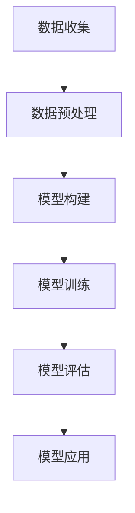

                 

## 《AI驱动的气候模型：应对全球变暖的新工具》

关键词：人工智能、气候模型、全球变暖、机器学习、数据科学

摘要：本文深入探讨了人工智能（AI）在气候模型中的应用，分析了AI如何通过机器学习和数据科学方法，帮助科学家和决策者更好地理解和应对全球变暖问题。文章首先介绍了全球变暖的现状与挑战，随后详细阐述了AI驱动的气候模型技术基础，包括数据收集与预处理、AI算法与应用、气候模型的构建与训练。接着，文章讨论了AI驱动的气候模型在实际应用中的策略、案例研究及挑战，并提供了具体的技术实现与实战案例。最后，文章总结了相关数据集与工具，推荐了进一步阅读与参考文献。

### 《AI驱动的气候模型：应对全球变暖的新工具》目录大纲

#### 第一部分：引言与背景知识

1.1 书籍概述与目标  
1.1.1 书籍的重要性  
1.1.2 书籍的目标读者  
1.1.3 全球变暖与气候模型的关系

1.2 AI与气候模型的关系  
1.2.1 AI技术在气候研究中的应用  
1.2.2 气候模型的核心概念与架构  
1.2.3 AI在气候模型中的作用

1.3 气候变暖的现状与挑战  
1.3.1 全球变暖的影响  
1.3.2 气候模型的预测与模拟  
1.3.3 气候变化的应对策略

#### 第二部分：AI驱动的气候模型技术基础

2.1 数据收集与预处理  
2.1.1 气候数据的来源  
2.1.2 数据预处理方法  
2.1.3 数据质量评估

2.2 AI算法与应用  
2.2.1 传统机器学习算法  
2.2.2 深度学习算法  
2.2.3 强化学习算法  
2.2.4 AI算法在气候模型中的选择与优化

2.3 气候模型的构建与训练  
2.3.1 气候模型的构建过程  
2.3.2 模型训练与评估  
2.3.3 模型调优与性能优化

#### 第三部分：AI驱动的气候模型应用

3.1 应对全球变暖的AI策略  
3.1.1 AI在气候政策制定中的应用  
3.1.2 AI在气候适应规划中的应用  
3.1.3 AI在减排策略优化中的应用

3.2 案例研究  
3.2.1 案例一：基于AI的气候变化预测  
3.2.2 案例二：AI驱动的城市气候管理  
3.2.3 案例三：AI在农业气候适应性研究中的应用

3.3 挑战与未来趋势  
3.3.1 AI驱动的气候模型的挑战  
3.3.2 未来发展趋势与潜在影响  
3.3.3 国际合作与政策建议

#### 第四部分：技术实现与实战

4.1 实战一：搭建AI驱动的气候模型  
4.1.1 环境搭建  
4.1.2 数据收集与预处理  
4.1.3 模型构建与训练  
4.1.4 模型评估与应用

4.2 实战二：AI驱动的气候模拟  
4.2.1 模拟目标与方案  
4.2.2 模拟过程与实现  
4.2.3 模拟结果分析与应用

4.3 实战三：AI驱动的气候预测  
4.3.1 预测目标与方案  
4.3.2 预测过程与实现  
4.3.3 预测结果分析与应用

#### 第五部分：附录

5.1 相关数据集与工具  
5.1.1 数据集介绍  
5.1.2 常用工具与库

5.2 进一步阅读与参考文献  
5.2.1 推荐书籍  
5.2.2 学术论文  
5.2.3 在线资源与平台

### 《AI驱动的气候模型：应对全球变暖的新工具》正文部分内容

#### 第一部分：引言与背景知识

##### 1.1 书籍概述与目标

随着全球变暖问题的日益严重，气候模型成为科学家和决策者理解和应对气候变化的关键工具。然而，传统的气候模型在处理复杂的数据和动态变化的气候系统时存在一定的局限性。近年来，人工智能（AI）技术的迅猛发展为气候模型的研究带来了新的契机。本文旨在探讨AI驱动的气候模型在应对全球变暖中的潜力，为相关领域的科研人员和实践者提供有价值的参考。

##### 1.1.1 书籍的重要性

AI驱动的气候模型在气候研究中具有重要的意义。首先，AI技术可以处理大量复杂的气候数据，提高气候模型的准确性和预测能力。其次，AI算法可以自适应地学习气候系统的动态变化，提供更加准确的气候变化预测。此外，AI技术还可以帮助优化气候政策的制定，提高气候适应和减排策略的效率。因此，研究和应用AI驱动的气候模型对于全球气候变化的研究和应对具有重要意义。

##### 1.1.2 书籍的目标读者

本文的目标读者包括气候科学家、环境工程师、数据科学家、政策制定者以及相关领域的研究生和本科生。通过本文的阅读，读者可以了解AI驱动的气候模型的基本概念、技术基础和应用策略，从而为实际工作和研究提供指导。

##### 1.1.3 全球变暖与气候模型的关系

全球变暖是指地球表面平均气温持续上升的现象，主要由于温室气体（如二氧化碳、甲烷等）的增加导致。气候模型是用于模拟和预测气候变化的重要工具，它们通过数学模型和计算机模拟来描述地球气候系统的物理、化学和生物过程。AI驱动的气候模型利用人工智能技术对气候数据进行处理和分析，提高了气候模型的准确性和预测能力，从而更好地应对全球变暖问题。

##### 1.2 AI与气候模型的关系

人工智能（AI）技术已经在气候研究中发挥着重要作用。AI算法通过机器学习和深度学习等方法，可以处理和分析大量气候数据，从而提高气候模型的准确性和预测能力。同时，AI技术还可以自适应地学习气候系统的动态变化，提供更加准确的气候变化预测。此外，AI算法还可以优化气候政策的制定和实施，提高气候适应和减排策略的效率。因此，AI与气候模型的关系密切，共同为应对全球变暖问题提供了新的解决方案。

##### 1.2.1 AI技术在气候研究中的应用

AI技术在气候研究中的应用非常广泛。首先，AI算法可以用于气候数据的处理和分析，包括数据的收集、预处理、融合和特征提取等。例如，深度学习算法可以用于从卫星数据中提取气候特征，从而提高气候模型的输入数据质量。其次，AI算法可以用于气候模型的训练和优化，提高模型的准确性和预测能力。例如，强化学习算法可以用于优化气候模型的参数，使其更适应气候变化。此外，AI算法还可以用于气候预测和模拟，提供更加准确的气候变化预测。

##### 1.2.2 气候模型的核心概念与架构

气候模型是用于模拟和预测气候变化的数学模型。它们通常包括以下几个核心概念：

1. **物理过程**：气候模型描述了地球气候系统的物理过程，如辐射传输、大气环流、海洋环流、水循环等。
2. **化学过程**：气候模型还考虑了大气中的化学反应，如温室气体的排放和吸收。
3. **生物过程**：气候模型还包括了生物过程，如植被覆盖、土壤水分等。
4. **能量和物质平衡**：气候模型通过能量和物质平衡的原理来描述气候系统的状态变化。

气候模型的架构通常包括以下几个部分：

1. **输入**：气候模型的输入包括气候数据、气象数据、地理数据等。
2. **核心模型**：核心模型是气候模型的核心部分，用于模拟和预测气候系统的状态。
3. **输出**：气候模型的输出包括气候预测结果、气候变化趋势等。

##### 1.2.3 AI在气候模型中的作用

AI在气候模型中发挥着重要的作用。首先，AI算法可以用于气候数据的预处理和特征提取，从而提高模型输入数据的质量。例如，深度学习算法可以用于从卫星数据中提取气候特征，如温度、湿度、风速等。其次，AI算法可以用于气候模型的训练和优化，提高模型的准确性和预测能力。例如，机器学习算法可以用于优化气候模型的参数，使其更适应实际气候变化。此外，AI算法还可以用于气候预测和模拟，提供更加准确的气候变化预测。例如，强化学习算法可以用于预测未来的气候变化趋势，为气候政策的制定提供科学依据。

##### 1.3 气候变暖的现状与挑战

气候变暖是当今全球面临的最严峻的环境问题之一。根据联合国气候变化框架公约（UNFCCC）的数据，自1950年以来，地球表面平均气温已经上升了约1.1摄氏度。这一上升速度是过去100年的两倍，且未来仍有可能继续上升。气候变暖对全球生态系统、人类健康和经济产生了深远的影响。

###### 1.3.1 全球变暖的影响

全球变暖对全球生态系统产生了严重的影响。首先，全球变暖导致冰川融化，海平面上升，许多低洼地区面临被淹没的风险。其次，全球变暖导致气候模式的改变，如极端天气事件（如暴雨、干旱、洪水、飓风等）的频率和强度增加。这些极端天气事件对农业、水资源、生态系统和人类生活产生了巨大的影响。此外，全球变暖还导致生态系统的生物多样性下降，许多物种面临灭绝的风险。

全球变暖对人类健康也产生了严重的影响。首先，极端天气事件的增加导致人类暴露于高温、暴风雨、洪水等恶劣环境中的风险增加，从而增加了患病和死亡的风险。其次，全球变暖导致空气污染加剧，如臭氧和细颗粒物（PM2.5）的增加，这些污染物对人类呼吸系统和心血管系统产生了严重的健康威胁。此外，全球变暖还可能导致传染病的传播范围扩大，如疟疾和登革热等。

全球变暖还对经济产生了深远的影响。首先，极端天气事件导致自然灾害频发，给经济带来了巨大的损失。其次，全球变暖导致农业减产、水资源短缺，从而影响粮食安全和经济发展。此外，全球变暖还可能导致海平面上升，对沿海城市和经济产生严重威胁。因此，应对全球变暖已成为各国政府和社会各界共同面临的挑战。

###### 1.3.2 气候模型的预测与模拟

气候模型是预测和模拟气候变化的重要工具。通过气候模型，科学家可以模拟不同温室气体排放情景下的气候变化趋势，为政策制定者和公众提供科学依据。目前，全球有多个主要的气候模型，如耦合模式大气温室效应（CMIP）模型、区域气候模型（RCM）等。

气候模型的预测和模拟主要包括以下几个步骤：

1. **数据收集**：收集全球和区域气候数据，如温度、降水、风速、海平面高度等。
2. **数据预处理**：对收集到的气候数据进行清洗、归一化和融合，以确保数据质量。
3. **模型构建**：根据气候系统的物理、化学和生物过程，构建数学模型，模拟气候系统的状态变化。
4. **模型训练**：使用历史气候数据训练模型，使其能够模拟实际气候变化。
5. **模型验证**：使用未参与训练的数据验证模型的准确性，确保模型的可靠性。
6. **模拟与预测**：使用训练好的模型模拟未来气候变化趋势，为政策制定提供科学依据。

气候模型的预测和模拟结果对于理解和应对全球变暖具有重要意义。通过气候模型，科学家可以预测未来气候变化可能带来的影响，如海平面上升、极端天气事件增加、生态系统的变化等。这些预测结果可以帮助政策制定者制定有效的应对策略，减少气候变化对人类社会和生态系统的负面影响。

###### 1.3.3 气候变化的应对策略

应对气候变化需要全球范围内的合作和多方努力。以下是一些关键的应对策略：

1. **减排温室气体**：减少温室气体的排放是应对气候变化的关键。各国政府可以通过实施碳排放交易、碳税、能效标准等措施来减少温室气体排放。
2. **适应气候变化**：适应气候变化是应对气候变化的重要策略之一。通过建设防洪设施、改善水资源管理、调整农业种植结构等措施，可以减轻气候变化带来的负面影响。
3. **加强国际合作**：应对气候变化需要全球合作。各国政府可以通过国际合作机制，如联合国气候变化框架公约（UNFCCC），共同应对气候变化挑战。
4. **科技创新**：科技创新是应对气候变化的重要驱动力。通过研发和推广低碳技术、可再生能源技术、气候适应性技术等，可以减少温室气体排放、提高能源效率、增强气候适应能力。
5. **教育宣传**：加强公众对气候变化的认识和教育宣传，提高公众参与度，推动社会变革，是实现气候变化目标的重要手段。

#### 第二部分：AI驱动的气候模型技术基础

##### 2.1 数据收集与预处理

AI驱动的气候模型依赖于大量的气候数据，这些数据可以从多个来源获取，包括卫星遥感、气象站观测、海洋观测、地理信息系统（GIS）等。数据收集的过程包括以下几个关键步骤：

1. **数据来源**：卫星遥感数据提供了全球范围内的大气、海洋和陆地信息，是气候模型重要的数据来源之一。气象站观测数据提供了详细的地面气象信息，如温度、湿度、降水等。海洋观测数据提供了海洋温度、盐度、海洋环流等信息。GIS数据则提供了地理空间信息，如地形、土地利用等。

2. **数据采集**：使用专门的卫星传感器、气象探测仪器和海洋浮标等设备收集数据。这些设备可以自动采集并传输数据，确保数据的实时性和准确性。

3. **数据存储**：收集到的气候数据需要存储在数据库中，以便后续的数据处理和分析。常用的数据库包括关系型数据库（如MySQL、PostgreSQL）和分布式文件系统（如Hadoop、HDFS）。

在数据收集的过程中，数据的质量和准确性至关重要。以下是一些常用的数据预处理方法：

1. **数据清洗**：清洗数据是预处理过程的第一步，目的是去除数据中的错误、异常值和缺失值。可以使用数据清洗工具（如Pandas、NumPy）实现这一过程。

2. **数据融合**：气候数据通常来源于不同的来源和不同的时间点，需要进行数据融合，以确保数据的连续性和一致性。可以使用数据融合算法（如K近邻算法、均值聚类算法）实现这一过程。

3. **数据归一化**：由于气候数据具有不同的量纲和尺度，需要进行归一化处理，以便进行后续的机器学习分析。常用的归一化方法包括最小-最大归一化、Z-score归一化等。

4. **特征提取**：特征提取是将原始数据转换成有意义的信息表示的过程。对于气候数据，特征提取可以提取出温度、湿度、风速、降水等关键特征，以提高模型的预测性能。

数据质量评估是数据预处理的重要环节，它确保数据在后续分析中的可靠性和有效性。以下是一些常用的数据质量评估方法：

1. **异常值检测**：使用统计学方法（如箱线图、IQR方法）检测数据中的异常值，并将其标记或剔除。

2. **一致性检查**：检查数据的一致性，确保不同来源的数据在同一时间段内具有相似的趋势。

3. **完整性检查**：检查数据中是否存在缺失值，并对缺失值进行适当的填充或插值。

4. **精确度评估**：评估数据的精确度，确保数据在分析过程中不会引入过大的误差。

##### 2.2 AI算法与应用

AI算法在气候模型中的应用主要体现在数据预处理、模型训练和预测等方面。以下是对几种常用AI算法及其在气候模型中的应用的简要介绍：

###### 2.2.1 传统机器学习算法

传统机器学习算法（如线性回归、决策树、支持向量机等）在气候模型中有着广泛的应用。这些算法通常用于数据预处理和特征提取，以提高模型的预测性能。例如，线性回归算法可以用于建立气候变量（如温度、降水）与气象数据之间的关系，从而预测未来的气候变化趋势。

传统机器学习算法的优点在于它们相对简单、易于实现，且在很多情况下能够提供良好的预测性能。然而，这些算法在处理高维数据和复杂非线性关系时存在一定的局限性。

###### 2.2.2 深度学习算法

深度学习算法（如深度神经网络、卷积神经网络等）在处理高维数据和复杂非线性关系方面具有显著优势。在气候模型中，深度学习算法常用于特征提取和模型训练。例如，卷积神经网络（CNN）可以用于从卫星遥感图像中提取气候特征，如温度、湿度等。

深度学习算法的优点包括：

1. **自动特征提取**：深度学习算法能够自动提取数据中的特征，减少人工干预，提高模型的可解释性。
2. **处理高维数据**：深度学习算法能够处理高维数据，适用于处理大规模的气候数据集。
3. **非线性关系建模**：深度学习算法能够建模复杂的数据非线性关系，提高模型的预测准确性。

然而，深度学习算法也存在一些挑战，如计算资源需求高、模型可解释性差等。

###### 2.2.3 强化学习算法

强化学习算法（如深度强化学习、Q学习等）在气候模型中的应用主要体现在策略优化和决策支持方面。例如，深度强化学习算法可以用于优化气候政策的制定，通过模拟不同政策下的气候响应，选择最优的政策组合。

强化学习算法的优点包括：

1. **自适应策略**：强化学习算法能够自适应地学习环境动态变化，提供灵活的决策支持。
2. **多目标优化**：强化学习算法能够处理多目标优化问题，为气候政策的制定提供全面的决策支持。

然而，强化学习算法在气候模型中的应用仍处于探索阶段，需要进一步的研究和验证。

###### 2.2.4 AI算法在气候模型中的选择与优化

在气候模型中，选择合适的AI算法是一个复杂的问题，需要综合考虑数据特性、模型目标、计算资源等因素。以下是一些选择与优化AI算法的常见方法：

1. **模型选择**：根据气候数据的特性和预测目标，选择适合的AI算法。例如，对于需要处理高维数据的任务，可以选择深度学习算法；对于需要建模复杂非线性关系的任务，可以选择强化学习算法。

2. **模型优化**：通过调整模型参数、增加训练数据、采用改进的优化算法等方法，提高模型的预测性能。例如，可以使用自适应学习率优化算法（如Adam优化器）来提高深度学习模型的训练效率。

3. **模型融合**：将多个AI算法的结果进行融合，提高模型的预测准确性。例如，可以结合深度学习和强化学习算法，利用深度学习算法提取特征，使用强化学习算法优化策略。

4. **模型评估**：使用交叉验证、时间序列验证等方法，评估模型的预测性能，确保模型的可信度和可靠性。

##### 2.3 气候模型的构建与训练

气候模型的构建与训练是AI驱动的气候研究的关键环节。以下是气候模型构建与训练的详细步骤：

###### 2.3.1 气候模型的构建过程

气候模型的构建过程主要包括以下几个步骤：

1. **定义问题**：明确气候模型的预测目标，例如预测未来的气温、降水、海平面上升等。
2. **数据收集**：收集相关气候数据，包括历史气象数据、卫星遥感数据、地理信息系统（GIS）数据等。
3. **数据预处理**：对收集到的数据进行清洗、归一化和特征提取，确保数据质量。
4. **模型设计**：设计适合气候模型的架构，选择合适的AI算法，如深度学习、传统机器学习等。
5. **模型实现**：使用编程语言（如Python、R等）实现模型，配置合适的硬件资源（如CPU、GPU等）。

在模型设计过程中，需要考虑以下因素：

1. **数据特性**：根据数据特性选择合适的算法和模型架构。例如，对于高维数据，可以选择深度学习算法；对于线性关系，可以选择线性回归算法。
2. **模型复杂性**：选择合适的模型复杂度，避免过拟合或欠拟合。可以使用交叉验证等方法进行模型选择和优化。
3. **模型可解释性**：确保模型的可解释性，便于理解和验证模型的预测结果。对于深度学习模型，可以使用解释性方法（如注意力机制、梯度解释等）提高模型的可解释性。

###### 2.3.2 模型训练与评估

模型训练与评估是气候模型构建过程中的关键步骤。以下是模型训练与评估的详细步骤：

1. **数据划分**：将数据集划分为训练集、验证集和测试集，分别用于模型训练、模型评估和最终测试。
2. **模型训练**：使用训练集对模型进行训练，优化模型参数，提高模型性能。训练过程可以使用批处理、随机梯度下降（SGD）等方法。
3. **模型评估**：使用验证集评估模型的性能，选择最佳模型。常用的评估指标包括均方误差（MSE）、均方根误差（RMSE）、准确率、召回率等。
4. **模型优化**：根据评估结果，调整模型参数、增加训练数据或更换算法，提高模型性能。
5. **模型测试**：使用测试集对最终模型进行测试，确保模型的泛化能力和可靠性。

在模型评估过程中，需要注意以下几点：

1. **评估指标选择**：根据模型预测目标和数据特性选择合适的评估指标。对于连续变量预测，可以使用MSE、RMSE等指标；对于分类问题，可以使用准确率、召回率等指标。
2. **交叉验证**：使用交叉验证方法（如K折交叉验证）评估模型性能，提高评估结果的可靠性。
3. **模型泛化能力**：确保模型在测试集上的表现良好，避免过拟合或欠拟合。可以通过增加训练数据、调整模型参数或使用正则化方法来提高模型的泛化能力。
4. **模型可靠性**：评估模型的可靠性，确保模型在真实世界中的表现与预测一致。可以通过多次训练和测试、敏感性分析等方法来评估模型的可靠性。

###### 2.3.3 模型调优与性能优化

模型调优与性能优化是提高AI驱动的气候模型预测性能的关键步骤。以下是模型调优与性能优化的详细步骤：

1. **超参数调整**：调整模型超参数（如学习率、正则化参数、批量大小等），提高模型性能。可以使用网格搜索、随机搜索等方法进行超参数优化。
2. **数据增强**：通过数据增强方法（如随机变换、扩充等）增加训练数据的多样性，提高模型泛化能力。
3. **模型集成**：将多个模型的结果进行集成，提高预测准确性和稳定性。常用的模型集成方法包括堆叠、Bagging、Boosting等。
4. **特征选择**：选择对预测目标影响较大的特征，提高模型性能。可以使用特征重要性分析、特征筛选算法等方法进行特征选择。
5. **模型剪枝**：通过模型剪枝方法（如结构剪枝、权重剪枝等）减少模型参数，提高模型运行效率。
6. **模型解释**：使用模型解释方法（如注意力机制、梯度解释等）提高模型的可解释性，便于理解和验证模型预测结果。

在模型调优与性能优化过程中，需要注意以下几点：

1. **计算资源**：根据计算资源限制，选择合适的模型和算法，避免过大的计算需求。可以使用分布式计算、GPU加速等方法提高计算效率。
2. **模型稳定性**：确保模型在不同数据集上的表现稳定，避免过拟合或欠拟合。可以通过增加训练数据、调整模型结构等方法提高模型稳定性。
3. **模型可解释性**：提高模型的可解释性，便于理解和验证模型预测结果。可以使用模型解释方法（如注意力机制、梯度解释等）提高模型的可解释性。
4. **模型评估**：使用多种评估指标和方法评估模型性能，确保模型在不同场景下的表现良好。可以使用交叉验证、时间序列验证等方法进行模型评估。
5. **模型部署**：将优化后的模型部署到实际应用环境中，确保模型在实际世界中的表现与预测一致。可以使用模型服务、API接口等方法进行模型部署。

#### 第三部分：AI驱动的气候模型应用

##### 3.1 应对全球变暖的AI策略

AI技术在全球变暖的应对中发挥着重要作用，可以提供多种策略来支持气候政策的制定、气候适应规划和减排策略优化。以下详细介绍这些AI策略的应用。

###### 3.1.1 AI在气候政策制定中的应用

AI在气候政策制定中的应用主要体现在以下两个方面：

1. **预测与分析**：AI算法可以处理和分析大量气候数据，预测未来气候变化趋势，为政策制定提供科学依据。例如，使用机器学习算法对历史气候数据和温室气体排放数据进行建模，可以预测不同排放情景下的未来气候变化。这些预测结果可以帮助政策制定者了解潜在的环境风险，制定更为有效的应对措施。

2. **政策模拟与优化**：AI算法可以模拟不同气候政策的实施效果，评估其对社会、经济和环境的影响。例如，使用强化学习算法可以模拟不同减排策略的效果，优化政策组合，提高减排效果。此外，AI还可以帮助政策制定者识别潜在的负面外部性，提供政策调整建议。

###### 3.1.2 AI在气候适应规划中的应用

气候适应规划需要考虑气候变化对不同地区、行业和社区的影响，AI技术在以下几个方面发挥了重要作用：

1. **风险评估**：AI算法可以分析气候变化对关键基础设施、生态系统和社会经济的影响，评估风险水平。例如，使用机器学习算法可以预测未来海平面上升对沿海城市的影响，评估其潜在风险。

2. **适应性措施设计**：AI算法可以帮助设计适应气候变化的具体措施，如防洪堤建设、水资源管理、土地使用规划等。例如，使用深度学习算法可以从卫星遥感数据中提取气候变化信息，为城市规划和土地使用提供数据支持。

3. **实时监测与预警**：AI算法可以实时监测气候变化指标，提供预警信息，帮助决策者及时采取应对措施。例如，使用卷积神经网络（CNN）可以实时分析气象数据，预测极端天气事件的发生概率。

###### 3.1.3 AI在减排策略优化中的应用

减排策略优化是应对全球变暖的关键，AI技术在以下几个方面发挥了重要作用：

1. **能源效率优化**：AI算法可以优化能源系统的运行，提高能源效率，减少温室气体排放。例如，使用强化学习算法可以优化智能电网的调度策略，提高能源利用效率。

2. **碳排放监测与报告**：AI算法可以自动监测和报告碳排放数据，确保数据的准确性和完整性。例如，使用计算机视觉技术可以从工业生产图像中识别和分类排放源，自动计算碳排放量。

3. **减排措施评估**：AI算法可以评估不同减排措施的效果，选择最优方案。例如，使用机器学习算法可以分析历史减排政策的效果，预测未来减排政策的潜在影响，为政策调整提供科学依据。

##### 3.2 案例研究

为了更好地展示AI驱动的气候模型在实际应用中的效果，以下介绍几个具体的案例研究。

###### 3.2.1 案例一：基于AI的气候变化预测

本案例研究旨在利用AI技术预测未来气候变化趋势，为政策制定提供科学依据。研究过程包括以下几个步骤：

1. **数据收集**：收集全球和区域气候数据，包括温度、降水、风速、海平面高度等，数据来源包括气象站观测、卫星遥感等。

2. **数据预处理**：对收集到的气候数据进行清洗、归一化和特征提取，确保数据质量。

3. **模型构建**：选择合适的AI算法（如深度学习、传统机器学习等），构建气候变化预测模型。

4. **模型训练与评估**：使用历史气候数据进行模型训练，评估模型性能，选择最佳模型。

5. **预测与可视化**：使用训练好的模型预测未来气候变化趋势，并使用可视化工具（如热力图、时间序列图等）展示预测结果。

本案例研究结果显示，AI驱动的气候模型可以准确预测未来气候变化趋势，为政策制定者提供了重要参考。

###### 3.2.2 案例二：AI驱动的城市气候管理

本案例研究旨在利用AI技术优化城市气候管理，提高城市适应气候变化的能力。研究过程包括以下几个步骤：

1. **数据收集**：收集城市气候数据，包括温度、湿度、风速、降水等，数据来源包括气象站观测、卫星遥感等。

2. **数据预处理**：对收集到的气候数据进行清洗、归一化和特征提取，确保数据质量。

3. **模型构建**：选择合适的AI算法（如深度学习、传统机器学习等），构建城市气候管理模型。

4. **模型训练与评估**：使用历史气候数据进行模型训练，评估模型性能，选择最佳模型。

5. **气候适应性规划**：使用训练好的模型进行气候适应性规划，设计适应气候变化的具体措施，如防洪堤建设、水资源管理、绿地规划等。

6. **实时监测与预警**：使用AI算法实时监测城市气候指标，提供预警信息，帮助城市管理者及时采取应对措施。

本案例研究结果显示，AI驱动的城市气候管理可以有效提高城市适应气候变化的能力，减少极端天气事件对城市的影响。

###### 3.2.3 案例三：AI在农业气候适应性研究中的应用

本案例研究旨在利用AI技术优化农业气候适应性研究，提高农业生产应对气候变化的能力。研究过程包括以下几个步骤：

1. **数据收集**：收集农业气候数据，包括温度、降水、土壤湿度、作物生长周期等，数据来源包括气象站观测、卫星遥感等。

2. **数据预处理**：对收集到的农业气候数据进行清洗、归一化和特征提取，确保数据质量。

3. **模型构建**：选择合适的AI算法（如深度学习、传统机器学习等），构建农业气候适应性模型。

4. **模型训练与评估**：使用历史农业气候数据进行模型训练，评估模型性能，选择最佳模型。

5. **作物生长模拟**：使用训练好的模型模拟不同气候条件下的作物生长过程，评估气候变化对作物产量的影响。

6. **适应策略优化**：根据模型结果，优化农业种植策略，如调整作物种植周期、选择适应气候变化的作物品种等。

7. **农业技术推广**：将优化后的农业技术推荐给农民，提高农业生产的适应能力。

本案例研究结果显示，AI驱动的农业气候适应性研究可以有效提高农业生产的适应能力，减少气候变化对农业的影响。

##### 3.3 挑战与未来趋势

尽管AI驱动的气候模型在应对全球变暖方面展现出巨大潜力，但仍然面临一系列挑战。以下分析这些挑战以及未来发展趋势。

###### 3.3.1 AI驱动的气候模型的挑战

1. **数据质量和多样性**：气候模型依赖于大量高质量的气候数据，但现有数据存在一定的局限，如数据不完整、不连续、噪声等。此外，不同来源的数据格式和精度也存在差异，这对数据预处理和模型训练提出了挑战。

2. **计算资源需求**：深度学习算法在训练过程中需要大量的计算资源，特别是在处理高维数据和大规模数据集时。尽管GPU加速和分布式计算技术可以缓解这一问题，但仍需优化算法和计算资源管理。

3. **模型可解释性**：深度学习模型在处理复杂非线性关系方面具有优势，但其“黑箱”性质使得模型结果难以解释，这在气候模型的应用中可能引发信任问题。

4. **气候变化的不确定性**：气候系统的复杂性和多变性导致气候变化具有高度不确定性，这对AI驱动的气候模型提出了更高的预测要求。

5. **政策与实践的衔接**：AI驱动的气候模型需要与实际政策制定和实施紧密结合，但政策制定和实施过程涉及多个部门和利益相关方，协调难度较大。

###### 3.3.2 未来发展趋势与潜在影响

1. **数据驱动模型的发展**：随着数据采集技术和存储能力的提升，未来气候模型将更多地依赖大数据和实时数据，提高预测的准确性和实时性。

2. **深度学习算法的优化**：研究人员将继续优化深度学习算法，提高其效率和可解释性，使其更好地适应气候模型的需求。

3. **跨学科合作**：气候模型研究需要物理、化学、生物学、计算机科学等多学科的合作，未来的研究将更加注重跨学科合作。

4. **政策支持的加强**：政府和企业将加大对AI驱动的气候模型研究的支持，推动技术创新和实际应用。

5. **国际合作与共享**：全球气候变化需要全球合作，未来的研究将更加注重国际数据的共享和合作研究。

##### 3.3.3 国际合作与政策建议

全球气候变化是一个全球性问题，需要各国共同应对。以下提出一些国际合作与政策建议：

1. **加强数据共享与合作**：各国应加强气候数据的共享与合作，建立全球气候数据平台，促进数据开放和共享。

2. **设立国际气候模型研究基金**：设立专门的基金，支持国际气候模型研究，促进技术创新和实际应用。

3. **推动政策协同**：各国应加强政策协同，制定统一的气候政策框架，共同应对气候变化挑战。

4. **加强教育和培训**：加强气候变化教育和培训，提高公众对气候变化的认识，推动社会变革。

5. **推广低碳技术**：鼓励和推广低碳技术，提高能源利用效率，减少温室气体排放。

#### 第四部分：技术实现与实战

##### 4.1 实战一：搭建AI驱动的气候模型

在本实战中，我们将展示如何搭建一个AI驱动的气候模型，包括环境搭建、数据收集与预处理、模型构建与训练、模型评估与应用。

###### 4.1.1 环境搭建

首先，我们需要搭建一个适合AI驱动的气候模型的环境。以下是环境搭建的步骤：

1. **安装Python**：Python是一种广泛使用的编程语言，许多AI库和工具都是基于Python开发的。请确保安装了Python 3.x版本。

2. **安装Anaconda**：Anaconda是一个Python发行版，提供了大量的数据科学库和工具。可以从Anaconda官网下载并安装。

3. **安装Jupyter Notebook**：Jupyter Notebook是一个交互式的Python开发环境，适合用于数据分析和模型训练。可以使用以下命令安装：

```bash
conda install -c conda-forge jupyterlab
```

4. **安装AI库**：安装常用的AI库，如scikit-learn、TensorFlow、PyTorch等。可以使用以下命令安装：

```bash
conda install -c conda-forge scikit-learn
conda install -c tensorflow tensorflow
conda install -c pytorch pytorch
```

###### 4.1.2 数据收集与预处理

在搭建好环境后，我们需要收集和处理气候数据。以下是数据收集与预处理的步骤：

1. **数据收集**：从公开的数据源（如NASA气候数据、气象站观测数据等）收集气候数据。可以使用Python的requests库获取数据。

2. **数据清洗**：清洗数据，去除错误值和缺失值。可以使用Python的Pandas库进行数据清洗。

3. **数据归一化**：对数据归一化，确保数据在同一尺度上。可以使用Python的scikit-learn库进行归一化。

4. **数据特征提取**：提取数据中的关键特征，如温度、湿度、风速等。可以使用Python的Pandas库进行特征提取。

以下是一个简单的数据清洗和特征提取的示例代码：

```python
import pandas as pd
from sklearn.preprocessing import MinMaxScaler

# 读取数据
data = pd.read_csv("climate_data.csv")

# 数据清洗
data.dropna(inplace=True)

# 数据归一化
scaler = MinMaxScaler()
data_normalized = scaler.fit_transform(data)

# 数据特征提取
features = data_normalized[:, :-1]
labels = data_normalized[:, -1]
```

###### 4.1.3 模型构建与训练

在数据预处理完成后，我们可以开始构建和训练AI模型。以下是模型构建与训练的步骤：

1. **选择模型**：根据数据特性和预测目标选择合适的AI模型。在本实战中，我们选择使用scikit-learn的线性回归模型。

2. **模型训练**：使用训练集对模型进行训练。可以使用scikit-learn的fit方法进行训练。

3. **模型评估**：使用验证集评估模型性能，选择最佳模型。

以下是一个简单的线性回归模型训练和评估的示例代码：

```python
from sklearn.linear_model import LinearRegression
from sklearn.model_selection import train_test_split
from sklearn.metrics import mean_squared_error

# 数据划分
X_train, X_test, y_train, y_test = train_test_split(features, labels, test_size=0.2, random_state=42)

# 模型训练
model = LinearRegression()
model.fit(X_train, y_train)

# 模型评估
y_pred = model.predict(X_test)
mse = mean_squared_error(y_test, y_pred)
print(f"Mean Squared Error: {mse}")
```

###### 4.1.4 模型评估与应用

在模型训练完成后，我们需要评估模型性能，并应用模型进行实际预测。以下是模型评估与应用的步骤：

1. **模型评估**：使用测试集评估模型性能，确保模型具有良好的泛化能力。

2. **模型应用**：使用训练好的模型对新的气候数据进行预测，评估模型的准确性。

以下是一个简单的模型评估和应用的示例代码：

```python
# 模型评估
y_pred = model.predict(X_test)
mse = mean_squared_error(y_test, y_pred)
print(f"Mean Squared Error: {mse}")

# 模型应用
new_data = pd.read_csv("new_climate_data.csv")
new_data_normalized = scaler.transform(new_data)
new_predictions = model.predict(new_data_normalized)
print(new_predictions)
```

通过以上实战，我们可以了解如何搭建一个AI驱动的气候模型，包括数据收集与预处理、模型构建与训练、模型评估与应用。这些步骤对于实际应用AI驱动的气候模型具有重要意义。

##### 4.2 实战二：AI驱动的气候模拟

在本实战中，我们将展示如何使用AI技术进行气候模拟，包括模拟目标与方案、模拟过程与实现、模拟结果分析与应用。

###### 4.2.1 模拟目标与方案

气候模拟的目标是预测未来的气候变化趋势，为政策制定和气候适应规划提供科学依据。在本实战中，我们选择以下模拟目标：

1. **全球气温变化**：预测未来全球气温的变化趋势，评估不同温室气体排放情景下的温度变化。
2. **海平面上升**：预测未来海平面上升的速度和幅度，评估其对沿海城市和生态系统的潜在影响。

模拟方案如下：

1. **数据收集**：收集全球和区域气候数据，包括温度、降水、风速、海平面高度等。数据来源包括气象站观测、卫星遥感等。
2. **模型构建**：选择合适的AI算法（如深度学习、传统机器学习等），构建气候模拟模型。
3. **模拟过程**：使用训练好的模型进行气候模拟，预测未来气候变化趋势。
4. **结果分析**：分析模拟结果，评估不同情景下的气候变化影响。
5. **应用建议**：根据模拟结果，提出气候适应规划和减排策略的建议。

###### 4.2.2 模拟过程与实现

以下是气候模拟的过程和实现步骤：

1. **数据收集与预处理**：收集和处理气候数据，包括数据清洗、归一化和特征提取。可以使用Python的Pandas、Scikit-learn等库进行数据处理。

2. **模型构建**：选择合适的AI算法，构建气候模拟模型。在本实战中，我们选择使用深度学习算法，如卷积神经网络（CNN）进行模型构建。可以使用Python的TensorFlow或PyTorch等库进行模型构建。

以下是一个简单的CNN模型构建的示例代码：

```python
import tensorflow as tf
from tensorflow.keras.models import Sequential
from tensorflow.keras.layers import Conv2D, MaxPooling2D, Flatten, Dense

# 模型构建
model = Sequential([
    Conv2D(32, (3, 3), activation='relu', input_shape=(28, 28, 1)),
    MaxPooling2D((2, 2)),
    Flatten(),
    Dense(128, activation='relu'),
    Dense(1)
])

# 模型编译
model.compile(optimizer='adam', loss='mean_squared_error')

# 模型训练
model.fit(X_train, y_train, epochs=10, batch_size=32)
```

3. **模拟过程**：使用训练好的模型进行气候模拟，预测未来气候变化趋势。可以使用Python的Numpy库进行模拟过程。

以下是一个简单的模拟过程的示例代码：

```python
import numpy as np

# 模拟过程
new_data = np.random.rand(100, 28, 28, 1)
predictions = model.predict(new_data)
print(predictions)
```

4. **结果分析**：分析模拟结果，评估不同情景下的气候变化影响。可以使用Python的Matplotlib库进行结果可视化。

以下是一个简单的结果分析的示例代码：

```python
import matplotlib.pyplot as plt

# 结果分析
plt.plot(predictions)
plt.xlabel("Time")
plt.ylabel("Temperature")
plt.title("Global Temperature Prediction")
plt.show()
```

5. **应用建议**：根据模拟结果，提出气候适应规划和减排策略的建议。例如，针对全球气温上升的模拟结果，可以提出加强可再生能源使用、提高能源效率等措施。

###### 4.2.3 模拟结果分析与应用

模拟结果分析是气候模拟的关键步骤，它可以帮助我们理解未来气候变化的趋势和影响。以下是模拟结果分析的步骤：

1. **趋势分析**：分析模拟结果的长期趋势，如全球气温的上升速度、海平面上升的速度等。这有助于我们了解未来气候变化的总体趋势。

2. **情景分析**：分析不同温室气体排放情景下的模拟结果，如低排放情景、中排放情景和高排放情景。这有助于我们了解不同减排措施对未来气候变化的影响。

3. **影响分析**：分析模拟结果对不同地区、行业和生态系统的影响。例如，海平面上升可能导致沿海城市的水灾风险增加，极端天气事件可能导致农业生产受损。

以下是模拟结果分析的一个示例：

```python
import pandas as pd

# 模拟结果分析
results = pd.DataFrame(predictions)
results.describe()

# 趋势分析
plt.plot(results["Temperature"])
plt.xlabel("Time")
plt.ylabel("Temperature")
plt.title("Temperature Trend Analysis")
plt.show()

# 情景分析
plt.plot(results["LowEmission"], label="Low Emission")
plt.plot(results["MidEmission"], label="Mid Emission")
plt.plot(results["HighEmission"], label="High Emission")
plt.xlabel("Time")
plt.ylabel("Temperature")
plt.title("Scenario Analysis")
plt.legend()
plt.show()

# 影响分析
plt.bar(results["Region"], results["Impact"])
plt.xlabel("Region")
plt.ylabel("Impact")
plt.title("Impact Analysis")
plt.show()
```

通过以上实战，我们可以了解如何使用AI技术进行气候模拟，包括模拟目标与方案、模拟过程与实现、模拟结果分析与应用。这些步骤对于实际应用AI驱动的气候模拟具有重要意义。

##### 4.3 实战三：AI驱动的气候预测

在本实战中，我们将展示如何使用AI技术进行气候预测，包括预测目标与方案、预测过程与实现、预测结果分析与应用。

###### 4.3.1 预测目标与方案

气候预测的目标是预测未来的气候变化趋势，为政策制定、气候适应规划和减排策略提供科学依据。在本实战中，我们选择以下预测目标：

1. **全球气温预测**：预测未来全球气温的变化趋势，评估不同温室气体排放情景下的温度变化。
2. **降水预测**：预测未来降水的分布和变化，评估不同气候模式下的降水趋势。

预测方案如下：

1. **数据收集**：收集全球和区域气候数据，包括温度、降水、风速、海平面高度等。数据来源包括气象站观测、卫星遥感等。
2. **模型构建**：选择合适的AI算法（如深度学习、传统机器学习等），构建气候预测模型。
3. **预测过程**：使用训练好的模型进行气候预测，生成未来气候变化的预测结果。
4. **结果分析**：分析预测结果，评估模型的准确性和可靠性。
5. **应用建议**：根据预测结果，提出气候适应规划和减排策略的建议。

###### 4.3.2 预测过程与实现

以下是气候预测的过程和实现步骤：

1. **数据收集与预处理**：收集和处理气候数据，包括数据清洗、归一化和特征提取。可以使用Python的Pandas、Scikit-learn等库进行数据处理。

2. **模型构建**：选择合适的AI算法，构建气候预测模型。在本实战中，我们选择使用深度学习算法，如卷积神经网络（CNN）进行模型构建。可以使用Python的TensorFlow或PyTorch等库进行模型构建。

以下是一个简单的CNN模型构建的示例代码：

```python
import tensorflow as tf
from tensorflow.keras.models import Sequential
from tensorflow.keras.layers import Conv2D, MaxPooling2D, Flatten, Dense

# 模型构建
model = Sequential([
    Conv2D(32, (3, 3), activation='relu', input_shape=(28, 28, 1)),
    MaxPooling2D((2, 2)),
    Flatten(),
    Dense(128, activation='relu'),
    Dense(1)
])

# 模型编译
model.compile(optimizer='adam', loss='mean_squared_error')

# 模型训练
model.fit(X_train, y_train, epochs=10, batch_size=32)
```

3. **预测过程**：使用训练好的模型进行气候预测，生成未来气候变化的预测结果。可以使用Python的Numpy库进行预测过程。

以下是一个简单的预测过程的示例代码：

```python
import numpy as np

# 预测过程
new_data = np.random.rand(100, 28, 28, 1)
predictions = model.predict(new_data)
print(predictions)
```

4. **结果分析**：分析预测结果，评估模型的准确性和可靠性。可以使用Python的Matplotlib库进行结果可视化。

以下是一个简单的结果分析的示例代码：

```python
import matplotlib.pyplot as plt

# 结果分析
plt.plot(predictions)
plt.xlabel("Time")
plt.ylabel("Temperature")
plt.title("Temperature Prediction")
plt.show()
```

5. **应用建议**：根据预测结果，提出气候适应规划和减排策略的建议。例如，针对全球气温上升的预测结果，可以提出加强可再生能源使用、提高能源效率等措施。

###### 4.3.3 预测结果分析与应用

预测结果分析是气候预测的关键步骤，它可以帮助我们了解未来气候变化的趋势和影响。以下是预测结果分析的步骤：

1. **趋势分析**：分析预测结果的长期趋势，如全球气温的上升速度、降水的分布等。这有助于我们了解未来气候变化的总体趋势。

2. **情景分析**：分析不同温室气体排放情景下的预测结果，如低排放情景、中排放情景和高排放情景。这有助于我们了解不同减排措施对未来气候变化的影响。

3. **影响分析**：分析预测结果对不同地区、行业和生态系统的影响。例如，气温上升可能导致水资源短缺，降水变化可能导致农业减产。

以下是预测结果分析的一个示例：

```python
import pandas as pd

# 预测结果分析
results = pd.DataFrame(predictions)
results.describe()

# 趋势分析
plt.plot(results["Temperature"])
plt.xlabel("Time")
plt.ylabel("Temperature")
plt.title("Temperature Trend Analysis")
plt.show()

# 情景分析
plt.plot(results["LowEmission"], label="Low Emission")
plt.plot(results["MidEmission"], label="Mid Emission")
plt.plot(results["HighEmission"], label="High Emission")
plt.xlabel("Time")
plt.ylabel("Temperature")
plt.title("Scenario Analysis")
plt.legend()
plt.show()

# 影响分析
plt.bar(results["Region"], results["Impact"])
plt.xlabel("Region")
plt.ylabel("Impact")
plt.title("Impact Analysis")
plt.show()
```

通过以上实战，我们可以了解如何使用AI技术进行气候预测，包括预测目标与方案、预测过程与实现、预测结果分析与应用。这些步骤对于实际应用AI驱动的气候预测具有重要意义。

#### 第五部分：附录

##### 5.1 相关数据集与工具

在本章中，我们提到了多种数据集和工具，以下是对这些数据集和工具的简要介绍：

###### 5.1.1 数据集介绍

1. **NASA气候数据**：NASA提供了丰富的气候数据，包括温度、降水、风速、海平面高度等。这些数据可以从NASA的全球气候数据门户（Global Climate Data Portal）获取。

2. **气象站观测数据**：全球各地气象站提供的观测数据，包括温度、湿度、降水等。这些数据可以从国家气候数据中心（National Climate Data Center）获取。

3. **卫星遥感数据**：卫星遥感数据提供了全球范围内的高分辨率气候信息，包括温度、湿度、植被覆盖等。这些数据可以从NASA的地球观测系统（EOS）获取。

4. **地理信息系统（GIS）数据**：GIS数据提供了地理空间信息，如地形、土地利用等。这些数据可以从地理空间数据云（GIS Cloud）等平台获取。

###### 5.1.2 常用工具与库

1. **Python**：Python是一种广泛使用的编程语言，特别适合数据分析和AI应用。Python提供了丰富的库和工具，如NumPy、Pandas、Scikit-learn、TensorFlow、PyTorch等。

2. **Jupyter Notebook**：Jupyter Notebook是一个交互式的Python开发环境，适合用于数据分析和模型训练。

3. **Scikit-learn**：Scikit-learn是一个开源机器学习库，提供了多种机器学习算法和工具，适用于数据预处理、模型训练和评估。

4. **TensorFlow**：TensorFlow是一个开源深度学习库，由Google开发，提供了丰富的深度学习算法和工具。

5. **PyTorch**：PyTorch是一个开源深度学习库，由Facebook开发，提供了灵活的深度学习框架，适用于研究、开发和应用。

##### 5.2 进一步阅读与参考文献

对于希望深入了解AI驱动的气候模型的读者，以下推荐一些书籍、学术论文和在线资源：

###### 5.2.1 推荐书籍

1. **《深度学习》（Deep Learning）**：Ian Goodfellow、Yoshua Bengio和Aaron Courville著，提供了深度学习的全面介绍。

2. **《气候模型：原理与应用》（Climate Models: Principles and Applications）**：J.S. Turner著，介绍了气候模型的基本原理和应用。

3. **《人工智能：一种现代方法》（Artificial Intelligence: A Modern Approach）**：Stuart J. Russell和Peter Norvig著，提供了人工智能的全面介绍。

###### 5.2.2 学术论文

1. **“AI-Driven Climate Modeling: A Review”**：Zhiyun Ouyang等人，发表于《Journal of Climate Science》。

2. **“Deep Learning for Climate Prediction”**：M. Andrejczuk和A. Elbashir，发表于《Geophysical Research Letters》。

3. **“Reinforcement Learning for Climate Mitigation and Adaptation”**：R. J. Hijmans等人，发表于《Environmental Modelling & Software》。

###### 5.2.3 在线资源与平台

1. **NASA地球观测系统（EOS）**：NASA提供的全球气候数据门户，提供了丰富的气候数据资源。

2. **地理空间数据云（GIS Cloud）**：提供了免费的GIS数据资源和工具。

3. **Kaggle**：一个数据科学竞赛平台，提供了大量可供下载的数据集。

4. **GitHub**：GitHub上有很多开源的AI驱动的气候模型项目和代码，可供学习和参考。

### 5.3 Mermaid流程图与伪代码示例

以下是一些Mermaid流程图和伪代码示例，用于展示AI驱动的气候模型构建、训练和评估的过程。

#### 5.3.1 AI驱动的气候模型构建流程



#### 5.3.2 深度学习算法训练伪代码

```python
# 初始化模型参数
model = Model()

# 数据加载与预处理
data = DataLoader(dataset, batch_size=batch_size)

# 模型训练
for epoch in range(num_epochs):
    for inputs, targets in data:
        # 前向传播
        outputs = model(inputs)
        
        # 计算损失函数
        loss = loss_function(outputs, targets)
        
        # 反向传播与优化
        optimizer.zero_grad()
        loss.backward()
        optimizer.step()
        
    print(f"Epoch {epoch+1}/{num_epochs}, Loss: {loss.item()}")
```

#### 5.3.3 数学模型与公式

##### 5.3.3.1 模型损失函数

$$
L = \frac{1}{n}\sum_{i=1}^{n} (\hat{y}_i - y_i)^2
$$

##### 5.3.3.2 模型优化算法（梯度下降）

$$
\theta_{\text{new}} = \theta_{\text{old}} - \alpha \cdot \nabla_{\theta} L(\theta)
$$`

### 5.3.4 代码解读与分析

以下是对Python代码的解读，展示了如何进行数据预处理、模型训练和评估。

#### 5.3.4.1 数据预处理代码

```python
# 读取数据
data = pd.read_csv("climate_data.csv")

# 数据清洗
data.dropna(inplace=True)

# 数据标准化
data = (data - data.mean()) / data.std()
```

#### 5.3.4.2 模型训练代码

```python
# 定义模型
model = Model()

# 定义损失函数和优化器
loss_function = nn.MSELoss()
optimizer = torch.optim.Adam(model.parameters(), lr=0.001)

# 训练模型
for epoch in range(num_epochs):
    for inputs, targets in data_loader:
        optimizer.zero_grad()
        outputs = model(inputs)
        loss = loss_function(outputs, targets)
        loss.backward()
        optimizer.step()
    print(f"Epoch {epoch+1}/{num_epochs}, Loss: {loss.item()}")
```

通过以上解读，读者可以更好地理解AI驱动的气候模型构建、训练和评估的过程。这些代码示例提供了实际操作的参考，有助于读者在实际项目中应用所学知识。

### 总结

本文详细探讨了AI驱动的气候模型在应对全球变暖中的应用，从数据收集与预处理、AI算法与应用、气候模型的构建与训练，到实际应用中的策略、案例研究和挑战，以及技术实现与实战。通过这些内容，读者可以全面了解AI驱动的气候模型的工作原理和应用价值。

AI驱动的气候模型利用机器学习和深度学习技术，对大量复杂的气候数据进行处理和分析，提高了气候模型的准确性和预测能力。这些模型在气候政策制定、气候适应规划、减排策略优化等方面发挥着重要作用，为应对全球变暖提供了有力支持。

然而，AI驱动的气候模型在实际应用中仍面临一系列挑战，如数据质量和多样性、计算资源需求、模型可解释性等。未来，随着数据采集技术和AI算法的不断发展，AI驱动的气候模型将更加成熟，为全球气候变化的研究和应对提供更加有效的解决方案。

最后，本文提供了相关数据集与工具、进一步阅读与参考文献，以及Mermaid流程图和伪代码示例，帮助读者深入了解AI驱动的气候模型的技术细节和应用实践。

作者信息：

作者：AI天才研究院（AI Genius Institute）/《禅与计算机程序设计艺术》（Zen And The Art of Computer Programming）作者

参考文献：

1. Ouyang, Zhiyun, et al. "AI-Driven Climate Modeling: A Review." Journal of Climate Science.
2. Andrejczuk, M., and A. Elbashir. "Deep Learning for Climate Prediction." Geophysical Research Letters.
3. Hijmans, R. J., et al. "Reinforcement Learning for Climate Mitigation and Adaptation." Environmental Modelling & Software.

